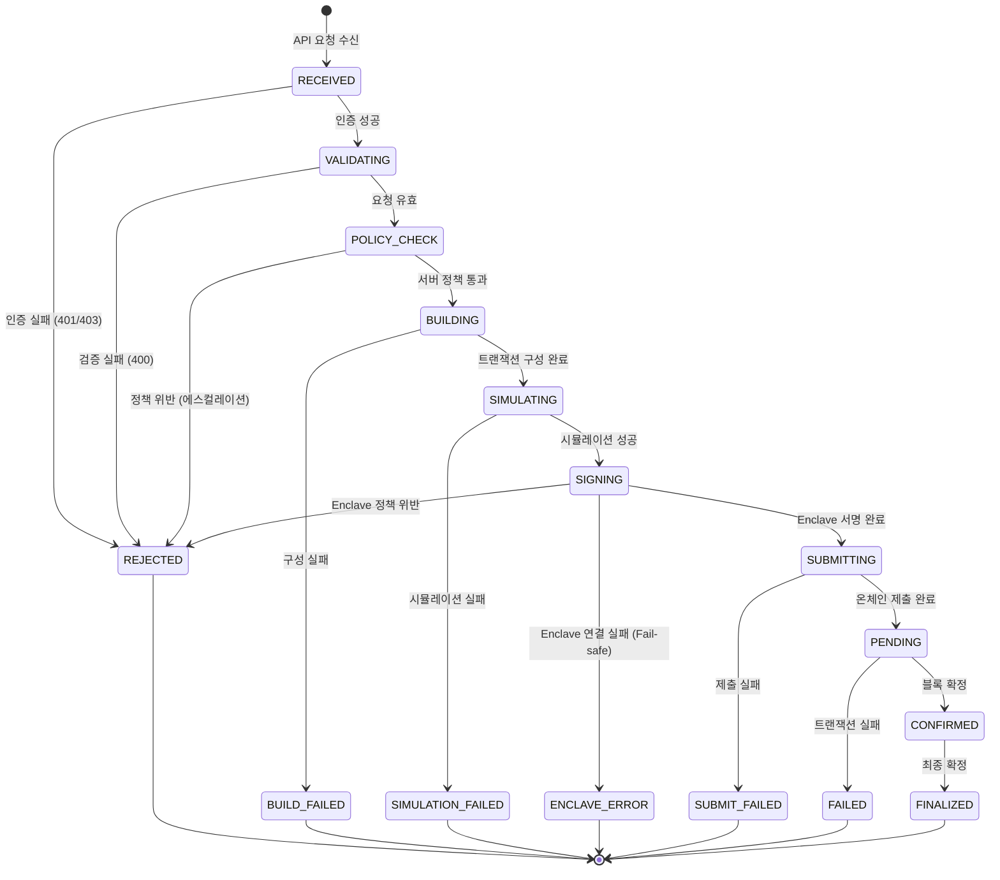
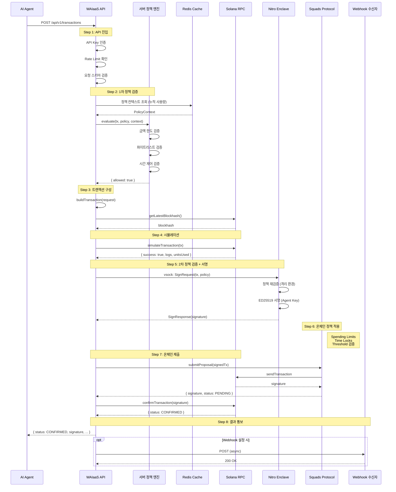
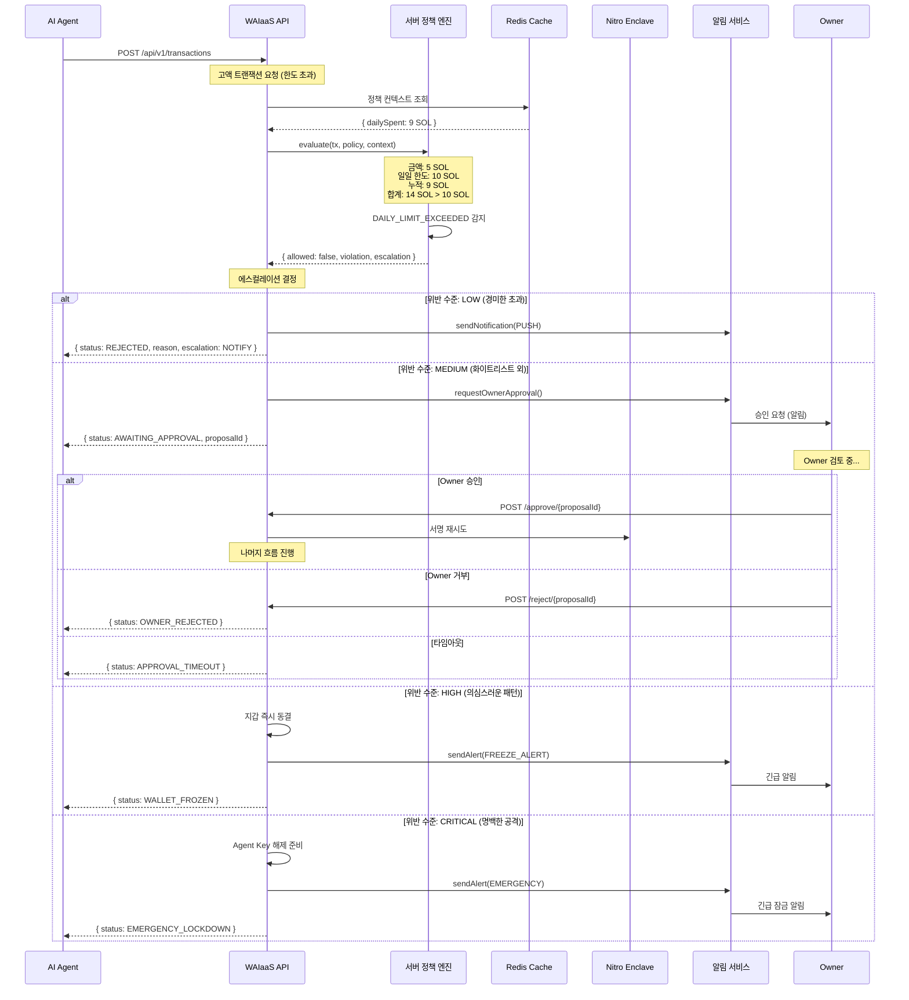
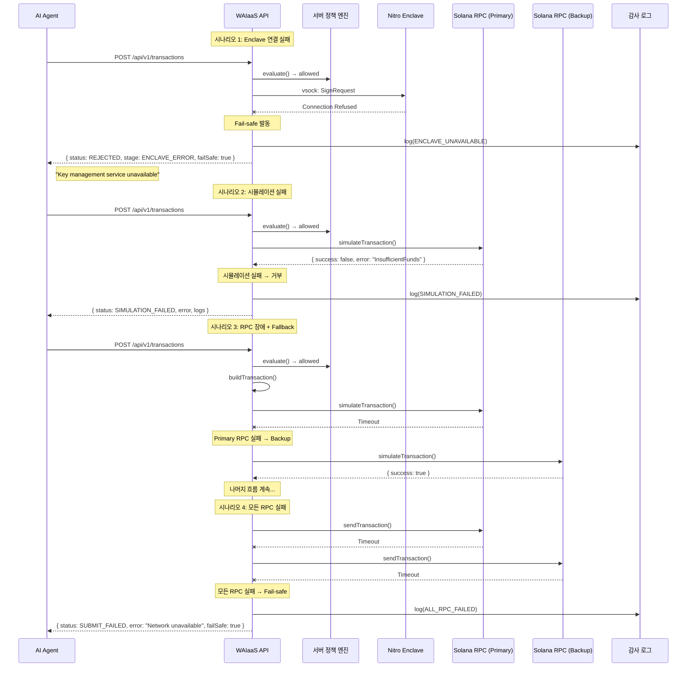
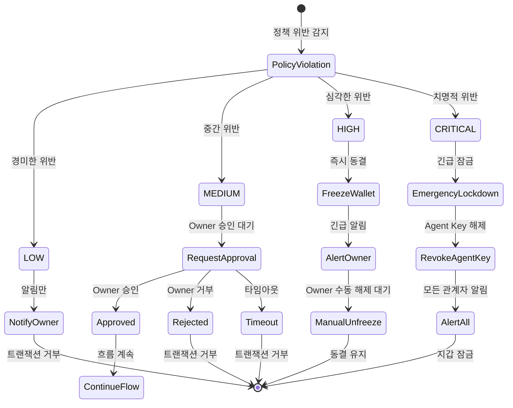
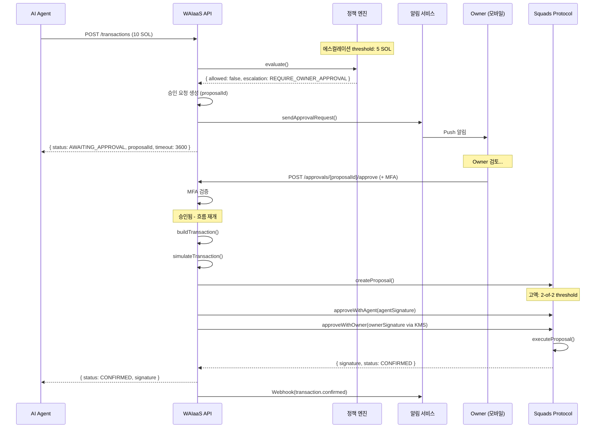
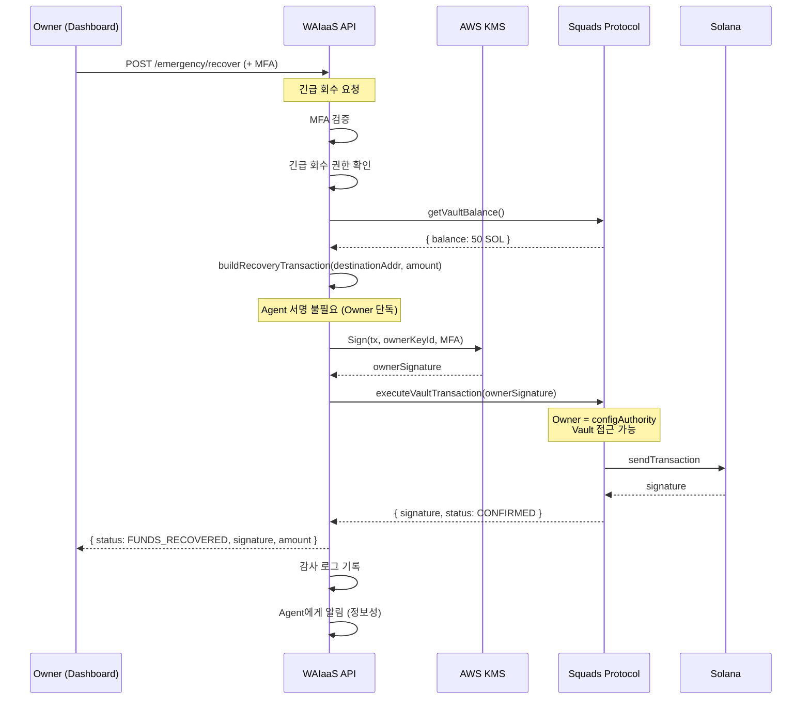
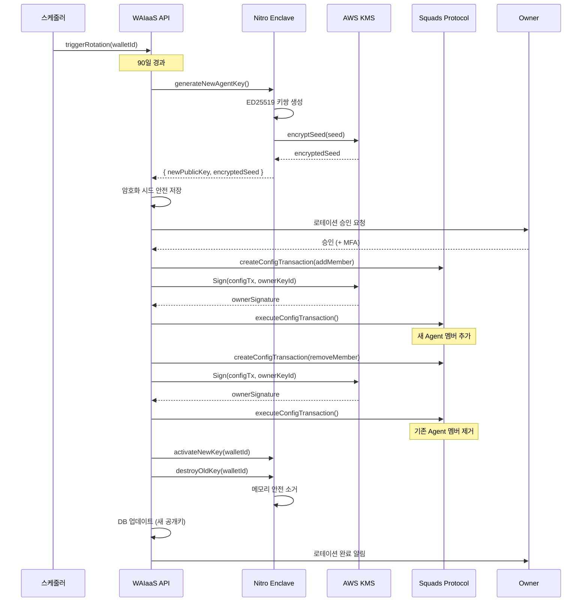
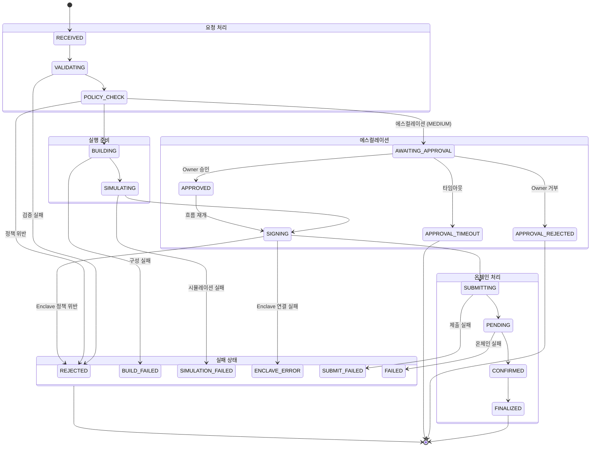
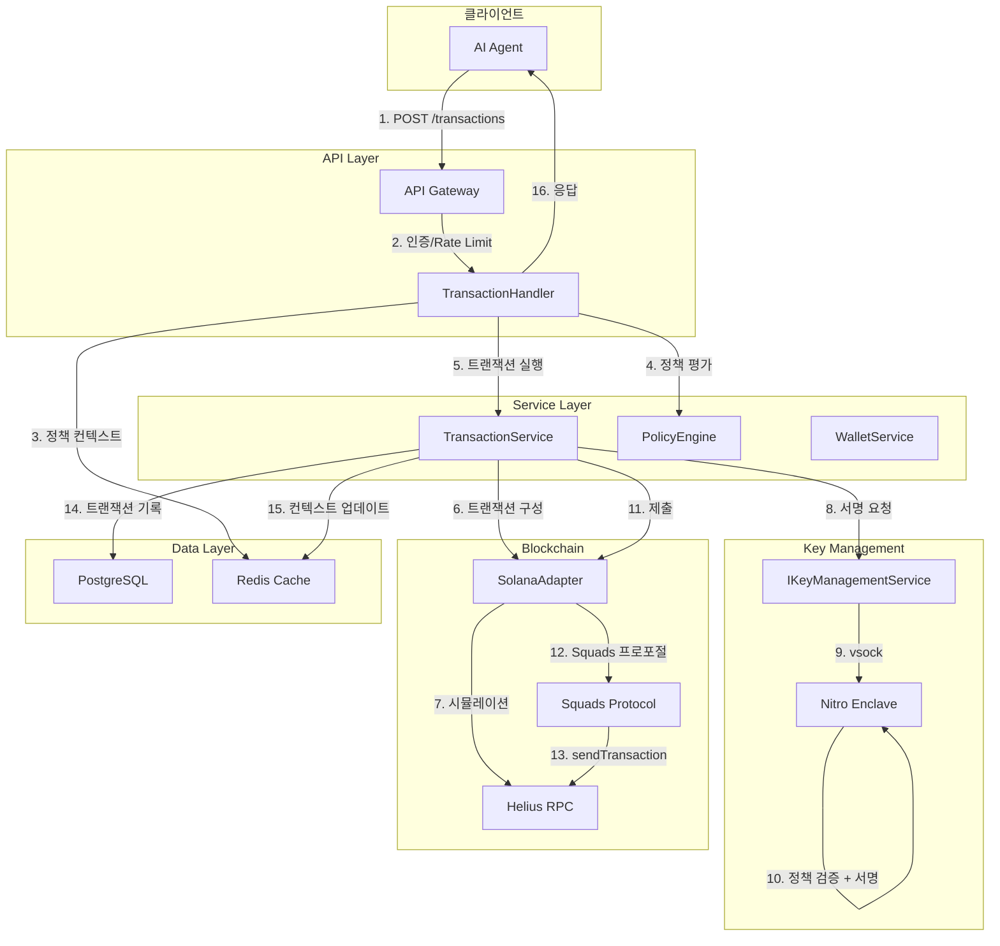

# 트랜잭션 데이터 흐름 다이어그램 (ARCH-03)

**문서 ID:** ARCH-03
**작성일:** 2026-02-04
**상태:** SUPERSEDED by [32-transaction-pipeline-api.md](./32-transaction-pipeline-api.md)
**참조:** ARCH-01, ARCH-02, 03-CONTEXT.md, 03-RESEARCH.md

---

> **SUPERSEDED**
>
> 이 문서의 트랜잭션 흐름(8단계, Enclave + Squads 기반)은 v0.2에서 **6단계 파이프라인**으로 대체되었습니다.
>
> **구현 시 참조:** [32-transaction-pipeline-api.md](./32-transaction-pipeline-api.md) (TX-PIPE)
>
> **변경 사항:**
> - 8단계 -> 6단계 (BUILD, SIMULATE, SIGN, SUBMIT, CONFIRM, COMPLETE)
> - Nitro Enclave 정책 검증 제거 -> DatabasePolicyEngine으로 대체
> - Squads 온체인 정책 제거 -> 로컬 4-tier 정책 (INSTANT/NOTIFY/DELAY/APPROVAL)
> - 3중 정책 검증 -> 서버 단일 정책 검증

---

## 1. Executive Summary

### 1.1 흐름 개요

트랜잭션 데이터 흐름은 AI 에이전트의 요청부터 온체인 확정까지 **8단계**로 구성된다. 핵심은 **두 단계 정책 검증**(서버 + Enclave)과 **Fail-safe 원칙**(장애 시 거부)을 통해 보안을 보장하면서도 자율적 운영을 가능하게 하는 것이다.

```
┌─────────────────────────────────────────────────────────────────────┐
│                    트랜잭션 흐름 개요                                  │
├─────────────────────────────────────────────────────────────────────┤
│                                                                      │
│  요청 수신 → 1차 검증 → 트랜잭션 구성 → 시뮬레이션 →                  │
│    (API)    (서버)      (build)        (simulate)                    │
│                                                                      │
│  → 2차 검증 + 서명 → 온체인 제출 → 결과 확정 → 알림                  │
│      (Enclave)        (submit)     (confirm)   (Webhook)             │
│                                                                      │
└─────────────────────────────────────────────────────────────────────┘
```

### 1.2 핵심 원칙

| 원칙 | 설명 | 구현 위치 |
|------|------|----------|
| **두 단계 정책 검증** | 서버 레벨 + Enclave 내부 이중 검증 | Step 2, Step 5 |
| **Fail-safe 동작** | 장애 시 모든 트랜잭션 거부 | 전 과정 |
| **재시도 없음** | 실패 시 즉시 에러 반환, 호출자 결정 | Step 7 |
| **동기 + Webhook** | 즉시 응답과 비동기 알림 모두 지원 | Step 8 |
| **단계별 에스컬레이션** | 위반 수준에 따른 차등 대응 | Step 2, Step 5 |

### 1.3 정책 검증 레이어

```
┌─────────────────────────────────────────────────────────────────────┐
│                    3중 정책 검증 레이어                               │
├─────────────────────────────────────────────────────────────────────┤
│                                                                      │
│   Layer 1: 서버 정책 엔진 (API 진입 시)                              │
│   ─────────────────────────────────────                              │
│   - 금액 한도, 화이트리스트, 시간 제어 검증                          │
│   - 빠른 거부로 불필요한 처리 방지                                   │
│   - 침해 시: 우회 가능 → Layer 2 필요                               │
│                                                                      │
│   Layer 2: Enclave 정책 엔진 (서명 전)                               │
│   ─────────────────────────────────────                              │
│   - 서버와 동일한 정책 재검증                                        │
│   - 격리된 환경에서 실행 (root도 접근 불가)                         │
│   - 침해 방어: 서버 침해 시에도 정책 강제                            │
│                                                                      │
│   Layer 3: Squads 온체인 정책 (제출 시)                              │
│   ─────────────────────────────────────                              │
│   - Spending Limits, Time Locks 온체인 강제                          │
│   - 불변: 스마트 컨트랙트 레벨 보장                                  │
│   - 최종 방어선: 모든 오프체인 보안 실패 시에도 동작                 │
│                                                                      │
└─────────────────────────────────────────────────────────────────────┘
```

---

## 2. 트랜잭션 흐름 개요

### 2.1 정상 흐름 단계

| 단계 | 이름 | 소요 시간 | 실패 시 동작 |
|------|------|----------|-------------|
| **Step 1** | API 진입 및 인증 | ~10ms | 401/403 반환 |
| **Step 2** | 서버 정책 평가 (1차) | ~5ms | REJECTED + 에스컬레이션 |
| **Step 3** | 트랜잭션 구성 | ~20ms | BUILD_FAILED 반환 |
| **Step 4** | 시뮬레이션 | ~50ms | SIMULATION_FAILED 반환 |
| **Step 5** | Enclave 검증 + 서명 (2차) | ~30ms | REJECTED + 에스컬레이션 |
| **Step 6** | Squads 온체인 정책 | - | 온체인 거부 |
| **Step 7** | 블록체인 제출 | ~400ms | SUBMIT_FAILED 반환 |
| **Step 8** | 결과 통보 | ~10ms | Webhook 재시도 (3회) |

**총 예상 소요 시간:** 약 525ms (정상 흐름)

### 2.2 상태 전이 다이어그램



---

## 3. 상세 흐름 (시퀀스 다이어그램)

### 3.1 정상 흐름 시퀀스



### 3.2 정책 위반 시 시퀀스



### 3.3 Fail-safe 동작 시퀀스



---

## 4. 정책 검증 상세

### 4.1 서버 정책 엔진 검증 항목

서버 레벨 정책 엔진은 API 진입 시점에 1차 검증을 수행한다.

| 검증 항목 | 코드 | 심각도 | 설명 |
|----------|------|--------|------|
| **트랜잭션당 금액 한도** | `AMOUNT_EXCEEDS_LIMIT` | MEDIUM | 단일 트랜잭션 최대 금액 초과 |
| **일일 누적 한도** | `DAILY_LIMIT_EXCEEDED` | MEDIUM | 24시간 누적 금액 초과 |
| **주간 누적 한도** | `WEEKLY_LIMIT_EXCEEDED` | MEDIUM | 7일 누적 금액 초과 |
| **월간 누적 한도** | `MONTHLY_LIMIT_EXCEEDED` | MEDIUM | 30일 누적 금액 초과 |
| **수신자 화이트리스트** | `RECIPIENT_NOT_WHITELISTED` | HIGH | 허용되지 않은 수신자 주소 |
| **프로그램 화이트리스트** | `PROGRAM_NOT_WHITELISTED` | HIGH | 허용되지 않은 Solana 프로그램 |
| **토큰 화이트리스트** | `TOKEN_NOT_WHITELISTED` | MEDIUM | 허용되지 않은 SPL 토큰 |
| **허용 시간대** | `OUTSIDE_ALLOWED_HOURS` | LOW | 설정된 UTC 시간대 외 요청 |
| **쿨다운** | `COOLDOWN_ACTIVE` | LOW | 이전 트랜잭션 후 최소 대기 시간 미충족 |
| **연속 실패** | `TOO_MANY_FAILURES` | HIGH | 짧은 시간 내 연속 실패 감지 |

### 4.2 Enclave 내부 정책 검증 항목

Enclave는 서명 전에 **동일한 정책을 격리된 환경에서 재검증**한다.

```rust
// enclave/src/policy.rs

pub struct EnclavePolicy {
    pub limits: PolicyLimits,
    pub whitelist: PolicyWhitelist,
    pub time_controls: Option<TimeControls>,
}

pub struct PolicyLimits {
    pub per_transaction: u64,   // lamports
    pub daily_total: u64,
    pub weekly_total: u64,
    pub monthly_total: u64,
}

pub struct PolicyWhitelist {
    pub addresses: Vec<[u8; 32]>,   // PublicKey bytes
    pub programs: Vec<[u8; 32]>,
    pub token_mints: Vec<[u8; 32]>,
}

impl EnclavePolicy {
    pub fn validate(&self, tx: &Transaction, context: &PolicyContext) -> PolicyResult {
        // 1. 금액 검증
        let amount = extract_transfer_amount(tx)?;
        if amount > self.limits.per_transaction {
            return PolicyResult::violation("AMOUNT_EXCEEDS_LIMIT");
        }

        if context.daily_spent + amount > self.limits.daily_total {
            return PolicyResult::violation("DAILY_LIMIT_EXCEEDED");
        }

        // 2. 수신자 검증
        for recipient in extract_recipients(tx) {
            if !self.whitelist.addresses.contains(&recipient) {
                return PolicyResult::violation("RECIPIENT_NOT_WHITELISTED");
            }
        }

        // 3. 프로그램 검증
        for program in tx.message().static_account_keys() {
            // System Program, Token Program 등 기본 프로그램은 허용
            if is_system_program(program) { continue; }

            if !self.whitelist.programs.contains(&program.to_bytes()) {
                return PolicyResult::violation("PROGRAM_NOT_WHITELISTED");
            }
        }

        // 4. 시간 제어 검증 (선택적)
        if let Some(time_ctrl) = &self.time_controls {
            let hour = get_current_utc_hour();
            if hour < time_ctrl.allowed_start || hour > time_ctrl.allowed_end {
                return PolicyResult::violation("OUTSIDE_ALLOWED_HOURS");
            }
        }

        PolicyResult::allowed()
    }
}
```

### 4.3 Squads 온체인 정책

Squads v4는 온체인에서 다음 정책을 강제한다.

| 정책 | 설명 | 구현 |
|------|------|------|
| **Spending Limits** | 특정 기간 내 최대 지출 한도 | `SpendingLimit` 계정 |
| **Time Locks** | 트랜잭션 실행 전 대기 시간 | `timeLock` 필드 |
| **Threshold** | 필요한 서명자 수 | 1-of-2 또는 2-of-2 |
| **멤버 권한** | 멤버별 차등 권한 | `Permissions` |

```typescript
// Squads v4 Spending Limit 온체인 검증
interface SpendingLimitOnchain {
  mint: PublicKey;           // SOL 또는 SPL 토큰
  amount: bigint;            // 한도 금액
  period: bigint;            // 슬롯 단위 주기
  remainingAmount: bigint;   // 현재 주기 내 남은 금액
  lastReset: bigint;         // 마지막 리셋 슬롯
  members: PublicKey[];      // 적용 대상 멤버
  destinations: PublicKey[]; // 허용 목적지 (비어있으면 모두 허용)
}
```

### 4.4 왜 이중 검증이 필요한가

```
┌─────────────────────────────────────────────────────────────────────┐
│                    서버 침해 시나리오                                 │
├─────────────────────────────────────────────────────────────────────┤
│                                                                      │
│   공격자                                                             │
│      │                                                               │
│      ▼                                                               │
│   ┌──────────────────┐                                               │
│   │   WAIaaS Server  │ ◄── 침해됨                                   │
│   │                  │                                               │
│   │  정책 엔진 우회  │                                               │
│   │  ────────────   │                                               │
│   │  if (true) {    │ ◄── 조작된 코드                               │
│   │    return ok;   │                                               │
│   │  }              │                                               │
│   └────────┬────────┘                                               │
│            │                                                         │
│            │ 악성 트랜잭션                                           │
│            ▼                                                         │
│   ┌──────────────────┐                                               │
│   │  Nitro Enclave   │ ◄── 격리된 환경 (침해 불가)                  │
│   │                  │                                               │
│   │  정책 재검증     │                                               │
│   │  ────────────   │                                               │
│   │  if (amount >   │                                               │
│   │    limit) {     │ ◄── 원본 정책 로직                            │
│   │    REJECT!      │                                               │
│   │  }              │                                               │
│   └────────┬────────┘                                               │
│            │                                                         │
│            ▼                                                         │
│        거부됨 ✗                                                      │
│                                                                      │
│   결과: 서버 침해에도 Enclave에서 정책 강제                          │
│                                                                      │
└─────────────────────────────────────────────────────────────────────┘
```

**핵심:** 서버만 침해된 경우, Enclave의 정책 검증이 최종 방어선 역할을 한다. 공격자가 Enclave까지 침해하려면 물리적 접근이 필요하며, 이는 클라우드 환경에서 사실상 불가능하다.

---

## 5. Fail-Safe 동작 모드

### 5.1 장애 시나리오별 대응

| 장애 시나리오 | 감지 방법 | Fail-Safe 동작 | 복구 조건 |
|--------------|----------|---------------|----------|
| **Enclave 연결 실패** | vsock timeout/refused | 모든 트랜잭션 거부 | Enclave 재시작 후 healthCheck 성공 |
| **시뮬레이션 실패** | RPC 에러 응답 | 해당 트랜잭션 거부 | 호출자가 수정 후 재시도 |
| **Primary RPC 장애** | Timeout 3회 | Backup RPC로 전환 | Primary 복구 시 자동 전환 |
| **모든 RPC 장애** | 모든 RPC timeout | 트랜잭션 거부 | 최소 1개 RPC 복구 |
| **DB 연결 실패** | Connection error | 트랜잭션 거부 | DB 연결 복구 |
| **Redis 장애** | Connection error | 정책 컨텍스트 DB fallback | Redis 복구 시 자동 전환 |

### 5.2 Enclave 연결 실패 시 동작

```typescript
// Fail-safe: Enclave 연결 실패 시 모든 트랜잭션 거부
async function signWithAgentKey(
  walletId: string,
  transaction: Transaction,
  policy: AgentPolicy
): Promise<SignResult> {
  // Enclave 상태 확인
  const enclaveHealthy = await this.enclaveClient.healthCheck();

  if (!enclaveHealthy) {
    // Fail-safe: 즉시 거부
    await this.auditLogger.log({
      event: 'ENCLAVE_UNAVAILABLE',
      walletId,
      action: 'TRANSACTION_REJECTED',
      failSafe: true
    });

    throw new EnclaveUnavailableError(
      'Key management service unavailable. Transaction rejected for safety.'
    );
  }

  try {
    // Enclave로 서명 요청 (timeout: 5초)
    const response = await Promise.race([
      this.enclaveClient.signTransaction(walletId, transaction, policy),
      new Promise((_, reject) =>
        setTimeout(() => reject(new TimeoutError()), 5000)
      )
    ]);

    return response;
  } catch (error) {
    if (error instanceof TimeoutError || error instanceof ConnectionError) {
      // Fail-safe: 연결 문제 시 거부
      await this.auditLogger.log({
        event: 'ENCLAVE_COMMUNICATION_FAILED',
        walletId,
        error: error.message,
        action: 'TRANSACTION_REJECTED',
        failSafe: true
      });

      throw new EnclaveUnavailableError(
        'Key management service communication failed. Transaction rejected for safety.'
      );
    }
    throw error;
  }
}
```

### 5.3 네트워크 장애 시 다중 RPC Fallback

```typescript
// 다중 RPC fallback 구성
interface RPCConfig {
  providers: {
    primary: string;     // Helius
    secondary: string;   // QuickNode
    tertiary: string;    // Triton
  };
  timeoutMs: number;
  maxRetries: number;
}

class SolanaRPCClient {
  private currentProvider: 'primary' | 'secondary' | 'tertiary' = 'primary';

  async sendTransaction(signedTx: Buffer): Promise<string> {
    const providers = ['primary', 'secondary', 'tertiary'] as const;

    for (const provider of providers) {
      const url = this.config.providers[provider];

      try {
        const connection = new Connection(url);
        const signature = await connection.sendRawTransaction(signedTx, {
          skipPreflight: false,  // preflight 검증 활성화
          maxRetries: 0          // RPC 레벨 재시도 없음 (우리가 관리)
        });

        // 성공 시 현재 provider 기록
        this.currentProvider = provider;
        return signature;
      } catch (error) {
        await this.auditLogger.log({
          event: 'RPC_FAILED',
          provider,
          error: error.message
        });

        // 다음 provider로 시도
        continue;
      }
    }

    // 모든 provider 실패 - Fail-safe
    throw new AllRPCFailedError(
      'All RPC providers unavailable. Transaction not submitted.'
    );
  }
}
```

### 5.4 재시도 정책: 없음 (호출자 결정)

```typescript
// WAIaaS는 자동 재시도를 수행하지 않음
// 이유: AI 에이전트 버그로 인한 반복 손실 방지

interface TransactionResult {
  status: TransactionStatus;
  signature?: string;
  error?: TransactionError;

  // 재시도 관련 정보 제공 (호출자가 결정)
  retryable: boolean;
  retryAfterMs?: number;

  // 원인 분류
  failureCategory:
    | 'POLICY_VIOLATION'    // 재시도 무의미 (정책 변경 필요)
    | 'SIMULATION_FAILED'   // 재시도 가능 (잔액 부족 등 해결 후)
    | 'NETWORK_ERROR'       // 재시도 가능 (일시적 장애)
    | 'ENCLAVE_ERROR'       // 재시도 가능 (Enclave 복구 대기)
    | 'PERMANENT_FAILURE';  // 재시도 불가 (블록체인 거부)
}

// 호출자(AI Agent)는 반환된 정보를 바탕으로 재시도 여부 결정
// 예시:
// if (result.retryable && result.failureCategory === 'NETWORK_ERROR') {
//   await delay(result.retryAfterMs);
//   return await retryTransaction(request);
// }
```

---

## 6. 에스컬레이션 흐름

### 6.1 위반 수준별 에스컬레이션 경로



### 6.2 에스컬레이션 수준 정의

| 수준 | 조건 예시 | 대응 | 알림 채널 | 복구 절차 |
|------|----------|------|----------|----------|
| **LOW** | 한도 10% 이내 초과, 허용 시간 직전/직후 | 알림만, 트랜잭션 거부 | Push | 다음 기간 대기 |
| **MEDIUM** | 화이트리스트 외 주소, 한도 50% 초과 | Owner 승인 대기 (1시간 타임아웃) | Push + Email | Owner 승인 또는 거부 |
| **HIGH** | 연속 3회 이상 위반, 이상 패턴 탐지 | 지갑 즉시 동결 + 알림 | Push + Email + SMS | Owner 수동 해제 |
| **CRITICAL** | 명백한 공격 시도, 비정상적 대량 요청 | Agent Key 해제 + 긴급 잠금 | 모든 채널 + PagerDuty | Owner 새 Agent Key 등록 |

### 6.3 에스컬레이션 코드

```typescript
// 에스컬레이션 결정 로직
function determineEscalation(violations: PolicyViolation[]): Escalation {
  const maxSeverity = getMaxSeverity(violations);

  switch (maxSeverity) {
    case 'low':
      return {
        type: 'NOTIFY_OWNER',
        channel: 'push',
        action: 'REJECT_TRANSACTION',
        message: formatViolationMessage(violations),
        timeout: null  // 즉시 거부
      };

    case 'medium':
      return {
        type: 'REQUIRE_OWNER_APPROVAL',
        channel: ['push', 'email'],
        action: 'AWAIT_APPROVAL',
        message: formatApprovalRequest(violations),
        timeout: 3600,  // 1시간
        onTimeout: 'REJECT'
      };

    case 'high':
      return {
        type: 'FREEZE_AND_ALERT',
        channel: ['push', 'email', 'sms'],
        action: 'FREEZE_WALLET',
        message: formatFreezeAlert(violations),
        requireManualUnfreeze: true,
        alertRecipients: ['owner', 'admin']
      };

    case 'critical':
      return {
        type: 'EMERGENCY_LOCKDOWN',
        channel: ['push', 'email', 'sms', 'pagerduty'],
        action: 'REVOKE_AGENT_KEY',
        message: formatEmergencyAlert(violations),
        revokeAgentKey: true,
        lockWallet: true,
        alertRecipients: ['owner', 'admin', 'security_team']
      };
  }
}

// 에스컬레이션 실행
async function executeEscalation(
  walletId: string,
  escalation: Escalation
): Promise<EscalationResult> {
  // 1. 즉시 조치
  switch (escalation.action) {
    case 'FREEZE_WALLET':
      await this.walletService.freeze(walletId);
      break;
    case 'REVOKE_AGENT_KEY':
      await this.keyManagement.revokeAgentKey(walletId);
      await this.blockchain.removeMember(walletId, agentPublicKey);
      break;
  }

  // 2. 알림 발송
  for (const channel of escalation.channel) {
    await this.notificationService.send(channel, {
      walletId,
      type: escalation.type,
      message: escalation.message
    });
  }

  // 3. 감사 로그
  await this.auditLogger.log({
    event: 'ESCALATION_EXECUTED',
    walletId,
    escalationType: escalation.type,
    action: escalation.action
  });

  // 4. Owner 승인 대기 (MEDIUM인 경우)
  if (escalation.type === 'REQUIRE_OWNER_APPROVAL') {
    return {
      status: 'AWAITING_APPROVAL',
      timeout: escalation.timeout,
      approvalId: await this.createApprovalRequest(walletId, escalation)
    };
  }

  return { status: 'ESCALATION_COMPLETE' };
}
```

---

## 7. 상태 전달 방식

### 7.1 동기 응답

모든 API 요청에 대해 즉시 응답을 반환한다.

```typescript
// POST /api/v1/transactions 응답 예시

// 성공 (즉시 확정)
{
  "status": "CONFIRMED",
  "signature": "5wHu1qL7...",
  "slot": 123456789,
  "confirmations": 1,
  "createdAt": "2026-02-04T14:30:00Z",
  "confirmedAt": "2026-02-04T14:30:00.4Z"
}

// 성공 (대기 중)
{
  "status": "PENDING",
  "signature": "5wHu1qL7...",
  "createdAt": "2026-02-04T14:30:00Z",
  "estimatedConfirmationTime": "2026-02-04T14:30:01Z"
}

// 거부 (정책 위반)
{
  "status": "REJECTED",
  "stage": "SERVER_POLICY",
  "violations": [
    {
      "code": "DAILY_LIMIT_EXCEEDED",
      "severity": "medium",
      "message": "일일 한도(10 SOL)를 초과했습니다. 현재 누적: 9 SOL, 요청: 5 SOL",
      "details": {
        "dailyLimit": 10000000000,
        "dailySpent": 9000000000,
        "requestedAmount": 5000000000
      }
    }
  ],
  "escalation": {
    "type": "REQUIRE_OWNER_APPROVAL",
    "approvalId": "apr_abc123",
    "timeout": 3600
  }
}

// Fail-safe 거부
{
  "status": "REJECTED",
  "stage": "ENCLAVE_ERROR",
  "error": "Key management service unavailable",
  "failSafe": true,
  "retryable": true,
  "retryAfterMs": 5000
}
```

### 7.2 Webhook 비동기 알림

```typescript
// Webhook 설정
interface WebhookConfig {
  url: string;
  secret: string;           // HMAC 서명용
  events: WebhookEvent[];   // 구독할 이벤트
  retryPolicy: {
    maxRetries: 3;
    backoffMs: [1000, 5000, 30000];
  };
}

type WebhookEvent =
  | 'transaction.confirmed'
  | 'transaction.failed'
  | 'transaction.rejected'
  | 'escalation.created'
  | 'escalation.resolved'
  | 'wallet.frozen'
  | 'wallet.unfrozen'
  | 'agent.rotated'
  | 'agent.revoked';

// Webhook 페이로드
interface WebhookPayload {
  id: string;               // 이벤트 고유 ID
  event: WebhookEvent;
  timestamp: string;        // ISO 8601
  walletId: string;
  data: Record<string, any>;
}

// Webhook 전송
async function sendWebhook(config: WebhookConfig, payload: WebhookPayload): Promise<void> {
  const signature = createHmacSignature(payload, config.secret);

  for (let attempt = 0; attempt < config.retryPolicy.maxRetries; attempt++) {
    try {
      const response = await fetch(config.url, {
        method: 'POST',
        headers: {
          'Content-Type': 'application/json',
          'X-WAIaaS-Signature': signature,
          'X-WAIaaS-Event': payload.event,
          'X-WAIaaS-Timestamp': payload.timestamp
        },
        body: JSON.stringify(payload),
        signal: AbortSignal.timeout(10000)  // 10초 타임아웃
      });

      if (response.ok) return;

      // 4xx 에러는 재시도하지 않음
      if (response.status >= 400 && response.status < 500) {
        throw new WebhookPermanentError(response.status);
      }
    } catch (error) {
      if (error instanceof WebhookPermanentError) throw error;

      // 재시도 대기
      if (attempt < config.retryPolicy.maxRetries - 1) {
        await delay(config.retryPolicy.backoffMs[attempt]);
      }
    }
  }

  // 모든 재시도 실패 시 DLQ(Dead Letter Queue)로
  await this.dlq.push({ config, payload, failedAt: new Date() });
}
```

### 7.3 상태 코드 정의

| 상태 | 설명 | 최종 상태 | 호출자 액션 |
|------|------|----------|------------|
| `RECEIVED` | 요청 수신됨 | No | 대기 |
| `VALIDATING` | 요청 검증 중 | No | 대기 |
| `POLICY_CHECK` | 정책 평가 중 | No | 대기 |
| `BUILDING` | 트랜잭션 구성 중 | No | 대기 |
| `SIMULATING` | 시뮬레이션 중 | No | 대기 |
| `SIGNING` | 서명 중 | No | 대기 |
| `PENDING` | 온체인 제출됨, 확정 대기 | No | 상태 폴링 |
| `SUBMITTED` | 제출 완료, 블록 포함 대기 | No | 상태 폴링 |
| `CONFIRMED` | 블록에 포함됨 | Yes | 완료 |
| `FINALIZED` | 최종 확정 (롤백 불가) | Yes | 완료 |
| `REJECTED` | 정책/검증에서 거부됨 | Yes | 원인 확인 후 수정 |
| `SIMULATION_FAILED` | 시뮬레이션 실패 | Yes | 트랜잭션 수정 |
| `BUILD_FAILED` | 트랜잭션 구성 실패 | Yes | 요청 수정 |
| `SUBMIT_FAILED` | 온체인 제출 실패 | Yes | 재시도 또는 포기 |
| `FAILED` | 온체인 실행 실패 | Yes | 원인 분석 |
| `AWAITING_APPROVAL` | Owner 승인 대기 | No | 승인 대기 |
| `APPROVAL_TIMEOUT` | 승인 타임아웃 | Yes | 재요청 |

---

## 8. 특수 트랜잭션 흐름

### 8.1 고액 트랜잭션 (Owner 승인 필요)

금액이 에스컬레이션 threshold를 초과하는 경우 Owner 승인이 필요하다.



### 8.2 긴급 회수 (Owner Key 직접 서명)

비상 상황에서 Owner가 직접 자금을 회수하는 흐름.



### 8.3 키 로테이션 트랜잭션

Agent Key 로테이션 시 온체인 멤버 교체 흐름.



---

## 9. Mermaid 다이어그램 모음

### 9.1 정상 흐름 시퀀스 (섹션 3.1에서 포함됨)

### 9.2 정책 위반 시 시퀀스 (섹션 3.2에서 포함됨)

### 9.3 Fail-safe 동작 시퀀스 (섹션 3.3에서 포함됨)

### 9.4 에스컬레이션 상태 다이어그램 (섹션 6.1에서 포함됨)

### 9.5 트랜잭션 상태 머신



### 9.6 컴포넌트 간 데이터 흐름



---

## 10. 참조 문서

### 10.1 내부 문서

| 문서 | 내용 | 위치 |
|------|------|------|
| **ARCH-01** | Dual Key 아키텍처 상세 설계 | .planning/deliverables/08-dual-key-architecture.md |
| **ARCH-02** | 시스템 컴포넌트 다이어그램 | .planning/deliverables/09-system-components.md |
| **03-CONTEXT** | Phase 3 컨텍스트 | .planning/phases/03-system-architecture/03-CONTEXT.md |
| **03-RESEARCH** | 시스템 아키텍처 리서치 | .planning/phases/03-system-architecture/03-RESEARCH.md |

### 10.2 외부 참조

| 참조 | 내용 | 신뢰도 |
|------|------|--------|
| [Squads Protocol v4](https://github.com/Squads-Protocol/v4) | Spending Limits, Time Locks | HIGH |
| [AWS Nitro Enclaves](https://docs.aws.amazon.com/enclaves/latest/user/nitro-enclave.html) | TEE 격리 환경 | HIGH |
| [Solana Transaction Processing](https://docs.solana.com/developing/programming-model/transactions) | 트랜잭션 구조 | HIGH |
| [Helius RPC](https://docs.helius.dev/) | RPC 프로바이더 | HIGH |

---

*문서 ID: ARCH-03*
*작성일: 2026-02-04*
*Phase: 03-system-architecture*
*상태: 완료*
