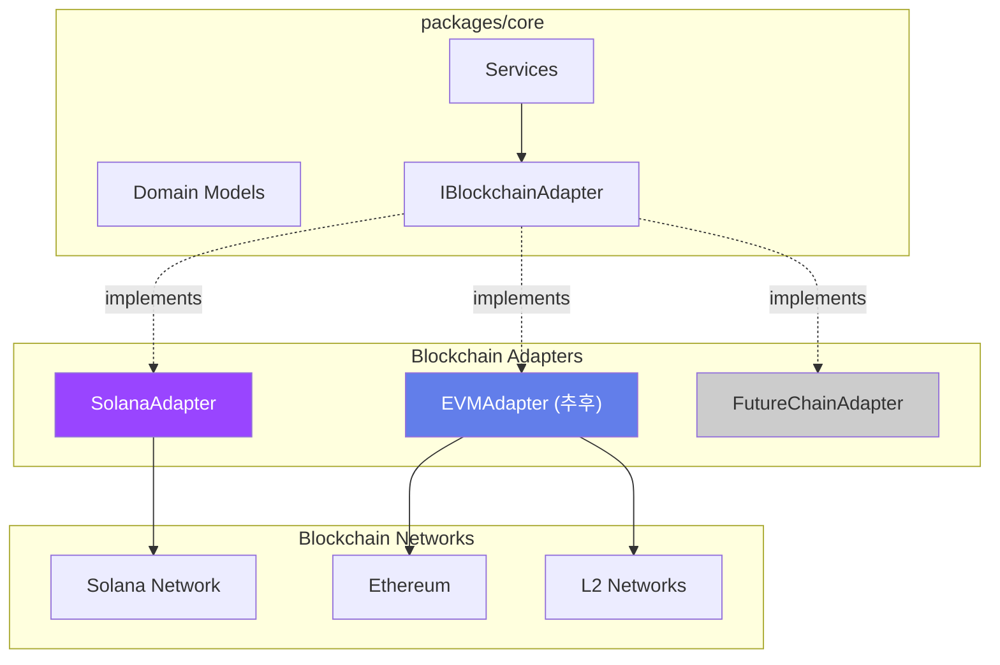
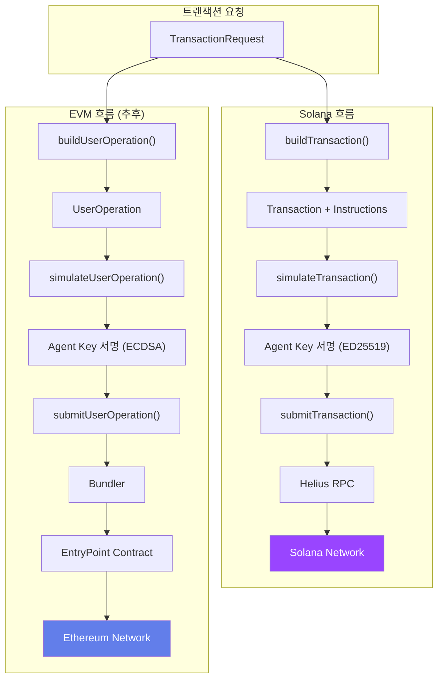

# 멀티체인 확장성 설계 (ARCH-05)

**문서 ID:** ARCH-05
**작성일:** 2026-02-04
**상태:** 완료
**참조:** ARCH-01, ARCH-02, 09-system-components.md, 03-RESEARCH.md

---

## 1. Executive Summary

본 문서는 WAIaaS (Wallet-as-a-Service for AI Agents)의 멀티체인 확장 전략을 정의한다. 초기에는 Solana에 집중하되, 공통 인터페이스 기반 어댑터 패턴으로 설계하여 향후 EVM (Ethereum, Polygon, Arbitrum 등) 체인으로의 확장을 용이하게 한다.

**핵심 전략:**
- Solana 우선 구현 (Phase 3 완전 구현)
- IBlockchainAdapter 인터페이스로 체인 상호작용 추상화
- EVM 확장 경로 정의 (인터페이스만, 추후 구현)
- 공통 도메인 모델로 체인 간 일관성 유지

**참고:** PROJECT.md의 "멀티체인 구현 - 설계 시 확장성만 고려, 초기 구현은 Solana 집중"

---

## 2. 확장 전략 개요

### 2.1 설계 원칙

| 원칙 | 설명 | 적용 |
|------|------|------|
| **인터페이스 우선** | 구현 전 인터페이스 정의 | IBlockchainAdapter |
| **어댑터 패턴** | 체인별 구현 격리 | SolanaAdapter, EVMAdapter |
| **공통 도메인** | 체인 무관 모델 | Wallet, Transaction, Policy |
| **점진적 확장** | 단계별 구현 | Solana 완전 → EVM 인터페이스 → EVM 구현 |

### 2.2 아키텍처 개요



### 2.3 확장 로드맵

| 단계 | 범위 | 체인 | 구현 내용 | 시점 |
|------|------|------|----------|------|
| **Phase 3** | MVP | Solana | SolanaAdapter 완전 구현 | 현재 |
| **Phase 3** | 인터페이스 | EVM | IBlockchainAdapter EVM 확장 정의 | 현재 |
| **추후** | 확장 | Ethereum | EVMAdapter 구현 (ERC-4337/Safe) | TBD |
| **추후** | 확장 | L2 | Polygon, Arbitrum, Optimism | TBD |

---

## 3. IBlockchainAdapter 인터페이스

### 3.1 핵심 인터페이스 정의

```typescript
// packages/core/src/interfaces/IBlockchainAdapter.ts

import {
  Wallet,
  WalletConfig,
  WalletCreationResult
} from '../domain/wallet';
import {
  TransactionRequest,
  TransactionResult,
  SimulationResult
} from '../domain/transaction';
import { MemberPermissions } from '../domain/policy';

/**
 * 블록체인 어댑터 인터페이스
 *
 * 모든 체인별 어댑터는 이 인터페이스를 구현해야 한다.
 * 이를 통해 상위 서비스 레이어는 체인에 무관하게 동작할 수 있다.
 *
 * 구현체:
 * - SolanaAdapter: Squads Protocol v4 기반 (Phase 3)
 * - EVMAdapter: ERC-4337 또는 Safe 기반 (추후)
 */
export interface IBlockchainAdapter {
  // ═══════════════════════════════════════════════════════════
  // 체인 식별
  // ═══════════════════════════════════════════════════════════

  /**
   * 체인 식별자 반환
   * @returns 체인 ID (예: 'solana', 'ethereum', 'polygon')
   */
  getChainId(): string;

  /**
   * 체인 네트워크 반환
   * @returns 네트워크 (예: 'mainnet-beta', 'devnet', 'goerli')
   */
  getNetwork(): string;

  // ═══════════════════════════════════════════════════════════
  // 지갑 관리
  // ═══════════════════════════════════════════════════════════

  /**
   * 스마트 월렛 생성
   *
   * Solana: Squads Protocol v4 멀티시그 생성
   * EVM: ERC-4337 Account Abstraction 또는 Safe 생성
   *
   * @param ownerKey - Owner 공개키 (체인별 형식)
   * @param agentKey - Agent 공개키 (체인별 형식)
   * @param config - 지갑 설정 (임계값, 정책 등)
   * @returns 생성된 지갑 정보
   */
  createSmartWallet(
    ownerKey: string,
    agentKey: string,
    config: WalletConfig
  ): Promise<WalletCreationResult>;

  /**
   * 지갑에 멤버 추가
   *
   * Agent Key 로테이션, 복구 키 추가 등에 사용
   *
   * @param walletAddress - 지갑 주소
   * @param memberKey - 추가할 멤버 공개키
   * @param permissions - 멤버 권한
   */
  addMember(
    walletAddress: string,
    memberKey: string,
    permissions: MemberPermissions
  ): Promise<void>;

  /**
   * 지갑에서 멤버 제거
   *
   * Agent Key 폐기, 보안 사고 대응 등에 사용
   *
   * @param walletAddress - 지갑 주소
   * @param memberKey - 제거할 멤버 공개키
   */
  removeMember(
    walletAddress: string,
    memberKey: string
  ): Promise<void>;

  /**
   * 지갑 설정 변경
   *
   * 임계값, 시간 잠금 등 변경
   *
   * @param walletAddress - 지갑 주소
   * @param config - 새 설정
   */
  updateWalletConfig(
    walletAddress: string,
    config: Partial<WalletConfig>
  ): Promise<void>;

  // ═══════════════════════════════════════════════════════════
  // 트랜잭션 처리
  // ═══════════════════════════════════════════════════════════

  /**
   * 트랜잭션 구성
   *
   * 요청을 체인별 트랜잭션 형식으로 변환
   *
   * @param request - 체인 무관 트랜잭션 요청
   * @returns 미서명 트랜잭션 (체인별 형식)
   */
  buildTransaction(
    request: TransactionRequest
  ): Promise<UnsignedTransaction>;

  /**
   * 트랜잭션 시뮬레이션
   *
   * 실행 전 결과 예측, 가스/수수료 추정
   *
   * @param transaction - 시뮬레이션할 트랜잭션
   * @returns 시뮬레이션 결과
   */
  simulateTransaction(
    transaction: UnsignedTransaction
  ): Promise<SimulationResult>;

  /**
   * 서명된 트랜잭션 제출
   *
   * @param signedTransaction - 서명된 트랜잭션
   * @returns 트랜잭션 결과 (서명, 상태)
   */
  submitTransaction(
    signedTransaction: SignedTransaction
  ): Promise<TransactionResult>;

  /**
   * 트랜잭션 상태 조회
   *
   * @param signature - 트랜잭션 서명/해시
   * @returns 현재 상태
   */
  getTransactionStatus(
    signature: string
  ): Promise<TransactionStatus>;

  // ═══════════════════════════════════════════════════════════
  // 잔액 및 자산 조회
  // ═══════════════════════════════════════════════════════════

  /**
   * 잔액 조회
   *
   * @param address - 조회할 주소
   * @param asset - 자산 식별자 (없으면 네이티브 토큰)
   * @returns 잔액 정보
   */
  getBalance(
    address: string,
    asset?: AssetIdentifier
  ): Promise<Balance>;

  /**
   * 지갑 자산 목록 조회
   *
   * @param walletAddress - 지갑 주소
   * @returns 보유 자산 목록
   */
  getAssets(
    walletAddress: string
  ): Promise<Asset[]>;

  // ═══════════════════════════════════════════════════════════
  // 상태 확인
  // ═══════════════════════════════════════════════════════════

  /**
   * 어댑터 연결 상태 확인
   *
   * @returns 연결 정상 여부
   */
  healthCheck(): Promise<boolean>;

  /**
   * 현재 블록/슬롯 높이 반환
   *
   * @returns 블록 높이
   */
  getBlockHeight(): Promise<bigint>;
}

// ═══════════════════════════════════════════════════════════
// 공통 타입 정의
// ═══════════════════════════════════════════════════════════

/**
 * 미서명 트랜잭션 (체인별 확장)
 */
export interface UnsignedTransaction {
  chainId: string;
  rawTransaction: Uint8Array;
  metadata: TransactionMetadata;
}

/**
 * 서명된 트랜잭션 (체인별 확장)
 */
export interface SignedTransaction {
  chainId: string;
  rawTransaction: Uint8Array;
  signatures: Signature[];
}

/**
 * 트랜잭션 메타데이터
 */
export interface TransactionMetadata {
  estimatedFee: bigint;
  feeToken: string;
  expiresAt?: Date;
  requiredSigners: string[];
}

/**
 * 서명 정보
 */
export interface Signature {
  publicKey: string;
  signature: Uint8Array;
}

/**
 * 트랜잭션 상태
 */
export type TransactionStatus =
  | 'pending'     // 제출됨, 확인 대기
  | 'confirmed'   // 확인됨 (최소 확인 수)
  | 'finalized'   // 최종 확정 (되돌릴 수 없음)
  | 'failed'      // 실패
  | 'expired';    // 만료됨

/**
 * 자산 식별자
 */
export interface AssetIdentifier {
  type: 'native' | 'token' | 'nft';
  address?: string;  // 토큰 주소 (네이티브면 없음)
  tokenId?: string;  // NFT ID (NFT면 필수)
}

/**
 * 잔액 정보
 */
export interface Balance {
  amount: bigint;
  decimals: number;
  uiAmount: number;
  symbol?: string;
}

/**
 * 자산 정보
 */
export interface Asset {
  identifier: AssetIdentifier;
  balance: Balance;
  name?: string;
  symbol?: string;
  logoUri?: string;
}
```

### 3.2 인터페이스 설계 원칙

1. **체인 중립적 요청/응답**: 상위 레이어는 체인 무관하게 동작
2. **체인별 세부사항 캡슐화**: 가스비, 슬롯/블록 등 체인 특성 숨김
3. **확장 가능한 타입**: 체인별 메타데이터 확장 허용
4. **일관된 에러 처리**: 체인 무관한 에러 타입 정의

---

## 4. Solana 어댑터 상세

### 4.1 구현 개요

| 항목 | 내용 |
|------|------|
| **스마트 월렛** | Squads Protocol v4 |
| **서명 알고리즘** | ED25519 |
| **KMS 키 스펙** | ECC_NIST_EDWARDS25519 |
| **RPC 프로바이더** | Helius (DAS API 지원) |
| **SDK** | @sqds/multisig, @solana/web3.js |
| **구현 범위** | Phase 3 완전 구현 |

### 4.2 SolanaAdapter 구현

```typescript
// packages/core/src/adapters/SolanaAdapter.ts

import { Connection, PublicKey, Transaction, VersionedTransaction } from '@solana/web3.js';
import * as multisig from '@sqds/multisig';
import { IBlockchainAdapter, WalletCreationResult, SimulationResult } from '../interfaces/IBlockchainAdapter';

export class SolanaAdapter implements IBlockchainAdapter {
  private connection: Connection;
  private programId: PublicKey;

  constructor(
    rpcUrl: string,
    private network: 'mainnet-beta' | 'devnet' | 'testnet' = 'devnet'
  ) {
    this.connection = new Connection(rpcUrl, 'confirmed');
    this.programId = new PublicKey('SQDS4ep65T869zMMBKyuUq6aD6EgTu8psMjkvj52pCf');
  }

  // ─────────────────────────────────────────
  // 체인 식별
  // ─────────────────────────────────────────

  getChainId(): string {
    return 'solana';
  }

  getNetwork(): string {
    return this.network;
  }

  // ─────────────────────────────────────────
  // 지갑 관리
  // ─────────────────────────────────────────

  async createSmartWallet(
    ownerKey: string,
    agentKey: string,
    config: WalletConfig
  ): Promise<WalletCreationResult> {
    const ownerPubkey = new PublicKey(ownerKey);
    const agentPubkey = new PublicKey(agentKey);
    const createKey = Keypair.generate();

    // Squads 멀티시그 PDA 계산
    const [multisigPda] = PublicKey.findProgramAddressSync(
      [Buffer.from('multisig'), createKey.publicKey.toBuffer()],
      this.programId
    );

    const [vaultPda] = PublicKey.findProgramAddressSync(
      [Buffer.from('vault'), multisigPda.toBuffer(), Buffer.from([0])],
      this.programId
    );

    // 멀티시그 생성 instruction
    const createIx = await multisig.instructions.multisigCreate({
      createKey: createKey.publicKey,
      creator: config.payerKey,
      multisigPda,
      configAuthority: ownerPubkey,
      timeLock: config.timeLock || 0,
      threshold: config.threshold || 1,
      members: [
        {
          key: ownerPubkey,
          permissions: multisig.types.Permissions.all()
        },
        {
          key: agentPubkey,
          permissions: multisig.types.Permissions.fromPermissions({
            initiate: true,
            vote: true,
            execute: true,
            settings: false,
            addMember: false,
            removeMember: false
          })
        }
      ],
      rentCollector: ownerPubkey
    });

    return {
      walletAddress: multisigPda.toBase58(),
      vaultAddress: vaultPda.toBase58(),
      createKey: createKey.publicKey.toBase58(),
      instructions: [createIx],
      additionalSigners: [createKey]
    };
  }

  async addMember(
    walletAddress: string,
    memberKey: string,
    permissions: MemberPermissions
  ): Promise<void> {
    const multisigPda = new PublicKey(walletAddress);
    const memberPubkey = new PublicKey(memberKey);

    const addMemberIx = await multisig.instructions.configTransactionCreate({
      multisigPda,
      actions: [{
        __kind: 'AddMember',
        newMember: {
          key: memberPubkey,
          permissions: this.toSquadsPermissions(permissions)
        }
      }],
      creator: memberPubkey  // 실제로는 configAuthority
    });

    // 트랜잭션 생성 및 제출은 상위 레이어에서 처리
  }

  async removeMember(
    walletAddress: string,
    memberKey: string
  ): Promise<void> {
    const multisigPda = new PublicKey(walletAddress);
    const memberPubkey = new PublicKey(memberKey);

    const removeMemberIx = await multisig.instructions.configTransactionCreate({
      multisigPda,
      actions: [{
        __kind: 'RemoveMember',
        oldMember: memberPubkey
      }],
      creator: memberPubkey
    });
  }

  // ─────────────────────────────────────────
  // 트랜잭션 처리
  // ─────────────────────────────────────────

  async buildTransaction(
    request: TransactionRequest
  ): Promise<UnsignedTransaction> {
    const tx = new Transaction();

    // 요청 타입에 따른 instruction 생성
    switch (request.type) {
      case 'transfer':
        tx.add(this.buildTransferInstruction(request));
        break;
      case 'token_transfer':
        tx.add(this.buildTokenTransferInstruction(request));
        break;
      case 'program_call':
        tx.add(...request.instructions);
        break;
    }

    // 최신 블록해시 설정
    const { blockhash, lastValidBlockHeight } =
      await this.connection.getLatestBlockhash();
    tx.recentBlockhash = blockhash;
    tx.feePayer = new PublicKey(request.feePayer);

    return {
      chainId: 'solana',
      rawTransaction: tx.serialize({ requireAllSignatures: false }),
      metadata: {
        estimatedFee: BigInt(5000),  // Solana 기본 수수료
        feeToken: 'SOL',
        expiresAt: new Date(Date.now() + 60000),  // ~60초
        requiredSigners: request.requiredSigners
      }
    };
  }

  async simulateTransaction(
    transaction: UnsignedTransaction
  ): Promise<SimulationResult> {
    const tx = Transaction.from(transaction.rawTransaction);

    const simulation = await this.connection.simulateTransaction(tx);

    return {
      success: simulation.value.err === null,
      logs: simulation.value.logs || [],
      computeUnitsConsumed: simulation.value.unitsConsumed || 0,
      error: simulation.value.err ? JSON.stringify(simulation.value.err) : undefined
    };
  }

  async submitTransaction(
    signedTransaction: SignedTransaction
  ): Promise<TransactionResult> {
    const signature = await this.connection.sendRawTransaction(
      signedTransaction.rawTransaction,
      { skipPreflight: false }
    );

    const confirmation = await this.connection.confirmTransaction(
      signature,
      'confirmed'
    );

    return {
      signature,
      status: confirmation.value.err ? 'failed' : 'confirmed',
      error: confirmation.value.err ? JSON.stringify(confirmation.value.err) : undefined
    };
  }

  async getTransactionStatus(signature: string): Promise<TransactionStatus> {
    const status = await this.connection.getSignatureStatus(signature);

    if (!status.value) return 'pending';
    if (status.value.err) return 'failed';
    if (status.value.confirmationStatus === 'finalized') return 'finalized';
    if (status.value.confirmationStatus === 'confirmed') return 'confirmed';
    return 'pending';
  }

  // ─────────────────────────────────────────
  // 잔액 조회
  // ─────────────────────────────────────────

  async getBalance(
    address: string,
    asset?: AssetIdentifier
  ): Promise<Balance> {
    const pubkey = new PublicKey(address);

    if (!asset || asset.type === 'native') {
      const lamports = await this.connection.getBalance(pubkey);
      return {
        amount: BigInt(lamports),
        decimals: 9,
        uiAmount: lamports / 1e9,
        symbol: 'SOL'
      };
    }

    // SPL 토큰
    if (asset.type === 'token' && asset.address) {
      const tokenAccounts = await this.connection.getParsedTokenAccountsByOwner(
        pubkey,
        { mint: new PublicKey(asset.address) }
      );

      if (tokenAccounts.value.length === 0) {
        return { amount: 0n, decimals: 0, uiAmount: 0 };
      }

      const info = tokenAccounts.value[0].account.data.parsed.info;
      return {
        amount: BigInt(info.tokenAmount.amount),
        decimals: info.tokenAmount.decimals,
        uiAmount: info.tokenAmount.uiAmount
      };
    }

    throw new Error('Unsupported asset type');
  }

  async healthCheck(): Promise<boolean> {
    try {
      await this.connection.getSlot();
      return true;
    } catch {
      return false;
    }
  }

  async getBlockHeight(): Promise<bigint> {
    const slot = await this.connection.getSlot();
    return BigInt(slot);
  }

  // ─────────────────────────────────────────
  // 헬퍼 메서드
  // ─────────────────────────────────────────

  private toSquadsPermissions(permissions: MemberPermissions) {
    return multisig.types.Permissions.fromPermissions({
      initiate: permissions.initiate,
      vote: permissions.vote,
      execute: permissions.execute,
      settings: permissions.settings,
      addMember: permissions.addMember,
      removeMember: permissions.removeMember
    });
  }

  private buildTransferInstruction(request: TransactionRequest) {
    // SystemProgram.transfer instruction
    return SystemProgram.transfer({
      fromPubkey: new PublicKey(request.from),
      toPubkey: new PublicKey(request.to),
      lamports: Number(request.amount)
    });
  }

  private buildTokenTransferInstruction(request: TransactionRequest) {
    // SPL Token transfer instruction
    // 구현 필요
  }
}
```

### 4.3 Squads Protocol v4 통합

**지원 기능:**

| 기능 | Squads v4 지원 | 용도 |
|------|---------------|------|
| **Spending Limits** | O | Agent 자율 거래 한도 |
| **Time Locks** | O | 고액 거래 대기 시간 |
| **Roles** | O | Owner/Agent 권한 분리 |
| **Sub-accounts** | O | 목적별 Vault 분리 |
| **Threshold** | O | 승인 필요 인원 수 |

**Spending Limit 설정:**

```typescript
async function setSpendingLimit(
  adapter: SolanaAdapter,
  walletAddress: string,
  config: {
    mint: string;       // SOL 또는 SPL 토큰
    amount: bigint;     // 한도
    period: 'daily' | 'weekly' | 'monthly';
    members: string[];  // 적용 대상
  }
): Promise<void> {
  const periodSlots = {
    daily: 216_000n,
    weekly: 1_512_000n,
    monthly: 6_480_000n
  };

  const addSpendingLimitIx = await multisig.instructions.configTransactionCreate({
    multisigPda: new PublicKey(walletAddress),
    actions: [{
      __kind: 'AddSpendingLimit',
      createKey: Keypair.generate().publicKey,
      mint: new PublicKey(config.mint),
      amount: config.amount,
      period: periodSlots[config.period],
      members: config.members.map(k => new PublicKey(k)),
      destinations: []
    }]
  });
}
```

---

## 5. EVM 확장 경로

### 5.1 구현 개요

| 항목 | 옵션 A: ERC-4337 | 옵션 B: Safe |
|------|-----------------|--------------|
| **스마트 월렛** | Account Abstraction | Gnosis Safe 멀티시그 |
| **서명 알고리즘** | ECDSA (secp256k1) | ECDSA (secp256k1) |
| **KMS 키 스펙** | ECC_SECG_P256K1 | ECC_SECG_P256K1 |
| **가스비 처리** | Bundler/Paymaster | 직접 지불 |
| **성숙도** | 성장 중 | 검증됨 ($100B+ 보호) |
| **유연성** | 높음 | 중간 |

**권장:** ERC-4337 기반 (미래 표준, 더 유연)
**대안:** Safe (검증된 안전성 필요시)

### 5.2 EVMAdapter 인터페이스 확장

```typescript
// packages/core/src/adapters/EVMAdapter.ts (추후 구현)

import { IBlockchainAdapter } from '../interfaces/IBlockchainAdapter';

/**
 * EVM 어댑터 (추후 구현)
 *
 * ERC-4337 Account Abstraction 또는 Safe 기반
 * Ethereum, Polygon, Arbitrum, Optimism 등 지원 예정
 */
export class EVMAdapter implements IBlockchainAdapter {
  constructor(
    private readonly rpcUrl: string,
    private readonly chainId: number,
    private readonly network: string,
    private readonly entryPointAddress?: string,  // ERC-4337
    private readonly bundlerUrl?: string          // ERC-4337
  ) {}

  getChainId(): string {
    return `evm:${this.chainId}`;
  }

  getNetwork(): string {
    return this.network;
  }

  // ─────────────────────────────────────────
  // ERC-4337 기반 지갑 생성
  // ─────────────────────────────────────────

  async createSmartWallet(
    ownerKey: string,
    agentKey: string,
    config: WalletConfig
  ): Promise<WalletCreationResult> {
    // ERC-4337 SimpleAccount 또는 커스텀 계정 배포
    // - initCode 생성
    // - UserOperation 구성
    // - Bundler 제출

    throw new Error('Not implemented - planned for future phase');
  }

  // ─────────────────────────────────────────
  // 가스비 처리 (EIP-1559)
  // ─────────────────────────────────────────

  async estimateGas(
    transaction: EVMTransaction
  ): Promise<GasEstimate> {
    // EIP-1559 dynamic fee 추정
    // - baseFee
    // - maxPriorityFeePerGas
    // - maxFeePerGas

    throw new Error('Not implemented');
  }

  // ─────────────────────────────────────────
  // UserOperation (ERC-4337)
  // ─────────────────────────────────────────

  async buildUserOperation(
    request: TransactionRequest
  ): Promise<UserOperation> {
    // ERC-4337 UserOperation 구성
    // - sender (스마트 계정 주소)
    // - nonce
    // - initCode (첫 트랜잭션 시)
    // - callData
    // - callGasLimit
    // - verificationGasLimit
    // - preVerificationGas
    // - maxFeePerGas
    // - maxPriorityFeePerGas
    // - paymasterAndData (가스비 대납 시)
    // - signature

    throw new Error('Not implemented');
  }

  async submitUserOperation(
    userOp: UserOperation
  ): Promise<TransactionResult> {
    // Bundler에 UserOperation 제출
    // - eth_sendUserOperation RPC 호출
    // - userOpHash 반환
    // - 영수증 대기

    throw new Error('Not implemented');
  }
}

// ERC-4337 UserOperation 타입
interface UserOperation {
  sender: string;
  nonce: bigint;
  initCode: string;
  callData: string;
  callGasLimit: bigint;
  verificationGasLimit: bigint;
  preVerificationGas: bigint;
  maxFeePerGas: bigint;
  maxPriorityFeePerGas: bigint;
  paymasterAndData: string;
  signature: string;
}

// 가스 추정 결과
interface GasEstimate {
  gasLimit: bigint;
  baseFee: bigint;
  maxPriorityFeePerGas: bigint;
  maxFeePerGas: bigint;
  estimatedCost: bigint;
}
```

### 5.3 Safe 기반 대안

Safe (구 Gnosis Safe)는 검증된 멀티시그 솔루션이다.

```typescript
// Safe 기반 구현 (대안)
class SafeAdapter implements IBlockchainAdapter {
  constructor(
    private readonly rpcUrl: string,
    private readonly chainId: number,
    private readonly safeApiUrl: string  // Safe Transaction Service
  ) {}

  async createSmartWallet(
    ownerKey: string,
    agentKey: string,
    config: WalletConfig
  ): Promise<WalletCreationResult> {
    // Safe SDK를 사용한 Safe 배포
    // - SafeFactory.deploySafe()
    // - owners: [ownerKey, agentKey]
    // - threshold: config.threshold

    throw new Error('Not implemented');
  }

  // Safe는 ERC-4337과 달리 직접 트랜잭션 제출
  // (Safe{Core} AA Kit으로 ERC-4337 통합도 가능)
}
```

### 5.4 EVM 가스비 처리

**EIP-1559 Dynamic Fee:**

```typescript
interface EIP1559GasConfig {
  // 기본 수수료 (네트워크 혼잡도에 따라 변동)
  baseFee: bigint;

  // 우선순위 수수료 (채굴자/검증자 팁)
  maxPriorityFeePerGas: bigint;

  // 최대 지불 의향 수수료
  maxFeePerGas: bigint;

  // 실제 비용 = gasUsed * (baseFee + priorityFee)
}

// 가스 추정 전략
async function estimateGasForEVM(
  provider: ethers.Provider,
  transaction: ethers.TransactionRequest
): Promise<EIP1559GasConfig> {
  // 1. 기본 수수료 조회
  const block = await provider.getBlock('latest');
  const baseFee = block.baseFeePerGas!;

  // 2. 우선순위 수수료 (보통 2 gwei)
  const maxPriorityFeePerGas = ethers.parseUnits('2', 'gwei');

  // 3. 최대 수수료 (baseFee * 2 + priority)
  const maxFeePerGas = baseFee * 2n + maxPriorityFeePerGas;

  return {
    baseFee,
    maxPriorityFeePerGas,
    maxFeePerGas
  };
}
```

---

## 6. 체인별 비교 테이블

### 6.1 기술 비교

| 항목 | Solana | EVM (Ethereum/L2) |
|------|--------|-------------------|
| **스마트 월렛** | Squads Protocol v4 | ERC-4337 / Safe |
| **서명 알고리즘** | ED25519 | ECDSA (secp256k1) |
| **KMS 키 스펙** | ECC_NIST_EDWARDS25519 | ECC_SECG_P256K1 |
| **가스비** | ~0.000005 SOL (매우 낮음) | 가변 (높음) |
| **트랜잭션 최종성** | ~400ms (확인), ~30s (최종) | ~12s (확인), ~15분 (최종) |
| **Account Abstraction** | 네이티브 (Programs) | ERC-4337 (EntryPoint) |
| **멀티시그 방식** | 온체인 프로그램 | 스마트 컨트랙트 |
| **Spending Limits** | Squads 네이티브 | 별도 구현 필요 |
| **Time Locks** | Squads 네이티브 | 별도 구현 필요 |

### 6.2 운영 비교

| 항목 | Solana | EVM (Ethereum/L2) |
|------|--------|-------------------|
| **지갑 생성 비용** | ~0.02 SOL (임대료) | 0.01-0.1 ETH (배포) |
| **트랜잭션 비용** | ~0.000005 SOL | 0.001-0.05 ETH (가변) |
| **RPC 제공자** | Helius, QuickNode | Infura, Alchemy |
| **SDK 성숙도** | @solana/web3.js (안정) | ethers.js (매우 안정) |
| **감사 도구** | OtterSec, Trail of Bits | OpenZeppelin, Certik |

### 6.3 지원 체인 로드맵

| 체인 | 유형 | 우선순위 | 상태 | 예상 시점 |
|------|------|----------|------|----------|
| **Solana** | L1 | 1 | Phase 3 구현 | 현재 |
| **Ethereum** | L1 | 2 | 인터페이스 정의 | 추후 |
| **Polygon** | L2 (EVM) | 3 | 계획 | 추후 |
| **Arbitrum** | L2 (EVM) | 3 | 계획 | 추후 |
| **Optimism** | L2 (EVM) | 3 | 계획 | 추후 |
| **Base** | L2 (EVM) | 4 | 미정 | 추후 |

---

## 7. 어댑터 구현 가이드

### 7.1 새 체인 추가 시 구현 체크리스트

**필수 구현 메서드:**

- [ ] `getChainId()` - 체인 식별자 반환
- [ ] `getNetwork()` - 네트워크 반환
- [ ] `createSmartWallet()` - 스마트 월렛 생성
- [ ] `addMember()` - 멤버 추가
- [ ] `removeMember()` - 멤버 제거
- [ ] `buildTransaction()` - 트랜잭션 구성
- [ ] `simulateTransaction()` - 시뮬레이션
- [ ] `submitTransaction()` - 제출
- [ ] `getTransactionStatus()` - 상태 조회
- [ ] `getBalance()` - 잔액 조회
- [ ] `healthCheck()` - 연결 확인

**선택 구현 메서드:**

- [ ] `updateWalletConfig()` - 설정 변경
- [ ] `getAssets()` - 자산 목록
- [ ] `getBlockHeight()` - 블록 높이

### 7.2 테스트 체크리스트

**단위 테스트:**

- [ ] 지갑 생성 성공/실패
- [ ] 멤버 추가/제거
- [ ] 트랜잭션 구성
- [ ] 시뮬레이션 정확성
- [ ] 잔액 조회 정확성

**통합 테스트:**

- [ ] Testnet 지갑 생성
- [ ] 실제 트랜잭션 제출
- [ ] 멀티시그 승인 흐름
- [ ] Spending Limit 동작
- [ ] Time Lock 동작

**E2E 테스트:**

- [ ] 전체 지갑 생성 흐름
- [ ] Agent 자율 거래
- [ ] Owner 승인 거래
- [ ] 키 로테이션

### 7.3 체인별 특수 고려사항

**Solana:**
- 슬롯 기반 시간 계산 (~400ms/slot)
- 임대료(Rent) 면제 최소 잔액
- 프로그램 파생 주소(PDA) 계산

**Ethereum:**
- 가스 추정의 변동성
- Nonce 관리 (동시 트랜잭션)
- Contract Deployment 비용

**L2 (Polygon, Arbitrum, Optimism):**
- L1 확정까지 대기 시간
- 브릿지 트랜잭션 처리
- 체인별 가스 토큰 차이

---

## 8. 공통 도메인 모델

### 8.1 Wallet (체인 무관)

```typescript
// packages/core/src/domain/wallet/Wallet.ts

/**
 * 지갑 도메인 모델
 *
 * 체인에 무관한 지갑 정보를 표현
 */
export interface Wallet {
  // 식별자
  id: string;                    // 내부 UUID
  externalId?: string;           // 클라이언트 제공 ID

  // 체인 정보
  chainId: string;               // 'solana', 'evm:1', 'evm:137'
  network: string;               // 'mainnet-beta', 'mainnet', 'polygon'

  // 주소
  address: string;               // 스마트 월렛 주소
  vaultAddress?: string;         // Vault 주소 (Squads)

  // 키
  ownerPublicKey: string;        // Owner 공개키
  agentPublicKey: string;        // Agent 공개키

  // 상태
  status: WalletStatus;
  createdAt: Date;
  updatedAt: Date;

  // 정책
  policy: WalletPolicy;
}

export type WalletStatus =
  | 'active'
  | 'suspended'
  | 'frozen'
  | 'closed';

export interface WalletPolicy {
  // 금액 한도 (최소 단위)
  limits: {
    perTransaction: bigint;
    dailyTotal: bigint;
    weeklyTotal: bigint;
    monthlyTotal: bigint;
  };

  // 화이트리스트
  whitelist: {
    addresses: string[];
    programs?: string[];     // Solana 프로그램
    contracts?: string[];    // EVM 컨트랙트
  };

  // 시간 제어
  timeControls?: {
    allowedHours: { start: number; end: number };
    cooldownSeconds: number;
  };

  // 에스컬레이션
  escalation?: {
    threshold: bigint;       // 이 금액 이상 시 Owner 승인
    timeLockSeconds: number;
  };
}
```

### 8.2 Transaction (체인별 확장)

```typescript
// packages/core/src/domain/transaction/Transaction.ts

/**
 * 트랜잭션 요청 (체인 무관)
 */
export interface TransactionRequest {
  // 기본 정보
  walletId: string;
  type: TransactionType;

  // 전송 정보
  from: string;
  to: string;
  amount: bigint;

  // 자산 정보
  asset?: AssetIdentifier;

  // 프로그램/컨트랙트 호출
  instructions?: any[];      // 체인별 instruction
  data?: string;             // EVM calldata

  // 메타데이터
  memo?: string;
  feePayer?: string;
  requiredSigners: string[];
}

export type TransactionType =
  | 'transfer'         // 네이티브 토큰 전송
  | 'token_transfer'   // 토큰 전송
  | 'program_call'     // Solana 프로그램 호출
  | 'contract_call';   // EVM 컨트랙트 호출

/**
 * 트랜잭션 결과 (체인 무관)
 */
export interface TransactionResult {
  // 서명/해시
  signature: string;         // Solana: base58, EVM: 0x hex

  // 상태
  status: TransactionStatus;

  // 체인별 추가 정보
  blockNumber?: bigint;
  slot?: bigint;             // Solana
  gasUsed?: bigint;          // EVM
  fee?: bigint;

  // 에러
  error?: string;
}
```

### 8.3 Policy (체인별 온체인 매핑)

```typescript
// packages/core/src/domain/policy/OnchainPolicy.ts

/**
 * 온체인 정책 매핑
 *
 * 오프체인 정책을 체인별 온체인 구조로 변환
 */
export interface OnchainPolicyMapper {
  /**
   * Squads Spending Limit 생성
   */
  toSquadsSpendingLimit(policy: WalletPolicy): SquadsSpendingLimit;

  /**
   * Safe Guard 생성 (EVM)
   */
  toSafeGuard(policy: WalletPolicy): SafeGuardConfig;

  /**
   * ERC-4337 Paymaster 정책
   */
  toPaymasterPolicy(policy: WalletPolicy): PaymasterPolicy;
}

// Squads Spending Limit
interface SquadsSpendingLimit {
  mint: string;
  amount: bigint;
  period: bigint;            // slots
  members: string[];
  destinations: string[];
}

// Safe Guard (EVM)
interface SafeGuardConfig {
  allowedTargets: string[];
  maxTransactionValue: bigint;
  cooldownPeriod: number;
}

// ERC-4337 Paymaster Policy
interface PaymasterPolicy {
  maxGasPerUserOp: bigint;
  maxGasPerDay: bigint;
  allowedCalldata: string[]; // 허용된 함수 선택자
}
```

---

## 9. 확장 로드맵

### 9.1 Phase 3: Solana 완전 구현

**범위:**
- SolanaAdapter 완전 구현
- Squads Protocol v4 통합
- Helius RPC 연동
- 모든 IBlockchainAdapter 메서드 구현

**산출물:**
- `packages/core/src/adapters/SolanaAdapter.ts`
- Squads 지갑 생성/관리
- 트랜잭션 시뮬레이션/제출
- Spending Limit, Time Lock 설정

### 9.2 Phase 3: EVM 인터페이스 정의

**범위:**
- IBlockchainAdapter EVM 확장 정의
- EVMAdapter 스켈레톤 (미구현)
- 체인별 비교 문서화

**산출물:**
- EVM 관련 타입 정의
- EVMAdapter 인터페이스 선언
- 구현 가이드라인

### 9.3 추후: EVM 어댑터 구현

**범위:**
- Ethereum 메인넷 지원
- ERC-4337 Account Abstraction 통합
- L2 네트워크 지원

**산출물:**
- `packages/core/src/adapters/EVMAdapter.ts`
- ERC-4337 UserOperation 처리
- Safe 대안 지원
- Polygon, Arbitrum, Optimism 어댑터

---

## 10. Mermaid 다이어그램

### 10.1 어댑터 패턴 구조도

```mermaid
classDiagram
    class IBlockchainAdapter {
        <<interface>>
        +getChainId() string
        +getNetwork() string
        +createSmartWallet() WalletCreationResult
        +addMember() void
        +removeMember() void
        +buildTransaction() UnsignedTransaction
        +simulateTransaction() SimulationResult
        +submitTransaction() TransactionResult
        +getBalance() Balance
        +healthCheck() boolean
    }

    class SolanaAdapter {
        -connection: Connection
        -programId: PublicKey
        +getChainId() "solana"
        +createSmartWallet() Squads Multisig
    }

    class EVMAdapter {
        -provider: Provider
        -chainId: number
        +getChainId() "evm:{chainId}"
        +createSmartWallet() ERC-4337/Safe
    }

    class WalletService {
        -adapter: IBlockchainAdapter
        +create()
        +get()
        +updatePolicy()
    }

    class TransactionService {
        -adapter: IBlockchainAdapter
        +execute()
        +simulate()
    }

    IBlockchainAdapter <|.. SolanaAdapter
    IBlockchainAdapter <|.. EVMAdapter
    WalletService --> IBlockchainAdapter
    TransactionService --> IBlockchainAdapter
```

### 10.2 Solana vs EVM 트랜잭션 흐름 비교



---

## 11. 참조 문서

### 11.1 내부 문서

| 문서 | 내용 | 위치 |
|------|------|------|
| **ARCH-01** | Dual Key 아키텍처 | .planning/deliverables/08-dual-key-architecture.md |
| **ARCH-02** | 시스템 컴포넌트 | .planning/deliverables/09-system-components.md |
| **03-RESEARCH** | 멀티체인 리서치 | .planning/phases/03-system-architecture/03-RESEARCH.md |

### 11.2 외부 참조

| 참조 | 내용 | 신뢰도 |
|------|------|--------|
| [Squads Protocol v4](https://github.com/Squads-Protocol/v4) | Solana 멀티시그 | HIGH |
| [ERC-4337 Spec](https://eips.ethereum.org/EIPS/eip-4337) | Account Abstraction | HIGH |
| [Safe Documentation](https://docs.safe.global/) | Safe 멀티시그 | HIGH |
| [@solana/web3.js](https://solana-labs.github.io/solana-web3.js/) | Solana SDK | HIGH |
| [ethers.js](https://docs.ethers.org/v6/) | Ethereum SDK | HIGH |

---

*문서 ID: ARCH-05*
*작성일: 2026-02-04*
*Phase: 03-system-architecture*
*상태: 완료*
