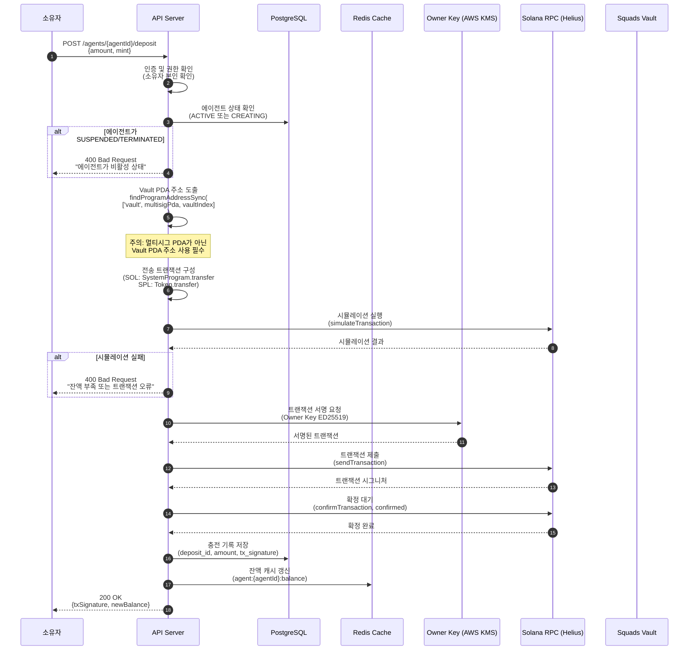
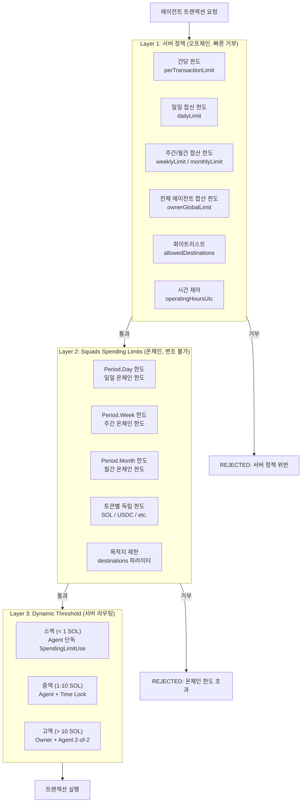
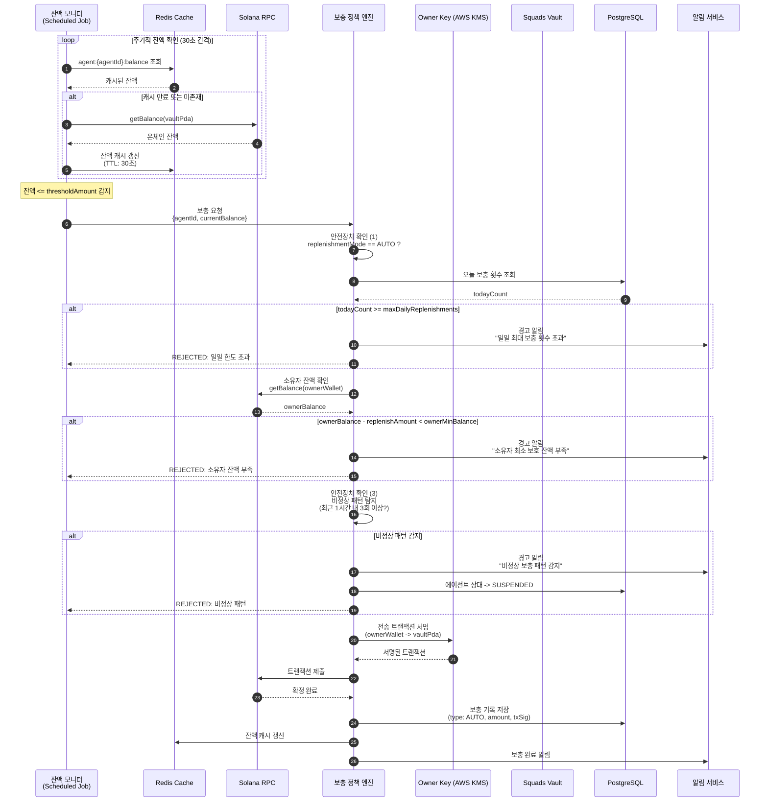
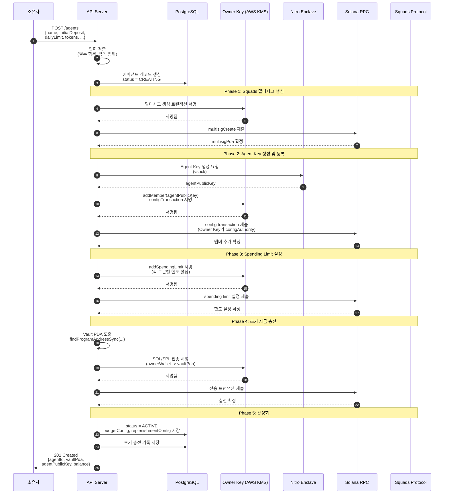

# 자금 충전 프로세스 설계 (REL-01)

**문서 ID:** REL-01
**작성일:** 2026-02-05
**상태:** 완료
**참조:** ARCH-01 (08-dual-key-architecture.md), ARCH-02 (09-system-components.md), ARCH-03 (10-transaction-flow.md), 04-RESEARCH.md

---

## 1. 개요 및 설계 원칙

### 1.1 예산 풀(Budget Pool) 방식

WAIaaS의 자금 충전 모델은 **예산 풀(Budget Pool)** 방식을 채택한다. 소유자(Owner)가 에이전트의 Squads Vault에 일정 금액을 예치하면, 에이전트(Agent)가 Spending Limit 정책 범위 내에서 자율적으로 사용하는 구조이다.

```
┌─────────────────────────────────────────────────────────────────┐
│                    예산 풀(Budget Pool) 모델                      │
├─────────────────────────────────────────────────────────────────┤
│                                                                  │
│   소유자 지갑                    에이전트 Squads Vault            │
│   ┌─────────────┐               ┌─────────────────┐             │
│   │  Owner       │──── 충전 ───>│  Vault (예산 풀) │             │
│   │  Wallet      │<─── 회수 ────│  - SOL           │             │
│   │              │               │  - USDC          │             │
│   └─────────────┘               └────────┬────────┘             │
│                                          │                       │
│                                   Spending Limit                 │
│                                   범위 내 사용                    │
│                                          │                       │
│                                          ▼                       │
│                                  ┌───────────────┐               │
│                                  │ Agent Key      │               │
│                                  │ (자율 운영)    │               │
│                                  └───────────────┘               │
│                                                                  │
└─────────────────────────────────────────────────────────────────┘
```

### 1.2 핵심 원칙

| 원칙 | 설명 | 구현 위치 |
|------|------|----------|
| **온체인 강제** | Squads Spending Limits로 에이전트 인출 한도를 온체인에서 강제 | Squads Protocol (Layer 3) |
| **오프체인 보완** | 건당 한도, 합산 한도, 시간 제어 등 세밀한 정책을 서버에서 보완 | API Server + Enclave (Layer 1, 2) |
| **자금 격리** | 에이전트별 독립 Squads Vault로 자금 격리 | Squads Multisig per Agent |
| **소유자 통제** | 충전/회수/정책 변경은 항상 Owner Key 권한 | AWS KMS ED25519 |
| **투명성** | 모든 자금 이동은 온체인 기록 + 서버 감사 로그 | Solana + PostgreSQL |

### 1.3 자금 흐름 방향

| 흐름 | 방향 | 주체 | 빈도 |
|------|------|------|------|
| 초기 충전 | 소유자 -> Vault | Owner Key | 에이전트 생성 시 1회 |
| 추가 충전 | 소유자 -> Vault | Owner Key | 필요 시 (수동/자동) |
| 보충 (AUTO) | 소유자 -> Vault | Owner Key (자동) | 잔액 임계값 도달 시 |
| 보충 (MANUAL) | 소유자 -> Vault | Owner Key (수동) | 소유자 판단 시 |
| 사용 | Vault -> 외부 | Agent Key (SpendingLimitUse) | 에이전트 운영 시 상시 |

---

## 2. 초기 자금 충전 흐름

### 2.1 충전 시퀀스 다이어그램

소유자가 에이전트 Vault에 자금을 충전하는 전체 흐름이다. Owner Key(AWS KMS)로 서명하여 Squads Vault PDA 주소로 SOL 또는 SPL 토큰을 전송한다.



### 2.2 Vault PDA 주소 도출

Squads Vault의 자금 수신 주소는 반드시 **Vault PDA**를 사용해야 한다. 멀티시그 계정 주소와 혼동하면 안 된다.

```typescript
import { PublicKey } from '@solana/web3.js';

const SQUADS_PROGRAM_ID = new PublicKey('SQDS4ep65T869zMMBKyuUq6aD6EgTu8psMjkvj52pCf');

function deriveVaultPda(multisigPda: PublicKey, vaultIndex: number): PublicKey {
  const [vaultPda] = PublicKey.findProgramAddressSync(
    [
      Buffer.from('multisig'),        // Squads v4 vault seed prefix
      multisigPda.toBuffer(),          // 멀티시그 PDA
      Buffer.from([vaultIndex]),       // Vault 인덱스 (기본: 0)
    ],
    SQUADS_PROGRAM_ID
  );
  return vaultPda;
}

// 사용 예시
const multisigPda = new PublicKey('...');
const vaultPda = deriveVaultPda(multisigPda, 0);
// vaultPda = 에이전트의 자금 수신 주소
```

> **경고 (Squads 공식):** 멀티시그 계정 주소로 자금을 전송하면 복구가 불가능합니다. 반드시 Vault PDA 주소로 전송하세요. API 서버에서 충전 요청 시 목적지 주소가 Vault PDA인지 검증하는 로직을 반드시 포함해야 합니다.

### 2.3 주소 검증 로직

```typescript
// Vault PDA 주소 검증 — 충전 전 필수 실행
function validateVaultAddress(
  targetAddress: PublicKey,
  multisigPda: PublicKey,
  vaultIndex: number
): boolean {
  const expectedVaultPda = deriveVaultPda(multisigPda, vaultIndex);

  if (!targetAddress.equals(expectedVaultPda)) {
    throw new Error(
      `주소 불일치: 대상 ${targetAddress.toBase58()}은 ` +
      `예상 Vault PDA ${expectedVaultPda.toBase58()}와 다릅니다. ` +
      `멀티시그 계정 주소로 자금을 보내면 복구할 수 없습니다.`
    );
  }

  return true;
}
```

### 2.4 토큰별 전송 방식

| 토큰 | 전송 방법 | 특이사항 |
|------|----------|---------|
| **SOL** | SystemProgram.transfer | Vault PDA에 직접 전송 |
| **SPL Token (USDC 등)** | Token.transfer (Associated Token Account) | Vault PDA의 ATA가 없으면 생성 필요 |
| **wSOL** | mint = NATIVE_MINT, Token.transfer | SOL을 wSOL로 래핑 후 전송 |

---

## 3. Squads Spending Limit 설정

### 3.1 Spending Limit 개요

Squads v4의 Spending Limit은 에이전트(멤버)가 멀티시그 승인 없이 Vault에서 직접 인출할 수 있는 **온체인 한도**를 정의한다. 이는 Phase 3에서 확정된 3중 정책 검증의 **Layer 3** (온체인 최종 방어선)에 해당한다 (참조: ARCH-03, 10-transaction-flow.md 3중 정책 검증 레이어).

### 3.2 Spending Limit 파라미터

| 파라미터 | 타입 | 설명 | 예시 |
|---------|------|------|------|
| `create_key` | `PublicKey` | SpendingLimit PDA 시드 (고유 식별) | `Keypair.generate().publicKey` |
| `vault_index` | `u8` | 대상 Vault 인덱스 | `0` (기본 Vault) |
| `mint` | `PublicKey` | 토큰 민트 주소. SOL = `PublicKey.default()` | SOL 또는 USDC mint |
| `amount` | `u64` | 기간당 허용 금액 (mint decimals 기준) | SOL: `1_000_000_000` = 1 SOL |
| `period` | `Period` | 리셋 주기 | `Period.Day(1)` |
| `members` | `PublicKey[]` | 사용 가능한 멤버 목록 | `[agentPublicKey]` |
| `destinations` | `PublicKey[]` | 허용 목적지 (빈 배열 = 모든 주소) | `[]` 또는 화이트리스트 |

**내부 상태 (Squads가 자동 관리):**

| 필드 | 타입 | 설명 |
|------|------|------|
| `remaining_amount` | `u64` | 현재 기간 내 잔여 한도 |
| `last_reset` | `i64` | 마지막 리셋 시점 (Unix timestamp) |

### 3.3 Period 기반 자동 리셋

Squads Spending Limit의 리셋은 **Unix timestamp** 기반이다 (Solana 슬롯이 아님).

```typescript
// Squads v4 Period enum (공식 TypeDoc에서 확인)
enum Period {
  OneTime = 0,   // 1회 사용 후 소멸
  Day = 1,       // 86,400초(24시간) 경과 시 자동 리셋
  Week = 2,      // 604,800초(7일) 경과 시 자동 리셋
  Month = 3,     // 2,592,000초(30일) 경과 시 자동 리셋
}
```

리셋 조건: 현재 시점 - `last_reset` >= Period 기간 → `remaining_amount`를 `amount`로 리셋

### 3.4 토큰별 독립 한도 설정 예시

하나의 에이전트에 대해 SOL과 USDC 각각 독립적인 Spending Limit을 설정할 수 있다.

```typescript
// 예시: 에이전트 A에 대한 Spending Limit 설정
const spendingLimits = [
  {
    // SOL 일일 한도: 5 SOL
    createKey: Keypair.generate().publicKey,
    vaultIndex: 0,
    mint: PublicKey.default(),                    // SOL
    amount: BigInt(5_000_000_000),                // 5 SOL (9 decimals)
    period: Period.Day,
    members: [agentPublicKey],
    destinations: [],                             // 모든 주소 허용
  },
  {
    // USDC 주간 한도: 1,000 USDC
    createKey: Keypair.generate().publicKey,
    vaultIndex: 0,
    mint: new PublicKey('EPjFWdd5AufqSSqeM2qN1xzybapC8G4wEGGkZwyTDt1v'), // USDC
    amount: BigInt(1_000_000_000),                // 1,000 USDC (6 decimals)
    period: Period.Week,
    members: [agentPublicKey],
    destinations: [trustedSwapProgramPda],         // DEX만 허용
  },
  {
    // SOL 월간 한도: 50 SOL (일일 한도와 별개로 추가 제한)
    createKey: Keypair.generate().publicKey,
    vaultIndex: 0,
    mint: PublicKey.default(),
    amount: BigInt(50_000_000_000),               // 50 SOL
    period: Period.Month,
    members: [agentPublicKey],
    destinations: [],
  },
];
```

### 3.5 Spending Limit 변경 절차

Spending Limit의 `amount`, `period` 등을 변경하려면 기존 한도를 제거하고 새로 생성해야 한다 (Squads v4에는 UpdateSpendingLimit action이 없음).

```
변경 절차:
1. RemoveSpendingLimit (configAuthority = Owner Key 서명)
2. AddSpendingLimit (새 파라미터로 생성, configAuthority = Owner Key 서명)
```

> 참조: Owner Key가 configAuthority이므로 Spending Limit 추가/제거는 Owner 단독으로 수행 가능 (ARCH-01, 08-dual-key-architecture.md).

---

## 4. 계층적 예산 한도 체계

### 4.1 3-Layer 한도 구조

예산 한도는 서버 정책(Layer 1), 온체인 Spending Limits(Layer 2), 동적 Threshold 라우팅(Layer 3)의 3개 레이어로 계층화된다. 이 구조는 Phase 3 ARCH-03에서 정의된 3중 정책 검증 레이어와 정렬된다.



### 4.2 온체인 vs 오프체인 한도 분리 원칙

| 한도 유형 | 구현 위치 | 이유 |
|----------|----------|------|
| 건당 최대 금액 | 서버 + Enclave (오프체인) | Squads는 건당 한도 미지원, Period 기반만 지원 |
| 일일/주간/월간 한도 | Squads Spending Limit (온체인) | 변조 불가, 서버 침해 시에도 강제 |
| 전체 에이전트 합산 한도 | 서버 (오프체인) | Squads는 개별 멀티시그 단위만 관리 |
| 목적지 화이트리스트 | 양쪽 모두 | Squads destinations + 서버 allowedDestinations |
| 시간 제어 (운영 시간) | 서버 + Enclave (오프체인) | Squads에 시간대 기반 제어 없음 |
| 프로그램 화이트리스트 | 서버 + Enclave (오프체인) | Squads에 프로그램 필터 없음 |

### 4.3 Layer 별 실패 시 동작

| Layer | 실패 시 | 에스컬레이션 |
|-------|--------|-------------|
| Layer 1 (서버) | 즉시 REJECTED, 클라이언트에 에러 반환 | 반복 위반 시 SUSPENDED 검토 (ARCH-04) |
| Layer 2 (온체인) | 온체인 트랜잭션 실패, remaining_amount 부족 | 서버 로그 기록, 다음 Period 리셋 대기 |
| Layer 3 (라우팅) | 금액 구간에 맞는 서명 요구사항 미충족 | Time Lock 대기 또는 Owner 공동 서명 요청 |

### 4.4 BudgetConfig 인터페이스

```typescript
// 에이전트별 예산 설정 — 서버 정책 + 온체인 Spending Limit 통합
interface BudgetConfig {
  // === Layer 1: 서버 정책 (오프체인) ===

  /** 건당 최대 금액 (lamports 또는 token units) */
  perTransactionLimit: bigint;

  /** 일일 합산 한도 */
  dailyLimit: bigint;

  /** 주간 합산 한도 */
  weeklyLimit: bigint;

  /** 월간 합산 한도 */
  monthlyLimit: bigint;

  /** 허용 목적지 주소 (빈 배열 = 모든 주소) */
  allowedDestinations: PublicKey[];

  /** 허용 프로그램 ID (빈 배열 = 모든 프로그램) */
  allowedPrograms: PublicKey[];

  /** 운영 시간 제어 (null = 24/7) */
  operatingHoursUtc: { start: number; end: number } | null;

  // === Layer 2: Squads Spending Limits (온체인) ===

  /** 온체인 Spending Limit 목록 (토큰별/기간별) */
  onChainSpendingLimits: OnChainSpendingLimit[];

  // === Layer 3: Dynamic Threshold (서버 라우팅) ===

  /** 금액 구간별 서명 요구사항 */
  thresholdTiers: ThresholdTier[];
}

interface OnChainSpendingLimit {
  /** SpendingLimit PDA (고유 식별) */
  spendingLimitPda: PublicKey;

  /** 토큰 민트 주소 (PublicKey.default() = SOL) */
  mint: PublicKey;

  /** 기간당 허용 금액 */
  amount: bigint;

  /** 리셋 주기 */
  period: Period;

  /** 허용 목적지 (빈 배열 = 모든 주소) */
  destinations: PublicKey[];
}

interface ThresholdTier {
  /** 금액 상한 (이 금액 이하에 적용, lamports) */
  maxAmount: bigint;

  /** 필요 서명 방식 */
  signingMode: 'agent_only' | 'agent_timelock' | 'owner_agent_2of2';

  /** Time Lock 초 (signingMode가 agent_timelock일 때) */
  timeLockSeconds?: number;
}
```

### 4.5 예산 한도 설정 예시

```typescript
// 에이전트 A의 예산 설정 예시
const agentABudget: BudgetConfig = {
  // Layer 1: 서버 정책
  perTransactionLimit: BigInt(2_000_000_000),     // 건당 최대 2 SOL
  dailyLimit: BigInt(5_000_000_000),              // 일일 5 SOL
  weeklyLimit: BigInt(20_000_000_000),            // 주간 20 SOL
  monthlyLimit: BigInt(50_000_000_000),           // 월간 50 SOL
  allowedDestinations: [],                         // 모든 주소 허용
  allowedPrograms: [JUPITER_PROGRAM_ID],           // Jupiter DEX만 허용
  operatingHoursUtc: null,                         // 24/7 운영

  // Layer 2: Squads Spending Limits (온체인)
  onChainSpendingLimits: [
    {
      spendingLimitPda: solDailyLimitPda,
      mint: PublicKey.default(),                   // SOL
      amount: BigInt(5_000_000_000),               // 일일 5 SOL
      period: Period.Day,
      destinations: [],
    },
    {
      spendingLimitPda: usdcWeeklyLimitPda,
      mint: USDC_MINT,                             // USDC
      amount: BigInt(1_000_000_000),               // 주간 1,000 USDC
      period: Period.Week,
      destinations: [JUPITER_PROGRAM_PDA],
    },
  ],

  // Layer 3: Dynamic Threshold
  thresholdTiers: [
    { maxAmount: BigInt(1_000_000_000), signingMode: 'agent_only' },           // < 1 SOL: 에이전트 단독
    { maxAmount: BigInt(10_000_000_000), signingMode: 'agent_timelock', timeLockSeconds: 300 },  // 1-10 SOL: Time Lock 5분
    { maxAmount: BigInt(50_000_000_000), signingMode: 'owner_agent_2of2' },     // > 10 SOL: 2-of-2
  ],
};
```

---

## 5. 보충(Replenishment) 프로세스

### 5.1 보충 모드 개요

WAIaaS는 소유자의 선택에 따라 **자동 보충(AUTO)**과 **수동 보충(MANUAL)** 두 가지 모드를 지원한다 (사용자 결정 사항, CONTEXT.md).

| 모드 | 동작 | 트리거 | 안전장치 |
|------|------|--------|---------|
| **AUTO** | 잔액이 임계값 이하가 되면 자동으로 소유자 지갑에서 Vault로 보충 | 잔액 <= thresholdAmount | maxDailyReplenishments, ownerMinBalance, 비정상 패턴 탐지 |
| **MANUAL** | 잔액이 임계값 이하가 되면 소유자에게 알림, 소유자가 직접 충전 | 잔액 <= thresholdAmount | 알림 채널 다중화, 재알림 간격 설정 |

### 5.2 자동 보충 시퀀스 다이어그램



### 5.3 수동 보충 흐름

수동 보충(MANUAL) 모드에서는 잔액이 임계값 이하가 되면 소유자에게 알림을 보내고, 소유자가 직접 충전한다.

```
잔액 <= thresholdAmount
    │
    ▼
알림 발송 (Webhook/SNS)
    │
    ├── 소유자가 API로 충전 요청
    │   → 2.1 초기 자금 충전 흐름과 동일
    │
    └── 소유자가 일정 시간 내 미응답
        → 재알림 (configurable interval, 기본 1시간)
        → 3회 재알림 후 에스컬레이션 (긴급 알림)
```

### 5.4 ReplenishmentConfig 인터페이스

```typescript
// 보충 설정 — 에이전트별 개별 설정 가능
interface ReplenishmentConfig {
  /** 보충 모드 (소유자 선택) */
  mode: ReplenishmentMode;

  /** 자동 보충 설정 (mode가 AUTO일 때) */
  autoReplenish?: AutoReplenishConfig;

  /** 알림 설정 (양쪽 모드 모두 사용) */
  notification: NotificationConfig;
}

interface AutoReplenishConfig {
  /** 보충 트리거 임계값 (이 금액 이하가 되면 보충 시작) */
  thresholdAmount: bigint;

  /** 1회 보충 금액 */
  replenishAmount: bigint;

  /** 일일 최대 보충 횟수 (무한 루프 방지) */
  maxDailyReplenishments: number;

  /** 소유자 지갑 최소 보호 잔액 (이 이하로는 보충하지 않음) */
  ownerMinBalance: bigint;

  /** 소유자 자금 출처 (Owner Wallet 주소) */
  sourceWallet: PublicKey;

  /** 비정상 패턴 탐지 설정 */
  abnormalPatternDetection: {
    /** 시간 윈도우 (초) 내 최대 보충 횟수 */
    windowSeconds: number;
    /** 윈도우 내 최대 허용 횟수 */
    maxCountInWindow: number;
  };
}

interface NotificationConfig {
  /** 알림 트리거 임계값 (잔액이 이 금액 이하가 되면 알림) */
  thresholdAmount: bigint;

  /** 알림 채널 목록 */
  channels: NotificationChannel[];

  /** 재알림 간격 (초) */
  reNotifyIntervalSeconds: number;

  /** 최대 재알림 횟수 */
  maxReNotifications: number;
}

enum ReplenishmentMode {
  AUTO = 'auto',
  MANUAL = 'manual',
}

type NotificationChannel =
  | { type: 'webhook'; url: string }
  | { type: 'sns'; topicArn: string };
```

### 5.5 자동 보충 안전장치 상세

자동 보충 시스템의 **Pitfall 5 (무한 루프 방지)**를 반영한 안전장치 체계이다.

| 안전장치 | 목적 | 기본값 | 트리거 시 동작 |
|---------|------|--------|--------------|
| `maxDailyReplenishments` | 일일 보충 횟수 제한 | 5회 | 보충 거부 + 소유자 경고 알림 |
| `ownerMinBalance` | 소유자 지갑 최소 잔액 보호 | 1 SOL | 보충 거부 + 소유자 경고 알림 |
| 비정상 패턴 탐지 | 단시간 내 반복 보충 감지 | 1시간 내 3회 | 에이전트 자동 SUSPENDED + 소유자 알림 |
| 소유자 잔액 사전 확인 | 보충 실패 방지 | - | 잔액 부족 시 보충 시도 안 함 |
| 감사 로그 | 모든 보충 기록 | - | PostgreSQL에 영구 저장 |

```typescript
// 자동 보충 기본 설정값
const DEFAULT_AUTO_REPLENISH: AutoReplenishConfig = {
  thresholdAmount: BigInt(500_000_000),          // 0.5 SOL 이하 시 보충
  replenishAmount: BigInt(2_000_000_000),         // 2 SOL 보충
  maxDailyReplenishments: 5,                      // 일일 최대 5회
  ownerMinBalance: BigInt(1_000_000_000),         // 소유자 최소 1 SOL 보호
  sourceWallet: ownerPublicKey,
  abnormalPatternDetection: {
    windowSeconds: 3600,                          // 1시간 윈도우
    maxCountInWindow: 3,                          // 1시간 내 최대 3회
  },
};
```

---

## 6. 에이전트 생성 시 초기 자금 설정 플로우

### 6.1 필수 입력 및 기본값

에이전트 생성 시 소유자가 제공해야 하는 입력과 시스템 기본값이다.

| 항목 | 필수 여부 | 기본값 | 설명 |
|------|----------|--------|------|
| `initialDepositAmount` | 필수 | - | 초기 충전 금액 (SOL) |
| `dailyLimit` | 필수 | - | 일일 예산 한도 (최소 1개 한도 필수) |
| `allowedTokens` | 필수 | `[SOL]` | 허용 토큰 목록 |
| `replenishmentMode` | 선택 | `MANUAL` | 보충 모드 (안전한 기본값) |
| `weeklyLimit` | 선택 | `dailyLimit * 7` | 주간 한도 |
| `monthlyLimit` | 선택 | `dailyLimit * 30` | 월간 한도 |
| `perTransactionLimit` | 선택 | `dailyLimit` | 건당 최대 금액 |
| `allowedDestinations` | 선택 | `[]` (모든 주소) | 목적지 화이트리스트 |
| `operatingHoursUtc` | 선택 | `null` (24/7) | 운영 시간 제한 |
| `inactivityTimeoutMin` | 선택 | `60` | 비활성 타임아웃 (분) |

### 6.2 생성 플로우



### 6.3 생성 플로우 상태 전이

```
[*] ──> CREATING
        │
        ├── 멀티시그 생성 완료
        ├── Agent Key 등록 완료
        ├── Spending Limit 설정 완료
        ├── 초기 자금 충전 완료
        │
        ▼
     ACTIVE (정상 운영 시작)
```

각 단계 실패 시 롤백 절차:

| 실패 단계 | 롤백 동작 |
|----------|----------|
| 멀티시그 생성 실패 | DB 레코드 삭제, 에러 반환 |
| Agent Key 등록 실패 | 멀티시그 유지 (재시도 가능), 에러 반환 |
| Spending Limit 설정 실패 | 멤버 등록 유지 (재시도 가능), 에러 반환 |
| 초기 충전 실패 | 설정 유지, 0 잔액으로 ACTIVE 전환 가능 (소유자 선택) |

### 6.4 생성 API 요청/응답 예시

```typescript
// POST /agents 요청
interface CreateAgentRequest {
  name: string;
  description?: string;

  // 자금 설정
  initialDepositAmount: string;        // "5000000000" (5 SOL, lamports)
  initialDepositMint?: string;         // null = SOL

  // 예산 한도
  budget: {
    perTransactionLimit?: string;
    dailyLimit: string;                // 필수
    weeklyLimit?: string;
    monthlyLimit?: string;
    allowedDestinations?: string[];
    allowedPrograms?: string[];
    operatingHoursUtc?: { start: number; end: number };
  };

  // 보충 설정
  replenishment: {
    mode: 'auto' | 'manual';
    autoConfig?: {
      thresholdAmount: string;
      replenishAmount: string;
      maxDailyReplenishments?: number;   // 기본: 5
      ownerMinBalance?: string;          // 기본: 1 SOL
    };
    notificationChannels: Array<
      | { type: 'webhook'; url: string }
      | { type: 'sns'; topicArn: string }
    >;
  };
}

// 201 Created 응답
interface CreateAgentResponse {
  agentId: string;
  name: string;
  status: 'active';

  // 지갑 정보
  wallet: {
    multisigPda: string;
    vaultPda: string;
    agentPublicKey: string;
  };

  // 자금 상태
  balance: string;                     // 초기 충전 후 잔액

  // 설정 요약
  budget: BudgetConfig;
  replenishment: ReplenishmentConfig;

  createdAt: string;                   // ISO 8601
}
```

---

## 7. 잔액 모니터링 및 알림

### 7.1 실시간 잔액 추적

에이전트 Vault의 잔액을 실시간으로 추적하기 위해 **Redis 캐시 + 주기적 온체인 확인** 방식을 사용한다.

```
┌──────────────────────────────────────────────────────────┐
│                  잔액 모니터링 아키텍처                      │
├──────────────────────────────────────────────────────────┤
│                                                           │
│   ┌─────────────┐     ┌──────────────┐                    │
│   │  API Server  │────>│  Redis Cache │                    │
│   │  (읽기/쓰기) │<────│  TTL: 30초   │                    │
│   └──────┬──────┘     └──────────────┘                    │
│          │                                                │
│          │ 캐시 미스 시                                    │
│          ▼                                                │
│   ┌─────────────┐     ┌──────────────┐                    │
│   │  Solana RPC  │────>│  온체인 잔액  │                    │
│   │  (Helius)    │     │  (실제 값)   │                    │
│   └─────────────┘     └──────────────┘                    │
│                                                           │
│   별도 Job:                                               │
│   - 30초마다 모든 에이전트 Vault 잔액 갱신                │
│   - 트랜잭션 확정 시 즉시 캐시 갱신                       │
│   - 온체인 잔액과 캐시 차이 감지 시 알림                  │
│                                                           │
└──────────────────────────────────────────────────────────┘
```

### 7.2 Redis 캐시 키 구조

| 키 | 값 | TTL | 용도 |
|----|-----|-----|------|
| `agent:{agentId}:balance:{mint}` | 잔액 (lamports) | 30초 | 토큰별 잔액 캐시 |
| `agent:{agentId}:daily_spend` | 오늘 사용액 | 자정 리셋 | 일일 사용량 추적 |
| `agent:{agentId}:replenish_count` | 오늘 보충 횟수 | 자정 리셋 | 보충 횟수 제한 |
| `owner:{ownerId}:daily_spend` | 전체 에이전트 합산 | 자정 리셋 | 글로벌 한도 추적 |
| `agent:{agentId}:last_activity` | Unix timestamp | 없음 | 비활성 타임아웃 감지 |

### 7.3 알림 트리거 및 채널

| 트리거 | 조건 | 심각도 | 채널 |
|--------|------|--------|------|
| 잔액 부족 경고 | 잔액 <= thresholdAmount | WARNING | Webhook, SNS |
| 자동 보충 완료 | AUTO 보충 성공 | INFO | Webhook |
| 자동 보충 실패 | AUTO 보충 트랜잭션 실패 | ERROR | Webhook, SNS |
| 일일 보충 한도 도달 | todayCount >= maxDailyReplenishments | WARNING | Webhook, SNS |
| 비정상 패턴 감지 | 단시간 내 반복 보충 | CRITICAL | Webhook, SNS |
| 소유자 잔액 부족 | ownerBalance < ownerMinBalance | WARNING | Webhook, SNS |
| 온체인/캐시 불일치 | abs(onchain - cached) > threshold | WARNING | 내부 로그 |
| 한도 초과 시도 | Spending Limit remaining_amount = 0 | INFO | Webhook |

### 7.4 알림 페이로드 예시

```typescript
// Webhook 알림 페이로드
interface BalanceAlertPayload {
  type: 'balance_alert';
  severity: 'INFO' | 'WARNING' | 'ERROR' | 'CRITICAL';
  timestamp: string;                   // ISO 8601

  agent: {
    agentId: string;
    name: string;
    vaultPda: string;
  };

  alert: {
    trigger: string;                   // 'low_balance' | 'replenish_failed' | ...
    currentBalance: string;            // lamports
    thresholdAmount: string;           // lamports
    message: string;                   // 사람이 읽을 수 있는 메시지
  };

  action?: {
    type: 'auto_replenished' | 'manual_required' | 'agent_suspended';
    details: string;
  };
}
```

---

## 8. 교차 참조 및 의존성

### 8.1 Phase 3 문서 참조

| 참조 문서 | 참조 내용 | 본 문서 관련 섹션 |
|----------|----------|-----------------|
| ARCH-01 (08-dual-key-architecture.md) | Owner Key 권한, configAuthority 역할 | 2.1 충전 흐름, 3.5 Spending Limit 변경 |
| ARCH-02 (09-system-components.md) | 모놀리식 아키텍처, 패키지 구조 | 7.1 잔액 모니터링 아키텍처 |
| ARCH-03 (10-transaction-flow.md) | 3중 정책 검증 레이어, 8단계 트랜잭션 흐름 | 4.1 계층적 한도 구조, 4.3 Layer별 실패 동작 |
| ARCH-04 (11-security-threat-model.md) | Circuit Breaker, 이상 탐지 | 5.5 비정상 패턴 탐지 |

### 8.2 Phase 4 내 연관 문서

| 문서 | 관계 | 연결 포인트 |
|------|------|------------|
| REL-02 (14-fund-withdrawal-process.md) | 역방향 자금 흐름 | Vault → 소유자 회수 절차 |
| REL-03 (에이전트 키 관리) | 생성 플로우 의존 | 6.2 Agent Key 생성 및 등록 |
| REL-04 (비상 회수) | 비상 시 자금 이동 | 5.5 비정상 패턴 탐지, SUSPENDED 전환 |
| REL-05 (멀티 에이전트) | 전체 합산 한도 | 4.2 전체 에이전트 합산 한도 |

---

## 9. Open Questions

### 9.1 구현 시 검증 필요 사항

| 항목 | 현재 가정 | 검증 방법 |
|------|----------|----------|
| Vault PDA seed prefix | `'multisig'` 또는 `'vault'` (Squads v4 버전에 따라 다를 수 있음) | @sqds/multisig SDK의 deriveVaultPda() 유틸리티로 확인 |
| Spending Limit 변경 시 Remove + Add | UpdateSpendingLimit action 없음 | SDK 메서드 목록에서 확인 |
| 다중 Spending Limit 동시 적용 | 토큰/Period 조합별로 독립 적용 | Devnet 테스트 |
| SOL Spending Limit의 mint 값 | `PublicKey.default()` (all zeros) | docs.rs 소스 및 Devnet 테스트 |

---

*문서 종료. 본 문서는 REL-02 (14-fund-withdrawal-process.md)와 함께 자금 흐름의 양방향을 구성한다.*
