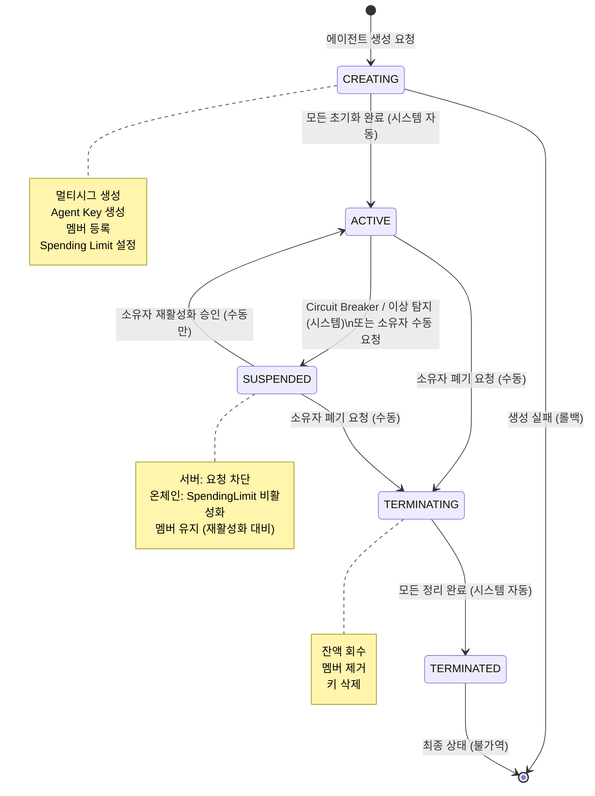
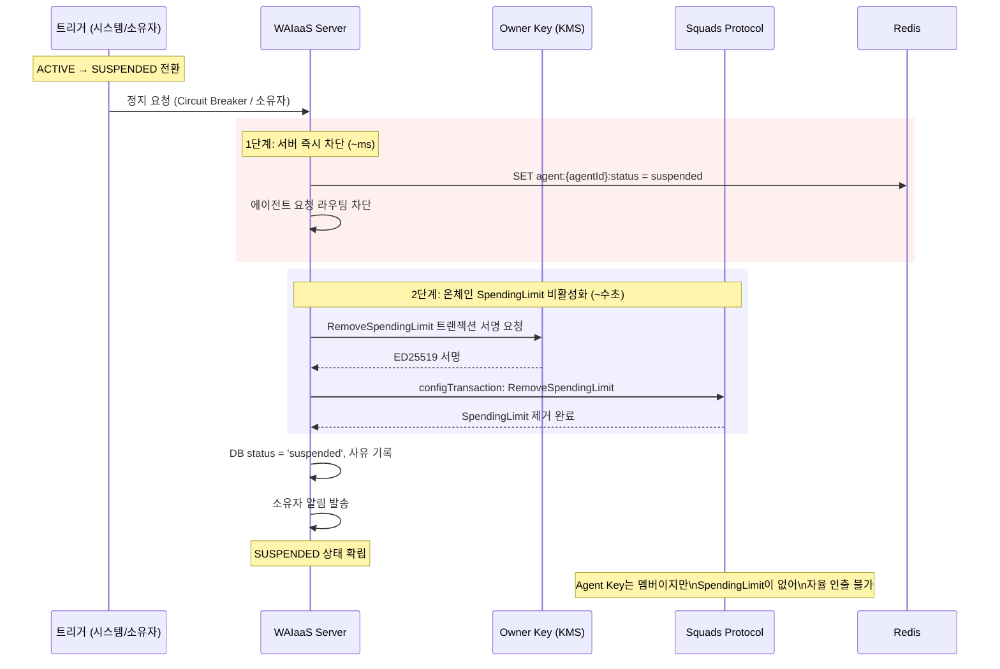
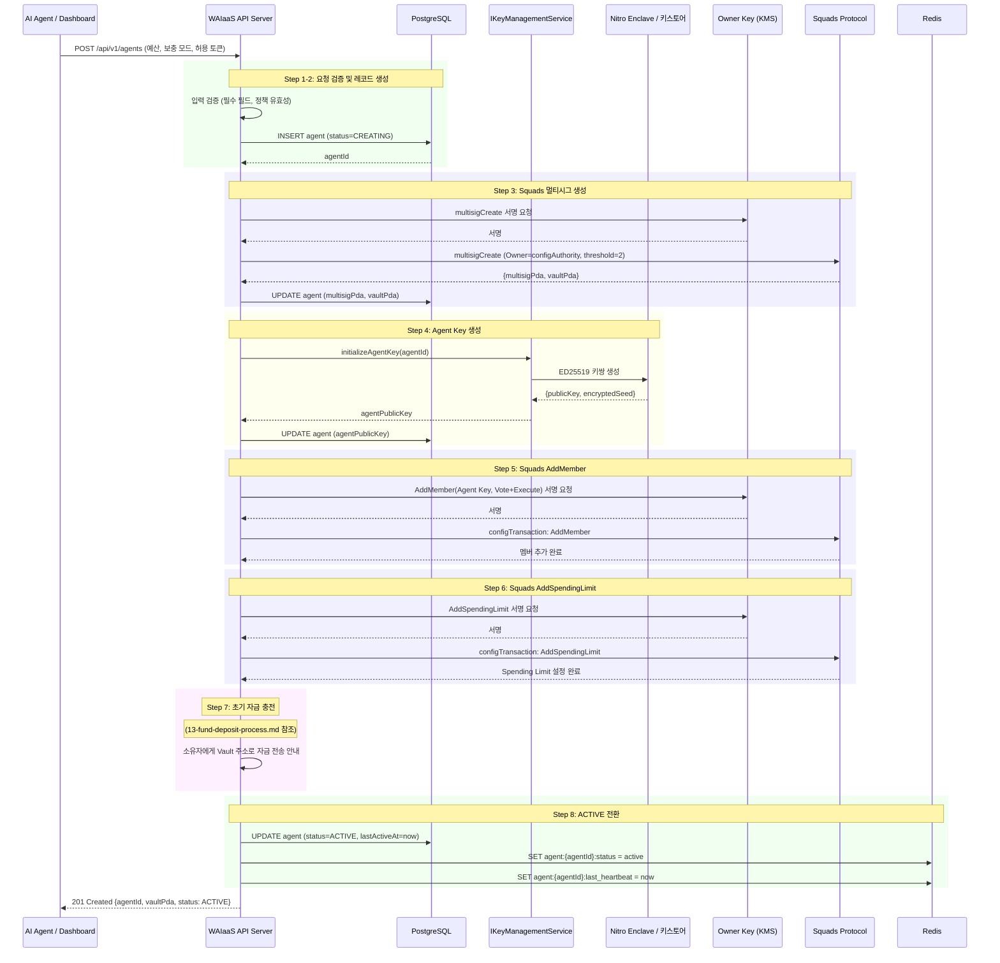
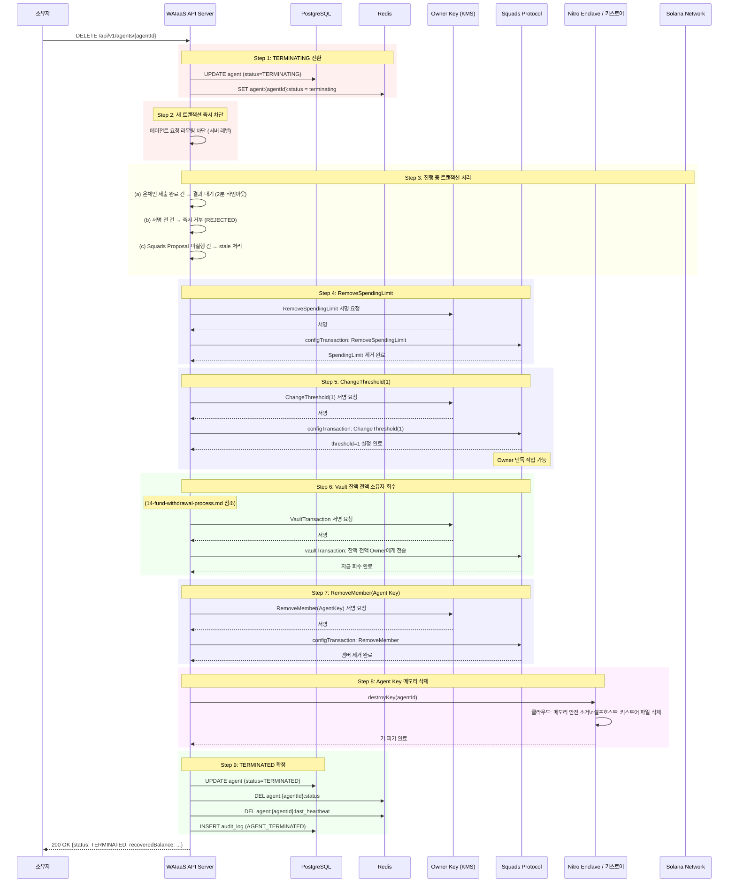
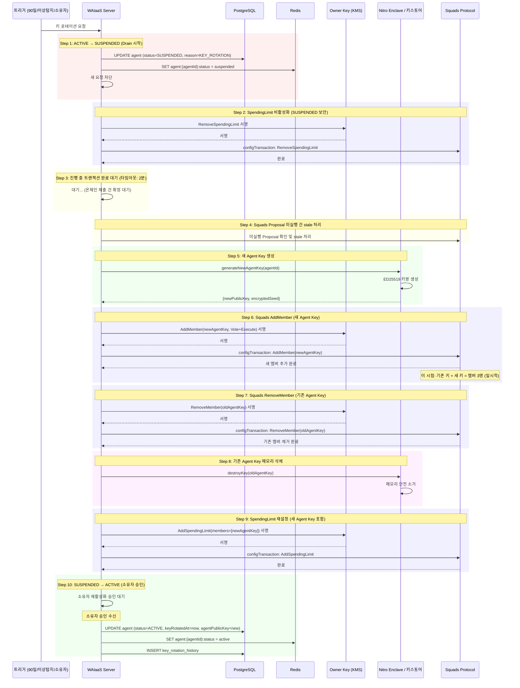

# 에이전트 생명주기 관리 및 키 관리 설계 (REL-03)

**문서 ID:** REL-03
**작성일:** 2026-02-05
**상태:** 완료
**참조:** ARCH-01 (Dual Key 아키텍처), ARCH-02 (시스템 컴포넌트), ARCH-04 (보안 위협 모델)

---

## 1. 개요 및 설계 원칙

### 1.1 에이전트 정의

WAIaaS에서 **에이전트(Agent)**는 소유자(Owner)가 관리하는 자율적 온체인 행위자다. 각 에이전트는 독립된 Squads 2-of-2 멀티시그와 전용 Agent Key를 보유하며, 소유자가 설정한 정책 범위 내에서 자율적으로 트랜잭션을 실행한다.

```
┌─────────────────────────────────────────────────────────────────┐
│                       에이전트 구조                                │
├─────────────────────────────────────────────────────────────────┤
│                                                                  │
│   Owner (사람)                                                   │
│     │                                                            │
│     ├── Owner Key (AWS KMS ED25519)                              │
│     │     ├── configAuthority: 모든 Squads 설정 변경             │
│     │     ├── 멤버 추가/제거, threshold 변경                     │
│     │     └── Spending Limit 설정/제거                           │
│     │                                                            │
│     └── Agent (AI)                                               │
│           ├── Agent Key (Nitro Enclave / 암호화 키스토어)        │
│           ├── Squads Vault (자금 보관)                           │
│           ├── Spending Limit (정책 범위 내 자율 인출)            │
│           └── 상태: CREATING → ACTIVE → SUSPENDED → TERMINATED  │
│                                                                  │
└─────────────────────────────────────────────────────────────────┘
```

### 1.2 핵심 설계 원칙

| 원칙 | 설명 | 적용 |
|------|------|------|
| **불가역 상태 전이** | TERMINATED 상태는 되돌릴 수 없음 | 에이전트 폐기는 최종 결정, 새 에이전트 생성만 가능 |
| **Fail-safe** | 의심스러우면 정지 | Circuit Breaker, 이상 탐지 시 자동 SUSPENDED |
| **Owner 최종 권한** | 소유자가 모든 상태 전환의 최종 결정자 | 자동 재활성화 금지, SUSPENDED→ACTIVE는 소유자만 |
| **Defense-in-depth** | 다중 계층 보호 | 서버 정책 + Enclave + Squads 온체인 |
| **원자적 상태 전환** | 상태 전환은 모든 단계 완료 시에만 확정 | TERMINATING→TERMINATED는 모든 정리 완료 시에만 |

### 1.3 Phase 3 참조

본 문서는 다음 Phase 3 설계 문서를 기반으로 한다:

| 문서 | 참조 내용 |
|------|----------|
| **ARCH-01** (08-dual-key-architecture.md) | Agent Key 생성/로테이션/폐기 절차, IKeyManagementService 인터페이스 |
| **ARCH-02** (09-system-components.md) | 모노레포 구조, WalletService/TransactionService 컴포넌트 |
| **ARCH-04** (11-security-threat-model.md) | Circuit Breaker(연속 5회 실패→OPEN), 이상 탐지 규칙(R01-R08), 4단계 대응(LOW→CRITICAL) |

---

## 2. 에이전트 상태 모델 (State Machine)

### 2.1 상태 전이 다이어그램



### 2.2 상태 정의 테이블

| 상태 | 서버 DB | Squads 온체인 | Spending Limit | 트랜잭션 허용 | 진입 조건 | 탈출 조건 |
|------|---------|-------------|---------------|-------------|----------|----------|
| **CREATING** | `creating` | 멤버 추가 중 | 미설정 | 불가 | 에이전트 생성 API 요청 | 모든 초기화 단계 완료 |
| **ACTIVE** | `active` | 멤버 등록됨 | 활성 | 정책 범위 내 허용 | 초기화 완료 또는 소유자 재활성화 승인 | 정지/폐기 요청 |
| **SUSPENDED** | `suspended` | 멤버 유지 | **비활성화 (RemoveSpendingLimit)** | 불가 | 이상 탐지 / 소유자 요청 / Circuit Breaker / 비활성 타임아웃 | 소유자 재활성화 또는 폐기 |
| **TERMINATING** | `terminating` | 멤버 제거 진행 중 | 제거됨 | 불가 | 소유자 폐기 결정 | 모든 정리 단계 완료 |
| **TERMINATED** | `terminated` | 멤버 아님 | 없음 | 불가 | 모든 정리 완료 | 없음 (최종 상태) |

### 2.3 상태 전환 규칙 상세

| 전환 | 트리거 주체 | 조건 | 자동/수동 |
|------|-----------|------|----------|
| CREATING → ACTIVE | 시스템 | 모든 초기화 단계(멀티시그, 키, 멤버, Spending Limit, 자금) 성공 | 자동 |
| CREATING → 롤백 | 시스템 | 어느 단계든 실패 시 | 자동 |
| ACTIVE → SUSPENDED | 시스템 | Circuit Breaker OPEN (연속 5회 실패), 이상 탐지 규칙 위반 (R05, R06, R08), 비활성 타임아웃 | 자동 |
| ACTIVE → SUSPENDED | 소유자 | 소유자 수동 정지 요청 | 수동 |
| SUSPENDED → ACTIVE | 소유자 | 소유자 재활성화 승인 (시스템 자동 재활성화 금지) | **수동만** |
| ACTIVE → TERMINATING | 소유자 | 소유자 폐기 요청 | 수동 |
| SUSPENDED → TERMINATING | 소유자 | 소유자 폐기 요청 | 수동 |
| TERMINATING → TERMINATED | 시스템 | 모든 정리 단계 완료 (자금 회수, 멤버 제거, 키 삭제) | 자동 |

**핵심 규칙:**
- SUSPENDED → ACTIVE 전환은 **소유자 수동 승인만** 가능하다. 시스템이 자동으로 에이전트를 재활성화하는 것은 금지한다. 이상 탐지로 정지된 에이전트가 자동으로 복구되면 보안 위험이 재발할 수 있기 때문이다.
- TERMINATED는 **불가역** 최종 상태다. 동일 에이전트를 다시 활성화할 수 없으며, 새 에이전트를 생성해야 한다.
- TERMINATING → TERMINATED 전환은 모든 정리 단계가 성공해야만 발생한다. 어느 단계든 실패하면 TERMINATING 상태로 유지되며 재시도한다.

---

## 3. SUSPENDED 상태 온체인 보안 처리 (Pitfall 2 반영)

### 3.1 문제 정의

SUSPENDED 상태에서 에이전트의 Squads 멤버 자격을 유지하는 설계를 채택했다. 이는 재활성화 시 멤버 재등록 트랜잭션 비용과 시간을 절약하기 위함이다. 그러나 멤버 자격이 유지되면, Agent Key로 Squads `SpendingLimitUse` instruction을 직접 호출하여 서버 레벨 차단을 우회할 수 있는 **이론적 가능성**이 존재한다.

### 3.2 위험도 분석

| 요소 | 분석 |
|------|------|
| **Agent Key 접근성** | Enclave 내부(클라우드) 또는 암호화 키스토어(셀프호스트)에만 존재. 외부에서 직접 접근 불가. |
| **서명 요청 경로** | 모든 서명 요청은 서버 → Enclave(vsock) 경로로만 가능. SUSPENDED 시 서버가 요청을 차단. |
| **외부 호출 가능성** | Agent Key가 유출되지 않는 한 극히 낮음. 키 유출 시에는 SUSPENDED 여부와 무관하게 위험. |
| **실제 위험도** | **낮음** (Agent Key가 Enclave/서버 외부로 유출되는 시나리오에서만 발생 가능) |

### 3.3 해결책: Defense-in-depth SpendingLimit 비활성화

위험도는 낮지만, **defense-in-depth** 원칙에 따라 SUSPENDED 전환 시 온체인에서도 SpendingLimit을 비활성화한다.

**방법:** Owner Key(configAuthority)로 `RemoveSpendingLimit` config action 실행

- **SUSPENDED 진입 시:** Owner Key로 기존 SpendingLimit 제거 (`RemoveSpendingLimit`)
- **재활성화 시 (SUSPENDED → ACTIVE):** Owner Key로 SpendingLimit 재생성 (`AddSpendingLimit`)

> Squads v4에는 SpendingLimit amount를 직접 수정하는 action이 없으므로, Remove → Add 방식을 사용한다.

### 3.4 SUSPENDED 전환 시 온체인 보안 처리 시퀀스



### 3.5 재활성화 시 SpendingLimit 복원

```
소유자 재활성화 승인
    │
    ▼
1. DB status = 'active'
2. Redis agent:{agentId}:status = active
3. Owner Key로 AddSpendingLimit (기존 설정 복원)
4. 서버 요청 라우팅 재개
5. lastActiveAt 갱신
```

---

## 4. 에이전트 생성 프로세스 (8단계)

### 4.1 전체 생성 플로우



### 4.2 단계별 상세

| 단계 | 작업 | 실패 시 롤백 |
|------|------|------------|
| 1 | API 요청 수신 및 입력 검증 (예산 한도, 보충 모드, 허용 토큰) | 400 Bad Request 반환 |
| 2 | 에이전트 레코드 생성 (DB, status=CREATING) | DB 레코드 삭제 |
| 3 | Squads 멀티시그 생성 (Owner Key=configAuthority, threshold=2) | DB 레코드 삭제, 멀티시그는 빈 상태로 남음 (자금 없음) |
| 4 | Agent Key 생성 (Enclave 내부 또는 서버 메모리) | 멀티시그 유지 (Agent 미등록), DB 레코드 삭제 |
| 5 | Squads AddMember (Agent Key, Permissions: Vote+Execute) | Agent Key 메모리 삭제, DB 레코드 삭제 |
| 6 | Squads AddSpendingLimit (에이전트별 예산 한도) | RemoveMember 후 롤백 |
| 7 | 초기 자금 충전 안내 | Spending Limit 유지 (자금 없어도 ACTIVE 가능) |
| 8 | status=ACTIVE 전환, lastActiveAt 기록 | status를 CREATING으로 유지, 재시도 |

### 4.3 기본값 정책

에이전트 생성 시 명시하지 않은 설정에 적용되는 기본값:

| 설정 | 기본값 | 근거 |
|------|--------|------|
| 보충 모드 | `MANUAL` (알림 후 수동) | 자동보다 안전한 기본값 |
| 화이트리스트 | 빈 목록 (모든 주소 허용) | 운영 편의, 필요시 제한 추가 |
| 운영 시간 | 24/7 | AI 에이전트 특성상 상시 운영 |
| 비활성 타임아웃 | 60분 | heartbeat 미응답 시 자동 SUSPENDED |
| 쿨다운 | 0초 | 기본적으로 연속 요청 허용 |

---

## 5. 에이전트 폐기(Termination) 프로세스 (9단계)

### 5.1 전체 폐기 플로우



### 5.2 단계별 실패 대응

| 단계 | 실패 시 대응 |
|------|------------|
| 1. TERMINATING 전환 | DB 연결 실패 → 재시도 (3회). 계속 실패 시 소유자에게 수동 조치 안내. |
| 2. 요청 차단 | Redis 실패 → 서버 메모리 플래그로 대체 차단. |
| 3. 진행 중 트랜잭션 | 2분 타임아웃 후 강제 진행. 온체인 제출된 건은 결과와 무관하게 계속. |
| 4. RemoveSpendingLimit | 트랜잭션 실패 → 재시도 (3회). Spending Limit이 이미 없으면 건너뜀. |
| 5. ChangeThreshold(1) | 트랜잭션 실패 → 재시도 (3회). 이미 1이면 건너뜀. |
| 6. 잔액 회수 | 트랜잭션 실패 → 소유자 알림 + 재시도. 잔액 0이면 건너뜀. |
| 7. RemoveMember | 트랜잭션 실패 → 재시도 (3회). 이미 제거되었으면 건너뜀. |
| 8. 키 삭제 | Enclave 연결 실패 → 재시도. 실패 시 TERMINATING 유지 + 소유자 알림. |
| 9. TERMINATED 확정 | **모든 이전 단계 성공 시에만** 실행. |

**핵심:** TERMINATING → TERMINATED 전환은 모든 단계(4~8)가 완료되어야만 발생한다. 어느 단계든 최종 실패하면 TERMINATING 상태로 유지하며, 소유자에게 수동 조치를 안내한다.

### 5.3 Step 5 순서의 중요성 (Pitfall 4)

```
[주의] ChangeThreshold(1) → 잔액 회수 → RemoveMember 순서 필수

잘못된 순서 (멤버 먼저 제거):
  RemoveMember(Agent) → threshold=2인데 멤버 1명 → Vault 트랜잭션 불가 → 자금 잠김

올바른 순서:
  ChangeThreshold(1) → Owner 단독 Vault 트랜잭션 가능 → 잔액 회수 → RemoveMember
```

---

## 6. 키 로테이션 프로세스 (Drain-then-Rotate, 10단계)

### 6.1 Drain-then-Rotate 패턴

키 로테이션은 에이전트의 Agent Key를 새 키로 교체하는 프로세스다. 로테이션 중 진행 중인 트랜잭션과의 레이스 컨디션을 방지하기 위해 **Drain-then-Rotate** 패턴을 사용한다: 먼저 모든 활동을 배수(Drain)하고, 그 다음 키를 교체(Rotate)한다.

### 6.2 로테이션 트리거

| 유형 | 조건 | 자동/수동 |
|------|------|----------|
| **정기 로테이션** | Agent Key 생성 후 90일 경과 | 시스템이 SUSPENDED 전환 + 소유자 알림 |
| **긴급 로테이션** | 이상 징후 탐지, 정책 위반 반복 | 시스템이 SUSPENDED 전환 + 즉시 로테이션 |
| **수동 로테이션** | 소유자 요청 | 소유자가 직접 트리거 |

### 6.3 전체 키 로테이션 플로우



### 6.4 레이스 컨디션 방지 (Pitfall 3 반영)

키 로테이션의 핵심 위험은 **Step 6(AddMember)과 Step 7(RemoveMember) 사이**에 있다. 이 두 작업은 별도의 온체인 트랜잭션이며, 사이에 실패가 발생할 수 있다.

#### 6.4.1 반드시 AddMember → RemoveMember 순서

```
올바른 순서: AddMember(새 키) → RemoveMember(기존 키)
  - 실패해도 기존 키가 유효하므로 에이전트 접근 가능
  - 두 키가 동시에 존재하는 일시적 상태 발생 (멤버 3명)

잘못된 순서: RemoveMember(기존 키) → AddMember(새 키)
  - AddMember 실패 시 에이전트 키가 없는 상태 → Vault 접근 불가
```

#### 6.4.2 Step 6-7 사이 실패 시 롤백 절차

| 시나리오 | 상태 | 대응 |
|---------|------|------|
| AddMember 성공, RemoveMember 실패 | 멤버 3명 (Owner + 기존 Agent + 새 Agent) | RemoveMember 재시도 (3회). 계속 실패 시 수동 조치 안내. 새 키로 운영 시작 가능. |
| AddMember 실패 | 멤버 2명 (변경 없음) | 새 키 폐기, 기존 키로 계속 운영. 로테이션 재시도 예약. |
| 둘 다 성공, SpendingLimit 재설정 실패 | 새 키 등록됨, Spending Limit 없음 | AddSpendingLimit 재시도. SUSPENDED 상태 유지. |

#### 6.4.3 듀얼 키 상태 (일시적)

AddMember 후 RemoveMember 전까지 기존 키와 새 키가 **동시에 멤버로 존재**한다. 이 상태에서:
- 에이전트는 SUSPENDED 상태이므로 서버가 어떤 키로도 요청을 차단
- SpendingLimit이 제거된 상태이므로 온체인 자율 인출 불가
- threshold=2이므로 어느 한 키 단독으로 Vault 트랜잭션 불가

따라서 듀얼 키 상태의 보안 위험은 **없다**.

#### 6.4.4 에이전트 ID 불변성

키 로테이션 중 에이전트의 ID는 변경되지 않는다. 교체되는 것은 Agent Key(공개키/비밀키)뿐이다.

```typescript
// 키 로테이션 전후 비교
agent.id            // 불변
agent.ownerId       // 불변
agent.multisigPda   // 불변
agent.vaultPda      // 불변
agent.agentPublicKey // 변경: 기존 키 → 새 키
agent.keyRotatedAt   // 갱신: 로테이션 완료 시각
```

---

## 7. 에이전트 데이터 모델

### 7.1 TypeScript 인터페이스

```typescript
// packages/core/src/domain/agent/Agent.ts

import { PublicKey } from '@solana/web3.js';

/**
 * 에이전트 엔티티
 *
 * 각 에이전트는 독립된 Squads 멀티시그와 Agent Key를 보유한다.
 * 소유자가 설정한 정책 범위 내에서 자율적으로 트랜잭션을 실행한다.
 */
interface Agent {
  // 식별자
  id: string;                        // UUID, 불변 (키 로테이션에도 불변)
  ownerId: string;                   // 소유자 ID
  walletId: string;                  // 연결된 지갑 ID

  // 상태
  status: AgentStatus;               // 현재 상태 (5단계)
  statusChangedAt: Date;             // 마지막 상태 변경 시각
  statusReason: string;              // 상태 변경 사유

  // Squads 온체인 연동
  multisigPda: PublicKey;            // Squads 멀티시그 PDA
  vaultPda: PublicKey;               // Squads Vault PDA (자금 보관)
  agentPublicKey: PublicKey;         // 현재 Agent Key 공개키

  // 예산 설정
  budgetConfig: BudgetConfig;        // 예산 한도 설정

  // 보충 설정
  replenishmentConfig: ReplenishmentConfig;  // 자금 보충 설정

  // 메타데이터
  createdAt: Date;                   // 에이전트 생성 시각
  lastActiveAt: Date;                // 마지막 활동 시각 (heartbeat 기준)
  keyRotatedAt: Date | null;         // 마지막 키 로테이션 시각
  terminatedAt: Date | null;         // 폐기 완료 시각

  // 비활성 감지 설정
  inactivityTimeoutMinutes: number;  // 비활성 타임아웃 (기본: 60분)
  heartbeatIntervalSeconds: number;  // heartbeat 주기 (기본: 30초)
}

/**
 * 에이전트 상태 열거형
 *
 * 5단계 상태 모델:
 * CREATING → ACTIVE → SUSPENDED → TERMINATING → TERMINATED
 */
enum AgentStatus {
  CREATING = 'creating',         // 초기화 중 (멀티시그, 키, 멤버 등록 진행)
  ACTIVE = 'active',             // 정상 운영 (정책 범위 내 트랜잭션 실행)
  SUSPENDED = 'suspended',       // 일시 정지 (서버 차단 + 온체인 SpendingLimit 제거)
  TERMINATING = 'terminating',   // 폐기 진행 중 (자금 회수, 키 삭제 등)
  TERMINATED = 'terminated',     // 최종 상태 (불가역, 되돌릴 수 없음)
}
```

### 7.2 상태 전환 이력 인터페이스

```typescript
// packages/core/src/domain/agent/AgentStatusTransition.ts

/**
 * 에이전트 상태 전환 이력
 *
 * 모든 상태 변경을 추적하여 감사 로그로 활용한다.
 */
interface AgentStatusTransition {
  id: string;                    // UUID
  agentId: string;               // 에이전트 ID

  fromStatus: AgentStatus;       // 이전 상태
  toStatus: AgentStatus;         // 새 상태

  reason: string;                // 전환 사유
  // 예: 'Circuit Breaker triggered (5 consecutive failures)'
  // 예: 'Owner manual suspension request'
  // 예: 'Inactivity timeout (60 minutes)'
  // 예: 'Owner reactivation approval'
  // 예: 'Agent termination requested by owner'
  // 예: 'Key rotation: Drain-then-Rotate initiated'

  triggeredBy: 'system' | 'owner';  // 트리거 주체

  // 관련 데이터
  metadata?: {
    circuitBreakerState?: string;    // Circuit Breaker 상태
    anomalyRuleId?: string;          // 이상 탐지 규칙 ID (R01-R08)
    keyRotationId?: string;          // 키 로테이션 ID
    recoveredBalance?: bigint;       // 회수된 잔액 (TERMINATING 시)
  };

  timestamp: Date;               // 전환 시각
}
```

### 7.3 PostgreSQL 스키마 (Prisma 모델)

```prisma
// prisma/schema.prisma (에이전트 관련 모델 추가)

model Agent {
  id                      String       @id @default(uuid())
  ownerId                 String
  walletId                String

  // 상태
  status                  AgentStatus  @default(CREATING)
  statusChangedAt         DateTime     @default(now())
  statusReason            String       @default("Agent creation initiated")

  // Squads 온체인
  multisigPda             String?      @unique
  vaultPda                String?      @unique
  agentPublicKey          String?

  // 예산 설정 (JSON)
  budgetConfig            Json         // BudgetConfig
  replenishmentConfig     Json         // ReplenishmentConfig

  // 메타데이터
  createdAt               DateTime     @default(now())
  lastActiveAt            DateTime     @default(now())
  keyRotatedAt            DateTime?
  terminatedAt            DateTime?

  // 비활성 감지
  inactivityTimeoutMinutes Int         @default(60)
  heartbeatIntervalSeconds Int         @default(30)

  // 관계
  statusHistory           AgentStatusHistory[]
  keyRotations            AgentKeyRotation[]

  @@index([ownerId])
  @@index([status])
  @@index([walletId])
}

enum AgentStatus {
  CREATING
  ACTIVE
  SUSPENDED
  TERMINATING
  TERMINATED
}

model AgentStatusHistory {
  id              String       @id @default(uuid())
  agentId         String
  agent           Agent        @relation(fields: [agentId], references: [id])

  fromStatus      AgentStatus
  toStatus        AgentStatus
  reason          String
  triggeredBy     String       // 'system' | 'owner'
  metadata        Json?

  timestamp       DateTime     @default(now())

  @@index([agentId, timestamp])
  @@index([toStatus])
}

model AgentKeyRotation {
  id              String       @id @default(uuid())
  agentId         String
  agent           Agent        @relation(fields: [agentId], references: [id])

  oldPublicKey    String
  newPublicKey    String
  reason          String       // 'scheduled_90d' | 'emergency' | 'manual'

  status          KeyRotationStatus @default(IN_PROGRESS)

  // 단계 추적
  drainStartedAt    DateTime?
  newKeyCreatedAt   DateTime?
  addMemberAt       DateTime?
  removeMemberAt    DateTime?
  oldKeyDestroyedAt DateTime?
  completedAt       DateTime?

  initiatedAt     DateTime     @default(now())

  @@index([agentId])
  @@index([status])
}

enum KeyRotationStatus {
  IN_PROGRESS
  COMPLETED
  FAILED
  ROLLED_BACK
}
```

### 7.4 Redis 캐시 키 정의

| 키 패턴 | 값 | TTL | 용도 |
|---------|---|-----|------|
| `agent:{agentId}:status` | AgentStatus (string) | 없음 (명시적 삭제) | 에이전트 상태 빠른 조회 (DB 조회 없이) |
| `agent:{agentId}:last_heartbeat` | Unix timestamp (number) | heartbeat 주기 * 3 | 비활성 감지 기준 시각 |
| `agent:{agentId}:circuit_breaker` | `CLOSED` / `OPEN` / `HALF_OPEN` | 10분 (OPEN→HALF_OPEN 자동 전환) | Circuit Breaker 상태 |
| `agent:{agentId}:consecutive_failures` | 카운터 (number) | 5분 (윈도우) | 연속 실패 횟수 추적 |
| `agent:{agentId}:rotation_lock` | lock ID (string) | 30분 | 키 로테이션 동시 실행 방지 |

---

## 8. Heartbeat 및 비활성 감지

### 8.1 Heartbeat 메커니즘

에이전트는 주기적으로 서버에 heartbeat 신호를 전송하여 활성 상태를 증명한다.

```
┌──────────────────────────────────────────────────────────────────┐
│                    Heartbeat 플로우                                │
├──────────────────────────────────────────────────────────────────┤
│                                                                   │
│  AI Agent                    WAIaaS Server             Redis     │
│     │                            │                       │       │
│     │── heartbeat (30초마다) ──>│                       │       │
│     │                            │── SET last_heartbeat ──>│     │
│     │                            │                       │       │
│     │── heartbeat ──────────>│                       │       │
│     │                            │── SET last_heartbeat ──>│     │
│     │                            │                       │       │
│     │   ...60분 무응답...        │                       │       │
│     │                            │<── TTL 만료 감지 ─────│       │
│     │                            │                       │       │
│     │                            │── SUSPENDED 전환 ──────>│     │
│     │                            │── 소유자 알림 ──────────>      │
│     │                            │                       │       │
└──────────────────────────────────────────────────────────────────┘
```

### 8.2 Heartbeat 프로토콜

```typescript
// AI Agent → WAIaaS Server
interface HeartbeatRequest {
  agentId: string;
  timestamp: number;        // Unix timestamp (ms)
  metrics?: {
    pendingTasks: number;   // 대기 중인 작업 수
    lastTxHash?: string;    // 마지막 트랜잭션 해시
    memoryUsageMb?: number; // 에이전트 메모리 사용량
  };
}

// WAIaaS Server → AI Agent
interface HeartbeatResponse {
  status: 'ok' | 'suspended' | 'terminating';
  serverTimestamp: number;
  nextHeartbeatMs: number;  // 다음 heartbeat까지 권장 대기 시간
}
```

### 8.3 비활성 타임아웃 처리

| 설정 | 기본값 | 설명 |
|------|--------|------|
| `heartbeatIntervalSeconds` | 30초 | 에이전트가 heartbeat를 보내는 주기 |
| `inactivityTimeoutMinutes` | 60분 | 이 시간 동안 heartbeat가 없으면 자동 SUSPENDED |
| Redis TTL | heartbeat 주기 * 3 | `last_heartbeat` 키의 TTL (90초) |

**타임아웃 검사 방법:**

서버에서 주기적으로 (1분마다) 에이전트별 `last_heartbeat`를 확인한다:

```typescript
// 비활성 감지 스케줄러 (1분마다 실행)
async function checkInactiveAgents(): Promise<void> {
  // ACTIVE 상태 에이전트 목록 조회
  const activeAgents = await db.agent.findMany({
    where: { status: 'ACTIVE' },
    select: { id: true, inactivityTimeoutMinutes: true },
  });

  const now = Date.now();

  for (const agent of activeAgents) {
    const lastHeartbeat = await redis.get(`agent:${agent.id}:last_heartbeat`);

    if (!lastHeartbeat) {
      // heartbeat 키가 없음 → 타임아웃
      await suspendAgent(agent.id, 'Inactivity timeout: no heartbeat record');
      continue;
    }

    const elapsedMinutes = (now - Number(lastHeartbeat)) / 60000;

    if (elapsedMinutes >= agent.inactivityTimeoutMinutes) {
      await suspendAgent(agent.id,
        `Inactivity timeout: ${Math.floor(elapsedMinutes)} minutes without heartbeat`
      );
    }
  }
}
```

### 8.4 비활성 타임아웃 vs 자금 회수

**핵심 원칙:** 비활성 타임아웃은 **SUSPENDED 전환만** 수행한다. 자금 자동 회수는 하지 않는다.

| 동작 | 자동 여부 | 설명 |
|------|----------|------|
| heartbeat 미응답 감지 | 자동 | 서버 스케줄러가 1분마다 확인 |
| ACTIVE → SUSPENDED 전환 | 자동 | 타임아웃 초과 시 즉시 전환 |
| 소유자 알림 | 자동 | SUSPENDED 전환 시 즉시 알림 |
| 자금 회수 | **수동** | 소유자가 판단하여 결정 |
| SUSPENDED → ACTIVE | **수동** | 소유자 재활성화 승인 필요 |

이는 시스템 오류(네트워크 장애, 서버 재시작 등)로 인한 일시적 heartbeat 중단이 자금 이동으로 이어지는 것을 방지하기 위함이다.

---

## 9. 상태 전환별 온체인/오프체인 작업 요약

### 9.1 전환별 작업 매트릭스

| 전환 | 오프체인 (서버) | 온체인 (Squads) |
|------|---------------|----------------|
| CREATING → ACTIVE | DB status=active, Redis status 설정 | 멀티시그 생성, AddMember, AddSpendingLimit |
| ACTIVE → SUSPENDED | DB status=suspended, 요청 차단 | **RemoveSpendingLimit** (Pitfall 2 방지) |
| SUSPENDED → ACTIVE | DB status=active, 요청 허용 | **AddSpendingLimit** (재설정) |
| ACTIVE → TERMINATING | DB status=terminating, 요청 차단 | (아직 없음, 이후 단계에서 실행) |
| TERMINATING 진행 중 | 진행 중 TX 처리, 소유자 알림 | RemoveSpendingLimit, ChangeThreshold(1), VaultTransfer, RemoveMember |
| TERMINATING → TERMINATED | DB status=terminated, Redis 키 삭제, 감사 로그 | (이미 완료) |

### 9.2 Squads 온체인 작업 정리

| Squads Action | 사용 시점 | 서명자 | 비고 |
|---------------|----------|--------|------|
| `multisigCreate` | 에이전트 생성 Step 3 | Owner (createKey) | configAuthority=Owner |
| `AddMember` | 에이전트 생성 Step 5, 키 로테이션 Step 6 | Owner (configAuthority) | Agent Key를 Vote+Execute 권한으로 등록 |
| `RemoveMember` | 에이전트 폐기 Step 7, 키 로테이션 Step 7 | Owner (configAuthority) | 기존 Agent Key 멤버에서 제거 |
| `AddSpendingLimit` | 에이전트 생성 Step 6, SUSPENDED→ACTIVE | Owner (configAuthority) | Agent Key에 대한 예산 한도 설정 |
| `RemoveSpendingLimit` | ACTIVE→SUSPENDED, 에이전트 폐기 Step 4 | Owner (configAuthority) | Pitfall 2: SUSPENDED 시 반드시 제거 |
| `ChangeThreshold` | 에이전트 폐기 Step 5 | Owner (configAuthority) | threshold=1로 변경하여 Owner 단독 작업 |
| `VaultTransaction` | 에이전트 폐기 Step 6 | Owner (threshold=1 후) | 잔액 전액 소유자에게 회수 |

---

## 10. 정기 로테이션 vs 긴급 로테이션

### 10.1 비교

| 항목 | 정기 로테이션 | 긴급 로테이션 |
|------|-------------|-------------|
| **트리거** | 90일 경과 (시스템 스케줄러) | 이상 탐지, 정책 위반, 소유자 요청 |
| **사전 알림** | 7일 전 소유자 알림 | 즉시 실행 |
| **SUSPENDED 전환** | 소유자 승인 후 전환 | 시스템 자동 전환 |
| **Drain 대기 시간** | 2분 (표준) | 2분 (동일) |
| **완료 후 재활성화** | 소유자 승인 | 소유자 승인 |
| **실패 시** | 다음 주기에 재시도 | 소유자에게 수동 조치 안내 |

### 10.2 90일 로테이션 스케줄러

```typescript
// 로테이션 스케줄러 (일 1회 실행)
async function checkKeyRotationSchedule(): Promise<void> {
  const now = new Date();
  const rotationDueDays = 90;
  const warningDays = 7;

  // 로테이션 필요 에이전트 조회
  const agents = await db.agent.findMany({
    where: {
      status: 'ACTIVE',
      keyRotatedAt: {
        lt: new Date(now.getTime() - rotationDueDays * 24 * 60 * 60 * 1000),
      },
    },
  });

  for (const agent of agents) {
    const daysSinceRotation = agent.keyRotatedAt
      ? Math.floor((now.getTime() - agent.keyRotatedAt.getTime()) / (24 * 60 * 60 * 1000))
      : Math.floor((now.getTime() - agent.createdAt.getTime()) / (24 * 60 * 60 * 1000));

    if (daysSinceRotation >= rotationDueDays) {
      // 로테이션 실행
      await initiateKeyRotation(agent.id, 'scheduled_90d');
    } else if (daysSinceRotation >= rotationDueDays - warningDays) {
      // 사전 경고
      await notifyOwner(agent.ownerId, {
        type: 'KEY_ROTATION_DUE',
        agentId: agent.id,
        daysUntilRotation: rotationDueDays - daysSinceRotation,
      });
    }
  }
}
```

---

## 11. 에러 핸들링 및 복구 전략

### 11.1 상태별 에러 복구

| 상태 | 발생 가능 에러 | 복구 전략 |
|------|--------------|----------|
| CREATING | 멀티시그 생성 실패 | 생성된 부분 정리 (롤백), 재시도 안내 |
| CREATING | Agent Key 생성 실패 | Enclave 상태 확인, 재시도 |
| ACTIVE | Circuit Breaker OPEN | 자동 SUSPENDED, 10분 후 HALF_OPEN (소유자만 ACTIVE 복원) |
| SUSPENDED | SpendingLimit 제거 실패 | 재시도 (3회), 실패 시 수동 조치 안내 |
| TERMINATING | 잔액 회수 실패 | 소유자 알림, TERMINATING 유지, 수동 회수 안내 |
| TERMINATING | 키 삭제 실패 | Enclave 재연결 시도, TERMINATING 유지 |

### 11.2 TERMINATING 상태 장기 체류 대응

TERMINATING 상태에서 특정 단계가 반복 실패하면:

1. 30분마다 자동 재시도 (최대 24시간)
2. 24시간 후 소유자에게 수동 조치 필요 알림
3. 소유자가 관리 API를 통해 개별 단계 수동 실행 가능
4. 최악의 경우: Owner Key로 직접 온체인 트랜잭션 실행 (Squads CLI 등)

---

## 12. 감사 및 모니터링 통합

### 12.1 상태 전환 감사 로그

모든 에이전트 상태 전환은 `AgentStatusHistory` 테이블에 기록된다. 이는 다음 용도로 사용된다:

- **보안 감사:** 누가(시스템/소유자) 언제 왜 상태를 변경했는지 추적
- **장애 분석:** SUSPENDED 원인 분석 (Circuit Breaker? 이상 탐지? 비활성 타임아웃?)
- **규정 준수:** 에이전트 생명주기 전체 이력 보존

### 12.2 키 로테이션 감사

`AgentKeyRotation` 테이블은 각 로테이션의 전체 과정을 단계별로 추적한다:

```
로테이션 시작 (drainStartedAt)
    → 새 키 생성 (newKeyCreatedAt)
    → AddMember 완료 (addMemberAt)
    → RemoveMember 완료 (removeMemberAt)
    → 기존 키 파기 (oldKeyDestroyedAt)
    → 로테이션 완료 (completedAt)
```

실패 시 어느 단계에서 실패했는지 정확히 확인할 수 있다.

### 12.3 Phase 3 보안 체계 연동

| Phase 3 메커니즘 | 에이전트 생명주기 연동 |
|-----------------|---------------------|
| **Circuit Breaker** (ARCH-04) | 연속 5회 실패 → OPEN → 에이전트 자동 SUSPENDED |
| **이상 탐지 R05** (ARCH-04) | 화이트리스트 외 3회 연속 → HIGH → 에이전트 자동 SUSPENDED |
| **이상 탐지 R06** (ARCH-04) | 서명/제출 5회 연속 실패 → HIGH → Circuit Breaker 연동 |
| **이상 탐지 R08** (ARCH-04) | Attestation 실패 → CRITICAL → 전체 중지 |
| **IKeyManagementService** (ARCH-01) | `rotateAgentKey()`, `revokeAgentKey()` 인터페이스로 키 관리 |

---

## 13. 참조 문서

### 13.1 내부 문서

| 문서 | 내용 | 위치 |
|------|------|------|
| **ARCH-01** | Dual Key 아키텍처 (Owner Key, Agent Key, 키 라이프사이클) | .planning/deliverables/08-dual-key-architecture.md |
| **ARCH-02** | 시스템 컴포넌트 (IKeyManagementService, 모노레포 구조) | .planning/deliverables/09-system-components.md |
| **ARCH-04** | 보안 위협 모델 (Circuit Breaker, 이상 탐지, 4단계 대응) | .planning/deliverables/11-security-threat-model.md |
| **04-CONTEXT** | Phase 4 사용자 결정 (자금 회수, 멀티 에이전트 등) | .planning/phases/04-owner-agent-relationship/04-CONTEXT.md |
| **04-RESEARCH** | Phase 4 리서치 (Squads SpendingLimit, 상태 머신, Pitfalls) | .planning/phases/04-owner-agent-relationship/04-RESEARCH.md |

### 13.2 관련 Phase 4 문서 (향후 작성)

| 문서 | 내용 |
|------|------|
| 13-fund-deposit-process.md | 에이전트 자금 충전 프로세스 (REL-01) |
| 14-fund-withdrawal-process.md | 에이전트 자금 회수 프로세스 (REL-02) |
| 16-emergency-recovery.md | 비상 회수 메커니즘 (REL-04) |
| 17-multi-agent-management.md | 멀티 에이전트 관리 (REL-05) |

---

*문서 ID: REL-03*
*작성일: 2026-02-05*
*Phase: 04-owner-agent-relationship*
*상태: 완료*
