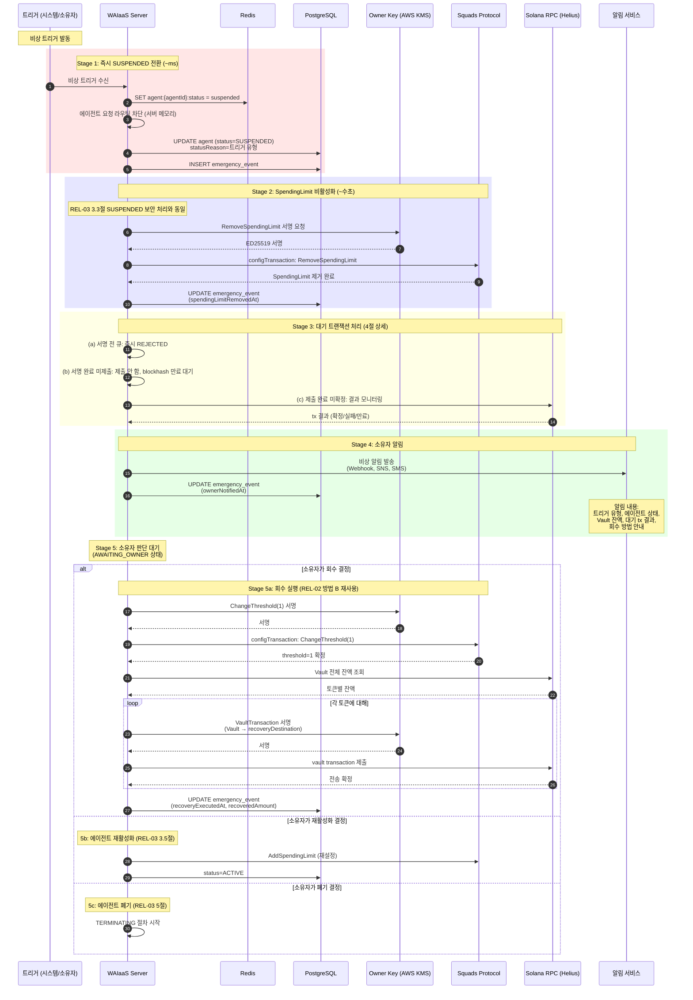
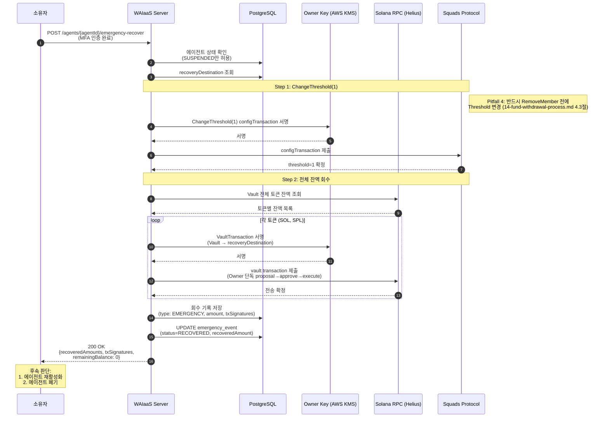
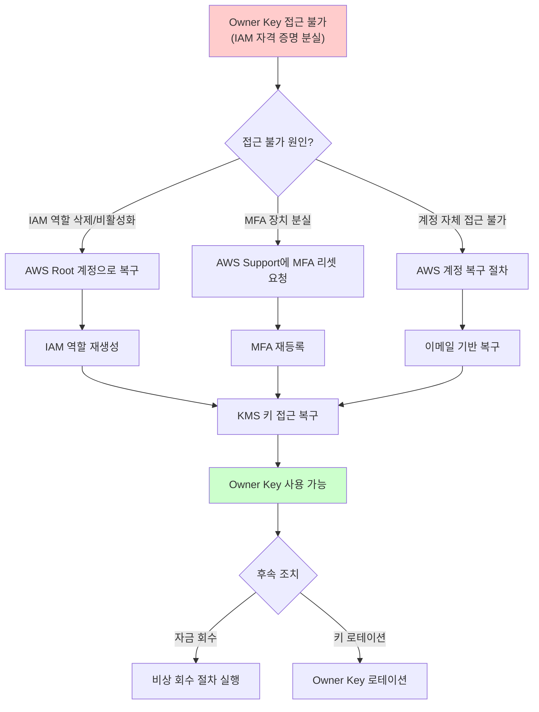
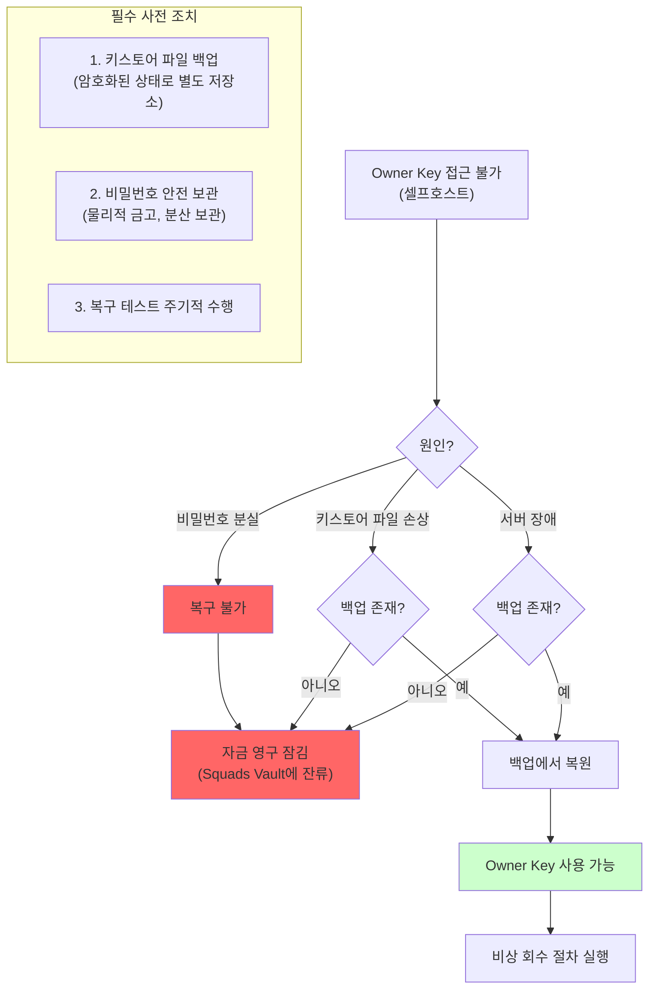
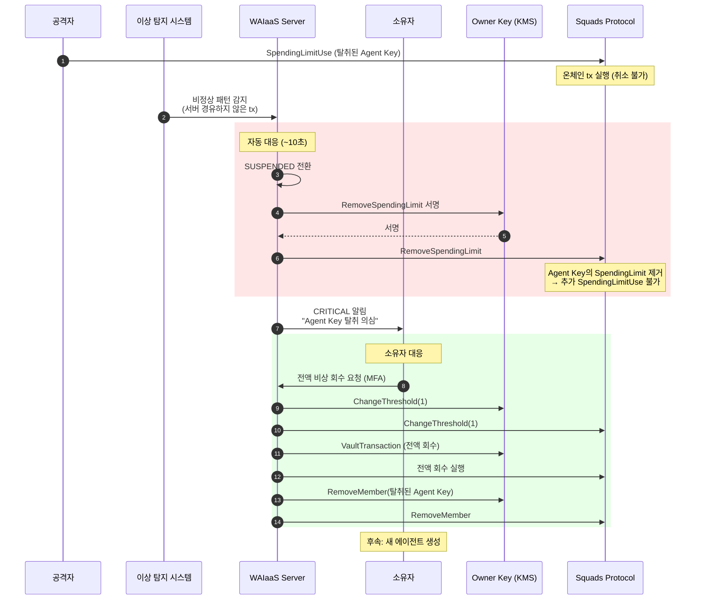

# 비상 자금 회수 메커니즘 설계 (REL-04)

**문서 ID:** REL-04
**작성일:** 2026-02-05
**상태:** 완료
**참조:** REL-02 (14-fund-withdrawal-process.md), REL-03 (15-agent-lifecycle-management.md), ARCH-04 (11-security-threat-model.md), ARCH-01 (08-dual-key-architecture.md), 04-RESEARCH.md

---

## 1. 개요 및 설계 원칙

### 1.1 비상 자금 회수의 정의

비상 자금 회수(Emergency Recovery)는 에이전트 장애, 키 탈취 의심, 시스템 이상 등 **정상 운영이 불가능한 상황**에서 에이전트 Squads Vault의 자금을 소유자 지갑으로 안전하게 복구하는 메커니즘이다. 이는 REL-02 (14-fund-withdrawal-process.md)에서 정의한 수동/자동 회수의 **비상 확장(Emergency Extension)**에 해당한다.

```
+---------------------------------------------------------------------+
|                    비상 자금 회수 개요                                  |
+---------------------------------------------------------------------+
|                                                                       |
|   비상 트리거                                                          |
|   +---------------------+                                             |
|   | 수동 회수 (MFA)     |---+                                         |
|   | Circuit Breaker     |   |    +---> SUSPENDED 전환 (자동)           |
|   | 이상 탐지           |---+--->|    +---> SpendingLimit 비활성화     |
|   | 비활성 타임아웃     |   |    +---> 대기 tx 처리                    |
|   +---------------------+   |    +---> Owner 알림                      |
|                              |    +---> 회수 실행 (Owner 수동 판단)    |
|                              |                                         |
|   핵심 원칙:                                                          |
|   - 시스템은 자동 정지(SUSPENDED)까지만                               |
|   - 실제 자금 이동 결정은 항상 소유자(Owner)                          |
|   - 시스템이 임의로 자금을 이동하지 않음                              |
|                                                                       |
+---------------------------------------------------------------------+
```

### 1.2 핵심 설계 원칙

| 원칙 | 설명 | 근거 |
|------|------|------|
| **자동 정지 + 수동 회수** | 시스템은 이상 감지 시 자동 SUSPENDED 전환까지만 수행, 자금 회수는 항상 소유자 판단 | 시스템 오류로 인한 불필요한 자금 이동 방지 (CONTEXT.md 결정) |
| **Defense-in-depth** | 서버 차단 + SpendingLimit 비활성화 + 소유자 알림의 다중 보호 | REL-03 SUSPENDED 보안 처리 패턴 계승 |
| **Fail-safe** | 비상 절차 중 어느 단계든 실패하면 더 안전한 상태 유지 | ARCH-04 Fail-safe 원칙 |
| **온체인 제출 tx 취소 불가** | 이미 Solana 네트워크에 제출된 트랜잭션은 취소할 수 없음을 인정 | Solana 블록체인의 근본적 특성 (Pitfall 6) |
| **사전 등록 목적지** | 비상 회수 목적지(recoveryDestination)를 사전에 등록하여 패닉 상황에서의 오류 방지 | 비상 시 정확한 주소 입력 부담 제거 |
| **감사 완전성** | 모든 비상 이벤트는 PostgreSQL + CloudTrail에 이중 기록 | 사후 분석 및 규정 준수 |

### 1.3 Solana 제약사항

| 제약 | 설명 | 대응 |
|------|------|------|
| **Dead man's switch 없음** | Solana에는 타임아웃 기반 자동 실행 메커니즘이 없음 | 서버 레벨 heartbeat 모니터링으로 대체 (REL-03 8절) |
| **온체인 tx 취소 불가** | 제출된 트랜잭션은 블록 포함 전까지 취소 불가 | blockhash 만료(~90초) 대기 전략 |
| **Squads break-glass 없음** | Squads Protocol에 전용 비상 해제 메커니즘 없음 | configAuthority(Owner Key)를 활용한 Threshold 변경 + 회수 절차 |

---

## 2. 비상 트리거 유형

### 2.1 트리거 분류 테이블

| 트리거 유형 | 코드 | 주체 | 조건 | autoSuspend | autoRecover | notifyOwner | 우선순위 |
|------------|------|------|------|------------|-------------|-------------|---------|
| **수동 회수** | `manual` | 소유자 | 소유자가 MFA 인증 후 직접 비상 회수 요청 | true | false | true | 1 (최고) |
| **Circuit Breaker** | `circuit_breaker` | 시스템 | 연속 5회 트랜잭션 실패 (ARCH-04 R06) | true | false | true | 2 |
| **이상 탐지** | `anomaly_detection` | 시스템 | 규칙 기반 이상 행위 감지 (R01-R08) | true | false | true | 3 |
| **비활성 타임아웃** | `inactivity_timeout` | 시스템 | heartbeat 미응답 (기본 60분, REL-03 8절) | true | false | true | 4 (최저) |

### 2.2 EmergencyTrigger 인터페이스

```typescript
// packages/core/src/domain/emergency/EmergencyTrigger.ts

/**
 * 비상 트리거 정의
 *
 * 4가지 트리거 유형을 통합하여 비상 회수 프로세스를 시작한다.
 * autoRecover는 모든 트리거에서 false를 권장 — 자금 회수는 소유자 수동 판단.
 */
interface EmergencyTrigger {
  /** 트리거 유형 */
  type: EmergencyTriggerType;

  /** 자동 SUSPENDED 전환 여부 (모든 트리거에서 true 권장) */
  autoSuspend: boolean;

  /** 자동 자금 회수 여부 (false 권장 — 소유자 수동 판단) */
  autoRecover: boolean;

  /** 소유자 알림 여부 */
  notifyOwner: boolean;

  /** 알림 심각도 */
  severity: 'INFO' | 'WARNING' | 'ERROR' | 'CRITICAL';

  /** 트리거 설명 (사람이 읽을 수 있는) */
  description: string;
}

type EmergencyTriggerType =
  | 'manual'
  | 'circuit_breaker'
  | 'anomaly_detection'
  | 'inactivity_timeout';

/**
 * 비상 이벤트 기록
 */
interface EmergencyEvent {
  /** 고유 식별자 (UUID v7) */
  eventId: string;

  /** 에이전트 ID */
  agentId: string;

  /** 소유자 ID */
  ownerId: string;

  /** 트리거 유형 */
  triggerType: EmergencyTriggerType;

  /** 트리거 상세 */
  triggerDetail: string;

  /** 이벤트 발생 시각 */
  triggeredAt: Date;

  /** SUSPENDED 전환 시각 */
  suspendedAt: Date | null;

  /** SpendingLimit 비활성화 시각 */
  spendingLimitRemovedAt: Date | null;

  /** 소유자 알림 시각 */
  ownerNotifiedAt: Date | null;

  /** 회수 실행 시각 (소유자 수동) */
  recoveryExecutedAt: Date | null;

  /** 회수 금액 */
  recoveredAmount: bigint | null;

  /** 회수 트랜잭션 시그니처 */
  recoveryTxSignatures: string[];

  /** 최종 상태 */
  status: EmergencyEventStatus;
}

enum EmergencyEventStatus {
  /** SUSPENDED 전환 완료, 소유자 판단 대기 */
  AWAITING_OWNER = 'awaiting_owner',
  /** 소유자가 회수 실행 중 */
  RECOVERY_IN_PROGRESS = 'recovery_in_progress',
  /** 회수 완료 */
  RECOVERED = 'recovered',
  /** 소유자가 재활성화 결정 (회수 없이) */
  REACTIVATED = 'reactivated',
  /** 소유자가 폐기 결정 */
  TERMINATED = 'terminated',
}
```

### 2.3 트리거 우선순위 및 중복 처리

동시에 여러 트리거가 발동될 수 있다. 예를 들어 Circuit Breaker가 OPEN인 상태에서 비활성 타임아웃도 발생할 수 있다.

| 시나리오 | 처리 방침 |
|---------|----------|
| 이미 SUSPENDED인 에이전트에 추가 트리거 | 추가 SUSPENDED 전환 무시, 새 트리거 이벤트만 기록 |
| 수동 트리거 + 자동 트리거 동시 | 수동 트리거 우선 (우선순위 1), 자동 트리거 이벤트 기록만 |
| 다수 자동 트리거 동시 | 가장 높은 심각도의 트리거를 주(primary) 이벤트로 기록 |
| TERMINATING 상태 에이전트에 트리거 | 무시 (이미 폐기 진행 중) |

```typescript
// 트리거 중복 처리 로직
async function handleEmergencyTrigger(
  agentId: string,
  trigger: EmergencyTrigger
): Promise<EmergencyEvent | null> {
  const agent = await db.agent.findUnique({ where: { id: agentId } });

  // TERMINATED/TERMINATING 상태에서는 무시
  if (agent.status === 'TERMINATED' || agent.status === 'TERMINATING') {
    await logIgnoredTrigger(agentId, trigger, 'Agent already terminating/terminated');
    return null;
  }

  // 이미 SUSPENDED인 경우 이벤트만 기록
  if (agent.status === 'SUSPENDED') {
    const event = await recordAdditionalTrigger(agentId, trigger);
    return event;
  }

  // ACTIVE → SUSPENDED 전환 실행
  return await executeEmergencySuspension(agentId, trigger);
}
```

### 2.4 트리거별 상세 조건

#### 2.4.1 수동 회수 (소유자 MFA)

| 항목 | 값 |
|------|---|
| **인증** | MFA 필수 (KMS 키 정책의 `aws:MultiFactorAuthPresent` 조건) |
| **API** | `POST /api/v1/agents/{agentId}/emergency-recover` |
| **선행 조건** | 에이전트가 ACTIVE 또는 SUSPENDED 상태 |
| **심각도** | CRITICAL (소유자가 비상 상황을 인지한 것이므로) |

#### 2.4.2 Circuit Breaker (5회 연속 실패)

| 항목 | 값 |
|------|---|
| **조건** | 연속 5회 트랜잭션 서명/제출 실패 (ARCH-04 R06, 11-security-threat-model.md) |
| **Redis 키** | `agent:{agentId}:consecutive_failures` >= 5 |
| **자동 동작** | SUSPENDED 전환 + SpendingLimit 비활성화 + Owner 알림 |
| **심각도** | HIGH |
| **연계** | ARCH-04 Circuit Breaker 상태 OPEN과 동기화 |

#### 2.4.3 이상 탐지 (규칙 기반)

| 규칙 | 조건 | 심각도 | 비상 트리거 여부 |
|------|------|--------|----------------|
| R01 빈도 초과 | 1분 내 10건+ | MEDIUM | 아니오 (쓰로틀링만) |
| R05 화이트리스트 외 3회 | 비허용 주소 3회 연속 | HIGH | **예** (SUSPENDED) |
| R06 연속 5회 실패 | Circuit Breaker와 동일 | HIGH | **예** (Circuit Breaker 경유) |
| R07 비정상 금액 | 평균 10배 초과 | MEDIUM | 아니오 (Owner 승인 요청만) |
| R08 Attestation 실패 | Enclave 무결성 검증 실패 | CRITICAL | **예** (전체 중지) |

#### 2.4.4 비활성 타임아웃 (heartbeat 미응답)

| 항목 | 값 |
|------|---|
| **조건** | `inactivityTimeoutMinutes` 동안 heartbeat 없음 (기본 60분, REL-03 8절) |
| **Redis 키** | `agent:{agentId}:last_heartbeat` TTL 만료 |
| **자동 동작** | SUSPENDED 전환 + 소유자 알림 (자금 회수 없음) |
| **심각도** | WARNING |
| **참고** | 네트워크 장애 등 일시적 원인 가능하므로 가장 낮은 우선순위 |

---

## 3. 비상 회수 전체 절차

### 3.1 전체 시퀀스 다이어그램



### 3.2 단계별 소요 시간 및 위험

| 단계 | 소요 시간 | 실패 시 영향 | 복구 방법 |
|------|----------|-------------|----------|
| Stage 1: SUSPENDED 전환 | ~10ms | 서버 차단 실패 시 에이전트 요청이 통과할 수 있음 | Redis 실패 시 서버 메모리 플래그로 대체 |
| Stage 2: SpendingLimit 비활성화 | ~2-5초 | 온체인 방어선 미구축 (서버 차단은 유지) | 재시도 3회, 실패 시 수동 조치 안내 |
| Stage 3: 대기 tx 처리 | ~0-120초 | 이미 제출된 tx의 금액만큼 노출 | 모니터링만 가능, Spending Limit이 총액 제한 |
| Stage 4: 소유자 알림 | ~1-5초 | 소유자가 상황을 인지하지 못함 | 다중 채널(Webhook + SNS + SMS) 재시도 |
| Stage 5: 회수 실행 | ~10-30초 | 회수 트랜잭션 실패 | REL-02 7.5절 재시도 정책 (최대 3회) |

### 3.3 REL-02, REL-03과의 연동

| 참조 문서 | 연동 포인트 | 본 문서 관련 |
|----------|------------|-------------|
| **REL-02** (14-fund-withdrawal-process.md) | 방법 B (ChangeThreshold(1) + Owner 단독 회수) | Stage 5a 회수 실행 절차 |
| **REL-02** (14-fund-withdrawal-process.md) | WithdrawalType.EMERGENCY, WithdrawalRequest 데이터 모델 | 회수 기록 저장 시 type='emergency' |
| **REL-03** (15-agent-lifecycle-management.md) | SUSPENDED 전환, SpendingLimit 비활성화 (3.3-3.4절) | Stage 1-2 |
| **REL-03** (15-agent-lifecycle-management.md) | 폐기 9단계 프로세스 (5.1절) | Stage 5c 폐기 경로 |
| **ARCH-04** (11-security-threat-model.md) | Circuit Breaker, 이상 탐지 규칙 R01-R08, 4단계 대응 | 트리거 유형 2.1절 |

---

## 4. 대기 트랜잭션 처리 방침 (Pitfall 6)

### 4.1 문제 정의

비상 트리거 발동 시점에 에이전트의 트랜잭션이 다양한 상태에 있을 수 있다. Solana 블록체인에서는 **이미 제출된 트랜잭션을 취소할 수 없다** (Pitfall 6, 04-RESEARCH.md). 따라서 대기 트랜잭션의 상태에 따른 분류 처리가 필수이다.

### 4.2 3단계 분류 테이블

| 상태 | 처리 | 위험 | 소요 시간 | 상세 |
|------|------|------|----------|------|
| **서명 전 (서버 큐)** | 즉시 REJECTED | 없음 | ~0ms | 서버 메모리/Redis 큐에서 대기 중인 요청을 즉시 거부 |
| **서명 완료, 미제출** | 제출 안 함, blockhash 만료 대기 (~90초) | 없음 | ~90초 | Enclave에서 서명 완료되었지만 RPC에 미제출. blockhash가 만료되면 자연 무효화 |
| **제출 완료, 미확정** | 취소 불가, 결과 모니터링 | 해당 tx 금액 | ~0-60초 | 이미 Solana 네트워크에 제출됨. 블록 포함 여부를 모니터링만 가능 |

### 4.3 상태별 상세 처리 절차

#### 4.3.1 서명 전 (서버 큐)

```
서버 큐에 대기 중인 트랜잭션 요청
    │
    ▼
SUSPENDED 전환 시 즉시 REJECTED 응답
    │
    ▼
에이전트에게 REJECTED + 사유 반환
    │
    ▼
DB에 거부 기록 (reason: EMERGENCY_SUSPENSION)
```

#### 4.3.2 서명 완료, 미제출

```
Enclave에서 서명이 완료된 트랜잭션
    │
    ▼
서버가 RPC에 제출하지 않음 (서버 레벨 차단)
    │
    ▼
blockhash 만료 대기 (~90초, Solana 기본값)
    │
    ▼
만료 후 트랜잭션 자연 무효화
    │
    ▼
DB에 기록 (status: EXPIRED_BY_EMERGENCY)
```

#### 4.3.3 제출 완료, 미확정

```
이미 Solana RPC에 제출된 트랜잭션
    │
    ▼
취소 불가 — 결과 모니터링 시작
    │
    ├── 블록에 포함됨 (confirmed)
    │   └── 해당 금액은 이동 완료, 회수 시 잔액에서 차감
    │
    ├── 블록에 미포함 (blockhash 만료)
    │   └── 자연 무효화, 자금 Vault에 잔존
    │
    └── 모니터링 타임아웃 (120초)
        └── 미확정 tx로 기록, 주기적 재확인
```

### 4.4 PendingTxPolicy 인터페이스

```typescript
// packages/core/src/domain/emergency/PendingTxPolicy.ts

/**
 * 대기 트랜잭션 처리 방침
 *
 * 비상 트리거 발동 시 3단계 분류에 따라 대기 트랜잭션을 처리한다.
 * 참조: 04-RESEARCH.md Pitfall 6, Solana blockhash ~90초 만료
 */
enum PendingTxPolicy {
  /** 제출된 건 완료 대기, 미제출 건 파기, 서명 전 건 거부 */
  WAIT_AND_TIMEOUT = 'wait_and_timeout',
  /** 서명 전 건 모두 거부 (미제출/제출 건은 동일하게 처리) */
  REJECT_ALL = 'reject_all',
}

/**
 * 대기 트랜잭션 상태 추적
 */
interface PendingTransactionStatus {
  /** 트랜잭션 ID */
  txId: string;

  /** 에이전트 ID */
  agentId: string;

  /** 트랜잭션 상태 */
  stage: 'pre_sign' | 'signed_not_submitted' | 'submitted_not_confirmed';

  /** 금액 (lamports) */
  amount: bigint;

  /** 토큰 민트 */
  mint: string | null;

  /** 목적지 주소 */
  destination: string;

  /** 비상 트리거 이후 처리 결과 */
  emergencyAction: 'rejected' | 'expired' | 'confirmed' | 'monitoring';

  /** Solana tx signature (제출된 경우) */
  txSignature: string | null;

  /** blockhash 만료 예상 시각 */
  blockhashExpiresAt: Date | null;

  /** 최종 확인 시각 */
  resolvedAt: Date | null;
}

/**
 * 대기 트랜잭션 처리 결과 요약
 * 소유자 알림에 포함됨
 */
interface PendingTxSummary {
  /** 서명 전 거부 건수 */
  rejectedCount: number;

  /** blockhash 만료 대기 건수 */
  awaitingExpiryCount: number;

  /** 제출 완료 모니터링 건수 */
  monitoringCount: number;

  /** 모니터링 중인 tx의 총 금액 (최대 노출 위험) */
  totalExposedAmount: bigint;

  /** 모든 대기 건 해결 완료 여부 */
  allResolved: boolean;
}
```

### 4.5 최대 노출 금액 분석

비상 트리거 발동 시 실제로 손실될 수 있는 최대 금액:

| 구성 요소 | 최대 노출 | 제한 요인 |
|----------|----------|----------|
| 제출 완료 미확정 tx | 해당 tx 금액 합계 | Squads Spending Limit remaining_amount |
| 서명 전 큐 tx | 0 (즉시 거부) | - |
| 미제출 tx | 0 (blockhash 만료) | - |
| **총 최대 노출** | **Spending Limit 잔여 한도** | Period 내 remaining_amount가 상한 |

Squads Spending Limit이 기간당 총액을 제한하므로, 최악의 경우에도 **설정된 한도 이상의 손실은 불가능**하다.

---

## 5. 자금 회수 실행

### 5.1 REL-02 방법 B 재사용

비상 회수 시 자금 이동은 REL-02 (14-fund-withdrawal-process.md) 5절에서 정의한 **방법 B (ChangeThreshold(1) + Owner 단독 Vault Transaction)**를 재사용한다. 비상 상황에서는 에이전트 폐기와 유사하게 Owner가 완전 통제권을 확보해야 하기 때문이다.

### 5.2 비상 시 전액 회수 권장

| 항목 | 비상 회수 기본 동작 |
|------|------------------|
| **회수 금액** | 전액 권장 (Vault 전체 잔액) |
| **회수 목적지** | recoveryDestination (사전 등록) |
| **Threshold 변경** | ChangeThreshold(1) → Owner 단독 실행 |
| **Threshold 원복** | 소유자 판단에 따라 원복 또는 폐기 진행 |

### 5.3 recoveryDestination 사전 등록

비상 시 패닉 상태에서 잘못된 주소로 자금을 보내는 것을 방지하기 위해, 에이전트 생성 시 또는 이후 별도로 회수 목적지를 사전 등록한다.

```typescript
// recoveryDestination 등록 API
// POST /api/v1/agents/{agentId}/recovery-destination
interface SetRecoveryDestinationRequest {
  /** 회수 목적지 Solana 주소 */
  destinationPubkey: string;

  /** 등록 확인 (소유자 MFA 필수) */
  confirmWithMfa: boolean;
}

// recoveryDestination 검증
function validateRecoveryDestination(
  pubkey: PublicKey,
  ownerPublicKey: PublicKey
): void {
  // 1. 유효한 Solana 주소인지 확인
  if (!PublicKey.isOnCurve(pubkey.toBytes())) {
    throw new Error('유효하지 않은 Solana 주소');
  }

  // 2. Vault PDA가 아닌지 확인 (Vault으로 회수하면 의미 없음)
  // 3. 소유자 자신의 지갑을 권장 (기본값)
}
```

### 5.4 비상 회수 시퀀스 (Stage 5a 상세)



---

## 6. 가디언 메커니즘 (소유자 키 복구)

### 6.1 가디언의 필요성

Owner Key가 접근 불가능한 상황 (IAM 자격 증명 분실, 계정 잠김 등)에서 자금을 복구할 수 있는 최후 수단이다. 환경(클라우드/셀프호스트)에 따라 복구 경로가 다르다.

### 6.2 클라우드 환경: AWS IAM 기반 복구

클라우드 환경에서 Owner Key는 AWS KMS에 저장되므로, KMS 키 자체는 분실이 불가능하다. 문제는 **KMS에 접근할 수 있는 IAM 자격 증명**의 분실이다.



**클라우드 복구 경로 요약:**

| 상황 | 복구 방법 | 소요 시간 | 난이도 |
|------|----------|----------|--------|
| IAM 역할 삭제 | AWS Root 계정 → IAM 역할 재생성 → KMS 접근 복구 | 수 분 | 낮음 |
| MFA 장치 분실 | AWS Support → MFA 리셋 → 재등록 | 수 시간~1일 | 중간 |
| AWS 계정 접근 불가 | AWS 계정 복구 (이메일/전화) → Root 접근 → IAM 복구 | 수 일 | 높음 |

**핵심:** KMS 키 정책에 `EnableRootAccountAccess` 조항이 포함되어 있으므로 (08-dual-key-architecture.md 2.4절 참조), AWS Root 계정은 항상 KMS 키에 접근할 수 있다. 이것이 클라우드 환경의 최종 안전망이다.

### 6.3 셀프호스트 환경: 백업 필수

셀프호스트 환경에서 Owner Key는 Argon2id로 암호화된 키스토어 파일로 관리된다. **비밀번호를 분실하면 복구가 불가능**하다.



**셀프호스트 필수 백업 항목:**

| 항목 | 백업 대상 | 권장 보관 위치 | 주기 |
|------|----------|-------------|------|
| 키스토어 파일 | 암호화된 Owner Key + Agent Key | 오프라인 저장소 (USB, 금고) | 키 생성/변경 시 |
| 마스터 비밀번호 | Argon2id 파생용 비밀번호 | 물리적 금고, 분산 보관 (Shamir 추천) | 변경 시 |
| salt | 키 파생 salt | 키스토어 파일과 별도 보관 | 키 생성 시 |
| Squads 멀티시그 PDA | 온체인 자금 위치 | 문서화 | 에이전트 생성 시 |

### 6.4 가디언 메커니즘 비교

| 항목 | 클라우드 (AWS KMS) | 셀프호스트 |
|------|-------------------|----------|
| **키 분실 가능성** | 불가능 (KMS 키는 HSM 내 영구 저장) | 가능 (비밀번호/키스토어 분실 시) |
| **접근 권한 분실** | 가능 (IAM 자격 증명 분실) | 가능 (비밀번호 분실) |
| **최종 복구 경로** | AWS Root 계정 → IAM 복구 → KMS 접근 | 백업 복원 (백업 없으면 불가) |
| **자금 영구 잠김 위험** | 매우 낮음 | 높음 (백업 미비 시) |
| **Guardian 역할** | AWS IAM + Root Account | 사전 백업 + 물리적 보관 |
| **권장 추가 보호** | Emergency IAM Role 사전 생성 | Shamir's Secret Sharing으로 비밀번호 분산 |

---

## 7. EmergencyRecoveryConfig 데이터 모델

### 7.1 TypeScript 인터페이스

```typescript
// packages/core/src/domain/emergency/EmergencyRecoveryConfig.ts

import { PublicKey } from '@solana/web3.js';

/**
 * 비상 회수 설정
 *
 * 에이전트 생성 시 또는 이후 업데이트 가능.
 * 각 에이전트별로 독립적인 비상 설정을 가진다.
 */
interface EmergencyRecoveryConfig {
  /** 에이전트 ID (FK) */
  agentId: string;

  /** 비상 트리거 설정 목록 */
  triggers: EmergencyTrigger[];

  /** 회수 목적지 (사전 등록, 비상 시 이 주소로 자금 이동) */
  recoveryDestination: PublicKey;

  /** 비활성 타임아웃 (분, null = 비활성 감지 사용 안 함) */
  inactivityTimeoutMinutes: number | null;

  /** 대기 트랜잭션 처리 방침 */
  pendingTxPolicy: PendingTxPolicy;

  /** Circuit Breaker 설정 */
  circuitBreaker: CircuitBreakerConfig;

  /** 알림 채널 설정 */
  notificationChannels: NotificationChannel[];

  /** 생성 시각 */
  createdAt: Date;

  /** 마지막 수정 시각 */
  updatedAt: Date;
}

/**
 * Circuit Breaker 설정
 * 참조: ARCH-04 (11-security-threat-model.md) 6.4절
 */
interface CircuitBreakerConfig {
  /** 연속 실패 임계값 (기본: 5) */
  failureThreshold: number;

  /** 측정 윈도우 (초, 기본: 300 = 5분) */
  failureWindowSeconds: number;

  /** OPEN → HALF_OPEN 자동 전환 시간 (초, 기본: 600 = 10분) */
  recoveryTimeSeconds: number;

  /** HALF_OPEN 상태 허용 테스트 요청 수 (기본: 3) */
  testRequestsAllowed: number;
}

type NotificationChannel =
  | { type: 'webhook'; url: string }
  | { type: 'sns'; topicArn: string }
  | { type: 'sms'; phoneNumber: string };

// 기본 비상 설정값
const DEFAULT_EMERGENCY_CONFIG: Omit<EmergencyRecoveryConfig, 'agentId' | 'recoveryDestination' | 'createdAt' | 'updatedAt'> = {
  triggers: [
    { type: 'manual', autoSuspend: true, autoRecover: false, notifyOwner: true, severity: 'CRITICAL', description: '소유자 수동 비상 회수' },
    { type: 'circuit_breaker', autoSuspend: true, autoRecover: false, notifyOwner: true, severity: 'HIGH', description: '연속 5회 트랜잭션 실패' },
    { type: 'anomaly_detection', autoSuspend: true, autoRecover: false, notifyOwner: true, severity: 'HIGH', description: '이상 행위 탐지' },
    { type: 'inactivity_timeout', autoSuspend: true, autoRecover: false, notifyOwner: true, severity: 'WARNING', description: 'Heartbeat 미응답' },
  ],
  inactivityTimeoutMinutes: 60,
  pendingTxPolicy: PendingTxPolicy.WAIT_AND_TIMEOUT,
  circuitBreaker: {
    failureThreshold: 5,
    failureWindowSeconds: 300,
    recoveryTimeSeconds: 600,
    testRequestsAllowed: 3,
  },
  notificationChannels: [],
};
```

### 7.2 DB 스키마 (Prisma)

```prisma
// prisma/schema.prisma (비상 회수 관련 모델)

model EmergencyRecoveryConfig {
  id                       String   @id @default(uuid())
  agentId                  String   @unique
  agent                    Agent    @relation(fields: [agentId], references: [id])

  // 회수 목적지
  recoveryDestination      String   // Solana PublicKey (base58)

  // 비활성 타임아웃 (null = 미사용)
  inactivityTimeoutMinutes Int?     @default(60)

  // 대기 tx 처리 방침
  pendingTxPolicy          String   @default("wait_and_timeout")

  // Circuit Breaker 설정 (JSON)
  circuitBreakerConfig     Json     // CircuitBreakerConfig

  // 트리거 설정 (JSON)
  triggers                 Json     // EmergencyTrigger[]

  // 알림 채널 (JSON)
  notificationChannels     Json     // NotificationChannel[]

  createdAt                DateTime @default(now())
  updatedAt                DateTime @updatedAt

  @@index([agentId])
}

model EmergencyEvent {
  id                      String              @id @default(uuid())
  agentId                 String
  ownerId                 String

  // 트리거 정보
  triggerType             String              // EmergencyTriggerType
  triggerDetail           String              // 트리거 상세 설명
  severity                String              // INFO | WARNING | ERROR | CRITICAL

  // 타임라인
  triggeredAt             DateTime            @default(now())
  suspendedAt             DateTime?
  spendingLimitRemovedAt  DateTime?
  ownerNotifiedAt         DateTime?
  recoveryExecutedAt      DateTime?
  resolvedAt              DateTime?

  // 회수 결과
  recoveredAmount         BigInt?
  recoveryTxSignatures    String[]

  // 대기 tx 처리 결과 (JSON)
  pendingTxSummary        Json?               // PendingTxSummary

  // 상태
  status                  String              @default("awaiting_owner")

  // 관계
  agent                   Agent               @relation(fields: [agentId], references: [id])

  @@index([agentId, triggeredAt])
  @@index([ownerId, status])
  @@index([triggerType])
}
```

---

## 8. 비상 시나리오별 대응 매트릭스

### 8.1 시나리오 매트릭스 테이블

| 시나리오 | 트리거 유형 | 심각도 | 자동 대응 | 소유자 수동 대응 | 예상 손실 | 복구 시간 |
|---------|-----------|--------|----------|---------------|----------|----------|
| **Agent Key 탈취** | anomaly_detection | CRITICAL | SUSPENDED + SpendingLimit 비활성화 | 전액 회수 → 폐기 → 새 에이전트 생성 | Spending Limit 잔여 한도 내 | 5-30분 |
| **서버 장애** | inactivity_timeout (heartbeat) | WARNING | SUSPENDED | 서버 복구 확인 후 재활성화 | 0 (서버 중지 시 서명 불가) | 서버 복구 시간 |
| **Enclave 장애** | circuit_breaker (서명 실패) | HIGH | SUSPENDED + Circuit Breaker OPEN | Enclave 복구 확인 후 재활성화 | 0 (서명 불가) | Enclave 복구 시간 |
| **네트워크 장애** | inactivity_timeout | WARNING | SUSPENDED | 네트워크 복구 후 재활성화 | 0 (RPC 불가) | 네트워크 복구 시간 |
| **에이전트 비활성** | inactivity_timeout | WARNING | SUSPENDED | 원인 확인 후 재활성화 또는 폐기 | 0 | 소유자 판단 시간 |
| **이상 거래 패턴** | anomaly_detection (R05, R07) | HIGH | SUSPENDED + SpendingLimit 비활성화 | 포렌식 → 회수 또는 재활성화 | 탐지 전 거래 금액 | 포렌식 후 |
| **Owner Key 침해** | manual (소유자 인지 시) | CRITICAL | 모든 에이전트 SUSPENDED | AWS Root로 IAM 복구 → Owner Key 로테이션 → 전액 회수 | Owner 동작 전 공격자 실행 금액 | 수 시간~수 일 |

### 8.2 시나리오별 상세 대응

#### 8.2.1 Agent Key 탈취

**위협 분석:** 공격자가 Agent Key를 획득하여 Squads SpendingLimitUse instruction을 직접 호출 (ARCH-04 T01).

**대응 절차:**



**핵심:** SpendingLimit 비활성화로 추가 SpendingLimitUse 호출이 차단되어, Agent Key가 탈취되어도 추가 손실을 방지한다. 이미 실행된 tx의 금액만 손실된다.

#### 8.2.2 서버 장애

**상황:** WAIaaS 서버가 다운되어 에이전트 heartbeat가 중단됨.

| 단계 | 자동/수동 | 동작 |
|------|----------|------|
| 1 | 자동 | heartbeat 미응답 → inactivityTimeoutMinutes 초과 → SUSPENDED |
| 2 | 자동 | SpendingLimit 비활성화 (서버 복구 후 실행 — 서버 다운 중에는 불가) |
| 3 | 자동 | 소유자 알림 (서버 외부 알림 시스템이 담당) |
| 4 | 수동 | 소유자가 서버 상태 확인 |
| 5 | 수동 | 서버 복구 후 에이전트 재활성화 (SpendingLimit 재설정 포함) |

**특이 사항:** 서버가 다운된 상태에서는 SpendingLimit 비활성화 온체인 트랜잭션을 실행할 수 없다. 그러나 Agent Key 자체가 Enclave 내부에 있고 서명 요청은 서버를 통해서만 가능하므로, 서버 다운 시 에이전트는 사실상 서명 불가 상태이다.

#### 8.2.3 Enclave 장애

**상황:** Nitro Enclave가 비정상 종료되어 Agent Key 서명이 실패.

| 단계 | 자동/수동 | 동작 |
|------|----------|------|
| 1 | 자동 | 연속 5회 서명 실패 → Circuit Breaker OPEN → SUSPENDED |
| 2 | 자동 | SpendingLimit 비활성화 |
| 3 | 자동 | 소유자 알림 (CRITICAL — Enclave 장애) |
| 4 | 수동 | Enclave 재기동 (KMS 암호화 시드에서 Agent Key 복구) |
| 5 | 수동 | 소유자 재활성화 승인 |

**참고:** Enclave는 stateless이므로 재기동 시 KMS에서 암호화된 시드를 복호화하여 Agent Key를 복원한다 (08-dual-key-architecture.md 3.3.1절). Agent Key 자체는 분실되지 않는다.

#### 8.2.4 네트워크 장애

**상황:** Solana RPC (Helius)에 연결할 수 없어 트랜잭션 제출/확인이 불가.

| 단계 | 자동/수동 | 동작 |
|------|----------|------|
| 1 | 자동 | RPC 연결 실패 → 서명/제출 실패 → Circuit Breaker OPEN |
| 2 | 자동 | heartbeat는 정상이지만 트랜잭션 실패로 SUSPENDED |
| 3 | 자동 | 소유자 알림 |
| 4 | 수동 | 네트워크 상태 확인, 대체 RPC 엔드포인트 설정 |
| 5 | 수동 | 네트워크 복구 후 재활성화 |

**특이 사항:** Fail-safe 원칙에 따라 네트워크 장애 시 모든 트랜잭션이 거부되므로 자금 손실 위험은 없다 (ARCH-04 2.1절).

#### 8.2.5 에이전트 비활성

**상황:** AI 에이전트가 heartbeat를 보내지 않음 (에이전트 프로세스 종료, 작업 완료 후 대기 등).

| 단계 | 자동/수동 | 동작 |
|------|----------|------|
| 1 | 자동 | inactivityTimeoutMinutes 초과 → SUSPENDED |
| 2 | 자동 | SpendingLimit 비활성화 |
| 3 | 자동 | 소유자 알림 (WARNING 수준) |
| 4 | 수동 | 원인 확인: 의도적 비활성인지, 장애인지 판단 |
| 5 | 수동 | 재활성화 또는 폐기 결정 |

**핵심:** 비활성 타임아웃은 **SUSPENDED 전환만** 수행하며, 자금 자동 회수는 하지 않는다 (REL-03 8.4절). 네트워크 장애 등 일시적 원인일 수 있기 때문이다.

### 8.3 Owner Key 침해 시 특별 대응

Owner Key 침해는 가장 심각한 시나리오이다. 공격자가 Owner Key를 획득하면 configAuthority 권한으로 모든 설정을 변경할 수 있다.

**대응 순서:**

1. **감지:** CloudTrail 실시간 알림으로 비정상 KMS Sign 작업 감지 (ARCH-04 T02)
2. **즉시 대응:** AWS Root 계정으로 KMS 키 비활성화 (공격자 사용 차단)
3. **IAM 복구:** 침해된 IAM 자격 증명 폐기, 새 IAM 역할 생성
4. **KMS 키 교체:** 새 Owner Key 생성, Squads configAuthority 변경
5. **자금 회수:** 새 Owner Key로 모든 에이전트 Vault에서 자금 회수
6. **포렌식:** 공격자가 실행한 트랜잭션 추적 (CloudTrail + 온체인 기록)

**AWS KMS 키 비활성화 (긴급):**

```typescript
// AWS Root 계정 또는 Emergency IAM Role로 실행
import { DisableKeyCommand } from '@aws-sdk/client-kms';

async function emergencyDisableOwnerKey(
  kmsClient: KMSClient,
  keyId: string
): Promise<void> {
  // Owner Key 즉시 비활성화 — 모든 Sign 작업 차단
  await kmsClient.send(new DisableKeyCommand({ KeyId: keyId }));

  // 주의: 이후 Owner Key가 필요한 모든 작업도 불가능해짐
  // 새 Owner Key 생성 후 Squads configAuthority 변경 필요
}
```

---

## 9. 교차 참조 및 의존성

### 9.1 Phase 3 문서 참조

| 참조 문서 | 참조 내용 | 본 문서 관련 섹션 |
|----------|----------|-----------------|
| **ARCH-01** (08-dual-key-architecture.md) | Owner Key 권한, configAuthority, KMS 키 정책, IKeyManagementService | 5절 회수 실행, 6절 가디언 메커니즘 |
| **ARCH-04** (11-security-threat-model.md) | Circuit Breaker(R06), 이상 탐지(R01-R08), 4단계 대응(LOW→CRITICAL), 키 탈취 대응 | 2절 트리거 유형, 8절 시나리오 매트릭스 |
| **ARCH-04** (11-security-threat-model.md) | CloudTrail 불변 감사, 포렌식 보존 절차 | 8.3절 Owner Key 침해 대응 |

### 9.2 Phase 4 내 연관 문서

| 문서 | 관계 | 연결 포인트 |
|------|------|------------|
| **REL-01** (13-fund-deposit-process.md) | Vault PDA 주소 검증, 잔액 모니터링 | 5절 회수 시 Vault 주소 확인 |
| **REL-02** (14-fund-withdrawal-process.md) | 방법 B 재사용, WithdrawalType.EMERGENCY | 5절 회수 실행 전체 |
| **REL-03** (15-agent-lifecycle-management.md) | SUSPENDED 전환 절차, SpendingLimit 비활성화, 폐기 프로세스 | 3절 전체 절차 Stage 1-2, Stage 5c |

### 9.3 REL-05 (멀티 에이전트)와의 연계

| 연계 사항 | 설명 |
|----------|------|
| 전체 에이전트 일괄 SUSPENDED | Owner Key 침해 시 모든 에이전트를 동시에 SUSPENDED 전환 필요 |
| 합산 한도 위반 | 전체 에이전트 합산 예산 한도 초과 시 이상 탐지 트리거 |
| 대시보드 알림 통합 | 비상 이벤트를 통합 대시보드에 표시 |

---

## 10. Open Questions

### 10.1 구현 시 검증 필요 사항

| 항목 | 현재 가정 | 검증 방법 |
|------|----------|----------|
| 서버 다운 시 SpendingLimit 비활성화 불가 | Agent Key가 Enclave 내부에만 있으므로 서버 없이 서명 불가 = 실질적 보호 | Devnet: 서버 없이 SpendingLimitUse 직접 호출 가능 여부 테스트 |
| RemoveSpendingLimit 즉시 적용 | configTransaction 실행 후 SpendingLimitUse 즉시 차단 | Devnet: Remove 직후 SpendingLimitUse 시도 |
| recoveryDestination 변경 제한 | MFA 인증 필수로 충분한지, 추가 시간 지연(Time Lock)이 필요한지 | 보안 리뷰 |
| Owner Key 침해 시 공격자 선점 속도 | CloudTrail 알림 ~ Owner 대응 사이 시간 내 공격자가 실행 가능한 트랜잭션 수 | 시뮬레이션 |

---

*문서 ID: REL-04*
*작성일: 2026-02-05*
*Phase: 04-owner-agent-relationship*
*상태: 완료*
