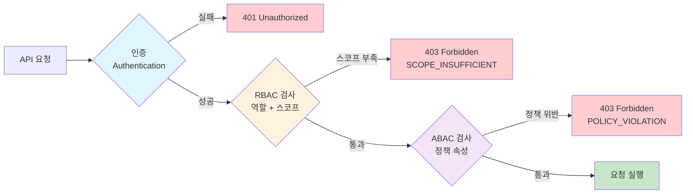
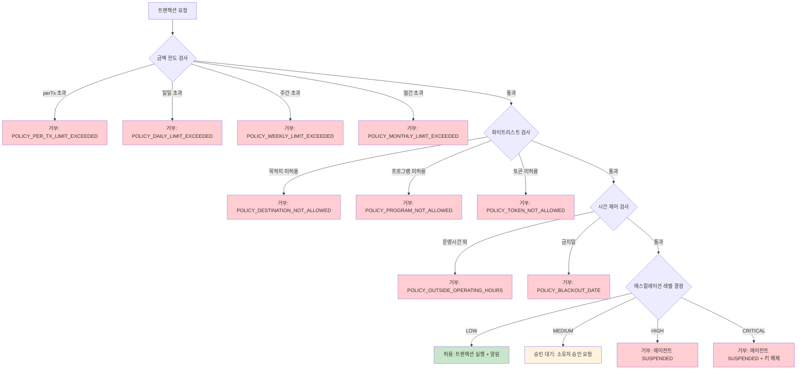

# 권한 및 정책 모델 설계 (API-03)

**문서 ID:** API-03
**작성일:** 2026-02-05
**상태:** 완료
**참조:** API-02 (인증 모델), ARCH-01 (Dual Key 아키텍처), ARCH-03 (트랜잭션 플로우), REL-01 (자금 충전), REL-03 (에이전트 생명주기), REL-04 (비상 회수), REL-05 (멀티 에이전트)

---

## 1. 개요: RBAC + ABAC 하이브리드 권한 모델

### 1.1 모델 개요

WAIaaS의 권한 모델은 **RBAC**(Role-Based Access Control)과 **ABAC**(Attribute-Based Access Control)를 결합한 하이브리드 방식을 채택한다.

- **RBAC**: API 접근 수준의 역할 기반 제어 - "누가 어떤 API를 호출할 수 있는가"
- **ABAC**: 에이전트 정책 수준의 속성 기반 제어 - "어떤 조건에서 트랜잭션이 허용되는가"

두 모델은 순차적으로 평가된다. 인증(Authentication, API-02) 후 RBAC 검사를 통과해야 ABAC 검사가 진행된다.

### 1.2 인증-권한 파이프라인



### 1.3 Phase 4 3-Layer 정책 검증과의 관계

RBAC + ABAC는 API 서버 레이어(Layer 1)에서 동작한다. 이 검사를 통과한 트랜잭션은 이후 Enclave(Layer 2)와 Squads 온체인(Layer 3)에서 추가 검증을 받는다.

```
┌────────────────────────────────────────────────────────────┐
│                    정책 검증 전체 구조                        │
├────────────────────────────────────────────────────────────┤
│                                                             │
│  Layer 1: API 서버 (본 문서 범위)                           │
│  ├── RBAC: 역할 기반 API 접근 제어                         │
│  │   └── ApiRole + ApiScope 매핑                           │
│  └── ABAC: 정책 속성 기반 트랜잭션 제어                    │
│      └── AgentPolicy (한도, 화이트리스트, 시간, 에스컬레이션) │
│                                                             │
│  Layer 2: Nitro Enclave (ARCH-03 확정)                     │
│  └── 서버 정책 재검증 (격리 환경에서 이중 확인)             │
│                                                             │
│  Layer 3: Squads 온체인 (REL-01 확정)                      │
│  └── Spending Limit 최종 강제 (온체인 defense-in-depth)     │
│                                                             │
│  원칙: 서버 정책 ≤ 온체인 한도 (항상 더 엄격)              │
│                                                             │
└────────────────────────────────────────────────────────────┘
```

---

## 2. RBAC: API 역할 및 스코프 매핑

### 2.1 역할 정의

```typescript
// API 접근 역할
type ApiRole = 'owner' | 'agent' | 'viewer' | 'auditor';
```

| 역할 | 설명 | 대상 | 핵심 권한 |
|------|------|------|----------|
| **owner** | 에이전트 생성/삭제, 정책 변경, 자금 관리, 비상 조작 | 소유자 (사람) | 모든 스코프 (`admin:all` 포함) |
| **agent** | 트랜잭션 실행, 잔액 조회, 정책 조회 | AI 에이전트 | `transactions:execute/read`, `wallets:read`, `policies:read` |
| **viewer** | 읽기 전용 접근 | 모니터링 서비스, 읽기 전용 사용자 | 모든 `:read` 스코프 + `dashboard:read` |
| **auditor** | 감사 목적 전체 읽기 | 감사자, 컴플라이언스 | 모든 `:read` 스코프 + 감사 로그 접근 |

### 2.2 역할-스코프 매트릭스

| 스코프 | owner | agent | viewer | auditor |
|--------|:-----:|:-----:|:------:|:-------:|
| `agents:read` | O | - | O | O |
| `agents:write` | O | - | - | - |
| `agents:delete` | O | - | - | - |
| `transactions:read` | O | O | O | O |
| `transactions:execute` | O | O | - | - |
| `wallets:read` | O | O | O | O |
| `wallets:fund` | O | - | - | - |
| `policies:read` | O | O | O | O |
| `policies:write` | O | - | - | - |
| `dashboard:read` | O | - | O | O |
| `admin:all` | O | - | - | - |

**규칙:**
- `admin:all`은 owner만 보유하며 모든 스코프를 암시적으로 포함
- API Key 생성 시 부여 가능한 스코프는 생성자 역할의 스코프 이하
- agent 역할은 읽기(`transactions:read`, `wallets:read`, `policies:read`)와 실행(`transactions:execute`)만 가능

### 2.3 엔드포인트별 필요 스코프 매핑

| # | 엔드포인트 | 메서드 | 필요 스코프 | 허용 역할 |
|---|-----------|--------|-----------|----------|
| 1 | `/api/v1/agents` | POST | `agents:write` | owner |
| 2 | `/api/v1/agents` | GET | `agents:read` | owner, viewer, auditor |
| 3 | `/api/v1/agents/:agentId` | GET | `agents:read` | owner, viewer, auditor |
| 4 | `/api/v1/agents/:agentId` | PATCH | `agents:write` | owner |
| 5 | `/api/v1/agents/:agentId` | DELETE | `agents:delete` | owner |
| 6 | `/api/v1/agents/:agentId/suspend` | POST | `agents:write` | owner |
| 7 | `/api/v1/agents/:agentId/resume` | POST | `agents:write` | owner |
| 8 | `/api/v1/agents/:agentId/rotate-key` | POST | `agents:write` | owner |
| 9 | `/api/v1/transactions` | POST | `transactions:execute` | owner, agent |
| 10 | `/api/v1/transactions/:txId` | GET | `transactions:read` | owner, agent, viewer, auditor |
| 11 | `/api/v1/agents/:agentId/transactions` | GET | `transactions:read` | owner, agent, viewer, auditor |
| 12 | `/api/v1/agents/:agentId/fund` | POST | `wallets:fund` | owner |
| 13 | `/api/v1/agents/:agentId/withdraw` | POST | `wallets:fund` | owner |
| 14 | `/api/v1/agents/:agentId/balance` | GET | `wallets:read` | owner, agent, viewer, auditor |
| 15 | `/api/v1/owner/agents/transfer` | POST | `wallets:fund` | owner |
| 16 | `/api/v1/agents/:agentId/policy` | GET | `policies:read` | owner, agent, viewer, auditor |
| 17 | `/api/v1/agents/:agentId/policy` | PUT | `policies:write` | owner |
| 18 | `/api/v1/agents/:agentId/policy/usage` | GET | `policies:read` | owner, agent, viewer, auditor |
| 19 | `/api/v1/owner/dashboard` | GET | `dashboard:read` | owner, viewer, auditor |
| 20 | `/api/v1/owner/agents` | GET | `agents:read` | owner, viewer, auditor |
| 21 | `/api/v1/owner/global-budget` | PUT | `policies:write` | owner |
| 22 | `/api/v1/agents/:agentId/emergency/suspend` | POST | `agents:write` | owner |
| 23 | `/api/v1/agents/:agentId/emergency/recover` | POST | `wallets:fund` | owner |
| 24 | `/api/v1/owner/emergency/suspend-all` | POST | `admin:all` | owner |
| 25 | `/api/v1/webhooks` | POST | `admin:all` | owner |
| 26 | `/api/v1/webhooks` | GET | `admin:all` | owner |
| 27 | `/api/v1/webhooks/:webhookId` | DELETE | `admin:all` | owner |
| 28 | `/api/v1/auth/keys` | POST | `admin:all` | owner |
| 29 | `/api/v1/auth/keys` | GET | `admin:all` | owner |
| 30 | `/api/v1/auth/keys/:keyId` | DELETE | `admin:all` | owner |

**agent 역할의 접근 범위 제한:**
- agent는 자신의 에이전트 ID에 대한 요청만 허용 (다른 에이전트 데이터 접근 불가)
- 예: agent가 `GET /api/v1/agents/:agentId/balance` 호출 시, agentId가 자신의 ID와 일치해야 함

---

## 3. ABAC: 에이전트 정책 속성 모델

### 3.1 Phase 4 정책의 API 레벨 변환

Phase 4에서 확정된 4가지 정책(금액 한도, 화이트리스트, 시간 제어, 에스컬레이션)을 API 요청/응답 스키마의 AgentPolicy 인터페이스로 변환한다.

### 3.2 AgentPolicy TypeScript 인터페이스

```typescript
// Source: 05-RESEARCH.md Pattern 4 기반, Phase 4 인터페이스와 일관성 유지
interface AgentPolicy {
  // 1. 금액 한도 (REL-01 확정, BudgetConfig 기반)
  limits: {
    perTransaction: bigint;   // 건당 한도 (lamports)
    daily: bigint;            // 일일 한도 (lamports)
    weekly: bigint;           // 주간 한도 (lamports)
    monthly: bigint;          // 월간 한도 (lamports)
  };

  // 2. 화이트리스트 (Phase 4 확정)
  whitelist: {
    allowedDestinations: string[];   // 허용 주소 (빈 배열 = 전체 허용)
    allowedPrograms: string[];       // 허용 프로그램 ID (빈 배열 = 전체 허용)
    allowedTokenMints: string[];     // 허용 토큰 민트 (빈 배열 = 전체 허용)
  };

  // 3. 시간 제어
  timeControl: {
    operatingHoursUtc: { start: number; end: number } | null;  // null = 24/7
    blackoutDates: string[];         // 거래 금지일 (ISO 8601 날짜)
  };

  // 4. 에스컬레이션 (ARCH-03 확정 4-tier)
  escalation: {
    thresholds: {
      low: bigint;       // 알림만 (예: 0.5 SOL)
      medium: bigint;    // 소유자 승인 필요 (예: 2 SOL)
      high: bigint;      // 지갑 동결 (예: 5 SOL)
      critical: bigint;  // 키 해제 (예: 10 SOL)
    };
  };
}
```

### 3.3 정책 속성별 상세 설명

#### 3.3.1 금액 한도 (limits)

Phase 4 REL-01에서 확정된 BudgetConfig를 API 레벨로 매핑한다.

| 필드 | 타입 | 설명 | 검증 시점 | 온체인 대응 |
|------|------|------|----------|------------|
| `perTransaction` | `bigint` | 건당 최대 금액 | 트랜잭션 제출 시 | Squads Spending Limit amount |
| `daily` | `bigint` | 24시간 누적 최대 | 트랜잭션 제출 시 | Squads Period.Day |
| `weekly` | `bigint` | 7일 누적 최대 | 트랜잭션 제출 시 | Squads Period.Week |
| `monthly` | `bigint` | 30일 누적 최대 | 트랜잭션 제출 시 | Squads Period.Month |

**검증 로직:** 트랜잭션 금액 <= perTransaction AND 일일 누적 + 금액 <= daily AND 주간 누적 + 금액 <= weekly AND 월간 누적 + 금액 <= monthly

#### 3.3.2 화이트리스트 (whitelist)

| 필드 | 빈 배열 의미 | 검증 시점 |
|------|-------------|----------|
| `allowedDestinations` | 모든 주소 허용 | 트랜잭션 목적지 검증 |
| `allowedPrograms` | 모든 프로그램 허용 | CPI(Cross-Program Invocation) 검증 |
| `allowedTokenMints` | 모든 토큰 허용 | SPL Token 전송 시 민트 검증 |

#### 3.3.3 시간 제어 (timeControl)

| 필드 | null/빈 의미 | 예시 |
|------|-------------|------|
| `operatingHoursUtc` | `null` = 24시간 운영 | `{ start: 9, end: 17 }` = UTC 09:00-17:00 |
| `blackoutDates` | 빈 배열 = 금지일 없음 | `["2026-12-25", "2026-01-01"]` |

**시간대 처리:** 모든 시간은 UTC 기준으로 저장/비교한다. 클라이언트가 로컬 시간대를 사용할 경우 API에서 UTC로 변환하여 전달해야 한다.

#### 3.3.4 에스컬레이션 (escalation)

Phase 3 ARCH-03에서 확정된 4-tier 에스컬레이션과 매핑한다.

| 레벨 | 임계값 (예시) | 자동 대응 | 사람 개입 |
|------|-------------|----------|----------|
| **LOW** | < 0.5 SOL | 알림만 (Webhook) | 불필요 |
| **MEDIUM** | < 2 SOL | 소유자 승인 요청 | 승인/거부 |
| **HIGH** | < 5 SOL | 에이전트 SUSPENDED | 소유자 검토 후 재활성화 |
| **CRITICAL** | >= 5 SOL | 에이전트 SUSPENDED + 키 해제 | 소유자 긴급 대응 |

### 3.4 정책 검증 흐름



---

## 4. 정책 관리 API 설계

### 4.1 GET /api/v1/agents/:agentId/policy - 현재 정책 조회

```typescript
// 응답 (200 OK)
interface GetPolicyResponse {
  agentId: string;
  policy: AgentPolicy;           // 전체 정책 객체
  syncStatus: 'synced' | 'pending' | 'failed';  // 온체인 동기화 상태
  lastSyncedAt: string | null;   // 마지막 동기화 시점
  updatedAt: string;             // 마지막 정책 변경 시점
  updatedBy: string;             // 변경자 ID
  templateId: string | null;     // 사용된 템플릿 ID (커스텀이면 null)
}
```

**필요 스코프:** `policies:read`
**허용 역할:** owner, agent (자기 자신만), viewer, auditor

### 4.2 PUT /api/v1/agents/:agentId/policy - 정책 변경

```typescript
// 요청 (Partial Update - 변경할 필드만)
interface UpdatePolicyRequest {
  limits?: Partial<AgentPolicy['limits']>;
  whitelist?: Partial<AgentPolicy['whitelist']>;
  timeControl?: Partial<AgentPolicy['timeControl']>;
  escalation?: Partial<AgentPolicy['escalation']>;
  reason: string;                // 변경 사유 (감사 로그 필수)
}

// 응답 (200 OK)
interface UpdatePolicyResponse {
  agentId: string;
  policy: AgentPolicy;           // 변경 후 전체 정책
  previousPolicy: AgentPolicy;   // 변경 전 정책 (비교용)
  syncStatus: 'pending';         // Squads Spending Limit 동기화 진행 중
  changeId: string;              // 변경 이력 ID
  appliedAt: string;             // 적용 시점 (즉시 또는 다음 기간)
}
```

**필요 스코프:** `policies:write`
**허용 역할:** owner만

#### 즉시 적용 vs 다음 기간 적용 규칙

| 변경 유형 | 적용 시점 | 이유 |
|----------|----------|------|
| 한도 증가 | 즉시 | 에이전트 운영에 유리, 보안 위험 없음 |
| 한도 감소 (현재 사용량 < 새 한도) | 즉시 | 즉시 적용해도 기존 사용량 미초과 |
| 한도 감소 (현재 사용량 >= 새 한도) | 다음 기간 | 소급 적용하면 에이전트 즉시 차단 발생 |
| 화이트리스트 추가 | 즉시 | 허용 범위 확대 |
| 화이트리스트 제거 | 즉시 | 보안 강화, 즉시 차단이 적절 |
| 시간 제어 변경 | 즉시 | 운영시간 변경은 즉시 반영 |
| 에스컬레이션 임계값 변경 | 즉시 | 보안 관련, 즉시 반영 |

### 4.3 GET /api/v1/agents/:agentId/policy/usage - 현재 사용량 조회

```typescript
// 응답 (200 OK)
interface GetPolicyUsageResponse {
  agentId: string;
  usage: {
    daily: {
      used: bigint;               // 금일 사용량 (lamports)
      remaining: bigint;          // 금일 잔여 한도
      limit: bigint;              // 금일 한도
      resetsAt: string;           // 리셋 시점 (ISO 8601)
    };
    weekly: {
      used: bigint;
      remaining: bigint;
      limit: bigint;
      resetsAt: string;
    };
    monthly: {
      used: bigint;
      remaining: bigint;
      limit: bigint;
      resetsAt: string;
    };
  };
  lastTransactionAt: string | null;  // 마지막 트랜잭션 시점
  transactionCount: {
    daily: number;                // 금일 트랜잭션 건수
    weekly: number;
    monthly: number;
  };
}
```

**필요 스코프:** `policies:read`
**허용 역할:** owner, agent (자기 자신만), viewer, auditor

### 4.4 정책 변경 이력

```typescript
interface PolicyChangeLog {
  id: string;                     // 변경 이력 ID
  agentId: string;
  changedBy: string;              // 변경자 ID (소유자)
  changedAt: string;              // 변경 시점 (ISO 8601)
  reason: string;                 // 변경 사유
  previousPolicy: AgentPolicy;   // 변경 전 정책
  newPolicy: AgentPolicy;        // 변경 후 정책
  appliedAt: string;              // 실제 적용 시점
  syncStatus: 'synced' | 'pending' | 'failed';
  diff: PolicyDiff;               // 변경 내용 요약
}

interface PolicyDiff {
  field: string;                  // 예: "limits.daily"
  previousValue: string;
  newValue: string;
}[]
```

---

## 5. Rate Limiting 전략

### 5.1 3-Layer Rate Limiting 구조

```
┌────────────────────────────────────────────────────────────┐
│                3-Layer Rate Limiting                        │
├────────────────────────────────────────────────────────────┤
│                                                             │
│  Layer 1: IP 기반 글로벌 한도 (DDoS 방어)                  │
│  ├── 기본: 1,000 req/min per IP                            │
│  ├── 초과 시: 429 + Retry-After 헤더                       │
│  └── @fastify/rate-limit + Redis                           │
│                                                             │
│  Layer 2: API Key별 한도 (등급별 차등)                     │
│  ├── 기본: 100 req/min                                     │
│  ├── 프리미엄: 500 req/min                                 │
│  ├── 엔터프라이즈: 커스텀                                  │
│  └── Redis 기반 분산 카운터                                 │
│                                                             │
│  Layer 3: 에이전트별 트랜잭션 빈도 한도                    │
│  ├── 기본: 10 tx/min per agent                             │
│  ├── 정책 시간 제어와 연동                                 │
│  └── 트랜잭션 실행 엔드포인트에만 적용                     │
│                                                             │
└────────────────────────────────────────────────────────────┘
```

### 5.2 Layer별 상세 설계

#### Layer 1: IP 기반 글로벌 한도

| 설정 | 값 | 설명 |
|------|-----|------|
| 한도 | 1,000 req/min per IP | DDoS 방어 수준 |
| 적용 범위 | 모든 엔드포인트 | 인증 전 단계에서 적용 |
| 저장소 | Redis (분산 환경 대응) | @fastify/rate-limit의 Redis store |
| 초과 대응 | 429 + IP 기록 | 반복 시 15분 블록 |

#### Layer 2: API Key별 한도

| 등급 | 한도 | 대상 |
|------|------|------|
| 기본 (Free) | 100 req/min | 일반 사용자 |
| 프리미엄 | 500 req/min | 유료 사용자 |
| 엔터프라이즈 | 커스텀 (최대 5,000 req/min) | 기업 계약 |

**읽기/쓰기 분리:**

| 엔드포인트 유형 | 가중치 | 예시 |
|---------------|--------|------|
| GET (읽기) | 1 | 잔액 조회, 목록 조회 |
| POST/PUT/DELETE (쓰기) | 5 | 트랜잭션 실행, 정책 변경 |

예: 프리미엄 등급 기준, 500 req/min = GET 500회 또는 POST 100회(500/5)

#### Layer 3: 에이전트별 트랜잭션 빈도 한도

| 설정 | 기본값 | 설명 |
|------|--------|------|
| 트랜잭션 빈도 | 10 tx/min per agent | 정상적인 에이전트 운영 기준 |
| 적용 엔드포인트 | POST /api/v1/transactions 만 | 트랜잭션 실행에만 적용 |
| 정책 연동 | timeControl.operatingHoursUtc | 운영시간 외에는 0 tx/min |

### 5.3 Rate Limit 응답 헤더

모든 API 응답에 Rate Limit 정보를 포함한다.

```
X-RateLimit-Limit: 100          // 현재 윈도우의 최대 요청 수
X-RateLimit-Remaining: 87       // 현재 윈도우의 남은 요청 수
X-RateLimit-Reset: 1770268400   // 윈도우 리셋 시점 (Unix timestamp)
```

### 5.4 429 Too Many Requests 응답

Rate Limit 초과 시 RFC 9457 기반 에러 응답을 반환한다 (API-04 에러 코드와 연동).

```json
{
  "type": "https://api.waiass.io/errors/rate-limit-exceeded",
  "title": "Rate Limit Exceeded",
  "status": 429,
  "detail": "API Key rate limit of 100 req/min exceeded. Retry after 23 seconds.",
  "instance": "/api/v1/agents",
  "code": "RATE_LIMIT_EXCEEDED",
  "requestId": "req_01HV8PQXYZ",
  "docUrl": "https://docs.waiass.io/errors/RATE_LIMIT_EXCEEDED",
  "retryable": true,
  "retryAfter": 23
}
```

**추가 헤더:**
```
Retry-After: 23                 // 초 단위
```

### 5.5 Rate Limit 초과 시 에스컬레이션

| 초과 횟수 | 대응 |
|----------|------|
| 1회 | 429 응답 + Retry-After 헤더 |
| 5분 내 10회 | 해당 키/IP 15분 차단 + 소유자 알림 |
| 1시간 내 50회 | 해당 키 1시간 차단 + 소유자 알림 (Webhook: `policy.violation`) |
| 24시간 내 100회 | 해당 키 비활성화 검토 + 소유자 긴급 알림 |

---

## 6. 정책 템플릿 (사전 정의)

### 6.1 에이전트 유형별 정책 프리셋

에이전트 생성 시 아래 프리셋 중 선택하거나 커스텀 정책을 직접 정의할 수 있다.

| 항목 | conservative | standard | permissive |
|------|-------------|----------|-----------|
| **perTransaction** | 0.1 SOL | 1 SOL | 10 SOL |
| **daily** | 0.5 SOL | 5 SOL | 50 SOL |
| **weekly** | 2 SOL | 25 SOL | 200 SOL |
| **monthly** | 5 SOL | 50 SOL | 500 SOL |
| **화이트리스트** | 필수 (최소 1개 주소) | 선택적 | 없음 (전체 허용) |
| **operatingHoursUtc** | 영업시간만 (09-17) | 24/7 | 24/7 |
| **blackoutDates** | 주말 + 공휴일 | 없음 | 없음 |
| **에스컬레이션 LOW** | 0.05 SOL | 0.5 SOL | 5 SOL |
| **에스컬레이션 MEDIUM** | 0.1 SOL | 2 SOL | 20 SOL |
| **에스컬레이션 HIGH** | 0.3 SOL | 5 SOL | 50 SOL |
| **에스컬레이션 CRITICAL** | 0.5 SOL | 10 SOL | 100 SOL |
| **권장 용도** | 테스트, 소액 작업 | 일반 에이전트 운영 | 고빈도 트레이딩 봇 |

### 6.2 프리셋 TypeScript 정의

```typescript
// 정책 템플릿 타입
type PolicyTemplate = 'conservative' | 'standard' | 'permissive' | 'custom';

// 에이전트 생성 시 정책 선택
interface CreateAgentRequest {
  nickname: string;
  policyTemplate: PolicyTemplate;
  customPolicy?: AgentPolicy;     // policyTemplate='custom' 시 필수
  // ... 기타 필드
}

// 프리셋 정의 (서버 기본값)
const POLICY_PRESETS: Record<Exclude<PolicyTemplate, 'custom'>, AgentPolicy> = {
  conservative: {
    limits: {
      perTransaction: BigInt(100_000_000),    // 0.1 SOL
      daily: BigInt(500_000_000),             // 0.5 SOL
      weekly: BigInt(2_000_000_000),          // 2 SOL
      monthly: BigInt(5_000_000_000),         // 5 SOL
    },
    whitelist: {
      allowedDestinations: [],                // 생성 시 반드시 지정 필요
      allowedPrograms: [],
      allowedTokenMints: [],
    },
    timeControl: {
      operatingHoursUtc: { start: 9, end: 17 },
      blackoutDates: [],
    },
    escalation: {
      thresholds: {
        low: BigInt(50_000_000),              // 0.05 SOL
        medium: BigInt(100_000_000),          // 0.1 SOL
        high: BigInt(300_000_000),            // 0.3 SOL
        critical: BigInt(500_000_000),        // 0.5 SOL
      },
    },
  },

  standard: {
    limits: {
      perTransaction: BigInt(1_000_000_000),  // 1 SOL
      daily: BigInt(5_000_000_000),           // 5 SOL
      weekly: BigInt(25_000_000_000),         // 25 SOL
      monthly: BigInt(50_000_000_000),        // 50 SOL
    },
    whitelist: {
      allowedDestinations: [],                // 전체 허용
      allowedPrograms: [],
      allowedTokenMints: [],
    },
    timeControl: {
      operatingHoursUtc: null,                // 24/7
      blackoutDates: [],
    },
    escalation: {
      thresholds: {
        low: BigInt(500_000_000),             // 0.5 SOL
        medium: BigInt(2_000_000_000),        // 2 SOL
        high: BigInt(5_000_000_000),          // 5 SOL
        critical: BigInt(10_000_000_000),     // 10 SOL
      },
    },
  },

  permissive: {
    limits: {
      perTransaction: BigInt(10_000_000_000), // 10 SOL
      daily: BigInt(50_000_000_000),          // 50 SOL
      weekly: BigInt(200_000_000_000),        // 200 SOL
      monthly: BigInt(500_000_000_000),       // 500 SOL
    },
    whitelist: {
      allowedDestinations: [],                // 전체 허용
      allowedPrograms: [],
      allowedTokenMints: [],
    },
    timeControl: {
      operatingHoursUtc: null,                // 24/7
      blackoutDates: [],
    },
    escalation: {
      thresholds: {
        low: BigInt(5_000_000_000),           // 5 SOL
        medium: BigInt(20_000_000_000),       // 20 SOL
        high: BigInt(50_000_000_000),         // 50 SOL
        critical: BigInt(100_000_000_000),    // 100 SOL
      },
    },
  },
};
```

### 6.3 프리셋 선택 가이드

| 에이전트 용도 | 권장 프리셋 | 이유 |
|-------------|-----------|------|
| 테스트/개발 | conservative | 최소 권한, 실수 방지 |
| 결제 에이전트 | conservative | 소액, 화이트리스트 필수 |
| 데이터 수집 봇 | standard | 중간 한도, 다양한 주소 접근 |
| DeFi 트레이딩 봇 | permissive | 고빈도, 고액, 다양한 프로그램 |
| 초기 운영 | conservative -> standard | 점진적 권한 확대 권장 |

---

## 7. 온체인-오프체인 정책 동기화

### 7.1 동기화 원칙

| 원칙 | 설명 |
|------|------|
| **서버 >= 온체인 엄격도** | 서버 정책(오프체인)은 항상 Squads Spending Limit(온체인)보다 같거나 엄격 |
| **Defense-in-depth** | 서버 정책이 우회되어도 온체인 한도가 최종 방어선 |
| **동기화 실패 안전** | 동기화 실패 시 서버 정책 유지, 온체인 한도는 변경하지 않음 |

### 7.2 동기화 흐름

```
정책 변경 요청
  │
  ├── 1. 서버 정책 업데이트 (즉시, DB)
  │
  ├── 2. Squads Spending Limit 동기화 요청
  │     ├── createSpendingLimit / removeSpendingLimit 호출
  │     ├── Owner Key 서명 필요 (AWS KMS)
  │     └── 온체인 트랜잭션 확인 대기
  │
  ├── 3. 동기화 상태 업데이트
  │     ├── 성공: syncStatus = 'synced', lastSyncedAt = now
  │     ├── 실패: syncStatus = 'failed', 재시도 큐 등록
  │     └── 대기: syncStatus = 'pending'
  │
  └── 4. 동기화 실패 시 처리
        ├── 서버 정책은 이미 변경됨 (더 엄격한 정책 적용)
        ├── 온체인 한도는 변경 전 값 유지 (여전히 방어선)
        ├── 재시도: 최대 3회, exponential backoff (10초, 30초, 90초)
        └── 3회 실패 시: 소유자 알림 + 수동 개입 필요
```

### 7.3 동기화 매핑

| 서버 정책 (AgentPolicy) | Squads Spending Limit | 동기화 방향 |
|------------------------|----------------------|------------|
| `limits.daily` | `amount` (Period.Day) | 서버 -> 온체인 |
| `limits.weekly` | `amount` (Period.Week) | 서버 -> 온체인 |
| `limits.monthly` | `amount` (Period.Month) | 서버 -> 온체인 |
| `whitelist.allowedDestinations` | `destinations` | 서버 -> 온체인 |
| `limits.perTransaction` | 서버에서만 검증 | 온체인 미대응 |
| `timeControl` | 서버에서만 검증 | 온체인 미대응 |
| `escalation` | 서버에서만 검증 | 온체인 미대응 |

**온체인 미대응 항목:** `perTransaction`, `timeControl`, `escalation`은 Squads Spending Limit에 직접 매핑되지 않으므로 서버(Layer 1)와 Enclave(Layer 2)에서만 검증한다. 이들은 온체인 방어선 없이도 서버-Enclave 이중 검증으로 충분한 보안을 제공한다.

### 7.4 동기화 상태 추적

```typescript
interface PolicySyncState {
  agentId: string;
  syncStatus: 'synced' | 'pending' | 'failed';
  lastSyncedAt: Date | null;
  lastSyncAttemptAt: Date | null;
  failureCount: number;
  failureReason: string | null;
  pendingChanges: Partial<AgentPolicy> | null; // 미동기화 변경 사항
}
```

---

## 부록: RBAC + ABAC 통합 검증 코드 참고

```typescript
// 권한 검증 미들웨어 (구현 시 참고)
async function authorizeRequest(
  authContext: AuthContext,    // API-02 인증 결과
  requiredScope: ApiScope,    // 엔드포인트 필요 스코프
  agentId?: string            // 에이전트 대상 요청 시
): Promise<void> {
  // 1. RBAC 검사: 스코프 확인
  if (!authContext.scopes.includes(requiredScope) &&
      !authContext.scopes.includes('admin:all')) {
    throw new ForbiddenError('SCOPE_INSUFFICIENT', `Required scope: ${requiredScope}`);
  }

  // 2. agent 역할의 자기 자신 제한
  if (authContext.role === 'agent' && agentId && authContext.agentId !== agentId) {
    throw new ForbiddenError('AGENT_ACCESS_DENIED', 'Agent can only access own resources');
  }

  // 3. ABAC 검사: 트랜잭션 실행 시에만
  if (requiredScope === 'transactions:execute' && agentId) {
    const policy = await getAgentPolicy(agentId);
    await validateAgentPolicy(policy, request.body);
  }
}
```
