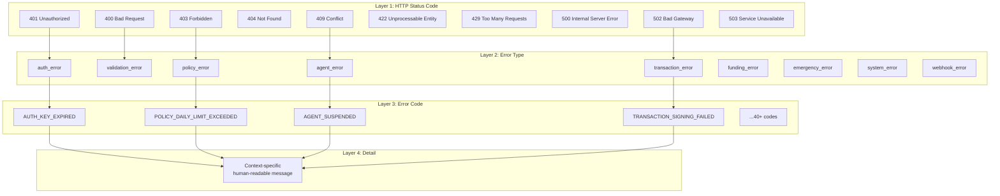
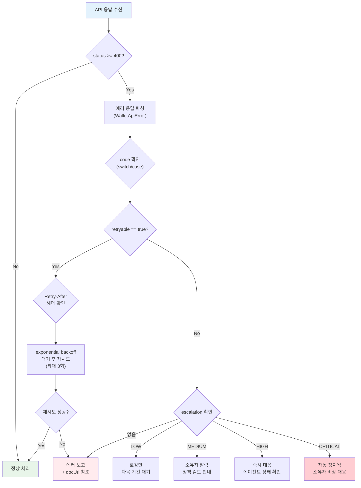

# 에러 코드 및 처리 규격 (API-04)

**문서 ID:** API-04
**작성일:** 2026-02-05
**상태:** 완료
**참조:** ARCH-03 (10-transaction-flow.md), ARCH-04 (11-security-threat-model.md), REL-01 (13-fund-deposit-process.md), REL-02 (14-fund-withdrawal-process.md), REL-03 (15-agent-lifecycle-management.md), REL-04 (16-emergency-recovery.md), 05-RESEARCH.md

---

## 1. 개요: 에러 응답 표준

### 1.1 RFC 9457 채택 배경

WAIaaS API는 **RFC 9457 (Problem Details for HTTP APIs)** 표준을 에러 응답의 기반으로 채택한다. RFC 9457은 2023년 IETF에 의해 발행된 에러 응답 표준으로, RFC 7807을 대체하며 업계에서 가장 널리 채택된 HTTP API 에러 포맷이다.

RFC 9457 채택 이유:
- **업계 표준:** IETF 공식 표준으로 Stripe, Coinbase 등 핀테크 API에서 검증됨
- **AI 에이전트 친화:** 구조화된 에러 응답으로 프로그래밍적 에러 분기 지원
- **확장 가능:** 표준 필드 외 도메인 특화 확장 필드 추가 가능
- **Content-Type 표준화:** `application/problem+json` MIME 타입으로 에러 응답임을 명시

### 1.2 Stripe 스타일 계층적 에러 코드와의 결합

RFC 9457의 표준 필드만으로는 에이전트가 에러를 프로그래밍적으로 세밀하게 분기하기 어렵다. Stripe이 검증한 **계층적 에러 코드 패턴**을 결합하여, `code` 필드로 도메인별 에러를 고유하게 식별하고, `type` 필드로 에러 범주를 분류한다.

### 1.3 핵심 원칙

| 원칙 | 설명 | 구현 |
|------|------|------|
| **동일 구조** | 모든 에러 응답이 WalletApiError 구조를 따름 | 단일 에러 미들웨어에서 포맷팅 |
| **프로그래밍적 처리** | `code` 필드로 switch/case 분기 가능 | SCREAMING_SNAKE_CASE 에러 코드 |
| **사람 가독성** | `detail` 필드에 사람이 읽을 수 있는 상세 설명 | 컨텍스트별 동적 메시지 |
| **문서 링크** | `docUrl` 필드로 에러별 상세 문서 연결 | https://docs.waiass.io/errors/{CODE} |
| **재시도 안내** | `retryable` 필드로 재시도 가능 여부 명시 | true/false + Retry-After 헤더 |
| **에스컬레이션** | `escalation` 필드로 위험 수준 전달 | LOW/MEDIUM/HIGH/CRITICAL |
| **내부 정보 비노출** | 스택 트레이스, DB 쿼리, 서버 경로를 에러에 포함하지 않음 | 핀테크 보안 필수 사항 |

---

## 2. 에러 응답 구조 (WalletApiError)

### 2.1 WalletApiError TypeScript 인터페이스

```typescript
/**
 * WAIaaS 통합 에러 응답 인터페이스
 *
 * RFC 9457 (Problem Details for HTTP APIs) 표준 필드와
 * Stripe 스타일 확장 필드를 결합한 에러 응답 구조.
 * 모든 API 에러 응답은 이 인터페이스를 따른다.
 *
 * Content-Type: application/problem+json
 */
interface WalletApiError {
  // ===== RFC 9457 표준 필드 =====

  /** 에러 타입 URI — 에러 범주를 식별하는 URI
   *  예: "https://api.waiass.io/errors/policy-violation" */
  type: string;

  /** 짧은 제목 — 에러 타입의 사람 가독 요약
   *  예: "Policy Violation" */
  title: string;

  /** HTTP 상태 코드
   *  예: 403 */
  status: number;

  /** 상세 설명 — 이 특정 발생 인스턴스의 사람 가독 설명
   *  예: "Transaction amount 5 SOL exceeds daily limit of 2 SOL" */
  detail: string;

  /** 요청 인스턴스 URI — 이 에러가 발생한 특정 요청 경로
   *  예: "/api/v1/transactions" */
  instance: string;

  // ===== 확장 필드 (Stripe 스타일) =====

  /** 도메인 에러 코드 — 프로그래밍적 분기용 고유 코드
   *  예: "POLICY_DAILY_LIMIT_EXCEEDED"
   *  명명 규칙: SCREAMING_SNAKE_CASE, 접두사=도메인 */
  code: string;

  /** 문제 파라미터 — 에러를 유발한 요청 파라미터 이름
   *  예: "amount" */
  param?: string;

  /** 요청 추적 ID — 디버깅용 고유 요청 식별자
   *  예: "req_01HV8PQXYZ" */
  requestId: string;

  /** 문서 링크 — 에러 코드별 상세 문서 URL
   *  예: "https://docs.waiass.io/errors/POLICY_DAILY_LIMIT_EXCEEDED" */
  docUrl: string;

  /** 재시도 가능 여부 — true이면 동일 요청을 재시도할 가치가 있음
   *  Retry-After 헤더와 함께 사용 */
  retryable: boolean;

  /** 에스컬레이션 수준 — 에러의 심각도/위험 수준
   *  LOW: 로깅만, MEDIUM: 소유자 알림, HIGH: 즉시 대응, CRITICAL: 자동 정지됨 */
  escalation?: 'LOW' | 'MEDIUM' | 'HIGH' | 'CRITICAL';
}
```

### 2.2 Content-Type 규격

모든 에러 응답은 다음 Content-Type 헤더를 포함한다:

```
Content-Type: application/problem+json
```

이는 RFC 9457이 정의한 표준 MIME 타입으로, 클라이언트가 응답이 에러 상세 정보임을 즉시 파악할 수 있다.

### 2.3 에러 응답 예시

#### 예시 1: 정책 위반 에러

```json
{
  "type": "https://api.waiass.io/errors/policy-violation",
  "title": "Policy Violation",
  "status": 403,
  "detail": "Transaction amount 5000000000 lamports exceeds daily limit of 2000000000 lamports. Remaining daily budget: 500000000 lamports.",
  "instance": "/api/v1/transactions",
  "code": "POLICY_DAILY_LIMIT_EXCEEDED",
  "param": "amount",
  "requestId": "req_01HV8PQXYZ",
  "docUrl": "https://docs.waiass.io/errors/POLICY_DAILY_LIMIT_EXCEEDED",
  "retryable": false,
  "escalation": "LOW"
}
```

#### 예시 2: 인증 실패 에러

```json
{
  "type": "https://api.waiass.io/errors/authentication-failed",
  "title": "Authentication Failed",
  "status": 401,
  "detail": "API key has expired. Please generate a new key from the dashboard.",
  "instance": "/api/v1/agents",
  "code": "AUTH_KEY_EXPIRED",
  "requestId": "req_01HV8PQABC",
  "docUrl": "https://docs.waiass.io/errors/AUTH_KEY_EXPIRED",
  "retryable": false
}
```

#### 예시 3: 에이전트 상태 충돌 에러

```json
{
  "type": "https://api.waiass.io/errors/agent-state-conflict",
  "title": "Agent State Conflict",
  "status": 409,
  "detail": "Agent agt_xyz is currently SUSPENDED. Resume the agent before executing transactions.",
  "instance": "/api/v1/transactions",
  "code": "AGENT_SUSPENDED",
  "requestId": "req_01HV8PQDEF",
  "docUrl": "https://docs.waiass.io/errors/AGENT_SUSPENDED",
  "retryable": false,
  "escalation": "MEDIUM"
}
```

---

## 3. 4-Layer 에러 코드 계층 구조

### 3.1 계층 다이어그램



### 3.2 4-Layer 계층 설명

| Layer | 역할 | 예시 | 사용 주체 |
|-------|------|------|----------|
| **Layer 1: HTTP Status Code** | HTTP 수준 에러 분류 (표준) | `403` | HTTP 클라이언트, 프록시, 로드밸런서 |
| **Layer 2: Error Type** | 도메인별 에러 범주 분류 | `policy_error` | SDK 에러 타입 계층 (catch 블록) |
| **Layer 3: Error Code** | 특정 에러 식별 (프로그래밍적 분기) | `POLICY_DAILY_LIMIT_EXCEEDED` | AI 에이전트 로직 (switch/case 분기) |
| **Layer 4: Detail** | 사람이 읽을 수 있는 컨텍스트 메시지 | "일일 한도 초과..." | 개발자 디버깅, 로그 분석 |

### 3.3 HTTP Status Code 사용 원칙

| HTTP Status | 의미 | 사용 시나리오 | 대표 에러 타입 |
|-------------|------|-------------|--------------|
| **400** | Bad Request | 요청 형식 오류, 필수 필드 누락, 잘못된 값 | validation_error |
| **401** | Unauthorized | API Key 없음, 만료, 유효하지 않은 토큰 | auth_error |
| **403** | Forbidden | 스코프 부족, 정책 위반, IP 차단 | auth_error, policy_error |
| **404** | Not Found | 에이전트/트랜잭션/웹훅 없음 | agent_error, transaction_error, webhook_error |
| **409** | Conflict | 에이전트 상태 충돌, 중복 제출, 진행 중 작업 | agent_error, transaction_error, funding_error |
| **422** | Unprocessable Entity | 시뮬레이션 실패, 잔액 부족 (문법 정상, 의미 오류) | transaction_error, funding_error |
| **429** | Too Many Requests | Rate Limit 초과 | system_error |
| **500** | Internal Server Error | 서버 내부 오류 (상세 비노출) | system_error |
| **502** | Bad Gateway | Solana RPC/KMS/Enclave 서비스 불가 | system_error, transaction_error |
| **503** | Service Unavailable | 점검 중, Circuit Breaker OPEN | system_error, emergency_error |

---

## 4. 에러 코드 레지스트리 (전체 목록)

### 4.1 인증 에러 (auth_error)

| Code | HTTP | Type | Title | Retryable | Escalation | 설명 |
|------|------|------|-------|-----------|------------|------|
| AUTH_KEY_INVALID | 401 | auth_error | Invalid API Key | false | - | API Key가 존재하지 않거나 형식이 잘못됨. 접두사(wai_live_, wai_test_) 확인 필요. |
| AUTH_KEY_EXPIRED | 401 | auth_error | API Key Expired | false | - | API Key가 만료됨. 대시보드에서 새 키 발급 필요. |
| AUTH_KEY_REVOKED | 401 | auth_error | API Key Revoked | false | - | 폐기된 API Key 사용 시도. 관리자가 명시적으로 폐기한 키. |
| AUTH_TOKEN_EXPIRED | 401 | auth_error | OAuth Token Expired | true | - | OAuth 2.1 access token이 만료됨. refresh token으로 갱신 후 재시도 가능. |
| AUTH_TOKEN_INVALID | 401 | auth_error | Invalid OAuth Token | false | - | OAuth 토큰이 유효하지 않음. 서명 불일치 또는 변조된 토큰. |
| AUTH_SCOPE_INSUFFICIENT | 403 | auth_error | Insufficient Scope | false | - | API Key 또는 OAuth 토큰의 스코프가 요청된 작업에 부족. 예: transactions:execute 스코프 없이 트랜잭션 실행 시도. |
| AUTH_IP_BLOCKED | 403 | auth_error | IP Not Allowed | false | LOW | 클라이언트 IP가 API Key의 IP 화이트리스트에 없음. |
| AUTH_MFA_REQUIRED | 403 | auth_error | MFA Required | false | - | 소유자 조작(정책 변경, 비상 회수 등)에 MFA 인증이 필요하나 제공되지 않음. |

### 4.2 검증 에러 (validation_error)

| Code | HTTP | Type | Title | Retryable | Escalation | 설명 |
|------|------|------|-------|-----------|------------|------|
| VALIDATION_REQUIRED_FIELD | 400 | validation_error | Required Field Missing | false | - | 필수 필드가 요청 본문에 누락됨. param 필드에 누락된 필드명 포함. |
| VALIDATION_INVALID_FORMAT | 400 | validation_error | Invalid Format | false | - | 필드 값의 형식이 잘못됨. 예: Solana 주소 형식 불일치, 금액 음수. |
| VALIDATION_OUT_OF_RANGE | 400 | validation_error | Value Out of Range | false | - | 필드 값이 허용 범위를 벗어남. 예: dailyLimit이 최소값 미만 또는 최대값 초과. |
| VALIDATION_INVALID_ENUM | 400 | validation_error | Invalid Enum Value | false | - | 열거값 필드에 허용되지 않은 값 전달. 예: replenishmentMode에 "invalid" 전달. |
| VALIDATION_DUPLICATE | 409 | validation_error | Duplicate Resource | false | - | 이미 존재하는 리소스 생성 시도. 예: 동일 이름 에이전트, 동일 URL 웹훅. |

### 4.3 정책 에러 (policy_error)

| Code | HTTP | Type | Title | Retryable | Escalation | 설명 |
|------|------|------|-------|-----------|------------|------|
| POLICY_PER_TX_LIMIT_EXCEEDED | 403 | policy_error | Per-Transaction Limit Exceeded | false | LOW | 단일 트랜잭션 금액이 건당 한도(perTransactionLimit)를 초과. ARCH-03 Step 2 서버 정책 검증에서 감지. |
| POLICY_DAILY_LIMIT_EXCEEDED | 403 | policy_error | Daily Limit Exceeded | false | LOW | 금일 누적 금액이 일일 한도(dailyLimit)를 초과. Redis 누적 사용량 기반 판단 (REL-01 4.1). |
| POLICY_WEEKLY_LIMIT_EXCEEDED | 403 | policy_error | Weekly Limit Exceeded | false | LOW | 금주 누적 금액이 주간 한도(weeklyLimit)를 초과. |
| POLICY_MONTHLY_LIMIT_EXCEEDED | 403 | policy_error | Monthly Limit Exceeded | false | LOW | 금월 누적 금액이 월간 한도(monthlyLimit)를 초과. |
| POLICY_DESTINATION_NOT_ALLOWED | 403 | policy_error | Destination Not Allowed | false | HIGH | 트랜잭션 목적지가 허용 목적지 화이트리스트(allowedDestinations)에 없음. ARCH-04 R05 이상 탐지 연동. |
| POLICY_PROGRAM_NOT_ALLOWED | 403 | policy_error | Program Not Allowed | false | HIGH | 호출하려는 Solana 프로그램이 허용 프로그램 화이트리스트(allowedPrograms)에 없음. Enclave 정책 검증에서도 재확인. |
| POLICY_TOKEN_NOT_ALLOWED | 403 | policy_error | Token Not Allowed | false | MEDIUM | 사용하려는 SPL 토큰이 허용 토큰 목록(allowedTokenMints)에 없음. |
| POLICY_OUTSIDE_OPERATING_HOURS | 403 | policy_error | Outside Operating Hours | false | LOW | 에이전트에 설정된 운영 시간(operatingHoursUtc) 외 시간대에 요청. ARCH-03 Step 2 시간 제어 검증. |
| POLICY_BLACKOUT_DATE | 403 | policy_error | Blackout Date | false | LOW | 거래 금지일(blackoutDates)에 트랜잭션 요청. |
| POLICY_GLOBAL_BUDGET_EXCEEDED | 403 | policy_error | Global Budget Exceeded | false | MEDIUM | 소유자의 전체 에이전트 합산 예산(GlobalBudgetLimit)을 초과. REL-05 Redis 서버 레벨 합산 추적에서 감지. |

### 4.4 에이전트 에러 (agent_error)

| Code | HTTP | Type | Title | Retryable | Escalation | 설명 |
|------|------|------|-------|-----------|------------|------|
| AGENT_NOT_FOUND | 404 | agent_error | Agent Not Found | false | - | 지정된 agentId에 해당하는 에이전트가 없음. |
| AGENT_SUSPENDED | 409 | agent_error | Agent Suspended | false | MEDIUM | 에이전트가 SUSPENDED 상태에서 트랜잭션 시도. REL-03 상태 모델에 따라 소유자 재활성화 필요. |
| AGENT_TERMINATED | 409 | agent_error | Agent Terminated | false | - | 폐기된(TERMINATED) 에이전트에 대한 조작 시도. REL-03에 따라 불가역 상태. |
| AGENT_CREATING | 409 | agent_error | Agent Creating | true | - | 아직 생성 중(CREATING) 에이전트 사용 시도. 초기화 완료 후 재시도 가능. |
| AGENT_TERMINATING | 409 | agent_error | Agent Terminating | false | - | 폐기 진행 중(TERMINATING) 에이전트에 대한 추가 작업 시도. REL-03 5절 폐기 9단계 진행 중. |
| AGENT_KEY_ROTATION_IN_PROGRESS | 409 | agent_error | Key Rotation In Progress | true | - | 키 로테이션 진행 중에 트랜잭션 시도. REL-03 6절 Drain-then-Rotate 패턴 수행 중. 로테이션 완료 후 재시도 가능. |

### 4.5 트랜잭션 에러 (transaction_error)

| Code | HTTP | Type | Title | Retryable | Escalation | 설명 |
|------|------|------|-------|-----------|------------|------|
| TRANSACTION_NOT_FOUND | 404 | transaction_error | Transaction Not Found | false | - | 지정된 txId에 해당하는 트랜잭션 기록이 없음. |
| TRANSACTION_ALREADY_SUBMITTED | 409 | transaction_error | Transaction Already Submitted | false | - | 동일 트랜잭션 ID로 중복 제출 시도. 멱등성 키(idempotencyKey) 중복. |
| TRANSACTION_SIGNING_FAILED | 502 | transaction_error | Signing Failed | true | HIGH | Enclave 또는 KMS에서 서명 실패. ARCH-03 Step 5 Enclave 검증 + 서명 단계 오류. Retry-After 헤더 포함. |
| TRANSACTION_SUBMISSION_FAILED | 502 | transaction_error | Submission Failed | true | MEDIUM | 온체인 트랜잭션 제출 실패. Solana RPC 네트워크 오류. ARCH-03 Step 7 다중 RPC Fallback 후에도 실패. |
| TRANSACTION_SIMULATION_FAILED | 422 | transaction_error | Simulation Failed | false | LOW | Solana 시뮬레이션 실패. ARCH-03 Step 4. 잔액 부족, 프로그램 오류 등 트랜잭션 자체의 문제. |
| TRANSACTION_EXPIRED | 409 | transaction_error | Transaction Expired | true | - | Solana blockhash가 만료되어 트랜잭션이 무효화됨 (~90초). 새 blockhash로 재구성 후 재시도 가능. |
| TRANSACTION_INSUFFICIENT_BALANCE | 422 | transaction_error | Insufficient Balance | false | LOW | Vault 잔액이 트랜잭션 금액에 부족. 충전 후 재시도 필요. |

### 4.6 자금 에러 (funding_error)

| Code | HTTP | Type | Title | Retryable | Escalation | 설명 |
|------|------|------|-------|-----------|------------|------|
| FUNDING_INSUFFICIENT_OWNER_BALANCE | 422 | funding_error | Insufficient Owner Balance | false | LOW | 소유자 지갑 잔액이 충전 금액에 부족. REL-01 5.2 자동 보충 시 ownerMinBalance 보호. |
| FUNDING_VAULT_ADDRESS_MISMATCH | 400 | funding_error | Vault Address Mismatch | false | HIGH | 충전 대상 주소가 Vault PDA와 불일치. REL-01 2.2 경고: 멀티시그 주소로 자금 전송 시 복구 불가. |
| FUNDING_REPLENISHMENT_LIMIT_REACHED | 429 | funding_error | Replenishment Limit Reached | true | MEDIUM | 일일 자동 보충 최대 횟수(maxDailyReplenishments, 기본 5회) 초과. REL-01 5.5 안전장치. Retry-After: 다음 자정. |
| FUNDING_WITHDRAWAL_IN_PROGRESS | 409 | funding_error | Withdrawal In Progress | true | - | 회수 진행 중에 충전 시도. REL-02 Redis 분산 락 충돌. 회수 완료 후 재시도 가능. |
| FUNDING_WITHDRAWAL_EXCEEDS_BALANCE | 422 | funding_error | Withdrawal Exceeds Balance | false | - | 회수 요청 금액이 Vault 잔액을 초과. REL-02 7.2 잔액 초과 회수 방지. |

### 4.7 비상 에러 (emergency_error)

| Code | HTTP | Type | Title | Retryable | Escalation | 설명 |
|------|------|------|-------|-----------|------------|------|
| EMERGENCY_ALREADY_SUSPENDED | 409 | emergency_error | Already Suspended | false | - | 이미 비상 정지(SUSPENDED) 상태인 에이전트에 추가 비상 정지 요청. REL-04 2.3 트리거 중복 처리. |
| EMERGENCY_RECOVERY_IN_PROGRESS | 409 | emergency_error | Recovery In Progress | false | CRITICAL | 비상 회수가 이미 진행 중. REL-04 Stage 5a ChangeThreshold + VaultTransaction 실행 중. |
| EMERGENCY_CIRCUIT_BREAKER_ACTIVE | 503 | emergency_error | Circuit Breaker Active | true | HIGH | Circuit Breaker OPEN 상태로 트랜잭션 차단 중. ARCH-04 6.4 연속 5회 실패 → 10분 후 HALF_OPEN 자동 전환. Retry-After 헤더에 남은 시간 포함. |

### 4.8 시스템 에러 (system_error)

| Code | HTTP | Type | Title | Retryable | Escalation | 설명 |
|------|------|------|-------|-----------|------------|------|
| SYSTEM_INTERNAL_ERROR | 500 | system_error | Internal Server Error | true | - | 예기치 않은 서버 내부 오류. 스택 트레이스 등 내부 정보는 비노출. requestId로 서버 로그 조회 가능. |
| SYSTEM_KMS_UNAVAILABLE | 502 | system_error | KMS Service Unavailable | true | HIGH | AWS KMS 서비스 접근 불가. Owner Key 서명 작업 불가. Retry-After 헤더 포함. |
| SYSTEM_ENCLAVE_UNAVAILABLE | 502 | system_error | Enclave Service Unavailable | true | CRITICAL | Nitro Enclave 서비스 접근 불가. ARCH-03 Fail-safe 발동으로 모든 트랜잭션 거부. |
| SYSTEM_RPC_UNAVAILABLE | 502 | system_error | RPC Service Unavailable | true | HIGH | Solana RPC(Helius) 서비스 접근 불가. ARCH-03 5.3 다중 RPC Fallback 모두 실패 시 발생. |
| SYSTEM_DATABASE_ERROR | 500 | system_error | Database Error | true | HIGH | 데이터베이스 연결 또는 쿼리 오류. 상세 정보 비노출. |
| SYSTEM_RATE_LIMITED | 429 | system_error | Rate Limit Exceeded | true | - | API Rate Limit 초과. Retry-After 헤더에 대기 시간(초) 포함. exponential backoff 권장. |
| SYSTEM_MAINTENANCE | 503 | system_error | Service Maintenance | true | - | 서비스 점검 중. Retry-After 헤더에 예상 복구 시간 포함. |

### 4.9 Webhook 에러 (webhook_error)

| Code | HTTP | Type | Title | Retryable | Escalation | 설명 |
|------|------|------|-------|-----------|------------|------|
| WEBHOOK_NOT_FOUND | 404 | webhook_error | Webhook Not Found | false | - | 지정된 webhookId에 해당하는 웹훅 등록이 없음. |
| WEBHOOK_URL_UNREACHABLE | 400 | webhook_error | Webhook URL Unreachable | false | - | 웹훅 등록 시 URL 검증에서 접근 불가 판정. 테스트 요청(POST)에 2xx 응답 없음. |
| WEBHOOK_SIGNATURE_INVALID | 401 | webhook_error | Webhook Signature Invalid | false | - | 웹훅 수신 측에서 HMAC-SHA256 서명 검증 실패 시 클라이언트가 반환해야 하는 에러. X-WAIaaS-Signature 헤더 불일치. |
| WEBHOOK_DELIVERY_FAILED | 500 | webhook_error | Webhook Delivery Failed | true | LOW | 웹훅 전달 실패 (수신 측 5xx 또는 타임아웃). 최대 3회 재시도 후 DLQ. |

---

## 5. 에러 처리 가이드 (개발자 향)

### 5.1 에러 처리 플로우차트



### 5.2 재시도 전략

`retryable: true`인 에러에 대해 다음 재시도 전략을 권장한다:

| 항목 | 값 | 설명 |
|------|---|------|
| **알고리즘** | exponential backoff + jitter | 지수 백오프에 무작위 지터 추가 |
| **초기 대기** | 1초 | 첫 번째 재시도 전 대기 시간 |
| **배수** | 2x | 각 재시도마다 대기 시간 2배 증가 |
| **대기 시간 패턴** | 1초, 2초, 4초 | 3회까지의 대기 시간 |
| **최대 재시도** | 3회 | 3회 실패 시 에러 보고 |
| **Retry-After 우선** | Yes | 서버가 Retry-After 헤더를 제공하면 해당 값 사용 |

```typescript
// 재시도 전략 구현 예시
async function retryableRequest<T>(
  fn: () => Promise<T>,
  maxRetries: number = 3
): Promise<T> {
  for (let attempt = 0; attempt <= maxRetries; attempt++) {
    try {
      return await fn();
    } catch (error) {
      if (!isWalletApiError(error) || !error.retryable) throw error;
      if (attempt === maxRetries) throw error;

      const retryAfter = error.headers?.['retry-after'];
      const baseDelay = retryAfter
        ? parseInt(retryAfter) * 1000
        : Math.pow(2, attempt) * 1000;
      const jitter = Math.random() * 500;

      await sleep(baseDelay + jitter);
    }
  }
  throw new Error('Unreachable');
}
```

### 5.3 에스컬레이션별 대응 가이드

| 수준 | 의미 | 권장 대응 | 예시 에러 코드 |
|------|------|----------|--------------|
| **LOW** | 경미한 문제, 자동 해결 가능 | 로깅만. 다음 기간(일/주/월) 리셋 대기. | POLICY_DAILY_LIMIT_EXCEEDED, TRANSACTION_SIMULATION_FAILED |
| **MEDIUM** | 소유자 인지 필요 | 소유자에게 알림 전송. 정책 검토 또는 잔액 확인 안내. | POLICY_GLOBAL_BUDGET_EXCEEDED, AGENT_SUSPENDED |
| **HIGH** | 즉시 대응 필요 | 에이전트 상태 확인. 보안 이벤트 가능성 검토. 포렌식 준비. | POLICY_DESTINATION_NOT_ALLOWED, TRANSACTION_SIGNING_FAILED |
| **CRITICAL** | 자동 정지 완료 | 에이전트가 이미 SUSPENDED 상태. 소유자 비상 대응 필요. 비상 회수 또는 폐기 판단. | SYSTEM_ENCLAVE_UNAVAILABLE, EMERGENCY_CIRCUIT_BREAKER_ACTIVE |

### 5.4 SDK에서의 에러 처리 패턴

#### TypeScript SDK

```typescript
import { WaiassClient, WalletApiError, PolicyError, AuthError } from '@waiass/sdk';

const client = new WaiassClient('wai_live_xxx');

try {
  const result = await client.transactions.execute({
    to: 'DRpbCB...',
    amount: '5000000000', // 5 SOL
  });
  console.log('Transaction confirmed:', result.signature);

} catch (error) {
  if (error instanceof WalletApiError) {
    // error.code로 프로그래밍적 분기
    switch (error.code) {
      case 'POLICY_DAILY_LIMIT_EXCEEDED':
        console.log(`일일 한도 초과. 문서: ${error.docUrl}`);
        // 다음 날까지 대기
        break;

      case 'AGENT_SUSPENDED':
        console.log('에이전트 정지됨. 소유자 재활성화 필요.');
        // 소유자에게 알림
        break;

      case 'TRANSACTION_SIGNING_FAILED':
        if (error.retryable) {
          // exponential backoff 재시도
          await retryableRequest(() => client.transactions.execute(/*...*/));
        }
        break;

      case 'SYSTEM_RATE_LIMITED':
        const retryAfter = error.headers?.['retry-after'] ?? 1;
        await sleep(retryAfter * 1000);
        // 재시도
        break;

      default:
        console.error(`Unhandled error: ${error.code}`, error.detail);
        console.error(`Documentation: ${error.docUrl}`);
    }
  }
}
```

#### Python SDK

```python
from waiass import WaiassClient
from waiass.errors import (
    WalletApiError, PolicyError, AuthError,
    TransactionError, AgentError
)
import asyncio

client = WaiassClient(api_key="wai_live_xxx")

try:
    result = await client.transactions.execute(
        to="DRpbCB...",
        amount="5000000000",
    )
    print(f"Transaction confirmed: {result.signature}")

except PolicyError as e:
    # 정책 에러 (policy_error 타입 전체)
    print(f"Policy violation: {e.code} - {e.detail}")
    print(f"Documentation: {e.doc_url}")

except AgentError as e:
    if e.code == "AGENT_SUSPENDED":
        print("Agent suspended. Owner reactivation required.")

except TransactionError as e:
    if e.retryable:
        # 재시도 가능한 에러
        for attempt in range(3):
            delay = (2 ** attempt) + random.uniform(0, 0.5)
            await asyncio.sleep(delay)
            try:
                result = await client.transactions.execute(...)
                break
            except TransactionError:
                continue

except WalletApiError as e:
    # 모든 WAIaaS 에러의 기본 타입
    print(f"Error [{e.code}]: {e.detail}")
    print(f"Request ID: {e.request_id}")
```

---

## 6. Webhook 에러 이벤트 매핑

### 6.1 에러 코드 -> Webhook 이벤트 매핑 테이블

에러 발생 시 관련 Webhook 이벤트가 자동으로 트리거된다. 이를 통해 소유자/관리자가 에러를 실시간으로 모니터링할 수 있다.

| 에러 코드 패턴 | Webhook 이벤트 | 페이로드 포함 정보 | 트리거 조건 |
|---------------|---------------|------------------|-----------|
| POLICY_* (모든 정책 에러) | `policy.violation` | code, detail, amount, limit, escalation | 정책 위반 발생 시마다 |
| TRANSACTION_SIGNING_FAILED | `transaction.failed` | code, stage=SIGNING, error detail | 서명 실패 시 |
| TRANSACTION_SUBMISSION_FAILED | `transaction.failed` | code, stage=SUBMITTING, rpc provider | 온체인 제출 실패 시 |
| TRANSACTION_SIMULATION_FAILED | `transaction.failed` | code, stage=SIMULATING, simulation logs | 시뮬레이션 실패 시 |
| EMERGENCY_CIRCUIT_BREAKER_ACTIVE | `emergency.triggered` | code, trigger=circuit_breaker, consecutive failures | Circuit Breaker OPEN 시 |
| EMERGENCY_ALREADY_SUSPENDED | `emergency.triggered` | code, trigger type, additional trigger detail | 추가 비상 트리거 감지 시 |
| AGENT_SUSPENDED | `agent.suspended` | code, reason, trigger type | 에이전트 정지 전환 시 |
| AGENT_TERMINATED | `agent.terminated` | code, recovered balance, tx signatures | 에이전트 폐기 완료 시 |
| AGENT_KEY_ROTATION_IN_PROGRESS | `agent.key_rotated` | code, old key (masked), rotation reason | 키 로테이션 시작/완료 시 |
| FUNDING_REPLENISHMENT_LIMIT_REACHED | `funding.low_balance` | code, current balance, daily replenishment count | 보충 한도 도달 시 |
| TRANSACTION_INSUFFICIENT_BALANCE | `funding.low_balance` | code, vault balance, requested amount | 잔액 부족 감지 시 |

### 6.2 에스컬레이션 수준별 Webhook 전달 우선순위

| 에스컬레이션 수준 | Webhook 전달 정책 | 재시도 전략 | 전달 실패 시 |
|----------------|----------------|-----------|------------|
| **LOW** | 일반 큐 (FIFO) | 3회, exponential backoff (1s, 5s, 25s) | DLQ 저장 |
| **MEDIUM** | 일반 큐 (FIFO) | 3회, exponential backoff (1s, 5s, 25s) | DLQ 저장 + 내부 알림 |
| **HIGH** | 우선 큐 (Priority Queue) | 5회, 빠른 재시도 (1s, 2s, 4s, 8s, 16s) | DLQ 저장 + SMS 알림 |
| **CRITICAL** | 즉시 전달 (Skip Queue) | 5회, 빠른 재시도 (1s, 2s, 4s, 8s, 16s) | DLQ 저장 + SMS + PagerDuty |

### 6.3 Webhook 에러 이벤트 페이로드 예시

```json
{
  "id": "evt_01HV8PQXYZ",
  "type": "policy.violation",
  "createdAt": "2026-02-05T14:30:00Z",
  "data": {
    "errorCode": "POLICY_DAILY_LIMIT_EXCEEDED",
    "errorType": "policy_error",
    "detail": "Transaction amount exceeds daily limit",
    "escalation": "LOW",
    "context": {
      "requestedAmount": "5000000000",
      "dailyLimit": "2000000000",
      "dailySpent": "1500000000",
      "remainingBudget": "500000000"
    }
  },
  "agentId": "agt_abc123",
  "requestId": "req_01HV8PQDEF"
}
```

---

## 7. 에러 코드 거버넌스

### 7.1 코드 명명 규칙

| 규칙 | 설명 | 예시 |
|------|------|------|
| **케이스** | SCREAMING_SNAKE_CASE | `POLICY_DAILY_LIMIT_EXCEEDED` |
| **접두사** | 도메인 이름 (AUTH_, POLICY_, TRANSACTION_, AGENT_, FUNDING_, EMERGENCY_, SYSTEM_, WEBHOOK_, VALIDATION_) | `AUTH_KEY_EXPIRED` |
| **구조** | `{DOMAIN}_{ACTION_OR_SUBJECT}_{DETAIL}` | `FUNDING_WITHDRAWAL_IN_PROGRESS` |
| **동사 시제** | 과거분사 또는 형용사 | EXCEEDED, FAILED, EXPIRED, INVALID |
| **길이** | 최대 50자 | - |
| **고유성** | 전체 레지스트리에서 유일해야 함 | - |

### 7.2 새 에러 코드 추가 절차

```
1. 도메인 확인
   └── 에러가 속하는 도메인(auth, policy, transaction, ...) 결정
   └── 기존 에러 코드로 커버 가능한지 확인 (중복 방지)

2. 코드 명명
   └── SCREAMING_SNAKE_CASE 규칙 준수
   └── 접두사 = 도메인 이름
   └── 기존 코드와 혼동 없는 명확한 이름

3. 레지스트리 등록
   └── 본 문서(20-error-codes.md) 해당 도메인 섹션에 추가
   └── code, HTTP status, type, title, retryable, escalation, 설명 명세
   └── Webhook 이벤트 매핑 확인

4. docUrl 생성
   └── https://docs.waiass.io/errors/{ERROR_CODE} 페이지 작성
   └── 에러 원인, 해결 방법, 관련 API 문서 링크 포함

5. SDK 반영
   └── TypeScript/Python SDK 에러 타입 계층에 새 에러 추가
   └── CHANGELOG 업데이트
```

### 7.3 에러 코드 폐기(Deprecation) 절차

```
1. deprecated 마킹
   └── 에러 코드 레지스트리에 deprecated: true 표시
   └── 대체 에러 코드(replacement) 명시
   └── API 응답에 Deprecation 헤더 추가

2. 유예 기간 (6개월)
   └── 기존 에러 코드와 새 에러 코드 병행 반환
   └── 개발자 문서에 마이그레이션 가이드 제공
   └── SDK에 deprecation warning 추가

3. 삭제
   └── 6개월 유예 후 기존 에러 코드 제거
   └── 레지스트리에서 완전 삭제
   └── SDK에서 해당 에러 타입 제거
```

### 7.4 docUrl 패턴

모든 에러 코드는 개별 문서 페이지를 가진다:

```
패턴: https://docs.waiass.io/errors/{ERROR_CODE}

예시:
- https://docs.waiass.io/errors/POLICY_DAILY_LIMIT_EXCEEDED
- https://docs.waiass.io/errors/AUTH_KEY_EXPIRED
- https://docs.waiass.io/errors/AGENT_SUSPENDED
- https://docs.waiass.io/errors/TRANSACTION_SIGNING_FAILED
```

각 에러 문서 페이지에 포함할 내용:
- 에러 코드 및 HTTP 상태 코드
- 에러 원인 상세 설명
- 해결 방법 (Step-by-step)
- 관련 API 엔드포인트 링크
- 코드 예시 (에러 핸들링)

---

## 8. 트랜잭션 흐름별 에러 매핑

### 8.1 ARCH-03 8단계 트랜잭션 흐름 에러 매핑

ARCH-03(10-transaction-flow.md)에서 정의한 8단계 트랜잭션 흐름의 각 단계에서 발생 가능한 에러 코드를 매핑한다.

| 단계 | 이름 | 발생 가능 에러 코드 | Fail-safe 동작 |
|------|------|------------------|--------------|
| Step 1 | API 진입 및 인증 | AUTH_KEY_INVALID, AUTH_KEY_EXPIRED, AUTH_KEY_REVOKED, AUTH_TOKEN_EXPIRED, AUTH_TOKEN_INVALID, AUTH_SCOPE_INSUFFICIENT, AUTH_IP_BLOCKED, SYSTEM_RATE_LIMITED | 401/403/429 반환 |
| Step 2 | 서버 정책 평가 (1차) | POLICY_PER_TX_LIMIT_EXCEEDED, POLICY_DAILY_LIMIT_EXCEEDED, POLICY_WEEKLY_LIMIT_EXCEEDED, POLICY_MONTHLY_LIMIT_EXCEEDED, POLICY_DESTINATION_NOT_ALLOWED, POLICY_PROGRAM_NOT_ALLOWED, POLICY_TOKEN_NOT_ALLOWED, POLICY_OUTSIDE_OPERATING_HOURS, POLICY_BLACKOUT_DATE, POLICY_GLOBAL_BUDGET_EXCEEDED | REJECTED + 에스컬레이션 |
| Step 3 | 트랜잭션 구성 | VALIDATION_REQUIRED_FIELD, VALIDATION_INVALID_FORMAT | BUILD_FAILED 반환 |
| Step 4 | 시뮬레이션 | TRANSACTION_SIMULATION_FAILED, TRANSACTION_INSUFFICIENT_BALANCE | SIMULATION_FAILED 반환 |
| Step 5 | Enclave 검증 + 서명 (2차) | TRANSACTION_SIGNING_FAILED, SYSTEM_ENCLAVE_UNAVAILABLE, AGENT_SUSPENDED (Enclave 정책 위반 시) | REJECTED + Fail-safe |
| Step 6 | Squads 온체인 정책 | (온체인 거부 — Spending Limit 초과) | 온체인 트랜잭션 실패 |
| Step 7 | 블록체인 제출 | TRANSACTION_SUBMISSION_FAILED, SYSTEM_RPC_UNAVAILABLE, TRANSACTION_EXPIRED | SUBMIT_FAILED 반환 |
| Step 8 | 결과 통보 | WEBHOOK_DELIVERY_FAILED (Webhook 전달 실패 시) | Webhook 재시도 (3회) |

### 8.2 에이전트 상태별 에러 매핑

REL-03(15-agent-lifecycle-management.md)에서 정의한 5단계 상태 모델의 각 상태에서 반환되는 에러 코드.

| 에이전트 상태 | 트랜잭션 시도 시 | 정보 조회 시 | 설정 변경 시 |
|-------------|---------------|------------|------------|
| CREATING | AGENT_CREATING | 정상 반환 | 정상 반환 |
| ACTIVE | 정상 실행 | 정상 반환 | 정상 반환 |
| SUSPENDED | AGENT_SUSPENDED | 정상 반환 | 정상 반환 (소유자) |
| TERMINATING | AGENT_TERMINATING | 정상 반환 | AGENT_TERMINATING |
| TERMINATED | AGENT_TERMINATED | AGENT_TERMINATED | AGENT_TERMINATED |

---

## 9. 참조 문서

### 9.1 내부 문서

| 문서 | 내용 | 위치 |
|------|------|------|
| **ARCH-03** | 트랜잭션 데이터 흐름 (8단계, 상태 전이, Fail-safe) | .planning/deliverables/10-transaction-flow.md |
| **ARCH-04** | 보안 위협 모델 (Circuit Breaker, 이상 탐지, 4단계 대응) | .planning/deliverables/11-security-threat-model.md |
| **REL-01** | 자금 충전 프로세스 (Budget Pool, 보충 안전장치) | .planning/deliverables/13-fund-deposit-process.md |
| **REL-02** | 자금 회수 프로세스 (수동/자동/비상 회수) | .planning/deliverables/14-fund-withdrawal-process.md |
| **REL-03** | 에이전트 생명주기 (5단계 상태, 키 로테이션) | .planning/deliverables/15-agent-lifecycle-management.md |
| **REL-04** | 비상 회수 메커니즘 (4가지 트리거, 대기 tx 처리) | .planning/deliverables/16-emergency-recovery.md |
| **05-RESEARCH** | Phase 5 리서치 (RFC 9457, Stripe 패턴, WalletApiError) | .planning/phases/05-api-및-통합-설계/05-RESEARCH.md |

### 9.2 외부 참조

| 참조 | 내용 | 신뢰도 |
|------|------|--------|
| [RFC 9457](https://www.rfc-editor.org/rfc/rfc9457.html) | Problem Details for HTTP APIs (IETF 표준) | HIGH |
| [Stripe API Errors](https://docs.stripe.com/api/errors) | Stripe 에러 응답 구조, 타입, 코드 | HIGH |
| [Stripe Error Codes](https://docs.stripe.com/error-codes) | 계층적 에러 코드 레지스트리 | HIGH |
| [Swagger + RFC 9457](https://swagger.io/blog/problem-details-rfc9457-doing-api-errors-well/) | RFC 9457 실무 적용 가이드 | MEDIUM |

---

*문서 ID: API-04*
*작성일: 2026-02-05*
*Phase: 05-api-및-통합-설계*
*상태: 완료*
