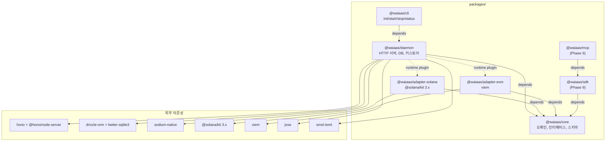

# 모노레포 패키지 구조 + 데이터 디렉토리 + TOML 설정 스펙 (CORE-01)

**문서 ID:** CORE-01
**작성일:** 2026-02-05
**v0.5 업데이트:** 2026-02-07
**v0.7 API 통합 프로토콜:** 2026-02-08
**v0.7 스키마 설정 확정:** 2026-02-08
**v0.9 토큰 파일 인프라:** 2026-02-09
**상태:** 완료
**참조:** ARCH-02, 06-RESEARCH.md, 06-CONTEXT.md, 52-auth-model-redesign.md (v0.5), 38-sdk-mcp-interface.md (v0.7), 35-notification-architecture.md (v0.7 notifications 확장 키), v0.9-session-management-automation.md (v0.9 토큰 파일 사양)

---

## 1. 모노레포 패키지 구조

### 1.1 전체 디렉토리 트리

```
waiaas/
├── packages/
│   ├── core/                          # 도메인 모델, 인터페이스, Zod 스키마
│   │   ├── src/
│   │   │   ├── domain/                # 도메인 엔티티
│   │   │   │   ├── agent.ts           # Agent 엔티티 + 타입
│   │   │   │   ├── session.ts         # Session 엔티티 + 타입
│   │   │   │   ├── transaction.ts     # Transaction 엔티티 + 타입
│   │   │   │   └── policy.ts          # Policy 엔티티 + 타입
│   │   │   ├── interfaces/            # 추상화 인터페이스
│   │   │   │   ├── ILocalKeyStore.ts  # 키스토어 인터페이스
│   │   │   │   ├── IBlockchainAdapter.ts  # 체인 추상화
│   │   │   │   ├── IPolicyEngine.ts   # 정책 엔진 인터페이스
│   │   │   │   └── INotificationChannel.ts  # 알림 채널 인터페이스
│   │   │   ├── schemas/               # Zod SSoT 스키마
│   │   │   │   ├── agent.schema.ts    # Agent 요청/응답 스키마
│   │   │   │   ├── session.schema.ts  # Session 스키마
│   │   │   │   ├── transaction.schema.ts  # Transaction 스키마
│   │   │   │   ├── policy.schema.ts   # Policy 스키마
│   │   │   │   └── config.schema.ts   # Config 검증 스키마
│   │   │   ├── errors/                # 도메인 에러 코드
│   │   │   │   ├── error-codes.ts     # v0.1 46개 재사용 + 확장
│   │   │   │   └── base-error.ts      # WAIaaSError 베이스 클래스
│   │   │   ├── utils/                 # 공유 유틸리티
│   │   │   │   └── token-file.ts      # [v0.9] getMcpTokenPath, writeMcpToken, readMcpToken
│   │   │   └── index.ts               # 패키지 진입점
│   │   ├── package.json
│   │   └── tsconfig.json
│   │
│   ├── daemon/                        # Self-hosted 데몬 (Primary deliverable)
│   │   ├── src/
│   │   │   ├── infrastructure/        # 인프라 계층
│   │   │   │   ├── database/          # Drizzle ORM + SQLite
│   │   │   │   │   ├── schema.ts      # 전체 테이블 정의
│   │   │   │   │   ├── connection.ts  # DB 연결 + PRAGMA 설정
│   │   │   │   │   └── migrate.ts     # 자동 마이그레이션
│   │   │   │   ├── keystore/          # 암호화 키스토어
│   │   │   │   │   ├── keystore.ts    # KeyStore 클래스
│   │   │   │   │   ├── crypto.ts      # AES-256-GCM + Argon2id
│   │   │   │   │   └── memory.ts      # sodium-native 메모리 관리
│   │   │   │   ├── cache/             # LRU 캐시
│   │   │   │   │   └── session-cache.ts
│   │   │   │   ├── notifications/     # 알림 발송
│   │   │   │   │   ├── telegram.ts
│   │   │   │   │   ├── discord.ts
│   │   │   │   │   └── ntfy.ts
│   │   │   │   └── config/            # TOML 설정 로더
│   │   │   │       └── loader.ts      # 설정 로드 + 환경변수 오버라이드
│   │   │   ├── server/                # Hono HTTP 서버
│   │   │   │   ├── app.ts             # OpenAPIHono 인스턴스
│   │   │   │   ├── middleware/        # 미들웨어
│   │   │   │   │   ├── auth.ts        # 세션 토큰 검증
│   │   │   │   │   ├── host-guard.ts  # Host 헤더 검증
│   │   │   │   │   └── rate-limit.ts  # 속도 제한
│   │   │   │   └── routes/            # API 라우트
│   │   │   │       ├── agents.ts      # /v1/agents
│   │   │   │       ├── sessions.ts    # /v1/sessions
│   │   │   │       ├── transactions.ts # /v1/transactions
│   │   │   │       └── health.ts      # /health
│   │   │   ├── services/              # 비즈니스 로직
│   │   │   │   ├── agent-service.ts
│   │   │   │   ├── session-service.ts
│   │   │   │   ├── transaction-service.ts
│   │   │   │   └── policy-engine.ts
│   │   │   ├── lifecycle/             # 데몬 라이프사이클
│   │   │   │   ├── daemon.ts          # DaemonLifecycle 클래스
│   │   │   │   ├── signal-handler.ts  # SIGINT/SIGTERM 처리
│   │   │   │   └── workers.ts         # 백그라운드 워커 (WAL checkpoint 등)
│   │   │   └── index.ts               # 데몬 진입점
│   │   ├── drizzle/                   # 마이그레이션 파일 (drizzle-kit generate 산출물)
│   │   ├── package.json
│   │   ├── tsconfig.json
│   │   └── drizzle.config.ts          # drizzle-kit 설정
│   │
│   ├── adapters/
│   │   ├── solana/                    # SolanaAdapter (@solana/kit 3.x)
│   │   │   ├── src/
│   │   │   │   ├── adapter.ts         # SolanaAdapter 구현
│   │   │   │   ├── transaction-builder.ts  # pipe 기반 트랜잭션 빌드
│   │   │   │   ├── rpc.ts             # RPC 클라이언트 설정
│   │   │   │   └── index.ts
│   │   │   ├── package.json
│   │   │   └── tsconfig.json
│   │   │
│   │   └── evm/                       # EVMAdapter (viem)
│   │       ├── src/
│   │       │   ├── adapter.ts         # EVMAdapter 구현
│   │       │   ├── client.ts          # viem 클라이언트 설정
│   │       │   └── index.ts
│   │       ├── package.json
│   │       └── tsconfig.json
│   │
│   ├── cli/                           # waiaas CLI (npm 글로벌 설치)
│   │   ├── src/
│   │   │   ├── commands/              # CLI 커맨드
│   │   │   │   ├── init.ts            # waiaas init
│   │   │   │   ├── start.ts           # waiaas start [--daemon]
│   │   │   │   ├── stop.ts            # waiaas stop
│   │   │   │   └── status.ts          # waiaas status
│   │   │   ├── utils/                 # CLI 유틸리티
│   │   │   │   ├── data-dir.ts        # 데이터 디렉토리 해석
│   │   │   │   └── password-prompt.ts # 마스터 패스워드 입력
│   │   │   └── index.ts               # CLI 진입점
│   │   ├── bin/
│   │   │   └── waiaas                 # npm global entry point (#!/usr/bin/env node)
│   │   ├── package.json
│   │   └── tsconfig.json
│   │
│   ├── sdk/                           # @waiaas/sdk (Phase 9에서 설계)
│   │   ├── src/
│   │   │   └── index.ts               # placeholder
│   │   ├── package.json
│   │   └── tsconfig.json
│   │
│   └── mcp/                           # @waiaas/mcp (Phase 9에서 설계)
│       ├── src/
│       │   └── index.ts               # placeholder
│       ├── package.json
│       └── tsconfig.json
│
├── turbo.json                         # Turborepo 빌드 설정
├── pnpm-workspace.yaml                # pnpm 워크스페이스
├── package.json                       # 루트 패키지
├── tsconfig.base.json                 # 공유 TypeScript 설정
└── .nvmrc                             # Node.js 22 LTS
```

### 1.2 패키지별 역할 정의

| 패키지 | npm name | 역할 | 주요 exports |
|--------|----------|------|-------------|
| `packages/core` | `@waiaas/core` | 도메인 모델, 인터페이스, Zod 스키마, 에러 코드. 모든 패키지가 의존하는 공유 계층 | 타입, 인터페이스, Zod 스키마, 에러 클래스 |
| `packages/daemon` | `@waiaas/daemon` | Self-hosted 데몬. Hono HTTP 서버, SQLite, 키스토어, 라이프사이클 관리 | `startDaemon()`, `DaemonLifecycle` |
| `packages/adapters/solana` | `@waiaas/adapter-solana` | Solana 블록체인 어댑터. @solana/kit 3.x 기반 | `SolanaAdapter` (implements `IBlockchainAdapter`) |
| `packages/adapters/evm` | `@waiaas/adapter-evm` | EVM 블록체인 어댑터. viem 기반 | `EVMAdapter` (implements `IBlockchainAdapter`) |
| `packages/cli` | `@waiaas/cli` (bin: `waiaas`) | CLI 도구. init/start/stop/status 커맨드 | binary entry point |
| `packages/sdk` | `@waiaas/sdk` | 외부 개발자용 SDK (Phase 9) | `WAIaaSClient` |
| `packages/mcp` | `@waiaas/mcp` | MCP 서버 (Phase 9) | `MCPServer` |

### 1.3 패키지 의존 관계



**빌드 순서 (의존성 그래프에 의해 결정):**

```
Step 1: @waiaas/core              (의존성 없음)
Step 2: @waiaas/adapter-solana    (core에 의존)
         @waiaas/adapter-evm      (core에 의존)  -- 병렬 빌드
Step 3: @waiaas/daemon            (core + adapters에 의존)
Step 4: @waiaas/cli               (daemon에 의존)
         @waiaas/sdk              (core에 의존)   -- 병렬 빌드
Step 5: @waiaas/mcp               (sdk에 의존)
```

### 1.4 Workspace 설정

#### pnpm-workspace.yaml

```yaml
packages:
  - 'packages/*'
  - 'packages/adapters/*'
```

#### turbo.json

```json
{
  "$schema": "https://turbo.build/schema.json",
  "tasks": {
    "build": {
      "dependsOn": ["^build"],
      "outputs": ["dist/**"],
      "inputs": ["src/**", "tsconfig.json", "package.json"]
    },
    "test": {
      "dependsOn": ["build"],
      "outputs": [],
      "inputs": ["src/**", "test/**", "*.test.ts"]
    },
    "test:unit": {
      "dependsOn": ["build"],
      "outputs": []
    },
    "test:integration": {
      "dependsOn": ["build"],
      "outputs": []
    },
    "lint": {
      "outputs": [],
      "inputs": ["src/**", ".eslintrc.*"]
    },
    "typecheck": {
      "dependsOn": ["^build"],
      "outputs": []
    },
    "clean": {
      "cache": false
    }
  }
}
```

#### 루트 package.json

```json
{
  "name": "waiaas",
  "private": true,
  "packageManager": "pnpm@9.15.0",
  "engines": {
    "node": ">=22.0.0"
  },
  "scripts": {
    "build": "turbo run build",
    "test": "turbo run test",
    "test:unit": "turbo run test:unit",
    "test:integration": "turbo run test:integration",
    "lint": "turbo run lint",
    "typecheck": "turbo run typecheck",
    "clean": "turbo run clean",
    "dev": "turbo run dev --filter=@waiaas/daemon",
    "format": "prettier --write \"packages/*/src/**/*.ts\"",
    "prepare": "husky"
  },
  "devDependencies": {
    "turbo": "^2.4.0",
    "typescript": "^5.7.0",
    "prettier": "^3.4.0",
    "husky": "^9.1.0",
    "vitest": "^3.0.0",
    "@types/node": "^22.0.0"
  }
}
```

#### tsconfig.base.json (루트)

```json
{
  "compilerOptions": {
    "target": "ES2022",
    "module": "NodeNext",
    "moduleResolution": "NodeNext",
    "lib": ["ES2022"],
    "declaration": true,
    "declarationMap": true,
    "sourceMap": true,
    "outDir": "dist",
    "rootDir": "src",
    "strict": true,
    "esModuleInterop": true,
    "skipLibCheck": true,
    "forceConsistentCasingInFileNames": true,
    "resolveJsonModule": true,
    "isolatedModules": true
  }
}
```

### 1.5 패키지별 package.json

#### @waiaas/core

```json
{
  "name": "@waiaas/core",
  "version": "0.2.0",
  "type": "module",
  "main": "dist/index.js",
  "types": "dist/index.d.ts",
  "exports": {
    ".": {
      "types": "./dist/index.d.ts",
      "default": "./dist/index.js"
    },
    "./domain": {
      "types": "./dist/domain/index.d.ts",
      "default": "./dist/domain/index.js"
    },
    "./interfaces": {
      "types": "./dist/interfaces/index.d.ts",
      "default": "./dist/interfaces/index.js"
    },
    "./schemas": {
      "types": "./dist/schemas/index.d.ts",
      "default": "./dist/schemas/index.js"
    },
    "./errors": {
      "types": "./dist/errors/index.d.ts",
      "default": "./dist/errors/index.js"
    }
  },
  "scripts": {
    "build": "tsc",
    "test": "vitest run",
    "test:unit": "vitest run",
    "lint": "eslint src/",
    "typecheck": "tsc --noEmit",
    "clean": "rm -rf dist"
  },
  "dependencies": {
    "zod": "^3.24.0"
  },
  "devDependencies": {
    "typescript": "^5.7.0",
    "vitest": "^3.0.0"
  }
}
```

#### @waiaas/core Zod 스키마 Export 패턴 [v0.7 보완]

`@waiaas/core`의 `index.ts`에서 타입(`z.infer`)과 Zod 스키마를 named export한다. `@waiaas/sdk`는 workspace 참조로 이 스키마를 import하여 클라이언트 사전 검증에 사용한다.

```typescript
// packages/core/src/index.ts

// === 타입 (z.infer) -- tree-shaking, 런타임 0 바이트 ===
export type { TransferRequest } from './schemas/transaction.schema.js'
export type { TokenTransferRequest } from './schemas/transaction.schema.js'
export type { ContractCallRequest } from './schemas/transaction.schema.js'
export type { ApproveRequest } from './schemas/transaction.schema.js'
export type { BatchRequest } from './schemas/transaction.schema.js'
export type { TransactionResponse } from './schemas/transaction.schema.js'
export type { SessionConstraints, SessionCreateRequest, SessionCreateResponse } from './schemas/session.schema.js'
export type { AgentCreateRequest, AgentSummary } from './schemas/agent.schema.js'

// === Zod 스키마 (런타임 검증용) ===
export {
  TransferRequestSchema,
  TokenTransferRequestSchema,
  ContractCallRequestSchema,
  ApproveRequestSchema,
  BatchRequestSchema,
  TransactionRequestSchema,  // discriminatedUnion 5-type
} from './schemas/transaction.schema.js'

export {
  SessionConstraintsSchema,
  SessionCreateRequestSchema,
} from './schemas/session.schema.js'

export {
  AgentCreateRequestSchema,
} from './schemas/agent.schema.js'
```

**원칙:**
- 타입은 `export type` (tree-shaking, 런타임 0 바이트)
- 스키마는 `export` (런타임 검증에 사용, Zod 코드 포함)
- 스키마 이름 규칙: `{PascalCaseName}Schema` (예: `TransferRequestSchema`)
- 파일 위치 규칙: `packages/core/src/schemas/{domain}.schema.ts`
- `TransactionRequestSchema`는 `z.discriminatedUnion('type', [...])` 5-type으로 정의 (TRANSFER, TOKEN_TRANSFER, CONTRACT_CALL, APPROVE, BATCH)
- v0.6 확장 타입(ContractCallRequest, ApproveRequest, BatchRequest) 포함 완료

#### @waiaas/daemon

```json
{
  "name": "@waiaas/daemon",
  "version": "0.2.0",
  "type": "module",
  "main": "dist/index.js",
  "types": "dist/index.d.ts",
  "exports": {
    ".": {
      "types": "./dist/index.d.ts",
      "default": "./dist/index.js"
    }
  },
  "scripts": {
    "build": "tsc",
    "dev": "tsx watch src/index.ts",
    "test": "vitest run",
    "test:unit": "vitest run --dir test/unit",
    "test:integration": "vitest run --dir test/integration",
    "lint": "eslint src/",
    "typecheck": "tsc --noEmit",
    "clean": "rm -rf dist",
    "db:generate": "drizzle-kit generate",
    "db:migrate": "tsx src/infrastructure/database/migrate.ts"
  },
  "dependencies": {
    "@waiaas/core": "workspace:*",
    "hono": "^4.11.0",
    "@hono/node-server": "^1.14.0",
    "@hono/zod-openapi": "^0.18.0",
    "drizzle-orm": "^0.45.0",
    "better-sqlite3": "^12.6.0",
    "sodium-native": "^5.0.10",
    "argon2": "^0.44.0",
    "jose": "^6.0.0",
    "lru-cache": "^11.0.0",
    "smol-toml": "^1.3.0",
    "viem": "^2.23.0"
  },
  "devDependencies": {
    "@types/better-sqlite3": "^7.6.0",
    "drizzle-kit": "^0.30.0",
    "tsx": "^4.19.0",
    "typescript": "^5.7.0",
    "vitest": "^3.0.0"
  }
}
```

> **[v0.7 보완]** SIWE 검증이 viem/siwe로 전환되어 daemon에 `viem` 직접 의존. `siwe`/`ethers` 패키지 불필요. Native addon prebuild 전략: `sodium-native`(prebuildify), `better-sqlite3`(prebuild-install), `argon2`(node-pre-gyp).

#### @waiaas/adapter-solana

```json
{
  "name": "@waiaas/adapter-solana",
  "version": "0.2.0",
  "type": "module",
  "main": "dist/index.js",
  "types": "dist/index.d.ts",
  "exports": {
    ".": {
      "types": "./dist/index.d.ts",
      "default": "./dist/index.js"
    }
  },
  "scripts": {
    "build": "tsc",
    "test": "vitest run",
    "test:unit": "vitest run",
    "lint": "eslint src/",
    "typecheck": "tsc --noEmit",
    "clean": "rm -rf dist"
  },
  "dependencies": {
    "@waiaas/core": "workspace:*",
    "@solana/kit": "^3.0.0",
    "@solana-program/system": "^0.7.0"
  },
  "devDependencies": {
    "typescript": "^5.7.0",
    "vitest": "^3.0.0"
  }
}
```

#### @waiaas/adapter-evm

```json
{
  "name": "@waiaas/adapter-evm",
  "version": "0.2.0",
  "type": "module",
  "main": "dist/index.js",
  "types": "dist/index.d.ts",
  "exports": {
    ".": {
      "types": "./dist/index.d.ts",
      "default": "./dist/index.js"
    }
  },
  "scripts": {
    "build": "tsc",
    "test": "vitest run",
    "test:unit": "vitest run",
    "lint": "eslint src/",
    "typecheck": "tsc --noEmit",
    "clean": "rm -rf dist"
  },
  "dependencies": {
    "@waiaas/core": "workspace:*",
    "viem": "^2.23.0"
  },
  "devDependencies": {
    "typescript": "^5.7.0",
    "vitest": "^3.0.0"
  }
}
```

#### @waiaas/cli

```json
{
  "name": "@waiaas/cli",
  "version": "0.2.0",
  "type": "module",
  "bin": {
    "waiaas": "bin/waiaas"
  },
  "main": "dist/index.js",
  "types": "dist/index.d.ts",
  "scripts": {
    "build": "tsc",
    "test": "vitest run",
    "test:unit": "vitest run",
    "lint": "eslint src/",
    "typecheck": "tsc --noEmit",
    "clean": "rm -rf dist"
  },
  "dependencies": {
    "@waiaas/daemon": "workspace:*"
  },
  "devDependencies": {
    "typescript": "^5.7.0",
    "vitest": "^3.0.0"
  }
}
```

**Note:** `packages/sdk`와 `packages/mcp`의 package.json은 Phase 9에서 상세 정의. 현재는 placeholder로 name과 version만 설정.

---

## 2. 데이터 디렉토리 레이아웃 (~/.waiaas/)

### 2.1 경로 해석 로직

데이터 디렉토리는 다음 우선순위로 결정된다:

```typescript
function resolveDataDir(): string {
  // 1. 환경변수 최우선
  if (process.env.WAIAAS_DATA_DIR) {
    return process.env.WAIAAS_DATA_DIR;
  }

  // 2. XDG Base Directory 스펙 준수
  if (process.env.XDG_DATA_HOME) {
    return path.join(process.env.XDG_DATA_HOME, 'waiaas');
  }

  // 3. 기본 경로
  return path.join(os.homedir(), '.waiaas');
}
```

**환경변수를 사용한 멀티 프로필 운용:**

```bash
# devnet 전용 데몬
WAIAAS_DATA_DIR=~/.waiaas-devnet waiaas start

# mainnet 전용 데몬
WAIAAS_DATA_DIR=~/.waiaas-mainnet waiaas start
```

### 2.2 전체 디렉토리 트리

```
~/.waiaas/                             # 데이터 루트 (700)
├── config.toml                        # 데몬 설정 파일 (600)
├── .master-password                   # (v0.5 추가) 마스터 패스워드 파일. --quickstart 시 자동 생성 (600)
├── daemon.lock                        # [v0.7 보완] flock 기반 인스턴스 잠금 파일. fd 유지 기반 (644)
├── daemon.pid                         # PID 파일 - 보조 정보 [v0.7: 보조로 격하] (644)
├── mcp-token                          # [v0.9] MCP 세션 토큰 (600)
├── data/                              # 데이터 파일 (700)
│   ├── waiaas.db                      # SQLite 메인 데이터베이스 (600)
│   ├── waiaas.db-wal                  # WAL 저널 (자동 생성) (600)
│   └── waiaas.db-shm                  # 공유 메모리 (자동 생성) (600)
├── keystore/                          # 암호화된 키 파일 (700)
│   └── <agent-id>.json                # 에이전트별 키스토어 파일 (600)
├── logs/                              # 로그 디렉토리 (700)
│   └── daemon.log                     # 데몬 로그 (644)
├── backups/                           # 백업 디렉토리 (700)
│   └── waiaas-<timestamp>.db          # DB 백업 파일 (600)
└── drizzle/                           # 마이그레이션 메타데이터 (700)
    └── meta/                          # drizzle-kit 메타 (700)
```

### 2.3 파일/디렉토리 상세 정의

| 경로 | 용도 | 생성 시점 | 권한 | 소유자 |
|------|------|----------|------|--------|
| `~/.waiaas/` | 데이터 루트 디렉토리 | `waiaas init` | `700` (rwx------) | 실행 사용자 |
| `config.toml` | 데몬 설정 (TOML 포맷) | `waiaas init` (기본값 생성) | `600` (rw-------) | 실행 사용자 |
| `.master-password` | (v0.5 추가) 마스터 패스워드 파일. `--quickstart`로 자동 생성되거나 `--password-file`로 참조됨 | `waiaas init --quickstart` | `600` (rw-------) | 실행 사용자 |
| `daemon.lock` | [v0.7 보완] flock 기반 인스턴스 잠금 파일. fd 유지 기반 잠금. 내용물은 PID (보조 정보) | `waiaas start` (Step 1) | `644` (rw-r--r--) | 실행 사용자 |
| `daemon.pid` | 데몬 PID (보조 정보, [v0.7 보완] status 명령 표시용으로 격하) | `waiaas start --daemon` | `644` (rw-r--r--) | 실행 사용자 |
| `mcp-token` | [v0.9] MCP 세션 토큰 파일. `wai_sess_` + JWT 문자열 (개행 없음). MCP SessionManager/CLI/Telegram Bot이 `writeMcpToken()`으로 공유 쓰기 | `waiaas mcp setup`, `mcp refresh-token`, Telegram `/newsession`, SessionManager 자동 갱신 | `600` (rw-------) | 실행 사용자 |
| `data/` | SQLite 데이터베이스 디렉토리 | `waiaas init` | `700` (rwx------) | 실행 사용자 |
| `data/waiaas.db` | SQLite 메인 DB (WAL 모드) | 데몬 첫 시작 시 마이그레이션으로 생성 | `600` (rw-------) | 실행 사용자 |
| `data/waiaas.db-wal` | WAL 저널 파일 | SQLite가 WAL 모드 진입 시 자동 생성 | `600` (rw-------) | 실행 사용자 |
| `data/waiaas.db-shm` | 공유 메모리 파일 | SQLite가 WAL 모드 진입 시 자동 생성 | `600` (rw-------) | 실행 사용자 |
| `keystore/` | 암호화된 에이전트 키 파일 | `waiaas init` | `700` (rwx------) | 실행 사용자 |
| `keystore/<agent-id>.json` | 개별 에이전트 키스토어 (AES-256-GCM + Argon2id 암호화) | 에이전트 생성 시 (`POST /v1/agents`) | `600` (rw-------) | 실행 사용자 |
| `logs/` | 데몬 운영 로그 | `waiaas init` | `700` (rwx------) | 실행 사용자 |
| `logs/daemon.log` | 데몬 stdout/stderr 로그 (로테이션 대상) | 데몬 시작 시 | `644` (rw-r--r--) | 실행 사용자 |
| `backups/` | DB 및 키스토어 백업 | `waiaas init` | `700` (rwx------) | 실행 사용자 |
| `backups/waiaas-<ts>.db` | SQLite 백업 (VACUUM INTO) | 수동 또는 스케줄 백업 시 | `600` (rw-------) | 실행 사용자 |
| `drizzle/` | 마이그레이션 메타데이터 | 데몬 첫 시작 시 | `700` (rwx------) | 실행 사용자 |

### 2.4 디렉토리 초기화 (`waiaas init`)

`waiaas init` 커맨드가 수행하는 작업:

```typescript
async function initDataDir(dataDir: string): Promise<void> {
  // 1. 루트 디렉토리 생성
  await fs.mkdir(dataDir, { recursive: true, mode: 0o700 });

  // 2. 하위 디렉토리 생성
  const dirs = ['data', 'keystore', 'logs', 'backups', 'drizzle'];
  for (const dir of dirs) {
    await fs.mkdir(path.join(dataDir, dir), { recursive: true, mode: 0o700 });
  }

  // 3. 기본 config.toml 생성 (존재하지 않을 때만)
  const configPath = path.join(dataDir, 'config.toml');
  if (!await fileExists(configPath)) {
    await fs.writeFile(configPath, DEFAULT_CONFIG_TOML, { mode: 0o600 });
  }

  // 4. 권한 검증
  await verifyPermissions(dataDir);
}
```

### 2.5 보안 고려사항

- **파일 권한:** 모든 민감 파일(DB, 키스토어, config)은 `600` (소유자만 읽기/쓰기)
- **디렉토리 권한:** 모든 디렉토리는 `700` (소유자만 접근)
- **umask 검증:** `waiaas init` 시 현재 umask가 `0077` 이상인지 경고
- **심볼릭 링크 방지:** 데이터 디렉토리 내 심볼릭 링크 존재 시 거부
- **네트워크 FS 방지:** SQLite는 로컬 파일시스템에서만 안전하게 동작. NFS/SMB 감지 시 경고
- **daemon.pid 경합:** PID 파일 존재 시 해당 프로세스가 실제 실행 중인지 확인 후 시작

---

## 3. TOML 설정 파일 스펙 (config.toml)

### 3.1 설정 로드 순서

설정은 다음 순서로 적용되며, 후순위가 이전을 오버라이드한다:

```
1. 하드코딩 기본값 (코드 내 DEFAULT_CONFIG)
    ↓ 오버라이드
2. config.toml 파일 (smol-toml로 파싱)
    ↓ 오버라이드
3. 환경변수 (WAIAAS_ 접두어)
```

### 3.2 환경변수 매핑 규칙 [v0.7 보완]

> **[v0.7 보완] 중첩 섹션 금지 규칙:** config.toml에서 `[rpc.solana]`, `[notifications.telegram]`, `[security.auto_stop]` 같은 중첩 섹션(dotted section)을 **사용하지 않는다**. 모든 키는 `[section]` 내 평탄화된 snake_case 키로 정의한다. 이는 환경변수 매핑의 1:1 단순성을 보장하기 위함이다.

TOML 섹션과 키는 다음 규칙으로 환경변수에 매핑된다:

```
규칙: WAIAAS_{SECTION}_{KEY} -> [section].key
     (SECTION = 대문자, KEY = 대문자, 언더스코어 구분)

예시: WAIAAS_RPC_SOLANA_MAINNET -> [rpc].solana_mainnet
```

**평탄화 매핑 -- 기존 중첩 -> 평탄화 대조표:**

| 기존 중첩 구조 | 평탄화 후 | 환경변수 |
|--------------|----------|---------|
| `[rpc.solana].mainnet` | `[rpc].solana_mainnet` | `WAIAAS_RPC_SOLANA_MAINNET` |
| `[rpc.solana].devnet` | `[rpc].solana_devnet` | `WAIAAS_RPC_SOLANA_DEVNET` |
| `[rpc.solana].testnet` | `[rpc].solana_testnet` | `WAIAAS_RPC_SOLANA_TESTNET` |
| `[rpc.solana.ws].mainnet` | `[rpc].solana_ws_mainnet` | `WAIAAS_RPC_SOLANA_WS_MAINNET` |
| `[rpc.solana.ws].devnet` | `[rpc].solana_ws_devnet` | `WAIAAS_RPC_SOLANA_WS_DEVNET` |
| `[rpc.ethereum].mainnet` | `[rpc].ethereum_mainnet` | `WAIAAS_RPC_ETHEREUM_MAINNET` |
| `[rpc.ethereum].sepolia` | `[rpc].ethereum_sepolia` | `WAIAAS_RPC_ETHEREUM_SEPOLIA` |
| `[notifications.telegram].bot_token` | `[notifications].telegram_bot_token` | `WAIAAS_NOTIFICATIONS_TELEGRAM_BOT_TOKEN` |
| `[notifications.telegram].chat_id` | `[notifications].telegram_chat_id` | `WAIAAS_NOTIFICATIONS_TELEGRAM_CHAT_ID` |
| `[notifications.discord].webhook_url` | `[notifications].discord_webhook_url` | `WAIAAS_NOTIFICATIONS_DISCORD_WEBHOOK_URL` |
| `[notifications.ntfy].server` | `[notifications].ntfy_server` | `WAIAAS_NOTIFICATIONS_NTFY_SERVER` |
| `[notifications.ntfy].topic` | `[notifications].ntfy_topic` | `WAIAAS_NOTIFICATIONS_NTFY_TOPIC` |
| `[security.auto_stop].consecutive_failures_threshold` | `[security].auto_stop_consecutive_failures_threshold` | `WAIAAS_SECURITY_AUTO_STOP_CONSECUTIVE_FAILURES_THRESHOLD` |
| `[security.policy_defaults].delay_seconds` | `[security].policy_defaults_delay_seconds` | `WAIAAS_SECURITY_POLICY_DEFAULTS_DELAY_SECONDS` |
| `[security.policy_defaults].approval_timeout` | `[security].policy_defaults_approval_timeout` | `WAIAAS_SECURITY_POLICY_DEFAULTS_APPROVAL_TIMEOUT` |
| `[security.kill_switch].recovery_cooldown` | `[security].kill_switch_recovery_cooldown` | `WAIAAS_SECURITY_KILL_SWITCH_RECOVERY_COOLDOWN` |
| `[security.kill_switch].max_recovery_attempts` | `[security].kill_switch_max_recovery_attempts` | `WAIAAS_SECURITY_KILL_SWITCH_MAX_RECOVERY_ATTEMPTS` |

**전체 환경변수 매핑 테이블:**

| 환경변수 | TOML 키 | 예시 |
|---------|---------|------|
| `WAIAAS_DAEMON_PORT` | `[daemon].port` | `3001` |
| `WAIAAS_DAEMON_LOG_LEVEL` | `[daemon].log_level` | `debug` |
| `WAIAAS_KEYSTORE_ARGON2_MEMORY` | `[keystore].argon2_memory` | `65536` |
| `WAIAAS_RPC_SOLANA_MAINNET` | `[rpc].solana_mainnet` | `https://custom.rpc.com` |
| `WAIAAS_RPC_SOLANA_WS_MAINNET` | `[rpc].solana_ws_mainnet` | `wss://custom.rpc.com` |
| `WAIAAS_RPC_ETHEREUM_MAINNET` | `[rpc].ethereum_mainnet` | `https://eth-mainnet.alchemyapi.io/v2/...` |
| `WAIAAS_SECURITY_SESSION_TTL` | `[security].session_ttl` | `86400` |
| `WAIAAS_SECURITY_JWT_SECRET` | `[security].jwt_secret` | `a1b2c3...` (64자 hex) |
| `WAIAAS_SECURITY_NONCE_STORAGE` | `[security].nonce_storage` | `"memory"` |
| `WAIAAS_SECURITY_NONCE_CACHE_MAX` | `[security].nonce_cache_max` | `1000` |
| `WAIAAS_SECURITY_NONCE_CACHE_TTL` | `[security].nonce_cache_ttl` | `300` |
| `WAIAAS_SECURITY_RATE_LIMIT_GLOBAL_IP_RPM` | `[security].rate_limit_global_ip_rpm` | `1000` |
| `WAIAAS_SECURITY_RATE_LIMIT_SESSION_RPM` | `[security].rate_limit_session_rpm` | `300` |
| `WAIAAS_SECURITY_RATE_LIMIT_TX_RPM` | `[security].rate_limit_tx_rpm` | `10` |
| `WAIAAS_SECURITY_AUTO_STOP_CONSECUTIVE_FAILURES_THRESHOLD` | `[security].auto_stop_consecutive_failures_threshold` | `3` |
| `WAIAAS_SECURITY_POLICY_DEFAULTS_DELAY_SECONDS` | `[security].policy_defaults_delay_seconds` | `300` |
| `WAIAAS_SECURITY_POLICY_DEFAULTS_APPROVAL_TIMEOUT` | `[security].policy_defaults_approval_timeout` | `3600` |
| `WAIAAS_SECURITY_KILL_SWITCH_RECOVERY_COOLDOWN` | `[security].kill_switch_recovery_cooldown` | `1800` |
| `WAIAAS_SECURITY_KILL_SWITCH_MAX_RECOVERY_ATTEMPTS` | `[security].kill_switch_max_recovery_attempts` | `3` |
| `WAIAAS_NOTIFICATIONS_TELEGRAM_BOT_TOKEN` | `[notifications].telegram_bot_token` | `123456:ABC-DEF...` |
| `WAIAAS_NOTIFICATIONS_DISCORD_WEBHOOK_URL` | `[notifications].discord_webhook_url` | `https://discord.com/api/webhooks/...` |
| `WAIAAS_NOTIFICATIONS_NTFY_SERVER` | `[notifications].ntfy_server` | `https://ntfy.sh` |
| `WAIAAS_NOTIFICATIONS_MIN_CHANNELS` | `[notifications].min_channels` | `2` |
| `WAIAAS_WALLETCONNECT_PROJECT_ID` | `[walletconnect].project_id` | `""` |

**특수 환경변수 (TOML에 없는 항목):**

| 환경변수 | 용도 | 예시 |
|---------|------|------|
| `WAIAAS_DATA_DIR` | 데이터 디렉토리 경로 오버라이드 | `~/.waiaas-devnet` |
| `WAIAAS_DAEMON_HOSTNAME` | 바인딩 주소 오버라이드 (Docker 전용: `0.0.0.0`) | `0.0.0.0` |
| `WAIAAS_MASTER_PASSWORD` | 마스터 패스워드 (비대화형 모드) | `my-secure-password` |
| `WAIAAS_MASTER_PASSWORD_FILE` | 마스터 패스워드 파일 경로 | `/run/secrets/master_pw` |

### 3.3 전체 키-값 구조 [v0.7 보완]

> **[v0.7 보완]** 모든 섹션이 평탄화된 snake_case 키만 사용한다. 중첩 섹션(`[section.subsection]`)은 허용하지 않는다.

#### [daemon] 섹션 -- 데몬 서버 설정

| 키 | 타입 | 기본값 | 유효 범위 | 설명 |
|----|------|--------|----------|------|
| `port` | integer | `3100` | 1024-65535 | HTTP 서버 포트 |
| `hostname` | string | `"127.0.0.1"` | `"127.0.0.1"`, `"0.0.0.0"` (Docker 전용) | 바인딩 주소. 기본 localhost. Docker 컨테이너 환경에서 `0.0.0.0` 허용 (환경변수 `WAIAAS_DAEMON_HOSTNAME` 오버라이드) |
| `log_level` | string | `"info"` | `"trace"`, `"debug"`, `"info"`, `"warn"`, `"error"` | 로그 레벨 |
| `log_file` | string | `"logs/daemon.log"` | 상대 경로 (DATA_DIR 기준) 또는 절대 경로 | 로그 파일 경로 |
| `log_max_size` | string | `"50MB"` | `"1MB"` ~ `"1GB"` | 로그 파일 최대 크기 (로테이션 트리거) |
| `log_max_files` | integer | `5` | 1-100 | 보관할 로그 파일 수 |
| `pid_file` | string | `"daemon.pid"` | 상대 경로 (DATA_DIR 기준) 또는 절대 경로 | PID 파일 경로 |
| `shutdown_timeout` | integer | `30` | 5-300 (초) | Graceful shutdown 타임아웃 |
| `dev_mode` | boolean | `false` | true/false | (v0.5 추가) --dev 모드 영구 설정. true 시 고정 패스워드 'waiaas-dev' 사용. 프로덕션 사용 금지. 54-cli-flow-redesign.md 섹션 7 참조 |

#### [keystore] 섹션 -- 키스토어 암호화 설정

| 키 | 타입 | 기본값 | 유효 범위 | 설명 |
|----|------|--------|----------|------|
| `argon2_memory` | integer | `65536` | 32768-1048576 (KiB) | Argon2id 메모리 비용 (기본: 64 MiB) |
| `argon2_time` | integer | `3` | 1-20 | Argon2id 반복 횟수 |
| `argon2_parallelism` | integer | `4` | 1-16 | Argon2id 병렬 스레드 수 |
| `backup_on_rotate` | boolean | `true` | true/false | 키 로테이션 시 이전 키 백업 여부 |

**Note:** Argon2id 기본 파라미터(m=64MiB, t=3, p=4)는 06-CONTEXT.md에서 확정된 값이다. config.toml로 조정 가능하지만, 기본값 미만으로 설정 시 경고를 출력한다.

#### [rpc] 섹션 -- 체인별 RPC 엔드포인트 [v0.7 보완: 평탄화]

> **[v0.7 보완]** 기존 `[rpc.solana]`, `[rpc.solana.ws]`, `[rpc.ethereum]` 중첩 섹션이 `[rpc]` 단일 섹션으로 평탄화되었다.

| 키 | 타입 | 기본값 | 유효 범위 | 설명 |
|----|------|--------|----------|------|
| `solana_mainnet` | string | `"https://api.mainnet-beta.solana.com"` | URL | Solana Mainnet Beta RPC |
| `solana_devnet` | string | `"https://api.devnet.solana.com"` | URL | Solana Devnet RPC |
| `solana_testnet` | string | `"https://api.testnet.solana.com"` | URL | Solana Testnet RPC |
| `solana_ws_mainnet` | string | `"wss://api.mainnet-beta.solana.com"` | URL | Solana Mainnet WebSocket |
| `solana_ws_devnet` | string | `"wss://api.devnet.solana.com"` | URL | Solana Devnet WebSocket |
| `ethereum_mainnet` | string | `""` | URL | Ethereum Mainnet RPC (사용자 설정 필수) |
| `ethereum_sepolia` | string | `""` | URL | Ethereum Sepolia Testnet RPC |

#### [database] 섹션 -- SQLite 설정

| 키 | 타입 | 기본값 | 유효 범위 | 설명 |
|----|------|--------|----------|------|
| `path` | string | `"data/waiaas.db"` | 상대 경로 (DATA_DIR 기준) 또는 절대 경로 | DB 파일 경로 |
| `wal_checkpoint_interval` | integer | `300` | 60-3600 (초) | WAL 체크포인트 주기 |
| `busy_timeout` | integer | `5000` | 1000-30000 (ms) | SQLite busy timeout |
| `cache_size` | integer | `64000` | 2000-512000 (KiB, 음수로 전달) | SQLite 페이지 캐시 크기 |
| `mmap_size` | integer | `268435456` | 0-1073741824 (bytes) | 메모리 매핑 크기 (기본: 256 MiB) |

#### [notifications] 섹션 -- 알림 채널 설정 [v0.7 보완: 평탄화 + 확장 키]

> **[v0.7 보완]** 기존 `[notifications.telegram]`, `[notifications.discord]`, `[notifications.ntfy]` 중첩 섹션이 `[notifications]` 단일 섹션으로 평탄화되었다. 35-notification-architecture.md 섹션 12.4의 확장 키(min_channels, health_check_interval 등)도 통합하였다.
>
> **채널 최소 요구 규칙:** 활성 채널 수와 정책 엔진 4-tier 동작의 관계는 35-notification-architecture.md 구현 노트 참조.

| 키 | 타입 | 기본값 | 유효 범위 | 설명 |
|----|------|--------|----------|------|
| `enabled` | boolean | `false` | true/false | 알림 시스템 활성화 여부 |
| `min_channels` | integer | `2` | 1-10 | 최소 활성 채널 수. 미만 시 NOTIFY/DELAY/APPROVAL 정책 사용 불가 (35-notification-architecture.md 섹션 12.4) |
| `health_check_interval` | integer | `300` | 60-3600 (초) | healthCheck 주기 -- 5분 |
| `log_retention_days` | integer | `30` | 7-365 (일) | notification_log 보존 기간 |
| `dedup_ttl` | integer | `300` | 60-3600 (초) | 중복 방지 TTL -- 5분 |
| `telegram_bot_token` | string | `""` | 문자열 | Telegram Bot API 토큰 |
| `telegram_chat_id` | string | `""` | 문자열 | Telegram 대상 채팅 ID |
| `discord_webhook_url` | string | `""` | URL | Discord Webhook URL |
| `ntfy_server` | string | `"https://ntfy.sh"` | URL | ntfy 서버 URL |
| `ntfy_topic` | string | `""` | 문자열 | ntfy 구독 토픽 |

#### [security] 섹션 -- 보안 설정 [v0.7 보완: 평탄화]

> **[v0.7 보완]** 기존 `[security.auto_stop]`, `[security.policy_defaults]`, `[security.kill_switch]` 중첩 섹션이 `[security]` 단일 섹션으로 평탄화되었다. 키 이름에 접두어를 추가하여 의미를 유지한다.

| 키 | 타입 | 기본값 | 유효 범위 | 설명 |
|----|------|--------|----------|------|
| `session_ttl` | integer | `86400` | 300-604800 (초) | 세션 토큰 유효 기간 -- 24시간. Phase 7 SESS-PROTO에서 24시간 기본으로 확정 |
| `jwt_secret` | string | `""` | 64자 hex (256비트) | [v0.7 보완] **초기값 전용.** `waiaas init` 시 `crypto.randomBytes(32).toString('hex')` 자동 생성하여 config에 기록. 이후 DB system_state에서 관리. `waiaas secret rotate` 시 config.toml은 갱신하지 않음. 30-session-token-protocol.md 섹션 2.7.5 참조 |
| `max_sessions_per_agent` | integer | `5` | 1-50 | 에이전트당 최대 동시 세션 수 |
| `max_pending_tx` | integer | `10` | 1-100 | 최대 대기 트랜잭션 수 |
| `nonce_storage` | string | `"memory"` | `"memory"`, `"sqlite"` | [v0.7 보완] Nonce 저장소 타입. `memory`: 인메모리 LRU (기본, 빠름), `sqlite`: SQLite nonces 테이블 (데몬 재시작 후 nonce 유지). SESS-PROTO 섹션 4.2 INonceStore 참조 |
| `nonce_cache_max` | integer | `1000` | 100-10000 | Nonce LRU 캐시 최대 항목 수 (memory 모드에서만 유효. SESS-PROTO 참조) |
| `nonce_cache_ttl` | integer | `300` | 60-600 (초) | Nonce TTL -- 5분 |
| `rate_limit_global_ip_rpm` | integer | `1000` | 100-10000 | [v0.7 보완] IP 기반 전역 RPM (Stage 1 globalRateLimit). localhost에서는 전체 요청 상한. 기존 `rate_limit_global_rpm`(100)에서 이름/값 변경. CORE-06 섹션 7 참조 |
| `rate_limit_session_rpm` | integer | `300` | 10-5000 | 세션당 RPM (인증 후) |
| `rate_limit_tx_rpm` | integer | `10` | 1-100 | 거래 전송 RPM |
| `cors_origins` | array of string | `["http://localhost:3100", "http://127.0.0.1:3100"]` | URL 배열 | 허용 CORS origin |
| `auto_stop_consecutive_failures_threshold` | integer | `3` | 1-20 | 연속 트랜잭션 실패 시 자동 정지 임계값 (AutoStopEngine CONSECUTIVE_FAILURES 규칙, KILL-AUTO-EVM 참조) |
| `policy_defaults_delay_seconds` | integer | `300` | 60-3600 (초) | DELAY 티어 기본 쿨다운 -- 5분. LOCK-MECH에서 확정 |
| `policy_defaults_approval_timeout` | integer | `3600` | 300-86400 (초) | APPROVAL 티어 기본 승인 대기 -- 1시간. LOCK-MECH에서 확정 |
| `kill_switch_recovery_cooldown` | integer | `1800` | 600-86400 (초) | 복구 최소 쿨다운 -- 30분. KILL-AUTO-EVM에서 확정 |
| `kill_switch_max_recovery_attempts` | integer | `3` | 1-10 | 복구 실패 시 최대 재시도 횟수 |

#### [walletconnect] 섹션 -- WalletConnect v2 설정 (v0.5: 선택적 편의 기능)

> **v0.5 변경:** WalletConnect는 "Owner 지갑 연결의 유일한 경로"에서 "모바일 지갑 push 서명의 편의 기능"으로 역할 변경. 미설정 시에도 CLI 수동 서명으로 ownerAuth가 가능하다.

| 키 | 타입 | 기본값 | 유효 범위 | 설명 |
|----|------|--------|----------|------|
| `project_id` | string | `""` | 문자열 | Reown Cloud에서 발급한 WalletConnect projectId. 선택 사항. 미설정 시 WC 기능 비활성 (CLI 수동 서명은 항상 가능) |

**`waiaas init` 안내 메시지 (v0.5 변경):**

```
WalletConnect projectId가 미설정입니다. 모바일 지갑 push 서명을 사용하려면
https://cloud.reown.com 에서 발급하세요.
CLI 수동 서명은 projectId 없이도 사용 가능합니다.
```

### 3.4 전체 기본 config.toml 예시 [v0.7 보완: 평탄화]

> **[v0.7 보완]** 모든 중첩 섹션이 제거되고 평탄화된 키만 사용한다. 환경변수 `WAIAAS_{SECTION}_{KEY}` 1:1 대응이 보장된다.

```toml
# WAIaaS 데몬 설정 파일
# 경로: ~/.waiaas/config.toml
# 문서: https://github.com/waiaas/waiaas/docs/config.md
#
# [v0.7 보완] 중첩 섹션 금지: [rpc.solana] 같은 dotted section을 사용하지 않습니다.
# 모든 키는 [section] 내 평탄화된 snake_case로 정의합니다.
# 환경변수 매핑: WAIAAS_{SECTION}_{KEY} (1:1 대응)

# ─────────────────────────────────────────
# 데몬 서버 설정
# ─────────────────────────────────────────
[daemon]
port = 3100                        # HTTP 서버 포트 (1024-65535)
hostname = "127.0.0.1"             # 바인딩 주소 (기본: localhost. Docker 환경: WAIAAS_DAEMON_HOSTNAME=0.0.0.0)
log_level = "info"                 # trace, debug, info, warn, error
log_file = "logs/daemon.log"       # 로그 파일 (DATA_DIR 상대 경로)
log_max_size = "50MB"              # 로그 로테이션 크기
log_max_files = 5                  # 보관할 로그 파일 수
pid_file = "daemon.pid"            # PID 파일 (DATA_DIR 상대 경로)
shutdown_timeout = 30              # Graceful shutdown 타임아웃 (초)
dev_mode = false                   # (v0.5 추가) --dev 모드 영구 설정. true 시 고정 패스워드 'waiaas-dev' 사용

# ─────────────────────────────────────────
# 키스토어 암호화 설정
# Argon2id 파라미터 -- 기본값은 1Password급 보안 수준
# 기본값 미만으로 낮추면 경고가 출력됩니다
# ─────────────────────────────────────────
[keystore]
argon2_memory = 65536              # 메모리 비용 (KiB) -- 64 MiB
argon2_time = 3                    # 반복 횟수
argon2_parallelism = 4             # 병렬 스레드 수
backup_on_rotate = true            # 키 로테이션 시 이전 키 백업

# ─────────────────────────────────────────
# 데이터베이스 설정
# ─────────────────────────────────────────
[database]
path = "data/waiaas.db"            # SQLite 파일 경로 (DATA_DIR 상대 경로)
wal_checkpoint_interval = 300      # WAL 체크포인트 주기 (초) -- 5분
busy_timeout = 5000                # SQLite busy timeout (ms)
cache_size = 64000                 # 페이지 캐시 (KiB) -- 64 MiB
mmap_size = 268435456              # 메모리 매핑 (bytes) -- 256 MiB

# ─────────────────────────────────────────
# RPC 엔드포인트 [v0.7 보완: 평탄화]
# 체인별 공용 RPC 기본값 제공. 프로덕션에서는 전용 RPC 사용 권장
# 기존 [rpc.solana], [rpc.solana.ws], [rpc.ethereum] 중첩 섹션 제거
# ─────────────────────────────────────────
[rpc]
solana_mainnet = "https://api.mainnet-beta.solana.com"
solana_devnet = "https://api.devnet.solana.com"
solana_testnet = "https://api.testnet.solana.com"
solana_ws_mainnet = "wss://api.mainnet-beta.solana.com"
solana_ws_devnet = "wss://api.devnet.solana.com"
ethereum_mainnet = ""              # 사용 시 설정 필수 (Alchemy, Infura 등)
ethereum_sepolia = ""              # 테스트넷

# ─────────────────────────────────────────
# 알림 설정 [v0.7 보완: 평탄화 + 확장 키]
# 기존 [notifications.telegram], [notifications.discord], [notifications.ntfy] 제거
# 35-notification-architecture.md 섹션 12.4 확장 키 통합
# 채널별 상세 설정은 DB (notification_channels 테이블)에 저장
# config.toml은 시스템 레벨 설정만 담음
# ─────────────────────────────────────────
[notifications]
enabled = false                    # 알림 시스템 활성화 여부
min_channels = 2                   # 최소 활성 채널 수 (미만 시 NOTIFY/DELAY/APPROVAL 정책 사용 불가)
health_check_interval = 300        # healthCheck 주기 (초) -- 5분
log_retention_days = 30            # notification_log 보존 기간 (일)
dedup_ttl = 300                    # 중복 방지 TTL (초) -- 5분
telegram_bot_token = ""            # Telegram Bot API 토큰
telegram_chat_id = ""              # Telegram 대상 채팅 ID
discord_webhook_url = ""           # Discord Webhook URL
ntfy_server = "https://ntfy.sh"   # ntfy 서버 URL
ntfy_topic = ""                    # ntfy 구독 토픽

# ─────────────────────────────────────────
# 보안 설정 [v0.7 보완: 평탄화]
# 기존 [security.auto_stop], [security.policy_defaults], [security.kill_switch] 제거
# Phase 7 SESS-PROTO, Phase 8 LOCK-MECH/KILL-AUTO-EVM에서 확정된 값
# ─────────────────────────────────────────
[security]
session_ttl = 86400                # 세션 유효 기간 (초) -- 24시간 (최소 300, 최대 604800)
jwt_secret = ""                    # [v0.7 보완] 초기값 전용. waiaas init 시 32바이트 랜덤 생성하여 config에 기록. 이후 DB system_state에서 관리
max_sessions_per_agent = 5         # 에이전트당 최대 동시 세션
max_pending_tx = 10                # 최대 대기 트랜잭션 수
nonce_storage = "memory"           # [v0.7 보완] Nonce 저장소: "memory" (기본, LRU) 또는 "sqlite" (재시작 후 유지)
nonce_cache_max = 1000             # Nonce LRU 캐시 최대 항목 수 (memory 모드)
nonce_cache_ttl = 300              # Nonce TTL (초) -- 5분
rate_limit_global_ip_rpm = 1000    # [v0.7 보완] IP 기반 전역 RPM (Stage 1 globalRateLimit)
rate_limit_session_rpm = 300       # 세션당 RPM (인증 후)
rate_limit_tx_rpm = 10             # 거래 전송 RPM
cors_origins = [
  "http://localhost:3100",
  "http://127.0.0.1:3100"
]
auto_stop_consecutive_failures_threshold = 3   # 연속 실패 임계값 (AutoStopEngine)
policy_defaults_delay_seconds = 300            # DELAY 티어 기본 쿨다운 (초) -- 5분
policy_defaults_approval_timeout = 3600        # APPROVAL 티어 기본 승인 대기 (초) -- 1시간
kill_switch_recovery_cooldown = 1800           # 복구 최소 쿨다운 (초) -- 30분
kill_switch_max_recovery_attempts = 3          # 복구 실패 시 최대 재시도 횟수

# ─────────────────────────────────────────
# WalletConnect v2 설정 (선택적 편의 기능)
# 미설정 시에도 CLI 수동 서명으로 ownerAuth 가능
# Reown Cloud에서 무료 projectId 발급: https://cloud.reown.com
# ─────────────────────────────────────────
[walletconnect]
project_id = ""                    # 선택. 미설정 시 WC 기능 비활성 (CLI 수동 서명은 항상 가능)
```

### 3.5 설정 로드 구현 패턴 [v0.7 보완: 평탄화 반영]

> **[v0.7 보완]** ConfigSchema가 평탄화된 구조를 반영한다. 중첩 Zod 객체가 제거되고, `[section]` 내 평탄 키만 정의한다. `detectNestedSections()` 유틸리티가 추가되어 중첩 섹션 사용 시 명시적 에러를 반환한다. `applyEnvOverrides()`가 단순화되었다.

```typescript
import { parse } from 'smol-toml';
import { z } from 'zod';
import { readFile } from 'node:fs/promises';

// ── [v0.7 보완] 중첩 섹션 감지 유틸리티 ──
// config.toml 파싱 후 중첩 객체가 발견되면 명시적 에러를 반환한다.
// smol-toml은 [rpc.solana] 같은 dotted section을 { rpc: { solana: { ... } } }로 파싱한다.
function detectNestedSections(config: Record<string, unknown>): void {
  const KNOWN_SECTIONS = ['daemon', 'keystore', 'database', 'rpc', 'notifications', 'security', 'walletconnect'];

  for (const [section, value] of Object.entries(config)) {
    if (!KNOWN_SECTIONS.includes(section)) {
      throw new Error(
        `Unknown config section: [${section}]. ` +
        `Allowed sections: ${KNOWN_SECTIONS.join(', ')}`
      );
    }
    if (typeof value === 'object' && value !== null && !Array.isArray(value)) {
      for (const [key, subValue] of Object.entries(value as Record<string, unknown>)) {
        if (typeof subValue === 'object' && subValue !== null && !Array.isArray(subValue)) {
          throw new Error(
            `Nested section detected: [${section}.${key}] is not allowed. ` +
            `Use flattened keys instead. Example: [${section}].${key}_<subkey> = value. ` +
            `See WAIAAS config.toml spec for the flattened key format.`
          );
        }
      }
    }
  }
}

// ── [v0.7 보완] 평탄화된 Zod ConfigSchema ──
// 중첩 z.object()가 제거되고 [section] 내 평탄 키만 정의한다.
const ConfigSchema = z.object({
  daemon: z.object({
    port: z.number().int().min(1024).max(65535).default(3100),
    hostname: z.union([z.literal('127.0.0.1'), z.literal('0.0.0.0')]).default('127.0.0.1'),
    log_level: z.enum(['trace', 'debug', 'info', 'warn', 'error']).default('info'),
    log_file: z.string().default('logs/daemon.log'),
    log_max_size: z.string().default('50MB'),
    log_max_files: z.number().int().min(1).max(100).default(5),
    pid_file: z.string().default('daemon.pid'),
    shutdown_timeout: z.number().int().min(5).max(300).default(30),
    dev_mode: z.boolean().default(false),
  }).default({}),
  keystore: z.object({
    argon2_memory: z.number().int().min(32768).max(1048576).default(65536),
    argon2_time: z.number().int().min(1).max(20).default(3),
    argon2_parallelism: z.number().int().min(1).max(16).default(4),
    backup_on_rotate: z.boolean().default(true),
  }).default({}),
  database: z.object({
    path: z.string().default('data/waiaas.db'),
    wal_checkpoint_interval: z.number().int().min(60).max(3600).default(300),
    busy_timeout: z.number().int().min(1000).max(30000).default(5000),
    cache_size: z.number().int().min(2000).max(512000).default(64000),
    mmap_size: z.number().int().min(0).max(1073741824).default(268435456),
  }).default({}),
  // [v0.7 보완] 평탄화: 기존 rpc.solana, rpc.solana.ws, rpc.ethereum 중첩 제거
  rpc: z.object({
    solana_mainnet: z.string().url().default('https://api.mainnet-beta.solana.com'),
    solana_devnet: z.string().url().default('https://api.devnet.solana.com'),
    solana_testnet: z.string().url().default('https://api.testnet.solana.com'),
    solana_ws_mainnet: z.string().url().default('wss://api.mainnet-beta.solana.com'),
    solana_ws_devnet: z.string().url().default('wss://api.devnet.solana.com'),
    ethereum_mainnet: z.string().default(''),
    ethereum_sepolia: z.string().default(''),
  }).default({}),
  // [v0.7 보완] 평탄화: 기존 notifications.telegram, discord, ntfy 중첩 제거
  // 35-notification-architecture.md 섹션 12.4 확장 키 통합
  notifications: z.object({
    enabled: z.boolean().default(false),
    min_channels: z.number().int().min(1).max(10).default(2),
    health_check_interval: z.number().int().min(60).max(3600).default(300),
    log_retention_days: z.number().int().min(7).max(365).default(30),
    dedup_ttl: z.number().int().min(60).max(3600).default(300),
    telegram_bot_token: z.string().default(''),
    telegram_chat_id: z.string().default(''),
    discord_webhook_url: z.string().default(''),
    ntfy_server: z.string().url().default('https://ntfy.sh'),
    ntfy_topic: z.string().default(''),
  }).default({}),
  // [v0.7 보완] 평탄화: 기존 security.auto_stop, policy_defaults, kill_switch 중첩 제거
  security: z.object({
    session_ttl: z.number().int().min(300).max(604800).default(86400),
    jwt_secret: z.string().min(32, 'JWT secret은 최소 32자 이상').default(''),
    max_sessions_per_agent: z.number().int().min(1).max(50).default(5),
    max_pending_tx: z.number().int().min(1).max(100).default(10),
    nonce_storage: z.enum(['memory', 'sqlite']).default('memory'),
    nonce_cache_max: z.number().int().min(100).max(10000).default(1000),
    nonce_cache_ttl: z.number().int().min(60).max(600).default(300),
    rate_limit_global_ip_rpm: z.number().int().min(100).max(10000).default(1000),
    rate_limit_session_rpm: z.number().int().min(10).max(5000).default(300),
    rate_limit_tx_rpm: z.number().int().min(1).max(100).default(10),
    cors_origins: z.array(z.string()).default(['http://localhost:3100', 'http://127.0.0.1:3100']),
    // 기존 [security.auto_stop] -> 평탄화
    auto_stop_consecutive_failures_threshold: z.number().int().min(1).max(20).default(3),
    // 기존 [security.policy_defaults] -> 평탄화
    policy_defaults_delay_seconds: z.number().int().min(60).max(3600).default(300),
    policy_defaults_approval_timeout: z.number().int().min(300).max(86400).default(3600),
    // 기존 [security.kill_switch] -> 평탄화
    kill_switch_recovery_cooldown: z.number().int().min(600).max(86400).default(1800),
    kill_switch_max_recovery_attempts: z.number().int().min(1).max(10).default(3),
  }).default({}),
  walletconnect: z.object({
    project_id: z.string().default(''),
  }).default({}),
});

type Config = z.infer<typeof ConfigSchema>;

async function loadConfig(dataDir: string): Promise<Config> {
  // 1. 하드코딩 기본값
  let config: Record<string, unknown> = {};

  // 2. config.toml 파일 로드
  const configPath = path.join(dataDir, 'config.toml');
  try {
    const tomlContent = await readFile(configPath, 'utf-8');
    config = parse(tomlContent);
  } catch (err) {
    if ((err as NodeJS.ErrnoException).code !== 'ENOENT') throw err;
    // config.toml 없으면 기본값 사용
  }

  // 3. [v0.7 보완] 중첩 섹션 감지 -- 사용자에게 명시적 에러 반환
  detectNestedSections(config);

  // 4. 환경변수 오버라이드
  config = applyEnvOverrides(config);

  // 5. Zod 검증 + 기본값 적용
  return ConfigSchema.parse(config);
}

// [v0.7 보완] 평탄화된 구조 전용 -- 1단계 섹션 + 평탄 키만 처리
// 중첩 구조가 없으므로 section/field 분리가 단순하다:
//   WAIAAS_DAEMON_PORT      -> section='daemon',  field='port'
//   WAIAAS_RPC_SOLANA_MAINNET -> section='rpc', field='solana_mainnet'
//   WAIAAS_SECURITY_KILL_SWITCH_RECOVERY_COOLDOWN -> section='security', field='kill_switch_recovery_cooldown'
function applyEnvOverrides(config: Record<string, unknown>): Record<string, unknown> {
  const PREFIX = 'WAIAAS_';
  const SPECIAL_KEYS = new Set([
    'WAIAAS_DATA_DIR',
    'WAIAAS_MASTER_PASSWORD',
    'WAIAAS_MASTER_PASSWORD_FILE',
  ]);

  for (const [key, value] of Object.entries(process.env)) {
    if (!key.startsWith(PREFIX) || SPECIAL_KEYS.has(key)) {
      continue;  // 특수 환경변수는 config에 반영하지 않음
    }

    // WAIAAS_DAEMON_PORT -> ['daemon', 'port']
    // WAIAAS_RPC_SOLANA_MAINNET -> ['rpc', 'solana_mainnet']
    const parts = key.slice(PREFIX.length).toLowerCase().split('_');
    if (parts.length < 2) continue;

    const section = parts[0];
    const field = parts.slice(1).join('_');

    if (!config[section]) config[section] = {};
    (config[section] as Record<string, unknown>)[field] = parseEnvValue(value!);
  }
  return config;
}

function parseEnvValue(value: string): unknown {
  // boolean
  if (value === 'true') return true;
  if (value === 'false') return false;

  // number
  const num = Number(value);
  if (!isNaN(num) && value.trim() !== '') return num;

  // JSON array (CORS origins 등)
  if (value.startsWith('[')) {
    try { return JSON.parse(value); } catch { /* fall through */ }
  }

  // string
  return value;
}
```

### 3.6 hostname 보안 정책

`[daemon].hostname`의 기본값은 `"127.0.0.1"`이며, Docker 컨테이너 환경에서만 `"0.0.0.0"` 바인딩을 허용한다. 이는 C-04 (Localhost 0.0.0.0 Day) 피트폴 방지를 위한 설계이다.

```typescript
// hostname은 Zod 스키마에서 z.union으로 제한
hostname: z.union([
  z.literal('127.0.0.1'),
  z.literal('0.0.0.0'),
]).default('127.0.0.1'),
// 환경변수 오버라이드: WAIAAS_DAEMON_HOSTNAME
```

> **Docker 전용 경고**: `0.0.0.0` 바인딩은 Docker 컨테이너 환경에서만 사용해야 한다.
> 컨테이너 내부에서 `0.0.0.0` 바인딩은 컨테이너의 모든 네트워크 인터페이스에서 접근 허용을 의미한다.
> 반드시 Docker 포트 매핑에서 `127.0.0.1:3100:3100` 형식을 사용하여 호스트 측 노출을 localhost로 제한해야 한다.
> `0.0.0.0:3100:3100` (전체 노출) 또는 `3100:3100` (기본 0.0.0.0)은 보안 위험.

외부 네트워크에서 접근이 필요한 경우 리버스 프록시(nginx, Caddy)를 사용해야 한다.

---

## 4. 토큰 파일 사양 (v0.9)

> **[v0.9 추가]** MCP/CLI/Telegram 3개 컴포넌트가 공유하는 `~/.waiaas/mcp-token` 파일의 사양과 원자적 쓰기 패턴을 정의한다. Phase 37(SessionManager), Phase 38(MCP 통합), Phase 39(CLI+Telegram)의 공통 기반이다.

### 4.1 파일 사양

| 항목 | 값 | 근거 |
|------|-----|------|
| 경로 | `~/.waiaas/mcp-token` | 데이터 디렉토리 체계 확장. `WAIAAS_DATA_DIR` 환경변수로 오버라이드 가능 |
| 포맷 | `wai_sess_` + JWT 문자열 (개행 없음) | 30-session-token-protocol.md 토큰 포맷. JSON 메타데이터 포함 금지 (AF-7) |
| 인코딩 | UTF-8 | JWT는 ASCII-safe base64url이지만 파일 인코딩으로 UTF-8 명시 |
| 권한 | `0o600` (POSIX, Owner read/write only) | SSH keys, AWS credentials와 동일한 업계 표준 |
| 디렉토리 권한 | `0o700` | 데이터 디렉토리 기존 사양과 동일 |
| symlink | 거부 (`lstatSync` 검사) | 보안 시나리오 S-04: 공격자가 symlink로 토큰 탈취 방지 |
| 최대 크기 | ~500 bytes | JWT Claims 기준 (header ~50 + payload ~200 + sig ~50 + prefix 9) |
| 소유권 모델 | Last-Writer-Wins | MCP/CLI/Telegram 3개 쓰기 주체 중 마지막 쓰기가 유효 |
| Windows 제한 | `0o600` 미적용, 사용자 프로필 격리에 의존 | NTFS ACL은 POSIX 모델과 다름. 경고 로그 출력 |

### 4.2 공유 유틸리티 API 설계

`@waiaas/core` 패키지의 `utils/token-file.ts`에 3개 함수를 정의한다:

```typescript
// 1. 토큰 파일 경로 계산
export function getMcpTokenPath(dataDir?: string): string
// - WAIAAS_DATA_DIR 환경변수 > 인자 > os.homedir()/.waiaas 순서
// - 반환: 절대 경로 문자열

// 2. 원자적 토큰 파일 쓰기 (비동기)
export async function writeMcpToken(filePath: string, token: string): Promise<void>
// - mkdir(dir, { recursive: true, mode: 0o700 })
// - lstat로 symlink 검사 -> symlink이면 Error throw
// - 임시 파일: ${dir}/.mcp-token.${pid}.${randomBytes(4).hex()}.tmp
// - writeFile(tmp, token, { encoding: 'utf-8', mode: 0o600 })
// - rename(tmp, filePath) -- POSIX 원자적
// - 실패 시 임시 파일 unlink (cleanup)
// - Windows EPERM: 10-50ms 랜덤 대기 후 최대 3회 재시도

// 3. 토큰 파일 읽기 (동기)
export function readMcpToken(filePath: string): string | null
// - lstatSync: symlink이면 console.error + return null
// - readFileSync + trim
// - wai_sess_ 접두어 확인 -> 없으면 null
// - JWT 3-part 구조 확인 (split('.').length === 3) -> 아니면 null
// - 반환: 유효한 토큰 문자열 또는 null
```

**readMcpToken 동기 API 근거:** MCP tool handler에서 토큰 확인은 동기적으로 수행해야 하며(I/O 비용 무시 가능한 ~500byte 파일), 비동기 버전은 필요 시 Phase 37에서 추가한다.

### 4.3 원자적 쓰기 패턴 상세 (write-then-rename)

**단계별 절차:**

1. **데이터 디렉토리 보장:** `mkdir(dir, { recursive: true, mode: 0o700 })` -- 최초 생성 또는 no-op
2. **기존 파일 symlink 검사:** `lstat(filePath)` -> `isSymbolicLink()` -> Error throw
3. **임시 파일 생성:** PID + randomBytes(4) 접미사로 충돌 방지. 형식: `${dir}/.mcp-token.${pid}.${randomBytes(4).hex()}.tmp`
4. **임시 파일에 토큰 쓰기:** `writeFile(tmp, token, { encoding: 'utf-8', mode: 0o600 })`
5. **원자적 이름 변경:** `rename(tmp, filePath)` -- POSIX에서 원자적 보장
6. **실패 시 정리:** `unlink(tmp)` -- best-effort (catch 무시)

**플랫폼별 동작:**

| 플랫폼 | rename 원자성 | 파일 권한 0o600 | 추가 대응 |
|--------|:----------:|:---------:|----------|
| macOS (APFS/HFS+) | O | O | 없음 |
| Linux (ext4/xfs) | O | O | 없음 |
| Windows (NTFS) | 조건부 | X (제한적) | EPERM 재시도 (10-50ms 랜덤 대기, 최대 3회) + 권한 경고 로그 |
| Docker (bind mount) | O (호스트 FS 의존) | O (호스트 FS 의존) | 없음 |

### 4.4 쓰기 주체와 Last-Writer-Wins 정책

| 컴포넌트 | 프로세스 | 쓰기 시점 | 사용 함수 |
|----------|---------|----------|----------|
| MCP SessionManager | Claude Desktop 자식 프로세스 | 갱신 성공 시 | `writeMcpToken()` |
| Telegram Bot | 데몬 메인 프로세스 | `/newsession` 시 | `writeMcpToken()` |
| CLI | 독립 프로세스 | `mcp setup`, `mcp refresh-token` | `writeMcpToken()` |

**Last-Writer-Wins 정책 근거:** Self-Hosted 단일 머신 환경에서 3개 쓰기 주체가 동시에 같은 파일에 쓰는 상황은 극히 드물다. 발생하더라도 write-then-rename 원자성으로 파일 손상은 방지되며, 마지막으로 쓰인 토큰이 최신 세션을 반영한다. 동시 쓰기 시나리오에서 "잘못된 토큰이 남는" 경우, MCP SessionManager가 401 응답 시 파일을 재로드하여 자동 복구된다.

---

## 5. v0.1 대비 변경 사항

| 항목 | v0.1 (ARCH-02) | v0.2 (CORE-01) |
|------|---------------|----------------|
| 패키지 구조 | core, cloud, selfhost, api | core, daemon, adapters/solana, adapters/evm, cli, sdk, mcp |
| 키 관리 | AWS KMS + Nitro Enclave | 로컬 키스토어 (sodium-native + Argon2id) |
| 데이터베이스 | PostgreSQL (RDS/Local) | SQLite (better-sqlite3, WAL 모드) |
| 캐시 | Redis (ElastiCache) | lru-cache (in-memory) |
| HTTP 프레임워크 | Fastify | Hono + @hono/node-server |
| ORM | Prisma | Drizzle ORM |
| 설정 관리 | 환경변수 (.env) | TOML + 환경변수 오버라이드 |
| 배포 | Docker Compose + AWS EC2 | 로컬 데몬 + Tauri 사이드카 |
| 멀티시그 | Squads Protocol | 제거 (로컬 정책 엔진) |
| CLI | 없음 | waiaas init/start/stop/status |

---

## 5b. v0.5 Owner 모델 변경 노트

> **v0.5 업데이트 (2026-02-07):** 인증 모델 재설계에 따른 config.toml 변경사항.

### Owner 개념의 이동

v0.5에서 Owner 개념이 **config.toml(데몬 전역)**에서 **agents 테이블(에이전트별)**로 이동했다:

| 항목 | v0.2 | v0.5 |
|------|------|------|
| Owner 주소 저장 | `owner_wallets` 테이블 (전역 단일 Owner) | `agents.owner_address` 컬럼 (에이전트별) |
| config.toml [owner] 섹션 | 향후 추가 예정이었으나 미구현 | 명시적으로 제거 (불필요) |
| WalletConnect 역할 | Owner 지갑 연결의 유일한 경로 | 모바일 지갑 push 서명의 편의 기능 |
| WC 미설정 시 | Owner 연결 불가 (ownerAuth 차단) | CLI 수동 서명으로 ownerAuth 가능 |

### config.toml 변경 요약

1. **[owner] 섹션 제거:** config.toml에는 `[owner]` 섹션이 원래 존재하지 않았으나, v0.2 설계에서 향후 추가가 검토되었다. v0.5에서 Owner가 에이전트별 속성이 되면서 데몬 전역 설정에 Owner 관련 항목이 불필요해졌다.

2. **[walletconnect] 섹션 선택적 전환:** `project_id`가 "필수"에서 "선택"으로 변경. 미설정 시에도 CLI 수동 서명으로 ownerAuth가 가능하다.

3. **waiaas init 안내 메시지 변경:**
   - v0.2: `"WalletConnect projectId가 설정되지 않았습니다. Owner 지갑 연결을 위해 https://cloud.reown.com 에서 발급하세요."`
   - v0.5: `"WalletConnect projectId가 미설정입니다. 모바일 지갑 push 서명을 사용하려면 https://cloud.reown.com 에서 발급하세요. CLI 수동 서명은 projectId 없이도 사용 가능합니다."`

### 참조 문서

- 52-auth-model-redesign.md -- masterAuth/ownerAuth/sessionAuth 3-tier 인증 아키텍처
- 25-sqlite-schema.md (v0.5 업데이트) -- agents.owner_address NOT NULL, wallet_connections 테이블
- 34-owner-wallet-connection.md -- WalletConnect v2 프로토콜 (세션 관리는 유지, 인증 역할만 제거)
- 54-cli-flow-redesign.md (v0.5) -- CLI 커맨드 재설계 (init/agent create/session create/--quickstart/--dev)

---

## 6. 요구사항 매핑

| 요구사항 | 커버리지 |
|---------|---------|
| CLI-01 (waiaas init) | 섹션 2.4 -- 데이터 디렉토리 초기화 절차 |
| CLI-04 (npm 글로벌 설치) | 섹션 1.5 -- @waiaas/cli의 bin 엔트리 |
| KEYS-01 (키스토어 경로) | 섹션 2.2 -- `keystore/<agent-id>.json` |
| API-01 (localhost 전용) | 섹션 3.6 -- hostname 보안 강제 |
| API-06 (OpenAPI 자동 생성) | 섹션 1.5 -- daemon의 @hono/zod-openapi 의존성 |
| OWNR-02 (config.toml Owner 개념 제거) | 섹션 3.3 [walletconnect] 선택적 전환 + 섹션 5b Owner 모델 변경 노트 |
| SMGR-02 (토큰 파일 영속화 사양) | [v0.9] 섹션 4.1 -- mcp-token 파일 사양 (경로, 포맷, 권한, symlink 거부 등 9개 항목) |
| SMGR-07 (원자적 토큰 파일 쓰기) | [v0.9] 섹션 4.3 -- write-then-rename 원자적 쓰기 패턴 (6단계, 4개 플랫폼) |

---

*문서 ID: CORE-01*
*작성일: 2026-02-05*
*v0.5 업데이트: 2026-02-07*
*v0.9 업데이트: 2026-02-09 -- 토큰 파일 인프라 사양 추가 (섹션 4)*
*Phase: 06-core-architecture-design*
*상태: 완료*
