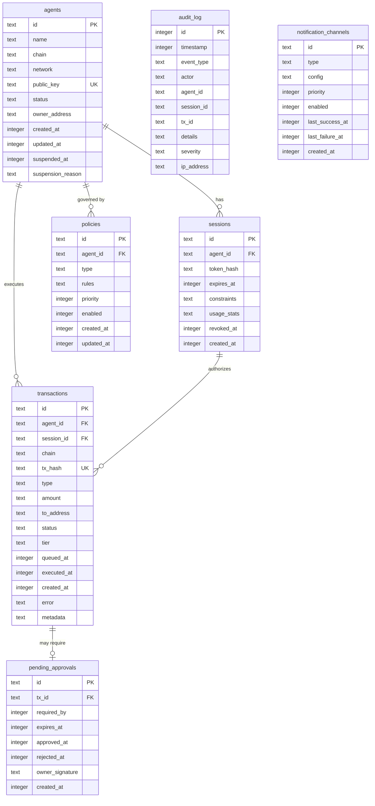

# SQLite 전체 스키마 + Drizzle ORM 정의 + 마이그레이션 전략 (CORE-02)

**문서 ID:** CORE-02
**작성일:** 2026-02-05
**상태:** 완료
**참조:** CORE-01, 06-RESEARCH.md, 06-CONTEXT.md

---

## 1. 스키마 개요

### 1.1 기술 스택

| 구성 요소 | 라이브러리 | 버전 | 역할 |
|----------|----------|------|------|
| ORM | `drizzle-orm` | 0.45.x | TypeScript 스키마 정의, 쿼리 빌더 |
| SQLite 드라이버 | `better-sqlite3` | 12.6.x | 동기식 SQLite 접근 (WAL 모드) |
| 마이그레이션 도구 | `drizzle-kit` | latest | SQL 마이그레이션 파일 생성 |
| DB 파일 경로 | `~/.waiaas/data/waiaas.db` | - | CORE-01 데이터 디렉토리 참조 |

### 1.2 필수 PRAGMA 설정

데몬 시작 시 DB 연결 직후 다음 PRAGMA를 순서대로 실행한다:

```typescript
import Database from 'better-sqlite3';

const sqlite = new Database(dbPath);

// 필수 PRAGMA -- 순서 중요
sqlite.pragma('journal_mode = WAL');       // 1. WAL 모드 활성화
sqlite.pragma('synchronous = NORMAL');     // 2. WAL에서 안전하고 더 빠른 동기화
sqlite.pragma('foreign_keys = ON');        // 3. 외래키 제약 활성화
sqlite.pragma('busy_timeout = 5000');      // 4. 5초 잠금 대기
sqlite.pragma('cache_size = -64000');      // 5. 64MB 페이지 캐시 (음수 = KiB)
sqlite.pragma('mmap_size = 268435456');    // 6. 256MB 메모리 매핑
sqlite.pragma('temp_store = MEMORY');      // 7. 임시 테이블 메모리 저장
```

| PRAGMA | 값 | 근거 |
|--------|-----|------|
| `journal_mode` | `WAL` | 동시 읽기 허용, 쓰기 중에도 읽기 가능. 단일 프로세스 데몬에 최적 |
| `synchronous` | `NORMAL` | WAL 모드에서 `FULL`과 동일한 데이터 안전성을 더 빠르게 제공. fsync 횟수 감소 |
| `foreign_keys` | `ON` | SQLite는 기본 OFF. 참조 무결성 강제를 위해 매 연결마다 활성화 필수 |
| `busy_timeout` | `5000` | 5초간 잠금 대기 후 SQLITE_BUSY 반환. WAL 체크포인트와의 경합 방지 |
| `cache_size` | `-64000` | 64MB 페이지 캐시. 음수는 KiB 단위. 에이전트 10개 기준 충분 |
| `mmap_size` | `268435456` | 256MB 메모리 매핑. 읽기 성능 향상. DB 크기가 이보다 작으면 전체 DB 매핑 |
| `temp_store` | `MEMORY` | 임시 테이블/인덱스를 메모리에 저장. ORDER BY, GROUP BY 성능 향상 |

### 1.3 타임스탬프 저장 전략

모든 타임스탬프는 **Unix epoch (초 단위)** 정수로 저장한다:

```typescript
// Drizzle ORM에서 { mode: 'timestamp' } 사용
// JavaScript Date -> Unix epoch 정수 (초) 자동 변환
createdAt: integer('created_at', { mode: 'timestamp' }).notNull()
```

- **근거:** SQLite에는 네이티브 DATE/TIMESTAMP 타입이 없음. 정수가 정렬, 비교, 인덱싱에 가장 효율적
- **시간대:** 모든 타임스탬프는 UTC 기준
- **밀리초 필요 시:** audit_log의 timestamp만 밀리초 정밀도 필요하면 `{ mode: 'timestamp_ms' }` 사용 고려 (현재는 초 단위로 충분)

---

## 2. 테이블 정의

### 2.1 agents 테이블 -- 에이전트 정보

에이전트의 기본 정보와 상태를 저장한다. 하나의 에이전트는 하나의 체인/네트워크에 바인딩된다.

**요구사항 매핑:** KEYS-01 (에이전트별 키 생성), KEYS-03 (에이전트 상태 관리)

#### Drizzle ORM 정의

```typescript
import { sqliteTable, text, integer, index, uniqueIndex } from 'drizzle-orm/sqlite-core';

export const agents = sqliteTable('agents', {
  // ── 식별자 ──
  id: text('id').primaryKey(),                          // UUID v7 (시간 정렬 가능)
  name: text('name').notNull(),                         // 사람이 읽을 수 있는 에이전트 이름

  // ── 체인 정보 ──
  chain: text('chain').notNull(),                       // 'solana' | 'ethereum' (체인 식별자)
  network: text('network').notNull(),                   // 'mainnet-beta' | 'devnet' | 'mainnet' | 'sepolia'
  publicKey: text('public_key').notNull(),              // 에이전트 지갑 공개키 (base58/hex)

  // ── 상태 ──
  status: text('status', {
    enum: ['CREATING', 'ACTIVE', 'SUSPENDED', 'TERMINATING', 'TERMINATED']
  }).notNull().default('CREATING'),

  // ── Owner 정보 ──
  ownerAddress: text('owner_address'),                  // Owner 지갑 주소 (Phase 8에서 연결)

  // ── 타임스탬프 ──
  createdAt: integer('created_at', { mode: 'timestamp' }).notNull(),
  updatedAt: integer('updated_at', { mode: 'timestamp' }).notNull(),
  suspendedAt: integer('suspended_at', { mode: 'timestamp' }),
  suspensionReason: text('suspension_reason'),          // 정지 사유
}, (table) => [
  uniqueIndex('idx_agents_public_key').on(table.publicKey),
  index('idx_agents_status').on(table.status),
  index('idx_agents_chain_network').on(table.chain, table.network),
]);
```

#### CREATE TABLE SQL DDL

```sql
CREATE TABLE agents (
  id TEXT PRIMARY KEY,
  name TEXT NOT NULL,
  chain TEXT NOT NULL,
  network TEXT NOT NULL,
  public_key TEXT NOT NULL,
  status TEXT NOT NULL DEFAULT 'CREATING'
    CHECK (status IN ('CREATING', 'ACTIVE', 'SUSPENDED', 'TERMINATING', 'TERMINATED')),
  owner_address TEXT,
  created_at INTEGER NOT NULL,
  updated_at INTEGER NOT NULL,
  suspended_at INTEGER,
  suspension_reason TEXT
);

CREATE UNIQUE INDEX idx_agents_public_key ON agents(public_key);
CREATE INDEX idx_agents_status ON agents(status);
CREATE INDEX idx_agents_chain_network ON agents(chain, network);
```

#### 컬럼 설명

| 컬럼 | 타입 | Nullable | 기본값 | 용도 |
|------|------|----------|--------|------|
| `id` | TEXT (PK) | NOT NULL | - | UUID v7. 생성 시간 순 정렬 가능 |
| `name` | TEXT | NOT NULL | - | 사용자가 지정한 에이전트 이름 (예: "DeFi Trading Bot") |
| `chain` | TEXT | NOT NULL | - | 블록체인 식별자. `solana`, `ethereum` 등 |
| `network` | TEXT | NOT NULL | - | 네트워크 식별자. `mainnet-beta`, `devnet`, `mainnet`, `sepolia` |
| `public_key` | TEXT (UNIQUE) | NOT NULL | - | 에이전트 지갑 공개키. 체인별 인코딩 (Solana=base58, EVM=hex) |
| `status` | TEXT (ENUM) | NOT NULL | `'CREATING'` | 에이전트 생명주기 상태. CHECK 제약으로 유효 값 강제 |
| `owner_address` | TEXT | NULL | - | Owner 지갑 주소. Phase 8에서 연결 프로세스 정의 |
| `created_at` | INTEGER | NOT NULL | - | 생성 시각 (Unix epoch, 초) |
| `updated_at` | INTEGER | NOT NULL | - | 최종 수정 시각 (Unix epoch, 초) |
| `suspended_at` | INTEGER | NULL | - | 정지 시각. status가 SUSPENDED일 때만 값 존재 |
| `suspension_reason` | TEXT | NULL | - | 정지 사유 (수동 정지, 정책 위반, Kill Switch 등) |

---

### 2.2 sessions 테이블 -- 세션 정보

> **Phase 7에서 상세화.** 현재는 기본 구조만 정의.

에이전트의 인증 세션을 관리한다. JWT 토큰의 해시를 저장하여 폐기 처리한다.

**요구사항 매핑:** SESS-01 (세션 토큰 발급), SESS-02 (세션 제약)

#### Drizzle ORM 정의

```typescript
export const sessions = sqliteTable('sessions', {
  // ── 식별자 ──
  id: text('id').primaryKey(),                          // UUID v7
  agentId: text('agent_id').notNull()
    .references(() => agents.id, { onDelete: 'cascade' }),

  // ── 토큰 정보 ──
  tokenHash: text('token_hash').notNull(),              // SHA-256(JWT). 원본 토큰은 저장하지 않음

  // ── 유효 기간 ──
  expiresAt: integer('expires_at', { mode: 'timestamp' }).notNull(),

  // ── 제약 조건 (Phase 7에서 상세화) ──
  constraints: text('constraints'),                     // JSON: { maxAmount, allowedOperations, ... }

  // ── 사용 통계 (Phase 7에서 상세화) ──
  usageStats: text('usage_stats'),                      // JSON: { totalTx, totalAmount, ... }

  // ── 상태 ──
  revokedAt: integer('revoked_at', { mode: 'timestamp' }),

  // ── 타임스탬프 ──
  createdAt: integer('created_at', { mode: 'timestamp' }).notNull(),
}, (table) => [
  index('idx_sessions_agent_id').on(table.agentId),
  index('idx_sessions_expires_at').on(table.expiresAt),
  index('idx_sessions_token_hash').on(table.tokenHash),
]);
```

#### CREATE TABLE SQL DDL

```sql
CREATE TABLE sessions (
  id TEXT PRIMARY KEY,
  agent_id TEXT NOT NULL REFERENCES agents(id) ON DELETE CASCADE,
  token_hash TEXT NOT NULL,
  expires_at INTEGER NOT NULL,
  constraints TEXT,                -- JSON
  usage_stats TEXT,                -- JSON
  revoked_at INTEGER,
  created_at INTEGER NOT NULL
);

CREATE INDEX idx_sessions_agent_id ON sessions(agent_id);
CREATE INDEX idx_sessions_expires_at ON sessions(expires_at);
CREATE INDEX idx_sessions_token_hash ON sessions(token_hash);
```

#### 컬럼 설명

| 컬럼 | 타입 | Nullable | 기본값 | 용도 |
|------|------|----------|--------|------|
| `id` | TEXT (PK) | NOT NULL | - | 세션 UUID v7 |
| `agent_id` | TEXT (FK) | NOT NULL | - | 소속 에이전트. CASCADE 삭제 |
| `token_hash` | TEXT | NOT NULL | - | JWT 토큰의 SHA-256 해시. 원본 미저장 |
| `expires_at` | INTEGER | NOT NULL | - | 세션 만료 시각 |
| `constraints` | TEXT (JSON) | NULL | - | 세션 제약 조건. Phase 7에서 구조 확정 |
| `usage_stats` | TEXT (JSON) | NULL | - | 누적 사용 통계. Phase 7에서 구조 확정 |
| `revoked_at` | INTEGER | NULL | - | 수동 폐기 시각. NULL이면 유효 |
| `created_at` | INTEGER | NOT NULL | - | 세션 생성 시각 |

---

### 2.3 transactions 테이블 -- 거래 기록

에이전트가 수행한 모든 온체인 트랜잭션을 기록한다. 파이프라인 상태 추적과 감사 목적.

**요구사항 매핑:** API-02 (거래 요청), API-03 (거래 상태 조회), CHAIN-02 (트랜잭션 실행)

#### Drizzle ORM 정의

```typescript
export const transactions = sqliteTable('transactions', {
  // ── 식별자 ──
  id: text('id').primaryKey(),                          // UUID v7 (내부 ID)
  agentId: text('agent_id').notNull()
    .references(() => agents.id, { onDelete: 'restrict' }),
  sessionId: text('session_id')
    .references(() => sessions.id, { onDelete: 'set null' }),

  // ── 체인 정보 ──
  chain: text('chain').notNull(),                       // 'solana' | 'ethereum'
  txHash: text('tx_hash'),                              // 온체인 트랜잭션 해시 (제출 후 기록)

  // ── 거래 내용 ──
  type: text('type').notNull(),                         // 'TRANSFER' | 'TOKEN_TRANSFER' | 'PROGRAM_CALL' 등
  amount: text('amount'),                               // 금액 (문자열: bigint 안전). lamports/wei 단위
  toAddress: text('to_address'),                        // 수신자 주소

  // ── 파이프라인 상태 ──
  status: text('status', {
    enum: ['PENDING', 'QUEUED', 'EXECUTING', 'SUBMITTED', 'CONFIRMED', 'FAILED', 'CANCELLED', 'EXPIRED']
  }).notNull().default('PENDING'),

  // ── 보안 티어 ──
  tier: text('tier', {
    enum: ['INSTANT', 'NOTIFY', 'DELAY', 'APPROVAL']
  }),

  // ── 타임스탬프 ──
  queuedAt: integer('queued_at', { mode: 'timestamp' }),
  executedAt: integer('executed_at', { mode: 'timestamp' }),
  createdAt: integer('created_at', { mode: 'timestamp' }).notNull(),

  // ── 에러/메타데이터 ──
  error: text('error'),                                 // 실패 시 에러 메시지
  metadata: text('metadata'),                           // JSON: 추가 정보 (gas, fee, simulation 결과 등)
}, (table) => [
  index('idx_transactions_agent_status').on(table.agentId, table.status),
  index('idx_transactions_session_id').on(table.sessionId),
  uniqueIndex('idx_transactions_tx_hash').on(table.txHash),
  index('idx_transactions_queued_at').on(table.queuedAt),
  index('idx_transactions_created_at').on(table.createdAt),
]);
```

#### CREATE TABLE SQL DDL

```sql
CREATE TABLE transactions (
  id TEXT PRIMARY KEY,
  agent_id TEXT NOT NULL REFERENCES agents(id) ON DELETE RESTRICT,
  session_id TEXT REFERENCES sessions(id) ON DELETE SET NULL,
  chain TEXT NOT NULL,
  tx_hash TEXT,
  type TEXT NOT NULL,
  amount TEXT,
  to_address TEXT,
  status TEXT NOT NULL DEFAULT 'PENDING'
    CHECK (status IN ('PENDING', 'QUEUED', 'EXECUTING', 'SUBMITTED', 'CONFIRMED', 'FAILED', 'CANCELLED', 'EXPIRED')),
  tier TEXT
    CHECK (tier IN ('INSTANT', 'NOTIFY', 'DELAY', 'APPROVAL') OR tier IS NULL),
  queued_at INTEGER,
  executed_at INTEGER,
  created_at INTEGER NOT NULL,
  error TEXT,
  metadata TEXT              -- JSON
);

CREATE INDEX idx_transactions_agent_status ON transactions(agent_id, status);
CREATE INDEX idx_transactions_session_id ON transactions(session_id);
CREATE UNIQUE INDEX idx_transactions_tx_hash ON transactions(tx_hash);
CREATE INDEX idx_transactions_queued_at ON transactions(queued_at);
CREATE INDEX idx_transactions_created_at ON transactions(created_at);
```

#### 컬럼 설명

| 컬럼 | 타입 | Nullable | 기본값 | 용도 |
|------|------|----------|--------|------|
| `id` | TEXT (PK) | NOT NULL | - | 내부 트랜잭션 UUID v7 |
| `agent_id` | TEXT (FK) | NOT NULL | - | 실행 에이전트. RESTRICT 삭제 (거래 기록 보존) |
| `session_id` | TEXT (FK) | NULL | - | 요청한 세션. SET NULL (세션 삭제 후에도 거래 기록 유지) |
| `chain` | TEXT | NOT NULL | - | 대상 체인 식별자 |
| `tx_hash` | TEXT (UNIQUE) | NULL | - | 온체인 트랜잭션 해시. 제출 전에는 NULL |
| `type` | TEXT | NOT NULL | - | 거래 유형 (TRANSFER, TOKEN_TRANSFER, PROGRAM_CALL 등) |
| `amount` | TEXT | NULL | - | 거래 금액. TEXT 타입 = bigint 안전 저장 (lamports/wei) |
| `to_address` | TEXT | NULL | - | 수신자 주소. 복합 트랜잭션은 NULL 가능 |
| `status` | TEXT (ENUM) | NOT NULL | `'PENDING'` | 파이프라인 상태. CHECK 제약 |
| `tier` | TEXT (ENUM) | NULL | - | 보안 티어. 정책 평가 후 결정 |
| `queued_at` | INTEGER | NULL | - | 큐 진입 시각 (DELAY/APPROVAL 티어) |
| `executed_at` | INTEGER | NULL | - | 실행 완료(온체인 확정) 시각 |
| `created_at` | INTEGER | NOT NULL | - | 요청 접수 시각 |
| `error` | TEXT | NULL | - | 실패 시 에러 메시지/코드 |
| `metadata` | TEXT (JSON) | NULL | - | 추가 정보: gas fee, 시뮬레이션 결과, blockhash 등 |

**amount를 TEXT로 저장하는 이유:**
- SQLite INTEGER는 최대 64비트 (9.2 x 10^18). lamports는 u64 범위 내이지만, wei는 uint256으로 64비트 초과 가능
- TEXT로 저장하면 체인 무관하게 안전. 쿼리 시 CAST 필요하나, 금액 범위 검색은 드물고 대부분 상태/시간 기반 검색

---

### 2.4 policies 테이블 -- 정책 규칙

> **Phase 8에서 상세화.** 현재는 기본 구조만 정의.

에이전트별 또는 글로벌 정책 규칙을 저장한다.

**요구사항 매핑:** LOCK-01 (거래 제한), LOCK-03 (자동 정지 규칙)

#### Drizzle ORM 정의

```typescript
export const policies = sqliteTable('policies', {
  // ── 식별자 ──
  id: text('id').primaryKey(),                          // UUID v7
  agentId: text('agent_id')
    .references(() => agents.id, { onDelete: 'cascade' }),  // NULL = 글로벌 정책

  // ── 정책 정의 ──
  type: text('type', {
    enum: ['SPENDING_LIMIT', 'ALLOWED_ADDRESSES', 'TIME_RESTRICTION', 'AUTO_STOP']
  }).notNull(),
  rules: text('rules').notNull(),                       // JSON: 정책별 규칙 구조

  // ── 우선순위/활성화 ──
  priority: integer('priority').notNull().default(0),   // 높을수록 우선 평가
  enabled: integer('enabled', { mode: 'boolean' }).notNull().default(true),

  // ── 타임스탬프 ──
  createdAt: integer('created_at', { mode: 'timestamp' }).notNull(),
  updatedAt: integer('updated_at', { mode: 'timestamp' }).notNull(),
}, (table) => [
  index('idx_policies_agent_id').on(table.agentId),
  index('idx_policies_type').on(table.type),
  index('idx_policies_enabled').on(table.enabled),
]);
```

#### CREATE TABLE SQL DDL

```sql
CREATE TABLE policies (
  id TEXT PRIMARY KEY,
  agent_id TEXT REFERENCES agents(id) ON DELETE CASCADE,
  type TEXT NOT NULL
    CHECK (type IN ('SPENDING_LIMIT', 'ALLOWED_ADDRESSES', 'TIME_RESTRICTION', 'AUTO_STOP')),
  rules TEXT NOT NULL,             -- JSON
  priority INTEGER NOT NULL DEFAULT 0,
  enabled INTEGER NOT NULL DEFAULT 1,   -- boolean (0/1)
  created_at INTEGER NOT NULL,
  updated_at INTEGER NOT NULL
);

CREATE INDEX idx_policies_agent_id ON policies(agent_id);
CREATE INDEX idx_policies_type ON policies(type);
CREATE INDEX idx_policies_enabled ON policies(enabled);
```

#### 컬럼 설명

| 컬럼 | 타입 | Nullable | 기본값 | 용도 |
|------|------|----------|--------|------|
| `id` | TEXT (PK) | NOT NULL | - | 정책 UUID v7 |
| `agent_id` | TEXT (FK) | NULL | - | 대상 에이전트. NULL이면 모든 에이전트에 적용되는 글로벌 정책 |
| `type` | TEXT (ENUM) | NOT NULL | - | 정책 유형 |
| `rules` | TEXT (JSON) | NOT NULL | - | 정책별 규칙 JSON. Phase 8에서 각 type별 JSON 구조 확정 |
| `priority` | INTEGER | NOT NULL | `0` | 평가 우선순위. 동일 type 내에서 높은 priority 먼저 적용 |
| `enabled` | INTEGER (BOOL) | NOT NULL | `1` (true) | 활성화 여부. 비활성 정책은 평가에서 제외 |
| `created_at` | INTEGER | NOT NULL | - | 정책 생성 시각 |
| `updated_at` | INTEGER | NOT NULL | - | 정책 최종 수정 시각 |

**rules JSON 구조 예시 (Phase 8에서 확정):**

```json
// SPENDING_LIMIT
{
  "per_transaction": "1000000000",
  "daily_total": "5000000000",
  "weekly_total": "20000000000"
}

// ALLOWED_ADDRESSES
{
  "addresses": ["So1ana...", "Eth0x..."],
  "mode": "whitelist"
}

// TIME_RESTRICTION
{
  "allowed_hours": { "start": 9, "end": 17 },
  "allowed_days": [1, 2, 3, 4, 5],
  "timezone": "UTC"
}

// AUTO_STOP
{
  "trigger": "consecutive_failures",
  "threshold": 3,
  "action": "suspend"
}
```

---

### 2.5 audit_log 테이블 -- 감사 로그

모든 보안 관련 이벤트를 기록하는 **append-only** 테이블. 무결성 보장을 위해 DELETE/UPDATE 금지 정책.

**요구사항 매핑:** API-05 (감사 로그), NOTI-05 (보안 이벤트 기록)

#### Drizzle ORM 정의

```typescript
export const auditLog = sqliteTable('audit_log', {
  // ── 식별자 ──
  id: integer('id').primaryKey({ autoIncrement: true }),  // AUTOINCREMENT: 단조 증가 보장

  // ── 이벤트 정보 ──
  timestamp: integer('timestamp', { mode: 'timestamp' }).notNull(),
  eventType: text('event_type').notNull(),              // 'AGENT_CREATED' | 'SESSION_ISSUED' | 'TX_SUBMITTED' | ...
  actor: text('actor').notNull(),                       // 'agent:<id>' | 'owner' | 'system' | 'cli'

  // ── 연관 엔티티 (선택) ──
  agentId: text('agent_id'),                            // FK 없음 -- 에이전트 삭제 후에도 로그 보존
  sessionId: text('session_id'),                        // FK 없음 -- 동일 이유
  txId: text('tx_id'),                                  // FK 없음 -- 동일 이유

  // ── 상세 ──
  details: text('details').notNull(),                   // JSON: 이벤트별 상세 데이터
  severity: text('severity', {
    enum: ['info', 'warning', 'critical']
  }).notNull().default('info'),

  // ── 요청 정보 ──
  ipAddress: text('ip_address'),                        // 요청자 IP (localhost이므로 대부분 127.0.0.1)
}, (table) => [
  index('idx_audit_log_timestamp').on(table.timestamp),
  index('idx_audit_log_event_type').on(table.eventType),
  index('idx_audit_log_agent_id').on(table.agentId),
  index('idx_audit_log_severity').on(table.severity),
  index('idx_audit_log_agent_timestamp').on(table.agentId, table.timestamp),
]);
```

#### CREATE TABLE SQL DDL

```sql
CREATE TABLE audit_log (
  id INTEGER PRIMARY KEY AUTOINCREMENT,
  timestamp INTEGER NOT NULL,
  event_type TEXT NOT NULL,
  actor TEXT NOT NULL,
  agent_id TEXT,                    -- FK 없음 (보존 목적)
  session_id TEXT,
  tx_id TEXT,
  details TEXT NOT NULL,            -- JSON
  severity TEXT NOT NULL DEFAULT 'info'
    CHECK (severity IN ('info', 'warning', 'critical')),
  ip_address TEXT
);

CREATE INDEX idx_audit_log_timestamp ON audit_log(timestamp);
CREATE INDEX idx_audit_log_event_type ON audit_log(event_type);
CREATE INDEX idx_audit_log_agent_id ON audit_log(agent_id);
CREATE INDEX idx_audit_log_severity ON audit_log(severity);
CREATE INDEX idx_audit_log_agent_timestamp ON audit_log(agent_id, timestamp);
```

#### 컬럼 설명

| 컬럼 | 타입 | Nullable | 기본값 | 용도 |
|------|------|----------|--------|------|
| `id` | INTEGER (PK, AI) | NOT NULL | AUTOINCREMENT | 단조 증가 ID. 로그 순서 보장 |
| `timestamp` | INTEGER | NOT NULL | - | 이벤트 발생 시각 (Unix epoch, 초) |
| `event_type` | TEXT | NOT NULL | - | 이벤트 유형 식별자 (아래 목록 참조) |
| `actor` | TEXT | NOT NULL | - | 이벤트 주체. `agent:<id>`, `owner`, `system`, `cli` |
| `agent_id` | TEXT | NULL | - | 관련 에이전트 ID (FK 없음 -- 삭제 후에도 보존) |
| `session_id` | TEXT | NULL | - | 관련 세션 ID (FK 없음) |
| `tx_id` | TEXT | NULL | - | 관련 트랜잭션 ID (FK 없음) |
| `details` | TEXT (JSON) | NOT NULL | - | 이벤트별 상세 데이터 |
| `severity` | TEXT (ENUM) | NOT NULL | `'info'` | 심각도. CHECK 제약 |
| `ip_address` | TEXT | NULL | - | 요청자 IP |

**FK를 설정하지 않는 이유:** 감사 로그는 다른 엔티티가 삭제되더라도 영구 보존되어야 한다. FK CASCADE로 로그가 삭제되면 감사 목적이 무너진다.

**Append-only 정책:** 애플리케이션 레벨에서 audit_log 테이블에 대한 DELETE/UPDATE 쿼리를 금지한다. SQLite 트리거로 강제할 수도 있으나, 성능 오버헤드와 마이그레이션 복잡도를 고려하여 애플리케이션 레벨 제어를 선택한다.

**이벤트 타입 목록:**

| event_type | severity | 설명 |
|-----------|----------|------|
| `AGENT_CREATED` | info | 에이전트 생성 |
| `AGENT_ACTIVATED` | info | 에이전트 활성화 |
| `AGENT_SUSPENDED` | warning | 에이전트 정지 |
| `AGENT_TERMINATED` | info | 에이전트 종료 |
| `SESSION_ISSUED` | info | 세션 토큰 발급 |
| `SESSION_REVOKED` | info | 세션 토큰 폐기 |
| `SESSION_EXPIRED` | info | 세션 자동 만료 |
| `TX_REQUESTED` | info | 거래 요청 접수 |
| `TX_QUEUED` | info | 거래 큐 진입 |
| `TX_SUBMITTED` | info | 온체인 제출 |
| `TX_CONFIRMED` | info | 온체인 확정 |
| `TX_FAILED` | warning | 거래 실패 |
| `TX_CANCELLED` | info | 거래 취소 |
| `POLICY_VIOLATION` | warning | 정책 위반 감지 |
| `POLICY_UPDATED` | info | 정책 변경 |
| `KEYSTORE_UNLOCKED` | info | 키스토어 잠금 해제 |
| `KEYSTORE_LOCKED` | info | 키스토어 잠금 |
| `KEY_ROTATED` | info | 키 로테이션 |
| `KILL_SWITCH_ACTIVATED` | critical | Kill Switch 발동 |
| `DAEMON_STARTED` | info | 데몬 시작 |
| `DAEMON_STOPPED` | info | 데몬 정상 종료 |
| `AUTH_FAILED` | warning | 인증 실패 |
| `RATE_LIMIT_EXCEEDED` | warning | 속도 제한 초과 |

---

### 2.6 pending_approvals 테이블 -- 승인 대기

> **Phase 8에서 상세화.** 현재는 기본 구조만 정의.

APPROVAL 티어 거래의 Owner 승인 상태를 추적한다.

**요구사항 매핑:** LOCK-02 (승인 메커니즘), OWNR-01 (Owner 서명 승인)

#### Drizzle ORM 정의

```typescript
export const pendingApprovals = sqliteTable('pending_approvals', {
  // ── 식별자 ──
  id: text('id').primaryKey(),                          // UUID v7
  txId: text('tx_id').notNull()
    .references(() => transactions.id, { onDelete: 'cascade' }),

  // ── 승인 조건 ──
  requiredBy: integer('required_by', { mode: 'timestamp' }).notNull(),  // 승인 기한
  expiresAt: integer('expires_at', { mode: 'timestamp' }).notNull(),    // 만료 시각

  // ── 승인 결과 ──
  approvedAt: integer('approved_at', { mode: 'timestamp' }),
  rejectedAt: integer('rejected_at', { mode: 'timestamp' }),
  ownerSignature: text('owner_signature'),              // Owner 지갑 서명 (승인 증명)

  // ── 타임스탬프 ──
  createdAt: integer('created_at', { mode: 'timestamp' }).notNull(),
}, (table) => [
  index('idx_pending_approvals_tx_id').on(table.txId),
  index('idx_pending_approvals_expires_at').on(table.expiresAt),
]);
```

#### CREATE TABLE SQL DDL

```sql
CREATE TABLE pending_approvals (
  id TEXT PRIMARY KEY,
  tx_id TEXT NOT NULL REFERENCES transactions(id) ON DELETE CASCADE,
  required_by INTEGER NOT NULL,
  expires_at INTEGER NOT NULL,
  approved_at INTEGER,
  rejected_at INTEGER,
  owner_signature TEXT,
  created_at INTEGER NOT NULL
);

CREATE INDEX idx_pending_approvals_tx_id ON pending_approvals(tx_id);
CREATE INDEX idx_pending_approvals_expires_at ON pending_approvals(expires_at);
```

#### 컬럼 설명

| 컬럼 | 타입 | Nullable | 기본값 | 용도 |
|------|------|----------|--------|------|
| `id` | TEXT (PK) | NOT NULL | - | 승인 요청 UUID v7 |
| `tx_id` | TEXT (FK) | NOT NULL | - | 대상 트랜잭션. CASCADE 삭제 |
| `required_by` | INTEGER | NOT NULL | - | 승인이 필요한 시한 |
| `expires_at` | INTEGER | NOT NULL | - | 만료 시각. 초과 시 자동 거부 |
| `approved_at` | INTEGER | NULL | - | Owner 승인 시각 |
| `rejected_at` | INTEGER | NULL | - | Owner 거부 시각 |
| `owner_signature` | TEXT | NULL | - | Owner 지갑 서명 (SIWS/SIWE). Phase 8에서 포맷 확정 |
| `created_at` | INTEGER | NOT NULL | - | 승인 요청 생성 시각 |

---

### 2.7 notification_channels 테이블 -- 알림 채널

> **Phase 8에서 상세화.** 현재는 기본 구조만 정의.

알림 채널 설정과 상태를 저장한다.

**요구사항 매핑:** NOTI-01 (알림 채널 관리), NOTI-02 (알림 전달)

#### Drizzle ORM 정의

```typescript
export const notificationChannels = sqliteTable('notification_channels', {
  // ── 식별자 ──
  id: text('id').primaryKey(),                          // UUID v7

  // ── 채널 정보 ──
  type: text('type', {
    enum: ['TELEGRAM', 'DISCORD', 'NTFY']
  }).notNull(),
  config: text('config').notNull(),                     // JSON: 채널별 설정 (토큰, URL 등)

  // ── 우선순위/활성화 ──
  priority: integer('priority').notNull().default(0),   // 높을수록 먼저 시도
  enabled: integer('enabled', { mode: 'boolean' }).notNull().default(true),

  // ── 상태 추적 ──
  lastSuccessAt: integer('last_success_at', { mode: 'timestamp' }),
  lastFailureAt: integer('last_failure_at', { mode: 'timestamp' }),

  // ── 타임스탬프 ──
  createdAt: integer('created_at', { mode: 'timestamp' }).notNull(),
}, (table) => [
  index('idx_notification_channels_type').on(table.type),
  index('idx_notification_channels_enabled').on(table.enabled),
]);
```

#### CREATE TABLE SQL DDL

```sql
CREATE TABLE notification_channels (
  id TEXT PRIMARY KEY,
  type TEXT NOT NULL
    CHECK (type IN ('TELEGRAM', 'DISCORD', 'NTFY')),
  config TEXT NOT NULL,             -- JSON
  priority INTEGER NOT NULL DEFAULT 0,
  enabled INTEGER NOT NULL DEFAULT 1,   -- boolean (0/1)
  last_success_at INTEGER,
  last_failure_at INTEGER,
  created_at INTEGER NOT NULL
);

CREATE INDEX idx_notification_channels_type ON notification_channels(type);
CREATE INDEX idx_notification_channels_enabled ON notification_channels(enabled);
```

#### 컬럼 설명

| 컬럼 | 타입 | Nullable | 기본값 | 용도 |
|------|------|----------|--------|------|
| `id` | TEXT (PK) | NOT NULL | - | 채널 UUID v7 |
| `type` | TEXT (ENUM) | NOT NULL | - | 채널 유형. CHECK 제약 |
| `config` | TEXT (JSON) | NOT NULL | - | 채널 설정. Phase 8에서 type별 JSON 구조 확정 |
| `priority` | INTEGER | NOT NULL | `0` | 전송 우선순위. 높을수록 먼저 시도 |
| `enabled` | INTEGER (BOOL) | NOT NULL | `1` (true) | 활성화 여부 |
| `last_success_at` | INTEGER | NULL | - | 마지막 성공 전송 시각 |
| `last_failure_at` | INTEGER | NULL | - | 마지막 실패 시각 |
| `created_at` | INTEGER | NOT NULL | - | 채널 등록 시각 |

---

## 3. 관계 다이어그램 (ERD)



**관계 요약:**

| 관계 | 카디널리티 | FK 동작 |
|------|----------|---------|
| agents -> sessions | 1:N | ON DELETE CASCADE |
| agents -> transactions | 1:N | ON DELETE RESTRICT |
| agents -> policies | 1:N | ON DELETE CASCADE |
| sessions -> transactions | 1:N | ON DELETE SET NULL |
| transactions -> pending_approvals | 1:0..1 | ON DELETE CASCADE |
| audit_log | 독립 | FK 없음 (데이터 보존) |
| notification_channels | 독립 | FK 없음 (글로벌 설정) |

**FK 삭제 정책 설계 근거:**

- `agents -> transactions`: **RESTRICT** -- 거래 기록이 있는 에이전트는 삭제 불가. 먼저 TERMINATED 상태로 전환 후 보관 기간 경과 후 정리
- `agents -> sessions`: **CASCADE** -- 에이전트 삭제 시 세션도 무효화
- `agents -> policies`: **CASCADE** -- 에이전트 삭제 시 전용 정책도 삭제 (글로벌 정책은 agent_id=NULL이므로 영향 없음)
- `sessions -> transactions`: **SET NULL** -- 세션 삭제 후에도 거래 기록 유지. session_id만 NULL로 설정
- `transactions -> pending_approvals`: **CASCADE** -- 트랜잭션 삭제 시 승인 요청도 삭제

---

## 4. 마이그레이션 전략

### 4.1 drizzle-kit 워크플로우

```
[1. 스키마 변경]          [2. SQL 생성]            [3. 자동 적용]
schema.ts 수정    ->   drizzle-kit generate   ->   migrate() at startup
                           │
                           ▼
                   packages/daemon/drizzle/
                   ├── 0000_initial.sql
                   ├── 0001_add_column.sql
                   └── meta/
                       └── _journal.json
```

### 4.2 drizzle.config.ts

```typescript
// packages/daemon/drizzle.config.ts
import { defineConfig } from 'drizzle-kit';

export default defineConfig({
  dialect: 'sqlite',
  schema: './src/infrastructure/database/schema.ts',
  out: './drizzle',
  dbCredentials: {
    url: process.env.WAIAAS_DB_URL || 'file:./dev.db',
  },
  verbose: true,
  strict: true,
});
```

### 4.3 스키마 파일 구조

```typescript
// packages/daemon/src/infrastructure/database/schema.ts
// 모든 테이블 정의를 하나의 파일에 집중
// Drizzle는 단일 스키마 파일을 권장 (관계 정의가 동일 scope 필요)

export { agents } from './tables/agents';
export { sessions } from './tables/sessions';
export { transactions } from './tables/transactions';
export { policies } from './tables/policies';
export { auditLog } from './tables/audit-log';
export { pendingApprovals } from './tables/pending-approvals';
export { notificationChannels } from './tables/notification-channels';
```

### 4.4 데몬 시작 시 자동 마이그레이션

```typescript
// packages/daemon/src/infrastructure/database/migrate.ts
import Database from 'better-sqlite3';
import { drizzle } from 'drizzle-orm/better-sqlite3';
import { migrate } from 'drizzle-orm/better-sqlite3/migrator';
import path from 'node:path';

export function initializeDatabase(dbPath: string): ReturnType<typeof drizzle> {
  // 1. SQLite 연결
  const sqlite = new Database(dbPath);

  // 2. PRAGMA 설정
  sqlite.pragma('journal_mode = WAL');
  sqlite.pragma('synchronous = NORMAL');
  sqlite.pragma('foreign_keys = ON');
  sqlite.pragma('busy_timeout = 5000');
  sqlite.pragma('cache_size = -64000');
  sqlite.pragma('mmap_size = 268435456');
  sqlite.pragma('temp_store = MEMORY');

  // 3. Drizzle 인스턴스 생성
  const db = drizzle({ client: sqlite });

  // 4. 마이그레이션 실행
  // 마이그레이션 폴더는 패키지에 번들되어야 함
  const migrationsFolder = path.resolve(__dirname, '../../drizzle');
  migrate(db, { migrationsFolder });

  return db;
}
```

**마이그레이션 실행 시점:**

1. `waiaas start` -> 데몬 프로세스 시작
2. DB 연결 생성
3. PRAGMA 설정
4. `migrate()` 호출 -- 미적용 마이그레이션 자동 실행
5. 성공 시 HTTP 서버 시작
6. 실패 시 에러 로그 후 프로세스 종료 (exit code 1)

### 4.5 마이그레이션 파일 생성 절차

```bash
# 1. schema.ts 수정 후
cd packages/daemon

# 2. SQL 마이그레이션 파일 생성
pnpm db:generate

# 3. 생성된 파일 확인
ls drizzle/
# 0000_initial_schema.sql
# 0001_add_owner_address.sql  <- 새로 생성됨

# 4. 마이그레이션 파일을 git에 추적
git add drizzle/

# 5. 개발 DB에서 테스트
pnpm db:migrate
```

### 4.6 SQLite 마이그레이션 제약사항

SQLite는 ALTER TABLE에 제한이 있다. 다음 변경은 drizzle-kit이 자동 처리하지 못할 수 있다:

| 변경 유형 | 자동 지원 | 대안 |
|----------|----------|------|
| 컬럼 추가 | O | `ALTER TABLE ADD COLUMN` |
| 컬럼 삭제 | X (SQLite 3.35.0+에서 제한적) | 테이블 재생성 필요 |
| 컬럼 타입 변경 | X | 테이블 재생성 필요 |
| NOT NULL 추가 (기존 컬럼) | X | 테이블 재생성 필요 |
| NOT NULL 삭제 | X | 테이블 재생성 필요 |
| 컬럼 이름 변경 | O (SQLite 3.25.0+) | `ALTER TABLE RENAME COLUMN` |
| 테이블 이름 변경 | O | `ALTER TABLE RENAME TO` |
| 인덱스 추가/삭제 | O | `CREATE INDEX` / `DROP INDEX` |
| FK 추가/삭제 | X | 테이블 재생성 필요 |

**테이블 재생성 패턴 (수동 마이그레이션 필요 시):**

```sql
-- 1. 새 테이블 생성
CREATE TABLE agents_new (
  -- 새 스키마 정의
);

-- 2. 데이터 복사
INSERT INTO agents_new SELECT ... FROM agents;

-- 3. 이전 테이블 삭제
DROP TABLE agents;

-- 4. 이름 변경
ALTER TABLE agents_new RENAME TO agents;

-- 5. 인덱스 재생성
CREATE INDEX ...;
```

---

## 5. SQLite 운영 가이드

### 5.1 WAL 체크포인트 전략

WAL 파일은 자동으로 성장하며, 주기적 체크포인트가 없으면 무한히 커질 수 있다 (H-02 피트폴).

```typescript
// packages/daemon/src/lifecycle/workers.ts
function startWalCheckpointWorker(sqlite: Database): NodeJS.Timeout {
  const intervalMs = config.database.wal_checkpoint_interval * 1000;  // 기본: 5분

  return setInterval(() => {
    try {
      const result = sqlite.pragma('wal_checkpoint(TRUNCATE)');
      // result: [{ busy: 0, log: 1234, checkpointed: 1234 }]
      logger.debug('WAL checkpoint completed', result);
    } catch (err) {
      logger.warn('WAL checkpoint failed', { error: err });
      // 실패해도 다음 주기에 재시도. 치명적이지 않음
    }
  }, intervalMs);
}
```

**체크포인트 모드:**

| 모드 | 설명 | 사용 시점 |
|------|------|----------|
| `PASSIVE` | 읽기 잠금 없이 가능한 페이지만 체크포인트 | 일반 주기적 체크포인트 |
| `FULL` | 모든 WAL 페이지 체크포인트 (읽기 차단 가능) | 백업 전 |
| `TRUNCATE` | FULL + WAL 파일 크기 0으로 절단 | 주기적 체크포인트 (권장) |
| `RESTART` | TRUNCATE와 유사하나 WAL 재시작 | 사용하지 않음 |

### 5.2 백업 전략

```typescript
// VACUUM INTO -- 독립적인 백업 DB 파일 생성
function backupDatabase(sqlite: Database, backupDir: string): string {
  const timestamp = new Date().toISOString().replace(/[:.]/g, '-');
  const backupPath = path.join(backupDir, `waiaas-${timestamp}.db`);

  // WAL 체크포인트 먼저 실행
  sqlite.pragma('wal_checkpoint(FULL)');

  // VACUUM INTO: 원본 DB에 영향 없이 별도 파일로 백업
  sqlite.exec(`VACUUM INTO '${backupPath}'`);

  return backupPath;
}
```

**백업 권장 스케줄:**

| 주기 | 방법 | 보관 기간 |
|------|------|----------|
| 매일 | `VACUUM INTO` 자동 백업 | 7일 |
| 키 로테이션 시 | DB + 키스토어 동시 백업 | 영구 |
| 수동 요청 시 | `waiaas backup` CLI | 사용자 결정 |

### 5.3 크기 추정

**가정:** 에이전트 10개, 일 1,000 트랜잭션, 세션 평균 50개 활성

| 테이블 | 행/일 | 행 크기 (평균) | 일일 증가 | 연간 크기 |
|--------|------|---------------|----------|----------|
| `agents` | ~0 (정적) | ~500B | ~0 | ~5KB |
| `sessions` | ~50 (활성) | ~300B | ~15KB | ~5MB (만료 세션 포함) |
| `transactions` | 1,000 | ~400B | ~400KB | ~146MB |
| `policies` | ~0 (정적) | ~500B | ~0 | ~5KB |
| `audit_log` | ~3,000 (tx당 ~3건) | ~300B | ~900KB | ~329MB |
| `pending_approvals` | ~10 (APPROVAL 티어) | ~200B | ~2KB | ~730KB |
| `notification_channels` | ~0 (정적) | ~300B | ~0 | ~1KB |

**총 추정:**

| 기간 | DB 크기 | 비고 |
|------|---------|------|
| 1개월 | ~45MB | 인덱스 포함, VACUUM 후 |
| 6개월 | ~270MB | audit_log가 주요 성장 요인 |
| 1년 | ~480MB | mmap_size(256MB) 내에서 대부분 처리 |
| 3년 | ~1.4GB | audit_log 정리 정책 필요 가능 |

**결론:** 에이전트 10개 기준으로 1년 운영 시 ~500MB. SQLite 단일 파일 한계(~281TB)에 한참 미달. mmap_size 256MB로 충분.

### 5.4 성능 고려사항

#### 인덱스 설계 원칙

| 쿼리 패턴 | 인덱스 | 근거 |
|----------|--------|------|
| 에이전트별 활성 거래 조회 | `idx_transactions_agent_status(agent_id, status)` | 가장 빈번한 쿼리. 복합 인덱스로 covering |
| 세션 토큰 검증 | `idx_sessions_token_hash(token_hash)` | 모든 API 요청마다 실행 |
| 세션 만료 정리 | `idx_sessions_expires_at(expires_at)` | 주기적 정리 작업 |
| 감사 로그 시간 범위 조회 | `idx_audit_log_timestamp(timestamp)` | 대시보드 조회 |
| 에이전트별 감사 로그 | `idx_audit_log_agent_timestamp(agent_id, timestamp)` | 에이전트 활동 조회 |
| 트랜잭션 해시 조회 | `idx_transactions_tx_hash(tx_hash)` | 온체인 확인 콜백 |

#### 주요 쿼리 패턴과 예상 성능

```sql
-- 1. 세션 토큰 검증 (매 요청)
-- 인덱스: idx_sessions_token_hash
-- 예상: < 1ms (단일 행 lookup)
SELECT * FROM sessions
WHERE token_hash = ? AND expires_at > ? AND revoked_at IS NULL;

-- 2. 에이전트별 활성 거래 조회
-- 인덱스: idx_transactions_agent_status
-- 예상: < 5ms (소수의 활성 거래)
SELECT * FROM transactions
WHERE agent_id = ? AND status IN ('PENDING', 'QUEUED', 'EXECUTING', 'SUBMITTED');

-- 3. 감사 로그 조회 (시간 범위 + 에이전트)
-- 인덱스: idx_audit_log_agent_timestamp
-- 예상: < 50ms (1000행 범위 스캔)
SELECT * FROM audit_log
WHERE agent_id = ? AND timestamp BETWEEN ? AND ?
ORDER BY timestamp DESC LIMIT 100;

-- 4. 정책 조회 (에이전트별 활성 정책)
-- 인덱스: idx_policies_agent_id + idx_policies_enabled
-- 예상: < 1ms (소수의 정책)
SELECT * FROM policies
WHERE (agent_id = ? OR agent_id IS NULL) AND enabled = 1
ORDER BY priority DESC;
```

#### 쓰기 성능

- **WAL 모드:** 쓰기가 읽기를 차단하지 않음
- **better-sqlite3 동기식:** 단일 프로세스에서 mutex thrashing 없음
- **NORMAL synchronous:** fsync 횟수 감소로 쓰기 성능 향상
- **예상 처리량:** 단일 스레드에서 초당 ~10,000 INSERT 가능 (WAL 모드). 데몬 부하(일 1,000 tx) 대비 여유로움

---

## 6. 전체 스키마 export

```typescript
// packages/daemon/src/infrastructure/database/schema.ts
// 전체 스키마를 하나의 파일에서 내보내기

import { sqliteTable, text, integer, index, uniqueIndex } from 'drizzle-orm/sqlite-core';

// ══════════════════════════════════════════
// agents
// ══════════════════════════════════════════
export const agents = sqliteTable('agents', {
  id: text('id').primaryKey(),
  name: text('name').notNull(),
  chain: text('chain').notNull(),
  network: text('network').notNull(),
  publicKey: text('public_key').notNull(),
  status: text('status', {
    enum: ['CREATING', 'ACTIVE', 'SUSPENDED', 'TERMINATING', 'TERMINATED']
  }).notNull().default('CREATING'),
  ownerAddress: text('owner_address'),
  createdAt: integer('created_at', { mode: 'timestamp' }).notNull(),
  updatedAt: integer('updated_at', { mode: 'timestamp' }).notNull(),
  suspendedAt: integer('suspended_at', { mode: 'timestamp' }),
  suspensionReason: text('suspension_reason'),
}, (table) => [
  uniqueIndex('idx_agents_public_key').on(table.publicKey),
  index('idx_agents_status').on(table.status),
  index('idx_agents_chain_network').on(table.chain, table.network),
]);

// ══════════════════════════════════════════
// sessions (Phase 7에서 상세화)
// ══════════════════════════════════════════
export const sessions = sqliteTable('sessions', {
  id: text('id').primaryKey(),
  agentId: text('agent_id').notNull()
    .references(() => agents.id, { onDelete: 'cascade' }),
  tokenHash: text('token_hash').notNull(),
  expiresAt: integer('expires_at', { mode: 'timestamp' }).notNull(),
  constraints: text('constraints'),
  usageStats: text('usage_stats'),
  revokedAt: integer('revoked_at', { mode: 'timestamp' }),
  createdAt: integer('created_at', { mode: 'timestamp' }).notNull(),
}, (table) => [
  index('idx_sessions_agent_id').on(table.agentId),
  index('idx_sessions_expires_at').on(table.expiresAt),
  index('idx_sessions_token_hash').on(table.tokenHash),
]);

// ══════════════════════════════════════════
// transactions
// ══════════════════════════════════════════
export const transactions = sqliteTable('transactions', {
  id: text('id').primaryKey(),
  agentId: text('agent_id').notNull()
    .references(() => agents.id, { onDelete: 'restrict' }),
  sessionId: text('session_id')
    .references(() => sessions.id, { onDelete: 'set null' }),
  chain: text('chain').notNull(),
  txHash: text('tx_hash'),
  type: text('type').notNull(),
  amount: text('amount'),
  toAddress: text('to_address'),
  status: text('status', {
    enum: ['PENDING', 'QUEUED', 'EXECUTING', 'SUBMITTED', 'CONFIRMED', 'FAILED', 'CANCELLED', 'EXPIRED']
  }).notNull().default('PENDING'),
  tier: text('tier', {
    enum: ['INSTANT', 'NOTIFY', 'DELAY', 'APPROVAL']
  }),
  queuedAt: integer('queued_at', { mode: 'timestamp' }),
  executedAt: integer('executed_at', { mode: 'timestamp' }),
  createdAt: integer('created_at', { mode: 'timestamp' }).notNull(),
  error: text('error'),
  metadata: text('metadata'),
}, (table) => [
  index('idx_transactions_agent_status').on(table.agentId, table.status),
  index('idx_transactions_session_id').on(table.sessionId),
  uniqueIndex('idx_transactions_tx_hash').on(table.txHash),
  index('idx_transactions_queued_at').on(table.queuedAt),
  index('idx_transactions_created_at').on(table.createdAt),
]);

// ══════════════════════════════════════════
// policies (Phase 8에서 상세화)
// ══════════════════════════════════════════
export const policies = sqliteTable('policies', {
  id: text('id').primaryKey(),
  agentId: text('agent_id')
    .references(() => agents.id, { onDelete: 'cascade' }),
  type: text('type', {
    enum: ['SPENDING_LIMIT', 'ALLOWED_ADDRESSES', 'TIME_RESTRICTION', 'AUTO_STOP']
  }).notNull(),
  rules: text('rules').notNull(),
  priority: integer('priority').notNull().default(0),
  enabled: integer('enabled', { mode: 'boolean' }).notNull().default(true),
  createdAt: integer('created_at', { mode: 'timestamp' }).notNull(),
  updatedAt: integer('updated_at', { mode: 'timestamp' }).notNull(),
}, (table) => [
  index('idx_policies_agent_id').on(table.agentId),
  index('idx_policies_type').on(table.type),
  index('idx_policies_enabled').on(table.enabled),
]);

// ══════════════════════════════════════════
// audit_log
// ══════════════════════════════════════════
export const auditLog = sqliteTable('audit_log', {
  id: integer('id').primaryKey({ autoIncrement: true }),
  timestamp: integer('timestamp', { mode: 'timestamp' }).notNull(),
  eventType: text('event_type').notNull(),
  actor: text('actor').notNull(),
  agentId: text('agent_id'),
  sessionId: text('session_id'),
  txId: text('tx_id'),
  details: text('details').notNull(),
  severity: text('severity', {
    enum: ['info', 'warning', 'critical']
  }).notNull().default('info'),
  ipAddress: text('ip_address'),
}, (table) => [
  index('idx_audit_log_timestamp').on(table.timestamp),
  index('idx_audit_log_event_type').on(table.eventType),
  index('idx_audit_log_agent_id').on(table.agentId),
  index('idx_audit_log_severity').on(table.severity),
  index('idx_audit_log_agent_timestamp').on(table.agentId, table.timestamp),
]);

// ══════════════════════════════════════════
// pending_approvals (Phase 8에서 상세화)
// ══════════════════════════════════════════
export const pendingApprovals = sqliteTable('pending_approvals', {
  id: text('id').primaryKey(),
  txId: text('tx_id').notNull()
    .references(() => transactions.id, { onDelete: 'cascade' }),
  requiredBy: integer('required_by', { mode: 'timestamp' }).notNull(),
  expiresAt: integer('expires_at', { mode: 'timestamp' }).notNull(),
  approvedAt: integer('approved_at', { mode: 'timestamp' }),
  rejectedAt: integer('rejected_at', { mode: 'timestamp' }),
  ownerSignature: text('owner_signature'),
  createdAt: integer('created_at', { mode: 'timestamp' }).notNull(),
}, (table) => [
  index('idx_pending_approvals_tx_id').on(table.txId),
  index('idx_pending_approvals_expires_at').on(table.expiresAt),
]);

// ══════════════════════════════════════════
// notification_channels (Phase 8에서 상세화)
// ══════════════════════════════════════════
export const notificationChannels = sqliteTable('notification_channels', {
  id: text('id').primaryKey(),
  type: text('type', {
    enum: ['TELEGRAM', 'DISCORD', 'NTFY']
  }).notNull(),
  config: text('config').notNull(),
  priority: integer('priority').notNull().default(0),
  enabled: integer('enabled', { mode: 'boolean' }).notNull().default(true),
  lastSuccessAt: integer('last_success_at', { mode: 'timestamp' }),
  lastFailureAt: integer('last_failure_at', { mode: 'timestamp' }),
  createdAt: integer('created_at', { mode: 'timestamp' }).notNull(),
}, (table) => [
  index('idx_notification_channels_type').on(table.type),
  index('idx_notification_channels_enabled').on(table.enabled),
]);
```

---

## 7. 요구사항 매핑 총괄

| 요구사항 | 테이블 | 커버리지 |
|---------|--------|---------|
| KEYS-01 (에이전트별 키 생성) | agents | id, publicKey, chain, network |
| KEYS-03 (에이전트 상태 관리) | agents | status enum, suspendedAt, suspensionReason |
| SESS-01 (세션 토큰 발급) | sessions | tokenHash, expiresAt, constraints |
| SESS-02 (세션 제약) | sessions | constraints JSON, usageStats JSON |
| API-02 (거래 요청) | transactions | 전체 컬럼 |
| API-03 (거래 상태 조회) | transactions | status, txHash 인덱스 |
| API-05 (감사 로그) | audit_log | append-only, 이벤트 타입 목록 |
| CHAIN-02 (트랜잭션 실행) | transactions | chain, txHash, status 파이프라인 |
| LOCK-01 (거래 제한) | policies | SPENDING_LIMIT type |
| LOCK-02 (승인 메커니즘) | pending_approvals | Owner 서명 승인 |
| LOCK-03 (자동 정지 규칙) | policies | AUTO_STOP type |
| NOTI-01 (알림 채널 관리) | notification_channels | type, config, enabled |
| NOTI-02 (알림 전달) | notification_channels | priority, lastSuccessAt/lastFailureAt |
| NOTI-05 (보안 이벤트 기록) | audit_log | severity=critical 이벤트 |
| OWNR-01 (Owner 서명 승인) | pending_approvals | ownerSignature |

---

*문서 ID: CORE-02*
*작성일: 2026-02-05*
*Phase: 06-core-architecture-design*
*상태: 완료*
