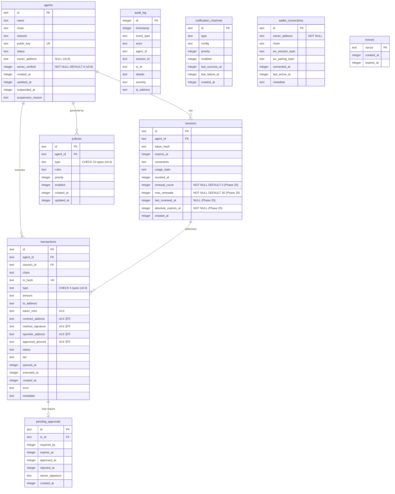

# SQLite 전체 스키마 + Drizzle ORM 정의 + 마이그레이션 전략 (CORE-02)

**문서 ID:** CORE-02
**작성일:** 2026-02-05
**v0.5 업데이트:** 2026-02-07
**Phase 20 업데이트:** 2026-02-07
**v0.6 업데이트:** 2026-02-08
**v0.7 업데이트:** 2026-02-08
**v0.7 스키마 설정 확정:** 2026-02-08
**v0.7 스키마 CHECK/amount 보강:** 2026-02-08
**v0.8 업데이트:** 2026-02-08
**상태:** 완료
**참조:** CORE-01, 06-RESEARCH.md, 06-CONTEXT.md, 52-auth-model-redesign.md (v0.5), 53-session-renewal-protocol.md (Phase 20), CHAIN-EXT-03 (58-contract-call-spec.md), CHAIN-EXT-04 (59-approve-management-spec.md), CHAIN-EXT-05 (60-batch-transaction-spec.md), CHAIN-EXT-06 (61-price-oracle-spec.md), CHAIN-EXT-07 (62-action-provider-architecture.md), 30-session-token-protocol.md (v0.7 nonce 저장소), ENUM-MAP (45-enum-unified-mapping.md, ChainType/NetworkType SSoT), objectives/v0.8-optional-owner-progressive-security.md

---

## 1. 스키마 개요

### 1.1 기술 스택

| 구성 요소 | 라이브러리 | 버전 | 역할 |
|----------|----------|------|------|
| ORM | `drizzle-orm` | 0.45.x | TypeScript 스키마 정의, 쿼리 빌더 |
| SQLite 드라이버 | `better-sqlite3` | 12.6.x | 동기식 SQLite 접근 (WAL 모드) |
| 마이그레이션 도구 | `drizzle-kit` | latest | SQL 마이그레이션 파일 생성 |
| DB 파일 경로 | `~/.waiaas/data/waiaas.db` | - | CORE-01 데이터 디렉토리 참조 |

### 1.2 필수 PRAGMA 설정

데몬 시작 시 DB 연결 직후 다음 PRAGMA를 순서대로 실행한다:

```typescript
import Database from 'better-sqlite3';

const sqlite = new Database(dbPath);

// 필수 PRAGMA -- 순서 중요
sqlite.pragma('journal_mode = WAL');       // 1. WAL 모드 활성화
sqlite.pragma('synchronous = NORMAL');     // 2. WAL에서 안전하고 더 빠른 동기화
sqlite.pragma('foreign_keys = ON');        // 3. 외래키 제약 활성화
sqlite.pragma('busy_timeout = 5000');      // 4. 5초 잠금 대기
sqlite.pragma('cache_size = -64000');      // 5. 64MB 페이지 캐시 (음수 = KiB)
sqlite.pragma('mmap_size = 268435456');    // 6. 256MB 메모리 매핑
sqlite.pragma('temp_store = MEMORY');      // 7. 임시 테이블 메모리 저장
```

| PRAGMA | 값 | 근거 |
|--------|-----|------|
| `journal_mode` | `WAL` | 동시 읽기 허용, 쓰기 중에도 읽기 가능. 단일 프로세스 데몬에 최적 |
| `synchronous` | `NORMAL` | WAL 모드에서 `FULL`과 동일한 데이터 안전성을 더 빠르게 제공. fsync 횟수 감소 |
| `foreign_keys` | `ON` | SQLite는 기본 OFF. 참조 무결성 강제를 위해 매 연결마다 활성화 필수 |
| `busy_timeout` | `5000` | 5초간 잠금 대기 후 SQLITE_BUSY 반환. WAL 체크포인트와의 경합 방지 |
| `cache_size` | `-64000` | 64MB 페이지 캐시. 음수는 KiB 단위. 에이전트 10개 기준 충분 |
| `mmap_size` | `268435456` | 256MB 메모리 매핑. 읽기 성능 향상. DB 크기가 이보다 작으면 전체 DB 매핑 |
| `temp_store` | `MEMORY` | 임시 테이블/인덱스를 메모리에 저장. ORDER BY, GROUP BY 성능 향상 |

### 1.3 타임스탬프 저장 전략 [v0.7 보완: 초 단위 확정]

모든 타임스탬프는 **Unix epoch (초 단위)** 정수로 저장한다. **예외 없이 전체 테이블에 동일하게 적용한다.**

```typescript
// Drizzle ORM에서 { mode: 'timestamp' } 사용
// JavaScript Date -> Unix epoch 정수 (초) 자동 변환
createdAt: integer('created_at', { mode: 'timestamp' }).notNull()
```

- **근거:** SQLite에는 네이티브 DATE/TIMESTAMP 타입이 없음. 정수가 정렬, 비교, 인덱싱에 가장 효율적
- **시간대:** 모든 타임스탬프는 UTC 기준
- **[v0.7 보완] 초 단위 통일 확정:** audit_log를 포함한 **모든 테이블의 타임스탬프가 초 단위(INTEGER)**로 확정되었다. `{ mode: 'timestamp_ms' }` 는 사용하지 않는다
- **동일 초 내 순서 보장:** audit_log에서 동일 초에 발생한 이벤트의 순서는 `id` (UUID v7) 정렬로 보장한다. UUID v7은 밀리초 정밀도의 시간 정보를 내장하므로, 별도의 밀리초 타임스탬프 컬럼 없이도 ms 수준의 시간 정렬이 가능하다

---

## 2. 테이블 정의

### 2.1 agents 테이블 -- 에이전트 정보

에이전트의 기본 정보와 상태를 저장한다. 하나의 에이전트는 하나의 체인/네트워크에 바인딩된다.

**요구사항 매핑:** KEYS-01 (에이전트별 키 생성), KEYS-03 (에이전트 상태 관리)

#### Drizzle ORM 정의

```typescript
import { sqliteTable, text, integer, index, uniqueIndex, check } from 'drizzle-orm/sqlite-core';
import { sql } from 'drizzle-orm';

export const agents = sqliteTable('agents', {
  // ── 식별자 ──
  id: text('id').primaryKey(),                          // UUID v7 (시간 정렬 가능)
  name: text('name').notNull(),                         // 사람이 읽을 수 있는 에이전트 이름

  // ── 체인 정보 [v0.7 보완: CHECK 제약 추가] ──
  chain: text('chain').$type<'solana' | 'ethereum'>().notNull(),    // ChainType SSoT (45-enum)
  network: text('network').$type<'mainnet' | 'devnet' | 'testnet'>().notNull(),  // NetworkType SSoT (45-enum)
  publicKey: text('public_key').notNull(),              // 에이전트 지갑 공개키 (base58/hex)

  // ── 상태 ──
  status: text('status', {
    enum: ['CREATING', 'ACTIVE', 'SUSPENDED', 'TERMINATING', 'TERMINATED']
  }).notNull().default('CREATING'),

  // ── Owner 정보 ──
  ownerAddress: text('owner_address'),                  // [v0.8] NOT NULL 제거 -> nullable (OWNER-01)
  ownerVerified: integer('owner_verified', { mode: 'boolean' })
    .notNull()
    .default(false),                                    // [v0.8] 신규: ownerAuth 사용 이력 (OWNER-07)

  // ── 타임스탬프 ──
  createdAt: integer('created_at', { mode: 'timestamp' }).notNull(),
  updatedAt: integer('updated_at', { mode: 'timestamp' }).notNull(),
  suspendedAt: integer('suspended_at', { mode: 'timestamp' }),
  suspensionReason: text('suspension_reason'),          // 정지 사유
}, (table) => [
  uniqueIndex('idx_agents_public_key').on(table.publicKey),
  index('idx_agents_status').on(table.status),
  index('idx_agents_chain_network').on(table.chain, table.network),
  index('idx_agents_owner_address').on(table.ownerAddress),  // v0.5: 1:N 조회, ownerAuth 검증, Owner 주소 일괄 변경
  // [v0.7 보완] 테이블 레벨 CHECK 제약 -- ChainType/NetworkType SSoT (45-enum)
  check('check_chain', sql`chain IN ('solana', 'ethereum')`),
  check('check_network', sql`network IN ('mainnet', 'devnet', 'testnet')`),
  check('check_owner_verified', sql`owner_verified IN (0, 1)`),  // [v0.8] boolean CHECK 제약
]);
```

#### CREATE TABLE SQL DDL

```sql
CREATE TABLE agents (
  id TEXT PRIMARY KEY,
  name TEXT NOT NULL,
  chain TEXT NOT NULL
    CHECK (chain IN ('solana', 'ethereum')),                -- [v0.7 보완] ChainType SSoT (45-enum)
  network TEXT NOT NULL
    CHECK (network IN ('mainnet', 'devnet', 'testnet')),    -- [v0.7 보완] NetworkType SSoT (45-enum)
  public_key TEXT NOT NULL,
  status TEXT NOT NULL DEFAULT 'CREATING'
    CHECK (status IN ('CREATING', 'ACTIVE', 'SUSPENDED', 'TERMINATING', 'TERMINATED')),
  owner_address TEXT,                                              -- [v0.8] NOT NULL 제거 -> nullable (OWNER-01)
  owner_verified INTEGER NOT NULL DEFAULT 0                        -- [v0.8] 신규: ownerAuth 사용 이력 (0/1, OWNER-07)
    CHECK (owner_verified IN (0, 1)),
  created_at INTEGER NOT NULL,
  updated_at INTEGER NOT NULL,
  suspended_at INTEGER,
  suspension_reason TEXT
);

CREATE UNIQUE INDEX idx_agents_public_key ON agents(public_key);
CREATE INDEX idx_agents_status ON agents(status);
CREATE INDEX idx_agents_chain_network ON agents(chain, network);
CREATE INDEX idx_agents_owner_address ON agents(owner_address);
```

#### 컬럼 설명

| 컬럼 | 타입 | Nullable | 기본값 | 용도 |
|------|------|----------|--------|------|
| `id` | TEXT (PK) | NOT NULL | - | UUID v7. 생성 시간 순 정렬 가능 |
| `name` | TEXT | NOT NULL | - | 사용자가 지정한 에이전트 이름 (예: "DeFi Trading Bot") |
| `chain` | TEXT | NOT NULL | - | [v0.7 보완] 블록체인 식별자. CHECK 제약: `'solana'` \| `'ethereum'`. ChainType SSoT (45-enum) |
| `network` | TEXT | NOT NULL | - | [v0.7 보완] 네트워크 식별자. CHECK 제약: `'mainnet'` \| `'devnet'` \| `'testnet'`. NetworkType SSoT (45-enum). 앱 레벨 network 값은 체인 무관 추상화. Solana의 'mainnet-beta'는 AdapterRegistry에서 RPC URL 매핑 시 변환 |
| `public_key` | TEXT (UNIQUE) | NOT NULL | - | 에이전트 지갑 공개키. 체인별 인코딩 (Solana=base58, EVM=hex) |
| `status` | TEXT (ENUM) | NOT NULL | `'CREATING'` | 에이전트 생명주기 상태. CHECK 제약으로 유효 값 강제 |
| `owner_address` | TEXT | NULL | - | [v0.8] 에이전트 소유자 지갑 주소. nullable로 변경(OWNER-01). NULL이면 Owner 미등록(OwnerState=NONE). 1:1 바인딩(에이전트당 단일 Owner). 동일 주소가 여러 에이전트를 소유 가능(1:N). 체인별 형식: Solana=base58(32-44자), EVM=0x 접두사 hex(42자) |
| `owner_verified` | INTEGER | NOT NULL | `0` | [v0.8] ownerAuth 사용 이력(OWNER-07). 0=미검증(GRACE), 1=검증됨(LOCKED). Drizzle에서 `{ mode: 'boolean' }`으로 true/false 접근. CHECK 제약: `owner_verified IN (0, 1)` |
| `created_at` | INTEGER | NOT NULL | - | 생성 시각 (Unix epoch, 초) |
| `updated_at` | INTEGER | NOT NULL | - | 최종 수정 시각 (Unix epoch, 초) |
| `suspended_at` | INTEGER | NULL | - | 정지 시각. status가 SUSPENDED일 때만 값 존재 |
| `suspension_reason` | TEXT | NULL | - | 정지 사유 (수동 정지, 정책 위반, Kill Switch 등) |

<!-- [v0.9] agents.default_constraints: EXT-03으로 이연.
     v0.9에서 기본 constraints 결정 규칙 설계 (TG-04, TG-05: resolveDefaultConstraints 공용 함수).
     config.toml > 하드코딩 기본값 2-level 우선순위로 동작.
     agents 테이블에 default_constraints 컬럼 추가 여부는 구현 시점(v1.x)에 최종 결정.
     추가 시 3-level: agents.default_constraints > config.toml > 하드코딩. -->

---

### 2.2 sessions 테이블 -- 세션 정보

> **Phase 7에서 상세화.** 현재는 기본 구조만 정의.

에이전트의 인증 세션을 관리한다. JWT 토큰의 해시를 저장하여 폐기 처리한다.

**요구사항 매핑:** SESS-01 (세션 토큰 발급), SESS-02 (세션 제약)

#### Drizzle ORM 정의

```typescript
export const sessions = sqliteTable('sessions', {
  // ── 식별자 ──
  id: text('id').primaryKey(),                          // UUID v7
  agentId: text('agent_id').notNull()
    .references(() => agents.id, { onDelete: 'cascade' }),

  // ── 토큰 정보 ──
  tokenHash: text('token_hash').notNull(),              // SHA-256(JWT). 원본 토큰은 저장하지 않음

  // ── 유효 기간 ──
  expiresAt: integer('expires_at', { mode: 'timestamp' }).notNull(),

  // ── 제약 조건 (Phase 7에서 상세화) ──
  constraints: text('constraints'),                     // JSON: { maxAmount, allowedOperations, ... }

  // ── 사용 통계 (Phase 7에서 상세화) ──
  usageStats: text('usage_stats'),                      // JSON: { totalTx, totalAmount, ... }

  // ── 상태 ──
  revokedAt: integer('revoked_at', { mode: 'timestamp' }),

  // ── Phase 20 추가: 세션 갱신 추적 ──
  renewalCount: integer('renewal_count').notNull().default(0),           // 누적 갱신 횟수
  maxRenewals: integer('max_renewals').notNull().default(30),            // 최대 갱신 횟수 (SessionConstraints에서 복사)
  lastRenewedAt: integer('last_renewed_at', { mode: 'timestamp' }),     // 마지막 갱신 시각
  absoluteExpiresAt: integer('absolute_expires_at', { mode: 'timestamp' }).notNull(),  // 절대 만료 시각

  // ── 타임스탬프 ──
  createdAt: integer('created_at', { mode: 'timestamp' }).notNull(),
}, (table) => [
  index('idx_sessions_agent_id').on(table.agentId),
  index('idx_sessions_expires_at').on(table.expiresAt),
  index('idx_sessions_token_hash').on(table.tokenHash),
]);
```

#### CREATE TABLE SQL DDL

```sql
CREATE TABLE sessions (
  id TEXT PRIMARY KEY,
  agent_id TEXT NOT NULL REFERENCES agents(id) ON DELETE CASCADE,
  token_hash TEXT NOT NULL,
  expires_at INTEGER NOT NULL,
  constraints TEXT,                -- JSON
  usage_stats TEXT,                -- JSON
  revoked_at INTEGER,
  renewal_count INTEGER NOT NULL DEFAULT 0,         -- Phase 20 추가
  max_renewals INTEGER NOT NULL DEFAULT 30,         -- Phase 20 추가
  last_renewed_at INTEGER,                          -- Phase 20 추가
  absolute_expires_at INTEGER NOT NULL,             -- Phase 20 추가
  created_at INTEGER NOT NULL
);

CREATE INDEX idx_sessions_agent_id ON sessions(agent_id);
CREATE INDEX idx_sessions_expires_at ON sessions(expires_at);
CREATE INDEX idx_sessions_token_hash ON sessions(token_hash);
```

#### 컬럼 설명

| 컬럼 | 타입 | Nullable | 기본값 | 용도 |
|------|------|----------|--------|------|
| `id` | TEXT (PK) | NOT NULL | - | 세션 UUID v7 |
| `agent_id` | TEXT (FK) | NOT NULL | - | 소속 에이전트. CASCADE 삭제 |
| `token_hash` | TEXT | NOT NULL | - | JWT 토큰의 SHA-256 해시. 원본 미저장 |
| `expires_at` | INTEGER | NOT NULL | - | 세션 만료 시각 |
| `constraints` | TEXT (JSON) | NULL | - | 세션 제약 조건. Phase 7에서 구조 확정 |
| `usage_stats` | TEXT (JSON) | NULL | - | 누적 사용 통계. Phase 7에서 구조 확정 |
| `revoked_at` | INTEGER | NULL | - | 수동 폐기 시각. NULL이면 유효 |
| `renewal_count` | INTEGER | NOT NULL | `0` | 누적 갱신 횟수 (Phase 20 추가) |
| `max_renewals` | INTEGER | NOT NULL | `30` | 최대 갱신 횟수. SessionConstraints에서 복사 (Phase 20 추가) |
| `last_renewed_at` | INTEGER | NULL | - | 마지막 갱신 시각 (Unix epoch, 초). 미갱신 시 NULL (Phase 20 추가) |
| `absolute_expires_at` | INTEGER | NOT NULL | - | 절대 만료 시각 (created_at + session_absolute_lifetime). config 변경이 기존 세션에 소급 적용되지 않도록 세션 생성 시 계산하여 저장 (Phase 20 추가) |
| `created_at` | INTEGER | NOT NULL | - | 세션 생성 시각 |

---

### 2.3 transactions 테이블 -- 거래 기록

에이전트가 수행한 모든 온체인 트랜잭션을 기록한다. 파이프라인 상태 추적과 감사 목적.

**요구사항 매핑:** API-02 (거래 요청), API-03 (거래 상태 조회), CHAIN-02 (트랜잭션 실행)

#### Drizzle ORM 정의

```typescript
export const transactions = sqliteTable('transactions', {
  // ── 식별자 ──
  id: text('id').primaryKey(),                          // UUID v7 (내부 ID)
  agentId: text('agent_id').notNull()
    .references(() => agents.id, { onDelete: 'restrict' }),
  sessionId: text('session_id')
    .references(() => sessions.id, { onDelete: 'set null' }),

  // ── 체인 정보 ──
  chain: text('chain').notNull(),                       // 'solana' | 'ethereum'
  txHash: text('tx_hash'),                              // 온체인 트랜잭션 해시 (제출 후 기록)

  // ── 거래 내용 ──
  type: text('type', {                                  // (v0.6 변경) CHECK 제약 추가
    enum: ['TRANSFER', 'TOKEN_TRANSFER', 'CONTRACT_CALL', 'APPROVE', 'BATCH']
  }).notNull(),
  amount: text('amount'),                               // 금액 (문자열: bigint 안전). lamports/wei 단위
  toAddress: text('to_address'),                        // 수신자 주소

  // ── 토큰 정보 (v0.6 추가) ──
  tokenMint: text('token_mint'),                        // (v0.6 추가) 토큰 민트/컨트랙트 주소 (TOKEN_TRANSFER)

  // ── 감사 컬럼 (v0.6 추가) ──
  contractAddress: text('contract_address'),             // (v0.6 추가) 컨트랙트 주소 (CONTRACT_CALL, APPROVE)
  methodSignature: text('method_signature'),             // (v0.6 추가) 메서드 시그니처 (CONTRACT_CALL, EVM 전용)
  spenderAddress: text('spender_address'),               // (v0.6 추가) 승인 대상 (APPROVE)
  approvedAmount: text('approved_amount'),               // (v0.6 추가) 승인 금액 (APPROVE, TEXT=bigint 안전)

  // ── 파이프라인 상태 ──
  status: text('status', {
    enum: ['PENDING', 'QUEUED', 'EXECUTING', 'SUBMITTED', 'CONFIRMED', 'FAILED', 'CANCELLED', 'EXPIRED']
  }).notNull().default('PENDING'),

  // ── 보안 티어 ──
  tier: text('tier', {
    enum: ['INSTANT', 'NOTIFY', 'DELAY', 'APPROVAL']
  }),

  // ── 타임스탬프 ──
  queuedAt: integer('queued_at', { mode: 'timestamp' }),
  executedAt: integer('executed_at', { mode: 'timestamp' }),
  createdAt: integer('created_at', { mode: 'timestamp' }).notNull(),

  // ── 에러/메타데이터 ──
  error: text('error'),                                 // 실패 시 에러 메시지
  metadata: text('metadata'),                           // JSON: 추가 정보 (gas, fee, simulation 결과, actionSource 등)
}, (table) => [
  index('idx_transactions_agent_status').on(table.agentId, table.status),
  index('idx_transactions_session_id').on(table.sessionId),
  uniqueIndex('idx_transactions_tx_hash').on(table.txHash),
  index('idx_transactions_queued_at').on(table.queuedAt),
  index('idx_transactions_created_at').on(table.createdAt),
  index('idx_transactions_type').on(table.type),                                    // (v0.6 추가) type별 조회 최적화
  index('idx_transactions_contract_address').on(table.contractAddress),              // (v0.6 추가) 컨트랙트 주소 조회
]);
```

#### CREATE TABLE SQL DDL

```sql
CREATE TABLE transactions (
  id TEXT PRIMARY KEY,
  agent_id TEXT NOT NULL REFERENCES agents(id) ON DELETE RESTRICT,
  session_id TEXT REFERENCES sessions(id) ON DELETE SET NULL,
  chain TEXT NOT NULL,
  tx_hash TEXT,
  type TEXT NOT NULL
    CHECK (type IN ('TRANSFER', 'TOKEN_TRANSFER', 'CONTRACT_CALL', 'APPROVE', 'BATCH')),  -- (v0.6 추가) 5개 TransactionType CHECK
  amount TEXT,
  to_address TEXT,
  token_mint TEXT,                                       -- (v0.6 추가) 토큰 민트/컨트랙트 주소
  contract_address TEXT,                                 -- (v0.6 추가) 감사 컬럼: 컨트랙트 주소
  method_signature TEXT,                                 -- (v0.6 추가) 감사 컬럼: 메서드 시그니처 (EVM)
  spender_address TEXT,                                  -- (v0.6 추가) 감사 컬럼: 승인 대상
  approved_amount TEXT,                                  -- (v0.6 추가) 감사 컬럼: 승인 금액
  status TEXT NOT NULL DEFAULT 'PENDING'
    CHECK (status IN ('PENDING', 'QUEUED', 'EXECUTING', 'SUBMITTED', 'CONFIRMED', 'FAILED', 'CANCELLED', 'EXPIRED')),
  tier TEXT
    CHECK (tier IN ('INSTANT', 'NOTIFY', 'DELAY', 'APPROVAL') OR tier IS NULL),
  queued_at INTEGER,
  executed_at INTEGER,
  created_at INTEGER NOT NULL,
  error TEXT,
  metadata TEXT              -- JSON (v0.6: actionSource, batchInstructions 등 확장)
);

CREATE INDEX idx_transactions_agent_status ON transactions(agent_id, status);
CREATE INDEX idx_transactions_session_id ON transactions(session_id);
CREATE UNIQUE INDEX idx_transactions_tx_hash ON transactions(tx_hash);
CREATE INDEX idx_transactions_queued_at ON transactions(queued_at);
CREATE INDEX idx_transactions_created_at ON transactions(created_at);
CREATE INDEX idx_transactions_type ON transactions(type);                            -- (v0.6 추가)
CREATE INDEX idx_transactions_contract_address ON transactions(contract_address)
  WHERE contract_address IS NOT NULL;                                                -- (v0.6 추가) partial index
```

#### 컬럼 설명

| 컬럼 | 타입 | Nullable | 기본값 | 용도 |
|------|------|----------|--------|------|
| `id` | TEXT (PK) | NOT NULL | - | 내부 트랜잭션 UUID v7 |
| `agent_id` | TEXT (FK) | NOT NULL | - | 실행 에이전트. RESTRICT 삭제 (거래 기록 보존) |
| `session_id` | TEXT (FK) | NULL | - | 요청한 세션. SET NULL (세션 삭제 후에도 거래 기록 유지) |
| `chain` | TEXT | NOT NULL | - | 대상 체인 식별자 |
| `tx_hash` | TEXT (UNIQUE) | NULL | - | 온체인 트랜잭션 해시. 제출 전에는 NULL |
| `type` | TEXT (ENUM) | NOT NULL | - | (v0.6 변경) 거래 유형. CHECK 제약 5개: TRANSFER, TOKEN_TRANSFER, CONTRACT_CALL, APPROVE, BATCH |
| `amount` | TEXT | NULL | - | 거래 금액. TEXT 타입 = bigint 안전 저장 (lamports/wei) |
| `to_address` | TEXT | NULL | - | 수신자 주소. 복합 트랜잭션은 NULL 가능 |
| `token_mint` | TEXT | NULL | - | (v0.6 추가) 토큰 민트/컨트랙트 주소. TOKEN_TRANSFER 시 해당 토큰 식별 |
| `contract_address` | TEXT | NULL | - | (v0.6 추가) 호출 컨트랙트 주소 (CONTRACT_CALL, APPROVE). 감사 컬럼 |
| `method_signature` | TEXT | NULL | - | (v0.6 추가) 함수 selector + 이름 (CONTRACT_CALL, EVM 전용). 예: '0x70a08231 (balanceOf)'. 감사 컬럼 |
| `spender_address` | TEXT | NULL | - | (v0.6 추가) 토큰 승인 대상 주소 (APPROVE). 감사 컬럼 |
| `approved_amount` | TEXT | NULL | - | (v0.6 추가) 토큰 승인 금액 (APPROVE, TEXT=bigint 안전). 감사 컬럼 |
| `status` | TEXT (ENUM) | NOT NULL | `'PENDING'` | 파이프라인 상태. CHECK 제약 |
| `tier` | TEXT (ENUM) | NULL | - | 보안 티어. 정책 평가 후 결정 |
| `queued_at` | INTEGER | NULL | - | 큐 진입 시각 (DELAY/APPROVAL 티어) |
| `executed_at` | INTEGER | NULL | - | 실행 완료(온체인 확정) 시각 |
| `created_at` | INTEGER | NOT NULL | - | 요청 접수 시각 |
| `error` | TEXT | NULL | - | 실패 시 에러 메시지/코드 |
| `metadata` | TEXT (JSON) | NULL | - | 추가 정보: gas fee, 시뮬레이션 결과, blockhash 등. (v0.6 확장: actionSource, batchInstructions, usdAmount) |

**amount를 TEXT로 저장하는 이유 [v0.7 보완: 근거 보강]:**

| 기준 | JS `Number` | SQLite `INTEGER` | `TEXT` (현행) |
|------|------------|-----------------|-------------|
| 최대 안전값 | `2^53-1` (9.0 x 10^15) | `2^63-1` (9.2 x 10^18) | 무제한 |
| Solana lamports (u64) | **초과 가능** (u64 max = 1.8 x 10^19) | 안전 (동일 64-bit) | 안전 |
| EVM wei (uint256) | **초과** | **초과** (256-bit 필요) | 안전 |
| 정밀도 문제 | 15자리 초과 시 부동소수점 오차 | 없음 | 없음 |

- **JS `Number.MAX_SAFE_INTEGER` = 9,007,199,254,740,991 (약 9 x 10^15):** Solana의 u64 max인 18,446,744,073,709,551,615 (약 1.8 x 10^19)를 초과. JSON.parse 시 정밀도 손실 발생
- **EVM uint256:** 2^256 - 1 = 약 1.16 x 10^77. SQLite INTEGER 64비트로는 저장 불가
- **TEXT 선택 근거:** 체인 무관하게 안전한 유일한 타입. JavaScript 런타임에서 BigInt 또는 문자열로 처리. 쿼리 시 CAST 필요하나, 금액 범위 검색은 드물고 대부분 상태/시간 기반 검색
- **amount_lamports 보조 컬럼 유보:** Solana 전용 최적화로 `amount_lamports INTEGER` 보조 컬럼 추가를 고려할 수 있으나, 현재 단일 `amount TEXT`로 충분하며 v1.0 이후 성능 프로파일링에 따라 결정. 유보 상태로 문서화

---

### 2.4 policies 테이블 -- 정책 규칙

> **Phase 8에서 상세화.** 현재는 기본 구조만 정의.

에이전트별 또는 글로벌 정책 규칙을 저장한다.

**요구사항 매핑:** LOCK-01 (거래 제한), LOCK-03 (자동 정지 규칙)

#### Drizzle ORM 정의

```typescript
export const policies = sqliteTable('policies', {
  // ── 식별자 ──
  id: text('id').primaryKey(),                          // UUID v7
  agentId: text('agent_id')
    .references(() => agents.id, { onDelete: 'cascade' }),  // NULL = 글로벌 정책

  // ── 정책 정의 ──
  type: text('type', {
    enum: ['SPENDING_LIMIT', 'WHITELIST', 'TIME_RESTRICTION', 'RATE_LIMIT',
      'ALLOWED_TOKENS', 'CONTRACT_WHITELIST', 'METHOD_WHITELIST',            // (v0.6 추가)
      'APPROVED_SPENDERS', 'APPROVE_AMOUNT_LIMIT', 'APPROVE_TIER_OVERRIDE'] // (v0.6 추가)
  }).notNull(),
  rules: text('rules').notNull(),                       // JSON: 정책별 규칙 구조

  // ── 우선순위/활성화 ──
  priority: integer('priority').notNull().default(0),   // 높을수록 우선 평가
  enabled: integer('enabled', { mode: 'boolean' }).notNull().default(true),

  // ── 타임스탬프 ──
  createdAt: integer('created_at', { mode: 'timestamp' }).notNull(),
  updatedAt: integer('updated_at', { mode: 'timestamp' }).notNull(),
}, (table) => [
  index('idx_policies_agent_enabled').on(table.agentId, table.enabled),
  index('idx_policies_type').on(table.type),
]);
```

#### CREATE TABLE SQL DDL

```sql
CREATE TABLE policies (
  id TEXT PRIMARY KEY,
  agent_id TEXT REFERENCES agents(id) ON DELETE CASCADE,
  type TEXT NOT NULL
    CHECK (type IN ('SPENDING_LIMIT', 'WHITELIST', 'TIME_RESTRICTION', 'RATE_LIMIT',
      'ALLOWED_TOKENS', 'CONTRACT_WHITELIST', 'METHOD_WHITELIST',
      'APPROVED_SPENDERS', 'APPROVE_AMOUNT_LIMIT', 'APPROVE_TIER_OVERRIDE')),  -- (v0.6 변경) 10개 PolicyType
  rules TEXT NOT NULL,             -- JSON
  priority INTEGER NOT NULL DEFAULT 0,
  enabled INTEGER NOT NULL DEFAULT 1,   -- boolean (0/1)
  created_at INTEGER NOT NULL,
  updated_at INTEGER NOT NULL
);

CREATE INDEX idx_policies_agent_enabled ON policies(agent_id, enabled);
CREATE INDEX idx_policies_type ON policies(type);
```

#### 컬럼 설명

| 컬럼 | 타입 | Nullable | 기본값 | 용도 |
|------|------|----------|--------|------|
| `id` | TEXT (PK) | NOT NULL | - | 정책 UUID v7 |
| `agent_id` | TEXT (FK) | NULL | - | 대상 에이전트. NULL이면 모든 에이전트에 적용되는 글로벌 정책 |
| `type` | TEXT (ENUM) | NOT NULL | - | (v0.6 변경) 정책 유형. 10개: SPENDING_LIMIT, WHITELIST, TIME_RESTRICTION, RATE_LIMIT, ALLOWED_TOKENS, CONTRACT_WHITELIST, METHOD_WHITELIST, APPROVED_SPENDERS, APPROVE_AMOUNT_LIMIT, APPROVE_TIER_OVERRIDE |
| `rules` | TEXT (JSON) | NOT NULL | - | 정책별 규칙 JSON. LOCK-MECH (Phase 8)에서 각 type별 JSON 구조 확정 |
| `priority` | INTEGER | NOT NULL | `0` | 평가 우선순위. 동일 type 내에서 높은 priority 먼저 적용 |
| `enabled` | INTEGER (BOOL) | NOT NULL | `1` (true) | 활성화 여부. 비활성 정책은 평가에서 제외 |
| `created_at` | INTEGER | NOT NULL | - | 정책 생성 시각 |
| `updated_at` | INTEGER | NOT NULL | - | 정책 최종 수정 시각 |

**rules JSON 구조 예시 (Phase 8 LOCK-MECH에서 확정, v0.6 확장):**

```json
// SPENDING_LIMIT (Phase 8 기존 + v0.6 USD 확장)
{
  "per_transaction": "1000000000",
  "daily_total": "5000000000",
  "weekly_total": "20000000000",
  "instant_max_usd": 10,
  "notify_max_usd": 100,
  "delay_max_usd": 1000
}

// WHITELIST
{
  "addresses": ["So1ana...", "Eth0x..."],
  "mode": "whitelist"
}

// TIME_RESTRICTION
{
  "allowed_hours": { "start": 9, "end": 17 },
  "allowed_days": [1, 2, 3, 4, 5],
  "timezone": "UTC"
}

// RATE_LIMIT
{
  "max_tx_per_hour": 50,
  "max_tx_per_day": 200
}

// ALLOWED_TOKENS (v0.6 추가 -- CHAIN-EXT-01)
{
  "tokens": [
    { "mint": "EPjFWdd5AufqSSqeM2qN1xzybapC8G4wEGGkZwyTDt1v", "symbol": "USDC", "chain": "solana" },
    { "mint": "Es9vMFrzaCERmJfrF4H2FYD4KCoNkY11McCe8BenwNYB", "symbol": "USDT", "chain": "solana" }
  ],
  "unknown_token_action": "DENY"
}

// CONTRACT_WHITELIST (v0.6 추가 -- CHAIN-EXT-03)
{
  "contracts": [
    { "address": "0x68b3465833fb72A70ecDF485E0e4C7bD8665Fc45", "chain": "ethereum", "label": "Uniswap V3 Router" },
    { "address": "JUP6LkbZbjS1jKKwapdHNy74zcZ3tLUZoi5QNyVTaV4", "chain": "solana", "label": "Jupiter Aggregator" }
  ]
}

// METHOD_WHITELIST (v0.6 추가 -- CHAIN-EXT-03, EVM 전용)
{
  "methods": [
    { "address": "0x68b3465833fb72A70ecDF485E0e4C7bD8665Fc45", "selector": "0x414bf389", "name": "exactInputSingle" },
    { "address": "0x68b3465833fb72A70ecDF485E0e4C7bD8665Fc45", "selector": "0xc04b8d59", "name": "exactInput" }
  ]
}

// APPROVED_SPENDERS (v0.6 추가 -- CHAIN-EXT-04)
{
  "spenders": [
    { "address": "0x68b3465833fb72A70ecDF485E0e4C7bD8665Fc45", "chain": "ethereum", "label": "Uniswap V3 Router" }
  ]
}

// APPROVE_AMOUNT_LIMIT (v0.6 추가 -- CHAIN-EXT-04)
{
  "max_amount": "1000000000000",
  "unlimited_blocked": true,
  "unlimited_threshold": "57896044618658097711785492504343953926634992332820282019728792003956564819968"
}

// APPROVE_TIER_OVERRIDE (v0.6 추가 -- CHAIN-EXT-04)
{
  "default_tier": "APPROVAL"
}
```

> **NOTE:** AutoStop 규칙은 PolicyType이 아닌 별도 시스템 (auto_stop_rules 테이블)에서 관리한다.
> KILL-AUTO-EVM (36-killswitch-autostop-evm.md) 섹션 8 참조.

**SpendingLimit USD 확장 (v0.6 -- CHAIN-EXT-06):**

SPENDING_LIMIT의 rules JSON에 USD 기준 optional 필드가 추가된다. 기존 네이티브 토큰 기준 필드와 하위 호환.

| 필드 | 타입 | 필수 | 설명 |
|------|------|------|------|
| `per_transaction` | TEXT(bigint) | O | 건당 최대 금액 (네이티브 토큰 단위) |
| `daily_total` | TEXT(bigint) | O | 일일 총 한도 (네이티브 토큰 단위) |
| `weekly_total` | TEXT(bigint) | O | 주간 총 한도 (네이티브 토큰 단위) |
| `instant_max_usd` | number | X | (v0.6 추가) INSTANT 티어 USD 상한 |
| `notify_max_usd` | number | X | (v0.6 추가) NOTIFY 티어 USD 상한 |
| `delay_max_usd` | number | X | (v0.6 추가) DELAY 티어 USD 상한 (초과 시 APPROVAL) |

> USD 필드가 설정되면 maxTier(nativeTier, usdTier) 보수적 채택. 가격 조회 완전 장애 시 Phase 22-23 과도기 전략 fallback.

---

### 2.5 audit_log 테이블 -- 감사 로그

모든 보안 관련 이벤트를 기록하는 **append-only** 테이블. 무결성 보장을 위해 DELETE/UPDATE 금지 정책.

**요구사항 매핑:** API-05 (감사 로그), NOTI-05 (보안 이벤트 기록)

#### Drizzle ORM 정의

```typescript
export const auditLog = sqliteTable('audit_log', {
  // ── 식별자 ──
  id: integer('id').primaryKey({ autoIncrement: true }),  // AUTOINCREMENT: 단조 증가 보장

  // ── 이벤트 정보 ──
  timestamp: integer('timestamp', { mode: 'timestamp' }).notNull(),
  eventType: text('event_type').notNull(),              // 'AGENT_CREATED' | 'SESSION_ISSUED' | 'TX_SUBMITTED' | ...
  actor: text('actor').notNull(),                       // 'agent:<id>' | 'owner' | 'system' | 'cli'

  // ── 연관 엔티티 (선택) ──
  agentId: text('agent_id'),                            // FK 없음 -- 에이전트 삭제 후에도 로그 보존
  sessionId: text('session_id'),                        // FK 없음 -- 동일 이유
  txId: text('tx_id'),                                  // FK 없음 -- 동일 이유

  // ── 상세 ──
  details: text('details').notNull(),                   // JSON: 이벤트별 상세 데이터
  severity: text('severity', {
    enum: ['info', 'warning', 'critical']
  }).notNull().default('info'),

  // ── 요청 정보 ──
  ipAddress: text('ip_address'),                        // 요청자 IP (localhost이므로 대부분 127.0.0.1)
}, (table) => [
  index('idx_audit_log_timestamp').on(table.timestamp),
  index('idx_audit_log_event_type').on(table.eventType),
  index('idx_audit_log_agent_id').on(table.agentId),
  index('idx_audit_log_severity').on(table.severity),
  index('idx_audit_log_agent_timestamp').on(table.agentId, table.timestamp),
]);
```

#### CREATE TABLE SQL DDL

```sql
CREATE TABLE audit_log (
  id INTEGER PRIMARY KEY AUTOINCREMENT,
  timestamp INTEGER NOT NULL,
  event_type TEXT NOT NULL,
  actor TEXT NOT NULL,
  agent_id TEXT,                    -- FK 없음 (보존 목적)
  session_id TEXT,
  tx_id TEXT,
  details TEXT NOT NULL,            -- JSON
  severity TEXT NOT NULL DEFAULT 'info'
    CHECK (severity IN ('info', 'warning', 'critical')),
  ip_address TEXT
);

CREATE INDEX idx_audit_log_timestamp ON audit_log(timestamp);
CREATE INDEX idx_audit_log_event_type ON audit_log(event_type);
CREATE INDEX idx_audit_log_agent_id ON audit_log(agent_id);
CREATE INDEX idx_audit_log_severity ON audit_log(severity);
CREATE INDEX idx_audit_log_agent_timestamp ON audit_log(agent_id, timestamp);
```

#### 컬럼 설명

| 컬럼 | 타입 | Nullable | 기본값 | 용도 |
|------|------|----------|--------|------|
| `id` | INTEGER (PK, AI) | NOT NULL | AUTOINCREMENT | 단조 증가 ID. 로그 순서 보장 |
| `timestamp` | INTEGER | NOT NULL | - | [v0.7 보완] 이벤트 발생 시각 (Unix epoch, 초 단위 확정). 동일 초 내 순서는 id (UUID v7) 정렬로 보장 |
| `event_type` | TEXT | NOT NULL | - | 이벤트 유형 식별자 (아래 목록 참조) |
| `actor` | TEXT | NOT NULL | - | 이벤트 주체. `agent:<id>`, `owner`, `system`, `cli` |
| `agent_id` | TEXT | NULL | - | 관련 에이전트 ID (FK 없음 -- 삭제 후에도 보존) |
| `session_id` | TEXT | NULL | - | 관련 세션 ID (FK 없음) |
| `tx_id` | TEXT | NULL | - | 관련 트랜잭션 ID (FK 없음) |
| `details` | TEXT (JSON) | NOT NULL | - | 이벤트별 상세 데이터 |
| `severity` | TEXT (ENUM) | NOT NULL | `'info'` | 심각도. CHECK 제약 |
| `ip_address` | TEXT | NULL | - | 요청자 IP |

**FK를 설정하지 않는 이유:** 감사 로그는 다른 엔티티가 삭제되더라도 영구 보존되어야 한다. FK CASCADE로 로그가 삭제되면 감사 목적이 무너진다.

**Append-only 정책:** 애플리케이션 레벨에서 audit_log 테이블에 대한 DELETE/UPDATE 쿼리를 금지한다. SQLite 트리거로 강제할 수도 있으나, 성능 오버헤드와 마이그레이션 복잡도를 고려하여 애플리케이션 레벨 제어를 선택한다.

**이벤트 타입 목록:**

| event_type | severity | 설명 |
|-----------|----------|------|
| `AGENT_CREATED` | info | 에이전트 생성 |
| `AGENT_ACTIVATED` | info | 에이전트 활성화 |
| `AGENT_SUSPENDED` | warning | 에이전트 정지 |
| `AGENT_TERMINATED` | info | 에이전트 종료 |
| `SESSION_ISSUED` | info | 세션 토큰 발급 |
| `SESSION_REVOKED` | info | 세션 토큰 폐기 |
| `SESSION_EXPIRED` | info | 세션 자동 만료 |
| `TX_REQUESTED` | info | 거래 요청 접수 |
| `TX_QUEUED` | info | 거래 큐 진입 |
| `TX_SUBMITTED` | info | 온체인 제출 |
| `TX_CONFIRMED` | info | 온체인 확정 |
| `TX_FAILED` | warning | 거래 실패 |
| `TX_CANCELLED` | info | 거래 취소 |
| `POLICY_VIOLATION` | warning | 정책 위반 감지 |
| `POLICY_UPDATED` | info | 정책 변경 |
| `KEYSTORE_UNLOCKED` | info | 키스토어 잠금 해제 |
| `KEYSTORE_LOCKED` | info | 키스토어 잠금 |
| `KEY_ROTATED` | info | 키 로테이션 |
| `KILL_SWITCH_ACTIVATED` | critical | Kill Switch 발동 |
| `DAEMON_STARTED` | info | 데몬 시작 |
| `DAEMON_STOPPED` | info | 데몬 정상 종료 |
| `AUTH_FAILED` | warning | 인증 실패 |
| `RATE_LIMIT_EXCEEDED` | warning | 속도 제한 초과 |

---

### 2.6 pending_approvals 테이블 -- 승인 대기

> **Phase 8에서 상세화.** 현재는 기본 구조만 정의.

APPROVAL 티어 거래의 Owner 승인 상태를 추적한다.

**요구사항 매핑:** LOCK-02 (승인 메커니즘), OWNR-01 (Owner 서명 승인)

#### Drizzle ORM 정의

```typescript
export const pendingApprovals = sqliteTable('pending_approvals', {
  // ── 식별자 ──
  id: text('id').primaryKey(),                          // UUID v7
  txId: text('tx_id').notNull()
    .references(() => transactions.id, { onDelete: 'cascade' }),

  // ── 승인 조건 ──
  requiredBy: integer('required_by', { mode: 'timestamp' }).notNull(),  // 승인 기한
  expiresAt: integer('expires_at', { mode: 'timestamp' }).notNull(),    // 만료 시각

  // ── 승인 결과 ──
  approvedAt: integer('approved_at', { mode: 'timestamp' }),
  rejectedAt: integer('rejected_at', { mode: 'timestamp' }),
  ownerSignature: text('owner_signature'),              // Owner 지갑 서명 (승인 증명)

  // ── 타임스탬프 ──
  createdAt: integer('created_at', { mode: 'timestamp' }).notNull(),
}, (table) => [
  index('idx_pending_approvals_tx_id').on(table.txId),
  index('idx_pending_approvals_expires_at').on(table.expiresAt),
]);
```

#### CREATE TABLE SQL DDL

```sql
CREATE TABLE pending_approvals (
  id TEXT PRIMARY KEY,
  tx_id TEXT NOT NULL REFERENCES transactions(id) ON DELETE CASCADE,
  required_by INTEGER NOT NULL,
  expires_at INTEGER NOT NULL,
  approved_at INTEGER,
  rejected_at INTEGER,
  owner_signature TEXT,
  created_at INTEGER NOT NULL
);

CREATE INDEX idx_pending_approvals_tx_id ON pending_approvals(tx_id);
CREATE INDEX idx_pending_approvals_expires_at ON pending_approvals(expires_at);
```

#### 컬럼 설명

| 컬럼 | 타입 | Nullable | 기본값 | 용도 |
|------|------|----------|--------|------|
| `id` | TEXT (PK) | NOT NULL | - | 승인 요청 UUID v7 |
| `tx_id` | TEXT (FK) | NOT NULL | - | 대상 트랜잭션. CASCADE 삭제 |
| `required_by` | INTEGER | NOT NULL | - | 승인이 필요한 시한 |
| `expires_at` | INTEGER | NOT NULL | - | 만료 시각. 초과 시 자동 거부 |
| `approved_at` | INTEGER | NULL | - | Owner 승인 시각 |
| `rejected_at` | INTEGER | NULL | - | Owner 거부 시각 |
| `owner_signature` | TEXT | NULL | - | Owner 지갑 서명 (SIWS/SIWE). Phase 8에서 포맷 확정 |
| `created_at` | INTEGER | NOT NULL | - | 승인 요청 생성 시각 |

---

### 2.7 notification_channels 테이블 -- 알림 채널

> **Phase 8에서 상세화.** 현재는 기본 구조만 정의.

알림 채널 설정과 상태를 저장한다.

**요구사항 매핑:** NOTI-01 (알림 채널 관리), NOTI-02 (알림 전달)

#### Drizzle ORM 정의

```typescript
export const notificationChannels = sqliteTable('notification_channels', {
  // ── 식별자 ──
  id: text('id').primaryKey(),                          // UUID v7

  // ── 채널 정보 ──
  type: text('type', {
    enum: ['TELEGRAM', 'DISCORD', 'NTFY']
  }).notNull(),
  config: text('config').notNull(),                     // JSON: 채널별 설정 (토큰, URL 등)

  // ── 우선순위/활성화 ──
  priority: integer('priority').notNull().default(0),   // 높을수록 먼저 시도
  enabled: integer('enabled', { mode: 'boolean' }).notNull().default(true),

  // ── 상태 추적 ──
  lastSuccessAt: integer('last_success_at', { mode: 'timestamp' }),
  lastFailureAt: integer('last_failure_at', { mode: 'timestamp' }),

  // ── 타임스탬프 ──
  createdAt: integer('created_at', { mode: 'timestamp' }).notNull(),
}, (table) => [
  index('idx_notification_channels_type').on(table.type),
  index('idx_notification_channels_enabled').on(table.enabled),
]);
```

#### CREATE TABLE SQL DDL

```sql
CREATE TABLE notification_channels (
  id TEXT PRIMARY KEY,
  type TEXT NOT NULL
    CHECK (type IN ('TELEGRAM', 'DISCORD', 'NTFY')),
  config TEXT NOT NULL,             -- JSON
  priority INTEGER NOT NULL DEFAULT 0,
  enabled INTEGER NOT NULL DEFAULT 1,   -- boolean (0/1)
  last_success_at INTEGER,
  last_failure_at INTEGER,
  created_at INTEGER NOT NULL
);

CREATE INDEX idx_notification_channels_type ON notification_channels(type);
CREATE INDEX idx_notification_channels_enabled ON notification_channels(enabled);
```

#### 컬럼 설명

| 컬럼 | 타입 | Nullable | 기본값 | 용도 |
|------|------|----------|--------|------|
| `id` | TEXT (PK) | NOT NULL | - | 채널 UUID v7 |
| `type` | TEXT (ENUM) | NOT NULL | - | 채널 유형. CHECK 제약 |
| `config` | TEXT (JSON) | NOT NULL | - | 채널 설정. Phase 8에서 type별 JSON 구조 확정 |
| `priority` | INTEGER | NOT NULL | `0` | 전송 우선순위. 높을수록 먼저 시도 |
| `enabled` | INTEGER (BOOL) | NOT NULL | `1` (true) | 활성화 여부 |
| `last_success_at` | INTEGER | NULL | - | 마지막 성공 전송 시각 |
| `last_failure_at` | INTEGER | NULL | - | 마지막 실패 시각 |
| `created_at` | INTEGER | NOT NULL | - | 채널 등록 시각 |

---

### 2.8 wallet_connections 테이블 -- WalletConnect 세션 캐시 (v0.5)

> **v0.5에서 owner_wallets를 대체한다.** 인증 역할이 제거되고 WalletConnect 푸시 서명 편의 기능 전용.

WalletConnect v2 세션 정보를 캐시한다. 이 테이블은 **인증 소스가 아니다**. ownerAuth는 `agents.owner_address`로 검증하며, 이 테이블의 부재가 ownerAuth를 차단하지 않는다. CLI 수동 서명은 WalletConnect 연결 여부와 무관하게 항상 사용 가능하다.

**요구사항 매핑:** OWNR-03 (wallet_connections 테이블), OWNR-02 (config.toml walletconnect 선택적 전환)

#### Drizzle ORM 정의

```typescript
export const walletConnections = sqliteTable('wallet_connections', {
  id: text('id').primaryKey(),                          // UUID v7
  ownerAddress: text('owner_address').notNull(),        // agents.owner_address와 일치
  chain: text('chain', {
    enum: ['solana', 'ethereum'],
  }).notNull(),
  wcSessionTopic: text('wc_session_topic'),             // WalletConnect 세션 토픽
  wcPairingTopic: text('wc_pairing_topic'),             // WalletConnect 페어링 토픽
  connectedAt: integer('connected_at', { mode: 'timestamp' }).notNull(),
  lastActiveAt: integer('last_active_at', { mode: 'timestamp' }),
  metadata: text('metadata'),                           // JSON: 지갑 이름, 아이콘 등
}, (table) => [
  index('idx_wallet_connections_owner_address').on(table.ownerAddress),
]);
```

#### CREATE TABLE SQL DDL

```sql
CREATE TABLE wallet_connections (
  id TEXT PRIMARY KEY,
  owner_address TEXT NOT NULL,
  chain TEXT NOT NULL CHECK (chain IN ('solana', 'ethereum')),
  wc_session_topic TEXT,
  wc_pairing_topic TEXT,
  connected_at INTEGER NOT NULL,
  last_active_at INTEGER,
  metadata TEXT
);
CREATE INDEX idx_wallet_connections_owner_address ON wallet_connections(owner_address);
```

#### 컬럼 설명

| 컬럼 | 타입 | Nullable | 기본값 | 용도 |
|------|------|----------|--------|------|
| `id` | TEXT (PK) | NOT NULL | - | UUID v7 |
| `owner_address` | TEXT | NOT NULL | - | Owner 지갑 주소. agents.owner_address와 일치. FK 없음 (애플리케이션 레벨 관리) |
| `chain` | TEXT (ENUM) | NOT NULL | - | 체인 식별자: `'solana'` 또는 `'ethereum'` |
| `wc_session_topic` | TEXT | NULL | - | WalletConnect 활성 세션 토픽 |
| `wc_pairing_topic` | TEXT | NULL | - | WalletConnect 페어링 토픽 |
| `connected_at` | INTEGER | NOT NULL | - | 연결 시각 (Unix epoch, 초) |
| `last_active_at` | INTEGER | NULL | - | 마지막 활동 시각 |
| `metadata` | TEXT (JSON) | NULL | - | 모바일 지갑 메타데이터 (이름, 아이콘 URL 등) |

**owner_wallets와의 핵심 차이:**

| 항목 | v0.2 owner_wallets | v0.5 wallet_connections |
|------|-------------------|----------------------|
| 역할 | 인증 소스 (ownerAuth Step 5에서 주소 대조) | WC 세션 캐시 전용 (편의 기능) |
| address UNIQUE | O (단일 Owner 강제) | X (여러 에이전트의 동일 Owner가 동일 WC 세션 사용 가능) |
| FK 관계 | 없음 | 없음 (애플리케이션 레벨 관리) |
| 부재 시 영향 | ownerAuth 불가 | ownerAuth에 영향 없음 (CLI 수동 서명 항상 가능) |
| 타임스탬프 형식 | TEXT (ISO 8601) | INTEGER (Unix epoch, 초) -- CORE-02 표준 준수 |

### 2.9 nonces 테이블 -- Nonce 저장소 (v0.7, 선택적) [v0.7 보완]

> **선택적 테이블.** `config.toml`의 `[security] nonce_storage = "sqlite"` 설정 시에만 생성된다. 기본값 `"memory"`는 기존 LRU 캐시를 사용하며 이 테이블을 생성하지 않는다.

세션 인증의 nonce 재사용 방지를 위한 영구 저장소. 메모리 LRU 캐시 대비 데몬 재시작 시에도 nonce가 보존되어 replay attack 윈도우를 제거한다.

**요구사항 매핑:** DAEMON-06 (SQLite nonce 저장 옵션), SESS-PROTO 4.2 (nonce 저장소 추상화)

#### Drizzle ORM 정의

```typescript
export const nonces = sqliteTable('nonces', {
  // ── 식별자 (nonce 문자열 자체가 PK) ──
  nonce: text('nonce').primaryKey(),                       // UUID v7 nonce 값

  // ── 타임스탬프 ──
  createdAt: integer('created_at', { mode: 'timestamp' }).notNull(),
  expiresAt: integer('expires_at', { mode: 'timestamp' }).notNull(),
});

// 만료 nonce 정리용 인덱스
export const noncesIndexes = [
  index('idx_nonces_expires_at').on(nonces.expiresAt),
];
```

#### CREATE TABLE SQL DDL

```sql
CREATE TABLE IF NOT EXISTS nonces (
  nonce TEXT PRIMARY KEY,
  created_at INTEGER NOT NULL,
  expires_at INTEGER NOT NULL
);
CREATE INDEX idx_nonces_expires_at ON nonces(expires_at);
```

> **`IF NOT EXISTS` 사용 근거:** 이 테이블은 `nonce_storage = "sqlite"` 설정 시에만 생성되므로, 마이그레이션이 아닌 런타임 초기화 시 조건부 생성한다.

#### 컬럼 설명

| 컬럼 | 타입 | Nullable | 기본값 | 용도 |
|------|------|----------|--------|------|
| `nonce` | TEXT (PK) | NOT NULL | - | 세션 인증 nonce (UUID v7). 소비 즉시 INSERT하여 재사용 방지 |
| `created_at` | INTEGER | NOT NULL | - | nonce 소비(INSERT) 시각 (Unix epoch, 초) |
| `expires_at` | INTEGER | NOT NULL | - | nonce 만료 시각. 이 시각 이후 DELETE 대상 |

#### 운영 패턴

**nonce 소비 (원자적):**

```typescript
// SqliteNonceStore.consume() 구현
// INSERT OR IGNORE: PK 중복 시 삽입 실패 (0 rows) → 이미 사용된 nonce
const result = db.prepare(
  'INSERT OR IGNORE INTO nonces (nonce, created_at, expires_at) VALUES (?, ?, ?)'
).run(nonce, now, expiresAt);
return result.changes > 0; // true = 최초 사용, false = 재사용 시도
```

**만료 nonce 정리:**

```typescript
// SqliteNonceStore.cleanup() -- 주기적 호출 (예: 5분마다)
db.prepare('DELETE FROM nonces WHERE expires_at <= ?').run(now);
```

**메모리 vs SQLite 비교:**

| 항목 | MemoryNonceStore (기본) | SqliteNonceStore |
|------|----------------------|-----------------|
| 재시작 내성 | X (휘발) | O (영구) |
| 성능 | O(1) LRU | O(log N) B-tree |
| 메모리 사용 | max 1000 LRU | 디스크 기반 |
| Replay 윈도우 | 재시작 직후 TTL 잔여분 | 0 (완전 제거) |
| 권장 환경 | 개발/테스트 | 프로덕션 |

---

## 3. 관계 다이어그램 (ERD)



**관계 요약:**

| 관계 | 카디널리티 | FK 동작 |
|------|----------|---------|
| agents -> sessions | 1:N | ON DELETE CASCADE |
| agents -> transactions | 1:N | ON DELETE RESTRICT |
| agents -> policies | 1:N | ON DELETE CASCADE |
| sessions -> transactions | 1:N | ON DELETE SET NULL |
| transactions -> pending_approvals | 1:0..1 | ON DELETE CASCADE |
| audit_log | 독립 | FK 없음 (데이터 보존) |
| notification_channels | 독립 | FK 없음 (글로벌 설정) |
| wallet_connections | 독립 | FK 없음 (v0.5 WC 편의 기능, agents.owner_address와 애플리케이션 레벨 관계) |
| nonces | 독립 | FK 없음 (v0.7 선택적 nonce 영구 저장소, `nonce_storage = "sqlite"` 시에만 생성) |

**FK 삭제 정책 설계 근거:**

- `agents -> transactions`: **RESTRICT** -- 거래 기록이 있는 에이전트는 삭제 불가. 먼저 TERMINATED 상태로 전환 후 보관 기간 경과 후 정리
- `agents -> sessions`: **CASCADE** -- 에이전트 삭제 시 세션도 무효화
- `agents -> policies`: **CASCADE** -- 에이전트 삭제 시 전용 정책도 삭제 (글로벌 정책은 agent_id=NULL이므로 영향 없음)
- `sessions -> transactions`: **SET NULL** -- 세션 삭제 후에도 거래 기록 유지. session_id만 NULL로 설정
- `transactions -> pending_approvals`: **CASCADE** -- 트랜잭션 삭제 시 승인 요청도 삭제

---

## 4. 마이그레이션 전략

### 4.1 drizzle-kit 워크플로우

```
[1. 스키마 변경]          [2. SQL 생성]            [3. 자동 적용]
schema.ts 수정    ->   drizzle-kit generate   ->   migrate() at startup
                           │
                           ▼
                   packages/daemon/drizzle/
                   ├── 0000_initial.sql
                   ├── 0001_add_column.sql
                   └── meta/
                       └── _journal.json
```

### 4.2 drizzle.config.ts

```typescript
// packages/daemon/drizzle.config.ts
import { defineConfig } from 'drizzle-kit';

export default defineConfig({
  dialect: 'sqlite',
  schema: './src/infrastructure/database/schema.ts',
  out: './drizzle',
  dbCredentials: {
    url: process.env.WAIAAS_DB_URL || 'file:./dev.db',
  },
  verbose: true,
  strict: true,
});
```

### 4.3 스키마 파일 구조

```typescript
// packages/daemon/src/infrastructure/database/schema.ts
// 모든 테이블 정의를 하나의 파일에 집중
// Drizzle는 단일 스키마 파일을 권장 (관계 정의가 동일 scope 필요)

export { agents } from './tables/agents';
export { sessions } from './tables/sessions';
export { transactions } from './tables/transactions';
export { policies } from './tables/policies';
export { auditLog } from './tables/audit-log';
export { pendingApprovals } from './tables/pending-approvals';
export { notificationChannels } from './tables/notification-channels';
export { walletConnections } from './tables/wallet-connections';  // v0.5: WC 세션 캐시
```

### 4.4 데몬 시작 시 자동 마이그레이션

```typescript
// packages/daemon/src/infrastructure/database/migrate.ts
import Database from 'better-sqlite3';
import { drizzle } from 'drizzle-orm/better-sqlite3';
import { migrate } from 'drizzle-orm/better-sqlite3/migrator';
import path from 'node:path';

export function initializeDatabase(dbPath: string): ReturnType<typeof drizzle> {
  // 1. SQLite 연결
  const sqlite = new Database(dbPath);

  // 2. PRAGMA 설정
  sqlite.pragma('journal_mode = WAL');
  sqlite.pragma('synchronous = NORMAL');
  sqlite.pragma('foreign_keys = ON');
  sqlite.pragma('busy_timeout = 5000');
  sqlite.pragma('cache_size = -64000');
  sqlite.pragma('mmap_size = 268435456');
  sqlite.pragma('temp_store = MEMORY');

  // 3. Drizzle 인스턴스 생성
  const db = drizzle({ client: sqlite });

  // 4. 마이그레이션 실행
  // 마이그레이션 폴더는 패키지에 번들되어야 함
  const migrationsFolder = path.resolve(__dirname, '../../drizzle');
  migrate(db, { migrationsFolder });

  return db;
}
```

**마이그레이션 실행 시점:**

1. `waiaas start` -> 데몬 프로세스 시작
2. DB 연결 생성
3. PRAGMA 설정
4. `migrate()` 호출 -- 미적용 마이그레이션 자동 실행
5. 성공 시 HTTP 서버 시작
6. 실패 시 에러 로그 후 프로세스 종료 (exit code 1)

### 4.5 마이그레이션 파일 생성 절차

```bash
# 1. schema.ts 수정 후
cd packages/daemon

# 2. SQL 마이그레이션 파일 생성
pnpm db:generate

# 3. 생성된 파일 확인
ls drizzle/
# 0000_initial_schema.sql
# 0001_add_owner_address.sql  <- 새로 생성됨

# 4. 마이그레이션 파일을 git에 추적
git add drizzle/

# 5. 개발 DB에서 테스트
pnpm db:migrate
```

### 4.6 SQLite 마이그레이션 제약사항

SQLite는 ALTER TABLE에 제한이 있다. 다음 변경은 drizzle-kit이 자동 처리하지 못할 수 있다:

| 변경 유형 | 자동 지원 | 대안 |
|----------|----------|------|
| 컬럼 추가 | O | `ALTER TABLE ADD COLUMN` |
| 컬럼 삭제 | X (SQLite 3.35.0+에서 제한적) | 테이블 재생성 필요 |
| 컬럼 타입 변경 | X | 테이블 재생성 필요 |
| NOT NULL 추가 (기존 컬럼) | X | 테이블 재생성 필요 |
| NOT NULL 삭제 | X | 테이블 재생성 필요 |
| 컬럼 이름 변경 | O (SQLite 3.25.0+) | `ALTER TABLE RENAME COLUMN` |
| 테이블 이름 변경 | O | `ALTER TABLE RENAME TO` |
| 인덱스 추가/삭제 | O | `CREATE INDEX` / `DROP INDEX` |
| FK 추가/삭제 | X | 테이블 재생성 필요 |

**테이블 재생성 패턴 (수동 마이그레이션 필요 시):**

```sql
-- 1. 새 테이블 생성
CREATE TABLE agents_new (
  -- 새 스키마 정의
);

-- 2. 데이터 복사
INSERT INTO agents_new SELECT ... FROM agents;

-- 3. 이전 테이블 삭제
DROP TABLE agents;

-- 4. 이름 변경
ALTER TABLE agents_new RENAME TO agents;

-- 5. 인덱스 재생성
CREATE INDEX ...;
```

### 4.7 v0.5 스키마 마이그레이션 (owner_wallets -> wallet_connections)

v0.5에서 Owner 주소가 시스템 전역(`owner_wallets` 테이블)에서 에이전트별 속성(`agents.owner_address NOT NULL`)으로 이동한다. 기존 데이터를 보존하면서 스키마를 전환하는 6단계 마이그레이션 전략이다.

**전제 조건:**
- SQLite 3.25.0+ (ALTER TABLE RENAME TO 지원)
- 마이그레이션 실행 전 DB 백업 필수 (`VACUUM INTO`)

**마이그레이션 SQL:**

```sql
-- ═══ Step 1: agents 테이블에 owner_address 컬럼 추가 ═══
-- NOT NULL + DEFAULT '' 조합으로 기존 행 보존
-- 신규 에이전트는 애플리케이션 레벨에서 유효한 주소 강제
ALTER TABLE agents ADD COLUMN owner_address TEXT DEFAULT '' NOT NULL;

-- ═══ Step 2: 기존 단일 Owner 주소를 모든 에이전트에 복사 ═══
-- v0.2는 단일 Owner 모델이므로 owner_wallets에서 첫 번째 주소를 가져옴
UPDATE agents SET owner_address = (
  SELECT address FROM owner_wallets LIMIT 1
) WHERE owner_address = '';

-- ═══ Step 3: agents.owner_address 인덱스 생성 ═══
CREATE INDEX idx_agents_owner_address ON agents(owner_address);

-- ═══ Step 4: owner_wallets -> wallet_connections 이름 변경 ═══
ALTER TABLE owner_wallets RENAME TO wallet_connections;

-- ═══ Step 5: 기존 UNIQUE 인덱스 제거 ═══
-- v0.5에서는 동일 Owner 주소로 여러 WC 세션 가능
DROP INDEX idx_owner_wallets_address;

-- ═══ Step 6: wallet_connections 인덱스 재생성 ═══
CREATE INDEX idx_wallet_connections_owner_address ON wallet_connections(owner_address);
```

**주의사항:**

| 단계 | 설명 | 실패 시 대응 |
|------|------|------------|
| Step 1 | `DEFAULT ''`는 마이그레이션 전용. 빈 문자열은 유효한 주소가 아님 | 롤백 불필요 (컬럼 추가는 안전) |
| Step 2 | `owner_wallets`에 레코드가 없으면 UPDATE가 0건 -- 에이전트의 `owner_address`가 빈 문자열로 남음 | 사용자에게 수동 설정 안내 |
| Step 3 | 인덱스 생성은 멱등적이지 않음 | `CREATE INDEX IF NOT EXISTS` 사용 권장 |
| Step 4 | SQLite 3.25.0 미만에서는 RENAME TO 불가 | 테이블 재생성 패턴(섹션 4.6) 사용 |
| Step 5 | 인덱스가 존재하지 않으면 에러 | `DROP INDEX IF EXISTS` 사용 권장 |
| Step 6 | wallet_connections의 address 컬럼이 owner_address로 변경되어야 할 수 있음 | RENAME COLUMN 사용 (SQLite 3.25.0+) |

**Drizzle-kit 자동 마이그레이션과의 관계:**

이 마이그레이션은 drizzle-kit의 `ALTER TABLE ADD COLUMN`이 자동 지원하는 범위(Step 1, 3)와 수동 SQL이 필요한 범위(Step 2, 4, 5, 6)가 혼재한다. 수동 마이그레이션 파일로 작성하여 `drizzle/` 폴더에 포함시킨다.

### 4.8 Phase 20 스키마 마이그레이션 (세션 갱신 추적 컬럼 추가)

Phase 20에서 세션 갱신 프로토콜을 지원하기 위해 `sessions` 테이블에 4개 컬럼을 추가한다. 모든 컬럼은 `ALTER TABLE ADD COLUMN`으로 추가 가능하며 drizzle-kit 자동 마이그레이션 범위 내이다.

**전제 조건:**
- v0.5 마이그레이션(섹션 4.7) 완료 상태
- 기존 sessions 행에 대한 기본값 보정 필요 (absolute_expires_at)

**마이그레이션 SQL:**

```sql
-- ═══ Phase 20: 세션 갱신 추적 컬럼 추가 ═══

-- Step 1: renewal_count -- 누적 갱신 횟수
ALTER TABLE sessions ADD COLUMN renewal_count INTEGER NOT NULL DEFAULT 0;

-- Step 2: max_renewals -- 최대 갱신 횟수 (SessionConstraints에서 복사)
ALTER TABLE sessions ADD COLUMN max_renewals INTEGER NOT NULL DEFAULT 30;

-- Step 3: last_renewed_at -- 마지막 갱신 시각 (NULL = 미갱신)
ALTER TABLE sessions ADD COLUMN last_renewed_at INTEGER;

-- Step 4: absolute_expires_at -- 절대 만료 시각
-- DEFAULT 0은 마이그레이션 전용. 기존 행에 대해 Step 5에서 보정.
ALTER TABLE sessions ADD COLUMN absolute_expires_at INTEGER NOT NULL DEFAULT 0;

-- Step 5: 기존 세션의 absolute_expires_at 보정
-- created_at + 30일(2,592,000초)로 채움
UPDATE sessions SET absolute_expires_at = created_at + 2592000 WHERE absolute_expires_at = 0;
```

**주의사항:**

| 단계 | 설명 | 실패 시 대응 |
|------|------|------------|
| Step 1-3 | NOT NULL DEFAULT 또는 NULL 컬럼 추가. SQLite ALTER TABLE ADD COLUMN 안전 범위. | 롤백 불필요 (컬럼 추가는 안전) |
| Step 4 | `DEFAULT 0`은 마이그레이션 전용. 유효한 absolute_expires_at은 0이 아님. | Step 5에서 반드시 보정 |
| Step 5 | 기존 세션에 30일 절대 수명 소급 적용. config.toml의 `session_absolute_lifetime` 기본값(2,592,000초)과 동일. | 에이전트가 없으면 UPDATE 0건 (무해) |

**53-session-renewal-protocol.md 참조:** 갱신 컬럼의 전체 동작 스펙은 53-session-renewal-protocol.md 섹션 3-5에서 정의한다.

### 4.9 v0.6 스키마 마이그레이션 (TransactionType CHECK + 감사 컬럼 + PolicyType 확장)

v0.6에서 transactions 테이블에 감사 컬럼 4개, token_mint, 인덱스 2개를 추가하고, type/PolicyType에 CHECK 제약을 추가한다.

**전제 조건:**
- Phase 20 마이그레이션(섹션 4.8) 완료 상태
- Drizzle Kit push 또는 수동 마이그레이션 중 선택

**마이그레이션 SQL:**

```sql
-- ═══ v0.6 Step 1: transactions 감사 컬럼 5개 추가 ═══
ALTER TABLE transactions ADD COLUMN token_mint TEXT;
ALTER TABLE transactions ADD COLUMN contract_address TEXT;
ALTER TABLE transactions ADD COLUMN method_signature TEXT;
ALTER TABLE transactions ADD COLUMN spender_address TEXT;
ALTER TABLE transactions ADD COLUMN approved_amount TEXT;

-- ═══ v0.6 Step 2: 인덱스 2개 추가 ═══
CREATE INDEX idx_transactions_type ON transactions(type);
CREATE INDEX idx_transactions_contract_address ON transactions(contract_address)
  WHERE contract_address IS NOT NULL;

-- ═══ v0.6 Step 3: type CHECK 제약 추가 (테이블 재생성 필요) ═══
-- Drizzle Kit push:sqlite가 자동 처리하거나 수동 재생성:
-- transactions 테이블: type CHECK ('TRANSFER', 'TOKEN_TRANSFER', 'CONTRACT_CALL', 'APPROVE', 'BATCH')
-- policies 테이블: type CHECK (10개 PolicyType)
-- 수동 재생성 패턴은 섹션 4.6 참조
```

**주의사항:**

| 단계 | 설명 | 실패 시 대응 |
|------|------|------------|
| Step 1 | NULL 컬럼 추가. SQLite ALTER TABLE ADD COLUMN 안전 범위 | 롤백 불필요 |
| Step 2 | 인덱스 생성. partial index 포함 | `CREATE INDEX IF NOT EXISTS` 사용 |
| Step 3 | CHECK 제약 추가는 테이블 재생성 필요 | Drizzle Kit push 사용 권장 |

**기존 데이터 보정:**
- 기존 transactions.type이 'TRANSFER'만 존재하면 CHECK 추가 시 충돌 없음
- 기존 policies.type이 4개 값만 존재하면 10개 CHECK 추가 시 충돌 없음

### 4.10 v0.7 agents 테이블 CHECK 제약 추가 마이그레이션 (chain/network) [v0.7 보완]

v0.7에서 agents 테이블의 chain/network 컬럼에 CHECK 제약을 추가한다. SQLite에서 기존 컬럼에 CHECK 제약을 추가하려면 **테이블 재생성이 필요**하다 (섹션 4.6 참조).

**전제 조건:**
- v0.6 마이그레이션(섹션 4.9) 완료 상태
- 기존 agents.network 값이 'mainnet-beta'인 행이 있으면 Step 2에서 'mainnet'으로 변환
- DB 백업 필수 (`VACUUM INTO`)

**마이그레이션 SQL:**

```sql
-- ═══ v0.7 agents CHECK 추가: 테이블 재생성 패턴 ═══

-- Step 0: 트랜잭션 시작 (원자적 보장)
BEGIN IMMEDIATE;

-- Step 1: 기존 network 값 정규화
-- 'mainnet-beta' -> 'mainnet', 'sepolia' -> 'testnet' (체인 무관 추상화)
UPDATE agents SET network = 'mainnet' WHERE network = 'mainnet-beta';
UPDATE agents SET network = 'testnet' WHERE network = 'sepolia';

-- Step 2: 새 테이블 생성 (CHECK 제약 포함)
CREATE TABLE agents_new (
  id TEXT PRIMARY KEY,
  name TEXT NOT NULL,
  chain TEXT NOT NULL
    CHECK (chain IN ('solana', 'ethereum')),
  network TEXT NOT NULL
    CHECK (network IN ('mainnet', 'devnet', 'testnet')),
  public_key TEXT NOT NULL,
  status TEXT NOT NULL DEFAULT 'CREATING'
    CHECK (status IN ('CREATING', 'ACTIVE', 'SUSPENDED', 'TERMINATING', 'TERMINATED')),
  owner_address TEXT,                                              -- [v0.8] nullable
  owner_verified INTEGER NOT NULL DEFAULT 0                        -- [v0.8] 신규
    CHECK (owner_verified IN (0, 1)),
  created_at INTEGER NOT NULL,
  updated_at INTEGER NOT NULL,
  suspended_at INTEGER,
  suspension_reason TEXT
);

-- Step 3: 데이터 복사
INSERT INTO agents_new
  SELECT id, name, chain, network, public_key, status, owner_address,
         0,  -- owner_verified: 기존 에이전트는 모두 미검증 상태
         created_at, updated_at, suspended_at, suspension_reason
  FROM agents;

-- Step 4: 이전 테이블 삭제
DROP TABLE agents;

-- Step 5: 이름 변경
ALTER TABLE agents_new RENAME TO agents;

-- Step 6: 인덱스 재생성
CREATE UNIQUE INDEX idx_agents_public_key ON agents(public_key);
CREATE INDEX idx_agents_status ON agents(status);
CREATE INDEX idx_agents_chain_network ON agents(chain, network);
CREATE INDEX idx_agents_owner_address ON agents(owner_address);

COMMIT;
```

**주의사항:**

| 단계 | 설명 | 실패 시 대응 |
|------|------|------------|
| Step 1 | network 값 정규화. 'mainnet-beta'/'sepolia' 직접 참조가 DB에 존재할 수 있음 | ROLLBACK 가능 (BEGIN IMMEDIATE 내부) |
| Step 2 | 새 테이블에 CHECK 제약 포함 | 동일 |
| Step 3 | 정규화된 데이터만 복사되므로 CHECK 위반 없음 | Step 1 정규화 누락 시 INSERT 실패 -> ROLLBACK |
| Step 4-5 | FK가 agents를 참조하는 테이블(sessions, transactions 등)은 DROP/RENAME 중에도 영향 없음 (SQLite는 FK 이름이 아닌 테이블 이름으로 참조) | foreign_keys=OFF 불필요 (RENAME이 참조 갱신) |

**Drizzle Kit 자동 처리:**
- Drizzle Kit `push:sqlite`는 CHECK 변경 시 자동으로 테이블 재생성을 수행한다
- 수동 마이그레이션이 필요한 경우 위 SQL을 `drizzle/` 폴더에 포함

### 4.11 [v0.8] 마이그레이션: owner_address nullable + owner_verified 추가

v0.8에서 agents 테이블의 `owner_address`를 nullable로 전환하고 `owner_verified` 컬럼을 추가한다. SQLite는 ALTER TABLE로 NOT NULL 제거가 불가하므로 **테이블 재생성이 필요**하다 (섹션 4.6 참조).

**전제 조건:**
- v0.7 마이그레이션(섹션 4.10) 완료 상태
- DB 백업 필수 (`VACUUM INTO`)

**마이그레이션 SQL:**

```sql
-- ═══ v0.8 agents 변경: owner_address nullable + owner_verified 추가 ═══

-- Step 0: FK 제약 비활성화 (테이블 DROP/RENAME 중 FK 참조 무결성 보호)
PRAGMA foreign_keys = OFF;

BEGIN;

-- Step 1: 새 테이블 생성 (v0.8 변경 반영)
CREATE TABLE agents_new (
  id TEXT PRIMARY KEY,
  name TEXT NOT NULL,
  chain TEXT NOT NULL
    CHECK (chain IN ('solana', 'ethereum')),
  network TEXT NOT NULL
    CHECK (network IN ('mainnet', 'devnet', 'testnet')),
  public_key TEXT NOT NULL,
  status TEXT NOT NULL DEFAULT 'CREATING'
    CHECK (status IN ('CREATING', 'ACTIVE', 'SUSPENDED', 'TERMINATING', 'TERMINATED')),
  owner_address TEXT,                                              -- [v0.8] nullable
  owner_verified INTEGER NOT NULL DEFAULT 0                        -- [v0.8] 신규
    CHECK (owner_verified IN (0, 1)),
  created_at INTEGER NOT NULL,
  updated_at INTEGER NOT NULL,
  suspended_at INTEGER,
  suspension_reason TEXT
);

-- Step 2: 데이터 복사 (기존 에이전트는 모두 owner_verified = 0)
INSERT INTO agents_new
  SELECT id, name, chain, network, public_key, status, owner_address,
         0,  -- owner_verified: 기존 에이전트는 모두 미검증 (안전한 기본값)
         created_at, updated_at, suspended_at, suspension_reason
  FROM agents;

-- Step 3: 이전 테이블 삭제
DROP TABLE agents;

-- Step 4: 이름 변경
ALTER TABLE agents_new RENAME TO agents;

-- Step 5: 인덱스 재생성 (5개)
CREATE UNIQUE INDEX idx_agents_public_key ON agents(public_key);
CREATE INDEX idx_agents_status ON agents(status);
CREATE INDEX idx_agents_chain_network ON agents(chain, network);
CREATE INDEX idx_agents_owner_address ON agents(owner_address);

COMMIT;

-- Step 6: FK 제약 재활성화 + 무결성 검증
PRAGMA foreign_keys = ON;
PRAGMA foreign_key_check;
```

**핵심 주의사항:**

| 항목 | 설명 |
|------|------|
| PRAGMA foreign_keys OFF/ON | 테이블 DROP/RENAME 중 FK 참조가 깨지지 않도록 반드시 비활성화. COMMIT 후 재활성화 |
| owner_verified = 0 기본값 | 기존 에이전트는 모두 미검증 상태로 시작한다. Owner 주소가 있더라도 ownerAuth를 사용한 이력이 없으므로 GRACE 상태 |
| foreign_key_check | PRAGMA foreign_keys = ON 후 무결성 검증. sessions, transactions 등의 FK 참조가 정상인지 확인 |

**v1.1 첫 구현 참고:** v1.1 첫 구현에서는 초기 스키마에 이미 v0.8 변경이 포함되므로, 이 마이그레이션은 기존 v0.7 DB 업그레이드 시에만 필요하다. Drizzle-kit 자동 생성 시에도 수동 검증 필수.

---

### 4.12 [v0.8] 핵심 타입 정의 (OwnerState, SweepResult)

v0.8에서 신규 도입되는 핵심 타입 2개를 정의한다. 이 타입들은 DB 스키마가 아니라 런타임 타입이지만, 데이터 모델과 밀접하게 연관되므로 이 문서에서 정의한다.

#### 4.12.1 OwnerState 타입 (Zod SSoT)

```typescript
// packages/core/src/types/owner.ts
import { z } from 'zod'

/**
 * Owner 상태.
 * owner_address + owner_verified 컬럼 조합에서 런타임에 파생된다.
 * DB에 저장하지 않는다 (파생 상태).
 */
export const OwnerStateSchema = z.enum(['NONE', 'GRACE', 'LOCKED'])
export type OwnerState = z.infer<typeof OwnerStateSchema>
```

**상태 매핑:**

| OwnerState | owner_address | owner_verified | 의미 |
|------------|---------------|----------------|------|
| `NONE` | NULL | 0 | Owner 미등록. Base 보안만 적용 |
| `GRACE` | NOT NULL | 0 | Owner 등록됨, 유예 구간. ownerAuth 미사용 이력 |
| `LOCKED` | NOT NULL | 1 | Owner 검증 완료. Enhanced 보안 해금 |

**안티패턴 경고:** OwnerState를 DB 컬럼으로 저장하면 `owner_address`/`owner_verified` 변경 시 동기화 오류가 발생한다. 반드시 `resolveOwnerState()` 유틸리티로 런타임에 산출해야 한다. 이 유틸리티의 상세 설계는 Plan 31-02에서 다룬다.

**불가능 조합:** `owner_address = NULL, owner_verified = 1`은 논리적으로 불가능하다. 이 조합은 애플리케이션 레벨에서 방지한다 (owner_verified는 ownerAuth 성공 시에만 1로 전환되며, ownerAuth는 owner_address가 있어야 가능).

#### 4.12.2 SweepResult 타입

```typescript
// packages/core/src/interfaces/chain-adapter.types.ts
import type { AssetInfo } from './chain-adapter.types'

/**
 * 전량 회수(sweepAll) 결과.
 *
 * 토큰 배치 전송 + 네이티브 전송 결과를 집계한다.
 * 부분 실패 허용: failed 배열이 비어있지 않으면 HTTP 207 응답으로 매핑된다.
 */
interface SweepResult {
  /** 실행된 트랜잭션 목록 */
  transactions: Array<{
    txHash: string
    assets: Array<{ mint: string; amount: string }>
  }>

  /** 회수된 네이티브 자산 금액 (최소 단위 문자열) */
  nativeRecovered: string

  /** 회수된 토큰 목록 (v0.6 AssetInfo 재사용) */
  tokensRecovered: AssetInfo[]

  /** Solana 토큰 계정 rent 회수분 (최소 단위 문자열, Solana 전용) */
  rentRecovered?: string

  /** 실패한 토큰 목록 */
  failed: Array<{ mint: string; error: string }>
}
```

**설계 결정:**
- `SweepResult.tokensRecovered`는 v0.6 `AssetInfo` 타입을 직접 재사용한다 (중복 정의 금지)
- 부분 실패 시 `failed` 배열이 비어있지 않으며, HTTP 207(Multi-Status) 응답으로 매핑된다 (Phase 34에서 상세)
- 파일 위치: `packages/core/src/interfaces/chain-adapter.types.ts` (기존 `AssetInfo`와 같은 파일)
- `SweepResult`를 Drizzle 스키마에 정의하지 않는다 (체인 어댑터 반환 타입이지 DB 저장 타입이 아님)

---

### 4.13 [v0.8] 안티패턴 주의사항

v0.8 변경에 따라 추가되는 안티패턴 경고:

| 안티패턴 | 설명 | 올바른 접근 |
|---------|------|-----------|
| `owner_verified`에 타임스탬프 저장 | boolean 0/1이지 타임스탬프가 아니다. "언제 verified되었는가"는 별도로 추적 | `audit_log`에 `OWNER_VERIFIED` 이벤트로 기록. owner_verified는 0 또는 1만 허용 |
| OwnerState를 DB 컬럼으로 저장 | 파생 상태를 DB에 저장하면 동기화 오류 발생 | `resolveOwnerState()` 유틸리티로 런타임 산출 |
| SweepResult를 Drizzle 스키마에 정의 | 체인 어댑터 반환 타입이지 DB 저장 타입이 아님 | `chain-adapter.types.ts`에 인터페이스로 정의 |
| Drizzle `{ mode: 'boolean' }` 혼용 | ORM에서는 true/false, raw SQL에서는 0/1 사용. 혼용 시 비교 오류 | raw SQL: `owner_verified = 0`, Drizzle ORM: `agent.ownerVerified` (boolean) |

---

## 5. SQLite 운영 가이드

### 5.1 WAL 체크포인트 전략

WAL 파일은 자동으로 성장하며, 주기적 체크포인트가 없으면 무한히 커질 수 있다 (H-02 피트폴).

```typescript
// packages/daemon/src/lifecycle/workers.ts
function startWalCheckpointWorker(sqlite: Database): NodeJS.Timeout {
  const intervalMs = config.database.wal_checkpoint_interval * 1000;  // 기본: 5분

  return setInterval(() => {
    try {
      const result = sqlite.pragma('wal_checkpoint(TRUNCATE)');
      // result: [{ busy: 0, log: 1234, checkpointed: 1234 }]
      logger.debug('WAL checkpoint completed', result);
    } catch (err) {
      logger.warn('WAL checkpoint failed', { error: err });
      // 실패해도 다음 주기에 재시도. 치명적이지 않음
    }
  }, intervalMs);
}
```

**체크포인트 모드:**

| 모드 | 설명 | 사용 시점 |
|------|------|----------|
| `PASSIVE` | 읽기 잠금 없이 가능한 페이지만 체크포인트 | 일반 주기적 체크포인트 |
| `FULL` | 모든 WAL 페이지 체크포인트 (읽기 차단 가능) | 백업 전 |
| `TRUNCATE` | FULL + WAL 파일 크기 0으로 절단 | 주기적 체크포인트 (권장) |
| `RESTART` | TRUNCATE와 유사하나 WAL 재시작 | 사용하지 않음 |

### 5.2 백업 전략

```typescript
// VACUUM INTO -- 독립적인 백업 DB 파일 생성
function backupDatabase(sqlite: Database, backupDir: string): string {
  const timestamp = new Date().toISOString().replace(/[:.]/g, '-');
  const backupPath = path.join(backupDir, `waiaas-${timestamp}.db`);

  // WAL 체크포인트 먼저 실행
  sqlite.pragma('wal_checkpoint(FULL)');

  // VACUUM INTO: 원본 DB에 영향 없이 별도 파일로 백업
  sqlite.exec(`VACUUM INTO '${backupPath}'`);

  return backupPath;
}
```

**백업 권장 스케줄:**

| 주기 | 방법 | 보관 기간 |
|------|------|----------|
| 매일 | `VACUUM INTO` 자동 백업 | 7일 |
| 키 로테이션 시 | DB + 키스토어 동시 백업 | 영구 |
| 수동 요청 시 | `waiaas backup` CLI | 사용자 결정 |

### 5.3 크기 추정

**가정:** 에이전트 10개, 일 1,000 트랜잭션, 세션 평균 50개 활성

| 테이블 | 행/일 | 행 크기 (평균) | 일일 증가 | 연간 크기 |
|--------|------|---------------|----------|----------|
| `agents` | ~0 (정적) | ~500B | ~0 | ~5KB |
| `sessions` | ~50 (활성) | ~300B | ~15KB | ~5MB (만료 세션 포함) |
| `transactions` | 1,000 | ~400B | ~400KB | ~146MB |
| `policies` | ~0 (정적) | ~500B | ~0 | ~5KB |
| `audit_log` | ~3,000 (tx당 ~3건) | ~300B | ~900KB | ~329MB |
| `pending_approvals` | ~10 (APPROVAL 티어) | ~200B | ~2KB | ~730KB |
| `notification_channels` | ~0 (정적) | ~300B | ~0 | ~1KB |

**총 추정:**

| 기간 | DB 크기 | 비고 |
|------|---------|------|
| 1개월 | ~45MB | 인덱스 포함, VACUUM 후 |
| 6개월 | ~270MB | audit_log가 주요 성장 요인 |
| 1년 | ~480MB | mmap_size(256MB) 내에서 대부분 처리 |
| 3년 | ~1.4GB | audit_log 정리 정책 필요 가능 |

**결론:** 에이전트 10개 기준으로 1년 운영 시 ~500MB. SQLite 단일 파일 한계(~281TB)에 한참 미달. mmap_size 256MB로 충분.

### 5.4 성능 고려사항

#### 인덱스 설계 원칙

| 쿼리 패턴 | 인덱스 | 근거 |
|----------|--------|------|
| 에이전트별 활성 거래 조회 | `idx_transactions_agent_status(agent_id, status)` | 가장 빈번한 쿼리. 복합 인덱스로 covering |
| 세션 토큰 검증 | `idx_sessions_token_hash(token_hash)` | 모든 API 요청마다 실행 |
| 세션 만료 정리 | `idx_sessions_expires_at(expires_at)` | 주기적 정리 작업 |
| 감사 로그 시간 범위 조회 | `idx_audit_log_timestamp(timestamp)` | 대시보드 조회 |
| 에이전트별 감사 로그 | `idx_audit_log_agent_timestamp(agent_id, timestamp)` | 에이전트 활동 조회 |
| 트랜잭션 해시 조회 | `idx_transactions_tx_hash(tx_hash)` | 온체인 확인 콜백 |

#### 주요 쿼리 패턴과 예상 성능

```sql
-- 1. 세션 토큰 검증 (매 요청)
-- 인덱스: idx_sessions_token_hash
-- 예상: < 1ms (단일 행 lookup)
SELECT * FROM sessions
WHERE token_hash = ? AND expires_at > ? AND revoked_at IS NULL;

-- 2. 에이전트별 활성 거래 조회
-- 인덱스: idx_transactions_agent_status
-- 예상: < 5ms (소수의 활성 거래)
SELECT * FROM transactions
WHERE agent_id = ? AND status IN ('PENDING', 'QUEUED', 'EXECUTING', 'SUBMITTED');

-- 3. 감사 로그 조회 (시간 범위 + 에이전트)
-- 인덱스: idx_audit_log_agent_timestamp
-- 예상: < 50ms (1000행 범위 스캔)
SELECT * FROM audit_log
WHERE agent_id = ? AND timestamp BETWEEN ? AND ?
ORDER BY timestamp DESC LIMIT 100;

-- 4. 정책 조회 (에이전트별 활성 정책)
-- 인덱스: idx_policies_agent_id + idx_policies_enabled
-- 예상: < 1ms (소수의 정책)
SELECT * FROM policies
WHERE (agent_id = ? OR agent_id IS NULL) AND enabled = 1
ORDER BY priority DESC;
```

#### 쓰기 성능

- **WAL 모드:** 쓰기가 읽기를 차단하지 않음
- **better-sqlite3 동기식:** 단일 프로세스에서 mutex thrashing 없음
- **NORMAL synchronous:** fsync 횟수 감소로 쓰기 성능 향상
- **예상 처리량:** 단일 스레드에서 초당 ~10,000 INSERT 가능 (WAL 모드). 데몬 부하(일 1,000 tx) 대비 여유로움

---

## 6. 전체 스키마 export

```typescript
// packages/daemon/src/infrastructure/database/schema.ts
// 전체 스키마를 하나의 파일에서 내보내기

import { sqliteTable, text, integer, index, uniqueIndex } from 'drizzle-orm/sqlite-core';

// ══════════════════════════════════════════
// agents (v0.8: owner_address nullable, owner_verified 추가)
// ══════════════════════════════════════════
export const agents = sqliteTable('agents', {
  id: text('id').primaryKey(),
  name: text('name').notNull(),
  chain: text('chain').notNull(),
  network: text('network').notNull(),
  publicKey: text('public_key').notNull(),
  status: text('status', {
    enum: ['CREATING', 'ACTIVE', 'SUSPENDED', 'TERMINATING', 'TERMINATED']
  }).notNull().default('CREATING'),
  ownerAddress: text('owner_address'),                   // [v0.8] nullable (OWNER-01)
  ownerVerified: integer('owner_verified', { mode: 'boolean' })
    .notNull()
    .default(false),                                     // [v0.8] ownerAuth 사용 이력 (OWNER-07)
  createdAt: integer('created_at', { mode: 'timestamp' }).notNull(),
  updatedAt: integer('updated_at', { mode: 'timestamp' }).notNull(),
  suspendedAt: integer('suspended_at', { mode: 'timestamp' }),
  suspensionReason: text('suspension_reason'),
}, (table) => [
  uniqueIndex('idx_agents_public_key').on(table.publicKey),
  index('idx_agents_status').on(table.status),
  index('idx_agents_chain_network').on(table.chain, table.network),
  index('idx_agents_owner_address').on(table.ownerAddress),
  check('check_chain', sql`chain IN ('solana', 'ethereum')`),
  check('check_network', sql`network IN ('mainnet', 'devnet', 'testnet')`),
  check('check_owner_verified', sql`owner_verified IN (0, 1)`),  // [v0.8]
]);

// ══════════════════════════════════════════
// sessions (Phase 7에서 상세화, Phase 20 갱신 추적 컬럼 추가)
// ══════════════════════════════════════════
export const sessions = sqliteTable('sessions', {
  id: text('id').primaryKey(),
  agentId: text('agent_id').notNull()
    .references(() => agents.id, { onDelete: 'cascade' }),
  tokenHash: text('token_hash').notNull(),
  expiresAt: integer('expires_at', { mode: 'timestamp' }).notNull(),
  constraints: text('constraints'),
  usageStats: text('usage_stats'),
  revokedAt: integer('revoked_at', { mode: 'timestamp' }),
  // ── Phase 20 추가: 세션 갱신 추적 ──
  renewalCount: integer('renewal_count').notNull().default(0),
  maxRenewals: integer('max_renewals').notNull().default(30),
  lastRenewedAt: integer('last_renewed_at', { mode: 'timestamp' }),
  absoluteExpiresAt: integer('absolute_expires_at', { mode: 'timestamp' }).notNull(),
  createdAt: integer('created_at', { mode: 'timestamp' }).notNull(),
}, (table) => [
  index('idx_sessions_agent_id').on(table.agentId),
  index('idx_sessions_expires_at').on(table.expiresAt),
  index('idx_sessions_token_hash').on(table.tokenHash),
]);

// ══════════════════════════════════════════
// transactions (v0.6: TransactionType CHECK, 감사 컬럼 4개, 인덱스 2개 추가)
// ══════════════════════════════════════════
export const transactions = sqliteTable('transactions', {
  id: text('id').primaryKey(),
  agentId: text('agent_id').notNull()
    .references(() => agents.id, { onDelete: 'restrict' }),
  sessionId: text('session_id')
    .references(() => sessions.id, { onDelete: 'set null' }),
  chain: text('chain').notNull(),
  txHash: text('tx_hash'),
  type: text('type', {                                                      // (v0.6 변경) CHECK 제약 추가
    enum: ['TRANSFER', 'TOKEN_TRANSFER', 'CONTRACT_CALL', 'APPROVE', 'BATCH']
  }).notNull(),
  amount: text('amount'),
  toAddress: text('to_address'),
  tokenMint: text('token_mint'),                                            // (v0.6 추가) 토큰 민트/컨트랙트 주소
  contractAddress: text('contract_address'),                                // (v0.6 추가) 감사 컬럼
  methodSignature: text('method_signature'),                                // (v0.6 추가) 감사 컬럼
  spenderAddress: text('spender_address'),                                  // (v0.6 추가) 감사 컬럼
  approvedAmount: text('approved_amount'),                                  // (v0.6 추가) 감사 컬럼
  status: text('status', {
    enum: ['PENDING', 'QUEUED', 'EXECUTING', 'SUBMITTED', 'CONFIRMED', 'FAILED', 'CANCELLED', 'EXPIRED']
  }).notNull().default('PENDING'),
  tier: text('tier', {
    enum: ['INSTANT', 'NOTIFY', 'DELAY', 'APPROVAL']
  }),
  queuedAt: integer('queued_at', { mode: 'timestamp' }),
  executedAt: integer('executed_at', { mode: 'timestamp' }),
  createdAt: integer('created_at', { mode: 'timestamp' }).notNull(),
  error: text('error'),
  metadata: text('metadata'),
}, (table) => [
  index('idx_transactions_agent_status').on(table.agentId, table.status),
  index('idx_transactions_session_id').on(table.sessionId),
  uniqueIndex('idx_transactions_tx_hash').on(table.txHash),
  index('idx_transactions_queued_at').on(table.queuedAt),
  index('idx_transactions_created_at').on(table.createdAt),
  index('idx_transactions_type').on(table.type),                            // (v0.6 추가)
  index('idx_transactions_contract_address').on(table.contractAddress),      // (v0.6 추가)
]);

// ══════════════════════════════════════════
// policies (Phase 8 LOCK-MECH에서 상세화, v0.6: PolicyType 10개로 확장)
// ══════════════════════════════════════════
export const policies = sqliteTable('policies', {
  id: text('id').primaryKey(),
  agentId: text('agent_id')
    .references(() => agents.id, { onDelete: 'cascade' }),
  type: text('type', {
    enum: ['SPENDING_LIMIT', 'WHITELIST', 'TIME_RESTRICTION', 'RATE_LIMIT',
      'ALLOWED_TOKENS', 'CONTRACT_WHITELIST', 'METHOD_WHITELIST',            // (v0.6 추가)
      'APPROVED_SPENDERS', 'APPROVE_AMOUNT_LIMIT', 'APPROVE_TIER_OVERRIDE'] // (v0.6 추가)
  }).notNull(),
  rules: text('rules').notNull(),
  priority: integer('priority').notNull().default(0),
  enabled: integer('enabled', { mode: 'boolean' }).notNull().default(true),
  createdAt: integer('created_at', { mode: 'timestamp' }).notNull(),
  updatedAt: integer('updated_at', { mode: 'timestamp' }).notNull(),
}, (table) => [
  index('idx_policies_agent_enabled').on(table.agentId, table.enabled),
  index('idx_policies_type').on(table.type),
]);

// ══════════════════════════════════════════
// audit_log
// ══════════════════════════════════════════
export const auditLog = sqliteTable('audit_log', {
  id: integer('id').primaryKey({ autoIncrement: true }),
  timestamp: integer('timestamp', { mode: 'timestamp' }).notNull(),
  eventType: text('event_type').notNull(),
  actor: text('actor').notNull(),
  agentId: text('agent_id'),
  sessionId: text('session_id'),
  txId: text('tx_id'),
  details: text('details').notNull(),
  severity: text('severity', {
    enum: ['info', 'warning', 'critical']
  }).notNull().default('info'),
  ipAddress: text('ip_address'),
}, (table) => [
  index('idx_audit_log_timestamp').on(table.timestamp),
  index('idx_audit_log_event_type').on(table.eventType),
  index('idx_audit_log_agent_id').on(table.agentId),
  index('idx_audit_log_severity').on(table.severity),
  index('idx_audit_log_agent_timestamp').on(table.agentId, table.timestamp),
]);

// ══════════════════════════════════════════
// pending_approvals (Phase 8에서 상세화)
// ══════════════════════════════════════════
export const pendingApprovals = sqliteTable('pending_approvals', {
  id: text('id').primaryKey(),
  txId: text('tx_id').notNull()
    .references(() => transactions.id, { onDelete: 'cascade' }),
  requiredBy: integer('required_by', { mode: 'timestamp' }).notNull(),
  expiresAt: integer('expires_at', { mode: 'timestamp' }).notNull(),
  approvedAt: integer('approved_at', { mode: 'timestamp' }),
  rejectedAt: integer('rejected_at', { mode: 'timestamp' }),
  ownerSignature: text('owner_signature'),
  createdAt: integer('created_at', { mode: 'timestamp' }).notNull(),
}, (table) => [
  index('idx_pending_approvals_tx_id').on(table.txId),
  index('idx_pending_approvals_expires_at').on(table.expiresAt),
]);

// ══════════════════════════════════════════
// notification_channels (Phase 8에서 상세화)
// ══════════════════════════════════════════
export const notificationChannels = sqliteTable('notification_channels', {
  id: text('id').primaryKey(),
  type: text('type', {
    enum: ['TELEGRAM', 'DISCORD', 'NTFY']
  }).notNull(),
  config: text('config').notNull(),
  priority: integer('priority').notNull().default(0),
  enabled: integer('enabled', { mode: 'boolean' }).notNull().default(true),
  lastSuccessAt: integer('last_success_at', { mode: 'timestamp' }),
  lastFailureAt: integer('last_failure_at', { mode: 'timestamp' }),
  createdAt: integer('created_at', { mode: 'timestamp' }).notNull(),
}, (table) => [
  index('idx_notification_channels_type').on(table.type),
  index('idx_notification_channels_enabled').on(table.enabled),
]);

// ══════════════════════════════════════════
// wallet_connections (v0.5: owner_wallets 대체, WC 세션 캐시 전용)
// ══════════════════════════════════════════
export const walletConnections = sqliteTable('wallet_connections', {
  id: text('id').primaryKey(),
  ownerAddress: text('owner_address').notNull(),
  chain: text('chain', {
    enum: ['solana', 'ethereum'],
  }).notNull(),
  wcSessionTopic: text('wc_session_topic'),
  wcPairingTopic: text('wc_pairing_topic'),
  connectedAt: integer('connected_at', { mode: 'timestamp' }).notNull(),
  lastActiveAt: integer('last_active_at', { mode: 'timestamp' }),
  metadata: text('metadata'),
}, (table) => [
  index('idx_wallet_connections_owner_address').on(table.ownerAddress),
]);
```

---

## 7. 구현 노트

### 7.1 에이전트 상태 v0.1 -> v0.2 매핑 (NOTE-09)

v0.1(15-agent-lifecycle-management.md, SUPERSEDED)과 v0.2(이 문서)의 에이전트 상태 5단계 매핑이다. 값 이름은 동일하지만 대소문자와 의미가 변경되었다.

**상태 매핑표:**

| v0.1 값 (lowercase) | v0.2 값 (UPPERCASE) | 의미 변경 요약 |
|---------------------|---------------------|--------------|
| `creating` | `CREATING` | v0.1: Squads 멤버 등록 포함 -> v0.2: 키 생성 + 지갑 주소 생성만 |
| `active` | `ACTIVE` | v0.1: SpendingLimit 온체인 활성 -> v0.2: DatabasePolicyEngine 로컬 정책 활성 |
| `suspended` | `SUSPENDED` | v0.1: SpendingLimit 비활성화(온체인) -> v0.2: 로컬 정책 차단 + `suspension_reason` 세분화 |
| `terminating` | `TERMINATING` | v0.1: Squads 멤버 제거 + 자금 회수 -> v0.2: 키스토어 키 제거 + 잔액 반환 안내 |
| `terminated` | `TERMINATED` | 양쪽 모두 불가역 최종 상태. 변경 없음 |

**v0.2에서 추가된 SUSPENDED 세분화:**

v0.2에서는 `suspension_reason` 컬럼으로 정지 사유를 구분한다:

| suspension_reason | 트리거 | 복구 방법 |
|-------------------|--------|----------|
| `kill_switch` | Kill Switch 발동 (전체 에이전트 정지) | Owner 복구 (SIWS + 마스터 패스워드) |
| `policy_violation` | 정책 엔진 위반 감지 | Owner 수동 resume |
| `manual` | Owner 직접 정지 | Owner 수동 resume |
| `auto_stop` | AutoStopEngine 규칙 트리거 | Owner 확인 후 resume |

**SUPERSEDED 참조:** v0.1 15-agent-lifecycle-management.md는 Phase 10에서 SUPERSEDED 표기됨. v0.2 설계가 SSoT이다.

**통합 대응표 참조:** 45-enum-unified-mapping.md에서 AgentStatus 5개 값의 SSoT를 확인할 수 있다.

### 7.2 Owner 주소 변경 정책 (v0.5)

v0.5에서 Owner 주소는 에이전트별 속성(`agents.owner_address`)이며, 변경은 **masterAuth(implicit) 단일 트랙**으로 처리한다. 서명 이력 유무와 무관하게 masterAuth만으로 변경 가능하다.

**변경 API:**

```
PUT /v1/agents/:id { ownerAddress: "<new_address>" }
```

인증: masterAuth(implicit) -- 데몬이 실행 중이면 인증된 상태.

**변경 시 동작 (4단계):**

1. **agents.owner_address 업데이트**
   ```sql
   UPDATE agents SET owner_address = :newAddress, updated_at = :now WHERE id = :agentId;
   ```

2. **APPROVAL 대기 거래 일괄 취소**
   해당 에이전트의 `status='QUEUED'` 거래를 모두 `CANCELLED` 처리한다. 기존 Owner의 서명으로는 새 Owner가 승인할 수 없기 때문이다.
   ```sql
   UPDATE transactions
   SET status = 'CANCELLED', error = 'OWNER_ADDRESS_CHANGED'
   WHERE agent_id = :agentId AND status = 'QUEUED';
   ```

3. **audit_log 기록**
   ```json
   {
     "eventType": "OWNER_ADDRESS_CHANGED",
     "actor": "master",
     "agentId": "<agentId>",
     "severity": "warning",
     "details": {
       "previousAddress": "<old_address>",
       "newAddress": "<new_address>"
     }
   }
   ```

4. **활성 세션 유지**
   Owner 변경이 세션을 무효화하지 않는다. 세션은 에이전트 인증(sessionAuth)이지 Owner 인증이 아니다. 세션의 constraints는 변경 없이 유지된다.

**주소 형식 검증:**

| 체인 | 검증 규칙 | 예시 |
|------|----------|------|
| Solana | base58 디코드 성공 + 32바이트 | `7xKXtg2CW87d97TXJSDpbD5jBkheTqA83TZRuJosgAsU` |
| EVM | `0x` 접두사 + 40자 hex + EIP-55 체크섬 | `0xd8dA6BF26964aF9D7eEd9e03E53415D37aA96045` |

검증은 애플리케이션 레벨(`@waiaas/core`의 Zod 스키마)에서 수행한다. DB에는 CHECK 제약을 추가하지 않는다 (체인별 형식이 다르므로 SQL CHECK로 표현하기 복잡).

**멀티 에이전트 시나리오:**

동일 Owner 주소가 여러 에이전트를 소유할 수 있다 (1:N 관계). Owner 주소 변경은 에이전트 단위이므로, 동일 Owner의 다른 에이전트에는 영향이 없다.

```
Agent A (owner: 7xKX...) -- APPROVAL 거래 2건 대기 중
Agent B (owner: 7xKX...) -- 활성 중

PUT /v1/agents/A { ownerAddress: "NEW_ADDR" }
→ Agent A의 APPROVAL 거래 2건 CANCELLED
→ Agent B는 영향 없음 (여전히 7xKX... 소유)
```

---

## 8. 요구사항 매핑 총괄

| 요구사항 | 테이블 | 커버리지 |
|---------|--------|---------|
| KEYS-01 (에이전트별 키 생성) | agents | id, publicKey, chain, network |
| KEYS-03 (에이전트 상태 관리) | agents | status enum, suspendedAt, suspensionReason |
| SESS-01 (세션 토큰 발급) | sessions | tokenHash, expiresAt, constraints |
| SESS-02 (세션 제약) | sessions | constraints JSON, usageStats JSON |
| SESS-03 (세션 갱신 스키마) | sessions | renewalCount, maxRenewals, lastRenewedAt, absoluteExpiresAt (Phase 20) |
| API-02 (거래 요청) | transactions | 전체 컬럼 |
| API-03 (거래 상태 조회) | transactions | status, txHash 인덱스 |
| API-05 (감사 로그) | audit_log | append-only, 이벤트 타입 목록 |
| CHAIN-02 (트랜잭션 실행) | transactions | chain, txHash, status 파이프라인 |
| LOCK-01 (거래 제한) | policies | SPENDING_LIMIT, WHITELIST, TIME_RESTRICTION, RATE_LIMIT types |
| LOCK-02 (승인 메커니즘) | pending_approvals | Owner 서명 승인 |
| LOCK-03 (자동 정지 규칙) | auto_stop_rules (KILL-AUTO-EVM) | 별도 테이블에서 관리 |
| NOTI-01 (알림 채널 관리) | notification_channels | type, config, enabled |
| NOTI-02 (알림 전달) | notification_channels | priority, lastSuccessAt/lastFailureAt |
| NOTI-05 (보안 이벤트 기록) | audit_log | severity=critical 이벤트 |
| OWNR-01 (Owner 서명 승인) | pending_approvals | ownerSignature |

### v0.6 요구사항 매핑 추가

| 요구사항 | 테이블/섹션 | 커버리지 |
|---------|-----------|---------|
| TOKEN-01 (토큰 전송) | transactions | token_mint 컬럼, type='TOKEN_TRANSFER' |
| CONTRACT-04 (TransactionType + 감사) | transactions | type CHECK 5개, 감사 컬럼 4개, 인덱스 2개 |
| APPROVE-01 (approve 정책) | policies | APPROVED_SPENDERS, APPROVE_AMOUNT_LIMIT, APPROVE_TIER_OVERRIDE |
| BATCH-01 (배치 거래) | transactions | type='BATCH', metadata JSON에 batchInstructions |
| ORACLE-03 (USD 정책) | policies | SPENDING_LIMIT rules에 instant_max_usd/notify_max_usd/delay_max_usd |
| ACTION-01 (Action Provider) | transactions | metadata JSON에 actionSource 필드 |

### v0.5 요구사항 매핑 추가

| 요구사항 | 테이블/섹션 | 커버리지 |
|---------|-----------|---------|
| OWNR-01 (에이전트별 Owner 주소) | agents | [v0.8] `owner_address` nullable + `idx_agents_owner_address` 인덱스. Owner 미등록 시 NULL. 1:1 바인딩 |
| OWNR-02 (config.toml Owner 개념 제거) | - | 24-monorepo-data-directory.md 참조. walletconnect 섹션 선택적 전환 |
| OWNR-03 (wallet_connections 테이블) | wallet_connections (섹션 2.8) | owner_wallets 대체. 인증 역할 제거. WC 세션 캐시 전용 |
| OWNR-04 (멀티 에이전트 Owner 격리) | agents + wallet_connections | `agents.owner_address` + `idx_agents_owner_address`로 에이전트별 Owner 격리. 동일 주소 1:N 소유 지원 |
| AUTH-04 (Owner 주소 변경 정책) | 섹션 7.2 | masterAuth 단일 트랙. APPROVAL 대기 거래 자동 취소. audit_log OWNER_ADDRESS_CHANGED 이벤트 |

### v0.8 요구사항 매핑 추가

| 요구사항 | 테이블/섹션 | 커버리지 |
|---------|-----------|---------|
| OWNER-01 (Owner 선택적 등록) | agents | `owner_address` nullable 전환. NULL이면 Owner 미등록(OwnerState=NONE) |
| OWNER-07 (유예->잠금 전이) | agents | `owner_verified` 컬럼. 0=GRACE, 1=LOCKED. CHECK 제약 `IN (0, 1)` |
| WITHDRAW-06 (전량 회수) | 섹션 4.12.2 | `SweepResult` 타입 정의. `AssetInfo[]` 재사용 |

---

*문서 ID: CORE-02*
*작성일: 2026-02-05*
*v0.5 업데이트: 2026-02-07*
*Phase 20 업데이트: 2026-02-07*
*v0.6 업데이트: 2026-02-08*
*v0.7 업데이트: 2026-02-08*
*v0.8 업데이트: 2026-02-08*
*Phase: 06-core-architecture-design*
*상태: 완료*
