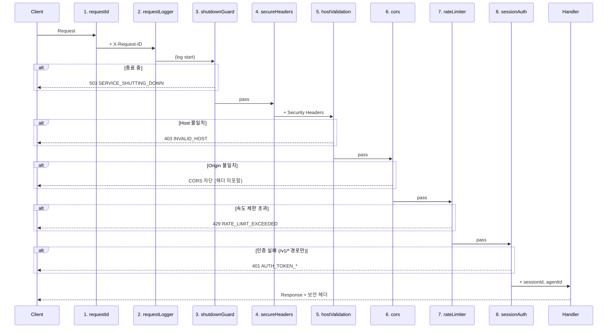

# Hono API 프레임워크 설계 (CORE-06)

**문서 ID:** CORE-06
**작성일:** 2026-02-05
**상태:** 완료
**참조:** CORE-01 (24-monorepo-data-directory.md), CORE-02 (25-sqlite-schema.md), CORE-03 (26-keystore-spec.md), CORE-04 (27-chain-adapter-interface.md), CORE-05 (28-daemon-lifecycle-cli.md), 06-RESEARCH.md, 06-CONTEXT.md
**요구사항:** API-01 (REST API 서버), API-06 (MCP 서버 연동 기반)

---

## 1. Hono 서버 아키텍처

### 1.1 설계 원칙

WAIaaS API 서버는 `OpenAPIHono` 인스턴스를 기반으로 구축한다. Zod 스키마가 TypeScript 타입, 런타임 검증, OpenAPI 3.0 스펙 생성의 단일 소스(SSoT)로 기능한다.

| 원칙 | 설명 |
|------|------|
| **Zod SSoT** | 모든 요청/응답 스키마가 Zod에서 정의 -> 타입 + 검증 + OpenAPI 동시 생성 |
| **localhost 전용** | `hostname: '127.0.0.1'` 강제 바인딩. 외부 네트워크 접근 원천 차단 |
| **미들웨어 순서 보장** | 보안에 직접 영향하는 미들웨어 실행 순서를 코드 수준으로 정의 |
| **통일된 에러 응답** | 모든 에러가 동일한 JSON 포맷으로 반환. 에이전트의 프로그래밍적 처리 용이 |
| **OpenAPI 자동 생성** | 수동 스펙 작성 없이 코드에서 OpenAPI 3.0 JSON 자동 생성 |

### 1.2 서버 초기화 시점

HTTP 서버 시작은 데몬 라이프사이클 7단계 시작 시퀀스(CORE-05)의 **5단계**에 해당한다. 이 시점에서 다음 컴포넌트가 이미 초기화된 상태를 전제한다:

| 단계 | 컴포넌트 | 상태 | API 서버와의 관계 |
|------|----------|------|-------------------|
| 1 | ConfigLoader | config.toml 파싱 완료 | `daemon.port` 설정 제공 |
| 2 | DatabaseManager | SQLite 연결 + PRAGMA + 마이그레이션 완료 | Drizzle ORM 인스턴스 제공 |
| 3 | LocalKeyStore | 마스터 패스워드로 잠금 해제, guarded memory 활성 | ILocalKeyStore 인스턴스 제공 |
| 4 | AdapterRegistry | Solana/EVM 어댑터 RPC 연결 | 체인 어댑터 인스턴스 제공 |
| **5** | **HonoServer** | **미들웨어 등록 + 라우트 바인딩 + listen** | **본 문서의 핵심 대상** |
| 6 | BackgroundWorkers | WAL 체크포인트, 세션 만료 정리 시작 | 서버 시작 이후 |

### 1.3 서버 초기화 코드 패턴

```typescript
// packages/daemon/src/server/app.ts
import { OpenAPIHono } from '@hono/zod-openapi'
import { serve } from '@hono/node-server'
import type { AppContext } from './types.js'

// 서비스 의존성을 Hono 컨텍스트로 주입
type AppBindings = {
  Variables: {
    db: DrizzleInstance
    keyStore: ILocalKeyStore
    adapters: AdapterRegistry
    requestId: string
    sessionId?: string
    agentId?: string
  }
}

export function createApp(deps: AppContext): OpenAPIHono<AppBindings> {
  const app = new OpenAPIHono<AppBindings>()

  // 1. 미들웨어 스택 등록 (섹션 2 참조)
  registerMiddleware(app, deps)

  // 2. 라우트 등록 (섹션 6 참조)
  registerRoutes(app, deps)

  // 3. OpenAPI 스펙 엔드포인트 (섹션 5 참조)
  app.doc('/doc', {
    openapi: '3.0.0',
    info: {
      title: 'WAIaaS API',
      version: '0.2.0',
      description: 'AI 에이전트를 위한 Self-Hosted Wallet-as-a-Service API',
    },
    servers: [
      { url: `http://127.0.0.1:${deps.config.daemon.port}`, description: 'Local daemon' },
    ],
    components: {
      securitySchemes: {
        bearerAuth: {
          type: 'http',
          scheme: 'bearer',
          description: 'Session token (wai_sess_...) or Owner signature',
        },
      },
    },
  })

  // 4. 글로벌 에러 핸들러 (섹션 4 참조)
  registerErrorHandler(app)

  return app
}

// packages/daemon/src/server/serve.ts
export function startServer(
  app: OpenAPIHono<AppBindings>,
  config: DaemonConfig,
): { server: Server; socketTracker: SocketTracker } {
  const socketTracker = new SocketTracker()

  const server = serve({
    fetch: app.fetch,
    port: config.daemon.port,
    hostname: config.daemon.hostname,  // 기본 '127.0.0.1', Docker 환경 '0.0.0.0' (WAIAAS_DAEMON_HOSTNAME)
  })

  // 소켓 추적 (Graceful Shutdown용 -- CORE-05 Pitfall 6 대응)
  server.on('connection', (socket) => {
    socketTracker.track(socket)
    socket.on('close', () => socketTracker.untrack(socket))
  })

  return { server, socketTracker }
}
```

### 1.4 SocketTracker (Graceful Shutdown 연동)

`@hono/node-server`의 `server.close()`는 keep-alive 연결을 즉시 닫지 않는 문제가 있다(Issue #3104). CORE-05의 Graceful Shutdown 10단계 중 2단계(HTTP 서버 종료)에서 이를 처리하기 위해 소켓 추적기를 사용한다.

```typescript
// packages/daemon/src/server/socket-tracker.ts
import type { Socket } from 'node:net'

export class SocketTracker {
  private sockets = new Set<Socket>()

  track(socket: Socket): void {
    this.sockets.add(socket)
  }

  untrack(socket: Socket): void {
    this.sockets.delete(socket)
  }

  /** Graceful Shutdown 시 호출: 모든 연결에 Connection: close 설정 후 파괴 */
  destroyAll(): void {
    for (const socket of this.sockets) {
      socket.destroySoon()
    }
    this.sockets.clear()
  }

  get count(): number {
    return this.sockets.size
  }
}
```

### 1.5 config.toml 서버 설정

CORE-01에서 정의한 `config.toml`의 `[daemon]` 섹션에서 서버 설정을 로드한다:

```toml
[daemon]
port = 3100                    # HTTP 서버 포트 (기본: 3100)
# hostname은 코드에서 '127.0.0.1'로 강제 (설정 불가)
shutdown_timeout = 30          # Graceful Shutdown 타임아웃 (초)
log_level = "info"             # 로그 레벨 (debug, info, warn, error)
```

**포트 결정:**
- 기본 포트 `3100`: 3000/3001/8080 등 흔히 사용되는 포트와 충돌 방지
- 환경변수 `WAIAAS_DAEMON_PORT`로 오버라이드 가능
- `hostname`은 `z.union([z.literal('127.0.0.1'), z.literal('0.0.0.0')])`로 Zod 스키마에서 제한 (CORE-01 결정사항). 기본값 `127.0.0.1`, Docker 컨테이너 환경에서만 `0.0.0.0` 허용

---

## 2. 미들웨어 스택 (실행 순서)

### 2.1 미들웨어 실행 순서

미들웨어 실행 순서는 보안에 직접 영향을 미치므로, 정확한 순서를 코드 수준으로 정의한다. 요청은 순서 1 -> 8로 통과하며, 응답은 역순으로 반환된다.

| 순서 | 미들웨어 | 역할 | 적용 범위 | 실패 시 |
|------|----------|------|-----------|---------|
| 1 | `requestId` | 요청 ID 부여 (X-Request-ID) | 전체 (`*`) | - |
| 2 | `requestLogger` | 요청/응답 로깅 | 전체 (`*`) | - |
| 3 | `shutdownGuard` | 종료 중 요청 거부 | 전체 (`*`) | 503 |
| 4 | `secureHeaders` | 보안 헤더 설정 | 전체 (`*`) | - |
| 5 | `hostValidation` | Host 헤더 검증 | 전체 (`*`) | 403 |
| 6 | `cors` | CORS 설정 | 전체 (`*`) | 403 |
| 7 | `rateLimiter` | 요청 속도 제한 | 전체 (`*`) | 429 |
| 8 | `sessionAuth` | 세션 토큰 검증 | `/v1/*` (인증 필요) | 401 |
| 9 | `ownerAuth` | Owner 서명 검증 | 라우트 레벨 (`/v1/owner/*`, `POST /v1/sessions`) | 401/403 |

> **참고:** 순서 1-7은 글로벌 미들웨어(`app.use('*')`)로 모든 요청에 적용된다. 순서 8 `sessionAuth`는 `/v1/*` 경로에만 적용되며, 순서 9 `ownerAuth`는 라우트 레벨에서 개별 엔드포인트에 적용된다. 두 인증 미들웨어는 상호 배타적으로, 하나의 엔드포인트에 둘 다 적용되지 않는다.
>
> **ownerAuth 상세:** per-request SIWS/SIWE 서명 기반 인증. `Authorization: Bearer <base64url JSON>` 형식으로 전달되며, 8단계 검증 체인을 거친다 (헤더 파싱 -> timestamp 5분 -> nonce 일회성 -> 서명 검증 -> owner 일치 -> action 일치 -> 컨텍스트 설정 -> next). 상세는 34-owner-wallet-connection.md 섹션 5, API-SPEC(37-rest-api-complete-spec.md) 섹션 3.2 참조.
>
> **ownerAuth 적용 대상:** Owner 전용 API (approve/reject, kill-switch, sessions 관리, 설정 변경, 대시보드 조회)

### 2.2 미들웨어 등록 코드 패턴

```typescript
// packages/daemon/src/server/middleware/index.ts
import { OpenAPIHono } from '@hono/zod-openapi'
import { secureHeaders } from 'hono/secure-headers'
import { cors } from 'hono/cors'
import type { AppBindings, AppContext } from '../types.js'

export function registerMiddleware(
  app: OpenAPIHono<AppBindings>,
  deps: AppContext,
): void {
  const port = deps.config.daemon.port

  // 1. Request ID
  app.use('*', requestIdMiddleware())

  // 2. Request Logger
  app.use('*', requestLoggerMiddleware(deps.logger))

  // 3. Shutdown Guard
  app.use('*', shutdownGuardMiddleware(deps.lifecycle))

  // 4. Secure Headers
  app.use('*', secureHeaders({
    xContentTypeOptions: 'nosniff',
    xFrameOptions: 'DENY',
    referrerPolicy: 'no-referrer',
    // HSTS 미적용: localhost HTTP 전용 (TLS 없음)
  }))

  // 5. Host Validation
  app.use('*', hostValidationMiddleware(port))

  // 6. CORS
  app.use('*', cors({
    origin: [`http://localhost:${port}`, `http://127.0.0.1:${port}`, 'tauri://localhost'],
    allowMethods: ['GET', 'POST', 'PUT', 'DELETE'],
    allowHeaders: ['Authorization', 'Content-Type', 'X-Request-ID', 'X-Master-Password'],
    exposeHeaders: ['X-Request-ID', 'Retry-After', 'X-RateLimit-Limit', 'X-RateLimit-Remaining', 'X-RateLimit-Reset'],
    maxAge: 600,
  }))

  // 7. Rate Limiter
  app.use('*', rateLimiterMiddleware(deps.config.security))

  // 8. Session Auth (인증 필요 엔드포인트만)
  app.use('/v1/*', sessionAuthMiddleware(deps.db))
}
```

### 2.3 각 미들웨어 상세

#### 미들웨어 1: requestId

요청마다 고유 ID를 생성하여 추적한다. 클라이언트가 `X-Request-ID` 헤더를 제공하면 재사용, 없으면 새로 생성.

| 항목 | 값 |
|------|-----|
| **입력** | `X-Request-ID` 헤더 (선택적) |
| **출력** | `c.set('requestId', id)` + 응답 헤더 `X-Request-ID` |
| **ID 포맷** | `req_` + 22자 랜덤 (crypto.randomUUID 기반) |
| **에러** | 발생 없음 (항상 통과) |

```typescript
import { createMiddleware } from 'hono/factory'
import { randomUUID } from 'node:crypto'

export function requestIdMiddleware() {
  return createMiddleware(async (c, next) => {
    const requestId = c.req.header('x-request-id') || `req_${randomUUID().replace(/-/g, '').slice(0, 22)}`
    c.set('requestId', requestId)
    await next()
    c.header('X-Request-ID', requestId)
  })
}
```

#### 미들웨어 2: requestLogger

요청/응답 메타데이터를 데몬 로그 파일에 기록한다(CORE-05 하이브리드 로깅: 데몬 로그는 파일).

| 항목 | 값 |
|------|-----|
| **입력** | 요청 메타데이터 (method, path, headers) |
| **출력** | 로그 엔트리 (파일) |
| **로그 포맷** | `{timestamp} {level} {requestId} {method} {path} {status} {duration}ms` |
| **민감 정보** | Authorization 헤더 값은 마스킹 (`wai_sess_***`) |

```typescript
export function requestLoggerMiddleware(logger: Logger) {
  return createMiddleware(async (c, next) => {
    const start = Date.now()
    const method = c.req.method
    const path = c.req.path
    const requestId = c.get('requestId')

    await next()

    const duration = Date.now() - start
    const status = c.res.status
    logger.info(`${requestId} ${method} ${path} ${status} ${duration}ms`)
  })
}
```

#### 미들웨어 3: shutdownGuard

데몬 Graceful Shutdown 진행 중일 때 새 요청을 거부한다(CORE-05 10단계 중 2단계). `Connection: close` 헤더로 클라이언트에 연결 종료를 알린다.

| 항목 | 값 |
|------|-----|
| **입력** | `lifecycle.isShuttingDown` 플래그 |
| **출력** | 정상: pass-through / 종료 중: 503 응답 |
| **에러 코드** | `SERVICE_SHUTTING_DOWN` (503) |
| **헤더** | `Connection: close`, `Retry-After: 30` |

```typescript
export function shutdownGuardMiddleware(lifecycle: DaemonLifecycle) {
  return createMiddleware(async (c, next) => {
    if (lifecycle.isShuttingDown) {
      c.header('Connection', 'close')
      c.header('Retry-After', '30')
      return c.json({
        error: {
          code: 'SERVICE_SHUTTING_DOWN',
          message: '서비스가 종료 중입니다. 잠시 후 다시 시도하세요.',
          requestId: c.get('requestId'),
        },
      }, 503)
    }
    await next()
    // 종료 진행 중이면 응답에도 Connection: close 추가
    if (lifecycle.isShuttingDown) {
      c.header('Connection', 'close')
    }
  })
}
```

#### 미들웨어 4: secureHeaders

Hono 내장 `secureHeaders` 미들웨어로 보안 헤더를 설정한다.

| 항목 | 값 |
|------|-----|
| **입력** | 없음 |
| **출력** | 보안 헤더 설정 |
| **에러** | 발생 없음 |

설정되는 헤더:

| 헤더 | 값 | 목적 |
|------|-----|------|
| `X-Content-Type-Options` | `nosniff` | MIME 타입 스니핑 방지 |
| `X-Frame-Options` | `DENY` | 클릭재킹 방지 |
| `Referrer-Policy` | `no-referrer` | 리퍼러 정보 유출 방지 |
| `X-XSS-Protection` | `0` | 구식 XSS 필터 비활성화 (CSP 우선) |

> **HSTS 미적용 이유:** WAIaaS 데몬은 localhost HTTP 전용. TLS를 사용하지 않으므로 HSTS가 불필요하고 오히려 접근을 차단할 수 있다.

#### 미들웨어 5: hostValidation

Host 헤더를 검증하여 0.0.0.0 Day 공격(C-04)을 방어한다. 브라우저의 악성 페이지가 `http://0.0.0.0:{port}`로 요청을 보내는 것을 차단한다.

| 항목 | 값 |
|------|-----|
| **입력** | `Host` 요청 헤더 |
| **출력** | 정상: pass-through / 비정상: 403 응답 |
| **허용 Host** | `localhost`, `127.0.0.1`, `localhost:{port}`, `127.0.0.1:{port}` |
| **에러 코드** | `INVALID_HOST` (403) |

```typescript
export function hostValidationMiddleware(port: number) {
  const allowed = new Set([
    'localhost',
    '127.0.0.1',
    `localhost:${port}`,
    `127.0.0.1:${port}`,
  ])

  return createMiddleware(async (c, next) => {
    const host = c.req.header('host')
    if (host && !allowed.has(host)) {
      return c.json({
        error: {
          code: 'INVALID_HOST',
          message: 'Forbidden: invalid host header',
          requestId: c.get('requestId'),
        },
      }, 403)
    }
    await next()
  })
}
```

**허용 목록이 정적인 이유:**
- `127.0.0.1` 바인딩과 결합하면 localhost에서만 접근 가능
- 와일드카드(`*`)나 정규식 대신 정확한 문자열 매칭으로 우회 방지
- 포트를 포함/미포함 모두 허용 (브라우저에 따라 Host 헤더 형식이 다를 수 있음)

#### 미들웨어 6: cors

Hono 내장 CORS 미들웨어로 Cross-Origin 요청을 제한한다.

| 항목 | 값 |
|------|-----|
| **입력** | `Origin` 요청 헤더 |
| **출력** | CORS 응답 헤더 (`Access-Control-Allow-*`) |
| **허용 Origin** | `http://localhost:{port}`, `http://127.0.0.1:{port}`, `tauri://localhost` |
| **에러** | Origin 불일치 시 CORS 헤더 미포함 (브라우저가 차단) |

```typescript
cors({
  origin: [`http://localhost:${port}`, `http://127.0.0.1:${port}`, 'tauri://localhost'],
  allowMethods: ['GET', 'POST', 'PUT', 'DELETE'],
  allowHeaders: ['Authorization', 'Content-Type', 'X-Request-ID', 'X-Master-Password'],
  exposeHeaders: ['X-Request-ID', 'Retry-After', 'X-RateLimit-Limit', 'X-RateLimit-Remaining', 'X-RateLimit-Reset'],
  maxAge: 600,  // preflight 캐시 10분
})
```

**CORS 설정 상세:**

| 옵션 | 값 | 근거 |
|------|-----|------|
| `origin` | localhost + 127.0.0.1 (포트 포함) + `tauri://localhost` | 동일 머신의 Tauri WebView/브라우저만 허용. Tauri 2.x WebView Origin 대응 (Phase 9 TAURI-DESK) |
| `allowMethods` | GET, POST, PUT, DELETE | REST API에 필요한 메서드만 |
| `allowHeaders` | Authorization, Content-Type, X-Request-ID, X-Master-Password | 세션 토큰 + JSON + 요청 추적 + Admin API 마스터 패스워드 (Phase 8) |
| `exposeHeaders` | X-Request-ID, Retry-After, X-RateLimit-Limit, X-RateLimit-Remaining, X-RateLimit-Reset | 클라이언트가 읽어야 하는 커스텀 헤더 (요청 추적 + 재시도 + Rate Limit 정보) |
| `maxAge` | 600 (10분) | preflight 요청 빈도 감소 |

#### 미들웨어 7: rateLimiter

요청 속도를 제한하여 무차별 대입 공격과 리소스 고갈을 방지한다. 섹션 7에서 상세 설계.

| 항목 | 값 |
|------|-----|
| **입력** | 클라이언트 IP (기본: 127.0.0.1) + 세션 ID (인증 후) |
| **출력** | 정상: pass-through + 헤더 / 초과: 429 응답 |
| **저장소** | `lru-cache` (in-memory) |
| **에러 코드** | `RATE_LIMIT_EXCEEDED` (429) |

```typescript
// 기본 구조 (섹션 7에서 상세 설계)
export function rateLimiterMiddleware(config: SecurityConfig) {
  return createMiddleware(async (c, next) => {
    const key = c.get('sessionId') || c.req.header('x-forwarded-for') || '127.0.0.1'
    const result = checkRateLimit(key, config)

    c.header('X-RateLimit-Limit', String(result.limit))
    c.header('X-RateLimit-Remaining', String(result.remaining))
    c.header('X-RateLimit-Reset', String(result.resetAt))

    if (!result.allowed) {
      c.header('Retry-After', String(result.retryAfter))
      return c.json({
        error: {
          code: 'RATE_LIMIT_EXCEEDED',
          message: '요청 속도 제한을 초과했습니다.',
          details: { retryAfter: result.retryAfter },
          requestId: c.get('requestId'),
        },
      }, 429)
    }
    await next()
  })
}
```

#### 미들웨어 8: sessionAuth

세션 토큰(`Bearer wai_sess_...`)을 검증하고 세션/에이전트 컨텍스트를 설정한다. Phase 7에서 JWT 구조와 검증 로직을 상세 설계한다.

| 항목 | 값 |
|------|-----|
| **입력** | `Authorization: Bearer wai_sess_...` 헤더 |
| **출력** | `c.set('sessionId', id)` + `c.set('agentId', id)` |
| **적용 범위** | `/v1/*` (인증 필요 엔드포인트) |
| **제외 경로** | `/health`, `/doc` (공개 엔드포인트) |
| **에러 코드** | `AUTH_TOKEN_MISSING` (401), `AUTH_TOKEN_INVALID` (401), `AUTH_TOKEN_EXPIRED` (401) |

```typescript
export function sessionAuthMiddleware(db: DrizzleInstance) {
  return createMiddleware(async (c, next) => {
    const authHeader = c.req.header('authorization')

    if (!authHeader || !authHeader.startsWith('Bearer wai_sess_')) {
      return c.json({
        error: {
          code: 'AUTH_TOKEN_MISSING',
          message: '세션 토큰이 필요합니다. Authorization: Bearer wai_sess_... 형식으로 전달하세요.',
          requestId: c.get('requestId'),
        },
      }, 401)
    }

    const token = authHeader.slice(7) // 'Bearer ' 제거
    // Phase 7: JWT 검증 로직 (jose 라이브러리)
    // - 토큰 서명 검증
    // - 만료 시각 확인
    // - sessions 테이블에서 폐기 여부 확인
    // - 세션 제약 (누적 한도, 허용 작업 등) 확인

    const session = await validateSessionToken(token, db)
    if (!session) {
      return c.json({
        error: {
          code: 'AUTH_TOKEN_INVALID',
          message: '유효하지 않은 세션 토큰입니다.',
          requestId: c.get('requestId'),
        },
      }, 401)
    }

    c.set('sessionId', session.id)
    c.set('agentId', session.agentId)
    await next()
  })
}
```

### 2.4 미들웨어 실행 흐름 다이어그램



---

## 3. localhost 보안 전략 (0.0.0.0 Day 방지)

### 3.1 위협 모델

WAIaaS 데몬은 localhost에서만 실행되지만, 다음 공격 벡터가 존재한다:

| # | 공격 벡터 | 시나리오 | 위험도 |
|---|-----------|----------|--------|
| 1 | 외부 네트워크 접근 | 서버가 0.0.0.0에 바인딩되면 LAN/인터넷에서 접근 가능 | Critical |
| 2 | 브라우저 0.0.0.0 Day | 악성 웹페이지가 `fetch('http://0.0.0.0:3100/v1/...')` 실행 | High |
| 3 | CSRF/악성 페이지 | 악성 웹페이지가 `fetch('http://localhost:3100/v1/...')` 실행 | High |
| 4 | DNS Rebinding | 공격자 DNS가 localhost로 리졸브하여 브라우저 동일 출처 우회 | Medium |
| 5 | 로컬 악성 프로세스 | 같은 머신의 악성 소프트웨어가 HTTP 요청 전송 | Medium |
| 6 | 무차별 대입 | 세션 토큰이나 패스워드 무차별 시도 | Medium |

### 3.2 4중 방어 체계

4개의 독립적인 방어층이 순차적으로 작동한다. 어느 하나가 우회되더라도 나머지 층이 보호한다.

```
[Layer 1: 네트워크 바인딩] -> [Layer 2: Host 검증] -> [Layer 3: CORS + 세션 토큰] -> [Layer 4: Rate Limiter]
```

#### Layer 1: 네트워크 바인딩 (`127.0.0.1`)

| 항목 | 값 |
|------|-----|
| **방어 대상** | 공격 벡터 #1 (외부 네트워크 접근) |
| **구현** | `serve({ hostname: '127.0.0.1' })` |
| **강도** | OS 커널 수준 차단 -- 외부 패킷이 loopback 인터페이스에 도달 불가 |
| **한계** | 동일 머신의 프로세스는 접근 가능 |

```typescript
// Zod 스키마에서 허용 값 제한 -- 기본값 127.0.0.1, Docker 환경 0.0.0.0 허용
serve({
  fetch: app.fetch,
  port: config.daemon.port,
  hostname: config.daemon.hostname,  // z.union([z.literal('127.0.0.1'), z.literal('0.0.0.0')]).default('127.0.0.1')
})
```

> **Docker 전용 경고**: `0.0.0.0` 바인딩은 Docker 컨테이너 환경에서만 사용해야 한다.
> 컨테이너 내부에서 `0.0.0.0` 바인딩은 컨테이너의 모든 네트워크 인터페이스에서 접근 허용을 의미한다.
> 반드시 Docker 포트 매핑에서 `127.0.0.1:3100:3100` 형식을 사용하여 호스트 측 노출을 localhost로 제한해야 한다.
> `0.0.0.0:3100:3100` (전체 노출) 또는 `3100:3100` (기본 0.0.0.0)은 보안 위험.
>
> **환경변수 오버라이드:** `WAIAAS_DAEMON_HOSTNAME=0.0.0.0`으로 설정. 비-Docker 환경에서 이 값을 사용하면 외부 네트워크에 API가 노출된다.

> **IPv6 미지원 결정:** `::1` (IPv6 loopback)은 의도적으로 제외한다. IPv4/IPv6 듀얼 스택은 공격 표면을 넓히고, localhost 전용 서비스에서 IPv6의 실질적 이점이 없다.

#### Layer 2: Host 헤더 검증

| 항목 | 값 |
|------|-----|
| **방어 대상** | 공격 벡터 #2 (0.0.0.0 Day), #4 (DNS Rebinding) |
| **구현** | 미들웨어 5 (`hostValidation`) |
| **강도** | HTTP 요청 수준 차단 -- Host 헤더가 허용 목록에 없으면 거부 |
| **한계** | Host 헤더를 직접 조작 가능한 로컬 프로세스에는 무효 |

**DNS Rebinding 방어 원리:**
- 공격자 DNS가 `evil.com` -> `127.0.0.1`로 리졸브
- 브라우저가 `Host: evil.com`으로 요청 전송
- `hostValidation` 미들웨어가 `evil.com`을 거부 -> 403

#### Layer 3: CORS + 세션 토큰

| 항목 | 값 |
|------|-----|
| **방어 대상** | 공격 벡터 #3 (CSRF/악성 페이지), #5 (로컬 악성 프로세스 -- 토큰 없으면 차단) |
| **구현** | 미들웨어 6 (`cors`) + 미들웨어 8 (`sessionAuth`) |
| **강도** | 인증 수준 차단 -- 유효한 세션 토큰 없이는 API 사용 불가 |
| **한계** | 토큰 탈취 시 무효화 (세션 만료 + 폐기로 대응 -- Phase 7) |

**CORS와 세션 토큰의 이중 방어:**
1. CORS: 브라우저가 허용되지 않은 Origin에서의 요청을 차단
2. 세션 토큰: CORS를 우회하더라도(비브라우저 클라이언트) 유효한 토큰 필수
3. 두 방어가 독립적 -- CORS는 브라우저 공격, 세션은 모든 클라이언트 공격을 차단

#### Layer 4: Rate Limiter

| 항목 | 값 |
|------|-----|
| **방어 대상** | 공격 벡터 #6 (무차별 대입) |
| **구현** | 미들웨어 7 (`rateLimiter`) |
| **강도** | 시간 기반 차단 -- 과도한 요청 속도를 제한 |
| **한계** | 분산 공격에는 제한적 (localhost이므로 단일 소스) |

### 3.3 보안 수준 매트릭스

| 공격 벡터 | Layer 1 | Layer 2 | Layer 3 | Layer 4 | 결과 |
|-----------|---------|---------|---------|---------|------|
| 외부 네트워크 접근 | **차단** | - | - | - | 커널 수준 차단 |
| 브라우저 0.0.0.0 Day | 통과 (localhost) | **차단** | - | - | Host 불일치 거부 |
| DNS Rebinding | 통과 (localhost) | **차단** | - | - | Host 불일치 거부 |
| CSRF/악성 페이지 | 통과 (localhost) | 통과 (localhost) | **차단** | - | CORS + 토큰 없음 |
| 로컬 악성 프로세스 | 통과 | 통과 | **차단** (토큰 없음) | - | 세션 토큰 필수 |
| 무차별 대입 | 통과 | 통과 | 통과 (유효 토큰) | **차단** | 속도 제한 |
| 토큰 탈취 + 사용 | 통과 | 통과 | 통과 | 통과 | Phase 7-8 대응 |

> **마지막 행 참고:** 유효한 토큰이 탈취된 경우 Phase 6 방어만으로는 차단 불가. Phase 7의 세션 만료/제약, Phase 8의 시간 지연/승인/Kill Switch가 추가 방어 계층을 제공한다.

### 3.4 Tauri WebView 추가 방어 (Phase 9 연계)

Phase 9 Tauri Desktop 앱 설계에서 정의된 추가 방어:

1. **Origin 검증:** Tauri WebView의 `tauri://localhost` Origin이 CORS 허용 목록에 포함됨 (섹션 2.3 cors 미들웨어 참조)
2. **IPC 기반 통신:** Tauri의 내장 IPC를 사용하면 HTTP를 우회하여 더 안전한 통신 가능
3. **CSP 설정:** Tauri WebView에 Content-Security-Policy를 설정하여 외부 스크립트 로딩 차단

상세는 Phase 9 Desktop 앱 설계 문서(39-tauri-desktop-architecture.md) 참조.

---

## 4. 에러 처리 체계

### 4.1 에러 응답 포맷

모든 API 에러 응답은 통일된 JSON 포맷을 사용한다. v0.1의 RFC 9457 기반 WalletApiError를 v0.2 Self-Hosted 환경에 맞게 간소화하고 확장한다.

#### v0.1 -> v0.2 변경사항

| 항목 | v0.1 (클라우드) | v0.2 (Self-Hosted) | 근거 |
|------|----------------|-------------------|------|
| Content-Type | `application/problem+json` | `application/json` | Self-Hosted에서 RFC 9457 MIME 타입의 이점 미미. 단순 JSON으로 통일 |
| `type` URI | `https://api.waiass.io/errors/...` | 제거 | 외부 URL 불필요. `code`만으로 에러 식별 |
| `title` | 에러 범주 | 제거 | `code`와 `message`로 충분 |
| `instance` | 요청 경로 | 제거 | `requestId`로 추적 가능 |
| `docUrl` | 문서 링크 | 제거 | Self-Hosted에서 외부 문서 서버 없음 |
| `escalation` | 에스컬레이션 수준 | Phase 8에서 활용 | 킬 스위치/알림 시스템과 연동 |
| `retryable` | 재시도 가능 여부 | 유지 | 에이전트 자동 재시도 판단에 필수 |
| `details` | 없음 | **추가** | 구조화된 추가 정보 (금액, 한도 등) |

#### v0.2 에러 응답 구조

```typescript
// packages/core/src/schemas/error.ts
import { z } from '@hono/zod-openapi'

export const ErrorResponseSchema = z.object({
  error: z.object({
    code: z.string().openapi({
      description: '에러 코드 (SCREAMING_SNAKE_CASE)',
      example: 'INSUFFICIENT_BALANCE',
    }),
    message: z.string().openapi({
      description: '사람이 읽을 수 있는 에러 메시지',
      example: '잔액이 부족합니다',
    }),
    details: z.record(z.unknown()).optional().openapi({
      description: '에러 관련 추가 정보',
      example: { required: '1000000000', available: '500000000' },
    }),
    requestId: z.string().openapi({
      description: '요청 추적 ID',
      example: 'req_01HV8PQXYZ9ABC2DEF3G',
    }),
    retryable: z.boolean().optional().openapi({
      description: '재시도 가능 여부 (true이면 동일 요청 재시도 가능)',
      example: false,
    }),
  }),
}).openapi('ErrorResponse')

export type ErrorResponse = z.infer<typeof ErrorResponseSchema>
```

#### 에러 응답 JSON 예시

**Zod 검증 실패 (400):**
```json
{
  "error": {
    "code": "VALIDATION_ERROR",
    "message": "요청 데이터가 유효하지 않습니다.",
    "details": {
      "issues": [
        { "path": ["amount"], "message": "Required" },
        { "path": ["destination"], "message": "Invalid Solana address" }
      ]
    },
    "requestId": "req_01HV8PQXYZ9ABC2DEF3G",
    "retryable": false
  }
}
```

**잔액 부족 (422):**
```json
{
  "error": {
    "code": "INSUFFICIENT_BALANCE",
    "message": "잔액이 부족합니다.",
    "details": {
      "required": "1000000000",
      "available": "500000000",
      "chain": "solana",
      "symbol": "SOL"
    },
    "requestId": "req_01HV8PQABC2DEF3GHI4J",
    "retryable": false
  }
}
```

**Rate Limit 초과 (429):**
```json
{
  "error": {
    "code": "RATE_LIMIT_EXCEEDED",
    "message": "요청 속도 제한을 초과했습니다.",
    "details": {
      "retryAfter": 15,
      "limit": 100,
      "window": "1m"
    },
    "requestId": "req_01HV8PQDEF3GHI4JKL5M",
    "retryable": true
  }
}
```

### 4.2 HTTP 상태 코드 매핑

| HTTP 상태 | 용도 | 대표 에러 코드 | retryable |
|-----------|------|---------------|-----------|
| 200 | 성공 (조회/수정) | - | - |
| 201 | 리소스 생성 성공 | - | - |
| 400 | 잘못된 요청 (Zod 검증 실패, 필수 필드 누락) | `VALIDATION_ERROR`, `INVALID_FORMAT` | false |
| 401 | 인증 필요/실패 (토큰 없음, 만료, 무효) | `AUTH_TOKEN_MISSING`, `AUTH_TOKEN_INVALID`, `AUTH_TOKEN_EXPIRED` | false |
| 403 | 권한 없음 (Host 불일치, 정책 위반) | `INVALID_HOST`, `POLICY_VIOLATION`, `INSUFFICIENT_PERMISSIONS` | false |
| 404 | 리소스 미존재 | `AGENT_NOT_FOUND`, `SESSION_NOT_FOUND`, `TRANSACTION_NOT_FOUND` | false |
| 409 | 충돌 (상태 불일치, 중복 생성) | `AGENT_SUSPENDED`, `DUPLICATE_RESOURCE` | false |
| 422 | 처리 불가 (잔액 부족, 시뮬레이션 실패) | `INSUFFICIENT_BALANCE`, `SIMULATION_FAILED` | false |
| 429 | 속도 제한 초과 | `RATE_LIMIT_EXCEEDED` | true |
| 500 | 내부 서버 에러 | `INTERNAL_ERROR` | true |
| 503 | 서비스 불가 (종료 중) | `SERVICE_SHUTTING_DOWN` | true |

### 4.3 v0.1 에러 코드 재사용 + v0.2 확장

v0.1(20-error-codes.md)의 46개 에러 코드 중 Self-Hosted 환경에 적용 가능한 코드를 재사용하고, v0.2 고유 코드를 추가한다.

#### 재사용 에러 코드 (v0.1 -> v0.2)

| v0.1 코드 | v0.2 코드 | 변경사항 |
|-----------|-----------|---------|
| `VALIDATION_REQUIRED_FIELD` | `VALIDATION_ERROR` | 통합 (Zod 에러에 details로 필드 정보 포함) |
| `VALIDATION_INVALID_FORMAT` | `INVALID_FORMAT` | 유지 |
| `AGENT_NOT_FOUND` | `AGENT_NOT_FOUND` | 유지 |
| `AGENT_SUSPENDED` | `AGENT_SUSPENDED` | 유지 |
| `AGENT_TERMINATED` | `AGENT_TERMINATED` | 유지 |
| `TRANSACTION_NOT_FOUND` | `TRANSACTION_NOT_FOUND` | 유지 |
| `TRANSACTION_SIMULATION_FAILED` | `SIMULATION_FAILED` | 이름 간소화 |
| `TRANSACTION_INSUFFICIENT_BALANCE` | `INSUFFICIENT_BALANCE` | 이름 간소화 |
| `POLICY_DAILY_LIMIT_EXCEEDED` | `POLICY_VIOLATION` | 통합 (세부는 details에) |
| `SYSTEM_RATE_LIMITED` | `RATE_LIMIT_EXCEEDED` | 이름 변경 |
| `SYSTEM_INTERNAL_ERROR` | `INTERNAL_ERROR` | 이름 간소화 |

#### v0.2 신규 에러 코드

| 코드 | HTTP | 설명 |
|------|------|------|
| `AUTH_TOKEN_MISSING` | 401 | Authorization 헤더 없음 |
| `AUTH_TOKEN_INVALID` | 401 | 세션 토큰 서명 불일치 또는 변조 |
| `AUTH_TOKEN_EXPIRED` | 401 | 세션 토큰 만료 |
| `SESSION_NOT_FOUND` | 404 | 세션 ID에 해당하는 세션 없음 |
| `SESSION_REVOKED` | 401 | 폐기된 세션 토큰 사용 |
| `SESSION_LIMIT_EXCEEDED` | 403 | 세션 제약 (누적 한도, 단건 한도 등) 초과 |
| `INVALID_HOST` | 403 | Host 헤더가 허용 목록에 없음 |
| `SERVICE_SHUTTING_DOWN` | 503 | 데몬 Graceful Shutdown 진행 중 |
| `ADAPTER_NOT_AVAILABLE` | 503 | 요청한 체인의 어댑터가 초기화되지 않음 |
| `ADAPTER_RPC_ERROR` | 502 | 체인 RPC 노드 연결/응답 오류 |
| `KEYSTORE_LOCKED` | 503 | 키스토어가 잠긴 상태 (데몬 초기화 중) |
| `OWNER_SIGNATURE_REQUIRED` | 403 | Owner 서명이 필요한 작업 (Phase 8) |
| `OWNER_SIGNATURE_INVALID` | 403 | Owner 서명 검증 실패 (Phase 8) |
| `APPROVAL_REQUIRED` | 202 | 시간 지연 정책에 의해 승인 대기 (Phase 8) |
| `APPROVAL_TIMEOUT` | 408 | 승인 대기 시간 초과 (Phase 8) |
| `KILL_SWITCH_ACTIVE` | 503 | Kill Switch 발동으로 모든 거래 차단 (Phase 8) |

### 4.4 글로벌 에러 핸들러

Hono의 `app.onError()` 핸들러로 미처리된 에러를 포착하고, 통일된 에러 응답을 반환한다.

```typescript
// packages/daemon/src/server/error-handler.ts
import { OpenAPIHono } from '@hono/zod-openapi'
import { ZodError } from 'zod'

export function registerErrorHandler(app: OpenAPIHono): void {
  // 1. Zod 검증 실패 핸들러 (OpenAPIHono 내장 hook)
  app.openAPIRegistry // @hono/zod-openapi의 defaultHook으로 Zod 에러 변환

  // 2. 글로벌 에러 핸들러
  app.onError((err, c) => {
    const requestId = c.get('requestId') || 'unknown'

    // Zod 검증 에러
    if (err instanceof ZodError) {
      return c.json({
        error: {
          code: 'VALIDATION_ERROR',
          message: '요청 데이터가 유효하지 않습니다.',
          details: {
            issues: err.issues.map(issue => ({
              path: issue.path,
              message: issue.message,
            })),
          },
          requestId,
          retryable: false,
        },
      }, 400)
    }

    // WAIaaS 도메인 에러
    if (err instanceof WaiaasError) {
      return c.json({
        error: {
          code: err.code,
          message: err.message,
          details: err.details,
          requestId,
          retryable: err.retryable,
        },
      }, err.statusCode)
    }

    // 미처리 에러 (내부 정보 비노출)
    console.error(`[${requestId}] Unhandled error:`, err)
    return c.json({
      error: {
        code: 'INTERNAL_ERROR',
        message: '내부 서버 에러가 발생했습니다.',
        requestId,
        retryable: true,
      },
    }, 500)
  })

  // 3. 404 핸들러
  app.notFound((c) => {
    const requestId = c.get('requestId') || 'unknown'
    return c.json({
      error: {
        code: 'ROUTE_NOT_FOUND',
        message: `경로를 찾을 수 없습니다: ${c.req.method} ${c.req.path}`,
        requestId,
        retryable: false,
      },
    }, 404)
  })
}
```

### 4.5 WaiaasError 기본 클래스

모든 도메인 에러는 `WaiaasError`를 상속하여 통일된 에러 처리를 보장한다.

```typescript
// packages/core/src/errors/waiaas-error.ts
export class WaiaasError extends Error {
  constructor(
    public readonly code: string,
    message: string,
    public readonly statusCode: number = 500,
    public readonly details?: Record<string, unknown>,
    public readonly retryable: boolean = false,
  ) {
    super(message)
    this.name = 'WaiaasError'
  }
}

// 도메인별 에러 팩토리
export class AuthError extends WaiaasError {
  constructor(code: string, message: string, details?: Record<string, unknown>) {
    super(code, message, 401, details, false)
    this.name = 'AuthError'
  }
}

export class ValidationError extends WaiaasError {
  constructor(message: string, details?: Record<string, unknown>) {
    super('VALIDATION_ERROR', message, 400, details, false)
    this.name = 'ValidationError'
  }
}

export class PolicyError extends WaiaasError {
  constructor(code: string, message: string, details?: Record<string, unknown>) {
    super(code, message, 403, details, false)
    this.name = 'PolicyError'
  }
}

export class NotFoundError extends WaiaasError {
  constructor(resource: string, id: string) {
    super(
      `${resource.toUpperCase()}_NOT_FOUND`,
      `${resource}을(를) 찾을 수 없습니다: ${id}`,
      404,
      { resource, id },
      false,
    )
    this.name = 'NotFoundError'
  }
}

export class ChainAdapterError extends WaiaasError {
  constructor(code: string, message: string, details?: Record<string, unknown>) {
    super(code, message, 502, details, true)
    this.name = 'ChainAdapterError'
  }
}
```

### 4.6 Zod 검증 실패 상세 포맷

`@hono/zod-openapi`의 `defaultHook`을 사용하여 Zod 검증 실패 시 상세한 에러 정보를 반환한다.

```typescript
// packages/daemon/src/server/zod-hook.ts
import { OpenAPIHono } from '@hono/zod-openapi'

export function createAppWithZodHook(): OpenAPIHono {
  return new OpenAPIHono({
    defaultHook: (result, c) => {
      if (!result.success) {
        const requestId = c.get('requestId') || 'unknown'
        return c.json({
          error: {
            code: 'VALIDATION_ERROR',
            message: '요청 데이터가 유효하지 않습니다.',
            details: {
              issues: result.error.issues.map(issue => ({
                path: issue.path.join('.'),
                code: issue.code,
                message: issue.message,
                expected: 'expected' in issue ? issue.expected : undefined,
                received: 'received' in issue ? issue.received : undefined,
              })),
            },
            requestId,
            retryable: false,
          },
        }, 400)
      }
    },
  })
}
```

**Zod 검증 에러 응답 예시:**

```json
{
  "error": {
    "code": "VALIDATION_ERROR",
    "message": "요청 데이터가 유효하지 않습니다.",
    "details": {
      "issues": [
        {
          "path": "amount",
          "code": "invalid_type",
          "message": "Expected string, received number",
          "expected": "string",
          "received": "number"
        },
        {
          "path": "destination",
          "code": "too_small",
          "message": "String must contain at least 32 characters",
          "expected": "string",
          "received": "string"
        }
      ]
    },
    "requestId": "req_01HV8PQXYZ9ABC2DEF3G",
    "retryable": false
  }
}
```

---

## 5. Zod 스키마 -> OpenAPI 3.0 파이프라인

### 5.1 SSoT (Single Source of Truth) 패턴

Zod 스키마가 모든 데이터 정의의 단일 소스로 기능한다. 하나의 Zod 스키마에서 TypeScript 타입, 런타임 검증, OpenAPI 3.0 스펙이 동시에 생성된다.

```
Zod Schema (SSoT)
  |
  +-- z.infer<typeof Schema>  --> TypeScript Type (컴파일 타임 타입 안전성)
  |
  +-- .openapi() 메타데이터   --> OpenAPI 3.0 JSON (문서 자동 생성)
  |
  +-- createRoute() 라우트    --> 런타임 요청/응답 검증 (Hono 미들웨어)
```

### 5.2 파이프라인 6단계

| 단계 | 위치 | 설명 |
|------|------|------|
| 1 | `packages/core/src/schemas/` | Zod 스키마 정의 + `.openapi()` 메타데이터 첨부 |
| 2 | `packages/core/src/schemas/` | `z.infer<typeof schema>`로 TypeScript 타입 추출 |
| 3 | `packages/daemon/src/server/routes/` | `createRoute()`로 라우트 정의 (요청/응답 스키마 바인딩) |
| 4 | `packages/daemon/src/server/routes/` | `app.openapi(route, handler)`로 핸들러 등록 |
| 5 | `packages/daemon/src/server/app.ts` | `app.doc('/doc', {...})`로 OpenAPI JSON 자동 생성 |
| 6 | (선택) `packages/daemon/src/server/` | Swagger UI 서빙 (`/swagger`, 개발 모드만) |

### 5.3 전체 예시: Balance 엔드포인트

#### 단계 1-2: Zod 스키마 + 타입 추출 (packages/core)

```typescript
// packages/core/src/schemas/wallet.ts
import { z } from '@hono/zod-openapi'

// 1. Zod 스키마 정의 + OpenAPI 메타데이터
export const BalanceResponseSchema = z.object({
  address: z.string().openapi({
    description: '지갑 주소',
    example: 'So11111111111111111111111111111112',
  }),
  balance: z.string().openapi({
    description: '잔액 (최소 단위: lamports/wei)',
    example: '1000000000',
  }),
  chain: z.string().openapi({
    description: '블록체인 이름',
    example: 'solana',
  }),
  network: z.string().openapi({
    description: '네트워크 이름',
    example: 'mainnet-beta',
  }),
  decimals: z.number().int().openapi({
    description: '소수점 자릿수',
    example: 9,
  }),
  symbol: z.string().openapi({
    description: '토큰 심볼',
    example: 'SOL',
  }),
}).openapi('BalanceResponse')

// 2. TypeScript 타입 자동 추출
export type BalanceResponse = z.infer<typeof BalanceResponseSchema>
// 결과:
// type BalanceResponse = {
//   address: string
//   balance: string
//   chain: string
//   network: string
//   decimals: number
//   symbol: string
// }
```

#### 단계 3-4: 라우트 정의 + 핸들러 등록 (packages/daemon)

```typescript
// packages/daemon/src/server/routes/wallet.ts
import { createRoute, OpenAPIHono } from '@hono/zod-openapi'
import { BalanceResponseSchema } from '@waiaas/core/schemas/wallet.js'
import { ErrorResponseSchema } from '@waiaas/core/schemas/error.js'
import type { AppBindings } from '../types.js'

// 3. createRoute로 라우트 정의
const getBalanceRoute = createRoute({
  method: 'get',
  path: '/v1/wallet/balance',
  tags: ['Wallet'],
  summary: '지갑 잔액 조회',
  description: '현재 에이전트의 지갑 잔액을 최소 단위(lamports/wei)로 반환합니다.',
  security: [{ bearerAuth: [] }],
  responses: {
    200: {
      content: { 'application/json': { schema: BalanceResponseSchema } },
      description: '지갑 잔액 정보',
    },
    401: {
      content: { 'application/json': { schema: ErrorResponseSchema } },
      description: '인증 실패',
    },
    503: {
      content: { 'application/json': { schema: ErrorResponseSchema } },
      description: '어댑터 불가',
    },
  },
})

// 4. 핸들러 등록
export function registerWalletRoutes(app: OpenAPIHono<AppBindings>): void {
  app.openapi(getBalanceRoute, async (c) => {
    const agentId = c.get('agentId')!
    const adapters = c.get('adapters')
    const db = c.get('db')

    // agent DB 조회 -> chain/network 확인
    const agent = await getAgent(db, agentId)
    const adapter = adapters.get(agent.chain, agent.network)
    const balance = await adapter.getBalance(agent.publicKey)

    // 타입 안전한 응답 (BalanceResponse 타입으로 자동 추론)
    return c.json({
      address: agent.publicKey,
      balance: balance.amount,
      chain: agent.chain,
      network: agent.network,
      decimals: balance.decimals,
      symbol: balance.symbol,
    }, 200)
  })
}
```

#### 단계 5: OpenAPI JSON 자동 생성

```typescript
// packages/daemon/src/server/app.ts (섹션 1.3에서 정의)
app.doc('/doc', {
  openapi: '3.0.0',
  info: {
    title: 'WAIaaS API',
    version: '0.2.0',
    description: 'AI 에이전트를 위한 Self-Hosted Wallet-as-a-Service API',
  },
  // ...
})
```

`GET /doc` 응답 예시 (자동 생성됨):

```json
{
  "openapi": "3.0.0",
  "info": { "title": "WAIaaS API", "version": "0.2.0" },
  "paths": {
    "/v1/wallet/balance": {
      "get": {
        "tags": ["Wallet"],
        "summary": "지갑 잔액 조회",
        "security": [{ "bearerAuth": [] }],
        "responses": {
          "200": {
            "content": {
              "application/json": {
                "schema": { "$ref": "#/components/schemas/BalanceResponse" }
              }
            }
          }
        }
      }
    }
  },
  "components": {
    "schemas": {
      "BalanceResponse": {
        "type": "object",
        "properties": {
          "address": { "type": "string", "example": "So11..." },
          "balance": { "type": "string", "example": "1000000000" },
          "chain": { "type": "string", "example": "solana" }
        },
        "required": ["address", "balance", "chain", "network", "decimals", "symbol"]
      }
    }
  }
}
```

#### 단계 6: Swagger UI (선택적, 개발 모드)

```typescript
// packages/daemon/src/server/app.ts
import { swaggerUI } from '@hono/swagger-ui'

if (config.daemon.log_level === 'debug') {
  app.get('/swagger', swaggerUI({ url: '/doc' }))
}
```

- `/swagger`: 브라우저에서 API 문서 열람 + 테스트 실행
- 프로덕션(log_level !== 'debug')에서는 비활성화
- `@hono/swagger-ui`: OpenAPI JSON을 읽어 Swagger UI 렌더링

### 5.4 Zod 스키마 파일 구조

모든 Zod 스키마는 `packages/core/src/schemas/`에 SSoT로 배치한다. daemon/adapters는 core의 스키마를 import한다.

```
packages/core/src/schemas/
  index.ts          # re-export all schemas
  wallet.ts         # BalanceResponse, AddressResponse
  session.ts        # SessionCreate, SessionResponse, SessionList
  transaction.ts    # TransferRequest, TransactionResponse, TransactionList
  agent.ts          # AgentCreate, AgentResponse, AgentList
  error.ts          # ErrorResponse (섹션 4.1에서 정의)
  health.ts         # HealthResponse (섹션 6에서 정의)
  common.ts         # PaginatedResponse, SortParams, FilterParams
```

| 파일 | 주요 스키마 | 담당 Phase |
|------|------------|-----------|
| `wallet.ts` | `BalanceResponseSchema`, `AddressResponseSchema` | Phase 7 |
| `session.ts` | `SessionCreateSchema`, `SessionResponseSchema`, `SessionListSchema` | Phase 7 |
| `transaction.ts` | `TransferRequestSchema`, `TransactionResponseSchema`, `PendingListSchema` | Phase 7 |
| `agent.ts` | `AgentCreateSchema`, `AgentResponseSchema`, `AgentListSchema` | Phase 7 |
| `error.ts` | `ErrorResponseSchema` | Phase 6 (완료) |
| `health.ts` | `HealthResponseSchema` | Phase 6 (완료) |
| `common.ts` | `PaginatedResponseSchema`, `SortParamsSchema` | Phase 6 (완료) |

**스키마 관리 규칙:**
1. 모든 Zod 스키마는 `packages/core/src/schemas/`에만 정의
2. `daemon`, `adapters`, `cli`, `sdk`는 core의 스키마를 import하여 사용
3. 스키마 이름 규칙: `{Entity}{Action}Schema` (예: `SessionCreateSchema`)
4. OpenAPI 컴포넌트 이름: `.openapi('{EntityAction}')` (예: `.openapi('SessionCreate')`)
5. 타입 이름 규칙: `type {Entity}{Action} = z.infer<typeof {Entity}{Action}Schema>`

### 5.5 OpenAPI 인증 스키마

```typescript
// app.doc() 내 securitySchemes 정의
components: {
  securitySchemes: {
    bearerAuth: {
      type: 'http',
      scheme: 'bearer',
      bearerFormat: 'WAIaaS Session Token',
      description: `
세션 토큰 인증.
- 형식: wai_sess_{base64url_encoded_jwt}
- 발급: POST /v1/sessions (Owner 서명 필요)
- 만료: 세션 생성 시 설정 (기본 24시간)
- 폐기: DELETE /v1/sessions/:id
      `,
    },
  },
}
```

---

## 6. 라우트 구조

### 6.1 전체 엔드포인트 목록

Phase 6에서 프레임워크 수준으로 정의하는 전체 라우트 목록. 각 라우트의 인증 레벨과 상세 설계 담당 Phase를 명시한다.

| # | Method | Path | 역할 | Auth | Phase | 비고 |
|---|--------|------|------|------|-------|------|
| 1 | GET | `/health` | 헬스 체크 | None | 6 | 공개 엔드포인트 |
| 2 | GET | `/doc` | OpenAPI JSON 스펙 | None | 6 | 공개 엔드포인트 |
| 3 | GET | `/v1/wallet/balance` | 잔액 조회 | Session | 7 | IChainAdapter.getBalance |
| 4 | GET | `/v1/wallet/address` | 주소 조회 | Session | 7 | agents 테이블에서 조회 |
| 5 | POST | `/v1/sessions` | 세션 생성 | Owner | 7 | SIWS/SIWE 서명 필요 |
| 6 | GET | `/v1/sessions` | 세션 목록 | Owner | 7 | 활성 세션 리스트 |
| 7 | DELETE | `/v1/sessions/:id` | 세션 폐기 | Owner | 7 | 즉시 무효화 |
| 8 | POST | `/v1/transactions/send` | 거래 전송 | Session | 7 | 4단계 파이프라인 |
| 9 | GET | `/v1/transactions` | 거래 목록 | Session | 7 | 커서 기반 페이지네이션 |
| 10 | GET | `/v1/transactions/pending` | 대기 중 거래 | Session | 7 | 승인 대기 목록 |
| 11 | POST | `/v1/owner/approve/:txId` | 거래 승인 | Owner | 8 | 시간 지연 정책 |
| 12 | POST | `/v1/owner/reject/:txId` | 거래 거부 | Owner | 8 | 시간 지연 정책 |
| 13 | POST | `/v1/owner/kill-switch` | 비상 정지 | Owner | 8 | 킬 스위치 발동 |

**인증 레벨:**

| 레벨 | 의미 | 토큰 형식 | 검증 미들웨어 |
|------|------|-----------|-------------|
| None | 인증 없음 (공개) | - | - |
| Session | 에이전트 세션 토큰 | `Bearer wai_sess_...` | `sessionAuth` (미들웨어 8) |
| Owner | Owner 지갑 서명 | `Bearer wai_owner_...` | `ownerAuth` (라우트 레벨) |

### 6.2 라우트 그룹화 패턴

Hono의 `app.route()` 메서드로 라우트를 그룹화한다. 각 그룹은 독립 파일에서 정의한다.

```typescript
// packages/daemon/src/server/routes/index.ts
import { OpenAPIHono } from '@hono/zod-openapi'
import type { AppBindings } from '../types.js'

export function registerRoutes(app: OpenAPIHono<AppBindings>, deps: AppContext): void {
  // 공개 엔드포인트 (인증 불필요)
  registerHealthRoutes(app, deps)      // /health
  // /doc 은 app.doc()으로 자동 등록됨

  // 지갑 API
  const walletApp = new OpenAPIHono<AppBindings>()
  registerWalletRoutes(walletApp, deps)
  app.route('/v1/wallet', walletApp)

  // 세션 API
  const sessionApp = new OpenAPIHono<AppBindings>()
  registerSessionRoutes(sessionApp, deps)
  app.route('/v1/sessions', sessionApp)

  // 거래 API
  const txApp = new OpenAPIHono<AppBindings>()
  registerTransactionRoutes(txApp, deps)
  app.route('/v1/transactions', txApp)

  // Owner API
  const ownerApp = new OpenAPIHono<AppBindings>()
  registerOwnerRoutes(ownerApp, deps)
  app.route('/v1/owner', ownerApp)
}
```

**파일 구조:**

```
packages/daemon/src/server/routes/
  index.ts          # 라우트 등록 엔트리포인트
  health.ts         # GET /health
  wallet.ts         # /v1/wallet/* (Phase 7)
  session.ts        # /v1/sessions/* (Phase 7)
  transaction.ts    # /v1/transactions/* (Phase 7)
  owner.ts          # /v1/owner/* (Phase 8)
```

### 6.3 Phase 6 상세 설계: `GET /health`

헬스 체크 엔드포인트는 데몬과 모든 서비스 컴포넌트의 상태를 보고한다. `waiaas status` CLI 커맨드가 이 엔드포인트를 호출한다(CORE-05 섹션 6.4).

#### Zod 스키마

```typescript
// packages/core/src/schemas/health.ts
import { z } from '@hono/zod-openapi'

const ServiceStatusSchema = z.enum(['healthy', 'unhealthy', 'degraded']).openapi({
  description: '서비스 상태',
})

const AdapterStatusSchema = z.object({
  status: z.enum(['connected', 'disconnected', 'error']).openapi({
    description: '어댑터 연결 상태',
  }),
  latency: z.number().int().optional().openapi({
    description: 'RPC 응답 지연 시간 (ms)',
    example: 45,
  }),
  lastError: z.string().optional().openapi({
    description: '마지막 에러 메시지 (disconnected/error 시)',
  }),
}).openapi('AdapterStatus')

export const HealthResponseSchema = z.object({
  status: ServiceStatusSchema.openapi({ example: 'healthy' }),
  version: z.string().openapi({
    description: 'WAIaaS 버전',
    example: '0.2.0',
  }),
  uptime: z.number().int().openapi({
    description: '데몬 가동 시간 (초)',
    example: 9234,
  }),
  timestamp: z.string().datetime().openapi({
    description: '응답 시각 (ISO 8601)',
    example: '2026-02-05T10:31:25.000Z',
  }),
  services: z.object({
    database: z.object({
      status: ServiceStatusSchema,
      size: z.string().openapi({
        description: '데이터베이스 파일 크기',
        example: '4.2MB',
      }),
    }),
    keystore: z.object({
      status: z.enum(['unlocked', 'locked', 'error']).openapi({
        description: '키스토어 잠금 상태',
      }),
      agents: z.number().int().openapi({
        description: '등록된 에이전트 수',
        example: 3,
      }),
    }),
    adapters: z.record(z.string(), AdapterStatusSchema).openapi({
      description: '체인 어댑터 상태 (키: chain 이름)',
      example: {
        solana: { status: 'connected', latency: 45 },
        ethereum: { status: 'disconnected', lastError: 'RPC endpoint not configured' },
      },
    }),
  }),
}).openapi('HealthResponse')

export type HealthResponse = z.infer<typeof HealthResponseSchema>
```

#### 라우트 정의 + 핸들러

```typescript
// packages/daemon/src/server/routes/health.ts
import { createRoute } from '@hono/zod-openapi'
import { HealthResponseSchema } from '@waiaas/core/schemas/health.js'

const healthRoute = createRoute({
  method: 'get',
  path: '/health',
  tags: ['System'],
  summary: '데몬 헬스 체크',
  description: '데몬과 모든 서비스 컴포넌트의 상태를 반환합니다. 인증 불필요.',
  responses: {
    200: {
      content: { 'application/json': { schema: HealthResponseSchema } },
      description: '데몬 상태 정보',
    },
  },
})

export function registerHealthRoutes(app: OpenAPIHono<AppBindings>, deps: AppContext): void {
  app.openapi(healthRoute, async (c) => {
    const uptime = Math.floor((Date.now() - deps.startTime) / 1000)
    const dbSize = await getDbFileSize(deps.config)
    const agentCount = await countAgents(deps.db)
    const adapterStatuses = await deps.adapters.healthCheck()

    // 전체 상태 결정 로직
    const dbHealthy = deps.db !== null
    const keystoreUnlocked = deps.keyStore.isUnlocked()
    const allAdaptersOk = Object.values(adapterStatuses).every(
      s => s.status === 'connected'
    )

    let overallStatus: 'healthy' | 'degraded' | 'unhealthy'
    if (dbHealthy && keystoreUnlocked) {
      overallStatus = allAdaptersOk ? 'healthy' : 'degraded'
    } else {
      overallStatus = 'unhealthy'
    }

    return c.json({
      status: overallStatus,
      version: deps.version,
      uptime,
      timestamp: new Date().toISOString(),
      services: {
        database: {
          status: dbHealthy ? 'healthy' : 'unhealthy',
          size: dbSize,
        },
        keystore: {
          status: keystoreUnlocked ? 'unlocked' : 'locked',
          agents: agentCount,
        },
        adapters: adapterStatuses,
      },
    }, 200)
  })
}
```

#### 응답 예시

```json
{
  "status": "healthy",
  "version": "0.2.0",
  "uptime": 9234,
  "timestamp": "2026-02-05T10:31:25.000Z",
  "services": {
    "database": {
      "status": "healthy",
      "size": "4.2MB"
    },
    "keystore": {
      "status": "unlocked",
      "agents": 3
    },
    "adapters": {
      "solana": {
        "status": "connected",
        "latency": 45
      },
      "ethereum": {
        "status": "disconnected",
        "lastError": "RPC endpoint not configured"
      }
    }
  }
}
```

**전체 상태 결정 로직:**

| DB | Keystore | Adapters | 전체 상태 |
|----|----------|----------|-----------|
| healthy | unlocked | 모두 connected | `healthy` |
| healthy | unlocked | 일부 disconnected | `degraded` |
| unhealthy | * | * | `unhealthy` |
| * | locked/error | * | `unhealthy` |

#### `/health` vs `/v1/admin/status` 역할 분리

| 엔드포인트 | 인증 | 스키마 | 용도 |
|-----------|------|--------|------|
| `GET /health` | None (공개) | 간단 스키마 (status, version, uptime, timestamp + services/adapters) | `waiaas status` CLI, 외부 모니터링, 로드밸런서 헬스체크 |
| `GET /v1/admin/status` | masterAuth (마스터 패스워드) | 상세 스키마 (대시보드 전체 정보: 에이전트 상태 집계, 최근 거래, 시스템 상태) | Tauri 대시보드, 관리자 상세 모니터링 |

`/health`는 서비스 가용성 판단용 경량 엔드포인트이고, `/v1/admin/status`는 관리 대시보드용 상세 정보 엔드포인트이다. 두 엔드포인트의 status 값은 동일한 `healthy/degraded/unhealthy` enum을 사용한다.

### 6.4 Phase 6 상세 설계: `GET /doc`

OpenAPI JSON 스펙 엔드포인트는 `app.doc('/doc', {...})`으로 자동 등록된다(섹션 1.3). 별도 핸들러 코드 불필요.

- **엔드포인트:** `GET /doc`
- **인증:** None (공개)
- **응답:** OpenAPI 3.0 JSON
- **용도:** SDK 코드 생성, Swagger UI, MCP 도구 스키마 참조

### 6.5 공통 Zod 스키마 (페이지네이션)

목록 API에서 공통으로 사용하는 커서 기반 페이지네이션 스키마.

```typescript
// packages/core/src/schemas/common.ts
import { z } from '@hono/zod-openapi'

// 목록 쿼리 파라미터
export const PaginationQuerySchema = z.object({
  cursor: z.string().optional().openapi({
    description: '다음 페이지 커서',
  }),
  limit: z.coerce.number().int().min(1).max(100).default(20).openapi({
    description: '페이지 크기 (기본 20, 최대 100)',
    example: 20,
  }),
})

// 목록 응답 메타데이터
export function createPaginatedSchema<T extends z.ZodTypeAny>(
  itemSchema: T,
  name: string,
) {
  return z.object({
    items: z.array(itemSchema).openapi({ description: '리소스 목록' }),
    cursor: z.string().nullable().openapi({
      description: '다음 페이지 커서 (null이면 마지막 페이지)',
    }),
    hasMore: z.boolean().openapi({
      description: '다음 페이지 존재 여부',
    }),
    total: z.number().int().optional().openapi({
      description: '전체 리소스 수 (선택적)',
    }),
  }).openapi(name)
}
```

### 6.6 Admin 라우트 (`/v1/admin/*`)

CORE-05에서 정의한 Windows `waiaas stop` 호환 전략의 HTTP API 폴백.

| Method | Path | 역할 | Auth | 비고 |
|--------|------|------|------|------|
| POST | `/v1/admin/shutdown` | 데몬 종료 요청 | localhost IP 검증 | Windows SIGTERM 불가 폴백 |

```typescript
// packages/daemon/src/server/routes/admin.ts
const shutdownRoute = createRoute({
  method: 'post',
  path: '/v1/admin/shutdown',
  tags: ['Admin'],
  summary: '데몬 종료 요청',
  description: 'Graceful Shutdown을 트리거합니다. localhost에서만 접근 가능.',
  responses: {
    200: {
      content: { 'application/json': { schema: z.object({
        message: z.string(),
      }) } },
      description: '종료 시작 확인',
    },
  },
})
```

> **인증:** 이 엔드포인트는 세션 토큰 대신 localhost IP 검증만으로 접근을 허용한다. `127.0.0.1` 바인딩(Layer 1)이 이미 로컬 접근만 허용하므로, 추가 인증은 불필요하다.

---

## 7. Rate Limiter 설계

### 7.1 설계 원칙

Rate limiter는 `lru-cache` 기반 슬라이딩 윈도우로 구현한다. localhost 환경에서도 악의적 에이전트나 버그로 인한 과도한 요청을 방지한다.

| 항목 | 값 |
|------|-----|
| **알고리즘** | 슬라이딩 윈도우 (요청 타임스탬프 배열) |
| **저장소** | `lru-cache` (in-memory, 데몬 재시작 시 초기화) |
| **키** | IP + 세션 ID (인증 후) |
| **윈도우** | 1분 (60,000ms) |
| **최대 항목** | 10,000 (동시 세션/IP) |

### 7.2 3-레벨 속도 제한

| 레벨 | 대상 | 한도 | 근거 |
|------|------|------|------|
| **전역** | IP당 | 100 req/min | 인증 전 무차별 대입 방지 |
| **인증된 세션** | 세션당 | 300 req/min | 정상 에이전트 활동 허용 |
| **엔드포인트별** | 특정 경로 | 개별 설정 | 고비용 작업 보호 |

**엔드포인트별 오버라이드:**

| 엔드포인트 | 한도 | 근거 |
|-----------|------|------|
| `POST /v1/transactions/send` | 10 req/min | 서명/제출 비용이 높음 |
| `POST /v1/sessions` | 5 req/min | 세션 생성은 Owner 서명 필요 |
| `POST /v1/owner/kill-switch` | 3 req/min | 비상 정지 남용 방지 |
| `GET /health` | 600 req/min | 모니터링 도구 빈번 폴링 허용 |

### 7.3 구현 코드 패턴

```typescript
// packages/daemon/src/server/middleware/rate-limiter.ts
import { LRUCache } from 'lru-cache'
import { createMiddleware } from 'hono/factory'

interface RateLimitEntry {
  timestamps: number[]
}

interface RateLimitConfig {
  globalLimit: number        // 기본: 100
  sessionLimit: number       // 기본: 300
  windowMs: number           // 기본: 60_000 (1분)
  endpointOverrides: Map<string, number>
}

export function rateLimiterMiddleware(config: RateLimitConfig) {
  const cache = new LRUCache<string, RateLimitEntry>({
    max: 10_000,             // 최대 10,000 키 추적
    ttl: config.windowMs,    // 윈도우 만료 시 자동 삭제
  })

  return createMiddleware(async (c, next) => {
    const now = Date.now()
    const sessionId = c.get('sessionId')
    const key = sessionId || '127.0.0.1'  // localhost 단일 IP

    // 엔드포인트별 오버라이드 확인
    const routeKey = `${c.req.method} ${c.req.routePath}`
    const endpointLimit = config.endpointOverrides.get(routeKey)

    // 적용할 한도 결정 (우선순위: 엔드포인트 > 세션 > 전역)
    const limit = endpointLimit
      ?? (sessionId ? config.sessionLimit : config.globalLimit)

    // 슬라이딩 윈도우: 윈도우 내 요청 수 계산
    let entry = cache.get(key) || { timestamps: [] }
    const windowStart = now - config.windowMs
    entry.timestamps = entry.timestamps.filter(t => t > windowStart)

    // Rate limit 헤더 설정
    const remaining = Math.max(0, limit - entry.timestamps.length)
    const resetAt = Math.ceil((windowStart + config.windowMs) / 1000)

    c.header('X-RateLimit-Limit', String(limit))
    c.header('X-RateLimit-Remaining', String(remaining))
    c.header('X-RateLimit-Reset', String(resetAt))

    if (entry.timestamps.length >= limit) {
      const retryAfter = Math.ceil(
        (entry.timestamps[0]! + config.windowMs - now) / 1000
      )
      c.header('Retry-After', String(retryAfter))
      return c.json({
        error: {
          code: 'RATE_LIMIT_EXCEEDED',
          message: '요청 속도 제한을 초과했습니다.',
          details: {
            limit,
            window: '1m',
            retryAfter,
          },
          requestId: c.get('requestId'),
          retryable: true,
        },
      }, 429)
    }

    // 현재 요청 기록
    entry.timestamps.push(now)
    cache.set(key, entry)

    await next()
  })
}
```

### 7.4 config.toml 설정

CORE-01(24-monorepo-data-directory.md)에서 정의한 `config.toml [security]` 섹션에 rate limiter 설정을 포함한다. 이 값들은 `config.toml [security]` 섹션의 `rate_limit_global_rpm`, `rate_limit_session_rpm`, `rate_limit_tx_rpm`으로 조절 가능하며, 환경변수(`WAIAAS_SECURITY_RATE_LIMIT_GLOBAL_RPM` 등)로 오버라이드할 수 있다.

```toml
[security]
rate_limit_global_rpm = 100       # 전역 RPM (인증 전)
rate_limit_session_rpm = 300      # 세션당 RPM (인증 후)
rate_limit_tx_rpm = 10            # 거래 전송 RPM
```

### 7.5 429 응답 헤더

Rate limit 관련 응답 헤더는 모든 요청에 포함한다 (429뿐 아니라 정상 응답에도).

| 헤더 | 타입 | 설명 |
|------|------|------|
| `X-RateLimit-Limit` | number | 적용된 요청 한도 |
| `X-RateLimit-Remaining` | number | 남은 요청 수 |
| `X-RateLimit-Reset` | number | 윈도우 리셋 시각 (Unix epoch 초) |
| `Retry-After` | number | 재시도까지 대기 시간 (초) -- 429 응답에만 |

---

## 8. API 버전 관리 전략

### 8.1 URL 기반 버전 관리

WAIaaS API는 URL 경로에 메이저 버전을 포함하는 전략을 사용한다.

```
http://127.0.0.1:3100/v1/wallet/balance
                       ^^
                       메이저 버전
```

| 전략 | 방식 | 채택 여부 | 근거 |
|------|------|----------|------|
| URL 경로 | `/v1/...` -> `/v2/...` | **채택** | 가장 직관적, 라우팅 단순, 캐싱 용이 |
| Accept 헤더 | `Accept: application/vnd.waiaas.v1+json` | 미채택 | 복잡성 대비 이점 미미 (Self-Hosted) |
| 커스텀 헤더 | `X-API-Version: 1` | 미채택 | 비표준, 디버깅 어려움 |
| Query param | `?version=1` | 미채택 | 캐싱 문제, 선호되지 않는 패턴 |

### 8.2 버전 도입 원칙

| 변경 유형 | 예시 | 새 버전 필요? |
|-----------|------|-------------|
| 새 엔드포인트 추가 | `POST /v1/agents/export` | 아니오 (하위 호환) |
| 새 응답 필드 추가 | `BalanceResponse`에 `usdValue` 추가 | 아니오 (하위 호환) |
| 새 선택적 요청 필드 | `TransferRequest`에 `memo` 추가 | 아니오 (하위 호환) |
| 기존 필드 제거/이름 변경 | `balance` -> `amount` | **예 (Breaking)** |
| 필수 요청 필드 추가 | `TransferRequest`에 `priority` 필수 추가 | **예 (Breaking)** |
| 응답 구조 변경 | 에러 포맷 변경 | **예 (Breaking)** |
| 동작 변경 | 기본 정렬 순서 변경 | **예 (Breaking)** |

### 8.3 v2 도입 시 전략

v2가 필요해지면 기존 v1과 병행 운영한다:

```typescript
// v1 라우트 (유지)
app.route('/v1/wallet', walletRoutesV1)

// v2 라우트 (추가)
app.route('/v2/wallet', walletRoutesV2)
```

**Deprecation 프로세스:**

1. v2 출시 시 v1 응답에 `Deprecation` + `Sunset` 헤더 추가:
   ```
   Deprecation: true
   Sunset: Sat, 01 Jan 2028 00:00:00 GMT
   Link: <http://127.0.0.1:3100/v2/wallet/balance>; rel="successor-version"
   ```
2. v1 엔드포인트 접근 시 로그에 deprecation 경고 기록
3. Sunset 날짜 이후 v1 엔드포인트 제거 (메이저 릴리스)

### 8.4 Content Negotiation

Content negotiation은 사용하지 않는다. 모든 요청/응답은 `application/json`으로 통일한다.

| 항목 | 값 |
|------|-----|
| 요청 Content-Type | `application/json` (POST/PUT) |
| 응답 Content-Type | `application/json` |
| 에러 Content-Type | `application/json` |

**미채택 근거:**
- Self-Hosted 단일 서버에서 복수 포맷의 실질적 이점 없음
- XML, MessagePack 등 추가 포맷은 복잡성만 증가
- AI 에이전트와 SDK 모두 JSON을 기본으로 사용

---

## 9. 요구사항 매핑

| 요구사항 | 커버 내용 | 섹션 |
|----------|----------|------|
| **API-01** (REST API 서버) | Hono 서버 아키텍처, 미들웨어 스택, 에러 처리, 라우트 구조, Rate Limiter | 1-8 |
| **API-06** (MCP 서버 연동 기반) | OpenAPI 3.0 자동 생성 (`/doc`), Zod SSoT 파이프라인 -- MCP 도구 스키마가 OpenAPI 스펙을 참조 | 5, 6 |

---

## 10. 선행/후행 문서 참조

### 10.1 선행 문서 (Phase 6)

| 문서 | 참조 내용 |
|------|----------|
| CORE-01 (24-monorepo-data-directory.md) | config.toml [daemon] 섹션, 패키지 구조 (daemon/server/) |
| CORE-02 (25-sqlite-schema.md) | sessions/transactions/agents 테이블 -- API 응답 데이터 모델 |
| CORE-03 (26-keystore-spec.md) | ILocalKeyStore.sign() -- 거래 서명 연동 |
| CORE-04 (27-chain-adapter-interface.md) | IChainAdapter.getBalance/buildTransaction -- 지갑/거래 API 연동 |
| CORE-05 (28-daemon-lifecycle-cli.md) | 시작 시퀀스 5단계 HTTP 서버, Graceful Shutdown 소켓 추적, waiaas status 연동 |

### 10.2 후행 문서 (Phase 7-9)

| Phase | 연결 지점 |
|-------|----------|
| Phase 7 | 세션 인증 JWT 검증 로직 (`sessionAuth`), 거래 파이프라인 라우트 핸들러, Zod 스키마 상세화 |
| Phase 8 | `ownerAuth` 라우트 레벨 미들웨어 (34-owner-wallet-connection.md에서 상세 설계 완료), 시간 지연/승인 에러 코드, Kill Switch 연동 |
| Phase 9 | REST API 전체 스펙 완성, SDK 인터페이스 (Zod 타입 기반), MCP 도구 스키마 (/doc 참조), Tauri CORS 추가 |
