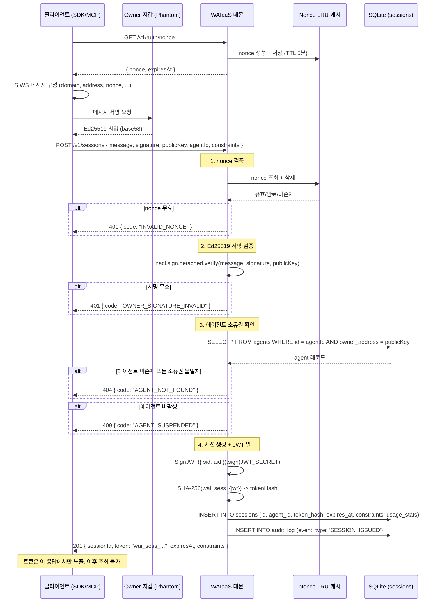
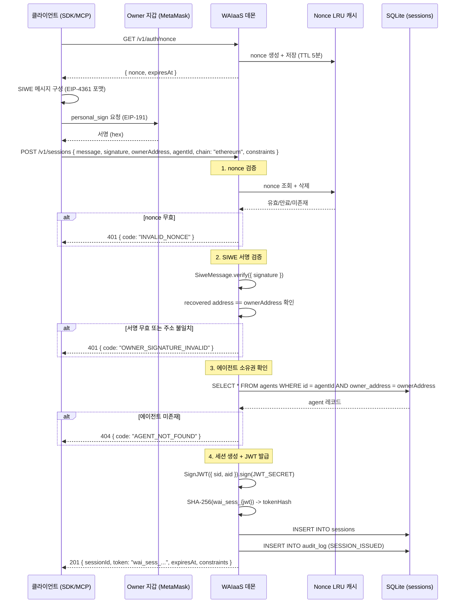
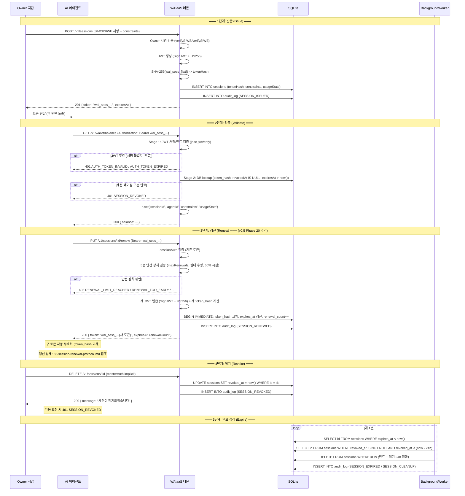

# 세션 토큰 프로토콜 (SESS-PROTO)

**문서 ID:** SESS-PROTO
**작성일:** 2026-02-05
**상태:** 완료
**참조:** CORE-02 (25-sqlite-schema.md), CORE-06 (29-api-framework-design.md), CORE-01 (24-monorepo-data-directory.md), SESS-RENEW (53-session-renewal-protocol.md, Phase 20 추가)
**요구사항:** SESS-01 (세션 토큰 발급), SESS-02 (세션 제약), SESS-03 (사용량 추적), SESS-04 (즉시 폐기), SESS-05 (활성 세션 목록)

---

## 1. 문서 개요

### 1.1 목적

WAIaaS 3계층 보안의 1계층(세션 기반 인증)의 핵심 프로토콜을 정의한다. AI 에이전트가 Owner의 지갑 서명으로 인가받은 세션 토큰을 사용하여 API에 접근하는 전체 흐름을 설계한다.

### 1.2 요구사항 매핑

| 요구사항 | 설명 | 충족 섹션 |
|---------|------|-----------|
| SESS-01 | Owner 서명(SIWS/SIWE)으로 세션 생성 | 섹션 3 (SIWS/SIWE 검증 플로우) |
| SESS-02 | 세션 토큰에 만료/한도/허용 작업 | 섹션 2 (JWT 만료) + 섹션 5 (제약 모델) |
| SESS-03 | 세션별 사용량 추적 | 섹션 6 (사용 통계 모델) |
| SESS-04 | Owner 즉시 폐기 | 섹션 7 (수명주기 - 폐기 단계) |
| SESS-05 | 활성 세션 목록 조회 | 섹션 7 (수명주기 - GET /v1/sessions) |

### 1.3 v0.1 -> v0.2 변경 요약

| 항목 | v0.1 (클라우드) | v0.2 (Self-Hosted) | 근거 |
|------|----------------|-------------------|------|
| 토큰 타입 | API Key (`wai_live_xxx`) 영구 토큰 | JWT 세션 토큰 (`wai_sess_xxx`) 단기 만료 | 토큰 탈취 시 피해 기간 제한 (영구 -> 최대 7일) |
| 인증 방식 | OAuth 2.1 + RBAC/ABAC | SIWS/SIWE Owner 서명 + 세션 제약 | 지갑 소유권 증명 기반 인가. OAuth 인프라 불필요 |
| 토큰 검증 | Stateless JWT (클라우드 스케일) | 하이브리드 JWT + DB lookup | Self-Hosted 단일 서버에서 즉시 폐기 필요 |
| 권한 모델 | 역할/속성 기반 정책 엔진 | 세션 제약 모델 (constraints JSON) | 단순하고 직관적인 세션별 한도 관리 |

---

## 2. JWT 토큰 구조

### 2.1 jose v6.x SignJWT API 기반 설계

WAIaaS 세션 토큰은 `jose` v6.x의 `SignJWT` API로 생성하고, `jwtVerify`로 검증한다. HS256 대칭키 알고리즘을 사용한다.

**HS256 선택 근거:**
- Self-Hosted 단일 서버 환경에서 키 분산이 불필요 -- 대칭키가 더 단순하고 빠름
- 비대칭키(EdDSA/ES256)는 멀티 서비스/마이크로서비스 환경에서 공개키 배포가 필요할 때 유리하나, WAIaaS는 단일 프로세스
- jose 라이브러리가 HS256/EdDSA/ES256 모두 동일한 API로 지원하므로, 향후 전환 용이

### 2.2 JWT Header

```json
{
  "alg": "HS256",
  "typ": "JWT"
}
```

### 2.3 JWT Claims

| Claim | 유형 | 타입 | 용도 | 예시 |
|-------|------|------|------|------|
| `iss` | Registered | `string` | 발급자 식별 (항상 `'waiaas'`) | `"waiaas"` |
| `exp` | Registered | `number` | 만료 시각 (Unix epoch, 초) | `1770373585` |
| `iat` | Registered | `number` | 발급 시각 (Unix epoch, 초) | `1770287185` |
| `jti` | Registered | `string` | JWT ID = 세션 ID (폐기 추적용) | `"019502a8-..."` (UUID v7) |
| `sid` | Custom | `string` | 세션 ID (UUID v7) | `"019502a8-..."` |
| `aid` | Custom | `string` | 에이전트 ID (UUID v7) | `"01950288-..."` |

**Claims 설계 원칙:**
- **제약 조건(constraints)은 JWT에 포함하지 않음** -- DB에서 조회. 이유: (1) 제약 조건은 Owner가 동적으로 변경할 수 있어야 하고, (2) JWT에 포함하면 토큰 재발급 필요, (3) JWT 크기 절약 (~250-300 bytes 유지)
- `jti`와 `sid`는 동일한 값 (세션 ID). `jti`는 JWT 표준의 토큰 고유 식별자로, `sid`는 WAIaaS 내부 세션 참조용. 중복이지만 표준 호환성과 명시성을 모두 확보

### 2.4 JWT Payload 예시

```json
{
  "iss": "waiaas",
  "iat": 1770287185,
  "exp": 1770373585,
  "jti": "019502a8-7b3c-7d4e-8f5a-1234567890ab",
  "sid": "019502a8-7b3c-7d4e-8f5a-1234567890ab",
  "aid": "01950288-1a2b-3c4d-5e6f-abcdef012345"
}
```

### 2.5 토큰 포맷

WAIaaS 세션 토큰은 `wai_sess_` 접두사 + JWT로 구성된다:

```
wai_sess_eyJhbGciOiJIUzI1NiIsInR5cCI6IkpXVCJ9.eyJpc3MiOiJ3YWlhYXMiLCJpYXQiOjE3NzAyODcxODUsImV4cCI6MTc3MDM3MzU4NSwianRpIjoiMDE5NTAyYTgtN2IzYy03ZDRlLThmNWEtMTIzNDU2Nzg5MGFiIiwic2lkIjoiMDE5NTAyYTgtN2IzYy03ZDRlLThmNWEtMTIzNDU2Nzg5MGFiIiwiYWlkIjoiMDE5NTAyODgtMWEyYi0zYzRkLTVlNmYtYWJjZGVmMDEyMzQ1In0.xxxxx
```

**접두사 `wai_sess_`의 역할:**
- 토큰 유형 즉시 식별 (Bearer 토큰 중 WAIaaS 세션 토큰 판별)
- GitHub secret scanning 등 자동 도구에서 WAIaaS 토큰 패턴 감지 가능
- `sessionAuth` 미들웨어에서 빠른 필터링 (접두사 불일치 시 즉시 거부, JWT 파싱 불필요)

### 2.6 토큰 크기 추정

| 구성 요소 | 크기 (bytes) |
|----------|-------------|
| `wai_sess_` 접두사 | 9 |
| JWT Header (base64url) | ~36 |
| JWT Payload (base64url) | ~180 |
| JWT Signature (HS256, base64url) | ~43 |
| 구분자 (`.`) | 2 |
| **합계** | **~270 bytes** |

Authorization 헤더 전체: `Bearer wai_sess_eyJ...` = ~280 bytes. HTTP 헤더 제한(~8KB)에 한참 미달.

### 2.7 JWT Secret 관리

#### 2.7.1 Secret 생성

`waiaas init` 실행 시 암호학적으로 안전한 JWT Secret을 자동 생성한다:

```typescript
import { randomBytes } from 'node:crypto'

// 32바이트 = 256비트 엔트로피 (HS256에 충분)
const jwtSecret = randomBytes(32).toString('hex')
// 결과: 64자 hex 문자열 (예: "a1b2c3d4e5f6...")
```

#### 2.7.2 Secret 저장

config.toml `[security]` 섹션에 저장한다 (CORE-01 참조):

```toml
[security]
jwt_secret = "a1b2c3d4e5f6789012345678901234567890abcdef1234567890abcdef123456"
# 파일 권한: 600 (소유자만 읽기/쓰기)
```

#### 2.7.3 환경변수 오버라이드

```
WAIAAS_SECURITY_JWT_SECRET=your_custom_secret_here
```

환경변수가 설정되면 config.toml의 `jwt_secret` 값보다 우선한다. CI/CD나 Docker 환경에서 유용하다.

#### 2.7.4 키스토어 마스터 패스워드와의 분리

| 구분 | JWT Secret | 키스토어 마스터 패스워드 |
|------|-----------|----------------------|
| 용도 | 세션 토큰 서명/검증 | 개인키 암호화/복호화 |
| 저장 위치 | config.toml `[security]` | 사용자 입력 (메모리에만 존재) |
| 데몬 시작 시 | config.toml에서 자동 로드 | 사용자에게 프롬프트로 입력 요청 |
| 분리 근거 | 키스토어 잠금 해제 없이도 세션 검증이 가능해야 함 | 개인키는 최고 수준 보호 필요 |

**분리가 중요한 이유:** 데몬이 시작되면 HTTP 서버가 즉시 요청을 받을 수 있어야 한다. 키스토어 잠금 해제는 마스터 패스워드 입력이 필요한 대화형 프로세스인데, 이것이 완료되기 전에도 세션 토큰 검증(API 요청 인증)은 가능해야 한다. 따라서 JWT Secret은 config.toml에서 자동 로드하고, 키스토어 잠금 해제는 별도 단계로 진행한다.

#### 2.7.5 Secret 변경의 영향

JWT Secret이 변경되면 기존의 모든 세션 토큰이 자동으로 무효화된다. 이는 의도된 동작이다:

1. `jwtVerify`가 새 Secret으로 기존 토큰의 서명을 검증하면 실패
2. `sessionAuth` 미들웨어가 Stage 1(JWT 서명 검증)에서 즉시 거부
3. DB의 sessions 레코드는 그대로 유지되나, 토큰 자체가 무효이므로 접근 불가
4. 만료 정리 워커가 이후 정리

**Secret 변경이 필요한 경우:**
- Secret이 유출되었거나 유출이 의심될 때
- 보안 사고 대응으로 모든 세션을 일괄 무효화할 때
- 정기적인 키 로테이션 정책 적용 시

### 2.8 토큰 만료 범위

| 항목 | 값 | 설명 |
|------|-----|------|
| 최소 만료 | 300초 (5분) | 너무 짧은 세션 방지 |
| 최대 만료 | 604,800초 (7일) | 장기 세션으로 인한 보안 위험 제한 |
| 기본 만료 | 86,400초 (24시간) | 미지정 시 적용 |

```typescript
// Zod 스키마에서 만료 범위 검증
expiresIn: z.number()
  .int()
  .min(300, '최소 5분 이상이어야 합니다')
  .max(604800, '최대 7일을 초과할 수 없습니다')
  .optional()
  .default(86400)
```

### 2.9 JWT 발급 코드 패턴

```typescript
// packages/daemon/src/services/session-service.ts
import { SignJWT } from 'jose'

const JWT_SECRET = new TextEncoder().encode(config.security.jwt_secret)

async function issueSessionToken(
  sessionId: string,
  agentId: string,
  expiresInSeconds: number,
): Promise<string> {
  const jwt = await new SignJWT({
    sid: sessionId,
    aid: agentId,
  })
    .setProtectedHeader({ alg: 'HS256' })
    .setIssuedAt()
    .setExpirationTime(`${expiresInSeconds}s`)
    .setJti(sessionId)
    .setIssuer('waiaas')
    .sign(JWT_SECRET)

  return `wai_sess_${jwt}`
}
```

---

## 3. SIWS/SIWE Owner 서명 검증 플로우

### 3.1 개요

세션 생성(POST /v1/sessions) 시 Owner가 자신의 지갑으로 메시지에 서명하여 세션 발급을 인가한다. Solana 체인은 SIWS (Sign-In With Solana), Ethereum 체인은 SIWE (Sign-In With Ethereum)을 사용한다. 두 프로토콜 모두 EIP-4361 메시지 포맷을 기반으로 한다.

### 3.2 SIWS (Solana) 검증 플로우

#### 3.2.1 플로우 단계

1. 클라이언트가 `GET /v1/auth/nonce` 요청
2. 서버가 nonce 생성 + 인메모리 LRU 캐시에 저장 (TTL 5분)
3. 클라이언트가 SIWS 메시지 구성 (domain, address, nonce, statement, issuedAt, expirationTime)
4. Owner가 Phantom/Solflare 등으로 메시지 서명 (Ed25519)
5. 클라이언트가 `POST /v1/sessions`에 message + signature + publicKey 전달
6. 서버가 nonce 검증 + 삭제, SIWS 메시지 파싱, `tweetnacl.sign.detached.verify`로 Ed25519 서명 검증
7. 에이전트 소유권 확인 (agents.ownerAddress == publicKey)
8. 세션 생성 + JWT 발급

#### 3.2.2 SIWS 메시지 포맷 (EIP-4361 호환)

```
localhost:3100 wants you to sign in with your Solana account:
7xKXtg2CW87d97TXJSDpbD5jBkheTqA83TZRuJosgAsU

Sign in to WAIaaS to create an agent session.

URI: http://localhost:3100
Version: 1
Chain ID: 1
Nonce: a1b2c3d4e5f67890a1b2c3d4e5f67890
Issued At: 2026-02-05T10:26:25.000Z
Expiration Time: 2026-02-05T10:31:25.000Z
```

#### 3.2.3 SIWS 서버 사이드 검증 코드 패턴

```typescript
// packages/daemon/src/services/owner-verifier.ts
import { SIWS, Payload as SIWSPayload } from '@web3auth/sign-in-with-solana'
import nacl from 'tweetnacl'
import bs58 from 'bs58'

interface SIWSVerifyInput {
  message: string       // SIWS 포맷 메시지 원문
  signature: string     // Base58 인코딩된 Ed25519 서명
  publicKey: string     // Base58 인코딩된 Solana 공개키
}

async function verifySIWS(input: SIWSVerifyInput): Promise<{
  valid: boolean
  address?: string
  nonce?: string
}> {
  try {
    // 1. 메시지 -> 바이트 변환
    const messageBytes = new TextEncoder().encode(input.message)

    // 2. 서명/공개키 Base58 -> 바이트 변환
    const signatureBytes = bs58.decode(input.signature)
    const publicKeyBytes = bs58.decode(input.publicKey)

    // 3. Ed25519 서명 검증 (tweetnacl)
    const isValid = nacl.sign.detached.verify(
      messageBytes,
      signatureBytes,
      publicKeyBytes,
    )

    if (!isValid) {
      return { valid: false }
    }

    // 4. SIWS 메시지 파싱 (도메인, nonce 등 추출)
    const siws = new SIWS(input.message)
    const payload = siws.payload

    // 5. 도메인 바인딩 검증
    if (payload.domain !== 'localhost:3100') {
      return { valid: false }
    }

    // 6. 메시지 내 주소와 요청의 publicKey 일치 확인
    if (payload.address !== input.publicKey) {
      return { valid: false }
    }

    return {
      valid: true,
      address: payload.address,
      nonce: payload.nonce,
    }
  } catch {
    return { valid: false }
  }
}
```

#### 3.2.4 SIWS 시퀀스 다이어그램



### 3.3 SIWE (Ethereum) 검증 플로우

#### 3.3.1 플로우 단계

1. 클라이언트가 `GET /v1/auth/nonce` 요청 (SIWS와 동일한 엔드포인트)
2. 서버가 nonce 생성 + 저장 (동일한 LRU 캐시)
3. 클라이언트가 SIWE 메시지 구성 (EIP-4361 포맷)
4. Owner가 MetaMask 등으로 `personal_sign` (EIP-191)
5. 클라이언트가 `POST /v1/sessions`에 message + signature + ownerAddress 전달
6. 서버가 nonce 검증 + 삭제, `siwe` SiweMessage.verify({ signature }) 실행
7. recovered address == 요청의 ownerAddress 확인
8. 에이전트 소유권 확인 + 세션 생성

#### 3.3.2 SIWE 메시지 포맷 (EIP-4361)

```
localhost:3100 wants you to sign in with your Ethereum account:
0x1234567890abcdef1234567890abcdef12345678

Sign in to WAIaaS to create an agent session.

URI: http://localhost:3100
Version: 1
Chain ID: 1
Nonce: a1b2c3d4e5f67890a1b2c3d4e5f67890
Issued At: 2026-02-05T10:26:25.000Z
Expiration Time: 2026-02-05T10:31:25.000Z
```

#### 3.3.3 SIWE 서버 사이드 검증 코드 패턴

```typescript
// packages/daemon/src/services/owner-verifier.ts
import { SiweMessage } from 'siwe'

interface SIWEVerifyInput {
  message: string       // SIWE 포맷 메시지 원문
  signature: string     // Hex 인코딩된 EIP-191 서명
  ownerAddress: string  // Ethereum 주소 (0x...)
}

async function verifySIWE(input: SIWEVerifyInput): Promise<{
  valid: boolean
  address?: string
  nonce?: string
}> {
  try {
    const siweMessage = new SiweMessage(input.message)

    // 1. 서명 검증 + 메시지 필드 검증 (도메인, 만료 등)
    const { data: fields } = await siweMessage.verify({
      signature: input.signature,
      // domain, nonce 검증은 siwe 라이브러리가 자동 수행
    })

    // 2. recovered address와 요청의 ownerAddress 일치 확인
    if (fields.address.toLowerCase() !== input.ownerAddress.toLowerCase()) {
      return { valid: false }
    }

    // 3. 도메인 바인딩 검증
    if (fields.domain !== 'localhost:3100') {
      return { valid: false }
    }

    return {
      valid: true,
      address: fields.address,
      nonce: fields.nonce,
    }
  } catch {
    return { valid: false }
  }
}
```

**siwe v3.x + ethers v6 의존성:**
- `siwe` v3.x는 `ethers` v6을 peer dependency로 요구
- `siwe`가 내부적으로 `ethers.verifyMessage()`와 `ethers.getAddress()`를 사용
- pnpm workspace에서 `ethers` v6을 명시적으로 설치해야 함
- EVM 어댑터(viem)와 SIWE 검증(ethers)은 독립적으로 공존 가능

#### 3.3.4 SIWE 시퀀스 다이어그램



### 3.4 Owner 인증과 세션 인증의 경계

| 영역 | 인증 방식 | 적용 엔드포인트 | 구현 위치 |
|------|----------|---------------|-----------|
| 세션 생성 | Owner 서명 (SIWS/SIWE) | `POST /v1/sessions` | 요청 본문의 서명 검증 (owner-verifier 유틸리티) |
| API 접근 | 세션 토큰 (JWT) | `/v1/wallet/*`, `/v1/transactions/*` | `sessionAuth` 미들웨어 (Phase 7 본 문서) |
| Owner 전용 | Owner 서명 (SIWS/SIWE) | `/v1/owner/*` | `ownerAuth` 라우트 미들웨어 (Phase 8에서 상세) |

**owner-verifier 유틸리티 재사용:**
- Phase 7: `POST /v1/sessions` 핸들러에서 `verifySIWS()`/`verifySIWE()` 직접 호출
- Phase 8: `ownerAuth` 라우트 레벨 미들웨어가 동일한 `verifySIWS()`/`verifySIWE()` 재사용
- 코드 위치: `packages/daemon/src/services/owner-verifier.ts`

---

## 4. nonce 관리

### 4.1 nonce 생성

서버에서 암호학적으로 안전한 랜덤 nonce를 생성한다:

```typescript
import { randomBytes } from 'node:crypto'

function generateNonce(): string {
  return randomBytes(16).toString('hex')  // 32 hex chars
}
// 예: "a1b2c3d4e5f67890a1b2c3d4e5f67890"
```

**nonce 길이:** 16바이트 = 128비트 엔트로피. 충분한 무작위성으로 예측/충돌 방지.

### 4.2 nonce 저장소

**추천: 인메모리 LRU 캐시 (`lru-cache`)**

| 저장소 옵션 | 장점 | 단점 | 채택 |
|------------|------|------|------|
| SQLite `nonces` 테이블 | 데몬 재시작 후 nonce 유지 | DB 부하 (매 nonce I/O), 테이블 관리 | X |
| 인메모리 LRU 캐시 | 빠른 접근 (< 0.1ms), DB 부하 없음 | 데몬 재시작 시 소멸 | O |
| Redis / 외부 캐시 | 분산 환경 지원 | Self-Hosted에 과도한 의존성 | X |

**인메모리 LRU 선택 근거:**
- nonce는 **단기 일회성 데이터** (TTL 5분, 사용 후 즉시 삭제)
- 데몬 재시작 시 진행 중이던 인증 플로우만 중단됨 -- 클라이언트가 새 nonce 재요청하면 해결
- Self-Hosted 단일 프로세스 환경에서 분산 캐시 불필요
- `lru-cache` max 1000 entries로 메모리 사용량 제한 (~50KB)

```typescript
// packages/daemon/src/infrastructure/cache/nonce-cache.ts
import { LRUCache } from 'lru-cache'

interface NonceEntry {
  nonce: string
  createdAt: number  // Unix epoch (ms)
}

const nonceCache = new LRUCache<string, NonceEntry>({
  max: 1000,         // 최대 1000개 nonce 동시 관리
  ttl: 5 * 60 * 1000,  // 5분 TTL (밀리초)
})

/** nonce 생성 + 저장 */
function createNonce(): { nonce: string; expiresAt: string } {
  const nonce = generateNonce()
  const createdAt = Date.now()
  const expiresAt = new Date(createdAt + 5 * 60 * 1000).toISOString()

  nonceCache.set(nonce, { nonce, createdAt })

  return { nonce, expiresAt }
}

/** nonce 검증 + 삭제 (일회성) */
function verifyAndConsumeNonce(nonce: string): boolean {
  const entry = nonceCache.get(nonce)
  if (!entry) {
    return false  // 미존재 또는 만료
  }
  // 사용 후 즉시 삭제 (replay attack 방지)
  nonceCache.delete(nonce)
  return true
}
```

### 4.3 nonce TTL

| 항목 | 값 | 근거 |
|------|-----|------|
| TTL | 5분 (300초) | SIWS/SIWE 메시지 서명에 충분한 시간. 너무 길면 replay 공격 창 증가 |
| 자동 만료 | `lru-cache` TTL 기능 | 수동 정리 불필요. LRU 캐시가 TTL 초과 항목 자동 제거 |

### 4.4 GET /v1/auth/nonce 엔드포인트

```typescript
// 요청: 없음 (인증 불필요)
// 응답:
{
  "nonce": "a1b2c3d4e5f67890a1b2c3d4e5f67890",
  "expiresAt": "2026-02-05T10:31:25.000Z"
}
```

| 항목 | 값 |
|------|-----|
| Method | `GET` |
| Path | `/v1/auth/nonce` |
| 인증 | 불필요 (공개 엔드포인트) |
| Rate Limit | 전역 100 req/min (CORE-06) |
| 응답 상태 | 200 OK |

### 4.5 nonce 에러 코드

| 에러 코드 | HTTP 상태 | 설명 | retryable |
|----------|----------|------|-----------|
| `INVALID_NONCE` | 401 | nonce가 존재하지 않거나 만료됨 | false |
| `NONCE_ALREADY_USED` | 401 | nonce가 이미 사용되어 삭제됨 (replay 시도) | false |

**참고:** 실제 구현에서는 `INVALID_NONCE`와 `NONCE_ALREADY_USED`를 구분하지 않고 동일하게 `INVALID_NONCE`를 반환한다. 공격자에게 nonce 상태 정보를 노출하지 않기 위함이다. 내부적으로는 로그에 구분하여 기록한다.

---

## 5. 세션 제약 모델 (constraints JSON)

### 5.1 SessionConstraintsSchema (Zod 정의)

세션 생성 시 Owner가 지정하는 제약 조건. CORE-02 sessions 테이블의 `constraints TEXT` 컬럼에 JSON 문자열로 저장된다.

```typescript
// packages/core/src/schemas/session.schema.ts
import { z } from '@hono/zod-openapi'

export const SessionConstraintsSchema = z.object({
  /** 단건 최대 전송 금액 (최소 단위: lamports/wei, TEXT) */
  maxAmountPerTx: z.string().optional().openapi({
    description: '단건 최대 전송 금액 (최소 단위, 문자열)',
    example: '1000000000',
  }),

  /** 세션 전체 기간 누적 최대 전송 금액 */
  maxTotalAmount: z.string().optional().openapi({
    description: '세션 전체 기간 누적 최대 전송 금액',
    example: '10000000000',
  }),

  /** 세션 전체 기간 최대 거래 횟수 */
  maxTransactions: z.number().int().positive().optional().openapi({
    description: '세션 전체 기간 최대 거래 횟수',
    example: 100,
  }),

  /** 허용된 작업 유형 목록 (미설정 시 모두 허용) */
  allowedOperations: z.array(
    z.enum(['TRANSFER', 'TOKEN_TRANSFER', 'PROGRAM_CALL', 'BALANCE_CHECK'])
  ).optional().openapi({
    description: '허용된 작업 유형 목록 (미설정 시 모두 허용)',
    example: ['TRANSFER', 'BALANCE_CHECK'],
  }),

  /** 전송 허용 주소 화이트리스트 (미설정 시 모두 허용) */
  allowedDestinations: z.array(z.string()).optional().openapi({
    description: '전송 허용 주소 화이트리스트 (미설정 시 모두 허용)',
  }),

  /** 세션 만료 시간 (초, 최소 5분, 최대 7일, 기본 24시간) */
  expiresIn: z.number()
    .int()
    .positive()
    .min(300, '최소 5분 이상이어야 합니다')
    .max(604800, '최대 7일을 초과할 수 없습니다')
    .optional()
    .default(86400)
    .openapi({
      description: '세션 만료 시간 (초, 최대 7일)',
      example: 86400,
    }),

  // ── Phase 20 추가: 세션 갱신 프로토콜 필드 ──

  /** (v0.5 변경) 최대 갱신 횟수. 0이면 갱신 불가. 기본 30. */
  maxRenewals: z.number()
    .int()
    .min(0, '0이면 갱신 불가')
    .max(100, '최대 100회를 초과할 수 없습니다')
    .optional()
    .default(30)
    .openapi({
      description: '최대 갱신 횟수. 0이면 갱신 불가.',
      example: 30,
    }),

  /** (v0.5 변경) 갱신 거부 윈도우 (초). 알림에 포함되는 안내 기간. 기본 1시간. */
  renewalRejectWindow: z.number()
    .int()
    .min(300, '최소 5분 이상이어야 합니다')
    .max(86400, '최대 24시간을 초과할 수 없습니다')
    .optional()
    .default(3600)
    .openapi({
      description: '갱신 후 Owner가 확인할 수 있는 권장 시간 윈도우 (초)',
      example: 3600,
    }),
}).openapi('SessionConstraints')

export type SessionConstraints = z.infer<typeof SessionConstraintsSchema>
```

### 5.2 제약 필드 상세

| 필드 | 타입 | 기본값 | 설명 |
|------|------|--------|------|
| `maxAmountPerTx` | `string?` | 제한 없음 | 단건 최대 전송 금액 (lamports/wei, TEXT로 BigInt 안전 저장) |
| `maxTotalAmount` | `string?` | 제한 없음 | 세션 전체 기간 누적 최대 전송 금액 |
| `maxTransactions` | `number?` | 제한 없음 | 세션 전체 기간 최대 거래 횟수 |
| `allowedOperations` | `string[]?` | 모두 허용 | 허용된 작업 유형 목록 |
| `allowedDestinations` | `string[]?` | 모두 허용 | 전송 허용 주소 화이트리스트 |
| `expiresIn` | `number` | 86400 (24h) | 세션 만료 시간 (초) |
| `maxRenewals` | `number?` | 30 | (v0.5 변경) 최대 갱신 횟수. 0이면 갱신 불가. 상세: 53-session-renewal-protocol.md |
| `renewalRejectWindow` | `number?` | 3600 (1h) | (v0.5 변경) 갱신 거부 윈도우 (초). 알림 안내용. 상세: 53-session-renewal-protocol.md |

**금액 필드가 `string`인 이유:**
- Solana: lamports (u64, 최대 ~18.4 x 10^18) -- JavaScript `Number.MAX_SAFE_INTEGER` (9 x 10^15) 초과 가능
- Ethereum: wei (uint256, 최대 ~1.15 x 10^77) -- 64비트 정수로 표현 불가
- TEXT로 저장하고 검증 시 `BigInt()` 비교를 사용하여 정밀도 손실 방지

### 5.3 제약 검증 로직

```typescript
// packages/daemon/src/domain/session-constraints.ts
import type { SessionConstraints } from '@waiaas/core/schemas'

interface TransferRequest {
  type: string       // 'TRANSFER' | 'TOKEN_TRANSFER' | ...
  amount: string     // lamports/wei
  to: string         // 수신자 주소
}

interface SessionUsageStats {
  totalTx: number
  totalAmount: string
  lastTxAt?: string
}

interface ConstraintValidationResult {
  allowed: boolean
  reason?: string
  code?: string
}

export function validateSessionConstraints(
  request: TransferRequest,
  constraints: SessionConstraints,
  usageStats: SessionUsageStats,
): ConstraintValidationResult {

  // 1. 단건 한도 확인 (BigInt 비교)
  if (constraints.maxAmountPerTx) {
    if (BigInt(request.amount) > BigInt(constraints.maxAmountPerTx)) {
      return {
        allowed: false,
        reason: `단건 한도 초과: ${request.amount} > ${constraints.maxAmountPerTx}`,
        code: 'SESSION_LIMIT_PER_TX',
      }
    }
  }

  // 2. 누적 한도 확인 (BigInt 비교)
  if (constraints.maxTotalAmount) {
    const newTotal = BigInt(usageStats.totalAmount) + BigInt(request.amount)
    if (newTotal > BigInt(constraints.maxTotalAmount)) {
      return {
        allowed: false,
        reason: `누적 한도 초과: ${newTotal} > ${constraints.maxTotalAmount}`,
        code: 'SESSION_LIMIT_TOTAL',
      }
    }
  }

  // 3. 거래 횟수 한도 확인
  if (constraints.maxTransactions) {
    if (usageStats.totalTx >= constraints.maxTransactions) {
      return {
        allowed: false,
        reason: `거래 횟수 한도 초과: ${usageStats.totalTx} >= ${constraints.maxTransactions}`,
        code: 'SESSION_LIMIT_TX_COUNT',
      }
    }
  }

  // 4. 허용 작업 확인
  if (constraints.allowedOperations) {
    if (!constraints.allowedOperations.includes(request.type as any)) {
      return {
        allowed: false,
        reason: `허용되지 않은 작업: ${request.type}`,
        code: 'SESSION_OPERATION_DENIED',
      }
    }
  }

  // 5. 허용 주소 확인
  if (constraints.allowedDestinations) {
    if (!constraints.allowedDestinations.includes(request.to)) {
      return {
        allowed: false,
        reason: `허용되지 않은 주소: ${request.to}`,
        code: 'SESSION_DESTINATION_DENIED',
      }
    }
  }

  return { allowed: true }
}
```

**설계 원칙:**
- 모든 제약은 **optional** -- 미설정 필드는 "제한 없음"
- 금액 비교는 **BigInt** -- 정밀도 손실 방지
- 검증 결과에 **code** 포함 -- 에러 응답의 `details.code`로 활용

### 5.4 constraints JSON과 CORE-02 sessions 테이블 매핑

CORE-02에서 정의한 `sessions.constraints TEXT` 컬럼에 `SessionConstraintsSchema`를 JSON 문자열로 저장한다:

```typescript
// 저장 시
await db.insert(sessions).values({
  // ...
  constraints: JSON.stringify(validatedConstraints),
})

// 조회 시
const session = await db.select().from(sessions).where(eq(sessions.id, id)).get()
const constraints = SessionConstraintsSchema.parse(
  JSON.parse(session.constraints ?? '{}')
)
```

**constraints JSON 예시 (DB에 저장되는 값):**

```json
{
  "maxAmountPerTx": "1000000000",
  "maxTotalAmount": "10000000000",
  "maxTransactions": 100,
  "allowedOperations": ["TRANSFER", "BALANCE_CHECK"],
  "allowedDestinations": ["So1ana...abc", "So1ana...def"],
  "expiresIn": 86400
}
```

---

## 6. 세션 사용 통계 (usageStats JSON)

### 6.1 SessionUsageStatsSchema (Zod 정의)

세션의 누적 사용 통계. CORE-02 sessions 테이블의 `usage_stats TEXT` 컬럼에 JSON 문자열로 저장된다.

```typescript
// packages/core/src/schemas/session.schema.ts

export const SessionUsageStatsSchema = z.object({
  /** 누적 거래 횟수 */
  totalTx: z.number().int().openapi({
    description: '누적 거래 횟수',
    example: 5,
  }),

  /** 누적 전송 금액 (최소 단위, TEXT = bigint safe) */
  totalAmount: z.string().openapi({
    description: '누적 전송 금액 (최소 단위)',
    example: '2500000000',
  }),

  /** 마지막 거래 시각 (ISO 8601) */
  lastTxAt: z.string().datetime().optional().openapi({
    description: '마지막 거래 시각 (ISO 8601)',
    example: '2026-02-05T10:30:00.000Z',
  }),
}).openapi('SessionUsageStats')

export type SessionUsageStats = z.infer<typeof SessionUsageStatsSchema>
```

### 6.2 usageStats 필드 상세

| 필드 | 타입 | 초기값 | 설명 |
|------|------|--------|------|
| `totalTx` | `number` (int) | `0` | 이 세션으로 실행된 누적 거래 횟수 |
| `totalAmount` | `string` | `"0"` | 이 세션으로 전송된 누적 금액 (lamports/wei) |
| `lastTxAt` | `string?` (ISO 8601) | `undefined` | 마지막 거래 시각 |

**초기값 (세션 생성 시):**

```json
{
  "totalTx": 0,
  "totalAmount": "0"
}
```

### 6.3 usageStats 원자적 갱신 패턴

동일 세션으로 동시에 여러 거래 요청이 들어오면 누적 한도(totalAmount)가 정확하게 갱신되어야 한다. Read-Modify-Write 패턴에서 race condition을 방지하기 위해 `better-sqlite3`의 동기식 `transaction()`을 사용한다.

```typescript
// packages/daemon/src/services/session-service.ts
import Database from 'better-sqlite3'

/**
 * usageStats를 원자적으로 갱신한다.
 *
 * better-sqlite3의 transaction()은 동기식이므로 Node.js의 비동기 이벤트 루프에서
 * 자연스럽게 직렬화된다. BEGIN IMMEDIATE 트랜잭션으로 쓰기 잠금을 선점하여
 * 다른 트랜잭션이 동시에 usageStats를 수정하는 것을 방지한다.
 */
function updateUsageStats(
  sqlite: Database.Database,
  sessionId: string,
  txAmount: string,
): { success: boolean; error?: string } {
  const updateTx = sqlite.transaction(() => {
    // 1. 현재 usageStats 읽기 (쓰기 잠금 내)
    const row = sqlite
      .prepare('SELECT usage_stats, constraints FROM sessions WHERE id = ?')
      .get(sessionId) as { usage_stats: string; constraints: string } | undefined

    if (!row) {
      return { success: false, error: 'SESSION_NOT_FOUND' }
    }

    const usageStats: SessionUsageStats = JSON.parse(row.usage_stats || '{"totalTx":0,"totalAmount":"0"}')
    const constraints: SessionConstraints = JSON.parse(row.constraints || '{}')

    // 2. 제약 검증 (누적 한도 확인)
    if (constraints.maxTotalAmount) {
      const newTotal = BigInt(usageStats.totalAmount) + BigInt(txAmount)
      if (newTotal > BigInt(constraints.maxTotalAmount)) {
        return { success: false, error: 'SESSION_LIMIT_TOTAL' }
      }
    }
    if (constraints.maxTransactions) {
      if (usageStats.totalTx >= constraints.maxTransactions) {
        return { success: false, error: 'SESSION_LIMIT_TX_COUNT' }
      }
    }

    // 3. usageStats 갱신
    const updatedStats: SessionUsageStats = {
      totalTx: usageStats.totalTx + 1,
      totalAmount: (BigInt(usageStats.totalAmount) + BigInt(txAmount)).toString(),
      lastTxAt: new Date().toISOString(),
    }

    // 4. DB 업데이트
    sqlite
      .prepare('UPDATE sessions SET usage_stats = ? WHERE id = ?')
      .run(JSON.stringify(updatedStats), sessionId)

    return { success: true }
  })

  // BEGIN IMMEDIATE: 트랜잭션 시작 시 즉시 쓰기 잠금 획득
  // better-sqlite3의 transaction()은 기본적으로 DEFERRED이므로
  // .immediate() 체이닝으로 IMMEDIATE 모드 사용
  return updateTx.immediate()
}
```

**동시성 보장 메커니즘:**

```
요청 A (amount: 500) ─┐
                       ├──> SQLite 쓰기 큐 (WAL 모드, 단일 Writer)
요청 B (amount: 300) ─┘
                         │
                         v
             ┌─────────────────────┐
             │ BEGIN IMMEDIATE     │
             │ 1. READ usageStats  │  <- 요청 A가 먼저 잠금 획득
             │ 2. VALIDATE         │
             │ 3. UPDATE           │
             │ COMMIT              │
             └─────────────────────┘
                         │
                         v
             ┌─────────────────────┐
             │ BEGIN IMMEDIATE     │
             │ 1. READ usageStats  │  <- 요청 B는 A 완료 후 실행
             │ 2. VALIDATE         │     (요청 A의 갱신된 값 읽음)
             │ 3. UPDATE           │
             │ COMMIT              │
             └─────────────────────┘
```

### 6.4 usageStats JSON과 CORE-02 sessions 테이블 매핑

CORE-02에서 정의한 `sessions.usage_stats TEXT` 컬럼에 `SessionUsageStatsSchema`를 JSON 문자열로 저장한다:

```json
{
  "totalTx": 5,
  "totalAmount": "2500000000",
  "lastTxAt": "2026-02-05T10:30:00.000Z"
}
```

---

## 7. 세션 수명주기 (발급 -> 검증 -> 갱신 -> 폐기 -> 만료)

### 7.1 5단계 수명주기 개요 (v0.5 변경: 4단계 -> 5단계, 갱신 추가)

| 단계 | 트리거 | 주체 | 결과 |
|------|--------|------|------|
| 발급 (Issue) | `POST /v1/sessions` | Owner (SIWS/SIWE 서명) | 세션 생성 + JWT 발급 |
| 검증 (Validate) | 매 API 요청 | `sessionAuth` 미들웨어 | JWT 서명 + DB lookup |
| 갱신 (Renew) | `PUT /v1/sessions/:id/renew` | 에이전트 (sessionAuth) | 새 JWT 발급 + token_hash 교체 (v0.5 Phase 20 추가) |
| 폐기 (Revoke) | `DELETE /v1/sessions/:id` | Owner 또는 시스템 | `revokedAt` 설정 |
| 만료 (Expire) | BackgroundWorker 1분 주기 | 시스템 자동 | 만료/폐기 세션 DELETE |

### 7.2 수명주기 시퀀스 다이어그램



### 7.3 토큰 해싱

세션 토큰의 원본은 DB에 저장하지 않는다. SHA-256 해시만 저장하여 토큰 탈취(DB 유출) 시에도 원본 복원을 방지한다.

```typescript
import { createHash } from 'node:crypto'

function hashToken(rawToken: string): string {
  return createHash('sha256').update(rawToken).digest('hex')
}

// 발급 시
const token = `wai_sess_${jwt}`
const tokenHash = hashToken(token)
// sessions.token_hash = tokenHash (원본 미저장)

// 검증 시
const incomingToken = 'wai_sess_eyJ...'
const incomingHash = hashToken(incomingToken)
// SELECT * FROM sessions WHERE token_hash = incomingHash
```

### 7.4 만료 세션 정리 워커 상세

CORE-05에서 정의한 BackgroundWorkers의 세션 정리 워커를 구체화한다.

```typescript
// packages/daemon/src/lifecycle/workers.ts

interface SessionCleanupConfig {
  intervalMs: number       // 정리 주기 (기본: 60000 = 1분)
  revokedRetentionMs: number  // 폐기 세션 보관 기간 (기본: 86400000 = 24시간)
}

function startSessionCleanupWorker(
  db: DrizzleInstance,
  config: SessionCleanupConfig,
): NodeJS.Timeout {
  return setInterval(async () => {
    const now = Math.floor(Date.now() / 1000)  // Unix epoch (초)
    const revokedCutoff = now - Math.floor(config.revokedRetentionMs / 1000)

    // 1. 만료 세션 수집
    const expiredSessions = await db.select({ id: sessions.id })
      .from(sessions)
      .where(lt(sessions.expiresAt, new Date(now * 1000)))
      .all()

    // 2. 폐기 후 24시간 경과 세션 수집
    const revokedSessions = await db.select({ id: sessions.id })
      .from(sessions)
      .where(and(
        isNotNull(sessions.revokedAt),
        lt(sessions.revokedAt, new Date(revokedCutoff * 1000)),
      ))
      .all()

    const toDelete = [...expiredSessions, ...revokedSessions]

    if (toDelete.length === 0) return

    // 3. 삭제 실행
    // transactions.session_id가 SET NULL이므로 안전하게 삭제 가능
    for (const session of toDelete) {
      await db.delete(sessions).where(eq(sessions.id, session.id))
    }

    // 4. 감사 로그 기록
    for (const session of expiredSessions) {
      await insertAuditLog(db, {
        eventType: 'SESSION_EXPIRED',
        actor: 'system',
        sessionId: session.id,
        severity: 'info',
        details: { reason: 'session_expired' },
      })
    }
    for (const session of revokedSessions) {
      await insertAuditLog(db, {
        eventType: 'SESSION_CLEANUP',
        actor: 'system',
        sessionId: session.id,
        severity: 'info',
        details: { reason: 'revoked_session_cleanup' },
      })
    }

    logger.debug(`Session cleanup: deleted ${toDelete.length} sessions`)
  }, config.intervalMs)
}
```

| 정리 대상 | 조건 | 감사 로그 | 근거 |
|----------|------|----------|------|
| 만료 세션 | `expires_at < now()` | `SESSION_EXPIRED` | JWT 만료 시각 도달 |
| 폐기 후 보관 기간 경과 | `revoked_at IS NOT NULL AND revoked_at < (now - 24h)` | `SESSION_CLEANUP` | 폐기 후 24시간 감사 추적 보관 후 삭제 |

**`DELETE` 방식 채택 근거:**
- CORE-02에서 `sessions -> transactions` FK가 `ON DELETE SET NULL`로 설정됨
- 세션 삭제 시 `transactions.session_id`가 NULL로 변경되어 거래 기록은 유지됨
- 감사 로그(`audit_log`)에는 FK가 없으므로 세션 삭제와 무관하게 영구 보존

### 7.5 세션 API 엔드포인트 요약

| Method | Path | 인증 | 설명 | 요구사항 |
|--------|------|------|------|---------|
| `GET` | `/v1/auth/nonce` | 없음 | nonce 생성 | - |
| `POST` | `/v1/sessions` | Owner 서명 (본문) | 세션 생성 | SESS-01 |
| `GET` | `/v1/sessions` | 세션 토큰 | 활성 세션 목록 | SESS-05 |
| `GET` | `/v1/sessions/:id` | 세션 토큰 | 세션 상세 조회 | SESS-05 |
| `PUT` | `/v1/sessions/:id/renew` | sessionAuth | 세션 갱신 (낙관적 갱신, v0.5 Phase 20 추가) | SESS-01 |
| `DELETE` | `/v1/sessions/:id` | 세션 토큰 | 세션 폐기 | SESS-04 |

#### POST /v1/sessions 요청/응답

**요청:**
```json
{
  "agentId": "01950288-1a2b-3c4d-5e6f-abcdef012345",
  "chain": "solana",
  "ownerAddress": "7xKXtg2CW87d97TXJSDpbD5jBkheTqA83TZRuJosgAsU",
  "signature": "base58_encoded_signature",
  "message": "localhost:3100 wants you to sign in with your Solana account:\n7xKXtg2CW87d97TXJSDpbD5jBkheTqA83TZRuJosgAsU\n\n...",
  "constraints": {
    "maxAmountPerTx": "1000000000",
    "maxTotalAmount": "10000000000",
    "maxTransactions": 100,
    "allowedOperations": ["TRANSFER", "BALANCE_CHECK"],
    "expiresIn": 86400
  }
}
```

**응답 (201 Created):**
```json
{
  "sessionId": "019502a8-7b3c-7d4e-8f5a-1234567890ab",
  "token": "wai_sess_eyJhbGciOiJIUzI1NiIs...",
  "expiresAt": "2026-02-06T10:26:25.000Z",
  "constraints": {
    "maxAmountPerTx": "1000000000",
    "maxTotalAmount": "10000000000",
    "maxTransactions": 100,
    "allowedOperations": ["TRANSFER", "BALANCE_CHECK"],
    "expiresIn": 86400
  }
}
```

#### GET /v1/sessions 응답 (SESS-05)

```json
{
  "sessions": [
    {
      "id": "019502a8-7b3c-7d4e-8f5a-1234567890ab",
      "agentId": "01950288-1a2b-3c4d-5e6f-abcdef012345",
      "expiresAt": "2026-02-06T10:26:25.000Z",
      "constraints": { "maxAmountPerTx": "1000000000", "..." : "..." },
      "usageStats": { "totalTx": 5, "totalAmount": "2500000000", "lastTxAt": "..." },
      "createdAt": "2026-02-05T10:26:25.000Z"
    }
  ],
  "total": 1
}
```

**참고:** `token` 필드는 `GET` 응답에 포함되지 않음 (원본 토큰은 생성 시 한 번만 노출).

#### DELETE /v1/sessions/:id 응답 (SESS-04)

```json
{
  "message": "세션이 폐기되었습니다.",
  "sessionId": "019502a8-7b3c-7d4e-8f5a-1234567890ab",
  "revokedAt": "2026-02-05T15:30:00.000Z"
}
```

---

## 8. sessionAuth 미들웨어 상세 설계

### 8.1 CORE-06 sessionAuth stub 완성

CORE-06에서 정의한 `sessionAuth` 미들웨어의 stub을 2단계 검증 로직으로 완성한다.

### 8.2 2단계 검증 아키텍처

```
              요청
               │
               v
    ┌─────────────────────┐
    │  Stage 1: JWT 검증  │  <- DB 불필요, 빠른 거부
    │  - jose jwtVerify   │
    │  - HS256 서명 확인   │
    │  - 만료(exp) 확인    │
    │  - 발급자(iss) 확인  │
    └──────────┬──────────┘
               │ JWT 유효
               v
    ┌─────────────────────┐
    │ Stage 2: DB lookup  │  <- 폐기/만료/제약 확인
    │ - token_hash 조회    │
    │ - revokedAt IS NULL │
    │ - expiresAt > now() │
    │ - constraints 로드   │
    │ - usageStats 로드    │
    └──────────┬──────────┘
               │ 세션 유효
               v
          c.set(컨텍스트)
```

**2단계 분리의 이점:**
- Stage 1에서 잘못된/만료된 토큰을 DB 조회 없이 즉시 거부 -- DB 부하 감소
- Stage 2에서 폐기된 세션을 실시간 확인 -- JWT의 즉시 폐기 불가 문제 해결
- `idx_sessions_token_hash` 인덱스 활용으로 Stage 2 DB lookup < 1ms

### 8.3 sessionAuth 미들웨어 구현 설계

```typescript
// packages/daemon/src/server/middleware/session-auth.ts
import { createMiddleware } from 'hono/factory'
import { jwtVerify } from 'jose'
import { createHash } from 'node:crypto'
import { and, eq, isNull, gt } from 'drizzle-orm'
import { sessions } from '../../infrastructure/database/schema.js'
import type { AppBindings } from '../types.js'

const TOKEN_PREFIX = 'wai_sess_'

export function sessionAuthMiddleware(
  db: DrizzleInstance,
  jwtSecret: Uint8Array,
) {
  // 인증 제외 경로
  const publicPaths = new Set([
    '/health',
    '/doc',
    '/v1/auth/nonce',
  ])

  return createMiddleware<AppBindings>(async (c, next) => {
    // 0. 인증 제외 경로 확인
    const path = c.req.path
    if (publicPaths.has(path)) {
      return next()
    }

    // POST /v1/sessions는 sessionAuth가 아닌 요청 본문의 Owner 서명으로 인증
    if (path === '/v1/sessions' && c.req.method === 'POST') {
      return next()
    }

    // 1. Authorization 헤더에서 토큰 추출
    const authHeader = c.req.header('authorization')
    if (!authHeader || !authHeader.startsWith(`Bearer ${TOKEN_PREFIX}`)) {
      return c.json({
        error: {
          code: 'AUTH_TOKEN_MISSING',
          message: '세션 토큰이 필요합니다. Authorization: Bearer wai_sess_... 형식으로 전달하세요.',
          requestId: c.get('requestId'),
          retryable: false,
        },
      }, 401)
    }

    const rawToken = authHeader.slice(7) // 'Bearer ' 제거
    const jwt = rawToken.slice(TOKEN_PREFIX.length)  // 'wai_sess_' 접두사 제거

    // ═══ Stage 1: JWT 서명/만료 검증 (DB 불필요, 빠른 거부) ═══
    let payload: { sid: string; aid: string }
    try {
      const result = await jwtVerify(jwt, jwtSecret, {
        issuer: 'waiaas',
        algorithms: ['HS256'],
      })
      payload = result.payload as unknown as { sid: string; aid: string }
    } catch (err: unknown) {
      // jose 에러 타입에 따라 코드 분기
      const isExpired = err instanceof Error && err.message.includes('expired')
      return c.json({
        error: {
          code: isExpired ? 'AUTH_TOKEN_EXPIRED' : 'AUTH_TOKEN_INVALID',
          message: isExpired
            ? '세션 토큰이 만료되었습니다.'
            : '유효하지 않은 세션 토큰입니다.',
          requestId: c.get('requestId'),
          retryable: false,
        },
      }, 401)
    }

    // ═══ Stage 2: DB lookup (폐기/만료/제약 확인) ═══
    const tokenHash = createHash('sha256').update(rawToken).digest('hex')

    const session = await db.select().from(sessions)
      .where(and(
        eq(sessions.tokenHash, tokenHash),
        isNull(sessions.revokedAt),
        gt(sessions.expiresAt, new Date()),
      ))
      .get()

    if (!session) {
      // token_hash 일치하지만 revokedAt 설정됨 -> 폐기된 세션
      const revokedSession = await db.select({ id: sessions.id })
        .from(sessions)
        .where(eq(sessions.tokenHash, tokenHash))
        .get()

      return c.json({
        error: {
          code: revokedSession ? 'SESSION_REVOKED' : 'AUTH_TOKEN_INVALID',
          message: revokedSession
            ? '폐기된 세션입니다. 새 세션을 생성하세요.'
            : '유효하지 않은 세션 토큰입니다.',
          requestId: c.get('requestId'),
          retryable: false,
        },
      }, 401)
    }

    // ═══ 검증 성공: Hono 컨텍스트에 세션 정보 설정 ═══
    c.set('sessionId', session.id)
    c.set('agentId', payload.aid)
    c.set('constraints', JSON.parse(session.constraints ?? '{}'))
    c.set('usageStats', JSON.parse(session.usageStats ?? '{"totalTx":0,"totalAmount":"0"}'))

    await next()
  })
}
```

### 8.4 Hono 컨텍스트 설정 값

검증 성공 시 미들웨어가 Hono 컨텍스트에 설정하는 값. 후속 라우트 핸들러와 거래 파이프라인에서 참조한다.

| 컨텍스트 키 | 타입 | 설정 단계 | 사용처 |
|------------|------|----------|--------|
| `sessionId` | `string` | sessionAuth Stage 2 | 감사 로그, 세션 참조 |
| `agentId` | `string` | sessionAuth Stage 1 (JWT claims) | 에이전트 조회, 거래 연결 |
| `constraints` | `SessionConstraints` | sessionAuth Stage 2 (DB) | 파이프라인 Stage 2 (Session Validate) |
| `usageStats` | `SessionUsageStats` | sessionAuth Stage 2 (DB) | 파이프라인 Stage 2 (누적 한도 확인) |

**AppBindings 타입 확장 (CORE-06 보완):**

```typescript
// packages/daemon/src/server/types.ts
type AppBindings = {
  Variables: {
    db: DrizzleInstance
    keyStore: ILocalKeyStore
    adapters: AdapterRegistry
    requestId: string
    // Phase 7 추가 -- sessionAuth에서 설정
    sessionId?: string
    agentId?: string
    constraints?: SessionConstraints
    usageStats?: SessionUsageStats
  }
}
```

### 8.5 에러 코드 상세

| 에러 코드 | HTTP 상태 | 발생 단계 | 설명 | retryable |
|----------|----------|----------|------|-----------|
| `AUTH_TOKEN_MISSING` | 401 | Pre-Stage | Authorization 헤더 없음 또는 Bearer wai_sess_ 형식 아님 | false |
| `AUTH_TOKEN_INVALID` | 401 | Stage 1 | JWT 서명 불일치 (잘못된 secret 또는 변조) | false |
| `AUTH_TOKEN_EXPIRED` | 401 | Stage 1 | JWT exp claim 만료 | false |
| `SESSION_REVOKED` | 401 | Stage 2 | DB에서 revokedAt이 설정됨 (폐기된 세션) | false |

### 8.6 인증 제외 경로

다음 경로는 `sessionAuth` 미들웨어를 통과하지 않는다:

| 경로 | 이유 |
|------|------|
| `/health` | 서버 상태 확인 (모니터링, 로드 밸런서) |
| `/doc` | OpenAPI 스펙 JSON (개발 도구) |
| `/v1/auth/nonce` | nonce 요청 (인증 전 단계) |
| `POST /v1/sessions` | Owner 서명으로 인증 (세션 토큰이 아직 없음) |

### 8.7 성능 고려사항

| 측정 항목 | 예상 성능 | 근거 |
|----------|----------|------|
| Stage 1 (JWT 검증) | < 0.5ms | jose HS256은 HMAC 연산 1회 (매우 빠름) |
| Stage 2 (DB lookup) | < 1ms | `idx_sessions_token_hash` 인덱스, 단일 행 조회 |
| 전체 미들웨어 | < 2ms | Stage 1 + Stage 2 합산 |
| 무효 토큰 거부 | < 0.5ms | Stage 1에서 즉시 거부 (DB 미접근) |

---

## 9. 보안 고려사항

### 9.1 JWT Secret 수명주기 관리

| 단계 | 시점 | 동작 |
|------|------|------|
| 생성 | `waiaas init` | `crypto.randomBytes(32).toString('hex')` -> config.toml 저장 |
| 로드 | `waiaas start` | config.toml에서 읽기 (환경변수 오버라이드 확인) |
| 사용 | 매 요청 | `jwtVerify(jwt, secret)` 서명 검증 |
| 변경 | 수동/사고 대응 | config.toml 수정 + 데몬 재시작 -> 모든 세션 자동 무효화 |
| 보호 | 항상 | config.toml 파일 권한 600, 환경변수 프로세스 스코프 |

### 9.2 토큰 탈취 대응 (Defense in Depth)

토큰이 탈취된 경우를 가정한 다중 방어:

| 방어 계층 | 메커니즘 | 효과 |
|----------|---------|------|
| **짧은 만료** | JWT exp (기본 24시간, 최대 7일) | 탈취 토큰의 유효 기간 제한 |
| **즉시 폐기** | `DELETE /v1/sessions/:id` -> revokedAt | Owner가 의심 시 즉시 무효화 |
| **제약 한도** | constraints (maxAmountPerTx, maxTotalAmount, maxTransactions) | 탈취되어도 피해 금액 제한 |
| **주소 화이트리스트** | allowedDestinations | 탈취되어도 허용 주소에만 전송 가능 |
| **작업 제한** | allowedOperations | BALANCE_CHECK만 허용하면 자산 이동 불가 |
| **감사 로그** | audit_log (SESSION_ISSUED, TX_REQUESTED 등) | 비정상 활동 추적 |
| **Kill Switch** | Phase 8에서 설계 | 모든 세션 일괄 폐기 + 에이전트 정지 |

### 9.3 타이밍 공격 방지

`jose` 라이브러리는 HMAC 비교 시 constant-time comparison을 내장하고 있다. 서명 검증 시 타이밍 사이드 채널 공격에 대한 별도 대응이 불필요하다.

```
jose 내부: crypto.timingSafeEqual(computed_signature, received_signature)
```

토큰 해시 비교(token_hash)는 SQLite의 `WHERE token_hash = ?` 쿼리로 수행되며, B-tree 인덱스 조회이므로 타이밍 공격에 취약하지 않다 (조회 시간이 해시 값이 아닌 인덱스 구조에 의존).

### 9.4 Phase 8과의 연계점

| Phase 7 (본 문서) | Phase 8 (Security Layers) | 연계 방식 |
|-------------------|--------------------------|----------|
| `sessionAuth` 미들웨어 | `ownerAuth` 라우트 미들웨어 | 동일한 owner-verifier 유틸리티 재사용 |
| `constraints` 모델 | 정책 엔진 (policies 테이블) | 세션 제약은 파이프라인 Stage 2, 정책은 Stage 3 |
| `revokedAt` 폐기 | Kill Switch 일괄 폐기 | Kill Switch가 모든 세션의 revokedAt을 일괄 설정 |
| 세션 정리 워커 | 승인 대기 만료 워커 | 동일한 BackgroundWorkers 프레임워크에서 관리 |
| 감사 로그 (SESSION_*) | 감사 로그 (KILL_SWITCH_*, POLICY_*) | 동일한 audit_log 테이블, 동일한 insertAuditLog 유틸리티 |

---

*문서 ID: SESS-PROTO*
*작성일: 2026-02-05*
*Phase: 07-session-transaction-protocol-design*
*상태: 완료*
