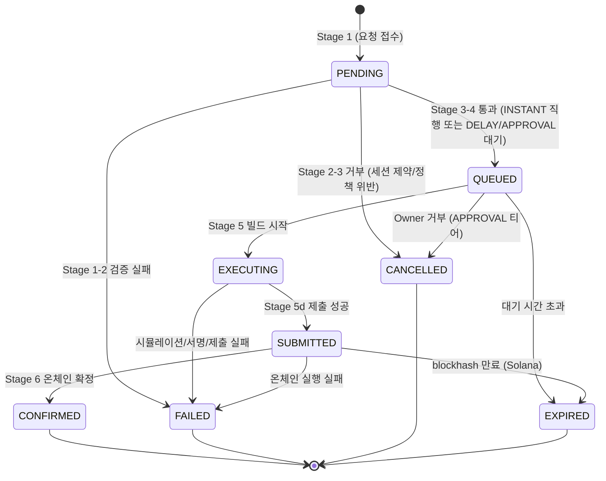
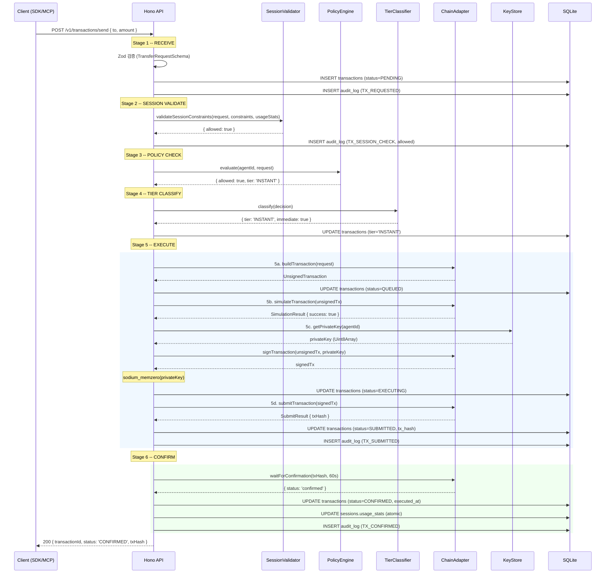
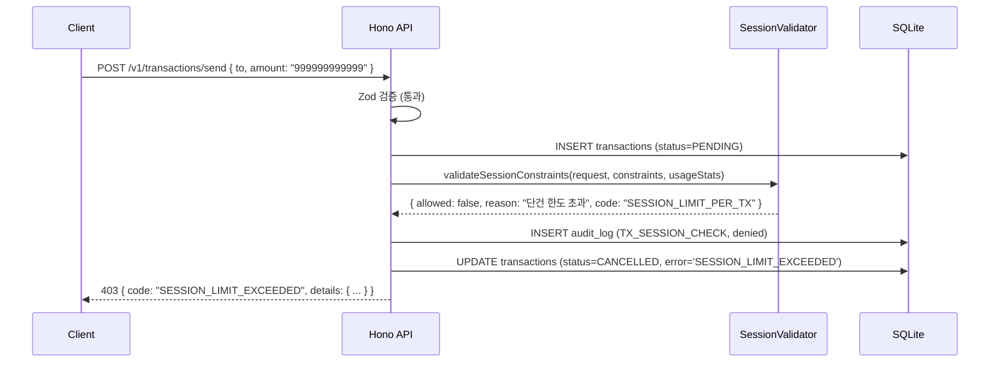
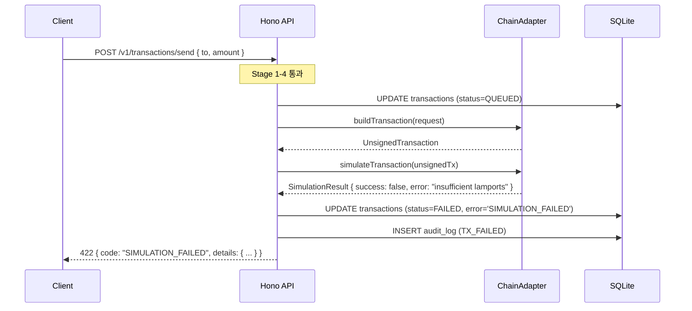

# 거래 처리 파이프라인 + API 엔드포인트 전체 스펙 (TX-PIPE)

**문서 ID:** TX-PIPE
**작성일:** 2026-02-05
**v0.6 업데이트:** 2026-02-08
**상태:** 완료
**참조:** SESS-PROTO (30-session-token-protocol.md), CHAIN-SOL (31-solana-adapter-detail.md), CORE-02 (25-sqlite-schema.md), CORE-04 (27-chain-adapter-interface.md), CORE-06 (29-api-framework-design.md), ENUM-MAP (45-enum-unified-mapping.md), CHAIN-EXT-01~08 (56~63)
**요구사항:** API-02 (지갑 엔드포인트), API-03 (세션 엔드포인트), API-04 (거래 엔드포인트)
**v0.6 통합:** INTEG-01 (5-type 분기, IPriceOracle 주입, actionSource 메타, type별 빌드)

---

## 1. 문서 개요

### 1.1 목적

AI 에이전트의 거래 요청이 온체인 확정까지 진행되는 **거래 처리 파이프라인 6단계**를 설계하고, CORE-06에서 정의한 Phase 7 엔드포인트 8개(#3~#10) + nonce 1개 = **총 9개 API 엔드포인트**를 Zod 요청/응답 스키마 수준으로 완전히 정의한다.

### 1.2 요구사항 매핑

| 요구사항 | 설명 | 충족 섹션 |
|---------|------|-----------|
| API-02 | 지갑 엔드포인트 (잔액/주소 조회) | 섹션 8 (GET /v1/wallet/balance, GET /v1/wallet/address) |
| API-03 | 세션 엔드포인트 (생성/조회/폐기) | 섹션 5~6 (nonce + POST/GET/DELETE /v1/sessions) |
| API-04 | 거래 엔드포인트 (전송/목록/대기) | 섹션 7 (POST /v1/transactions/send, GET /v1/transactions, GET /v1/transactions/pending) |

### 1.3 v0.1 -> v0.2 파이프라인 변경 요약

| 항목 | v0.1 (Cloud, 8단계) | v0.2 (Self-Hosted, 6단계) | 근거 |
|------|---------------------|--------------------------|------|
| 파이프라인 단계 수 | 8단계 | 6단계 | Enclave/Squads 제거로 간소화 |
| Stage 1 | API Gateway 수신 | Hono 라우트 수신 + Zod 검증 | 로컬 단일 프로세스 |
| Stage 2 | 인증 + 권한 확인 (OAuth 2.1) | 세션 제약 검증 (JWT + constraints) | SIWS/SIWE 세션 기반 |
| Stage 3 | 정책 엔진 (AWS-side) | 정책 엔진 (로컬, Phase 8) | 온체인 Squads 제거, 로컬 정책 |
| Stage 4 | Enclave 서명 (AWS KMS) | 보안 티어 분류 (Phase 8) | KMS -> 로컬 키스토어 |
| Stage 5 | Squads 멀티시그 | IChainAdapter 4단계 실행 | 멀티시그 제거, 직접 서명 |
| Stage 6 | 온체인 제출 (분리) | 온체인 확정 대기 | submit + confirm 통합 |
| Stage 7 | 확인 + 기록 | (Stage 6에 통합) | - |
| Stage 8 | 알림 (SQS/SNS) | (Phase 8 알림 시스템) | 로컬 알림 |

### 1.4 참조 문서 관계

```
┌──────────────────────────────────────────────────────────────┐
│  SESS-PROTO (30-session-token-protocol.md)                    │
│  세션 제약 모델, validateSessionConstraints(), usageStats     │
│  SessionConstraintsSchema, SessionUsageStatsSchema            │
└──────────────┬───────────────────────────────────────────────┘
               │ Stage 2 참조
               ▼
┌──────────────────────────────────────────────────────────────┐
│  TX-PIPE (32-transaction-pipeline-api.md) ◀── 이 문서         │
│  파이프라인 6단계 + API 9개 엔드포인트 전체 스펙               │
└──────────────┬───────────────────────────────────────────────┘
               │ Stage 5 참조
               ▼
┌──────────────────────────────────────────────────────────────┐
│  CHAIN-SOL (31-solana-adapter-detail.md)                      │
│  SolanaAdapter 13개 메서드, pipe 빌드, 4단계 tx               │
│  buildTransaction, simulateTransaction, signTransaction       │
│  submitTransaction, waitForConfirmation                       │
└──────────────────────────────────────────────────────────────┘

          참조                     참조                    참조
    ┌──────────┐            ┌──────────────┐       ┌──────────────┐
    │ CORE-02  │            │   CORE-04    │       │   CORE-06    │
    │ DB 스키마 │            │ IChainAdapter│       │ API 프레임워크│
    │ tx table │            │ 공통 타입     │       │ 에러/미들웨어 │
    └──────────┘            └──────────────┘       └──────────────┘
```

---

## 2. 트랜잭션 상태 머신

### 2.1 8개 상태 정의

CORE-02에서 정의한 transactions 테이블의 `status` 컬럼 값 8개:

| 상태 | 설명 | 진입 조건 | 최종 상태 |
|------|------|-----------|----------|
| `PENDING` | 요청 접수, 검증 전 | Stage 1 INSERT | X |
| `QUEUED` | 정책 통과, 실행 대기 | Stage 3~4 통과 (DELAY/APPROVAL 티어) | X |
| `EXECUTING` | 트랜잭션 빌드/서명 중 | Stage 5c 서명 완료 | X |
| `SUBMITTED` | 온체인 제출 완료 | Stage 5d 제출 성공 | X |
| `CONFIRMED` | 온체인 확정 | Stage 6 확인 성공 | O (terminal) |
| `FAILED` | 실패 (검증/시뮬/제출/온체인) | 각 단계 실패 시 | O (terminal) |
| `CANCELLED` | 정책 거부 또는 Owner 취소 | Stage 2~3 거부 또는 Owner 거부 | O (terminal) |
| `EXPIRED` | 대기 시간 또는 blockhash 만료 | Stage 4 대기 초과 또는 Stage 6 만료 | O (terminal) |

### 2.2 허용 전이 매트릭스



### 2.3 허용 전이 매트릭스 테이블

| From \ To | PENDING | QUEUED | EXECUTING | SUBMITTED | CONFIRMED | FAILED | CANCELLED | EXPIRED |
|-----------|---------|--------|-----------|-----------|-----------|--------|-----------|---------|
| PENDING | - | O | - | - | - | O | O | - |
| QUEUED | - | - | O | - | - | - | O | O |
| EXECUTING | - | - | - | O | - | O | - | - |
| SUBMITTED | - | - | - | - | O | O | - | O |
| CONFIRMED | - | - | - | - | - | - | - | - |
| FAILED | - | - | - | - | - | - | - | - |
| CANCELLED | - | - | - | - | - | - | - | - |
| EXPIRED | - | - | - | - | - | - | - | - |

### 2.4 상태 전이 함수

비정상 전이를 애플리케이션 레벨에서 방지하는 전이 함수:

```typescript
// packages/daemon/src/domain/transaction-state.ts

/** 허용 전이 맵 */
const ALLOWED_TRANSITIONS: Record<string, string[]> = {
  PENDING:   ['QUEUED', 'FAILED', 'CANCELLED'],
  QUEUED:    ['EXECUTING', 'CANCELLED', 'EXPIRED'],
  EXECUTING: ['SUBMITTED', 'FAILED'],
  SUBMITTED: ['CONFIRMED', 'FAILED', 'EXPIRED'],
  // Terminal states -- 전이 불가
  CONFIRMED: [],
  FAILED:    [],
  CANCELLED: [],
  EXPIRED:   [],
}

/**
 * 상태 전이를 검증하고 실행한다.
 * 허용되지 않은 전이를 시도하면 에러를 던진다.
 *
 * @param currentStatus 현재 상태
 * @param nextStatus 다음 상태
 * @returns true (전이 허용)
 * @throws WaiaasError (전이 거부)
 */
function validateTransition(currentStatus: string, nextStatus: string): boolean {
  const allowed = ALLOWED_TRANSITIONS[currentStatus]
  if (!allowed || !allowed.includes(nextStatus)) {
    throw new WaiaasError(
      'INVALID_STATE_TRANSITION',
      `허용되지 않은 상태 전이: ${currentStatus} -> ${nextStatus}`,
      409,
      { currentStatus, nextStatus, allowedTransitions: allowed },
      false,
    )
  }
  return true
}
```

### 2.5 각 전이의 DB 갱신 + audit_log

| 전이 | DB UPDATE | audit_log eventType | severity |
|------|-----------|-------------------|----------|
| `PENDING -> QUEUED` | `SET status='QUEUED', tier=?, queued_at=now` | `TX_QUEUED` | info |
| `PENDING -> FAILED` | `SET status='FAILED', error=?` | `TX_FAILED` | warning |
| `PENDING -> CANCELLED` | `SET status='CANCELLED', error=?` | `TX_CANCELLED` | info |
| `QUEUED -> EXECUTING` | `SET status='EXECUTING'` | (Stage 5 진행 중, 로그 없음) | - |
| `QUEUED -> CANCELLED` | `SET status='CANCELLED', error='OWNER_REJECTED'` | `TX_CANCELLED` | info |
| `QUEUED -> EXPIRED` | `SET status='EXPIRED', error='QUEUE_TIMEOUT'` | `TX_FAILED` | warning |
| `EXECUTING -> SUBMITTED` | `SET status='SUBMITTED', tx_hash=?` | `TX_SUBMITTED` | info |
| `EXECUTING -> FAILED` | `SET status='FAILED', error=?` | `TX_FAILED` | warning |
| `SUBMITTED -> CONFIRMED` | `SET status='CONFIRMED', executed_at=now` | `TX_CONFIRMED` | info |
| `SUBMITTED -> FAILED` | `SET status='FAILED', error=?` | `TX_FAILED` | warning |
| `SUBMITTED -> EXPIRED` | `SET status='EXPIRED', error='BLOCKHASH_EXPIRED'` | `TX_FAILED` | warning |

---

## 3. 파이프라인 6단계 상세

### Stage 1 -- RECEIVE (요청 접수 + Zod 검증)

**역할:** POST /v1/transactions/send 요청을 수신하고, Zod 스키마로 검증한 뒤 transactions 테이블에 INSERT한다.

> **(v0.6 확장)** Stage 1에서 discriminatedUnion 5-type 분기를 수행한다. `type` 필드에 따라 TransferRequestSchema, TokenTransferRequestSchema, ContractCallRequestSchema, ApproveRequestSchema, BatchRequestSchema 중 하나로 파싱된다. SSoT: 45-enum-unified-mapping.md 섹션 2.3

| 항목 | 값 |
|------|-----|
| **입력** | HTTP POST body -- (v0.6 변경) discriminatedUnion 5-type 중 하나 |
| **처리** | Zod 파싱 (type 기반 분기) -> UUID v7 생성 -> transactions INSERT |
| **출력** | transactionId (UUID v7) |
| **DB 변경** | `INSERT INTO transactions (id, agent_id, session_id, chain, type, amount, to_address, status='PENDING', created_at)` |
| **에러** | `VALIDATION_ERROR` (400) -- Zod 검증 실패 |
| **audit_log** | `TX_REQUESTED` (info) |

```typescript
// Stage 1 pseudo-code
// (v0.6 변경) discriminatedUnion 5-type 분기
async function stageReceive(
  request: TransactionRequest,  // (v0.6) 5-type 유니온
  sessionContext: { sessionId: string; agentId: string; chain: string },
  db: DrizzleInstance,
): Promise<string> {
  const txId = generateUUIDv7()

  // (v0.6 추가) type 필드 기반 discriminatedUnion 파싱
  // Zod 스키마: z.discriminatedUnion('type', [
  //   TransferRequestSchema,        // type: 'TRANSFER'
  //   TokenTransferRequestSchema,    // type: 'TOKEN_TRANSFER'
  //   ContractCallRequestSchema,     // type: 'CONTRACT_CALL'
  //   ApproveRequestSchema,          // type: 'APPROVE'
  //   BatchRequestSchema,            // type: 'BATCH'
  // ])
  // SSoT: 45-enum-unified-mapping.md 섹션 2.3 TransactionType

  // 1. transactions INSERT (status=PENDING)
  // (v0.6 변경) type별 추가 컬럼 기록
  await db.insert(transactions).values({
    id: txId,
    agentId: sessionContext.agentId,
    sessionId: sessionContext.sessionId,
    chain: sessionContext.chain,
    type: request.type,       // (v0.6) 5개 TransactionType 중 하나
    amount: request.amount ?? '0',
    toAddress: request.to,
    status: 'PENDING',
    createdAt: new Date(),
    // (v0.6 추가) 감사 컬럼 -- 25-sqlite-schema.md 참조
    tokenMint: 'token' in request ? request.token : null,
    contractAddress: 'contractAddress' in request ? request.contractAddress : null,
    methodSelector: 'methodSelector' in request ? request.methodSelector : null,
    spenderAddress: 'spender' in request ? request.spender : null,
    // (v0.6 추가) Action Provider 메타데이터
    metadata: 'actionSource' in request
      ? JSON.stringify({ actionSource: request.actionSource })
      : null,
  })

  // 2. audit_log INSERT
  await insertAuditLog(db, {
    eventType: 'TX_REQUESTED',
    actor: `agent:${sessionContext.agentId}`,
    agentId: sessionContext.agentId,
    sessionId: sessionContext.sessionId,
    txId,
    details: { type: request.type, amount: request.amount, to: request.to },
    severity: 'info',
  })

  return txId
}
```

---

### Stage 2 -- SESSION VALIDATE (세션 제약 확인)

**역할:** 07-01 SESS-PROTO에서 정의한 `validateSessionConstraints()`를 호출하여 세션 제약 조건을 확인한다.

> **(v0.6 확장)** TransactionType 5개에 대응하는 세션 제약이 추가되었다. allowedContracts (CONTRACT_CALL 대상 제한), allowedSpenders (APPROVE 대상 제한), allowedTokens (TOKEN_TRANSFER 토큰 제한)가 세션 생성 시 설정 가능하다. 소스: 56 섹션 9.6, 58 섹션 7, 59 섹션 10

| 항목 | 값 |
|------|-----|
| **입력** | transactionId + 세션 제약 (`c.get('constraints')`) + 사용 통계 (`c.get('usageStats')`) |
| **처리** | SESS-PROTO `validateSessionConstraints()` 호출 |
| **성공** | 다음 단계로 진행 |
| **실패** | `status=CANCELLED`, `error='SESSION_LIMIT_EXCEEDED'` |
| **DB 변경** | 실패 시 `UPDATE transactions SET status='CANCELLED', error=? WHERE id=?` |
| **audit_log** | `TX_SESSION_CHECK` (info: 성공, warning: 실패) |

**검증 항목 5가지** (SESS-PROTO 섹션 5.3 참조):

1. **단건 한도 (maxAmountPerTx)** -- `BigInt(request.amount) > BigInt(constraints.maxAmountPerTx)` 이면 거부
2. **누적 한도 (maxTotalAmount)** -- `BigInt(usageStats.totalAmount) + BigInt(request.amount) > BigInt(constraints.maxTotalAmount)` 이면 거부
3. **거래 횟수 (maxTransactions)** -- `usageStats.totalTx >= constraints.maxTransactions` 이면 거부
4. **허용 작업 (allowedOperations)** -- `request.type`이 목록에 없으면 거부
5. **허용 주소 (allowedDestinations)** -- `request.to`가 목록에 없으면 거부

**(v0.6 추가) 검증 항목 3가지 추가** (CHAIN-EXT-01~04):

6. **허용 토큰 (allowedTokens)** -- TOKEN_TRANSFER 시 `request.token`이 목록에 없으면 거부 (56 섹션 9.6)
7. **허용 컨트랙트 (allowedContracts)** -- CONTRACT_CALL 시 `request.contractAddress`가 목록에 없으면 거부 (58 섹션 7)
8. **허용 Spender (allowedSpenders)** -- APPROVE 시 `request.spender`가 목록에 없으면 거부 (59 섹션 10)

```typescript
// Stage 2 pseudo-code
// (v0.6 변경) request 타입을 TransactionRequest 유니온으로 확장
async function stageSessionValidate(
  txId: string,
  request: TransactionRequest,  // (v0.6) 5-type 유니온
  constraints: SessionConstraints,
  usageStats: SessionUsageStats,
  db: DrizzleInstance,
): Promise<void> {
  const result = validateSessionConstraints(request, constraints, usageStats)

  // (v0.6 추가) type별 세션 제약 검증
  // TOKEN_TRANSFER: allowedTokens 검사
  if (result.allowed && request.type === 'TOKEN_TRANSFER' && constraints.allowedTokens?.length) {
    if (!constraints.allowedTokens.includes(request.token)) {
      result.allowed = false
      result.code = 'SESSION_TOKEN_NOT_ALLOWED'
      result.reason = `토큰 ${request.token}은 세션에서 허용되지 않습니다.`
    }
  }
  // CONTRACT_CALL: allowedContracts 검사
  if (result.allowed && request.type === 'CONTRACT_CALL' && constraints.allowedContracts?.length) {
    if (!constraints.allowedContracts.includes(request.contractAddress)) {
      result.allowed = false
      result.code = 'SESSION_CONTRACT_NOT_ALLOWED'
      result.reason = `컨트랙트 ${request.contractAddress}는 세션에서 허용되지 않습니다.`
    }
  }
  // APPROVE: allowedSpenders 검사
  if (result.allowed && request.type === 'APPROVE' && constraints.allowedSpenders?.length) {
    if (!constraints.allowedSpenders.includes(request.spender)) {
      result.allowed = false
      result.code = 'SESSION_SPENDER_NOT_ALLOWED'
      result.reason = `Spender ${request.spender}는 세션에서 허용되지 않습니다.`
    }
  }

  // audit_log INSERT (성공/실패 모두)
  await insertAuditLog(db, {
    eventType: 'TX_SESSION_CHECK',
    actor: `agent:${request.agentId}`,
    txId,
    details: { allowed: result.allowed, reason: result.reason, code: result.code },
    severity: result.allowed ? 'info' : 'warning',
  })

  if (!result.allowed) {
    // 상태 전이: PENDING -> CANCELLED
    validateTransition('PENDING', 'CANCELLED')
    await db.update(transactions)
      .set({ status: 'CANCELLED', error: result.code ?? 'SESSION_LIMIT_EXCEEDED' })
      .where(eq(transactions.id, txId))

    throw new PolicyError(
      'SESSION_LIMIT_EXCEEDED',
      result.reason ?? '세션 제약 조건을 초과했습니다.',
      { code: result.code, txId },
    )
  }
}
```

---

### Stage 3 -- POLICY CHECK (정책 엔진 평가)

> **Phase 8에서 상세화.** Phase 7에서는 인터페이스만 정의하고, 기본 동작은 passthrough (ALLOW + INSTANT).

> **(v0.6 확장)** DatabasePolicyEngine.evaluate()가 11단계 알고리즘으로 확장되었다. IPriceOracle을 주입받아 resolveEffectiveAmountUsd()로 USD 기준 티어를 결정한다. DENY 우선 원칙: Step 1~6에서 DENY 발생 시 즉시 반환. 배치 요청은 Phase A (개별 instruction) + Phase B (합산 금액) 2단계 평가를 수행한다. 상세: 33-time-lock-approval-mechanism.md 섹션 3, 61-price-oracle-spec.md 섹션 6

**역할:** 에이전트별/글로벌 정책 규칙을 평가하여 거래를 허용/거부하고 보안 티어를 결정한다.

| 항목 | 값 |
|------|-----|
| **입력** | transactionId + agentId + 거래 내용 (amount, to, type) + **(v0.6) IPriceOracle** |
| **처리** | `PolicyEngine.evaluate(request)` -> `PolicyDecision` -- **(v0.6) 11단계 알고리즘** |
| **Phase 7 기본 동작** | 정책 미설정 시 `ALLOW` + `INSTANT` 티어 (passthrough) |
| **실패** | `status=CANCELLED`, `error='POLICY_VIOLATION'` |
| **DB 변경** | 실패 시 `UPDATE transactions SET status='CANCELLED', error=? WHERE id=?` |
| **audit_log** | `POLICY_VIOLATION` (warning, 실패 시만) |

**Phase 8 확장점 인터페이스:**

```typescript
// packages/core/src/interfaces/policy-engine.ts

/** 정책 평가 결과 */
interface PolicyDecision {
  /** 허용 여부 */
  allowed: boolean

  /** 보안 티어 (ALLOW일 때만 유효) */
  tier: 'INSTANT' | 'NOTIFY' | 'DELAY' | 'APPROVAL'

  /** 거부 사유 (DENY일 때) */
  reason?: string

  /** 거부한 정책 ID (DENY일 때) */
  policyId?: string

  /** DELAY 티어의 지연 시간 (초) */
  delaySeconds?: number

  /** APPROVAL 티어의 승인 기한 (초) */
  approvalTimeoutSeconds?: number
}

/** 정책 엔진 인터페이스 */
interface IPolicyEngine {
  /**
   * 거래 요청을 평가한다.
   *
   * Phase 7 기본 구현: 항상 { allowed: true, tier: 'INSTANT' } 반환
   * Phase 8 구현: policies 테이블에서 규칙 로드 -> 순차 평가
   * (v0.6 변경) DatabasePolicyEngine: 11단계 알고리즘, IPriceOracle 주입
   *   - Step 1~6: DENY 우선 검사 (ALLOWED_TOKENS, CONTRACT_WHITELIST, METHOD_WHITELIST, APPROVED_SPENDERS, APPROVE_AMOUNT_LIMIT)
   *   - Step 7: 금액 기반 티어 결정 (resolveEffectiveAmountUsd -> maxTier(nativeTier, usdTier))
   *   - Step 8: APPROVE_TIER_OVERRIDE 적용
   *   - Step 9~10: DAILY_LIMIT, RATE_LIMIT
   *   - Step 11: 최종 PolicyDecision 반환
   *   상세: 33-time-lock-approval-mechanism.md 섹션 3
   *
   * @param agentId 에이전트 ID
   * @param request 거래 요청 정보 (v0.6: 5-type 유니온)
   * @returns 정책 결정 (ALLOW/DENY + 티어)
   */
  evaluate(agentId: string, request: {
    type: 'TRANSFER' | 'TOKEN_TRANSFER' | 'CONTRACT_CALL' | 'APPROVE' | 'BATCH'  // (v0.6 변경) 5-type
    amount: string
    to: string
    chain: string
    // (v0.6 추가) type별 추가 필드
    token?: string              // TOKEN_TRANSFER: 토큰 주소
    contractAddress?: string    // CONTRACT_CALL: 컨트랙트 주소
    methodSelector?: string     // CONTRACT_CALL: EVM 메서드 selector (4 bytes hex)
    spender?: string            // APPROVE: spender 주소
    instructions?: unknown[]    // BATCH: 개별 instruction 배열
  }): Promise<PolicyDecision>
}
```

**Phase 7 기본 구현:**

```typescript
// packages/daemon/src/domain/policy-engine.ts

class DefaultPolicyEngine implements IPolicyEngine {
  /** Phase 7: 모든 거래를 ALLOW + INSTANT로 통과 */
  async evaluate(): Promise<PolicyDecision> {
    return {
      allowed: true,
      tier: 'INSTANT',
    }
  }
}

// (v0.6) Phase 8 이후: DatabasePolicyEngine으로 대체
// 33-time-lock-approval-mechanism.md 참조
// class DatabasePolicyEngine implements IPolicyEngine {
//   constructor(
//     private db: DrizzleInstance,
//     private priceOracle: IPriceOracle,  // (v0.6 추가) 61-price-oracle-spec.md
//   ) {}
//   async evaluate(agentId, request): Promise<PolicyDecision> {
//     // 11단계 알고리즘 -- 33-time-lock 섹션 3 참조
//     // Step 7: resolveEffectiveAmountUsd(request, this.priceOracle)
//     //   -> maxTier(nativeTier, usdTier) 보수적 채택
//     //   -> stale 가격 시 INSTANT->NOTIFY 상향
//     //   -> +-50% 급변동 시 한 단계 상향
//   }
// }
```

---

### Stage 4 -- TIER CLASSIFY (보안 티어 분류)

> **Phase 8에서 상세화.** Phase 7에서는 4개 티어의 분기 로직만 정의하고, 기본 동작은 모든 거래를 INSTANT으로 분류한다.

> **(v0.6 확장)** CONTRACT_CALL은 기본 APPROVAL 티어 (화이트리스트 통과 시도 보수적). APPROVE는 APPROVE_TIER_OVERRIDE에 의해 티어가 독립 결정된다. BATCH는 개별 instruction 중 최고 티어가 배치 전체의 티어가 되며, All-or-Nothing: 하나라도 DENY면 전체 배치 DENY. 소스: 58 섹션 4, 59 섹션 10, 60 섹션 5

**역할:** Stage 3의 정책 결정(PolicyDecision)에 따라 거래를 4개 보안 티어로 분류하고, 각 티어별 실행 경로를 결정한다.

| 항목 | 값 |
|------|-----|
| **입력** | transactionId + PolicyDecision (tier 필드) |
| **처리** | 티어별 분기 로직 |
| **Phase 7 기본 동작** | 모든 거래를 `INSTANT`로 분류 |
| **DB 변경** | `UPDATE transactions SET tier=? WHERE id=?` |
| **audit_log** | (없음 -- Stage 3에서 기록) |

**4개 보안 티어 분기:**

| 티어 | 동작 | Phase 7 | Phase 8 |
|------|------|---------|---------|
| `INSTANT` | 즉시 실행, Stage 5로 직행 | 기본값 (모든 거래) | 소액/화이트리스트 |
| `NOTIFY` | 즉시 실행 + Owner 알림 | 미사용 | 중간 금액 |
| `DELAY` | 시간 지연 후 실행. `status=QUEUED`, `queued_at` 기록 | 미사용 | 대액/비정상 |
| `APPROVAL` | Owner 승인 대기. `status=QUEUED`, pending_approvals INSERT | 미사용 | 최대 금액/위험 |

```typescript
// Stage 4 pseudo-code
async function stageTierClassify(
  txId: string,
  decision: PolicyDecision,
  db: DrizzleInstance,
): Promise<{ tier: string; immediate: boolean }> {
  const tier = decision.tier

  // transactions UPDATE (tier 기록)
  await db.update(transactions)
    .set({ tier })
    .where(eq(transactions.id, txId))

  switch (tier) {
    case 'INSTANT':
    case 'NOTIFY':
      // 즉시 실행 (Stage 5로 직행)
      return { tier, immediate: true }

    case 'DELAY':
      // 시간 지연 대기 (Phase 8)
      validateTransition('PENDING', 'QUEUED')
      await db.update(transactions)
        .set({ status: 'QUEUED', queuedAt: new Date() })
        .where(eq(transactions.id, txId))
      return { tier, immediate: false }

    case 'APPROVAL':
      // Owner 승인 대기 (Phase 8)
      validateTransition('PENDING', 'QUEUED')
      await db.update(transactions)
        .set({ status: 'QUEUED', queuedAt: new Date() })
        .where(eq(transactions.id, txId))
      // pending_approvals INSERT는 Phase 8
      return { tier, immediate: false }

    default:
      throw new WaiaasError('INVALID_TIER', `알 수 없는 보안 티어: ${tier}`, 500)
  }
}
```

**INSTANT 티어의 상태 전이 경로:**
- `PENDING` -> (Stage 3-4 통과) -> `QUEUED` -> (즉시) -> `EXECUTING` -> `SUBMITTED` -> `CONFIRMED`
- Phase 7에서는 PENDING -> QUEUED 전이가 파이프라인 내부에서 순간적으로 발생한다.

**DELAY/APPROVAL 티어의 응답 모드:**
- HTTP 응답: `status=QUEUED` 상태로 **즉시 반환** (202 Accepted)
- 이후 실행은 백그라운드 워커 또는 Owner 승인 트리거 (Phase 8)
- 클라이언트는 `GET /v1/transactions/:id` 또는 `GET /v1/transactions/pending`으로 폴링

---

### Stage 5 -- EXECUTE (IChainAdapter 4단계 실행)

**역할:** CORE-04 IChainAdapter의 4단계 트랜잭션 메서드를 순차 호출하여 온체인 트랜잭션을 실행한다. CHAIN-SOL의 SolanaAdapter가 Solana 체인의 구체적 구현이다.

> **(v0.6 확장)** Stage 5a의 빌드 메서드가 TransactionType에 따라 분기된다. TRANSFER/TOKEN_TRANSFER -> `adapter.buildTransfer(request)`, CONTRACT_CALL -> `adapter.buildContractCall(request)`, APPROVE -> `adapter.buildApprove(request)`, BATCH -> `adapter.buildBatch(request)`. 27-chain-adapter-interface.md 섹션 4~7 참조

| 항목 | 값 |
|------|-----|
| **입력** | transactionId + **(v0.6 변경) TransactionRequest 5-type 유니온** + IChainAdapter + ILocalKeyStore |
| **처리** | **(v0.6 변경) type별 build** -> simulate -> sign -> submit (4단계) |
| **타임아웃** | Stage 5 전체 30초 (INSTANT 티어). blockhash ~60초 수명의 절반 |
| **DB 변경** | 단계별 갱신 (아래 상세) |
| **audit_log** | `TX_SUBMITTED` (info, 5d 성공 시) |

#### Stage 5a -- buildTransaction

```typescript
// 5a. 트랜잭션 빌드
// (v0.6 변경) type별 빌드 메서드 분기
// 27-chain-adapter-interface.md 섹션 4~7 참조
let unsignedTx: UnsignedTransaction

switch (request.type) {
  case 'TRANSFER':
  case 'TOKEN_TRANSFER':
    // buildTransfer()는 token 필드 존재 시 SPL/ERC-20 전송 분기
    // CHAIN-SOL: token 없으면 SOL SystemProgram.transfer
    //            token 있으면 getTransferCheckedInstruction (decimals 온체인 검증)
    unsignedTx = await adapter.buildTransfer({
      from: agent.publicKey,
      to: request.to,
      amount: BigInt(request.amount),
      token: 'token' in request ? request.token : undefined,
      memo: request.memo,
    })
    break

  case 'CONTRACT_CALL':
    // buildContractCall(): EVM calldata / Solana programId+data 기반 임의 컨트랙트 호출
    // 27-chain-adapter-interface.md 섹션 5
    unsignedTx = await adapter.buildContractCall({
      from: agent.publicKey,
      contractAddress: request.contractAddress,
      methodSelector: request.methodSelector,  // EVM: 4 bytes hex
      calldata: request.calldata,              // EVM: ABI-encoded
      value: request.value ? BigInt(request.value) : 0n,
      // Solana: programId + accounts + data
      programId: request.programId,
      accounts: request.accounts,
      data: request.data,
    })
    break

  case 'APPROVE':
    // buildApprove(): ERC-20 approve / SPL createApproveCheckedInstruction
    // 27-chain-adapter-interface.md 섹션 6
    unsignedTx = await adapter.buildApprove({
      from: agent.publicKey,
      token: request.token,
      spender: request.spender,
      amount: BigInt(request.amount),
    })
    break

  case 'BATCH':
    // buildBatch(): Solana 전용 다중 instruction VersionedTransaction
    // 27-chain-adapter-interface.md 섹션 7
    // EVM: BATCH_NOT_SUPPORTED (400) 반환
    unsignedTx = await adapter.buildBatch({
      from: agent.publicKey,
      instructions: request.instructions,  // InstructionRequest[]
    })
    break
}
// CHAIN-SOL: pipe(createTransactionMessage, setFeePayer, setLifetime, appendInstruction)

// INSTANT 티어: PENDING -> QUEUED (내부 전이)
validateTransition('PENDING', 'QUEUED')
await db.update(transactions)
  .set({ status: 'QUEUED', tier: decision.tier, queuedAt: new Date() })
  .where(eq(transactions.id, txId))
```

#### Stage 5b -- simulateTransaction

```typescript
// 5b. 시뮬레이션
const simResult = await adapter.simulateTransaction(unsignedTx)

if (!simResult.success) {
  // 상태 전이: QUEUED -> FAILED (INSTANT) 또는 별도 처리
  // 실제로는 EXECUTING으로 먼저 전이하지 않았으므로 QUEUED -> FAILED는 허용 전이에 없음
  // 따라서 시뮬 실패 시 PENDING -> FAILED로 직접 전이
  validateTransition('PENDING', 'FAILED')
  await db.update(transactions)
    .set({
      status: 'FAILED',
      error: `SIMULATION_FAILED: ${simResult.error}`,
      metadata: JSON.stringify({ simulationLogs: simResult.logs }),
    })
    .where(eq(transactions.id, txId))

  throw new ChainAdapterError(
    'SIMULATION_FAILED',
    simResult.error ?? '트랜잭션 시뮬레이션에 실패했습니다.',
    { txId, logs: simResult.logs },
  )
}

// CHAIN-SOL: CU 최적화 -- simulate 결과 CU * 1.2로 재설정
```

#### Stage 5c -- signTransaction

```typescript
// 5c. 서명
// 키스토어에서 개인키 복호화 (sodium guarded memory)
const privateKey = await keyStore.getPrivateKey(agentId)

try {
  const signedTx = await adapter.signTransaction(unsignedTx, privateKey)

  // 상태 전이: QUEUED -> EXECUTING
  validateTransition('QUEUED', 'EXECUTING')
  await db.update(transactions)
    .set({ status: 'EXECUTING' })
    .where(eq(transactions.id, txId))

  return signedTx
} finally {
  // 개인키 즉시 메모리 제거 (CORE-03)
  sodium_memzero(privateKey)
}
```

#### Stage 5d -- submitTransaction

```typescript
// 5d. 제출
const submitResult = await adapter.submitTransaction(signedTx)

// 상태 전이: EXECUTING -> SUBMITTED
validateTransition('EXECUTING', 'SUBMITTED')
await db.update(transactions)
  .set({ status: 'SUBMITTED', txHash: submitResult.txHash })
  .where(eq(transactions.id, txId))

// audit_log INSERT
await insertAuditLog(db, {
  eventType: 'TX_SUBMITTED',
  actor: `agent:${agentId}`,
  txId,
  details: { txHash: submitResult.txHash, chain: agent.chain },
  severity: 'info',
})
```

**DELAY/APPROVAL 티어의 Stage 5 재실행:**
- Owner 승인 후 Stage 5a부터 재실행한다 (새 blockhash 필요)
- 승인 시점의 blockhash를 사용해야 하므로 이전 빌드 결과 재사용 불가
- Phase 8에서 승인 트리거 -> Stage 5 재진입 로직 상세화

---

### Stage 6 -- CONFIRM (온체인 확정 대기)

**역할:** 트랜잭션이 온체인에서 확정될 때까지 대기하고, 성공/실패에 따라 최종 상태를 갱신한다.

| 항목 | 값 |
|------|-----|
| **입력** | txHash + adapter |
| **처리** | `adapter.waitForConfirmation(txHash, timeoutMs=60000)` |
| **성공** | `status=CONFIRMED`, `executed_at=now` |
| **실패** | `status=FAILED` 또는 `EXPIRED` |
| **DB 변경** | transactions UPDATE + sessions.usage_stats 갱신 (원자적) |
| **audit_log** | `TX_CONFIRMED` (info) 또는 `TX_FAILED` (warning) |

```typescript
// Stage 6 pseudo-code
async function stageConfirm(
  txId: string,
  txHash: string,
  request: TransferRequest,
  sessionId: string,
  adapter: IChainAdapter,
  db: DrizzleInstance,
  sqlite: Database.Database,
): Promise<void> {
  try {
    // CHAIN-SOL: 폴링 기반 확인 대기, 2초 간격, 60초 타임아웃
    const confirmResult = await adapter.waitForConfirmation(txHash, 60_000)

    if (confirmResult.status === 'confirmed' || confirmResult.status === 'finalized') {
      // 상태 전이: SUBMITTED -> CONFIRMED
      validateTransition('SUBMITTED', 'CONFIRMED')
      await db.update(transactions)
        .set({
          status: 'CONFIRMED',
          executedAt: new Date(),
          metadata: JSON.stringify({
            blockNumber: confirmResult.blockNumber?.toString(),
            fee: confirmResult.fee?.toString(),
          }),
        })
        .where(eq(transactions.id, txId))

      // usageStats 원자적 갱신 (SESS-PROTO 섹션 6.3 패턴)
      // better-sqlite3 transaction().immediate() 사용
      updateUsageStats(sqlite, sessionId, request.amount)

      // audit_log
      await insertAuditLog(db, {
        eventType: 'TX_CONFIRMED',
        actor: `agent:${request.agentId}`,
        txId,
        details: {
          txHash,
          fee: confirmResult.fee?.toString(),
          blockNumber: confirmResult.blockNumber?.toString(),
        },
        severity: 'info',
      })
    }
  } catch (err) {
    // 타임아웃 또는 온체인 실패
    const isExpired = (err as Error).message?.includes('expired')
      || (err as Error).message?.includes('blockhash')

    const nextStatus = isExpired ? 'EXPIRED' : 'FAILED'
    const errorCode = isExpired ? 'BLOCKHASH_EXPIRED' : 'ONCHAIN_FAILURE'

    validateTransition('SUBMITTED', nextStatus)
    await db.update(transactions)
      .set({ status: nextStatus, error: `${errorCode}: ${(err as Error).message}` })
      .where(eq(transactions.id, txId))

    await insertAuditLog(db, {
      eventType: 'TX_FAILED',
      actor: `agent:${request.agentId}`,
      txId,
      details: { txHash, error: (err as Error).message, errorCode },
      severity: 'warning',
    })

    throw err
  }
}
```

**usageStats 갱신 항목** (SESS-PROTO 섹션 6.3 참조):
- `totalTx += 1`
- `totalAmount += request.amount` (BigInt 문자열 덧셈)
- `lastTxAt = new Date().toISOString()`
- `better-sqlite3 transaction().immediate()` 내에서 원자적 수행

---

### 3.7 6단계 전체 시퀀스 다이어그램

#### 정상 플로우 (INSTANT 티어, 성공)



> **Note:** [v0.7 보완] INSTANT 플로우에서 Stage 6 CONFIRM이 30초 타임아웃이면 200 SUBMITTED 반환. 클라이언트는 GET /v1/transactions/:id로 폴링하여 최종 CONFIRMED 확인. 37-rest-api-complete-spec.md 섹션 6.3 HTTP 응답 Status 매트릭스 참조.

#### 실패 플로우 -- 세션 제약 위반



#### 실패 플로우 -- 시뮬레이션 실패



---

## 4. 파이프라인 오케스트레이터 설계

### 4.1 TransactionService 클래스

6단계를 순차 실행하는 오케스트레이터. 각 단계의 에러를 캐치하여 transactions 상태를 적절히 갱신한다.

```typescript
// packages/daemon/src/services/transaction-service.ts

interface TransactionResult {
  transactionId: string
  status: string
  tier?: string
  txHash?: string
  estimatedFee?: string
  createdAt: string
}

class TransactionService {
  constructor(
    private db: DrizzleInstance,
    private sqlite: Database.Database,
    private keyStore: ILocalKeyStore,
    private adapters: AdapterRegistry,
    private policyEngine: IPolicyEngine,
    private priceOracle?: IPriceOracle,  // (v0.6 추가) 61-price-oracle-spec.md
  ) {}

  /**
   * 거래 전송을 실행한다.
   * 파이프라인 6단계를 순차 실행하며, 각 단계의 에러를 적절히 처리한다.
   *
   * (v0.6 변경) request 타입이 TransactionRequest 5-type 유니온으로 확장.
   * type에 따라 Stage 2 세션 제약, Stage 3 정책 평가, Stage 5 빌드가 분기된다.
   *
   * @param request 전송 요청 (Zod 검증 완료) -- (v0.6) 5-type 유니온
   * @param session 세션 컨텍스트 (sessionAuth 미들웨어에서 주입)
   * @returns TransactionResult (INSTANT: CONFIRMED까지, DELAY/APPROVAL: QUEUED 즉시)
   */
  async executeTransaction(
    request: TransactionRequest,  // (v0.6 변경) TransferRequest -> TransactionRequest 유니온
    session: {
      sessionId: string
      agentId: string
      agent: AgentRecord
      constraints: SessionConstraints
      usageStats: SessionUsageStats
    },
  ): Promise<TransactionResult> {
    const startTime = Date.now()

    // Stage 1: RECEIVE
    const txId = await this.stageReceive(request, session)
    this.logTiming('Stage 1 (RECEIVE)', startTime)

    try {
      // Stage 2: SESSION VALIDATE
      const stage2Start = Date.now()
      await this.stageSessionValidate(txId, request, session.constraints, session.usageStats)
      this.logTiming('Stage 2 (SESSION_VALIDATE)', stage2Start)

      // Stage 3: POLICY CHECK
      // (v0.6 변경) 11단계 알고리즘, IPriceOracle 주입, 5-type 전달
      const stage3Start = Date.now()
      const decision = await this.policyEngine.evaluate(session.agentId, {
        type: request.type ?? 'TRANSFER',  // (v0.6) 5-type
        amount: request.amount,
        to: request.to,
        chain: session.agent.chain,
        // (v0.6 추가) type별 추가 필드
        ...('token' in request && { token: request.token }),
        ...('contractAddress' in request && { contractAddress: request.contractAddress }),
        ...('methodSelector' in request && { methodSelector: request.methodSelector }),
        ...('spender' in request && { spender: request.spender }),
        ...('instructions' in request && { instructions: request.instructions }),
      })
      this.logTiming('Stage 3 (POLICY_CHECK)', stage3Start)

      if (!decision.allowed) {
        validateTransition('PENDING', 'CANCELLED')
        await this.db.update(transactions)
          .set({ status: 'CANCELLED', error: 'POLICY_VIOLATION' })
          .where(eq(transactions.id, txId))

        await insertAuditLog(this.db, {
          eventType: 'POLICY_VIOLATION',
          actor: `agent:${session.agentId}`,
          txId,
          details: { reason: decision.reason, policyId: decision.policyId },
          severity: 'warning',
        })

        throw new PolicyError(
          'POLICY_VIOLATION',
          decision.reason ?? '정책에 의해 거래가 거부되었습니다.',
          { policyId: decision.policyId, txId },
        )
      }

      // Stage 4: TIER CLASSIFY
      const stage4Start = Date.now()
      const { tier, immediate } = await this.stageTierClassify(txId, decision)
      this.logTiming('Stage 4 (TIER_CLASSIFY)', stage4Start)

      if (!immediate) {
        // DELAY/APPROVAL 티어: QUEUED 상태로 즉시 응답
        return {
          transactionId: txId,
          status: 'QUEUED',
          tier,
          createdAt: new Date().toISOString(),
        }
      }

      // Stage 5: EXECUTE (INSTANT/NOTIFY 티어)
      const stage5Start = Date.now()
      const adapter = this.adapters.get(session.agent.chain, session.agent.network)
      const { txHash, estimatedFee } = await this.stageExecute(
        txId, request, session, adapter,
      )
      this.logTiming('Stage 5 (EXECUTE)', stage5Start)

      // Stage 6: CONFIRM (INSTANT 티어는 동기 대기)
      const stage6Start = Date.now()
      await this.stageConfirm(
        txId, txHash, request, session.sessionId, adapter,
      )
      this.logTiming('Stage 6 (CONFIRM)', stage6Start)

      this.logTiming('Total pipeline', startTime)

      return {
        transactionId: txId,
        status: 'CONFIRMED',
        tier,
        txHash,
        estimatedFee,
        createdAt: new Date().toISOString(),
      }
    } catch (err) {
      // 에러는 각 Stage에서 이미 DB 상태를 갱신함
      // 여기서는 상위로 전파만 수행
      throw err
    }
  }

  /** 단계별 타이밍 로그 (성능 프로파일링용) */
  private logTiming(stage: string, startTime: number): void {
    const duration = Date.now() - startTime
    logger.debug(`[Pipeline] ${stage}: ${duration}ms`)
  }
}
```

### 4.2 에러 복구 전략

| 실패 단계 | 상태 전이 | 복구 전략 | 재시도 |
|-----------|----------|-----------|--------|
| Stage 1 (Zod 실패) | INSERT 안됨 | 클라이언트 요청 수정 후 재시도 | X (요청 오류) |
| Stage 2 (세션 제약) | PENDING -> CANCELLED | 세션 재발급 또는 제약 범위 내 재요청 | X (정책) |
| Stage 3 (정책 거부) | PENDING -> CANCELLED | 정책 변경 후 재요청 (Phase 8) | X (정책) |
| Stage 5a (빌드 실패) | PENDING -> FAILED | 새 요청 필요 | X (데이터 오류) |
| Stage 5b (시뮬 실패) | PENDING -> FAILED | 잔액 확인 후 새 요청 | X (온체인 상태) |
| Stage 5c (서명 실패) | QUEUED -> FAILED | 키스토어 상태 확인 | X (시스템 오류) |
| Stage 5d (제출 실패) | EXECUTING -> FAILED | **1회 재시도** (네트워크 일시 오류 가능) | O (1회) |
| Stage 6 (확인 타임아웃) | SUBMITTED -> EXPIRED | 사용자가 새 요청 (blockhash 만료) | X (재요청 필요) |
| Stage 6 (온체인 실패) | SUBMITTED -> FAILED | 에러 원인 분석 후 재요청 | X (온체인 오류) |

**Stage 5d 재시도 로직:**

```typescript
// submitTransaction 1회 재시도
async function submitWithRetry(
  adapter: IChainAdapter,
  signedTx: Uint8Array,
): Promise<SubmitResult> {
  try {
    return await adapter.submitTransaction(signedTx)
  } catch (firstError) {
    // 네트워크 오류인 경우 1회 재시도 (500ms 대기)
    if (isRetryableError(firstError)) {
      await sleep(500)
      return await adapter.submitTransaction(signedTx)
    }
    throw firstError
  }
}

function isRetryableError(err: unknown): boolean {
  if (err instanceof ChainError) {
    return err.retryable
  }
  // 네트워크 에러 (timeout, connection refused 등)
  const message = (err as Error).message?.toLowerCase() ?? ''
  return message.includes('timeout')
    || message.includes('econnrefused')
    || message.includes('econnreset')
    || message.includes('fetch failed')
}
```

### 4.3 INSTANT 티어 타이밍 예산

INSTANT 티어의 전체 파이프라인은 동기 응답이며, 최대 30초 타임아웃을 갖는다.

| 단계 | 예상 소요 시간 | 비고 |
|------|--------------|------|
| Stage 1 (RECEIVE) | < 5ms | DB INSERT |
| Stage 2 (SESSION VALIDATE) | < 1ms | 인메모리 검증 |
| Stage 3 (POLICY CHECK) | < 5ms | DB 조회 + 평가 (Phase 7: 즉시 반환) |
| Stage 4 (TIER CLASSIFY) | < 1ms | 분기 로직 |
| Stage 5a (build) | ~200ms | RPC 호출 (blockhash 캐시 히트 시 < 5ms) |
| Stage 5b (simulate) | ~300ms | RPC 호출 |
| Stage 5c (sign) | < 10ms | 로컬 Ed25519 서명 |
| Stage 5d (submit) | ~500ms | RPC 호출 |
| Stage 6 (confirm) | 2~30초 | Solana: ~400ms~6s (confirmed), EVM: 12~15s |
| **합계 (INSTANT)** | **~3~31초** | 대부분 Stage 6 대기 시간 |

**INSTANT 티어 응답 모드:**
- 파이프라인 전체를 동기적으로 실행하고, CONFIRMED 상태가 될 때까지 HTTP 응답을 대기한다.
- 최대 30초 타임아웃. 타임아웃 시 SUBMITTED 상태로 응답하고, 클라이언트가 GET으로 폴링한다.

```typescript
// INSTANT 티어 타임아웃 처리
const INSTANT_TIMEOUT_MS = 30_000

const result = await Promise.race([
  transactionService.executeTransfer(request, session),
  sleep(INSTANT_TIMEOUT_MS).then(() => ({
    transactionId: txId,
    status: 'SUBMITTED',  // 타임아웃 시 현재 상태 반환 [v0.7 보완: 200 SUBMITTED 반환, 클라이언트 폴링 필요]
    tier: 'INSTANT',
    txHash,
    createdAt: new Date().toISOString(),
  })),
])
```

#### 4.3.1 파이프라인 결과 -> HTTP 응답 매핑 [v0.7 보완]

파이프라인 Stage 4 (Tier Classify)의 결과와 Stage 5-6 (Execute-Confirm)의 결과가 HTTP 응답으로 매핑되는 규칙:

| 파이프라인 결과 | HTTP Status | 응답 status | 조건 |
|--------------|------------|------------|------|
| Stage 4: tier=INSTANT/NOTIFY + Stage 6: CONFIRMED | 200 | CONFIRMED | 30초 내 온체인 확정 |
| Stage 4: tier=INSTANT/NOTIFY + Stage 5d: SUBMITTED (timeout) | 200 | SUBMITTED | 30초 내 미확정, 클라이언트 폴링 필요 |
| Stage 4: tier=DELAY | 202 | QUEUED | 즉시 반환, 쿨다운 대기 |
| Stage 4: tier=APPROVAL | 202 | QUEUED | 즉시 반환, Owner 승인 대기 |
| Stage 1-3: 실패 | 4xx | (에러) | 검증/정책 실패 |
| Stage 5: 실패 | 4xx/5xx | (에러) | 빌드/서명/제출 실패 |

이 매핑은 TransactionType에 무관하게 적용된다. 5개 TransactionType (TRANSFER, TOKEN_TRANSFER, CONTRACT_CALL, APPROVE, BATCH) 모두 동일 규칙.

> **핵심:** 200은 동기 완료(CONFIRMED 또는 SUBMITTED), 202는 비동기 대기열 진입(QUEUED). 타입별 차이는 응답의 `type` 필드로 구분하며 HTTP status에 영향 없음. 전체 HTTP 응답 Status 매트릭스는 37-rest-api-complete-spec.md 섹션 6.3 참조.

---

## 5. nonce API 엔드포인트

### GET /v1/auth/nonce

nonce를 생성하여 SIWS/SIWE 메시지 서명에 사용한다. 인증이 필요하지 않은 공개 엔드포인트이다.

| 항목 | 값 |
|------|-----|
| **Method** | `GET` |
| **Path** | `/v1/auth/nonce` |
| **인증** | None (공개) |
| **Tags** | `Auth` |
| **Rate Limit** | 전역 100 req/min (CORE-06) |
| **operationId** | `getNonce` |

**응답 Zod 스키마:**

```typescript
// packages/core/src/schemas/auth.ts
import { z } from '@hono/zod-openapi'

export const NonceResponseSchema = z.object({
  nonce: z.string().openapi({
    description: 'SIWS/SIWE 메시지 서명에 사용할 일회성 nonce (32 hex chars)',
    example: 'a1b2c3d4e5f67890a1b2c3d4e5f67890',
  }),
  expiresAt: z.string().datetime().openapi({
    description: 'nonce 만료 시각 (ISO 8601, TTL 5분)',
    example: '2026-02-05T10:36:25.000Z',
  }),
}).openapi('NonceResponse')
```

**createRoute 패턴:**

```typescript
const getNonceRoute = createRoute({
  method: 'get',
  path: '/v1/auth/nonce',
  tags: ['Auth'],
  summary: 'nonce 생성',
  description: 'SIWS/SIWE Owner 서명에 사용할 일회성 nonce를 생성합니다. TTL 5분.',
  operationId: 'getNonce',
  responses: {
    200: {
      content: { 'application/json': { schema: NonceResponseSchema } },
      description: 'nonce 생성 성공',
    },
  },
})
```

**응답 예시:**

```json
{
  "nonce": "a1b2c3d4e5f67890a1b2c3d4e5f67890",
  "expiresAt": "2026-02-05T10:36:25.000Z"
}
```

**참조:** SESS-PROTO 섹션 4 (nonce 관리)

---

## 6. 세션 API 엔드포인트 (CORE-06 #5~#7)

### 6.1 POST /v1/sessions -- 세션 생성

Owner가 SIWS/SIWE 서명으로 에이전트 세션을 생성한다. 세션 토큰(`wai_sess_...`)은 이 응답에서만 반환되며, 이후 조회 불가.

| 항목 | 값 |
|------|-----|
| **Method** | `POST` |
| **Path** | `/v1/sessions` |
| **인증** | Owner 서명 (요청 본문 내 signature 검증) |
| **Tags** | `Session` |
| **operationId** | `createSession` |
| **Rate Limit** | 전역 100 req/min |
| **참고** | sessionAuth 미들웨어 **제외** (SESS-PROTO 결정) |

**요청 Zod 스키마:**

```typescript
// packages/core/src/schemas/session.ts
import { z } from '@hono/zod-openapi'
import { SessionConstraintsSchema } from './session-constraints.js'

export const SessionCreateSchema = z.object({
  agentId: z.string().uuid().openapi({
    description: '대상 에이전트 ID (UUID v7)',
    example: '01950288-1a2b-3c4d-5e6f-abcdef012345',
  }),

  chain: z.enum(['solana', 'ethereum']).openapi({
    description: '체인 식별자',
    example: 'solana',
  }),

  ownerAddress: z.string().openapi({
    description: 'Owner 지갑 주소 (Solana: base58, EVM: 0x hex)',
    example: '7xKXtg2CW87d97TXJSDpbD5jBkheTqA83TZRuJosgAsU',
  }),

  signature: z.string().openapi({
    description: 'SIWS/SIWE 메시지 서명 (Solana: base58, EVM: hex)',
    example: '5eyJhbGciOiJFZERTQS...',
  }),

  message: z.string().openapi({
    description: '서명된 메시지 원문 (EIP-4361 포맷)',
    example: 'localhost:3100 wants you to sign in with your Solana account:...',
  }),

  constraints: SessionConstraintsSchema.optional().default({}).openapi({
    description: '세션 제약 조건 (미설정 시 기본값 적용)',
  }),
}).openapi('SessionCreate')

export type SessionCreate = z.infer<typeof SessionCreateSchema>
```

**응답 Zod 스키마:**

```typescript
export const SessionCreateResponseSchema = z.object({
  sessionId: z.string().uuid().openapi({
    description: '생성된 세션 ID (UUID v7)',
    example: '019502a8-7b3c-7d4e-8f5a-1234567890ab',
  }),

  token: z.string().openapi({
    description: '세션 토큰 (wai_sess_...). 이 응답에서만 반환되며 이후 조회 불가.',
    example: 'wai_sess_eyJhbGciOiJIUzI1NiIsInR5cCI6IkpXVCJ9...',
  }),

  expiresAt: z.string().datetime().openapi({
    description: '세션 만료 시각 (ISO 8601)',
    example: '2026-02-06T10:31:25.000Z',
  }),

  constraints: SessionConstraintsSchema.openapi({
    description: '적용된 세션 제약 조건',
  }),
}).openapi('SessionCreateResponse')

export type SessionCreateResponse = z.infer<typeof SessionCreateResponseSchema>
```

**createRoute 패턴:**

```typescript
const createSessionRoute = createRoute({
  method: 'post',
  path: '/v1/sessions',
  tags: ['Session'],
  summary: '세션 생성',
  description: 'Owner 지갑 서명(SIWS/SIWE)으로 에이전트 세션을 생성합니다.',
  operationId: 'createSession',
  request: {
    body: {
      content: { 'application/json': { schema: SessionCreateSchema } },
      required: true,
    },
  },
  responses: {
    201: {
      content: { 'application/json': { schema: SessionCreateResponseSchema } },
      description: '세션 생성 성공',
    },
    401: {
      content: { 'application/json': { schema: ErrorResponseSchema } },
      description: 'nonce 무효 또는 서명 검증 실패',
    },
    404: {
      content: { 'application/json': { schema: ErrorResponseSchema } },
      description: '에이전트를 찾을 수 없음',
    },
    409: {
      content: { 'application/json': { schema: ErrorResponseSchema } },
      description: '에이전트 정지 상태',
    },
  },
})
```

**에러 코드:**

| 코드 | HTTP | 상황 | retryable |
|------|------|------|-----------|
| `INVALID_NONCE` | 401 | nonce가 존재하지 않거나 만료/사용됨 | false |
| `OWNER_SIGNATURE_INVALID` | 401 | SIWS/SIWE 서명 검증 실패 | false |
| `AGENT_NOT_FOUND` | 404 | agentId에 해당하는 에이전트 없음 또는 소유권 불일치 | false |
| `AGENT_SUSPENDED` | 409 | 에이전트가 SUSPENDED 상태 | false |

**처리 플로우:** SESS-PROTO 섹션 3.2.4 SIWS 시퀀스 다이어그램 참조

---

### 6.2 GET /v1/sessions -- 세션 목록 조회

활성 세션 목록을 조회한다. Phase 7에서는 세션 토큰으로 접근하며, Phase 8에서 ownerAuth로 전환 예정.

| 항목 | 값 |
|------|-----|
| **Method** | `GET` |
| **Path** | `/v1/sessions` |
| **인증** | Session (Phase 7) / Owner (Phase 8 전환 예정) |
| **Tags** | `Session` |
| **operationId** | `listSessions` |

**쿼리 파라미터 Zod 스키마:**

```typescript
export const SessionListQuerySchema = z.object({
  agentId: z.string().uuid().optional().openapi({
    description: '에이전트 ID로 필터 (미설정 시 전체)',
  }),

  status: z.enum(['active', 'all']).optional().default('active').openapi({
    description: '세션 상태 필터 (active: 유효 세션만, all: 폐기/만료 포함)',
    example: 'active',
  }),

  limit: z.coerce.number().int().min(1).max(100).optional().default(20).openapi({
    description: '페이지 크기 (1~100, 기본 20)',
    example: 20,
  }),

  cursor: z.string().optional().openapi({
    description: '커서 기반 페이지네이션 (이전 응답의 nextCursor)',
  }),
}).openapi('SessionListQuery')
```

**응답 Zod 스키마:**

```typescript
export const SessionSummarySchema = z.object({
  id: z.string().uuid().openapi({ description: '세션 ID' }),
  agentId: z.string().uuid().openapi({ description: '에이전트 ID' }),
  agentName: z.string().openapi({ description: '에이전트 이름' }),
  constraints: SessionConstraintsSchema.openapi({ description: '세션 제약 조건' }),
  usageStats: SessionUsageStatsSchema.openapi({ description: '사용 통계' }),
  expiresAt: z.string().datetime().openapi({ description: '만료 시각' }),
  createdAt: z.string().datetime().openapi({ description: '생성 시각' }),
  revokedAt: z.string().datetime().optional().openapi({ description: '폐기 시각' }),
}).openapi('SessionSummary')

export const SessionListResponseSchema = z.object({
  sessions: z.array(SessionSummarySchema).openapi({
    description: '세션 목록',
  }),
  nextCursor: z.string().optional().openapi({
    description: '다음 페이지 커서 (마지막 페이지이면 미포함)',
  }),
}).openapi('SessionListResponse')
```

**createRoute 패턴:**

```typescript
const listSessionsRoute = createRoute({
  method: 'get',
  path: '/v1/sessions',
  tags: ['Session'],
  summary: '세션 목록 조회',
  description: '활성 세션 목록을 커서 기반 페이지네이션으로 조회합니다.',
  operationId: 'listSessions',
  security: [{ bearerAuth: [] }],
  request: {
    query: SessionListQuerySchema,
  },
  responses: {
    200: {
      content: { 'application/json': { schema: SessionListResponseSchema } },
      description: '세션 목록',
    },
    401: {
      content: { 'application/json': { schema: ErrorResponseSchema } },
      description: '인증 실패',
    },
  },
})
```

---

### 6.3 DELETE /v1/sessions/:id -- 세션 폐기

세션을 즉시 무효화(폐기)한다. 폐기된 세션의 토큰은 즉시 사용 불가능해진다.

| 항목 | 값 |
|------|-----|
| **Method** | `DELETE` |
| **Path** | `/v1/sessions/:id` |
| **인증** | Session (Phase 7) / Owner (Phase 8 전환 예정) |
| **Tags** | `Session` |
| **operationId** | `revokeSession` |

**경로 파라미터:**

```typescript
export const SessionIdParamSchema = z.object({
  id: z.string().uuid().openapi({
    description: '폐기할 세션 ID',
    param: { in: 'path', name: 'id' },
  }),
}).openapi('SessionIdParam')
```

**응답 Zod 스키마:**

```typescript
export const SessionRevokeResponseSchema = z.object({
  revoked: z.literal(true).openapi({
    description: '폐기 성공 여부',
  }),
  revokedAt: z.string().datetime().openapi({
    description: '폐기 시각 (ISO 8601)',
    example: '2026-02-05T10:30:00.000Z',
  }),
}).openapi('SessionRevokeResponse')
```

**createRoute 패턴:**

```typescript
const revokeSessionRoute = createRoute({
  method: 'delete',
  path: '/v1/sessions/{id}',
  tags: ['Session'],
  summary: '세션 폐기',
  description: '세션을 즉시 무효화합니다. 폐기된 세션의 토큰은 사용 불가합니다.',
  operationId: 'revokeSession',
  security: [{ bearerAuth: [] }],
  request: {
    params: SessionIdParamSchema,
  },
  responses: {
    200: {
      content: { 'application/json': { schema: SessionRevokeResponseSchema } },
      description: '세션 폐기 성공',
    },
    404: {
      content: { 'application/json': { schema: ErrorResponseSchema } },
      description: '세션을 찾을 수 없음',
    },
    409: {
      content: { 'application/json': { schema: ErrorResponseSchema } },
      description: '이미 폐기된 세션',
    },
  },
})
```

**에러 코드:**

| 코드 | HTTP | 상황 | retryable |
|------|------|------|-----------|
| `SESSION_NOT_FOUND` | 404 | 세션 ID에 해당하는 세션 없음 | false |
| `SESSION_ALREADY_REVOKED` | 409 | 이미 폐기된 세션 | false |

**처리:**

```typescript
// sessions UPDATE
await db.update(sessions)
  .set({ revokedAt: new Date() })
  .where(eq(sessions.id, sessionId))

// audit_log INSERT
await insertAuditLog(db, {
  eventType: 'SESSION_REVOKED',
  actor: `owner`,
  sessionId,
  details: { sessionId },
  severity: 'info',
})
```

---

## 7. 거래 API 엔드포인트 (CORE-06 #8~#10)

### 7.1 POST /v1/transactions/send -- 거래 전송

에이전트 세션으로 거래를 전송한다. 파이프라인 6단계를 실행하여 온체인 트랜잭션을 처리한다.

| 항목 | 값 |
|------|-----|
| **Method** | `POST` |
| **Path** | `/v1/transactions/send` |
| **인증** | Session (sessionAuth 미들웨어) |
| **Tags** | `Transaction` |
| **operationId** | `sendTransaction` |
| **응답 모드** | INSTANT: 동기 (CONFIRMED까지 대기, 최대 30초) / DELAY,APPROVAL: 비동기 (QUEUED 즉시 반환) |

**요청 Zod 스키마:**

```typescript
// packages/core/src/schemas/transaction.ts
import { z } from '@hono/zod-openapi'

export const TransferRequestSchema = z.object({
  to: z.string().min(1).openapi({
    description: '수신자 주소 (Solana: base58, EVM: 0x hex)',
    example: 'So11111111111111111111111111111112',
  }),

  amount: z.string().min(1).openapi({
    description: '전송 금액 (최소 단위: lamports/wei, 문자열)',
    example: '1000000000',
  }),

  type: z.enum(['TRANSFER', 'TOKEN_TRANSFER']).optional().default('TRANSFER').openapi({
    description: '거래 유형 (TRANSFER: 네이티브 토큰, TOKEN_TRANSFER: SPL/ERC20)',
    example: 'TRANSFER',
  }),

  tokenMint: z.string().optional().openapi({
    description: 'SPL/ERC20 토큰 주소 (type=TOKEN_TRANSFER 시 필수)',
  }),

  memo: z.string().max(200).optional().openapi({
    description: '메모 (최대 200자)',
    example: 'Payment for services',
  }),

  priority: z.enum(['low', 'medium', 'high']).optional().default('medium').openapi({
    description: '우선순위 (수수료 조정: low=최소, medium=중간, high=최대)',
    example: 'medium',
  }),
}).refine(
  (data) => {
    // TOKEN_TRANSFER 타입일 때 tokenMint 필수
    if (data.type === 'TOKEN_TRANSFER' && !data.tokenMint) {
      return false
    }
    return true
  },
  { message: 'type이 TOKEN_TRANSFER일 때 tokenMint는 필수입니다.', path: ['tokenMint'] },
).openapi('TransferRequest')

export type TransferRequest = z.infer<typeof TransferRequestSchema>
```

**응답 Zod 스키마:**

```typescript
const TransactionStatusEnum = z.enum([
  'PENDING', 'QUEUED', 'EXECUTING', 'SUBMITTED', 'CONFIRMED', 'FAILED', 'CANCELLED', 'EXPIRED',
])

const TierEnum = z.enum(['INSTANT', 'NOTIFY', 'DELAY', 'APPROVAL'])

export const TransactionResponseSchema = z.object({
  transactionId: z.string().uuid().openapi({
    description: '내부 트랜잭션 ID (UUID v7)',
    example: '019502c0-1a2b-3c4d-5e6f-abcdef012345',
  }),

  status: TransactionStatusEnum.openapi({
    description: '트랜잭션 상태 (8개 상태)',
    example: 'CONFIRMED',
  }),

  tier: TierEnum.optional().openapi({
    description: '보안 티어',
    example: 'INSTANT',
  }),

  txHash: z.string().optional().openapi({
    description: '온체인 트랜잭션 해시 (제출 후)',
    example: '5eyJhbGciOiJFZERTQS...',
  }),

  estimatedFee: z.string().optional().openapi({
    description: '추정 수수료 (최소 단위)',
    example: '5000',
  }),

  createdAt: z.string().datetime().openapi({
    description: '요청 시각 (ISO 8601)',
    example: '2026-02-05T10:31:25.000Z',
  }),
}).openapi('TransactionResponse')

export type TransactionResponse = z.infer<typeof TransactionResponseSchema>
```

**createRoute 패턴:**

```typescript
const sendTransactionRoute = createRoute({
  method: 'post',
  path: '/v1/transactions/send',
  tags: ['Transaction'],
  summary: '거래 전송',
  description: '에이전트 세션으로 온체인 거래를 전송합니다. INSTANT 티어는 확정까지 동기 대기(최대 30초), DELAY/APPROVAL 티어는 QUEUED 상태로 즉시 응답합니다.',
  operationId: 'sendTransaction',
  security: [{ bearerAuth: [] }],
  request: {
    body: {
      content: { 'application/json': { schema: TransferRequestSchema } },
      required: true,
    },
  },
  responses: {
    200: {
      content: { 'application/json': { schema: TransactionResponseSchema } },
      description: 'INSTANT 티어: 거래 확정 완료',
    },
    202: {
      content: { 'application/json': { schema: TransactionResponseSchema } },
      description: 'DELAY/APPROVAL 티어: 거래 대기 중 (QUEUED)',
    },
    400: {
      content: { 'application/json': { schema: ErrorResponseSchema } },
      description: '잔액 부족 또는 요청 검증 실패',
    },
    403: {
      content: { 'application/json': { schema: ErrorResponseSchema } },
      description: '세션 제약 초과 또는 정책 위반',
    },
    422: {
      content: { 'application/json': { schema: ErrorResponseSchema } },
      description: '시뮬레이션 실패',
    },
  },
})
```

**에러 코드:**

| 코드 | HTTP | 상황 | retryable |
|------|------|------|-----------|
| `VALIDATION_ERROR` | 400 | Zod 검증 실패 (필수 필드 누락, 형식 오류) | false |
| `INSUFFICIENT_BALANCE` | 400 | 잔액 부족 (시뮬레이션에서 감지) | false |
| `SESSION_LIMIT_EXCEEDED` | 403 | 세션 제약 조건 초과 (단건/누적 한도, 횟수, 주소) | false |
| `POLICY_VIOLATION` | 403 | 정책 엔진에 의해 거부 (Phase 8) | false |
| `SIMULATION_FAILED` | 422 | 트랜잭션 시뮬레이션 실패 (온체인 상태 문제) | false |
| `ADAPTER_NOT_AVAILABLE` | 503 | 해당 체인 어댑터 미초기화 | true |
| `KEYSTORE_LOCKED` | 503 | 키스토어 잠김 상태 | true |

---

### 7.2 GET /v1/transactions -- 거래 목록 조회

에이전트의 거래 이력을 커서 기반 페이지네이션으로 조회한다.

| 항목 | 값 |
|------|-----|
| **Method** | `GET` |
| **Path** | `/v1/transactions` |
| **인증** | Session (sessionAuth 미들웨어) |
| **Tags** | `Transaction` |
| **operationId** | `listTransactions` |

**쿼리 파라미터 Zod 스키마:**

```typescript
export const TransactionListQuerySchema = z.object({
  status: TransactionStatusEnum.optional().openapi({
    description: '상태 필터 (미설정 시 전체)',
  }),

  limit: z.coerce.number().int().min(1).max(100).optional().default(20).openapi({
    description: '페이지 크기 (1~100, 기본 20)',
    example: 20,
  }),

  cursor: z.string().optional().openapi({
    description: '커서 기반 페이지네이션 (이전 응답의 nextCursor, UUID v7 = 시간순)',
  }),

  order: z.enum(['asc', 'desc']).optional().default('desc').openapi({
    description: '정렬 순서 (기본: desc, 최신순)',
    example: 'desc',
  }),
}).openapi('TransactionListQuery')
```

**응답 Zod 스키마:**

```typescript
export const TransactionSummarySchema = z.object({
  id: z.string().uuid().openapi({ description: '트랜잭션 ID' }),
  type: z.string().openapi({ description: '거래 유형' }),
  status: TransactionStatusEnum.openapi({ description: '상태' }),
  tier: TierEnum.optional().openapi({ description: '보안 티어' }),
  amount: z.string().optional().openapi({ description: '금액 (최소 단위)' }),
  toAddress: z.string().optional().openapi({ description: '수신자 주소' }),
  txHash: z.string().optional().openapi({ description: '온체인 해시' }),
  createdAt: z.string().datetime().openapi({ description: '요청 시각' }),
  executedAt: z.string().datetime().optional().openapi({ description: '완료 시각' }),
  error: z.string().optional().openapi({ description: '에러 메시지 (실패 시)' }),
}).openapi('TransactionSummary')

export const TransactionListResponseSchema = z.object({
  transactions: z.array(TransactionSummarySchema).openapi({
    description: '거래 목록',
  }),
  nextCursor: z.string().optional().openapi({
    description: '다음 페이지 커서 (마지막 페이지이면 미포함)',
  }),
  total: z.number().int().optional().openapi({
    description: '전체 거래 수 (첫 페이지에만 포함)',
  }),
}).openapi('TransactionListResponse')
```

**createRoute 패턴:**

```typescript
const listTransactionsRoute = createRoute({
  method: 'get',
  path: '/v1/transactions',
  tags: ['Transaction'],
  summary: '거래 목록 조회',
  description: '에이전트의 거래 이력을 커서 기반 페이지네이션으로 조회합니다.',
  operationId: 'listTransactions',
  security: [{ bearerAuth: [] }],
  request: {
    query: TransactionListQuerySchema,
  },
  responses: {
    200: {
      content: { 'application/json': { schema: TransactionListResponseSchema } },
      description: '거래 목록',
    },
    401: {
      content: { 'application/json': { schema: ErrorResponseSchema } },
      description: '인증 실패',
    },
  },
})
```

**커서 기반 페이지네이션 쿼리 패턴:**

UUID v7은 시간 순서가 내장되어 있으므로 커서로 직접 사용 가능하다.

```sql
-- desc 정렬 (기본: 최신순)
SELECT * FROM transactions
WHERE agent_id = ?
  AND (? IS NULL OR status = ?)              -- status 필터
  AND (? IS NULL OR id < ?)                  -- cursor 조건 (desc)
ORDER BY id DESC
LIMIT ?
```

```typescript
// 커서 기반 페이지네이션 구현
async function listTransactions(
  db: DrizzleInstance,
  agentId: string,
  query: TransactionListQuery,
): Promise<TransactionListResponse> {
  const conditions = [eq(transactions.agentId, agentId)]

  if (query.status) {
    conditions.push(eq(transactions.status, query.status))
  }

  if (query.cursor) {
    if (query.order === 'desc') {
      conditions.push(lt(transactions.id, query.cursor))
    } else {
      conditions.push(gt(transactions.id, query.cursor))
    }
  }

  const rows = await db.select()
    .from(transactions)
    .where(and(...conditions))
    .orderBy(query.order === 'desc' ? desc(transactions.id) : asc(transactions.id))
    .limit(query.limit + 1)  // +1로 다음 페이지 존재 여부 확인

  const hasMore = rows.length > query.limit
  const items = hasMore ? rows.slice(0, query.limit) : rows

  return {
    transactions: items.map(toTransactionSummary),
    nextCursor: hasMore ? items[items.length - 1].id : undefined,
  }
}
```

---

### 7.3 GET /v1/transactions/pending -- 대기 중 거래 조회

DELAY/APPROVAL 티어로 대기 중인 거래를 조회한다. Phase 7 기본 동작은 빈 배열 반환 (모든 거래가 INSTANT이므로).

| 항목 | 값 |
|------|-----|
| **Method** | `GET` |
| **Path** | `/v1/transactions/pending` |
| **인증** | Session (sessionAuth 미들웨어) |
| **Tags** | `Transaction` |
| **operationId** | `listPendingTransactions` |

**응답 Zod 스키마:**

```typescript
export const PendingTransactionSummarySchema = z.object({
  id: z.string().uuid().openapi({ description: '트랜잭션 ID' }),
  type: z.string().openapi({ description: '거래 유형' }),
  amount: z.string().optional().openapi({ description: '금액 (최소 단위)' }),
  toAddress: z.string().optional().openapi({ description: '수신자 주소' }),
  tier: TierEnum.openapi({ description: '보안 티어 (DELAY 또는 APPROVAL)' }),
  queuedAt: z.string().datetime().openapi({ description: '큐 진입 시각' }),
  expiresAt: z.string().datetime().optional().openapi({ description: '승인 기한 (APPROVAL 티어)' }),
  status: z.literal('QUEUED').openapi({ description: '상태 (항상 QUEUED)' }),
}).openapi('PendingTransactionSummary')

export const PendingTransactionListResponseSchema = z.object({
  transactions: z.array(PendingTransactionSummarySchema).openapi({
    description: '대기 중 거래 목록',
  }),
}).openapi('PendingTransactionListResponse')
```

**createRoute 패턴:**

```typescript
const listPendingTransactionsRoute = createRoute({
  method: 'get',
  path: '/v1/transactions/pending',
  tags: ['Transaction'],
  summary: '대기 중 거래 조회',
  description: 'DELAY/APPROVAL 티어로 대기 중인 거래 목록을 조회합니다. Phase 7에서는 모든 거래가 INSTANT이므로 빈 배열을 반환합니다.',
  operationId: 'listPendingTransactions',
  security: [{ bearerAuth: [] }],
  responses: {
    200: {
      content: { 'application/json': { schema: PendingTransactionListResponseSchema } },
      description: '대기 중 거래 목록',
    },
    401: {
      content: { 'application/json': { schema: ErrorResponseSchema } },
      description: '인증 실패',
    },
  },
})
```

**Phase 7 기본 동작:**

```typescript
// Phase 7: INSTANT만 사용하므로 QUEUED 상태 거래 없음
app.openapi(listPendingTransactionsRoute, async (c) => {
  const agentId = c.get('agentId')!

  const pending = await db.select()
    .from(transactions)
    .where(
      and(
        eq(transactions.agentId, agentId),
        eq(transactions.status, 'QUEUED'),
        inArray(transactions.tier, ['DELAY', 'APPROVAL']),
      ),
    )
    .orderBy(desc(transactions.queuedAt))

  return c.json({
    transactions: pending.map(toPendingTransactionSummary),
  }, 200)
})
```

---

## 8. 지갑 API 엔드포인트 (CORE-06 #3~#4)

### 8.1 GET /v1/wallet/balance -- 잔액 조회

현재 에이전트의 지갑 잔액을 조회한다.

| 항목 | 값 |
|------|-----|
| **Method** | `GET` |
| **Path** | `/v1/wallet/balance` |
| **인증** | Session (sessionAuth 미들웨어) |
| **Tags** | `Wallet` |
| **operationId** | `getBalance` |

**응답 Zod 스키마:**

```typescript
// packages/core/src/schemas/wallet.ts
import { z } from '@hono/zod-openapi'

export const BalanceResponseSchema = z.object({
  balance: z.string().openapi({
    description: '잔액 (최소 단위: lamports/wei)',
    example: '1500000000',
  }),

  decimals: z.number().int().openapi({
    description: '소수점 자릿수 (SOL=9, ETH=18)',
    example: 9,
  }),

  symbol: z.string().openapi({
    description: '토큰 심볼',
    example: 'SOL',
  }),

  formatted: z.string().openapi({
    description: '사람이 읽기 좋은 포맷',
    example: '1.5 SOL',
  }),

  chain: z.string().openapi({
    description: '체인 식별자',
    example: 'solana',
  }),

  network: z.string().openapi({
    description: '네트워크 식별자',
    example: 'mainnet-beta',
  }),
}).openapi('BalanceResponse')

export type BalanceResponse = z.infer<typeof BalanceResponseSchema>
```

**createRoute 패턴:**

```typescript
const getBalanceRoute = createRoute({
  method: 'get',
  path: '/v1/wallet/balance',
  tags: ['Wallet'],
  summary: '지갑 잔액 조회',
  description: '현재 에이전트의 지갑 잔액을 조회합니다.',
  operationId: 'getBalance',
  security: [{ bearerAuth: [] }],
  responses: {
    200: {
      content: { 'application/json': { schema: BalanceResponseSchema } },
      description: '잔액 정보',
    },
    401: {
      content: { 'application/json': { schema: ErrorResponseSchema } },
      description: '인증 실패',
    },
    503: {
      content: { 'application/json': { schema: ErrorResponseSchema } },
      description: '어댑터 불가',
    },
  },
})
```

**처리:**

```typescript
app.openapi(getBalanceRoute, async (c) => {
  const agentId = c.get('agentId')!
  const adapters = c.get('adapters')
  const db = c.get('db')

  // 1. agent 조회
  const agent = await getAgent(db, agentId)

  // 2. AdapterRegistry에서 어댑터 조회
  const adapter = adapters.get(agent.chain, agent.network)
  if (!adapter) {
    throw new ChainAdapterError('ADAPTER_NOT_AVAILABLE', `${agent.chain}/${agent.network} 어댑터를 사용할 수 없습니다.`)
  }

  // 3. 온체인 잔액 조회
  const balanceInfo = await adapter.getBalance(agent.publicKey)

  // 4. formatted 계산
  const divisor = BigInt(10 ** balanceInfo.decimals)
  const whole = BigInt(balanceInfo.amount) / divisor
  const fraction = BigInt(balanceInfo.amount) % divisor
  const formatted = `${whole}.${fraction.toString().padStart(balanceInfo.decimals, '0').replace(/0+$/, '')} ${balanceInfo.symbol}`

  return c.json({
    balance: balanceInfo.amount,
    decimals: balanceInfo.decimals,
    symbol: balanceInfo.symbol,
    formatted,
    chain: agent.chain,
    network: agent.network,
  }, 200)
})
```

**에러 코드:**

| 코드 | HTTP | 상황 | retryable |
|------|------|------|-----------|
| `ADAPTER_NOT_AVAILABLE` | 503 | 해당 체인/네트워크 어댑터 미초기화 | true |
| `ADAPTER_RPC_ERROR` | 502 | RPC 노드 연결/응답 오류 | true |

---

### 8.2 GET /v1/wallet/address -- 주소 조회

현재 에이전트의 지갑 공개키(주소)를 조회한다. 온체인 조회가 필요 없으며, agents 테이블에서 직접 반환한다.

| 항목 | 값 |
|------|-----|
| **Method** | `GET` |
| **Path** | `/v1/wallet/address` |
| **인증** | Session (sessionAuth 미들웨어) |
| **Tags** | `Wallet` |
| **operationId** | `getAddress` |

**응답 Zod 스키마:**

```typescript
export const AddressResponseSchema = z.object({
  address: z.string().openapi({
    description: '에이전트 지갑 공개키',
    example: '7xKXtg2CW87d97TXJSDpbD5jBkheTqA83TZRuJosgAsU',
  }),

  chain: z.string().openapi({
    description: '체인 식별자',
    example: 'solana',
  }),

  network: z.string().openapi({
    description: '네트워크 식별자',
    example: 'mainnet-beta',
  }),

  encoding: z.enum(['base58', 'hex']).openapi({
    description: '주소 인코딩 방식 (Solana: base58, EVM: hex)',
    example: 'base58',
  }),
}).openapi('AddressResponse')

export type AddressResponse = z.infer<typeof AddressResponseSchema>
```

**createRoute 패턴:**

```typescript
const getAddressRoute = createRoute({
  method: 'get',
  path: '/v1/wallet/address',
  tags: ['Wallet'],
  summary: '지갑 주소 조회',
  description: '현재 에이전트의 지갑 공개키(주소)를 조회합니다. 온체인 조회 없이 DB에서 반환합니다.',
  operationId: 'getAddress',
  security: [{ bearerAuth: [] }],
  responses: {
    200: {
      content: { 'application/json': { schema: AddressResponseSchema } },
      description: '주소 정보',
    },
    401: {
      content: { 'application/json': { schema: ErrorResponseSchema } },
      description: '인증 실패',
    },
  },
})
```

**처리:**

```typescript
app.openapi(getAddressRoute, async (c) => {
  const agentId = c.get('agentId')!
  const db = c.get('db')

  // agents 테이블에서 publicKey 조회 (온체인 조회 불필요)
  const agent = await getAgent(db, agentId)

  // 체인별 인코딩 결정
  const encoding = agent.chain === 'solana' ? 'base58' : 'hex'

  return c.json({
    address: agent.publicKey,
    chain: agent.chain,
    network: agent.network,
    encoding,
  }, 200)
})
```

---

## 9. 공통 패턴

### 9.1 OpenAPIHono createRoute 패턴

모든 엔드포인트는 CORE-06의 Zod SSoT 패턴을 따른다:

```
Zod Schema (packages/core/src/schemas/)
  |
  +-- z.infer<typeof Schema>  --> TypeScript Type
  |
  +-- .openapi() 메타데이터   --> OpenAPI 3.0 JSON (/doc)
  |
  +-- createRoute() 라우트    --> 런타임 검증 (Hono 미들웨어)
  |
  +-- app.openapi(route, handler)  --> 핸들러 등록
```

### 9.2 인증 레벨별 미들웨어 적용

| 인증 레벨 | 엔드포인트 | 미들웨어 | Phase 7 동작 |
|-----------|-----------|----------|-------------|
| None (공개) | `GET /health`, `GET /doc`, `GET /v1/auth/nonce` | sessionAuth 제외 | 인증 없이 접근 |
| Session | `GET /v1/wallet/*`, `POST /v1/transactions/send`, `GET /v1/transactions/*` | sessionAuth 자동 적용 (`/v1/*`) | JWT 검증 + DB 세션 확인 |
| Owner | `POST /v1/sessions`, `GET /v1/sessions`, `DELETE /v1/sessions/:id` | Phase 7: 요청 본문 서명 검증 / Phase 8: ownerAuth 미들웨어로 전환 | SIWS/SIWE 서명 검증 |

**sessionAuth 제외 경로 설정:**

```typescript
// packages/daemon/src/server/middleware/session-auth.ts
// sessionAuth는 /v1/* 전체에 적용되되, 특정 경로를 제외한다

const PUBLIC_PATHS = new Set([
  '/v1/auth/nonce',  // nonce 조회는 인증 불필요
])

// POST /v1/sessions는 sessionAuth 미적용
// -> 별도 라우트 그룹에서 Owner 서명 검증

export function sessionAuthMiddleware(db: DrizzleInstance) {
  return createMiddleware(async (c, next) => {
    // 공개 경로 제외
    if (PUBLIC_PATHS.has(c.req.path)) {
      return next()
    }

    // POST /v1/sessions 제외 (Owner 서명 인증)
    if (c.req.path === '/v1/sessions' && c.req.method === 'POST') {
      return next()
    }

    // 세션 토큰 검증 (SESS-PROTO 2단계 검증)
    // ...
    await next()
  })
}
```

### 9.3 커서 기반 페이지네이션 공통 헬퍼

UUID v7의 시간 순서를 활용한 공통 페이지네이션 헬퍼:

```typescript
// packages/daemon/src/infrastructure/pagination.ts

interface PaginationParams {
  cursor?: string
  limit: number
  order: 'asc' | 'desc'
}

interface PaginatedResult<T> {
  items: T[]
  nextCursor?: string
}

/**
 * UUID v7 기반 커서 페이지네이션 쿼리를 구성한다.
 *
 * UUID v7은 시간순 정렬이 보장되므로 WHERE id < cursor (desc) 또는
 * WHERE id > cursor (asc) 조건으로 효율적인 페이지네이션이 가능하다.
 *
 * @param rows 쿼리 결과 (limit + 1개 조회)
 * @param limit 페이지 크기
 * @returns items + nextCursor
 */
function paginate<T extends { id: string }>(
  rows: T[],
  limit: number,
): PaginatedResult<T> {
  const hasMore = rows.length > limit
  const items = hasMore ? rows.slice(0, limit) : rows

  return {
    items,
    nextCursor: hasMore ? items[items.length - 1].id : undefined,
  }
}
```

### 9.4 에러 응답 공통 팩토리

CORE-06 에러 포맷(`ErrorResponseSchema`)을 준수하는 에러 팩토리:

```typescript
// packages/daemon/src/server/error-factory.ts

function createErrorResponse(
  code: string,
  message: string,
  requestId: string,
  options?: {
    details?: Record<string, unknown>
    retryable?: boolean
  },
) {
  return {
    error: {
      code,
      message,
      requestId,
      ...(options?.details && { details: options.details }),
      ...(options?.retryable !== undefined && { retryable: options.retryable }),
    },
  }
}

// 사용 예시
return c.json(createErrorResponse(
  'SESSION_LIMIT_EXCEEDED',
  '세션 제약 조건을 초과했습니다.',
  c.get('requestId'),
  {
    details: { code: 'SESSION_LIMIT_PER_TX', maxAmount: constraints.maxAmountPerTx, requestedAmount: request.amount },
    retryable: false,
  },
), 403)
```

### 9.5 엔드포인트 전체 요약

| # | Method | Path | 인증 | 섹션 | operationId | Tags |
|---|--------|------|------|------|-------------|------|
| 1 | GET | `/v1/auth/nonce` | None | 5 | `getNonce` | Auth |
| 2 | POST | `/v1/sessions` | Owner | 6.1 | `createSession` | Session |
| 3 | GET | `/v1/sessions` | Session/Owner | 6.2 | `listSessions` | Session |
| 4 | DELETE | `/v1/sessions/:id` | Session/Owner | 6.3 | `revokeSession` | Session |
| 5 | POST | `/v1/transactions/send` | Session | 7.1 | `sendTransaction` | Transaction |
| 6 | GET | `/v1/transactions` | Session | 7.2 | `listTransactions` | Transaction |
| 7 | GET | `/v1/transactions/pending` | Session | 7.3 | `listPendingTransactions` | Transaction |
| 8 | GET | `/v1/wallet/balance` | Session | 8.1 | `getBalance` | Wallet |
| 9 | GET | `/v1/wallet/address` | Session | 8.2 | `getAddress` | Wallet |

---

## 10. v0.6 파이프라인 확장 요약 (v0.6 추가)

v0.6 블록체인 기능 확장에 의해 파이프라인 6단계의 각 Stage에 다음 변경이 적용되었다. 기존 6단계 구조는 유지되며, 새 기능은 기존 위에 적층된다.

### 10.1 Stage별 v0.6 변경 요약

| Stage | v0.2 (기존) | v0.6 (확장) | 소스 |
|-------|-------------|-------------|------|
| Stage 1 (RECEIVE) | TransferRequest 단일 Zod | discriminatedUnion 5-type 파싱 (TRANSFER, TOKEN_TRANSFER, CONTRACT_CALL, APPROVE, BATCH). 감사 컬럼 4개 + actionSource 메타 기록 | 45-enum 2.3 |
| Stage 2 (SESSION) | 5가지 제약 검증 | +3가지: allowedTokens, allowedContracts, allowedSpenders | 56, 58, 59 |
| Stage 3 (POLICY) | DefaultPolicyEngine (passthrough) | DatabasePolicyEngine 11단계 + IPriceOracle 주입 (resolveEffectiveAmountUsd) | 33-time-lock, 61 |
| Stage 4 (TIER) | 4-tier 분기 | CONTRACT_CALL 기본 APPROVAL, APPROVE 독립 TIER_OVERRIDE, BATCH All-or-Nothing | 58, 59, 60 |
| Stage 5 (EXECUTE) | buildTransaction 단일 | type별 분기: buildTransfer / buildContractCall / buildApprove / buildBatch | 27-chain-adapter |
| Stage 6 (CONFIRM) | 변경 없음 | 변경 없음 (type 무관 온체인 확정 대기) | - |

### 10.2 actionSource 메타데이터 (v0.6 추가)

Action Provider(62-action-provider-architecture.md)에서 `resolve()`한 요청에는 `actionSource` 필드가 추가된다. 이 필드는 어떤 Action Provider가 어떤 액션으로 이 거래를 생성했는지 추적한다.

```typescript
// Action Provider resolve() 결과에 포함되는 메타데이터
interface ActionSourceMetadata {
  /** Action Provider 식별자 (e.g., 'jupiter-swap', 'orca-swap') */
  provider: string
  /** 액션 이름 (e.g., 'swap', 'addLiquidity') */
  action: string
  /** 원본 파라미터 요약 (감사 로그용) */
  params: Record<string, unknown>
  /** resolve 시각 */
  resolvedAt: string  // ISO 8601
}
```

**파이프라인 통합:**
- **Stage 1 (RECEIVE):** `request.actionSource` 존재 시 `transactions.metadata` JSON에 기록
- **Stage 3 (POLICY):** actionSource에 의해 정책이 달라지지 않음 (투명 통과). 정책은 결과 ContractCallRequest 기준으로 평가
- **감사 추적:** `audit_log.details`에 actionSource 포함, 사후 분석 시 "이 거래는 Jupiter swap에서 생성됨" 확인 가능

```typescript
// Stage 1에서 actionSource 기록 예시
metadata: request.actionSource
  ? JSON.stringify({
      actionSource: {
        provider: request.actionSource.provider,  // 'jupiter-swap'
        action: request.actionSource.action,      // 'swap'
        params: request.actionSource.params,       // { inputMint, outputMint, amount }
        resolvedAt: request.actionSource.resolvedAt,
      },
    })
  : null,
```

### 10.3 IPriceOracle 파이프라인 주입 (v0.6 추가)

Stage 3 정책 평가에서 USD 기준 티어를 결정하기 위해 IPriceOracle이 주입된다.

```
TransactionService
  |
  +-- policyEngine: DatabasePolicyEngine
  |       |
  |       +-- priceOracle: IPriceOracle  <-- (v0.6 추가)
  |                |
  |                +-- getPrice(tokenId, chain): PriceResult
  |                +-- getPrices(tokenIds[], chain): Map<string, PriceResult>
  |                +-- resolveEffectiveAmountUsd(request): AmountUsd | null
  |                +-- isStale(tokenId, chain): boolean
  |
  +-- adapters: AdapterRegistry
  +-- keyStore: ILocalKeyStore
```

**resolveEffectiveAmountUsd 호출 흐름** (61-price-oracle-spec.md 섹션 6):
1. TransactionType에 따라 가격 조회 대상 결정:
   - TRANSFER: 네이티브 토큰 (SOL/ETH) 가격
   - TOKEN_TRANSFER: 토큰 가격 (token 주소 기준)
   - CONTRACT_CALL: value 필드의 네이티브 토큰 가격
   - APPROVE: 참고값만 기록 (티어는 APPROVE_TIER_OVERRIDE 독립)
   - BATCH: 개별 instruction 금액 합산 후 가격 조회
2. 가격 조회: OracleChain fallback (CoinGecko -> Pyth/Chainlink -> stale cache)
3. USD 금액 계산: `amount * price`
4. maxTier(nativeTier, usdTier) 보수적 채택

### 10.4 5-type 유니온 Zod 스키마 참조 (v0.6 추가)

Stage 1에서 사용하는 5-type discriminatedUnion의 각 스키마는 소스 문서에서 정의된다:

| TransactionType | Zod 스키마 | 소스 문서 | 필수 필드 |
|-----------------|-----------|-----------|-----------|
| `TRANSFER` | TransferRequestSchema | 기존 (이 문서 섹션 7.1) | to, amount |
| `TOKEN_TRANSFER` | TokenTransferRequestSchema | 56-token-transfer-extension-spec.md | to, amount, token |
| `CONTRACT_CALL` | ContractCallRequestSchema | 58-contract-call-spec.md | contractAddress, (EVM: methodSelector+calldata / Solana: programId+data) |
| `APPROVE` | ApproveRequestSchema | 59-approve-management-spec.md | token, spender, amount |
| `BATCH` | BatchRequestSchema | 60-batch-transaction-spec.md | instructions[] (Solana only, min 2 / max 20) |

파이프라인 진입점의 통합 스키마:

```typescript
// (v0.6 추가) packages/core/src/schemas/transaction.ts
import { z } from '@hono/zod-openapi'

export const TransactionRequestSchema = z.discriminatedUnion('type', [
  TransferRequestSchema,
  TokenTransferRequestSchema,
  ContractCallRequestSchema,
  ApproveRequestSchema,
  BatchRequestSchema,
]).openapi('TransactionRequest')

export type TransactionRequest = z.infer<typeof TransactionRequestSchema>
```

---

*문서 ID: TX-PIPE*
*작성일: 2026-02-05*
*v0.6 업데이트: 2026-02-08*
*Phase: 07-session-transaction-protocol-design*
*상태: 완료*
