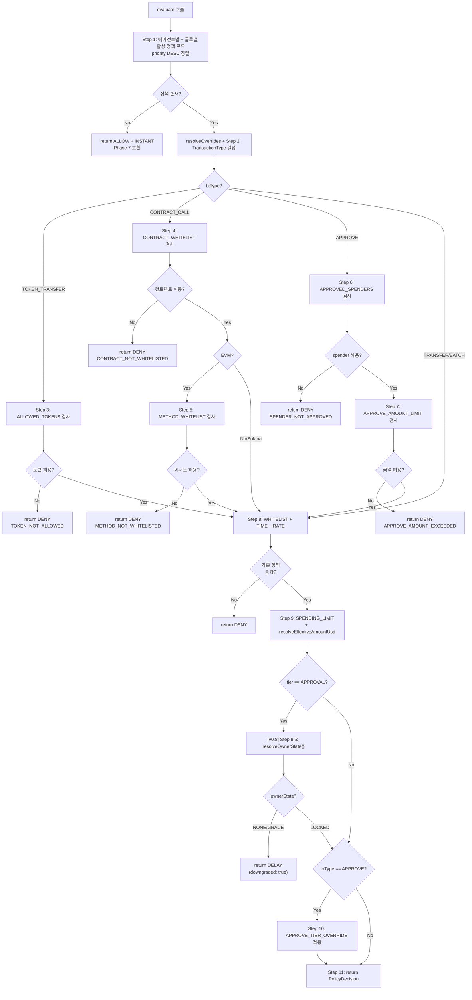

# 시간 지연 + 승인 메커니즘 설계 (LOCK-MECH)

**문서 ID:** LOCK-MECH
**작성일:** 2026-02-05
**v0.6 업데이트:** 2026-02-08
**v0.8 업데이트:** 2026-02-08
**상태:** 완료
**참조:** TX-PIPE (32-transaction-pipeline-api.md), SESS-PROTO (30-session-token-protocol.md), CORE-02 (25-sqlite-schema.md), CORE-04 (27-chain-adapter-interface.md), ENUM-MAP (45-enum-unified-mapping.md), CHAIN-EXT-01 (56-token-transfer-extension-spec.md), CHAIN-EXT-03 (58-contract-call-spec.md), CHAIN-EXT-04 (59-approve-management-spec.md), CHAIN-EXT-05 (60-batch-transaction-spec.md), CHAIN-EXT-06 (61-price-oracle-spec.md), objectives/v0.8-optional-owner-progressive-security.md, CORE-02 (25-sqlite-schema.md -- OwnerState, owner_verified)
**요구사항:** LOCK-01 (4단계 분류), LOCK-02 (Delay 큐잉), LOCK-03 (Approval 승인), LOCK-04 (미승인 만료), OWNER-07 (유예->잠금 전이), OWNER-08 (BEGIN IMMEDIATE 원자화)
**v0.6 통합:** INTEG-01 (PolicyType 10개, evaluate() 11단계, USD 정책, 배치/컨트랙트/approve 정책)

---

## 1. 문서 개요

### 1.1 목적

WAIaaS 3계층 보안의 **2계층(시간 지연 + 승인)**의 핵심 메커니즘을 설계한다. Phase 7에서 정의한 IPolicyEngine 인터페이스의 기본 구현(DefaultPolicyEngine -- 모든 거래를 INSTANT으로 통과)을 실제 DB-backed 정책 엔진(DatabasePolicyEngine)으로 대체하는 설계를 제공한다.

이 문서는 다음을 정의한다:
- **DatabasePolicyEngine**: policies 테이블에서 규칙을 로드하여 우선순위 순으로 평가하는 정책 엔진
- **4-티어 보안 분류 상태 머신**: INSTANT/NOTIFY/DELAY/APPROVAL 각 티어의 진입 조건과 상태 전이
- **DELAY 쿨다운 큐잉 플로우**: 시간 지연 대기 -> 미취소 시 자동 실행
- **APPROVAL 승인 대기 플로우**: Owner 서명 승인/거절/만료 처리
- **TOCTOU 방지 패턴**: BEGIN IMMEDIATE + reserved amount로 동시 요청 안전성 확보

### 1.2 요구사항 매핑

| 요구사항 | 설명 | 충족 섹션 |
|---------|------|-----------|
| LOCK-01 | 거래 금액에 따른 4단계 보안 분류 (Instant/Notify/Delay/Approval) | 섹션 4 (4-티어 상태 머신) + 섹션 2 (SPENDING_LIMIT 규칙) |
| LOCK-02 | Delay 티어 쿨다운 큐잉 -- 대기 시간 후 미취소 시 자동 실행 | 섹션 6 (DELAY 쿨다운 플로우) |
| LOCK-03 | Approval 티어 Owner 서명 승인 | 섹션 7 (APPROVAL 승인 플로우) |
| LOCK-04 | 미승인 거래 타임아웃 후 자동 만료 (EXPIRED 전이) | 섹션 7 (ApprovalTimeoutWorker) |

### 1.3 v0.1 -> v0.2 변경 요약

| 항목 | v0.1 (Cloud) | v0.2 (Self-Hosted) | 근거 |
|------|-------------|-------------------|------|
| 정책 엔진 | Squads 온체인 멀티시그 | 로컬 DB 정책 엔진 (DatabasePolicyEngine) | 온체인 의존 제거, 로컬 완결성 |
| 정책 저장소 | 온체인 프로그램 계정 | SQLite policies 테이블 | 로컬 SQLite, 외부 의존 없음 |
| 승인 경로 | Squads 멤버 멀티시그 서명 | Owner 단독 SIWS/SIWE 서명 | 단일 Owner 모델 (Self-Hosted) |
| 시간 지연 | 없음 (즉시 멀티시그) | DELAY 티어 쿨다운 큐잉 | Owner에게 취소 기회 제공 |
| 보안 분류 | 2단계 (일반/멀티시그) | 4-티어 (INSTANT/NOTIFY/DELAY/APPROVAL) | 세분화된 보안 정책 |

### 1.4 Phase 7 -> Phase 8 전환 맥락

Phase 7에서 거래 처리 파이프라인의 Stage 3 (Policy Check)과 Stage 4 (Tier Classify)는 **확장점(extension point)**으로 설계되었다:

- **Phase 7 DefaultPolicyEngine**: 모든 거래를 `{ allowed: true, tier: 'INSTANT' }`로 통과 (passthrough)
- **Phase 8 DatabasePolicyEngine**: policies 테이블에서 규칙을 로드하여 실제 정책 평가 수행

```
Phase 7 (기본 동작)                 Phase 8 (실제 구현)
┌────────────────────┐             ┌────────────────────┐
│ DefaultPolicyEngine│             │DatabasePolicyEngine │
│ (passthrough)      │  ────────>  │ (DB-backed rules)  │
│ always INSTANT     │             │ 4-tier classify    │
└────────────────────┘             └────────────────────┘
```

### 1.5 참조 문서 관계

```
┌──────────────────────────────────────────────────────────────┐
│  TX-PIPE (32-transaction-pipeline-api.md)                    │
│  Stage 3 (Policy Check): IPolicyEngine.evaluate()            │
│  Stage 4 (Tier Classify): PolicyDecision.tier 분기           │
│  Stage 5 (Execute): 4단계 IChainAdapter 실행                 │
└──────────────┬───────────────────────────────────────────────┘
               │ Stage 3/4 확장점 구현
               ▼
┌──────────────────────────────────────────────────────────────┐
│  LOCK-MECH (33-time-lock-approval-mechanism.md) ◀── 이 문서  │
│  DatabasePolicyEngine + 4-티어 상태 머신 + DELAY/APPROVAL    │
└──────────────┬───────────────────────────────────────────────┘
               │ 정책 규칙 저장/조회
               ▼
┌──────────────────────────────────────────────────────────────┐
│  CORE-02 (25-sqlite-schema.md)                               │
│  policies 테이블, transactions 테이블                         │
└──────────────────────────────────────────────────────────────┘

          참조                     참조
    ┌──────────┐            ┌──────────────┐
    │SESS-PROTO│            │   CORE-04    │
    │ usageStats│            │ IPolicyEngine│
    │ reserved │            │ 인터페이스    │
    └──────────┘            └──────────────┘
```

---

## 2. policies 테이블 스키마 확정

### 2.1 테이블 구조

CORE-02에서 기본 구조가 정의된 policies 테이블을 Phase 8에서 상세화한다. 정책 타입(type)을 4개에서 확장하고, 각 타입별 rules JSON 구조를 확정한다.

#### Drizzle ORM 정의

```typescript
// packages/core/src/schema/policies.ts
import { sqliteTable, text, integer, index } from 'drizzle-orm/sqlite-core'
import { agents } from './agents.js'

export const policies = sqliteTable('policies', {
  // -- 식별자 --
  id: text('id').primaryKey(),                          // UUID v7
  agentId: text('agent_id')
    .references(() => agents.id, { onDelete: 'cascade' }),  // NULL = 글로벌 정책

  // -- 정책 정의 --
  // (v0.6 변경) Phase 22-23에서 6개 추가: 4개 -> 10개 PolicyType
  // SSoT: 45-enum-unified-mapping.md 섹션 2.5
  type: text('type', {
    enum: ['SPENDING_LIMIT', 'WHITELIST', 'TIME_RESTRICTION', 'RATE_LIMIT',
      'ALLOWED_TOKENS', 'CONTRACT_WHITELIST', 'METHOD_WHITELIST', 'APPROVED_SPENDERS',
      'APPROVE_AMOUNT_LIMIT', 'APPROVE_TIER_OVERRIDE']
  }).notNull(),
  rules: text('rules').notNull(),                       // JSON: 정책별 규칙 구조

  // -- 우선순위/활성화 --
  priority: integer('priority').notNull().default(0),   // 높을수록 먼저 평가
  enabled: integer('enabled', { mode: 'boolean' }).notNull().default(true),

  // -- 타임스탬프 --
  createdAt: integer('created_at', { mode: 'timestamp' }).notNull(),
  updatedAt: integer('updated_at', { mode: 'timestamp' }).notNull(),
}, (table) => [
  index('idx_policies_agent_enabled').on(table.agentId, table.enabled),
  index('idx_policies_type').on(table.type),
])
```

#### CREATE TABLE SQL DDL

```sql
CREATE TABLE policies (
  id TEXT PRIMARY KEY,
  agent_id TEXT REFERENCES agents(id) ON DELETE CASCADE,
  type TEXT NOT NULL
    CHECK (type IN ('SPENDING_LIMIT', 'WHITELIST', 'TIME_RESTRICTION', 'RATE_LIMIT',
      'ALLOWED_TOKENS', 'CONTRACT_WHITELIST', 'METHOD_WHITELIST', 'APPROVED_SPENDERS',
      'APPROVE_AMOUNT_LIMIT', 'APPROVE_TIER_OVERRIDE')),
  rules TEXT NOT NULL,             -- JSON
  priority INTEGER NOT NULL DEFAULT 0,
  enabled INTEGER NOT NULL DEFAULT 1,   -- boolean (0/1)
  created_at INTEGER NOT NULL,
  updated_at INTEGER NOT NULL
);

CREATE INDEX idx_policies_agent_enabled ON policies(agent_id, enabled);
CREATE INDEX idx_policies_type ON policies(type);
```

#### 컬럼 설명

| 컬럼 | 타입 | Nullable | 기본값 | 용도 |
|------|------|----------|--------|------|
| `id` | TEXT (PK) | NOT NULL | - | 정책 UUID v7 |
| `agent_id` | TEXT (FK) | NULL | - | 대상 에이전트. NULL이면 모든 에이전트에 적용되는 글로벌 정책 |
| `type` | TEXT (ENUM) | NOT NULL | - | 정책 유형. (v0.6 변경) 10개: SPENDING_LIMIT, WHITELIST, TIME_RESTRICTION, RATE_LIMIT, ALLOWED_TOKENS, CONTRACT_WHITELIST, METHOD_WHITELIST, APPROVED_SPENDERS, APPROVE_AMOUNT_LIMIT, APPROVE_TIER_OVERRIDE. SSoT: 45-enum 섹션 2.5 |
| `rules` | TEXT (JSON) | NOT NULL | - | 정책별 규칙 JSON. 아래 Zod 스키마 참조 |
| `priority` | INTEGER | NOT NULL | `0` | 평가 우선순위. 높을수록 먼저 평가. 에이전트별 > 글로벌 |
| `enabled` | INTEGER | NOT NULL | `1` | 활성화 여부. 0=비활성, 1=활성 |
| `created_at` | INTEGER | NOT NULL | - | 생성 시각 (Unix epoch, 초) |
| `updated_at` | INTEGER | NOT NULL | - | 최종 수정 시각 (Unix epoch, 초) |

**CORE-02 대비 변경사항:**
- 정책 타입 변경: `ALLOWED_ADDRESSES` -> `WHITELIST` (더 직관적), `AUTO_STOP` -> 08-04에서 별도 설계
- 정책 타입 추가: `RATE_LIMIT` (시간당/일일 거래 횟수 제한)
- 인덱스 변경: `idx_policies_agent_id` + `idx_policies_enabled` -> `idx_policies_agent_enabled` (복합 인덱스로 통합)

### 2.2 PolicyRuleSchema -- 정책 타입별 Zod 스키마

각 정책 타입의 `rules` JSON 필드 구조를 Zod 스키마로 정의한다.

```typescript
// packages/core/src/schema/policy-rules.ts
import { z } from 'zod'

/**
 * SPENDING_LIMIT: 금액 기반 4-티어 보안 분류
 *
 * 금액은 최소 단위(lamports/wei)의 문자열로 저장한다.
 * BigInt 비교를 위해 문자열로 유지 (SQLite TEXT 저장 호환).
 */
export const SpendingLimitRuleSchema = z.object({
  /** INSTANT 티어 최대 금액 (이하 즉시 실행) */
  instant_max: z.string().regex(/^\d+$/, '양의 정수 문자열이어야 합니다'),

  /** NOTIFY 티어 최대 금액 (이하 즉시 실행 + 알림) */
  notify_max: z.string().regex(/^\d+$/, '양의 정수 문자열이어야 합니다'),

  /** DELAY 티어 최대 금액 (이하 시간 지연 후 실행) */
  delay_max: z.string().regex(/^\d+$/, '양의 정수 문자열이어야 합니다'),

  /** DELAY 티어 쿨다운 시간 (초). 최소 60, 기본 300 */
  delay_seconds: z.number().int().min(60).default(300),

  /** APPROVAL 티어 승인 대기 시간 (초). 최소 300, 최대 86400, 기본 3600 */
  approval_timeout: z.number().int().min(300).max(86400).default(3600),

  // (v0.6 추가) USD 기준 티어 임계값 -- IPriceOracle 연동 (CHAIN-EXT-06)
  // optional 필드: 미설정 시 네이티브 금액만으로 티어 결정 (하위 호환)

  /** INSTANT 티어 최대 USD 금액 (이하 즉시 실행) */
  instant_max_usd: z.number().positive().optional(),

  /** NOTIFY 티어 최대 USD 금액 (이하 즉시 실행 + 알림) */
  notify_max_usd: z.number().positive().optional(),

  /** DELAY 티어 최대 USD 금액 (이하 시간 지연 후 실행) */
  delay_max_usd: z.number().positive().optional(),
})

/**
 * WHITELIST: 허용된 수신 주소 목록
 *
 * 목록에 없는 주소로의 전송은 즉시 DENY.
 * 빈 배열이면 모든 주소 허용 (화이트리스트 비활성과 동일).
 */
export const WhitelistRuleSchema = z.object({
  /** 허용된 수신 주소 목록 (base58/hex) */
  allowed_addresses: z.array(z.string()).default([]),
})

/**
 * TIME_RESTRICTION: 시간대 기반 거래 제한
 *
 * 허용 시간대와 요일을 지정한다. 범위 밖 거래는 DENY.
 */
export const TimeRestrictionRuleSchema = z.object({
  /** 허용 시간대 (24시간제). start < end면 같은 날, start > end면 자정 걸침 */
  allowed_hours: z.object({
    start: z.number().int().min(0).max(23),
    end: z.number().int().min(0).max(23),
  }),

  /** IANA 시간대 (예: 'Asia/Seoul', 'America/New_York') */
  timezone: z.string().default('UTC'),

  /** 허용 요일 (0=일, 1=월, ..., 6=토). 빈 배열이면 모든 요일 허용 */
  allowed_days: z.array(z.number().int().min(0).max(6)).default([0, 1, 2, 3, 4, 5, 6]),
})

/**
 * RATE_LIMIT: 거래 횟수 제한
 *
 * 시간당/일일 최대 거래 횟수를 제한한다. 초과 시 DENY.
 */
export const RateLimitRuleSchema = z.object({
  /** 시간당 최대 거래 횟수. 0이면 제한 없음 */
  max_tx_per_hour: z.number().int().min(0).default(0),

  /** 일일 최대 거래 횟수. 0이면 제한 없음 */
  max_tx_per_day: z.number().int().min(0).default(0),
})

// ══════════════════════════════════════════════════════════════════
// (v0.6 추가) Phase 22-23 신규 정책 스키마 6개
// SSoT: 45-enum-unified-mapping.md 섹션 2.5
// ══════════════════════════════════════════════════════════════════

/**
 * (v0.6 추가) ALLOWED_TOKENS: 에이전트별 허용 토큰 화이트리스트 (CHAIN-EXT-01)
 *
 * TOKEN_TRANSFER 타입에만 적용된다.
 * 미설정 시 토큰 전송은 기본 거부 (보수적 정책).
 */
export const AllowedTokensRuleSchema = z.object({
  /** 허용 토큰 목록 */
  tokens: z.array(z.object({
    mint: z.string(),    // 토큰 민트/컨트랙트 주소
    symbol: z.string(),  // 사람이 읽을 수 있는 심볼 (예: 'USDC')
    chain: z.enum(['solana', 'ethereum']),
  })),
  /** 미등록 토큰 처리: deny(기본) | notify */
  unknown_token_action: z.enum(['deny', 'notify']).default('deny'),
})

/**
 * (v0.6 추가) CONTRACT_WHITELIST: 허용 컨트랙트 주소 목록 (CHAIN-EXT-03)
 *
 * CONTRACT_CALL 타입에만 적용된다.
 * 미설정 시 모든 컨트랙트 호출은 거부 (기본 전면 거부 원칙).
 */
export const ContractWhitelistRuleSchema = z.object({
  /** 허용 컨트랙트 목록 */
  contracts: z.array(z.object({
    address: z.string(),  // 컨트랙트 주소 (lowercase 정규화)
    chain: z.enum(['solana', 'ethereum']),
    label: z.string().optional(),  // 사람이 읽을 수 있는 라벨 (예: 'Jupiter V6')
  })),
})

/**
 * (v0.6 추가) METHOD_WHITELIST: EVM 전용 함수 selector 화이트리스트 (CHAIN-EXT-03)
 *
 * CONTRACT_CALL + EVM 체인에만 적용된다.
 * Solana는 표준 selector 규약이 없으므로 미적용.
 */
export const MethodWhitelistRuleSchema = z.object({
  /** 허용 메서드 목록 */
  methods: z.array(z.object({
    address: z.string(),    // 대상 컨트랙트 주소
    selector: z.string(),   // 4바이트 함수 selector (0x 접두사)
    name: z.string().optional(),  // 함수 이름 (예: 'swap')
  })),
})

/**
 * (v0.6 추가) APPROVED_SPENDERS: 승인 허용 대상 목록 (CHAIN-EXT-04)
 *
 * APPROVE 타입에만 적용된다.
 * 미설정 시 모든 approve 요청은 거부 (보수적 정책).
 */
export const ApprovedSpendersRuleSchema = z.object({
  /** 허용 spender 주소 목록 */
  spenders: z.array(z.object({
    address: z.string(),  // spender 주소 (lowercase 정규화)
    chain: z.enum(['solana', 'ethereum']),
    label: z.string().optional(),  // 사람이 읽을 수 있는 라벨 (예: 'Jupiter V6 Router')
  })),
})

/**
 * (v0.6 추가) APPROVE_AMOUNT_LIMIT: 단일 approve 최대 금액 (CHAIN-EXT-04)
 *
 * APPROVE 타입에만 적용된다.
 * unlimited_blocked: true이면 무제한 approve 요청을 차단한다.
 * 무제한 임계값: EVM 2^256/2, Solana 2^64/2
 */
export const ApproveAmountLimitRuleSchema = z.object({
  /** 단일 approve 최대 금액 (최소 단위, 문자열) */
  max_amount: z.string().regex(/^\d+$/, '양의 정수 문자열이어야 합니다'),
  /** 무제한 approve 차단 여부 (기본: true) */
  unlimited_blocked: z.boolean().default(true),
  /** 무제한 판정 임계값 (미설정 시 체인별 MAX/2 기본값) */
  unlimited_threshold: z.string().regex(/^\d+$/).optional(),
})

/**
 * (v0.6 추가) APPROVE_TIER_OVERRIDE: approve 독립 보안 티어 (CHAIN-EXT-04)
 *
 * APPROVE 타입에만 적용된다.
 * SPENDING_LIMIT과 독립적으로 동작한다 (approve는 자금 소모가 아닌 권한 위임).
 * 기본 티어: APPROVAL (Owner 승인 필수, 보수적).
 */
export const ApproveTierOverrideRuleSchema = z.object({
  /** approve 기본 보안 티어 */
  default_tier: z.enum(['INSTANT', 'NOTIFY', 'DELAY', 'APPROVAL']).default('APPROVAL'),
})

/**
 * PolicyRule 유니온 스키마: type 필드에 따라 rules 구조가 결정된다.
 * (v0.6 변경) 4개 -> 10개 PolicyType 지원
 */
export const PolicyRuleSchema = z.discriminatedUnion('type', [
  // Phase 8 기존 (4개)
  z.object({ type: z.literal('SPENDING_LIMIT'), rules: SpendingLimitRuleSchema }),
  z.object({ type: z.literal('WHITELIST'), rules: WhitelistRuleSchema }),
  z.object({ type: z.literal('TIME_RESTRICTION'), rules: TimeRestrictionRuleSchema }),
  z.object({ type: z.literal('RATE_LIMIT'), rules: RateLimitRuleSchema }),
  // (v0.6 추가) Phase 22 추가 (1개)
  z.object({ type: z.literal('ALLOWED_TOKENS'), rules: AllowedTokensRuleSchema }),
  // (v0.6 추가) Phase 23 추가 (5개)
  z.object({ type: z.literal('CONTRACT_WHITELIST'), rules: ContractWhitelistRuleSchema }),
  z.object({ type: z.literal('METHOD_WHITELIST'), rules: MethodWhitelistRuleSchema }),
  z.object({ type: z.literal('APPROVED_SPENDERS'), rules: ApprovedSpendersRuleSchema }),
  z.object({ type: z.literal('APPROVE_AMOUNT_LIMIT'), rules: ApproveAmountLimitRuleSchema }),
  z.object({ type: z.literal('APPROVE_TIER_OVERRIDE'), rules: ApproveTierOverrideRuleSchema }),
])

/** PolicyRule 타입 추출 */
export type PolicyRule = z.infer<typeof PolicyRuleSchema>
export type SpendingLimitRule = z.infer<typeof SpendingLimitRuleSchema>
export type WhitelistRule = z.infer<typeof WhitelistRuleSchema>
export type TimeRestrictionRule = z.infer<typeof TimeRestrictionRuleSchema>
export type RateLimitRule = z.infer<typeof RateLimitRuleSchema>
// (v0.6 추가) 신규 6개 정책 타입
export type AllowedTokensRule = z.infer<typeof AllowedTokensRuleSchema>
export type ContractWhitelistRule = z.infer<typeof ContractWhitelistRuleSchema>
export type MethodWhitelistRule = z.infer<typeof MethodWhitelistRuleSchema>
export type ApprovedSpendersRule = z.infer<typeof ApprovedSpendersRuleSchema>
export type ApproveAmountLimitRule = z.infer<typeof ApproveAmountLimitRuleSchema>
export type ApproveTierOverrideRule = z.infer<typeof ApproveTierOverrideRuleSchema>
```

### 2.3 기본 정책 세트

`waiaas init` 실행 시 생성되는 보수적 기본 정책:

#### SOL (Solana) 기본 정책

```typescript
// 글로벌 SPENDING_LIMIT (agentId = NULL)
const defaultSolSpendingLimit = {
  id: generateUUIDv7(),
  agentId: null,          // 글로벌 -- 모든 에이전트에 적용
  type: 'SPENDING_LIMIT',
  rules: JSON.stringify({
    instant_max:  '1000000000',     // 1 SOL (10^9 lamports)
    notify_max:   '10000000000',    // 10 SOL
    delay_max:    '50000000000',    // 50 SOL
    delay_seconds: 300,             // 5분 쿨다운
    approval_timeout: 3600,         // 1시간 승인 대기
  }),
  priority: 0,
  enabled: 1,
  createdAt: now,
  updatedAt: now,
}
```

**4-티어 금액 기준 (SOL):**

| 티어 | 금액 범위 | 동작 | lamports 기준 |
|------|----------|------|--------------|
| INSTANT | 0 ~ 1 SOL | 즉시 실행 | `<= 1_000_000_000` |
| NOTIFY | 1 ~ 10 SOL | 즉시 실행 + Owner 알림 | `<= 10_000_000_000` |
| DELAY | 10 ~ 50 SOL | 5분 쿨다운 후 자동 실행 | `<= 50_000_000_000` |
| APPROVAL | 50 SOL 초과 | Owner 서명 승인 필요 | `> 50_000_000_000` |

### 2.4 인덱스 설계

```sql
-- 에이전트별 활성 정책 조회 최적화
-- DatabasePolicyEngine.evaluate() 쿼리:
-- WHERE (agent_id = ? OR agent_id IS NULL) AND enabled = 1
CREATE INDEX idx_policies_agent_enabled ON policies(agent_id, enabled);

-- 정책 타입별 조회 (관리 UI용)
CREATE INDEX idx_policies_type ON policies(type);
```

`idx_policies_agent_enabled` 복합 인덱스는 DatabasePolicyEngine의 핵심 쿼리 경로를 최적화한다. `agent_id`가 선두 컬럼이므로 에이전트별 조회와 `agent_id IS NULL` (글로벌) 조회 모두 인덱스를 활용한다.

---

## 3. DatabasePolicyEngine 설계

### 3.1 IPolicyEngine 인터페이스 (Phase 7 TX-PIPE 정의)

Phase 7에서 정의한 IPolicyEngine 인터페이스를 구현한다:

```typescript
// packages/core/src/interfaces/policy-engine.ts (Phase 7 정의, 재참조)

/** 정책 평가 결과 */
interface PolicyDecision {
  /** 허용 여부 */
  allowed: boolean

  /** 보안 티어 (ALLOW일 때만 유효) */
  tier: 'INSTANT' | 'NOTIFY' | 'DELAY' | 'APPROVAL'

  /** 거부 사유 (DENY일 때) */
  reason?: string

  /** 거부한 정책 ID (DENY일 때) */
  policyId?: string

  /** DELAY 티어의 지연 시간 (초) */
  delaySeconds?: number

  /** APPROVAL 티어의 승인 기한 (초) */
  approvalTimeoutSeconds?: number
}

/** 정책 엔진 인터페이스 */
interface IPolicyEngine {
  evaluate(agentId: string, request: {
    type: string
    amount: string
    to: string
    chain: string
  }): Promise<PolicyDecision>
}
```

### 3.2 DatabasePolicyEngine 클래스 설계

#### [v0.8] evaluate() 시그니처 확장

v0.8 Owner 선택적 등록 모델 도입에 따라, DatabasePolicyEngine.evaluate()에 optional 파라미터 `agentOwnerInfo`를 추가한다.

```typescript
// IPolicyEngine 인터페이스는 변경하지 않는다 (하위 호환성 유지)
interface IPolicyEngine {
  evaluate(agentId: string, request: TxRequest): Promise<PolicyDecision>
}

// DatabasePolicyEngine 구현체에서 확장된 시그니처를 제공한다
// 현재 (v0.7): evaluate(agentId: string, request: TxRequest): Promise<PolicyDecision>
// v0.8:       evaluate(agentId: string, request: TxRequest, agentOwnerInfo?: AgentOwnerInfo): Promise<PolicyDecision>
```

| 항목 | 설명 |
|------|------|
| 인터페이스 변경 | IPolicyEngine 인터페이스 자체는 변경하지 않는다 |
| 구현체 확장 | DatabasePolicyEngine.evaluate()의 3번째 파라미터로 optional AgentOwnerInfo 추가 |
| 호출부 전달 | Stage 3(Policy Evaluate)에서 agent를 이미 DB에서 로드하므로 `{ ownerAddress, ownerVerified }` 전달이 자연스러움 |
| 미전달 시 | agentOwnerInfo가 undefined이면 DatabasePolicyEngine 내부에서 DB 조회로 대체 |
| 하위 호환성 | optional 파라미터이므로 기존 호출 코드 변경 없이 동작 |

> **근거:** IPolicyEngine을 변경하면 DefaultPolicyEngine 등 다른 구현체도 영향받는다. DatabasePolicyEngine의 evaluate() 오버라이드에서만 처리하여 Phase 7 호환성을 유지한다.

```typescript
// packages/daemon/src/domain/policy-engine.ts

import { and, or, eq, isNull, desc } from 'drizzle-orm'
import type { DrizzleInstance } from '../db/drizzle.js'
import { policies } from '@waiaas/core/schema'
import type { IPolicyEngine, PolicyDecision } from '@waiaas/core/interfaces'
import type { SpendingLimitRule, WhitelistRule, TimeRestrictionRule, RateLimitRule } from '@waiaas/core/schema/policy-rules.js'

/** policies 테이블 행 타입 (v0.6 변경: 10개 PolicyType) */
interface PolicyRow {
  id: string
  agentId: string | null
  type: 'SPENDING_LIMIT' | 'WHITELIST' | 'TIME_RESTRICTION' | 'RATE_LIMIT'
    | 'ALLOWED_TOKENS' | 'CONTRACT_WHITELIST' | 'METHOD_WHITELIST'
    | 'APPROVED_SPENDERS' | 'APPROVE_AMOUNT_LIMIT' | 'APPROVE_TIER_OVERRIDE'
  rules: string  // JSON
  priority: number
  enabled: boolean
}

/** 거래 요청 타입 (IPolicyEngine.evaluate 입력)
 *  (v0.6 확장) 5개 TransactionType 필드 추가
 */
interface TxRequest {
  type: 'TRANSFER' | 'TOKEN_TRANSFER' | 'CONTRACT_CALL' | 'APPROVE' | 'BATCH'
  amount: string
  to: string
  chain: string
  // (v0.6 추가) TransactionType별 추가 필드
  token?: string           // TOKEN_TRANSFER: 토큰 민트/컨트랙트 주소
  contractAddress?: string // CONTRACT_CALL: 대상 컨트랙트 주소
  methodSelector?: string  // CONTRACT_CALL (EVM): 4바이트 함수 selector
  spender?: string         // APPROVE: approve 대상 spender 주소
  approveAmount?: string   // APPROVE: approve 금액
  instructions?: TxRequest[] // BATCH: 개별 instruction 배열
}

/**
 * DatabasePolicyEngine: policies 테이블에서 규칙을 로드하여 평가하는 정책 엔진.
 *
 * Phase 7의 DefaultPolicyEngine (passthrough)을 대체한다.
 * 에이전트별 정책 + 글로벌 정책을 priority DESC 순으로 로드하고,
 * DENY 우선 평가 후 SPENDING_LIMIT으로 4-티어 분류를 결정한다.
 */
class DatabasePolicyEngine implements IPolicyEngine {
  constructor(
    private db: DrizzleInstance,
    private sqlite: Database,  // better-sqlite3 (TOCTOU 방지용 raw 쿼리)
  ) {}

  /**
   * 거래 요청을 평가한다.
   *
   * (v0.6 변경, v0.8 확장) 알고리즘 11+1단계 (Phase 8 기존 6단계에서 확장):
   * 1. 에이전트별 + 글로벌 활성 정책 로드
   * 2. TransactionType 결정
   * 3. ALLOWED_TOKENS 검사 (TOKEN_TRANSFER) -- (v0.6 추가)
   * 4. CONTRACT_WHITELIST 검사 (CONTRACT_CALL) -- (v0.6 추가)
   * 5. METHOD_WHITELIST 검사 (CONTRACT_CALL, EVM only) -- (v0.6 추가)
   * 6. APPROVED_SPENDERS 검사 (APPROVE) -- (v0.6 추가)
   * 7. APPROVE_AMOUNT_LIMIT 검사 (APPROVE) -- (v0.6 추가)
   * 8. WHITELIST + TIME_RESTRICTION + RATE_LIMIT 평가 (기존 Step 2-4)
   * 9. 금액 기반 티어 결정 (SPENDING_LIMIT + resolveEffectiveAmountUsd) -- (v0.6 USD 확장)
   * 9.5. [v0.8] OwnerState 기반 APPROVAL -> DELAY 다운그레이드 -- (v0.8 추가)
   * 10. APPROVE_TIER_OVERRIDE 적용 (APPROVE) -- (v0.6 추가)
   * 11. DAILY_LIMIT + RATE_LIMIT + 최종 PolicyDecision 반환
   *
   * DENY 우선 원칙: Step 3-7 중 하나라도 DENY면 즉시 반환.
   * SSoT: 58-contract-call-spec.md 섹션 5, 45-enum 섹션 2.5
   */
  // [v0.8] agentOwnerInfo optional 파라미터 추가 (IPolicyEngine 인터페이스 미변경)
  async evaluate(
    agentId: string,
    request: TxRequest,
    agentOwnerInfo?: AgentOwnerInfo,  // [v0.8] Owner 상태 파악용
  ): Promise<PolicyDecision> {
    // Step 1: 에이전트별 + 글로벌(agentId=NULL) 활성 정책 로드 (priority DESC)
    const rules = await this.db.select()
      .from(policies)
      .where(and(
        or(eq(policies.agentId, agentId), isNull(policies.agentId)),
        eq(policies.enabled, true),
      ))
      .orderBy(desc(policies.priority))

    // 정책 없으면 기본 INSTANT (Phase 7 호환)
    if (rules.length === 0) {
      return { allowed: true, tier: 'INSTANT' }
    }

    // 에이전트별 정책과 글로벌 정책 분리 (같은 type이면 에이전트별이 override)
    const effectiveRules = this.resolveOverrides(rules, agentId)

    // Step 2: TransactionType 결정 (v0.6 추가)
    const txType = request.type // TRANSFER | TOKEN_TRANSFER | CONTRACT_CALL | APPROVE | BATCH

    // Step 3: ALLOWED_TOKENS 검사 -- TOKEN_TRANSFER만 (v0.6 추가)
    if (txType === 'TOKEN_TRANSFER') {
      const tokenResult = this.evaluateAllowedTokens(effectiveRules, request)
      if (!tokenResult.allowed) return tokenResult
    }

    // Step 4: CONTRACT_WHITELIST 검사 -- CONTRACT_CALL만 (v0.6 추가)
    if (txType === 'CONTRACT_CALL') {
      const contractResult = this.evaluateContractWhitelist(effectiveRules, request)
      if (!contractResult.allowed) return contractResult
    }

    // Step 5: METHOD_WHITELIST 검사 -- CONTRACT_CALL + EVM only (v0.6 추가)
    if (txType === 'CONTRACT_CALL' && request.chain === 'ethereum') {
      const methodResult = this.evaluateMethodWhitelist(effectiveRules, request)
      if (!methodResult.allowed) return methodResult
    }

    // Step 6: APPROVED_SPENDERS 검사 -- APPROVE만 (v0.6 추가)
    if (txType === 'APPROVE') {
      const spenderResult = this.evaluateApprovedSpenders(effectiveRules, request)
      if (!spenderResult.allowed) return spenderResult
    }

    // Step 7: APPROVE_AMOUNT_LIMIT 검사 -- APPROVE만 (v0.6 추가)
    if (txType === 'APPROVE') {
      const amountLimitResult = this.evaluateApproveAmountLimit(effectiveRules, request)
      if (!amountLimitResult.allowed) return amountLimitResult
    }

    // Step 8: 기존 WHITELIST + TIME_RESTRICTION + RATE_LIMIT (Phase 8 Step 2-4)
    const whitelistResult = this.evaluateWhitelist(effectiveRules, request)
    if (!whitelistResult.allowed) return whitelistResult

    const timeResult = this.evaluateTimeRestriction(effectiveRules)
    if (!timeResult.allowed) return timeResult

    const rateResult = await this.evaluateRateLimit(effectiveRules, agentId)
    if (!rateResult.allowed) return rateResult

    // Step 9: 금액 기반 티어 결정 (v0.6 USD 확장)
    // resolveEffectiveAmountUsd()로 USD 환산 후 maxTier(nativeTier, usdTier) 보수적 채택
    // IPriceOracle 주입 필요 (CHAIN-EXT-06)
    const tierResult = this.evaluateSpendingLimit(effectiveRules, request)

    // ══════════════════════════════════════════════════════════════
    // [v0.8] Step 9.5: OwnerState 기반 APPROVAL -> DELAY 다운그레이드
    // 삽입 지점: Step 9 이후, Step 10 전
    // 조건: APPROVAL 티어 + OwnerState가 NONE 또는 GRACE
    // 동작: APPROVAL -> DELAY 다운그레이드 후 즉시 return (Step 10 스킵)
    // 참조: resolveOwnerState() (섹션 12), PolicyDecision.downgraded (32-transaction-pipeline §3.1)
    // ══════════════════════════════════════════════════════════════
    if (tierResult.allowed && tierResult.tier === 'APPROVAL') {
      const ownerInfo = agentOwnerInfo ?? await this.loadAgentOwnerInfo(agentId)
      const ownerState = resolveOwnerState(ownerInfo)
      if (ownerState !== 'LOCKED') {
        // NONE 또는 GRACE: Owner 승인 불가 -> DELAY로 다운그레이드
        const spendingRule = effectiveRules.find(r => r.type === 'SPENDING_LIMIT')
        const config = spendingRule ? JSON.parse(spendingRule.rules) : {}
        const rawDelay = config.delay_seconds ?? 300  // SPENDING_LIMIT의 delay_seconds 우선, fallback 300초(5분)
        const delaySeconds = Math.max(rawDelay, 60)   // 최소 60초 보장 (0초면 INSTANT과 동일하여 보안 의미 없음)
        return {
          allowed: true,
          tier: 'DELAY',
          delaySeconds,
          downgraded: true,
          originalTier: 'APPROVAL',
        }
        // 즉시 return하여 Step 10을 건너뛴다.
        // 이유: Step 10(APPROVE_TIER_OVERRIDE)이 다운그레이드된 DELAY를 다시 APPROVAL로 복원하는 것을 방지
      }
      // ownerState === 'LOCKED': 다운그레이드 안 함 -> 정상 APPROVAL 흐름으로 Step 10 진행
    }

    // Step 10: APPROVE_TIER_OVERRIDE 적용 -- APPROVE만 (v0.6 추가)
    // SPENDING_LIMIT과 독립적으로 동작 (approve는 자금 소모가 아닌 권한 위임)
    if (txType === 'APPROVE' && tierResult.allowed) {
      const overrideResult = this.evaluateApproveTierOverride(effectiveRules, tierResult)
      return overrideResult
    }

    // Step 11: 최종 PolicyDecision 반환
    return tierResult
  }

  /**
   * 에이전트별 정책이 글로벌 정책을 override하는 규칙 해결.
   * 같은 type에 대해 에이전트별 정책이 있으면 글로벌 정책을 무시한다.
   */
  private resolveOverrides(rules: PolicyRow[], agentId: string): PolicyRow[] {
    const agentRuleTypes = new Set(
      rules
        .filter(r => r.agentId === agentId)
        .map(r => r.type)
    )

    return rules.filter(r => {
      // 에이전트별 정책은 항상 포함
      if (r.agentId === agentId) return true
      // 글로벌 정책은 같은 type의 에이전트별 정책이 없을 때만 포함
      if (r.agentId === null && !agentRuleTypes.has(r.type)) return true
      return false
    })
  }

  /**
   * [v0.8] 에이전트의 Owner 정보를 DB에서 로드한다.
   * agentOwnerInfo가 evaluate()에 전달되지 않았을 때의 fallback.
   */
  private async loadAgentOwnerInfo(agentId: string): Promise<AgentOwnerInfo> {
    const agent = this.sqlite.prepare(
      `SELECT owner_address, owner_verified FROM agents WHERE id = ?`
    ).get(agentId) as { owner_address: string | null; owner_verified: number } | undefined
    return {
      ownerAddress: agent?.owner_address ?? null,
      ownerVerified: agent?.owner_verified === 1,
    }
  }

  /**
   * Step 2: WHITELIST 평가.
   * 화이트리스트가 설정되어 있고, 수신 주소가 목록에 없으면 DENY.
   */
  private evaluateWhitelist(rules: PolicyRow[], request: TxRequest): PolicyDecision {
    const whitelistRule = rules.find(r => r.type === 'WHITELIST')
    if (!whitelistRule) return { allowed: true, tier: 'INSTANT' }

    const config: WhitelistRule = JSON.parse(whitelistRule.rules)

    // 빈 배열이면 화이트리스트 비활성 (모든 주소 허용)
    if (config.allowed_addresses.length === 0) {
      return { allowed: true, tier: 'INSTANT' }
    }

    // 대소문자 구분 없이 비교 (EVM 주소 호환)
    const normalizedTo = request.to.toLowerCase()
    const isAllowed = config.allowed_addresses.some(
      addr => addr.toLowerCase() === normalizedTo
    )

    if (!isAllowed) {
      return {
        allowed: false,
        tier: 'INSTANT',
        reason: `수신 주소 ${request.to}이(가) 화이트리스트에 없습니다.`,
        policyId: whitelistRule.id,
      }
    }

    return { allowed: true, tier: 'INSTANT' }
  }

  /**
   * Step 3: TIME_RESTRICTION 평가.
   * 현재 시간이 허용 시간대와 요일에 포함되지 않으면 DENY.
   */
  private evaluateTimeRestriction(rules: PolicyRow[]): PolicyDecision {
    const timeRule = rules.find(r => r.type === 'TIME_RESTRICTION')
    if (!timeRule) return { allowed: true, tier: 'INSTANT' }

    const config: TimeRestrictionRule = JSON.parse(timeRule.rules)

    // 지정된 시간대의 현재 시각 계산
    const now = new Date()
    const formatter = new Intl.DateTimeFormat('en-US', {
      timeZone: config.timezone,
      hour: 'numeric',
      hour12: false,
    })
    const currentHour = parseInt(formatter.format(now), 10)

    const dayFormatter = new Intl.DateTimeFormat('en-US', {
      timeZone: config.timezone,
      weekday: 'short',
    })
    const dayStr = dayFormatter.format(now)
    const dayMap: Record<string, number> = {
      Sun: 0, Mon: 1, Tue: 2, Wed: 3, Thu: 4, Fri: 5, Sat: 6,
    }
    const currentDay = dayMap[dayStr] ?? 0

    // 요일 확인
    if (config.allowed_days.length > 0 && !config.allowed_days.includes(currentDay)) {
      return {
        allowed: false,
        tier: 'INSTANT',
        reason: `현재 요일(${dayStr})에는 거래가 허용되지 않습니다.`,
        policyId: timeRule.id,
      }
    }

    // 시간대 확인
    const { start, end } = config.allowed_hours
    let inRange: boolean

    if (start <= end) {
      // 같은 날 범위 (예: 9~17)
      inRange = currentHour >= start && currentHour < end
    } else {
      // 자정 걸침 범위 (예: 22~6 = 22,23,0,1,2,3,4,5)
      inRange = currentHour >= start || currentHour < end
    }

    if (!inRange) {
      return {
        allowed: false,
        tier: 'INSTANT',
        reason: `현재 시각(${currentHour}시)이 허용 시간대(${start}~${end}시)에 포함되지 않습니다.`,
        policyId: timeRule.id,
      }
    }

    return { allowed: true, tier: 'INSTANT' }
  }

  /**
   * Step 4: RATE_LIMIT 평가.
   * 시간당/일일 거래 횟수를 확인하여 초과 시 DENY.
   */
  private async evaluateRateLimit(
    rules: PolicyRow[],
    agentId: string,
  ): Promise<PolicyDecision> {
    const rateRule = rules.find(r => r.type === 'RATE_LIMIT')
    if (!rateRule) return { allowed: true, tier: 'INSTANT' }

    const config: RateLimitRule = JSON.parse(rateRule.rules)
    const now = Math.floor(Date.now() / 1000)

    // 시간당 거래 횟수 확인
    if (config.max_tx_per_hour > 0) {
      const oneHourAgo = now - 3600
      const hourlyCount = this.sqlite.prepare(
        `SELECT COUNT(*) as cnt FROM transactions
         WHERE agent_id = ? AND created_at >= ? AND status NOT IN ('CANCELLED', 'EXPIRED')`
      ).get(agentId, oneHourAgo) as { cnt: number }

      if (hourlyCount.cnt >= config.max_tx_per_hour) {
        return {
          allowed: false,
          tier: 'INSTANT',
          reason: `시간당 거래 한도(${config.max_tx_per_hour}회)를 초과했습니다. 현재 ${hourlyCount.cnt}회.`,
          policyId: rateRule.id,
        }
      }
    }

    // 일일 거래 횟수 확인
    if (config.max_tx_per_day > 0) {
      const oneDayAgo = now - 86400
      const dailyCount = this.sqlite.prepare(
        `SELECT COUNT(*) as cnt FROM transactions
         WHERE agent_id = ? AND created_at >= ? AND status NOT IN ('CANCELLED', 'EXPIRED')`
      ).get(agentId, oneDayAgo) as { cnt: number }

      if (dailyCount.cnt >= config.max_tx_per_day) {
        return {
          allowed: false,
          tier: 'INSTANT',
          reason: `일일 거래 한도(${config.max_tx_per_day}회)를 초과했습니다. 현재 ${dailyCount.cnt}회.`,
          policyId: rateRule.id,
        }
      }
    }

    return { allowed: true, tier: 'INSTANT' }
  }

  /**
   * Step 5: SPENDING_LIMIT 평가.
   * 거래 금액에 따라 4-티어(INSTANT/NOTIFY/DELAY/APPROVAL)를 분류한다.
   */
  private evaluateSpendingLimit(rules: PolicyRow[], request: TxRequest): PolicyDecision {
    const spendingRule = rules.find(r => r.type === 'SPENDING_LIMIT')

    // SPENDING_LIMIT 규칙이 없으면 기본 INSTANT
    if (!spendingRule) {
      return { allowed: true, tier: 'INSTANT' }
    }

    const config: SpendingLimitRule = JSON.parse(spendingRule.rules)
    const amount = BigInt(request.amount)

    // INSTANT: amount <= instant_max
    if (amount <= BigInt(config.instant_max)) {
      return { allowed: true, tier: 'INSTANT' }
    }

    // NOTIFY: instant_max < amount <= notify_max
    if (amount <= BigInt(config.notify_max)) {
      return { allowed: true, tier: 'NOTIFY' }
    }

    // DELAY: notify_max < amount <= delay_max
    if (amount <= BigInt(config.delay_max)) {
      return {
        allowed: true,
        tier: 'DELAY',
        delaySeconds: config.delay_seconds,
      }
    }

    // APPROVAL: amount > delay_max
    return {
      allowed: true,
      tier: 'APPROVAL',
      approvalTimeoutSeconds: config.approval_timeout,
    }
  }
}
```

### 3.3 evaluate() 알고리즘 플로우차트 (v0.6 변경, v0.8 확장: 11+1단계)



### 3.4 정책 평가 우선순위 규칙 (v0.6 확장)

| 규칙 | 설명 |
|------|------|
| DENY 우선 | (v0.6 확장) Step 3-7의 타입별 화이트리스트에서 DENY가 발생하면 즉시 반환. 이후 Step 8의 기존 정책, Step 9의 SPENDING_LIMIT까지 도달하지 않음 |
| 에이전트별 > 글로벌 | 같은 type의 정책이 에이전트별과 글로벌 모두 존재하면, 에이전트별 정책만 적용 |
| priority DESC | 같은 스코프 내에서 priority가 높은 정책이 먼저 평가됨 |
| 캐시 없음 | 정책은 매 요청마다 DB에서 직접 조회. 정책 변경 즉시 적용 보장 |
| (v0.6 추가) TransactionType 분기 | Step 3-7은 request.type에 따라 조건부 실행. 해당하지 않는 type의 정책은 건너뜀 |
| (v0.6 추가) APPROVE 독립 티어 | APPROVE_TIER_OVERRIDE는 SPENDING_LIMIT의 티어 결과를 재정의. approve는 자금 소모가 아닌 권한 위임이므로 독립 평가 |
| (v0.6 추가) USD 보수적 채택 | USD + 네이티브 병행 평가: maxTier(nativeTier, usdTier). stale 가격 시 INSTANT->NOTIFY 상향, +-50% 급변동 시 한 단계 상향 |

---

## 4. 4-티어 보안 분류 상태 머신

### 4.1 상태 전이 다이어그램

파이프라인 Stage 3 (Policy Check) 출력이 Stage 4 (Tier Classify) 입력으로 연결되고, 각 티어에 따라 서로 다른 실행 경로를 탄다.


### 4.2 각 티어의 트랜잭션 상태 전이 경로

TX-PIPE의 8-state machine과 통합한 각 티어별 전체 상태 전이 경로:

| 티어 | 상태 전이 경로 | HTTP 응답 |
|------|--------------|-----------|
| INSTANT | `PENDING -> QUEUED -> EXECUTING -> SUBMITTED -> CONFIRMED` | 200 (CONFIRMED 동기 대기, 30초 타임아웃) |
| NOTIFY | `PENDING -> QUEUED -> EXECUTING -> SUBMITTED -> CONFIRMED` + 비동기 알림 | 200 (CONFIRMED 동기 대기) |
| DELAY | `PENDING -> QUEUED` (쿨다운 대기) `-> EXECUTING -> SUBMITTED -> CONFIRMED` | 202 Accepted (QUEUED 즉시 반환) |
| APPROVAL | `PENDING -> QUEUED` (승인 대기) `-> EXECUTING -> SUBMITTED -> CONFIRMED` | 202 Accepted (QUEUED 즉시 반환) |

### 4.3 티어 분류 시점의 DB UPDATE

Stage 4에서 티어가 결정되면 transactions 테이블을 갱신한다:

```typescript
// Stage 4 확장 -- Phase 8 DatabasePolicyEngine 결과 반영
async function stageTierClassifyPhase8(
  txId: string,
  decision: PolicyDecision,
  db: DrizzleInstance,
): Promise<{ tier: string; immediate: boolean }> {
  const tier = decision.tier
  const now = new Date()

  switch (tier) {
    case 'INSTANT':
    case 'NOTIFY':
      // 즉시 실행 -- Stage 5로 직행
      await db.update(transactions)
        .set({ tier })
        .where(eq(transactions.id, txId))
      return { tier, immediate: true }

    case 'DELAY':
      // 쿨다운 대기 큐잉
      validateTransition('PENDING', 'QUEUED')
      await db.update(transactions).set({
        tier,
        status: 'QUEUED',
        queuedAt: now,
        // expiresAt 저장: metadata JSON에 포함
        metadata: JSON.stringify({
          expiresAt: Math.floor(now.getTime() / 1000) + (decision.delaySeconds ?? 300),
          delaySeconds: decision.delaySeconds ?? 300,
        }),
      }).where(eq(transactions.id, txId))
      return { tier, immediate: false }

    case 'APPROVAL':
      // Owner 승인 대기 큐잉
      validateTransition('PENDING', 'QUEUED')
      await db.update(transactions).set({
        tier,
        status: 'QUEUED',
        queuedAt: now,
        metadata: JSON.stringify({
          expiresAt: Math.floor(now.getTime() / 1000) + (decision.approvalTimeoutSeconds ?? 3600),
          approvalTimeoutSeconds: decision.approvalTimeoutSeconds ?? 3600,
        }),
      }).where(eq(transactions.id, txId))
      return { tier, immediate: false }

    default:
      throw new WaiaasError('INVALID_TIER', `알 수 없는 보안 티어: ${tier}`, 500)
  }
}
```

### 4.4 INSTANT/NOTIFY 티어의 Phase 7 호환성

Phase 7 DefaultPolicyEngine이 모든 거래를 `{ allowed: true, tier: 'INSTANT' }`로 반환하므로, Phase 8에서 DatabasePolicyEngine으로 교체하더라도 SPENDING_LIMIT 정책이 없는 에이전트는 기존과 동일하게 INSTANT으로 동작한다.

---

## 5. TOCTOU 방지 -- Reserved Amount 패턴

### 5.1 문제 정의

정책 평가(Stage 3)에서 `usageStats`를 읽고 금액을 확인한 뒤, 실제 usageStats가 확정되는 시점(Stage 6 CONFIRMED)까지 시간 gap이 존재한다. 이 gap에서 동일 에이전트의 다른 세션이 동시에 거래를 요청하면, 누적 한도를 초과하는 거래가 통과될 수 있다.

```
세션 A: 읽기(잔여 한도 100 SOL) -> 요청(50 SOL, 통과) -> ... -> 확정
세션 B: 읽기(잔여 한도 100 SOL) -> 요청(80 SOL, 통과) -> ... -> 확정
                                                              ↑
                                                    실제 사용 130 SOL > 한도 100 SOL
```

### 5.2 해결: BEGIN IMMEDIATE + reserved_amount 패턴

SQLite `BEGIN IMMEDIATE` 트랜잭션을 사용하여 정책 평가와 예약량 기록을 원자적으로 수행한다.

#### transactions 테이블 컬럼 추가

```typescript
// CORE-02 transactions 테이블에 reserved_amount 컬럼 추가 설계
export const transactions = sqliteTable('transactions', {
  // ... 기존 컬럼 ...

  /** 예약 금액 (최소 단위, TEXT). TOCTOU 방지용.
   *  Stage 3 정책 평가 통과 시 기록, Stage 6 CONFIRMED 시 실제 usageStats에 전환.
   *  FAILED/CANCELLED 시 NULL로 롤백. */
  reservedAmount: text('reserved_amount'),
})
```

```sql
-- transactions 테이블 ALTER (마이그레이션)
ALTER TABLE transactions ADD COLUMN reserved_amount TEXT;
```

#### 패턴 상세

```typescript
// packages/daemon/src/domain/reserved-amount.ts

/**
 * Stage 3에서 호출: 정책 평가 + 예약량 기록을 원자적으로 수행.
 *
 * better-sqlite3의 transaction().immediate()는 SQLite BEGIN IMMEDIATE에 대응한다.
 * IMMEDIATE 모드는 트랜잭션 시작 시점에 RESERVED 잠금을 획득하므로,
 * 다른 쓰기 트랜잭션과의 경합을 시작 시점에서 해결한다.
 */
function evaluateAndReserve(
  sqlite: Database,
  policyEngine: DatabasePolicyEngine,
  agentId: string,
  sessionId: string,
  request: TxRequest,
  txId: string,
): PolicyDecision {
  return sqlite.transaction(() => {
    // Step 1: 현재 usageStats + 활성 reserved 합계 읽기
    const reserved = sqlite.prepare(
      `SELECT COALESCE(SUM(CAST(reserved_amount AS INTEGER)), 0) as total
       FROM transactions
       WHERE agent_id = ?
         AND reserved_amount IS NOT NULL
         AND status IN ('PENDING', 'QUEUED', 'EXECUTING', 'SUBMITTED')`
    ).get(agentId) as { total: number }

    const usage = sqlite.prepare(
      `SELECT usage_stats FROM sessions WHERE id = ?`
    ).get(sessionId) as { usage_stats: string } | undefined

    const usageStats = usage?.usage_stats
      ? JSON.parse(usage.usage_stats)
      : { totalTx: 0, totalAmount: '0' }

    // Step 2: 합산 금액으로 정책 평가 (reserved 포함)
    const effectiveAmount = BigInt(usageStats.totalAmount) + BigInt(reserved.total)
    // 참고: 실제 정책 평가는 request.amount와 effectiveAmount를 함께 고려

    // Step 3: 정책 엔진 평가 (동기적으로 수행)
    // DatabasePolicyEngine은 DB 읽기만 하므로 같은 트랜잭션 내 호출 가능
    const decision = evaluateSync(sqlite, agentId, request, effectiveAmount)

    // Step 4: 통과 시 reserved_amount 기록
    if (decision.allowed) {
      sqlite.prepare(
        `UPDATE transactions SET reserved_amount = ? WHERE id = ?`
      ).run(request.amount, txId)
    }

    return decision

    // Step 5: COMMIT (implicit -- transaction() 반환 시)
  }).immediate()
}

/**
 * Stage 6 CONFIRMED 시: reserved_amount -> usageStats 전환.
 */
function confirmReserved(
  sqlite: Database,
  txId: string,
  sessionId: string,
): void {
  sqlite.transaction(() => {
    // 1. reserved_amount 읽기
    const tx = sqlite.prepare(
      `SELECT reserved_amount, amount FROM transactions WHERE id = ?`
    ).get(txId) as { reserved_amount: string; amount: string }

    // 2. usageStats 원자적 갱신
    const session = sqlite.prepare(
      `SELECT usage_stats FROM sessions WHERE id = ?`
    ).get(sessionId) as { usage_stats: string }

    const stats = JSON.parse(session.usage_stats)
    stats.totalTx += 1
    stats.totalAmount = (BigInt(stats.totalAmount) + BigInt(tx.amount)).toString()

    sqlite.prepare(
      `UPDATE sessions SET usage_stats = ? WHERE id = ?`
    ).run(JSON.stringify(stats), sessionId)

    // 3. reserved_amount 클리어
    sqlite.prepare(
      `UPDATE transactions SET reserved_amount = NULL WHERE id = ?`
    ).run(txId)
  }).immediate()
}

/**
 * FAILED/CANCELLED 시: reserved_amount 롤백.
 */
function rollbackReserved(
  sqlite: Database,
  txId: string,
): void {
  sqlite.prepare(
    `UPDATE transactions SET reserved_amount = NULL WHERE id = ?`
  ).run(txId)
}
```

### 5.3 동시 요청 시나리오 시퀀스 다이어그램

2개 세션이 동일 에이전트로 동시에 거래를 요청하는 시나리오:


### 5.4 Reserved Amount 생명주기

```
Stage 1 (INSERT)    : reserved_amount = NULL
Stage 3 (POLICY)    : reserved_amount = request.amount (BEGIN IMMEDIATE)
Stage 5 (EXECUTE)   : reserved_amount 유지
Stage 6 (CONFIRMED) : reserved_amount -> usageStats 전환, reserved_amount = NULL
     FAILED         : reserved_amount = NULL (롤백)
     CANCELLED      : reserved_amount = NULL (롤백)
     EXPIRED        : reserved_amount = NULL (롤백)
```

### 5.5 좀비 예약량 정리

PENDING 상태에서 비정상 종료 등으로 reserved_amount가 남아있는 경우를 방지한다:

```typescript
/**
 * 15분 이상 PENDING 상태인 예약량 자동 롤백.
 * 데몬 시작 시 + 5분 주기로 실행.
 */
function cleanupZombieReservations(sqlite: Database): number {
  const fifteenMinAgo = Math.floor(Date.now() / 1000) - 900

  const result = sqlite.prepare(
    `UPDATE transactions
     SET reserved_amount = NULL, status = 'EXPIRED', error = 'RESERVATION_TIMEOUT'
     WHERE reserved_amount IS NOT NULL
       AND status = 'PENDING'
       AND created_at < ?`
  ).run(fifteenMinAgo)

  return result.changes
}
```

---

## 6. DELAY 티어 -- 쿨다운 큐잉 플로우

> **v0.5 인증 모델 변경:** DELAY 티어 거래의 Owner 취소(cancel)가 masterAuth(implicit)로 변경되었습니다. 취소 역시 자금 이동을 동반하지 않는 작업이므로 localhost 인증으로 충분합니다. 상세: 52-auth-model-redesign.md 참조.

### 6.1 DELAY 플로우 시퀀스 다이어그램


### 6.2 DelayQueueWorker 설계

```typescript
// packages/daemon/src/services/delay-queue-worker.ts

import type Database from 'better-sqlite3'
import type { IChainAdapter } from '@waiaas/core/interfaces'
import type { ILocalKeyStore } from '../keystore/types.js'

/**
 * DelayQueueWorker: DELAY 티어 거래의 쿨다운 만료를 감시하고 자동 실행하는 백그라운드 워커.
 *
 * setInterval 기반 폴링으로 구현한다 (이벤트 기반 대비 단순성 우선).
 * 데몬 라이프사이클(CORE-05)에 통합되어 시작/종료를 관리한다.
 */
class DelayQueueWorker {
  private intervalId: ReturnType<typeof setInterval> | null = null
  private processing = false  // 동시 실행 방지 플래그

  constructor(
    private sqlite: Database,
    private adapterRegistry: AdapterRegistry,
    private keyStore: ILocalKeyStore,
    private notificationService: NotificationService,
    private logger: Logger,
  ) {}

  /** 폴링 주기: 10초 (delaySeconds 최소 60초이므로 충분한 정밀도) */
  private readonly POLL_INTERVAL_MS = 10_000

  /**
   * 워커 시작. 데몬 시작 시 호출된다.
   */
  start(): void {
    this.logger.info('DelayQueueWorker started', { pollInterval: this.POLL_INTERVAL_MS })

    this.intervalId = setInterval(() => {
      this.pollAndExecute().catch(err => {
        this.logger.error('DelayQueueWorker poll error', { error: err.message })
      })
    }, this.POLL_INTERVAL_MS)
  }

  /**
   * 워커 종료. 데몬 shutdown 시 호출된다.
   * 진행 중인 거래 완료를 대기한 뒤 종료한다.
   */
  async stop(): Promise<void> {
    if (this.intervalId) {
      clearInterval(this.intervalId)
      this.intervalId = null
    }

    // 진행 중인 거래 완료 대기 (최대 30초)
    const timeout = Date.now() + 30_000
    while (this.processing && Date.now() < timeout) {
      await new Promise(resolve => setTimeout(resolve, 500))
    }

    this.logger.info('DelayQueueWorker stopped')
  }

  /**
   * 만료된 DELAY 거래를 폴링하고 실행한다.
   */
  private async pollAndExecute(): Promise<void> {
    // 이전 폴링이 진행 중이면 건너뛰기
    if (this.processing) return
    this.processing = true

    try {
      const now = Math.floor(Date.now() / 1000)

      // 만료된 DELAY 거래 조회
      const expiredTxs = this.sqlite.prepare(
        `SELECT id, agent_id, chain, amount, to_address, session_id, metadata
         FROM transactions
         WHERE tier = 'DELAY'
           AND status = 'QUEUED'
           AND json_extract(metadata, '$.expiresAt') <= ?`
      ).all(now) as Array<{
        id: string
        agent_id: string
        chain: string
        amount: string
        to_address: string
        session_id: string
        metadata: string
      }>

      // 각 거래를 순차 실행 (동시 실행 방지)
      for (const tx of expiredTxs) {
        await this.executeDelayedTransaction(tx)
      }
    } finally {
      this.processing = false
    }
  }

  /**
   * 개별 DELAY 거래를 실행한다.
   * 핵심: tx를 큐잉 시점이 아닌 실행 시점에 빌드 (blockhash 만료 방지).
   */
  private async executeDelayedTransaction(tx: {
    id: string
    agent_id: string
    chain: string
    amount: string
    to_address: string
    session_id: string
  }): Promise<void> {
    // Step 1: 원자적 상태 전이 QUEUED -> EXECUTING (TOCTOU 방지)
    const transitioned = this.sqlite.transaction(() => {
      const current = this.sqlite.prepare(
        `SELECT status FROM transactions WHERE id = ?`
      ).get(tx.id) as { status: string } | undefined

      if (!current || current.status !== 'QUEUED') {
        return false  // 이미 취소/만료됨
      }

      this.sqlite.prepare(
        `UPDATE transactions SET status = 'EXECUTING' WHERE id = ? AND status = 'QUEUED'`
      ).run(tx.id)

      return true
    }).immediate()

    if (!transitioned) {
      this.logger.info('DELAY tx already processed', { txId: tx.id })
      return
    }

    try {
      // Step 2: Stage 5a부터 재실행
      const adapter = this.adapterRegistry.get(tx.chain)
      const agent = this.sqlite.prepare(
        `SELECT public_key FROM agents WHERE id = ?`
      ).get(tx.agent_id) as { public_key: string }

      // 5a. buildTransaction (fresh blockhash)
      const unsignedTx = await adapter.buildTransaction({
        from: agent.public_key,
        to: tx.to_address,
        amount: BigInt(tx.amount),
      })

      // 5b. simulateTransaction
      const simResult = await adapter.simulateTransaction(unsignedTx)
      if (!simResult.success) {
        throw new Error(`SIMULATION_FAILED: ${simResult.error}`)
      }

      // 5c. signTransaction
      const privateKey = await this.keyStore.getPrivateKey(tx.agent_id)
      let signedTx: unknown
      try {
        signedTx = await adapter.signTransaction(unsignedTx, privateKey)
      } finally {
        sodium_memzero(privateKey)
      }

      // 5d. submitTransaction
      const submitResult = await adapter.submitTransaction(signedTx)

      this.sqlite.prepare(
        `UPDATE transactions SET status = 'SUBMITTED', tx_hash = ? WHERE id = ?`
      ).run(submitResult.txHash, tx.id)

      // Stage 6: waitForConfirmation
      const confirmResult = await adapter.waitForConfirmation(submitResult.txHash, 60_000)

      if (confirmResult.confirmed) {
        this.sqlite.prepare(
          `UPDATE transactions SET status = 'CONFIRMED', executed_at = ? WHERE id = ?`
        ).run(Math.floor(Date.now() / 1000), tx.id)

        // reserved_amount -> usageStats 전환
        confirmReserved(this.sqlite, tx.id, tx.session_id)

        this.logger.info('DELAY tx confirmed', { txId: tx.id, txHash: submitResult.txHash })
      } else {
        throw new Error('CONFIRMATION_TIMEOUT')
      }
    } catch (error) {
      // 실행 실패: status=FAILED (재시도 없음 -- 새 요청 필요)
      this.sqlite.prepare(
        `UPDATE transactions SET status = 'FAILED', error = ? WHERE id = ?`
      ).run((error as Error).message, tx.id)

      // reserved_amount 롤백
      rollbackReserved(this.sqlite, tx.id)

      this.logger.error('DELAY tx failed', { txId: tx.id, error: (error as Error).message })
    }
  }
}
```

### 6.3 DELAY 플로우 핵심 설계 결정

| 결정 | 값 | 근거 |
|------|-----|------|
| 폴링 주기 | 10초 | delaySeconds 최소 60초. 10초 주기면 최대 10초 지연 (허용 가능) |
| 동시 실행 방지 | `processing` 플래그 + BEGIN IMMEDIATE | 단일 프로세스 데몬이므로 플래그로 충분 |
| 실행 실패 시 | status=FAILED (재시도 없음) | 새 요청 필요. 오래된 의도를 자동 재시도하면 예상치 못한 실행 위험 |
| tx 빌드 시점 | 실행 시점 (쿨다운 만료 후) | Solana blockhash ~60초 수명. 5분 쿨다운 중 빌드하면 만료됨 (07-02 결정) |
| 워커 종료 | clearInterval + 진행 중 거래 완료 대기 (30초) | Graceful shutdown (CORE-05 10단계 캐스케이드) |

---

## 7. APPROVAL 티어 -- Owner 승인 대기 플로우

> **v0.5 인증 모델 변경:** APPROVAL 티어 거래 승인의 인증이 v0.5에서 재정의되었습니다. ownerAuth는 거래 승인(approve)에 유지되며, 거래 거부(reject)는 masterAuth(implicit)로 변경되었습니다. 이는 거부가 자금 이동을 동반하지 않으므로 간소화된 인증으로 충분하다는 판단에 기반합니다. 상세: 52-auth-model-redesign.md 참조.

### 7.1 APPROVAL 플로우 시퀀스 다이어그램


### 7.2 ApprovalTimeoutWorker 설계

```typescript
// packages/daemon/src/services/approval-timeout-worker.ts

/**
 * ApprovalTimeoutWorker: APPROVAL 티어 거래의 타임아웃 만료를 감시하는 백그라운드 워커.
 *
 * DELAY 워커와 달리 실행은 하지 않고, 만료 처리만 수행한다.
 * Owner 승인 시의 실행은 approve API 핸들러에서 동기적으로 처리한다.
 */
class ApprovalTimeoutWorker {
  private intervalId: ReturnType<typeof setInterval> | null = null

  constructor(
    private sqlite: Database,
    private notificationService: NotificationService,
    private logger: Logger,
  ) {}

  /** 폴링 주기: 30초 (APPROVAL 타임아웃 최소 300초이므로 충분) */
  private readonly POLL_INTERVAL_MS = 30_000

  start(): void {
    this.logger.info('ApprovalTimeoutWorker started', { pollInterval: this.POLL_INTERVAL_MS })

    this.intervalId = setInterval(() => {
      this.pollExpired().catch(err => {
        this.logger.error('ApprovalTimeoutWorker poll error', { error: err.message })
      })
    }, this.POLL_INTERVAL_MS)
  }

  stop(): void {
    if (this.intervalId) {
      clearInterval(this.intervalId)
      this.intervalId = null
    }
    this.logger.info('ApprovalTimeoutWorker stopped')
  }

  private async pollExpired(): Promise<void> {
    const now = Math.floor(Date.now() / 1000)

    const expiredTxs = this.sqlite.prepare(
      `SELECT id, agent_id, amount, to_address
       FROM transactions
       WHERE tier = 'APPROVAL'
         AND status = 'QUEUED'
         AND json_extract(metadata, '$.expiresAt') <= ?`
    ).all(now) as Array<{
      id: string
      agent_id: string
      amount: string
      to_address: string
    }>

    for (const tx of expiredTxs) {
      // 원자적 상태 전이: QUEUED -> EXPIRED
      this.sqlite.transaction(() => {
        const current = this.sqlite.prepare(
          `SELECT status FROM transactions WHERE id = ?`
        ).get(tx.id) as { status: string } | undefined

        if (!current || current.status !== 'QUEUED') return

        this.sqlite.prepare(
          `UPDATE transactions
           SET status = 'EXPIRED', error = 'APPROVAL_TIMEOUT', reserved_amount = NULL
           WHERE id = ? AND status = 'QUEUED'`
        ).run(tx.id)
      }).immediate()

      // 감사 로그
      this.sqlite.prepare(
        `INSERT INTO audit_log (id, event_type, actor, agent_id, details, severity, created_at)
         VALUES (?, 'TX_FAILED', 'system', ?, ?, 'warning', ?)`
      ).run(
        generateUUIDv7(),
        tx.agent_id,
        JSON.stringify({ txId: tx.id, reason: 'APPROVAL_TIMEOUT', amount: tx.amount }),
        now,
      )

      // Owner에게 만료 알림
      await this.notificationService.notify({
        level: 'WARNING',
        title: '거래 승인 만료',
        body: `에이전트의 ${tx.amount} 전송 요청이 승인 대기 시간 초과로 만료되었습니다. (txId: ${tx.id})`,
      })

      this.logger.info('APPROVAL tx expired', { txId: tx.id })
    }
  }
}
```

### 7.3 Owner 승인/거절 API 엔드포인트 스펙

#### POST /v1/owner/approve/:txId

Owner가 APPROVAL 티어 거래를 승인한다.

```typescript
// 요청
// Headers: Authorization: Bearer <ownerAuth SIWS/SIWE 서명>
// Params: txId (UUID v7)

// Zod 스키마
const ApproveTransactionParamsSchema = z.object({
  txId: z.string().uuid(),
})

// 응답 (200 OK)
const ApproveTransactionResponseSchema = z.object({
  transactionId: z.string().uuid(),
  status: z.literal('EXECUTING'),
  approvedAt: z.string().datetime(),
})

// 에러 응답
// 404: { code: 'TX_NOT_FOUND', message: '거래를 찾을 수 없습니다.' }
// 409: { code: 'TX_NOT_PENDING_APPROVAL', message: '승인 대기 중인 거래가 아닙니다.' }
// 410: { code: 'TX_EXPIRED', message: '승인 대기 시간이 만료된 거래입니다.' }
```

**승인 처리 플로우:**

```typescript
// packages/daemon/src/routes/owner-routes.ts

app.post('/v1/owner/approve/:txId', ownerAuth, async (c) => {
  const { txId } = c.req.param()
  const sqlite = c.get('sqlite')

  // 1. 원자적 상태 전이 QUEUED -> EXECUTING
  const tx = sqlite.transaction(() => {
    const row = sqlite.prepare(
      `SELECT id, agent_id, chain, amount, to_address, session_id, status, tier, metadata
       FROM transactions WHERE id = ?`
    ).get(txId)

    if (!row) throw new WaiaasError('TX_NOT_FOUND', '거래를 찾을 수 없습니다.', 404)
    if (row.tier !== 'APPROVAL') throw new WaiaasError('TX_NOT_PENDING_APPROVAL', '승인 대기 중인 거래가 아닙니다.', 409)

    if (row.status === 'EXPIRED') throw new WaiaasError('TX_EXPIRED', '승인 대기 시간이 만료된 거래입니다.', 410)
    if (row.status !== 'QUEUED') throw new WaiaasError('TX_NOT_PENDING_APPROVAL', '승인 대기 중인 거래가 아닙니다.', 409)

    sqlite.prepare(
      `UPDATE transactions SET status = 'EXECUTING' WHERE id = ? AND status = 'QUEUED'`
    ).run(txId)

    return row
  }).immediate()

  // 2. Stage 5a부터 실행 (승인 시점에 tx 빌드)
  const adapter = adapterRegistry.get(tx.chain)
  const agent = sqlite.prepare(
    `SELECT public_key FROM agents WHERE id = ?`
  ).get(tx.agent_id) as { public_key: string }

  try {
    const unsignedTx = await adapter.buildTransaction({
      from: agent.public_key,
      to: tx.to_address,
      amount: BigInt(tx.amount),
    })

    const simResult = await adapter.simulateTransaction(unsignedTx)
    if (!simResult.success) throw new Error(`SIMULATION_FAILED: ${simResult.error}`)

    const privateKey = await keyStore.getPrivateKey(tx.agent_id)
    let signedTx: unknown
    try {
      signedTx = await adapter.signTransaction(unsignedTx, privateKey)
    } finally {
      sodium_memzero(privateKey)
    }

    const submitResult = await adapter.submitTransaction(signedTx)

    sqlite.prepare(
      `UPDATE transactions SET status = 'SUBMITTED', tx_hash = ? WHERE id = ?`
    ).run(submitResult.txHash, txId)

    const confirmResult = await adapter.waitForConfirmation(submitResult.txHash, 60_000)

    if (confirmResult.confirmed) {
      sqlite.prepare(
        `UPDATE transactions SET status = 'CONFIRMED', executed_at = ? WHERE id = ?`
      ).run(Math.floor(Date.now() / 1000), txId)
      confirmReserved(sqlite, txId, tx.session_id)
    }
  } catch (error) {
    sqlite.prepare(
      `UPDATE transactions SET status = 'FAILED', error = ? WHERE id = ?`
    ).run((error as Error).message, txId)
    rollbackReserved(sqlite, txId)
    throw error
  }

  return c.json({
    transactionId: txId,
    status: 'EXECUTING',
    approvedAt: new Date().toISOString(),
  })
})
```

#### POST /v1/owner/reject/:txId

Owner가 QUEUED 상태의 거래를 거절한다 (DELAY/APPROVAL 모두 사용 가능).

```typescript
// 요청
// Headers: Authorization: Bearer <ownerAuth SIWS/SIWE 서명>
// Params: txId (UUID v7)

// Zod 스키마
const RejectTransactionParamsSchema = z.object({
  txId: z.string().uuid(),
})

// 응답 (200 OK)
const RejectTransactionResponseSchema = z.object({
  transactionId: z.string().uuid(),
  status: z.literal('CANCELLED'),
  rejectedAt: z.string().datetime(),
})

// 에러 응답
// 404: { code: 'TX_NOT_FOUND', message: '거래를 찾을 수 없습니다.' }
// 409: { code: 'TX_NOT_PENDING', message: '취소할 수 있는 상태가 아닙니다.' }
```

**거절 처리 플로우:**

```typescript
app.post('/v1/owner/reject/:txId', ownerAuth, async (c) => {
  const { txId } = c.req.param()
  const sqlite = c.get('sqlite')

  sqlite.transaction(() => {
    const row = sqlite.prepare(
      `SELECT status, tier FROM transactions WHERE id = ?`
    ).get(txId) as { status: string; tier: string } | undefined

    if (!row) throw new WaiaasError('TX_NOT_FOUND', '거래를 찾을 수 없습니다.', 404)
    if (row.status !== 'QUEUED') throw new WaiaasError('TX_NOT_PENDING', '취소할 수 있는 상태가 아닙니다.', 409)

    sqlite.prepare(
      `UPDATE transactions
       SET status = 'CANCELLED', error = 'OWNER_REJECTED', reserved_amount = NULL
       WHERE id = ? AND status = 'QUEUED'`
    ).run(txId)
  }).immediate()

  // 감사 로그
  await insertAuditLog(c.get('db'), {
    eventType: 'TX_CANCELLED',
    actor: `owner:${c.get('ownerAddress')}`,
    txId,
    details: { reason: 'OWNER_REJECTED' },
    severity: 'info',
  })

  return c.json({
    transactionId: txId,
    status: 'CANCELLED',
    rejectedAt: new Date().toISOString(),
  })
})
```

### 7.4 APPROVAL 플로우 핵심 설계 결정

| 결정 | 값 | 근거 |
|------|-----|------|
| 타임아웃 폴링 주기 | 30초 | APPROVAL 최소 타임아웃 300초. 30초 정밀도로 충분 |
| 승인 인증 | SIWS/SIWE 서명 (ownerAuth 미들웨어) | 세션 토큰 아닌 Owner 지갑 서명으로 인증 (SESS-PROTO 3절) |
| 승인 시 tx 빌드 시점 | 승인 API 핸들러 내에서 동기 실행 | DELAY와 동일 -- blockhash 신선도 보장 |
| 거절 대상 | DELAY + APPROVAL 모두 | /v1/owner/reject는 QUEUED 상태의 모든 거래를 취소 가능 |
| 알림 수준 | CRITICAL (모든 채널 동시 전송) | APPROVAL 티어는 고액 거래이므로 알림 누락 방지 |

---

## 8. 기본 정책 설정 가이드

### 8.1 waiaas init 기본 정책 세트 (보수적)

`waiaas init` 실행 시 다음 기본 정책이 생성된다. 모든 정책은 글로벌(agentId=NULL)이며, 에이전트별 커스텀 정책으로 override 가능하다.

#### SOL (Solana) 기본 정책

| 티어 | 금액 범위 | lamports 기준 | 동작 |
|------|----------|--------------|------|
| INSTANT | 0 ~ 1 SOL | `<= 1_000_000_000` | 즉시 실행 |
| NOTIFY | 1 ~ 10 SOL | `<= 10_000_000_000` | 즉시 실행 + Owner 알림 |
| DELAY | 10 ~ 50 SOL | `<= 50_000_000_000` | 5분 쿨다운 후 자동 실행 |
| APPROVAL | 50 SOL 초과 | `> 50_000_000_000` | Owner 서명 승인 필요 (1시간 타임아웃) |

#### EVM (v0.3 설계 참고)

| 티어 | 금액 범위 | wei 기준 | 동작 |
|------|----------|---------|------|
| INSTANT | 0 ~ 0.1 ETH | `<= 100_000_000_000_000_000` | 즉시 실행 |
| NOTIFY | 0.1 ~ 1 ETH | `<= 1_000_000_000_000_000_000` | 즉시 실행 + Owner 알림 |
| DELAY | 1 ~ 5 ETH | `<= 5_000_000_000_000_000_000` | 5분 쿨다운 |
| APPROVAL | 5 ETH 초과 | `> 5_000_000_000_000_000_000` | Owner 승인 필요 |

### 8.2 에이전트별 커스텀 정책

에이전트 생성 후 Owner가 에이전트별 정책을 설정할 수 있다. Phase 9에서 REST API를 상세화하며, 여기서는 데이터 구조만 정의한다.

```typescript
// 에이전트별 정책 설정 예시
const agentPolicy = {
  id: generateUUIDv7(),
  agentId: 'agent-uuid-v7',     // 특정 에이전트에만 적용
  type: 'SPENDING_LIMIT',
  rules: JSON.stringify({
    instant_max: '500000000',     // 0.5 SOL (기본 1 SOL보다 보수적)
    notify_max: '5000000000',     // 5 SOL
    delay_max: '20000000000',     // 20 SOL
    delay_seconds: 600,           // 10분 (기본 5분보다 긴 쿨다운)
    approval_timeout: 7200,       // 2시간
  }),
  priority: 10,                   // 글로벌(priority=0)보다 높음 -> override
  enabled: 1,
}
```

에이전트별 정책이 글로벌 정책을 override하는 규칙:
1. 같은 `type`에 대해 에이전트별 정책이 존재하면 글로벌 정책은 무시됨
2. 에이전트별 정책의 `priority`는 글로벌보다 높게 설정 (관례적으로 10 이상)
3. 에이전트별 정책이 없는 type은 글로벌 정책이 적용됨

### 8.3 정책 변경 시 감사 로그

정책의 생성/수정/삭제는 모두 `audit_log`에 기록된다:

| eventType | 발생 시점 | severity | details |
|-----------|----------|----------|---------|
| `POLICY_CREATED` | Owner가 새 정책 생성 | info | `{ policyId, type, agentId, rules }` |
| `POLICY_UPDATED` | Owner가 기존 정책 수정 | info | `{ policyId, type, changes: { before, after } }` |
| `POLICY_DELETED` | Owner가 정책 삭제 | warning | `{ policyId, type, agentId }` |
| `POLICY_DISABLED` | Owner가 정책 비활성화 | info | `{ policyId, type }` |
| `TX_DOWNGRADED` | [v0.8] APPROVAL -> DELAY 다운그레이드 발생 | info | `{ txId, originalTier: 'APPROVAL', downgradedTier: 'DELAY', ownerState: 'NONE'\|'GRACE', reason: 'OWNER_NOT_LOCKED', agentId, amount }` |

```typescript
// 정책 변경 감사 로그 예시
await insertAuditLog(db, {
  eventType: 'POLICY_UPDATED',
  actor: `owner:${ownerAddress}`,
  agentId: policy.agentId,
  details: {
    policyId: policy.id,
    type: policy.type,
    changes: {
      before: { instant_max: '1000000000' },
      after: { instant_max: '500000000' },
    },
  },
  severity: 'info',
})
```

---

## 9. Phase 7 파이프라인과의 통합 포인트

### 9.1 Stage 3 (Policy Check): DefaultPolicyEngine -> DatabasePolicyEngine 교체

Phase 7 TX-PIPE에서 정의한 `DefaultPolicyEngine` (passthrough)을 `DatabasePolicyEngine`으로 교체하는 지점:

```typescript
// packages/daemon/src/services/pipeline-service.ts

// Phase 7 (기본)
// const policyEngine: IPolicyEngine = new DefaultPolicyEngine()

// Phase 8 (교체)
const policyEngine: IPolicyEngine = new DatabasePolicyEngine(db, sqlite)
```

IPolicyEngine 인터페이스가 동일하므로 교체는 의존성 주입 레벨에서 수행된다. 호출 코드 변경 없음:

```typescript
// Stage 3 코드 변경 없음
const decision = await policyEngine.evaluate(agentId, {
  type: request.type ?? 'TRANSFER',
  amount: request.amount,
  to: request.to,
  chain: sessionContext.chain,
})
```

### 9.2 Stage 4 (Tier Classify): PolicyDecision.tier에 따른 분기 상세화

Phase 7에서는 모든 거래가 INSTANT이었으므로 Stage 4 분기 로직은 skeleton이었다. Phase 8에서 DELAY/APPROVAL 경로를 활성화한다:

| 티어 | Phase 7 동작 | Phase 8 동작 |
|------|-------------|-------------|
| INSTANT | 기본값 (모든 거래) | 소액 -- Stage 5 즉시 실행 |
| NOTIFY | 미사용 | 중간 금액 -- Stage 5 실행 + 비동기 알림 (08-03) |
| DELAY | 미사용 | 대액 -- QUEUED + DelayQueueWorker |
| APPROVAL | 미사용 | 최대 금액 -- QUEUED + Owner 승인 대기 |

### 9.3 Stage 5 (Execute): DELAY/APPROVAL 재실행 경로

DELAY 쿨다운 만료 또는 APPROVAL Owner 승인 시, Stage 5a (buildTransaction)부터 재실행한다:

```
일반 경로 (INSTANT/NOTIFY):
  Stage 1 -> 2 -> 3 -> 4 -> 5a -> 5b -> 5c -> 5d -> 6

지연 실행 경로 (DELAY/APPROVAL):
  Stage 1 -> 2 -> 3 -> 4 -> QUEUED (202 응답)
                               |
                               v (쿨다운 만료 또는 Owner 승인)
                             5a -> 5b -> 5c -> 5d -> 6
```

Stage 5a부터 재실행하는 이유:
- Solana blockhash ~60초 수명: DELAY 5분 대기 중 blockhash 만료됨
- fresh blockhash로 새 트랜잭션 빌드 필요
- simulate도 재실행하여 최신 상태 기반 시뮬레이션

### 9.4 데몬 라이프사이클 통합 (CORE-05)

DelayQueueWorker와 ApprovalTimeoutWorker는 데몬 라이프사이클에 통합된다:

| 이벤트 | 동작 |
|--------|------|
| 데몬 시작 (Step 5 서비스 초기화) | `delayWorker.start()`, `timeoutWorker.start()` |
| 데몬 종료 (Step 4 워커 정지) | `await delayWorker.stop()`, `timeoutWorker.stop()` |
| 키스토어 잠금 | DelayQueueWorker는 키스토어가 잠기면 signTransaction 실패 -> FAILED 전이 |

CORE-05 Graceful Shutdown 10단계에서 워커 정지 위치:

```
Step 1: 신호 수신 (SIGTERM/SIGINT)
Step 2: HTTP 서버 신규 요청 거부
Step 3: 진행 중 HTTP 요청 완료 대기
Step 4: 워커 정지 ← DelayQueueWorker.stop(), ApprovalTimeoutWorker.stop()
Step 5: 진행 중 거래 완료 대기
Step 6: DB 체크포인트
Step 7: 키스토어 잠금 + sodium_memzero
Step 8: 어댑터 disconnect
Step 9: 로그 플러시
Step 10: 프로세스 종료
```

---

## 10. 보안 고려사항

### 10.1 DELAY 티어 최소 쿨다운

| 설정 | 값 | 근거 |
|------|-----|------|
| 최소 쿨다운 | 60초 | Owner가 알림을 확인하고 취소할 수 있는 최소 시간 |
| 기본 쿨다운 | 300초 (5분) | 충분한 확인 시간 + 합리적인 지연 |
| 최대 쿨다운 | 제한 없음 | Zod 스키마에서 min(60)만 검증 |

쿨다운이 60초 미만이면 Owner가 알림을 확인하기 전에 거래가 실행될 수 있으므로, DELAY 티어의 보안 의미가 퇴색된다.

### 10.2 APPROVAL 티어 타임아웃 범위

| 설정 | 값 | 근거 |
|------|-----|------|
| 최소 타임아웃 | 300초 (5분) | Owner가 알림 확인 + 서명할 수 있는 최소 시간 |
| 기본 타임아웃 | 3,600초 (1시간) | 합리적인 승인 대기 시간 |
| 최대 타임아웃 | 86,400초 (24시간) | reserved_amount 장기 보유 방지 |

24시간 이상 QUEUED 상태를 유지하면 reserved_amount가 장기간 차감되어 다른 거래를 불필요하게 차단할 수 있다.

### 10.3 정책 변경 즉시 적용

DatabasePolicyEngine은 정책을 **캐시하지 않고 매 요청마다 DB에서 직접 조회**한다:

- **장점**: 정책 변경이 즉시 적용됨. 캐시 무효화 로직 불필요.
- **단점**: 매 요청 DB 쿼리. 단, Self-Hosted 단일 프로세스에서 SQLite WAL 읽기는 매우 빠름 (<1ms).
- **근거**: 보안 정책은 즉시 적용이 중요. 캐시 TTL 동안 구 정책이 적용되면 보안 gap 발생.

### 10.4 Reserved Amount 정리

| 항목 | 값 | 근거 |
|------|-----|------|
| 좀비 판정 기준 | PENDING 상태 + 15분 경과 | Stage 1 -> Stage 3 사이 최대 대기 시간. 15분 이상이면 비정상 |
| 정리 주기 | 5분 간격 | 좀비 판정 기준(15분)의 1/3. 최대 5분 지연으로 정리 |
| 정리 시점 | 데몬 시작 시 + 주기적 | 비정상 종료 후 재시작 시 잔류 예약량 즉시 정리 |
| 정리 동작 | reserved_amount=NULL, status=EXPIRED, error=RESERVATION_TIMEOUT | 안전한 롤백 + 상태 기록 |

### 10.5 정책 우회 방지

DatabasePolicyEngine 우회를 방지하는 설계적 장치:

1. **IPolicyEngine은 파이프라인 Stage 3에서 필수 호출**: Stage 3을 건너뛸 수 없는 구조 (파이프라인 함수 체이닝)
2. **TOCTOU 방지**: BEGIN IMMEDIATE로 정책 평가와 예약 기록이 원자적
3. **정책 없음 = INSTANT (기본)**: 정책 미설정은 보안 약화가 아닌 Phase 7 호환 동작
4. **감사 로그**: 정책 변경/평가 결과가 모두 audit_log에 기록되어 사후 감사 가능
5. **[v0.8] Grace -> Locked 전이 (markOwnerVerified)**: `WHERE owner_verified = 0` + `.immediate()` -- OWNER-08

### 10.6 DELAY/APPROVAL 거래 정보 노출 범위

| 엔드포인트 | 인증 | 노출 정보 |
|-----------|------|----------|
| `GET /v1/transactions/:id` | sessionAuth (에이전트) | status, tier, queuedAt, expiresAt (금액, 주소 포함) |
| `GET /v1/transactions/pending` | sessionAuth (에이전트) | QUEUED 상태 거래 목록 |
| `POST /v1/owner/approve/:txId` | ownerAuth (Owner) | 승인 대상 거래 전체 정보 |
| `POST /v1/owner/reject/:txId` | ownerAuth (Owner) | 거절 대상 거래 ID만 |

에이전트는 자신의 거래 상태를 폴링할 수 있지만, 다른 에이전트의 거래는 조회할 수 없다 (sessionAuth의 agentId 바인딩).

---

## 11. v0.6 정책 엔진 확장 -- TransactionType별 정책 적용 (Phase 22-24)

> 이 섹션은 v0.6 블록체인 기능 확장 설계(Phase 22-24)에서 도입된 정책 엔진 확장을 문서화한다.
> 기존 섹션 2-10의 구조는 Phase 8 기본 설계를 유지하며, 이 섹션에서 확장 사항을 집중 기술한다.

### 11.1 PolicyType 확장 요약 (4개 -> 10개)

| # | PolicyType | 도입 Phase | 적용 TransactionType | 기본 동작 |
|---|-----------|-----------|---------------------|----------|
| 1 | `SPENDING_LIMIT` | Phase 8 | TRANSFER, TOKEN_TRANSFER(USD), CONTRACT_CALL(value) | 금액 기반 4-tier |
| 2 | `WHITELIST` | Phase 8 | TRANSFER, TOKEN_TRANSFER | 주소 화이트리스트 |
| 3 | `TIME_RESTRICTION` | Phase 8 | ALL | 시간대 제한 |
| 4 | `RATE_LIMIT` | Phase 8 | ALL | 거래 횟수 제한 |
| 5 | `ALLOWED_TOKENS` | (v0.6) Phase 22 | TOKEN_TRANSFER | 미설정 시 토큰 전송 거부 |
| 6 | `CONTRACT_WHITELIST` | (v0.6) Phase 23 | CONTRACT_CALL | 미설정 시 컨트랙트 호출 거부 |
| 7 | `METHOD_WHITELIST` | (v0.6) Phase 23 | CONTRACT_CALL (EVM) | 함수 selector 화이트리스트 |
| 8 | `APPROVED_SPENDERS` | (v0.6) Phase 23 | APPROVE | 미설정 시 approve 거부 |
| 9 | `APPROVE_AMOUNT_LIMIT` | (v0.6) Phase 23 | APPROVE | 최대 금액 + 무제한 차단 |
| 10 | `APPROVE_TIER_OVERRIDE` | (v0.6) Phase 23 | APPROVE | approve 독립 보안 티어 |

SSoT: 45-enum-unified-mapping.md 섹션 2.5

### 11.2 evaluate() 11단계 알고리즘 상세

기존 6단계 알고리즘(섹션 3.2)을 11단계로 확장한다. 핵심 변경:

1. **Step 2 신설:** TransactionType에 따른 조건부 분기 (request.type 필드)
2. **Step 3-7 신설:** TransactionType별 화이트리스트/제한 검사 (DENY 우선)
3. **Step 9 확장:** resolveEffectiveAmountUsd()를 통한 USD 기준 티어 결정
4. **Step 10 신설:** APPROVE 전용 APPROVE_TIER_OVERRIDE 적용

**DENY 우선 원칙:** Step 3-7의 타입별 검사에서 DENY가 발생하면 이후 단계(Step 8-11)까지 도달하지 않고 즉시 반환한다. 이는 기존 Phase 8의 DENY 우선 원칙을 확장한 것이다.

### 11.3 USD 기준 정책 평가 (CHAIN-EXT-06 연동)

Step 9에서 SPENDING_LIMIT 평가 시 IPriceOracle(CHAIN-EXT-06)을 통해 USD 환산 금액을 함께 평가한다.

**resolveEffectiveAmountUsd() 동작:**

```typescript
// IPriceOracle 주입 (DI 패턴)
// evaluateSpendingLimit 내부에서 호출
async function resolveEffectiveAmountUsd(
  priceOracle: IPriceOracle,
  chain: string,
  token: string | undefined,
  amount: string,
): Promise<{ amountUsd: number; priceInfo: PriceInfo } | null> {
  const tokenId = token ?? (chain === 'solana' ? 'SOL' : 'ETH')
  const priceInfo = await priceOracle.getPrice(tokenId)
  if (!priceInfo) return null  // 가격 조회 실패 -> 네이티브만 평가

  const amountUsd = Number(BigInt(amount)) / (10 ** priceInfo.decimals) * priceInfo.price
  return { amountUsd, priceInfo }
}
```

**USD + 네이티브 병행 평가:**

```
nativeTier = evaluateByNativeAmount(amount, spendingLimit)
usdTier    = evaluateByUsdAmount(amountUsd, spendingLimit)
finalTier  = maxTier(nativeTier, usdTier)  // 보수적 채택 (더 높은 티어)
```

**가격 이상 상황 대응:**

| 상황 | 동작 | 근거 |
|------|------|------|
| stale 가격 (TTL 초과, staleMaxAge 이내) | INSTANT -> NOTIFY 상향 | 부정확한 가격으로 보수적 대응 |
| +-50% 급변동 (이전 가격 대비) | 한 단계 상향 | MEV/시세 조작 가능성 대응 |
| 완전 장애 (IPriceOracle 불가) | 네이티브 금액만 평가 + Phase 22-23 과도기 전략 fallback | TOKEN_TRANSFER=NOTIFY 기본 |

### 11.4 CONTRACT_CALL 기본 APPROVAL 티어 (CHAIN-EXT-03)

화이트리스트에 등록된 컨트랙트만 호출 가능하며, 화이트리스트 통과 시에도 기본 APPROVAL 티어를 적용한다 (보수적).

```
CONTRACT_CALL 정책 평가 플로우:
  Step 4: CONTRACT_WHITELIST 미설정 → DENY (CONTRACT_CALL_DISABLED)
  Step 4: 컨트랙트 미등록 → DENY (CONTRACT_NOT_WHITELISTED)
  Step 5: (EVM) selector 미등록 → DENY (METHOD_NOT_WHITELISTED)
  Step 9: SPENDING_LIMIT → 기본 APPROVAL 티어 (contract_call_default_tier)
```

### 11.5 배치 정책 합산 (CHAIN-EXT-05)

BATCH 타입의 정책 평가는 2단계로 수행된다:

**Phase A: 개별 instruction 정책 검사**
- 배치 내 각 instruction을 독립적으로 evaluate() 수행
- 하나라도 DENY 발생 시 전체 배치 DENY (All-or-Nothing)

**Phase B: 합산 금액 티어 결정**
- 개별 instruction의 금액을 합산하여 SPENDING_LIMIT 평가
- APPROVE 포함 시: maxTier(합산 금액 티어, APPROVE_TIER_OVERRIDE 티어)

```typescript
// 배치 정책 평가 pseudo-code
async function evaluateBatch(
  agentId: string,
  batch: TxRequest,  // type === 'BATCH'
): Promise<PolicyDecision> {
  // Phase A: 개별 instruction 검사
  for (const instruction of batch.instructions!) {
    const decision = await this.evaluate(agentId, instruction)
    if (!decision.allowed) {
      return { ...decision, reason: `BATCH_POLICY_VIOLATION: ${decision.reason}` }
    }
  }

  // Phase B: 합산 금액 티어 결정
  const totalAmount = batch.instructions!
    .filter(i => i.type === 'TRANSFER' || i.type === 'TOKEN_TRANSFER')
    .reduce((sum, i) => sum + BigInt(i.amount), 0n)

  const sumTierDecision = this.evaluateSpendingLimit(effectiveRules, {
    ...batch, amount: totalAmount.toString(),
  })

  // APPROVE 포함 시 maxTier 적용
  const hasApprove = batch.instructions!.some(i => i.type === 'APPROVE')
  if (hasApprove) {
    const approveOverride = this.evaluateApproveTierOverride(effectiveRules, sumTierDecision)
    return maxTierDecision(sumTierDecision, approveOverride)
  }

  return sumTierDecision
}
```

### 11.6 [v0.8] Step 9.5: OwnerState 기반 APPROVAL -> DELAY 다운그레이드 상세

> **[v0.8 추가]** evaluate() 11단계 알고리즘에 Step 9.5를 삽입하여, OwnerState가 NONE 또는 GRACE인 에이전트의 APPROVAL 거래를 DELAY로 다운그레이드한다. POLICY-01, POLICY-02, POLICY-03 요구사항을 충족한다.

#### 삽입 지점

```
Step 9:   SPENDING_LIMIT (금액 기반 티어 결정, USD dual 평가)
          ↓
--- [v0.8] Step 9.5: APPROVAL -> DELAY 다운그레이드 ---
          ↓
Step 10:  APPROVE_TIER_OVERRIDE (APPROVE 전용)
```

#### Step 9.5 의사코드 (섹션 3.2의 코드와 동일 -- 집중 해설용)

```typescript
// [v0.8] Step 9.5: OwnerState 기반 APPROVAL -> DELAY 다운그레이드
if (tierResult.allowed && tierResult.tier === 'APPROVAL') {
  const ownerInfo = agentOwnerInfo ?? await this.loadAgentOwnerInfo(agentId)
  const ownerState = resolveOwnerState(ownerInfo)   // 섹션 12 참조
  if (ownerState !== 'LOCKED') {
    // NONE 또는 GRACE: Owner 승인 불가 -> DELAY로 다운그레이드
    const spendingRule = effectiveRules.find(r => r.type === 'SPENDING_LIMIT')
    const config = spendingRule ? JSON.parse(spendingRule.rules) : {}
    const rawDelay = config.delay_seconds ?? 300  // 규칙의 delay_seconds 우선, fallback 300초(5분)
    const delaySeconds = Math.max(rawDelay, 60)   // 최소 60초 보장
    return {
      allowed: true,
      tier: 'DELAY',
      delaySeconds,
      downgraded: true,
      originalTier: 'APPROVAL',
    }
  }
  // ownerState === 'LOCKED': 다운그레이드 안 함 -> Step 10으로 계속
}
```

#### 핵심 설계 사항

| 항목 | 값 | 근거 |
|------|-----|------|
| 삽입 지점 | Step 9 이후, Step 10 전 | Step 9가 금액 기반 최종 tier를 결정하는 시점. Step 10 전에 수행해야 APPROVE 트랜잭션도 커버 |
| 다운그레이드 대상 OwnerState | NONE, GRACE | NONE=Owner 미등록(승인 불가), GRACE=ownerAuth 미사용(승인 프로세스 미검증) |
| 다운그레이드 비대상 | LOCKED | Owner 등록 + ownerAuth 검증 완료 -> 정상 APPROVAL 처리 |
| delaySeconds 결정 | SPENDING_LIMIT 규칙의 delay_seconds 우선 | APPROVAL 규칙에는 approval_timeout만 있고 delay_seconds가 없을 수 있으므로 SPENDING_LIMIT의 값을 사용 |
| delaySeconds fallback | 300초 (5분) | SPENDING_LIMIT 규칙이 없거나 delay_seconds가 미설정인 경우 |
| delaySeconds 최소값 | 60초 | 0초면 INSTANT과 동일하여 보안 의미 없음. 최소 60초 보장 (섹션 10.1과 일치) |
| APPROVE 트랜잭션 처리 | 동일하게 다운그레이드 | APPROVE도 Owner 서명이 필요한 APPROVAL 티어면 다운그레이드. token approve 권한 위임도 보안 관련 |
| Step 10 스킵 메커니즘 | return으로 즉시 반환 | 다운그레이드 후 APPROVE_TIER_OVERRIDE가 DELAY를 APPROVAL로 복원하는 것 방지 |
| PolicyDecision 확장 필드 | downgraded: true, originalTier: 'APPROVAL' | 32-transaction-pipeline §3.1에서 정의된 optional 필드. 알림 분기 조건(POLICY-02) |

#### 안티패턴 주의사항

| 안티패턴 | 왜 문제인가 | 올바른 접근 |
|----------|------------|------------|
| evaluate() 외부(Stage 4 등)에서 다운그레이드 | PolicyDecision의 SSoT가 깨진다. Stage 4가 정책 결정을 변경하면 감사 로그/테스트가 불일치 | evaluate() 내부 Step 9.5에서 다운그레이드 후 PolicyDecision으로 반환 |
| GRACE 상태에서 APPROVAL 허용 | ownerAuth 미사용 상태에서 Owner 서명을 받을 수 없다. 승인 대기만 하고 영원히 만료됨 | GRACE에서도 DELAY로 다운그레이드하여 시간 지연 후 자동 실행 |
| delaySeconds를 0으로 설정 | DELAY 티어인데 즉시 실행되어 INSTANT과 동일. 보안 메커니즘이 무효화됨 | Math.max(rawDelay, 60)으로 최소 60초 보장 |
| Step 10 이후에 다운그레이드 삽입 | APPROVE 트랜잭션의 TIER_OVERRIDE 결과와 충돌. 다운그레이드 -> OVERRIDE 복원 -> 원래대로 | Step 9.5에서 return으로 Step 10을 건너뛴다 |
| 개별 instruction에 다운그레이드 적용 | evaluateBatch()에서 개별 evaluate() 호출 시 다운그레이드하면 합산 tiering과 이중 다운그레이드 | 합산 tierDecision에만 1회 적용 (섹션 11.7 참조) |

#### TX_DOWNGRADED 감사 로그 이벤트

다운그레이드가 발생하면 Stage 4에서 QUEUED 전이 직후 audit_log에 기록한다.

| 필드 | 값 | 설명 |
|------|-----|------|
| event_type | `TX_DOWNGRADED` | 다운그레이드 전용 이벤트 (기존 TX_QUEUED와 별도) |
| severity | `info` | 정상 동작이므로 info. 보안 이슈가 아닌 정책 적용 결과 |
| actor | `system` | 정책 엔진 자동 결정 |
| agent_id | agentId | 다운그레이드 대상 에이전트 |
| details | `{ txId, originalTier: 'APPROVAL', downgradedTier: 'DELAY', ownerState: 'NONE'\|'GRACE', reason: 'OWNER_NOT_LOCKED', amount }` | 다운그레이드 상세 정보 |

```typescript
// Stage 4에서 다운그레이드된 PolicyDecision 처리 시
if (decision.downgraded) {
  await insertAuditLog(db, {
    eventType: 'TX_DOWNGRADED',
    actor: 'system',
    agentId,
    details: {
      txId,
      originalTier: decision.originalTier,    // 'APPROVAL'
      downgradedTier: decision.tier,          // 'DELAY'
      ownerState,                              // 'NONE' | 'GRACE'
      reason: 'OWNER_NOT_LOCKED',
      amount: request.amount,
    },
    severity: 'info',
  })
}
```

> **별도 이벤트 타입 사용 근거:** `TX_DOWNGRADED`를 독립 이벤트로 추가하면, audit_log 쿼리에서 `WHERE event_type = 'TX_DOWNGRADED'`로 다운그레이드 빈도를 직접 집계할 수 있다. 기존 TX_QUEUED 이벤트의 details에 포함하면 JSON 파싱이 필요하여 쿼리 성능과 가독성이 저하된다.

---

## 12. [v0.8] resolveOwnerState() -- Owner 상태 파생 유틸리티

> **[v0.8 추가]** Owner 선택적 등록 모델 도입에 따라, 에이전트의 Owner 상태(NONE/GRACE/LOCKED)를 DB 컬럼 조합에서 런타임에 산출하는 순수 함수 유틸리티.
> OWNER-07 요구사항을 충족한다.

### 12.1 설계

```typescript
// packages/daemon/src/domain/owner-presence.ts
import type { OwnerState } from '@waiaas/core'

interface AgentOwnerInfo {
  ownerAddress: string | null
  ownerVerified: boolean       // Drizzle mode: 'boolean' 적용 후 값
}

/**
 * 에이전트의 Owner 상태를 산출한다.
 * DB 컬럼 2개(owner_address, owner_verified) 조합으로 3-state를 결정.
 *
 * 순수 함수(pure function): DB 접근 없이 입력값만으로 결정.
 * 호출 시점에 이미 DB에서 로드된 agent 객체를 전달받는다.
 *
 * 소비자:
 * - DatabasePolicyEngine.evaluate(): 다운그레이드 분기 (Phase 33)
 * - OwnerLifecycleService: 변경/해제 가드 (Phase 32)
 * - WithdrawService: withdraw 활성화 가드 (Phase 34)
 * - KillSwitchService: 복구 대기 시간 분기 (Phase 34)
 * - SessionService: 갱신 거부 윈도우 분기 (Phase 34)
 */
export function resolveOwnerState(agent: AgentOwnerInfo): OwnerState {
  if (agent.ownerAddress === null) return 'NONE'
  if (!agent.ownerVerified) return 'GRACE'
  return 'LOCKED'
}
```

### 12.2 파생 상태 원칙

- **OwnerState는 DB에 저장하지 않는다.** `owner_address`와 `owner_verified` 조합에서 런타임에 산출한다. 별도 컬럼으로 저장하면 동기화 오류 발생.
- **입력 타입:** `AgentOwnerInfo`는 agents 테이블에서 SELECT한 결과의 부분 집합. Drizzle ORM의 `{ mode: 'boolean' }` 적용 후 `ownerVerified`가 boolean으로 전달됨.
- **호출 시점:** 모든 Owner 관련 분기 지점에서 호출. 하나의 요청 처리 중 여러 번 호출될 수 있으나, agent 객체가 동일하면 결과도 동일 (순수 함수).

### 12.3 상태 결정 매트릭스

| owner_address | owner_verified | OwnerState | 설명 |
|---------------|----------------|------------|------|
| `null` | `false` | `NONE` | Owner 미등록. 기본 보안(Base) 적용 |
| `'addr...'` | `false` | `GRACE` | Owner 등록됨, 검증 미완료. 유예 기간 |
| `'addr...'` | `true` | `LOCKED` | Owner 등록 + 검증 완료. 강화 보안(Enhanced) 활성화 |

> `owner_address`가 `null`이면서 `owner_verified`가 `true`인 조합은 **불가능 상태(impossible state)**이다. DB 레벨에서 CHECK 제약(`CHECK (owner_address IS NOT NULL OR owner_verified = 0)`)으로 방지한다 (25-sqlite-schema.md 참조).

### 12.4 테스트 가능성

순수 함수이므로 단위 테스트로 3가지 상태를 완전히 커버 가능:

```typescript
// 단위 테스트 예시
describe('resolveOwnerState', () => {
  it('returns NONE when ownerAddress is null', () => {
    expect(resolveOwnerState({ ownerAddress: null, ownerVerified: false })).toBe('NONE')
  })

  it('returns GRACE when ownerAddress exists but not verified', () => {
    expect(resolveOwnerState({ ownerAddress: 'So1ana...', ownerVerified: false })).toBe('GRACE')
  })

  it('returns LOCKED when ownerAddress exists and verified', () => {
    expect(resolveOwnerState({ ownerAddress: 'So1ana...', ownerVerified: true })).toBe('LOCKED')
  })
})
```

---

## 13. [v0.8] Grace -> Locked 전이 -- BEGIN IMMEDIATE 원자화 (OWNER-08)

> **[v0.8 추가]** ownerAuth 미들웨어에서 SIWS/SIWE 서명 검증 성공 직후, Grace -> Locked 전이를 원자적으로 수행하는 설계.
> OWNER-08 요구사항을 충족한다.

### 13.1 전이 트리거

ownerAuth 미들웨어에서 SIWS/SIWE 서명 검증이 성공한 직후, 해당 에이전트의 `owner_verified`를 확인하고 `0`이면 `1`로 전환한다.

```
ownerAuth 미들웨어
  └─ SIWS/SIWE 서명 검증 성공
       └─ markOwnerVerified(sqlite, agentId)
            └─ owner_verified: 0 -> 1 (원자적)
                 └─ resolveOwnerState(): 'GRACE' -> 'LOCKED'
```

### 13.2 Race Condition 시나리오와 방어

**시나리오:** 동시에 2개의 ownerAuth 요청이 들어온다.

```
시간 ----->

Request A: 서명검증 성공 -> owner_verified=0 읽기 -> 1로 설정 -> COMMIT
Request B: 서명검증 성공 -> owner_verified=? 읽기 ->  ...

BEGIN IMMEDIATE 직렬화:
- Request A가 먼저 IMMEDIATE 잠금 획득 -> 0을 읽고 -> 1로 설정 -> COMMIT
- Request B가 잠금 획득 대기 -> A COMMIT 후 -> 1을 읽음 -> WHERE owner_verified = 0 매칭 실패 -> changes = 0 -> no-op
```

**방어 메커니즘:**
- `BEGIN IMMEDIATE`로 직렬화하면 첫 번째 요청만 전이가 발생
- 두 번째 요청은 이미 `owner_verified = 1`인 상태를 읽어 `WHERE owner_verified = 0` 조건 미매칭 -> `changes = 0` -> no-op
- 두 요청 모두 정상 응답 반환 (오류 아님)

### 13.3 구현 설계

```typescript
// packages/daemon/src/domain/owner-lifecycle.ts
import type Database from 'better-sqlite3'

/**
 * ownerAuth 성공 시 Grace -> Locked 전이를 원자적으로 수행한다. (OWNER-08)
 *
 * BEGIN IMMEDIATE로:
 * 1. owner_verified 상태를 읽고
 * 2. 0이면 1로 전환하고
 * 3. COMMIT한다
 *
 * WHERE owner_verified = 0 조건이 idempotency를 보장:
 * 첫 요청만 전이가 발생하고, 이후 요청은 changes = 0으로 no-op.
 *
 * @returns true면 전이 발생 (GRACE -> LOCKED), false면 이미 LOCKED 상태
 */
function markOwnerVerified(sqlite: Database, agentId: string): boolean {
  return sqlite.transaction(() => {
    const result = sqlite.prepare(
      `UPDATE agents
       SET owner_verified = 1, updated_at = ?
       WHERE id = ? AND owner_verified = 0`
    ).run(Math.floor(Date.now() / 1000), agentId)

    return result.changes > 0  // 실제 변경이 발생했는지
  }).immediate()
}
```

### 13.4 Idempotency 보장 메커니즘

| 요소 | 설명 |
|------|------|
| `WHERE owner_verified = 0` | 이미 `1`이면 UPDATE가 매칭되지 않아 no-op |
| `result.changes > 0` | 실제 변경 발생 여부를 반환값으로 구분 |
| `.immediate()` | `BEGIN IMMEDIATE`로 쓰기 잠금을 트랜잭션 시작 시 획득 |
| 타임스탬프 `updated_at` | 초 단위 (프로젝트 규약), 전이 발생 시에만 갱신 |

**핵심 패턴:** `UPDATE ... WHERE <current_state> = <expected_value>` + `.immediate()` -> `result.changes > 0`으로 성공 여부 판단

### 13.5 프로젝트 내 BEGIN IMMEDIATE 패턴 일관성

이 패턴은 프로젝트에서 이미 사용 중인 BEGIN IMMEDIATE 패턴과 동일하다:

| 사용 위치 | WHERE 조건 | 목적 | 문서 |
|----------|-----------|------|------|
| TOCTOU 방지 (Stage 3 evaluateAndReserve) | `WHERE ... AND amount <= available` | 동시 정책 평가 직렬화 | 33-time-lock (섹션 5.2) |
| DELAY 상태 전이 (processDelayedTransaction) | `WHERE status = 'QUEUED'` | DELAY 큐 직렬화 | 33-time-lock (섹션 6.2) |
| 세션 토큰 로테이션 | `WHERE nonce = ?` | 토큰 교체 직렬화 | 30-session-token-protocol |
| Owner 승인/거절 | `WHERE status = 'PENDING_APPROVAL'` | 승인 상태 직렬화 | 34-owner-wallet-connection |
| **[v0.8] Grace -> Locked 전이** | **`WHERE owner_verified = 0`** | **Owner 검증 직렬화** | **33-time-lock (섹션 13)** |

### 13.6 감사 로그

전이가 발생하면(`result.changes > 0`) audit_log에 다음 이벤트를 기록한다:

```typescript
if (transitioned) {
  sqlite.prepare(
    `INSERT INTO audit_log (id, agent_id, event_type, details, created_at)
     VALUES (?, ?, 'OWNER_VERIFIED', ?, ?)`
  ).run(
    generateUUIDv7(),
    agentId,
    JSON.stringify({ previousState: 'GRACE', newState: 'LOCKED' }),
    Math.floor(Date.now() / 1000)
  )
}
```

| 필드 | 값 | 설명 |
|------|-----|------|
| `event_type` | `'OWNER_VERIFIED'` | Owner 검증 완료 이벤트 |
| `agent_id` | agentId | 전이 대상 에이전트 |
| `details` | `{ previousState: 'GRACE', newState: 'LOCKED' }` | 상태 전이 정보 |
| `created_at` | `Math.floor(Date.now() / 1000)` | 전이 시각 (초 단위) |

> **"언제 verified되었는가"**는 이 audit_log 이벤트의 `created_at`으로 추적한다. `owner_verified` 컬럼에 타임스탬프를 저장하지 않는다 (boolean 컬럼 유지).

### 13.7 호출 위치 설계

```
ownerAuth 미들웨어 (52-auth-model-redesign.md)
  └─ SIWS/SIWE 서명 검증 성공
       └─ markOwnerVerified(sqlite, agentId) 호출
            ├─ true  -> 로그: OWNER_VERIFIED 이벤트 기록
            └─ false -> 이미 LOCKED (no-op, 로그 불필요)
```

- Phase 32에서 `OwnerLifecycleService`가 이 함수를 포함하는 전체 생명주기를 설계
- ownerAuth 미들웨어의 기존 흐름(52-auth-model-redesign.md)에 `markOwnerVerified()` 호출이 삽입되는 정확한 지점은 Phase 32에서 명세

---

*문서 ID: LOCK-MECH*
*작성일: 2026-02-05*
*v0.6 업데이트: 2026-02-08*
*v0.8 업데이트: 2026-02-08*
*Phase: 08-security-layers-design*
*상태: 완료*
