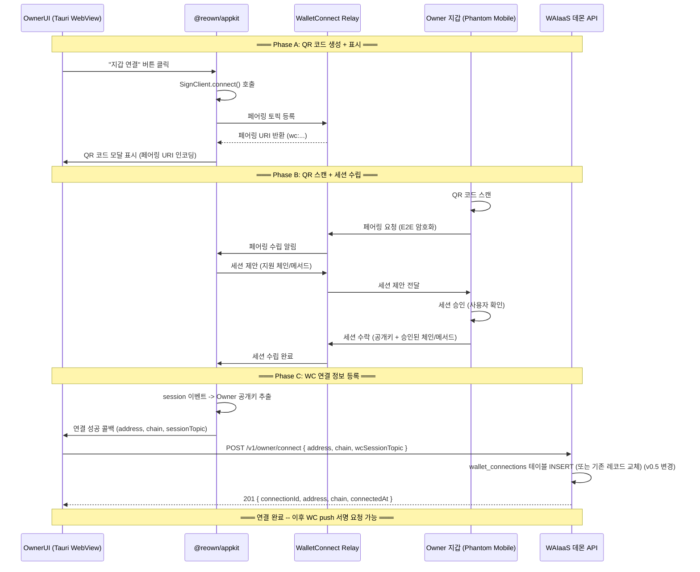
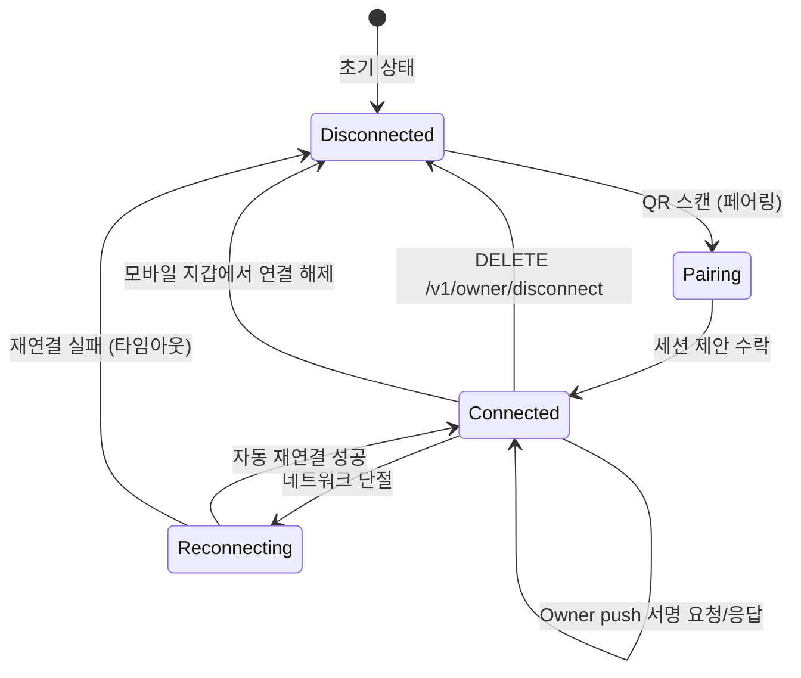

# Owner 지갑 연결 + 인증 프로토콜 설계 (OWNR-CONN v0.7)

**문서 ID:** OWNR-CONN
**작성일:** 2026-02-05
**v0.5 업데이트:** 2026-02-07
**v0.7 보완:** 2026-02-08
**상태:** v0.7 보완
**참조:** SESS-PROTO (30-session-token-protocol.md), TX-PIPE (32-transaction-pipeline-api.md), CORE-06 (29-api-framework-design.md), CORE-01 (24-monorepo-data-directory.md), LOCK-MECH (33-time-lock-approval-mechanism.md), AUTH-REDESIGN (52-auth-model-redesign.md)
**요구사항:** OWNR-01 (브라우저 지갑), OWNR-02 (WalletConnect QR), OWNR-03 (서명 승인), API-05 (Owner 엔드포인트), OWNR-05 (CLI 수동 서명), OWNR-06 (APPROVAL 타임아웃 설정)

---

## 1. 문서 개요

### 1.1 목적

Owner는 WAIaaS에서 **자금 관련 인가 주체**이다. 시스템 관리는 masterAuth, 에이전트 API는 sessionAuth가 담당한다. ownerAuth는 **자금 이동 승인(APPROVAL 거래)**과 **Kill Switch 복구(동결 해제)** 2곳에만 적용된다. (v0.5 변경) 이 문서는 Owner 지갑이 WAIaaS 데몬에 연결되는 전체 프로토콜, 연결 후 사용되는 ownerAuth 미들웨어, 그리고 Owner 관련 API 엔드포인트를 구현 가능한 수준으로 설계한다.

### 1.2 요구사항 매핑

| 요구사항 | 설명 | 충족 섹션 |
|---------|------|-----------|
| OWNR-01 | 브라우저 기반 지갑 연결 (Tauri WebView) | 섹션 3 (Tauri Desktop 연결 플로우) |
| OWNR-02 | WalletConnect v2 QR 코드 기반 연결 | 섹션 2 (WalletConnect v2 아키텍처) + 섹션 3 (시퀀스 다이어그램) |
| OWNR-03 | Owner 서명 기반 거래 승인 | 섹션 5 (ownerAuth 미들웨어) + 섹션 6 (approve API) |
| API-05 | Owner 관련 API 엔드포인트 | 섹션 6 (Owner API 엔드포인트) |
| OWNR-05 | CLI 수동 서명 플로우 (v0.5) | 섹션 8.2 (CLI 직접 서명), 52-auth-model-redesign.md 섹션 5 |
| OWNR-06 | APPROVAL 타임아웃 설정 가능 (v0.5) | 52-auth-model-redesign.md 섹션 3.2 |

### 1.3 v0.1 -> v0.2 변경 요약

| 항목 | v0.1 (Cloud) | v0.2 (Self-Hosted) | 근거 |
|------|-------------|-------------------|------|
| Owner 인증 | OAuth 2.1 + API Key | SIWS/SIWE 지갑 서명 | 지갑 소유권 = 관리 권한. OAuth 인프라 불필요 |
| 관리 UI | 웹 대시보드 (SaaS) | Tauri Desktop 앱 + CLI | Self-Hosted 로컬 데몬. 웹 서버 없음 |
| 지갑 연결 | MetaMask 브라우저 익스텐션 직접 연결 | WalletConnect v2 QR 코드 (모바일 지갑) | Tauri WebView는 브라우저 익스텐션 미지원 |
| Owner API 인증 | Bearer API Key | Bearer ownerSignaturePayload (SIWS/SIWE) | 단기 서명 기반 인가. 영구 키 탈취 위험 제거 |

### 1.4 v0.2 -> v0.5 변경 요약 (v0.5 변경)

| 항목 | v0.2 | v0.5 | 근거 |
|------|------|------|------|
| Owner 인증 범위 | 17+ 엔드포인트 전체 관리 | 2곳(거래 승인+KS 복구)으로 한정 | 자금 영향 기준 분리 |
| Owner 주소 저장 | owner_wallets 테이블 (시스템 전역) | agents.owner_address (에이전트별) | 멀티 에이전트 격리 |
| WalletConnect 역할 | 유일한 Owner 연결 경로 | 선택적 편의 기능 (CLI 대안 존재) | WC 외부 의존성 최소화 |
| Owner API 인증 | ownerAuth 8개 엔드포인트 | ownerAuth 2개 + masterAuth 나머지 | 3-tier 분리 |

### 1.5 Tauri WebView 제약사항

Tauri 2는 시스템 네이티브 WebView(WKWebView/WebView2/WebKitGTK)를 사용하며, **Chrome Extension API를 지원하지 않는다**. 따라서:

- `window.solana` (Phantom 브라우저 익스텐션) 사용 불가
- `window.ethereum` (MetaMask 브라우저 익스텐션) 사용 불가
- **WalletConnect v2 QR 코드 방식이 Tauri Desktop에서 실용적인 Owner 지갑 연결 경로** (CLI 수동 서명이 항상 대안으로 존재) (v0.5 변경)

향후 Phantom Embedded SDK (`@phantom/browser-sdk`)를 대안으로 검토 가능하나, 현재 **체인 무관 설계 원칙**에 따라 Reown AppKit (Solana + EVM 모두 지원) 우선.

---

## 2. WalletConnect v2 아키텍처 개요

### 2.1 역할 분배

WAIaaS는 WalletConnect v2 프로토콜에서 **dApp(요청자)** 역할을 수행한다. Owner의 모바일 지갑이 Wallet(서명자) 역할이다.

> **v0.5 변경:** WalletConnect는 Owner 지갑 연결의 "유일한 경로"가 아니다. WC는 모바일 지갑 push 서명의 **선택적 편의 기능**이며, CLI 수동 서명이 항상 대안으로 존재한다 (52-auth-model-redesign.md 섹션 5 참조).

```
┌─────────────────────┐         ┌──────────────────────┐         ┌──────────────────────┐
│ WAIaaS 데몬          │         │ WalletConnect Relay  │         │ Owner 모바일 지갑     │
│ (dApp - 요청자)      │◄───────►│ wss://relay.wc.com   │◄───────►│ (Wallet - 서명자)     │
│                     │   E2E   │ (메시지 중계만)       │   E2E   │ Phantom / MetaMask    │
│ @reown/appkit       │ 암호화   │                      │ 암호화   │ Mobile               │
│ (Tauri WebView 내)  │         │                      │         │                      │
└─────────────────────┘         └──────────────────────┘         └──────────────────────┘
```

**핵심 특성:**
- Relay 서버는 **메시지를 중계할 뿐**, 내용을 읽을 수 없다 (E2E 암호화)
- projectId는 **읽기 전용 식별자** -- Relay 접근 허용일 뿐 보안 시크릿 아님
- 세션이 수립되면 Owner 지갑의 **공개키**를 WAIaaS가 알 수 있다

### 2.2 projectId 관리

> **v0.5 변경:** WalletConnect projectId 설정은 **선택적**이다. 미설정 시 WC 편의 기능만 비활성되며, ownerAuth 자체는 CLI 수동 서명으로 동작 가능하다 (24-monorepo-data-directory.md Task 2와 일관).

```toml
# ~/.waiaas/config.toml

# ─────────────────────────────────────────
# WalletConnect v2 설정 (선택적 -- 미설정 시 WC push 서명 비활성)
# Reown Cloud에서 무료 projectId 발급: https://cloud.reown.com
# ─────────────────────────────────────────
[walletconnect]
enabled = false   # (v0.5) 선택적 기능. true로 변경 시 project_id 필수.
project_id = ""   # Reown Cloud에서 발급. 기본값 없음.
```

| 항목 | 값 |
|------|-----|
| 설정 위치 | `config.toml [walletconnect].project_id` |
| 환경변수 | `WAIAAS_WALLETCONNECT_PROJECT_ID` |
| 기본값 | `""` (빈 문자열 -- 미설정 시 WC push 서명 기능 비활성) |
| 발급 방법 | [Reown Cloud](https://cloud.reown.com) 무료 회원가입 후 프로젝트 생성 |
| `waiaas init` 안내 | `"WalletConnect projectId가 설정되지 않았습니다 (선택적). 모바일 지갑 push 서명을 사용하려면 https://cloud.reown.com 에서 발급하세요."` (v0.5 변경) |

**Zod 스키마 (ConfigSchema 확장):**

```typescript
// packages/core/src/schemas/config.schema.ts (CORE-01 확장)
walletconnect: z.object({
  enabled: z.boolean().default(false),  // (v0.5) 선택적 기능
  project_id: z.string().default(''),
}).default({}),
```

### 2.3 지원 네임스페이스

WalletConnect v2 프로토콜에서 네임스페이스(namespace)는 체인 그룹을 식별한다.

| 체인 | 네임스페이스 | CAIP-2 Chain ID | 지원 시점 |
|------|------------|----------------|-----------|
| Solana Mainnet | `solana` | `solana:5eykt4UsFv8P8NJdTREpY1vzqKqZKvdp` | v0.2 |
| Solana Devnet | `solana` | `solana:4uhcVJyU9pJkvQyS88uRDiswHXSCkY3z` | v0.2 |
| Ethereum Mainnet | `eip155` | `eip155:1` | v0.3 |
| Ethereum Sepolia | `eip155` | `eip155:11155111` | v0.3 |

### 2.4 지원 메서드

| 체인 | 메서드 | 용도 |
|------|--------|------|
| Solana | `solana_signMessage` | SIWS 메시지 서명 (Owner 인증) |
| EVM (v0.3) | `personal_sign` | SIWE 메시지 서명 (Owner 인증) |

**참고:** 트랜잭션 서명(`solana_signTransaction`, `eth_signTransaction`)은 사용하지 않는다. WAIaaS 데몬이 에이전트의 개인키로 직접 서명하며, Owner 지갑은 **관리 작업 인가(메시지 서명)에만** 사용된다.

---

## 3. Owner 지갑 연결 플로우 -- Tauri Desktop

### 3.1 전체 시퀀스 다이어그램



### 3.2 Reown AppKit 초기화 코드 패턴

```typescript
// packages/desktop/src/lib/wallet-connect.ts (Tauri WebView 내)
import { createAppKit } from '@reown/appkit'
import { solana, solanaDevnet } from '@reown/appkit/networks'

// 1. AppKit 인스턴스 초기화
const appKit = createAppKit({
  projectId: config.walletconnect.project_id,  // config.toml에서 로드
  networks: [solana, solanaDevnet],
  metadata: {
    name: 'WAIaaS',
    description: 'Self-Hosted Wallet-as-a-Service for AI Agents',
    url: 'http://127.0.0.1:3100',
    icons: ['https://waiaas.dev/icon.png'],
  },
  features: {
    email: false,       // 소셜 로그인 비활성
    socials: false,     // 소셜 로그인 비활성
    onramp: false,      // 온램프 비활성
  },
})

// 2. 연결 이벤트 리스너
appKit.subscribeEvents((event) => {
  switch (event.data.event) {
    case 'CONNECT_SUCCESS': {
      const { address, chainId } = event.data.properties
      // Daemon에 WC 연결 정보 등록
      registerWcConnection(address, chainId, appKit.getWalletConnectSession()?.topic)
      break
    }
    case 'DISCONNECT_SUCCESS': {
      // Daemon에서 WC 연결 해제
      disconnectWcConnection()
      break
    }
    case 'SESSION_UPDATE': {
      // 세션 갱신 시 lastActiveAt 업데이트
      updateWcActivity()
      break
    }
  }
})

// 3. 연결 모달 열기 (사용자 클릭 시)
function openConnectModal(): void {
  appKit.open()  // QR 코드 모달 자동 표시
}
```

### 3.3 Daemon에 WC 연결 등록 API

```typescript
// POST /v1/owner/connect 호출 (Tauri WebView -> Daemon)
async function registerWcConnection(
  address: string,
  chain: string,
  wcSessionTopic?: string,
): Promise<void> {
  const response = await fetch('http://127.0.0.1:3100/v1/owner/connect', {
    method: 'POST',
    headers: { 'Content-Type': 'application/json' },
    body: JSON.stringify({ address, chain, wcSessionTopic }),
  })
  if (!response.ok) {
    throw new Error(`WC 연결 등록 실패: ${response.status}`)
  }
}
```

**POST /v1/owner/connect:**
- **인증:** 없음 (초기 연결이므로 아직 Owner 서명 불가). 단, `hostValidation` 미들웨어로 localhost만 허용
- **보안:** localhost 전용이므로 외부 접근 불가
- **요청:** `{ address: string, chain: 'solana' | 'ethereum', wcSessionTopic?: string }`
- **응답:** `201 { connectionId, address, chain, connectedAt }`
- **용도 (v0.5 변경):** WalletConnect push 서명 캐시 등록. agents.owner_address와는 별개. WC 연결 없이도 ownerAuth는 CLI 수동 서명으로 사용 가능.

---

## 4. Owner 지갑 연결 플로우 -- CLI 대안

### 4.1 CLI `waiaas owner connect` 커맨드

Tauri Desktop 없이 터미널에서 직접 WalletConnect를 통해 Owner 지갑을 연결하는 선택적 편의 경로. CLI에서는 `@reown/appkit` 불필요하며, `@walletconnect/sign-client`를 직접 사용한다.

> **v0.5 변경:** 이 WC 연결이 없어도 ownerAuth는 CLI 수동 서명으로 사용 가능하다 (52-auth-model-redesign.md 섹션 5 참조). WC 연결은 모바일 push 서명 자동화를 위한 선택적 편의 기능이다.

```
$ waiaas owner connect --chain solana

WAIaaS Owner Wallet Connection (선택적 -- WC push 서명 활성화)
━━━━━━━━━━━━━━━━━━━━━━━━━━━━━━━━━━━━━━━━━━━━━━━━━━━━━━━━━━━━

1. 아래 QR 코드를 모바일 지갑 (Phantom/MetaMask)으로 스캔하세요:

   ██████████████████████████████████
   ██ ▄▄▄▄▄ █▀▀▄█ ▄▀▀▄█ ▄▄▄▄▄ ██
   ██ █   █ █▀▄▀▀▄█▀▀▄█ █   █ ██
   ██ █▄▄▄█ ██▄ ▀▄ ▄▀██ █▄▄▄█ ██
   ██▄▄▄▄▄▄▄█▄█▄█▄█▄█▄█▄▄▄▄▄▄▄██
   ██████████████████████████████████

2. 지갑에서 연결 요청을 승인하세요.
3. 대기 중... (120초 타임아웃)

✓ WC 연결 완료 (모바일 push 서명 활성화)
  주소: 7xKXtg2CW87d97TXJSDpbD5jBkheTqA83TZRuJosgAsU
  체인: solana
  연결 시각: 2026-02-05T10:30:00.000Z
```

### 4.2 CLI 연결 플로우

```typescript
// packages/cli/src/commands/owner-connect.ts
import { SignClient } from '@walletconnect/sign-client'
import QRCode from 'qrcode-terminal'

async function ownerConnect(chain: 'solana' | 'ethereum'): Promise<void> {
  // 1. Sign Client 초기화
  const signClient = await SignClient.init({
    projectId: config.walletconnect.project_id,
    metadata: {
      name: 'WAIaaS CLI',
      description: 'WAIaaS Owner Wallet Connection',
      url: 'http://127.0.0.1:3100',
      icons: [],
    },
  })

  // 2. 세션 요청 (URI 생성)
  const { uri, approval } = await signClient.connect({
    requiredNamespaces: chain === 'solana'
      ? {
          solana: {
            chains: ['solana:5eykt4UsFv8P8NJdTREpY1vzqKqZKvdp'],
            methods: ['solana_signMessage'],
            events: [],
          },
        }
      : {
          eip155: {
            chains: ['eip155:1'],
            methods: ['personal_sign'],
            events: ['accountsChanged'],
          },
        },
  })

  // 3. 터미널에 QR 코드 출력
  if (uri) {
    QRCode.generate(uri, { small: true }, (qr: string) => {
      console.log('\n아래 QR 코드를 모바일 지갑으로 스캔하세요:\n')
      console.log(qr)
    })
  }

  // 4. 세션 수립 대기 (120초 타임아웃)
  console.log('\n대기 중... (120초 타임아웃)')
  const session = await Promise.race([
    approval(),
    new Promise((_, reject) =>
      setTimeout(() => reject(new Error('연결 타임아웃')), 120_000)
    ),
  ])

  // 5. Owner 공개키 추출
  const accounts = Object.values(session.namespaces)
    .flatMap((ns: { accounts: string[] }) => ns.accounts)
  // CAIP-10 형식: "solana:5eykt4UsFv8P8NJdTREpY1vzqKqZKvdp:7xKXtg..."
  const [namespace, chainId, address] = accounts[0].split(':')

  // 6. Daemon에 WC 연결 정보 등록
  await registerWcConnection(address, chain, session.topic)

  console.log(`\n✓ WC 연결 완료 (모바일 push 서명 활성화)`)
  console.log(`  주소: ${address}`)
  console.log(`  체인: ${chain}`)
  console.log(`  연결 시각: ${new Date().toISOString()}`)
}
```

### 4.3 CLI vs Desktop 비교

| 항목 | Tauri Desktop | CLI |
|------|--------------|-----|
| QR 표시 | @reown/appkit 모달 (그래픽) | qrcode-terminal (ASCII art) |
| WC 라이브러리 | @reown/appkit (고수준) | @walletconnect/sign-client (저수준) |
| 서명 요청 UI | 모바일 지갑 앱 알림 | 모바일 지갑 앱 알림 |
| 세션 유지 | AppKit localStorage 캐시 | 파일 기반 세션 캐시 (~/.waiaas/wc-session.json) |
| 자동 재연결 | AppKit 내장 | CLI 시작 시 수동 재연결 시도 |
| 사용 편의성 | 높음 (GUI) | 중간 (터미널) |
| ownerAuth 대안 (v0.5) | CLI 수동 서명 (WC 미연결 시 자동 폴백) | CLI 수동 서명 (항상 가능) |

---

## 5. ownerAuth 미들웨어 상세 설계

### 5.1 CORE-06 ownerAuth stub 완성

CORE-06에서 `ownerAuth`는 인증 미들웨어 중 하나로 정의되었다. Phase 7의 `owner-verifier` 유틸리티(`verifySIWS`, `verifySIWE`)를 재사용하여 완성한다.

> **v0.5 변경:** ownerAuth의 적용 범위가 변경되었다. v0.2에서 `/v1/owner/*` 라우트 전체에 적용되던 것이 v0.5에서는 **정확히 2개 라우트(approve/:txId, recover)에만** 적용된다. 나머지 Owner 관련 엔드포인트는 masterAuth(implicit)로 전환되었다 (52-auth-model-redesign.md 참조).

### 5.2 인증 방식

ownerAuth가 적용되는 2개 엔드포인트는 매 요청마다 **SIWS/SIWE 서명**을 포함한다. 세션 기반 인증(JWT)이 아닌 **요청별 서명(per-request signature)** 방식이다. (v0.5 변경: 적용 범위 2곳 한정)

```
Authorization: Bearer <ownerSignaturePayload>
```

### 5.3 ownerSignaturePayload 구조

`ownerSignaturePayload`는 base64url 인코딩된 JSON 문자열이다:

```typescript
// packages/core/src/schemas/owner-auth.schema.ts
import { z } from 'zod'

export const OwnerSignaturePayloadSchema = z.object({
  /** 체인 식별자 */
  chain: z.enum(['solana', 'ethereum']),

  /** Owner 지갑 공개키/주소 */
  address: z.string(),

  /** 수행하려는 작업 (v0.5 변경: 7개에서 2개로 축소) */
  action: z.enum([
    'approve_tx',
    'recover',
  ]),

  /** 일회성 nonce (LRU 캐시 기반, SESS-PROTO와 동일) */
  nonce: z.string(),

  /** 요청 시각 (ISO 8601, 5분 이내만 유효) */
  timestamp: z.string().datetime(),

  /** SIWS/SIWE 표준 메시지 원문 */
  message: z.string(),

  /** 서명 값 (Solana: base58, Ethereum: hex) */
  signature: z.string(),
})

export type OwnerSignaturePayload = z.infer<typeof OwnerSignaturePayloadSchema>
```

**payload 예시 (base64url 디코딩 후):**

```json
{
  "chain": "solana",
  "address": "7xKXtg2CW87d97TXJSDpbD5jBkheTqA83TZRuJosgAsU",
  "action": "approve_tx",
  "nonce": "a1b2c3d4e5f67890a1b2c3d4e5f67890",
  "timestamp": "2026-02-05T10:30:00.000Z",
  "message": "localhost:3100 wants you to sign in with your Solana account:\n7xKXtg2CW87d97TXJSDpbD5jBkheTqA83TZRuJosgAsU\n\nWAIaaS Owner Action: approve_tx\n\nURI: http://localhost:3100\nVersion: 1\nChain ID: 1\nNonce: a1b2c3d4e5f67890a1b2c3d4e5f67890\nIssued At: 2026-02-05T10:30:00.000Z\nExpiration Time: 2026-02-05T10:35:00.000Z",
  "signature": "3Kp8V2...base58...signature"
}
```

### 5.4 Owner 서명 메시지 포맷 (SIWS/SIWE 표준 준수)

Owner가 서명하는 메시지는 SESS-PROTO의 세션 생성 메시지와 동일한 EIP-4361 포맷을 따르되, **statement에 action을 명시**한다:

```
localhost:3100 wants you to sign in with your Solana account:
7xKXtg2CW87d97TXJSDpbD5jBkheTqA83TZRuJosgAsU

WAIaaS Owner Action: approve_tx

URI: http://localhost:3100
Version: 1
Chain ID: 1
Nonce: a1b2c3d4e5f67890a1b2c3d4e5f67890
Issued At: 2026-02-05T10:30:00.000Z
Expiration Time: 2026-02-05T10:35:00.000Z
```

| 필드 | 값 | 설명 |
|------|-----|------|
| domain | `localhost:3100` | WAIaaS 데몬 호스트 |
| address | Owner 공개키/주소 | 서명자 식별 |
| statement | `WAIaaS Owner Action: {action}` | 수행할 작업 명시 (사용자가 서명 시 확인 가능) |
| URI | `http://localhost:3100` | 데몬 URL |
| nonce | 서버 발급 nonce | 일회성 재생 방지 |
| issuedAt | ISO 8601 | 서명 시각 |
| expirationTime | issuedAt + 5분 | 서명 유효 기간 |

### 5.5 ownerAuth 미들웨어 검증 로직 (8단계)

```typescript
// packages/daemon/src/server/middleware/owner-auth.ts
import { createMiddleware } from 'hono/factory'
import { verifySIWS, verifySIWE } from '../../services/owner-verifier.js'
import { verifyAndConsumeNonce } from '../../infrastructure/cache/nonce-cache.js'
import { OwnerSignaturePayloadSchema } from '@waiaas/core/schemas'
import type { AppBindings } from '../types.js'

/** ownerAuth 미들웨어가 기대하는 action 매핑 (v0.5 변경: 6개에서 2개로 축소) */
const ROUTE_ACTION_MAP: Record<string, string> = {
  'POST /v1/owner/approve': 'approve_tx',
  'POST /v1/owner/recover': 'recover',
}

export function ownerAuthMiddleware(db: DrizzleInstance) {
  return createMiddleware<AppBindings>(async (c, next) => {

    // ═══ Step 1: Authorization 헤더 파싱 + payload 추출 ═══
    const authHeader = c.req.header('Authorization')
    if (!authHeader?.startsWith('Bearer ')) {
      throw new WaiaasError(
        'UNAUTHORIZED',
        'Owner 서명이 필요합니다. Authorization: Bearer <payload> 형식으로 전달하세요.',
        401,
      )
    }

    const token = authHeader.slice(7) // 'Bearer ' 제거
    let payload: OwnerSignaturePayload
    try {
      const decoded = Buffer.from(token, 'base64url').toString('utf-8')
      payload = OwnerSignaturePayloadSchema.parse(JSON.parse(decoded))
    } catch {
      throw new WaiaasError(
        'INVALID_SIGNATURE',
        'Owner 서명 페이로드 형식이 올바르지 않습니다.',
        401,
      )
    }

    // ═══ Step 2: timestamp 유효성 (5분 이내) ═══
    const now = Date.now()
    const signedAt = new Date(payload.timestamp).getTime()
    const MAX_AGE_MS = 5 * 60 * 1000 // 5분
    if (Math.abs(now - signedAt) > MAX_AGE_MS) {
      throw new WaiaasError(
        'INVALID_SIGNATURE',
        'Owner 서명이 만료되었습니다. 5분 이내에 서명된 요청만 유효합니다.',
        401,
      )
    }

    // ═══ Step 3: nonce 유효성 (일회성, LRU에서 확인 후 삭제) ═══
    const nonceValid = verifyAndConsumeNonce(payload.nonce)
    if (!nonceValid) {
      throw new WaiaasError(
        'INVALID_NONCE',
        '유효하지 않거나 이미 사용된 nonce입니다.',
        401,
      )
    }

    // ═══ Step 4: chain 분기 -> SIWS/SIWE 서명 검증 ═══
    // Phase 7 owner-verifier 유틸리티 재사용
    const verifyResult = payload.chain === 'solana'
      ? await verifySIWS({
          message: payload.message,
          signature: payload.signature,
          publicKey: payload.address,
        })
      : await verifySIWE({
          message: payload.message,
          signature: payload.signature,
          ownerAddress: payload.address,
        })

    if (!verifyResult.valid) {
      throw new WaiaasError(
        'INVALID_SIGNATURE',
        'Owner 서명 검증에 실패했습니다.',
        401,
      )
    }

    // ═══ Step 5: 서명자 주소 == 에이전트의 owner_address 확인 (v0.5 변경) ═══
    // v0.2: owner_wallets.address 테이블에서 조회
    // v0.5: agents.owner_address 컬럼에서 조회 (에이전트별 Owner)
    const agentId = resolveAgentIdFromContext(c) // txId -> transactions.agent_id
    const agent = await db.select()
      .from(agents)
      .where(eq(agents.id, agentId))
      .get()

    if (!agent || agent.ownerAddress !== payload.address) {
      throw new WaiaasError(
        'OWNER_MISMATCH',
        '에이전트의 등록된 Owner 주소와 서명자 주소가 일치하지 않습니다.',
        403,
      )
    }

    // ═══ Step 6: action == 요청된 API 경로의 기대 action 확인 ═══
    const method = c.req.method
    const path = c.req.path.replace(/\/[0-9a-f-]{36}$/, '') // UUID 경로 파라미터 제거
    const routeKey = `${method} ${path}`
    const expectedAction = ROUTE_ACTION_MAP[routeKey]

    if (expectedAction && payload.action !== expectedAction) {
      throw new WaiaasError(
        'INVALID_SIGNATURE',
        `서명된 action(${payload.action})이 요청 경로의 기대 action(${expectedAction})과 일치하지 않습니다.`,
        403,
      )
    }

    // ═══ Step 7: 성공 -> Hono 컨텍스트에 Owner 정보 설정 ═══
    c.set('ownerAddress', payload.address)
    c.set('ownerChain', payload.chain)

    // ═══ Step 8: next() ═══
    await next()
  })
}

/**
 * agentId 해석 체인 (v0.5 신규)
 * - 거래 승인: txId -> transactions.agent_id -> agents.owner_address 대조
 * - KS 복구: 서명자 주소로 에이전트 존재 여부 확인
 */
function resolveAgentIdFromContext(c: Context): string {
  const path = c.req.path

  // 거래 승인: txId -> agentId
  if (path.startsWith('/v1/owner/approve/')) {
    const txId = c.req.param('txId')
    const tx = db.select()
      .from(transactions)
      .where(eq(transactions.id, txId))
      .get()
    if (!tx) throw new WaiaasError('TRANSACTION_NOT_FOUND', '거래를 찾을 수 없습니다.', 404)
    return tx.agentId
  }

  // KS 복구: 서명자 주소로 에이전트 존재 여부 확인
  if (path === '/v1/owner/recover') {
    const ownerAgents = db.select()
      .from(agents)
      .where(eq(agents.ownerAddress, c.get('ownerAddress')))
      .all()
    if (ownerAgents.length === 0) {
      throw new WaiaasError('OWNER_MISMATCH', '해당 주소를 Owner로 가진 에이전트가 없습니다.', 403)
    }
    return ownerAgents[0].id // 대표 에이전트 (복구는 시스템 전체)
  }

  throw new WaiaasError('UNAUTHORIZED', '지원되지 않는 ownerAuth 경로입니다.', 401)
}
```

### 5.6 ownerAuth 검증 단계 요약

| 단계 | 검증 항목 | 실패 시 에러 | HTTP |
|------|----------|-------------|------|
| 1 | Authorization 헤더 파싱 + payload 디코딩 | `UNAUTHORIZED` | 401 |
| 2 | timestamp 유효성 (5분 이내) | `INVALID_SIGNATURE` | 401 |
| 3 | nonce 일회성 (LRU 캐시 확인 + 삭제) | `INVALID_NONCE` | 401 |
| 4 | SIWS/SIWE 서명 암호학적 검증 | `INVALID_SIGNATURE` | 401 |
| 5 | 서명자 == agents.owner_address (v0.5 변경) | `OWNER_MISMATCH` | 403 |
| 6 | action == 라우트 기대 action | `INVALID_SIGNATURE` | 403 |
| 7 | 컨텍스트 설정 (ownerAddress, ownerChain) | - | - |
| 8 | next() 호출 | - | - |

### 5.7 AppBindings 타입 확장 (Phase 8 보완)

```typescript
// packages/daemon/src/server/types.ts (CORE-06 + SESS-PROTO 확장)
type AppBindings = {
  Variables: {
    db: DrizzleInstance
    keyStore: ILocalKeyStore
    adapters: AdapterRegistry
    requestId: string
    // Phase 7 -- sessionAuth에서 설정
    sessionId?: string
    agentId?: string
    constraints?: SessionConstraints
    usageStats?: SessionUsageStats
    // Phase 8 -- ownerAuth에서 설정
    ownerAddress?: string
    ownerChain?: 'solana' | 'ethereum'
  }
}
```

### 5.8 ownerAuth vs sessionAuth 비교

| 항목 | sessionAuth | ownerAuth |
|------|------------|-----------|
| 적용 범위 | 에이전트 API (`/v1/wallet/*`, `/v1/transactions/*`, `GET /v1/sessions`) | 2개 라우트 (POST /v1/owner/approve/:txId, POST /v1/owner/recover) (v0.5 변경) |
| 인증 방식 | JWT 토큰 (상태 기반) | 요청별 SIWS/SIWE 서명 (무상태) |
| 토큰 수명 | 최대 7일 | 요청 시점 5분 이내 서명 |
| nonce | 세션 생성 시 1회 사용 | 매 요청마다 새 nonce |
| 재생 방지 | JWT jti + DB 폐기 확인 | nonce 일회성 + timestamp 5분 제한 |
| 사용자 | AI 에이전트 | Owner (인간) |
| DB 의존성 | Stage 2에서 sessions 조회 | Step 5에서 agents.owner_address 조회 (v0.5 변경) |
| Phase 7 재사용 | owner-verifier (세션 생성 시) | owner-verifier (매 요청 시) |

### 5.9 ownerAuth 라우트 등록 패턴 (v0.5 변경)

```typescript
// packages/daemon/src/server/routes/owner.ts
import { OpenAPIHono } from '@hono/zod-openapi'
import { ownerAuthMiddleware } from '../middleware/owner-auth.js'
import type { AppBindings } from '../types.js'

export function registerOwnerRoutes(
  app: OpenAPIHono<AppBindings>,
  deps: AppContext,
): void {
  // (v0.5 변경) ownerAuth를 /v1/owner/* 전체가 아닌 특정 2개 라우트에만 적용
  // 나머지 /v1/owner/* 라우트는 authRouter에서 masterAuth(implicit)로 디스패치

  // POST /v1/owner/approve/:txId -- ownerAuth 적용 (자금 이동 승인)
  app.post('/approve/:txId', ownerAuthMiddleware(deps.db), handleApprove)

  // POST /v1/owner/recover -- dualAuth 적용 (ownerAuth + masterAuth explicit)
  // (dualAuth 미들웨어는 authRouter에서 처리)

  // 나머지 엔드포인트는 masterAuth(implicit) -- authRouter에서 자동 디스패치
  // POST /v1/owner/connect -- None (localhost)
  // DELETE /v1/owner/disconnect -- masterAuth(implicit)
  // POST /v1/owner/reject/:txId -- masterAuth(implicit)
  // POST /v1/owner/kill-switch -- masterAuth(implicit)
  // GET /v1/owner/pending-approvals -- masterAuth(implicit)
  // PUT /v1/owner/policies/:policyId -- masterAuth(implicit)
  // POST /v1/owner/policies -- masterAuth(implicit)
}
```

---

## 6. Owner 관련 API 엔드포인트 (API-05) (v0.5 변경)

> **v0.5 변경:** 기존 8개 엔드포인트 중 ownerAuth가 유지되는 것은 2개(approve, recover)뿐이다. 나머지 6개는 masterAuth(implicit)로 전환되었다. 52-auth-model-redesign.md 섹션 4 참조.

### 6.1 엔드포인트 전체 목록 (v0.5 변경)

| # | Method | Path | v0.5 인증 | action | 설명 |
|---|--------|------|-----------|--------|------|
| 1 | POST | `/v1/owner/connect` | None (localhost) | - | WC 연결 정보 등록 (선택적 편의 기능) |
| 2 | DELETE | `/v1/owner/disconnect` | masterAuth (implicit) (v0.5 변경) | - | WC 연결 해제 |
| 3 | POST | `/v1/owner/approve/:txId` | **ownerAuth** | `approve_tx` | 거래 승인 (APPROVAL 티어) |
| 4 | POST | `/v1/owner/reject/:txId` | masterAuth (implicit) (v0.5 변경) | - | 거래 거절 |
| 5 | POST | `/v1/owner/kill-switch` | masterAuth (implicit) (v0.5 변경) | - | Kill Switch 발동 |
| 6 | GET | `/v1/owner/pending-approvals` | masterAuth (implicit) (v0.5 변경) | - | 승인 대기 거래 목록 |
| 7 | PUT | `/v1/owner/policies/:policyId` | masterAuth (implicit) (v0.5 변경) | - | 정책 수정 |
| 8 | POST | `/v1/owner/policies` | masterAuth (implicit) (v0.5 변경) | - | 정책 생성 |

> **ownerAuth 유지 기준 (자금 영향 기준):** 자금 이동/동결 해제에 직접 영향 = ownerAuth. 보호적 행위/조회/관리 = masterAuth(implicit). 52-auth-model-redesign.md 섹션 4 참조.

### 6.2 POST /v1/owner/approve/:txId (거래 승인)

LOCK-MECH의 APPROVAL 플로우에서 QUEUED 상태의 거래를 Owner가 승인한다.

**인증:** ownerAuth (action=`approve_tx`)

**경로 파라미터:**

```typescript
const ApproveParamsSchema = z.object({
  txId: z.string().uuid().openapi({ description: '거래 UUID v7' }),
})
```

**응답 스키마 (200 OK):**

```typescript
const ApproveResponseSchema = z.object({
  transactionId: z.string().uuid(),
  status: z.literal('EXECUTING'),
  approvedAt: z.string().datetime(),
  approvedBy: z.string().openapi({ description: 'Owner 지갑 주소' }),
}).openapi('ApproveResponse')
```

**처리 로직:**

```typescript
// POST /v1/owner/approve/:txId 핸들러
async function handleApprove(c: Context): Promise<Response> {
  const { txId } = c.req.param()
  const ownerAddress = c.get('ownerAddress')

  // 1. 트랜잭션 조회 + 상태 검증 (BEGIN IMMEDIATE)
  const result = sqlite.transaction(() => {
    const tx = sqlite.prepare(
      'SELECT id, status, tier, queued_at, expires_at FROM transactions WHERE id = ?'
    ).get(txId)

    if (!tx) throw new WaiaasError('TX_NOT_FOUND', '거래를 찾을 수 없습니다.', 404)
    if (tx.status !== 'QUEUED') {
      throw new WaiaasError('TX_NOT_PENDING_APPROVAL', `현재 상태(${tx.status})에서 승인할 수 없습니다.`, 409)
    }

    // 만료 확인
    const now = Math.floor(Date.now() / 1000)
    if (tx.expires_at && now > tx.expires_at) {
      // 만료된 거래 -> EXPIRED 전이
      sqlite.prepare(
        "UPDATE transactions SET status = 'EXPIRED', error = 'APPROVAL_TIMEOUT' WHERE id = ?"
      ).run(txId)
      throw new WaiaasError('TX_EXPIRED', '승인 대기 시간이 만료되었습니다.', 410)
    }

    // 2. 상태 전이: QUEUED -> EXECUTING
    sqlite.prepare(
      "UPDATE transactions SET status = 'EXECUTING' WHERE id = ? AND status = 'QUEUED'"
    ).run(txId)

    return tx
  }).immediate()

  // 3. Stage 5a 실행 트리거 (비동기 -- buildTransaction부터 재실행)
  triggerStage5Execution(txId)

  // 4. audit_log 기록
  await insertAuditLog(db, {
    eventType: 'TX_APPROVED',
    actor: `owner:${ownerAddress}`,
    transactionId: txId,
    severity: 'info',
    details: { approvedBy: ownerAddress },
  })

  return c.json({
    transactionId: txId,
    status: 'EXECUTING',
    approvedAt: new Date().toISOString(),
    approvedBy: ownerAddress,
  }, 200)
}
```

**에러:**

| 에러 코드 | HTTP | 조건 |
|----------|------|------|
| `TX_NOT_FOUND` | 404 | txId에 해당하는 거래 없음 |
| `TX_NOT_PENDING_APPROVAL` | 409 | 거래 상태가 QUEUED가 아님 |
| `TX_EXPIRED` | 410 | 승인 대기 시간 만료 |
| `OWNER_MISMATCH` | 403 | ownerAuth Step 5 실패 |

### 6.3 POST /v1/owner/reject/:txId (거래 거절) (v0.5 변경)

DELAY 또는 APPROVAL 티어의 대기 중인 거래를 거절한다.

**인증:** masterAuth (implicit) (v0.5 변경: ownerAuth에서 masterAuth로 전환. 거절은 자금 보존 = 보호적 행위.)

**경로 파라미터:**

```typescript
const RejectParamsSchema = z.object({
  txId: z.string().uuid(),
})
```

**요청 본문 (선택):**

```typescript
const RejectRequestSchema = z.object({
  reason: z.string().max(500).optional().openapi({ description: '거절 사유' }),
}).optional()
```

**응답 스키마 (200 OK):**

```typescript
const RejectResponseSchema = z.object({
  transactionId: z.string().uuid(),
  status: z.literal('CANCELLED'),
  rejectedAt: z.string().datetime(),
  rejectedBy: z.literal('master').openapi({ description: 'masterAuth actor' }),
  reason: z.string().optional(),
}).openapi('RejectResponse')
```

**처리 로직:**

```typescript
async function handleReject(c: Context): Promise<Response> {
  const { txId } = c.req.param()
  const body = await c.req.json().catch(() => ({}))
  const reason = body?.reason ?? 'OWNER_REJECTED'

  sqlite.transaction(() => {
    const tx = sqlite.prepare(
      'SELECT id, status FROM transactions WHERE id = ?'
    ).get(txId)

    if (!tx) throw new WaiaasError('TX_NOT_FOUND', '거래를 찾을 수 없습니다.', 404)
    if (tx.status !== 'QUEUED' && tx.status !== 'PENDING') {
      throw new WaiaasError('TX_NOT_PENDING', `현재 상태(${tx.status})에서 거절할 수 없습니다.`, 409)
    }

    // QUEUED/PENDING -> CANCELLED
    sqlite.prepare(
      "UPDATE transactions SET status = 'CANCELLED', error = ? WHERE id = ?"
    ).run(`REJECTED: ${reason}`, txId)

    // reserved_amount 롤백 (TOCTOU 방지 -- LOCK-MECH 참조)
    // reserved_amount가 있으면 해제
  }).immediate()

  await insertAuditLog(db, {
    eventType: 'TX_CANCELLED',
    actor: 'master',
    transactionId: txId,
    severity: 'info',
    details: { reason },
  })

  return c.json({
    transactionId: txId,
    status: 'CANCELLED',
    rejectedAt: new Date().toISOString(),
    rejectedBy: 'master',
    reason,
  }, 200)
}
```

**에러:**

| 에러 코드 | HTTP | 조건 |
|----------|------|------|
| `TX_NOT_FOUND` | 404 | txId에 해당하는 거래 없음 |
| `TX_NOT_PENDING` | 409 | 거래 상태가 QUEUED/PENDING이 아님 |

### 6.4 POST /v1/owner/kill-switch (Kill Switch 발동) (v0.5 변경)

모든 세션 폐기, 대기 거래 취소, 에이전트 정지를 일괄 수행한다. 08-04에서 상세 캐스케이드 설계.

**인증:** masterAuth (implicit) (v0.5 변경: ownerAuth에서 masterAuth로 전환. Kill Switch 발동 = 보호적 행위(자금 동결). CLI에서 별도 인증 없이 호출 가능 -- 데몬 실행 = 인증 상태.)

> **v0.5 참고:** `/v1/owner/kill-switch`와 `/v1/admin/kill-switch`는 동일한 캐스케이드 로직을 실행한다. 인증 수준은 모두 masterAuth이지만, admin 경로는 explicit(X-Master-Password), owner 경로는 implicit(헤더 불필요). Phase 21에서 경로 통합 여부를 검토한다.

**요청 스키마:**

```typescript
const KillSwitchRequestSchema = z.object({
  reason: z.string().max(500).openapi({
    description: 'Kill Switch 발동 사유',
    example: '비정상 거래 패턴 감지',
  }),
})
```

**응답 스키마 (200 OK):**

```typescript
const KillSwitchResponseSchema = z.object({
  activated: z.literal(true),
  timestamp: z.string().datetime(),
  sessionsRevoked: z.number().int().openapi({ description: '폐기된 세션 수' }),
  txCancelled: z.number().int().openapi({ description: '취소된 거래 수' }),
  agentsSuspended: z.number().int().openapi({ description: '정지된 에이전트 수' }),
}).openapi('KillSwitchResponse')
```

**처리 로직 개요 (08-04에서 상세화):**

```typescript
async function handleKillSwitch(c: Context): Promise<Response> {
  const { reason } = await c.req.json()

  // Kill Switch 중복 발동 방지
  const existing = await getKillSwitchStatus(db)
  if (existing?.active) {
    throw new WaiaasError('KILL_SWITCH_ALREADY_ACTIVE', 'Kill Switch가 이미 활성화되어 있습니다.', 409)
  }

  // 캐스케이드 실행 (08-04 상세)
  const result = await executeKillSwitch(db, sqlite, keyStore, notificationService, reason)

  await insertAuditLog(db, {
    eventType: 'KILL_SWITCH_ACTIVATED',
    actor: 'master',
    severity: 'critical',
    details: { reason, ...result },
  })

  return c.json({
    activated: true,
    timestamp: new Date().toISOString(),
    sessionsRevoked: result.sessionsRevoked,
    txCancelled: result.txCancelled,
    agentsSuspended: result.agentsSuspended,
  }, 200)
}
```

**에러:**

| 에러 코드 | HTTP | 조건 |
|----------|------|------|
| `KILL_SWITCH_ALREADY_ACTIVE` | 409 | Kill Switch 이미 활성 상태 |

### 6.5 GET /v1/owner/pending-approvals (승인 대기 거래 목록) (v0.5 변경)

APPROVAL 또는 DELAY 티어에서 QUEUED 상태인 거래 목록을 조회한다.

**인증:** masterAuth (implicit) (v0.5 변경: ownerAuth에서 masterAuth로 전환. 조회 = 시스템 관리.)

**쿼리 파라미터:**

```typescript
const PendingApprovalsQuerySchema = z.object({
  agentId: z.string().uuid().optional().openapi({ description: '에이전트 필터 (선택)' }),
  limit: z.coerce.number().int().min(1).max(100).default(20),
  cursor: z.string().uuid().optional().openapi({ description: '페이지네이션 커서 (UUID v7)' }),
})
```

**응답 스키마 (200 OK):**

```typescript
const PendingApprovalSummarySchema = z.object({
  txId: z.string().uuid(),
  agentId: z.string().uuid(),
  agentName: z.string(),
  type: z.string().openapi({ description: '거래 유형 (TRANSFER 등)' }),
  amount: z.string().openapi({ description: '금액 (최소 단위)' }),
  toAddress: z.string(),
  chain: z.string(),
  tier: z.enum(['DELAY', 'APPROVAL']),
  queuedAt: z.string().datetime(),
  expiresAt: z.string().datetime().optional(),
}).openapi('PendingApprovalSummary')

const PendingApprovalsResponseSchema = z.object({
  transactions: z.array(PendingApprovalSummarySchema),
  nextCursor: z.string().uuid().optional(),
}).openapi('PendingApprovalsResponse')
```

**처리 로직:**

```typescript
async function handlePendingApprovals(c: Context): Promise<Response> {
  const { agentId, limit, cursor } = c.req.query()

  // 커서 기반 페이지네이션 (UUID v7 시간 순서 -- TX-PIPE 결정)
  let query = db.select({
    txId: transactions.id,
    agentId: transactions.agentId,
    agentName: agents.name,
    type: transactions.type,
    amount: transactions.amount,
    toAddress: transactions.toAddress,
    chain: transactions.chain,
    tier: transactions.tier,
    queuedAt: transactions.queuedAt,
    expiresAt: transactions.expiresAt,
  })
    .from(transactions)
    .leftJoin(agents, eq(transactions.agentId, agents.id))
    .where(eq(transactions.status, 'QUEUED'))
    .orderBy(desc(transactions.id))
    .limit(parsedLimit + 1)  // 1개 더 조회하여 nextCursor 결정

  if (agentId) query = query.where(eq(transactions.agentId, agentId))
  if (cursor) query = query.where(lt(transactions.id, cursor))

  const rows = await query.all()
  const hasMore = rows.length > parsedLimit
  const items = hasMore ? rows.slice(0, parsedLimit) : rows

  return c.json({
    transactions: items,
    nextCursor: hasMore ? items[items.length - 1].txId : undefined,
  }, 200)
}
```

### 6.6 PUT /v1/owner/policies/:policyId (정책 수정) (v0.5 변경)

LOCK-MECH에서 정의한 policies 테이블의 기존 정책을 수정한다.

**인증:** masterAuth (implicit) (v0.5 변경: ownerAuth에서 masterAuth로 전환. 정책 관리 = 시스템 관리.)

**경로 파라미터:**

```typescript
const PolicyParamsSchema = z.object({
  policyId: z.string().uuid(),
})
```

**요청 스키마:**

```typescript
const UpdatePolicyRequestSchema = z.object({
  rules: z.union([
    SpendingLimitRuleSchema,
    WhitelistRuleSchema,
    TimeRestrictionRuleSchema,
    RateLimitRuleSchema,
  ]).optional().openapi({ description: '정책 규칙 (LOCK-MECH PolicyRuleSchema)' }),
  enabled: z.boolean().optional(),
  priority: z.number().int().optional(),
}).openapi('UpdatePolicyRequest')
```

**응답 스키마 (200 OK):**

```typescript
const PolicySummarySchema = z.object({
  id: z.string().uuid(),
  agentId: z.string().uuid().nullable(),
  type: z.enum(['SPENDING_LIMIT', 'WHITELIST', 'TIME_RESTRICTION', 'RATE_LIMIT']),
  rules: z.unknown(),
  priority: z.number().int(),
  enabled: z.boolean(),
  createdAt: z.string().datetime(),
  updatedAt: z.string().datetime(),
}).openapi('PolicySummary')

const UpdatePolicyResponseSchema = z.object({
  policy: PolicySummarySchema,
  updatedAt: z.string().datetime(),
}).openapi('UpdatePolicyResponse')
```

**에러:**

| 에러 코드 | HTTP | 조건 |
|----------|------|------|
| `POLICY_NOT_FOUND` | 404 | policyId에 해당하는 정책 없음 |
| `INVALID_RULES` | 400 | rules JSON이 해당 type의 Zod 스키마 검증 실패 |

### 6.7 POST /v1/owner/policies (정책 생성) (v0.5 변경)

새 정책을 생성한다.

**인증:** masterAuth (implicit) (v0.5 변경: ownerAuth에서 masterAuth로 전환. 정책 관리 = 시스템 관리.)

**요청 스키마:**

```typescript
const CreatePolicyRequestSchema = z.object({
  agentId: z.string().uuid().optional().openapi({
    description: '대상 에이전트 ID. 미지정 시 글로벌 정책',
  }),
  type: z.enum(['SPENDING_LIMIT', 'WHITELIST', 'TIME_RESTRICTION', 'RATE_LIMIT']),
  rules: z.union([
    SpendingLimitRuleSchema,
    WhitelistRuleSchema,
    TimeRestrictionRuleSchema,
    RateLimitRuleSchema,
  ]).openapi({ description: '정책 규칙 (type에 맞는 스키마)' }),
  priority: z.number().int().optional().default(0),
  enabled: z.boolean().optional().default(true),
}).openapi('CreatePolicyRequest')
```

**응답 스키마 (201 Created):**

```typescript
const CreatePolicyResponseSchema = z.object({
  policy: PolicySummarySchema,
  createdAt: z.string().datetime(),
}).openapi('CreatePolicyResponse')
```

**처리 로직:**

```typescript
async function handleCreatePolicy(c: Context): Promise<Response> {
  const body = CreatePolicyRequestSchema.parse(await c.req.json())

  // rules를 type에 맞는 Zod 스키마로 검증
  validateRulesForType(body.type, body.rules)

  const policyId = generateUUIDv7()
  const now = new Date()

  await db.insert(policies).values({
    id: policyId,
    agentId: body.agentId ?? null,
    type: body.type,
    rules: JSON.stringify(body.rules),
    priority: body.priority ?? 0,
    enabled: body.enabled ?? true,
    createdAt: now,
    updatedAt: now,
  })

  await insertAuditLog(db, {
    eventType: 'POLICY_CREATED',
    actor: 'master',
    severity: 'info',
    details: { policyId, type: body.type, agentId: body.agentId },
  })

  return c.json({
    policy: { id: policyId, ...body, createdAt: now.toISOString(), updatedAt: now.toISOString() },
    createdAt: now.toISOString(),
  }, 201)
}
```

---

## 7. WC 세션 관리 (v0.5 변경)

### 7.1 WalletConnect 세션 수명주기



| 수명주기 단계 | API/이벤트 | 처리 |
|--------------|-----------|------|
| **연결** | `POST /v1/owner/connect` | wallet_connections INSERT (v0.5 변경) |
| **유지** | WalletConnect SDK 내장 세션 ping (30분 주기) | 자동 (SDK 관리) |
| **재연결** | AppKit 자동 재연결 (localStorage 세션 캐시) | Tauri WebView 재시작 시 자동 복원 |
| **해제** | `DELETE /v1/owner/disconnect` | wallet_connections DELETE + WC 세션 종료 (v0.5 변경) |

### 7.2 wallet_connections 테이블 스키마 (v0.5 변경)

> **v0.5 변경:** v0.2의 `owner_wallets` 테이블이 `wallet_connections`로 변경되었다. 이 테이블은 WalletConnect push 서명 캐시 역할만 수행한다. Owner 주소의 SSoT는 `agents.owner_address`이다 (25-sqlite-schema.md 참조).

```typescript
// packages/daemon/src/infrastructure/database/schema.ts (CORE-02 확장)
export const walletConnections = sqliteTable('wallet_connections', {
  // -- 식별자 --
  id: text('id').primaryKey(),                    // UUID v7

  // -- 지갑 정보 --
  address: text('address').notNull(),             // Owner 지갑 공개키/주소
  chain: text('chain', {
    enum: ['solana', 'ethereum'],
  }).notNull(),

  // -- WalletConnect 세션 --
  wcSessionTopic: text('wc_session_topic'),       // WalletConnect 세션 토픽
  wcPairingTopic: text('wc_pairing_topic'),       // WalletConnect 페어링 토픽

  // -- 타임스탬프 --
  connectedAt: text('connected_at').notNull(),    // ISO 8601
  lastActiveAt: text('last_active_at'),           // 마지막 서명 활동

  // -- 메타데이터 --
  metadata: text('metadata'),                     // JSON (지갑 이름, 아이콘 등)
})
```

**CREATE TABLE SQL DDL:**

```sql
CREATE TABLE wallet_connections (
  id TEXT PRIMARY KEY,
  address TEXT NOT NULL,
  chain TEXT NOT NULL CHECK (chain IN ('solana', 'ethereum')),
  wc_session_topic TEXT,
  wc_pairing_topic TEXT,
  connected_at TEXT NOT NULL,
  last_active_at TEXT,
  metadata TEXT       -- JSON: { walletName, walletIcon }
);

CREATE UNIQUE INDEX idx_wallet_connections_address ON wallet_connections(address);
```

| 컬럼 | 타입 | Nullable | 용도 |
|------|------|----------|------|
| `id` | TEXT (PK) | NOT NULL | WC 연결 UUID v7 |
| `address` | TEXT (UNIQUE) | NOT NULL | Owner 지갑 공개키 (Solana base58 / Ethereum 0x...) |
| `chain` | TEXT (ENUM) | NOT NULL | 체인 식별자: `'solana'` 또는 `'ethereum'` |
| `wc_session_topic` | TEXT | NULL | WalletConnect 활성 세션 토픽 (재연결에 사용) |
| `wc_pairing_topic` | TEXT | NULL | WalletConnect 페어링 토픽 |
| `connected_at` | TEXT | NOT NULL | 연결 시각 (ISO 8601) |
| `last_active_at` | TEXT | NULL | 마지막 서명 활동 시각 |
| `metadata` | TEXT | NULL | JSON: 모바일 지갑 메타데이터 (이름, 아이콘 URL 등) |

### 7.3 에이전트별 Owner 관리 (v0.5 변경)

> **v0.5 변경:** v0.2에서 "다중 Owner 미지원 (단일 Owner 강제)"였던 정책이 v0.5에서는 "에이전트별 Owner"로 전환되었다. 에이전트별 `owner_address`로 Owner가 관리되므로, `wallet_connections`는 **WC push 서명 캐시 역할만** 수행한다.

- **Owner 주소 SSoT**: `agents.owner_address` 컬럼 (25-sqlite-schema.md)
- **wallet_connections 역할**: WalletConnect push 서명 자동화 캐시. WC 미연결 시에도 ownerAuth는 CLI 수동 서명으로 정상 동작.
- **다중 Owner 가능**: 에이전트별로 다른 Owner 주소를 지정 가능. (단, wallet_connections의 WC 세션은 1개만 유지)

### 7.4 Owner 주소 변경 절차 (v0.5 변경)

> **v0.5 변경:** masterAuth 단일 트랙으로 변경. 기존의 disconnect -> reconnect 절차 불필요 (52-auth-model-redesign.md 참조).

에이전트의 Owner 주소를 변경하려면:

```
PUT /v1/agents/:id { ownerAddress: "<new_address>" }
```

- **인증**: masterAuth (implicit) -- 데몬 실행 = 인증 상태
- **별도 disconnect + reconnect 절차 불필요**: agents.owner_address 직접 수정
- **APPROVAL 대기 거래 자동 취소**: Owner 주소 변경 시 해당 에이전트의 QUEUED 상태 거래를 자동 CANCELLED 처리 (구 Owner의 서명이 더 이상 유효하지 않으므로)
- **WC 연결은 독립적**: wallet_connections 테이블의 WC 세션과 agents.owner_address는 별개. WC 재연결 없이도 새 Owner가 CLI 수동 서명으로 ownerAuth 사용 가능.

---

## 8. WalletConnect Relay 장애 대응

### 8.1 장애 시 영향 분석 (v0.5 변경)

WalletConnect Relay (`wss://relay.walletconnect.com`)는 WAIaaS의 **선택적 외부 의존성**이다 (v0.5 변경: "유일한 외부 의존성"에서 "선택적 외부 의존성"으로). 장애 시 다음 기능이 영향받는다:

| 기능 | Relay 필요 여부 | 장애 시 영향 |
|------|---------------|------------|
| Owner 지갑 WC 연결 | 필요 | QR 스캔 불가 -> WC 연결 불가 |
| APPROVAL 거래 승인 | **불필요** (v0.5 변경) | WC 미연결 시 CLI 수동 서명으로 대체 가능 |
| DELAY 거래 취소 | **불필요** (v0.5 변경) | masterAuth(implicit)로 변경. WC 불필요. |
| Kill Switch 발동 | **불필요** (로컬) | 영향 없음 |
| Kill Switch 복구 | **불필요** (v0.5 변경) | CLI 수동 서명으로 대체 가능 |
| 세션 발급 | **불필요** (HTTP POST) | 영향 없음 |
| 일반 거래 (INSTANT) | **불필요** | 영향 없음 |

> **v0.5 핵심 변경:** WC 장애 시에도 ownerAuth 자체는 동작한다 (CLI 수동 서명). WC는 UX 편의(모바일 push 서명)일 뿐, ownerAuth의 필수 의존성이 아니다.

**핵심 원칙:** Relay 장애 시 시스템은 **안전 방향(fail-safe)**으로 동작한다:
- APPROVAL 거래는 CLI 수동 서명으로 승인 가능. 타임아웃 만료 시 `EXPIRED` (실행되지 않음)
- DELAY 거래는 masterAuth(implicit)로 거절 가능

### 8.2 CLI 직접 서명 대안 (v0.5 변경)

> **v0.5 변경:** CLI 수동 서명 플로우의 상세는 52-auth-model-redesign.md 섹션 5에서 정의한다. 여기서는 개요만 제공한다 (중복 방지).

CLI 수동 서명 4단계 플로우 (52-auth-model-redesign.md 섹션 5.2 참조):

1. **nonce 발급**: `GET /v1/nonce`
2. **SIWS/SIWE 메시지 구성 + 출력**: CLI가 메시지 생성, 터미널 출력 + 임시 파일 저장
3. **오프라인 서명**: Owner가 Solana CLI, Ledger CLI, 또는 키페어 파일로 서명
4. **서명 수신 + API 호출**: CLI가 ownerAuth 페이로드 구성 후 API 호출

**대화형/비대화형 모드 모두 지원:**

```bash
# 대화형 모드 (기본)
$ waiaas owner approve <txId>

# 비대화형 모드 (스크립트/CI)
$ waiaas owner approve <txId> \
    --signature "3Kp8V2...base58...signature" \
    --message-file /tmp/waiaas-sign-msg.txt
```

### 8.3 Kill Switch 로컬 발동 (v0.5 변경)

Kill Switch는 **최고 비상 상황**에서 사용되므로, WalletConnect Relay에 의존해서는 안 된다.

**v0.5 변경:** masterAuth(implicit)로 변경. 데몬 실행 = 인증 상태이므로, CLI에서 **별도 패스워드 입력 없이** 직접 발동 가능:

```bash
waiaas kill-switch --reason "emergency: suspicious activity detected"
# ✓ Kill Switch 발동 완료
#   세션 폐기: 3
#   거래 취소: 1
#   에이전트 정지: 2
```

> **참고:** Kill Switch 발동은 masterAuth(implicit)으로 쉽게 가능하지만, **복구(recover)에는 ownerAuth + masterAuth(explicit) dual-auth가 필수**이다. 이 비대칭은 의도적인 설계로, "정지는 쉽게, 복원은 엄격하게" 원칙을 따른다.

### 8.4 masterAuth(explicit) Argon2id 통일 [v0.7 보완]

Kill Switch 복구를 포함한 모든 masterAuth(explicit) 엔드포인트는 `X-Master-Password` 헤더로 **마스터 패스워드 평문**을 전송하며, 서버에서 **Argon2id 검증**을 수행한다.

**인증 흐름:**

```
CLI -> X-Master-Password: <평문 패스워드> -> 데몬 서버
                                              │
                                              ▼
                                   argon2.verify(cachedHash, password)
                                              │
                                    ┌─────────┴─────────┐
                                    │ true               │ false
                                    ▼                    ▼
                                  next()           401 INVALID_MASTER_PASSWORD
```

**보안 근거:**
- localhost only 통신이므로 네트워크 스니핑 위험 없음
- 클라이언트 측 해싱(SHA-256 등)은 보안 이점이 없음 (해시가 사실상 비밀번호 역할)
- Argon2id 서버 검증으로 통일하여 보안 수준 일관성 확보

**Argon2id 해시 메모리 캐시:**
- 데몬 시작 시 키스토어 잠금 해제에 성공한 마스터 패스워드로 `argon2.hash()` 실행
- 생성된 해시를 메모리에 캐시하여 API 요청 시 `argon2.verify(cachedHash, inputPassword)` 실행
- 매 요청마다 Argon2id 해시를 새로 생성하지 않으므로 응답 지연 최소화 (~수 ms)

```typescript
// packages/daemon/src/services/master-auth-manager.ts [v0.7 보완]
import argon2 from 'argon2'

class MasterAuthManager {
  private cachedHash: string  // Argon2id 해시 (메모리 캐시)

  /** 데몬 시작 시 키스토어 해제 성공 후 호출 */
  async initialize(masterPassword: string): Promise<void> {
    this.cachedHash = await argon2.hash(masterPassword, {
      type: argon2.argon2id,
      memoryCost: config.keystore.argon2_memory,
      timeCost: config.keystore.argon2_time,
      parallelism: config.keystore.argon2_parallelism,
    })
  }

  /** masterAuth(explicit) 미들웨어에서 호출 */
  async verify(inputPassword: string): Promise<boolean> {
    return argon2.verify(this.cachedHash, inputPassword)
  }
}
```

> **52-auth-model-redesign.md 섹션 3.1 참조:** `explicitMasterAuthMiddleware`의 `verifyPassword` 콜백이 `MasterAuthManager.verify()`를 사용한다.

---

## 9. 보안 고려사항

### 9.1 WalletConnect projectId 유출

**위험도:** 낮음

projectId는 **읽기 전용 식별자**로, Relay 서버 접근을 허용하는 역할만 한다. projectId가 유출되어도:
- Owner의 개인키는 노출되지 않음
- 서명 요청/응답은 E2E 암호화
- 공격자가 임의 세션을 생성할 수 있으나, Owner 지갑의 **수동 승인 없이는 의미 없음**

**대응:** config.toml 파일 권한 600 유지. 별도 암호화 불필요.

### 9.2 서명 재생 공격 방지 (3중 방어)

| 방어 계층 | 메커니즘 | 효과 |
|----------|---------|------|
| **nonce 일회성** | LRU 캐시에서 사용 후 즉시 삭제 | 동일 서명 재사용 차단 |
| **timestamp 5분 제한** | 서명 시각 검증 (issuedAt + expirationTime) | 오래된 서명 거부 |
| **action 바인딩** | 서명 메시지에 action 명시 + 라우트 매칭 | 다른 API에 서명 재사용 차단 |

**공격 시나리오와 방어:**

```
공격자가 approve_tx 서명을 캡처 -> recover API에 재사용 시도
-> Step 6에서 action 불일치로 거부
-> 같은 approve_tx API에 재사용 시도
-> Step 3에서 nonce 이미 소비되어 거부
```

### 9.3 Owner 사칭 방지 (v0.5 변경)

서명자 주소와 agents.owner_address의 일치 확인은 **ownerAuth Step 5**에서 수행된다 (v0.5 변경: owner_wallets.address에서 agents.owner_address로):

```
1. 공격자가 자신의 지갑으로 SIWS 메시지 서명
2. ownerAuth Step 4: 서명 자체는 유효 (공격자 지갑으로 검증)
3. ownerAuth Step 5: 서명자 주소 != agents.owner_address -> OWNER_MISMATCH (403)
```

agents.owner_address에 등록된 주소만 해당 에이전트의 Owner로 인정된다. 주소 변경은 masterAuth(implicit)로 `PUT /v1/agents/:id`를 통해서만 가능.

### 9.4 다중 디바이스 정책 (v0.5 변경)

WalletConnect 세션은 wallet_connections 테이블에서 **1개만 유지**한다 (v0.5 변경: wallet_connections 반영). 새 디바이스에서 연결하면 기존 WC 연결이 해제된다:

```typescript
// 새 WC 연결 시 기존 세션 종료 로직
async function replaceWcConnection(
  newAddress: string,
  newChain: string,
  newSessionTopic: string,
): Promise<void> {
  const existing = await db.select().from(walletConnections).get()
  if (existing) {
    // 기존 WalletConnect 세션 종료
    if (existing.wcSessionTopic) {
      await signClient.disconnect({
        topic: existing.wcSessionTopic,
        reason: { code: 6000, message: 'New device connected' },
      })
    }
    // 기존 레코드 삭제
    await db.delete(walletConnections).where(eq(walletConnections.id, existing.id))
  }
  // 새 레코드 생성
  // ...
}
```

**참고:** v0.2에서는 `POST /v1/owner/connect`가 기존 Owner 존재 시 409를 반환한다. 교체를 원하면 먼저 `DELETE /v1/owner/disconnect` 호출 필요. 이 보수적 정책은 실수로 WC 연결이 교체되는 것을 방지한다.

### 9.5 Phase 9 Tauri 통합 시 CSP 설정

Tauri WebView의 Content Security Policy에 WalletConnect Relay 도메인을 허용해야 한다:

```json
// tauri.conf.json (Phase 9에서 설정)
{
  "app": {
    "security": {
      "csp": {
        "connect-src": [
          "http://127.0.0.1:3100",
          "wss://relay.walletconnect.com",
          "https://rpc.walletconnect.com"
        ]
      }
    }
  }
}
```

| 도메인 | 프로토콜 | 용도 |
|--------|---------|------|
| `relay.walletconnect.com` | WSS | WalletConnect v2 Relay (E2E 암호화 메시지 중계) |
| `rpc.walletconnect.com` | HTTPS | WalletConnect RPC (세션 메타데이터) |
| `127.0.0.1:3100` | HTTP | WAIaaS 데몬 API (로컬) |

---

*문서 ID: OWNR-CONN v0.7*
*작성일: 2026-02-05, v0.5 업데이트: 2026-02-07, v0.7 보완: 2026-02-08*
*Phase: 08-security-layers-design, v0.5 업데이트: 19-auth-owner-redesign, v0.7 보완: 27-daemon-security-foundation*
*상태: v0.7 보완*
