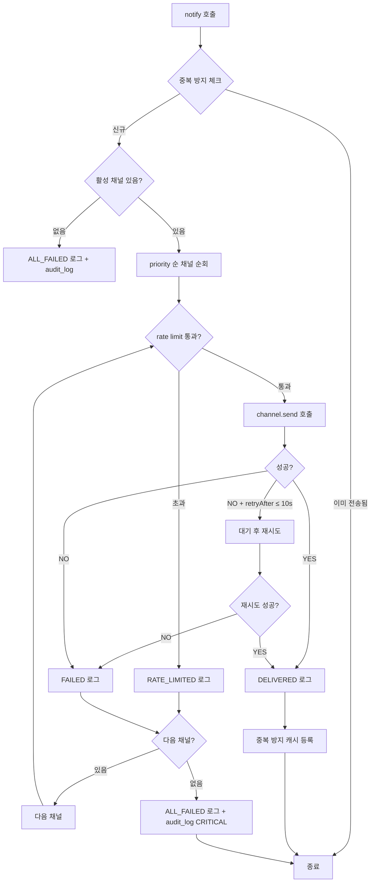
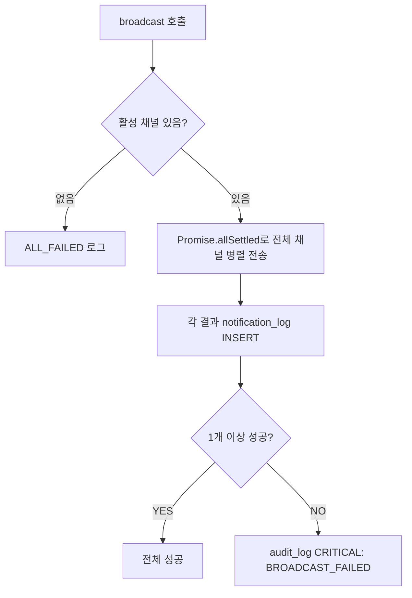
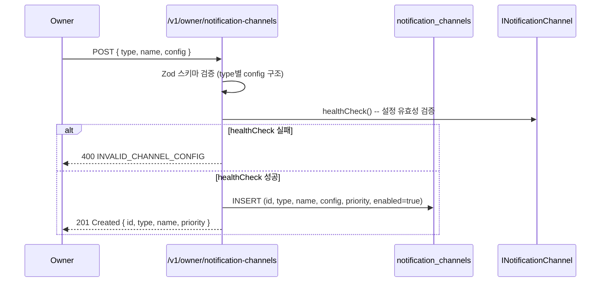
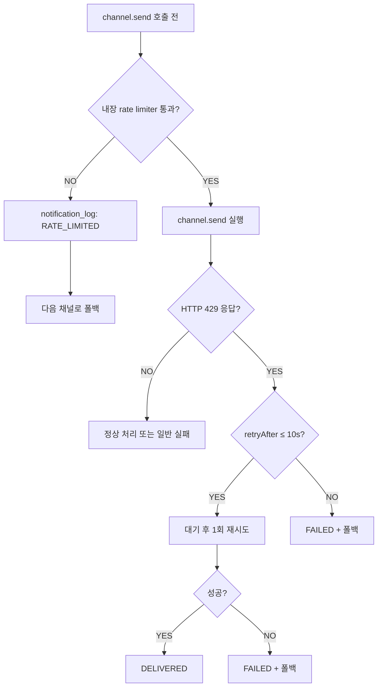

# 멀티 채널 알림 아키텍처 설계 (NOTI-ARCH)

**문서 ID:** NOTI-ARCH
**작성일:** 2026-02-05
**상태:** 완료
**참조:** LOCK-MECH (33-time-lock-approval-mechanism.md), CORE-01 (24-monorepo-data-directory.md), CORE-02 (25-sqlite-schema.md), TX-PIPE (32-transaction-pipeline-api.md), SESS-RENEW (53-session-renewal-protocol.md)
**요구사항:** NOTI-01 (멀티 채널 알림), NOTI-02 (최소 2채널 + 폴백)

---

## 1. 문서 개요

### 1.1 목적

WAIaaS 3계층 보안에서 알림은 모든 보안 이벤트를 Owner에게 전달하는 핵심 인프라이다. 이 문서는 멀티 채널 알림 아키텍처를 구현 가능한 수준으로 설계한다.

이 문서는 다음을 정의한다:
- **INotificationChannel 인터페이스**: 채널 추상화 계약 (type/name/send/healthCheck)
- **3개 채널 어댑터**: Telegram Bot API, Discord Webhook, ntfy.sh Push
- **NotificationService 오케스트레이터**: 우선순위 기반 전송 + 폴백 체인 + broadcast
- **알림 이벤트 타입 체계**: 16개 NotificationEventType 열거형
- **DB 스키마**: notification_channels + notification_log 테이블
- **채널별 Rate Limit 준수**: 토큰 버킷 기반 내장 rate limiter
- **전달 추적**: 성공/실패/폴백 기록 + 30일 보존 정책
- **메시지 포맷 템플릿**: 채널별 서식 (Markdown, Embed, plain text)

### 1.2 요구사항 매핑

| 요구사항 | 설명 | 충족 섹션 |
|---------|------|-----------|
| NOTI-01 | 멀티 채널 알림 (Telegram/Discord/ntfy.sh) | 섹션 2-5 (채널 추상화 + 3개 어댑터) |
| NOTI-02 | 최소 2채널 설정 필수 + 폴백 체인 | 섹션 6 (NotificationService) + 섹션 9 (최소 2채널 검증) |

### 1.3 설계 원칙

1. **native fetch 전용**: Node.js 22+ 내장 fetch API만 사용. 외부 HTTP 라이브러리/Bot 프레임워크 불필요 (08-RESEARCH 결정)
2. **채널 추상화**: INotificationChannel 인터페이스로 채널을 추상화하여 새 채널 추가가 인터페이스 구현만으로 가능
3. **비동기 비블로킹**: 알림 전송이 거래 파이프라인을 블로킹하지 않음 (NOTIFY 티어는 거래 실행 후 비동기 전송)
4. **단일 장애점 방지**: 최소 2개 채널 설정 필수. 한 채널 실패 시 자동 폴백
5. **전달 보장 노력**: 성공할 때까지 폴백 순회. 모든 채널 실패 시 audit_log CRITICAL

### 1.4 참조 문서 관계

```
┌──────────────────────────────────────────────────────────────┐
│  LOCK-MECH (33-time-lock-approval-mechanism.md)               │
│  NOTIFY 티어: 실행 후 알림                                     │
│  DELAY 큐잉: 큐잉 알림 + 실행 알림                             │
│  APPROVAL: 승인 요청 알림 + 만료 알림                          │
└──────────────┬───────────────────────────────────────────────┘
               │ NotificationService.notify() / broadcast()
               ▼
┌──────────────────────────────────────────────────────────────┐
│  NOTI-ARCH (35-notification-architecture.md) ◀── 이 문서      │
│  INotificationChannel + 3 어댑터 + NotificationService        │
│  notification_channels + notification_log 테이블               │
└──────────────┬──────────────┬────────────────────────────────┘
               │              │
               ▼              ▼
┌────────────────┐  ┌──────────────────┐
│  CORE-01       │  │  CORE-02          │
│  config.toml   │  │  notification     │
│  [notifications]│  │  _channels 테이블 │
└────────────────┘  └──────────────────┘
```

### 1.5 알림 호출 포인트 (LOCK-MECH 연동)

| 호출 포인트 | 이벤트 | 전송 방식 | 트리거 위치 |
|------------|--------|----------|------------|
| NOTIFY 티어 거래 실행 후 | TX_NOTIFY | notify() (표준) | Stage 5 완료 후 비동기 |
| DELAY 큐잉 시 | TX_DELAY_QUEUED | notify() (표준) | Stage 4 QUEUED 전이 후 (decision.tier === 'DELAY' && !decision.downgraded) |
| [v0.8] DELAY 다운그레이드 시 | TX_DOWNGRADED_DELAY | notify() (표준) | Stage 4 QUEUED 전이 후 (decision.downgraded === true) |
| DELAY 자동 실행 시 | TX_DELAY_EXECUTED | notify() (표준) | DelayQueueWorker 실행 후 |
| APPROVAL 승인 요청 시 | TX_APPROVAL_REQUEST | notify() (표준) | Stage 4 QUEUED 전이 후 |
| APPROVAL 만료 시 | TX_APPROVAL_EXPIRED | notify() (표준) | ApprovalTimeoutWorker |
| 거래 확정 시 | TX_CONFIRMED | notify() (표준) | Stage 6 CONFIRMED 전이 |
| 거래 실패 시 | TX_FAILED | notify() (표준) | Stage 5/6 FAILED 전이 |
| Kill Switch 발동 | KILL_SWITCH_ACTIVATED | broadcast() (전체) | Kill Switch 핸들러 |
| Kill Switch 복구 | KILL_SWITCH_RECOVERED | broadcast() (전체) | Owner 복구 핸들러 |
| 자동 정지 발동 | AUTO_STOP_TRIGGERED | broadcast() (전체) | AutoStopRuleEngine |
| 세션 생성 | SESSION_CREATED | notify() (표준) | POST /v1/sessions 완료 |
| 세션 폐기 | SESSION_REVOKED | notify() (표준) | DELETE /v1/sessions/:id |
| 세션 갱신 성공 | SESSION_RENEWED | notify() (표준) | session-renewal-service (PUT /v1/sessions/:id/renew 200 응답 후) (Phase 20 추가) |
| 세션 갱신 거부 | SESSION_RENEWAL_REJECTED | notify() (표준) | session-service (DELETE /v1/sessions/:id, details.trigger='renewal_rejected') (Phase 20 추가) |
| 일일 요약 | DAILY_SUMMARY | notify() (표준) | 일일 스케줄러 (선택) |

---

## 2. INotificationChannel 인터페이스

### 2.1 채널 추상화 인터페이스

```typescript
// packages/core/src/interfaces/INotificationChannel.ts

/**
 * 알림 채널 추상화 인터페이스.
 * 모든 알림 채널(Telegram, Discord, ntfy.sh)은 이 인터페이스를 구현한다.
 */
export interface INotificationChannel {
  /** 채널 타입 식별자 */
  readonly type: 'TELEGRAM' | 'DISCORD' | 'NTFY'

  /** 사용자 지정 채널 이름 (예: "내 텔레그램", "팀 Discord") */
  readonly name: string

  /** 채널 DB ID (notification_channels.id) */
  readonly channelId: string

  /**
   * 알림 메시지 전송.
   * @param message - 전송할 메시지
   * @returns 전송 결과 (성공/실패/rate limit 정보)
   */
  send(message: NotificationMessage): Promise<NotificationResult>

  /**
   * 채널 연결 상태 확인.
   * API 토큰 유효성, 서버 접근 가능 여부를 검증한다.
   * @returns true = 정상, false = 이상
   */
  healthCheck(): Promise<boolean>
}
```

### 2.2 NotificationMessage 타입

```typescript
// packages/core/src/domain/notification.ts

/** 알림 심각도 수준 */
export type NotificationLevel = 'INFO' | 'WARNING' | 'CRITICAL'

/** 알림 메시지 구조 */
export interface NotificationMessage {
  /** 심각도 수준 */
  level: NotificationLevel

  /** 이벤트 타입 (열거형) */
  event: NotificationEventType

  /** 알림 제목 (짧은 요약) */
  title: string

  /** 알림 본문 (상세 내용) */
  body: string

  /**
   * 추가 메타데이터 (선택).
   * txId, agentId, sessionId, amount, address 등 이벤트별 컨텍스트.
   */
  metadata?: Record<string, unknown>

  /** 생성 시각 (ISO 8601) */
  createdAt: string
}
```

### 2.3 NotificationResult 타입

```typescript
// packages/core/src/domain/notification.ts

/** 알림 전송 결과 */
export interface NotificationResult {
  /** 전송 성공 여부 */
  success: boolean

  /** 전송 채널 DB ID */
  channelId: string

  /** 실패 시 에러 메시지 */
  error?: string

  /**
   * Rate limit 시 재시도 대기 시간 (초).
   * HTTP 429 응답의 Retry-After 값.
   */
  retryAfter?: number
}
```

### 2.4 NotificationEventType 열거형

```typescript
// packages/core/src/domain/notification.ts

/**
 * 알림 이벤트 타입.
 * 모든 보안/운영 이벤트를 분류하는 열거형.
 */
export const NotificationEventType = {
  // ── 거래 관련 ──
  /** NOTIFY 티어 거래 실행 알림 (실행 후) */
  TX_NOTIFY: 'TX_NOTIFY',
  /** DELAY 티어 큐잉 알림 (취소 가능) */
  TX_DELAY_QUEUED: 'TX_DELAY_QUEUED',
  /** DELAY 거래 자동 실행 알림 (쿨다운 만료 후) */
  TX_DELAY_EXECUTED: 'TX_DELAY_EXECUTED',
  /** APPROVAL 티어 승인 요청 (긴급) */
  TX_APPROVAL_REQUEST: 'TX_APPROVAL_REQUEST',
  /** APPROVAL 타임아웃 만료 알림 */
  TX_APPROVAL_EXPIRED: 'TX_APPROVAL_EXPIRED',
  /** 거래 온체인 확정 알림 */
  TX_CONFIRMED: 'TX_CONFIRMED',
  /** 거래 실패 알림 */
  TX_FAILED: 'TX_FAILED',
  /** [v0.8] APPROVAL -> DELAY 다운그레이드 알림 (Owner 미등록/미검증) */
  TX_DOWNGRADED_DELAY: 'TX_DOWNGRADED_DELAY',

  // ── Kill Switch / 자동 정지 ──
  /** Kill Switch 발동 (모든 채널 동시 전송) */
  KILL_SWITCH_ACTIVATED: 'KILL_SWITCH_ACTIVATED',
  /** Kill Switch 복구 */
  KILL_SWITCH_RECOVERED: 'KILL_SWITCH_RECOVERED',
  /** 자동 정지 규칙 발동 */
  AUTO_STOP_TRIGGERED: 'AUTO_STOP_TRIGGERED',

  // ── 세션 관련 ──
  /** 새 세션 생성 알림 */
  SESSION_CREATED: 'SESSION_CREATED',
  /** 세션 폐기 알림 */
  SESSION_REVOKED: 'SESSION_REVOKED',
  /** 세션 갱신 완료 알림 (Phase 20 추가) */
  SESSION_RENEWED: 'SESSION_RENEWED',
  /** 세션 갱신 거부(폐기) 알림 (Phase 20 추가) */
  SESSION_RENEWAL_REJECTED: 'SESSION_RENEWAL_REJECTED',

  // ── 운영 ──
  /** 일일 요약 (선택적 활성화) */
  DAILY_SUMMARY: 'DAILY_SUMMARY',
} as const

export type NotificationEventType = typeof NotificationEventType[keyof typeof NotificationEventType]
```

### 2.5 이벤트별 심각도 매핑

| 이벤트 | 기본 level | 근거 |
|--------|-----------|------|
| TX_NOTIFY | INFO | 정상 거래 실행 알림 |
| TX_DELAY_QUEUED | INFO | 큐잉 알림 (취소 가능) |
| TX_DELAY_EXECUTED | INFO | 자동 실행 완료 |
| TX_APPROVAL_REQUEST | WARNING | Owner 행동 필요 (긴급) |
| TX_APPROVAL_EXPIRED | WARNING | 타임아웃으로 거래 만료 |
| TX_CONFIRMED | INFO | 온체인 확정 |
| TX_FAILED | WARNING | 거래 실패 (조사 필요) |
| TX_DOWNGRADED_DELAY | INFO | [v0.8] APPROVAL -> DELAY 다운그레이드됨 (Owner 미등록/미검증) |
| KILL_SWITCH_ACTIVATED | CRITICAL | 비상 정지 (모든 채널 broadcast) |
| KILL_SWITCH_RECOVERED | WARNING | 복구 완료 (주의 환기) |
| AUTO_STOP_TRIGGERED | CRITICAL | 자동 정지 발동 (모든 채널 broadcast) |
| SESSION_CREATED | INFO | 새 세션 생성 |
| SESSION_REVOKED | INFO | 세션 폐기 |
| SESSION_RENEWED | INFO | 세션 갱신 완료 (Phase 20 추가) |
| SESSION_RENEWAL_REJECTED | WARNING | 세션 갱신 거부 -- Owner가 세션을 폐기함 (Phase 20 추가) |
| DAILY_SUMMARY | INFO | 일일 운영 요약 |

---

## 3. Telegram Bot API 어댑터

### 3.1 TelegramChannel 클래스 설계

```typescript
// packages/daemon/src/infrastructure/notifications/telegram-channel.ts

import type {
  INotificationChannel,
  NotificationMessage,
  NotificationResult,
} from '@waiaas/core'

/**
 * Telegram Bot API 알림 채널.
 * BotFather에서 발급받은 토큰으로 지정된 chatId에 메시지를 전송한다.
 *
 * API 참조: https://core.telegram.org/bots/api#sendmessage
 */
export class TelegramChannel implements INotificationChannel {
  readonly type = 'TELEGRAM' as const
  readonly name: string
  readonly channelId: string

  private readonly botToken: string
  private readonly chatId: string
  private readonly baseUrl: string

  constructor(config: {
    channelId: string
    name: string
    botToken: string
    chatId: string
  }) {
    this.channelId = config.channelId
    this.name = config.name
    this.botToken = config.botToken
    this.chatId = config.chatId
    this.baseUrl = `https://api.telegram.org/bot${this.botToken}`
  }

  async send(message: NotificationMessage): Promise<NotificationResult> {
    try {
      const url = `${this.baseUrl}/sendMessage`
      const response = await fetch(url, {
        method: 'POST',
        headers: { 'Content-Type': 'application/json' },
        body: JSON.stringify({
          chat_id: this.chatId,
          text: this.formatMessage(message),
          parse_mode: 'MarkdownV2',
        }),
        signal: AbortSignal.timeout(10_000), // 10초 타임아웃
      })

      // HTTP 429 Rate Limit
      if (response.status === 429) {
        const data = await response.json() as {
          parameters?: { retry_after?: number }
        }
        const retryAfter = data.parameters?.retry_after ?? 30
        return {
          success: false,
          channelId: this.channelId,
          error: `Telegram rate limit (retry after ${retryAfter}s)`,
          retryAfter,
        }
      }

      const data = await response.json() as { ok: boolean; description?: string }

      return {
        success: data.ok === true,
        channelId: this.channelId,
        error: data.ok ? undefined : data.description ?? `HTTP ${response.status}`,
      }
    } catch (err) {
      return {
        success: false,
        channelId: this.channelId,
        error: err instanceof Error ? err.message : 'Unknown error',
      }
    }
  }

  async healthCheck(): Promise<boolean> {
    try {
      const url = `${this.baseUrl}/getMe`
      const response = await fetch(url, {
        signal: AbortSignal.timeout(5_000), // 5초 타임아웃
      })
      const data = await response.json() as { ok: boolean }
      return data.ok === true
    } catch {
      return false
    }
  }

  /**
   * Telegram MarkdownV2 형식으로 메시지 포맷팅.
   * 특수 문자 이스케이프 필수 (MarkdownV2 요구사항).
   */
  private formatMessage(message: NotificationMessage): string {
    const emoji = this.levelEmoji(message.level)
    const title = this.escapeMarkdownV2(message.title)
    const body = this.escapeMarkdownV2(message.body)

    let text = `${emoji} *${title}*\n\n${body}`

    // 메타데이터 추가 (있는 경우)
    if (message.metadata) {
      const meta = this.formatMetadata(message.metadata)
      if (meta) {
        text += `\n\n${this.escapeMarkdownV2(meta)}`
      }
    }

    // 타임스탬프
    const time = this.escapeMarkdownV2(message.createdAt)
    text += `\n\n_${time}_`

    // Telegram 메시지 길이 제한: 4096자
    if (text.length > 4096) {
      text = text.slice(0, 4090) + '\\.\\.\\.'
    }

    return text
  }

  private levelEmoji(level: NotificationMessage['level']): string {
    switch (level) {
      case 'CRITICAL': return '🚨'
      case 'WARNING': return '⚠️'
      case 'INFO': return 'ℹ️'
    }
  }

  /**
   * MarkdownV2 특수 문자 이스케이프.
   * 이스케이프 필요 문자: _ * [ ] ( ) ~ ` > # + - = | { } . !
   */
  private escapeMarkdownV2(text: string): string {
    return text.replace(/([_*\[\]()~`>#+\-=|{}.!])/g, '\\$1')
  }

  private formatMetadata(metadata: Record<string, unknown>): string {
    const parts: string[] = []
    if (metadata.txId) parts.push(`TX: ${String(metadata.txId).slice(0, 8)}...`)
    if (metadata.agentId) parts.push(`Agent: ${String(metadata.agentId).slice(0, 8)}...`)
    if (metadata.amount) parts.push(`Amount: ${String(metadata.amount)}`)
    if (metadata.address) {
      const addr = String(metadata.address)
      parts.push(`To: ${addr.slice(0, 4)}...${addr.slice(-4)}`)
    }
    return parts.join(' | ')
  }
}
```

### 3.2 Telegram 설정 값

| 설정 | 타입 | 설명 | 취득 방법 |
|------|------|------|----------|
| `botToken` | string | Telegram Bot API 토큰 | BotFather (@BotFather)에서 `/newbot` 커맨드로 발급 |
| `chatId` | string | 수신 채팅 ID | 개인 DM 또는 그룹 채팅 ID. `/getUpdates` API로 확인 |

### 3.3 메시지 템플릿 예시

#### TX_APPROVAL_REQUEST (긴급 승인 요청)

```
🚨 *승인 요청: 1\.5 SOL 전송*

Agent "DeFi Bot"이 1\.5 SOL 전송을 요청했습니다\.
수신: So1a\.\.\.4xYz
타임아웃: 60분

TX: 019\.\.\. \| Agent: 019\.\.\.

_2026\-02\-05T12:00:00Z_
```

#### TX_DOWNGRADED_DELAY (APPROVAL -> DELAY 다운그레이드) [v0.8 추가]

> **TX_DELAY_QUEUED vs TX_DOWNGRADED_DELAY 차이점:**
>
> | 항목 | TX_DELAY_QUEUED | TX_DOWNGRADED_DELAY |
> |------|-----------------|---------------------|
> | 발생 조건 | 정상 DELAY 티어 평가 | APPROVAL -> DELAY 다운그레이드 |
> | 메시지 톤 | 정보 제공 (대기 중) | 안내 + 행동 유도 (Owner 등록) |
> | Owner 등록 안내 | 미포함 | 포함 (`waiaas agent set-owner` 명령어) |
> | 원래 티어 표시 | 미포함 | 포함 (APPROVAL -> DELAY 전환 사유) |

**Telegram (MarkdownV2):**
```
ℹ️ *대액 거래 대기 중 \(다운그레이드\)*

Agent "{agentName}"의 {amount} {symbol} \(≈ ${usdAmount}\) 전송이
DELAY 큐에 대기합니다\.
수신: {shortenedAddress}
실행 예정: {delayMinutes}분 후

원래 티어: APPROVAL → DELAY로 자동 전환
\(Owner 미등록 에이전트\)

💡 *Owner 지갑을 등록하면 대액 거래에*
   *승인 정책을 적용할 수 있습니다\.*
   `waiaas agent set\-owner {agentName} <address>`

TX: {shortTxId} \| Agent: {shortAgentId}

_{timestamp}_
```

**Discord (Embed):**
```json
{
  "embeds": [{
    "title": "ℹ️ 대액 거래 대기 중 (다운그레이드)",
    "color": 3447003,
    "description": "Agent \"{agentName}\"의 {amount} {symbol} (≈ ${usdAmount}) 전송이\nDELAY 큐에 대기합니다.",
    "fields": [
      { "name": "수신", "value": "{shortenedAddress}", "inline": true },
      { "name": "실행 예정", "value": "{delayMinutes}분 후", "inline": true },
      { "name": "다운그레이드", "value": "APPROVAL → DELAY (Owner 미등록)", "inline": false },
      { "name": "💡 Owner 등록 안내", "value": "`waiaas agent set-owner {agentName} <address>`\nOwner 지갑을 등록하면 대액 거래에 승인 정책을 적용할 수 있습니다.", "inline": false }
    ],
    "footer": { "text": "TX: {shortTxId} | Agent: {shortAgentId}" },
    "timestamp": "{iso8601}"
  }]
}
```

**ntfy.sh:**
```
Title: 대액 거래 대기 중 (APPROVAL → DELAY 다운그레이드)
Priority: default (3)
Tags: information_source, arrow_down
Actions: view, 대시보드, http://127.0.0.1:3100/dashboard
Body:
Agent "{agentName}" {amount} {symbol} (≈ ${usdAmount})
수신: {shortenedAddress}
실행: {delayMinutes}분 후
원래 티어: APPROVAL → DELAY (Owner 미등록)

Owner 등록: waiaas agent set-owner {agentName} <address>
TX: {shortTxId} | Agent: {shortAgentId}
```

**context 필드:**

| 필드 | 타입 | 설명 |
|------|------|------|
| `agentName` | string | 에이전트 이름 (agents.name) |
| `amount` | string | 전송 금액 (사람이 읽을 수 있는 단위) |
| `symbol` | string | 토큰 심볼 (SOL, ETH 등) |
| `usdAmount` | string | USD 환산 금액 |
| `shortenedAddress` | string | 수신 주소 축약 (앞 4 + ... + 뒤 4) |
| `delayMinutes` | number | DELAY 실행 예정 시간 (분) |
| `shortTxId` | string | 거래 ID 축약 |
| `shortAgentId` | string | 에이전트 ID 축약 |
| `timestamp` | string (ISO 8601) | 알림 생성 시각 |

#### KILL_SWITCH_ACTIVATED (비상 정지)

```
🚨 *Kill Switch 발동*

사유: 연속 실패 3회 \(자동 정지 규칙\)
모든 세션 폐기, 대기 중 거래 취소 완료\.

_2026\-02\-05T12:00:00Z_
```

#### TX_DELAY_QUEUED (지연 큐잉)

```
ℹ️ *거래 큐잉: 0\.5 SOL 전송*

Agent "Trading Bot"의 거래가 300초 후 자동 실행됩니다\.
취소하려면 대시보드에서 거래를 취소하세요\.

TX: 019\.\.\. \| Agent: 019\.\.\.

_2026\-02\-05T12:00:00Z_
```

---

## 4. Discord Webhook 어댑터

### 4.1 DiscordChannel 클래스 설계

```typescript
// packages/daemon/src/infrastructure/notifications/discord-channel.ts

import type {
  INotificationChannel,
  NotificationMessage,
  NotificationResult,
} from '@waiaas/core'

/**
 * Discord Webhook 알림 채널.
 * Discord 서버 설정 > 연동 > 웹훅에서 URL을 발급받아 사용한다.
 *
 * API 참조: https://discord.com/developers/docs/resources/webhook#execute-webhook
 */
export class DiscordChannel implements INotificationChannel {
  readonly type = 'DISCORD' as const
  readonly name: string
  readonly channelId: string

  private readonly webhookUrl: string

  constructor(config: {
    channelId: string
    name: string
    webhookUrl: string
  }) {
    this.channelId = config.channelId
    this.name = config.name
    this.webhookUrl = config.webhookUrl
  }

  async send(message: NotificationMessage): Promise<NotificationResult> {
    try {
      const response = await fetch(this.webhookUrl, {
        method: 'POST',
        headers: { 'Content-Type': 'application/json' },
        body: JSON.stringify({
          username: 'WAIaaS Security',
          embeds: [this.buildEmbed(message)],
        }),
        signal: AbortSignal.timeout(10_000), // 10초 타임아웃
      })

      // HTTP 429 Rate Limit
      if (response.status === 429) {
        const retryAfterHeader = response.headers.get('retry-after')
        const retryAfter = retryAfterHeader
          ? parseFloat(retryAfterHeader)
          : 5
        return {
          success: false,
          channelId: this.channelId,
          error: `Discord rate limit (retry after ${retryAfter}s)`,
          retryAfter,
        }
      }

      // Discord Webhook 성공: 204 (wait=false) 또는 200 (wait=true)
      const success = response.status === 204 || response.status === 200

      return {
        success,
        channelId: this.channelId,
        error: success ? undefined : `HTTP ${response.status}`,
      }
    } catch (err) {
      return {
        success: false,
        channelId: this.channelId,
        error: err instanceof Error ? err.message : 'Unknown error',
      }
    }
  }

  async healthCheck(): Promise<boolean> {
    try {
      // GET webhook URL은 webhook 정보를 반환 (200)
      const response = await fetch(this.webhookUrl, {
        method: 'GET',
        signal: AbortSignal.timeout(5_000),
      })
      return response.status === 200
    } catch {
      return false
    }
  }

  /**
   * Discord Embed 메시지 빌드.
   * Rich 메시지 포맷으로 심각도별 색상, 필드, 타임스탬프 포함.
   */
  private buildEmbed(message: NotificationMessage): DiscordEmbed {
    const embed: DiscordEmbed = {
      title: `${this.levelEmoji(message.level)} ${message.title}`,
      description: message.body,
      color: this.levelColor(message.level),
      timestamp: message.createdAt,
      footer: { text: 'WAIaaS Security' },
    }

    // 메타데이터를 embed fields로 변환
    if (message.metadata) {
      embed.fields = this.buildFields(message.metadata)
    }

    // Discord embed description 길이 제한: 4096자
    if (embed.description && embed.description.length > 4096) {
      embed.description = embed.description.slice(0, 4090) + '...'
    }

    return embed
  }

  /** 심각도별 embed 색상 (십진 정수) */
  private levelColor(level: NotificationMessage['level']): number {
    switch (level) {
      case 'CRITICAL': return 0xFF0000  // 빨강
      case 'WARNING': return 0xFFA500   // 주황
      case 'INFO': return 0x3498DB      // 파랑
    }
  }

  private levelEmoji(level: NotificationMessage['level']): string {
    switch (level) {
      case 'CRITICAL': return '🚨'
      case 'WARNING': return '⚠️'
      case 'INFO': return 'ℹ️'
    }
  }

  private buildFields(metadata: Record<string, unknown>): DiscordEmbedField[] {
    const fields: DiscordEmbedField[] = []
    if (metadata.txId) {
      fields.push({
        name: 'Transaction',
        value: `\`${String(metadata.txId).slice(0, 16)}...\``,
        inline: true,
      })
    }
    if (metadata.agentId) {
      fields.push({
        name: 'Agent',
        value: `\`${String(metadata.agentId).slice(0, 16)}...\``,
        inline: true,
      })
    }
    if (metadata.amount) {
      fields.push({
        name: 'Amount',
        value: String(metadata.amount),
        inline: true,
      })
    }
    if (metadata.address) {
      const addr = String(metadata.address)
      fields.push({
        name: 'To',
        value: `\`${addr.slice(0, 4)}...${addr.slice(-4)}\``,
        inline: true,
      })
    }
    return fields
  }
}

/** Discord Embed 구조 (API 스펙 준수) */
interface DiscordEmbed {
  title?: string
  description?: string
  color?: number
  timestamp?: string
  footer?: { text: string }
  fields?: DiscordEmbedField[]
}

interface DiscordEmbedField {
  name: string
  value: string
  inline?: boolean
}
```

### 4.2 Discord Rate Limit 준수

| 제한 | 값 | 출처 |
|------|-----|------|
| Webhook 실행 | 5 요청 / 5초 per webhook | Discord API 문서 |
| 글로벌 | 50 요청 / 초 per 서버 | Discord API 문서 |

- 429 응답 시 `Retry-After` 헤더의 값(초)만큼 대기 후 1회 재시도
- 재시도 실패 시 notification_log에 `RATE_LIMITED` 기록 후 폴백 채널 전환

### 4.3 Discord 설정 값

| 설정 | 타입 | 설명 | 취득 방법 |
|------|------|------|----------|
| `webhookUrl` | string | Discord Webhook URL (URL 자체가 시크릿) | 서버 설정 > 연동 > 웹훅 > URL 복사 |

---

## 5. ntfy.sh Push 어댑터

### 5.1 NtfyChannel 클래스 설계

```typescript
// packages/daemon/src/infrastructure/notifications/ntfy-channel.ts

import type {
  INotificationChannel,
  NotificationMessage,
  NotificationResult,
} from '@waiaas/core'

/**
 * ntfy.sh Push 알림 채널.
 * HTTP POST로 메시지를 전송하며, self-hosted 서버도 지원한다.
 * iOS/Android 앱에서 push 알림을 수신할 수 있다.
 *
 * API 참조: https://docs.ntfy.sh/publish/
 */
export class NtfyChannel implements INotificationChannel {
  readonly type = 'NTFY' as const
  readonly name: string
  readonly channelId: string

  private readonly serverUrl: string
  private readonly topic: string
  private readonly authToken?: string

  constructor(config: {
    channelId: string
    name: string
    serverUrl: string  // 기본: 'https://ntfy.sh' 또는 self-hosted URL
    topic: string
    authToken?: string  // self-hosted 서버 인증 토큰 (선택)
  }) {
    this.channelId = config.channelId
    this.name = config.name
    this.serverUrl = config.serverUrl.replace(/\/$/, '')  // 후행 슬래시 제거
    this.topic = config.topic
    this.authToken = config.authToken
  }

  async send(message: NotificationMessage): Promise<NotificationResult> {
    try {
      const url = `${this.serverUrl}/${this.topic}`
      const headers: Record<string, string> = {
        'Title': message.title,
        'Priority': this.mapPriority(message.level),
        'Tags': this.mapTags(message.level, message.event),
      }

      // 인증 토큰 (self-hosted 서버용)
      if (this.authToken) {
        headers['Authorization'] = `Bearer ${this.authToken}`
      }

      // APPROVAL_REQUEST에 클릭 URL 포함 (Owner 대시보드 링크)
      if (message.event === 'TX_APPROVAL_REQUEST' && message.metadata?.approvalUrl) {
        headers['Click'] = String(message.metadata.approvalUrl)
        headers['Actions'] = `view, 승인 대시보드, ${String(message.metadata.approvalUrl)}`
      }

      const response = await fetch(url, {
        method: 'POST',
        headers,
        body: this.formatMessage(message),
        signal: AbortSignal.timeout(10_000), // 10초 타임아웃
      })

      return {
        success: response.ok,
        channelId: this.channelId,
        error: response.ok ? undefined : `HTTP ${response.status}`,
      }
    } catch (err) {
      return {
        success: false,
        channelId: this.channelId,
        error: err instanceof Error ? err.message : 'Unknown error',
      }
    }
  }

  async healthCheck(): Promise<boolean> {
    try {
      // 서버 상태 확인: JSON polling with since=0 (빈 응답이면 정상)
      const url = `${this.serverUrl}/${this.topic}/json?poll=1&since=0`
      const headers: Record<string, string> = {}
      if (this.authToken) {
        headers['Authorization'] = `Bearer ${this.authToken}`
      }
      const response = await fetch(url, {
        headers,
        signal: AbortSignal.timeout(5_000),
      })
      return response.ok
    } catch {
      return false
    }
  }

  /**
   * ntfy.sh priority 매핑.
   * 1=min, 2=low, 3=default, 4=high, 5=urgent (max)
   */
  private mapPriority(level: NotificationMessage['level']): string {
    switch (level) {
      case 'CRITICAL': return '5'  // urgent: 특별 알림음 + 진동
      case 'WARNING': return '4'   // high: 강조 표시
      case 'INFO': return '3'      // default: 일반 알림
    }
  }

  /**
   * ntfy.sh 태그 매핑.
   * 태그는 이모지로 변환되어 알림에 표시된다.
   */
  private mapTags(level: NotificationMessage['level'], event: string): string {
    const tags: string[] = []

    // 심각도 태그
    switch (level) {
      case 'CRITICAL': tags.push('rotating_light', 'skull'); break
      case 'WARNING': tags.push('warning'); break
      case 'INFO': tags.push('information_source'); break
    }

    // 이벤트별 태그
    if (event.startsWith('TX_')) tags.push('money_with_wings')
    if (event.startsWith('KILL_SWITCH')) tags.push('octagonal_sign')
    if (event.startsWith('SESSION_')) tags.push('key')

    return tags.join(',')
  }

  /**
   * ntfy.sh plain text 메시지 포맷팅.
   * ntfy.sh 메시지 본문 길이 제한: 4096 bytes.
   */
  private formatMessage(message: NotificationMessage): string {
    let text = message.body

    // 메타데이터 추가
    if (message.metadata) {
      const parts: string[] = []
      if (message.metadata.txId) parts.push(`TX: ${String(message.metadata.txId).slice(0, 8)}...`)
      if (message.metadata.agentId) parts.push(`Agent: ${String(message.metadata.agentId).slice(0, 8)}...`)
      if (message.metadata.amount) parts.push(`Amount: ${String(message.metadata.amount)}`)
      if (message.metadata.address) {
        const addr = String(message.metadata.address)
        parts.push(`To: ${addr.slice(0, 4)}...${addr.slice(-4)}`)
      }
      if (parts.length > 0) {
        text += `\n\n${parts.join(' | ')}`
      }
    }

    // 길이 제한
    if (text.length > 4096) {
      text = text.slice(0, 4090) + '...'
    }

    return text
  }
}
```

### 5.2 ntfy.sh 장점

| 장점 | 설명 |
|------|------|
| Self-hosted 가능 | Docker/binary로 자체 ntfy 서버 운영 가능 (외부 의존 제거) |
| iOS/Android 앱 | ntfy 공식 앱에서 push 알림 수신 |
| 인증 선택적 | 퍼블릭 토픽은 인증 불필요. Self-hosted는 토큰 인증 가능 |
| 인라인 액션 | Click, Actions 헤더로 버튼/링크 포함 가능 |
| API 단순성 | HTTP POST body = 메시지. 가장 단순한 API |

### 5.3 ntfy.sh 설정 값

| 설정 | 타입 | 기본값 | 설명 |
|------|------|--------|------|
| `serverUrl` | string | `"https://ntfy.sh"` | ntfy 서버 URL (self-hosted 시 변경) |
| `topic` | string | (필수) | 구독 토픽 이름 (예: `waiaas-alerts-xyz`) |
| `authToken` | string | (선택) | self-hosted 서버 Bearer 토큰 |

### 5.4 ntfy.sh Priority 매핑 표

| NotificationLevel | ntfy Priority | 값 | 알림 동작 |
|-------------------|---------------|-----|----------|
| CRITICAL | urgent | 5 | 특별 알림음 + 진동 + 화면 깨우기 |
| WARNING | high | 4 | 강조 표시 + 알림음 |
| INFO | default | 3 | 일반 알림 |

---

## 6. NotificationService 오케스트레이터

### 6.1 클래스 설계

```typescript
// packages/daemon/src/services/notification-service.ts

import type {
  INotificationChannel,
  NotificationMessage,
  NotificationResult,
  NotificationEventType,
} from '@waiaas/core'
import { LRUCache } from 'lru-cache'
import type { DrizzleInstance } from '../infrastructure/database/connection.js'

/**
 * NotificationService -- 멀티 채널 알림 오케스트레이터.
 *
 * 책임:
 * 1. 표준 알림 (notify): priority 순 전송, 첫 성공 시 중단, 폴백 체인
 * 2. broadcast 알림 (broadcast): 모든 채널 동시 전송 (Kill Switch 등)
 * 3. 전달 추적: notification_log INSERT
 * 4. 중복 방지: 동일 event+referenceId 5분 내 재전송 차단
 * 5. rate limit 준수: 채널별 내장 rate limiter
 */
export class NotificationService {
  private channels: INotificationChannel[] = []  // priority 순 정렬
  private readonly db: DrizzleInstance

  /** 중복 방지 LRU 캐시: key = `${event}:${referenceId}`, TTL 5분 */
  private readonly deduplicationCache = new LRUCache<string, true>({
    max: 500,
    ttl: 5 * 60 * 1000,  // 5분
  })

  /** 채널별 rate limiter 상태 */
  private readonly rateLimiters = new Map<string, ChannelRateLimiter>()

  constructor(db: DrizzleInstance) {
    this.db = db
  }

  /**
   * 활성 채널 목록 로드 (데몬 시작 시 + 채널 변경 시).
   * notification_channels 테이블에서 enabled=true인 채널을 priority DESC 정렬로 로드.
   */
  async loadChannels(): Promise<void> {
    const rows = await this.db.select()
      .from(notificationChannels)
      .where(eq(notificationChannels.enabled, true))
      .orderBy(desc(notificationChannels.priority))

    this.channels = rows.map(row => this.createChannel(row))

    // 각 채널별 rate limiter 초기화
    for (const channel of this.channels) {
      if (!this.rateLimiters.has(channel.channelId)) {
        this.rateLimiters.set(
          channel.channelId,
          createRateLimiter(channel.type),
        )
      }
    }
  }

  /**
   * 표준 알림 전송.
   * priority 순으로 첫 성공 시 중단. 실패 시 다음 채널로 폴백.
   */
  async notify(message: NotificationMessage): Promise<void> {
    // 1. 중복 방지 체크
    const dedupeKey = this.getDedupeKey(message)
    if (dedupeKey && this.deduplicationCache.has(dedupeKey)) {
      return  // 5분 내 동일 알림 이미 전송됨
    }

    // 2. 활성 채널이 없으면 audit_log만 기록
    if (this.channels.length === 0) {
      await this.recordLog({
        channelId: null,
        event: message.event,
        level: message.level,
        referenceId: this.extractReferenceId(message),
        status: 'ALL_FAILED',
        error: 'No active notification channels',
        retryCount: 0,
      })
      return
    }

    // 3. priority 순 폴백 전송
    let delivered = false
    for (const channel of this.channels) {
      // rate limit 체크
      const limiter = this.rateLimiters.get(channel.channelId)
      if (limiter && !limiter.tryAcquire()) {
        await this.recordLog({
          channelId: channel.channelId,
          event: message.event,
          level: message.level,
          referenceId: this.extractReferenceId(message),
          status: 'RATE_LIMITED',
          error: `Rate limit exceeded for ${channel.type}`,
          retryCount: 0,
        })
        continue  // 다음 채널로 폴백
      }

      const result = await channel.send(message)

      if (result.success) {
        // 전송 성공
        await this.recordLog({
          channelId: channel.channelId,
          event: message.event,
          level: message.level,
          referenceId: this.extractReferenceId(message),
          status: 'DELIVERED',
          error: null,
          retryCount: 0,
        })
        delivered = true

        // 중복 방지 캐시 등록
        if (dedupeKey) {
          this.deduplicationCache.set(dedupeKey, true)
        }

        break  // 첫 성공 시 중단
      }

      // 전송 실패 -- rate limit 응답 시 1회 재시도
      if (result.retryAfter && result.retryAfter <= 10) {
        // 10초 이내 재시도 가능한 경우만 대기
        await this.delay(result.retryAfter * 1000)
        const retryResult = await channel.send(message)
        if (retryResult.success) {
          await this.recordLog({
            channelId: channel.channelId,
            event: message.event,
            level: message.level,
            referenceId: this.extractReferenceId(message),
            status: 'DELIVERED',
            error: null,
            retryCount: 1,
          })
          delivered = true
          if (dedupeKey) this.deduplicationCache.set(dedupeKey, true)
          break
        }
      }

      // 실패 기록 -> 다음 채널 폴백
      await this.recordLog({
        channelId: channel.channelId,
        event: message.event,
        level: message.level,
        referenceId: this.extractReferenceId(message),
        status: 'FAILED',
        error: result.error ?? 'Unknown error',
        retryCount: result.retryAfter ? 1 : 0,
      })
    }

    // 4. 모든 채널 실패
    if (!delivered) {
      await this.recordLog({
        channelId: null,
        event: message.event,
        level: message.level,
        referenceId: this.extractReferenceId(message),
        status: 'ALL_FAILED',
        error: 'All channels failed',
        retryCount: 0,
      })

      // audit_log에 CRITICAL 기록
      await this.insertAuditLog({
        eventType: 'NOTIFICATION_ALL_FAILED',
        actor: 'system',
        details: {
          event: message.event,
          title: message.title,
          channelsAttempted: this.channels.length,
        },
        severity: 'critical',
      })
    }
  }

  /**
   * Broadcast 알림 전송 (Kill Switch, AUTO_STOP 등 critical 이벤트).
   * 모든 활성 채널에 병렬 전송. 1개라도 성공하면 전체 성공.
   */
  async broadcast(message: NotificationMessage): Promise<void> {
    if (this.channels.length === 0) {
      await this.recordLog({
        channelId: null,
        event: message.event,
        level: message.level,
        referenceId: this.extractReferenceId(message),
        status: 'ALL_FAILED',
        error: 'No active notification channels for broadcast',
        retryCount: 0,
      })
      return
    }

    // 모든 채널에 병렬 전송 (Promise.allSettled)
    const results = await Promise.allSettled(
      this.channels.map(async (channel) => {
        const result = await channel.send(message)

        // 각 결과 notification_log INSERT
        await this.recordLog({
          channelId: channel.channelId,
          event: message.event,
          level: message.level,
          referenceId: this.extractReferenceId(message),
          status: result.success ? 'DELIVERED' : 'FAILED',
          error: result.error ?? null,
          retryCount: 0,
        })

        return result
      }),
    )

    // 하나라도 성공했는지 확인
    const anySuccess = results.some(
      r => r.status === 'fulfilled' && r.value.success,
    )

    if (!anySuccess) {
      // 모든 채널 broadcast 실패 -> audit_log CRITICAL
      await this.insertAuditLog({
        eventType: 'NOTIFICATION_BROADCAST_FAILED',
        actor: 'system',
        details: {
          event: message.event,
          title: message.title,
          channelsAttempted: this.channels.length,
        },
        severity: 'critical',
      })
    }
  }

  /**
   * 중복 방지 키 생성.
   * event + referenceId 조합으로 5분 내 재전송 방지.
   * referenceId가 없으면 중복 방지 비활성 (매번 전송).
   */
  private getDedupeKey(message: NotificationMessage): string | null {
    const referenceId = this.extractReferenceId(message)
    if (!referenceId) return null
    return `${message.event}:${referenceId}`
  }

  private extractReferenceId(message: NotificationMessage): string | null {
    if (!message.metadata) return null
    return (message.metadata.txId as string)
      ?? (message.metadata.sessionId as string)
      ?? null
  }

  /**
   * notification_log INSERT.
   */
  private async recordLog(entry: {
    channelId: string | null
    event: string
    level: string
    referenceId: string | null
    status: 'DELIVERED' | 'FAILED' | 'RATE_LIMITED' | 'ALL_FAILED'
    error: string | null
    retryCount: number
  }): Promise<void> {
    await this.db.insert(notificationLog).values({
      id: generateUUIDv7(),
      channelId: entry.channelId,
      event: entry.event,
      level: entry.level,
      referenceId: entry.referenceId,
      status: entry.status,
      error: entry.error,
      retryCount: entry.retryCount,
      sentAt: new Date(),
    })
  }

  /** DB 행에서 INotificationChannel 인스턴스 생성 */
  private createChannel(row: NotificationChannelRow): INotificationChannel {
    const config = JSON.parse(row.config) as Record<string, string>
    switch (row.type) {
      case 'TELEGRAM':
        return new TelegramChannel({
          channelId: row.id,
          name: row.name,
          botToken: config.botToken,
          chatId: config.chatId,
        })
      case 'DISCORD':
        return new DiscordChannel({
          channelId: row.id,
          name: row.name,
          webhookUrl: config.webhookUrl,
        })
      case 'NTFY':
        return new NtfyChannel({
          channelId: row.id,
          name: row.name,
          serverUrl: config.serverUrl ?? 'https://ntfy.sh',
          topic: config.topic,
          authToken: config.authToken,
        })
      default:
        throw new Error(`Unknown channel type: ${row.type}`)
    }
  }

  private delay(ms: number): Promise<void> {
    return new Promise(resolve => setTimeout(resolve, ms))
  }
}
```

### 6.2 표준 알림 플로우 (notify)



### 6.3 Broadcast 알림 플로우



### 6.4 중복 방지 (Deduplication)

| 항목 | 값 | 근거 |
|------|-----|------|
| 캐시 구현 | LRU Cache (lru-cache) | Phase 7 nonce 캐시와 동일 패턴 |
| 최대 항목 | 500 | 일일 알림 수 대비 충분 |
| TTL | 5분 | 파이프라인 Stage 전이 간격 대비 충분한 보호 |
| 키 형식 | `${event}:${referenceId}` | 동일 이벤트 + 동일 엔티티 조합 |

**중복 방지 대상 시나리오:**
- Stage 전이 실패 후 재시도 시 동일 TX_CONFIRMED 알림 중복 발송
- 동시 요청으로 같은 txId에 대한 TX_NOTIFY 다중 트리거

**중복 방지 비적용:**
- KILL_SWITCH_ACTIVATED: broadcast이므로 중복 방지 미적용
- DAILY_SUMMARY: referenceId 없으므로 항상 전송

---

## 7. notification_channels 테이블 스키마

### 7.1 테이블 구조

CORE-02에서 기본 구조가 정의된 notification_channels 테이블을 Phase 8에서 상세화한다. name 컬럼 추가, lastHealthCheck/lastHealthStatus 컬럼 추가, updatedAt 컬럼 추가, 인덱스 변경.

#### Drizzle ORM 정의

```typescript
// packages/daemon/src/infrastructure/database/tables/notification-channels.ts

import { sqliteTable, text, integer, index } from 'drizzle-orm/sqlite-core'

export const notificationChannels = sqliteTable('notification_channels', {
  // ── 식별자 ──
  id: text('id').primaryKey(),                          // UUID v7

  // ── 채널 정보 ──
  type: text('type', {
    enum: ['TELEGRAM', 'DISCORD', 'NTFY']
  }).notNull(),
  name: text('name').notNull(),                         // 사용자 지정 이름 (예: "내 텔레그램")

  // ── 설정 ──
  config: text('config').notNull(),                     // JSON: 채널별 설정 (아래 7.2 참조)

  // ── 우선순위/활성화 ──
  priority: integer('priority').notNull().default(0),   // 높을수록 먼저 시도
  enabled: integer('enabled', { mode: 'boolean' }).notNull().default(true),

  // ── Health Check 상태 ──
  lastHealthCheck: integer('last_health_check', { mode: 'timestamp' }),
  lastHealthStatus: integer('last_health_status'),      // 0 = 실패, 1 = 성공

  // ── 타임스탬프 ──
  createdAt: integer('created_at', { mode: 'timestamp' }).notNull(),
  updatedAt: integer('updated_at', { mode: 'timestamp' }).notNull(),
}, (table) => [
  index('idx_notification_channels_enabled').on(table.enabled, table.priority),
])
```

#### CREATE TABLE SQL DDL

```sql
CREATE TABLE notification_channels (
  id TEXT PRIMARY KEY,
  type TEXT NOT NULL
    CHECK (type IN ('TELEGRAM', 'DISCORD', 'NTFY')),
  name TEXT NOT NULL,
  config TEXT NOT NULL,             -- JSON
  priority INTEGER NOT NULL DEFAULT 0,
  enabled INTEGER NOT NULL DEFAULT 1,   -- boolean (0/1)
  last_health_check INTEGER,
  last_health_status INTEGER,       -- 0/1
  created_at INTEGER NOT NULL,
  updated_at INTEGER NOT NULL
);

CREATE INDEX idx_notification_channels_enabled
  ON notification_channels(enabled, priority DESC);
```

#### 컬럼 설명

| 컬럼 | 타입 | Nullable | 기본값 | 용도 |
|------|------|----------|--------|------|
| `id` | TEXT (PK) | NOT NULL | - | 채널 UUID v7 |
| `type` | TEXT (ENUM) | NOT NULL | - | 채널 유형. CHECK 제약 |
| `name` | TEXT | NOT NULL | - | 사용자 지정 이름 (UI 표시용) |
| `config` | TEXT (JSON) | NOT NULL | - | 채널별 설정 JSON (7.2 참조) |
| `priority` | INTEGER | NOT NULL | `0` | 전송 우선순위. 높을수록 먼저 시도 |
| `enabled` | INTEGER (BOOL) | NOT NULL | `1` (true) | 활성화 여부 |
| `last_health_check` | INTEGER | NULL | - | 마지막 healthCheck 시각 (Unix epoch) |
| `last_health_status` | INTEGER | NULL | - | 마지막 healthCheck 결과 (0=실패, 1=성공) |
| `created_at` | INTEGER | NOT NULL | - | 채널 등록 시각 |
| `updated_at` | INTEGER | NOT NULL | - | 최종 수정 시각 |

#### CORE-02 대비 변경사항

| 항목 | CORE-02 기본 구조 | Phase 8 상세화 | 근거 |
|------|------------------|---------------|------|
| `name` | 없음 | 추가 (NOT NULL) | UI 표시 + 사용자 구분 필요 |
| `lastSuccessAt`/`lastFailureAt` | 있음 | `lastHealthCheck` + `lastHealthStatus`로 대체 | healthCheck 전용 상태 추적 (전송 결과는 notification_log에 기록) |
| `updatedAt` | 없음 | 추가 (NOT NULL) | 설정 변경 추적 |
| 인덱스 | `type` + `enabled` 개별 | `enabled` + `priority` 복합 | 쿼리 패턴: enabled=true 채널을 priority DESC로 조회 |

### 7.2 채널별 config JSON 구조

#### TELEGRAM

```json
{
  "botToken": "7123456789:AAH...",
  "chatId": "123456789"
}
```

| 필드 | 타입 | 필수 | 설명 |
|------|------|------|------|
| `botToken` | string | YES | Telegram Bot API 토큰 (BotFather에서 발급) |
| `chatId` | string | YES | 수신 채팅 ID (개인 DM 또는 그룹) |

#### DISCORD

```json
{
  "webhookUrl": "https://discord.com/api/webhooks/1234.../abc..."
}
```

| 필드 | 타입 | 필수 | 설명 |
|------|------|------|------|
| `webhookUrl` | string | YES | Discord Webhook URL (URL 자체가 시크릿) |

#### NTFY

```json
{
  "serverUrl": "https://ntfy.sh",
  "topic": "waiaas-alerts-xyz",
  "authToken": "tk_abc123..."
}
```

| 필드 | 타입 | 필수 | 설명 |
|------|------|------|------|
| `serverUrl` | string | YES | ntfy 서버 URL (기본: `https://ntfy.sh`) |
| `topic` | string | YES | 구독 토픽 이름 |
| `authToken` | string | NO | self-hosted 서버 Bearer 인증 토큰 |

### 7.3 config JSON 보안

**v0.2: 평문 저장 + 파일 권한 보호**

- notification_channels.config에 JSON 평문으로 저장
- SQLite 파일 (`~/.waiaas/data/waiaas.db`) 권한 `600` (소유자만 읽기/쓰기)
- 데이터 디렉토리 (`~/.waiaas/`) 권한 `700`

**v0.3: AES-256-GCM 암호화 마이그레이션 경로**

```typescript
// v0.3 마이그레이션 경로 (문서화만, 현재 미구현)
// 1. config 컬럼을 encrypted_config으로 마이그레이션
// 2. 키스토어 마스터 키에서 파생된 서브 키로 AES-256-GCM 암호화
// 3. 복호화는 데몬 시작 시 키스토어 언락 후 수행
// 4. API 응답에서는 복호화된 값을 반환하지 않음 (마스킹)
```

**시크릿 마스킹 규칙:**

| 필드 | API 응답 시 표시 | 로그 출력 시 |
|------|----------------|-------------|
| `botToken` | `****...H7Yz` (마지막 4자) | `[REDACTED]` |
| `webhookUrl` | `https://discord.com/api/webhooks/****...` (URL 경로 마스킹) | `[REDACTED]` |
| `authToken` | `****...c123` (마지막 4자) | `[REDACTED]` |
| `chatId` | 전체 표시 (시크릿 아님) | 전체 표시 |
| `topic` | 전체 표시 (시크릿 아님) | 전체 표시 |
| `serverUrl` | 전체 표시 (시크릿 아님) | 전체 표시 |

---

## 8. notification_log 테이블 스키마

### 8.1 테이블 구조

알림 전달 결과를 추적하는 테이블. NotificationService의 모든 전송 시도를 기록한다.

#### Drizzle ORM 정의

```typescript
// packages/daemon/src/infrastructure/database/tables/notification-log.ts

import { sqliteTable, text, integer, index } from 'drizzle-orm/sqlite-core'
import { notificationChannels } from './notification-channels.js'

export const notificationLog = sqliteTable('notification_log', {
  // ── 식별자 ──
  id: text('id').primaryKey(),                          // UUID v7

  // ── 채널 참조 ──
  channelId: text('channel_id')
    .references(() => notificationChannels.id, { onDelete: 'set null' }),
  // SET NULL: 채널 삭제 후에도 전달 기록 보존

  // ── 이벤트 정보 ──
  event: text('event').notNull(),                       // NotificationEventType
  level: text('level', {
    enum: ['INFO', 'WARNING', 'CRITICAL']
  }).notNull(),

  // ── 관련 엔티티 ──
  referenceId: text('reference_id'),                    // txId, sessionId 등

  // ── 전달 결과 ──
  status: text('status', {
    enum: ['DELIVERED', 'FAILED', 'RATE_LIMITED', 'ALL_FAILED']
  }).notNull(),
  error: text('error'),                                 // 실패 시 에러 메시지
  retryCount: integer('retry_count').notNull().default(0),

  // ── 타임스탬프 ──
  sentAt: integer('sent_at', { mode: 'timestamp' }).notNull(),
}, (table) => [
  index('idx_notification_log_event').on(table.event, table.sentAt),
  index('idx_notification_log_status').on(table.status),
  index('idx_notification_log_sent_at').on(table.sentAt),
  index('idx_notification_log_channel').on(table.channelId),
])
```

#### CREATE TABLE SQL DDL

```sql
CREATE TABLE notification_log (
  id TEXT PRIMARY KEY,
  channel_id TEXT REFERENCES notification_channels(id) ON DELETE SET NULL,
  event TEXT NOT NULL,
  level TEXT NOT NULL
    CHECK (level IN ('INFO', 'WARNING', 'CRITICAL')),
  reference_id TEXT,
  status TEXT NOT NULL
    CHECK (status IN ('DELIVERED', 'FAILED', 'RATE_LIMITED', 'ALL_FAILED')),
  error TEXT,
  retry_count INTEGER NOT NULL DEFAULT 0,
  sent_at INTEGER NOT NULL
);

CREATE INDEX idx_notification_log_event ON notification_log(event, sent_at DESC);
CREATE INDEX idx_notification_log_status ON notification_log(status);
CREATE INDEX idx_notification_log_sent_at ON notification_log(sent_at);
CREATE INDEX idx_notification_log_channel ON notification_log(channel_id);
```

#### 컬럼 설명

| 컬럼 | 타입 | Nullable | 기본값 | 용도 |
|------|------|----------|--------|------|
| `id` | TEXT (PK) | NOT NULL | - | 로그 UUID v7 |
| `channel_id` | TEXT (FK) | NULL | - | 전송 시도한 채널. SET NULL (채널 삭제 후 보존) |
| `event` | TEXT | NOT NULL | - | NotificationEventType 값 |
| `level` | TEXT (ENUM) | NOT NULL | - | 알림 심각도 |
| `reference_id` | TEXT | NULL | - | 관련 엔티티 ID (txId, sessionId 등) |
| `status` | TEXT (ENUM) | NOT NULL | - | 전달 상태 |
| `error` | TEXT | NULL | - | 실패 시 에러 메시지 |
| `retry_count` | INTEGER | NOT NULL | `0` | 재시도 횟수 |
| `sent_at` | INTEGER | NOT NULL | - | 전송 시도 시각 (Unix epoch) |

### 8.2 전달 상태 정의

| status | 설명 | 기록 시점 |
|--------|------|----------|
| `DELIVERED` | 전송 성공 | channel.send() 성공 시 |
| `FAILED` | 단일 채널 전송 실패 | channel.send() 실패 + 폴백 전 |
| `RATE_LIMITED` | rate limit 초과로 건너뜀 | rate limiter 차단 시 |
| `ALL_FAILED` | 모든 채널 실패 | 전체 폴백 체인 소진 후 |

### 8.3 보존 정책

- **30일 보존**: 30일 이상 된 notification_log 행 자동 삭제
- **정리 워커**: 만료 세션 정리 워커(Phase 7)와 동일 패턴의 주기적 삭제 워커
- **정리 주기**: 24시간 (하루 1회)
- **삭제 쿼리**:

```sql
DELETE FROM notification_log
WHERE sent_at < unixepoch('now', '-30 days')
LIMIT 1000;  -- 배치 삭제로 long lock 방지
```

### 8.4 audit_log와의 관계

| 구분 | notification_log | audit_log |
|------|-----------------|-----------|
| 용도 | 알림 전달 상세 추적 | 보안 이벤트 감사 기록 |
| 기록 대상 | 모든 전송 시도 (성공/실패/rate limit) | 보안 관련 이벤트만 |
| 보존 기간 | 30일 | 영구 (append-only) |
| 연동 | ALL_FAILED인 경우만 audit_log에도 기록 | NOTIFICATION_ALL_FAILED 이벤트 |

---

## 9. 채널 설정 검증 + 최소 2채널 정책

### 9.1 채널 관리 API 엔드포인트 (구조)

> Phase 9에서 REST API 전체 스펙 상세화. 여기서는 구조와 검증 로직만 정의.

| 메서드 | 경로 | 인증 | 설명 |
|--------|------|------|------|
| `POST` | `/v1/owner/notification-channels` | ownerAuth | 채널 추가 |
| `GET` | `/v1/owner/notification-channels` | ownerAuth | 채널 목록 조회 |
| `PUT` | `/v1/owner/notification-channels/:id` | ownerAuth | 채널 설정 변경 |
| `DELETE` | `/v1/owner/notification-channels/:id` | ownerAuth | 채널 삭제 |
| `POST` | `/v1/owner/notification-channels/:id/test` | ownerAuth | 테스트 메시지 전송 |

### 9.2 채널 추가 플로우



### 9.3 최소 2채널 검증

**[v0.7 보완: SCHEMA-06] 물리 삭제(DELETE) 금지 결정:**

알림 채널은 **물리 삭제(DELETE)를 금지**하고 비활성화(soft-delete, `enabled=false`)만 허용한다. 물리 삭제 시 notification_log의 channel_id FK가 고아가 되어 전달 이력 추적이 불가능해지기 때문이다. 이 결정은 33-time-lock-approval-mechanism.md의 TOCTOU 방지 패턴과 동일한 원칙을 따른다.

> **DELETE API 엔드포인트:** `DELETE /v1/owner/notification-channels/:id`는 실제로 `enabled=false`로 soft-delete를 수행한다. API 이름은 DELETE이지만 내부 구현은 UPDATE이다.

**채널 비활성화(soft-delete) 시 검증 [v0.7 보완: BEGIN IMMEDIATE 보호]:**

```typescript
// [v0.7 보완] 채널 비활성화 시 BEGIN IMMEDIATE 트랜잭션으로 동시성 보호
// 33-time-lock-approval-mechanism.md TOCTOU 방지 패턴과 동일 원칙
async function disableChannel(channelId: string): Promise<void> {
  // BEGIN IMMEDIATE: 트랜잭션 시작 시점에 쓰기 잠금 획득
  // 동시에 2개 채널을 비활성화하여 최소 2채널 정책을 우회하는 TOCTOU 방지
  await db.transaction(async (tx) => {
    const activeCount = await tx.select({ count: count() })
      .from(notificationChannels)
      .where(and(
        eq(notificationChannels.enabled, true),
        ne(notificationChannels.id, channelId),
      ))

    if (activeCount[0].count < 2) {
      throw new WaiaasError(
        'MIN_CHANNELS_REQUIRED',
        '최소 2개의 활성 알림 채널이 필요합니다. 비활성화할 수 없습니다.',
        400,
      )
    }

    // soft-delete: enabled=false (물리 삭제 금지)
    await tx.update(notificationChannels)
      .set({ enabled: false, updatedAt: new Date() })
      .where(eq(notificationChannels.id, channelId))
  }, { behavior: 'immediate' })
  // Drizzle ORM: { behavior: 'immediate' } -> BEGIN IMMEDIATE TRANSACTION
  // SQLite: 트랜잭션 시작 시 쓰기 잠금 획득, 다른 쓰기 트랜잭션 대기
}
```

**BEGIN IMMEDIATE 트랜잭션이 필요한 이유:**

| 시나리오 | BEGIN DEFERRED (기본) | BEGIN IMMEDIATE |
|---------|----------------------|-----------------|
| 동시 비활성화 요청 2건 | 두 요청 모두 SELECT 시점에 3개 활성 채널 확인 -> 둘 다 통과 -> 최종 1개 | 첫 번째 요청이 쓰기 잠금 획득 -> 두 번째 요청 대기 -> 순차 처리로 정확한 카운트 보장 |
| TOCTOU 방지 | X (읽기-쓰기 간 갭) | O (읽기 시점에 이미 잠금 보유) |

> **33-time-lock-approval-mechanism.md 교차 참조:** DatabasePolicyEngine의 `BEGIN IMMEDIATE + reserved_amount` 패턴과 동일한 TOCTOU 방지 전략이다. SQLite 단일 프로세스 데몬에서는 BEGIN IMMEDIATE가 가장 간결한 동시성 보호 수단이다.
```

**데몬 시작 시 활성 채널 수 확인:**

```typescript
// 데몬 시작 시 채널 수 검증
async function validateChannelsOnStartup(db: DrizzleInstance): Promise<void> {
  const activeCount = await db.select({ count: count() })
    .from(notificationChannels)
    .where(eq(notificationChannels.enabled, true))

  if (activeCount[0].count === 0) {
    logger.warn(
      '알림 채널이 설정되지 않았습니다. ' +
      'waiaas init 후 최소 2개 채널을 설정하세요.'
    )
    // 채널 없으면 알림 기능 비활성. 거래는 정상 처리 (INSTANT만).
  } else if (activeCount[0].count < 2) {
    logger.warn(
      `활성 알림 채널이 ${activeCount[0].count}개입니다. ` +
      '최소 2개 이상 설정을 권장합니다. ' +
      '제한 모드: NOTIFY/DELAY/APPROVAL 티어 비활성화, INSTANT만 허용.'
    )
    // 제한 모드: IPolicyEngine이 INSTANT만 반환하도록 강제
    // DatabasePolicyEngine.setRestrictedMode(true) 호출
  } else {
    logger.info(`알림 채널 ${activeCount[0].count}개 활성화 확인`)
  }
}
```

**제한 모드 (Restricted Mode):**

| 조건 | 동작 | 근거 |
|------|------|------|
| 활성 채널 0개 | 알림 비활성. INSTANT 티어만 허용. | 알림 없이 DELAY/APPROVAL은 무의미 |
| 활성 채널 1개 | 경고 로그. INSTANT 티어만 허용. | 단일 장애점 방지 정책 위반 |
| 활성 채널 2개+ | 정상 모드. 모든 티어 허용. | 폴백 채널 보장 |

### 9.4 채널 healthCheck 백그라운드 워커

```typescript
// packages/daemon/src/lifecycle/notification-health-worker.ts

/**
 * 채널 healthCheck 주기적 실행 워커.
 * 5분 주기로 모든 활성 채널의 healthCheck()를 실행하고 결과를 DB에 기록한다.
 */
function startChannelHealthWorker(
  db: DrizzleInstance,
  notificationService: NotificationService,
): NodeJS.Timeout {
  const INTERVAL_MS = 5 * 60 * 1000  // 5분

  return setInterval(async () => {
    const channels = await db.select()
      .from(notificationChannels)
      .where(eq(notificationChannels.enabled, true))

    for (const channel of channels) {
      const instance = notificationService.createChannel(channel)
      const isHealthy = await instance.healthCheck()

      // DB 업데이트
      await db.update(notificationChannels)
        .set({
          lastHealthCheck: new Date(),
          lastHealthStatus: isHealthy ? 1 : 0,
          updatedAt: new Date(),
        })
        .where(eq(notificationChannels.id, channel.id))

      // 연속 실패 체크
      if (!isHealthy) {
        await handleHealthFailure(db, channel, notificationService)
      }
    }
  }, INTERVAL_MS)
}

/**
 * healthCheck 연속 실패 처리.
 * 3회 연속 실패 시 다른 채널로 경고 알림 전송.
 */
async function handleHealthFailure(
  db: DrizzleInstance,
  channel: NotificationChannelRow,
  notificationService: NotificationService,
): Promise<void> {
  // 최근 3회 healthCheck 결과 조회
  // (last_health_status가 이전 상태만 저장하므로, notification_log에서 FAILED 연속 카운트)
  // 간단 구현: 현재 last_health_status=0이고, 이전에도 0이었으면 연속 실패로 간주
  // 실제 구현 시 consecutive_failures 카운터 컬럼 추가 고려

  // 3회 연속 실패 시 경고 알림
  await notificationService.notify({
    level: 'WARNING',
    event: 'AUTO_STOP_TRIGGERED',  // 채널 이상 경고로 재사용
    title: `알림 채널 "${channel.name}" 연결 이상`,
    body: `채널 "${channel.name}" (${channel.type})의 healthCheck가 연속 실패했습니다. ` +
      '채널 설정을 확인하세요.',
    metadata: { channelId: channel.id, channelType: channel.type },
    createdAt: new Date().toISOString(),
  })
}
```

**healthCheck 동작 정리:**

| 항목 | 값 | 근거 |
|------|-----|------|
| 주기 | 5분 | 장애 감지 vs 리소스 사용 균형 |
| 실패 시 | enabled 유지, lastHealthStatus=0 | 일시적 장애는 자동 복구 가능 |
| 3회 연속 실패 | 다른 채널로 경고 알림 | Owner에게 채널 설정 점검 요청 |
| 자동 비활성화 | 안함 | Owner가 수동으로 설정 변경해야 함 |

### 9.5 waiaas init 알림 채널 설정 가이드

`waiaas init` 실행 시 초기화 완료 후 알림 채널 설정 가이드를 출력한다:

```
✔ WAIaaS 데이터 디렉토리 초기화 완료

⚠ 알림 채널을 설정하세요 (최소 2개 필수):

  1. Telegram Bot:
     - BotFather(@BotFather)에서 /newbot으로 봇 생성
     - Bot Token과 Chat ID를 준비

  2. Discord Webhook:
     - 서버 설정 > 연동 > 웹훅에서 URL 생성

  3. ntfy.sh Push:
     - https://ntfy.sh 에서 토픽 설정 또는 self-hosted 서버 운영
     - iOS/Android 앱에서 push 알림 수신

  데몬 시작 후 Owner API로 채널을 등록하세요:
  POST http://127.0.0.1:3100/v1/owner/notification-channels
```

---

## 10. 채널별 Rate Limit 준수

### 10.1 내장 Rate Limiter (토큰 버킷 알고리즘)

```typescript
// packages/daemon/src/infrastructure/notifications/rate-limiter.ts

/**
 * 토큰 버킷 rate limiter.
 * 채널별 API rate limit를 내부적으로 준수하여 429 에러를 사전 방지한다.
 */
export class TokenBucketRateLimiter {
  private tokens: number
  private readonly maxTokens: number
  private readonly refillRate: number  // 초당 토큰 리필 수
  private lastRefill: number           // 마지막 리필 시각 (ms)

  constructor(config: { maxTokens: number; refillRate: number }) {
    this.maxTokens = config.maxTokens
    this.refillRate = config.refillRate
    this.tokens = config.maxTokens
    this.lastRefill = Date.now()
  }

  /**
   * 토큰 1개 획득 시도.
   * @returns true = 전송 허용, false = rate limit 초과
   */
  tryAcquire(): boolean {
    this.refill()

    if (this.tokens >= 1) {
      this.tokens -= 1
      return true
    }

    return false
  }

  private refill(): void {
    const now = Date.now()
    const elapsed = (now - this.lastRefill) / 1000  // 초
    const newTokens = elapsed * this.refillRate

    this.tokens = Math.min(this.maxTokens, this.tokens + newTokens)
    this.lastRefill = now
  }
}

/** 채널 타입별 rate limiter 생성 */
export function createRateLimiter(type: string): ChannelRateLimiter {
  switch (type) {
    case 'TELEGRAM':
      return new TokenBucketRateLimiter({
        maxTokens: 30,      // 최대 30 토큰
        refillRate: 30,      // 초당 30 토큰 리필 (= 30 req/s)
      })
    case 'DISCORD':
      return new TokenBucketRateLimiter({
        maxTokens: 5,        // 최대 5 토큰
        refillRate: 1,        // 초당 1 토큰 리필 (= 5 req/5s)
      })
    case 'NTFY':
      // ntfy.sh: self-hosted는 제한 없음, 퍼블릭은 서버 설정에 따름
      // 보수적으로 10 req/s 설정
      return new TokenBucketRateLimiter({
        maxTokens: 10,
        refillRate: 10,
      })
    default:
      return new TokenBucketRateLimiter({
        maxTokens: 5,
        refillRate: 1,
      })
  }
}

export type ChannelRateLimiter = TokenBucketRateLimiter
```

### 10.2 채널별 Rate Limit 파라미터

| 채널 | API 제한 | 토큰 버킷 설정 | 출처 |
|------|---------|---------------|------|
| **TELEGRAM** | 30 req/s (Bot API) | maxTokens=30, refillRate=30/s | [Telegram Bot API FAQ](https://core.telegram.org/bots/faq#my-bot-is-hitting-limits-how-do-i-avoid-this) |
| **DISCORD** | 5 req/5s per webhook | maxTokens=5, refillRate=1/s | [Discord API Rate Limits](https://discord.com/developers/docs/topics/rate-limits) |
| **NTFY** | self-hosted: 무제한. 퍼블릭: 서버 설정 | maxTokens=10, refillRate=10/s | [ntfy.sh Docs](https://docs.ntfy.sh/publish/) |

### 10.3 Rate Limit 초과 시 처리 플로우



### 10.4 Kill Switch / AUTO_STOP critical 알림의 Rate Limit 처리

Kill Switch 및 AUTO_STOP 같은 CRITICAL 알림은 broadcast 모드로 모든 채널에 동시 전송한다. 이때:

1. **rate limit를 무시하지 않음**: API 차단을 유발하면 오히려 알림이 누락됨
2. **대신 모든 채널에 전송**: 하나라도 rate limit에 걸리지 않은 채널이 있으면 전달 성공
3. **rate limit으로 실패한 채널**: notification_log에 `RATE_LIMITED` 기록
4. **모든 채널 실패 시**: audit_log에 `NOTIFICATION_BROADCAST_FAILED` CRITICAL 기록

---

## 11. 메시지 포맷 템플릿

### 11.1 IMessageFormatter 패턴

```typescript
// packages/daemon/src/infrastructure/notifications/message-formatter.ts

/**
 * 채널별 메시지 포맷터 인터페이스.
 * NotificationMessage를 채널 맞춤 텍스트로 변환한다.
 */
export interface IMessageFormatter {
  formatForTelegram(message: NotificationMessage): string   // MarkdownV2
  formatForDiscord(message: NotificationMessage): DiscordEmbed  // Embed
  formatForNtfy(message: NotificationMessage): string       // plain text
}
```

### 11.2 메시지 길이 제한

| 채널 | 최대 길이 | 초과 시 처리 |
|------|----------|-------------|
| **Telegram** | 4096 chars (MarkdownV2) | 4090자로 절단 + `...` |
| **Discord** | embed.description 4096 chars, content 2000 chars | 4090자로 절단 + `...` |
| **ntfy.sh** | 4096 bytes (body) | 4090 bytes로 절단 + `...` |

### 11.3 이벤트별 메시지 템플릿

#### TX_APPROVAL_REQUEST (긴급 승인 요청)

**Telegram (MarkdownV2):**
```
🚨 *승인 요청: {amount} SOL 전송*

Agent "{agentName}"이 {amount} SOL 전송을 요청했습니다\.
수신: {toAddress_short}
타임아웃: {timeoutMinutes}분

TX: {txId_short} | Agent: {agentId_short}

_{createdAt}_
```

**Discord (Embed):**
```json
{
  "title": "🚨 승인 요청: {amount} SOL 전송",
  "description": "Agent \"{agentName}\"이 {amount} SOL 전송을 요청했습니다.\n수신: {toAddress_short}\n타임아웃: {timeoutMinutes}분",
  "color": 16711680,
  "fields": [
    { "name": "Transaction", "value": "`{txId_short}`", "inline": true },
    { "name": "Agent", "value": "`{agentId_short}`", "inline": true },
    { "name": "Amount", "value": "{amount} SOL", "inline": true }
  ],
  "timestamp": "{createdAt}"
}
```

**ntfy.sh (plain text + Headers):**
```
Title: 승인 요청: {amount} SOL 전송
Priority: 5 (urgent)
Tags: rotating_light,money_with_wings
Click: {approvalDashboardUrl}
Actions: view, 승인 대시보드, {approvalDashboardUrl}

Agent "{agentName}"이 {amount} SOL 전송을 요청했습니다.
수신: {toAddress_short}
타임아웃: {timeoutMinutes}분
TX: {txId_short} | Agent: {agentId_short}
```

#### TX_DELAY_QUEUED (지연 큐잉)

**Telegram (MarkdownV2):**
```
ℹ️ *거래 큐잉: {amount} SOL 전송*

Agent "{agentName}"의 거래가 {delaySeconds}초 후 자동 실행됩니다\.
취소하려면 대시보드에서 거래를 취소하세요\.

TX: {txId_short} | Agent: {agentId_short}

_{createdAt}_
```

**Discord (Embed):**
```json
{
  "title": "ℹ️ 거래 큐잉: {amount} SOL 전송",
  "description": "Agent \"{agentName}\"의 거래가 {delaySeconds}초 후 자동 실행됩니다.\n취소하려면 대시보드에서 거래를 취소하세요.",
  "color": 3447003,
  "fields": [
    { "name": "Auto-execute in", "value": "{delaySeconds}초", "inline": true },
    { "name": "Amount", "value": "{amount} SOL", "inline": true }
  ],
  "timestamp": "{createdAt}"
}
```

**ntfy.sh:**
```
Title: 거래 큐잉: {amount} SOL 전송
Priority: 3 (default)
Tags: information_source,money_with_wings

Agent "{agentName}"의 거래가 {delaySeconds}초 후 자동 실행됩니다.
취소하려면 대시보드에서 거래를 취소하세요.
TX: {txId_short} | Agent: {agentId_short}
```

#### KILL_SWITCH_ACTIVATED (비상 정지)

**Telegram (MarkdownV2):**
```
🚨 *Kill Switch 발동*

사유: {reason}
모든 세션 폐기, 대기 중 거래 취소 완료\.
에이전트 전원 정지\.

복구하려면 Owner 인증이 필요합니다\.

_{createdAt}_
```

**Discord (Embed):**
```json
{
  "title": "🚨 Kill Switch 발동",
  "description": "사유: {reason}\n모든 세션 폐기, 대기 중 거래 취소 완료.\n에이전트 전원 정지.\n\n복구하려면 Owner 인증이 필요합니다.",
  "color": 16711680,
  "timestamp": "{createdAt}",
  "footer": { "text": "WAIaaS Emergency" }
}
```

**ntfy.sh:**
```
Title: Kill Switch 발동
Priority: 5 (urgent)
Tags: rotating_light,skull,octagonal_sign

사유: {reason}
모든 세션 폐기, 대기 중 거래 취소 완료.
에이전트 전원 정지.
복구하려면 Owner 인증이 필요합니다.
```

#### SESSION_RENEWED (세션 갱신 완료) [Phase 20 추가]

**Telegram (MarkdownV2):**
```
*세션 갱신 알림* \(INFO\)

세션 `{sessionId}` \(에이전트: {agentName}\)이 갱신되었습니다\.

갱신 횟수: {renewalCount}/{maxRenewals}
남은 총 수명: {remainingAbsoluteLife}
확인 기한: {rejectWindowExpiry}

세션을 폐기하면 갱신이 취소됩니다\.
```

**Discord (Embed):**
```json
{
  "embeds": [{
    "title": "세션 갱신 알림",
    "color": 3447003,
    "fields": [
      { "name": "세션 ID", "value": "{sessionId}", "inline": true },
      { "name": "에이전트", "value": "{agentName}", "inline": true },
      { "name": "갱신 횟수", "value": "{renewalCount}/{maxRenewals}", "inline": true },
      { "name": "남은 총 수명", "value": "{remainingAbsoluteLife}", "inline": true },
      { "name": "확인 기한", "value": "{rejectWindowExpiry}", "inline": false }
    ],
    "footer": { "text": "세션을 폐기하면 갱신이 취소됩니다." },
    "timestamp": "{createdAt}"
  }]
}
```

**ntfy.sh:**
```
Title: 세션 갱신 알림
Priority: 3 (default)
Tags: session,renewal
Body:
세션 {sessionId} (에이전트: {agentName})이 갱신되었습니다.
갱신 횟수: {renewalCount}/{maxRenewals}
남은 총 수명: {remainingAbsoluteLife}
확인 기한: {rejectWindowExpiry}
```

**context 필드:**

| 필드 | 타입 | 설명 |
|------|------|------|
| `sessionId` | string | 갱신된 세션 ID |
| `agentName` | string | 에이전트 이름 (agents.name) |
| `renewalCount` | number | 누적 갱신 횟수 (갱신 후) |
| `maxRenewals` | number | 최대 갱신 횟수 |
| `remainingAbsoluteLife` | string | 남은 절대 수명 (예: "27d 12h") |
| `rejectWindowExpiry` | string (ISO 8601) | 거부 윈도우 만료 시각 |

#### SESSION_RENEWAL_REJECTED (세션 갱신 거부) [Phase 20 추가]

**Telegram (MarkdownV2):**
```
*세션 갱신 거부 알림* \(WARNING\)

세션 `{sessionId}` \(에이전트: {agentName}\)의 갱신이 거부\(폐기\)되었습니다\.

거부 시점의 갱신 횟수: {renewalCount}
폐기 시각: {rejectedAt}

에이전트는 더 이상 이 세션으로 API에 접근할 수 없습니다\.
```

**Discord (Embed):**
```json
{
  "embeds": [{
    "title": "세션 갱신 거부 알림",
    "color": 15105570,
    "fields": [
      { "name": "세션 ID", "value": "{sessionId}", "inline": true },
      { "name": "에이전트", "value": "{agentName}", "inline": true },
      { "name": "갱신 횟수", "value": "{renewalCount}", "inline": true },
      { "name": "폐기 시각", "value": "{rejectedAt}", "inline": false }
    ],
    "footer": { "text": "에이전트는 더 이상 이 세션으로 API에 접근할 수 없습니다." },
    "timestamp": "{createdAt}"
  }]
}
```

**ntfy.sh:**
```
Title: 세션 갱신 거부 알림
Priority: 4 (high)
Tags: warning,session,rejection
Body:
세션 {sessionId} (에이전트: {agentName})의 갱신이 거부(폐기)되었습니다.
거부 시점의 갱신 횟수: {renewalCount}
폐기 시각: {rejectedAt}
```

**context 필드:**

| 필드 | 타입 | 설명 |
|------|------|------|
| `sessionId` | string | 폐기된 세션 ID |
| `agentName` | string | 에이전트 이름 (agents.name) |
| `renewalCount` | number | 폐기 시점의 갱신 횟수 |
| `rejectedAt` | string (ISO 8601) | 폐기 시각 |

> **참고:** SESSION_RENEWAL_REJECTED 알림은 Owner가 갱신 후 세션을 폐기한 경우에만 전송된다. 기존 DELETE /v1/sessions/:id의 감사 로그 `details.trigger`가 `renewal_rejected`인 경우에 해당한다.

### 11.4 주소 축약 표시 규칙

| 체인 | 원본 | 축약 |
|------|------|------|
| Solana | `7xKXtg2CW87d97TXJSDpbD5jBkheTqA83TZRuJosgAsU` | `7xKX...AsU` (앞 4 + ... + 뒤 4) |
| Ethereum | `0x742d35Cc6634C0532925a3b844Bc9e7595f2bD18` | `0x74...bD18` (앞 4 + ... + 뒤 4) |

**이유:** 보안상 전체 주소 노출 최소화 + 알림 메시지 가독성 향상

---

## 12. 보안 고려사항

### 12.1 알림 내용 보안

| 규칙 | 설명 | 적용 대상 |
|------|------|----------|
| **개인키 절대 금지** | 알림 메시지에 개인키, 시드, 마스터 패스워드 포함 금지 | 모든 알림 |
| **주소 축약** | 지갑 주소는 앞 4자 + ... + 뒤 4자로 축약 | 모든 주소 필드 |
| **금액 표시** | lamports/wei가 아닌 사람이 읽을 수 있는 단위 (SOL, ETH) | amount 필드 |
| **에러 상세 비노출** | 스택 트레이스, 내부 경로 등 민감 정보 비포함 | error 메시지 |

### 12.2 비동기 비블로킹 전송

```typescript
// NOTIFY 티어 거래 실행 후 비동기 알림 (파이프라인 비블로킹)
async function handleNotifyTier(
  txResult: TransactionResult,
  notificationService: NotificationService,
): Promise<void> {
  // 거래 결과는 이미 반환됨 (동기 응답)
  // 알림은 fire-and-forget (실패해도 거래에 영향 없음)
  notificationService.notify({
    level: 'INFO',
    event: 'TX_NOTIFY',
    title: `거래 실행: ${txResult.amount} SOL`,
    body: `Agent "${txResult.agentName}"의 거래가 실행되었습니다.`,
    metadata: {
      txId: txResult.txId,
      agentId: txResult.agentId,
      amount: txResult.amount,
      address: txResult.toAddress,
    },
    createdAt: new Date().toISOString(),
  }).catch(err => {
    // 알림 실패는 로그만 기록, 거래 결과에 영향 없음
    logger.error('Notification failed for TX_NOTIFY', { error: err })
  })
}
```

**핵심 원칙:** `notificationService.notify()`는 `await` 없이 fire-and-forget으로 호출. 알림 실패가 거래 파이프라인을 블로킹하거나 실패시키지 않는다.

**예외:** APPROVAL_REQUEST 알림은 await 사용. 승인 요청 알림이 전달되지 않으면 Owner가 승인할 수 없으므로, 알림 전달 실패 시 audit_log에 CRITICAL 기록 (단, 거래 상태 전이 자체는 정상 진행).

### 12.3 APPROVAL_REQUEST 알림의 CSRF 방지

APPROVAL_REQUEST 알림에 승인 직접 링크(approvalUrl)를 포함할 경우:

1. **nonce 바인딩**: 승인 URL에 pending_approvals.id + 일회성 nonce 포함
2. **서명 필수**: URL 클릭만으로 승인 불가. Owner SIWS/SIWE 서명 필수 (Phase 8 ownerAuth)
3. **타임아웃**: 승인 URL은 pending_approvals.expiresAt까지만 유효

```
승인 URL 형식:
http://127.0.0.1:3100/v1/owner/approvals/{approvalId}?nonce={nonce}

이 URL은 승인 대시보드 페이지로 연결되며,
실제 승인은 Owner 서명 검증 후 수행.
```

### 12.4 config.toml [notifications] 섹션 확정

CORE-01에서 기본 구조가 정의된 `[notifications]` 섹션. Phase 8에서는 DB 기반 채널 관리로 전환하므로, config.toml은 시스템 레벨 설정만 담는다:

```toml
# ─────────────────────────────────────────
# 알림 설정
# 채널별 상세 설정은 DB (notification_channels 테이블)에 저장.
# config.toml은 시스템 레벨 설정만 담음.
# ─────────────────────────────────────────
[notifications]
enabled = true                     # 알림 시스템 활성화 여부
min_channels = 2                   # 최소 활성 채널 수 (미만 시 제한 모드)
health_check_interval = 300        # healthCheck 주기 (초) -- 5분
log_retention_days = 30            # notification_log 보존 기간 (일)
dedup_ttl = 300                    # 중복 방지 TTL (초) -- 5분
```

| 키 | 타입 | 기본값 | 유효 범위 | 설명 |
|----|------|--------|----------|------|
| `enabled` | boolean | `true` | true/false | 알림 시스템 전체 활성화 |
| `min_channels` | integer | `2` | 1-10 | 최소 활성 채널 수 |
| `health_check_interval` | integer | `300` | 60-3600 (초) | healthCheck 주기 |
| `log_retention_days` | integer | `30` | 7-365 (일) | notification_log 보존 기간 |
| `dedup_ttl` | integer | `300` | 60-3600 (초) | 중복 방지 TTL |

**CORE-01 대비 변경:**

| 항목 | CORE-01 | Phase 8 | 근거 |
|------|---------|---------|------|
| 채널 설정 위치 | config.toml `[notifications.telegram]` 등 | DB `notification_channels` 테이블 | 런타임 동적 관리 필요 (API로 추가/삭제/수정) |
| config.toml 역할 | 채널 상세 설정 | 시스템 레벨 설정만 | 시크릿(botToken, webhookUrl)은 DB에 저장 |
| enabled 기본값 | `false` | `true` | 알림은 보안의 핵심. 기본 활성화 |

---

## 13. 구현 노트

### 13.1 알림 채널과 정책 엔진 연동 규칙 (NOTE-02)

알림 채널의 활성 상태에 따라 정책 엔진의 동작 범위가 제한된다. 이 규칙은 DatabasePolicyEngine의 `evaluate()` 메서드에서 반드시 검증해야 한다.

**핵심 규칙:**
- `notifications.enabled = true` 이고 활성 채널 >= 2일 때: 전체 4-tier(INSTANT/NOTIFY/DELAY/APPROVAL) 정책이 동작
- `notifications.enabled = true` 이고 활성 채널 < 2일 때: INSTANT 티어만 허용. NOTIFY/DELAY/APPROVAL 티어 정책을 적용하려 하면 PolicyEngine이 거부해야 함
- `notifications.enabled = false` (기본값)일 때: 알림 시스템 자체 비활성. 채널 설정과 무관하게 INSTANT 티어만 허용

**초기화 시나리오별 동작:**

| 시나리오 | notifications.enabled | 활성 채널 수 | 허용 티어 |
|---------|----------------------|------------|----------|
| `waiaas init` 직후 | false (기본값) | 0 | INSTANT만 |
| 알림 활성화, 채널 미설정 | true | 0 | INSTANT만 |
| 채널 1개 설정 | true | 1 | INSTANT만 (min_channels 미달) |
| 채널 2개 이상 설정 | true | >= 2 | INSTANT/NOTIFY/DELAY/APPROVAL 전체 |
| Setup Wizard 완료 후 | true | >= 2 (Wizard Step 4 필수) | 전체 4-tier |

**config.toml과의 관계:**
- `[notifications].enabled`: 알림 시스템 마스터 스위치. `false`이면 채널 설정 자체가 무의미
- `[notifications].min_channels`: 최소 활성 채널 수 (기본 2). 35-notification-architecture.md 섹션 12.4 참조
- 채널 삭제/비활성화 시 `activeCount < min_channels` 검증으로 차단 (섹션 9.3)
- 참조: config.toml `[notifications]` 섹션은 24-monorepo-data-directory.md 참조

**PolicyEngine 구현 의사 코드:**

```
function evaluate(request):
  tier = determineTier(request.amount)
  if tier != INSTANT:
    if !config.notifications.enabled OR activeChannelCount < config.notifications.min_channels:
      return DENY(reason: "알림 채널 부족으로 NOTIFY/DELAY/APPROVAL 정책 사용 불가")
  // ... 기존 정책 평가 로직
```

---

## 14. 요구사항 매핑 총괄

| 요구사항 | 충족 여부 | 충족 근거 |
|---------|----------|----------|
| **NOTI-01** (멀티 채널 알림) | **충족** | 섹션 2-5: INotificationChannel + Telegram/Discord/ntfy.sh 3개 어댑터 |
| **NOTI-02** (최소 2채널 + 폴백) | **충족** | 섹션 6: NotificationService 폴백 체인 + 섹션 9: 최소 2채널 검증 + 제한 모드 |

---

*문서 ID: NOTI-ARCH*
*작성일: 2026-02-05*
*Phase: 08-security-layers-design*
*상태: 완료*
