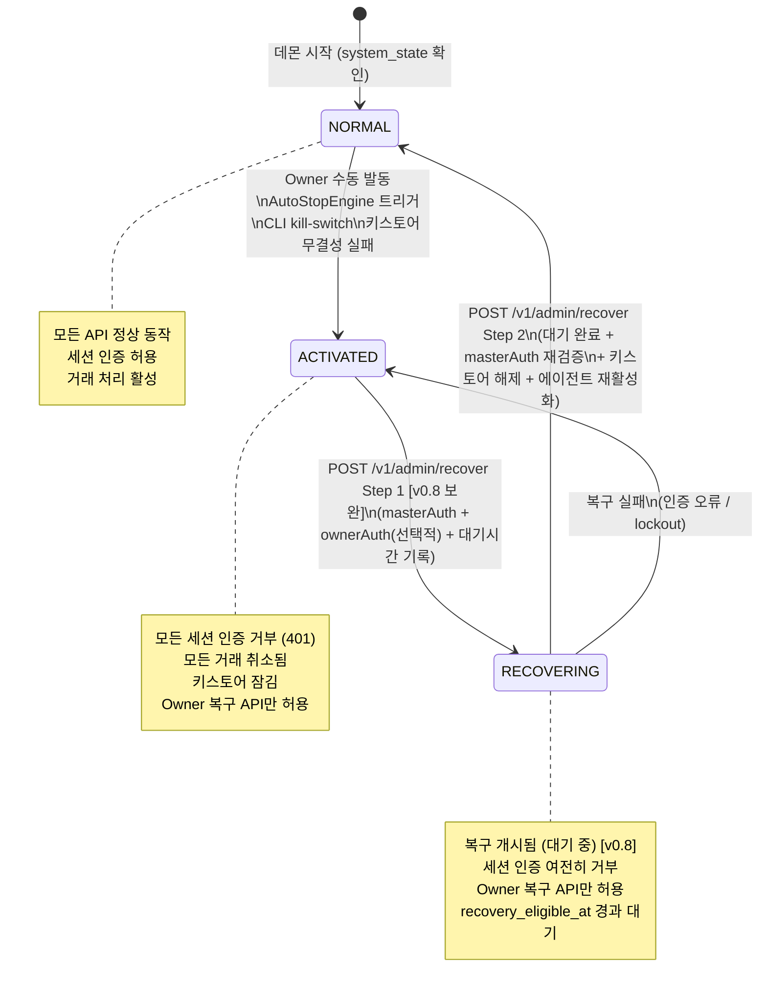
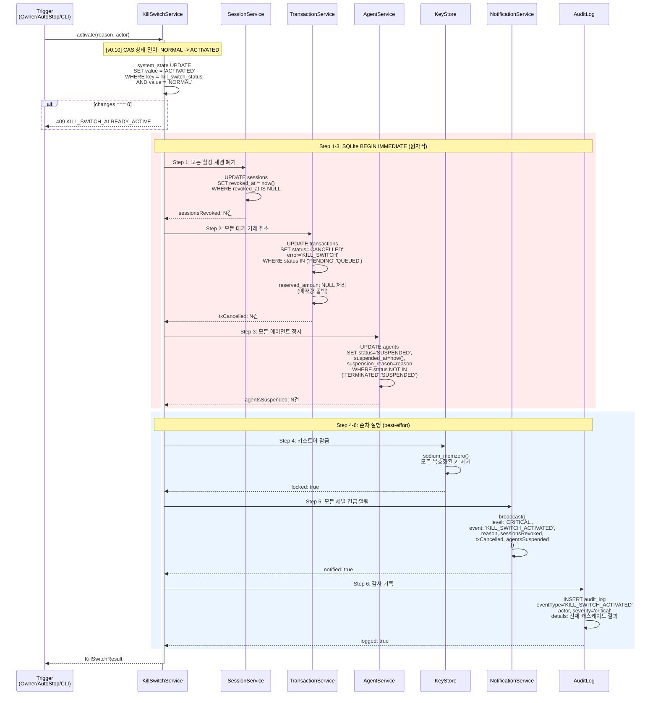
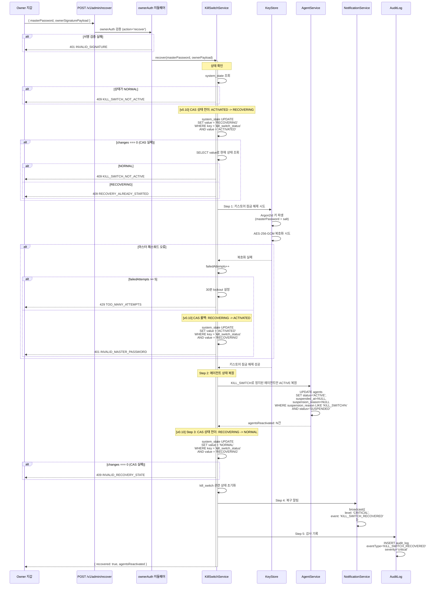
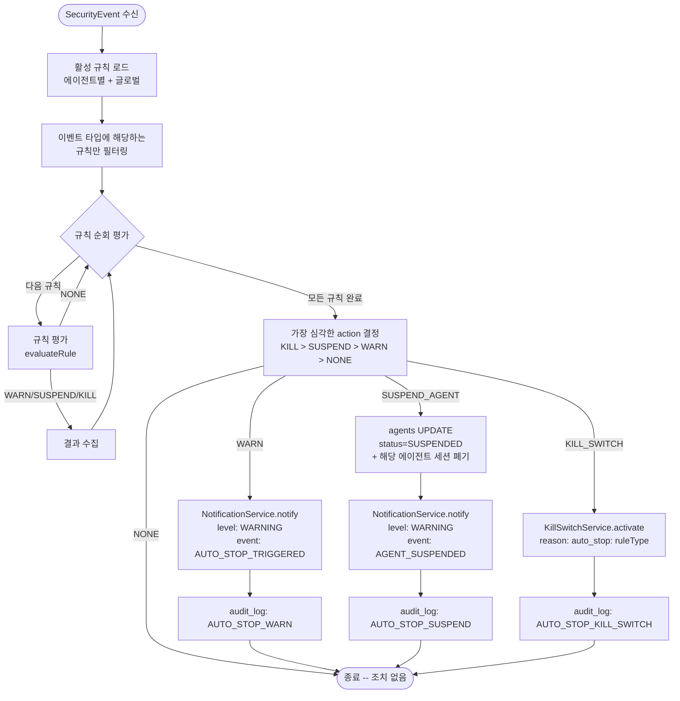

# Kill Switch 프로토콜 + 자동 정지 규칙 엔진 + EVM Adapter Stub (KILL-AUTO-EVM)

**문서 ID:** KILL-AUTO-EVM
**작성일:** 2026-02-05
**v0.7 보완:** 2026-02-08
**v0.8 보완:** 2026-02-09
**v0.10 보완:** 2026-02-09
**상태:** 완료
**참조:** LOCK-MECH (33-time-lock-approval-mechanism.md), OWNR-CONN (34-owner-wallet-connection.md), NOTI-ARCH (35-notification-architecture.md), CORE-04 (27-chain-adapter-interface.md), CORE-05 (28-daemon-lifecycle-cli.md), CORE-03 (26-keystore-spec.md)

---

## 요구사항 매핑

| 요구사항 | 설명 | 충족 섹션 |
|----------|------|-----------|
| **NOTI-03** | Kill Switch 프로토콜 (캐스케이드 비상 정지) | 섹션 2, 3 |
| **NOTI-04** | 자동 정지 규칙 엔진 | 섹션 6, 7, 8, 9 |
| **NOTI-05** | Kill Switch 복구 절차 | 섹션 4 |
| **CHAIN-03** | EVM Adapter stub (IChainAdapter 준수) | 섹션 10 |

---

## 1. Kill Switch 개요

### 1.1 3계층 보안에서의 위치

WAIaaS는 3계층 보안 모델로 에이전트 거래를 보호한다:

| 계층 | 구성 요소 | 방어 범위 | 문서 |
|------|-----------|-----------|------|
| **Layer 1** | 세션 인증 + 세션 제약 | 개별 요청 인증, 작업 범위 제한 | SESS-PROTO |
| **Layer 2** | 시간 지연 + 승인 + 정책 엔진 | 거래 금액/빈도/대상 기반 에스컬레이션 | LOCK-MECH |
| **Layer 3** | **모니터링 + Kill Switch** | **시스템 전체 비상 정지, 이상 패턴 감지** | **본 문서** |

Kill Switch는 Layer 3의 최후 방어선이다. 모든 에이전트의 활동을 즉시 중단하고, 키스토어를 잠그며, 자금 유출을 원천 차단한다. 자동 정지 규칙 엔진(AutoStopEngine)은 Owner가 부재 시에도 이상 패턴을 감지하여 에이전트 정지 또는 Kill Switch를 자동 발동한다.

### 1.2 Kill Switch 트리거 소스

Kill Switch는 4가지 경로로 발동된다:

| 트리거 | 경로 | 인증 | 비고 |
|--------|------|------|------|
| **Owner 수동** | `POST /v1/owner/kill-switch` | ownerAuth (SIWS/SIWE 서명) | WalletConnect 또는 CLI 직접 서명 |
| **CLI 수동** | `waiaas kill-switch --reason "emergency"` | 마스터 패스워드 (stdin/env) | WalletConnect 불필요 (OWNR-CONN 결정) |
| **AutoStopEngine 자동** | 규칙 엔진 트리거 | 내부 시스템 호출 (인증 불필요) | 섹션 6-9 상세 |
| **데몬 자체 감지** | 키스토어 무결성 검증 실패 | 내부 시스템 호출 | 선택적 -- config.toml 설정 |

**Kill Switch API 엔드포인트:**

```typescript
// Owner 수동 발동 (ownerAuth)
// POST /v1/owner/kill-switch
const KillSwitchRequest = z.object({
  reason: z.string().min(1).max(500),
})

const KillSwitchResponse = z.object({
  activated: z.literal(true),
  timestamp: z.string().datetime(),
  sessionsRevoked: z.number().int().nonnegative(),
  transactionsCancelled: z.number().int().nonnegative(),
  agentsSuspended: z.number().int().nonnegative(),
})
// 인증: ownerAuth (action='kill_switch')
// 성공: 200 OK
// 에러: 409 KILL_SWITCH_ALREADY_ACTIVE

// CLI 수동 발동 (마스터 패스워드)
// POST /v1/admin/kill-switch
const AdminKillSwitchRequest = z.object({
  masterPassword: z.string().min(8),
  reason: z.string().min(1).max(500),
})
// 인증: 마스터 패스워드 (Argon2id 검증)
// 성공: 200 OK (동일 응답)
// 에러: 401 INVALID_MASTER_PASSWORD
```

---

## 2. Kill Switch 상태 머신

> **v0.5 인증 모델 변경:** Kill Switch 발동(activate)의 인증이 masterAuth(implicit)로 변경되었으며, 복구(recover)만 ownerAuth를 유지합니다. 이는 발동은 긴급 상황에서 빠른 대응이 필요하나(localhost 접속만으로 발동 가능), 복구는 정상 운영 재개에 해당하므로 Owner 서명으로 이중 확인하는 설계입니다. AutoStopEngine은 이벤트 기반 내부 호출이므로 인증 변경 없음. 상세: 52-auth-model-redesign.md 참조.

### 2.1 상태 다이어그램



### 2.2 상태 정의

| 상태 | 설명 | API 동작 | 데몬 상태 |
|------|------|----------|-----------|
| **NORMAL** | 정상 운영 상태 | 모든 API 정상 | 전체 서비스 활성 |
| **ACTIVATED** | Kill Switch 발동됨 | 세션 인증 거부, Owner 복구만 허용 | 키스토어 잠김, 워커 정지 |
| **RECOVERING** | 복구 개시됨, 대기 시간 경과 대기 중 [v0.8 보완] | ACTIVATED와 동일 제한 | 대기 시간 경과 후 Step 2로 복구 완료 |

### 2.3 시스템 상태 저장

Kill Switch 상태는 SQLite `system_state` 테이블에 저장한다 (데몬 재시작 시에도 유지):

```typescript
// Drizzle ORM 정의
export const systemState = sqliteTable('system_state', {
  key: text('key').primaryKey(),               // 설정 키
  value: text('value').notNull(),              // JSON 값
  updatedAt: integer('updated_at', { mode: 'timestamp' }).notNull(),
})
```

**Kill Switch 관련 키-값:**

| key | value 타입 | 기본값 | 설명 |
|-----|-----------|--------|------|
| `kill_switch_status` | `'NORMAL' \| 'ACTIVATED' \| 'RECOVERING'` | `'NORMAL'` | 현재 Kill Switch 상태 |
| `kill_switch_activated_at` | ISO 8601 문자열 \| `null` | `null` | 발동 시각 |
| `kill_switch_reason` | 문자열 \| `null` | `null` | 발동 사유 |
| `kill_switch_actor` | `'owner' \| 'auto_stop' \| 'admin' \| 'system'` \| `null` | `null` | 발동 주체 |

**SQL DDL:**

```sql
CREATE TABLE system_state (
  key TEXT PRIMARY KEY,
  value TEXT NOT NULL,
  updated_at INTEGER NOT NULL
);

-- 초기값 (waiaas init 시 삽입)
INSERT INTO system_state (key, value, updated_at)
VALUES ('kill_switch_status', '"NORMAL"', unixepoch());
```

### 2.4 ACTIVATED 상태에서의 API 동작 [v0.7 보완: 허용 목록 4개 확정, 503 응답, recover 경로 변경] [v0.8: 5번째 허용 경로 추가]

```typescript
// killSwitchGuard 미들웨어 -- 미들웨어 체인 #7 (authRouter 이전에 실행)
// [v0.7 보완] 허용 목록 4개로 확장, HTTP 503 응답, recover 경로 /v1/admin/recover로 통일
// [v0.8] 5번째 허용 경로 추가: POST /v1/owner/agents/:agentId/withdraw (자금 회수)
async function killSwitchGuard(c: Context, next: Next): Promise<void> {
  const status = getSystemState(c.get('db'), 'kill_switch_status')

  if (status === 'NORMAL') {
    return next()
  }

  // ACTIVATED 또는 RECOVERING 상태
  const path = c.req.path
  const method = c.req.method

  // [v0.7 보완] 허용 목록 4개 확정 (DAEMON-04 해소)
  // [v0.8] 5번째 허용 경로 추가: 자금 회수 (35-01 방안 A 결정)
  const KILL_SWITCH_ALLOWED_PATHS = [
    { method: 'GET',  path: '/v1/health' },
    { method: 'GET',  path: '/v1/admin/status' },
    { method: 'POST', path: '/v1/admin/recover' },
    { method: 'GET',  path: '/v1/admin/kill-switch' },
    { method: 'POST', path: '/v1/owner/agents/:agentId/withdraw' },  // [v0.8] 자금 회수 허용
  ]

  // [v0.8] withdraw 경로는 :agentId가 동적이므로 패턴 매칭 사용
  const isAllowed = KILL_SWITCH_ALLOWED_PATHS.some(
    p => p.method === method && matchPath(path, p.path)
  )
  // matchPath: 정적 경로는 === 비교, :param 포함 경로는 정규식 매칭

  if (isAllowed) {
    return next()
  }

  // [v0.7 보완] 모든 다른 요청 거부 -- HTTP 503 Service Unavailable (기존 401에서 변경)
  // 401은 "인증 실패"를 의미하나, Kill Switch는 인증 문제가 아니라 시스템 상태 문제이므로 503이 적절
  return c.json({
    error: {
      code: 'SYSTEM_LOCKED',
      message: 'System is in kill switch mode.',
      details: {
        activatedAt: getSystemState(c.get('db'), 'kill_switch_activated_at'),
        reason: getSystemState(c.get('db'), 'kill_switch_reason'),
      },
      requestId: c.get('requestId'),
      retryable: false,
    },
  }, 503)
}
```

**미들웨어 순서 업데이트:** [v0.7 보완: 10단계]

```
ID -> 로깅 -> 종료검사 -> globalRateLimit -> 보안헤더 -> Host -> CORS -> KillSwitchGuard -> Auth -> sessionRateLimit
```

killSwitchGuard(#7)는 CORS 이후, 인증(authRouter) 이전에 위치한다. ACTIVATED 상태에서는 인증 로직까지 도달하지 않으므로 불필요한 DB 조회를 방지한다.

> **[v0.7 보완] 변경 사항:**
> 1. **허용 목록 3개 -> 4개:** `GET /v1/admin/kill-switch` (Kill Switch 상태 조회) 추가. 외부 모니터링 도구가 Kill Switch 상태를 확인할 수 있어야 함.
> 2. **recover 경로 변경:** `/v1/owner/recover` -> `/v1/admin/recover`. Kill Switch 복구는 시스템 관리 작업이므로 `/v1/admin/` 네임스페이스가 적절.
> 3. **HTTP 상태 코드 변경:** 401 -> 503 Service Unavailable. Kill Switch는 인증 실패(401)가 아니라 시스템 가용성 문제(503)에 해당.
>
> **[v0.8] 변경 사항:**
> 4. **허용 목록 4개 -> 5개:** `POST /v1/owner/agents/:agentId/withdraw` (자금 회수) 추가. Kill Switch 발동 시 자금 회수는 가장 시급한 보안 조치이며, 수신 주소가 owner_address로 고정되어 공격자 이득 없음 (35-01 방안 A 결정). LOCKED 상태에서만 활성화되므로 Kill Switch + withdraw 모두 보안 가드를 통과한다. 동적 경로(:agentId)이므로 패턴 매칭 함수(matchPath) 사용.

**`/v1/health` 엔드포인트 확장:**

```typescript
// GET /v1/health 응답에 kill_switch 상태 포함
const HealthResponse = z.object({
  status: z.enum(['ok', 'degraded', 'locked']),
  version: z.string(),
  uptime: z.number(),
  killSwitch: z.object({
    active: z.boolean(),
    activatedAt: z.string().datetime().nullable(),
    reason: z.string().nullable(),
  }),
})
```

---

## 3. Kill Switch 캐스케이드 프로토콜 (6단계)

### 3.1 캐스케이드 시퀀스 다이어그램



### 3.1.1 [v0.10] CAS (Compare-And-Swap) 패턴 원칙

> **CONC-03:** Kill Switch 상태 전이의 동시성 안전성 확보. 선례: 34-owner-wallet-connection markOwnerVerified() `WHERE owner_verified = 0` + changes 확인.

1. CAS UPDATE는 BEGIN IMMEDIATE 트랜잭션의 **첫 번째 문장**이어야 한다
2. `changes === 0`이면 즉시 throw -- 이후 캐스케이드 로직이 실행되지 않음
3. 현재 상태가 예상과 다른 경우, SELECT로 실제 상태를 조회하여 적절한 에러 코드를 선택한다
4. CAS 범위는 `kill_switch_status` 전이에만 적용한다. Step 1-3 캐스케이드(세션 폐기, 거래 취소, 에이전트 정지)는 동일 트랜잭션 내에서 원자적으로 실행되므로 별도 CAS 불필요
5. 선례: 34-owner-wallet-connection markOwnerVerified() `WHERE owner_verified = 0` + changes 확인

### 3.1.2 [v0.10] Kill Switch CAS 에러 코드

| 전이 시도 | CAS 실패 원인 | 에러 코드 | HTTP |
|----------|-------------|----------|:----:|
| NORMAL -> ACTIVATED | 이미 ACTIVATED 또는 RECOVERING | KILL_SWITCH_ALREADY_ACTIVE | 409 |
| ACTIVATED -> RECOVERING | 이미 NORMAL (비활성) | KILL_SWITCH_NOT_ACTIVE | 409 |
| ACTIVATED -> RECOVERING | 이미 RECOVERING (중복 복구) | RECOVERY_ALREADY_STARTED | 409 |
| RECOVERING -> NORMAL | 복구 중 재발동으로 상태 변경됨 | INVALID_RECOVERY_STATE | 409 |
| RECOVERING -> ACTIVATED | 복구 중 다른 전이로 상태 변경됨 | INVALID_RECOVERY_STATE | 409 |

모든 CAS 실패는 HTTP 409 Conflict로 반환한다. 이는 "클라이언트 요청은 올바르나, 현재 서버 상태와 충돌"을 의미한다.

**Note:** 이 에러 코드들은 37-rest-api SS10.12 통합 매트릭스에도 등록되어야 한다. 구현 시 SYSTEM 도메인 행으로 추가.

### 3.2 6단계 상세

#### Step 1: 모든 활성 세션 즉시 폐기

```typescript
// SQLite BEGIN IMMEDIATE 트랜잭션 내에서 실행
const revokeResult = db.prepare(`
  UPDATE sessions
  SET revoked_at = ?
  WHERE revoked_at IS NULL
`).run(nowEpoch)

// 영향: 모든 에이전트의 API 접근 즉시 차단
// sessionAuth Stage 1 (JWT 검증) 통과해도 Stage 2 (DB 조회)에서 revokedAt 확인 -> 거부
const sessionsRevoked = revokeResult.changes
```

- **효과:** 모든 에이전트의 JWT 토큰이 즉시 무효화됨
- **감사:** audit_log에 `KILL_SWITCH_SESSIONS_REVOKED` 이벤트 기록 (폐기 건수 포함)

#### Step 2: 모든 대기 거래 취소

```typescript
// 동일 BEGIN IMMEDIATE 트랜잭션 내에서 실행
const cancelResult = db.prepare(`
  UPDATE transactions
  SET status = 'CANCELLED',
      error = 'KILL_SWITCH',
      updated_at = ?
  WHERE status IN ('PENDING', 'QUEUED')
`).run(nowEpoch)

// reserved_amount 롤백
db.prepare(`
  UPDATE transactions
  SET reserved_amount = NULL
  WHERE error = 'KILL_SWITCH'
    AND reserved_amount IS NOT NULL
`).run()

const txCancelled = cancelResult.changes
```

- **효과:** DELAY 쿨다운 대기 중, APPROVAL 승인 대기 중인 모든 거래가 즉시 CANCELLED
- **reserved_amount:** 예약된 금액이 롤백되어 usageStats에서 제외됨
- **감사:** audit_log에 `KILL_SWITCH_TX_CANCELLED` 이벤트 기록 (취소 건수 포함)

#### Step 3: 모든 에이전트 정지

```typescript
// 동일 BEGIN IMMEDIATE 트랜잭션 내에서 실행
const suspendResult = db.prepare(`
  UPDATE agents
  SET status = 'SUSPENDED',
      suspended_at = ?,
      suspension_reason = ?
  WHERE status NOT IN ('TERMINATED', 'SUSPENDED')
`).run(nowEpoch, `KILL_SWITCH: ${reason}`)

const agentsSuspended = suspendResult.changes
```

- **효과:** CREATING, ACTIVE 상태의 모든 에이전트가 SUSPENDED로 전이
- **이미 SUSPENDED인 에이전트:** 변경하지 않음 (이전 정지 사유 보존)
- **TERMINATED 에이전트:** 변경 불가 (최종 상태)
- **감사:** audit_log에 `KILL_SWITCH_AGENTS_SUSPENDED` 이벤트 기록

#### Step 4: 키스토어 잠금

```typescript
// BEGIN IMMEDIATE 트랜잭션 외부에서 실행
await keyStore.lock()
// 내부: sodium_memzero()로 메모리 내 모든 복호화된 키 제거
// 이후 signTransaction() 호출 시 KEYSTORE_LOCKED 에러 발생
```

- **효과:** 메모리에서 모든 개인키가 제거됨. 서명 불가
- **데몬 프로세스 유지:** 프로세스를 종료하지 않음 -- 복구 API를 위해 HTTP 서버 유지
- **감사:** audit_log에 `KILL_SWITCH_KEYSTORE_LOCKED` 이벤트 기록

#### Step 5: 모든 채널 긴급 알림

```typescript
// NotificationService.broadcast() -- 모든 활성 채널에 병렬 전송
await notificationService.broadcast({
  level: 'CRITICAL',
  event: 'KILL_SWITCH_ACTIVATED',
  title: 'Kill Switch Activated',
  body: formatKillSwitchMessage({
    reason,
    actor,
    sessionsRevoked,
    txCancelled,
    agentsSuspended,
    timestamp: new Date().toISOString(),
  }),
  referenceId: `kill_switch_${Date.now()}`,
})
```

- **전송 방식:** `broadcast()` -- Promise.allSettled로 모든 채널 병렬 전송 (NOTI-ARCH 설계)
- **notify()가 아닌 broadcast() 사용:** Kill Switch는 모든 채널에 동시 전송 (첫 성공 중단 아님)
- **실패 시:** 알림 전송 실패가 Kill Switch 자체를 블로킹하지 않음 (best-effort)

#### Step 6: 감사 기록

```typescript
await insertAuditLog(db, {
  eventType: 'KILL_SWITCH_ACTIVATED',
  actor: actor,           // 'owner' | 'auto_stop' | 'admin' | 'system'
  severity: 'critical',
  details: JSON.stringify({
    reason,
    sessionsRevoked,
    txCancelled,
    agentsSuspended,
    keystoreLocked: true,
    cascadeDurationMs: Date.now() - startTime,
  }),
})
```

- **캐스케이드 실행 시간 기록:** 전체 6단계 소요 시간 (ms)
- **severity:** `critical` -- 최고 심각도

### 3.3 캐스케이드 원자성 및 부분 실패 처리

| 단계 | 원자성 | 실패 시 동작 |
|------|--------|-------------|
| **Step 1-3** | **단일 SQLite BEGIN IMMEDIATE 트랜잭션** (원자적) | 전체 롤백, Kill Switch 발동 실패 (NORMAL 유지) |
| **Step 4** | 독립 실행 | 실패 기록 후 Step 5 계속 (키스토어 잠금 실패 = audit_log critical) |
| **Step 5** | 독립 실행 (best-effort) | 알림 실패해도 Kill Switch 상태는 ACTIVATED 유지 |
| **Step 6** | 독립 실행 | 감사 기록 실패 = stderr 로그 출력 (최후 수단) |

**핵심 원칙:**
- Step 1-3의 DB 변경은 반드시 원자적 (하나라도 실패하면 전체 롤백)
- Step 4-6은 순차 실행하되 개별 실패가 다음 단계를 블로킹하지 않음
- system_state의 `kill_switch_status`는 Step 1-3 트랜잭션 내에서 ACTIVATED로 변경

#### 3.3.1 [v0.10] activate() CAS 트랜잭션 전체 의사코드 (CONC-03)

```typescript
// [v0.10] CAS (Compare-And-Swap) 패턴: NORMAL -> ACTIVATED
// 선례: 34-owner-wallet markOwnerVerified() WHERE owner_verified = 0
const activateTx = sqlite.transaction(() => {
  // CAS: 현재 상태가 NORMAL일 때만 ACTIVATED로 전이
  const result = sqlite.prepare(`
    UPDATE system_state
    SET value = '"ACTIVATED"', updated_at = :now
    WHERE key = 'kill_switch_status' AND value = '"NORMAL"'
  `).run({ now: nowEpoch })

  if (result.changes === 0) {
    // 이미 ACTIVATED이거나 RECOVERING 상태
    throw new KillSwitchAlreadyActiveError()
  }

  // Step 1: 모든 활성 세션 폐기
  sqlite.prepare(`
    UPDATE sessions SET revoked_at = :now WHERE revoked_at IS NULL
  `).run({ now: nowEpoch })

  // Step 2: 진행 중 거래 취소 (QUEUED/EXECUTING -> CANCELLED)
  sqlite.prepare(`
    UPDATE transactions SET status = 'CANCELLED', updated_at = :now
    WHERE status IN ('QUEUED', 'EXECUTING')
  `).run({ now: nowEpoch })

  // Step 3: 감사 로그
  sqlite.prepare(`
    INSERT INTO audit_log (id, event_type, actor, severity, details, timestamp)
    VALUES (:id, 'KILL_SWITCH_ACTIVATED', 'system', 'critical',
            :details, :now)
  `).run({ id: generateUuidV7(), details: JSON.stringify({ trigger: reason }), now: nowEpoch })
})

activateTx.immediate()  // BEGIN IMMEDIATE로 직렬화
```

**핵심:** CAS UPDATE가 트랜잭션의 **첫 번째 문장**이어야 한다. `changes === 0`이면 즉시 throw하여 이후 캐스케이드(세션 폐기, 거래 취소)가 실행되지 않는다.

### 3.4 KillSwitchService 인터페이스

```typescript
interface IKillSwitchService {
  /**
   * Kill Switch를 발동한다.
   * 6단계 캐스케이드를 실행하고 결과를 반환한다.
   *
   * @param reason - 발동 사유
   * @param actor - 발동 주체
   * @returns 캐스케이드 실행 결과
   * @throws KILL_SWITCH_ALREADY_ACTIVE -- 이미 ACTIVATED 상태
   */
  activate(reason: string, actor: KillSwitchActor): Promise<KillSwitchResult>

  /**
   * Kill Switch를 복구한다 (섹션 4 참조).
   */
  recover(masterPassword: string, ownerSignature: OwnerSignaturePayload): Promise<RecoverResult>

  /**
   * 현재 Kill Switch 상태를 조회한다.
   */
  getStatus(): KillSwitchStatus
}

type KillSwitchActor = 'owner' | 'auto_stop' | 'admin' | 'system'

interface KillSwitchResult {
  activated: true
  timestamp: string         // ISO 8601
  sessionsRevoked: number
  transactionsCancelled: number
  agentsSuspended: number
  cascadeDurationMs: number
}

interface KillSwitchStatus {
  status: 'NORMAL' | 'ACTIVATED' | 'RECOVERING'
  activatedAt: string | null
  reason: string | null
  actor: KillSwitchActor | null
}
```

---

## 4. Kill Switch 복구 절차 (NOTI-05)

### 4.1 이중 인증 요구

Kill Switch 복구는 **두 가지 인증을 동시에 요구**한다:

| # | 인증 수단 | 검증 방법 | 목적 |
|---|-----------|-----------|------|
| 1 | **Owner 지갑 서명** (SIWS/SIWE) | ownerAuth 8단계 검증 (OWNR-CONN) | Owner 신원 확인 |
| 2 | **마스터 패스워드** | Argon2id 키 파생 -> AES-256-GCM 복호화 시도 (CORE-03) | 키스토어 잠금 해제 |

**왜 이중 인증인가:**
- Owner 서명만으로는 키스토어를 해제할 수 없음 (마스터 패스워드 필요)
- 마스터 패스워드만으로는 Owner가 아닌 사람이 복구할 수 있음 (로컬 접근자)
- 두 가지 모두 충족해야만 시스템을 안전하게 복원 가능

### 4.2 복구 시퀀스 다이어그램



### 4.3 복구 후 상태

| 구성 요소 | 복구 후 상태 | 비고 |
|-----------|-------------|------|
| **세션** | 모두 폐기 유지 | 에이전트가 새 세션을 요청해야 함 (POST /v1/sessions) |
| **거래** | CANCELLED 유지 (복원 불가) | 필요 시 에이전트가 새 거래 생성 |
| **에이전트** | ACTIVE 복원 (KILL_SWITCH로 정지된 것만) | 다른 사유로 SUSPENDED인 에이전트는 유지 |
| **키스토어** | 잠금 해제됨 | 복구 과정에서 마스터 패스워드로 해제 |
| **system_state** | NORMAL | kill_switch 관련 값 초기화 |
| **백그라운드 워커** | 재시작 | DELAY/APPROVAL 워커 재활성화 |

### 4.4 POST /v1/admin/recover 엔드포인트 스펙 [v0.7 보완: 경로 변경 /v1/owner/recover -> /v1/admin/recover]

```typescript
// 인증: ownerAuth (action='recover')
// POST /v1/admin/recover  [v0.7 보완: 경로 변경]

const RecoverRequest = z.object({
  masterPassword: z.string().min(8),
})
// ownerAuth 미들웨어가 Authorization 헤더에서 서명 검증

const RecoverResponse = z.object({
  recovered: z.literal(true),
  timestamp: z.string().datetime(),
  agentsReactivated: z.number().int().nonnegative(),
})

// 에러 응답
// 409 KILL_SWITCH_NOT_ACTIVE -- Kill Switch가 활성 상태가 아닌데 복구 시도
// 401 INVALID_MASTER_PASSWORD -- 마스터 패스워드 검증 실패
// 401 INVALID_SIGNATURE -- Owner 서명 검증 실패
// 429 TOO_MANY_ATTEMPTS -- brute-force 방지 lockout (5회 실패 -> 30분)
```

### 4.5 CLI 복구 대안

```bash
# WalletConnect가 불가능한 환경에서의 복구 경로
waiaas recover \
  --master-password <password> \
  --owner-signature <base64url-encoded-payload>

# 또는 환경 변수로 전달
WAIAAS_MASTER_PASSWORD=<password> waiaas recover \
  --owner-signature <payload>
```

- **Owner 서명 획득 방법:** 다른 기기에서 SIWS/SIWE 메시지를 서명하고, base64url 인코딩된 ownerSignaturePayload를 CLI 인자로 전달
- **WalletConnect 불필요:** CLI 복구는 서명을 직접 인자로 받으므로 Relay 의존 없음
- **내부 동작:** `/v1/admin/recover` 엔드포인트를 HTTP 호출 [v0.7 보완: 경로 변경]

### 4.6 복구 brute-force 방지

```typescript
// 복구 시도 실패 추적
interface RecoveryAttemptTracker {
  failedAttempts: number      // 연속 실패 횟수
  lockoutUntil: Date | null   // lockout 만료 시각
}

// system_state 테이블에 저장
// key: 'recovery_failed_attempts' -> value: number
// key: 'recovery_lockout_until' -> value: ISO 8601 | null

// 규칙:
// - 마스터 패스워드 검증 실패 시 failedAttempts++
// - 5회 연속 실패 -> 30분 lockout
// - lockout 기간 중 복구 시도 -> 429 TOO_MANY_ATTEMPTS
// - 복구 성공 시 failedAttempts 초기화
// - lockout 만료 후 자동 해제 (다음 시도 시 확인)
```

### 4.7 [v0.8] Owner 유무별 복구 대기 시간 분기

> **v0.8 변경 사유:** Owner 등록이 선택적이므로, Owner가 없는 시스템에서도 Kill Switch 복구가 가능해야 한다. Owner가 없으면 이중 인증(ownerAuth)이 불가하므로, 시간 지연으로 보안을 보상한다.

#### 4.7.1 Owner 유무별 복구 대기 시간 분기 테이블

| 시나리오 | 인증 | 대기 시간 | 근거 |
|---------|------|----------|------|
| **Owner 있음** (시스템 내 1개라도) | ownerAuth + masterAuth | 30분 (1,800초) | Owner 서명이 이중 인증 역할 |
| **Owner 없음** (모든 에이전트 미등록) | masterAuth만 | 24시간 (86,400초) | 이중 인증 부재를 시간으로 보상 |

#### 4.7.2 Owner 유무 판단 기준

Kill Switch는 **시스템 전체** 동작이므로 에이전트별 분기는 부적절하다. 시스템 내에 Owner가 등록된 에이전트가 하나라도 있는지로 판단한다.

**판단 쿼리:**
```sql
SELECT 1 FROM agents WHERE owner_address IS NOT NULL LIMIT 1
```

| 쿼리 결과 | 시나리오 | 적용 |
|----------|---------|------|
| 행 존재 | "Owner 있음" | ownerAuth 요구 + 30분 대기 |
| 행 없음 | "Owner 없음" | masterAuth만 + 24시간 대기 |

**근거:**
- 에이전트별 분기 부적절: Kill Switch 복구는 시스템 전체를 정상으로 되돌리는 동작이므로 개별 에이전트 상태로 분기할 수 없다.
- Owner가 있는 에이전트의 자금 보호 최우선: Owner가 등록된 에이전트가 하나라도 있으면, 해당 에이전트의 자금을 보호하기 위해 ownerAuth를 요구한다.
- agents.owner_address는 Kill Switch 캐스케이드 6단계(섹션 3)에서 변경되지 않으므로, 복구 시점에서 agents 테이블의 현재 값을 읽으면 정확하다.

#### 4.7.3 2단계 복구 패턴

복구 대기 시간을 HTTP 요청 내에서 sleep으로 처리할 수 없다 (24시간 대기는 불가). 따라서 **2단계 복구 패턴**을 적용한다.

**Step 1: POST /v1/admin/recover (최초 요청 -- 복구 개시)**
```
요청: { masterPassword }
+ Owner 있음 시: Authorization 헤더에 ownerAuth 서명

처리:
1. kill_switch_status === 'ACTIVATED' 확인
   - NORMAL → 409 KILL_SWITCH_NOT_ACTIVE
   - RECOVERING → 409 RECOVERY_ALREADY_STARTED
2. masterAuth 검증 (Argon2id)
3. Owner 유무 판단: SELECT 1 FROM agents WHERE owner_address IS NOT NULL LIMIT 1
4. Owner 있음: ownerAuth 검증 (action='recover')
   - ownerAuth 미제공 → 401 OWNER_AUTH_REQUIRED
5. waitSeconds 결정: hasOwner ? 1800 : 86400
6. system_state 기록:
   - kill_switch_status = 'RECOVERING'
   - recovery_eligible_at = now + waitSeconds (Unix epoch 초)
   - recovery_wait_seconds = waitSeconds
7. audit_log INSERT: KILL_SWITCH_RECOVERY_STARTED

응답: 202 Accepted
{
  "status": "RECOVERING",
  "recoveryEligibleAt": "2026-02-10T02:26:30Z",
  "waitSeconds": 1800,
  "hasOwner": true
}
```

**Step 2: POST /v1/admin/recover (대기 후 요청 -- 복구 완료)**
```
요청: { masterPassword }
(ownerAuth는 Step 1에서 검증 완료이므로 Step 2에서 불필요)

처리:
1. kill_switch_status === 'RECOVERING' 확인
   - NORMAL → 409 KILL_SWITCH_NOT_ACTIVE
   - ACTIVATED → Step 1부터 재시작 필요
2. masterAuth 검증 (Argon2id)
3. now >= recovery_eligible_at 확인
   - 미경과 → 409 RECOVERY_WAIT_REQUIRED + { remainingSeconds }
4. 실제 복구 수행 (기존 4.2 시퀀스: 키스토어 해제 → 에이전트 복원 → NORMAL 전이)
5. system_state 초기화:
   - kill_switch_status = 'NORMAL'
   - kill_switch_activated_at = NULL
   - kill_switch_reason = NULL
   - recovery_eligible_at = NULL
   - recovery_wait_seconds = NULL
6. audit_log INSERT: KILL_SWITCH_RECOVERED

응답: 200 OK
{
  "recovered": true,
  "timestamp": "2026-02-10T02:56:30Z",
  "agentsReactivated": 5
}
```

**Kill Switch 상태 전이 (v0.8 확정, v0.10 CAS 보강):**
```
NORMAL → ACTIVATED (발동: 기존 4가지 트리거) [v0.10] WHERE value = '"NORMAL"'
ACTIVATED → RECOVERING (Step 1: 복구 개시, 대기 시간 기록) [v0.10] WHERE value = '"ACTIVATED"'
RECOVERING → NORMAL (Step 2: 대기 완료 + masterAuth 재검증) [v0.10] WHERE value = '"RECOVERING"'
RECOVERING → ACTIVATED (복구 실패: masterAuth 오류 / lockout) [v0.10] WHERE value = '"RECOVERING"'
```

#### 4.7.4 RecoverRequest 스키마 변경 [v0.8]

```typescript
// v0.7 이전: ownerAuth 헤더 필수
// v0.8: ownerAuth 헤더는 Owner 있을 때만 필수

// POST /v1/admin/recover
const RecoverRequest = z.object({
  masterPassword: z.string().min(8),
})
// ownerAuth 미들웨어: Owner 유무에 따라 동적 적용
// - Owner 있음: ownerAuth 검증 (action='recover') -- 기존 동작
// - Owner 없음: ownerAuth 미적용 -- masterAuth만으로 복구

// authRouter 분기 의사 코드:
// const hasOwner = db.prepare(
//   'SELECT 1 FROM agents WHERE owner_address IS NOT NULL LIMIT 1'
// ).get() !== undefined
//
// if (hasOwner) {
//   requireOwnerAuth(c, 'recover')  // 401 if missing/invalid
// }
```

**응답 스키마 변경:**

```typescript
// Step 1 응답 (202 Accepted)
const RecoverInitiatedResponse = z.object({
  status: z.literal('RECOVERING'),
  recoveryEligibleAt: z.string().datetime(),  // 복구 가능 시각
  waitSeconds: z.number().int(),               // 적용된 대기 시간
  hasOwner: z.boolean(),                       // Owner 유무
})

// Step 2 응답 (200 OK) -- 기존 RecoverResponse 유지
const RecoverResponse = z.object({
  recovered: z.literal(true),
  timestamp: z.string().datetime(),
  agentsReactivated: z.number().int().nonnegative(),
})
```

#### 4.7.5 system_state 키 추가 [v0.8]

| key | value 타입 | 기본값 | 설명 |
|-----|-----------|--------|------|
| `kill_switch_status` | `'NORMAL' \| 'ACTIVATED' \| 'RECOVERING'` | `'NORMAL'` | 현재 상태 (기존) |
| `kill_switch_activated_at` | ISO 8601 \| `null` | `null` | 발동 시각 (기존) |
| `kill_switch_reason` | 문자열 \| `null` | `null` | 발동 사유 (기존) |
| `kill_switch_actor` | 문자열 \| `null` | `null` | 발동 주체 (기존) |
| `recovery_eligible_at` | Unix epoch 초 \| `null` | `null` | **[v0.8 추가]** 복구 가능 시각 |
| `recovery_wait_seconds` | 정수 \| `null` | `null` | **[v0.8 추가]** 적용된 대기 시간 (1800 또는 86400) |

**RECOVERING 상태 상세 설명:**
- RECOVERING은 복구가 개시되었으나 대기 시간이 경과하지 않은 상태이다.
- API 동작은 ACTIVATED와 동일: 세션 인증 거부, killSwitchGuard 허용 목록만 통과.
- 차이점: Step 2(대기 후 복구 완료)가 가능하다.
- ACTIVATED에서 직접 NORMAL로 전이할 수 없다 (반드시 RECOVERING을 거쳐야 한다).

#### 4.7.6 config.toml 설정 [v0.8]

기본값은 고정하되, config.toml로 재정의 가능하게 설계하여 운영 유연성을 제공한다.

```toml
[security]
# Kill Switch 복구 대기 시간 (초)
# Owner가 등록된 에이전트가 1개라도 있을 때 적용
kill_switch_recovery_wait_owner = 1800      # 기본 30분

# Owner가 등록된 에이전트가 없을 때 적용
kill_switch_recovery_wait_no_owner = 86400  # 기본 24시간
```

| 키 | 타입 | 기본값 | 유효 범위 | 설명 |
|----|------|--------|----------|------|
| `kill_switch_recovery_wait_owner` | integer | 1800 | 300 ~ 86400 (5분 ~ 24시간) | Owner 있음 시 복구 대기 (초) |
| `kill_switch_recovery_wait_no_owner` | integer | 86400 | 3600 ~ 604800 (1시간 ~ 7일) | Owner 없음 시 복구 대기 (초) |

**Zod 스키마:**
```typescript
export const SecurityConfigSchema = z.object({
  // ... 기존 필드 ...

  // [v0.8] Kill Switch 복구 대기 시간
  kill_switch_recovery_wait_owner: z.number()
    .int().min(300).max(86400)
    .optional().default(1800)
    .describe('Owner 있음 시 Kill Switch 복구 대기 시간 (초). 기본 30분.'),

  kill_switch_recovery_wait_no_owner: z.number()
    .int().min(3600).max(604800)
    .optional().default(86400)
    .describe('Owner 없음 시 Kill Switch 복구 대기 시간 (초). 기본 24시간.'),
})
```

#### 4.7.7 에러 코드 추가 [v0.8]

| 에러 코드 | HTTP | 조건 | retryable |
|-----------|------|------|-----------|
| `KILL_SWITCH_NOT_ACTIVE` | 409 | 상태가 NORMAL일 때 복구 요청 | false |
| `OWNER_AUTH_REQUIRED` | 401 | Owner 있는데 ownerAuth 미제공 | false |
| `RECOVERY_WAIT_REQUIRED` | 409 | RECOVERING 상태에서 대기 미경과 | true (대기 후 재시도) |
| `RECOVERY_ALREADY_STARTED` | 409 | 이미 RECOVERING 상태에서 새 Step 1 요청 | false |

**RECOVERY_WAIT_REQUIRED 응답 상세:**
```json
{
  "error": {
    "code": "RECOVERY_WAIT_REQUIRED",
    "message": "복구 대기 시간이 경과하지 않았습니다.",
    "details": {
      "recoveryEligibleAt": "2026-02-10T02:56:30Z",
      "remainingSeconds": 1200
    },
    "requestId": "req_...",
    "retryable": true
  }
}
```

#### 4.7.8 복구 서비스 코드 패턴 [v0.8]

```typescript
// KillSwitchService.recover() v0.8 확장
async recover(
  masterPassword: string,
  ownerSignature?: OwnerSignaturePayload,
): Promise<RecoverResult | RecoverInitiatedResult> {
  const status = getSystemState(db, 'kill_switch_status')

  // ── Phase 1: 상태 분기 ──
  if (status === 'NORMAL') {
    throw conflict('KILL_SWITCH_NOT_ACTIVE')
  }

  if (status === 'RECOVERING') {
    // Step 2: 대기 경과 확인
    return this.completeRecovery(masterPassword)
  }

  // status === 'ACTIVATED' → Step 1: 복구 개시
  return this.initiateRecovery(masterPassword, ownerSignature)
}

private async initiateRecovery(
  masterPassword: string,
  ownerSignature?: OwnerSignaturePayload,
): Promise<RecoverInitiatedResult> {
  // 1. masterAuth 검증
  await this.verifyMasterPassword(masterPassword)

  // 2. Owner 유무 판단
  const hasOwner = this.db.prepare(
    'SELECT 1 FROM agents WHERE owner_address IS NOT NULL LIMIT 1'
  ).get() !== undefined

  // 3. Owner 있으면 ownerAuth 검증
  if (hasOwner) {
    if (!ownerSignature) throw unauthorized('OWNER_AUTH_REQUIRED')
    await this.verifyOwnerSignature(ownerSignature, 'recover')
  }

  // 4. 대기 시간 결정
  const waitSeconds = hasOwner
    ? this.config.kill_switch_recovery_wait_owner
    : this.config.kill_switch_recovery_wait_no_owner
  const now = Math.floor(Date.now() / 1000)
  const recoveryEligibleAt = now + waitSeconds

  // 5. [v0.10] CAS: ACTIVATED -> RECOVERING
  const beginRecoveryTx = this.db.transaction(() => {
    const result = this.db.prepare(`
      UPDATE system_state
      SET value = '"RECOVERING"', updated_at = :now
      WHERE key = 'kill_switch_status' AND value = '"ACTIVATED"'
    `).run({ now })

    if (result.changes === 0) {
      // 현재 상태 조회하여 적절한 에러 반환
      const current = this.db.prepare(
        'SELECT value FROM system_state WHERE key = ?'
      ).get('kill_switch_status')

      if (current?.value === '"NORMAL"') throw new KillSwitchNotActiveError()
      if (current?.value === '"RECOVERING"') throw new RecoveryAlreadyStartedError()
      throw new InvalidKillSwitchStateError()
    }

    setSystemState(this.db, 'recovery_eligible_at', String(recoveryEligibleAt))
    setSystemState(this.db, 'recovery_wait_seconds', String(waitSeconds))

    // 감사 로그 (동일 트랜잭션 내)
    this.db.prepare(`
      INSERT INTO audit_log (id, event_type, actor, severity, details, timestamp)
      VALUES (:id, 'KILL_SWITCH_RECOVERY_STARTED', :actor, 'warning', :details, :now)
    `).run({
      id: generateUuidV7(),
      actor: hasOwner ? 'owner' : 'admin',
      details: JSON.stringify({
        hasOwner,
        waitSeconds,
        recoveryEligibleAt: new Date(recoveryEligibleAt * 1000).toISOString(),
      }),
      now,
    })
  })

  beginRecoveryTx.immediate()

  return {
    status: 'RECOVERING',
    recoveryEligibleAt: new Date(recoveryEligibleAt * 1000).toISOString(),
    waitSeconds,
    hasOwner,
  }
}

private async completeRecovery(
  masterPassword: string,
): Promise<RecoverResult> {
  // 1. masterAuth 재검증
  await this.verifyMasterPassword(masterPassword)

  // 2. 대기 시간 경과 확인
  const eligibleAt = Number(getSystemState(this.db, 'recovery_eligible_at'))
  const now = Math.floor(Date.now() / 1000)

  if (now < eligibleAt) {
    const remaining = eligibleAt - now
    throw conflict('RECOVERY_WAIT_REQUIRED', {
      recoveryEligibleAt: new Date(eligibleAt * 1000).toISOString(),
      remainingSeconds: remaining,
    })
  }

  // 3. [v0.10] CAS: RECOVERING -> NORMAL (실제 복구 수행)
  const completeRecoveryTx = this.db.transaction(() => {
    const result = this.db.prepare(`
      UPDATE system_state
      SET value = '"NORMAL"', updated_at = :now
      WHERE key = 'kill_switch_status' AND value = '"RECOVERING"'
    `).run({ now })

    if (result.changes === 0) {
      // 복구 중 다시 Kill Switch가 발동되었을 수 있음
      throw new InvalidRecoveryStateError()
    }

    // kill_switch 관련 상태 초기화
    setSystemState(this.db, 'kill_switch_activated_at', 'null')
    setSystemState(this.db, 'kill_switch_reason', 'null')
    setSystemState(this.db, 'recovery_eligible_at', 'null')
    setSystemState(this.db, 'recovery_wait_seconds', 'null')

    // 에이전트 재활성화 (KILL_SWITCH로 정지된 것만)
    this.db.prepare(`
      UPDATE agents
      SET status = 'ACTIVE', suspended_at = NULL, suspension_reason = NULL
      WHERE suspension_reason LIKE 'KILL_SWITCH%' AND status = 'SUSPENDED'
    `).run()

    // 감사 로그
    this.db.prepare(`
      INSERT INTO audit_log (id, event_type, actor, severity, details, timestamp)
      VALUES (:id, 'KILL_SWITCH_RECOVERY_COMPLETED', 'owner', 'info', '{}', :now)
    `).run({ id: generateUuidV7(), now })
  })

  completeRecoveryTx.immediate()

  // 키스토어 해제 (트랜잭션 외부 -- 메모리 작업)
  await this.keyStore.unlock(masterPassword)

  return { recovered: true, timestamp: new Date().toISOString(), agentsReactivated: 0 }
}

// [v0.10] CAS: RECOVERING -> ACTIVATED (복구 실패 시 롤백)
private rollbackRecovery(failureReason: string): void {
  const rollbackRecoveryTx = this.db.transaction(() => {
    const result = this.db.prepare(`
      UPDATE system_state
      SET value = '"ACTIVATED"', updated_at = :now
      WHERE key = 'kill_switch_status' AND value = '"RECOVERING"'
    `).run({ now: Math.floor(Date.now() / 1000) })

    if (result.changes === 0) {
      throw new InvalidRecoveryStateError()
    }

    // 대기 관련 상태 초기화
    setSystemState(this.db, 'recovery_eligible_at', 'null')
    setSystemState(this.db, 'recovery_wait_seconds', 'null')

    // 감사 로그
    this.db.prepare(`
      INSERT INTO audit_log (id, event_type, actor, severity, details, timestamp)
      VALUES (:id, 'KILL_SWITCH_RECOVERY_FAILED', 'owner', 'critical',
              :details, :now)
    `).run({
      id: generateUuidV7(),
      details: JSON.stringify({ reason: failureReason }),
      now: Math.floor(Date.now() / 1000),
    })
  })

  rollbackRecoveryTx.immediate()
}
```

#### 4.7.9 IKillSwitchService 인터페이스 업데이트 [v0.8]

```typescript
interface IKillSwitchService {
  /** Kill Switch 발동 (기존) */
  activate(reason: string, actor: KillSwitchActor): Promise<KillSwitchResult>

  /**
   * Kill Switch 복구 [v0.8 확장].
   * - ACTIVATED 상태: Step 1 (복구 개시, 대기 시간 기록)
   * - RECOVERING 상태: Step 2 (대기 완료 확인 후 실제 복구)
   *
   * @param masterPassword - 마스터 패스워드
   * @param ownerSignature - Owner 서명 (Owner 있을 때만 필수, Step 1에서만 사용)
   */
  recover(
    masterPassword: string,
    ownerSignature?: OwnerSignaturePayload,
  ): Promise<RecoverResult | RecoverInitiatedResult>

  /** 현재 Kill Switch 상태 조회 (기존) */
  getStatus(): KillSwitchStatus
}

/** Step 1 응답 [v0.8 추가] */
interface RecoverInitiatedResult {
  status: 'RECOVERING'
  recoveryEligibleAt: string   // ISO 8601
  waitSeconds: number          // 적용된 대기 시간 (초)
  hasOwner: boolean            // Owner 유무
}

/** Step 2 응답 (기존 RecoverResult) */
interface RecoverResult {
  recovered: true
  timestamp: string            // ISO 8601
  agentsReactivated: number
}
```

---

## 5. Kill Switch 트리거 소스 상세

### 5.1 Owner 수동 발동

```
POST /v1/owner/kill-switch
Authorization: Bearer <ownerSignaturePayload>
Content-Type: application/json

{
  "reason": "Suspicious agent activity detected"
}
```

- **인증:** ownerAuth (action='kill_switch')
- **검증:** Owner 서명의 action 필드가 'kill_switch'인지 확인
- **응답:** KillSwitchResult (200 OK)

### 5.2 CLI 수동 발동

```bash
waiaas kill-switch --reason "emergency shutdown"
# 마스터 패스워드를 stdin에서 입력받거나 환경변수에서 획득
```

- **인증:** 마스터 패스워드 (Argon2id 검증)
- **내부:** `POST /v1/admin/kill-switch` 호출
- **WalletConnect 불필요** (OWNR-CONN 결정)

### 5.3 AutoStopEngine 자동 발동

```typescript
// AutoStopEngine이 KILL_SWITCH 액션을 결정한 경우
if (decision.action === 'KILL_SWITCH') {
  await killSwitchService.activate(
    `auto_stop: ${decision.ruleId} - ${decision.reason}`,
    'auto_stop'
  )
}
```

- **인증:** 내부 시스템 호출 (인증 불필요)
- **발동 조건:** AutoStopEngine의 규칙 평가 결과가 KILL_SWITCH인 경우에만
- **제한:** 기본 규칙 세트에서 KILL_SWITCH를 직접 트리거하는 규칙은 없음 (SUSPEND_AGENT까지만)
  - KILL_SWITCH 자동 트리거는 사용자가 명시적으로 규칙을 설정한 경우에만 작동
  - 의도적 실패 유발에 의한 시스템 전체 정지 방지

### 5.4 데몬 자체 감지 (선택적)

```typescript
// 키스토어 무결성 검증 (선택적)
// config.toml [security] 섹션에서 활성화
// integrity_check_interval = 300  # 5분 주기 (0 = 비활성)

async function integrityCheck(): Promise<void> {
  try {
    // 키스토어 파일 존재 여부 확인
    // authTag 검증 (복호화 없이 파일 무결성만 확인)
    await keyStore.verifyIntegrity()
  } catch (err) {
    // 무결성 검증 실패 -> Kill Switch 자동 발동
    await killSwitchService.activate(
      `integrity_check_failed: ${err.message}`,
      'system'
    )
  }
}
```

---

## 6. 자동 정지 규칙 엔진 (AutoStopEngine)

### 6.1 목적

AutoStopEngine은 Owner가 부재 시에도 이상 패턴을 감지하여 자동으로 에이전트 정지 또는 Kill Switch를 발동하는 규칙 기반 엔진이다. DatabasePolicyEngine(LOCK-MECH)이 **개별 거래의 사전 검증**을 담당한다면, AutoStopEngine은 **패턴 기반의 사후 감시**를 담당한다.

| 구분 | DatabasePolicyEngine | AutoStopEngine |
|------|---------------------|----------------|
| **평가 시점** | 거래 요청 시 (사전) | 거래 완료/실패 후 (사후) |
| **평가 대상** | 단일 거래 | 에이전트의 거래 패턴 (집계) |
| **결과** | ALLOW/DENY + 티어 분류 | NONE/WARN/SUSPEND_AGENT/KILL_SWITCH |
| **블로킹** | 동기 (거래 파이프라인 내) | 비동기 (파이프라인 외부) |

### 6.2 AutoStopEngine 인터페이스

```typescript
/**
 * 자동 정지 규칙 엔진 인터페이스.
 * 보안 이벤트를 평가하여 자동 정지 결정을 반환한다.
 */
interface IAutoStopEngine {
  /**
   * 보안 이벤트를 평가하여 자동 정지 여부를 결정한다.
   *
   * @param event - 평가할 보안 이벤트
   * @returns 자동 정지 결정 (NONE이면 아무 조치 없음)
   */
  evaluate(event: SecurityEvent): Promise<AutoStopDecision>

  /**
   * DB에서 활성 규칙을 로드한다.
   * 데몬 시작 시 + 규칙 변경 시 호출.
   */
  loadRules(): Promise<void>
}
```

### 6.3 SecurityEvent 타입

```typescript
/**
 * AutoStopEngine에 전달되는 보안 이벤트.
 * 파이프라인 Stage 6 완료 후, 거래 실패 감지 후 생성된다.
 */
interface SecurityEvent {
  /** 이벤트 타입 */
  type: 'TX_COMPLETED' | 'TX_FAILED' | 'SESSION_CREATED' | 'POLICY_VIOLATION'

  /** 이벤트가 발생한 에이전트 ID */
  agentId: string

  /** 이벤트 발생 시각 (ISO 8601) */
  timestamp: string

  /** 이벤트별 상세 정보 */
  details: SecurityEventDetails
}

type SecurityEventDetails =
  | TxCompletedDetails
  | TxFailedDetails
  | SessionCreatedDetails
  | PolicyViolationDetails

interface TxCompletedDetails {
  transactionId: string
  amount: string           // TEXT (bigint 문자열)
  to: string               // 수신 주소
  chain: string
  fee: string
}

interface TxFailedDetails {
  transactionId: string
  errorCode: string        // ChainError 코드
  stage: string            // 파이프라인 실패 단계
}

interface SessionCreatedDetails {
  sessionId: string
  expiresAt: string
}

interface PolicyViolationDetails {
  policyId: string
  violationType: string    // 위반된 정책 타입
  requestedAmount: string
  limit: string
}
```

### 6.4 AutoStopDecision 타입

```typescript
/**
 * AutoStopEngine의 평가 결과.
 * action이 NONE이 아니면 해당 조치가 실행된다.
 */
interface AutoStopDecision {
  /** 조치 유형 */
  action: 'NONE' | 'WARN' | 'SUSPEND_AGENT' | 'KILL_SWITCH'

  /** 트리거된 규칙 ID (action이 NONE이면 null) */
  ruleId: string | null

  /** 트리거된 규칙 타입 */
  ruleType: AutoStopRuleType | null

  /** 조치 사유 */
  reason: string
}

type AutoStopRuleType =
  | 'CONSECUTIVE_FAILURES'
  | 'TIME_RESTRICTION'
  | 'DAILY_LIMIT_THRESHOLD'
  | 'HOURLY_RATE'
  | 'ANOMALY_PATTERN'
```

---

## 7. 자동 정지 규칙 5개 타입

### 7.1 Rule 1: CONSECUTIVE_FAILURES (연속 거래 실패)

**목적:** 동일 에이전트가 연속으로 거래에 실패하면 자동 정지하여 자금 손실 방지

| 항목 | 값 |
|------|-----|
| **조건** | 동일 에이전트의 연속 N회 거래 실패 (status=FAILED) |
| **기본 threshold** | 3회 |
| **기본 동작** | `SUSPEND_AGENT` (에이전트만 정지, 시스템 전체 아님) |
| **카운터 리셋** | 성공 거래 (status=CONFIRMED) 시 0으로 리셋 |
| **이벤트 타입** | `TX_FAILED` |

```typescript
// 평가 로직
async function evaluateConsecutiveFailures(
  db: Database,
  agentId: string,
  config: { threshold: number }
): Promise<AutoStopDecision> {
  // 가장 최근 CONFIRMED 거래 ID 조회
  const lastSuccess = db.prepare(`
    SELECT id FROM transactions
    WHERE agent_id = ? AND status = 'CONFIRMED'
    ORDER BY created_at DESC
    LIMIT 1
  `).get(agentId)

  // 그 이후의 연속 FAILED 거래 수
  const failCount = db.prepare(`
    SELECT COUNT(*) as count FROM transactions
    WHERE agent_id = ?
      AND status = 'FAILED'
      ${lastSuccess ? 'AND id > ?' : ''}
  `).get(agentId, ...(lastSuccess ? [lastSuccess.id] : []))

  if (failCount.count >= config.threshold) {
    return {
      action: 'SUSPEND_AGENT',
      ruleId: rule.id,
      ruleType: 'CONSECUTIVE_FAILURES',
      reason: `${failCount.count} consecutive transaction failures (threshold: ${config.threshold})`,
    }
  }

  return { action: 'NONE', ruleId: null, ruleType: null, reason: '' }
}
```

**config JSON 구조:**

```json
{
  "threshold": 3
}
```

### 7.2 Rule 2: TIME_RESTRICTION (비정상 시간대 거래)

**목적:** 허용된 시간대 외의 거래 시도를 감지하여 비인가 활동 방지

| 항목 | 값 |
|------|-----|
| **조건** | auto_stop_rules에 정의된 허용 시간대 외 거래 시도 |
| **기본** | OFF (기본 비활성, 사용자가 시간대 설정 시 활성) |
| **기본 동작** | `WARN` (Owner 알림) 또는 `SUSPEND_AGENT` (설정에 따라) |
| **시간대** | UTC 기준 24시간 범위 지정 |
| **이벤트 타입** | `TX_COMPLETED`, `TX_FAILED` (시도 자체를 감지) |

```typescript
async function evaluateTimeRestriction(
  agentId: string,
  timestamp: string,
  config: { allowedHours: { start: number; end: number }; timezone: string }
): Promise<AutoStopDecision> {
  const hour = new Date(timestamp).getUTCHours()

  // 허용 시간대 확인 (start < end: 같은 날, start > end: 자정 교차)
  const { start, end } = config.allowedHours
  const isAllowed = start <= end
    ? hour >= start && hour < end
    : hour >= start || hour < end

  if (!isAllowed) {
    return {
      action: rule.action,  // WARN 또는 SUSPEND_AGENT
      ruleId: rule.id,
      ruleType: 'TIME_RESTRICTION',
      reason: `Transaction at ${hour}:00 UTC outside allowed hours (${start}:00-${end}:00)`,
    }
  }

  return { action: 'NONE', ruleId: null, ruleType: null, reason: '' }
}
```

**config JSON 구조:**

```json
{
  "allowedHours": { "start": 9, "end": 18 },
  "timezone": "UTC"
}
```

### 7.3 Rule 3: DAILY_LIMIT_THRESHOLD (일일 한도 임계)

**목적:** 에이전트의 일일 누적 거래 금액이 설정 한도의 일정 비율에 도달하면 경고/정지

| 항목 | 값 |
|------|-----|
| **조건** | 일일 누적 거래 금액이 한도의 N%에 도달 |
| **기본** | 80% -> `WARN` (Owner 알림), 100% -> `SUSPEND_AGENT` |
| **일일 한도** | policies 테이블의 SPENDING_LIMIT에서 daily_max 참조 |
| **기준 시간** | UTC 00:00:00 ~ 23:59:59 |
| **이벤트 타입** | `TX_COMPLETED` |

```typescript
async function evaluateDailyLimitThreshold(
  db: Database,
  agentId: string,
  config: { warnPercent: number; stopPercent: number; dailyMax: string }
): Promise<AutoStopDecision> {
  // 오늘 UTC 시작 시각
  const todayStart = Math.floor(
    new Date().setUTCHours(0, 0, 0, 0) / 1000
  )

  // 오늘의 누적 확정 거래 금액
  const result = db.prepare(`
    SELECT COALESCE(SUM(CAST(amount AS REAL)), 0) as total
    FROM transactions
    WHERE agent_id = ?
      AND status = 'CONFIRMED'
      AND created_at >= ?
  `).get(agentId, todayStart)

  const total = BigInt(Math.floor(result.total))
  const dailyMax = BigInt(config.dailyMax)
  const percent = Number(total * 100n / dailyMax)

  if (percent >= config.stopPercent) {
    return {
      action: 'SUSPEND_AGENT',
      ruleId: rule.id,
      ruleType: 'DAILY_LIMIT_THRESHOLD',
      reason: `Daily spending ${percent}% of limit (${total}/${dailyMax})`,
    }
  }

  if (percent >= config.warnPercent) {
    return {
      action: 'WARN',
      ruleId: rule.id,
      ruleType: 'DAILY_LIMIT_THRESHOLD',
      reason: `Daily spending ${percent}% of limit (${total}/${dailyMax}) - approaching threshold`,
    }
  }

  return { action: 'NONE', ruleId: null, ruleType: null, reason: '' }
}
```

**config JSON 구조:**

```json
{
  "warnPercent": 80,
  "stopPercent": 100,
  "dailyMax": "1000000000"
}
```

### 7.4 Rule 4: HOURLY_RATE (시간당 거래 빈도 이상)

**목적:** 비정상적으로 높은 거래 빈도를 감지하여 자동화된 공격 방지

| 항목 | 값 |
|------|-----|
| **조건** | 동일 에이전트의 시간당 거래 횟수가 threshold 초과 |
| **기본 threshold** | 50 tx/hour |
| **기본 동작** | `SUSPEND_AGENT` |
| **이벤트 타입** | `TX_COMPLETED`, `TX_FAILED` |

```typescript
async function evaluateHourlyRate(
  db: Database,
  agentId: string,
  config: { maxTxPerHour: number }
): Promise<AutoStopDecision> {
  const oneHourAgo = Math.floor(Date.now() / 1000) - 3600

  const result = db.prepare(`
    SELECT COUNT(*) as count FROM transactions
    WHERE agent_id = ?
      AND created_at >= ?
  `).get(agentId, oneHourAgo)

  if (result.count > config.maxTxPerHour) {
    return {
      action: 'SUSPEND_AGENT',
      ruleId: rule.id,
      ruleType: 'HOURLY_RATE',
      reason: `${result.count} transactions in last hour (max: ${config.maxTxPerHour})`,
    }
  }

  return { action: 'NONE', ruleId: null, ruleType: null, reason: '' }
}
```

**config JSON 구조:**

```json
{
  "maxTxPerHour": 50
}
```

### 7.5 Rule 5: ANOMALY_PATTERN (이상 패턴 감지)

**목적:** 반복 전송, 금액 증가 패턴 등 의심스러운 거래 패턴을 감지

| 항목 | 값 |
|------|-----|
| **조건** | 동일 주소로 반복 전송, 새 주소 집중 전송 등 |
| **기본** | 동일 주소 10회/시간 -> `WARN`, 20회/시간 -> `SUSPEND_AGENT` |
| **v0.2 범위** | 단순 패턴만 (동일 주소 반복). ML 기반 이상 탐지는 v0.4 이연 |
| **이벤트 타입** | `TX_COMPLETED` |

```typescript
async function evaluateAnomalyPattern(
  db: Database,
  agentId: string,
  config: { sameAddressWarn: number; sameAddressStop: number }
): Promise<AutoStopDecision> {
  const oneHourAgo = Math.floor(Date.now() / 1000) - 3600

  // 시간당 동일 주소 전송 횟수
  const result = db.prepare(`
    SELECT "to" as address, COUNT(*) as count
    FROM transactions
    WHERE agent_id = ?
      AND created_at >= ?
      AND status = 'CONFIRMED'
    GROUP BY "to"
    ORDER BY count DESC
    LIMIT 1
  `).get(agentId, oneHourAgo)

  if (!result) {
    return { action: 'NONE', ruleId: null, ruleType: null, reason: '' }
  }

  if (result.count >= config.sameAddressStop) {
    return {
      action: 'SUSPEND_AGENT',
      ruleId: rule.id,
      ruleType: 'ANOMALY_PATTERN',
      reason: `${result.count} transfers to same address ${result.address} in 1h (stop: ${config.sameAddressStop})`,
    }
  }

  if (result.count >= config.sameAddressWarn) {
    return {
      action: 'WARN',
      ruleId: rule.id,
      ruleType: 'ANOMALY_PATTERN',
      reason: `${result.count} transfers to same address ${result.address} in 1h (warn: ${config.sameAddressWarn})`,
    }
  }

  return { action: 'NONE', ruleId: null, ruleType: null, reason: '' }
}
```

**config JSON 구조:**

```json
{
  "sameAddressWarn": 10,
  "sameAddressStop": 20
}
```

### 7.6 규칙 타입 요약

| 규칙 | 이벤트 | 기본 동작 | 기본 활성 | 보호 대상 |
|------|--------|-----------|-----------|-----------|
| CONSECUTIVE_FAILURES | TX_FAILED | SUSPEND_AGENT | Yes | 반복 실패 -> 결함 에이전트 격리 |
| TIME_RESTRICTION | TX_* | WARN/SUSPEND | No | 비인가 시간대 활동 탐지 |
| DAILY_LIMIT_THRESHOLD | TX_COMPLETED | WARN(80%)/SUSPEND(100%) | Yes | 일일 자금 유출 한도 |
| HOURLY_RATE | TX_* | SUSPEND_AGENT | Yes | 자동화 공격/DoS 방지 |
| ANOMALY_PATTERN | TX_COMPLETED | WARN(10)/SUSPEND(20) | No | 반복 전송 패턴 감지 |

---

## 8. auto_stop_rules 테이블 스키마

### 8.1 Drizzle ORM 정의

```typescript
export const autoStopRules = sqliteTable('auto_stop_rules', {
  // 식별자
  id: text('id').primaryKey(),                              // UUID v7

  // 대상 에이전트 (NULL이면 글로벌 규칙)
  agentId: text('agent_id')
    .references(() => agents.id, { onDelete: 'cascade' }),  // FK, nullable

  // 규칙 타입
  type: text('type', {
    enum: [
      'CONSECUTIVE_FAILURES',
      'TIME_RESTRICTION',
      'DAILY_LIMIT_THRESHOLD',
      'HOURLY_RATE',
      'ANOMALY_PATTERN',
    ]
  }).notNull(),

  // 규칙 설정 (타입별 JSON)
  config: text('config').notNull(),                         // JSON string

  // 트리거 시 동작
  action: text('action', {
    enum: ['WARN', 'SUSPEND_AGENT', 'KILL_SWITCH']
  }).notNull(),

  // 활성 여부
  enabled: integer('enabled', { mode: 'boolean' }).notNull().default(true),

  // 타임스탬프
  createdAt: integer('created_at', { mode: 'timestamp' }).notNull(),
  updatedAt: integer('updated_at', { mode: 'timestamp' }).notNull(),
}, (table) => [
  index('idx_auto_stop_rules_agent').on(table.agentId, table.enabled),
])
```

### 8.2 SQL DDL

```sql
CREATE TABLE auto_stop_rules (
  id TEXT PRIMARY KEY,
  agent_id TEXT REFERENCES agents(id) ON DELETE CASCADE,
  type TEXT NOT NULL
    CHECK (type IN (
      'CONSECUTIVE_FAILURES',
      'TIME_RESTRICTION',
      'DAILY_LIMIT_THRESHOLD',
      'HOURLY_RATE',
      'ANOMALY_PATTERN'
    )),
  config TEXT NOT NULL,       -- JSON
  action TEXT NOT NULL
    CHECK (action IN ('WARN', 'SUSPEND_AGENT', 'KILL_SWITCH')),
  enabled INTEGER NOT NULL DEFAULT 1,
  created_at INTEGER NOT NULL,
  updated_at INTEGER NOT NULL
);

CREATE INDEX idx_auto_stop_rules_agent
  ON auto_stop_rules(agent_id, enabled);
```

### 8.3 기본 규칙 세트 (waiaas init 시 생성)

`waiaas init` 명령 실행 시 다음 3개의 글로벌 기본 규칙이 자동 생성된다:

```typescript
const defaultRules: AutoStopRuleInsert[] = [
  {
    id: generateUUIDv7(),
    agentId: null,                // 글로벌 (모든 에이전트에 적용)
    type: 'CONSECUTIVE_FAILURES',
    config: JSON.stringify({ threshold: 3 }),
    action: 'SUSPEND_AGENT',
    enabled: true,
    createdAt: now,
    updatedAt: now,
  },
  {
    id: generateUUIDv7(),
    agentId: null,
    type: 'DAILY_LIMIT_THRESHOLD',
    config: JSON.stringify({
      warnPercent: 80,
      stopPercent: 100,
      dailyMax: '1000000000',      // 기본 1 SOL (lamports) / 적절히 조정 필요
    }),
    action: 'SUSPEND_AGENT',
    enabled: true,
    createdAt: now,
    updatedAt: now,
  },
  {
    id: generateUUIDv7(),
    agentId: null,
    type: 'HOURLY_RATE',
    config: JSON.stringify({ maxTxPerHour: 50 }),
    action: 'SUSPEND_AGENT',
    enabled: true,
    createdAt: now,
    updatedAt: now,
  },
]
```

**참고:** TIME_RESTRICTION과 ANOMALY_PATTERN은 기본 비활성 (사용자가 명시적으로 설정해야 활성화).

### 8.4 에이전트별 규칙 override

policies 테이블의 override 패턴과 동일하게 적용 (LOCK-MECH 결정):

```
1. 에이전트별 규칙 (agent_id = ?) + 글로벌 규칙 (agent_id IS NULL) 모두 로드
2. 같은 type에 에이전트별 규칙이 있으면 -> 에이전트별 규칙만 적용 (글로벌 무시)
3. 에이전트별 규칙이 없는 type -> 글로벌 규칙 적용
```

---

## 9. AutoStopEngine 평가 흐름

### 9.1 호출 시점

```
파이프라인 Stage 6 (CONFIRM) 완료 후
  -> SecurityEvent { type: 'TX_COMPLETED', ... }
  -> autoStopEngine.evaluate(event)  // 비동기, 파이프라인 블로킹 안 함

거래 실패 감지 후
  -> SecurityEvent { type: 'TX_FAILED', ... }
  -> autoStopEngine.evaluate(event)

세션 생성 후 (향후 확장)
  -> SecurityEvent { type: 'SESSION_CREATED', ... }

정책 위반 감지 후 (Stage 3 DENY)
  -> SecurityEvent { type: 'POLICY_VIOLATION', ... }
```

### 9.2 평가 플로우차트



### 9.3 평가 구현 (의사 코드)

```typescript
class AutoStopEngine implements IAutoStopEngine {
  private rules: Map<string, AutoStopRule[]> = new Map()  // agentId -> rules

  async evaluate(event: SecurityEvent): Promise<AutoStopDecision> {
    // 1. 활성 규칙 로드 (에이전트별 + 글로벌)
    const agentRules = this.resolveRules(event.agentId)

    // 2. 각 규칙 평가 (가장 심각한 결과 수집)
    let worstDecision: AutoStopDecision = {
      action: 'NONE', ruleId: null, ruleType: null, reason: '',
    }

    const actionSeverity = { NONE: 0, WARN: 1, SUSPEND_AGENT: 2, KILL_SWITCH: 3 }

    for (const rule of agentRules) {
      if (!rule.enabled) continue

      const decision = await this.evaluateRule(rule, event)

      if (actionSeverity[decision.action] > actionSeverity[worstDecision.action]) {
        worstDecision = decision
      }
    }

    // 3. action 실행
    await this.executeAction(worstDecision, event)

    // 4. audit_log 기록
    await this.recordEvaluation(event, worstDecision)

    return worstDecision
  }

  private async executeAction(
    decision: AutoStopDecision,
    event: SecurityEvent
  ): Promise<void> {
    switch (decision.action) {
      case 'NONE':
        return

      case 'WARN':
        await this.notificationService.notify({
          level: 'WARNING',
          event: 'AUTO_STOP_TRIGGERED',
          title: `Auto-Stop Warning: ${decision.ruleType}`,
          body: decision.reason,
          referenceId: `auto_stop_${event.agentId}_${Date.now()}`,
        })
        return

      case 'SUSPEND_AGENT':
        // 에이전트 정지
        this.db.prepare(`
          UPDATE agents
          SET status = 'SUSPENDED',
              suspended_at = ?,
              suspension_reason = ?
          WHERE id = ? AND status NOT IN ('TERMINATED', 'SUSPENDED')
        `).run(
          Math.floor(Date.now() / 1000),
          `auto_stop: ${decision.ruleType} - ${decision.reason}`,
          event.agentId
        )

        // 해당 에이전트의 활성 세션 폐기
        this.db.prepare(`
          UPDATE sessions
          SET revoked_at = ?
          WHERE agent_id = ? AND revoked_at IS NULL
        `).run(Math.floor(Date.now() / 1000), event.agentId)

        // 알림
        await this.notificationService.notify({
          level: 'WARNING',
          event: 'AGENT_SUSPENDED',
          title: `Agent Suspended: ${event.agentId.slice(0, 8)}...`,
          body: decision.reason,
          referenceId: `suspend_${event.agentId}_${Date.now()}`,
        })
        return

      case 'KILL_SWITCH':
        await this.killSwitchService.activate(
          `auto_stop: ${decision.ruleType} - ${decision.reason}`,
          'auto_stop'
        )
        return
    }
  }

  private resolveRules(agentId: string): AutoStopRule[] {
    const agentSpecific = this.rules.get(agentId) ?? []
    const global = this.rules.get('__global__') ?? []

    // Override 해결: 같은 type이면 에이전트별만 적용
    const agentTypes = new Set(agentSpecific.map(r => r.type))
    const globalFiltered = global.filter(r => !agentTypes.has(r.type))

    return [...agentSpecific, ...globalFiltered]
  }

  async loadRules(): Promise<void> {
    const rules = this.db.prepare(`
      SELECT * FROM auto_stop_rules WHERE enabled = 1
    `).all()

    this.rules.clear()

    for (const rule of rules) {
      const key = rule.agent_id ?? '__global__'
      if (!this.rules.has(key)) this.rules.set(key, [])
      this.rules.get(key)!.push(rule)
    }
  }
}
```

### 9.4 성능 고려사항

| 항목 | 설계 | 근거 |
|------|------|------|
| **실행 타이밍** | 파이프라인 이후 비동기 | 거래 응답을 블로킹하지 않음 |
| **규칙 캐싱** | 인메모리 Map (loadRules 시 로드) | 매 평가마다 DB 쿼리 방지 |
| **규칙 리로드** | 규칙 변경 API 호출 시 + 5분 주기 | 규칙 변경 즉시 반영 + 주기적 동기화 |
| **DB 쿼리** | 규칙별 최소 쿼리 (집계 쿼리) | CONSECUTIVE_FAILURES: 1 쿼리, DAILY_LIMIT: 1 쿼리, HOURLY_RATE: 1 쿼리 |
| **동시성** | 단일 이벤트 단위 평가 (동시 evaluate 허용) | SQLite WAL 읽기 동시성 활용 |

---

## 10. EVM Adapter Stub (CHAIN-03)

### 10.1 목적

EVM Adapter Stub은 IChainAdapter 인터페이스(CORE-04)를 준수하되, 모든 메서드가 `'EVM adapter not yet implemented (v0.3)'` 에러를 던지는 스텁 구현이다. v0.3에서 본구현으로 교체된다.

### 10.2 EvmAdapterStub 클래스

```typescript
import type {
  IChainAdapter,
  ChainType,
  NetworkType,
  TransferRequest,
  UnsignedTransaction,
  SimulationResult,
  SubmitResult,
  BalanceInfo,
} from '@waiaas/core'
import { ChainError, ChainErrorCode } from '@waiaas/core'

/**
 * EVM Adapter Stub -- IChainAdapter 인터페이스 준수.
 *
 * v0.2에서는 모든 메서드가 에러를 던진다.
 * v0.3에서 viem 기반 본구현(EvmAdapter)으로 교체된다.
 *
 * 교체 경로: EvmAdapterStub -> EvmAdapter (동일 인터페이스)
 * AdapterRegistry에서 팩토리 함수만 교체하면 완료.
 */
class EvmAdapterStub implements IChainAdapter {
  readonly chain: ChainType = 'ethereum'
  readonly network: NetworkType

  constructor(network: NetworkType = 'mainnet') {
    this.network = network
  }

  private notImplemented(): never {
    throw new ChainError(
      ChainErrorCode.CHAIN_NOT_SUPPORTED,
      'EVM adapter not yet implemented (v0.3)',
      { chain: this.chain, network: this.network }
    )
  }

  // ── 연결 관리 ──

  /** 1. RPC 노드 연결 */
  async connect(_rpcUrl: string): Promise<void> {
    this.notImplemented()
  }

  /** 2. RPC 연결 해제 */
  async disconnect(): Promise<void> {
    this.notImplemented()
  }

  /** 3. 연결 상태 확인 -- 항상 false */
  isConnected(): boolean {
    return false
  }

  /** 4. RPC 헬스 체크 */
  async getHealth(): Promise<{ healthy: boolean; latency: number }> {
    return { healthy: false, latency: -1 }
  }

  // ── 주소 검증 ──

  /** 5. 주소 형식 검증 */
  isValidAddress(_address: string): boolean {
    this.notImplemented()
  }

  // ── 잔액 조회 ──

  /** 6. 네이티브 토큰 잔액 조회 */
  async getBalance(_address: string): Promise<BalanceInfo> {
    this.notImplemented()
  }

  // ── 트랜잭션 파이프라인 ──

  /** 7. 트랜잭션 빌드 */
  async buildTransaction(_request: TransferRequest): Promise<UnsignedTransaction> {
    this.notImplemented()
  }

  /** 8. 트랜잭션 시뮬레이션 */
  async simulateTransaction(_tx: UnsignedTransaction): Promise<SimulationResult> {
    this.notImplemented()
  }

  /** 9. 트랜잭션 서명 */
  async signTransaction(
    _tx: UnsignedTransaction,
    _privateKey: Uint8Array
  ): Promise<Uint8Array> {
    this.notImplemented()
  }

  /** 10. 트랜잭션 제출 */
  async submitTransaction(_signedTx: Uint8Array): Promise<SubmitResult> {
    this.notImplemented()
  }

  // ── 트랜잭션 조회 ──

  /** 11. 트랜잭션 상태 조회 */
  async getTransactionStatus(_txHash: string): Promise<SubmitResult> {
    this.notImplemented()
  }

  /** 12. 확정 대기 */
  async waitForConfirmation(
    _txHash: string,
    _timeout?: number
  ): Promise<SubmitResult> {
    this.notImplemented()
  }

  // ── 수수료 추정 ──

  /** 13. 수수료 추정 */
  async estimateFee(_request: TransferRequest): Promise<bigint> {
    this.notImplemented()
  }
}
```

### 10.3 AdapterRegistry 등록

```typescript
// packages/daemon/src/infrastructure/adapter-registry.ts
// 데몬 시작 시 (Step 4: 어댑터 초기화)

registry.register('ethereum', {
  factory: (network: NetworkType) => new EvmAdapterStub(network),
  supportedNetworks: ['mainnet', 'sepolia'],
})

// v0.3에서 교체 시:
// registry.register('ethereum', {
//   factory: (network: NetworkType) => new EvmAdapter(network),
//   supportedNetworks: ['mainnet', 'sepolia'],
// })
```

### 10.4 isConnected()와 getHealth() 예외

두 메서드는 에러를 던지지 않고 안전한 기본값을 반환한다:

| 메서드 | 반환값 | 근거 |
|--------|--------|------|
| `isConnected()` | `false` | 데몬 헬스 체크에서 크래시하지 않도록 |
| `getHealth()` | `{ healthy: false, latency: -1 }` | 어댑터 초기화에서 warn만 출력하도록 (CORE-05 결정: fail-fast 아님) |

### 10.5 viem 기반 v0.3 구현 노트

v0.3에서 EvmAdapter 본구현 시 사용할 viem v2.45.x 패턴:

```typescript
// v0.3 구현 시 참고 (현재 코드 아님)
import { createPublicClient, createWalletClient, http } from 'viem'
import { mainnet, sepolia } from 'viem/chains'
import { privateKeyToAccount } from 'viem/accounts'

// 연결
const publicClient = createPublicClient({
  chain: mainnet,            // 또는 sepolia
  transport: http(rpcUrl),   // config.toml [rpc].ethereum
})

// 잔액 조회
const balance = await publicClient.getBalance({ address })

// 트랜잭션 빌드
const request = await publicClient.prepareTransactionRequest({
  to: recipient,
  value: amount,               // bigint (wei)
  account: privateKeyToAccount(privateKeyHex),
})

// 시뮬레이션
await publicClient.call({
  to: request.to,
  value: request.value,
  account: request.account,
})

// 서명
const account = privateKeyToAccount(privateKeyHex)
const serialized = await account.signTransaction(request)

// 제출
const hash = await publicClient.sendRawTransaction({
  serializedTransaction: serialized,
})

// 확정 대기
const receipt = await publicClient.waitForTransactionReceipt({ hash })

// 수수료 추정
const gasEstimate = await publicClient.estimateGas({ to, value })
const feeData = await publicClient.estimateFeesPerGas()
const estimatedFee = gasEstimate * feeData.maxFeePerGas
```

**viem 체인 정의:**

| 네트워크 | viem import | Chain ID |
|----------|-------------|----------|
| Ethereum Mainnet | `mainnet` from `viem/chains` | 1 |
| Sepolia Testnet | `sepolia` from `viem/chains` | 11155111 |

**CORE-04 대비 매핑:**

| IChainAdapter 메서드 | viem API |
|---------------------|----------|
| `connect(rpcUrl)` | `createPublicClient({ transport: http(rpcUrl) })` |
| `disconnect()` | Client 참조 해제 |
| `isConnected()` | Client 존재 여부 |
| `getHealth()` | `getBlockNumber()` + latency 측정 |
| `isValidAddress(addr)` | `isAddress(addr)` (viem/utils) |
| `getBalance(addr)` | `getBalance({ address })` |
| `buildTransaction(req)` | `prepareTransactionRequest()` |
| `simulateTransaction(tx)` | `call()` |
| `signTransaction(tx, key)` | `account.signTransaction()` |
| `submitTransaction(signed)` | `sendRawTransaction()` |
| `getTransactionStatus(hash)` | `getTransactionReceipt()` |
| `waitForConfirmation(hash)` | `waitForTransactionReceipt()` |
| `estimateFee(req)` | `estimateGas() * estimateFeesPerGas()` |

### 10.6 EVM Adapter 안전성

- **스텁 안전성:** 모든 메서드가 에러를 던지므로 실수로 활성화되어도 자금 위험 없음
- **AdapterRegistry 등록:** 에이전트가 chain='ethereum'으로 생성되면 EvmAdapterStub이 연결됨
- **에이전트 생성 가드:** v0.2에서는 chain='ethereum' 에이전트 생성 시 경고 메시지 출력
  - "EVM adapter is stub-only in v0.2. Full implementation available in v0.3."
- **connect() 실패:** 에이전트 초기화에서 어댑터 연결 실패 = warn (CORE-05 결정)

---

## 11. 데몬 라이프사이클 통합

### 11.1 Kill Switch 관련 백그라운드 워커

| 워커 | 주기 | 출처 | 역할 |
|------|------|------|------|
| **ApprovalTimeoutWorker** | 30초 | LOCK-MECH (08-01) | APPROVAL 타임아웃 감지 -> EXPIRED 전이 |
| **DelayQueueWorker** | 10초 | LOCK-MECH (08-01) | DELAY 쿨다운 만료 -> 자동 실행 |
| **AutoStopEvaluator** | 이벤트 기반 | 본 문서 | 파이프라인 완료/실패 후 규칙 평가 |
| **ChannelHealthChecker** | 5분 | NOTI-ARCH (08-03) | 알림 채널 헬스 체크 |
| **ZombieReservedCleaner** | 5분 | LOCK-MECH (08-01) | PENDING + 15분 초과 -> EXPIRED 전이 |

### 11.2 데몬 시작 시 Kill Switch 상태 확인

```typescript
// daemon.ts -- Step 5 (HTTP 서버 시작) 전에 실행
async function checkKillSwitchState(db: Database): Promise<void> {
  const status = getSystemState(db, 'kill_switch_status')

  if (status === 'ACTIVATED' || status === 'RECOVERING') {
    logger.warn(
      `Daemon starting in restricted mode: Kill Switch is ${status}. ` +
      `Only recovery endpoints are available. ` +
      `Use POST /v1/admin/recover or waiaas recover to restore.`  // [v0.7 보완: 경로 변경]
    )

    // 제한 모드로 시작:
    // - sessionAuth가 모든 요청 거부 (killSwitchGuard)
    // - Owner 복구 API만 허용
    // - BackgroundWorkers 시작하지 않음 (DELAY/APPROVAL 워커 불필요)
    // - 키스토어 잠금 해제하지 않음 (복구 시 해제)
  }
}
```

### 11.3 데몬 종료 시 Kill Switch 상태 유지

```
Graceful Shutdown 10단계 (CORE-05) 중 Kill Switch 관련:

- Step 1 (Signal): Kill Switch 상태 변경 없음
- Step 2 (Server Stop): 새 요청 수신 중단
- Step 3 (In-flight 완료): 진행 중 요청 완료 대기
- Step 4 (Workers Stop): 모든 워커 중지
- Step 5 (Adapters Disconnect): RPC 연결 해제
- Step 6 (WAL Checkpoint): SQLite WAL 체크포인트
- Step 7 (KeyStore Lock): sodium_memzero (NORMAL 상태에서도)
- Step 8 (DB Close): SQLite 연결 종료
- Step 9 (PID 삭제): PID 파일 삭제
- Step 10 (Exit): 프로세스 종료

Kill Switch 상태(ACTIVATED/RECOVERING)는 system_state 테이블에 유지됨.
다음 데몬 시작 시 checkKillSwitchState()에서 복구 필요 상태 감지.
```

### 11.4 미들웨어 체인 최종 순서 [v0.7 보완: 10단계]

Phase 8 완료 후 미들웨어 체인 (CORE-06 대비 추가). v0.7에서 Rate Limiter 2단계 분리 및 순서 재정의:

```
1.   RequestID          -- 요청 고유 ID 생성
2.   Logger             -- 요청/응답 로깅
3.   ShutdownGuard      -- 종료 진행 중이면 503
3.5  GlobalRateLimit    -- IP 기반 전역 속도 제한 (1000/min) [v0.7 보완]
4.   SecureHeaders      -- 보안 헤더 설정
5.   HostGuard          -- 127.0.0.1 강제
6.   CORS               -- CORS 헤더
7.   KillSwitchGuard    -- Kill Switch 상태 확인, 503 SYSTEM_LOCKED [v0.7 보완: #8->#7]
8.   AuthRouter         -- authRouter 통합 디스패처 [v0.7 보완: #9->#8]
9.   SessionRateLimit   -- 세션 기반 속도 제한 (300/min, tx 10/min) [v0.7 보완]
```

---

## 12. 보안 고려사항

### 12.1 AutoStopEngine 자체가 공격 벡터

**위협:** 악의적 에이전트가 의도적으로 실패를 유발하여 Kill Switch를 트리거할 수 있음.

**대응:**
- **CONSECUTIVE_FAILURES는 에이전트 단위 정지** (시스템 전체 Kill Switch 아님)
- **기본 규칙에 KILL_SWITCH action 없음:** 모든 기본 규칙은 SUSPEND_AGENT까지만
- **KILL_SWITCH 자동 트리거는 사용자 명시 설정에만:** 사용자가 auto_stop_rules에 action='KILL_SWITCH'를 직접 설정한 경우에만 발동
- **에이전트 격리:** SUSPENDED 에이전트의 세션도 폐기 -> 다른 에이전트에 영향 없음

### 12.2 복구 brute-force 방지

| 방어 | 설명 |
|------|------|
| **이중 인증** | Owner 서명 + 마스터 패스워드 둘 다 필요 |
| **시도 제한** | 마스터 패스워드 5회 실패 -> 30분 lockout |
| **lockout 에스컬레이션** | 연속 lockout 시 대기 시간 증가 가능 (v0.3 고려) |
| **audit_log** | 모든 복구 시도 (성공/실패) 기록 (severity='critical') |
| **localhost 제한** | API 서버가 127.0.0.1에서만 수신 -> 원격 brute-force 불가 |

### 12.3 Kill Switch 감사 로그 불변성

- **audit_log는 FK 없음** (CORE-02 결정): 엔티티 삭제 후에도 로그 영구 보존
- **append-only 설계:** 감사 로그는 INSERT만 허용, UPDATE/DELETE 금지
- **Kill Switch 이벤트 severity='critical':** 최고 심각도로 기록
- **감사 로그 보존 기간:** 무기한 (notification_log의 30일 보존과 별도)

### 12.4 EVM Adapter Stub 안전성

- **모든 메서드 에러:** 실수로 활성화되어도 자금 위험 없음
- **isConnected() = false:** 어댑터 헬스 체크에서 크래시 방지
- **connect() 실패 = warn:** 데몬이 정상 시작됨 (CORE-05 결정)
- **에이전트 생성 경고:** chain='ethereum' 에이전트 생성 시 stub 상태 안내

### 12.5 Kill Switch 발동 시간 최소화

- **Step 1-3 원자적:** 단일 SQLite 트랜잭션 (BEGIN IMMEDIATE)
  - SQLite WAL 모드에서 쓰기 트랜잭션은 직렬화됨
  - 에이전트 100개, 세션 1000개 기준 예상 소요: <100ms
- **Step 4 키스토어 잠금:** sodium_memzero는 O(N) (키 수 비례), ~1ms
- **Step 5 알림:** 비동기 (Promise.allSettled), 타임아웃 10초
- **전체 캐스케이드:** 목표 <200ms (알림 제외)

---

*Phase: 08-security-layers-design*
*Deliverable: KILL-AUTO-EVM*
*Requirements: NOTI-03, NOTI-04, NOTI-05, CHAIN-03*

---

**[v0.10] SS3.1/SS4: 모든 상태 전이에 CAS(Compare-And-Swap) ACID 패턴 추가 (CONC-03)**
- SS3.1: NORMAL->ACTIVATED 전이에 `WHERE value = '"NORMAL"'` CAS 조건 추가
- SS3.1.1: CAS 패턴 원칙 5항목 문서화
- SS3.1.2: Kill Switch CAS 에러 코드 테이블 (5행, 모두 HTTP 409)
- SS3.3.1: activate() 완전한 CAS 트랜잭션 의사코드
- SS4.2: 복구 시퀀스 다이어그램에 CAS 조건 반영
- SS4.7.8: initiateRecovery() ACTIVATED->RECOVERING CAS 추가
- SS4.7.8: completeRecovery() RECOVERING->NORMAL CAS 추가
- SS4.7.8: rollbackRecovery() RECOVERING->ACTIVATED CAS 추가 (신규)
- 선례: 34-owner-wallet markOwnerVerified() WHERE owner_verified = 0
