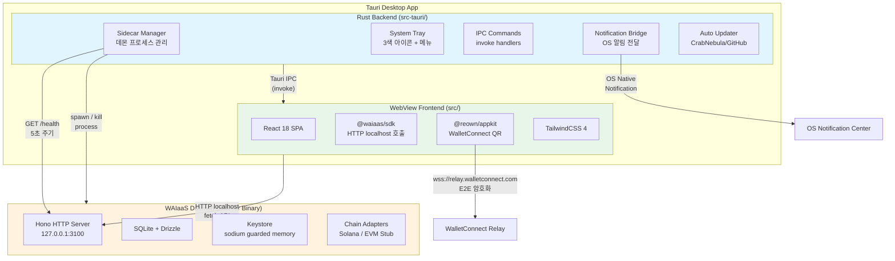
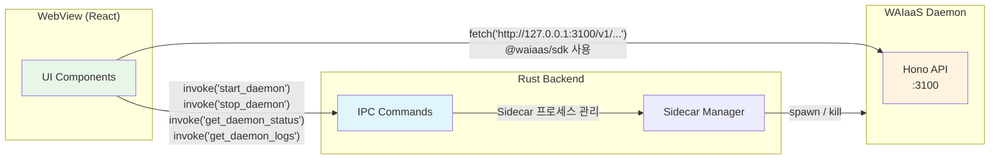
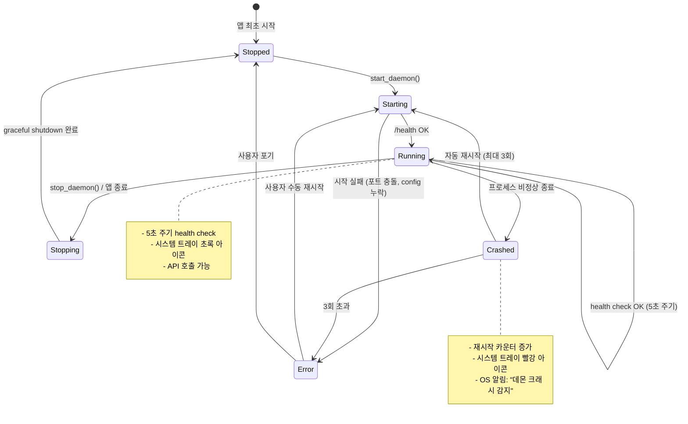
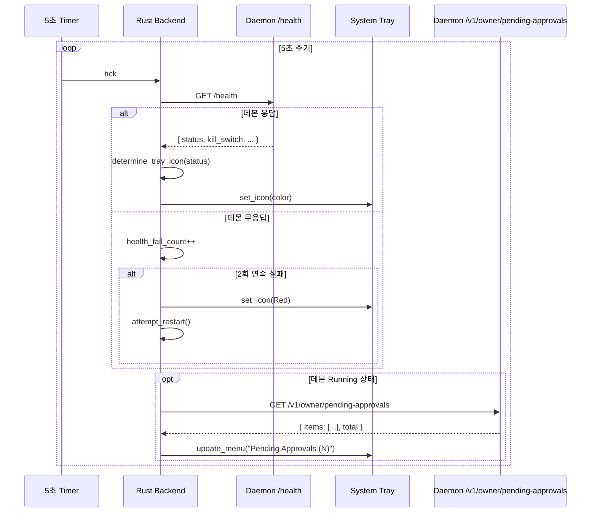
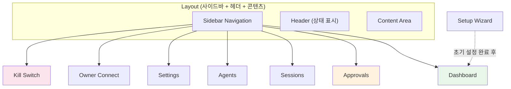
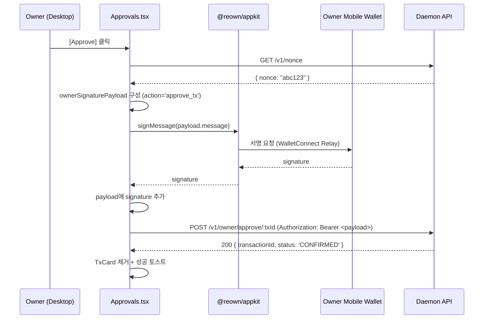
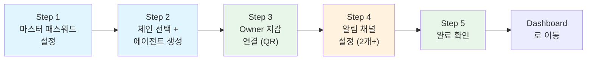
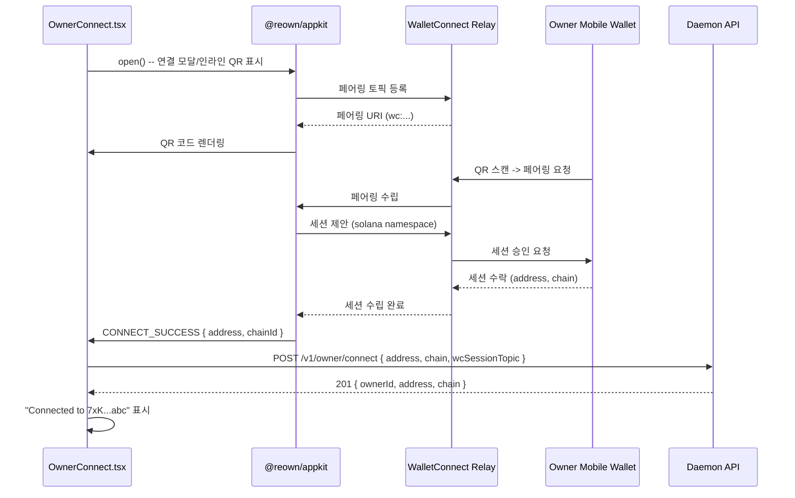
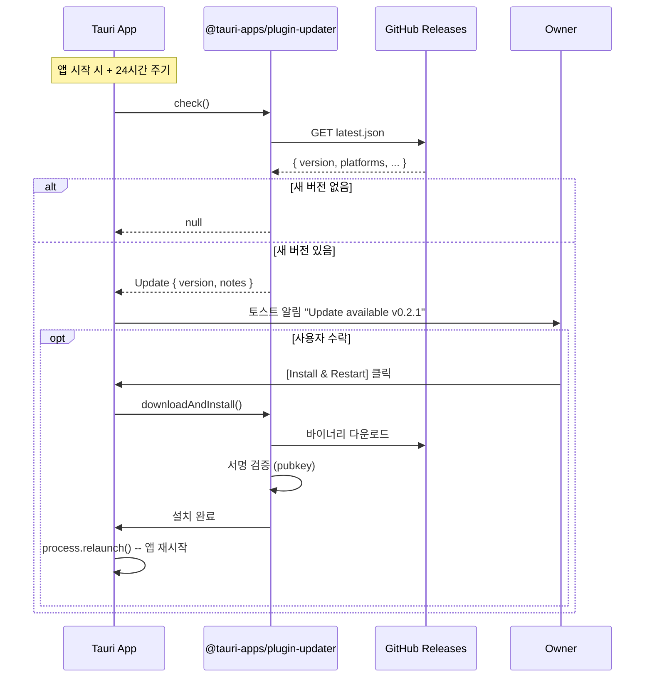

# Tauri 2 Desktop 앱 아키텍처 설계 (TAURI-DESK)

**문서 ID:** TAURI-DESK
**작성일:** 2026-02-05
**상태:** 완료
**참조:** API-SPEC (37-rest-api-complete-spec.md), CORE-05 (28-daemon-lifecycle-cli.md), OWNR-CONN (34-owner-wallet-connection.md), KILL-AUTO-EVM (36-killswitch-autostop-evm.md), CORE-01 (24-monorepo-data-directory.md), 09-RESEARCH.md Pattern 3

---

## 1. 문서 개요

### 1.1 목적

Tauri 2 기반 WAIaaS Desktop 앱의 전체 아키텍처를 설계한다. Owner가 WAIaaS 데몬을 시각적으로 관리하는 데스크톱 앱이다. 거래 승인/거부, 세션 관리, 시스템 모니터링을 GUI로 제공하여 CLI 의존도를 낮춘다.

### 1.2 요구사항 매핑

| 요구사항 | 설명 | 충족 섹션 |
|---------|------|-----------|
| **DESK-01** | Tauri 2 Desktop 앱 + 시스템 트레이 (3색 상태 아이콘) | 섹션 2, 3, 4, 5 |
| **DESK-02** | 대시보드 + 승인/거부 인터페이스 + 세션/에이전트 관리 UI | 섹션 7 (8개 화면) |
| **DESK-03** | macOS/Windows/Linux 크로스 플랫폼 빌드 | 섹션 11 |
| **DESK-04** | OS 네이티브 알림 + 자동 업데이트 | 섹션 9, 10 |

### 1.3 v0.1 -> v0.2 변경 요약

| 항목 | v0.1 (Cloud) | v0.2 (Self-Hosted) | 근거 |
|------|-------------|-------------------|------|
| 관리 UI | 웹 대시보드 (SaaS) | Tauri Desktop 앱 | Self-Hosted 로컬 데몬. 중앙 웹 서버 없음 |
| 지갑 연결 | MetaMask 브라우저 익스텐션 | WalletConnect v2 QR 코드 | Tauri WebView는 브라우저 익스텐션 미지원 |
| 데몬 관리 | Cloud 서비스 (항상 온라인) | Sidecar 프로세스 관리 | 데스크톱 앱이 데몬 라이프사이클 책임 |
| 알림 | Webhook + 이메일 | OS 네이티브 알림 + Telegram/Discord | 로컬 데몬에서 직접 알림 발송 |

### 1.4 설계 원칙

| 원칙 | 설명 |
|------|------|
| **Sidecar 방식** | Tauri Rust 쉘은 프로세스 관리만 담당, 비즈니스 로직은 Node.js 데몬에 위임 |
| **하이브리드 통신** | 데몬 라이프사이클은 Tauri IPC, API 호출은 HTTP localhost (SDK 재사용) |
| **최소 권한** | Tauri capabilities로 필요한 IPC 커맨드만 허용 |
| **크로스 플랫폼** | macOS/Windows/Linux 3종 OS 지원, 단일 코드베이스 |
| **오프라인 우선** | 데몬이 로컬에서 동작, 인터넷 연결은 체인 RPC + WalletConnect Relay에만 필요 |

---

## 2. 전체 아키텍처 다이어그램

### 2.1 아키텍처 개요



### 2.2 계층 역할 분리

| 계층 | 기술 | 역할 | 상태 유지 |
|------|------|------|-----------|
| **Rust Backend** | Tauri 2 + Rust | 프로세스 관리, 시스템 트레이, OS 알림, 자동 업데이트 | Sidecar PID, 트레이 상태 |
| **WebView Frontend** | React 18 + TailwindCSS 4 | UI 렌더링, 사용자 상호작용, API 호출 | React state (in-memory) |
| **Sidecar Daemon** | Node.js 22 + Hono 4 | 비즈니스 로직, DB, 키스토어, 체인 어댑터 | SQLite, 키스토어 파일 |

**핵심 설계 결정:** Tauri Rust 쉘은 데몬을 Rust로 재구현하지 않는다. 데몬은 Node.js 바이너리로 sidecar 번들링하며, Rust는 프로세스 관리 + OS 통합만 담당한다 (09-RESEARCH.md Anti-Pattern 참조).

---

## 3. 통신 아키텍처 -- 하이브리드 모델

### 3.1 두 가지 통신 경로

WAIaaS Desktop 앱은 **Tauri IPC**와 **HTTP localhost** 두 가지 통신 경로를 하이브리드로 사용한다.



### 3.2 Tauri IPC (Rust invoke) -- 데몬 라이프사이클 전용

Tauri IPC는 **데몬 프로세스 관리에만** 사용한다. WebView에서 `invoke()` 호출 시 Rust 함수가 실행된다.

| IPC 커맨드 | 용도 | 반환 타입 |
|------------|------|-----------|
| `start_daemon` | Sidecar 프로세스 시작 | `DaemonStatus` |
| `stop_daemon` | Sidecar 프로세스 중지 (graceful) | `()` |
| `restart_daemon` | 중지 후 재시작 | `DaemonStatus` |
| `get_daemon_status` | 프로세스 alive + /health 응답 조합 | `DaemonStatus` |
| `get_daemon_logs` | 최근 로그 라인 읽기 | `Vec<String>` |
| `send_notification` | OS 네이티브 알림 전송 | `()` |

**IPC 사용 이유:** HTTP localhost로는 데몬이 죽어있을 때 상태를 알 수 없다. Sidecar 프로세스의 생존 여부는 Rust에서 직접 확인해야 한다.

### 3.3 HTTP localhost -- API 호출 전용

API 호출은 WebView에서 **HTTP localhost:3100**을 직접 호출한다.

| 경로 | 인증 | 용도 | 호출 방식 |
|------|------|------|-----------|
| `/v1/owner/*` | ownerAuth (SIWS/SIWE) | 거래 승인, 세션 관리, 설정 | `@waiaas/sdk` WAIaaSOwnerClient |
| `/v1/admin/*` | masterAuth | Kill Switch, Shutdown | fetch 직접 호출 |
| `/health` | None | 데몬 건강 상태 | Rust Sidecar Manager에서 호출 |
| `/v1/nonce` | None | 서명용 nonce 발급 | `@waiaas/sdk` |

**HTTP 사용 이유:**
- `@waiaas/sdk`를 WebView에서 그대로 재사용 (SDK의 WAIaaSOwnerClient 인스턴스)
- API 인증, 요청/응답 스키마를 SDK가 처리 (중복 구현 방지)
- Tauri IPC를 거치면 Rust에서 HTTP 프록시를 구현해야 하는 불필요한 오버헤드 발생

### 3.4 CORS 설정

Tauri 2.x WebView는 `tauri://localhost` Origin을 사용한다. API-SPEC (37번 문서)에서 이미 CORS 허용 목록에 추가됨:

```typescript
cors({
  origin: [
    `http://localhost:${port}`,
    `http://127.0.0.1:${port}`,
    'tauri://localhost',  // Tauri 2.x WebView
  ],
  // ...
})
```

---

## 4. Sidecar 관리

### 4.1 Sidecar 바이너리

WAIaaS 데몬을 **단일 실행 바이너리**로 변환하여 Tauri에 번들링한다.

| 항목 | 값 | 비고 |
|------|-----|------|
| 변환 도구 | Node.js SEA (Single Executable Application) | Node.js 22 내장 기능, 별도 패키지 불필요 |
| 바이너리 이름 | `waiaas-daemon-{target_triple}` | `waiaas-daemon-aarch64-apple-darwin` 등 |
| 바이너리 위치 | Tauri `externalBin` 설정 | `src-tauri/binaries/` |
| 포함 패키지 | `@waiaas/daemon` + `@waiaas/core` + adapters | Turborepo 빌드 후 SEA 변환 |
| native addon | `sodium-native`, `better-sqlite3` | v0.3 구현 시 크로스 컴파일 검증 필요 |

**tauri.conf.json 설정:**

```json
{
  "bundle": {
    "externalBin": [
      "binaries/waiaas-daemon"
    ]
  }
}
```

Tauri는 빌드 시 `{externalBin}-{target_triple}` 패턴으로 바이너리를 찾는다. 따라서 각 타겟 플랫폼별 바이너리를 `binaries/` 디렉토리에 배치해야 한다:

```
src-tauri/binaries/
  waiaas-daemon-aarch64-apple-darwin       (macOS Apple Silicon)
  waiaas-daemon-x86_64-apple-darwin        (macOS Intel)
  waiaas-daemon-x86_64-pc-windows-msvc.exe (Windows)
  waiaas-daemon-x86_64-unknown-linux-gnu   (Linux)
```

### 4.2 Sidecar 라이프사이클



**라이프사이클 규칙:**

| 이벤트 | 동작 | 비고 |
|--------|------|------|
| 앱 시작 | 자동으로 sidecar 시작 (config `auto_start` 옵션) | 기본값: true |
| 앱 종료 | sidecar graceful shutdown | POST /v1/admin/shutdown -> 5초 대기 -> SIGTERM |
| sidecar 크래시 | 자동 재시작 (최대 3회, 간격 5초) | 3회 초과 시 Error 상태 + OS 알림 |
| 첫 실행 | `~/.waiaas/` 디렉토리 없으면 Setup Wizard 화면 이동 | waiaas init 미완료 감지 |
| health check | 5초 주기 GET /health | 2회 연속 실패 시 Crashed 판정 |
| 포트 충돌 | Error 상태 + 사용자에게 포트 변경 안내 | config.toml [daemon].port |

### 4.3 Sidecar Manager (Rust 구현)

```rust
// src-tauri/src/sidecar.rs

use tauri::api::process::{Command, CommandChild, CommandEvent};
use std::sync::Mutex;
use serde::{Deserialize, Serialize};

#[derive(Debug, Clone, Serialize, Deserialize)]
pub struct DaemonStatus {
    pub running: bool,
    pub pid: Option<u32>,
    pub port: u16,
    pub uptime_secs: Option<u64>,
    pub health: Option<HealthResponse>,
    pub restart_count: u32,
    pub state: DaemonState,
}

#[derive(Debug, Clone, Serialize, Deserialize)]
pub enum DaemonState {
    Stopped,
    Starting,
    Running,
    Stopping,
    Crashed,
    Error,
}

#[derive(Debug, Clone, Serialize, Deserialize)]
pub struct HealthResponse {
    pub status: String,      // "ok" | "degraded" | "error"
    pub version: String,
    pub uptime: u64,
    pub kill_switch: String, // "NORMAL" | "ACTIVATED" | "RECOVERING"
}

pub struct SidecarManager {
    child: Mutex<Option<CommandChild>>,
    status: Mutex<DaemonStatus>,
    restart_count: Mutex<u32>,
    started_at: Mutex<Option<std::time::Instant>>,
}

impl SidecarManager {
    const MAX_RESTART: u32 = 3;
    const HEALTH_INTERVAL_SECS: u64 = 5;
    const HEALTH_FAIL_THRESHOLD: u32 = 2;

    /// Sidecar 프로세스 시작
    pub async fn start(&self, app: &tauri::AppHandle) -> Result<DaemonStatus, String> {
        // 1. 이미 실행 중이면 현재 상태 반환
        // 2. externalBin "waiaas-daemon" sidecar spawn
        // 3. stdout/stderr 이벤트 리스너 등록
        // 4. /health 폴링으로 준비 완료 대기 (최대 30초)
        // 5. DaemonStatus 반환
        todo!()
    }

    /// Sidecar 프로세스 중지 (graceful)
    pub async fn stop(&self) -> Result<(), String> {
        // 1. POST /v1/admin/shutdown 전송 (마스터 패스워드)
        // 2. 5초 대기
        // 3. 프로세스 여전히 살아있으면 SIGTERM
        // 4. 2초 추가 대기 후 SIGKILL
        // 5. 상태 업데이트: Stopped
        todo!()
    }

    /// Health check (5초 주기 호출)
    pub async fn check_health(&self) -> DaemonStatus {
        // 1. GET http://127.0.0.1:{port}/health
        // 2. 성공: HealthResponse 파싱, 상태 Running
        // 3. 실패 카운터 증가
        // 4. 2회 연속 실패: Crashed 판정 -> 자동 재시작 시도
        todo!()
    }
}
```

### 4.4 Rust IPC 커맨드 정의

```rust
// src-tauri/src/commands.rs

use tauri::State;
use crate::sidecar::{SidecarManager, DaemonStatus};

#[tauri::command]
async fn start_daemon(
    manager: State<'_, SidecarManager>,
    app: tauri::AppHandle,
) -> Result<DaemonStatus, String> {
    manager.start(&app).await
}

#[tauri::command]
async fn stop_daemon(
    manager: State<'_, SidecarManager>,
) -> Result<(), String> {
    manager.stop().await
}

#[tauri::command]
async fn get_daemon_status(
    manager: State<'_, SidecarManager>,
) -> Result<DaemonStatus, String> {
    Ok(manager.check_health().await)
}

#[tauri::command]
async fn restart_daemon(
    manager: State<'_, SidecarManager>,
    app: tauri::AppHandle,
) -> Result<DaemonStatus, String> {
    manager.stop().await?;
    tokio::time::sleep(std::time::Duration::from_secs(2)).await;
    manager.start(&app).await
}

#[tauri::command]
async fn get_daemon_logs(
    manager: State<'_, SidecarManager>,
    lines: Option<u32>,
) -> Result<Vec<String>, String> {
    // ~/.waiaas/logs/daemon.log 에서 최근 N줄 읽기
    // 기본: 100줄
    let n = lines.unwrap_or(100);
    todo!()
}

#[tauri::command]
async fn send_notification(
    app: tauri::AppHandle,
    title: String,
    body: String,
) -> Result<(), String> {
    // @tauri-apps/plugin-notification 통해 OS 알림 전송
    todo!()
}
```

### 4.5 WebView에서 IPC 호출

```typescript
// packages/desktop/src/hooks/useDaemon.ts
import { invoke } from '@tauri-apps/api/core'

interface DaemonStatus {
  running: boolean
  pid: number | null
  port: number
  uptime_secs: number | null
  health: HealthResponse | null
  restart_count: number
  state: 'Stopped' | 'Starting' | 'Running' | 'Stopping' | 'Crashed' | 'Error'
}

interface HealthResponse {
  status: 'ok' | 'degraded' | 'error'
  version: string
  uptime: number
  kill_switch: 'NORMAL' | 'ACTIVATED' | 'RECOVERING'
}

export function useDaemon() {
  const startDaemon = () => invoke<DaemonStatus>('start_daemon')
  const stopDaemon = () => invoke<void>('stop_daemon')
  const restartDaemon = () => invoke<DaemonStatus>('restart_daemon')
  const getDaemonStatus = () => invoke<DaemonStatus>('get_daemon_status')
  const getDaemonLogs = (lines?: number) => invoke<string[]>('get_daemon_logs', { lines })

  return { startDaemon, stopDaemon, restartDaemon, getDaemonStatus, getDaemonLogs }
}
```

---

## 5. 시스템 트레이 (DESK-01)

### 5.1 아이콘 상태

시스템 트레이 아이콘은 3색으로 데몬 상태를 표현한다:

| 색상 | 상태 | 조건 | 아이콘 파일 |
|------|------|------|-------------|
| **초록** | NORMAL | 데몬 정상 운영, 키스토어 열림, Kill Switch = NORMAL | `tray-green.png` |
| **노랑** | WARNING | 알림 채널 부족 (<2) / 에이전트 일시 정지 / 데몬 degraded | `tray-yellow.png` |
| **빨강** | CRITICAL | Kill Switch ACTIVATED / 데몬 다운 / 3회 재시작 초과 | `tray-red.png` |

**아이콘 규격:**
- 형식: PNG (투명 배경)
- 크기: 22x22 (macOS), 16x16 (Windows), 24x24 (Linux)
- Tauri는 OS에 맞게 자동 리사이징하므로 32x32 기본 제공 + @2x 64x64 Retina 지원

### 5.2 상태 판별 로직

```rust
// src-tauri/src/tray.rs

fn determine_tray_icon(status: &DaemonStatus) -> TrayIcon {
    // 1. 데몬이 실행 중이 아님 -> RED
    if !status.running || status.state == DaemonState::Crashed || status.state == DaemonState::Error {
        return TrayIcon::Red;
    }

    // 2. Kill Switch 활성화 -> RED
    if let Some(health) = &status.health {
        if health.kill_switch == "ACTIVATED" || health.kill_switch == "RECOVERING" {
            return TrayIcon::Red;
        }

        // 3. 데몬 degraded -> YELLOW
        if health.status == "degraded" {
            return TrayIcon::Yellow;
        }
    }

    // 4. 재시작 횟수 > 0 -> YELLOW (불안정)
    if status.restart_count > 0 {
        return TrayIcon::Yellow;
    }

    // 5. 정상 -> GREEN
    TrayIcon::Green
}
```

### 5.3 트레이 메뉴

```
┌─────────────────────────────┐
│ WAIaaS v0.2.0               │  <- 비활성 타이틀 (클릭 불가)
├─────────────────────────────┤
│ Dashboard                   │  -> 메인 윈도우 열기/포커스
│ Pending Approvals (3)       │  -> 승인 화면으로 이동 (대기 건수 배지)
├─────────────────────────────┤
│ Start Daemon                │  -> start_daemon() IPC (데몬 중지 시)
│ Stop Daemon                 │  -> stop_daemon() IPC (데몬 실행 시)
│ Restart Daemon              │  -> restart_daemon() IPC
├─────────────────────────────┤
│ Emergency Kill Switch       │  -> 확인 다이얼로그 후 POST /v1/admin/kill-switch
├─────────────────────────────┤
│ Quit WAIaaS                 │  -> stop_daemon() + app.exit()
└─────────────────────────────┘
```

**메뉴 동적 업데이트:**

| 메뉴 항목 | 동적 요소 | 업데이트 주기 |
|-----------|-----------|---------------|
| `Pending Approvals (N)` | N = 대기 거래 건수 | 5초 폴링 (GET /v1/owner/pending-approvals -> count) |
| `Start/Stop Daemon` | 데몬 상태에 따라 토글 | DaemonStatus 변경 시 |
| `Emergency Kill Switch` | Kill Switch 활성 시 비활성화 (이미 발동됨) | DaemonStatus.health.kill_switch |

### 5.4 트레이 아이콘 업데이트 주기



### 5.5 Tauri Entry Point (main.rs)

```rust
// src-tauri/src/main.rs

mod commands;
mod sidecar;
mod tray;

fn main() {
    tauri::Builder::default()
        .plugin(tauri_plugin_shell::init())
        .plugin(tauri_plugin_notification::init())
        .plugin(tauri_plugin_updater::init())
        .plugin(tauri_plugin_process::init())
        .manage(sidecar::SidecarManager::new())
        .invoke_handler(tauri::generate_handler![
            commands::start_daemon,
            commands::stop_daemon,
            commands::restart_daemon,
            commands::get_daemon_status,
            commands::get_daemon_logs,
            commands::send_notification,
        ])
        .setup(|app| {
            // 1. 시스템 트레이 초기화
            tray::setup_tray(app)?;

            // 2. 자동 시작 (config에 따라)
            let app_handle = app.handle().clone();
            tauri::async_runtime::spawn(async move {
                let manager = app_handle.state::<sidecar::SidecarManager>();
                let _ = manager.start(&app_handle).await;
            });

            // 3. Health check 타이머 시작 (5초 주기)
            let app_handle = app.handle().clone();
            tauri::async_runtime::spawn(async move {
                let mut interval = tokio::time::interval(
                    std::time::Duration::from_secs(5)
                );
                loop {
                    interval.tick().await;
                    let manager = app_handle.state::<sidecar::SidecarManager>();
                    let status = manager.check_health().await;
                    tray::update_tray(&app_handle, &status);
                }
            });

            Ok(())
        })
        .run(tauri::generate_context!())
        .expect("error while running tauri application");
}
```

---

## 6. 프로젝트 구조

### 6.1 packages/desktop 디렉토리 트리

```
packages/desktop/
  src-tauri/
    src/
      main.rs              # Tauri entry point (setup, plugins, invoke_handler)
      sidecar.rs           # SidecarManager 구조체 (start/stop/health/restart)
      tray.rs              # 시스템 트레이 (3색 아이콘, 메뉴 동적 업데이트)
      commands.rs          # IPC commands (#[tauri::command] 함수들)
    binaries/              # Sidecar 바이너리 (빌드 시 배치)
      waiaas-daemon-aarch64-apple-darwin
      waiaas-daemon-x86_64-apple-darwin
      waiaas-daemon-x86_64-pc-windows-msvc.exe
      waiaas-daemon-x86_64-unknown-linux-gnu
    icons/
      tray-green.png       # 정상 상태 아이콘
      tray-green@2x.png    # Retina 지원
      tray-yellow.png      # 경고 상태 아이콘
      tray-yellow@2x.png
      tray-red.png         # 위험 상태 아이콘
      tray-red@2x.png
      icon.icns            # macOS 앱 아이콘
      icon.ico             # Windows 앱 아이콘
      icon.png             # Linux 앱 아이콘
    tauri.conf.json        # Tauri 앱 설정 (externalBin, plugins, CSP)
    Cargo.toml             # Rust 의존성
    capabilities/
      default.json         # Tauri capability 정의 (허용 IPC 커맨드)
  src/
    App.tsx                # React Router (라우트 정의)
    main.tsx               # React entry point (createRoot)
    pages/
      Dashboard.tsx        # 메인 대시보드 (잔액, 거래, 시스템 상태)
      Approvals.tsx        # 대기 거래 승인/거부
      Sessions.tsx         # 세션 목록 + 관리
      Agents.tsx           # 에이전트 목록 + 상세
      Settings.tsx         # 알림, 정책, 시스템 설정
      Setup.tsx            # 초기 설정 위자드 (5 steps)
      OwnerConnect.tsx     # WalletConnect QR 연결
      KillSwitch.tsx       # Kill Switch 발동/복구
    components/
      Layout.tsx           # 사이드바 + 헤더 + 콘텐츠 영역
      Sidebar.tsx          # 네비게이션 사이드바
      TxCard.tsx           # 거래 카드 컴포넌트
      SessionCard.tsx      # 세션 카드 컴포넌트
      AgentCard.tsx        # 에이전트 카드 컴포넌트
      StatusBadge.tsx      # 상태 배지 (NORMAL/WARNING/CRITICAL)
      ConfirmDialog.tsx    # 확인 다이얼로그 (Kill Switch 등)
      EmptyState.tsx       # 빈 상태 메시지 컴포넌트
    hooks/
      useDaemon.ts         # IPC 커맨드 래퍼 (start/stop/status/logs)
      useOwnerApi.ts       # Owner API 호출 래퍼 (@waiaas/sdk)
      usePolling.ts        # 주기적 데이터 갱신 (5초 간격 fetch)
      useWalletConnect.ts  # @reown/appkit 상태 관리
    lib/
      api.ts               # @waiaas/sdk WAIaaSOwnerClient 인스턴스 생성
      wallet-connect.ts    # @reown/appkit 초기화 + 이벤트 처리
      notifications.ts     # OS 알림 트리거 로직
    styles/
      globals.css          # TailwindCSS global styles
  index.html               # WebView entry HTML
  vite.config.ts           # Vite 빌드 설정
  tailwind.config.ts       # TailwindCSS 설정
  tsconfig.json            # TypeScript 설정
  package.json             # 프론트엔드 의존성
```

### 6.2 package.json 의존성

```json
{
  "name": "@waiaas/desktop",
  "private": true,
  "version": "0.2.0",
  "type": "module",
  "scripts": {
    "dev": "vite",
    "build": "tsc && vite build",
    "tauri": "tauri"
  },
  "dependencies": {
    "@tauri-apps/api": "^2.0.0",
    "@tauri-apps/plugin-shell": "^2.0.0",
    "@tauri-apps/plugin-notification": "^2.0.0",
    "@tauri-apps/plugin-updater": "^2.0.0",
    "@tauri-apps/plugin-process": "^2.0.0",
    "@waiaas/sdk": "workspace:*",
    "@reown/appkit": "latest",
    "@reown/appkit-adapter-solana": "latest",
    "react": "^18.3.0",
    "react-dom": "^18.3.0",
    "react-router-dom": "^7.0.0",
    "tailwindcss": "^4.0.0"
  },
  "devDependencies": {
    "@tauri-apps/cli": "^2.0.0",
    "@types/react": "^18.3.0",
    "@types/react-dom": "^18.3.0",
    "@vitejs/plugin-react": "^4.0.0",
    "typescript": "^5.7.0",
    "vite": "^6.0.0"
  }
}
```

### 6.3 Cargo.toml (Rust 의존성)

```toml
[package]
name = "waiaas-desktop"
version = "0.2.0"
edition = "2021"

[dependencies]
tauri = { version = "2", features = ["tray-icon"] }
tauri-plugin-shell = "2"
tauri-plugin-notification = "2"
tauri-plugin-updater = "2"
tauri-plugin-process = "2"
serde = { version = "1", features = ["derive"] }
serde_json = "1"
tokio = { version = "1", features = ["full"] }
reqwest = { version = "0.12", features = ["json"] }

[build-dependencies]
tauri-build = { version = "2", features = [] }
```

---

## 7. UI 화면별 플로우 (DESK-02)

### 7.1 화면 구성 개요



| # | 화면 | 경로 | 데이터 소스 | 갱신 주기 |
|---|------|------|-------------|-----------|
| 1 | Dashboard | `/` | `GET /v1/owner/dashboard` | 5초 폴링 |
| 2 | Approvals | `/approvals` | `GET /v1/owner/pending-approvals` | 5초 폴링 |
| 3 | Sessions | `/sessions` | `GET /v1/owner/sessions` | 화면 포커스 시 |
| 4 | Agents | `/agents` | `GET /v1/owner/agents` | 화면 포커스 시 |
| 5 | Settings | `/settings` | `GET /v1/owner/settings` | 진입 시 1회 |
| 6 | Setup Wizard | `/setup` | 없음 (로컬 상태) | - |
| 7 | Owner Connect | `/owner-connect` | WalletConnect 이벤트 | 실시간 |
| 8 | Kill Switch | `/kill-switch` | `GET /v1/admin/status` | 5초 폴링 |

### 7.2 화면 1 -- Dashboard (메인)

**레이아웃:**

```
┌──────────┬──────────────────────────────────────────────────┐
│          │ Header: WAIaaS Dashboard     [NORMAL] ● 초록     │
│          ├──────────┬──────────┬──────────────────────────────┤
│ Sidebar  │ SOL 잔액  │ 오늘 거래 │ 활성 세션                    │
│          │ 12.5 SOL │ 8건/2.3  │ 3개                          │
│ Dashboard│          │ SOL      │                              │
│ Approvals├──────────┴──────────┴──────────────────────────────┤
│ Sessions │                                                    │
│ Agents   │ 최근 거래 (10건)                                    │
│ Settings │ ┌──────────────────────────────────────────────┐  │
│          │ │ TxCard: 0.5 SOL -> 7xK...abc  CONFIRMED     │  │
│ Owner    │ │ TxCard: 1.0 SOL -> 3mN...def  QUEUED        │  │
│ Connect  │ │ ...                                          │  │
│          │ └──────────────────────────────────────────────┘  │
│ Kill     │                                                    │
│ Switch   │ 시스템 상태                                         │
│          │ - 데몬 uptime: 2h 34m                              │
│          │ - Solana: connected (devnet)                       │
│          │ - Kill Switch: NORMAL                              │
└──────────┴──────────────────────────────────────────────────┘
```

**컴포넌트:**

| 컴포넌트 | 데이터 소스 | 렌더링 |
|----------|-------------|--------|
| SOL 잔액 카드 | `dashboard.balance` | 실시간 SOL 잔액 (lamports -> SOL 변환) |
| 거래 통계 카드 | `dashboard.todayTransactions` | 오늘 거래 건수 + 총 금액 |
| 활성 세션 카드 | `dashboard.activeSessions` | 현재 활성 세션 수 |
| 최근 거래 목록 | `dashboard.recentTransactions` | TxCard 컴포넌트 x 10, 상태 배지 |
| 시스템 상태 | `dashboard.system` | 데몬 uptime, 어댑터 상태, Kill Switch |

**데이터 갱신:**
- `usePolling` 훅으로 5초 주기 `GET /v1/owner/dashboard` 호출
- 화면 포커스 복귀 시 즉시 갱신 (`document.visibilitychange` 이벤트)

### 7.3 화면 2 -- Pending Approvals (대기 거래 승인/거부)

**레이아웃:**

```
┌──────────┬──────────────────────────────────────────────────┐
│          │ Pending Approvals (3건 대기)                      │
│ Sidebar  ├──────────────────────────────────────────────────┤
│          │ ┌────────────────────────────────────────────┐   │
│          │ │ TxCard: 15 SOL -> 7xK...abc                │   │
│          │ │ Agent: trading-bot | 남은 시간: 45:23      │   │
│          │ │                                             │   │
│          │ │ [Approve ✓]           [Reject ✗]           │   │
│          │ └────────────────────────────────────────────┘   │
│          │ ┌────────────────────────────────────────────┐   │
│          │ │ TxCard: 50 SOL -> 3mN...def                │   │
│          │ │ Agent: arb-agent | 남은 시간: 12:07        │   │
│          │ │                                             │   │
│          │ │ [Approve ✓]           [Reject ✗]           │   │
│          │ └────────────────────────────────────────────┘   │
│          │                                                   │
│          │ (빈 상태: "No pending approvals" 메시지)          │
└──────────┴──────────────────────────────────────────────────┘
```

**사용자 동작:**

| 동작 | API 호출 | 인증 | 흐름 |
|------|---------|------|------|
| Approve 클릭 | `POST /v1/owner/approve/:txId` | ownerAuth | @reown/appkit.signMessage() -> Owner 서명 -> API 호출 |
| Reject 클릭 | `POST /v1/owner/reject/:txId` | ownerAuth | 사유 입력 모달 (선택) -> Owner 서명 -> API 호출 |

**Approve 시퀀스:**



**갱신:** 5초 폴링 `GET /v1/owner/pending-approvals`

### 7.4 화면 3 -- Sessions

**레이아웃:**

```
┌──────────┬──────────────────────────────────────────────────┐
│          │ Sessions (3 active)            [Create Session]   │
│ Sidebar  ├──────────────────────────────────────────────────┤
│          │ ┌────────────────────────────────────────────┐   │
│          │ │ SessionCard: trading-bot                    │   │
│          │ │ Expires: 2026-02-06 10:00 (23h left)      │   │
│          │ │ Constraints: max 1 SOL, devnet only       │   │
│          │ │                               [Revoke]     │   │
│          │ └────────────────────────────────────────────┘   │
│          │ ┌────────────────────────────────────────────┐   │
│          │ │ SessionCard: arb-agent                      │   │
│          │ │ Expires: 2026-02-05 18:00 (5h left)       │   │
│          │ │ Constraints: max 10 SOL, whitelist 3 addr │   │
│          │ │                               [Revoke]     │   │
│          │ └────────────────────────────────────────────┘   │
└──────────┴──────────────────────────────────────────────────┘
```

**사용자 동작:**

| 동작 | API 호출 | 설명 |
|------|---------|------|
| Create Session | `POST /v1/sessions` (ownerAuth) | 모달: 에이전트 선택, 만료 시간, 제약 조건 설정 |
| Revoke | `DELETE /v1/owner/sessions/:id` (ownerAuth) | 확인 다이얼로그 후 즉시 폐기 |

**Create Session 모달:**
- Step 1: 에이전트 드롭다운 선택 (GET /v1/owner/agents에서 목록)
- Step 2: 만료 시간 설정 (5분 ~ 7일, 기본 24시간)
- Step 3: 제약 조건 (최대 금액, 허용 체인, 허용 주소 목록)
- Step 4: Owner 서명 (appkit.signMessage) -> POST /v1/sessions

### 7.5 화면 4 -- Agents

**레이아웃:**

```
┌──────────┬──────────────────────────────────────────────────┐
│          │ Agents (2 agents)                                 │
│ Sidebar  ├──────────────────────────────────────────────────┤
│          │ ┌────────────────────────────────────────────┐   │
│          │ │ AgentCard: trading-bot          [ACTIVE ●]  │   │
│          │ │ Chain: solana (devnet) | Sessions: 1        │   │
│          │ │ Transactions: 45 total | Balance: 12.5 SOL  │   │
│          │ │                                              │   │
│          │ │ 클릭하여 상세 보기 →                           │   │
│          │ └────────────────────────────────────────────┘   │
│          │ ┌────────────────────────────────────────────┐   │
│          │ │ AgentCard: arb-agent            [PAUSED ●]  │   │
│          │ │ Chain: solana (mainnet) | Sessions: 0       │   │
│          │ │ Transactions: 12 total | Balance: 3.2 SOL   │   │
│          │ └────────────────────────────────────────────┘   │
└──────────┴──────────────────────────────────────────────────┘
```

**에이전트 상세 화면 (클릭 시):**

| 섹션 | 데이터 소스 | 내용 |
|------|-------------|------|
| 에이전트 정보 | `GET /v1/owner/agents/:id` | 이름, 상태, 체인, 지갑 주소, 생성일 |
| 최근 거래 | 에이전트 상세 응답 내 | 최근 10건 거래 목록 (TxCard) |
| 활성 세션 | 에이전트 상세 응답 내 | 현재 활성 세션 목록 (SessionCard) |
| 적용 정책 | 에이전트 상세 응답 내 | SPENDING_LIMIT, WHITELIST 등 정책 요약 |

### 7.6 화면 5 -- Settings

**레이아웃:**

```
┌──────────┬──────────────────────────────────────────────────┐
│          │ Settings                                 [Save]   │
│ Sidebar  ├──────────────────────────────────────────────────┤
│          │                                                   │
│          │ ── Notification Channels ──                       │
│          │ Telegram: @my_bot (active)         [Test] [Edit] │
│          │ Discord: #alerts (active)          [Test] [Edit] │
│          │ ntfy.sh: (not configured)          [Add]          │
│          │                                                   │
│          │ ── Auto-Stop Rules ──                             │
│          │ CONSECUTIVE_FAILURES: 3             [Edit]        │
│          │ DAILY_LIMIT: 80%/100%              [Edit]        │
│          │ HOURLY_RATE: 50/h                  [Edit]        │
│          │                                                   │
│          │ ── Policy Management ──                           │
│          │ SPENDING_LIMIT (global): 10 SOL/day [Edit]       │
│          │ WHITELIST (global): 5 addresses     [Edit]       │
│          │                                                   │
│          │ ── System Info ──                                 │
│          │ Version: v0.2.0                                   │
│          │ Daemon: running (uptime 2h 34m)                   │
│          │ Data directory: ~/.waiaas/                         │
│          │ Database size: 4.2 MB                             │
└──────────┴──────────────────────────────────────────────────┘
```

**사용자 동작:**

| 섹션 | 동작 | API 호출 |
|------|------|---------|
| Notification | Add/Edit/Delete 채널 | `PUT /v1/owner/settings` (ownerAuth) |
| Notification | Test 전송 | `PUT /v1/owner/settings` (test_channel action) |
| Auto-Stop | 규칙 편집 | `PUT /v1/owner/settings` (ownerAuth) |
| Policy | 정책 편집 | `PUT /v1/owner/policies/:id` / `POST /v1/owner/policies` (ownerAuth) |

### 7.7 화면 6 -- Setup Wizard (초기 설정)

첫 실행 시 (`~/.waiaas/` 미존재) 자동으로 이 화면으로 이동한다.



**Step별 상세:**

| Step | 화면 | 입력 | 검증 |
|------|------|------|------|
| 1 | 마스터 패스워드 | 패스워드 2회 입력 (확인) | 8자 이상, 숫자+영문 포함 |
| 2 | 체인 + 에이전트 | 체인 드롭다운 (Solana), 에이전트 이름 | 이름 비어있지 않음 |
| 3 | Owner 지갑 연결 | WalletConnect QR 표시 | 연결 성공 확인 (address 표시) |
| 4 | 알림 채널 | Telegram bot token, Discord webhook URL 등 | 최소 2개 채널 구성 + 테스트 전송 성공 |
| 5 | 완료 확인 | 설정 요약 표시 | [Start WAIaaS] 버튼 |

**백엔드 연동:**
- Step 1-2: `waiaas init` CLI 커맨드를 Sidecar Manager가 실행 (또는 동등 API)
- Step 3: Sidecar 시작 후 POST /v1/owner/connect
- Step 4: PUT /v1/owner/settings (알림 채널 설정)
- Step 5: 대시보드로 react-router navigate

### 7.8 화면 7 -- Owner Connect

**레이아웃:**

```
┌──────────┬──────────────────────────────────────────────────┐
│          │ Owner Wallet Connection                           │
│ Sidebar  ├──────────────────────────────────────────────────┤
│          │                                                   │
│          │ ┌──────────────────┐                              │
│          │ │                  │  Scan this QR code with      │
│          │ │   ████████████   │  your mobile wallet          │
│          │ │   █ QR CODE  █   │                              │
│          │ │   ████████████   │  Supported:                  │
│          │ │                  │  - Phantom (Solana)           │
│          │ └──────────────────┘  - MetaMask (EVM, v0.3)     │
│          │                                                   │
│          │ Status: Waiting for connection...                 │
│          │                                                   │
│          │ ── 또는 ──                                         │
│          │                                                   │
│          │ Connected: 7xK...abc (Solana devnet)              │
│          │ Since: 2026-02-05 10:30                           │
│          │                           [Disconnect]            │
└──────────┴──────────────────────────────────────────────────┘
```

**WalletConnect QR 연결 시퀀스:**



### 7.9 화면 8 -- Kill Switch

**레이아웃 (NORMAL 상태):**

```
┌──────────┬──────────────────────────────────────────────────┐
│          │ Kill Switch                                       │
│ Sidebar  ├──────────────────────────────────────────────────┤
│          │                                                   │
│          │ Current Status: [NORMAL ● 초록]                   │
│          │                                                   │
│          │ Kill Switch는 모든 에이전트 활동을 즉시 중단하고   │
│          │ 키스토어를 잠그는 비상 정지 장치입니다.            │
│          │                                                   │
│          │ ┌──────────────────────────────────────────────┐  │
│          │ │         [Activate Kill Switch]               │  │
│          │ │         빨간 버튼 (확인 다이얼로그)           │  │
│          │ └──────────────────────────────────────────────┘  │
└──────────┴──────────────────────────────────────────────────┘
```

**레이아웃 (ACTIVATED 상태):**

```
┌──────────┬──────────────────────────────────────────────────┐
│          │ Kill Switch                                       │
│ Sidebar  ├──────────────────────────────────────────────────┤
│          │                                                   │
│          │ Current Status: [ACTIVATED ● 빨강]                │
│          │ Activated at: 2026-02-05 14:30:22                │
│          │ Reason: "Suspicious transactions detected"        │
│          │                                                   │
│          │ ── Impact Summary ──                              │
│          │ Sessions revoked: 5                               │
│          │ Transactions cancelled: 2                         │
│          │ Agents suspended: 3                               │
│          │ Keystore: LOCKED                                  │
│          │                                                   │
│          │ ── Recovery ──                                     │
│          │ 복구하려면 이중 인증이 필요합니다:                  │
│          │ 1. 마스터 패스워드 입력                             │
│          │ 2. Owner 지갑 서명                                 │
│          │                                                   │
│          │ Master Password: [________]                       │
│          │                                                   │
│          │         [Recover System]                           │
└──────────┴──────────────────────────────────────────────────┘
```

**Kill Switch 동작:**

| 상태 | 동작 | API 호출 | 인증 |
|------|------|---------|------|
| NORMAL -> ACTIVATED | [Activate] 클릭 -> 확인 다이얼로그 -> 사유 입력 | `POST /v1/admin/kill-switch` | masterAuth (마스터 패스워드) |
| ACTIVATED -> RECOVERING -> NORMAL | [Recover] 클릭 -> 패스워드 + Owner 서명 | `POST /v1/owner/recover` | ownerAuth + masterAuth (이중 인증) |

**Kill Switch 발동 확인 다이얼로그:**

```
┌─────────────────────────────────────────────────┐
│ ⚠ Emergency Kill Switch                         │
│                                                  │
│ 이 작업은 다음을 수행합니다:                      │
│ - 모든 활성 세션 즉시 폐기                        │
│ - 모든 대기/진행 중 거래 취소                     │
│ - 모든 에이전트 일시 정지                          │
│ - 키스토어 잠금                                    │
│                                                  │
│ 복구하려면 Owner 지갑 서명 + 마스터 패스워드가     │
│ 필요합니다.                                       │
│                                                  │
│ Reason: [________________]                        │
│ Master Password: [________________]               │
│                                                  │
│         [Cancel]         [ACTIVATE]               │
└─────────────────────────────────────────────────┘
```

---

## 8. WalletConnect QR 연결 플로우 (Tauri WebView)

### 8.1 @reown/appkit 초기화

Tauri WebView 내에서 @reown/appkit을 초기화한다. OWNR-CONN (34번 문서) 섹션 3.2의 코드 패턴을 Desktop 앱에 맞게 적용한다.

```typescript
// packages/desktop/src/lib/wallet-connect.ts
import { createAppKit } from '@reown/appkit'
import { SolanaAdapter } from '@reown/appkit-adapter-solana'
import { solana, solanaDevnet } from '@reown/appkit/networks'

let appKitInstance: ReturnType<typeof createAppKit> | null = null

export async function initializeWalletConnect(projectId: string) {
  if (appKitInstance) return appKitInstance

  const solanaAdapter = new SolanaAdapter()

  appKitInstance = createAppKit({
    adapters: [solanaAdapter],
    projectId,
    networks: [solana, solanaDevnet],
    metadata: {
      name: 'WAIaaS Desktop',
      description: 'Self-Hosted Wallet-as-a-Service for AI Agents',
      url: 'http://127.0.0.1:3100',
      icons: ['https://waiaas.dev/icon.png'],
    },
    features: {
      email: false,      // 소셜 로그인 비활성
      socials: false,    // 소셜 로그인 비활성
      onramp: false,     // 온램프 비활성
    },
  })

  return appKitInstance
}

export function getAppKit() {
  if (!appKitInstance) throw new Error('WalletConnect not initialized')
  return appKitInstance
}
```

### 8.2 projectId 로딩

WalletConnect projectId는 config.toml에서 읽는다 (하드코딩 금지). Desktop 앱은 데몬의 설정을 API로 조회한다.

```typescript
// packages/desktop/src/hooks/useWalletConnect.ts
import { useState, useEffect } from 'react'
import { initializeWalletConnect, getAppKit } from '../lib/wallet-connect'

export function useWalletConnect() {
  const [connected, setConnected] = useState(false)
  const [address, setAddress] = useState<string | null>(null)
  const [loading, setLoading] = useState(true)

  useEffect(() => {
    async function init() {
      // 데몬 설정에서 projectId 조회
      const res = await fetch('http://127.0.0.1:3100/v1/owner/settings', {
        headers: { 'Authorization': `Bearer ${ownerPayload}` },
      })
      const settings = await res.json()
      const projectId = settings.walletconnect?.project_id

      if (!projectId) {
        setLoading(false)
        return // projectId 미설정 -> QR 표시 불가
      }

      const appKit = await initializeWalletConnect(projectId)

      // 연결 이벤트 구독
      appKit.subscribeEvents((event) => {
        if (event.data.event === 'CONNECT_SUCCESS') {
          const { address: addr, chainId } = event.data.properties
          setConnected(true)
          setAddress(addr)
          // 데몬에 Owner 등록
          registerOwner(addr, chainId)
        }
        if (event.data.event === 'DISCONNECT_SUCCESS') {
          setConnected(false)
          setAddress(null)
        }
      })

      setLoading(false)
    }
    init()
  }, [])

  const openModal = () => getAppKit().open()
  const disconnect = () => getAppKit().disconnect()
  const signMessage = (msg: string) => getAppKit().signMessage(msg)

  return { connected, address, loading, openModal, disconnect, signMessage }
}
```

### 8.3 Tauri WebView 제약사항

| 제약 | 설명 | 대안 |
|------|------|------|
| Chrome Extension API 미지원 | `window.solana` / `window.ethereum` 사용 불가 | WalletConnect v2 QR만 가능 |
| Service Worker 제한 | 일부 PWA 기능 미지원 | 앱 자체 로직으로 처리 |
| WebHID 미지원 | 하드웨어 지갑 USB 직접 연결 불가 | 하드웨어 지갑도 WalletConnect QR로 연결 |

### 8.4 서명 요청 패턴

Owner API 호출 시 매번 서명이 필요하다 (per-request signature, OWNR-CONN 결정). Desktop 앱은 @reown/appkit.signMessage()를 통해 서명을 요청한다.

```typescript
// packages/desktop/src/hooks/useOwnerApi.ts
import { useWalletConnect } from './useWalletConnect'

export function useOwnerApi() {
  const { signMessage, address } = useWalletConnect()

  async function ownerRequest(
    method: string,
    path: string,
    action: string,
    body?: unknown,
  ) {
    // 1. nonce 발급
    const nonceRes = await fetch('http://127.0.0.1:3100/v1/nonce')
    const { nonce } = await nonceRes.json()

    // 2. 서명 메시지 구성
    const timestamp = new Date().toISOString()
    const message = `WAIaaS Owner Action: ${action}\nNonce: ${nonce}\nTimestamp: ${timestamp}`

    // 3. Owner 지갑 서명 (모바일 지갑에 서명 요청)
    const signature = await signMessage(message)

    // 4. ownerSignaturePayload 구성
    const payload = btoa(JSON.stringify({
      chain: 'solana',
      address,
      action,
      nonce,
      timestamp,
      message,
      signature,
    }))

    // 5. API 호출
    const res = await fetch(`http://127.0.0.1:3100${path}`, {
      method,
      headers: {
        'Authorization': `Bearer ${payload}`,
        'Content-Type': 'application/json',
      },
      body: body ? JSON.stringify(body) : undefined,
    })

    return res.json()
  }

  return { ownerRequest }
}
```

---

## 9. OS 네이티브 알림 (DESK-04)

### 9.1 Tauri Notification 플러그인

`@tauri-apps/plugin-notification`을 사용하여 OS 네이티브 알림을 전송한다.

```typescript
// packages/desktop/src/lib/notifications.ts
import {
  isPermissionGranted,
  requestPermission,
  sendNotification,
} from '@tauri-apps/plugin-notification'

export async function ensureNotificationPermission(): Promise<boolean> {
  let granted = await isPermissionGranted()
  if (!granted) {
    const permission = await requestPermission()
    granted = permission === 'granted'
  }
  return granted
}

export async function notify(title: string, body: string): Promise<void> {
  const granted = await ensureNotificationPermission()
  if (!granted) return

  sendNotification({ title, body })
}
```

### 9.2 알림 트리거 조건

WebView에서 5초 주기 상태 확인 후 변경 감지 시 Rust IPC를 통해 OS 알림을 전송한다.

| # | 트리거 | 조건 | 알림 제목 | 알림 본문 |
|---|--------|------|-----------|-----------|
| 1 | 새 APPROVAL 대기 거래 | pending count 증가 | "New Approval Request" | "{amount} SOL to {address} from {agent}" |
| 2 | Kill Switch 발동 | kill_switch status 변경 | "Kill Switch Activated" | "All agents suspended. Reason: {reason}" |
| 3 | Kill Switch 복구 | kill_switch NORMAL 복귀 | "System Recovered" | "Kill Switch deactivated. Normal operation resumed." |
| 4 | 에이전트 자동 정지 | agent status -> SUSPENDED | "Agent Stopped" | "{agent} suspended: {rule} triggered" |
| 5 | 세션 만료 임박 | session expires in < 5분 | "Session Expiring" | "{agent} session expires in {minutes}m" |
| 6 | 데몬 크래시 | daemon state -> Crashed | "Daemon Crashed" | "WAIaaS daemon crashed. Auto-restart attempt {n}/3" |

### 9.3 변경 감지 로직

```typescript
// packages/desktop/src/lib/notifications.ts

interface AppState {
  pendingCount: number
  killSwitchStatus: string
  agentStatuses: Record<string, string>
  sessionExpiries: Record<string, string>
}

let previousState: AppState | null = null

export function detectChanges(current: AppState): void {
  if (!previousState) {
    previousState = current
    return
  }

  // 1. 새 APPROVAL 대기
  if (current.pendingCount > previousState.pendingCount) {
    notify('New Approval Request',
      `${current.pendingCount - previousState.pendingCount} new transaction(s) pending approval`)
  }

  // 2. Kill Switch 변경
  if (current.killSwitchStatus !== previousState.killSwitchStatus) {
    if (current.killSwitchStatus === 'ACTIVATED') {
      notify('Kill Switch Activated', 'All agents suspended. Check Desktop app.')
    } else if (current.killSwitchStatus === 'NORMAL' && previousState.killSwitchStatus !== 'NORMAL') {
      notify('System Recovered', 'Normal operation resumed.')
    }
  }

  // 3. 에이전트 상태 변경
  for (const [agentId, status] of Object.entries(current.agentStatuses)) {
    if (previousState.agentStatuses[agentId] !== 'SUSPENDED' && status === 'SUSPENDED') {
      notify('Agent Stopped', `Agent ${agentId} has been suspended.`)
    }
  }

  previousState = current
}
```

### 9.4 알림 클릭 동작

| 알림 종류 | 클릭 시 이동 화면 | 구현 방식 |
|-----------|-------------------|-----------|
| Approval Request | `/approvals` | Tauri 윈도우 포커스 + react-router navigate |
| Kill Switch | `/kill-switch` | Tauri 윈도우 포커스 + react-router navigate |
| Agent Stopped | `/agents` | Tauri 윈도우 포커스 + react-router navigate |
| Session Expiring | `/sessions` | Tauri 윈도우 포커스 + react-router navigate |
| Daemon Crashed | Dashboard (`/`) | Tauri 윈도우 포커스 |

**참고:** Tauri 2.x의 notification 플러그인은 클릭 이벤트를 지원한다. Rust 측에서 알림 클릭 이벤트를 수신하여 WebView에 이벤트를 전달하고, React Router가 해당 페이지로 이동한다.

---

## 10. 자동 업데이트 (DESK-04)

### 10.1 Tauri Updater 플러그인

`@tauri-apps/plugin-updater`를 사용하여 앱 + sidecar 바이너리를 함께 업데이트한다.

### 10.2 업데이트 서버

| 옵션 | 설명 | 추천 |
|------|------|------|
| **GitHub Releases** | GitHub API 기반 업데이트 엔드포인트 | v0.2 초기 배포 |
| **CrabNebula Cloud** | Tauri 전용 업데이트 서비스 (delta update 지원) | v0.3 이후 |

**GitHub Releases 구성:**

Tauri updater는 GitHub Releases에서 `latest.json` 형식의 엔드포인트를 사용한다:

```json
{
  "version": "0.2.1",
  "notes": "Bug fixes and performance improvements",
  "pub_date": "2026-02-10T12:00:00Z",
  "platforms": {
    "darwin-aarch64": {
      "signature": "...",
      "url": "https://github.com/user/waiaas/releases/download/v0.2.1/WAIaaS_0.2.1_aarch64.app.tar.gz"
    },
    "darwin-x86_64": {
      "signature": "...",
      "url": "https://github.com/user/waiaas/releases/download/v0.2.1/WAIaaS_0.2.1_x64.app.tar.gz"
    },
    "windows-x86_64": {
      "signature": "...",
      "url": "https://github.com/user/waiaas/releases/download/v0.2.1/WAIaaS_0.2.1_x64-setup.nsis.zip"
    },
    "linux-x86_64": {
      "signature": "...",
      "url": "https://github.com/user/waiaas/releases/download/v0.2.1/WAIaaS_0.2.1_amd64.AppImage.tar.gz"
    }
  }
}
```

### 10.3 tauri.conf.json 업데이터 설정

```json
{
  "plugins": {
    "updater": {
      "active": true,
      "dialog": false,
      "pubkey": "dW50cnVzdGVkIGNvbW1lbnQ6...",
      "endpoints": [
        "https://github.com/user/waiaas/releases/latest/download/latest.json"
      ]
    }
  }
}
```

| 항목 | 값 | 설명 |
|------|-----|------|
| `active` | `true` | 업데이터 활성화 |
| `dialog` | `false` | 자동 다이얼로그 비활성 (커스텀 UI 사용) |
| `pubkey` | Tauri CLI 생성 | 업데이트 서명 검증용 공개키 |
| `endpoints` | GitHub Releases URL | 업데이트 JSON 엔드포인트 |

### 10.4 업데이트 확인 플로우



### 10.5 업데이트 확인 코드

```typescript
// packages/desktop/src/lib/updater.ts
import { check } from '@tauri-apps/plugin-updater'
import { relaunch } from '@tauri-apps/plugin-process'

export async function checkForUpdates(): Promise<void> {
  const update = await check()
  if (!update) return // 최신 버전

  // UI에 업데이트 알림 표시
  const shouldUpdate = await showUpdateDialog(update.version, update.body)
  if (!shouldUpdate) return

  // 다운로드 + 설치
  await update.downloadAndInstall((event) => {
    // 다운로드 진행률 표시
    if (event.event === 'Started') {
      console.log(`Downloading update: ${event.data.contentLength} bytes`)
    }
    if (event.event === 'Progress') {
      console.log(`Downloaded: ${event.data.chunkLength} bytes`)
    }
    if (event.event === 'Finished') {
      console.log('Download complete')
    }
  })

  // 앱 재시작
  await relaunch()
}
```

### 10.6 Sidecar 바이너리 업데이트

Sidecar 바이너리는 Tauri 번들에 포함되므로, 앱 업데이트 시 함께 업데이트된다.

| 항목 | 설명 |
|------|------|
| 번들 포함 | `externalBin`에 지정된 sidecar 바이너리가 앱 번들에 포함 |
| 버전 동기화 | 앱 버전 = 데몬 버전 (단일 릴리스) |
| 업데이트 시 | 앱 재시작 -> 새 sidecar 바이너리 자동 사용 |
| 다운타임 | 업데이트 설치 중 데몬 중지 -> 재시작 후 자동 시작 |

---

## 11. 크로스 플랫폼 빌드 (DESK-03)

### 11.1 빌드 대상

| 플랫폼 | Target Triple | 배포 포맷 | 비고 |
|--------|---------------|-----------|------|
| macOS (Apple Silicon) | `aarch64-apple-darwin` | DMG + `.app` | M1/M2/M3/M4 |
| macOS (Intel) | `x86_64-apple-darwin` | DMG + `.app` | Rosetta 2 호환 |
| Windows | `x86_64-pc-windows-msvc` | MSI + NSIS 인스톨러 | Windows 10+ |
| Linux | `x86_64-unknown-linux-gnu` | AppImage + `.deb` | Ubuntu 22.04+ |

### 11.2 빌드 명령어

```bash
# 개발 모드
pnpm tauri dev

# 프로덕션 빌드 (현재 OS)
pnpm tauri build

# 크로스 빌드 (CI에서 매트릭스)
pnpm tauri build --target aarch64-apple-darwin
pnpm tauri build --target x86_64-pc-windows-msvc
```

### 11.3 CI/CD -- GitHub Actions 매트릭스 빌드

```yaml
# .github/workflows/release-desktop.yml
name: Release Desktop

on:
  push:
    tags: ['v*']

jobs:
  build:
    strategy:
      fail-fast: false
      matrix:
        include:
          - platform: macos-latest
            target: aarch64-apple-darwin
            label: macOS-ARM64
          - platform: macos-13
            target: x86_64-apple-darwin
            label: macOS-x64
          - platform: windows-latest
            target: x86_64-pc-windows-msvc
            label: Windows-x64
          - platform: ubuntu-22.04
            target: x86_64-unknown-linux-gnu
            label: Linux-x64

    runs-on: ${{ matrix.platform }}
    steps:
      - uses: actions/checkout@v4

      - name: Setup Node.js
        uses: actions/setup-node@v4
        with:
          node-version: 22

      - name: Setup pnpm
        uses: pnpm/action-setup@v4

      - name: Setup Rust
        uses: dtolnay/rust-toolchain@stable
        with:
          targets: ${{ matrix.target }}

      - name: Install dependencies (Ubuntu)
        if: matrix.platform == 'ubuntu-22.04'
        run: |
          sudo apt-get update
          sudo apt-get install -y libgtk-3-dev libwebkit2gtk-4.1-dev librsvg2-dev

      - name: Build sidecar binary
        run: |
          pnpm install
          pnpm -F @waiaas/daemon build:sea
          cp dist/waiaas-daemon-${{ matrix.target }} packages/desktop/src-tauri/binaries/

      - name: Build Tauri app
        uses: tauri-apps/tauri-action@v0
        env:
          GITHUB_TOKEN: ${{ secrets.GITHUB_TOKEN }}
          TAURI_SIGNING_PRIVATE_KEY: ${{ secrets.TAURI_SIGNING_PRIVATE_KEY }}
          TAURI_SIGNING_PRIVATE_KEY_PASSWORD: ${{ secrets.TAURI_SIGNING_PRIVATE_KEY_PASSWORD }}
        with:
          tagName: ${{ github.ref_name }}
          releaseName: "WAIaaS ${{ github.ref_name }}"
          releaseBody: "See changelog for details."
          releaseDraft: true
          prerelease: false
          args: --target ${{ matrix.target }}
```

### 11.4 코드 서명

| 플랫폼 | 서명 방식 | 인증서 | 비고 |
|--------|-----------|--------|------|
| **macOS** | Apple Developer Certificate | Code Signing + Notarization | Apple Developer Program ($99/년) 필요 |
| **Windows** | Authenticode Code Signing | EV 또는 OV Certificate | SmartScreen 경고 해제 |
| **Linux** | 서명 불필요 | - | AppImage 자체 서명 옵션 (선택적) |

**macOS Notarization:**

```bash
# Tauri 빌드 시 자동 공증 (tauri.conf.json 설정)
{
  "bundle": {
    "macOS": {
      "signingIdentity": "Developer ID Application: WAIaaS (TEAMID)",
      "providerShortName": "TEAMID"
    }
  }
}
```

### 11.5 배포 채널

| 채널 | 포맷 | 용도 |
|------|------|------|
| **GitHub Releases** | 모든 플랫폼 바이너리 | 주 배포 채널 |
| **macOS DMG** | `.dmg` 디스크 이미지 | Drag-and-drop 설치 |
| **Windows MSI** | `.msi` 인스톨러 | 관리자 설치, GPO 배포 |
| **Windows NSIS** | `.exe` 인스톨러 | 사용자 설치 (관리자 불필요) |
| **Linux AppImage** | `.AppImage` | 다운로드 -> chmod +x -> 실행 |
| **Linux .deb** | `.deb` 패키지 | apt install 호환 (Debian/Ubuntu) |

### 11.6 Sidecar 크로스 컴파일

Node.js SEA 바이너리는 각 타겟 플랫폼에서 빌드해야 한다 (크로스 컴파일 제한):

| 과제 | 설명 | 해결 |
|------|------|------|
| Node.js SEA 크로스 빌드 | SEA는 호스트 OS에서만 빌드 가능 | CI 매트릭스에서 각 OS별 빌드 |
| native addon (sodium-native) | C 소스 빌드 필요, OS/arch 의존 | 각 OS runner에서 npm rebuild |
| native addon (better-sqlite3) | prebuilt binary 또는 소스 빌드 | prebuild-install 사용 |
| Apple Silicon SEA | Node.js 22 SEA는 arm64 네이티브 지원 | macOS-latest runner (arm64) |

**v0.3 구현 시 검증 필요 항목:**
- sodium-native의 Node.js SEA 호환성 (정적 링킹 가능 여부)
- better-sqlite3의 SEA 번들링 (napi 바인딩 포함)
- SEA 바이너리 크기 최적화 (현재 예상: 80-120MB per platform)

---

## 12. 보안 고려사항

### 12.1 WebView CSP (Content Security Policy)

```json
{
  "app": {
    "security": {
      "csp": "default-src 'self'; connect-src 'self' http://127.0.0.1:3100 wss://relay.walletconnect.com https://rpc.walletconnect.com; style-src 'self' 'unsafe-inline'; img-src 'self' data: https:"
    }
  }
}
```

| 지시어 | 값 | 이유 |
|--------|-----|------|
| `default-src` | `'self'` | 기본적으로 같은 출처만 허용 |
| `connect-src` | `'self' http://127.0.0.1:3100 wss://relay.walletconnect.com https://rpc.walletconnect.com` | 데몬 API, WalletConnect Relay, Reown RPC |
| `style-src` | `'self' 'unsafe-inline'` | TailwindCSS 인라인 스타일 |
| `img-src` | `'self' data: https:` | 앱 아이콘, WalletConnect QR 코드 |

### 12.2 Tauri Capabilities

Tauri 2는 capabilities 시스템으로 IPC 커맨드 접근을 제한한다.

```json
// src-tauri/capabilities/default.json
{
  "identifier": "default",
  "description": "WAIaaS Desktop default capabilities",
  "windows": ["main"],
  "permissions": [
    "core:default",
    "shell:allow-execute",
    "shell:allow-open",
    "notification:default",
    "notification:allow-is-permission-granted",
    "notification:allow-request-permission",
    "notification:allow-notify",
    "updater:default",
    "updater:allow-check",
    "updater:allow-download-and-install",
    "process:allow-restart",
    "process:allow-exit",
    {
      "identifier": "shell:allow-execute",
      "allow": [
        {
          "name": "waiaas-daemon",
          "cmd": "waiaas-daemon",
          "sidecar": true,
          "args": true
        }
      ]
    }
  ]
}
```

**허용 범위:**
- `shell:allow-execute` -- sidecar 바이너리 실행만 허용 (임의 명령어 실행 불가)
- `notification:*` -- OS 알림 전송
- `updater:*` -- 앱 업데이트 확인 + 설치
- `process:*` -- 앱 재시작/종료

### 12.3 마스터 패스워드 처리

| 단계 | 보안 조치 |
|------|-----------|
| 입력 | `<input type="password">` (자동완성 비활성: `autocomplete="off"`) |
| 전송 | HTTP localhost (`X-Master-Password` 헤더), TLS 불필요 (127.0.0.1 전용) |
| 메모리 | 전송 후 JavaScript 변수 즉시 `null` 할당 |
| 저장 | WebView 메모리에만 존재, localStorage/sessionStorage에 저장 금지 |
| GC | JavaScript GC가 이전 문자열을 정리 (guarded memory는 Rust/Node.js 데몬 측에서 관리) |

```typescript
// 마스터 패스워드 전송 후 즉시 제거
async function killSwitch(password: string, reason: string): Promise<void> {
  try {
    await fetch('http://127.0.0.1:3100/v1/admin/kill-switch', {
      method: 'POST',
      headers: {
        'Content-Type': 'application/json',
        'X-Master-Password': password,
      },
      body: JSON.stringify({ reason }),
    })
  } finally {
    password = null as any  // 문자열 참조 제거
  }
}
```

### 12.4 WalletConnect projectId 관리

| 항목 | 보안 조치 |
|------|-----------|
| 저장 | `config.toml [walletconnect].project_id` (파일 권한 600) |
| 전달 | 데몬 API를 통해 설정 조회 (settings 엔드포인트) |
| 하드코딩 금지 | 프론트엔드 소스에 projectId 미포함 |
| 노출 범위 | projectId는 보안 시크릿이 아님 (Relay 접근 허용 토큰), 단 남용 방지 차원에서 비공개 |

### 12.5 Sidecar 바이너리 무결성

| 보호 수단 | 설명 |
|-----------|------|
| **Tauri 번들 서명** | macOS/Windows 코드 서명으로 번들 전체 보호 |
| **macOS Notarization** | Apple 공증으로 악성코드 탐지 |
| **업데이트 서명 검증** | Tauri updater pubkey로 업데이트 바이너리 검증 |
| **SEA 무결성** | Node.js SEA는 내장 체크섬 검증 |

### 12.6 네트워크 보안

| 연결 | 프로토콜 | 보안 |
|------|---------|------|
| WebView -> Daemon | HTTP (127.0.0.1) | localhost 전용, CORS 제한, TLS 불필요 |
| WebView -> WalletConnect | WSS (relay.walletconnect.com) | E2E 암호화, TLS 1.3 |
| Daemon -> Chain RPC | HTTPS | TLS 1.2+ |
| Daemon -> Notification | HTTPS (api.telegram.org 등) | TLS 1.2+ |

---

## 13. 구현 노트

> Phase 13 (v0.3 MEDIUM 구현 노트)에서 추가. 기존 설계를 변경하지 않으며, 구현 시 참고할 주의사항을 정리한다.

### 13.1 IPC + HTTP 이중 채널 에러 처리 전략

**배경:** Tauri Desktop 앱은 데몬 프로세스 관리(IPC)와 API 호출(HTTP) 두 가지 통신 경로를 사용한다(섹션 3 참조). 두 채널의 에러 유형이 다르므로, 구현 시 통합 에러 처리 전략이 필요하다.

**에러 분류표:**

| 에러 유형 | 원천 | 에러 클래스 | 사용자 표시 |
|----------|------|-----------|-----------|
| 데몬 프로세스 관리 실패 | Tauri IPC (`invoke`) | Rust `tauri::Error` -> JS catch | "데몬 시작/중지 실패" |
| API 호출 실패 | HTTP fetch (`@waiaas/sdk`) | `WAIaaSError` | SDK 에러 코드별 메시지 |
| 데몬 미실행 | HTTP fetch | `ECONNREFUSED` | "데몬이 실행 중이 아닙니다" -> 자동 시작 시도 |
| IPC 성공 + HTTP 실패 | 혼합 시퀀스 | 복합 | 상태 동기화 후 재시도 안내 |

**ECONNREFUSED 처리 전략:**

```
HTTP 요청 시 ECONNREFUSED 감지
  -> invoke('get_daemon_status') (IPC) 호출
  -> 미실행이면 invoke('start_daemon') (IPC) 시도
  -> 시작 성공 후 HTTP 재시도 (최대 1회)
  -> 재시도 실패 시 "데몬 시작에 실패했습니다" 에러 표시
```

**상태 동기화 패턴:**

IPC `DaemonStatus`와 HTTP `GET /health` 응답을 조합하여 최종 상태를 결정한다.

| IPC DaemonStatus | HTTP /health | 최종 상태 | 사용자 표시 |
|------------------|-------------|----------|-----------|
| running | healthy | **정상** | 녹색 아이콘 |
| running | degraded | **경고** | 노란색 아이콘 |
| running | 실패 (ECONNREFUSED) | **시작 중** | "데몬이 시작 중입니다..." |
| stopped | N/A (호출 불가) | **중지됨** | 회색 아이콘 |
| error | N/A | **오류** | 빨간색 아이콘 + 에러 메시지 |

**React 에러 통합 패턴:**

`useDaemonHealth()` hook에서 IPC 상태와 HTTP `/health`를 폴링하여 통합 상태를 제공한다. 에러 발생 시 Toast(일시적 에러) 또는 Banner(지속적 에러)로 통합 표시한다.

- IPC 에러 -> Banner ("데몬 프로세스 관리 실패")
- HTTP 4xx -> Toast (SDK 에러 코드별 메시지, 사용자 동작 오류)
- HTTP 5xx -> Banner ("서버 내부 오류")
- ECONNREFUSED -> 자동 복구 시도 후 실패 시 Banner

**참조:** 섹션 3.1~3.3 (통신 아키텍처), SDK-MCP (38-sdk-mcp-interface.md) WAIaaSError 정의

### 13.2 Setup Wizard와 CLI init 초기화 순서 관계

**배경:** Setup Wizard(섹션 7.8)는 5단계, CLI init(CORE-05, 28-daemon-lifecycle-cli.md 섹션 6.1)은 4단계로 초기화 범위와 순서에 차이가 있다. 구현 시 양쪽의 역할 분담과 차이를 이해해야 한다.

**차이점 비교표:**

| 항목 | CLI init (4단계) | Setup Wizard (5단계) | 설계 근거 |
|------|-----------------|---------------------|----------|
| 패스워드 최소 길이 | 12자 | 8자 (구현 시 12자로 통일 권장) | 보안 우선. 12자 통일 권장 |
| 에이전트 생성 | 선택적 | 필수 (Step 2) | Wizard는 즉시 사용 가능 상태 목표 |
| Owner 지갑 연결 | 선택적 | 필수 (Step 3, WalletConnect) | Wizard는 보안 완전 설정 목표 |
| 알림 채널 | 선택적 | 필수 (Step 4, 최소 2개) | Wizard는 4-tier 정책 즉시 활성화 |
| Owner/알림 순서 | 알림 -> Owner | Owner -> 알림 | Wizard: Owner QR 후 알림 설정이 자연스러운 흐름 |

**통합 근거:**

- **CLI = 최소 초기화:** 데몬 실행 가능한 최소 상태(패스워드 + 데이터 디렉토리 + DB + 키스토어 초기화)만 설정. 나머지는 데몬 시작 후 API로 설정 가능.
- **Wizard = CLI init + 데몬 시작 + API 호출의 조합:** Step 1-2는 내부적으로 `waiaas init` 호출, Step 3-4는 데몬 시작 후 REST API 호출(`POST /v1/owner/connect`, `PUT /v1/owner/settings`).
- **패스워드 최소 길이:** 설계 문서상 CLI 12자 / Wizard 8자이나, 구현 시 양쪽 모두 12자로 통일 권장 (보안 우선). Wizard 설계 변경은 v0.4에서 반영.

**참조:** CORE-05 (28-daemon-lifecycle-cli.md) 구현 노트 "CLI init과 Setup Wizard의 역할 분담"

---

## 14. 요구사항 충족 매트릭스

| 요구사항 | 상태 | 충족 섹션 | 핵심 설계 |
|---------|------|-----------|-----------|
| **DESK-01** | DONE | 2, 3, 4, 5 | Tauri 2 + Sidecar + 시스템 트레이 3색 아이콘 |
| **DESK-02** | DONE | 7 | 8개 화면 (Dashboard, Approvals, Sessions, Agents, Settings, Setup, OwnerConnect, KillSwitch) |
| **DESK-03** | DONE | 11 | macOS (arm64/x64) + Windows (x64) + Linux (x64), GitHub Actions 매트릭스 CI/CD |
| **DESK-04** | DONE | 9, 10 | @tauri-apps/plugin-notification (6 트리거) + @tauri-apps/plugin-updater (GitHub Releases) |
