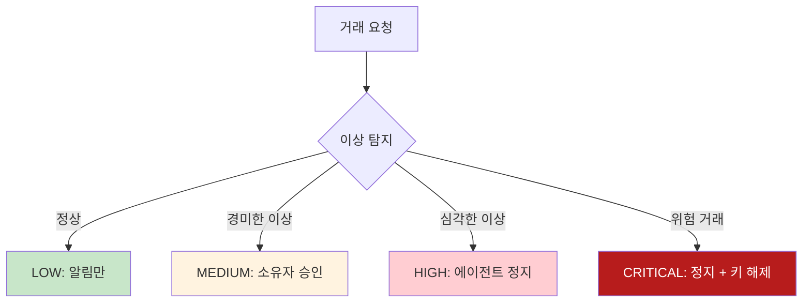
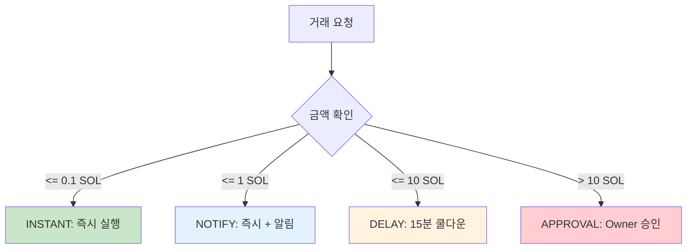
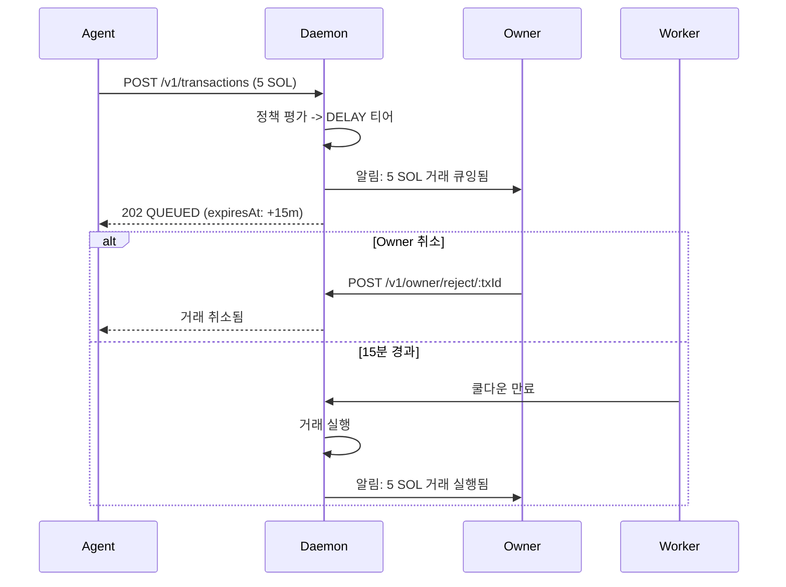

# 4단계 에스컬레이션 -> 4-tier 정책 대응표

**문서 ID:** MAPPING-03
**작성일:** 2026-02-06
**상태:** 완료
**참조:** API-03 (19-permission-policy-model.md), LOCK-MECH (33-time-lock-approval-mechanism.md)
**요구사항:** LEGACY-09 (H13 에스컬레이션 모델 매핑)

---

## 1. 개요

### 1.1 목적

v0.1의 4단계 에스컬레이션 모델(API-03)과 v0.2의 4-tier 정책 모델(LOCK-MECH)의 대응 관계를 명확히 정의한다. 두 모델은 유사한 목적(거래 위험 분류)을 가지지만, 설계 철학과 구현 방식이 다르다.

### 1.2 핵심 변경 요약

| 항목 | v0.1 (API-03) | v0.2 (LOCK-MECH) | 변경 이유 |
|------|--------------|------------------|-----------|
| 모델 이름 | 에스컬레이션 (Escalation) | 4-tier 정책 | 명확한 명칭 |
| 분류 기준 | 이상 행동 기반 (서버 + AI 탐지) | **금액 기반** (임계값) | 단순화, 예측 가능성 |
| 단계 수 | 4단계 (LOW/MEDIUM/HIGH/CRITICAL) | 4-tier (INSTANT/NOTIFY/DELAY/APPROVAL) | 동작 중심 명칭 |
| 트리거 | 복합 조건 (행동 패턴 + 금액) | **단일 조건** (금액만) | Self-Hosted 단순화 |
| 정책 엔진 | 온체인 Squads + 서버 AI | **로컬 DB 정책** (DatabasePolicyEngine) | 외부 의존 제거 |
| 시간 지연 | 없음 (즉시 멀티시그) | **DELAY 티어** (쿨다운 큐잉) | Owner 취소 기회 제공 |

### 1.3 참조 문서

- **v0.1 원본:** [19-permission-policy-model.md](./19-permission-policy-model.md) (API-03)
- **v0.2 대체:** [33-time-lock-approval-mechanism.md](./33-time-lock-approval-mechanism.md) (LOCK-MECH)

---

## 2. 모델 비교

### 2.1 v0.1 에스컬레이션 모델 (API-03)

v0.1은 **이상 행동 탐지 + 금액**을 복합적으로 고려하는 에스컬레이션 모델을 사용했다:



**특징:**
- 서버 AI가 행동 패턴을 분석하여 이상 여부 판단
- 금액 임계값 + 빈도 + 시간대 + 목적지 종합 평가
- 온체인 Squads 멀티시그와 연동
- 에스컬레이션 발생 시 Webhook으로 소유자에게 알림

### 2.2 v0.2 4-tier 정책 모델 (LOCK-MECH)

v0.2는 **금액 기반 단일 임계값**으로 단순화된 4-tier 모델을 사용한다:



**특징:**
- 금액만으로 티어 결정 (단순하고 예측 가능)
- 로컬 SQLite `policies` 테이블에서 규칙 로드
- DELAY 티어에서 Owner에게 취소 기회 제공
- APPROVAL 티어에서 Owner SIWS/SIWE 서명 필요

---

## 3. 단계별 상세 대응

### 3.1 대응표

| v0.1 에스컬레이션 | v0.2 4-tier | 금액 기준 (SOL) | 동작 차이 |
|------------------|-------------|----------------|-----------|
| - | **INSTANT** | 0 ~ 0.1 | **v0.2 신규**: 즉시 실행, 알림 없음 |
| Level 1: **경고 (Warning)** | **NOTIFY** | 0.1 ~ 1 | 즉시 실행 + 알림 (유사) |
| Level 2: **제한 (Throttle)** | - | - | **v0.2에서 제거**: 세션 제약으로 대체 |
| Level 3: **승인 필요 (Require Approval)** | **APPROVAL** | > 10 | 1시간 타임아웃, Owner 서명 필요 |
| Level 4: **동결 (Freeze)** | **Kill Switch** | - | 캐스케이드 정지, dual-auth 복구 |
| - | **DELAY** | 1 ~ 10 | **v0.2 신규**: 15분 쿨다운 큐잉 |

### 3.2 v0.1 Level 1 (경고) -> v0.2 NOTIFY

| 항목 | v0.1 | v0.2 |
|------|------|------|
| 트리거 | 소액 + 정상 행동 | 금액 <= 1 SOL |
| 동작 | 즉시 실행 + Webhook 알림 | 즉시 실행 + Owner 알림 |
| Owner 개입 | 불필요 | 불필요 |
| 기록 | 감사 로그 | `audit_log` 테이블 |

**차이점:**
- v0.1은 "경고"라는 부정적 뉘앙스, v0.2는 "알림(NOTIFY)"으로 중립적
- v0.1은 복합 조건, v0.2는 금액 단일 조건

### 3.3 v0.1 Level 2 (제한) -> v0.2 제거 (세션 제약)

**v0.1 Level 2 특징:**
- 이상 거래 빈도 감지 시 API 속도 제한
- 에이전트 기능 일부 제한 (예: 고액 거래 차단)

**v0.2 대체 방식:**
- 세션 생성 시 `SessionConstraints`로 사전 제약
  - `max_amount`: 단건 최대 금액
  - `max_total`: 세션 총 금액
  - `max_count`: 거래 횟수
  - `allowed_addresses`: 허용 주소 목록
- `RATE_LIMIT` 정책으로 시간당/일일 거래 횟수 제한

```typescript
// v0.2 SessionConstraints (SESS-PROTO 정의)
interface SessionConstraints {
  max_amount?: string;        // 단건 최대 (lamports)
  max_total?: string;         // 세션 총 최대
  max_count?: number;         // 거래 횟수 제한
  allowed_addresses?: string[]; // 허용 주소
  allowed_ops?: string[];     // 허용 작업
}
```

### 3.4 v0.1 Level 3 (승인 필요) -> v0.2 APPROVAL

| 항목 | v0.1 | v0.2 |
|------|------|------|
| 트리거 | 고액 + 이상 패턴 | 금액 > 10 SOL |
| 대기 시간 | Squads 멀티시그 타임아웃 | **1시간** (configurable) |
| 승인 방식 | Squads 멤버 서명 | Owner SIWS/SIWE 서명 |
| 거절 시 | Squads 트랜잭션 취소 | `CANCELLED` 상태 전이 |
| 미승인 시 | 온체인 만료 | **EXPIRED** 자동 전이 |

**v0.2 APPROVAL 상세 흐름:**
```
1. 거래 요청 (금액 > 10 SOL)
2. 정책 평가 -> APPROVAL 티어 분류
3. 거래 상태: QUEUED
4. Owner 알림 발송 (Telegram/Discord/ntfy.sh)
5. Owner 선택:
   a) POST /v1/owner/approve/:txId -> PENDING -> 실행 -> CONFIRMED
   b) POST /v1/owner/reject/:txId -> CANCELLED
   c) 1시간 타임아웃 -> EXPIRED
```

### 3.5 v0.1 Level 4 (동결) -> v0.2 Kill Switch

| 항목 | v0.1 | v0.2 |
|------|------|------|
| 트리거 | 심각한 보안 위협 탐지 | Owner 수동 발동 또는 AutoStopEngine |
| 동작 | 에이전트 정지 + 키 해제 | **캐스케이드 정지** (세션/거래/에이전트/키스토어) |
| 복구 | Owner 승인 + 키 재생성 | **Dual-auth** (Owner 서명 + 마스터 패스워드) |
| 상태 | SUSPENDED | **ACTIVATED** -> **RECOVERING** -> NORMAL |
| 대기 거래 | Squads 트랜잭션 취소 | CANCELLED 일괄 전이 |

**v0.2 Kill Switch 3-state:**
```
NORMAL ──[발동]──> ACTIVATED ──[복구 시작]──> RECOVERING ──[복구 완료]──> NORMAL
```

**v0.2 6-step 캐스케이드 정지:**
1. 모든 세션 폐기 (`sessions` DELETE)
2. 대기 거래 취소 (`transactions` QUEUED/PENDING -> CANCELLED)
3. 에이전트 정지 (`agents.status` = SUSPENDED)
4. 키스토어 잠금 (`secureMemZero`)
5. Owner 알림 발송 (2+ 채널)
6. 감사 로그 기록

### 3.6 v0.2 신규: INSTANT 티어

v0.1에는 없는 **즉시 실행 + 알림 없음** 티어:

| 항목 | 값 |
|------|-----|
| 트리거 | 금액 <= 0.1 SOL (lamports 100,000,000) |
| 동작 | 즉시 실행 |
| 알림 | **없음** |
| 용도 | 소액 자동화 거래 (가스비 정도) |

**도입 근거:**
- 매우 소액은 알림 피로(notification fatigue) 유발
- 에이전트 자율 운영 효율성

### 3.7 v0.2 신규: DELAY 티어

v0.1에는 없는 **쿨다운 큐잉** 티어:

| 항목 | 값 |
|------|-----|
| 트리거 | 금액 1 ~ 10 SOL |
| 동작 | 15분 쿨다운 후 자동 실행 |
| 취소 | Owner가 쿨다운 중 `POST /v1/owner/reject/:txId` |
| 미취소 시 | 15분 후 `DelayQueueWorker`가 자동 실행 |
| 알림 | 큐잉 시 + 실행 직전 알림 |

**도입 근거:**
- APPROVAL(승인 필수)과 NOTIFY(즉시 실행) 사이 중간 단계
- Owner에게 검토 시간 제공하되, 수동 승인 부담 감소
- 미취소 = 묵시적 승인



---

## 4. 금액 임계값 설정

### 4.1 기본값 비교

| 티어 | v0.1 (예시) | v0.2 기본값 | 단위 |
|------|------------|------------|------|
| INSTANT | - | 0.1 SOL | 100,000,000 lamports |
| NOTIFY (LOW) | 0.5 SOL | 1 SOL | 1,000,000,000 lamports |
| DELAY | - | 10 SOL | 10,000,000,000 lamports |
| APPROVAL (MEDIUM+) | 2 SOL | 10 SOL | 10,000,000,000 lamports |
| HIGH | 5 SOL | (Kill Switch) | - |
| CRITICAL | 10 SOL | (Kill Switch) | - |

### 4.2 v0.2 policies 테이블 SPENDING_LIMIT 규칙

```json
{
  "instant_max": "100000000",     // 0.1 SOL
  "notify_max": "1000000000",     // 1 SOL
  "delay_max": "10000000000",     // 10 SOL
  "delay_seconds": 900,            // 15분 쿨다운
  "approval_timeout": 3600         // 1시간 승인 대기
}
```

### 4.3 임계값 커스터마이징

Owner는 `POST /v1/owner/policies` API로 임계값을 커스터마이즈할 수 있다:

```json
// 보수적 설정 예시
{
  "type": "SPENDING_LIMIT",
  "rules": {
    "instant_max": "50000000",     // 0.05 SOL
    "notify_max": "500000000",     // 0.5 SOL
    "delay_max": "5000000000",     // 5 SOL
    "delay_seconds": 1800,          // 30분 쿨다운
    "approval_timeout": 7200        // 2시간 승인 대기
  }
}
```

---

## 5. 정책 엔진 대응

### 5.1 v0.1 정책 검증 레이어

```
┌──────────────────────────────────────────────────┐
│  Layer 1: API 서버 (RBAC + ABAC)                  │
│  └── 에스컬레이션 레벨 결정 (AI 탐지)              │
├──────────────────────────────────────────────────┤
│  Layer 2: Nitro Enclave                          │
│  └── 정책 재검증 (격리 환경)                      │
├──────────────────────────────────────────────────┤
│  Layer 3: Squads 온체인                           │
│  └── Spending Limit 최종 강제 (defense-in-depth)  │
└──────────────────────────────────────────────────┘
```

### 5.2 v0.2 정책 검증 레이어

```
┌──────────────────────────────────────────────────┐
│  DatabasePolicyEngine (로컬)                      │
│  └── 6단계 평가: WHITELIST -> TIME -> RATE ->    │
│      SPENDING_LIMIT -> 4-tier 분류                │
├──────────────────────────────────────────────────┤
│  세션 제약 (SessionConstraints)                   │
│  └── 사전 제약 (max_amount, max_count 등)         │
├──────────────────────────────────────────────────┤
│  Kill Switch (KILL-AUTO-EVM)                     │
│  └── 최종 방어선 (캐스케이드 정지)                │
└──────────────────────────────────────────────────┘
```

### 5.3 IPolicyEngine 인터페이스 변경

**v0.1 (암시적):**
- Squads 온체인 정책에 의존
- 에스컬레이션 레벨은 서버 측 AI가 결정

**v0.2 (LOCK-MECH 정의):**
```typescript
interface IPolicyEngine {
  evaluate(agentId: string, request: {
    type: string;
    amount: string;
    to: string;
    chain: string;
  }): Promise<PolicyDecision>;
}

interface PolicyDecision {
  allowed: boolean;
  tier: 'INSTANT' | 'NOTIFY' | 'DELAY' | 'APPROVAL';
  reason?: string;
  policyId?: string;
  delaySeconds?: number;        // DELAY 티어용
  approvalTimeoutSeconds?: number;  // APPROVAL 티어용
}
```

---

## 6. 마이그레이션 가이드

### 6.1 에스컬레이션 로직 변환

**v0.1 코드:**
```typescript
// v0.1 - 에스컬레이션 레벨 기반 처리
switch (response.escalation) {
  case 'LOW':
    // 로깅만
    break;
  case 'MEDIUM':
    // 소유자 알림
    await notifyOwner('approval_needed');
    break;
  case 'HIGH':
    // 에이전트 정지
    await suspendAgent(agentId);
    break;
  case 'CRITICAL':
    // 긴급 대응
    await emergencyShutdown(agentId);
    break;
}
```

**v0.2 코드:**
```typescript
// v0.2 - 4-tier 기반 처리
switch (decision.tier) {
  case 'INSTANT':
    // 즉시 실행
    await executeTransaction(tx);
    break;
  case 'NOTIFY':
    // 즉시 실행 + 알림
    await executeTransaction(tx);
    await notifyOwner('transaction_executed', tx);
    break;
  case 'DELAY':
    // 큐잉 후 대기
    await queueTransaction(tx, decision.delaySeconds);
    await notifyOwner('transaction_queued', tx);
    break;
  case 'APPROVAL':
    // 승인 대기
    await queueTransaction(tx, 0);
    await notifyOwner('approval_needed', tx);
    break;
}
```

### 6.2 변환 체크리스트

- [ ] `escalation` 필드 참조 -> `tier` 필드로 변경
- [ ] `LOW/MEDIUM/HIGH/CRITICAL` -> `INSTANT/NOTIFY/DELAY/APPROVAL`
- [ ] 이상 탐지 로직 제거 (금액 기반으로 단순화)
- [ ] Squads 멀티시그 호출 제거
- [ ] DELAY 티어 쿨다운 로직 추가
- [ ] Kill Switch 복구 흐름 구현 (dual-auth)

### 6.3 알림 매핑

| v0.1 알림 | v0.2 알림 | 트리거 |
|-----------|-----------|--------|
| `policy.violation` | `transaction_queued` | DELAY/APPROVAL 큐잉 |
| `agent.suspended` | `kill_switch_activated` | Kill Switch 발동 |
| - | `transaction_executed` | NOTIFY 즉시 실행 |
| - | `approval_timeout` | APPROVAL 만료 |

---

## 7. 참조 문서

### 7.1 내부 문서

| 문서 | 내용 | 상태 |
|------|------|------|
| [19-permission-policy-model.md](./19-permission-policy-model.md) | v0.1 에스컬레이션 모델 (API-03) | PARTIALLY SUPERSEDED |
| [33-time-lock-approval-mechanism.md](./33-time-lock-approval-mechanism.md) | v0.2 4-tier 정책 (LOCK-MECH) | **유효** |
| [30-session-token-protocol.md](./30-session-token-protocol.md) | SessionConstraints (SESS-PROTO) | **유효** |
| [36-killswitch-autostop-evm.md](./36-killswitch-autostop-evm.md) | Kill Switch (KILL-AUTO-EVM) | **유효** |

### 7.2 관련 요구사항

| 요구사항 | 설명 |
|---------|------|
| H13 | 4단계 에스컬레이션 -> 4-tier 정책 매핑 |
| LOCK-01 | 거래 금액에 따른 4단계 보안 분류 |
| LOCK-02 | Delay 티어 쿨다운 큐잉 |
| LOCK-03 | Approval 티어 Owner 서명 승인 |
| LOCK-04 | 미승인 거래 타임아웃 후 자동 만료 |

---

*문서 ID: MAPPING-03*
*작성일: 2026-02-06*
*Phase: 10-v01-잔재-정리*
*상태: 완료*
