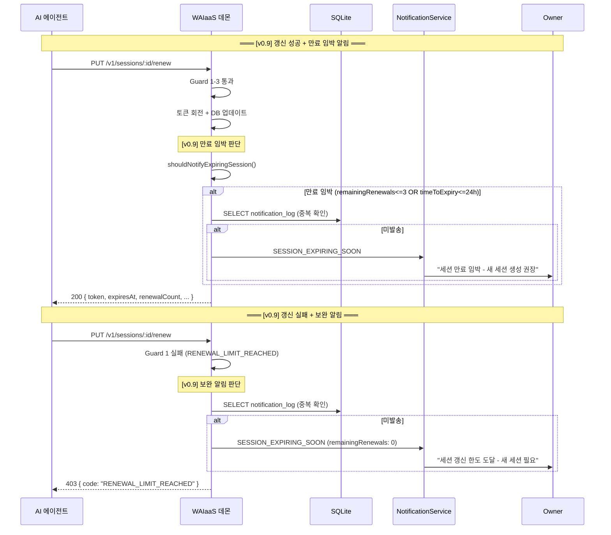

# 세션 갱신 프로토콜 (SESS-RENEW)

**문서 ID:** SESS-RENEW
**작성일:** 2026-02-07
**v0.8 보완:** 2026-02-09
**v0.9 보완:** 2026-02-09
**v0.10 보완:** 2026-02-09 -- SS5: 낙관적 잠금(token_hash WHERE 조건) + RENEWAL_CONFLICT(409) 에러 추가 (CONC-02)
**상태:** 완료
**참조:** SESS-PROTO (30-session-token-protocol.md), AUTH-REDESIGN (52-auth-model-redesign.md), CORE-02 (25-sqlite-schema.md), NOTI-ARCH (35-notification-architecture.md), CORE-01 (24-monorepo-data-directory.md)
**요구사항:** SESS-01 (갱신 API 스펙), SESS-02 (안전 장치 5종), SESS-04 (SessionConstraints 확장), SESS-05 (Owner 거부 + 알림)

---

## 1. 문서 개요

### 1.1 목적

AI 에이전트가 sessionAuth만으로 세션을 자율적으로 갱신할 수 있는 "낙관적 갱신(optimistic renewal)" 프로토콜을 정의한다. 에이전트의 장기 자율 운영을 보장하면서도 Owner의 통제권을 유지하는 비동기 갱신/거부 패턴을 설계한다.

### 1.2 핵심 원칙

| # | 원칙 | 설명 |
|---|------|------|
| 1 | **에이전트 자율 갱신** | 에이전트가 sessionAuth만으로 PUT /v1/sessions/:id/renew를 호출하여 갱신. Owner 사전 승인 불필요. |
| 2 | **Owner 사후 거부** | 갱신 후 Owner가 알림을 받고, 원치 않으면 세션을 폐기하여 사후 거부. |
| 3 | **토큰 회전** | 갱신 시 새 JWT를 발급하고 token_hash를 교체. 구 토큰은 자동 무효화. |
| 4 | **5종 안전 장치** | maxRenewals, 절대 수명, 50% 시점 갱신, 거부 윈도우, 갱신 단위 고정으로 무한 갱신 방지. |

### 1.3 참조 문서

| 문서 ID | 파일 | 핵심 내용 |
|---------|------|-----------|
| SESS-PROTO | 30-session-token-protocol.md | JWT HS256 세션 토큰, SessionConstraints 8필드, sessionAuth 2-stage, 수명주기 5단계 |
| AUTH-REDESIGN | 52-auth-model-redesign.md | sessionAuth 정의, authRouter 디스패치, masterAuth implicit 모드 |
| CORE-02 | 25-sqlite-schema.md | sessions 테이블 스키마, Drizzle ORM, 마이그레이션 전략 |
| NOTI-ARCH | 35-notification-architecture.md | NotificationEventType, INotificationChannel, 알림 호출 포인트 |
| CORE-01 | 24-monorepo-data-directory.md | config.toml [security] 섹션, Zod ConfigSchema |

### 1.4 요구사항 매핑

| 요구사항 | 설명 | 충족 섹션 |
|---------|------|-----------|
| SESS-01 | PUT /v1/sessions/:id/renew API 스펙 | 섹션 3 (API 스펙) |
| SESS-02 | 5종 안전 장치 명세 | 섹션 4 (5종 안전 장치) |
| SESS-04 | SessionConstraints에 maxRenewals, renewalRejectWindow 추가 | 30-session-token-protocol.md 섹션 5 (위임) |
| SESS-05 | Owner 사후 거부 + SESSION_RENEWED/SESSION_RENEWAL_REJECTED 알림 | 섹션 6 (Owner 사후 거부) + 섹션 7 (알림 이벤트) |

---

## 2. 낙관적 갱신 개념

### 2.1 정의

**낙관적 갱신(Optimistic Renewal)** 이란 에이전트가 먼저 세션을 갱신하고, Owner가 사후에 거부할 수 있는 비동기 패턴이다. 에이전트는 sessionAuth만으로 갱신을 수행하며, Owner의 사전 승인이 필요하지 않다.

### 2.2 설계 근거

| 요소 | 설명 |
|------|------|
| AI 에이전트 자율 운영 | DeFi 전략 실행, 모니터링 등 장기 작업 중 세션 만료로 중단되면 안 됨 |
| Owner 항상 온라인 불가 | Self-Hosted 환경에서 Owner가 항상 대기할 수 없음. 비동기 패턴이 적합. |
| Self-Hosted 환경 | 로컬 데몬에서 운영. 외부 인프라(OAuth 서버 등) 없이 갱신 가능해야 함. |
| 5종 안전 장치 | 무한 갱신을 방지하는 다중 방어가 있으므로 자율 갱신이 안전. |

### 2.3 시퀀스 다이어그램


---

## 3. PUT /v1/sessions/:id/renew API 스펙

### 3.1 엔드포인트 개요

| 항목 | 값 |
|------|-----|
| Method | `PUT` |
| Path | `/v1/sessions/{id}/renew` |
| 인증 | sessionAuth (Bearer wai_sess_...) |
| 요청 바디 | 없음 (갱신 단위 고정이므로 파라미터 불필요) |
| Kill Switch | killSwitchGuard 적용 대상 (ACTIVATED 상태에서 차단) |

### 3.2 인증 + 세션 일치 확인

에이전트는 **자신의 세션만** 갱신할 수 있다. JWT의 `sid` claim과 요청 경로의 `:id`가 일치해야 한다.

```typescript
// 세션 일치 검증
if (c.get('sessionId') !== c.req.param('id')) {
  return c.json({
    error: {
      code: 'SESSION_RENEWAL_MISMATCH',
      message: '자신의 세션만 갱신할 수 있습니다.',
      requestId: c.get('requestId'),
      retryable: false,
    },
  }, 403)
}
```

### 3.3 요청

| 항목 | 값 |
|------|-----|
| 경로 파라미터 | `id` (UUID v7, 세션 ID) |
| 요청 바디 | 없음 |
| 헤더 | `Authorization: Bearer wai_sess_...` |

에이전트가 갱신 기간이나 제약을 변경할 수 없다. 갱신은 순수하게 **기간 연장**만 수행하며, 원래 세션 생성 시 설정된 `expiresIn` 값을 재사용한다.

### 3.4 응답 (200 OK)

```json
{
  "sessionId": "019502a8-7b3c-7d4e-8f5a-1234567890ab",
  "token": "wai_sess_eyJhbGciOiJIUzI1NiIs...",
  "expiresAt": "2026-02-08T10:26:25.000Z",
  "renewalCount": 1,
  "maxRenewals": 30,
  "absoluteExpiresAt": "2026-03-07T10:26:25.000Z"
}
```

| 필드 | 타입 | 설명 |
|------|------|------|
| `sessionId` | `string` (UUID v7) | 세션 ID (변경 없음) |
| `token` | `string` | 새 세션 토큰 (`wai_sess_` + 새 JWT) |
| `expiresAt` | `string` (ISO 8601) | 새 만료 시각 = now + expiresIn |
| `renewalCount` | `number` | 누적 갱신 횟수 (갱신 후 값) |
| `maxRenewals` | `number` | 최대 갱신 횟수 |
| `absoluteExpiresAt` | `string` (ISO 8601) | 절대 만료 시각 (세션 총 수명 상한) |

### 3.5 Zod 응답 스키마

```typescript
// packages/core/src/schemas/session.schema.ts (Phase 20 추가)
import { z } from '@hono/zod-openapi'

export const RenewSessionResponseSchema = z.object({
  sessionId: z.string().uuid().openapi({
    description: '세션 ID',
    example: '019502a8-7b3c-7d4e-8f5a-1234567890ab',
  }),
  token: z.string().openapi({
    description: '새 세션 토큰 (wai_sess_...)',
  }),
  expiresAt: z.string().datetime().openapi({
    description: '새 만료 시각 (ISO 8601)',
    example: '2026-02-08T10:26:25.000Z',
  }),
  renewalCount: z.number().int().openapi({
    description: '누적 갱신 횟수',
    example: 1,
  }),
  maxRenewals: z.number().int().openapi({
    description: '최대 갱신 횟수',
    example: 30,
  }),
  absoluteExpiresAt: z.string().datetime().openapi({
    description: '절대 만료 시각 (세션 총 수명 상한)',
    example: '2026-03-07T10:26:25.000Z',
  }),
}).openapi('RenewSessionResponse')
```

### 3.6 Hono 라우트 정의

```typescript
// packages/daemon/src/server/routes/session-renew.ts
import { createRoute, z } from '@hono/zod-openapi'

export const renewSessionRoute = createRoute({
  method: 'put',
  path: '/v1/sessions/{id}/renew',
  tags: ['Sessions'],
  operationId: 'renewSession',
  summary: '세션 갱신 (낙관적 갱신)',
  description: '에이전트가 자신의 세션을 갱신합니다. sessionAuth만으로 인증하며, 새 JWT가 발급됩니다.',
  security: [{ bearerAuth: [] }],
  request: {
    params: z.object({
      id: z.string().uuid().openapi({ description: '갱신할 세션 ID' }),
    }),
  },
  responses: {
    200: {
      content: { 'application/json': { schema: RenewSessionResponseSchema } },
      description: '세션 갱신 성공. 새 토큰이 발급됨. 구 토큰은 즉시 무효화.',
    },
    401: {
      description: 'AUTH_TOKEN_MISSING | AUTH_TOKEN_EXPIRED | AUTH_TOKEN_INVALID | SESSION_REVOKED',
    },
    403: {
      description: 'RENEWAL_LIMIT_REACHED | SESSION_ABSOLUTE_LIFETIME_EXCEEDED | RENEWAL_TOO_EARLY | SESSION_RENEWAL_MISMATCH',
    },
    404: {
      description: 'SESSION_NOT_FOUND',
    },
    409: {
      description: '[v0.10] RENEWAL_CONFLICT -- 동시 갱신으로 token_hash 불일치 (낙관적 잠금 실패)',
    },
  },
})
```

### 3.7 에러 코드

| 에러 코드 | HTTP 상태 | 발생 시점 | 설명 | retryable |
|----------|----------|----------|------|-----------|
| `RENEWAL_LIMIT_REACHED` | 403 | Guard 1 검증 | 최대 갱신 횟수(maxRenewals) 초과 | false |
| `SESSION_ABSOLUTE_LIFETIME_EXCEEDED` | 403 | Guard 2 검증 | 갱신 후 세션 총 수명이 절대 수명 초과 | false |
| `RENEWAL_TOO_EARLY` | 403 | Guard 3 검증 | 현재 세션 기간의 50% 미경과 | true (시간 경과 후 재시도) |
| `SESSION_RENEWAL_MISMATCH` | 403 | 세션 일치 확인 | JWT의 sid와 요청의 :id 불일치 (타인의 세션 갱신 시도) | false |
| `SESSION_NOT_FOUND` | 404 | DB 조회 | 세션 ID가 존재하지 않음 | false |
| `RENEWAL_CONFLICT` | 409 | DB 업데이트 | [v0.10] 동시 갱신으로 token_hash 불일치 (낙관적 잠금 실패) | false |

**참고:** `AUTH_TOKEN_MISSING`, `AUTH_TOKEN_EXPIRED`, `AUTH_TOKEN_INVALID`, `SESSION_REVOKED`는 sessionAuth 미들웨어에서 발생하는 기존 에러 코드 (SESS-PROTO 섹션 8.5 참조).

### 3.8 authRouter 배치

52-auth-model-redesign.md의 authRouter 디스패치 로직에 추가:

```
PUT /v1/sessions/:id/renew -> sessionAuth
```

에이전트가 자신의 세션 토큰으로 인증하므로 sessionAuth가 적합하다. 추가 제약으로 JWT의 sid == :id 일치 확인이 필요하다.

---

## 4. 5종 안전 장치

갱신을 무한정 허용하지 않는 5가지 방어 메커니즘. 검증 순서가 중요하다: 비용이 낮은 것부터 먼저 검증한다.

### 4.1 검증 순서

```
요청 수신
  │
  v
Guard 1: maxRenewals (integer 비교, O(1))
  │ 통과
  v
Guard 2: 절대 수명 (integer 산술 + 비교, O(1))
  │ 통과
  v
Guard 3: 50% 시점 (integer 산술 + 비교, O(1))
  │ 통과
  v
갱신 실행 (Guard 4, 5는 적용 규칙)
```

### 4.2 Guard 1: maxRenewals (최대 갱신 횟수)

| 항목 | 값 |
|------|-----|
| **이름** | maxRenewals (최대 갱신 횟수) |
| **설정 위치** | SessionConstraints.maxRenewals / config.toml [security].default_max_renewals |
| **기본값** | 30 |
| **범위** | 0 ~ 100 (0이면 갱신 불가) |
| **검증 시점** | 갱신 요청 시 (Guard 순서 1번) |
| **에러 코드** | `RENEWAL_LIMIT_REACHED` (HTTP 403) |

**검증 로직:**

```typescript
// Guard 1: maxRenewals 확인
const maxRenewals = constraints.maxRenewals ?? config.security.default_max_renewals ?? 30

if (session.renewal_count >= maxRenewals) {
  return {
    allowed: false,
    code: 'RENEWAL_LIMIT_REACHED',
    reason: `갱신 횟수 한도 초과: ${session.renewal_count} >= ${maxRenewals}`,
  }
}
```

**설계 근거:**
- 30회 x 24시간(기본 expiresIn) = 720시간 = 30일. 절대 수명(Guard 2)과 자연스럽게 연동.
- 0 설정 시 갱신 완전 비활성화 (일회성 세션).
- Owner가 세션 생성 시 constraints.maxRenewals로 세션별 재정의 가능.

### 4.3 Guard 2: 절대 수명 (Absolute Lifetime)

| 항목 | 값 |
|------|-----|
| **이름** | 절대 수명 (Session Absolute Lifetime) |
| **설정 위치** | config.toml [security].session_absolute_lifetime |
| **기본값** | 2,592,000초 (30일) |
| **범위** | 86,400 ~ 7,776,000 (1일 ~ 90일) |
| **검증 시점** | 갱신 요청 시 (Guard 순서 2번) |
| **에러 코드** | `SESSION_ABSOLUTE_LIFETIME_EXCEEDED` (HTTP 403) |

**검증 로직:**

```typescript
// Guard 2: 절대 수명 확인
const absoluteLifetime = config.security.session_absolute_lifetime ?? 2592000  // 30일
const expiresIn = constraints.expiresIn ?? 86400  // 원래 세션 만료 단위
const createdAtEpoch = session.created_at  // Unix epoch (초)

if (now + expiresIn > createdAtEpoch + absoluteLifetime) {
  return {
    allowed: false,
    code: 'SESSION_ABSOLUTE_LIFETIME_EXCEEDED',
    reason: `갱신 후 세션 총 수명이 ${absoluteLifetime}초를 초과합니다`,
  }
}
```

**설계 근거:**
- 아무리 많은 갱신을 해도 세션 생성 시점으로부터 30일을 초과할 수 없다.
- sessions 테이블의 `absolute_expires_at` 컬럼에 세션 생성 시 `created_at + absolute_lifetime`을 미리 계산하여 저장 (config 변경이 기존 세션에 소급 적용되지 않도록).
- maxRenewals=30, expiresIn=7일이면 이론적 총 수명이 210일이 되지만, Guard 2가 30일에서 차단.

### 4.4 Guard 3: 50% 시점 갱신 (Minimum Elapsed)

| 항목 | 값 |
|------|-----|
| **이름** | 50% 시점 갱신 (Minimum Elapsed Time) |
| **설정 위치** | 시스템 고정 (50%, 설정 불가) |
| **기본값** | expiresIn * 0.5 |
| **검증 시점** | 갱신 요청 시 (Guard 순서 3번) |
| **에러 코드** | `RENEWAL_TOO_EARLY` (HTTP 403) |

**검증 로직:**

```typescript
// Guard 3: 50% 시점 확인
const expiresIn = constraints.expiresIn ?? 86400
const referenceTime = session.last_renewed_at ?? session.created_at  // Unix epoch (초)
const minimumElapsed = Math.floor(expiresIn * 0.5)

if (now < referenceTime + minimumElapsed) {
  return {
    allowed: false,
    code: 'RENEWAL_TOO_EARLY',
    reason: `최소 ${minimumElapsed}초 경과 후 갱신 가능 (현재 경과: ${now - referenceTime}초)`,
  }
}
```

**referenceTime 결정 규칙:**
- 첫 갱신: `created_at` (세션 생성 시각) 기준
- 재갱신: `last_renewed_at` (마지막 갱신 시각) 기준

**예시 (expiresIn = 86400초 = 24시간):**
- 최소 12시간(43,200초) 경과 후 갱신 가능
- 세션 생성 직후 갱신 시도 -> 403 RENEWAL_TOO_EARLY

### 4.5 Guard 4: 거부 윈도우 (Renewal Reject Window)

| 항목 | 값 |
|------|-----|
| **이름** | 거부 윈도우 (Renewal Reject Window) |
| **설정 위치** | SessionConstraints.renewalRejectWindow / config.toml [security].default_renewal_reject_window |
| **기본값** | 3,600초 (1시간) |
| **범위** | 300 ~ 86,400 (5분 ~ 24시간) |
| **성격** | 검증이 아닌 **정보 제공** |

**동작 방식:**

거부 윈도우는 안전 장치 "검증"이 아니다. 알림 메시지에 포함되는 **안내 문구**로서, Owner에게 "이 시간 내에 확인하시는 것을 권장합니다"의 의미를 전달한다.

```
갱신 성공 알림:
"세션 'trading-bot'이 갱신되었습니다 (3/30회).
1시간 내에 확인하시기 바랍니다.
세션을 폐기하면 갱신이 취소됩니다."
```

**핵심:** Owner는 거부 윈도우와 **무관하게** 언제든 `DELETE /v1/sessions/:id`로 세션을 폐기할 수 있다. 거부 윈도우는 Owner의 폐기 권한을 시간적으로 제한하지 않는다.

### 4.6 Guard 5: 갱신 단위 고정 (Fixed Renewal Unit)

| 항목 | 값 |
|------|-----|
| **이름** | 갱신 단위 고정 (Fixed Renewal Unit) |
| **설정 위치** | 원래 SessionConstraints.expiresIn |
| **성격** | 적용 규칙 (검증이 아닌 적용) |

**동작 방식:**

갱신 시 새 만료 시각은 `now + 원래 expiresIn`으로 계산된다. 에이전트가 요청 바디에 기간을 지정할 수 없다 (요청 바디 자체가 없다).

```typescript
// Guard 5: 갱신 단위 고정 적용
const expiresIn = constraints.expiresIn ?? 86400  // 원래 세션 생성 시 값
const newExpiresAt = now + expiresIn              // 원래 expiresIn 재사용
```

**설계 근거:**
- 원래 24시간이면 갱신해도 24시간만 연장.
- 에이전트가 임의로 더 긴 만료 시간을 요청할 수 없음.
- PUT 요청 바디가 없으므로 임의 파라미터 주입 불가.

### 4.7 안전 장치 요약표

| # | 안전 장치 | 기본값 | 범위 | 에러 코드 | 성격 |
|---|----------|--------|------|----------|------|
| 1 | maxRenewals | 30 | 0~100 | RENEWAL_LIMIT_REACHED | 검증 |
| 2 | 절대 수명 | 30일 (2,592,000초) | 1일~90일 | SESSION_ABSOLUTE_LIFETIME_EXCEEDED | 검증 |
| 3 | 50% 시점 | expiresIn * 0.5 | 고정 | RENEWAL_TOO_EARLY | 검증 |
| 4 | 거부 윈도우 | 1시간 (3,600초) | 5분~24시간 | - | 정보 제공 |
| 5 | 갱신 단위 고정 | 원래 expiresIn | 고정 | - | 적용 규칙 |

### 4.8 통합 검증 코드 패턴

```typescript
// packages/daemon/src/services/session-renewal-service.ts

interface RenewalValidationResult {
  allowed: boolean
  code?: string
  reason?: string
}

function validateRenewalGuards(
  session: {
    renewal_count: number
    created_at: number      // Unix epoch (초)
    last_renewed_at: number | null  // Unix epoch (초) or null
    constraints: string     // JSON
  },
  config: {
    session_absolute_lifetime: number  // 초
    default_max_renewals: number
  },
  now: number,  // Unix epoch (초)
): RenewalValidationResult {
  const constraints = JSON.parse(session.constraints ?? '{}')
  const expiresIn = constraints.expiresIn ?? 86400
  const maxRenewals = constraints.maxRenewals ?? config.default_max_renewals

  // Guard 1: maxRenewals 확인 (최저 비용)
  if (session.renewal_count >= maxRenewals) {
    return {
      allowed: false,
      code: 'RENEWAL_LIMIT_REACHED',
      reason: `갱신 횟수 한도 초과: ${session.renewal_count} >= ${maxRenewals}`,
    }
  }

  // Guard 2: 절대 수명 확인
  const absoluteLifetime = config.session_absolute_lifetime
  if (now + expiresIn > session.created_at + absoluteLifetime) {
    return {
      allowed: false,
      code: 'SESSION_ABSOLUTE_LIFETIME_EXCEEDED',
      reason: `갱신 후 세션 총 수명이 ${absoluteLifetime}초를 초과합니다`,
    }
  }

  // Guard 3: 50% 시점 확인
  const referenceTime = session.last_renewed_at ?? session.created_at
  const minimumElapsed = Math.floor(expiresIn * 0.5)
  if (now < referenceTime + minimumElapsed) {
    return {
      allowed: false,
      code: 'RENEWAL_TOO_EARLY',
      reason: `최소 ${minimumElapsed}초 경과 후 갱신 가능 (현재 경과: ${now - referenceTime}초)`,
    }
  }

  // Guard 4: 거부 윈도우 -- 검증이 아닌 응답 정보로 포함 (별도 처리)
  // Guard 5: 갱신 단위 고정 -- expiresIn 값 재사용 (별도 처리)

  return { allowed: true }
}
```

---

## 5. 토큰 회전 메커니즘

### 5.1 JWT 불변성 원칙

JWT는 서명된 불변(immutable) 토큰이다. `exp` claim을 변경하면 서명이 깨진다. 따라서 갱신 시 기존 JWT를 재사용할 수 없고, 반드시 새 JWT를 발급해야 한다.

**토큰 회전이 필요한 이유:**

| 접근 방식 | 문제점 |
|----------|--------|
| DB의 expires_at만 변경 (JWT 재사용) | JWT의 exp claim과 DB의 expires_at이 불일치. sessionAuth Stage 1에서 exp 검증 실패 -> 불필요한 DB 조회 발생. |
| 새 JWT 발급 + token_hash 교체 (토큰 회전) | exp/iat이 갱신 시점을 반영. token_hash 교체로 구 토큰 자동 무효화. |

### 5.2 갱신 플로우 상세

```
1. sessionAuth 검증 (기존 토큰)
   │
2. 5종 안전 장치 검증
   │
3. 새 JWT 발급
   │  SignJWT({ sid: session.id, aid: session.agent_id })
   │  .setProtectedHeader({ alg: 'HS256' })
   │  .setIssuedAt()                              // 갱신 시점
   │  .setExpirationTime(`${expiresIn}s`)         // 원래 expiresIn
   │  .setJti(session.id)                         // 동일 세션 ID
   │  .setIssuer('waiaas')
   │  .sign(JWT_SECRET)
   │
4. 새 token_hash 계산
   │  SHA-256(`wai_sess_${newJwt}`)
   │
5. BEGIN IMMEDIATE 트랜잭션
   │  UPDATE sessions SET
   │    token_hash = :newTokenHash,
   │    expires_at = :newExpiresAt,
   │    renewal_count = renewal_count + 1,
   │    last_renewed_at = :now
   │  WHERE id = :id AND token_hash = :currentTokenHash
   │  -- [v0.10] changes === 0 -> RENEWAL_CONFLICT(409)
   │
6. 응답 반환
   │  { sessionId, token: `wai_sess_${newJwt}`, expiresAt, ... }
```

### 5.3 구 토큰 자동 무효화

토큰 회전의 핵심 부수 효과: **구 토큰이 자동으로 무효화된다.**

- `token_hash`가 새 값으로 교체되면, 구 토큰의 해시로는 DB에서 세션을 조회할 수 없다.
- 구 토큰을 가진 에이전트(또는 공격자)가 API 요청 시 sessionAuth Stage 2에서 `AUTH_TOKEN_INVALID` 반환.
- 별도의 토큰 블랙리스트나 만료 처리가 불필요.

### 5.4 동시 갱신 방어

```
에이전트 A (구 토큰) ─── PUT /renew ──> 데몬
에이전트 A (구 토큰) ─── PUT /renew ──> 데몬 (거의 동시)
```

**BEGIN IMMEDIATE가 자연스럽게 직렬화:**

1. 첫 번째 요청이 BEGIN IMMEDIATE로 쓰기 잠금 획득
2. token_hash 교체 + COMMIT
3. 두 번째 요청이 BEGIN IMMEDIATE로 쓰기 잠금 획득
4. 두 번째 요청의 구 token_hash로 세션 조회 -> **불일치** (이미 교체됨)
5. 401 AUTH_TOKEN_INVALID 반환

결과: 첫 번째 갱신만 성공하고, 두 번째는 자연스럽게 거부된다. 별도의 동시성 제어 코드가 불필요하다.

[v0.10] **낙관적 잠금 강화:**

BEGIN IMMEDIATE는 동시 WRITE 충돌(SQLITE_BUSY)을 방지하지만, 다음 시나리오를 해결하지 못한다:
1. 요청 A가 세션을 SELECT로 읽고 token_hash_A를 확인
2. 요청 B가 같은 세션을 SELECT로 읽고 동일한 token_hash_A를 확인
3. 요청 A가 UPDATE 실행 -> token_hash를 hash_B로 변경 -> 성공
4. 요청 B가 UPDATE 실행 -> token_hash를 hash_C로 변경 -> 성공 (hash_B를 덮어씀!)

요청 A가 발급한 토큰(hash_B)이 무효화되는데, 요청 A의 클라이언트는 이를 모른다.

**해결:** UPDATE의 WHERE 절에 `token_hash = :currentTokenHash`를 추가하여, 조회 시점과 갱신 시점의 token_hash가 동일할 때만 UPDATE가 성공한다. `changes === 0`이면 다른 요청이 먼저 갱신한 것이므로 RENEWAL_CONFLICT(409)를 반환한다.

이 패턴은 34-owner-wallet-connection의 `markOwnerVerified()` CAS와 동일한 프로젝트 내 선례를 따른다:
- markOwnerVerified: `WHERE id = ? AND owner_verified = 0` -> `changes === 0`이면 이미 LOCKED (Idempotent)
- renewSession: `WHERE id = :id AND token_hash = :currentTokenHash` -> `changes === 0`이면 RENEWAL_CONFLICT(409)

### 5.5 갱신 서비스 코드 패턴

```typescript
// packages/daemon/src/services/session-renewal-service.ts
import { SignJWT } from 'jose'
import { createHash } from 'node:crypto'
import type Database from 'better-sqlite3'

const TOKEN_PREFIX = 'wai_sess_'

interface RenewalResult {
  success: boolean
  error?: { code: string; message: string; status: number }
  data?: {
    sessionId: string
    token: string
    expiresAt: string
    renewalCount: number
    maxRenewals: number
    absoluteExpiresAt: string
  }
}

async function renewSession(
  sqlite: Database.Database,
  sessionId: string,
  jwtSecret: Uint8Array,
  config: SecurityConfig,
  now: number,  // Unix epoch (초)
): Promise<RenewalResult> {
  // 1. 세션 조회
  const session = sqlite
    .prepare('SELECT * FROM sessions WHERE id = ? AND revoked_at IS NULL')
    .get(sessionId) as SessionRow | undefined

  if (!session) {
    return { success: false, error: { code: 'SESSION_NOT_FOUND', message: '세션을 찾을 수 없습니다.', status: 404 } }
  }

  // 2. 5종 안전 장치 검증
  const validation = validateRenewalGuards(session, config, now)
  if (!validation.allowed) {
    return { success: false, error: { code: validation.code!, message: validation.reason!, status: 403 } }
  }

  // 3. 새 JWT 발급
  const constraints = JSON.parse(session.constraints ?? '{}')
  const expiresIn = constraints.expiresIn ?? 86400

  const newJwt = await new SignJWT({
    sid: session.id,
    aid: session.agent_id,
  })
    .setProtectedHeader({ alg: 'HS256' })
    .setIssuedAt()
    .setExpirationTime(`${expiresIn}s`)
    .setJti(session.id)
    .setIssuer('waiaas')
    .sign(jwtSecret)

  const newToken = `${TOKEN_PREFIX}${newJwt}`

  // 4. 새 token_hash 계산
  const newTokenHash = createHash('sha256').update(newToken).digest('hex')

  // 5. DB 원자적 업데이트 (낙관적 잠금)
  const currentTokenHash = session.token_hash  // [v0.10] 조회 시점 token_hash 보존
  const newExpiresAt = now + expiresIn
  const maxRenewals = constraints.maxRenewals ?? config.default_max_renewals

  const updateTx = sqlite.transaction(() => {
    // [v0.10] WHERE 절에 token_hash = :currentTokenHash 낙관적 잠금 추가
    // renewal_count는 renewal_count + 1로 원자적 증가 (애플리케이션 계산이 아닌 DB 수준)
    const result = sqlite.prepare(`
      UPDATE sessions SET
        token_hash = :newTokenHash,
        expires_at = :newExpiresAt,
        renewal_count = renewal_count + 1,
        last_renewed_at = :now
      WHERE id = :id AND token_hash = :currentTokenHash
    `).run({
      newTokenHash,
      newExpiresAt,
      now,
      id: sessionId,
      currentTokenHash,
    })

    // [v0.10] 낙관적 잠금 실패 감지: 다른 요청이 먼저 token_hash를 교체함
    if (result.changes === 0) {
      throw new RenewalConflictError()
    }
  })

  try {
    updateTx.immediate()  // BEGIN IMMEDIATE
  } catch (err) {
    if (err instanceof RenewalConflictError) {
      return {
        success: false,
        error: {
          code: 'RENEWAL_CONFLICT',
          message: '다른 요청이 먼저 세션을 갱신했습니다. 새 토큰으로 재시도하세요.',
          status: 409,
          retryable: false,
        },
      }
    }
    throw err
  }

  const newRenewalCount = session.renewal_count + 1

  // 6. 감사 로그
  sqlite.prepare(`
    INSERT INTO audit_log (id, event_type, actor, session_id, severity, details, timestamp)
    VALUES (?, 'SESSION_RENEWED', 'session', ?, 'info', ?, ?)
  `).run(
    generateUuidV7(),
    sessionId,
    JSON.stringify({
      renewalCount: newRenewalCount,
      maxRenewals,
      newExpiresAt: new Date(newExpiresAt * 1000).toISOString(),
    }),
    now,
  )

  // 7. 응답 반환
  return {
    success: true,
    data: {
      sessionId: session.id,
      token: newToken,
      expiresAt: new Date(newExpiresAt * 1000).toISOString(),
      renewalCount: newRenewalCount,
      maxRenewals,
      absoluteExpiresAt: new Date(session.absolute_expires_at * 1000).toISOString(),
    },
  }
}
```

### 5.5.1 [v0.10] RENEWAL_CONFLICT 에러 코드

| 필드 | 값 |
|------|-----|
| code | RENEWAL_CONFLICT |
| HTTP | 409 Conflict |
| domain | SESSION |
| retryable | false |
| message | "다른 요청이 먼저 세션을 갱신했습니다. 새 토큰으로 재시도하세요." |

**클라이언트 처리 가이드:**
- 409를 받은 클라이언트는 구 토큰으로 재시도하면 안 된다 (이미 무효화됨)
- 새 API 호출로 현재 세션 상태를 확인하거나, 다른 세션 생성이 필요
- AI 에이전트의 단일 프로세스 환경에서 동시 갱신은 거의 발생하지 않음 -- 이 패턴은 방어적 설계

**Note:** 이 에러 코드는 37-rest-api SS10.12 통합 매트릭스에도 등록되어야 한다. 구현 시 SS10.12에 SESSION 도메인 행으로 추가.

**Hono 라우트 응답 확장 (섹션 3.6 보완):**

기존 `renewSessionRoute.responses`에 409를 추가:
```typescript
409: {
  description: 'RENEWAL_CONFLICT -- 다른 요청이 먼저 세션을 갱신함 (낙관적 잠금 실패)',
},
```

**에러 코드 요약표 확장 (섹션 3.7 보완):**

| 에러 코드 | HTTP 상태 | 발생 시점 | 설명 | retryable |
|----------|----------|----------|------|-----------|
| `RENEWAL_CONFLICT` | 409 | DB 업데이트 | 동시 갱신으로 token_hash 불일치 (낙관적 잠금 실패) | false |

---

## 5.6 [v0.9] 갱신 후 만료 임박 판단 및 SESSION_EXPIRING_SOON 알림

### 5.6.1 개요

갱신 성공/실패 후 세션의 만료 임박 여부를 판단하고, 조건 충족 시 Owner에게 SESSION_EXPIRING_SOON 알림을 발송한다. 이를 통해 Owner가 예방적으로 새 세션을 생성하거나 갱신 전략을 조정할 수 있다.

**참조:** 35-notification-architecture.md의 SESSION_EXPIRING_SOON 이벤트 정의, SessionExpiringSoonDataSchema Zod 스키마, notification_log 중복 방지 메커니즘.

### 5.6.2 shouldNotifyExpiringSession 순수 함수

```typescript
// [v0.9] 만료 임박 판단 순수 함수
// packages/daemon/src/services/session-renewal-service.ts

/**
 * 세션 만료 임박 여부를 판단하는 순수 함수.
 * 부수 효과 없이 판단만 수행한다.
 * 알림 발송(notify)과 중복 확인(notification_log 조회)은 호출부(SessionService)에서 처리한다.
 *
 * @param remainingRenewals - 잔여 갱신 횟수 (maxRenewals - renewalCount)
 * @param absoluteExpiresAt - 절대 만료 시각 (epoch seconds)
 * @param nowEpochSeconds - 현재 시각 (epoch seconds)
 * @returns true = 만료 임박, false = 아직 여유 있음
 */
function shouldNotifyExpiringSession(
  remainingRenewals: number,
  absoluteExpiresAt: number,   // epoch seconds
  nowEpochSeconds: number,
): boolean {
  const EXPIRING_THRESHOLD_SECONDS = 24 * 60 * 60  // 24시간
  const RENEWAL_THRESHOLD = 3                       // 잔여 3회 이하
  const timeToExpiry = absoluteExpiresAt - nowEpochSeconds
  return remainingRenewals <= RENEWAL_THRESHOLD
    || timeToExpiry <= EXPIRING_THRESHOLD_SECONDS
}
```

**상수 설계 근거:**

| 상수 | 값 | 근거 |
|------|-----|------|
| `EXPIRING_THRESHOLD_SECONDS` | 86,400 (24시간) | Owner가 Telegram /newsession 또는 CLI로 새 세션을 준비하기에 충분한 여유 시간 |
| `RENEWAL_THRESHOLD` | 3 (잔여 3회 이하) | 기본 expiresIn=7일 기준, 잔여 3회 = 약 21일 남음. 절대 수명 30일과 교차 시점에서 알림 발생 |

### 5.6.3 갱신 성공 경로 알림 판단

기존 갱신 성공 시퀀스에 알림 판단 단계를 삽입한다:

```
[기존] Guard 1-3 통과 -> 토큰 회전 -> DB renewal_count++, last_renewed_at 설정
[v0.9 추가] -> 만료 임박 판단:
  remainingRenewals = maxRenewals - newRenewalCount
  absoluteExpiresAt = session.absolute_expires_at (epoch seconds)

  if shouldNotifyExpiringSession(remainingRenewals, absoluteExpiresAt, now):
    notification_log에서 중복 확인:
      SELECT 1 FROM notification_log
      WHERE event = 'SESSION_EXPIRING_SOON'
        AND reference_id = sessionId
        AND status = 'DELIVERED'
      LIMIT 1

    중복이 아니면:
      notificationService.notify(SESSION_EXPIRING_SOON, {
        sessionId,
        agentName: agent.name,
        expiresAt: absoluteExpiresAt,
        remainingRenewals,
      })
[기존] -> 200 OK 응답
```

**갱신 성공 경로 의사 코드:**

```typescript
// [v0.9] renewSession() 내부, DB 업데이트 완료 + 알림 분기 전
// (기존 섹션 5.5의 7번 응답 반환 직전에 삽입)

const maxRenewals = constraints.maxRenewals ?? config.default_max_renewals
const remainingRenewals = maxRenewals - newRenewalCount
const absoluteExpiresAt = session.absolute_expires_at  // epoch seconds

if (shouldNotifyExpiringSession(remainingRenewals, absoluteExpiresAt, now)) {
  const alreadySent = await isExpiringSoonAlreadySent(sqlite, sessionId)
  if (!alreadySent) {
    // fire-and-forget: 알림 실패가 갱신 응답을 블로킹하지 않음
    notificationService.notify({
      level: 'WARNING',
      event: 'SESSION_EXPIRING_SOON',
      title: `세션 만료 임박: ${agent.name}`,
      body: `에이전트 "${agent.name}"의 세션이 곧 만료됩니다.`,
      metadata: {
        sessionId,
        agentName: agent.name,
        expiresAt: absoluteExpiresAt,
        remainingRenewals,
      },
      createdAt: new Date().toISOString(),
    }).catch(err => {
      logger.error('SESSION_EXPIRING_SOON notification failed', { sessionId, error: err })
    })
  }
}
```

### 5.6.4 갱신 실패 경로 보완 알림

403 RENEWAL_LIMIT_REACHED (Guard 1 실패)와 403 SESSION_ABSOLUTE_LIFETIME_EXCEEDED (Guard 2 실패) 에러 경로에서도 SESSION_EXPIRING_SOON 알림이 이전에 발송되지 않았을 경우 보완 발송한다.

**근거:** 이전 갱신에서 알림이 발송되었어야 하지만, 데몬 재시작이나 타이밍 이슈로 놓쳤을 수 있다. 보완 트리거로 Owner에게 최소 1회 알림을 보장한다.

```
[v0.9 추가] Guard 1 실패 (RENEWAL_LIMIT_REACHED):
  -> notification_log 중복 확인 (event='SESSION_EXPIRING_SOON', reference_id=sessionId)
  -> 미발송이면: notify(SESSION_EXPIRING_SOON, {
       sessionId,
       agentName: agent.name,
       expiresAt: session.absolute_expires_at,
       remainingRenewals: 0,   // 갱신 한도 도달
     })
  -> 403 응답

[v0.9 추가] Guard 2 실패 (SESSION_ABSOLUTE_LIFETIME_EXCEEDED):
  -> notification_log 중복 확인 (event='SESSION_EXPIRING_SOON', reference_id=sessionId)
  -> 미발송이면: notify(SESSION_EXPIRING_SOON, {
       sessionId,
       agentName: agent.name,
       expiresAt: session.absolute_expires_at,
       remainingRenewals: maxRenewals - session.renewal_count,   // 현재 잔여 횟수
     })
  -> 403 응답
```

**갱신 실패 경로 의사 코드:**

```typescript
// [v0.9] validateRenewalGuards() 실패 후, 403 응답 반환 전에 삽입

if (!validation.allowed) {
  // Guard 1 또는 Guard 2 실패 시 보완 알림
  if (validation.code === 'RENEWAL_LIMIT_REACHED'
    || validation.code === 'SESSION_ABSOLUTE_LIFETIME_EXCEEDED') {
    const alreadySent = await isExpiringSoonAlreadySent(sqlite, sessionId)
    if (!alreadySent) {
      const agent = sqlite.prepare('SELECT name FROM agents WHERE id = ?')
        .get(session.agent_id) as { name: string }
      const remainingRenewals = validation.code === 'RENEWAL_LIMIT_REACHED'
        ? 0
        : maxRenewals - session.renewal_count

      notificationService.notify({
        level: 'WARNING',
        event: 'SESSION_EXPIRING_SOON',
        title: `세션 만료 임박: ${agent.name}`,
        body: `에이전트 "${agent.name}"의 세션이 곧 만료됩니다.`,
        metadata: {
          sessionId,
          agentName: agent.name,
          expiresAt: session.absolute_expires_at,
          remainingRenewals,
        },
        createdAt: new Date().toISOString(),
      }).catch(err => {
        logger.error('SESSION_EXPIRING_SOON fallback notification failed', { sessionId, error: err })
      })
    }
  }

  return { success: false, error: { code: validation.code!, message: validation.reason!, status: 403 } }
}
```

### 5.6.5 갱신 API 응답과 클라이언트 측 정보

갱신 API 200 OK 응답의 `renewalCount`와 `maxRenewals` 필드는 클라이언트(MCP SessionManager)에게도 잔여 횟수 정보를 제공한다. 그러나 **알림 트리거는 데몬 측에서 자동으로 수행**되므로, MCP SessionManager가 별도로 알림을 발송하지 않는다.

| 역할 | 담당 |
|------|------|
| 만료 임박 판단 | 데몬 SessionService (shouldNotifyExpiringSession) |
| 중복 알림 방지 | 데몬 notification_log 테이블 조회 |
| 알림 발송 | 데몬 NotificationService.notify() |
| 잔여 횟수 표시 (참고용) | MCP SessionManager가 200 응답의 renewalCount/maxRenewals 활용 |

### 5.6.6 시퀀스 다이어그램 (갱신 + 만료 임박 알림)



---

## 6. Owner 사후 거부 플로우

### 6.1 거부 메커니즘

**기존 `DELETE /v1/sessions/:id` 재활용 (masterAuth implicit).**

갱신 거부를 위한 별도 엔드포인트를 추가하지 않는다. 이유:

1. **결과 동일**: 갱신 거부 = 세션 폐기 (revokedAt 설정)
2. **감사 구분 가능**: audit_log의 details JSON에 `{ trigger: 'renewal_rejected' }` vs `{ trigger: 'manual_revoke' }`로 구분
3. **엔드포인트 최소화**: 기존 31개 엔드포인트에 추가 부담 없음

### 6.2 플로우 상세

```
1. 갱신 성공
   │
   v
2. SESSION_RENEWED 알림 전송 (NotificationService.notify)
   │  - 채널: Telegram, Discord, ntfy.sh (설정된 채널)
   │  - 내용: 세션 ID, 에이전트 이름, 갱신 횟수/최대, 남은 총 수명, 거부 윈도우 안내
   │
   v
3. Owner가 알림 확인
   │
   ├─> 승인 (아무 행동 안 함) -> 세션 계속 유효
   │
   └─> 거부 결정
       │
       v
4. Owner가 DELETE /v1/sessions/:id 호출 (masterAuth implicit)
   │
   v
5. 세션 폐기
   │  - sessions.revoked_at = now()
   │  - audit_log: SESSION_REVOKED + details.trigger = 'renewal_rejected'
   │
   v
6. SESSION_RENEWAL_REJECTED 알림 전송
   │
   v
7. 에이전트 다음 요청 시 401 SESSION_REVOKED
```

### 6.3 거부 윈도우 해석

거부 윈도우(renewalRejectWindow, 기본 1시간)는 알림의 **안내 문구**에 불과하다:

- Owner는 거부 윈도우 **이후에도** 언제든 세션을 폐기할 수 있다.
- 거부 윈도우는 "이 시간 내에 확인하시는 것을 권장합니다"의 의미.
- 알림 메시지에 `rejectWindowExpiry` 시각을 포함하여 Owner에게 확인 시급성을 전달.

```
"세션 'trading-bot'이 갱신되었습니다.
갱신 횟수: 3/30
남은 총 수명: 27일 12시간
확인 기한: 2026-02-07T11:26:25Z (1시간 후)
세션을 폐기하면 갱신이 취소됩니다."
```

### 6.4 usageStats 유지

갱신은 **기간 연장**이지 **새 세션이 아니다.** 따라서:

- `usage_stats` (totalTx, totalAmount, lastTxAt)는 갱신 후에도 유지된다 (리셋하지 않음).
- `maxTotalAmount`, `maxTransactions` 제약은 세션 전체 수명에 대한 누적 제한이다.
- 갱신마다 usageStats를 리셋하면 제약이 무의미해진다.

### 6.5 감사 로그 구분

| 이벤트 | event_type | details.trigger | actor |
|--------|------------|-----------------|-------|
| 갱신 성공 | `SESSION_RENEWED` | `renewal` | `session` |
| 일반 폐기 | `SESSION_REVOKED` | `manual_revoke` | `master` |
| 갱신 거부 (폐기) | `SESSION_REVOKED` | `renewal_rejected` | `master` |

audit_log의 `details` JSON 내 `trigger` 필드로 일반 폐기와 갱신 거부를 구분한다.

### 6.6 [v0.8] 세션 갱신 후 Owner 유무별 분기

> **v0.8 변경 사유:** Owner 등록이 선택적이므로, Owner가 없는 에이전트의 세션 갱신은 거부자가 없어 즉시 확정된다. Owner가 등록되고 검증이 완료된(LOCKED) 에이전트에서만 [거부하기] 버튼을 포함한 알림이 의미가 있다.

#### 6.6.1 OwnerState별 갱신 분기 테이블

| OwnerState | 갱신 동작 | 알림 내용 | 거부 윈도우 | 근거 |
|-----------|---------|---------|-----------|------|
| **NONE** (Owner 없음) | 즉시 확정 | "세션 갱신됨 (3/30)" 정보성 | 없음 | 거부할 Owner가 없음 |
| **GRACE** (Owner 유예) | 즉시 확정 | "세션 갱신됨 (3/30)" 정보성 | 없음 | Owner 검증 미완료, 거부 기능 비활성 |
| **LOCKED** (Owner 잠금) | 갱신 후 알림 | "세션 갱신됨 (3/30)" + **[거부하기]** | 활성 (기본 1시간) | Owner가 검증 완료, 거부 권한 보유 |

**설계 근거:**
- NONE/GRACE에서 [거부하기] 버튼을 표시하면 UX 혼란 (클릭해도 masterAuth 외 인증 수단이 없음)
- LOCKED에서만 Owner가 알림을 통해 세션을 감독하는 것이 자연스러움
- 갱신 자체는 모든 OwnerState에서 동일하게 실행됨 (안전 장치 5종은 동일 적용)

#### 6.6.2 갱신 처리 후 알림 분기 의사 코드

```typescript
// renewSession() 내부, 갱신 DB 업데이트 완료 후
const agent = db.prepare('SELECT * FROM agents WHERE id = ?').get(session.agent_id)
const ownerState = resolveOwnerState({
  ownerAddress: agent.owner_address,
  ownerVerified: !!agent.owner_verified,
})

const notificationContext = {
  sessionId: session.id,
  agentName: agent.name,
  renewalCount: newRenewalCount,
  maxRenewals,
  remainingAbsoluteLife: formatDuration(
    session.absolute_expires_at - now
  ),
}

if (ownerState === 'LOCKED') {
  // LOCKED: [거부하기] 버튼 포함 알림
  const rejectWindowSeconds = constraints.renewalRejectWindow
    ?? config.default_renewal_reject_window
    ?? 3600
  const nonce = generateNonce()

  notificationService.notify({
    type: 'SESSION_RENEWED',
    severity: 'INFO',
    context: {
      ...notificationContext,
      rejectButton: true,
      rejectWindowExpiry: new Date(
        (now + rejectWindowSeconds) * 1000
      ).toISOString(),
      rejectUrl: `http://127.0.0.1:3100/v1/dashboard/sessions/${session.id}/reject?nonce=${nonce}`,
    },
  })
} else {
  // NONE 또는 GRACE: 정보성 알림만 (즉시 확정)
  notificationService.notify({
    type: 'SESSION_RENEWED',
    severity: 'INFO',
    context: {
      ...notificationContext,
      rejectButton: false,
    },
  })
}
```

#### 6.6.3 SESSION_RENEWED context 확장 [v0.8]

기존 context 필드(섹션 7.1)에 다음 3개 필드를 추가한다:

| 필드 | 타입 | 조건 | 설명 |
|------|------|------|------|
| `rejectButton` | `boolean` | 항상 | true = [거부하기] 버튼 렌더링, false = 버튼 없음 |
| `rejectWindowExpiry` | `string` (ISO 8601) \| undefined | rejectButton === true | 거부 윈도우 만료 시각 |
| `rejectUrl` | `string` \| undefined | rejectButton === true | [거부하기] 대시보드 URL (nonce 포함) |

**rejectButton 플래그가 채널 어댑터에 미치는 영향:**
- `rejectButton === true`: 채널별 [거부하기] 버튼 렌더링 (35-notification-architecture.md 참조)
- `rejectButton === false`: 기존 정보성 알림 템플릿 사용 (Phase 20 기존 동작)

#### 6.6.4 거부 메커니즘 변경 없음 확인

- 기존 DELETE /v1/sessions/:id 재활용 (섹션 6.1 확정)
- [거부하기] URL은 대시보드 페이지로 이동 -> masterAuth(implicit)로 DELETE 호출
- 새로운 거부 전용 API 엔드포인트를 생성하지 않는다

#### 6.6.5 거부 윈도우 의미 명확화 [v0.8]

거부 윈도우(renewalRejectWindow, 기본 1시간)는 **알림 문구에 표시되는 안내**일 뿐이다 (섹션 4.5 확정 유지).

| 항목 | 동작 |
|------|------|
| 거부 윈도우 내 | 알림에 "1시간 내 확인하세요" 표시 |
| 거부 윈도우 후 | Owner는 여전히 DELETE로 세션 폐기 가능 |
| [거부하기] URL 유효 기간 | 세션이 유효한 한 계속 동작 |
| 거부 윈도우의 하드 차단 | **없음** -- Owner의 DELETE 권한을 시간적으로 제한하지 않음 |

---

## 7. 알림 이벤트 2종

### 7.1 SESSION_RENEWED (세션 갱신 완료)

| 항목 | 값 |
|------|-----|
| **이벤트 타입** | `SESSION_RENEWED` |
| **심각도** | INFO |
| **트리거** | 갱신 성공 시 (PUT /v1/sessions/:id/renew 200 응답 후) |
| **전송 방식** | `notify()` (표준, priority 순 폴백) |

**context 필드:**

| 필드 | 타입 | 설명 |
|------|------|------|
| `sessionId` | `string` | 갱신된 세션 ID |
| `agentName` | `string` | 에이전트 이름 (agents.name) |
| `renewalCount` | `number` | 누적 갱신 횟수 (갱신 후) |
| `maxRenewals` | `number` | 최대 갱신 횟수 |
| `remainingAbsoluteLife` | `string` | 남은 절대 수명 (예: "27d 12h") |
| `rejectWindowExpiry` | `string` (ISO 8601) | 거부 윈도우 만료 시각 (LOCKED에서만) |
| `rejectButton` | `boolean` | **[v0.8]** true = [거부하기] 버튼 렌더링 (LOCKED만), false = 버튼 없음 |
| `rejectUrl` | `string` \| undefined | **[v0.8]** [거부하기] 대시보드 URL (rejectButton=true일 때만, nonce 포함) |

### 7.2 SESSION_RENEWAL_REJECTED (세션 갱신 거부)

| 항목 | 값 |
|------|-----|
| **이벤트 타입** | `SESSION_RENEWAL_REJECTED` |
| **심각도** | WARNING |
| **트리거** | 갱신 후 Owner가 세션을 폐기(DELETE)했을 때 |
| **전송 방식** | `notify()` (표준, priority 순 폴백) |

**context 필드:**

| 필드 | 타입 | 설명 |
|------|------|------|
| `sessionId` | `string` | 폐기된 세션 ID |
| `agentName` | `string` | 에이전트 이름 (agents.name) |
| `renewalCount` | `number` | 폐기 시점의 갱신 횟수 |
| `rejectedAt` | `string` (ISO 8601) | 폐기 시각 |

**참고:** SESSION_RENEWAL_REJECTED 알림은 Owner가 갱신 후 세션을 폐기한 경우에만 전송된다. 이는 기존 DELETE /v1/sessions/:id의 감사 로그 `details.trigger`가 `renewal_rejected`인 경우에 해당한다. 구현 시 DELETE 핸들러에서 최근 갱신 여부를 확인하여 알림 타입을 결정한다.

### 7.3 메시지 템플릿

#### SESSION_RENEWED -- Telegram (MarkdownV2)

```
*세션 갱신 알림* \(INFO\)

세션 `{sessionId}` \(에이전트: {agentName}\)이 갱신되었습니다\.

갱신 횟수: {renewalCount}/{maxRenewals}
남은 총 수명: {remainingAbsoluteLife}
확인 기한: {rejectWindowExpiry}

세션을 폐기하면 갱신이 취소됩니다\.
```

#### SESSION_RENEWED -- Discord (Embed)

```json
{
  "embeds": [{
    "title": "세션 갱신 알림",
    "color": 3447003,
    "fields": [
      { "name": "세션 ID", "value": "{sessionId}", "inline": true },
      { "name": "에이전트", "value": "{agentName}", "inline": true },
      { "name": "갱신 횟수", "value": "{renewalCount}/{maxRenewals}", "inline": true },
      { "name": "남은 총 수명", "value": "{remainingAbsoluteLife}", "inline": true },
      { "name": "확인 기한", "value": "{rejectWindowExpiry}", "inline": false }
    ],
    "footer": { "text": "세션을 폐기하면 갱신이 취소됩니다." },
    "timestamp": "{createdAt}"
  }]
}
```

#### SESSION_RENEWED -- ntfy.sh

```
Title: 세션 갱신 알림
Priority: 3 (default)
Tags: session,renewal
Body:
세션 {sessionId} (에이전트: {agentName})이 갱신되었습니다.
갱신 횟수: {renewalCount}/{maxRenewals}
남은 총 수명: {remainingAbsoluteLife}
확인 기한: {rejectWindowExpiry}
```

#### SESSION_RENEWAL_REJECTED -- Telegram (MarkdownV2)

```
*세션 갱신 거부 알림* \(WARNING\)

세션 `{sessionId}` \(에이전트: {agentName}\)의 갱신이 거부\(폐기\)되었습니다\.

거부 시점의 갱신 횟수: {renewalCount}
폐기 시각: {rejectedAt}

에이전트는 더 이상 이 세션으로 API에 접근할 수 없습니다\.
```

#### SESSION_RENEWAL_REJECTED -- Discord (Embed)

```json
{
  "embeds": [{
    "title": "세션 갱신 거부 알림",
    "color": 15105570,
    "fields": [
      { "name": "세션 ID", "value": "{sessionId}", "inline": true },
      { "name": "에이전트", "value": "{agentName}", "inline": true },
      { "name": "갱신 횟수", "value": "{renewalCount}", "inline": true },
      { "name": "폐기 시각", "value": "{rejectedAt}", "inline": false }
    ],
    "footer": { "text": "에이전트는 더 이상 이 세션으로 API에 접근할 수 없습니다." },
    "timestamp": "{createdAt}"
  }]
}
```

#### SESSION_RENEWAL_REJECTED -- ntfy.sh

```
Title: 세션 갱신 거부 알림
Priority: 4 (high)
Tags: warning,session,rejection
Body:
세션 {sessionId} (에이전트: {agentName})의 갱신이 거부(폐기)되었습니다.
거부 시점의 갱신 횟수: {renewalCount}
폐기 시각: {rejectedAt}
```

---

## 8. config.toml 설정

### 8.1 [security] 섹션 추가 항목

기존 config.toml의 `[security]` 섹션에 3개 항목을 추가한다.

```toml
[security]
# 기존 항목
jwt_secret = "..."
master_password_hash = "..."
approval_timeout = 3600

# Phase 20 추가: 세션 갱신 프로토콜 설정
# 세션 절대 수명 (초). 기본 30일. 범위: 86400 ~ 7776000 (1일 ~ 90일).
session_absolute_lifetime = 2592000

# 기본 최대 갱신 횟수. Owner가 세션별로 재정의 가능. 범위: 0 ~ 100.
default_max_renewals = 30

# 기본 거부 윈도우 (초). Owner가 세션별로 재정의 가능. 범위: 300 ~ 86400 (5분 ~ 24시간).
default_renewal_reject_window = 3600
```

### 8.2 Zod 스키마 확장

```typescript
// packages/core/src/schemas/config.schema.ts (Phase 20 확장)
import { z } from '@hono/zod-openapi'

// SecurityConfigSchema 확장
export const SecurityConfigSchema = z.object({
  // 기존 필드
  jwt_secret: z.string().min(32),
  master_password_hash: z.string().optional(),
  approval_timeout: z.number().int().min(300).max(86400).optional().default(3600),

  // Phase 20 추가
  /** 세션 절대 수명 (초). 기본 30일. */
  session_absolute_lifetime: z.number()
    .int()
    .min(86400, '최소 1일 이상이어야 합니다')
    .max(7776000, '최대 90일을 초과할 수 없습니다')
    .optional()
    .default(2592000)
    .describe('세션 절대 수명 (초). 기본 30일.'),

  /** 기본 최대 갱신 횟수. Owner가 세션별로 재정의 가능. */
  default_max_renewals: z.number()
    .int()
    .min(0, '0이면 갱신 불가')
    .max(100, '최대 100회를 초과할 수 없습니다')
    .optional()
    .default(30)
    .describe('기본 최대 갱신 횟수. 0이면 갱신 불가.'),

  /** 기본 거부 윈도우 (초). Owner가 세션별로 재정의 가능. */
  default_renewal_reject_window: z.number()
    .int()
    .min(300, '최소 5분 이상이어야 합니다')
    .max(86400, '최대 24시간을 초과할 수 없습니다')
    .optional()
    .default(3600)
    .describe('기본 거부 윈도우 (초). 기본 1시간.'),
})
```

### 8.3 설정 우선순위

| 설정 항목 | 우선순위 1 (최우선) | 우선순위 2 | 우선순위 3 (기본값) |
|----------|-------------------|-----------|-------------------|
| maxRenewals | SessionConstraints.maxRenewals | config.toml [security].default_max_renewals | 30 |
| renewalRejectWindow | SessionConstraints.renewalRejectWindow | config.toml [security].default_renewal_reject_window | 3600 |
| session_absolute_lifetime | config.toml [security].session_absolute_lifetime | - | 2592000 (30일) |

**절대 수명은 세션별 재정의 불가.** config.toml의 전역 설정만 존재한다. 이유: 절대 수명은 시스템 수준의 보안 정책이며, 개별 세션이 이를 우회해서는 안 된다. 단, 세션 생성 시 `absolute_expires_at` 컬럼에 미리 계산하여 저장하므로, config 변경이 기존 세션에 소급 적용되지 않는다.

---

*문서 ID: SESS-RENEW*
*작성일: 2026-02-07*
*v0.9 보완: 2026-02-09*
*v0.10 보완: 2026-02-09 -- SS5: 낙관적 잠금(token_hash WHERE 조건) + RENEWAL_CONFLICT(409) 에러 추가 (CONC-02)*
*Phase: 20-session-renewal-protocol*
*상태: 완료*
