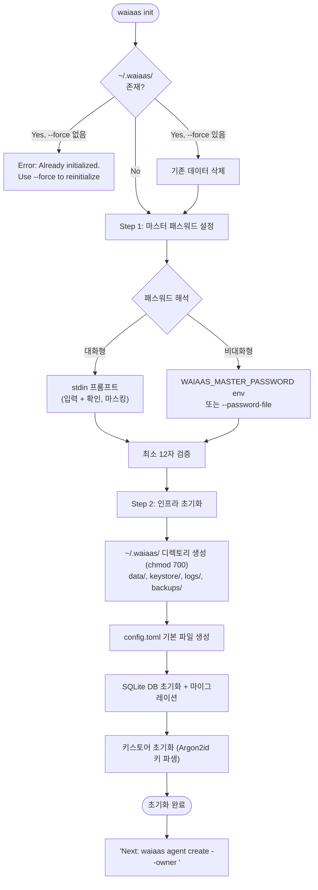

# CLI 플로우 재설계 (CLI-REDESIGN)

**문서 ID:** CLI-REDESIGN
**작성일:** 2026-02-07
**상태:** 완료
**참조:** CORE-05 (28-daemon-lifecycle-cli.md), AUTH-REDESIGN (52-auth-model-redesign.md), SESS-RENEW (53-session-renewal-protocol.md), CORE-01 (24-monorepo-data-directory.md), API-SPEC (37-rest-api-complete-spec.md)
**요구사항:** DX-01, DX-02, DX-03, DX-04, DX-05

---

## 1. 개요

### 1.1 목적

WAIaaS v0.5 CLI 플로우 재설계를 정의한다. v0.2의 `waiaas init` 4단계를 v0.5의 2단계로 간소화하고, `waiaas agent create --owner`, `waiaas session create`, `--quickstart`, `--dev` 모드를 신규 정의한다. 이 문서는 DX-01~DX-05 5개 요구사항을 단일 SSoT에서 해결한다.

### 1.2 요구사항 매핑

| 요구사항 | 설명 | 충족 섹션 |
|---------|------|-----------|
| DX-01 | `waiaas init` 순수 인프라 초기화 (에이전트/Owner 제거) | 섹션 2 |
| DX-02 | `waiaas agent create --owner <addr>` (Owner 주소 필수, 서명 불필요) | 섹션 3 |
| DX-03 | `waiaas session create` masterAuth(implicit) 기반 | 섹션 4 |
| DX-04 | `--quickstart` 4단계 오케스트레이션 | 섹션 6 |
| DX-05 | `--dev` 모드 고정 패스워드 + 보안 경고 | 섹션 7 |

### 1.3 참조 문서

| 문서 ID | 파일 | 핵심 내용 |
|---------|------|-----------|
| CORE-05 | 28-daemon-lifecycle-cli.md | v0.2 CLI 플로우 (init 4단계, start/stop/status), parseArgs 패턴, Exit Code |
| AUTH-REDESIGN | 52-auth-model-redesign.md | masterAuth implicit/explicit, agents.owner_address NOT NULL, authRouter |
| SESS-RENEW | 53-session-renewal-protocol.md | 세션 갱신 API, 토큰 회전, 5종 안전 장치 |
| CORE-01 | 24-monorepo-data-directory.md | config.toml 스펙, 데이터 디렉토리 구조 (~/.waiaas/) |
| API-SPEC | 37-rest-api-complete-spec.md | 31 엔드포인트 스펙, 에러 코드 체계, 인증 맵 |

### 1.4 v0.2 -> v0.5 변경 요약

| 영역 | v0.2 (CORE-05) | v0.5 (이 문서) | 변경 근거 |
|------|----------------|---------------|-----------|
| init | 4단계 (PW + Agent + Noti + Owner) | 2단계 (PW + Infra) | DX-01: 관심사 분리. init은 인프라만 담당 |
| 에이전트 생성 | init 내 선택적 (Step 2) | `agent create --owner <addr>` 별도 커맨드 | DX-02: agents.owner_address NOT NULL 필수화 |
| 세션 생성 | CLI에서 직접 커맨드 없음 (API 호출만) | `session create` CLI 커맨드 신규 | DX-03: masterAuth(implicit)로 간소화 |
| 빠른 시작 | 없음 | `init --quickstart` 4단계 오케스트레이션 | DX-04: 단일 커맨드로 토큰 발급까지 완료 |
| 개발 모드 | 없음 | `start --dev` 고정 패스워드 | DX-05: 프롬프트 없이 즉시 시작 |

### 1.5 v0.2 CLI와의 관계

이 문서는 28-daemon-lifecycle-cli.md(CORE-05)의 v0.2 CLI 플로우를 **대체(supersede)** 한다. v0.2의 `init`, `start`, `stop`, `status`, `agent`, `backup` 커맨드 중 `init`의 플로우가 근본적으로 변경되고, `start`에 `--dev` 플래그가 추가되며, `agent create`, `session create` 커맨드가 신규 정의된다. `stop`, `status`, `backup`은 v0.2와 동일하다.

**공존 규칙:**
- 28-daemon-lifecycle-cli.md의 섹션 1~5 (데몬 아키텍처, 시작/종료 시퀀스, 시그널 처리, PID 관리)는 v0.5에서도 유효
- 28-daemon-lifecycle-cli.md의 섹션 6 (CLI 커맨드 상세)는 이 문서가 대체
- 충돌 시 이 문서(54)가 우선

---

## 2. waiaas init 재설계 (DX-01)

### 2.1 설계 원칙

`waiaas init`은 **순수 인프라 초기화**만 수행한다. 에이전트 생성, 알림 채널 설정, Owner 지갑 등록은 init의 책임이 아니다.

**v0.2 init 4단계 (제거 대상):**

| 단계 | v0.2 | v0.5 | 변경 |
|------|------|------|------|
| Step 1 | 마스터 패스워드 설정 | 마스터 패스워드 설정 | 유지 |
| Step 2 | 첫 에이전트 생성 (선택) | **제거** | `agent create`로 분리 |
| Step 3 | 알림 채널 설정 (선택) | **제거** | API/config.toml으로 설정 |
| Step 4 | Owner 지갑 등록 (선택) | **제거** | `agent create --owner`에 통합 |

**근거:** v0.5에서 agents.owner_address가 NOT NULL이므로, init 시점에 Owner 주소 없이 에이전트를 생성할 수 없다. init과 에이전트 생성의 관심사를 분리하면 각 커맨드의 책임이 명확해진다.

### 2.2 v0.5 init 플로우 (2단계)



**핵심:** init 완료 후 에이전트는 0개 상태. 다음 단계로 `waiaas agent create --owner <addr>`를 안내한다.

### 2.3 대화형 모드 출력 예시

```
$ waiaas init

  WAIaaS v0.5.0 - Initial Setup
  -----------------------------

  Step 1/2: Master Password
  Set a master password to protect your agent keys.
  This password will be required every time the daemon starts.

  Master password (min 12 chars): ****************
  Confirm password: ****************

  Step 2/2: Infrastructure Setup
  Creating data directory... OK
  Generating config.toml... OK
  Initializing database... OK (7 tables, migration v5)
  Setting up keystore... OK (Argon2id, ~2s)

  -----------------------------
  WAIaaS initialized successfully!

  Data directory: ~/.waiaas/
  Config file:    ~/.waiaas/config.toml
  Database:       ~/.waiaas/data/waiaas.db
  Keystore:       ~/.waiaas/keystore/

  Next steps:
    waiaas agent create --owner <owner-address>   Create your first agent
    waiaas start                                  Start the daemon
```

### 2.4 비대화형 모드 예시

```bash
# 환경변수로 패스워드 전달
export WAIAAS_MASTER_PASSWORD="my-secure-password-123"
waiaas init --non-interactive

# 파일로 패스워드 전달
waiaas init --non-interactive --password-file /secrets/master.pwd

# 커스텀 데이터 디렉토리
waiaas init --non-interactive --data-dir /opt/waiaas/data
```

### 2.5 init 옵션 테이블

| 옵션 | Short | 타입 | 필수 | 기본값 | 설명 |
|------|-------|------|------|--------|------|
| `--data-dir <path>` | - | string | X | `~/.waiaas` | 데이터 디렉토리 경로 |
| `--non-interactive` | - | boolean | X | `false` | 비대화형 모드 (CI/자동화) |
| `--password-env <var>` | - | string | X | `WAIAAS_MASTER_PASSWORD` | 패스워드 환경변수 이름 |
| `--password-file <path>` | - | string | X | - | 패스워드 파일 경로 (파일 첫 줄, mode 0o600 권장) |
| `--force` | - | boolean | X | `false` | 기존 초기화 덮어쓰기 (데이터 삭제!) |
| `--quickstart` | - | boolean | X | `false` | 4단계 통합 플로우 (섹션 6 참조) |
| `-h, --help` | `-h` | boolean | X | - | 도움말 |

### 2.6 패스워드 해석 우선순위

28-daemon-lifecycle-cli.md 섹션 2.2 Step 3에서 정의한 우선순위를 그대로 따른다:

```
1. 환경변수: process.env[passwordEnvName] (기본: WAIAAS_MASTER_PASSWORD)
2. 파일: --password-file로 지정된 경로의 첫 줄
3. stdin: 대화형 프롬프트 (--non-interactive가 아닌 경우)
```

| 우선순위 | 소스 | 적용 상황 | 보안 고려사항 |
|---------|------|----------|-------------|
| 1 (최우선) | 환경변수 | CI/CD, Docker, 스크립트 | 프로세스 환경에 노출. docker secrets와 함께 사용 권장. |
| 2 | 파일 | 자동화, systemd, --daemon | mode 0o600 필수. tmpfs 또는 암호화 디스크 권장. |
| 3 (기본) | stdin | 대화형 CLI 사용 | 가장 안전. 터미널 히스토리에 기록되지 않음. |

### 2.7 에러 처리

| 상황 | 에러 메시지 | Exit Code |
|------|-----------|-----------|
| 이미 초기화됨 | `Error: Already initialized at ~/.waiaas/. Use --force to reinitialize.` | 1 |
| 비대화형 + 패스워드 미제공 | `Error: Master password not provided. Set WAIAAS_MASTER_PASSWORD or use --password-file.` | 1 |
| 패스워드 12자 미만 | `Error: Master password too short (minimum 12 characters, got N).` | 1 |
| 패스워드 불일치 (대화형) | `Error: Passwords do not match.` | 1 |
| 디스크 공간 부족 | `Error: Not enough disk space to initialize data directory.` | 1 |
| 디렉토리 권한 오류 | `Error: Cannot create data directory at <path>. Permission denied.` | 1 |

### 2.8 v0.2 대비 제거된 단계 명시

다음 기능은 v0.5 init에서 **의도적으로 제거**되었다:

| v0.2 기능 | v0.5 대안 | 제거 근거 |
|----------|----------|----------|
| Step 2: 첫 에이전트 생성 (선택) | `waiaas agent create --owner <addr>` | agents.owner_address NOT NULL 필수. init 시점에 Owner 주소를 모를 수 있음. |
| Step 3: 알림 채널 설정 (선택) | `PUT /v1/owner/settings` API 또는 config.toml 직접 편집 | 알림 설정은 데몬 시작 후 언제든 가능. init에서 강제할 필요 없음. |
| Step 4: Owner 지갑 등록 (선택) | `waiaas agent create --owner <addr>` | Owner 주소는 에이전트별 속성(agents.owner_address)으로 이동. 글로벌 등록 개념 폐기. |

### 2.9 구현 수도코드

```typescript
// packages/cli/src/commands/init.ts (v0.5)
async function runInit(args: string[]): Promise<void> {
  const options = parseInitOptions(args)

  // --quickstart 플래그 처리 (섹션 6)
  if (options.quickstart) {
    return runQuickstart(options)
  }

  const dataDir = resolveDataDir(options.dataDir)

  // 기존 초기화 확인
  if (existsSync(dataDir) && !options.force) {
    console.error(`Error: Already initialized at ${dataDir}`)
    console.error("Use 'waiaas init --force' to reinitialize (WARNING: all data will be deleted)")
    process.exit(1)
  }

  // --force 시 기존 데이터 삭제
  if (options.force && existsSync(dataDir)) {
    rmSync(dataDir, { recursive: true })
    console.log(`Removed existing data directory: ${dataDir}`)
  }

  // === Step 1: 마스터 패스워드 설정 ===
  const password = await resolveInitPassword(options)
  validatePasswordStrength(password) // 최소 12자

  // === Step 2: 인프라 초기화 ===
  // 2-1. 디렉토리 생성
  mkdirSync(dataDir, { mode: 0o700, recursive: true })
  mkdirSync(join(dataDir, 'data'), { mode: 0o700 })
  mkdirSync(join(dataDir, 'keystore'), { mode: 0o700 })
  mkdirSync(join(dataDir, 'logs'), { mode: 0o700 })
  mkdirSync(join(dataDir, 'backups'), { mode: 0o700 })

  // 2-2. config.toml 기본 파일 생성
  writeFileSync(join(dataDir, 'config.toml'), DEFAULT_CONFIG_TOML, { mode: 0o600 })

  // 2-3. SQLite DB 초기화 + 마이그레이션
  const sqlite = new Database(join(dataDir, 'data', 'waiaas.db'))
  applyPragmas(sqlite)
  const db = drizzle({ client: sqlite })
  await migrate(db, { migrationsFolder: getMigrationsPath() })

  // 2-4. 키스토어 초기화 (마스터 패스워드 해시 저장)
  const keyStore = new LocalKeyStore(dataDir, db)
  await keyStore.initialize(password)

  // 에이전트 생성 없음 -- DX-01: init은 순수 인프라만
  sqlite.close()

  // 안내 메시지
  console.log('WAIaaS initialized successfully!')
  console.log('')
  console.log('Next steps:')
  console.log('  waiaas agent create --owner <owner-address>   Create your first agent')
  console.log('  waiaas start                                  Start the daemon')
}
```

---

## 3. waiaas agent create --owner (DX-02)

### 3.1 설계 원칙

에이전트 생성은 **데몬이 실행 중인 상태**에서 API를 호출하여 수행한다. `--owner` 옵션으로 Owner 주소를 필수 지정하며, SIWS/SIWE 서명은 불필요하다 (masterAuth implicit 범위).

**핵심 변경:**
- v0.2: init 내 선택적 에이전트 생성 (Owner 주소 선택)
- v0.5: `agent create --owner` 별도 커맨드 (Owner 주소 필수, NOT NULL)

### 3.2 커맨드 인터페이스

```
waiaas agent create [options]

Required:
  --owner <address>        Owner 지갑 주소 (Solana base58 또는 EVM 0x)

Options:
  --name <string>          에이전트 이름 (기본: 자동 생성, e.g. "agent-01")
  --chain <string>         블록체인 (solana / ethereum, 기본: solana)
  --network <string>       네트워크 (mainnet-beta / devnet / testnet / sepolia 등, 기본: devnet)
  --data-dir <path>        데이터 디렉토리
  -h, --help               도움말
```

### 3.3 동작 설명

```
waiaas agent create --owner <addr>
  1. 데몬 실행 확인 (http://127.0.0.1:3100/health)
  2. POST /v1/agents 호출 (masterAuth implicit -- 추가 헤더 불필요)
     Body: { name, chain, network, ownerAddress }
  3. 데몬 내부: 에이전트 키 쌍 생성 -> 키스토어 암호화 저장 -> agents 테이블 INSERT
  4. 응답 출력
```

**인증:** masterAuth(implicit). 데몬이 실행 중 = 마스터 패스워드 인증 완료 상태이므로 추가 인증이 불필요하다. 52-auth-model-redesign.md 섹션 3.1 참조.

**서명 불필요:** Owner 주소는 단순 문자열로 전달된다. SIWS/SIWE 서명으로 소유권을 증명할 필요가 없는 이유는 Self-Hosted 환경에서 `agent create` 커맨드를 실행하는 사람 = 데몬 운영자 = 시스템 관리자이기 때문이다. 운영자가 자신이 관리하는 Owner 주소를 입력하는 것이므로 소유권 증명의 필요성이 없다.

### 3.4 출력 예시

```
$ waiaas agent create --owner 7xKXtg2CW87d97TXJSDpbD5jBkheTqA83TZRuJosgAsU

Agent created successfully!

  ID:       019502a8-7b3c-7d4e-8f5a-1234567890ab
  Name:     agent-01
  Chain:    solana
  Network:  devnet
  Address:  9wB3Lz8n...AgentPublicKey...
  Owner:    7xKXtg2CW87d97TXJSDpbD5jBkheTqA83TZRuJosgAsU

Next steps:
  waiaas session create --agent agent-01   Create a session token
```

**JSON 출력 (--output json):**

```
$ waiaas agent create --owner 7xKXtg... --output json
{
  "id": "019502a8-7b3c-7d4e-8f5a-1234567890ab",
  "name": "agent-01",
  "chain": "solana",
  "network": "devnet",
  "address": "9wB3Lz8n...AgentPublicKey...",
  "ownerAddress": "7xKXtg2CW87d97TXJSDpbD5jBkheTqA83TZRuJosgAsU",
  "createdAt": "2026-02-07T10:30:00.000Z"
}
```

### 3.5 에러 처리

| 상황 | 에러 메시지 | Exit Code |
|------|-----------|-----------|
| `--owner` 미지정 | `Error: --owner <address> is required. Provide the Owner wallet address.` | 1 |
| 데몬 미실행 | `Error: Cannot connect to WAIaaS daemon at 127.0.0.1:3100. Run 'waiaas start' first.` | 1 |
| 유효하지 않은 Owner 주소 | `Error: Invalid owner address format. Expected Solana base58 or EVM 0x address.` | 1 |
| 에이전트 이름 중복 | `Error: Agent name 'trading-bot' already exists. Choose a different name.` | 1 |
| 지원하지 않는 체인 | `Error: Unsupported chain 'bitcoin'. Supported: solana, ethereum.` | 1 |

### 3.6 parseArgs 구현

```typescript
// packages/cli/src/commands/agent.ts
function parseAgentCreateOptions(args: string[]): AgentCreateOptions {
  const { values } = parseArgs({
    args,
    options: {
      owner: { type: 'string' },
      name: { type: 'string' },
      chain: { type: 'string' },
      network: { type: 'string' },
      'data-dir': { type: 'string' },
      output: { type: 'string' },
      help: { type: 'boolean', short: 'h' },
    },
    strict: true,
  })

  if (!values.owner) {
    console.error('Error: --owner <address> is required.')
    console.error('Provide the Owner wallet address (e.g., Solana base58 or EVM 0x).')
    process.exit(1)
  }

  return {
    owner: values.owner,
    name: values.name,
    chain: values.chain ?? 'solana',
    network: values.network ?? 'devnet',
    dataDir: values['data-dir'],
    output: values.output ?? 'text',
  }
}
```

### 3.7 API 호출 구현

```typescript
async function runAgentCreate(args: string[]): Promise<void> {
  const options = parseAgentCreateOptions(args)
  const config = loadCliConfig(options.dataDir)

  // 데몬 연결 확인
  const baseUrl = `http://127.0.0.1:${config.port}`
  try {
    await fetch(`${baseUrl}/health`)
  } catch {
    console.error(`Error: Cannot connect to WAIaaS daemon at 127.0.0.1:${config.port}.`)
    console.error("Run 'waiaas start' first.")
    process.exit(1)
  }

  // POST /v1/agents (masterAuth implicit -- 헤더 불필요)
  const response = await fetch(`${baseUrl}/v1/agents`, {
    method: 'POST',
    headers: { 'Content-Type': 'application/json' },
    body: JSON.stringify({
      name: options.name,
      chain: options.chain,
      network: options.network,
      ownerAddress: options.owner,
    }),
  })

  if (!response.ok) {
    const error = await response.json()
    console.error(`Error: ${error.error?.message ?? 'Unknown error'}`)
    process.exit(1)
  }

  const agent = await response.json()

  if (options.output === 'json') {
    console.log(JSON.stringify(agent, null, 2))
  } else {
    console.log('Agent created successfully!')
    console.log('')
    console.log(`  ID:       ${agent.id}`)
    console.log(`  Name:     ${agent.name}`)
    console.log(`  Chain:    ${agent.chain}`)
    console.log(`  Network:  ${agent.network}`)
    console.log(`  Address:  ${agent.address}`)
    console.log(`  Owner:    ${agent.ownerAddress}`)
    console.log('')
    console.log('Next steps:')
    console.log(`  waiaas session create --agent ${agent.name}   Create a session token`)
  }
}
```

---

## 4. waiaas session create (DX-03)

### 4.1 설계 원칙

세션 생성은 **masterAuth(implicit)**만으로 동작한다. v0.2에서 ownerAuth(SIWS/SIWE 서명)가 필요했던 `POST /v1/sessions`가 v0.5에서 masterAuth(implicit)로 변경되었으므로(52-auth-model-redesign.md 섹션 4.2 #9), CLI에서 추가 인증 없이 세션을 생성할 수 있다.

### 4.2 커맨드 인터페이스

```
waiaas session create [options]

Required:
  --agent <name|id>        대상 에이전트 (이름 또는 UUID)

Options:
  --expires-in <seconds>   만료 시간 (기본: 86400 = 24시간, 최소: 300, 최대: 604800)
  --max-amount <amount>    최대 거래 금액 (e.g., "10.0")
  --max-txs <number>       최대 거래 횟수
  --allowed-ops <ops>      허용 작업 (쉼표 구분, e.g., "transfer,balance")
  --output <format>        출력 형식: token (기본), json, env
  --data-dir <path>        데이터 디렉토리
  -h, --help               도움말
```

### 4.3 동작 설명

```
waiaas session create --agent <name>
  1. 데몬 실행 확인 (http://127.0.0.1:3100/health)
  2. POST /v1/sessions 호출 (masterAuth implicit -- 추가 헤더 불필요)
     Body: { agentId/agentName, expiresIn, constraints }
  3. 데몬 내부: JWT 발급(jose HS256), sessions 테이블 INSERT, token_hash 저장
  4. 응답에서 세션 토큰 추출 -> 지정된 포맷으로 출력
```

**인증:** masterAuth(implicit). 데몬이 실행 중이면 추가 인증 없이 세션 생성이 가능하다. 보안은 세션 제약(constraints)과 정책 엔진(Layer 2)이 담당한다.

### 4.4 출력 포맷

**token (기본) -- 토큰만 출력:**

```
$ waiaas session create --agent my-bot
wai_sess_eyJhbGciOiJIUzI1NiIs...
```

토큰만 stdout에 출력되므로 셸 변수로 직접 캡처 가능:

```bash
TOKEN=$(waiaas session create --agent my-bot)
```

**json -- JSON 객체 출력:**

```
$ waiaas session create --agent my-bot --output json
{
  "sessionId": "019502a8-7b3c-7d4e-8f5a-1234567890ab",
  "token": "wai_sess_eyJhbGciOiJIUzI1NiIs...",
  "agentId": "019502a8-0000-7d4e-8f5a-1234567890ab",
  "agentName": "my-bot",
  "expiresAt": "2026-02-08T10:30:00.000Z",
  "maxRenewals": 30,
  "absoluteExpiresAt": "2026-03-09T10:30:00.000Z",
  "constraints": {
    "maxAmount": null,
    "maxTransactions": null,
    "allowedOperations": ["transfer", "balance"],
    "expiresIn": 86400,
    "maxRenewals": 30,
    "renewalRejectWindow": 3600
  }
}
```

**env -- 환경변수 export 형식:**

```
$ waiaas session create --agent my-bot --output env
export WAIAAS_SESSION_TOKEN="wai_sess_eyJhbGciOiJIUzI1NiIs..."
export WAIAAS_AGENT_ID="019502a8-0000-7d4e-8f5a-1234567890ab"
export WAIAAS_AGENT_NAME="my-bot"
export WAIAAS_SESSION_EXPIRES_AT="2026-02-08T10:30:00.000Z"
```

eval과 함께 사용:

```bash
eval $(waiaas session create --agent my-bot --output env)
echo $WAIAAS_SESSION_TOKEN
```

### 4.5 사용 패턴

**기본 사용:**

```bash
# 세션 생성 + 토큰을 환경변수로 설정
export WAIAAS_SESSION_TOKEN=$(waiaas session create --agent my-bot)

# SDK/MCP에서 사용
npx waiaas-mcp  # WAIAAS_SESSION_TOKEN 환경변수를 자동 인식
```

**제약 조건과 함께:**

```bash
# 최대 10 SOL, 100건 거래, 1시간 만료
waiaas session create \
  --agent my-bot \
  --max-amount 10.0 \
  --max-txs 100 \
  --expires-in 3600 \
  --output token
```

**MCP Claude Desktop 설정용:**

```bash
# JSON 출력으로 상세 정보 확인 후 토큰만 추출
TOKEN=$(waiaas session create --agent my-bot --output token)
echo "Claude Desktop MCP config에 이 토큰을 설정하세요: $TOKEN"
```

**갱신 정보 참조:**

세션 갱신 프로토콜(53-session-renewal-protocol.md)에 따라, 생성된 세션은 에이전트가 `PUT /v1/sessions/:id/renew`로 자율 갱신할 수 있다. `--output json`으로 `maxRenewals`와 `absoluteExpiresAt`를 확인할 수 있다.

### 4.6 에러 처리

| 상황 | 에러 메시지 | Exit Code |
|------|-----------|-----------|
| `--agent` 미지정 | `Error: --agent <name\|id> is required.` | 1 |
| 데몬 미실행 | `Error: Cannot connect to WAIaaS daemon. Run 'waiaas start' first.` | 1 |
| 에이전트 미존재 | `Error: Agent 'my-bot' not found.` | 1 |
| 만료 시간 범위 초과 | `Error: --expires-in must be between 300 (5min) and 604800 (7 days).` | 1 |

### 4.7 parseArgs 구현

```typescript
// packages/cli/src/commands/session.ts
function parseSessionCreateOptions(args: string[]): SessionCreateOptions {
  const { values } = parseArgs({
    args,
    options: {
      agent: { type: 'string' },
      'expires-in': { type: 'string' },
      'max-amount': { type: 'string' },
      'max-txs': { type: 'string' },
      'allowed-ops': { type: 'string' },
      output: { type: 'string' },
      'data-dir': { type: 'string' },
      help: { type: 'boolean', short: 'h' },
    },
    strict: true,
  })

  if (!values.agent) {
    console.error('Error: --agent <name|id> is required.')
    process.exit(1)
  }

  return {
    agent: values.agent,
    expiresIn: values['expires-in'] ? parseInt(values['expires-in'], 10) : undefined,
    maxAmount: values['max-amount'],
    maxTxs: values['max-txs'] ? parseInt(values['max-txs'], 10) : undefined,
    allowedOps: values['allowed-ops']?.split(',').map(s => s.trim()),
    output: (values.output ?? 'token') as 'token' | 'json' | 'env',
    dataDir: values['data-dir'],
  }
}
```

---

## 5. CLI 커맨드 전체 요약표 (v0.5)

### 5.1 전체 커맨드 목록

| 커맨드 | 인증 수준 | 데몬 필요 | v0.5 변경 | 설명 |
|--------|----------|----------|----------|------|
| `waiaas init` | 없음 (로컬) | X | **변경**: 2단계로 간소화 | 데이터 디렉토리 + 키스토어 초기화 |
| `waiaas init --quickstart` | 없음 (로컬) | X | **신규** | init -> start -> agent -> session 통합 |
| `waiaas start` | 마스터 패스워드 (1회) | X | 유지 | 데몬 시작 (foreground/background) |
| `waiaas start --dev` | 없음 (고정 PW) | X | **신규** | 개발 모드 (고정 패스워드 + 보안 경고) |
| `waiaas stop` | 없음 (PID 기반) | O (간접) | 유지 | 데몬 정지 (SIGTERM) |
| `waiaas status` | 없음 (API 호출) | O | 유지 | 데몬 상태 조회 |
| `waiaas agent create` | masterAuth (implicit) | O | **신규**: --owner 필수 | 에이전트 생성 + Owner 등록 |
| `waiaas agent list` | masterAuth (implicit) | O | 유지 | 에이전트 목록 조회 |
| `waiaas agent info <name\|id>` | masterAuth (implicit) | O | 유지 | 에이전트 상세 정보 |
| `waiaas session create` | masterAuth (implicit) | O | **신규**: masterAuth로 변경 | 세션 토큰 발급 |
| `waiaas session list` | masterAuth (implicit) | O | 유지 | 세션 목록 조회 |
| `waiaas session revoke <id>` | masterAuth (implicit) | O | **변경**: ownerAuth -> masterAuth | 세션 폐기 |
| `waiaas owner approve <txId>` | ownerAuth (SIWS/SIWE) | O | 유지 | APPROVAL 거래 승인 |
| `waiaas owner reject <txId>` | masterAuth (implicit) | O | **변경**: ownerAuth -> masterAuth | 거래 거절 |
| `waiaas owner recover` | dualAuth (owner + master) | O | 유지 | Kill Switch 복구 |
| `waiaas backup create` | 없음 (파일 시스템) | X | 유지 | 데이터 백업 생성 |
| `waiaas backup restore <path>` | 없음 (파일 시스템) | X | 유지 | 백업 복원 |

### 5.2 v0.5 변경 요약

| 변경 유형 | 수 | 커맨드 |
|----------|---|--------|
| **신규** | 4 | `init --quickstart`, `start --dev`, `agent create --owner`, `session create` |
| **변경** (인증 다운그레이드) | 2 | `session revoke` (ownerAuth -> masterAuth), `owner reject` (ownerAuth -> masterAuth) |
| **변경** (플로우 변경) | 1 | `init` (4단계 -> 2단계) |
| **유지** | 10 | `start`, `stop`, `status`, `agent list/info`, `session list`, `owner approve/recover`, `backup create/restore` |

### 5.3 인증 수준별 분류

| 인증 수준 | 커맨드 | 보안 근거 |
|----------|--------|----------|
| 없음 | `init`, `start`, `stop`, `status`, `backup` | 로컬 파일 시스템/PID 기반 동작. 데몬 API 미사용 또는 공개 엔드포인트만 사용. |
| masterAuth (implicit) | `agent create/list/info`, `session create/list/revoke`, `owner reject` | 데몬 실행 중 = 마스터 패스워드 인증 완료. localhost 바인딩으로 보호. |
| ownerAuth (SIWS/SIWE) | `owner approve` | 자금 이동 승인. Owner 지갑의 암호학적 서명 필요. 52-auth-model-redesign.md 참조. |
| dualAuth (owner + master) | `owner recover` | Kill Switch 복구. 동결 해제는 가장 높은 인증 수준 요구. |

### 5.4 CLI 진입점 구조 (v0.5 갱신)

```typescript
// packages/cli/src/index.ts (v0.5)
import { parseArgs } from 'node:util'

const { values, positionals } = parseArgs({
  args: process.argv.slice(2),
  options: {
    help: { type: 'boolean', short: 'h' },
    version: { type: 'boolean', short: 'v' },
  },
  allowPositionals: true,
  strict: false,
})

const subcommand = positionals[0]
const subAction = positionals[1] // agent create, session create, etc.

switch (subcommand) {
  case 'init':    return runInit(process.argv.slice(3))
  case 'start':   return runStart(process.argv.slice(3))
  case 'stop':    return runStop(process.argv.slice(3))
  case 'status':  return runStatus(process.argv.slice(3))
  case 'agent':   return runAgent(subAction, process.argv.slice(4))
  case 'session': return runSession(subAction, process.argv.slice(4))
  case 'owner':   return runOwner(subAction, process.argv.slice(4))
  case 'backup':  return runBackup(subAction, process.argv.slice(4))
  default:
    if (values.version) return printVersion()
    if (values.help || !subcommand) return printUsage()
    console.error(`Unknown command: ${subcommand}`)
    process.exit(1)
}
```

**v0.2 대비 변경:**
- `session` 서브커맨드 그룹 신규 추가 (`session create`, `session list`, `session revoke`)
- `owner` 서브커맨드 그룹 신규 추가 (`owner approve`, `owner reject`, `owner recover`)
- `agent` 서브커맨드에 `create` 액션 추가 (기존 `list`, `info`에 더하여)

---

## 6. waiaas init --quickstart (DX-04)

### 6.1 설계 원칙

`--quickstart` 플래그는 `init`부터 세션 토큰 발급까지 **4단계를 단일 커맨드로 오케스트레이션**한다. 개발자가 처음 WAIaaS를 시작할 때 최소 명령어로 동작하는 환경을 얻을 수 있도록 한다.

**4단계 오케스트레이션:**

```
[1/4] init       -- 인프라 초기화 (디렉토리 + DB + 키스토어)
[2/4] start      -- 데몬 시작 (foreground)
[3/4] agent      -- 에이전트 생성 + Owner 등록
[4/4] session    -- 세션 토큰 발급
```

### 6.2 커맨드 인터페이스

```
waiaas init --quickstart [options]

Required (quickstart 모드):
  --owner <address>        Owner 지갑 주소

Options:
  --agent-name <string>    에이전트 이름 (기본: "agent-01")
  --chain <string>         블록체인 (기본: solana)
  --network <string>       네트워크 (기본: devnet)
  --expires-in <seconds>   세션 만료 시간 (기본: 86400)
  --data-dir <path>        데이터 디렉토리
  --password <string>      마스터 패스워드 (미지정 시 자동 생성)
  --password-file <path>   패스워드 파일 경로
  -h, --help               도움말
```

### 6.3 --quickstart 필수 옵션

| 옵션 | 필수 | 기본값 | 설명 |
|------|------|--------|------|
| `--owner <address>` | **필수** | - | Owner 지갑 주소. agents.owner_address NOT NULL이므로 반드시 필요. |
| `--agent-name <string>` | 선택 | `agent-01` | 에이전트 이름 |
| `--chain <string>` | 선택 | `solana` | 블록체인 |
| `--network <string>` | 선택 | `devnet` | 네트워크 |
| `--expires-in <seconds>` | 선택 | `86400` | 세션 만료 시간 (24시간) |

### 6.4 마스터 패스워드 자동 생성

`--quickstart`에서 패스워드를 명시적으로 지정하지 않으면 자동 생성한다.

```typescript
import { randomBytes } from 'node:crypto'

function generateMasterPassword(): string {
  // 24바이트 = 192비트 엔트로피 -> base64url 32자
  return randomBytes(24).toString('base64url')
  // 예: "aB3dE5fG7hJ9kL1mN3pQ5rS7tU9vW1x"
}
```

**패스워드 저장:**

자동 생성된 패스워드는 `~/.waiaas/.master-password` 파일에 저장한다.

```typescript
const passwordPath = join(dataDir, '.master-password')
writeFileSync(passwordPath, password, { mode: 0o600 })
// 파일 권한: 소유자만 읽기/쓰기 (rw-------)
```

| 항목 | 값 |
|------|-----|
| 파일 경로 | `~/.waiaas/.master-password` |
| 파일 권한 | `0o600` (rw-------) |
| 내용 | 패스워드 평문 (1줄) |
| 생성 시점 | `--quickstart` 자동 생성 시에만 |
| 이후 사용 | `waiaas start`에서 `--password-file ~/.waiaas/.master-password`로 참조 |

**보안 고려사항:**
- `.master-password` 파일은 `~/.waiaas/` 디렉토리(mode 0o700) 내에 위치하여 소유자만 접근 가능
- 터미널 히스토리에 패스워드가 남지 않음 (파일 기반)
- 프로덕션에서는 `--quickstart`를 사용하지 않고 대화형 init + 수동 패스워드 설정을 권장

### 6.5 출력 예시

```
$ waiaas init --quickstart \
    --owner 7xKXtg2CW87d97TXJSDpbD5jBkheTqA83TZRuJosgAsU \
    --agent-name my-bot \
    --chain solana \
    --network devnet

  WAIaaS Quickstart
  -----------------

  [1/4] Initializing...
        Data directory: ~/.waiaas/
        Master password: auto-generated
        Saved to: ~/.waiaas/.master-password (chmod 600)
        Database: 7 tables, migration v5
        Keystore: initialized

  [2/4] Starting daemon...
        WAIaaS daemon v0.5.0 ready on 127.0.0.1:3100 (PID: 12345)

  [3/4] Creating agent...
        Name:    my-bot
        Chain:   solana (devnet)
        Address: 9wB3Lz8n...AgentPublicKey...
        Owner:   7xKXtg2CW87d97TXJSDpbD5jBkheTqA83TZRuJosgAsU

  [4/4] Creating session...
        Expires: 2026-02-08T10:30:00.000Z (24h)

  -----------------
  Quickstart complete!

  Session token:
  wai_sess_eyJhbGciOiJIUzI1NiIs...

  Quick copy:
    export WAIAAS_SESSION_TOKEN="wai_sess_eyJhbGciOiJIUzI1NiIs..."

  Master password saved to:
    ~/.waiaas/.master-password

  Next time, start the daemon with:
    waiaas start --password-file ~/.waiaas/.master-password
```

### 6.6 에러 롤백

각 Stage에서 실패 시 이전 Stage에서 생성한 리소스를 정리한다.

```
Stage 1 (init) 실패:
  -> 생성된 디렉토리 삭제 (rmSync recursive)
  -> Exit 1

Stage 2 (start) 실패:
  -> 데몬 프로세스 정리 (이미 종료됨)
  -> 데이터 디렉토리는 유지 (init 성공이므로)
  -> "init succeeded, but daemon failed to start. Run 'waiaas start' manually."
  -> Exit 1

Stage 3 (agent create) 실패:
  -> 데몬 정지 (SIGTERM 전송)
  -> 데이터 디렉토리 유지
  -> "init + start succeeded, but agent creation failed: {error}"
  -> Exit 1

Stage 4 (session create) 실패:
  -> 데몬 정지 (SIGTERM 전송)
  -> 에이전트는 유지 (이미 생성됨)
  -> "Agent created, but session creation failed: {error}"
  -> Exit 1
```

**롤백 원칙:**
- init 실패: 전부 삭제 (아무것도 남기지 않음)
- init 이후 실패: 데이터 디렉토리는 유지 (init은 성공했으므로 수동으로 재시도 가능)
- 부분 성공 상태를 명확히 안내하여 사용자가 수동 복구 가능

### 6.7 비대화형 통합 예시

```bash
# CI/CD에서 완전 비대화형 quickstart
export WAIAAS_MASTER_PASSWORD="test-password-12345"
waiaas init --quickstart \
  --owner 7xKXtg2CW87d97TXJSDpbD5jBkheTqA83TZRuJosgAsU \
  --agent-name ci-bot \
  --chain solana \
  --network devnet

# Docker 환경에서
docker run -d waiaas:latest init --quickstart \
  --owner 7xKXtg2CW87d97TXJSDpbD5jBkheTqA83TZRuJosgAsU \
  --non-interactive
```

### 6.8 구현 수도코드

```typescript
async function runQuickstart(options: InitOptions): Promise<void> {
  const dataDir = resolveDataDir(options.dataDir)

  // === Stage 1: init ===
  console.log('  [1/4] Initializing...')
  try {
    // 패스워드 해석: 명시적 > 환경변수 > 자동 생성
    let password: string
    let passwordAutoGenerated = false
    if (options.password) {
      password = options.password
    } else if (process.env.WAIAAS_MASTER_PASSWORD) {
      password = process.env.WAIAAS_MASTER_PASSWORD
    } else {
      password = generateMasterPassword()
      passwordAutoGenerated = true
    }

    validatePasswordStrength(password)

    // 인프라 초기화
    await initializeInfrastructure(dataDir, password)

    // 자동 생성된 패스워드 저장
    if (passwordAutoGenerated) {
      const passwordPath = join(dataDir, '.master-password')
      writeFileSync(passwordPath, password, { mode: 0o600 })
      console.log(`        Master password: auto-generated`)
      console.log(`        Saved to: ${passwordPath} (chmod 600)`)
    }
  } catch (err) {
    // Stage 1 실패: 전체 롤백
    if (existsSync(dataDir)) rmSync(dataDir, { recursive: true })
    console.error(`  [1/4] Failed: ${err.message}`)
    process.exit(1)
  }

  // === Stage 2: start ===
  console.log('  [2/4] Starting daemon...')
  let daemonProcess: ChildProcess
  try {
    daemonProcess = await startDaemonForQuickstart(dataDir, password)
    await waitForDaemonReady(daemonProcess, 15_000) // Argon2id 포함 15초 대기
    console.log(`        WAIaaS daemon ready on 127.0.0.1:${config.port}`)
  } catch (err) {
    console.error(`  [2/4] Failed: ${err.message}`)
    console.error("  Init succeeded. Run 'waiaas start' manually.")
    process.exit(1)
  }

  // === Stage 3: agent create ===
  console.log('  [3/4] Creating agent...')
  let agent: AgentResponse
  try {
    agent = await createAgentViaApi({
      name: options.agentName ?? 'agent-01',
      chain: options.chain ?? 'solana',
      network: options.network ?? 'devnet',
      ownerAddress: options.owner,
    })
    console.log(`        Name:    ${agent.name}`)
    console.log(`        Address: ${agent.address}`)
    console.log(`        Owner:   ${agent.ownerAddress}`)
  } catch (err) {
    await stopDaemonProcess(daemonProcess)
    console.error(`  [3/4] Failed: ${err.message}`)
    process.exit(1)
  }

  // === Stage 4: session create ===
  console.log('  [4/4] Creating session...')
  try {
    const session = await createSessionViaApi({
      agentId: agent.id,
      expiresIn: options.expiresIn ?? 86400,
    })
    console.log(`        Expires: ${session.expiresAt}`)
    console.log('')
    console.log('  Quickstart complete!')
    console.log('')
    console.log('  Session token:')
    console.log(`  ${session.token}`)
    console.log('')
    console.log('  Quick copy:')
    console.log(`    export WAIAAS_SESSION_TOKEN="${session.token}"`)
  } catch (err) {
    await stopDaemonProcess(daemonProcess)
    console.error(`  [4/4] Failed: ${err.message}`)
    console.error('  Agent created. Create session manually after starting daemon.')
    process.exit(1)
  }

  // 데몬은 foreground로 계속 실행됨
}
```

---

## 7. waiaas start --dev (DX-05)

### 7.1 설계 원칙

`--dev` 모드는 **개발/테스트 환경에서 프롬프트 없이 즉시 데몬을 시작**할 수 있도록 한다. 고정 마스터 패스워드를 사용하여 대화형 입력을 제거하고, debug 로그를 자동 활성화한다.

### 7.2 동작 정의

| 항목 | 값 |
|------|-----|
| 고정 패스워드 | `waiaas-dev` (하드코딩) |
| 로그 레벨 | `debug` (자동) |
| 프롬프트 | 없음 (패스워드 입력 건너뜀) |
| 보안 경고 | 3가지 메커니즘 활성화 |

```bash
# 기본 사용
waiaas start --dev

# 커스텀 포트와 함께
waiaas start --dev --port 3200

# 백그라운드 모드와 함께
waiaas start --dev --daemon
```

**내부 동작:** `--dev` 플래그는 다음과 동등하다:

```bash
WAIAAS_MASTER_PASSWORD=waiaas-dev waiaas start --log-level debug
```

단, `--dev`는 추가로 보안 경고 메커니즘 3가지를 활성화한다.

### 7.3 보안 경고 메커니즘 (3가지)

#### 메커니즘 1: 시작 배너

```
$ waiaas start --dev

  ╔══════════════════════════════════════════════════════════╗
  ║  WARNING: DEV MODE - NOT FOR PRODUCTION                 ║
  ║  Master password: "waiaas-dev" (fixed, publicly known)  ║
  ║  All keys are protected with a weak password.           ║
  ╚══════════════════════════════════════════════════════════╝

  WAIaaS daemon v0.5.0 (DEV MODE)
  Validating environment... OK
  Database ready (7 tables, migration v5)
  Unlocking keystore... (Argon2id, ~2s)
  KeyStore unlocked (2 keys loaded)
  solana/devnet adapter ready (latency: 45ms)
  HTTP server listening on 127.0.0.1:3100
  WAIaaS daemon v0.5.0 ready on 127.0.0.1:3100 (PID: 12345) [DEV MODE]
```

Ready 메시지에도 `[DEV MODE]` 접미사를 추가하여 로그 파일에서도 식별 가능하게 한다.

#### 메커니즘 2: X-WAIaaS-Dev-Mode 응답 헤더

`--dev` 모드에서 모든 HTTP 응답에 다음 헤더를 추가한다:

```
X-WAIaaS-Dev-Mode: true
```

```typescript
// dev 모드 미들웨어
if (config.devMode) {
  app.use('*', async (c, next) => {
    await next()
    c.header('X-WAIaaS-Dev-Mode', 'true')
  })
}
```

**용도:**
- SDK/클라이언트가 dev 모드를 감지하여 경고 표시 가능
- 프록시/모니터링 도구에서 dev 모드 트래픽 식별

#### 메커니즘 3: 감사 로그 dev_mode 필드

`--dev` 모드에서 모든 감사 로그 레코드에 `dev_mode: true` 필드를 추가한다.

```typescript
auditLog({
  eventType: 'daemon.started',
  actor: 'system',
  details: {
    version,
    port: config.daemon.port,
    pid: process.pid,
    dev_mode: true,  // --dev 모드 표시
  },
  severity: 'info',
})
```

**용도:**
- 감사 로그 분석 시 dev 모드에서 발생한 이벤트를 필터링
- 프로덕션 로그에 `dev_mode: true`가 발견되면 즉시 경고

### 7.4 config.toml 영구 설정

`--dev` 플래그 외에 config.toml에서도 dev 모드를 영구 설정할 수 있다.

```toml
# config.toml
[daemon]
port = 3100
hostname = "127.0.0.1"
log_level = "info"          # --dev 시 자동으로 "debug" 오버라이드
dev_mode = false             # true로 설정 시 --dev와 동일 효과
```

**우선순위:**

```
--dev 플래그 (최우선) > config.toml [daemon].dev_mode > 기본값 (false)
```

**Zod 스키마:**

```typescript
// packages/core/src/schemas/config.schema.ts (v0.5 추가)
const DaemonConfigSchema = z.object({
  port: z.number().int().min(1024).max(65535).default(3100),
  hostname: z.literal('127.0.0.1'),
  log_level: z.enum(['debug', 'info', 'warn', 'error']).default('info'),
  dev_mode: z.boolean().default(false),  // v0.5 추가
  shutdown_timeout: z.number().int().min(5).max(300).default(30),
})
```

### 7.5 --dev와 --quickstart 조합

`--dev`와 `--quickstart`를 함께 사용하면 가장 빠른 개발 환경 구축이 가능하다:

```bash
waiaas init --quickstart --dev \
  --owner 7xKXtg2CW87d97TXJSDpbD5jBkheTqA83TZRuJosgAsU
```

동작:
1. init: 고정 패스워드 `waiaas-dev`로 인프라 초기화 (자동 생성 대신 고정값)
2. start: `--dev` 모드로 데몬 시작 (보안 경고 3종 활성화)
3. agent create: 에이전트 생성
4. session create: 세션 토큰 발급

`--dev`와 `--quickstart` 조합 시 마스터 패스워드는 항상 `waiaas-dev`이며, `.master-password` 파일은 생성하지 않는다 (고정값이므로 파일 저장 불필요).

### 7.6 --dev 모드 제약

#### --expose와 조합 금지

`--dev`와 `--expose`(향후 구현, 원격 접근 플래그)는 함께 사용할 수 없다:

```
$ waiaas start --dev --expose 0.0.0.0
Error: --dev and --expose cannot be used together.
Dev mode uses a fixed, publicly known password. Exposing the daemon
to non-localhost interfaces would be a critical security vulnerability.

Remove --dev for production/remote use, or remove --expose for local development.
```

**근거:** `--dev`는 공개적으로 알려진 고정 패스워드(`waiaas-dev`)를 사용하므로, 외부 네트워크에 노출하면 누구나 키스토어를 해제할 수 있다.

#### init --force와의 관계

`--dev` 모드에서 init --force를 실행하면 기존 dev 환경을 재초기화한다:

```bash
waiaas init --quickstart --dev --force \
  --owner 7xKXtg2CW87d97TXJSDpbD5jBkheTqA83TZRuJosgAsU
```

### 7.7 구현 수도코드

```typescript
// packages/cli/src/commands/start.ts (v0.5 --dev 추가)
function parseStartOptions(args: string[]): StartOptions {
  const { values } = parseArgs({
    args,
    options: {
      daemon: { type: 'boolean', short: 'd', default: false },
      dev: { type: 'boolean', default: false },  // v0.5 추가
      port: { type: 'string' },
      'data-dir': { type: 'string' },
      'log-level': { type: 'string' },
      'password-env': { type: 'string' },
      'password-file': { type: 'string' },
      expose: { type: 'string' },  // 향후 구현
      help: { type: 'boolean', short: 'h' },
    },
    strict: true,
  })

  // --dev + --expose 조합 금지
  if (values.dev && values.expose) {
    console.error('Error: --dev and --expose cannot be used together.')
    console.error('Dev mode uses a fixed, publicly known password.')
    console.error('Exposing the daemon would be a critical security vulnerability.')
    process.exit(1)
  }

  return {
    daemon: values.daemon ?? false,
    dev: values.dev ?? false,
    port: values.port ? parseInt(values.port, 10) : undefined,
    dataDir: values['data-dir'],
    logLevel: values.dev ? 'debug' : values['log-level'] as LogLevel | undefined,
    passwordEnv: values['password-env'],
    passwordFile: values['password-file'],
  }
}

async function runStart(args: string[]): Promise<void> {
  const options = parseStartOptions(args)

  // --dev 모드: 고정 패스워드 주입
  if (options.dev) {
    process.env.WAIAAS_MASTER_PASSWORD = 'waiaas-dev'

    // 보안 경고 배너
    console.log('')
    console.log('  +------------------------------------------------------+')
    console.log('  |  WARNING: DEV MODE - NOT FOR PRODUCTION              |')
    console.log('  |  Master password: "waiaas-dev" (fixed, public)       |')
    console.log('  |  All keys are protected with a weak password.        |')
    console.log('  +------------------------------------------------------+')
    console.log('')
  }

  // 기존 start 로직 실행
  await startDaemon({
    ...options,
    devMode: options.dev,
  })
}
```

---

## 8. v0.2 -> v0.5 마이그레이션 가이드

### 8.1 변경 영향

| 영역 | 변경 사항 | 영향도 | 조치 필요 |
|------|----------|--------|----------|
| `waiaas init` | 4단계 -> 2단계 | **HIGH** | 기존 init 스크립트 업데이트 |
| 에이전트 생성 | init 내 -> `agent create --owner` | **HIGH** | 에이전트 생성 워크플로우 변경 |
| 세션 생성 | ownerAuth -> masterAuth | **MEDIUM** | CLI에서 서명 프로세스 제거 |
| CLI 커맨드 | 4개 신규, 2개 변경 | **MEDIUM** | 스크립트/자동화 업데이트 |
| config.toml | `dev_mode` 추가 | **LOW** | 기존 설정 파일 호환 (기본값 false) |

### 8.2 마이그레이션 절차

기존 v0.2 환경에서 v0.5로 전환하는 절차를 안내한다.

#### 기존 v0.2 사용자

```bash
# v0.2에서 이미 init + agent 생성이 완료된 경우:

# 1. 데몬 정지
waiaas stop

# 2. v0.5 바이너리로 업데이트
npm install -g @waiaas/cli@0.5.0

# 3. 데몬 재시작 (v0.5)
waiaas start

# 4. 기존 에이전트에 Owner 주소 설정 (v0.5 필수)
#    v0.2에서 Owner 미등록 에이전트가 있으면 v0.5 시작 시 경고
#    PUT /v1/agents/:id API로 ownerAddress 설정
curl -X PUT http://127.0.0.1:3100/v1/agents/<agent-id> \
  -H "Content-Type: application/json" \
  -d '{"ownerAddress": "7xKXtg2CW87d97TXJSDpbD5jBkheTqA83TZRuJosgAsU"}'

# 5. 새 세션 생성 (v0.5 방식 -- masterAuth implicit)
export WAIAAS_SESSION_TOKEN=$(waiaas session create --agent my-bot)
```

#### 신규 v0.5 사용자

```bash
# 가장 빠른 시작 (개발용)
waiaas init --quickstart --dev \
  --owner 7xKXtg2CW87d97TXJSDpbD5jBkheTqA83TZRuJosgAsU

# 프로덕션용
waiaas init
waiaas start
waiaas agent create --owner 7xKXtg2CW87d97TXJSDpbD5jBkheTqA83TZRuJosgAsU
export WAIAAS_SESSION_TOKEN=$(waiaas session create --agent agent-01)
```

### 8.3 DB 마이그레이션

v0.5 데몬 시작 시 Drizzle ORM의 자동 마이그레이션이 실행된다. 52-auth-model-redesign.md에서 정의된 스키마 변경(agents.owner_address NOT NULL, wallet_connections 테이블 등)이 자동으로 적용된다. 수동 DB 조작은 불필요하다.

**주의사항:**
- v0.2에서 owner_address가 NULL인 에이전트가 있으면 마이그레이션 시 경고 (NOT NULL 제약 위반)
- 마이그레이션 전 `waiaas backup create`로 백업 권장
- 마이그레이션은 역방향(v0.5 -> v0.2) 불가. 백업 필수.

### 8.4 주요 삭제 항목

| 삭제된 기능 | v0.5 대안 | 비고 |
|-----------|----------|------|
| `init` Step 2 (에이전트 생성) | `waiaas agent create --owner` | 별도 커맨드로 분리 |
| `init` Step 3 (알림 설정) | API/config.toml | 데몬 시작 후 설정 |
| `init` Step 4 (Owner 등록) | `--owner` 옵션 | 에이전트별 속성으로 변경 |
| 세션 생성 시 ownerAuth | masterAuth (implicit) | 서명 불필요 |
| ownerAuth 적용 대상 15개 엔드포인트 | masterAuth (implicit) | 2곳만 ownerAuth 유지 |

---

## 9. 요구사항 매핑 총괄

| 요구사항 | 설명 | 충족 섹션 | 충족 상태 |
|---------|------|-----------|----------|
| DX-01 | `waiaas init` 순수 인프라 초기화 (에이전트/Owner 제거) | 섹션 2 (2단계 플로우, 제거된 단계 명시, 구현 수도코드) | 완료 |
| DX-02 | `waiaas agent create --owner <addr>` (Owner 필수, 서명 불필요) | 섹션 3 (커맨드 인터페이스, 동작 설명, API 호출 구현) | 완료 |
| DX-03 | `waiaas session create` masterAuth(implicit) 기반 | 섹션 4 (3가지 출력 포맷, 사용 패턴, parseArgs 구현) | 완료 |
| DX-04 | `--quickstart` 4단계 오케스트레이션 | 섹션 6 (init->start->agent->session, 에러 롤백, 패스워드 자동 생성) | 완료 |
| DX-05 | `--dev` 모드 (고정 패스워드 + 보안 경고) | 섹션 7 (3가지 경고 메커니즘, config.toml, --expose 금지) | 완료 |

**5/5 요구사항 완료.**

---

---

## 부록 A: v0.5 설계 문서 통합 검증 체크리스트

Phase 21 완료 후 전체 설계 문서의 v0.5 용어 일관성을 검증하기 위한 체크리스트이다. 6개 핵심 용어별로 관련 문서와 확인 항목을 정리한다.

### A.1 masterAuth (implicit/explicit)

| 상태 | 문서 | 확인 항목 |
|------|------|----------|
| [ ] | 52-auth-model-redesign.md | 정의 SSoT (섹션 3.1): implicit=데몬 구동, explicit=X-Master-Password |
| [ ] | 37-rest-api-complete-spec.md | 31+1 엔드포인트 인증 맵에서 masterAuth 대상 일치 |
| [ ] | 28-daemon-lifecycle-cli.md | CLI 커맨드 인증 수준이 masterAuth(implicit)와 일치 |
| [ ] | 29-api-framework-design.md | authRouter 통합 디스패처 참조 존재 |
| [ ] | 40-telegram-bot-docker.md | Tier 2 인증이 v0.5 모델과 일치 |
| [ ] | 54-cli-flow-redesign.md | session create가 masterAuth(implicit) 전용 |

### A.2 ownerAuth (2곳 한정)

| 상태 | 문서 | 확인 항목 |
|------|------|----------|
| [ ] | 52-auth-model-redesign.md | approve_tx + recover만 ownerAuth 필요 (섹션 4.2) |
| [ ] | 37-rest-api-complete-spec.md | ownerAuth가 정확히 2개 엔드포인트에만 적용 |
| [ ] | 34-owner-wallet-connection.md | WalletConnect가 선택적 편의 기능으로 기술 |
| [ ] | 33-time-lock-approval-mechanism.md | approve는 ownerAuth 유지, reject는 masterAuth 변경 참조 노트 |
| [ ] | 36-killswitch-autostop-evm.md | recover는 ownerAuth 유지, activate는 masterAuth 변경 참조 노트 |

### A.3 agents.owner_address NOT NULL

| 상태 | 문서 | 확인 항목 |
|------|------|----------|
| [ ] | 52-auth-model-redesign.md | agents 테이블 owner_address 컬럼 변경 정의 |
| [ ] | 25-sqlite-schema.md | owner_address NOT NULL 컬럼 추가 (Phase 19 완료) |
| [ ] | 54-cli-flow-redesign.md | agent create --owner 필수 옵션으로 기술 |
| [ ] | 37-rest-api-complete-spec.md | POST /v1/agents에 ownerAddress 필수 필드 |

### A.4 세션 갱신 프로토콜

| 상태 | 문서 | 확인 항목 |
|------|------|----------|
| [ ] | 53-session-renewal-protocol.md | SSoT (8개 섹션): 갱신 플로우, 안전 장치, API 스펙 |
| [ ] | 30-session-token-protocol.md | SessionConstraints 8필드 확장 (Phase 20 완료) |
| [ ] | 25-sqlite-schema.md | sessions 테이블 갱신 컬럼 +4 (Phase 20 완료) |
| [ ] | 37-rest-api-complete-spec.md | PUT /v1/sessions/:id/renew 엔드포인트 (Phase 20 완료) |
| [ ] | 35-notification-architecture.md | SESSION_RENEWED/SESSION_RENEWAL_REJECTED 이벤트 (Phase 20 완료) |
| [ ] | 38-sdk-mcp-interface.md | sessions.renew() (renewSession) 메서드 추가 |

### A.5 hint 필드

| 상태 | 문서 | 확인 항목 |
|------|------|----------|
| [ ] | 55-dx-improvement-spec.md | 정의 SSoT (섹션 2): 40개 에러 중 31개 hint 매핑 |
| [ ] | 29-api-framework-design.md | ErrorResponseSchema에 hint: z.string().optional() 추가 |
| [ ] | 37-rest-api-complete-spec.md | 에러 응답 포맷에 hint 필드 존재 |

### A.6 CLI 플로우 (init / agent create / session create / --quickstart / --dev)

| 상태 | 문서 | 확인 항목 |
|------|------|----------|
| [ ] | 54-cli-flow-redesign.md | SSoT (9개 섹션): init 2단계, agent create, session create, --quickstart, --dev |
| [ ] | 28-daemon-lifecycle-cli.md | v0.5 변경 반영 (섹션 6 CLI 커맨드를 54로 대체) |
| [ ] | 24-monorepo-data-directory.md | dev_mode config + .master-password 파일 설명 |
| [ ] | 39-tauri-desktop-architecture.md | Setup Wizard v0.5 재구성 반영 |

---

**총 검증 대상:** 6개 핵심 용어, 17개 문서 참조 (일부 문서 중복 카운트), 29개 확인 항목.

Phase 21 Plan 03 (21-03) 검증 단계에서 이 체크리스트를 사용하여 문서 간 일관성을 최종 확인한다.

---

*문서 작성: 2026-02-07*
*Phase: 21-dx-improvement, Plan: 01*
*CLI-REDESIGN v1.0*
*부록 A 추가: 2026-02-07 (Plan: 04)*
