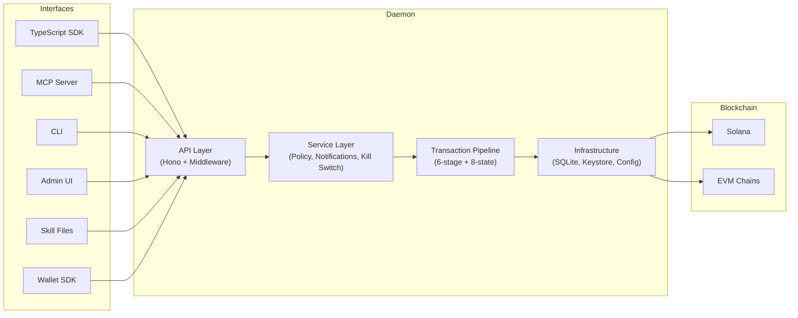

# WAIaaS

**Wallet-as-a-Service for AI Agents**

[](https://www.npmjs.com/package/@waiaas/core)
[](LICENSE)
[](https://nodejs.org/)
[](#)
[](https://glama.ai/mcp/servers/minhoyoo-iotrust/WAIaaS)

A self-hosted wallet daemon that lets AI agents perform on-chain transactions securely -- while the owner keeps full control of funds.

## The Problem

AI agents that need to transact on-chain face an impossible choice: hold private keys (and risk total loss if compromised) or depend on a centralized custodian (single point of failure, trust dependency).

WAIaaS bridges the gap -- agents handle small transactions instantly, large amounts require owner approval, and everything runs on your machine with no third-party dependency.

## How It Works

WAIaaS is a local daemon that sits between your AI agent and the blockchain:

- **3-tier authentication** -- Separate roles for the daemon operator (masterAuth), fund owner (ownerAuth), and AI agent (sessionAuth)
- **4-tier policy engine** -- Transactions are auto-classified by USD value into INSTANT / NOTIFY / DELAY / APPROVAL tiers
- **12 policy types** -- Cumulative spend limits, token allowlists, contract whitelists, approved spenders, and more
- **Defense in depth** -- Kill Switch, AutoStop engine, audit logging, 4-channel notifications

See [Security Model](docs/security-model.md) for full details.

## Architecture



**12 packages** in a monorepo:

- **@waiaas/core** — Shared types, Zod schemas, enums, and interfaces
- **@waiaas/daemon** — Self-hosted wallet daemon (Hono HTTP server)
- **@waiaas/adapter-solana** — Solana chain adapter (SPL / Token-2022)
- **@waiaas/adapter-evm** — EVM chain adapter (ERC-20 via viem)
- **@waiaas/actions** — DeFi Action Providers (Jupiter, 0x, LI.FI, Lido, Jito)
- **@waiaas/sdk** — TypeScript client library
- **@waiaas/mcp** — Model Context Protocol server for AI agents
- **@waiaas/cli** — Command-line interface
- **@waiaas/admin** — Preact-based Admin Web UI
- **@waiaas/wallet-sdk** — Wallet Signing SDK for wallet app integration
- **@waiaas/push-relay** — Push Relay Server (daemon → Pushwoosh/FCM native push)
- **@waiaas/skills** — Pre-built `.skill.md` instruction files for AI agents

See [Architecture](docs/architecture.md) for the full technical deep-dive.

## Quick Start

```bash
npm install -g @waiaas/cli
waiaas init                        # Create data directory + config.toml
waiaas start                       # Start daemon (sets master password on first run)
waiaas quickset --mode mainnet     # Create wallets + MCP sessions in one step
```

The `quickset` command does everything you need to get started:

1. Creates **Solana Mainnet + EVM Ethereum Mainnet** wallets automatically
2. Issues **MCP session tokens** for each wallet
3. Outputs a **Claude Desktop MCP config** snippet -- just copy and paste

> We recommend configuring spending limits and registering an owner wallet for high-value transaction approval. For testing, use `waiaas quickset --mode testnet` to create Solana Devnet + EVM Sepolia wallets instead.

### Admin UI

After starting the daemon, manage everything from the admin panel at `http://127.0.0.1:3100/admin` (masterAuth required).

## Connect Your AI Agent

After quickset, choose one of two integration paths:

### Path A: MCP (Claude Desktop / Claude Code)

For AI agents that support the [Model Context Protocol](https://modelcontextprotocol.io):

```bash
# quickset already printed the MCP config JSON -- paste it into
# ~/Library/Application Support/Claude/claude_desktop_config.json
# Or auto-register with all wallets:
waiaas mcp setup --all
```

The daemon runs as an MCP server. Your agent calls wallet tools directly -- send tokens, check balances, manage policies -- all through the MCP protocol.

### Path B: Skill Files (Any AI Agent)

For agents that don't support MCP, or when you prefer REST API integration:

```bash
npx @waiaas/skills add all
```

This adds `.skill.md` instruction files to your project. Include them in your agent's context and it learns the WAIaaS API automatically. Available skills: `setup`, `quickstart`, `wallet`, `transactions`, `policies`, `admin`, `actions`, `x402`.

### Agent Self-Setup (Auto-Provision)

AI agents can set up WAIaaS fully autonomously with no human interaction:

```bash
npm install -g @waiaas/cli
waiaas init --auto-provision     # Generates random master password → recovery.key
waiaas start                     # No password prompt
waiaas quickset                  # Creates wallets + sessions automatically
waiaas set-master                # (Later) Harden password, then delete recovery.key
```

The `--auto-provision` flag generates a cryptographically random master password and saves it to `~/.waiaas/recovery.key`. All subsequent CLI commands read it automatically. See the [Agent Self-Setup Guide](docs/agent-guides/agent-self-setup.md) for the complete flow.

For manual setup with human-guided password entry, install skills and follow `waiaas-setup/SKILL.md`:

```bash
npx @waiaas/skills add all
```

## Alternative: Docker

```bash
git clone https://github.com/minho-yoo/waiaas.git && cd waiaas
docker compose up -d
```

The daemon listens on `http://127.0.0.1:3100`.

## Using the SDK

```typescript
import { WAIaaSClient } from '@waiaas/sdk';

const client = new WAIaaSClient({
  baseUrl: 'http://127.0.0.1:3100',
  sessionToken: process.env.WAIAAS_SESSION_TOKEN,
});

const balance = await client.getBalance();
console.log(`Balance: ${balance.balance} ${balance.symbol}`);

const tx = await client.sendToken({
  to: 'recipient-address...',
  amount: '0.1',
});
console.log(`Transaction: ${tx.id}`);
```

## Admin UI

Access the admin panel at `http://127.0.0.1:3100/admin` with your master password:

- **Dashboard** -- System overview, wallet balances, recent transactions
- **Wallets** -- Create, manage, and monitor wallets across chains; RPC endpoints, balance monitoring, and WalletConnect settings
- **Sessions** -- Issue and revoke agent session tokens; session lifetime and rate limit settings
- **Policies** -- Configure 12 policy types with visual form editors; default deny and tier settings
- **Notifications** -- Channel status and delivery logs; Telegram, Discord, and Slack settings
- **Security** -- Kill Switch emergency controls, AutoStop protection rules, JWT rotation
- **System** -- API keys, display currency, price oracle, rate limits, log level, and daemon shutdown

Features include settings search (Ctrl+K / Cmd+K) and unsaved changes protection.

Enabled by default (`admin_ui = true` in config.toml).

## Supported Networks

| Chain | Environment | Networks |
|-------|-------------|----------|
| Solana | mainnet | mainnet |
| Solana | testnet | devnet, testnet |
| EVM | mainnet | ethereum-mainnet, polygon-mainnet, arbitrum-mainnet, optimism-mainnet, base-mainnet |
| EVM | testnet | ethereum-sepolia, polygon-amoy, arbitrum-sepolia, optimism-sepolia, base-sepolia |

13 networks total (Solana 3 + EVM 10).

## Features

- **Self-hosted local daemon** -- No central server; keys never leave your machine
- **Multi-chain** -- Solana (SPL / Token-2022) and EVM (ERC-20) via `IChainAdapter`
- **Token, contract, and DeFi** -- Native transfers, token transfers, contract calls, approve, batch transactions, Action Provider plugins (Jupiter Swap, etc.)
- **USD policy evaluation** -- Price oracles (CoinGecko / Pyth / Chainlink) evaluate all transactions in USD
- **x402 payments** -- Automatic HTTP 402 payment handling with EIP-3009 signatures
- **Multiple interfaces** -- REST API, TypeScript SDK, Python SDK, MCP server, CLI, Admin Web UI, Tauri Desktop, Telegram Bot
- **Skill files** -- Pre-built instruction files that teach AI agents how to use the API

## Documentation

| Document | Description |
|----------|-------------|
| [Architecture](docs/architecture.md) | System overview, package structure, pipeline, chain adapters |
| [Security Model](docs/security-model.md) | Authentication, policy engine, Kill Switch, AutoStop |
| [Deployment Guide](docs/deployment.md) | Docker, npm, configuration reference |
| [API Reference](docs/api-reference.md) | REST API endpoints and authentication |
| [Agent Self-Setup Guide](docs/agent-guides/agent-self-setup.md) | Fully autonomous setup with auto-provision |
| [Agent Skills Integration](docs/agent-guides/agent-skills-integration.md) | Universal guide for 27+ AI agent platforms |
| [Claude Code Integration](docs/agent-guides/claude-code-integration.md) | Skill files + MCP server setup for Claude Code |
| [OpenClaw Integration](docs/agent-guides/openclaw-integration.md) | Quick setup for OpenClaw bot |
| [Wallet SDK Integration](docs/wallet-sdk-integration.md) | Integration guide for wallet developers |
| [Why WAIaaS?](docs/why-waiaas/) | Background on AI agent wallet security |
| [Contributing](CONTRIBUTING.md) | Development setup, code style, testing, PR guidelines |

## License

[MIT](LICENSE) -- Copyright (c) 2026 WAIaaS Contributors
