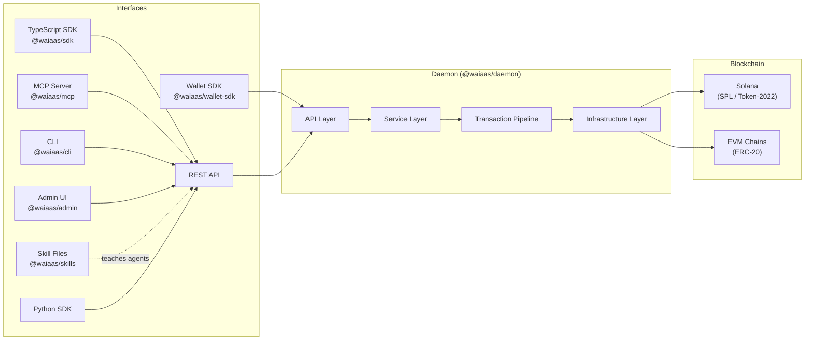
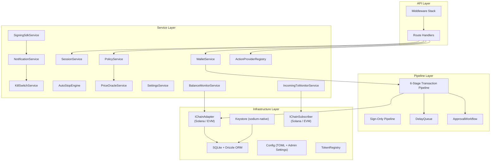
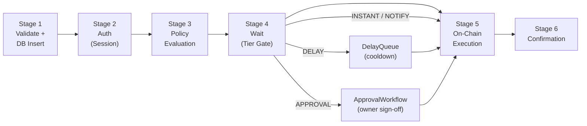
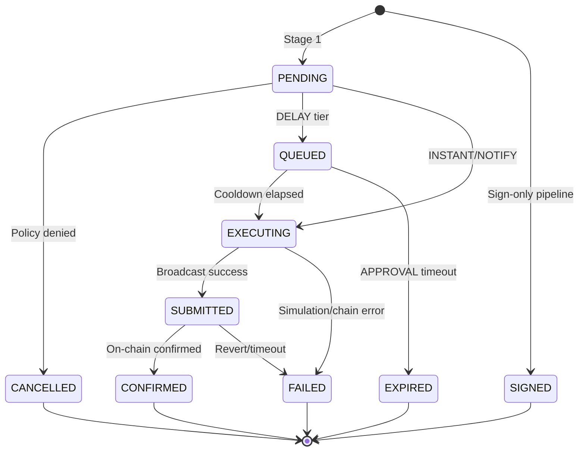
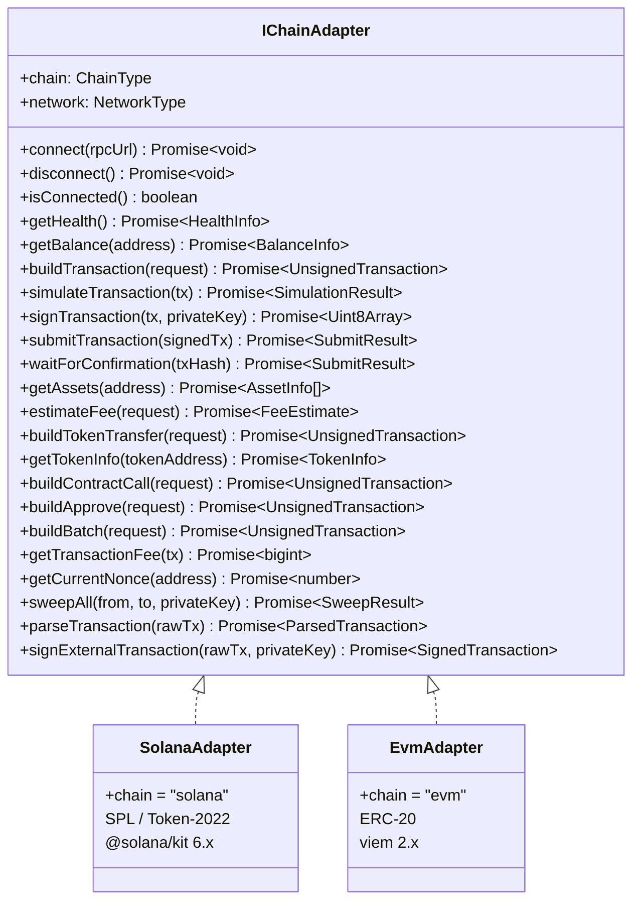
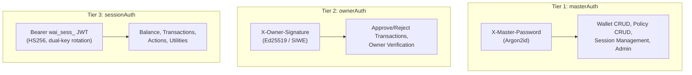
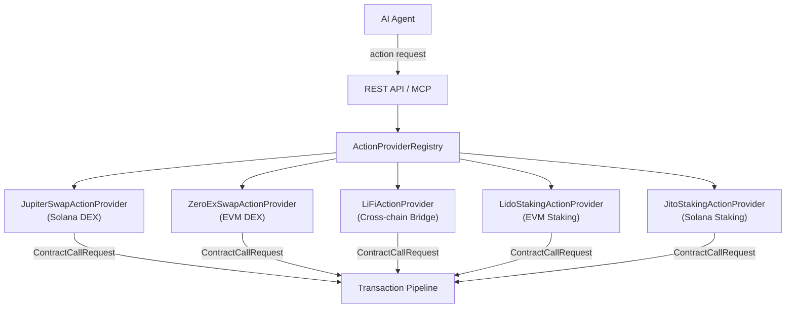
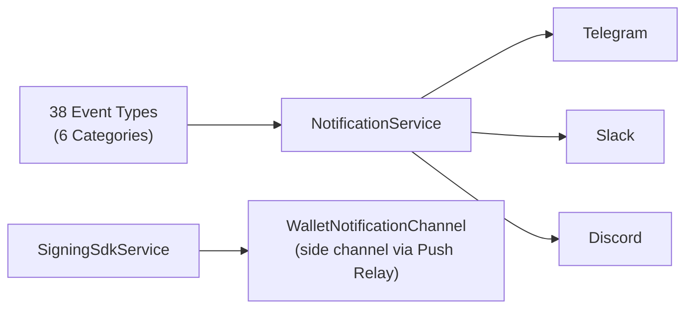
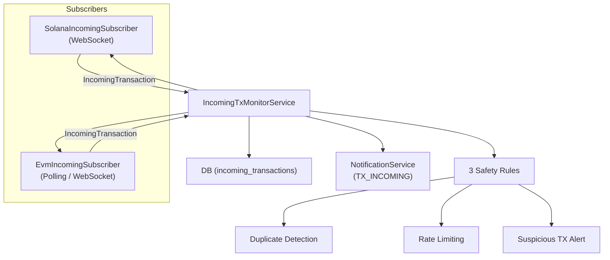

# Architecture

WAIaaS is a self-hosted wallet daemon that sits between AI agents and blockchains. This document describes the internal architecture, component interactions, and key design decisions.

## System Overview



## Monorepo Packages

The project is organized as a monorepo with 12 npm packages plus a Python SDK:

| Package | Description | Public |
|---------|-------------|--------|
| `@waiaas/core` | Shared types, Zod schemas, enums, and interfaces | Yes |
| `@waiaas/daemon` | Self-hosted wallet daemon (Hono HTTP server) | Yes |
| `@waiaas/adapter-solana` | Solana chain adapter — SPL / Token-2022 | Yes |
| `@waiaas/adapter-evm` | EVM chain adapter — Ethereum / ERC-20 via viem | Yes |
| `@waiaas/actions` | Built-in DeFi Action Providers (Jupiter, 0x, LI.FI, Lido, Jito) | Yes |
| `@waiaas/sdk` | TypeScript client library for the daemon API | Yes |
| `@waiaas/mcp` | Model Context Protocol server for AI agents | Yes |
| `@waiaas/cli` | Command-line interface for daemon management | Yes |
| `@waiaas/admin` | Preact-based Admin Web UI (bundled into daemon) | Yes |
| `@waiaas/wallet-sdk` | Wallet Signing SDK for wallet app integration | Yes |
| `@waiaas/push-relay` | Push Relay Server — bridges daemon to push services (Pushwoosh/FCM) | Yes |
| `@waiaas/skills` | Pre-built `.skill.md` instruction files for AI agents | Yes |
| `waiaas-sdk` (Python) | Python client library for the daemon API | Yes |

## Daemon Internal Architecture

The daemon follows a layered architecture:



### Middleware Stack

Global middleware applied to all routes (in order):

| # | Middleware | Purpose |
|---|-----------|---------|
| 1 | `requestId` | Assigns `X-Request-Id` to every request |
| 2 | `hostGuard` | Blocks non-localhost requests |
| 3 | `killSwitchGuard` | Rejects all traffic when Kill Switch is SUSPENDED/LOCKED |
| 4 | `requestLogger` | Structured request/response logging |
| 5 | `cspMiddleware` | Strict CSP headers for `/admin/*` routes |
| 6 | `errorHandler` | Global error handler converting errors to JSON |

Route-level auth middleware:

| Middleware | Header | Protects |
|-----------|--------|----------|
| `masterAuth` | `X-Master-Password` | Admin operations (wallet/policy/session CRUD) |
| `sessionAuth` | `Authorization: Bearer wai_sess_<JWT>` | Agent operations (transactions, balance, actions) |
| `ownerAuth` | `X-Owner-Signature` + `X-Owner-Message` + `X-Owner-Address` | Owner-only actions (approve/reject transactions) |

## Transaction Pipeline

The core transaction flow is a 6-stage sequential pipeline:



### Stage 5 Detail: On-Chain Execution

Stage 5 has four sub-stages with retry logic:

| Sub-stage | Operation | Retry |
|-----------|-----------|-------|
| 5a | `buildByType()` — builds unsigned transaction | STALE: rebuild with fresh blockhash/nonce (1 retry) |
| 5b | `simulateTransaction()` — dry-run validation | — |
| 5c | `signTransaction()` — decrypt key + sign | — |
| 5d | `submitTransaction()` — broadcast to network | TRANSIENT: exponential backoff 1s/2s/4s (3 retries) |

Errors are classified as `PERMANENT` (immediate fail), `TRANSIENT` (retry with backoff), or `STALE` (rebuild from 5a).

### Transaction State Machine

Transactions progress through 11 possible states:



### Transaction Types

7 types via `discriminatedUnion` on the `type` field:

| Type | Description |
|------|-------------|
| `TRANSFER` | Native token transfer (SOL, ETH) |
| `TOKEN_TRANSFER` | SPL / ERC-20 token transfer |
| `CONTRACT_CALL` | Smart contract interaction |
| `APPROVE` | Token approval (delegate spending) |
| `BATCH` | Multi-instruction batch (Solana only) |
| `SIGN` | Sign-only external transaction |
| `X402_PAYMENT` | x402 micropayment protocol |

## Chain Adapter Abstraction

All blockchain interactions go through the `IChainAdapter` interface (22 methods):



## Authentication Model

WAIaaS uses a 3-tier authentication model:



| Tier | Who | Credential | Verification | Scope |
|------|-----|-----------|--------------|-------|
| masterAuth | Daemon operator | `X-Master-Password` header | Argon2id hash comparison | Admin: wallet/policy/session CRUD |
| ownerAuth | Fund owner | Wallet signature headers | Ed25519 (Solana) / SIWE (EVM) | Approve/reject, owner verify |
| sessionAuth | AI agent | `Bearer wai_sess_<JWT>` | JWT HS256 + DB session lookup | Transactions, balance, actions |

### Owner 3-State Model

The owner registration follows a 3-state progression:

| State | Description | APPROVAL Tier Behavior |
|-------|-------------|----------------------|
| `NONE` | No owner registered | Downgrades to DELAY |
| `GRACE` | Owner registered, unverified | Downgrades to DELAY |
| `LOCKED` | Owner verified | Full APPROVAL enforcement |

### Approval Methods

5 methods for owner approval of high-value transactions:

`sdk_push_relay` · `sdk_telegram` · `walletconnect` · `telegram_bot` · `rest`

## Policy Engine

The policy engine evaluates every transaction against configured policies before execution.

### 4-Tier USD Classification

Transactions are classified by USD value into policy tiers:

| Tier | Behavior |
|------|----------|
| `INSTANT` | Execute immediately |
| `NOTIFY` | Execute immediately, notify owner |
| `DELAY` | Hold in queue for cooldown period |
| `APPROVAL` | Require explicit owner approval |

### 12 Policy Types

| Policy Type | Description |
|-------------|-------------|
| `SPENDING_LIMIT` | 4-tier USD thresholds + cumulative daily/monthly limits |
| `WHITELIST` | Permitted destination addresses |
| `TIME_RESTRICTION` | Allowed hours and days of week |
| `RATE_LIMIT` | Max requests per time window |
| `ALLOWED_TOKENS` | Permitted token mint/contract addresses |
| `CONTRACT_WHITELIST` | Permitted contract addresses (default-deny) |
| `METHOD_WHITELIST` | Allowed contract method selectors per contract |
| `APPROVED_SPENDERS` | Permitted spender addresses for approvals |
| `APPROVE_AMOUNT_LIMIT` | Max approve amount + blockUnlimited flag |
| `APPROVE_TIER_OVERRIDE` | Force specific tier for approve transactions |
| `ALLOWED_NETWORKS` | Permitted networks for wallet transactions |
| `X402_ALLOWED_DOMAINS` | Permitted domains for x402 micropayments |

## DeFi Action Providers

DeFi operations are implemented as pluggable Action Providers via the `IActionProvider` interface:



Each provider implements `IActionProvider`:

```typescript
interface IActionProvider {
  readonly metadata: ActionProviderMetadata;
  readonly actions: readonly ActionDefinition[];
  resolve(actionName, params, context): Promise<ContractCallRequest | ContractCallRequest[]>;
}
```

Providers return `ContractCallRequest` objects — they never sign or submit directly. The result is re-validated by the registry before entering the standard transaction pipeline.

| Provider | Chain | External Service | Description |
|----------|-------|------------------|-------------|
| `JupiterSwapActionProvider` | Solana | Jupiter v6 API | DEX aggregator swap |
| `ZeroExSwapActionProvider` | EVM | 0x Swap API | EVM DEX aggregator swap |
| `LiFiActionProvider` | Cross-chain | LI.FI API | Cross-chain bridge + swap |
| `LidoStakingActionProvider` | EVM | Lido (on-chain) | stETH staking + withdrawal queue |
| `JitoStakingActionProvider` | Solana | Jito (on-chain) | JitoSOL SPL Stake Pool staking |

All providers are toggleable via Admin Settings (`actions.{name}_enabled`).

## Notification System

Notifications are delivered through 3 primary channels plus 1 side channel:



### Event Categories

| Category | Example Events |
|----------|---------------|
| `transaction` | TX_CONFIRMED, TX_FAILED, TX_INCOMING, BRIDGE_COMPLETED |
| `policy` | POLICY_VIOLATION, CUMULATIVE_LIMIT_WARNING |
| `security_alert` | KILL_SWITCH_ACTIVATED, AUTO_STOP_TRIGGERED, TX_INCOMING_SUSPICIOUS |
| `session` | SESSION_CREATED, SESSION_EXPIRED, SESSION_EXPIRING_SOON |
| `owner` | OWNER_SET, OWNER_REMOVED, OWNER_VERIFIED |
| `system` | DAILY_SUMMARY, LOW_BALANCE, UPDATE_AVAILABLE |

**Broadcast events** (sent to ALL channels simultaneously): `KILL_SWITCH_ACTIVATED`, `KILL_SWITCH_RECOVERED`, `AUTO_STOP_TRIGGERED`, `TX_INCOMING_SUSPICIOUS`.

## Incoming Transaction Monitoring

WAIaaS monitors wallets for incoming transactions via chain-specific subscribers:



The `IChainSubscriber` interface (6 methods):

| Method | Description |
|--------|-------------|
| `subscribe(walletId, address, network, callback)` | Start monitoring a wallet address |
| `unsubscribe(walletId)` | Stop monitoring |
| `subscribedWallets()` | List actively monitored wallets |
| `connect()` | Establish chain connection |
| `waitForDisconnect()` | Wait for graceful disconnect |
| `destroy()` | Cleanup resources |

## Key Design Decisions

- **Zod SSoT**: Zod schemas are the single source of truth. Derivation: Zod → TypeScript → OpenAPI → Drizzle → DB constraints.
- **Default-deny policy**: Tokens, contracts, and spenders are denied unless explicitly allowed.
- **Gas safety margin**: `(estimatedGas * 120n) / 100n` using bigint arithmetic.
- **Local-only by default**: `hostGuard` middleware ensures the daemon only accepts localhost connections.
- **No third-party custody**: Private keys are encrypted with sodium-native and never leave the machine.

## Related

- [Security Model](/docs/security-model/) - Detailed security architecture and policy engine
- [API Reference](/docs/api-reference/) - Complete REST API documentation
- [Self-Custody for Agents Means Self-Hosting](/blog/self-custody-means-self-hosting/) - Why self-hosted architecture matters
