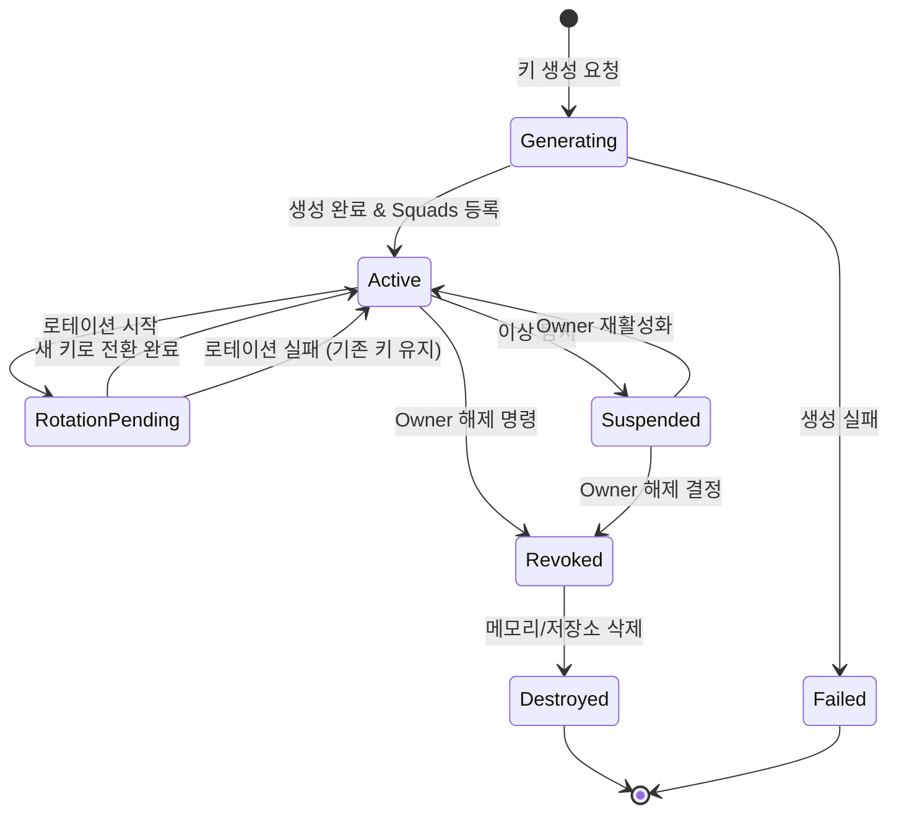
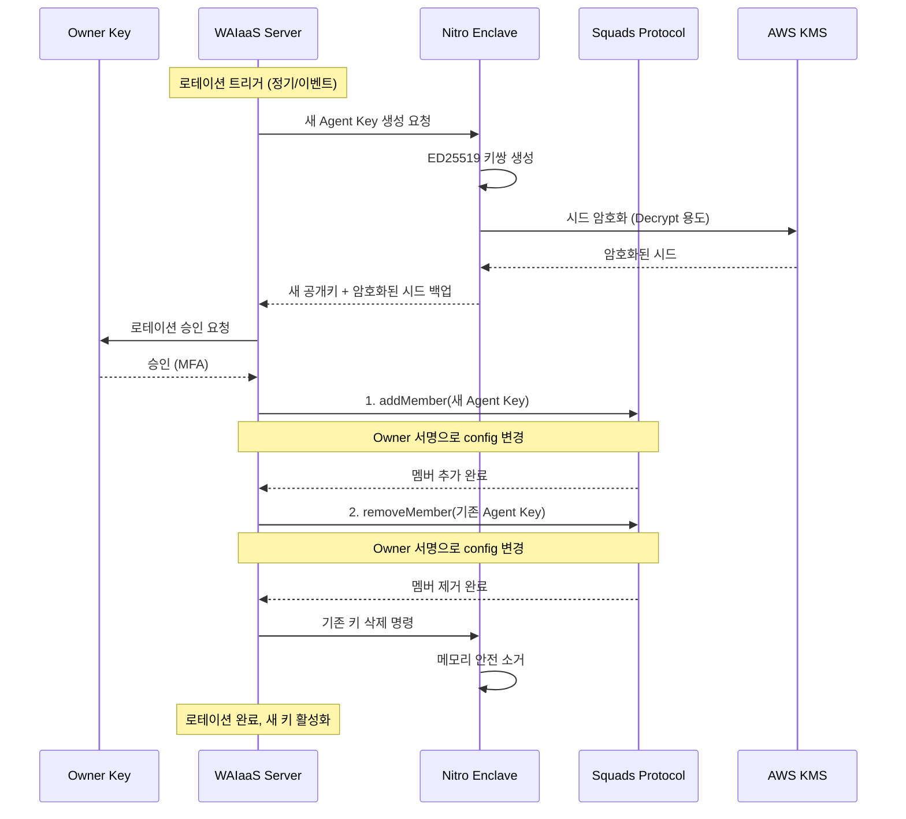
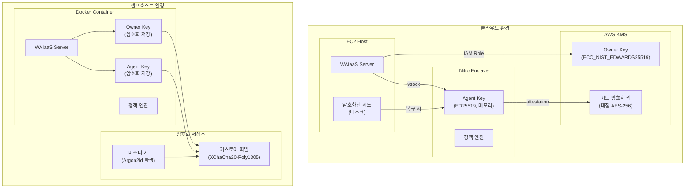
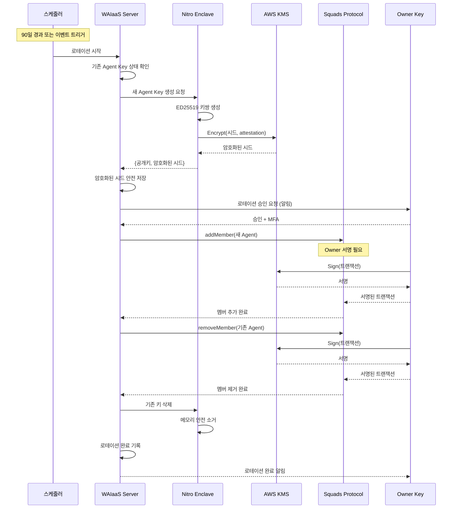
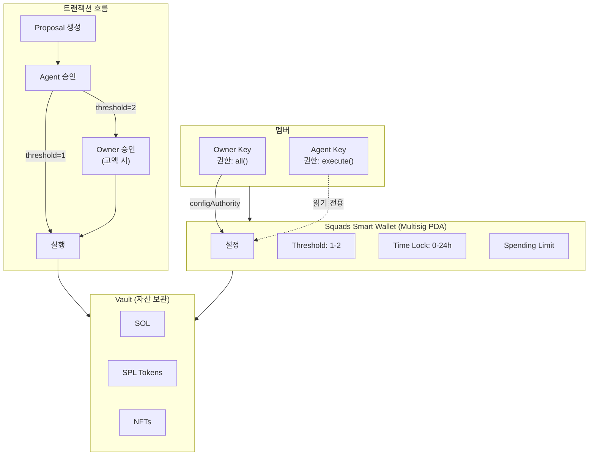

# Dual Key 아키텍처 상세 설계 (ARCH-01)

**문서 ID:** ARCH-01
**작성일:** 2026-02-04
**상태:** 완료
**참조:** CUST-04, 02-RESEARCH.md, 03-CONTEXT.md, 03-RESEARCH.md

---

## 1. Executive Summary

### 1.1 아키텍처 개요

Dual Key Architecture는 AI 에이전트 지갑의 핵심 보안 모델로, **Owner Key**(소유자 마스터 키)와 **Agent Key**(에이전트 운영 키)의 역할을 명확히 분리하여 "자율성"과 "통제권"의 균형을 달성한다.

```
┌─────────────────────────────────────────────────────────────────┐
│                    Dual Key Architecture                         │
├─────────────────────────────────────────────────────────────────┤
│                                                                  │
│   ┌─────────────────────┐     ┌─────────────────────┐           │
│   │     Owner Key       │     │     Agent Key       │           │
│   │   (AWS KMS ED25519) │     │  (Nitro Enclave)    │           │
│   ├─────────────────────┤     ├─────────────────────┤           │
│   │ ■ 마스터 권한       │     │ ■ 일상 운영         │           │
│   │ ■ 에이전트 관리     │     │ ■ 정책 범위 내 서명 │           │
│   │ ■ 긴급 대응         │     │ ■ TEE 격리          │           │
│   │ ■ 정책 변경         │     │ ■ 밀리초 응답       │           │
│   └─────────┬───────────┘     └─────────┬───────────┘           │
│             │                           │                        │
│             └───────────┬───────────────┘                        │
│                         │                                        │
│                         ▼                                        │
│             ┌───────────────────────┐                            │
│             │   Squads Smart Wallet │                            │
│             │   (2-of-2 Multisig)   │                            │
│             │   - 온체인 정책 강제  │                            │
│             │   - 동적 Threshold    │                            │
│             └───────────────────────┘                            │
│                                                                  │
└─────────────────────────────────────────────────────────────────┘
```

### 1.2 핵심 원칙

| 원칙 | 설명 |
|------|------|
| **역할 분리** | Owner Key는 관리 작업, Agent Key는 일상 운영 |
| **최소 권한** | Agent Key는 정책 범위 내 실행만 가능 |
| **이중 검증** | 서버 정책 + Enclave 정책 + 온체인 정책 |
| **즉시 중지** | Owner가 언제든 Agent 권한 해제 가능 |
| **Fail-safe** | 장애 시 모든 트랜잭션 거부 |

### 1.3 환경별 구현

| 환경 | Owner Key 저장 | Agent Key 저장 | 보안 수준 |
|------|---------------|----------------|----------|
| **클라우드** | AWS KMS ECC_NIST_EDWARDS25519 | AWS Nitro Enclaves | 기관급 (FIPS 140-2 Level 3) |
| **셀프호스트** | libsodium sealed box | 암호화 키스토어 + Argon2id | 중소규모 |

---

## 2. Owner Key 상세 설계

### 2.1 역할 및 권한

Owner Key는 지갑의 **마스터 키**로서, AI 에이전트를 관리하고 긴급 상황에 대응하는 역할을 담당한다.

#### 2.1.1 권한 정의

| 권한 코드 | 설명 | 사용 빈도 |
|----------|------|----------|
| `WALLET_FULL_CONTROL` | 지갑의 모든 자산에 대한 최종 통제권 | 거의 없음 |
| `AGENT_REGISTER` | 새 Agent Key를 Squads 멤버로 등록 | 드물게 |
| `AGENT_REVOKE` | Agent Key의 권한 해제 | 비상 시 |
| `POLICY_MODIFY` | 한도, 화이트리스트 등 정책 수정 | 필요 시 |
| `EMERGENCY_FREEZE` | 지갑 즉시 동결 | 비상 시 |
| `FUNDS_RECOVERY` | 자금을 안전 주소로 회수 | 비상 시 |

#### 2.1.2 사용 시나리오

```typescript
// Owner Key 사용 시나리오
interface OwnerKeyOperations {
  // 시나리오 1: 에이전트 등록 (초기 설정)
  registerAgent: (agentPublicKey: PublicKey) => Promise<void>;

  // 시나리오 2: 긴급 에이전트 해제 (침해 탐지 시)
  revokeAgent: (agentPublicKey: PublicKey) => Promise<void>;

  // 시나리오 3: 정책 변경 (한도 조정 등)
  updatePolicy: (newPolicy: WalletPolicy) => Promise<void>;

  // 시나리오 4: 자금 회수 (비상 대응)
  recoverFunds: (destination: PublicKey, amount?: bigint) => Promise<void>;

  // 시나리오 5: 고액 거래 공동 서명 (2-of-2)
  coSignTransaction: (proposal: ProposalPda) => Promise<void>;
}
```

### 2.2 저장 방식

#### 2.2.1 클라우드 환경: AWS KMS ECC_NIST_EDWARDS25519

AWS KMS는 FIPS 140-2 Level 3 인증 HSM에서 ED25519 키를 관리한다.

**키 생성:**

```typescript
import { KMSClient, CreateKeyCommand, GetPublicKeyCommand } from '@aws-sdk/client-kms';

async function createOwnerKey(kmsClient: KMSClient): Promise<{ keyId: string; publicKey: Uint8Array }> {
  // 1. KMS ED25519 키 생성
  const createResponse = await kmsClient.send(new CreateKeyCommand({
    KeySpec: 'ECC_NIST_EDWARDS25519',
    KeyUsage: 'SIGN_VERIFY',
    Description: 'WAIaaS Owner Key for AI Agent Wallet',
    Tags: [
      { TagKey: 'Purpose', TagValue: 'WAIaaS-OwnerKey' },
      { TagKey: 'Environment', TagValue: process.env.NODE_ENV },
      { TagKey: 'WalletId', TagValue: walletId }
    ],
    Policy: JSON.stringify(kmsKeyPolicy)  // 섹션 2.4 참조
  }));

  const keyId = createResponse.KeyMetadata!.KeyId!;

  // 2. 공개키 조회
  const publicKeyResponse = await kmsClient.send(new GetPublicKeyCommand({
    KeyId: keyId
  }));

  // ED25519 공개키는 DER 인코딩에서 마지막 32바이트
  const publicKeyBytes = publicKeyResponse.PublicKey!.slice(-32);

  return { keyId, publicKey: publicKeyBytes };
}
```

**서명:**

```typescript
import { SignCommand } from '@aws-sdk/client-kms';
import { PublicKey, Transaction } from '@solana/web3.js';

async function signWithOwnerKey(
  kmsClient: KMSClient,
  keyId: string,
  message: Uint8Array
): Promise<Uint8Array> {
  const response = await kmsClient.send(new SignCommand({
    KeyId: keyId,
    Message: message,
    MessageType: 'RAW',  // ED25519_SHA_512 필수 조건
    SigningAlgorithm: 'ED25519_SHA_512'
  }));

  return new Uint8Array(response.Signature!);
}

async function signTransactionWithOwner(
  kmsClient: KMSClient,
  keyId: string,
  ownerPublicKey: PublicKey,
  transaction: Transaction
): Promise<Transaction> {
  const messageToSign = transaction.serializeMessage();
  const signature = await signWithOwnerKey(kmsClient, keyId, messageToSign);

  transaction.addSignature(ownerPublicKey, Buffer.from(signature));
  return transaction;
}
```

#### 2.2.2 셀프호스트 환경: libsodium sealed box

외부 의존성 없이 로컬에서 Owner Key를 관리한다.

```typescript
import sodium from 'libsodium-wrappers';

interface SelfHostedOwnerKey {
  // 암호화된 비밀키 (디스크 저장)
  encryptedSecretKey: Uint8Array;
  // 공개키 (평문 저장 가능)
  publicKey: Uint8Array;
  // 암호화 nonce
  nonce: Uint8Array;
  // 키 파생 salt
  salt: Uint8Array;
}

class SelfHostedOwnerKeyManager {
  private masterKey: Uint8Array | null = null;
  private decryptedKeypair: sodium.KeyPair | null = null;

  async initialize(password: string, salt: Uint8Array): Promise<void> {
    await sodium.ready;

    // Argon2id로 마스터 키 파생
    this.masterKey = sodium.crypto_pwhash(
      32,
      password,
      salt,
      sodium.crypto_pwhash_OPSLIMIT_MODERATE,
      sodium.crypto_pwhash_MEMLIMIT_MODERATE,
      sodium.crypto_pwhash_ALG_ARGON2ID13
    );
  }

  async createOwnerKey(): Promise<SelfHostedOwnerKey> {
    if (!this.masterKey) throw new Error('Not initialized');

    // ED25519 키쌍 생성
    const keypair = sodium.crypto_sign_keypair();

    // 비밀키 암호화
    const nonce = sodium.randombytes_buf(sodium.crypto_secretbox_NONCEBYTES);
    const encryptedSecretKey = sodium.crypto_secretbox_easy(
      keypair.privateKey,
      nonce,
      this.masterKey
    );

    // 메모리에 복호화된 키 유지
    this.decryptedKeypair = keypair;

    return {
      encryptedSecretKey,
      publicKey: keypair.publicKey,
      nonce,
      salt: sodium.randombytes_buf(sodium.crypto_pwhash_SALTBYTES)
    };
  }

  async sign(message: Uint8Array): Promise<Uint8Array> {
    if (!this.decryptedKeypair) throw new Error('Owner key not loaded');
    return sodium.crypto_sign_detached(message, this.decryptedKeypair.privateKey);
  }

  clearMemory(): void {
    if (this.masterKey) sodium.memzero(this.masterKey);
    if (this.decryptedKeypair) {
      sodium.memzero(this.decryptedKeypair.privateKey);
    }
    this.masterKey = null;
    this.decryptedKeypair = null;
  }
}
```

### 2.3 접근 방식: IAM Role 기반 Instance Profile

Owner Key에 대한 접근은 EC2 Instance Profile을 통한 IAM Role 기반으로 관리한다.

**장점:**
- 장기 자격 증명 노출 위험 없음
- 자동 자격 증명 로테이션
- CloudTrail 완전 감사

**IAM Role 구성:**

```json
{
  "Version": "2012-10-17",
  "Statement": [
    {
      "Sid": "AllowKMSSignOperations",
      "Effect": "Allow",
      "Action": [
        "kms:Sign",
        "kms:GetPublicKey",
        "kms:DescribeKey"
      ],
      "Resource": "arn:aws:kms:ap-northeast-2:*:key/*",
      "Condition": {
        "StringEquals": {
          "kms:ResourceTag/Purpose": "WAIaaS-OwnerKey"
        }
      }
    }
  ]
}
```

**EC2 Instance Profile 사용:**

```typescript
import { KMSClient } from '@aws-sdk/client-kms';

// EC2 Instance Profile 자동 사용 (자격 증명 명시 불필요)
const kmsClient = new KMSClient({ region: 'ap-northeast-2' });

// AWS SDK가 EC2 메타데이터 서비스에서 자동으로 자격 증명 획득
```

### 2.4 KMS 키 정책 예시

MFA 필수 및 Enclave attestation 조건을 포함한 키 정책:

```json
{
  "Version": "2012-10-17",
  "Id": "WAIaaS-OwnerKey-Policy",
  "Statement": [
    {
      "Sid": "EnableRootAccountAccess",
      "Effect": "Allow",
      "Principal": {
        "AWS": "arn:aws:iam::123456789012:root"
      },
      "Action": "kms:*",
      "Resource": "*"
    },
    {
      "Sid": "AllowOwnerOperationsWithMFA",
      "Effect": "Allow",
      "Principal": {
        "AWS": "arn:aws:iam::123456789012:role/WAIaaS-OwnerRole"
      },
      "Action": [
        "kms:Sign",
        "kms:GetPublicKey",
        "kms:DescribeKey"
      ],
      "Resource": "*",
      "Condition": {
        "Bool": {
          "aws:MultiFactorAuthPresent": "true"
        },
        "NumericLessThan": {
          "aws:MultiFactorAuthAge": "300"
        }
      }
    },
    {
      "Sid": "AllowEnclaveDecryptWithAttestation",
      "Effect": "Allow",
      "Principal": {
        "AWS": "arn:aws:iam::123456789012:role/WAIaaS-EnclaveRole"
      },
      "Action": [
        "kms:Decrypt"
      ],
      "Resource": "*",
      "Condition": {
        "StringEqualsIgnoreCase": {
          "kms:RecipientAttestation:PCR0": "ENCLAVE_PCR0_HASH_HERE",
          "kms:RecipientAttestation:PCR1": "ENCLAVE_PCR1_HASH_HERE",
          "kms:RecipientAttestation:PCR2": "ENCLAVE_PCR2_HASH_HERE"
        }
      }
    },
    {
      "Sid": "DenyWithoutConditions",
      "Effect": "Deny",
      "Principal": "*",
      "Action": [
        "kms:DeleteKey",
        "kms:ScheduleKeyDeletion",
        "kms:DisableKey"
      ],
      "Resource": "*",
      "Condition": {
        "StringNotEquals": {
          "aws:PrincipalTag/EmergencyAccess": "true"
        }
      }
    }
  ]
}
```

### 2.5 로테이션 정책

**권장 정책:**
- **정기 로테이션:** 연 1회
- **이벤트 트리거:** 침해 의심 시 즉시
- **방법:** KMS 자동 로테이션 활성화 + Squads 멤버 교체

```typescript
// KMS 자동 로테이션 활성화
import { EnableKeyRotationCommand } from '@aws-sdk/client-kms';

async function enableOwnerKeyRotation(kmsClient: KMSClient, keyId: string): Promise<void> {
  await kmsClient.send(new EnableKeyRotationCommand({
    KeyId: keyId,
    // 연간 자동 로테이션
    RotationPeriodInDays: 365
  }));
}

// Owner Key 로테이션 시 Squads 멤버 교체
async function rotateOwnerKeyInSquads(
  connection: Connection,
  multisigPda: PublicKey,
  oldOwnerKey: PublicKey,
  newOwnerKey: PublicKey,
  signer: Keypair  // 기존 Owner Key로 서명
): Promise<void> {
  // 1. 새 Owner를 멤버로 추가
  // 2. 기존 Owner를 멤버에서 제거
  // 3. configAuthority를 새 Owner로 변경
}
```

---

## 3. Agent Key 상세 설계

### 3.1 역할 및 권한

Agent Key는 **일상 운영용 키**로, 정책 범위 내에서 자율적으로 트랜잭션에 서명한다.

#### 3.1.1 권한 정의

| 권한 코드 | 설명 | 제한 사항 |
|----------|------|----------|
| `POLICY_BOUNDED_EXECUTE` | 정책 범위 내 트랜잭션 실행 | 금액 한도, 화이트리스트, 시간 제어 적용 |

**Agent Key는 다음을 수행할 수 없음:**
- 지갑 설정 변경
- 다른 멤버 추가/제거
- 정책 변경
- 전체 자산 이동

### 3.2 저장 방식

#### 3.2.1 클라우드 환경: AWS Nitro Enclaves

Nitro Enclaves는 하드웨어 수준 메모리 격리를 제공하여 Agent Key를 보호한다.

**Enclave 특성:**

| 특성 | 설명 |
|------|------|
| **메모리 격리** | 호스트 OS에서 접근 불가 (root 포함) |
| **암호화** | Enclave 메모리 전체 암호화 |
| **Attestation** | PCR 기반 이미지 무결성 검증 |
| **통신** | vsock만 허용 (네트워크 직접 접근 불가) |
| **영구 저장소** | 없음 (stateless) |

**Enclave 아키텍처:**

```
┌───────────────────────────────────────────────────────────────┐
│                    EC2 Host Instance                          │
├───────────────────────────────────────────────────────────────┤
│                                                                │
│  ┌─────────────────────┐         ┌─────────────────────────┐  │
│  │   WAIaaS Server     │         │    Nitro Enclave        │  │
│  │                     │ vsock   │                         │  │
│  │  - API 요청 처리    │◄───────►│  - Agent Key 보관      │  │
│  │  - 서버 정책 검증   │  :5000  │  - 정책 검증 (내부)    │  │
│  │  - 트랜잭션 구성    │         │  - ED25519 서명        │  │
│  │                     │         │                         │  │
│  └─────────────────────┘         └─────────────────────────┘  │
│           │                                │                   │
│           │ HTTPS                          │ KMS Decrypt       │
│           ▼                                ▼ (attestation)     │
│  ┌─────────────────┐             ┌─────────────────────────┐  │
│  │ Internet/VPC    │             │      AWS KMS            │  │
│  └─────────────────┘             │  (시드 암호화/복호화)  │  │
│                                  └─────────────────────────┘  │
└───────────────────────────────────────────────────────────────┘
```

#### 3.2.2 셀프호스트 환경: 암호화 키스토어 + Argon2id

Nitro Enclave 없는 환경에서 외부 의존성 최소화하면서 보안 유지.

```typescript
import sodium from 'libsodium-wrappers';
import { Keypair } from '@solana/web3.js';

interface EncryptedAgentKey {
  walletId: string;
  encryptedSecretKey: Uint8Array;
  publicKey: Uint8Array;
  nonce: Uint8Array;
  createdAt: Date;
  lastRotatedAt: Date | null;
}

class SelfHostedAgentKeyStore {
  private masterKey: Uint8Array | null = null;
  private decryptedKeys: Map<string, Keypair> = new Map();

  async deriveMasterKey(password: string, salt: Uint8Array): Promise<void> {
    await sodium.ready;

    // Argon2id: 메모리 256MB, 시간 3회
    this.masterKey = sodium.crypto_pwhash(
      32,
      password,
      salt,
      3,  // ops limit
      256 * 1024 * 1024,  // 256MB memory
      sodium.crypto_pwhash_ALG_ARGON2ID13
    );
  }

  async createAgentKey(walletId: string): Promise<EncryptedAgentKey> {
    if (!this.masterKey) throw new Error('Master key not initialized');

    // 1. ED25519 키쌍 생성 (메모리에서)
    const keypair = Keypair.generate();

    // 2. 비밀키 암호화 (XChaCha20-Poly1305)
    const nonce = sodium.randombytes_buf(sodium.crypto_secretbox_NONCEBYTES);
    const encryptedSecretKey = sodium.crypto_secretbox_easy(
      keypair.secretKey,
      nonce,
      this.masterKey
    );

    // 3. 메모리 캐시에 복호화된 키 유지
    this.decryptedKeys.set(walletId, keypair);

    return {
      walletId,
      encryptedSecretKey,
      publicKey: keypair.publicKey.toBytes(),
      nonce,
      createdAt: new Date(),
      lastRotatedAt: null
    };
  }

  async loadAgentKey(
    walletId: string,
    encryptedKey: EncryptedAgentKey
  ): Promise<Keypair> {
    // 캐시 확인
    const cached = this.decryptedKeys.get(walletId);
    if (cached) return cached;

    if (!this.masterKey) throw new Error('Master key not initialized');

    // 복호화 (메모리에서만)
    const secretKey = sodium.crypto_secretbox_open_easy(
      encryptedKey.encryptedSecretKey,
      encryptedKey.nonce,
      this.masterKey
    );

    if (!secretKey) throw new Error('Decryption failed');

    const keypair = Keypair.fromSecretKey(secretKey);
    this.decryptedKeys.set(walletId, keypair);

    return keypair;
  }

  async sign(walletId: string, message: Uint8Array): Promise<Uint8Array> {
    const keypair = this.decryptedKeys.get(walletId);
    if (!keypair) throw new Error('Agent key not loaded');

    return sodium.crypto_sign_detached(message, keypair.secretKey);
  }

  clearMemory(): void {
    if (this.masterKey) sodium.memzero(this.masterKey);
    this.decryptedKeys.forEach((keypair) => {
      sodium.memzero(keypair.secretKey);
    });
    this.masterKey = null;
    this.decryptedKeys.clear();
  }
}
```

### 3.3 Agent Key 생성 위치

#### 3.3.1 클라우드: Enclave 내부 생성

```rust
// enclave/src/key_generation.rs
use ed25519_dalek::{SigningKey, VerifyingKey};
use rand::rngs::OsRng;

pub struct AgentKeyManager {
    signing_key: Option<SigningKey>,
}

impl AgentKeyManager {
    pub fn new() -> Self {
        Self { signing_key: None }
    }

    /// Enclave 내부에서 새 Agent Key 생성
    pub fn generate(&mut self) -> [u8; 32] {
        let signing_key = SigningKey::generate(&mut OsRng);
        let verifying_key = signing_key.verifying_key();

        // 시드를 KMS로 암호화하여 백업 (호스트로 전송)
        let seed = signing_key.to_bytes();
        let encrypted_seed = self.encrypt_with_kms(&seed);

        // 서명 키는 Enclave 메모리에만 유지
        self.signing_key = Some(signing_key);

        // 공개키만 반환
        verifying_key.to_bytes()
    }

    /// KMS로 암호화된 시드에서 Agent Key 복구
    pub fn recover_from_seed(&mut self, encrypted_seed: &[u8]) -> Result<[u8; 32], Error> {
        // KMS Decrypt 호출 (attestation 필수)
        let seed = self.decrypt_with_kms(encrypted_seed)?;

        let signing_key = SigningKey::from_bytes(&seed.try_into()?);
        let verifying_key = signing_key.verifying_key();

        self.signing_key = Some(signing_key);

        Ok(verifying_key.to_bytes())
    }

    fn encrypt_with_kms(&self, plaintext: &[u8]) -> Vec<u8> {
        // AWS Nitro Enclaves SDK를 통한 KMS 암호화
        // attestation 문서 포함하여 요청
        todo!()
    }

    fn decrypt_with_kms(&self, ciphertext: &[u8]) -> Result<Vec<u8>, Error> {
        // AWS Nitro Enclaves SDK를 통한 KMS 복호화
        // KMS 키 정책에서 attestation 조건 검증
        todo!()
    }
}
```

#### 3.3.2 셀프호스트: 서버 메모리 생성

셀프호스트 환경에서는 서버 메모리에서 키를 생성하고 즉시 암호화하여 저장한다.

```typescript
// 셀프호스트 Agent Key 생성 흐름
async function createSelfHostedAgentKey(
  keyStore: SelfHostedAgentKeyStore,
  walletId: string
): Promise<{ publicKey: Uint8Array; encryptedKey: EncryptedAgentKey }> {
  // 1. 메모리에서 키쌍 생성
  const encryptedKey = await keyStore.createAgentKey(walletId);

  // 2. 암호화된 키를 안전한 저장소에 저장
  await saveToSecureStorage(encryptedKey);

  // 3. 공개키만 반환 (Squads 등록용)
  return {
    publicKey: encryptedKey.publicKey,
    encryptedKey
  };
}
```

### 3.4 로테이션 정책

**권장 정책:**
- **정기 로테이션:** 90일
- **이벤트 트리거:** 이상 징후 탐지 시 즉시
- **방법:** 새 키 생성 → Squads 멤버 교체 → 기존 키 폐기

```typescript
interface AgentKeyRotationPolicy {
  // 정기 로테이션
  regular: {
    intervalDays: 90;
    nextRotationDate: Date;
  };

  // 이벤트 기반 트리거
  eventTriggers: [
    'CONSECUTIVE_FAILURES_3',      // 연속 3회 실패
    'ABNORMAL_PATTERN_DETECTED',   // 이상 패턴 탐지
    'POLICY_VIOLATION_ATTEMPT',    // 정책 위반 시도
    'MANUAL_REQUEST',              // 운영자 요청
  ];
}

async function rotateAgentKey(
  connection: Connection,
  multisigPda: PublicKey,
  oldAgentKey: PublicKey,
  newAgentKey: PublicKey,
  ownerSigner: OwnerKeySigner
): Promise<void> {
  // 1. 새 Agent Key를 Squads 멤버로 추가
  const addMemberIx = await multisig.instructions.configTransactionCreate({
    multisigPda,
    actions: [{
      __kind: 'AddMember',
      newMember: {
        key: newAgentKey,
        permissions: multisig.types.Permissions.fromPermissions({
          initiate: true,
          vote: true,
          execute: true,
          settings: false,
          addMember: false,
          removeMember: false
        })
      }
    }],
    creator: ownerSigner.publicKey
  });

  // 2. 기존 Agent Key를 멤버에서 제거
  const removeMemberIx = await multisig.instructions.configTransactionCreate({
    multisigPda,
    actions: [{
      __kind: 'RemoveMember',
      oldMember: oldAgentKey
    }],
    creator: ownerSigner.publicKey
  });

  // 3. 트랜잭션 실행 (Owner 서명)
  const tx = new Transaction().add(addMemberIx, removeMemberIx);
  await ownerSigner.signAndSendTransaction(connection, tx);

  // 4. 기존 키 메모리에서 안전하게 삭제
  await securelyDeleteOldKey(oldAgentKey);
}
```

### 3.5 vsock 통신 프로토콜 정의

Enclave와 호스트 간 통신은 vsock을 통해 이루어진다.

#### 3.5.1 메시지 프로토콜

```typescript
// vsock 메시지 타입 정의
enum VsockMessageType {
  // 요청
  SIGN_REQUEST = 0x01,
  GET_PUBLIC_KEY = 0x02,
  INITIALIZE_KEY = 0x03,
  ROTATE_KEY = 0x04,
  HEALTH_CHECK = 0x05,

  // 응답
  SIGN_RESPONSE = 0x81,
  PUBLIC_KEY_RESPONSE = 0x82,
  INITIALIZE_RESPONSE = 0x83,
  ROTATE_RESPONSE = 0x84,
  HEALTH_RESPONSE = 0x85,
  ERROR_RESPONSE = 0xFF
}

// 서명 요청
interface SignRequest {
  type: VsockMessageType.SIGN_REQUEST;
  requestId: string;
  walletId: string;
  transaction: Uint8Array;  // 직렬화된 트랜잭션
  policy: AgentPolicy;      // 정책 검증용
}

// 서명 응답
interface SignResponse {
  type: VsockMessageType.SIGN_RESPONSE;
  requestId: string;
  success: boolean;
  signature?: Uint8Array;
  error?: {
    code: PolicyViolationCode;
    message: string;
  };
}

// 정책 위반 코드
enum PolicyViolationCode {
  AMOUNT_EXCEEDS_LIMIT = 'AMOUNT_EXCEEDS_LIMIT',
  DAILY_LIMIT_EXCEEDED = 'DAILY_LIMIT_EXCEEDED',
  RECIPIENT_NOT_WHITELISTED = 'RECIPIENT_NOT_WHITELISTED',
  PROGRAM_NOT_WHITELISTED = 'PROGRAM_NOT_WHITELISTED',
  OUTSIDE_ALLOWED_HOURS = 'OUTSIDE_ALLOWED_HOURS',
  COOLDOWN_ACTIVE = 'COOLDOWN_ACTIVE'
}
```

#### 3.5.2 vsock 서버 구현 (Enclave 내부)

```rust
// enclave/src/vsock_server.rs
use nix::sys::socket::{socket, bind, listen, accept, AddressFamily, SockType, SockFlag, VsockAddr};
use std::os::unix::io::RawFd;

const VSOCK_PORT: u32 = 5000;
const CID_ANY: u32 = 0xFFFFFFFF;

pub struct EnclaveVsockServer {
    socket_fd: RawFd,
    key_manager: AgentKeyManager,
    policy_engine: PolicyEngine,
}

impl EnclaveVsockServer {
    pub fn new() -> Result<Self, Box<dyn std::error::Error>> {
        // vsock 소켓 생성
        let socket_fd = socket(
            AddressFamily::Vsock,
            SockType::Stream,
            SockFlag::empty(),
            None
        )?;

        // 바인드 및 리스닝
        let addr = VsockAddr::new(CID_ANY, VSOCK_PORT);
        bind(socket_fd, &addr)?;
        listen(socket_fd, 128)?;

        Ok(Self {
            socket_fd,
            key_manager: AgentKeyManager::new(),
            policy_engine: PolicyEngine::new(),
        })
    }

    pub fn run(&mut self) -> Result<(), Box<dyn std::error::Error>> {
        println!("Enclave vsock server listening on port {}", VSOCK_PORT);

        loop {
            let client_fd = accept(self.socket_fd)?;
            self.handle_connection(client_fd)?;
        }
    }

    fn handle_connection(&mut self, fd: RawFd) -> Result<(), Box<dyn std::error::Error>> {
        // 요청 읽기
        let request: VsockRequest = self.read_request(fd)?;

        match request {
            VsockRequest::Sign(req) => {
                let response = self.handle_sign_request(req);
                self.write_response(fd, response)?;
            }
            VsockRequest::GetPublicKey(req) => {
                let response = self.handle_get_public_key(req);
                self.write_response(fd, response)?;
            }
            VsockRequest::Initialize(req) => {
                let response = self.handle_initialize(req);
                self.write_response(fd, response)?;
            }
            // ... 기타 요청 타입 처리
        }

        Ok(())
    }

    fn handle_sign_request(&mut self, req: SignRequest) -> SignResponse {
        // 1. 정책 검증 (Enclave 내부)
        let policy_result = self.policy_engine.validate(&req.transaction, &req.policy);

        if !policy_result.valid {
            return SignResponse {
                request_id: req.request_id,
                success: false,
                signature: None,
                error: Some(PolicyError {
                    code: policy_result.violation_code,
                    message: policy_result.reason,
                }),
            };
        }

        // 2. 서명 (정책 통과 시에만)
        match self.key_manager.sign(&req.wallet_id, &req.transaction) {
            Ok(signature) => SignResponse {
                request_id: req.request_id,
                success: true,
                signature: Some(signature),
                error: None,
            },
            Err(e) => SignResponse {
                request_id: req.request_id,
                success: false,
                signature: None,
                error: Some(PolicyError {
                    code: "INTERNAL_ERROR".into(),
                    message: e.to_string(),
                }),
            },
        }
    }
}
```

#### 3.5.3 vsock 클라이언트 구현 (호스트)

```typescript
// src/infrastructure/enclave/vsock-client.ts
import { Socket } from 'net';
import { promisify } from 'util';

const ENCLAVE_CID = 16;  // Enclave CID (고정값)
const VSOCK_PORT = 5000;

export class EnclaveVsockClient {
  private socket: Socket | null = null;

  async connect(): Promise<void> {
    return new Promise((resolve, reject) => {
      // Linux vsock 소켓 연결
      // Node.js에서 vsock 직접 지원 없어 native module 필요
      this.socket = new Socket();

      // vsock://16:5000 형태로 연결
      this.socket.connect(VSOCK_PORT, `vsock:${ENCLAVE_CID}`, () => {
        resolve();
      });

      this.socket.on('error', reject);
    });
  }

  async signTransaction(
    walletId: string,
    transaction: Uint8Array,
    policy: AgentPolicy
  ): Promise<Uint8Array> {
    if (!this.socket) throw new Error('Not connected');

    const request: SignRequest = {
      type: VsockMessageType.SIGN_REQUEST,
      requestId: crypto.randomUUID(),
      walletId,
      transaction,
      policy
    };

    // 요청 전송
    await this.send(request);

    // 응답 대기
    const response = await this.receive<SignResponse>();

    if (!response.success) {
      throw new PolicyViolationError(response.error!.code, response.error!.message);
    }

    return response.signature!;
  }

  async getPublicKey(walletId: string): Promise<Uint8Array> {
    // ... 공개키 조회 구현
  }

  async healthCheck(): Promise<boolean> {
    // Enclave 상태 확인 (Fail-safe용)
    try {
      const response = await this.send({
        type: VsockMessageType.HEALTH_CHECK,
        requestId: crypto.randomUUID()
      });
      return response.healthy;
    } catch {
      return false;
    }
  }

  private async send(data: any): Promise<void> {
    // 메시지 직렬화 및 전송
  }

  private async receive<T>(): Promise<T> {
    // 메시지 수신 및 역직렬화
  }
}
```

---

## 4. Squads 멀티시그 통합

### 4.1 2-of-2 구성

Owner Key와 Agent Key를 Squads 멀티시그 멤버로 등록한다.

```typescript
import * as multisig from '@sqds/multisig';
import { Connection, PublicKey, Keypair } from '@solana/web3.js';

interface CreateSquadsWalletParams {
  connection: Connection;
  ownerPublicKey: PublicKey;
  agentPublicKey: PublicKey;
  payer: Keypair;
}

async function createSquadsSmartWallet(
  params: CreateSquadsWalletParams
): Promise<{ multisigPda: PublicKey; vaultPda: PublicKey }> {
  const { connection, ownerPublicKey, agentPublicKey, payer } = params;

  const createKey = Keypair.generate();
  const programId = new PublicKey('SQDS4ep65T869zMMBKyuUq6aD6EgTu8psMjkvj52pCf');

  // 멀티시그 PDA 계산
  const [multisigPda] = PublicKey.findProgramAddressSync(
    [Buffer.from('multisig'), createKey.publicKey.toBuffer()],
    programId
  );

  // Vault PDA 계산
  const [vaultPda] = PublicKey.findProgramAddressSync(
    [Buffer.from('vault'), multisigPda.toBuffer(), Buffer.from([0])],
    programId
  );

  // 멀티시그 생성 instruction
  const createMultisigIx = await multisig.instructions.multisigCreate({
    createKey: createKey.publicKey,
    creator: payer.publicKey,
    multisigPda,
    configAuthority: ownerPublicKey,  // Owner만 설정 변경 가능
    timeLock: 0,                       // 기본: 지연 없음
    threshold: 1,                      // 기본: Agent 단독 실행 (소액)
    members: [
      {
        key: ownerPublicKey,
        permissions: multisig.types.Permissions.all()  // 모든 권한
      },
      {
        key: agentPublicKey,
        permissions: multisig.types.Permissions.fromPermissions({
          initiate: true,    // 트랜잭션 제안 가능
          vote: true,        // 투표 가능
          execute: true,     // 실행 가능
          settings: false,   // 설정 변경 불가
          addMember: false,  // 멤버 추가 불가
          removeMember: false // 멤버 제거 불가
        })
      }
    ],
    rentCollector: ownerPublicKey
  });

  // 트랜잭션 생성 및 전송
  const tx = new Transaction().add(createMultisigIx);
  tx.feePayer = payer.publicKey;
  tx.recentBlockhash = (await connection.getLatestBlockhash()).blockhash;

  tx.sign(payer, createKey);

  const signature = await connection.sendRawTransaction(tx.serialize());
  await connection.confirmTransaction(signature);

  return { multisigPda, vaultPda };
}
```

### 4.2 동적 Threshold 정책

금액에 따라 서로 다른 threshold를 적용한다.

```typescript
interface DynamicThresholdPolicy {
  // 소액: Agent 단독 (1-of-2)
  small: {
    maxAmountLamports: bigint;  // 예: 1 SOL = 1_000_000_000
    threshold: 1;
    timeLockSeconds: 0;
  };

  // 중액: Agent 제안 + 시간 지연
  medium: {
    maxAmountLamports: bigint;  // 예: 10 SOL
    threshold: 1;
    timeLockSeconds: 3600;       // 1시간 대기
  };

  // 고액: Owner + Agent 필수 (2-of-2)
  large: {
    threshold: 2;
    timeLockSeconds: 86400;      // 24시간 대기
  };
}

// 트랜잭션 금액에 따른 threshold 결정
function determineThreshold(
  amount: bigint,
  policy: DynamicThresholdPolicy
): { threshold: number; timeLock: number } {
  if (amount <= policy.small.maxAmountLamports) {
    return {
      threshold: policy.small.threshold,
      timeLock: policy.small.timeLockSeconds
    };
  }

  if (amount <= policy.medium.maxAmountLamports) {
    return {
      threshold: policy.medium.threshold,
      timeLock: policy.medium.timeLockSeconds
    };
  }

  return {
    threshold: policy.large.threshold,
    timeLock: policy.large.timeLockSeconds
  };
}
```

**서버 측 금액 기반 라우팅:**

Squads v4는 트랜잭션별 동적 threshold를 네이티브로 지원하지 않으므로, 서버에서 금액 기반 라우팅을 구현한다.

```typescript
async function executeTransaction(
  connection: Connection,
  multisigPda: PublicKey,
  transaction: Transaction,
  amount: bigint,
  policy: DynamicThresholdPolicy,
  agentSigner: AgentKeySigner,
  ownerApproval?: OwnerApproval
): Promise<string> {
  const { threshold, timeLock } = determineThreshold(amount, policy);

  // 1. 트랜잭션 제안 생성
  const proposalPda = await createProposal(connection, multisigPda, transaction, agentSigner);

  // 2. Agent 승인
  await approveProposal(connection, proposalPda, agentSigner);

  // 3. Threshold에 따른 처리
  if (threshold === 2) {
    // 고액: Owner 승인 필요
    if (!ownerApproval) {
      // Owner에게 승인 요청 전송
      await requestOwnerApproval(proposalPda, amount, timeLock);
      throw new AwaitingOwnerApprovalError(proposalPda.toBase58());
    }

    // Owner 승인 (KMS 서명)
    await approveProposalWithOwner(connection, proposalPda, ownerApproval);
  }

  // 4. Time Lock 대기 (중액/고액)
  if (timeLock > 0) {
    await waitForTimeLock(proposalPda, timeLock);
  }

  // 5. 실행
  return await executeProposal(connection, proposalPda);
}
```

### 4.3 Spending Limits 설정

Squads v4의 Spending Limit 기능을 활용하여 Agent의 자율 거래 한도를 설정한다.

```typescript
interface SpendingLimitConfig {
  mint: PublicKey;           // SOL 또는 SPL 토큰 mint
  amount: bigint;            // 한도 금액
  period: SpendingPeriod;    // 주기
  members: PublicKey[];      // 적용 대상 (Agent만)
  destinations?: PublicKey[]; // 허용 목적지 (선택)
}

enum SpendingPeriod {
  DAILY = 216_000,    // ~24시간 (슬롯 기준)
  WEEKLY = 1_512_000,  // ~7일
  MONTHLY = 6_480_000  // ~30일
}

async function setSpendingLimit(
  connection: Connection,
  multisigPda: PublicKey,
  config: SpendingLimitConfig,
  ownerSigner: OwnerKeySigner
): Promise<void> {
  const createKey = Keypair.generate();

  const addSpendingLimitIx = await multisig.instructions.configTransactionCreate({
    multisigPda,
    actions: [{
      __kind: 'AddSpendingLimit',
      createKey: createKey.publicKey,
      mint: config.mint,
      amount: config.amount,
      period: BigInt(config.period),
      members: config.members,
      destinations: config.destinations || []
    }],
    creator: ownerSigner.publicKey
  });

  // Owner 서명으로 설정 (configAuthority)
  const tx = new Transaction().add(addSpendingLimitIx);
  await ownerSigner.signAndSendTransaction(connection, tx);
}
```

### 4.4 configAuthority: Owner Key 전용

Squads 멀티시그의 `configAuthority`는 Owner Key로 설정하여, 설정 변경 권한을 Owner에게만 부여한다.

```typescript
// configAuthority로 할 수 있는 작업
interface ConfigAuthorityOperations {
  // 멤버 관리
  addMember: (newMember: PublicKey, permissions: Permissions) => Promise<void>;
  removeMember: (member: PublicKey) => Promise<void>;
  changePermissions: (member: PublicKey, newPermissions: Permissions) => Promise<void>;

  // 정책 변경
  changeThreshold: (newThreshold: number) => Promise<void>;
  changeTimeLock: (newTimeLock: number) => Promise<void>;

  // Spending Limit 관리
  addSpendingLimit: (config: SpendingLimitConfig) => Promise<void>;
  removeSpendingLimit: (spendingLimitPda: PublicKey) => Promise<void>;

  // configAuthority 이전 (Owner Key 로테이션 시)
  setConfigAuthority: (newAuthority: PublicKey) => Promise<void>;
}
```

---

## 5. 키 라이프사이클 관리

### 5.1 상태 전이도



### 5.2 로테이션 시 Squads 멤버 교체 절차



### 5.3 비상 키 폐기 절차

침해 탐지 시 Agent Key를 즉시 폐기하는 절차:

```typescript
interface EmergencyRevocationProcedure {
  // 1단계: 즉시 중지
  suspendAgent: () => Promise<void>;

  // 2단계: Squads에서 Agent 제거
  removeFromSquads: () => Promise<void>;

  // 3단계: 키 메모리에서 삭제
  destroyKey: () => Promise<void>;

  // 4단계: 감사 로그 기록
  logIncident: () => Promise<void>;

  // 5단계: 알림 전송
  notifyOwner: () => Promise<void>;
}

async function emergencyRevocation(
  connection: Connection,
  multisigPda: PublicKey,
  agentPublicKey: PublicKey,
  ownerSigner: OwnerKeySigner,
  reason: string
): Promise<void> {
  const startTime = Date.now();

  // 1. 서버 레벨 즉시 중지 (밀리초)
  await suspendAgentLocally(agentPublicKey);
  console.log(`[${Date.now() - startTime}ms] Agent suspended locally`);

  // 2. Squads에서 Agent 멤버 제거 (수 초)
  const removeMemberIx = await multisig.instructions.configTransactionCreate({
    multisigPda,
    actions: [{
      __kind: 'RemoveMember',
      oldMember: agentPublicKey
    }],
    creator: ownerSigner.publicKey
  });

  const tx = new Transaction().add(removeMemberIx);
  await ownerSigner.signAndSendTransaction(connection, tx);
  console.log(`[${Date.now() - startTime}ms] Agent removed from Squads`);

  // 3. Enclave에 키 삭제 명령
  await enclaveClient.destroyKey(agentPublicKey);
  console.log(`[${Date.now() - startTime}ms] Key destroyed in Enclave`);

  // 4. 감사 로그 기록 (CloudTrail + 내부 로그)
  await auditLog.record({
    event: 'EMERGENCY_REVOCATION',
    agentKey: agentPublicKey.toBase58(),
    multisig: multisigPda.toBase58(),
    reason,
    timestamp: new Date().toISOString(),
    durationMs: Date.now() - startTime
  });

  // 5. Owner 알림
  await notificationService.sendEmergencyAlert({
    type: 'AGENT_REVOKED',
    multisig: multisigPda.toBase58(),
    reason,
    action: 'New agent registration required'
  });
}
```

---

## 6. 환경별 구현 차이

### 6.1 클라우드 vs 셀프호스트 비교 테이블

| 항목 | 클라우드 (AWS) | 셀프호스트 (Docker) |
|------|---------------|-------------------|
| **Owner Key 저장** | AWS KMS ECC_NIST_EDWARDS25519 | libsodium sealed box |
| **Owner Key 보안 등급** | FIPS 140-2 Level 3 | 소프트웨어 암호화 |
| **Agent Key 저장** | Nitro Enclaves | 암호화 키스토어 |
| **Agent Key 격리** | 하드웨어 수준 메모리 격리 | 프로세스 격리 |
| **키 생성 위치** | Enclave 내부 | 서버 메모리 |
| **시드 백업** | KMS 봉투 암호화 | Argon2id 암호화 파일 |
| **Attestation** | PCR 기반 무결성 검증 | 없음 |
| **감사 로그** | CloudTrail (불변) | 자체 로깅 |
| **비용** | ~$400/월 | 서버 비용만 |
| **적합 대상** | 기관, 대규모 자산 | 중소규모, 개발/테스트 |

### 6.2 보안 수준 차이 명시

```
┌───────────────────────────────────────────────────────────────┐
│                    보안 수준 비교                              │
├───────────────────────────────────────────────────────────────┤
│                                                                │
│  클라우드 (기관급)                                             │
│  ───────────────                                               │
│  ■ Owner Key: FIPS 140-2 Level 3 HSM                          │
│    - 물리적 탬퍼 방지                                          │
│    - 키 추출 불가능                                            │
│    - 규제 준수 (SOC 2, PCI DSS)                               │
│                                                                │
│  ■ Agent Key: 하드웨어 TEE                                    │
│    - Nitro Hypervisor 격리                                    │
│    - root도 접근 불가                                          │
│    - Attestation 검증                                          │
│                                                                │
│  ■ 적합: $100K+ 자산, 규제 환경, 기업 고객                    │
│                                                                │
├───────────────────────────────────────────────────────────────┤
│                                                                │
│  셀프호스트 (중소규모)                                         │
│  ─────────────────                                             │
│  ■ Owner Key: 소프트웨어 암호화                               │
│    - Argon2id 키 파생 (무차별 대입 방어)                      │
│    - 메모리 복호화 (디스크에 평문 없음)                       │
│    - 호스트 침해 시 위험                                       │
│                                                                │
│  ■ Agent Key: 프로세스 격리                                   │
│    - Docker 컨테이너 격리                                      │
│    - 호스트 OS 접근 가능 (root 시)                            │
│    - 메모리 덤프 공격 가능                                     │
│                                                                │
│  ■ 적합: <$10K 자산, 개발/테스트, 스타트업                    │
│                                                                │
└───────────────────────────────────────────────────────────────┘
```

### 6.3 환경별 구현 예시

```typescript
// 환경별 IKeyManagementService 구현
interface IKeyManagementService {
  // Owner Key 작업
  signWithOwnerKey(keyId: string, message: Uint8Array): Promise<Uint8Array>;
  getOwnerPublicKey(keyId: string): Promise<PublicKey>;

  // Agent Key 작업
  signWithAgentKey(walletId: string, transaction: Transaction, policy: AgentPolicy): Promise<SignResult>;
  initializeAgentKey(walletId: string): Promise<PublicKey>;
  rotateAgentKey(walletId: string): Promise<PublicKey>;
  revokeAgentKey(walletId: string): Promise<void>;
}

// 클라우드 구현
class CloudKeyManagementService implements IKeyManagementService {
  constructor(
    private readonly kmsClient: KMSClient,
    private readonly enclaveClient: EnclaveVsockClient
  ) {}

  async signWithOwnerKey(keyId: string, message: Uint8Array): Promise<Uint8Array> {
    const response = await this.kmsClient.send(new SignCommand({
      KeyId: keyId,
      Message: message,
      MessageType: 'RAW',
      SigningAlgorithm: 'ED25519_SHA_512'
    }));
    return new Uint8Array(response.Signature!);
  }

  async signWithAgentKey(
    walletId: string,
    transaction: Transaction,
    policy: AgentPolicy
  ): Promise<SignResult> {
    // Enclave로 vsock 요청
    return this.enclaveClient.signTransaction(walletId, transaction.serialize(), policy);
  }
}

// 셀프호스트 구현
class SelfHostedKeyManagementService implements IKeyManagementService {
  constructor(
    private readonly ownerKeyManager: SelfHostedOwnerKeyManager,
    private readonly agentKeyStore: SelfHostedAgentKeyStore,
    private readonly policyEngine: PolicyEngine
  ) {}

  async signWithOwnerKey(keyId: string, message: Uint8Array): Promise<Uint8Array> {
    return this.ownerKeyManager.sign(message);
  }

  async signWithAgentKey(
    walletId: string,
    transaction: Transaction,
    policy: AgentPolicy
  ): Promise<SignResult> {
    // 정책 검증 (로컬)
    const validation = this.policyEngine.validate(transaction, policy);
    if (!validation.valid) {
      return { success: false, error: validation };
    }

    // 서명 (로컬)
    const keypair = await this.agentKeyStore.loadAgentKey(walletId);
    transaction.sign(keypair);
    return { success: true, signature: transaction.signature };
  }
}
```

---

## 7. Mermaid 다이어그램

### 7.1 키 저장소 구조도



### 7.2 키 로테이션 시퀀스



### 7.3 Squads 멀티시그 구조



---

## 8. 참조 문서

### 8.1 내부 문서

| 문서 | 내용 | 위치 |
|------|------|------|
| **CUST-04** | 권장 커스터디 모델 제안서 | .planning/deliverables/07-recommended-custody-model.md |
| **03-CONTEXT** | Phase 3 컨텍스트 및 결정 사항 | .planning/phases/03-system-architecture/03-CONTEXT.md |
| **03-RESEARCH** | 시스템 아키텍처 리서치 | .planning/phases/03-system-architecture/03-RESEARCH.md |

### 8.2 외부 참조

| 참조 | 내용 | 신뢰도 |
|------|------|--------|
| [AWS KMS ED25519 발표](https://aws.amazon.com/about-aws/whats-new/2025/11/aws-kms-edwards-curve-digital-signature-algorithm/) | ED25519 공식 지원 | HIGH |
| [AWS Nitro Enclaves User Guide](https://docs.aws.amazon.com/enclaves/latest/user/nitro-enclave.html) | Enclave 아키텍처 | HIGH |
| [Squads Protocol v4](https://github.com/Squads-Protocol/v4) | Solana 멀티시그 | HIGH |
| [libsodium Documentation](https://doc.libsodium.org/) | 암호화 라이브러리 | HIGH |

---

*문서 ID: ARCH-01*
*작성일: 2026-02-04*
*Phase: 03-system-architecture*
*상태: 완료*
