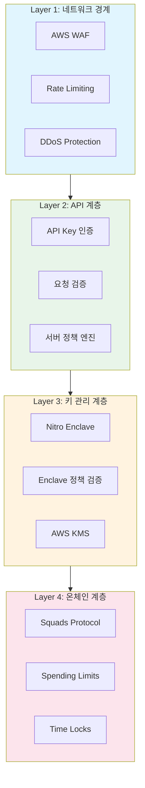
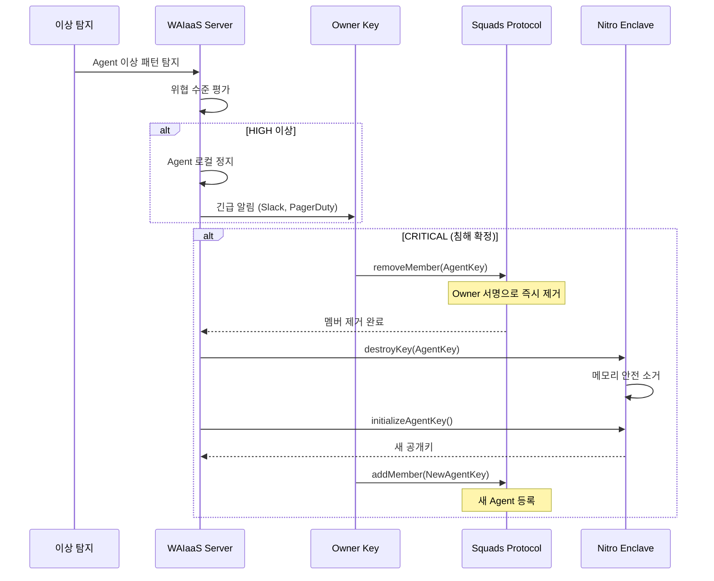
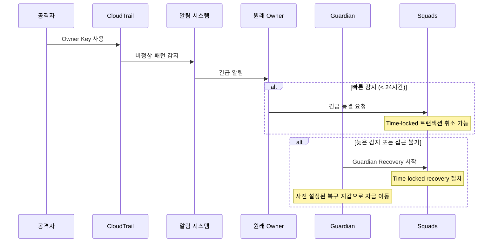
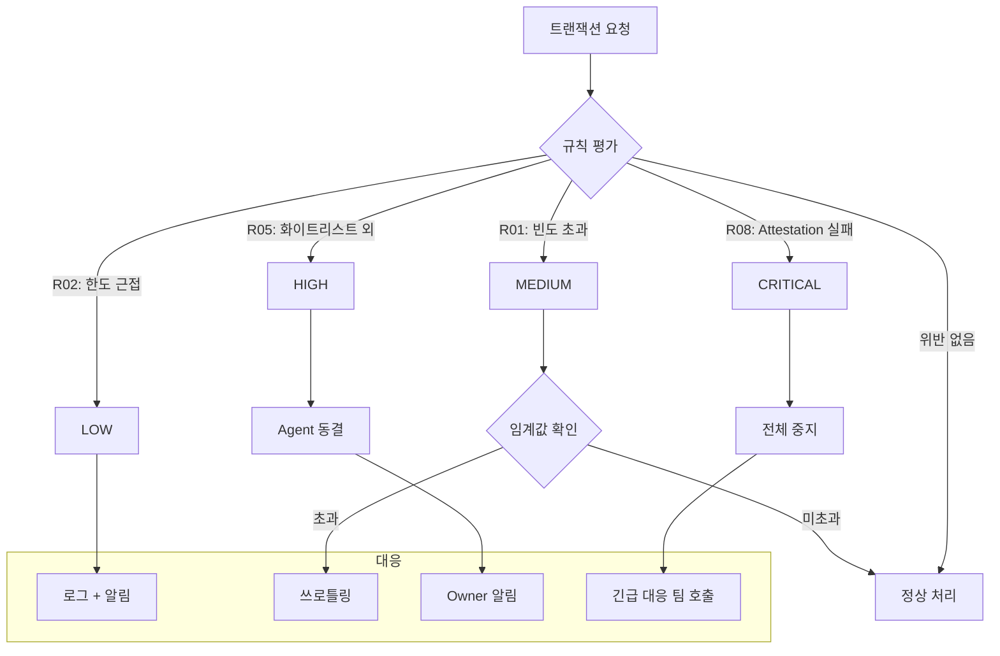
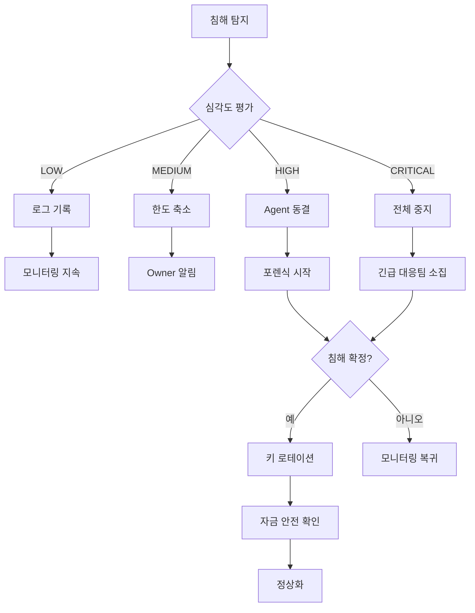
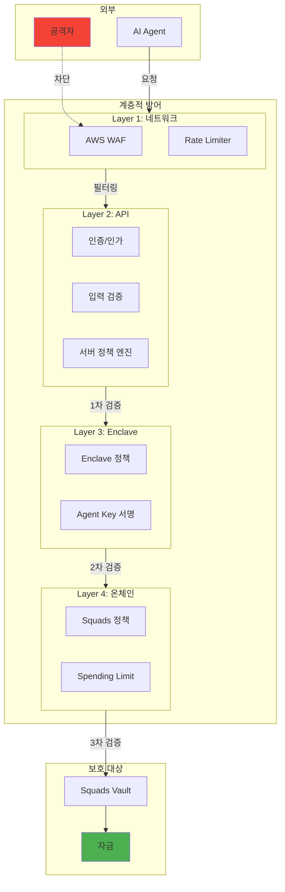
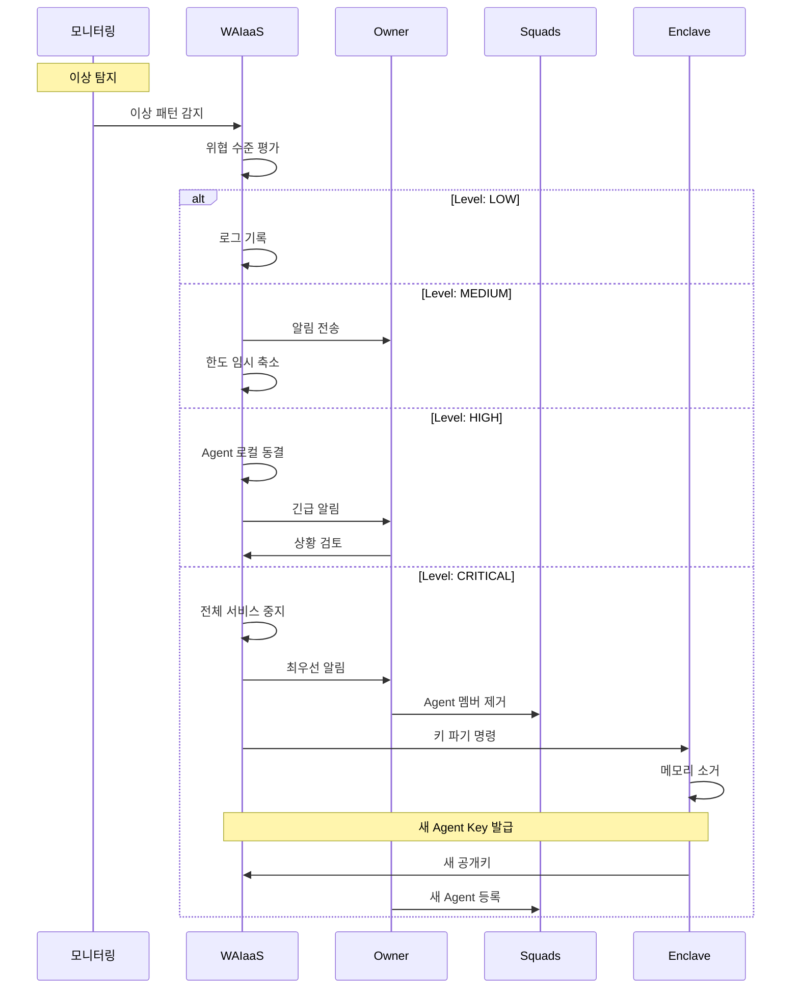
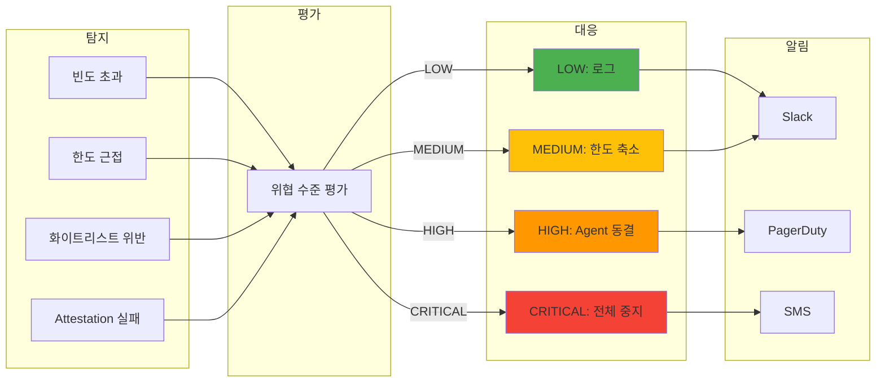

# 보안 위협 모델링 (ARCH-04)

**문서 ID:** ARCH-04
**작성일:** 2026-02-04
**상태:** 완료
**참조:** ARCH-01, ARCH-02, 03-CONTEXT.md, 03-RESEARCH.md

---

## 1. Executive Summary

본 문서는 WAIaaS (Wallet-as-a-Service for AI Agents) 시스템의 보안 위협을 체계적으로 분석하고 대응 방안을 정의한다. AI 에이전트 지갑 시스템은 자율적 트랜잭션 실행이라는 고유한 특성으로 인해 기존 지갑 보안과 차별화된 위협 환경에 노출된다.

**핵심 보안 목표:**
- AI 에이전트의 자율성 유지하면서 자금 보호
- Owner의 최종 통제권 항시 보장
- 침해 시 손실 최소화 및 빠른 복구

**위협 모델링 방법론:** STRIDE (Spoofing, Tampering, Repudiation, Information Disclosure, Denial of Service, Elevation of Privilege) + 암호화폐 특화 위협 분석

---

## 2. 보안 원칙

### 2.1 핵심 원칙

| 원칙 | 설명 | 적용 |
|------|------|------|
| **보안 최우선** | 사용성보다 보안 우선 | 불편하더라도 안전한 기본값 |
| **계층적 방어 (Defense in Depth)** | 단일 방어선 의존 금지 | 서버 + Enclave + 온체인 3중 검증 |
| **Fail-safe (장애 시 거부)** | 불확실하면 거부 | 연결 실패, 타임아웃 시 트랜잭션 거부 |
| **최소 권한** | 필요 최소한의 권한만 부여 | Agent Key는 정책 범위 내 실행만 |
| **깊은 가시성** | 모든 작업 추적 | CloudTrail 불변 로그, 실시간 모니터링 |

### 2.2 보안 계층 구조



### 2.3 보안 경계 정의

| 경계 | 신뢰 수준 | 설명 |
|------|----------|------|
| **외부 (AI Agent)** | 제한적 신뢰 | 정책 기반 실행만 허용 |
| **API Server** | 중간 신뢰 | 1차 검증 담당, 침해 가능성 고려 |
| **Nitro Enclave** | 높은 신뢰 | 하드웨어 격리, 2차 검증 |
| **AWS KMS** | 최고 신뢰 | FIPS 140-2 Level 3 HSM |
| **Squads Protocol** | 불변 신뢰 | 온체인 정책, 변조 불가 |

---

## 3. 위협 매트릭스

### 3.1 위협 목록

| ID | 위협 | 공격 벡터 | 발생 가능성 | 영향도 | 위험 수준 | 대응 방안 |
|----|------|----------|------------|--------|----------|----------|
| T01 | **Agent Key 탈취** | Enclave 이미지 변조, 호스트 침해, 메모리 덤프 | 낮음 | 치명적 | 높음 | PCR attestation, 하드웨어 격리, 정책 한도 |
| T02 | **Owner Key 탈취** | IAM 자격 증명 유출, 피싱, 내부자 | 중간 | 치명적 | 높음 | MFA 필수, 역할 분리, CloudTrail 실시간 감시 |
| T03 | **정책 우회** | 서버 침해, API 조작, SQL injection | 중간 | 높음 | 높음 | Enclave + 온체인 이중 검증, 입력 검증 |
| T04 | **네트워크 분리 공격** | MITM, Enclave 연결 차단, DDoS | 중간 | 중간 | 중간 | Fail-safe, 다중 RPC, heartbeat 모니터링 |
| T05 | **에이전트 로직 오류** | AI 버그, 잘못된 의사결정, 반복 거래 | 높음 | 중간 | 높음 | 한도 제한, Circuit Breaker, 쿨다운 |
| T06 | **내부자 공격** | 운영자 키 접근, 권한 남용 | 낮음 | 높음 | 중간 | IAM 최소 권한, MFA, 2인 승인, 불변 로그 |
| T07 | **AI 기반 피싱** | Deepfake, 소셜 엔지니어링, 가짜 승인 요청 | 높음 | 중간 | 중간 | 자동화된 서명, 사람 개입 최소화 |
| T08 | **Squads 취약점** | 스마트 컨트랙트 버그, 로직 오류 | 매우 낮음 | 높음 | 낮음 | 최신 버전, 감사 확인, 버전 고정 |
| T09 | **서버 침해** | 0-day 취약점, 의존성 취약점, RCE | 중간 | 높음 | 높음 | 패치 관리, 컨테이너 격리, read-only 파일시스템 |
| T10 | **데이터베이스 침해** | SQL injection, 자격 증명 유출, 백업 노출 | 중간 | 중간 | 중간 | 암호화 저장, 접근 제어, 백업 암호화 |

### 3.2 위협 상세 분석

#### T01: Agent Key 탈취

**공격 시나리오:**
1. 공격자가 Enclave 이미지를 변조하여 Agent Key 유출 로직 삽입
2. 호스트 EC2 인스턴스 침해 후 Enclave 통신 가로채기 시도
3. 메모리 덤프를 통한 키 추출 시도

**대응 방안:**
- PCR (Platform Configuration Register) attestation으로 이미지 무결성 검증
- KMS 키 정책에 `kms:RecipientAttestation:PCR0/1/2` 조건 필수
- Nitro Enclave 하드웨어 수준 메모리 격리
- Agent Key는 정책 범위 내 실행만 가능하여 탈취 시에도 손실 한정

#### T02: Owner Key 탈취

**공격 시나리오:**
1. 피싱으로 IAM 자격 증명 탈취
2. 내부자가 KMS 키 접근 권한 남용
3. CloudTrail 로그 조작으로 탐지 회피

**대응 방안:**
- MFA 필수 (KMS 키 정책에 `aws:MultiFactorAuthPresent` 조건)
- IAM 역할 분리 (admin, service, emergency)
- CloudTrail → S3 WORM 저장 (로그 변조 불가)
- Guardian recovery 사전 설정

#### T03: 정책 우회

**공격 시나리오:**
1. API 서버 침해 후 정책 평가 로직 우회
2. SQL injection으로 정책 데이터 변조
3. 직접 Enclave에 악의적 요청 전송 시도

**대응 방안:**
- 정책 검증을 서버 + Enclave + 온체인 3중으로 수행
- Enclave는 독립적으로 정책 검증 (서버 침해 시에도 보호)
- Squads 온체인 spending limits (변조 불가)

---

## 4. 키 탈취 대응 메커니즘

### 4.1 위협 수준별 4단계 대응

| 수준 | 조건 | 탐지 지표 | 자동 대응 | 수동 조치 |
|------|------|----------|----------|----------|
| **LOW** | 단일 정책 경미 위반 | 한도 80% 도달, 쿨다운 위반 | 로그 기록, 알림 | 모니터링 |
| **MEDIUM** | 연속 실패 또는 정책 경계 | 3회 연속 거부, 일일 한도 근접 | Owner 알림, 임시 한도 축소 (50%) | 상황 검토 |
| **HIGH** | 명백한 비정상 패턴 | 비허용 시간대 대량 요청, 화이트리스트 외 반복 시도 | Agent 즉시 동결, Owner 승인 필요 | 포렌식 검토 |
| **CRITICAL** | 침해 확인 또는 의심 | CloudTrail 이상, Enclave attestation 실패 | Agent Key 해제, 새 키 발급, 자금 동결 | 전체 보안 리뷰 |

### 4.2 Agent Key 탈취 시 대응



**손실 범위:** Agent Key 탈취 시에도 정책 한도 내 손실로 제한
- 단건 최대: perTransactionLimit (예: 1 SOL)
- 일일 최대: dailyTotalLimit (예: 10 SOL)
- Spending Limit 주기 내 최대: 설정된 한도

### 4.3 Owner Key 탈취 시 대응



**대응 절차:**
1. CloudTrail 실시간 알림으로 비정상 KMS 사용 조기 감지
2. Time-locked 트랜잭션이면 취소 기회 제공
3. Guardian recovery 사전 설정으로 최후 수단 보장
4. 모든 KMS 키 무효화 및 새 키 발급

---

## 5. 내부자 위협 방어

### 5.1 작업 민감도별 보호 수준

| 작업 | 민감도 | 보호 수준 | 상세 |
|------|--------|----------|------|
| **KMS 키 사용 (Sign)** | 높음 | MFA 필수 | KMS 키 정책 `aws:MultiFactorAuthPresent: true` |
| **정책 변경** | 높음 | 2인 승인 + 감사 로그 | PR 리뷰 필수, CloudTrail 기록 |
| **Enclave 이미지 배포** | 치명적 | PR 리뷰 + 해시 검증 + 승인 | PCR 화이트리스트 업데이트 필요 |
| **IAM 권한 변경** | 치명적 | 관리자 2인 승인 | AWS Organizations SCP 적용 |
| **DB 직접 접근** | 높음 | 감사 로그 + 읽기 전용 | 프로덕션 쓰기 금지, 세션 기록 |
| **서버 SSH 접근** | 중간 | SSM Session Manager | 키 기반 SSH 대신 감사 가능 접근 |

### 5.2 IAM 역할 분리

```
┌─────────────────────────────────────────────────────────────────┐
│                    IAM 역할 분리 구조                            │
├─────────────────────────────────────────────────────────────────┤
│                                                                  │
│  ┌──────────────────┐  ┌──────────────────┐  ┌────────────────┐ │
│  │ WAIaaS-AdminRole │  │ WAIaaS-ServiceRole│  │WAIaaS-Emergency│ │
│  ├──────────────────┤  ├──────────────────┤  ├────────────────┤ │
│  │ MFA 필수         │  │ EC2 전용         │  │ 봉인 보관      │ │
│  │ IAM 관리         │  │ KMS Sign만       │  │ MFA + 2인 승인 │ │
│  │ 정책 변경        │  │ Enclave 통신     │  │ 긴급 복구 전용 │ │
│  │ 감사 로그 접근   │  │ RDS/Redis 접근   │  │ KMS 전체 권한  │ │
│  └──────────────────┘  └──────────────────┘  └────────────────┘ │
│           │                    │                    │            │
│           ▼                    ▼                    ▼            │
│  ┌───────────────────────────────────────────────────────────┐  │
│  │              최소 권한 원칙 (Least Privilege)             │  │
│  │  - 각 역할은 필요한 작업만 수행 가능                     │  │
│  │  - 교차 권한 없음 (Admin이 Sign, Service가 IAM 불가)     │  │
│  │  - Emergency는 평시 비활성화, 봉인된 자격 증명           │  │
│  └───────────────────────────────────────────────────────────┘  │
│                                                                  │
└─────────────────────────────────────────────────────────────────┘
```

### 5.3 고위험 작업 2인 승인 절차

```typescript
interface DualApprovalPolicy {
  // 2인 승인 필요 작업
  requiredFor: [
    'ENCLAVE_IMAGE_DEPLOY',
    'IAM_ROLE_MODIFY',
    'KMS_KEY_POLICY_CHANGE',
    'POLICY_GLOBAL_UPDATE',
    'EMERGENCY_FUND_RECOVERY'
  ];

  // 승인 절차
  procedure: {
    initiator: string;        // 요청자
    approvers: string[];      // 승인 가능자 목록 (요청자 제외)
    requiredApprovals: 1;     // 최소 승인 수
    timeoutHours: 24;         // 승인 대기 시간
    notificationChannels: ['slack', 'email'];
  };
}
```

---

## 6. 이상 탐지

### 6.1 탐지 방식: 규칙 기반 (ML 없이 시작)

초기에는 복잡도와 운영 비용을 최소화하기 위해 규칙 기반 탐지를 적용한다. 데이터 축적 후 ML 도입을 검토한다.

**규칙 기반 선택 이유:**
- 해석 가능성: 왜 탐지되었는지 명확
- 운영 단순성: 모델 학습/배포 불필요
- 빠른 구현: 즉시 적용 가능
- 낮은 오탐율: 임계값 조정으로 정밀 제어

### 6.2 탐지 규칙

| 규칙 ID | 이름 | 조건 | 위협 수준 | 대응 |
|---------|------|------|----------|------|
| R01 | **빈도 초과** | 1분 내 10건 이상 요청 | MEDIUM | 임시 쓰로틀링 |
| R02 | **한도 근접** | 일일 한도 80% 초과 | LOW | Owner 알림 |
| R03 | **한도 초과 시도** | 한도 초과 요청 3회 연속 | MEDIUM | 한도 50% 축소 |
| R04 | **비허용 시간대** | UTC 0-6시 거래 (설정 시) | LOW | 로그 + 알림 |
| R05 | **화이트리스트 외** | 비허용 주소 3회 연속 시도 | HIGH | Agent 동결 |
| R06 | **연속 실패** | 서명/제출 5회 연속 실패 | HIGH | Circuit Breaker |
| R07 | **비정상 금액** | 평균 거래액 10배 초과 | MEDIUM | Owner 승인 요청 |
| R08 | **Enclave 이상** | Attestation 실패 | CRITICAL | 전체 중지 |

### 6.3 이상 탐지 흐름



### 6.4 Circuit Breaker

연속 실패 시 자동 정지하여 추가 손실을 방지한다.

```typescript
interface CircuitBreakerConfig {
  // 트리거 조건
  failureThreshold: 5;           // 연속 실패 횟수
  failureWindowSeconds: 300;      // 측정 윈도우 (5분)

  // 상태
  states: {
    CLOSED: '정상 - 모든 요청 허용';
    OPEN: '차단 - 모든 요청 거부';
    HALF_OPEN: '테스트 - 제한적 허용';
  };

  // 복구
  recoveryTimeSeconds: 600;       // 자동 HALF_OPEN 전환 (10분)
  testRequestsAllowed: 3;         // HALF_OPEN 상태에서 허용 요청 수
  successThreshold: 3;            // CLOSED 복귀에 필요한 연속 성공
}
```

**상태 전이:**
```
CLOSED --[연속 실패 >= 5]--> OPEN
OPEN --[10분 경과]--> HALF_OPEN
HALF_OPEN --[3회 연속 성공]--> CLOSED
HALF_OPEN --[1회 실패]--> OPEN
```

### 6.5 알림 연동

| 채널 | 용도 | 위협 수준 | 설정 |
|------|------|----------|------|
| **Slack** | 실시간 모니터링 | LOW 이상 | #waiass-alerts 채널 |
| **PagerDuty** | 긴급 대응 | HIGH 이상 | On-call 로테이션 |
| **Email** | 요약 리포트 | 모든 수준 | 일일 요약 |
| **SMS** | 최고 긴급 | CRITICAL | Owner 직접 연락 |

---

## 7. 감사 및 모니터링

### 7.1 CloudTrail 불변 감사 로그

**로그 대상:**
- KMS 모든 작업 (Sign, Decrypt, CreateKey 등)
- IAM 변경 (CreateRole, AttachPolicy 등)
- EC2/Enclave 작업
- API 호출 (CloudTrail Data Events)

**불변성 보장:**
```
CloudTrail → S3 Bucket (WORM) → Glacier (장기 보관)
              ↓
            Object Lock
            (Governance Mode, 7년 보존)
```

### 7.2 S3 WORM (Write Once Read Many) 설정

```json
{
  "ObjectLockConfiguration": {
    "ObjectLockEnabled": "Enabled",
    "Rule": {
      "DefaultRetention": {
        "Mode": "GOVERNANCE",
        "Years": 7
      }
    }
  }
}
```

### 7.3 실시간 알람 설정

| 알람 | 조건 | 심각도 | 대응 |
|------|------|--------|------|
| KMS 비인가 접근 | Sign 실패 (AccessDenied) 3회/5분 | HIGH | 조사 |
| 비정상 IAM 변경 | 역할/정책 변경 | HIGH | 즉시 확인 |
| Enclave 비정상 | vsock 연결 실패 5회/분 | CRITICAL | 서비스 점검 |
| 높은 거부율 | 정책 거부 > 50% (10분) | MEDIUM | 원인 분석 |
| DB 연결 실패 | 연결 풀 고갈 | HIGH | 용량 확인 |

### 7.4 월간 보안 리뷰 절차

**리뷰 체크리스트:**

1. **접근 권한 검토**
   - [ ] IAM 역할별 최소 권한 확인
   - [ ] 미사용 자격 증명 정리
   - [ ] KMS 키 정책 검토

2. **로그 분석**
   - [ ] CloudTrail 이상 패턴 검토
   - [ ] 거부된 요청 패턴 분석
   - [ ] Agent 행동 패턴 검토

3. **취약점 점검**
   - [ ] 의존성 취약점 스캔 (npm audit, Snyk)
   - [ ] Enclave 이미지 업데이트 확인
   - [ ] Squads Protocol 버전 확인

4. **정책 효과성**
   - [ ] 오탐/미탐 비율 검토
   - [ ] 임계값 조정 필요성 평가
   - [ ] 새 위협 벡터 분석

---

## 8. 복구 절차

### 8.1 침해 탐지 시 대응 플레이북



### 8.2 키 로테이션 절차

**Agent Key 로테이션:**
1. 새 Agent Key 생성 (Enclave 내부)
2. Owner 승인 획득
3. Squads addMember (새 키)
4. Squads removeMember (기존 키)
5. 기존 키 메모리 소거
6. 메타데이터 업데이트

**Owner Key 로테이션:**
1. 새 KMS 키 생성
2. Emergency Role로 승인
3. Squads configAuthority 변경
4. 기존 키 비활성화 스케줄
5. 30일 후 기존 키 삭제

### 8.3 긴급 동결 절차

**즉시 동결 (< 1분):**
```typescript
async function emergencyFreeze(walletId: string): Promise<void> {
  // 1. 로컬 Agent 즉시 정지
  await agentKeyStore.suspend(walletId);

  // 2. Redis에 동결 플래그
  await redis.set(`freeze:${walletId}`, 'true', 'EX', 86400);

  // 3. 진행 중 트랜잭션 취소 시도
  await cancelPendingTransactions(walletId);

  // 4. 알림
  await notificationService.sendEmergency({
    type: 'WALLET_FROZEN',
    walletId,
    reason: 'Emergency freeze triggered'
  });
}
```

**온체인 동결 (Owner 필요):**
```typescript
async function onchainFreeze(walletId: string): Promise<void> {
  // Squads threshold를 2-of-2로 변경하여 Agent 단독 실행 불가
  await squads.changeThreshold(walletId, 2);

  // 또는 Agent 멤버 제거
  await squads.removeMember(walletId, agentPublicKey);
}
```

### 8.4 포렌식 보존 절차

**증거 수집:**
1. CloudTrail 로그 스냅샷 (침해 전후 7일)
2. 애플리케이션 로그 백업
3. Enclave attestation 기록
4. 네트워크 트래픽 로그 (VPC Flow Logs)
5. 데이터베이스 감사 로그

**보존 원칙:**
- 원본 로그 변경 금지
- 해시 검증 가능한 사본 생성
- Chain of custody 문서화
- 법적 요구사항 준수 (최소 7년 보관)

---

## 9. Mermaid 다이어그램

### 9.1 계층적 방어 구조도



### 9.2 키 탈취 대응 흐름



### 9.3 이상 탐지 -> 대응 흐름



---

## 10. 참조 문서

### 10.1 내부 문서

| 문서 | 내용 | 위치 |
|------|------|------|
| **ARCH-01** | Dual Key 아키텍처 | .planning/deliverables/08-dual-key-architecture.md |
| **ARCH-02** | 시스템 컴포넌트 | .planning/deliverables/09-system-components.md |
| **03-CONTEXT** | Phase 3 보안 결정 | .planning/phases/03-system-architecture/03-CONTEXT.md |
| **03-RESEARCH** | 위협 분석 리서치 | .planning/phases/03-system-architecture/03-RESEARCH.md |

### 10.2 외부 참조

| 참조 | 내용 | 신뢰도 |
|------|------|--------|
| [OWASP Threat Modeling](https://owasp.org/www-community/Threat_Modeling) | 위협 모델링 방법론 | HIGH |
| [AWS Security Best Practices](https://docs.aws.amazon.com/wellarchitected/latest/security-pillar/welcome.html) | AWS 보안 가이드 | HIGH |
| [Chainalysis 2024 Report](https://www.chainalysis.com/blog/2024-crypto-crime-report-introduction/) | 암호화폐 위협 동향 | MEDIUM |
| [NIST Cybersecurity Framework](https://www.nist.gov/cyberframework) | 보안 프레임워크 | HIGH |

---

*문서 ID: ARCH-04*
*작성일: 2026-02-04*
*Phase: 03-system-architecture*
*상태: 완료*
