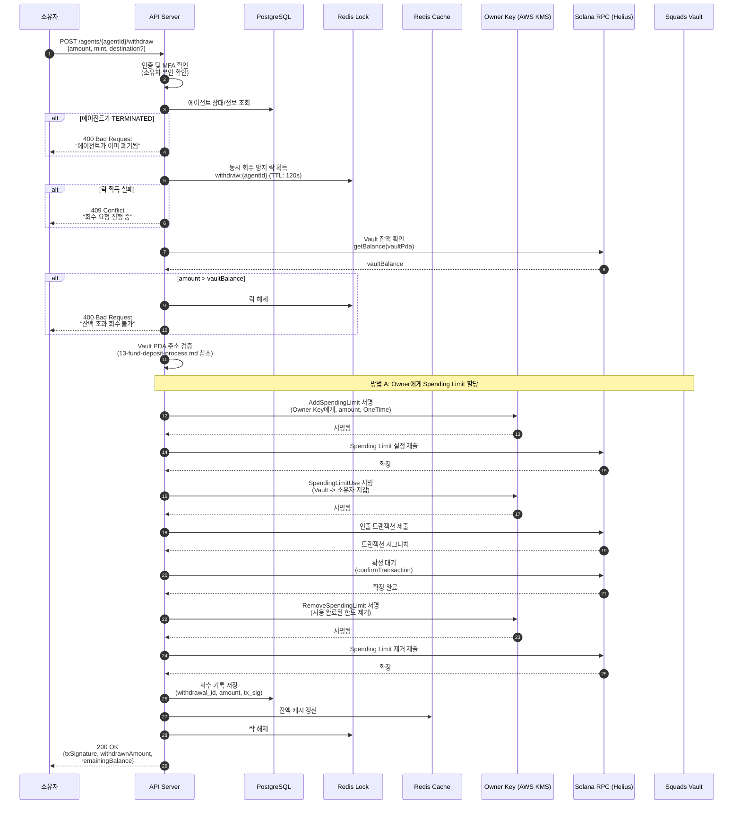
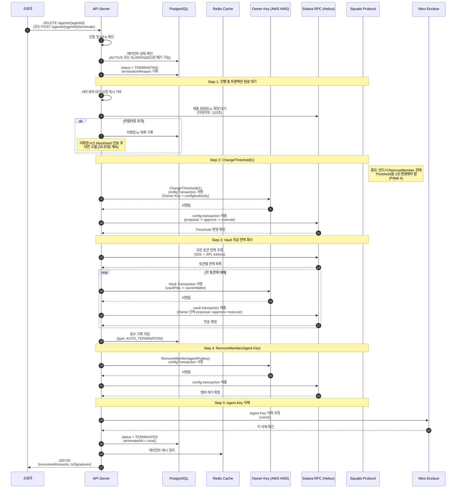

# 자금 회수 프로세스 설계 (REL-02)

**문서 ID:** REL-02
**작성일:** 2026-02-05
**상태:** 완료
**참조:** ARCH-01 (08-dual-key-architecture.md), ARCH-03 (10-transaction-flow.md), REL-01 (13-fund-deposit-process.md), 04-RESEARCH.md

---

## 1. 개요 및 설계 원칙

### 1.1 회수의 정의

자금 회수(Withdrawal)는 에이전트 Squads Vault에서 소유자 지갑으로의 자금 이동을 의미한다. 이는 REL-01 (13-fund-deposit-process.md)에서 정의한 **예산 풀(Budget Pool) 충전의 역방향 흐름**이다.

```
┌─────────────────────────────────────────────────────────────────┐
│                    자금 회수 개요                                 │
├─────────────────────────────────────────────────────────────────┤
│                                                                  │
│   에이전트 Squads Vault              소유자 지갑                  │
│   ┌─────────────────┐               ┌─────────────┐             │
│   │  Vault (예산 풀) │──── 회수 ───>│  Owner       │             │
│   │  - SOL           │               │  Wallet      │             │
│   │  - USDC          │               │              │             │
│   └────────┬────────┘               └─────────────┘             │
│            │                                                     │
│     Owner Key 단독 권한                                          │
│     (configAuthority)                                            │
│     에이전트 동의 불필요                                         │
│                                                                  │
└─────────────────────────────────────────────────────────────────┘
```

### 1.2 핵심 원칙

| 원칙 | 설명 | 근거 |
|------|------|------|
| **Owner Key 단독 권한** | 회수는 항상 Owner Key의 권한이며, 에이전트 동의가 불필요 | Owner Key가 configAuthority (ARCH-01) |
| **사용자 결정 반영** | 에이전트 폐기 시 잔액 전액 자동 회수 | CONTEXT.md 확정 사항 |
| **온체인 안전성** | ChangeThreshold 순서를 엄격히 준수 | Pitfall 4 반영 |
| **감사 추적** | 모든 회수 기록을 DB에 영구 보존 | 규제 대비 및 분쟁 해결 |
| **원자적 실행** | 회수 프로세스 중 에이전트 트랜잭션 차단 | SUSPENDED 전환 후 회수 |

### 1.3 REL-01과의 관계

| 항목 | REL-01 (충전) | REL-02 (회수) |
|------|-------------|-------------|
| 방향 | 소유자 -> Vault | Vault -> 소유자 |
| 서명 주체 | Owner Key | Owner Key |
| 트리거 | 소유자 요청 / 자동 보충 | 소유자 요청 / 자동 (폐기 시) / 비상 |
| Spending Limit 관련 | 에이전트용 Spending Limit 설정 | Owner용 Spending Limit 또는 Threshold 변경 |
| 상세 참조 | 13-fund-deposit-process.md | 본 문서 |

---

## 2. 회수 트리거 유형

### 2.1 트리거 분류

| 트리거 유형 | 주체 | 대상 | 금액 | 선행 조건 | 에이전트 상태 변경 |
|------------|------|------|------|----------|-----------------|
| **수동 회수** | 소유자 | 부분 또는 전액 | 소유자 지정 | MFA 인증 | 회수 중 SUSPENDED (선택) |
| **자동 회수 (폐기 시)** | 시스템 | 전액 | Vault 전체 잔액 | TERMINATING 상태 진입 | TERMINATING -> TERMINATED |
| **비상 회수** | 소유자 / 시스템 | 전액 (권장) | Vault 전체 잔액 | 비상 트리거 발동 (REL-04) | SUSPENDED -> TERMINATING 가능 |

### 2.2 트리거별 상세 비교

| 항목 | 수동 회수 | 자동 회수 | 비상 회수 |
|------|----------|----------|----------|
| **빈도** | 소유자 필요 시 | 에이전트 폐기 시 1회 | 비상 상황 시 |
| **긴급도** | 일반 | 일반 (폐기 절차 일부) | 긴급 |
| **인증** | MFA + Owner Key | 폐기 명령에 포함 | MFA (수동) / 자동 SUSPENDED 후 수동 |
| **사전 처리** | 없음 또는 SUSPENDED 선택 | 진행 중 tx 완료 대기 | 즉시 SUSPENDED + tx 차단 |
| **Threshold 변경** | 불필요 (Spending Limit 방식) | 필요 (ChangeThreshold(1)) | 필요 (ChangeThreshold(1)) |
| **후속 조치** | 잔액 갱신, 알림 | RemoveMember, 키 삭제 | 소유자 판단 (폐기 또는 재활성화) |
| **상세 정의** | 본 문서 섹션 3 | 본 문서 섹션 4 | REL-04 문서 (참조) |

---

## 3. 수동 회수 프로세스

### 3.1 수동 회수 시퀀스 다이어그램

소유자가 에이전트 Vault에서 원하는 금액을 소유자 지갑으로 회수하는 흐름이다.



### 3.2 부분 회수 vs 전액 회수

| 항목 | 부분 회수 | 전액 회수 |
|------|----------|----------|
| 금액 | 소유자 지정 금액 | Vault 전체 잔액 |
| 검증 | `amount <= vaultBalance` | `amount = vaultBalance` |
| 에이전트 상태 | 변경 없음 (계속 ACTIVE) | 변경 없음 (0 잔액으로 계속 운영) |
| Spending Limit 영향 | 기존 Spending Limit 유지 | 기존 Spending Limit 유지 (잔액 0이면 사실상 사용 불가) |
| 용도 | 과도한 예치금 회수 | 예산 조정, 에이전트 운영 중단 전 |

### 3.3 회수 중 에이전트 트랜잭션 처리

수동 회수 시 에이전트의 트랜잭션 처리 옵션:

| 옵션 | 동작 | 장점 | 단점 |
|------|------|------|------|
| **비차단 (기본)** | 회수 중에도 에이전트 트랜잭션 허용 | 에이전트 운영 중단 없음 | 회수와 에이전트 사용이 동시 발생 가능 |
| **차단** | 회수 시작 시 SUSPENDED 전환 | 잔액 일관성 보장 | 에이전트 일시 중단 |

기본 정책: **비차단**. 부분 회수 시 잔여 잔액이 충분하면 에이전트 운영에 영향 없음. 소유자가 `suspendDuringWithdrawal: true` 옵션으로 차단 모드 선택 가능.

---

## 4. 자동 회수 - 에이전트 폐기 시

### 4.1 폐기 시 자동 회수 원칙

사용자 결정 사항 (CONTEXT.md): **에이전트 폐기 시 잔액 전액 자동으로 소유자 지갑에 회수**

이 결정에 따라 에이전트 TERMINATING 상태 진입 시 Vault 잔액을 자동으로 소유자에게 반환하는 프로세스가 실행된다.

### 4.2 폐기 시 자동 회수 시퀀스 다이어그램



### 4.3 Squads Threshold 변경 순서 (Pitfall 4)

> **중요 경고:** 에이전트 폐기 시 다음 순서를 반드시 준수해야 한다. 순서를 변경하면 자금이 영구적으로 잠길 수 있다.

```
반드시 이 순서대로 실행:

1. ChangeThreshold(1)
   └── Owner Key(configAuthority)로 threshold을 2에서 1로 변경
   └── 이후 Owner 단독으로 vault transaction 실행 가능

2. Vault 자금 전액 회수
   └── Owner Key 단독으로 proposal -> approve -> execute
   └── 모든 토큰(SOL + SPL)에 대해 반복

3. RemoveMember(Agent Key)
   └── 멤버 제거 (이미 threshold=1이므로 안전)
   └── Agent Key가 더 이상 Squads 멤버가 아님

절대 하면 안 되는 순서:
  RemoveMember 먼저 -> threshold=2인데 멤버 1명 -> 자금 잠김
  키 삭제 먼저 -> Agent Key 소실 -> 2-of-2 충족 불가 -> 자금 잠김
```

### 4.4 단계별 실패 처리

| 실패 단계 | 증상 | 복구 절차 |
|----------|------|----------|
| ChangeThreshold 실패 | threshold이 여전히 2 | 재시도 (configAuthority 권한 확인) |
| Vault 회수 실패 (SOL) | 소유자 지갑에 SOL 미도착 | 재시도, tx signature로 온체인 확인 |
| Vault 회수 실패 (SPL) | 특정 토큰 미회수 | 해당 토큰만 재시도, ATA 존재 확인 |
| RemoveMember 실패 | Agent Key가 여전히 멤버 | 재시도 (자금 회수 완료 상태이므로 위험 낮음) |
| Agent Key 삭제 실패 | Enclave 통신 오류 | Enclave 재기동 후 재시도, 멤버 이미 제거되었으므로 온체인 위험 없음 |

모든 실패 시: **소유자에게 즉시 알림**, 수동 개입 안내. TERMINATING 상태 유지 (TERMINATED로 전환하지 않음).

---

## 5. Squads Vault 자금 이동 메커니즘

### 5.1 두 가지 방법

Squads Vault에서 자금을 이동하는 데 두 가지 메커니즘이 있다.

#### 방법 A: Owner에게 Spending Limit 할당

Owner Key에게 OneTime Spending Limit을 할당하여 SpendingLimitUse instruction으로 직접 인출한다.

```
1. AddSpendingLimit (configAuthority = Owner Key)
   - members: [ownerPublicKey]
   - amount: 회수할 금액
   - period: OneTime
   - vault_index: 0

2. SpendingLimitUse (Owner Key 서명)
   - Vault에서 소유자 지갑으로 직접 전송

3. RemoveSpendingLimit (사용 완료 후 정리)
```

#### 방법 B: ChangeThreshold(1) + Owner 단독 Vault Transaction

Threshold을 1로 변경한 후 Owner Key 단독으로 proposal -> approve -> execute 워크플로를 실행한다.

```
1. ChangeThreshold(1) (configAuthority = Owner Key)
   - threshold: 2 -> 1

2. Vault Transaction (Owner Key 단독)
   - createProposal -> approveProposal -> executeTransaction
   - Owner 혼자서 모든 단계 수행

3. (필요 시) ChangeThreshold(2) (원복)
```

### 5.2 방법 비교

| 항목 | 방법 A (Spending Limit) | 방법 B (Threshold 변경) |
|------|----------------------|----------------------|
| **온체인 트랜잭션 수** | 3건 (Add + Use + Remove) | 3-4건 (Threshold + Proposal + Approve + Execute) |
| **Threshold 변경** | 불필요 | 필요 (보안 영향) |
| **보안 위험** | 낮음 (OneTime이므로 1회 사용 후 소멸) | 중간 (Threshold=1 기간 동안 Owner 단독 제어) |
| **원복 필요** | 불필요 (자동 소멸) | 필요 (ChangeThreshold(2)로 원복) |
| **적합 용도** | **수동 부분 회수** (에이전트 계속 운영) | **폐기 시 전액 회수** (이후 멤버 제거) |
| **에이전트 영향** | 없음 (기존 Spending Limit 유지) | 있음 (Threshold 변경 기간 중 보안 수준 하락) |

### 5.3 용도별 권장 방법

| 시나리오 | 권장 방법 | 이유 |
|---------|----------|------|
| 수동 부분 회수 | **방법 A** | Threshold 유지, 에이전트 운영 영향 없음 |
| 수동 전액 회수 | **방법 A** | 에이전트 ACTIVE 유지 시 안전 |
| 폐기 시 전액 회수 | **방법 B** | 어차피 폐기이므로 Threshold=1로 변경 후 회수, RemoveMember까지 연속 실행 |
| 비상 회수 | **방법 B** | 긴급 상황에서 Threshold=1로 Owner 완전 통제 확보 |

### 5.4 Open Question: configAuthority Vault 접근 범위

> **구현 시 검증 필요:** configAuthority가 threshold 변경 후 단독으로 vault transaction을 실행할 수 있는지, 아니면 proposal 과정을 반드시 거쳐야 하는지는 구현 시 Devnet 테스트로 확인해야 한다 (04-RESEARCH.md Open Question #1 참조).
>
> 현재 설계는 두 가지 시나리오 모두 지원하도록 방법 A와 방법 B를 병렬로 정의하였다. 구현 시 더 효율적인 방법을 주 경로로 채택한다.

---

## 6. 회수 데이터 모델

### 6.1 WithdrawalRequest 인터페이스

```typescript
// 회수 요청 데이터 모델
interface WithdrawalRequest {
  /** 고유 식별자 (UUID v7) */
  withdrawalId: string;

  /** 에이전트 ID */
  agentId: string;

  /** 소유자 ID */
  ownerId: string;

  /** 회수 유형 */
  type: WithdrawalType;

  /** 회수 금액 (lamports 또는 token units) */
  amount: bigint;

  /** 토큰 민트 주소 (SOL = null) */
  mint: PublicKey | null;

  /** 출발지: Squads Vault PDA */
  sourceVaultPda: PublicKey;

  /** 목적지: 소유자 지갑 주소 */
  destinationPubkey: PublicKey;

  /** 회수 상태 */
  status: WithdrawalStatus;

  /** Squads 메커니즘 (A: SpendingLimit, B: Threshold) */
  mechanism: 'spending_limit' | 'threshold_change';

  /** 요청 시점 */
  requestedAt: Date;

  /** 실행 시작 시점 */
  executingAt: Date | null;

  /** 완료 시점 */
  completedAt: Date | null;

  /** 트랜잭션 시그니처 목록 */
  txSignatures: string[];

  /** 실패 사유 (실패 시) */
  failureReason: string | null;

  /** 메타데이터 */
  metadata: {
    /** 회수 전 Vault 잔액 */
    preWithdrawalBalance: bigint;
    /** 회수 후 Vault 잔액 */
    postWithdrawalBalance: bigint;
    /** 폐기 시: 연관된 에이전트 상태 변경 ID */
    terminationId?: string;
    /** 비상 시: 트리거 유형 */
    emergencyTrigger?: string;
  };
}

/** 회수 유형 */
enum WithdrawalType {
  /** 소유자 수동 회수 (부분/전액) */
  MANUAL = 'manual',
  /** 에이전트 폐기 시 자동 전액 회수 */
  AUTO_TERMINATION = 'auto_termination',
  /** 비상 회수 (REL-04) */
  EMERGENCY = 'emergency',
}

/** 회수 상태 */
enum WithdrawalStatus {
  /** 요청 접수, 실행 대기 */
  PENDING = 'pending',
  /** 트랜잭션 실행 중 */
  EXECUTING = 'executing',
  /** 회수 완료 */
  COMPLETED = 'completed',
  /** 실패 (수동 개입 필요) */
  FAILED = 'failed',
  /** 소유자에 의해 취소 (PENDING 상태에서만) */
  CANCELLED = 'cancelled',
}
```

### 6.2 DB 감사 로그 스키마

```typescript
// PostgreSQL 감사 로그 테이블 (Prisma 스키마 참고)
interface WithdrawalAuditLog {
  /** 고유 ID (auto-increment) */
  id: number;

  /** 회수 요청 ID (FK) */
  withdrawalId: string;

  /** 에이전트 ID */
  agentId: string;

  /** 소유자 ID */
  ownerId: string;

  /** 회수 유형 */
  type: WithdrawalType;

  /** 금액 (lamports) */
  amount: bigint;

  /** 토큰 민트 */
  mint: string | null;

  /** 출발지 (Vault PDA) */
  sourceAddress: string;

  /** 목적지 (소유자 지갑) */
  destinationAddress: string;

  /** 최종 상태 */
  status: WithdrawalStatus;

  /** 메커니즘 */
  mechanism: 'spending_limit' | 'threshold_change';

  /** 트랜잭션 시그니처 */
  txSignature: string | null;

  /** 실패 사유 */
  failureReason: string | null;

  /** 요청 시점 */
  requestedAt: Date;

  /** 완료 시점 */
  completedAt: Date | null;

  /** 회수 소요 시간 (밀리초) */
  durationMs: number | null;

  /** 요청 IP (감사용) */
  requestIp: string;

  /** 추가 메타데이터 (JSON) */
  metadata: Record<string, unknown>;

  /** 기록 시점 */
  createdAt: Date;
}
```

### 6.3 Prisma 스키마 예시

```prisma
model WithdrawalRequest {
  withdrawalId   String           @id @default(uuid())
  agentId        String
  ownerId        String
  type           WithdrawalType
  amount         BigInt
  mint           String?
  sourceVaultPda String
  destinationPubkey String
  status         WithdrawalStatus @default(PENDING)
  mechanism      String
  requestedAt    DateTime         @default(now())
  executingAt    DateTime?
  completedAt    DateTime?
  txSignatures   String[]
  failureReason  String?
  metadata       Json?

  agent          Agent            @relation(fields: [agentId], references: [id])
  auditLogs      WithdrawalAuditLog[]

  @@index([agentId, status])
  @@index([ownerId, requestedAt])
}

enum WithdrawalType {
  MANUAL
  AUTO_TERMINATION
  EMERGENCY
}

enum WithdrawalStatus {
  PENDING
  EXECUTING
  COMPLETED
  FAILED
  CANCELLED
}
```

---

## 7. 안전장치 및 제약사항

### 7.1 Vault PDA 주소 검증

모든 회수 트랜잭션에서 출발지 주소가 올바른 Vault PDA인지 검증한다 (13-fund-deposit-process.md 2.2, 2.3 참조).

```typescript
// 회수 전 Vault 주소 검증
function validateWithdrawalSource(
  agentMultisigPda: PublicKey,
  vaultIndex: number,
  sourceAddress: PublicKey
): void {
  const expectedVaultPda = deriveVaultPda(agentMultisigPda, vaultIndex);

  if (!sourceAddress.equals(expectedVaultPda)) {
    throw new WithdrawalError(
      'INVALID_SOURCE',
      `출발지 주소 ${sourceAddress.toBase58()}이 ` +
      `Vault PDA ${expectedVaultPda.toBase58()}와 일치하지 않습니다.`
    );
  }
}
```

### 7.2 잔액 초과 회수 방지

```typescript
// 회수 금액 검증
async function validateWithdrawalAmount(
  vaultPda: PublicKey,
  requestedAmount: bigint,
  mint: PublicKey | null
): Promise<void> {
  const currentBalance = await getVaultBalance(vaultPda, mint);

  if (requestedAmount > currentBalance) {
    throw new WithdrawalError(
      'INSUFFICIENT_BALANCE',
      `요청 금액 ${requestedAmount}이 Vault 잔액 ${currentBalance}을 초과합니다.`
    );
  }

  // SOL 회수 시 rent-exempt 최소 잔액 보호
  if (mint === null) {
    const rentExemptMin = await getRentExemptMinimum(vaultPda);
    if (currentBalance - requestedAmount < rentExemptMin) {
      throw new WithdrawalError(
        'RENT_EXEMPT_VIOLATION',
        `회수 후 잔액이 rent-exempt 최소값(${rentExemptMin} lamports) 미만입니다. ` +
        `전액 회수 시에는 계정 폐쇄를 포함해야 합니다.`
      );
    }
  }
}
```

### 7.3 동시 회수 요청 방지 (Redis 락)

```typescript
// Redis 분산 락으로 동시 회수 방지
class WithdrawalLock {
  private readonly redis: Redis;
  private readonly keyPrefix = 'withdraw:lock:';
  private readonly ttlSeconds = 120;  // 2분 타임아웃

  async acquire(agentId: string): Promise<boolean> {
    const key = `${this.keyPrefix}${agentId}`;
    const result = await this.redis.set(key, Date.now().toString(), 'EX', this.ttlSeconds, 'NX');
    return result === 'OK';
  }

  async release(agentId: string): Promise<void> {
    const key = `${this.keyPrefix}${agentId}`;
    await this.redis.del(key);
  }

  async isLocked(agentId: string): Promise<boolean> {
    const key = `${this.keyPrefix}${agentId}`;
    return (await this.redis.exists(key)) === 1;
  }
}
```

### 7.4 회수 중 에이전트 트랜잭션 차단

| 시나리오 | 차단 방식 | 해제 시점 |
|---------|----------|----------|
| 수동 부분 회수 (비차단 모드) | 차단하지 않음 | - |
| 수동 회수 (차단 모드) | SUSPENDED 전환 | 회수 완료 후 ACTIVE 복원 |
| 폐기 시 자동 회수 | TERMINATING 상태 (요청 거부) | TERMINATED (영구) |
| 비상 회수 | SUSPENDED 전환 | 소유자 결정까지 |

### 7.5 실패 시 알림 및 수동 개입

```typescript
// 회수 실패 시 처리 절차
interface WithdrawalFailureHandler {
  /** 실패 기록 */
  recordFailure(withdrawal: WithdrawalRequest, error: Error): Promise<void>;

  /** 소유자 알림 발송 */
  notifyOwner(withdrawal: WithdrawalRequest, error: Error): Promise<void>;

  /** 자동 재시도 (최대 3회) */
  scheduleRetry(withdrawal: WithdrawalRequest, attemptNumber: number): Promise<void>;

  /** 3회 재시도 실패 시: FAILED 상태로 전환, 수동 개입 안내 */
  escalateToManual(withdrawal: WithdrawalRequest): Promise<void>;
}
```

재시도 정책:

| 시도 | 대기 시간 | 동작 |
|------|----------|------|
| 1차 재시도 | 10초 | 동일 트랜잭션 재구성 + 제출 |
| 2차 재시도 | 30초 | 새 blockhash로 트랜잭션 재구성 |
| 3차 재시도 | 60초 | 새 blockhash + priority fee 포함 |
| 3회 실패 | - | FAILED 상태 전환, 소유자 수동 개입 알림 |

### 7.6 안전장치 체크리스트

| 안전장치 | 목적 | 구현 위치 |
|---------|------|----------|
| Vault PDA 주소 검증 | 잘못된 주소에서 인출 방지 | API Server |
| 잔액 초과 검증 | 존재하지 않는 자금 인출 시도 방지 | API Server |
| Redis 분산 락 | 동시 회수 요청 방지 | Redis |
| MFA 인증 | 비인가 회수 방지 | API Server |
| rent-exempt 보호 | SOL 계정 소멸 방지 | API Server |
| ChangeThreshold 순서 강제 | 자금 잠김 방지 (Pitfall 4) | API Server (절차 코드) |
| 실패 알림 | 회수 실패 시 소유자 인지 | 알림 서비스 |
| 감사 로그 | 모든 회수 이력 영구 기록 | PostgreSQL |

---

## 8. 교차 참조 및 의존성

### 8.1 Phase 3 문서 참조

| 참조 문서 | 참조 내용 | 본 문서 관련 섹션 |
|----------|----------|-----------------|
| ARCH-01 (08-dual-key-architecture.md) | Owner Key configAuthority 역할, 권한 정의 | 1.2 핵심 원칙, 4.3 Threshold 변경 순서 |
| ARCH-03 (10-transaction-flow.md) | Fail-safe 원칙, 재시도 없음 정책 | 7.5 실패 시 처리 (재시도는 회수 전용) |
| ARCH-04 (11-security-threat-model.md) | Circuit Breaker, 이상 탐지 트리거 | 2.1 비상 회수 트리거 |

### 8.2 Phase 4 내 연관 문서

| 문서 | 관계 | 연결 포인트 |
|------|------|------------|
| REL-01 (13-fund-deposit-process.md) | 역방향 자금 흐름 | Vault PDA 도출, 잔액 모니터링, 예산 풀 모델 |
| REL-03 (에이전트 키 관리) | 폐기 시 키 삭제 절차 | 4.2 Step 5: Agent Key 삭제 |
| REL-04 (비상 회수) | 비상 회수 상세 절차 | 2.1 비상 회수 트리거 참조 |
| REL-05 (멀티 에이전트) | 에이전트 간 자금 이동 | 5.1 방법 A/B 활용 |

---

## 9. Open Questions

### 9.1 구현 시 검증 필요 사항

| 항목 | 현재 가정 | 검증 방법 |
|------|----------|----------|
| ChangeThreshold(1) 후 Owner 단독 vault transaction | 가능 (proposal -> approve -> execute를 혼자 수행) | Devnet 테스트 |
| configAuthority의 vault 직접 접근 | 불가능 (proposal 과정 필요) | Squads SDK + Devnet 테스트 |
| Owner에게 SpendingLimit 할당 후 SpendingLimitUse | 가능 (members에 Owner 포함) | Devnet 테스트 |
| SPL 토큰 회수 시 ATA 자동 생성 | 소유자 지갑에 ATA 없으면 생성 필요 | Devnet 테스트 |
| 전액 회수 시 Vault PDA 계정 존속 | rent-exempt 잔액 유지 또는 계정 폐쇄 | Devnet 테스트 |

---

*문서 종료. 본 문서는 REL-01 (13-fund-deposit-process.md)의 역방향 흐름을 정의하며, REL-04 (비상 회수)에서 비상 시나리오를 상세화한다.*
