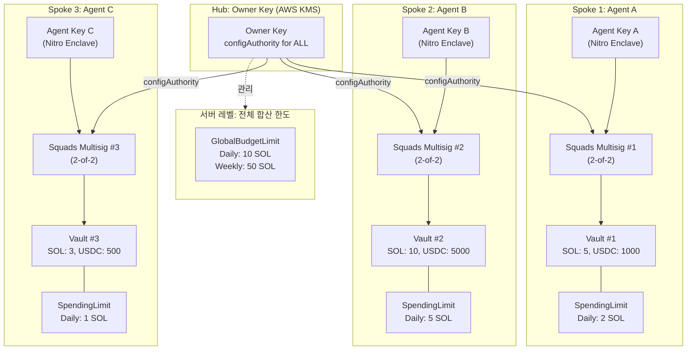
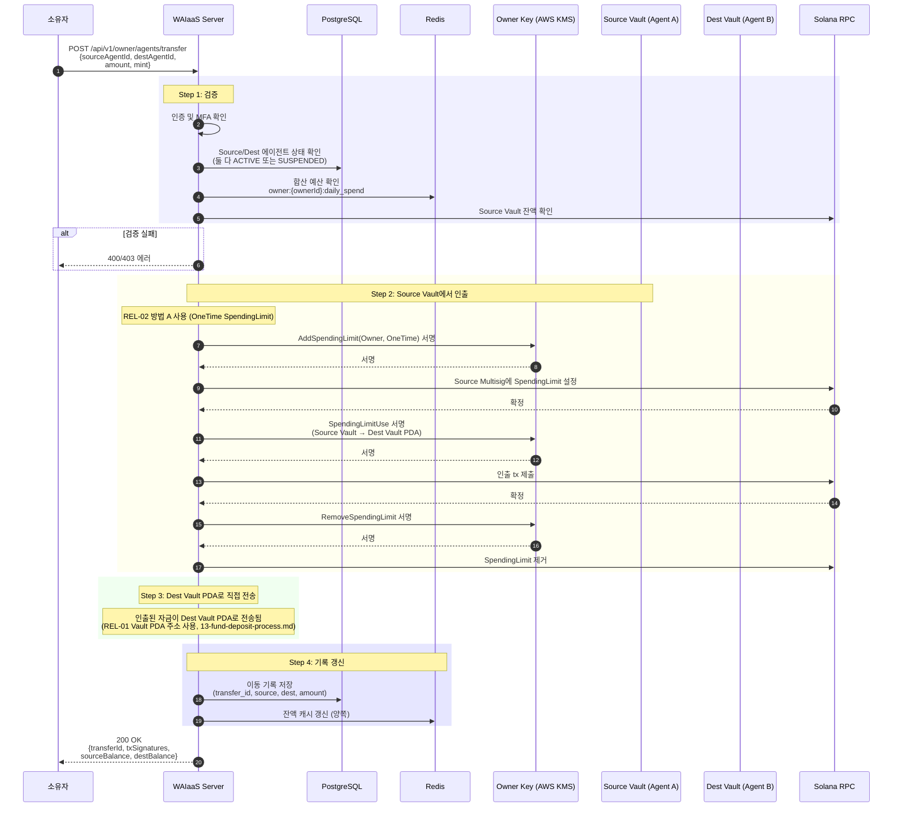
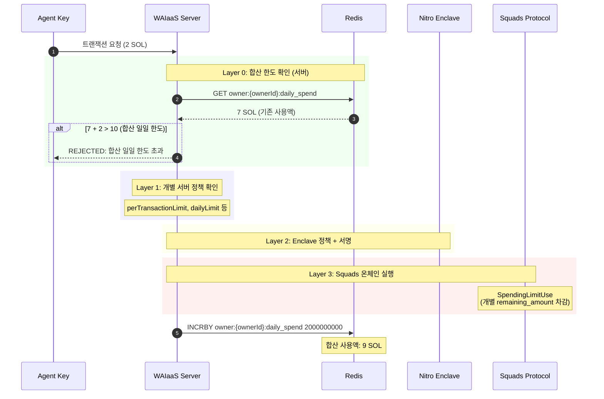

# 멀티 에이전트 관리 모델 설계 (REL-05)

**문서 ID:** REL-05
**작성일:** 2026-02-05
**상태:** 완료
**참조:** REL-01 (13-fund-deposit-process.md), REL-03 (15-agent-lifecycle-management.md), REL-04 (16-emergency-recovery.md), ARCH-01 (08-dual-key-architecture.md), 04-RESEARCH.md

---

## 1. 개요 및 설계 원칙

### 1.1 멀티 에이전트 관리의 정의

멀티 에이전트 관리(Multi-Agent Management)는 하나의 소유자(Owner)가 다수의 AI 에이전트를 운영할 때 필요한 **중앙 집중 관리, 자금 이동, 합산 예산 제어, 통합 모니터링** 기능을 정의한다. 이는 사용자 결정사항(CONTEXT.md)에 따라 다음 원칙을 따른다.

### 1.2 사용자 결정 사항 반영

| 결정 사항 | 구현 방향 |
|----------|----------|
| **에이전트 간 자금 이동 허용** | 소유자 정책 범위 내에서 Vault 간 자금 이동 지원 |
| **에이전트 역할 구분 불필요** | 모든 에이전트 동일 권한, **예산 한도로만 구분** |
| **통합 대시보드 필요** | 소유자가 모든 에이전트 상태/잔액/활동을 한곳에서 확인하는 API 제공 |

### 1.3 설계 원칙

| 원칙 | 설명 | 근거 |
|------|------|------|
| **에이전트 격리** | 각 에이전트는 독립 Squads 멀티시그 + Vault 보유 | 에이전트 간 자금 오염 방지, 장애 전파 차단 |
| **중앙 제어** | Owner Key 하나로 모든 에이전트 관리 (configAuthority) | Hub-and-Spoke 구조로 관리 효율성 |
| **예산 한도 기반 구분** | 역할이 아닌 예산 한도로 에이전트 차별화 | 사용자 결정: 역할 구분 불필요, 예산 한도로만 관리 |
| **합산 예산 제어** | 개별 한도 + 전체 합산 한도의 이중 예산 관리 | 소유자 전체 자금 노출 한도 통제 |
| **통합 가시성** | 모든 에이전트를 단일 대시보드 API로 조회 | 소유자 운영 편의, 이상 탐지 통합 |

---

## 2. Hub-and-Spoke 아키텍처

### 2.1 구조 개요

Hub-and-Spoke 패턴에서 Owner Key(Hub)는 모든 Squads 멀티시그(Spoke)의 configAuthority로 등록된다. 각 에이전트는 독립된 Squads 멀티시그와 Vault를 보유하며, Owner Key를 통해 중앙에서 관리된다.



### 2.2 Hub-and-Spoke 핵심 특성

| 특성 | 설명 |
|------|------|
| **configAuthority 공유** | 동일한 Owner Key가 모든 멀티시그의 configAuthority |
| **Vault 독립** | 각 에이전트의 Vault는 완전히 분리, 에이전트 간 직접 접근 불가 |
| **SpendingLimit 독립** | 각 에이전트에 개별 SpendingLimit 설정 (토큰별/기간별) |
| **Agent Key 독립** | 각 에이전트의 Agent Key는 서로 다른 키 (Enclave 내 별도 관리) |
| **합산 예산 서버 레벨** | Squads는 개별 멀티시그 단위만 관리하므로, 합산 한도는 서버에서 관리 |

### 2.3 Anti-pattern: 단일 멀티시그에 다수 에이전트 금지

```
[금지] 단일 Squads 멀티시그에 다수 Agent Key 등록

문제:
- 에이전트 간 자금 격리 불가 (동일 Vault 공유)
- 한 에이전트의 장애가 다른 에이전트에 영향
- SpendingLimit을 에이전트별로 분리 설정 불가
- 한 에이전트 폐기 시 다른 에이전트에 영향

올바른 구조:
- 에이전트 1개 = Squads 멀티시그 1개 = Vault 1개
- Owner Key는 모든 멀티시그의 configAuthority로 공유
```

---

## 3. 에이전트 간 자금 이동

### 3.1 자금 이동 개요

사용자 결정: "에이전트 간 자금 이동 허용 -- 소유자 정책 범위 내" (CONTEXT.md).

에이전트 간 자금 이동은 **Source Vault → Owner Key 서명 → Destination Vault** 경로를 따른다. Squads 멀티시그 간 직접 전송 메커니즘은 없으므로, Owner Key의 configAuthority 권한을 활용한다.

### 3.2 자금 이동 시퀀스 다이어그램



### 3.3 5단계 절차 요약

| 단계 | 동작 | 서명자 | 비고 |
|------|------|--------|------|
| 1. 검증 | Source/Dest 에이전트 상태, 잔액, 합산 한도 확인 | - | 에이전트 간 이동도 합산 예산에 포함하지 않음 (내부 이동) |
| 2. Source 인출 | Owner에게 OneTime SpendingLimit → SpendingLimitUse | Owner Key | REL-02 방법 A (14-fund-withdrawal-process.md 5.1절) |
| 3. Dest 입금 | SpendingLimitUse의 destination을 Dest Vault PDA로 설정 | Owner Key | Vault PDA 주소 검증 필수 (REL-01 2.3절) |
| 4. 정리 | SpendingLimit 제거, DB/Redis 갱신 | Owner Key | |
| 5. 알림 | 양쪽 에이전트 잔액 변경 알림 | - | 소유자에게 이동 완료 알림 |

### 3.4 이동 제약사항

| 제약 | 이유 |
|------|------|
| 양쪽 에이전트 모두 ACTIVE 또는 SUSPENDED | TERMINATED/TERMINATING 에이전트로의 이동 금지 |
| Source Vault 잔액 >= 이동 금액 | 잔액 부족 방지 |
| 동일 소유자의 에이전트 간만 허용 | 다른 소유자 에이전트로의 이동은 일반 외부 전송 |
| MFA 인증 필수 | 비인가 이동 방지 |
| 동시 이동 방지 (Redis 락) | 동일 Source에 대한 중복 이동 방지 |

### 3.5 에이전트 간 이동과 합산 예산

에이전트 간 자금 이동은 **소유자 내부 이동**이므로, 합산 예산 한도(GlobalBudgetLimit)에 **포함하지 않는다**. 이는 소유자의 전체 자금 총량이 변하지 않기 때문이다.

```
에이전트 A Vault: 5 SOL → 3 SOL  (2 SOL 이동)
에이전트 B Vault: 3 SOL → 5 SOL  (2 SOL 수신)
소유자 전체: 8 SOL → 8 SOL (변동 없음)

합산 예산 영향: 없음 (내부 이동)
```

---

## 4. 전체 에이전트 합산 예산 한도

### 4.1 합산 예산 한도의 필요성

Squads Protocol은 **개별 멀티시그 단위**로만 SpendingLimit을 관리한다. 하나의 소유자가 여러 에이전트를 운영할 때, 개별 에이전트의 한도 합계가 소유자의 의도보다 클 수 있다. 따라서 **전체 에이전트 합산 예산 한도(GlobalBudgetLimit)**를 서버 레벨에서 관리한다.

### 4.2 GlobalBudgetLimit 인터페이스

```typescript
// packages/core/src/domain/budget/GlobalBudgetLimit.ts

/**
 * 전체 에이전트 합산 예산 한도
 *
 * 서버 레벨에서 관리하며, Redis에서 실시간 추적한다.
 * Squads는 개별 멀티시그 단위만 관리하므로 합산 한도는 서버 전용.
 */
interface GlobalBudgetLimit {
  /** 소유자 ID */
  ownerId: string;

  /** 전체 합산 일일 한도 */
  dailyLimit: bigint;

  /** 전체 합산 주간 한도 */
  weeklyLimit: bigint;

  /** 전체 합산 월간 한도 */
  monthlyLimit: bigint;

  /** 현재 일일 사용액 (실시간) */
  currentDailySpend: bigint;

  /** 현재 주간 사용액 */
  currentWeeklySpend: bigint;

  /** 현재 월간 사용액 */
  currentMonthlySpend: bigint;
}

/**
 * 합산 한도 검증 결과
 */
interface GlobalBudgetCheckResult {
  /** 허용 여부 */
  allowed: boolean;

  /** 거부 사유 (거부 시) */
  reason?: 'daily_limit_exceeded' | 'weekly_limit_exceeded' | 'monthly_limit_exceeded';

  /** 현재 합산 사용액 */
  currentSpend: bigint;

  /** 한도 */
  limit: bigint;

  /** 잔여 한도 */
  remaining: bigint;
}

/**
 * 합산 한도 확인 함수
 */
async function checkGlobalBudget(
  ownerId: string,
  requestAmount: bigint,
  redis: Redis
): Promise<GlobalBudgetCheckResult> {
  // Redis에서 현재 합산 사용액 조회
  const dailySpend = BigInt(await redis.get(`owner:${ownerId}:daily_spend`) || '0');
  const config = await getGlobalBudgetConfig(ownerId);

  if (dailySpend + requestAmount > config.dailyLimit) {
    return {
      allowed: false,
      reason: 'daily_limit_exceeded',
      currentSpend: dailySpend,
      limit: config.dailyLimit,
      remaining: config.dailyLimit - dailySpend,
    };
  }

  // 주간, 월간도 동일 패턴
  return { allowed: true, currentSpend: dailySpend, limit: config.dailyLimit, remaining: config.dailyLimit - dailySpend };
}
```

### 4.3 Redis 키 구조

| 키 | 값 | TTL | 용도 |
|----|-----|-----|------|
| `owner:{ownerId}:daily_spend` | 합산 일일 사용액 (lamports) | 자정 리셋 | GlobalBudgetLimit 일일 합산 추적 |
| `owner:{ownerId}:weekly_spend` | 합산 주간 사용액 | 주초 리셋 | GlobalBudgetLimit 주간 합산 추적 |
| `owner:{ownerId}:monthly_spend` | 합산 월간 사용액 | 월초 리셋 | GlobalBudgetLimit 월간 합산 추적 |
| `owner:{ownerId}:agent_count` | 활성 에이전트 수 | 없음 | 대시보드 빠른 조회 |

### 4.4 합산 한도 vs 개별 한도 관계

```
소유자 전체 한도 (GlobalBudgetLimit)
  └── dailyLimit: 10 SOL
      │
      ├── 에이전트 A: dailyLimit 5 SOL  ← 개별 한도
      ├── 에이전트 B: dailyLimit 5 SOL  ← 개별 한도
      └── 에이전트 C: dailyLimit 3 SOL  ← 개별 한도

개별 한도 합계: 13 SOL > 합산 한도: 10 SOL
→ 개별 한도를 모두 사용하기 전에 합산 한도에 도달할 수 있음
→ 합산 한도 도달 시 모든 에이전트 요청 거부 (서버 레벨)
```

**핵심 원칙:**
- 개별 한도: Squads 온체인 SpendingLimit으로 강제 (변조 불가)
- 합산 한도: 서버 정책으로 강제 (서버 침해 시 우회 가능하나, 개별 온체인 한도가 최종 방어)
- 합산 한도 <= 개별 한도 합계가 되도록 설정 권장
- 합산 한도 위반 시에도 개별 에이전트의 온체인 SpendingLimit은 독립적으로 작동

### 4.5 합산 한도 트랜잭션 흐름



---

## 5. 에이전트 일괄 관리

### 5.1 일괄 관리 필요성

다수의 에이전트를 운영할 때 개별 관리는 비효율적이다. 일괄 관리 API를 제공하여 소유자가 여러 에이전트를 동시에 관리할 수 있도록 한다.

### 5.2 일괄 관리 작업 유형

| 작업 | API | 실행 전략 | 이유 |
|------|-----|----------|------|
| **Batch Suspend** | `POST /api/v1/owner/agents/batch-suspend` | 병렬 (서버 차단) + 순차 (온체인 SpendingLimit 제거) | 서버 차단은 즉시 병렬, 온체인은 순차 실행 안정성 |
| **Batch Budget Update** | `POST /api/v1/owner/agents/batch-budget` | 순차 | RemoveSpendingLimit → AddSpendingLimit 순서 보장 필요 |
| **Batch Key Rotation** | `POST /api/v1/owner/agents/batch-rotate` | 순차 | Drain-then-Rotate 절차 (REL-03 6절)는 에이전트별 순차 실행 |
| **Batch Resume** | `POST /api/v1/owner/agents/batch-resume` | 병렬 | AddSpendingLimit + 상태 갱신 |

### 5.3 실행 전략 상세

#### 5.3.1 순차 실행 (Sequential)

온체인 트랜잭션이 필요한 작업은 순차 실행한다. Solana 트랜잭션이 실패할 경우 부분 롤백이 복잡하기 때문이다.

```typescript
interface BatchOperationResult {
  /** 전체 에이전트 수 */
  totalAgents: number;

  /** 성공 수 */
  successCount: number;

  /** 실패 수 */
  failureCount: number;

  /** 에이전트별 결과 */
  results: Array<{
    agentId: string;
    status: 'success' | 'failed' | 'skipped';
    error?: string;
  }>;
}

// Batch Suspend 예시
async function batchSuspend(
  ownerId: string,
  agentIds: string[],
  reason: string
): Promise<BatchOperationResult> {
  const results: BatchOperationResult['results'] = [];

  // Phase 1: 서버 차단 (병렬 - ~ms)
  await Promise.all(agentIds.map(async (agentId) => {
    await redis.set(`agent:${agentId}:status`, 'suspended');
  }));

  // Phase 2: 온체인 SpendingLimit 제거 (순차 - 각 ~2-5초)
  for (const agentId of agentIds) {
    try {
      await removeSpendingLimit(agentId);
      await db.agent.update({
        where: { id: agentId },
        data: { status: 'SUSPENDED', statusReason: reason },
      });
      results.push({ agentId, status: 'success' });
    } catch (error) {
      results.push({ agentId, status: 'failed', error: error.message });
      // 실패해도 서버 레벨 차단은 유지됨 (안전)
    }
  }

  return {
    totalAgents: agentIds.length,
    successCount: results.filter(r => r.status === 'success').length,
    failureCount: results.filter(r => r.status === 'failed').length,
    results,
  };
}
```

#### 5.3.2 혼합 전략 (Hybrid)

Batch Suspend의 경우, 서버 차단(빠른, 병렬)과 온체인 SpendingLimit 제거(느린, 순차)를 분리하여 **가능한 빨리 차단하고, 온체인 처리는 순차적으로 완료**한다.

```
Phase 1 (병렬, ~10ms): 모든 에이전트 서버 레벨 차단
  agent_1: Redis status=suspended  ──┐
  agent_2: Redis status=suspended  ──┤ 동시 실행
  agent_3: Redis status=suspended  ──┘

Phase 2 (순차, 각 ~3초): 온체인 SpendingLimit 제거
  agent_1: RemoveSpendingLimit → 완료
  agent_2: RemoveSpendingLimit → 완료
  agent_3: RemoveSpendingLimit → 완료 (또는 실패 → 서버 차단은 유지)
```

---

## 6. 통합 대시보드 데이터 모델

### 6.1 OwnerDashboard 인터페이스

```typescript
// packages/core/src/domain/dashboard/OwnerDashboard.ts

import { PublicKey } from '@solana/web3.js';

/**
 * 소유자 통합 대시보드
 *
 * 소유자의 모든 에이전트 상태, 잔액, 활동을 집계하여 제공한다.
 * API 엔드포인트: GET /api/v1/owner/dashboard
 */
interface OwnerDashboard {
  /** 소유자 ID */
  ownerId: string;

  /** 소유자 공개키 */
  ownerPublicKey: PublicKey;

  /** 전체 에이전트 수 */
  totalAgents: number;

  /** 상태별 에이전트 수 */
  activeAgents: number;
  suspendedAgents: number;
  terminatingAgents: number;
  terminatedAgents: number;

  /** 전체 잔액 합계 (lamports) */
  totalBalance: bigint;

  /** 오늘 전체 사용액 (lamports) */
  totalSpentToday: bigint;

  /** 전체 합산 예산 한도 */
  globalBudgetLimit: GlobalBudgetLimit;

  /** 에이전트별 요약 */
  agents: AgentSummary[];

  /** 최근 알림 (비상 이벤트 포함) */
  recentAlerts: DashboardAlert[];

  /** 대시보드 생성 시각 */
  generatedAt: Date;
}

/**
 * 에이전트 요약 정보
 *
 * 대시보드에 표시되는 에이전트별 핵심 지표.
 */
interface AgentSummary {
  /** 에이전트 ID */
  agentId: string;

  /** 사용자 별명 */
  nickname: string | null;

  /** 태그/레이블 */
  tags: string[];

  /** 에이전트 상태 */
  status: AgentStatus;

  /** Vault 잔액 (lamports) */
  vaultBalance: bigint;

  /** 오늘 사용액 (lamports) */
  spentToday: bigint;

  /** 잔여 일일 한도 (lamports) */
  remainingDailyLimit: bigint;

  /** 마지막 트랜잭션 시각 */
  lastTransactionAt: Date | null;

  /** 활성 알림 수 */
  alertCount: number;

  /** 마지막 heartbeat 시각 */
  lastHeartbeatAt: Date | null;

  /** Vault PDA 주소 */
  vaultPda: string;
}

/**
 * 대시보드 알림
 */
interface DashboardAlert {
  alertId: string;
  agentId: string;
  agentNickname: string | null;
  type: 'emergency' | 'budget_warning' | 'inactivity' | 'circuit_breaker';
  severity: 'INFO' | 'WARNING' | 'ERROR' | 'CRITICAL';
  message: string;
  timestamp: Date;
  acknowledged: boolean;
}
```

### 6.2 API 엔드포인트 스케치

#### 6.2.1 통합 대시보드 조회

```
GET /api/v1/owner/dashboard

Response: OwnerDashboard

설명: 소유자의 모든 에이전트를 집계한 대시보드 데이터 반환.
인증: API Key + Owner 인증
캐싱: Redis 30초 캐시 (agent 상태 변경 시 무효화)
```

#### 6.2.2 에이전트 목록 조회

```
GET /api/v1/owner/agents?status=active&sort=balance&order=desc&page=1&limit=20

Response: {
  agents: AgentSummary[];
  pagination: { total, page, limit, totalPages };
}

설명: 소유자의 에이전트 목록. 상태, 잔액, 생성일 기준 필터/정렬 지원.
```

#### 6.2.3 에이전트 간 자금 이동

```
POST /api/v1/owner/agents/transfer
Body: { sourceAgentId, destAgentId, amount, mint? }

Response: {
  transferId: string;
  txSignatures: string[];
  sourceBalance: string;
  destBalance: string;
}

인증: MFA 필수
```

#### 6.2.4 합산 예산 한도 조회/설정

```
GET /api/v1/owner/budget
Response: GlobalBudgetLimit

PUT /api/v1/owner/budget
Body: { dailyLimit, weeklyLimit, monthlyLimit }
인증: MFA 필수
```

#### 6.2.5 일괄 관리

```
POST /api/v1/owner/agents/batch-suspend
Body: { agentIds: string[], reason: string }
Response: BatchOperationResult

POST /api/v1/owner/agents/batch-resume
Body: { agentIds: string[] }
Response: BatchOperationResult

POST /api/v1/owner/agents/batch-budget
Body: { updates: Array<{ agentId, dailyLimit, weeklyLimit? }> }
Response: BatchOperationResult
```

#### 6.2.6 알림 조회

```
GET /api/v1/owner/alerts?severity=WARNING&acknowledged=false
Response: { alerts: DashboardAlert[], total: number }

PUT /api/v1/owner/alerts/{alertId}/acknowledge
Response: { acknowledged: true }
```

---

## 7. 에이전트 네이밍 및 식별

### 7.1 식별 체계

각 에이전트는 시스템 고유 ID(UUID)와 함께 소유자가 설정하는 별명(nickname) 및 태그(tags)로 식별된다.

| 식별자 | 타입 | 설명 | 예시 |
|--------|------|------|------|
| **agentId** | UUID v7 | 시스템 고유 ID (자동 생성, 불변) | `01935f8a-...` |
| **nickname** | string (선택) | 소유자가 지정하는 별명 | "DeFi Trader", "NFT Scout" |
| **tags** | string[] (선택) | 분류용 레이블 (다수 가능) | ["defi", "production"], ["nft", "testnet"] |

### 7.2 네이밍 규칙

```typescript
interface AgentIdentity {
  /** 시스템 고유 ID (UUID v7, 자동 생성) */
  agentId: string;

  /** 소유자 지정 별명 (최대 50자, 유니코드 허용) */
  nickname: string | null;

  /** 태그/레이블 (최대 10개, 각 최대 30자) */
  tags: string[];
}

// 별명/태그 검증
function validateAgentIdentity(identity: Partial<AgentIdentity>): void {
  if (identity.nickname) {
    if (identity.nickname.length > 50) {
      throw new Error('별명은 최대 50자');
    }
  }

  if (identity.tags) {
    if (identity.tags.length > 10) {
      throw new Error('태그는 최대 10개');
    }
    for (const tag of identity.tags) {
      if (tag.length > 30) {
        throw new Error('태그는 각 최대 30자');
      }
      if (!/^[a-zA-Z0-9가-힣_-]+$/.test(tag)) {
        throw new Error('태그는 영문, 숫자, 한글, _, - 만 허용');
      }
    }
  }
}
```

### 7.3 API에서의 사용

```
// 에이전트 생성 시 별명/태그 설정
POST /api/v1/agents
Body: {
  nickname: "DeFi Trader",
  tags: ["defi", "production"],
  ...기타 설정
}

// 별명/태그 업데이트
PATCH /api/v1/agents/{agentId}/identity
Body: { nickname: "DeFi Trader v2", tags: ["defi", "production", "v2"] }

// 태그 기반 검색
GET /api/v1/owner/agents?tag=defi
```

---

## 8. 멀티 에이전트 보안

### 8.1 에이전트 격리

각 에이전트의 보안 경계는 독립적이다.

| 격리 항목 | 구현 | 보안 효과 |
|----------|------|----------|
| **Vault 격리** | 에이전트별 독립 Squads Vault | 한 에이전트의 자금 손실이 다른 에이전트에 영향 없음 |
| **Agent Key 격리** | 에이전트별 독립 ED25519 키 | 한 Agent Key 탈취가 다른 에이전트에 영향 없음 |
| **SpendingLimit 격리** | 에이전트별 독립 SpendingLimit | 한 에이전트의 한도가 다른 에이전트에 영향 없음 |
| **Circuit Breaker 격리** | 에이전트별 독립 Circuit Breaker 상태 | 한 에이전트의 OPEN이 다른 에이전트에 영향 없음 |
| **상태 격리** | 에이전트별 독립 상태 (ACTIVE/SUSPENDED 등) | 한 에이전트 SUSPENDED가 다른 에이전트에 영향 없음 |

### 8.2 Owner Key 침해 영향

Owner Key가 configAuthority로 모든 멀티시그에 등록되어 있으므로, Owner Key 침해 시 **모든 에이전트**에 영향이 미친다.

| Owner Key 침해 시 공격 가능 동작 | 영향 범위 | 방어 |
|-------------------------------|----------|------|
| 모든 멀티시그의 threshold 변경 | 모든 에이전트 | CloudTrail 실시간 감시 |
| 새 멤버 추가 (공격자 키) | 모든 에이전트 | Config action 모니터링 |
| SpendingLimit 변경 | 모든 에이전트 | 변경 알림 |
| ChangeThreshold(1) → 전액 회수 | 모든 에이전트 | Time Lock (설정 시) |

**대응:** REL-04 (16-emergency-recovery.md) 8.3절의 Owner Key 침해 대응 절차를 모든 에이전트에 동시 적용. AWS Root 계정으로 KMS 키 즉시 비활성화.

### 8.3 합산 한도 보안

| 위험 | 설명 | 대응 |
|------|------|------|
| **서버 침해 시 합산 한도 우회** | Redis 값 변조로 합산 한도 무시 | 개별 온체인 SpendingLimit이 최종 방어 |
| **Redis 데이터 손실** | 합산 사용액 리셋 → 초과 사용 가능 | Redis persistence (AOF) + 주기적 온체인 확인 |
| **동시성 문제** | 다수 에이전트 동시 요청 시 race condition | Redis INCRBY 원자적 연산 + 사전 차감 |

```typescript
// 원자적 합산 한도 차감 (Redis INCRBY)
async function deductGlobalBudget(
  ownerId: string,
  amount: bigint,
  redis: Redis
): Promise<boolean> {
  const key = `owner:${ownerId}:daily_spend`;

  // INCRBY로 원자적 증가
  const newTotal = await redis.incrby(key, Number(amount));

  // 한도 초과 확인
  const config = await getGlobalBudgetConfig(ownerId);
  if (BigInt(newTotal) > config.dailyLimit) {
    // 초과 시 롤백
    await redis.decrby(key, Number(amount));
    return false;
  }

  return true;
}
```

### 8.4 에이전트 간 이동 악용 방지

에이전트 간 자금 이동이 악용되는 시나리오와 대응:

| 악용 시나리오 | 대응 |
|-------------|------|
| 한도 초과 에이전트로 자금 집중 | 이동은 합산 한도에 미포함이나, 개별 SpendingLimit은 변경 불가 (Owner만 변경 가능) |
| 빈번한 이동으로 추적 방해 | 모든 이동을 DB에 기록, 이동 횟수 제한 가능 |
| SUSPENDED 에이전트로 이동 후 재활성화 시 사용 | SUSPENDED 에이전트는 SpendingLimit 비활성 → 이동 받아도 사용 불가 |
| 소유자 간 이동 위장 | 동일 소유자 에이전트 간만 허용 (타 소유자 불가) |

---

## 9. 교차 참조 및 의존성

### 9.1 Phase 3 문서 참조

| 참조 문서 | 참조 내용 | 본 문서 관련 섹션 |
|----------|----------|-----------------|
| **ARCH-01** (08-dual-key-architecture.md) | configAuthority, Owner Key 권한, IKeyManagementService | 2절 Hub-and-Spoke, 8절 보안 |
| **ARCH-04** (11-security-threat-model.md) | Circuit Breaker, 이상 탐지, 4단계 대응 | 8절 보안 |

### 9.2 Phase 4 내 연관 문서

| 문서 | 관계 | 연결 포인트 |
|------|------|------------|
| **REL-01** (13-fund-deposit-process.md) | Vault PDA 주소, 잔액 모니터링, Redis 캐시 키 | 3절 자금 이동 (Vault PDA 검증), 4절 Redis 키 |
| **REL-02** (14-fund-withdrawal-process.md) | 방법 A (SpendingLimit 기반 인출) | 3절 자금 이동 절차 |
| **REL-03** (15-agent-lifecycle-management.md) | 에이전트 상태 모델, SUSPENDED 처리, Drain-then-Rotate | 5절 일괄 관리, 8절 보안 |
| **REL-04** (16-emergency-recovery.md) | 비상 회수, 전체 에이전트 일괄 SUSPENDED | 8.2절 Owner Key 침해 |

---

## 10. Open Questions

### 10.1 구현 시 검증 필요 사항

| 항목 | 현재 가정 | 검증 방법 |
|------|----------|----------|
| SpendingLimitUse destination에 Vault PDA 직접 지정 | 가능 (에이전트 간 이동 시 Source Vault → Dest Vault PDA) | Devnet: SpendingLimitUse의 destination을 다른 Vault PDA로 테스트 |
| 동일 Owner Key로 다수 멀티시그 관리 성능 | 에이전트 100개까지 안정적 | 부하 테스트 |
| Redis 합산 한도의 정확성 | INCRBY 원자적 연산으로 race condition 방지 | 동시성 테스트 |
| Batch 온체인 트랜잭션 순차 실행 시 latency | 에이전트 10개 기준 ~30초 | Devnet 측정 |

---

*문서 ID: REL-05*
*작성일: 2026-02-05*
*Phase: 04-owner-agent-relationship*
*상태: 완료*
