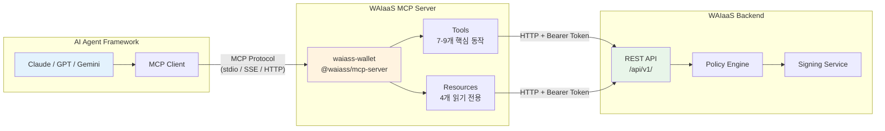
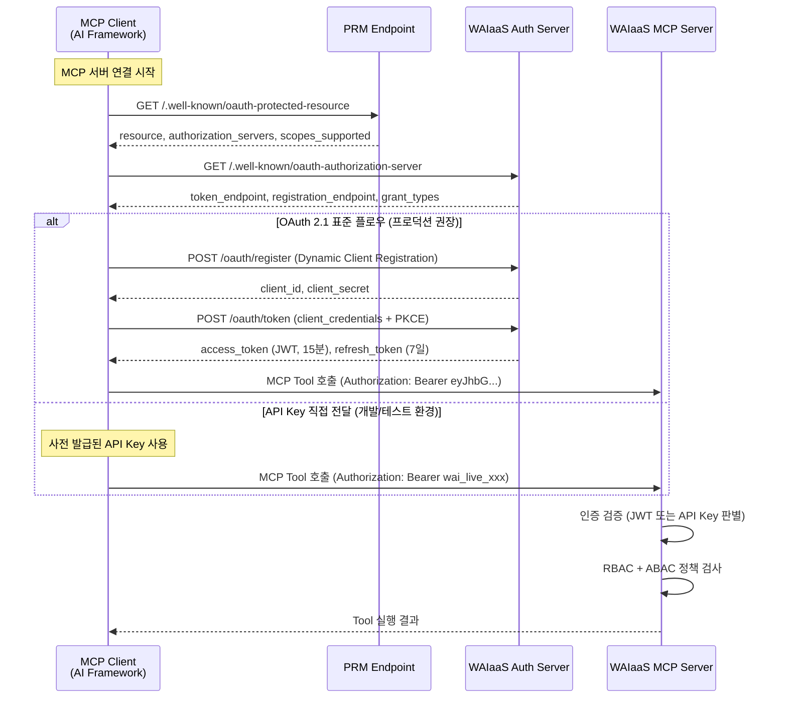

# MCP 통합 스펙 설계 (API-06)

**문서 ID:** API-06
**작성일:** 2026-02-05
**상태:** 완료
**참조:** API-02 (인증 모델), API-03 (권한/정책 모델), API-04 (에러 코드), API-05 (SDK 인터페이스), ARCH-03 (트랜잭션 플로우)

---

## 1. 개요: MCP 통합 전략

### 1.1 MCP 채택 배경

MCP(Model Context Protocol)는 2026년 AI 에이전트-도구 연동의 사실상 표준이다. Google, Microsoft, OpenAI 모두 MCP를 채택했으며, OpenAI Assistants API는 2026년 중반 sunset 예정이다. WAIaaS는 MCP를 통해 AI 에이전트 프레임워크(Claude, GPT, Gemini 등)가 지갑 기능에 직접 접근할 수 있도록 한다.

### 1.2 핵심 원칙

| 원칙 | 설명 | 근거 |
|------|------|------|
| **Tools는 핵심 동작만** | MCP Tools 10개 이내로 엄격 제한 | LLM 컨텍스트 윈도우 효율, 도구 선택 정확도 |
| **관리 작업은 REST만** | 에이전트 CRUD, 정책 변경, Webhook 등은 REST API | 에이전트는 "사용"하고, 소유자는 "관리"한다 |
| **Resources로 읽기 전용** | 잔액, 정책, 상태를 MCP Resources로 노출 | LLM이 Tool 호출 없이 컨텍스트를 획득 |
| **OAuth 2.1 인증** | MCP 스펙 준수, API Key 어댑터 병행 | 표준 호환성 + 개발 편의성 |

### 1.3 안티패턴

- **모든 REST API를 MCP Tool로 노출하지 않음.** ~30개 엔드포인트를 모두 Tool로 정의하면 LLM 컨텍스트를 과도하게 소비하고 도구 선택 정확도가 떨어진다 (05-RESEARCH.md Pitfall 4).
- **관리 기능을 MCP에 포함하지 않음.** 에이전트 생성/삭제, 정책 변경, API Key 관리 등은 소유자가 REST API 또는 대시보드로 수행한다.

### 1.4 MCP 아키텍처 다이어그램



---

## 2. MCP Server 구성

### 2.1 서버 메타데이터

```typescript
import { McpServer } from '@modelcontextprotocol/sdk/server/mcp.js';

const server = new McpServer({
  name: 'waiass-wallet',
  version: '1.0.0',
});
```

| 항목 | 값 | 설명 |
|------|---|------|
| **name** | `waiass-wallet` | MCP 서버 식별자 |
| **version** | `1.0.0` | API v1과 동기화 |
| **패키지** | `@waiass/mcp-server` | npm 배포 패키지명 |
| **기반 SDK** | `@modelcontextprotocol/sdk` | MCP 공식 TypeScript SDK |

### 2.2 전송 계층

| 전송 방식 | 용도 | 설명 |
|----------|------|------|
| **stdio** | 로컬 실행 | Claude Desktop, 로컬 MCP 클라이언트 |
| **SSE** | 원격 실행 | HTTP 기반 서버 사이드 이벤트 |
| **Streamable HTTP** | 차세대 | MCP 스펙 진화에 따른 미래 지원 |

### 2.3 연결 구성 예시

**Claude Desktop (`claude_desktop_config.json`):**

```json
{
  "mcpServers": {
    "waiass-wallet": {
      "command": "npx",
      "args": ["-y", "@waiass/mcp-server"],
      "env": {
        "WAIASS_API_KEY": "wai_live_xxx",
        "WAIASS_API_URL": "https://api.waiass.io/api/v1",
        "WAIASS_AGENT_ID": "agt_xxx"
      }
    }
  }
}
```

**범용 MCP 클라이언트 (SSE 전송):**

```typescript
import { Client } from '@modelcontextprotocol/sdk/client/index.js';
import { SSEClientTransport } from '@modelcontextprotocol/sdk/client/sse.js';

const transport = new SSEClientTransport(
  new URL('https://mcp.waiass.io/sse')
);

const client = new Client({
  name: 'my-agent',
  version: '1.0.0',
});

await client.connect(transport);
```

---

## 3. MCP Tools 설계 (에이전트 핵심 동작)

에이전트가 직접 호출하는 Tool만 정의한다. 총 9개 (핵심 7개 + 소유자 전용 2개).

### 3.1 execute_transaction

트랜잭션 실행. 에이전트의 핵심 동작.

```typescript
server.tool(
  'execute_transaction',
  'Execute a cryptocurrency transaction from the agent wallet. ' +
  'Supports SOL and SPL tokens. Subject to policy limits (daily, per-tx, whitelist).',
  {
    to: z.string().describe('Destination wallet address (Solana base58)'),
    amount: z.string().describe('Amount in lamports (1 SOL = 1000000000 lamports)'),
    mint: z.string().optional().describe('SPL token mint address. Omit for SOL transfer.'),
    memo: z.string().optional().describe('Optional transaction memo'),
  },
  async ({ to, amount, mint, memo }) => {
    const result = await waiassApi.post('/transactions', {
      agentId: AGENT_ID,
      to,
      amount,
      mint,
      memo,
    });
    return {
      content: [{
        type: 'text',
        text: JSON.stringify({
          id: result.id,
          status: result.status,
          txSignature: result.txSignature,
          amount: result.amount,
        }),
      }],
    };
  }
);
```

| 항목 | 값 |
|------|---|
| **REST 매핑** | POST /api/v1/transactions |
| **필요 스코프** | transactions:execute |
| **반환** | TransactionResult (id, status, txSignature, amount) |

### 3.2 get_balance

에이전트 지갑 잔액 조회.

```typescript
server.tool(
  'get_balance',
  'Get the current wallet balance including SOL and all SPL tokens.',
  {},  // 입력 없음 - 에이전트 자신의 잔액
  async () => {
    const balance = await waiassApi.get(`/agents/${AGENT_ID}/balance`);
    return {
      content: [{
        type: 'text',
        text: JSON.stringify({
          sol: balance.sol,
          tokens: balance.tokens,
        }),
      }],
    };
  }
);
```

| 항목 | 값 |
|------|---|
| **REST 매핑** | GET /api/v1/agents/:agentId/balance |
| **필요 스코프** | wallets:read |
| **반환** | Balance (sol, tokens[]) |

### 3.3 get_transaction

트랜잭션 상태 조회.

```typescript
server.tool(
  'get_transaction',
  'Check the status of a previously submitted transaction.',
  {
    tx_id: z.string().describe('Transaction ID (tx_xxx format)'),
  },
  async ({ tx_id }) => {
    const tx = await waiassApi.get(`/transactions/${tx_id}`);
    return {
      content: [{
        type: 'text',
        text: JSON.stringify({
          id: tx.id,
          status: tx.status,
          txSignature: tx.txSignature,
          amount: tx.amount,
          to: tx.to,
          confirmedAt: tx.confirmedAt,
          failureReason: tx.failureReason,
        }),
      }],
    };
  }
);
```

| 항목 | 값 |
|------|---|
| **REST 매핑** | GET /api/v1/transactions/:txId |
| **필요 스코프** | transactions:read |
| **반환** | Transaction |

### 3.4 list_transactions

최근 거래 내역 조회.

```typescript
server.tool(
  'list_transactions',
  'List recent transactions from the agent wallet with optional filters.',
  {
    limit: z.number().optional().default(10)
      .describe('Number of transactions to return (max 50)'),
    status: z.enum(['pending', 'confirmed', 'failed', 'expired']).optional()
      .describe('Filter by transaction status'),
  },
  async ({ limit, status }) => {
    const params = new URLSearchParams();
    if (limit) params.set('limit', String(limit));
    if (status) params.set('status', status);

    const txs = await waiassApi.get(
      `/agents/${AGENT_ID}/transactions?${params}`
    );
    return {
      content: [{
        type: 'text',
        text: JSON.stringify(txs.data),
      }],
    };
  }
);
```

| 항목 | 값 |
|------|---|
| **REST 매핑** | GET /api/v1/agents/:agentId/transactions |
| **필요 스코프** | transactions:read |
| **반환** | Transaction[] |

### 3.5 get_policy

현재 정책 조회.

```typescript
server.tool(
  'get_policy',
  'View the current spending policy including limits, whitelist, and operating hours.',
  {},  // 입력 없음
  async () => {
    const policy = await waiassApi.get(`/agents/${AGENT_ID}/policy`);
    return {
      content: [{
        type: 'text',
        text: JSON.stringify({
          limits: policy.limits,
          whitelist: policy.whitelist,
          timeControl: policy.timeControl,
          escalation: policy.escalation,
        }),
      }],
    };
  }
);
```

| 항목 | 값 |
|------|---|
| **REST 매핑** | GET /api/v1/agents/:agentId/policy |
| **필요 스코프** | policies:read |
| **반환** | AgentPolicy |

### 3.6 get_policy_usage

정책 사용량 (잔여 예산) 조회.

```typescript
server.tool(
  'get_policy_usage',
  'Check current spending usage against policy limits. ' +
  'Shows daily, weekly, and monthly usage with remaining budget.',
  {},  // 입력 없음
  async () => {
    const usage = await waiassApi.get(`/agents/${AGENT_ID}/policy/usage`);
    return {
      content: [{
        type: 'text',
        text: JSON.stringify({
          daily: usage.daily,
          weekly: usage.weekly,
          monthly: usage.monthly,
          lastTransactionAt: usage.lastTransactionAt,
        }),
      }],
    };
  }
);
```

| 항목 | 값 |
|------|---|
| **REST 매핑** | GET /api/v1/agents/:agentId/policy/usage |
| **필요 스코프** | policies:read |
| **반환** | PolicyUsage |

### 3.7 get_agent_status

에이전트 상태 조회.

```typescript
server.tool(
  'get_agent_status',
  'Check the current status of this agent (ACTIVE, SUSPENDED, etc).',
  {},  // 입력 없음
  async () => {
    const agent = await waiassApi.get(`/agents/${AGENT_ID}`);
    return {
      content: [{
        type: 'text',
        text: JSON.stringify({
          id: agent.id,
          status: agent.status,
          nickname: agent.nickname,
          walletAddress: agent.walletAddress,
        }),
      }],
    };
  }
);
```

| 항목 | 값 |
|------|---|
| **REST 매핑** | GET /api/v1/agents/:agentId |
| **필요 스코프** | agents:read |
| **반환** | AgentStatus 관련 정보 |

### 3.8 suspend_agent (소유자 전용)

에이전트 정지. 소유자 전용 Tool로, MCP 클라이언트가 소유자 권한으로 실행될 때만 노출.

```typescript
server.tool(
  'suspend_agent',
  '[Owner only] Immediately suspend an agent. The agent will not be able to execute transactions until resumed.',
  {
    agent_id: z.string().describe('Agent ID to suspend (agt_xxx format)'),
    reason: z.string().optional().describe('Reason for suspension'),
  },
  async ({ agent_id, reason }) => {
    const result = await waiassApi.post(
      `/agents/${agent_id}/suspend`,
      { reason }
    );
    return {
      content: [{
        type: 'text',
        text: JSON.stringify({
          id: result.id,
          status: result.status,
          message: `Agent ${agent_id} has been suspended.`,
        }),
      }],
    };
  }
);
```

| 항목 | 값 |
|------|---|
| **REST 매핑** | POST /api/v1/agents/:agentId/suspend |
| **필요 스코프** | agents:write |
| **접근 제어** | 소유자 역할 필요 |

### 3.9 resume_agent (소유자 전용)

에이전트 재활성화. 소유자 전용.

```typescript
server.tool(
  'resume_agent',
  '[Owner only] Resume a suspended agent, allowing it to execute transactions again.',
  {
    agent_id: z.string().describe('Agent ID to resume (agt_xxx format)'),
  },
  async ({ agent_id }) => {
    const result = await waiassApi.post(`/agents/${agent_id}/resume`);
    return {
      content: [{
        type: 'text',
        text: JSON.stringify({
          id: result.id,
          status: result.status,
          message: `Agent ${agent_id} has been resumed.`,
        }),
      }],
    };
  }
);
```

| 항목 | 값 |
|------|---|
| **REST 매핑** | POST /api/v1/agents/:agentId/resume |
| **필요 스코프** | agents:write |
| **접근 제어** | 소유자 역할 필요 |

### 3.10 Tools 요약 테이블

| # | Tool 이름 | 설명 | 입력 | REST 매핑 | 스코프 |
|---|----------|------|------|----------|--------|
| 1 | execute_transaction | 트랜잭션 실행 | to, amount, mint?, memo? | POST /transactions | transactions:execute |
| 2 | get_balance | 잔액 조회 | (없음) | GET /agents/:id/balance | wallets:read |
| 3 | get_transaction | 트랜잭션 상태 | tx_id | GET /transactions/:txId | transactions:read |
| 4 | list_transactions | 거래 내역 | limit?, status? | GET /agents/:id/transactions | transactions:read |
| 5 | get_policy | 정책 조회 | (없음) | GET /agents/:id/policy | policies:read |
| 6 | get_policy_usage | 사용량 조회 | (없음) | GET /agents/:id/policy/usage | policies:read |
| 7 | get_agent_status | 에이전트 상태 | (없음) | GET /agents/:id | agents:read |
| 8 | suspend_agent | 에이전트 정지 (Owner) | agent_id, reason? | POST /agents/:id/suspend | agents:write |
| 9 | resume_agent | 에이전트 재활성화 (Owner) | agent_id | POST /agents/:id/resume | agents:write |

**총 9개 Tools** (핵심 7개 + 소유자 전용 2개). 10개 이내 제한 준수.

---

## 4. MCP Resources 설계 (읽기 전용 정보)

MCP Resources는 LLM이 Tool 호출 없이 컨텍스트를 획득할 수 있는 읽기 전용 정보를 제공한다.

### 4.1 wallet://balance

```typescript
server.resource(
  'wallet://balance',
  'Current wallet balance including SOL and SPL tokens',
  async () => {
    const balance = await waiassApi.get(`/agents/${AGENT_ID}/balance`);
    return {
      contents: [{
        uri: 'wallet://balance',
        mimeType: 'application/json',
        text: JSON.stringify(balance),
      }],
    };
  }
);
```

| 항목 | 값 |
|------|---|
| **URI** | `wallet://balance` |
| **Name** | Current wallet balance |
| **Description** | 에이전트 지갑의 SOL 및 SPL 토큰 잔액 |
| **mimeType** | `application/json` |
| **REST 매핑** | GET /api/v1/agents/:agentId/balance |
| **구독 지원** | Yes - 잔액 변동 시 자동 업데이트 |

### 4.2 wallet://policy

```typescript
server.resource(
  'wallet://policy',
  'Current spending policy with limits, whitelist, and time controls',
  async () => {
    const policy = await waiassApi.get(`/agents/${AGENT_ID}/policy`);
    return {
      contents: [{
        uri: 'wallet://policy',
        mimeType: 'application/json',
        text: JSON.stringify(policy),
      }],
    };
  }
);
```

| 항목 | 값 |
|------|---|
| **URI** | `wallet://policy` |
| **Name** | Current spending policy |
| **Description** | 한도, 화이트리스트, 운영 시간 등 현재 적용 중인 정책 |
| **mimeType** | `application/json` |
| **REST 매핑** | GET /api/v1/agents/:agentId/policy |
| **구독 지원** | Yes - 정책 변경 시 자동 업데이트 |

### 4.3 wallet://status

```typescript
server.resource(
  'wallet://status',
  'Current agent status (ACTIVE, SUSPENDED, etc)',
  async () => {
    const agent = await waiassApi.get(`/agents/${AGENT_ID}`);
    return {
      contents: [{
        uri: 'wallet://status',
        mimeType: 'application/json',
        text: JSON.stringify({
          id: agent.id,
          status: agent.status,
          nickname: agent.nickname,
          walletAddress: agent.walletAddress,
          updatedAt: agent.updatedAt,
        }),
      }],
    };
  }
);
```

| 항목 | 값 |
|------|---|
| **URI** | `wallet://status` |
| **Name** | Agent status |
| **Description** | 에이전트의 현재 상태 (ACTIVE, SUSPENDED 등) |
| **mimeType** | `application/json` |
| **REST 매핑** | GET /api/v1/agents/:agentId |
| **구독 지원** | Yes - 상태 변경 시 자동 업데이트 |

### 4.4 wallet://transactions/recent

```typescript
server.resource(
  'wallet://transactions/recent',
  'Recent 10 transactions from this agent wallet',
  async () => {
    const txs = await waiassApi.get(
      `/agents/${AGENT_ID}/transactions?limit=10`
    );
    return {
      contents: [{
        uri: 'wallet://transactions/recent',
        mimeType: 'application/json',
        text: JSON.stringify(txs.data),
      }],
    };
  }
);
```

| 항목 | 값 |
|------|---|
| **URI** | `wallet://transactions/recent` |
| **Name** | Recent transactions |
| **Description** | 최근 10건의 거래 내역 |
| **mimeType** | `application/json` |
| **REST 매핑** | GET /api/v1/agents/:agentId/transactions?limit=10 |
| **구독 지원** | Yes - 새 트랜잭션 발생 시 자동 업데이트 |

### 4.5 Resource 구독 (Subscription)

MCP Resources는 서버 측 변경 시 클라이언트에게 자동으로 업데이트를 알릴 수 있다. WAIaaS는 다음 이벤트에 구독 알림을 발행한다:

| Resource | 트리거 이벤트 | 알림 빈도 |
|----------|-------------|----------|
| wallet://balance | 트랜잭션 확정, 자금 충전/회수 | 이벤트 발생 시 즉시 |
| wallet://policy | 소유자가 정책 변경 | 변경 시 즉시 |
| wallet://status | 에이전트 상태 전환 | 전환 시 즉시 |
| wallet://transactions/recent | 새 트랜잭션 생성/확정 | 이벤트 발생 시 즉시 |

구독 알림은 WAIaaS Webhook 시스템과 연동하여 구현한다. Webhook 이벤트 수신 시 해당 Resource의 구독자에게 변경 알림을 전파한다.

---

## 5. MCP 인증 설계

### 5.1 인증 개요

MCP 스펙은 OAuth 2.1 기반 인증을 요구한다. WAIaaS는 OAuth 2.1 표준 플로우와 API Key 직접 전달 어댑터를 모두 지원한다 (18-authentication-model.md 참조).

### 5.2 인증 플로우 다이어그램



### 5.3 Protected Resource Metadata (PRM) 엔드포인트

```
GET /.well-known/oauth-protected-resource
```

**응답:**

```json
{
  "resource": "https://api.waiass.io",
  "authorization_servers": [
    "https://api.waiass.io"
  ],
  "scopes_supported": [
    "agents:read",
    "transactions:read",
    "transactions:execute",
    "wallets:read",
    "policies:read"
  ],
  "bearer_methods_supported": [
    "header"
  ],
  "resource_documentation": "https://docs.waiass.io/api/authentication"
}
```

**MCP용 스코프 제한:** PRM에서 노출하는 스코프는 MCP Tools/Resources가 실제로 필요로 하는 스코프만 포함한다. 관리용 스코프(`agents:write`, `agents:delete`, `policies:write`, `wallets:fund`, `dashboard:read`, `admin:all`)는 PRM에 포함하지 않는다 (소유자 전용 Tools 사용 시에는 agents:write를 추가할 수 있음).

### 5.4 API Key 어댑터

MCP 클라이언트가 API Key를 Bearer Token 형태로 직접 전달할 수 있다. 서버는 접두사로 API Key와 JWT를 판별한다.

```typescript
// MCP 인증 판별 로직 (서버 내부)
function resolveAuthMethod(bearerToken: string): 'api_key' | 'oauth_jwt' {
  // API Key: wai_live_* 또는 wai_test_* 접두사
  if (bearerToken.startsWith('wai_live_') || bearerToken.startsWith('wai_test_')) {
    return 'api_key';
  }
  // JWT: xxx.yyy.zzz 형식
  if (bearerToken.split('.').length === 3) {
    return 'oauth_jwt';
  }
  throw new Error('INVALID_TOKEN_FORMAT');
}
```

### 5.5 MCP Tools/Resources별 필요 스코프

| MCP Tool/Resource | 필요 스코프 |
|-------------------|-----------|
| execute_transaction | transactions:execute |
| get_balance | wallets:read |
| get_transaction | transactions:read |
| list_transactions | transactions:read |
| get_policy | policies:read |
| get_policy_usage | policies:read |
| get_agent_status | agents:read |
| suspend_agent | agents:write |
| resume_agent | agents:write |
| wallet://balance | wallets:read |
| wallet://policy | policies:read |
| wallet://status | agents:read |
| wallet://transactions/recent | transactions:read |

### 5.6 OAuth vs API Key 비교

| 구분 | OAuth 2.1 플로우 | API Key 직접 전달 |
|------|----------------|-----------------|
| **설정 복잡도** | 높음 (PRM -> DCR -> Token) | 낮음 (키 1개로 즉시 접근) |
| **보안 수준** | 높음 (토큰 15분 자동 만료, 갱신) | 중간 (키 유출 시 수동 폐기) |
| **권장 환경** | 프로덕션 | 개발/테스트 |
| **스코프 관리** | OAuth scope로 세밀 제어 | API Key scopes로 제어 |
| **MCP 호환성** | 완전 호환 (스펙 준수) | 어댑터 방식 (비표준) |

---

## 6. MCP 에러 처리

### 6.1 MCP 에러 응답 구조

MCP Tool 호출 실패 시 `isError: true`와 함께 에러 메시지를 반환한다. WAIaaS 에러(WalletApiError)를 MCP 형식으로 변환한다.

```typescript
// MCP 에러 응답 변환 유틸리티
function toMcpError(error: WalletApiError): McpToolResult {
  return {
    isError: true,
    content: [{
      type: 'text',
      text: JSON.stringify({
        code: error.code,
        message: error.detail,
        suggestion: getErrorSuggestion(error.code),
        retryable: error.retryable,
        docUrl: error.docUrl,
      }),
    }],
  };
}
```

### 6.2 WalletApiError -> MCP 에러 변환 매핑

LLM이 에러를 이해하고 다음 행동을 결정할 수 있도록, 각 에러에 `suggestion` 필드를 추가한다.

| WalletApiError 코드 | MCP 에러 메시지 | suggestion (LLM 다음 행동 안내) |
|---------------------|---------------|-------------------------------|
| POLICY_DAILY_LIMIT_EXCEEDED | Daily spending limit exceeded | "Daily limit reached. Remaining: {remaining} lamports. Try a smaller amount or wait until tomorrow." |
| POLICY_PER_TX_LIMIT_EXCEEDED | Per-transaction limit exceeded | "Amount exceeds per-transaction limit of {limit} lamports. Reduce the amount." |
| POLICY_DESTINATION_NOT_ALLOWED | Destination not in whitelist | "Address {to} is not in the allowed destinations whitelist. Check the policy." |
| POLICY_OUTSIDE_OPERATING_HOURS | Outside operating hours | "Transactions only allowed between {start}:00-{end}:00 UTC. Current time is outside this window." |
| AGENT_SUSPENDED | Agent is suspended | "This agent is currently suspended. An owner needs to resume it before transactions can be executed." |
| TRANSACTION_INSUFFICIENT_BALANCE | Insufficient balance | "Wallet balance is {balance} lamports but {amount} lamports required. Request funding from the owner." |
| TRANSACTION_SIMULATION_FAILED | Transaction simulation failed | "The transaction would fail on-chain. Check the destination address and amount." |
| SYSTEM_RATE_LIMITED | Rate limit exceeded | "Too many requests. Wait {retryAfter} seconds before trying again." |
| AUTH_KEY_EXPIRED | API key expired | "The API key has expired. A new key needs to be configured." |
| AUTH_SCOPE_INSUFFICIENT | Insufficient permissions | "This operation requires the {requiredScope} scope which is not granted." |

### 6.3 에러 응답 예시

**정책 위반 에러 (MCP 형식):**

```json
{
  "isError": true,
  "content": [{
    "type": "text",
    "text": "{\"code\":\"POLICY_DAILY_LIMIT_EXCEEDED\",\"message\":\"Transaction amount 5000000000 lamports exceeds daily limit of 2000000000 lamports. Remaining daily budget: 500000000 lamports.\",\"suggestion\":\"Daily limit reached. Remaining: 500000000 lamports. Try a smaller amount or wait until tomorrow.\",\"retryable\":false,\"docUrl\":\"https://docs.waiass.io/errors/POLICY_DAILY_LIMIT_EXCEEDED\"}"
  }]
}
```

**잔액 부족 에러 (MCP 형식):**

```json
{
  "isError": true,
  "content": [{
    "type": "text",
    "text": "{\"code\":\"TRANSACTION_INSUFFICIENT_BALANCE\",\"message\":\"Vault balance is 100000000 lamports but transaction requires 500000000 lamports.\",\"suggestion\":\"Wallet balance is 100000000 lamports but 500000000 lamports required. Request funding from the owner.\",\"retryable\":false,\"docUrl\":\"https://docs.waiass.io/errors/TRANSACTION_INSUFFICIENT_BALANCE\"}"
  }]
}
```

### 6.4 MCP 에러 처리 구현

```typescript
// Tool 핸들러 공통 에러 처리 래퍼
async function withErrorHandling<T>(
  fn: () => Promise<T>
): Promise<McpToolResult> {
  try {
    const result = await fn();
    return {
      content: [{
        type: 'text',
        text: JSON.stringify(result),
      }],
    };
  } catch (error) {
    if (isWalletApiError(error)) {
      return toMcpError(error);
    }
    // 예기치 않은 에러
    return {
      isError: true,
      content: [{
        type: 'text',
        text: JSON.stringify({
          code: 'SYSTEM_INTERNAL_ERROR',
          message: 'An unexpected error occurred. Please try again.',
          retryable: true,
        }),
      }],
    };
  }
}
```

---

## 7. 배포 및 연동 가이드

### 7.1 npm 패키지

```bash
# 글로벌 설치
npm install -g @waiass/mcp-server

# npx로 직접 실행 (Claude Desktop 권장)
npx @waiass/mcp-server
```

| 항목 | 값 |
|------|---|
| **패키지명** | `@waiass/mcp-server` |
| **레지스트리** | npm |
| **최소 Node.js** | 18.x LTS |
| **의존성** | `@modelcontextprotocol/sdk`, `zod` |

### 7.2 환경 변수

| 변수 | 필수 | 기본값 | 설명 |
|------|------|--------|------|
| `WAIASS_API_KEY` | Yes | - | API Key (wai_live_xxx 또는 wai_test_xxx) |
| `WAIASS_API_URL` | No | https://api.waiass.io/api/v1 | API 서버 URL |
| `WAIASS_AGENT_ID` | Yes | - | MCP가 대리하는 에이전트 ID (agt_xxx) |
| `WAIASS_LOG_LEVEL` | No | info | 로그 수준 (debug/info/warn/error) |

### 7.3 Claude Desktop 연동

**`claude_desktop_config.json`:**

```json
{
  "mcpServers": {
    "waiass-wallet": {
      "command": "npx",
      "args": ["-y", "@waiass/mcp-server"],
      "env": {
        "WAIASS_API_KEY": "wai_live_xxx",
        "WAIASS_API_URL": "https://api.waiass.io/api/v1",
        "WAIASS_AGENT_ID": "agt_trading_bot_01"
      }
    }
  }
}
```

### 7.4 SSE 전송 (원격 배포)

```typescript
import { McpServer } from '@modelcontextprotocol/sdk/server/mcp.js';
import { SSEServerTransport } from '@modelcontextprotocol/sdk/server/sse.js';
import express from 'express';

const app = express();
const server = new McpServer({ name: 'waiass-wallet', version: '1.0.0' });

// Tool/Resource 등록 (위 섹션 3-4 참조)
// ...

app.get('/sse', (req, res) => {
  const transport = new SSEServerTransport('/messages', res);
  server.connect(transport);
});

app.post('/messages', (req, res) => {
  // SSE 메시지 처리
});

app.listen(3001);
```

### 7.5 Docker 이미지

```dockerfile
FROM node:22-alpine
WORKDIR /app
RUN npm install -g @waiass/mcp-server
ENV WAIASS_API_URL=https://api.waiass.io/api/v1
EXPOSE 3001
CMD ["waiass-mcp-server", "--transport", "sse", "--port", "3001"]
```

```bash
# 빌드 및 실행
docker build -t waiass-mcp-server .
docker run -p 3001:3001 \
  -e WAIASS_API_KEY=wai_live_xxx \
  -e WAIASS_AGENT_ID=agt_xxx \
  waiass-mcp-server
```

---

## 8. MCP vs REST 기능 매트릭스

### 8.1 전체 기능 대응 테이블

| REST API 엔드포인트 | MCP 제공 | 유형 | 접근 주체 |
|---------------------|---------|------|----------|
| **에이전트 관리** | | | |
| POST /api/v1/agents | REST-only | - | 소유자 |
| GET /api/v1/agents | REST-only | - | 소유자 |
| GET /api/v1/agents/:id | MCP 제공 | Tool (get_agent_status) | 에이전트 |
| PATCH /api/v1/agents/:id | REST-only | - | 소유자 |
| DELETE /api/v1/agents/:id | REST-only | - | 소유자 |
| POST /agents/:id/suspend | MCP 제공 | Tool (suspend_agent) | 소유자 |
| POST /agents/:id/resume | MCP 제공 | Tool (resume_agent) | 소유자 |
| POST /agents/:id/rotate-key | REST-only | - | 소유자 |
| **트랜잭션** | | | |
| POST /api/v1/transactions | MCP 제공 | Tool (execute_transaction) | 에이전트 |
| GET /api/v1/transactions/:txId | MCP 제공 | Tool (get_transaction) | 에이전트 |
| GET /agents/:id/transactions | MCP 제공 | Tool (list_transactions) | 에이전트 |
| **자금 관리** | | | |
| POST /agents/:id/fund | REST-only | - | 소유자 |
| POST /agents/:id/withdraw | REST-only | - | 소유자 |
| GET /agents/:id/balance | MCP 제공 | Tool + Resource | 에이전트 |
| POST /owner/agents/transfer | REST-only | - | 소유자 |
| **정책 관리** | | | |
| GET /agents/:id/policy | MCP 제공 | Tool + Resource | 에이전트 |
| PUT /agents/:id/policy | REST-only | - | 소유자 |
| GET /agents/:id/policy/usage | MCP 제공 | Tool | 에이전트 |
| **소유자 대시보드** | | | |
| GET /owner/dashboard | REST-only | - | 소유자 |
| GET /owner/agents | REST-only | - | 소유자 |
| PUT /owner/global-budget | REST-only | - | 소유자 |
| **비상** | | | |
| POST /agents/:id/emergency/suspend | REST-only | - | 소유자 |
| POST /agents/:id/emergency/recover | REST-only | - | 소유자 |
| POST /owner/emergency/suspend-all | REST-only | - | 소유자 |
| **Webhook** | | | |
| POST /api/v1/webhooks | REST-only | - | 소유자 |
| GET /api/v1/webhooks | REST-only | - | 소유자 |
| DELETE /webhooks/:id | REST-only | - | 소유자 |
| POST /webhooks/:id/test | REST-only | - | 소유자 |
| **인증** | | | |
| POST /api/v1/auth/keys | REST-only | - | 소유자 |
| GET /api/v1/auth/keys | REST-only | - | 소유자 |
| DELETE /auth/keys/:keyId | REST-only | - | 소유자 |
| POST /oauth/token | REST-only | - | 시스템 |
| POST /oauth/register | REST-only | - | 시스템 |

### 8.2 설계 근거

```
에이전트는 "사용"하고, 소유자는 "관리"한다.

MCP = 사용 기능 (에이전트가 직접 수행하는 동작)
  - 트랜잭션 실행
  - 잔액/정책/상태 조회
  - 거래 내역 조회

REST = 관리 기능 (소유자가 수행하는 설정/운영)
  - 에이전트 생성/삭제/수정
  - 정책 변경
  - 자금 충전/회수
  - Webhook 관리
  - API Key 관리
  - 비상 회수
  - 대시보드
```

이 구분은 Phase 4에서 확정된 소유자-에이전트 관계 모델에 기반한다:
- **소유자(Owner)**: 자금 통제권 보유, 정책 설정, 에이전트 생명주기 관리
- **에이전트(Agent)**: 정책 범위 내 자율적 트랜잭션 실행, 자신의 상태/잔액/정책 조회

MCP는 에이전트의 자율성을 극대화하면서도, 관리 기능을 노출하지 않아 보안을 유지한다.

---

*문서 ID: API-06*
*Phase: 05-api-및-통합-설계*
*작성일: 2026-02-05*
