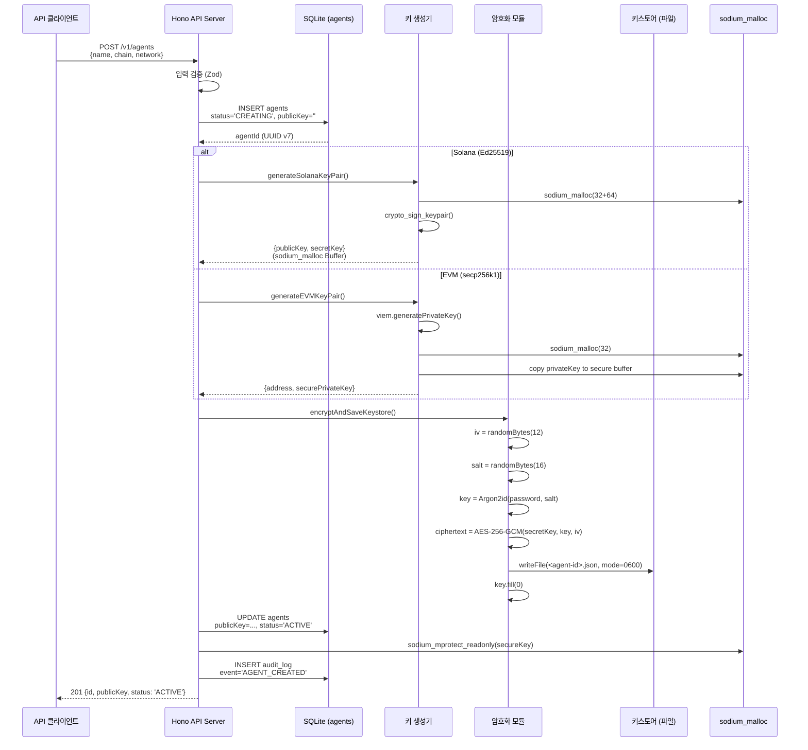
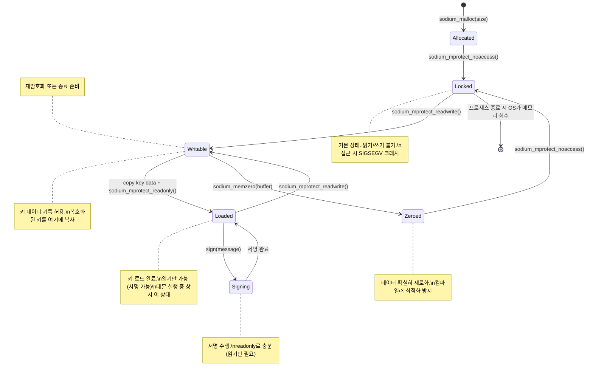

# 암호화 키스토어 파일 포맷 + 키 파생/메모리 안전성 프로토콜 (CORE-03)

**문서 ID:** CORE-03
**작성일:** 2026-02-05
**v0.7 업데이트:** 2026-02-08
**상태:** 완료
**참조:** CORE-01 (모노레포/데이터 디렉토리), CORE-02 (SQLite 스키마), ARCH-01 (Dual Key), 06-RESEARCH.md, 06-CONTEXT.md

---

## 1. 키스토어 파일 포맷 (WAIaaS Keystore v1)

### 1.1 설계 원칙

WAIaaS Keystore v1은 Ethereum Keystore V3 포맷을 기반으로 다음을 확장한다:

| 원칙 | 설명 |
|------|------|
| **AEAD 통합** | AES-256-GCM이 암호화 + 인증을 한 번에 수행하여 별도 MAC 불필요 |
| **메모리 하드 KDF** | Argon2id로 GPU/ASIC 브루트포스 내성 확보 (scrypt/PBKDF2 대체) |
| **체인 무관 포맷** | `chain` + `network` 필드로 Solana/EVM 키를 동일 포맷으로 저장 |
| **자기 기술적** | 파일 하나에 복호화에 필요한 모든 메타데이터 포함 (salt, nonce, kdfparams) |
| **파일 단위 관리** | 에이전트별 독립 파일로 개별 백업/이전/삭제 가능 |

### 1.2 전체 JSON 구조

**파일 경로:** `~/.waiaas/keystore/<agent-id>.json` (CORE-01 섹션 2.2 참조)

```json
{
  "version": 1,
  "id": "01936f4c-8c3a-7000-8000-000000000001",
  "chain": "solana",
  "network": "mainnet",
  "publicKey": "7xKXtg2CW87d97TXJSDpbD5jBkheTqA83TZRuJosgAsU",
  "crypto": {
    "cipher": "aes-256-gcm",
    "cipherparams": {
      "iv": "a1b2c3d4e5f6a7b8c9d0e1f2"
    },
    "ciphertext": "e3b0c44298fc1c149afbf4c8996fb92427ae41e4649b934ca495991b7852b855...",
    "authTag": "f47ac10b58cc4372a5670e02b2c3d479",
    "kdf": "argon2id",
    "kdfparams": {
      "salt": "d4e5f6a7b8c9d0e1f2a3b4c5d6e7f8a9",
      "memoryCost": 65536,
      "timeCost": 3,
      "parallelism": 4,
      "hashLength": 32
    }
  },
  "metadata": {
    "name": "trading-bot-01",
    "createdAt": "2026-02-05T08:30:00.000Z",
    "lastUnlockedAt": "2026-02-05T09:15:00.000Z"
  }
}
```

### 1.3 필드 상세 정의

#### 최상위 필드

| 필드 | 타입 | 바이트 | 인코딩 | 생성 방법 | 설명 |
|------|------|--------|--------|----------|------|
| `version` | integer | - | JSON number | 상수 `1` | 키스토어 포맷 버전. 향후 호환성 판단에 사용 |
| `id` | string | 16B (UUID) | UUID v4 문자열 | `crypto.randomUUID()` | 키스토어 파일 고유 식별자. agent-id와 별개 |
| `chain` | string | - | UTF-8 | 에이전트 생성 시 지정 | 블록체인 식별자: `"solana"` 또는 `"ethereum"` |
| `network` | string | - | UTF-8 | 에이전트 생성 시 지정 | [v0.7 보완] 네트워크: `"mainnet"`, `"devnet"`, `"testnet"`. NetworkType SSoT (45-enum). 체인 무관 추상화 |
| `publicKey` | string | 32B (Ed25519) / 20B (EVM) | Base58 (Solana) / 0x hex (EVM) | 키쌍 생성 시 추출 | 에이전트 공개키/주소. agents 테이블 `public_key` 컬럼과 동일 |

#### crypto 객체

| 필드 | 타입 | 바이트 | 인코딩 | 생성 방법 | 설명 |
|------|------|--------|--------|----------|------|
| `cipher` | string | - | UTF-8 | 상수 `"aes-256-gcm"` | 암호화 알고리즘 식별자 |
| `cipherparams.iv` | string | **12B** | hex (24자) | `crypto.randomBytes(12)` | AES-GCM 96비트 nonce. **매 암호화마다 새로 생성** (C-01 방지) |
| `ciphertext` | string | **NB** | hex | AES-256-GCM 암호화 출력 | 암호화된 개인키. 평문 크기와 동일 (GCM은 스트림 암호) |
| `authTag` | string | **16B** | hex (32자) | `cipher.getAuthTag()` | GCM 128비트 인증 태그. 변조 탐지 + 패스워드 검증에 사용 |
| `kdf` | string | - | UTF-8 | 상수 `"argon2id"` | 키 파생 함수 식별자 |
| `kdfparams.salt` | string | **16B** | hex (32자) | `crypto.randomBytes(16)` | CSPRNG 128비트 salt. **매 암호화/재암호화마다 새로 생성** |
| `kdfparams.memoryCost` | integer | - | JSON number | 상수 `65536` (64 MiB) | Argon2id 메모리 비용 (KiB 단위). 06-CONTEXT.md 잠긴 결정 |
| `kdfparams.timeCost` | integer | - | JSON number | 상수 `3` | Argon2id 반복 횟수. 06-CONTEXT.md 잠긴 결정 |
| `kdfparams.parallelism` | integer | - | JSON number | 상수 `4` | Argon2id 병렬 스레드 수. 06-CONTEXT.md 잠긴 결정 |
| `kdfparams.hashLength` | integer | - | JSON number | 상수 `32` | 파생 키 길이 (바이트). AES-256 키 = 256비트 = 32바이트 |

#### metadata 객체

| 필드 | 타입 | 인코딩 | 생성 방법 | 설명 |
|------|------|--------|----------|------|
| `metadata.name` | string | UTF-8 | 에이전트 생성 시 사용자 입력 | 사람이 읽을 수 있는 에이전트 이름 |
| `metadata.createdAt` | string | ISO 8601 | 키스토어 파일 생성 시각 | 파일 최초 생성 시각 (UTC) |
| `metadata.lastUnlockedAt` | string \| null | ISO 8601 | 마지막 잠금 해제 시각 | 마지막으로 이 키파일이 복호화된 시각. 초기값 `null` |

### 1.4 ciphertext 내부 바이너리 구조

AES-256-GCM의 출력은 JSON에서 별도 필드로 분리하지만, 내부 바이너리 관점에서의 구조는 다음과 같다:

```
┌──────────────────────────────────────────────────────────────┐
│                  키스토어 암호문 구성                          │
├──────────┬──────────────────────┬─────────────────────────────┤
│  iv (nonce)  │    ciphertext       │      authTag              │
│   12 bytes   │    N bytes          │      16 bytes             │
│   96-bit     │    = plaintext size │      128-bit              │
├──────────┴──────────────────────┴─────────────────────────────┤
│ JSON에서:    cipherparams.iv | crypto.ciphertext | crypto.authTag  │
│ 인코딩:      hex             | hex               | hex             │
└──────────────────────────────────────────────────────────────┘
```

**체인별 ciphertext 크기:**

| 체인 | 개인키 크기 | ciphertext 크기 | 설명 |
|------|------------|----------------|------|
| Solana (Ed25519) | **64 bytes** | **64 bytes** (128 hex 문자) | seed 32B + pubkey 32B (Solana 관례) |
| EVM (secp256k1) | **32 bytes** | **32 bytes** (64 hex 문자) | 순수 개인키만 저장 |

**참고:** Solana의 Ed25519 "비밀키"는 실제로는 `seed(32B) || publicKey(32B)` = 64바이트이다. `@solana/kit`과 `sodium-native` 모두 이 64바이트 형식을 사용한다.

### 1.5 Ethereum Keystore V3 대비 변경 사항

| 항목 | Ethereum Keystore V3 | WAIaaS Keystore v1 | 변경 이유 |
|------|---------------------|-------------------|-----------|
| **cipher** | `aes-128-ctr` | `aes-256-gcm` | 256비트 키 + AEAD 통합. CTR은 인증 없음 |
| **KDF** | `pbkdf2` (262,144회) 또는 `scrypt` | `argon2id` (m=64MiB, t=3, p=4) | 메모리 하드 -- GPU/ASIC 브루트포스 비용 극대화 |
| **MAC** | `keccak256(DK[16..31] ++ ciphertext)` | **(제거)** | GCM authTag가 무결성 + 인증 대체. 별도 MAC 불필요 |
| **IV 크기** | 128비트 (16B, CTR 모드) | **96비트 (12B, GCM 표준)** | GCM 스펙 권장 nonce 크기. 12B에서 최적 성능 |
| **chain 필드** | 없음 (Ethereum 전용) | 필수 (`"solana"` \| `"ethereum"`) | 멀티체인 지원 |
| **network 필드** | 없음 | 필수 (네트워크 식별) | testnet/mainnet 구분 |
| **publicKey 필드** | `address` (0x hex, 20B) | 체인별 인코딩 (Base58/0x hex) | 체인 무관 공개키 저장 |
| **metadata** | 없음 | `name`, `createdAt`, `lastUnlockedAt` | 운영 편의 + 감사 추적 |
| **version** | `3` | `1` | 독립 버전 체계 |

### 1.6 파일 시스템 규칙

| 규칙 | 값 | 근거 |
|------|-----|------|
| 파일명 | `<agent-id>.json` | agent UUID v7과 1:1 매핑 |
| 파일 경로 | `~/.waiaas/keystore/<agent-id>.json` | CORE-01 섹션 2.2 |
| 파일 권한 | `0600` (rw-------) | 소유자만 읽기/쓰기 |
| 디렉토리 권한 | `0700` (rwx------) | 소유자만 접근 |
| 인코딩 | UTF-8 (JSON) | 표준 JSON 파일 |
| 줄바꿈 | 들여쓰기 2칸 (`JSON.stringify(obj, null, 2)`) | 사람이 읽을 수 있도록 |

---

## 2. 키 파생 프로토콜 (Argon2id)

### 2.1 프로토콜 개요

마스터 패스워드에서 AES-256-GCM 대칭 키를 파생하는 프로토콜이다.

```
┌─────────────────────┐    ┌──────────────┐
│  마스터 패스워드     │    │  CSPRNG salt  │
│  (UTF-8 인코딩)     │    │  (16 bytes)   │
└─────────┬───────────┘    └──────┬────────┘
          │                       │
          ▼                       ▼
     ┌────────────────────────────────────┐
     │          Argon2id                  │
     │  m=65536 (64 MiB)                 │
     │  t=3 (3 iterations)               │
     │  p=4 (4 parallel lanes)           │
     │  hashLength=32 (256 bits)         │
     └──────────────┬─────────────────────┘
                    │
                    ▼
          ┌──────────────────┐
          │  파생 키 (32B)   │
          │  = AES-256 키    │
          └──────────────────┘
```

### 2.2 입력/출력 명세

| 항목 | 상세 |
|------|------|
| **입력: 패스워드** | UTF-8 인코딩 문자열. 최소 길이 제한 없음 (빈 문자열 허용 -- 경고만 출력). 최대 128바이트 (Argon2 스펙 상한은 2^32-1이나, UX 제한) |
| **입력: salt** | 16바이트 CSPRNG (`crypto.randomBytes(16)`). 매 암호화/재암호화마다 새로 생성 |
| **출력: 파생 키** | 32바이트 (256비트). AES-256-GCM의 대칭 키로 사용 |
| **소요 시간** | ~1-3초 (하드웨어 의존). 데몬 시작 시 1회만 수행하므로 허용 가능 |

### 2.3 Argon2id 파라미터 상세

| 파라미터 | 값 | 단위 | 근거 |
|---------|-----|------|------|
| `type` | `argon2id` | - | Argon2i(side-channel 내성) + Argon2d(GPU 내성) 하이브리드. RFC 9106 권장 |
| `memoryCost` | `65536` | KiB (= 64 MiB) | GPU 공격 시 메모리 비용 극대화. 1Password급 보안 수준 |
| `timeCost` | `3` | iterations | 반복 횟수. 높을수록 느리고 안전. 3회 = ~1-3초 목표 |
| `parallelism` | `4` | lanes | 병렬 스레드 수. CPU 코어 활용. 06-CONTEXT.md 최종 결정값 |
| `hashLength` | `32` | bytes (= 256 bits) | AES-256 키 크기와 동일 |
| `salt` | 16 bytes | - | CSPRNG 생성. 동일 패스워드도 서로 다른 키 파생 보장 |

**보안 강도 비교:**

| 서비스 | KDF | 메모리 | 반복 | 병렬 |
|--------|-----|--------|------|------|
| **WAIaaS v1** | **Argon2id** | **64 MiB** | **3** | **4** |
| 1Password | Argon2id | 64 MiB | 3 | 2 |
| Bitwarden | PBKDF2-SHA256 | - | 600,000 | - |
| Ethereum V3 | scrypt | 256 MiB (N=2^18) | 1 | 8 |
| OWASP 권장 최소 | Argon2id | 46 MiB | 1 | 1 |

### 2.4 코드 패턴

```typescript
import argon2 from 'argon2';
import { randomBytes } from 'node:crypto';

/**
 * 마스터 패스워드에서 AES-256 대칭 키를 파생한다.
 *
 * @param password - 마스터 패스워드 (UTF-8)
 * @param salt - 16바이트 CSPRNG salt (기존 키파일 복호화 시 파일에서 추출)
 * @returns 32바이트 파생 키
 */
async function deriveKey(
  password: string,
  salt?: Buffer
): Promise<{ key: Buffer; salt: Buffer }> {
  const derivedSalt = salt ?? randomBytes(16);

  const key = await argon2.hash(password, {
    type: argon2.argon2id,
    memoryCost: 65536,   // 64 MiB -- 06-CONTEXT.md 잠긴 결정
    timeCost: 3,         // 3회 반복 -- 06-CONTEXT.md 잠긴 결정
    parallelism: 4,      // 4 병렬 -- 06-CONTEXT.md 잠긴 결정
    salt: derivedSalt,
    raw: true,           // Buffer 반환 (PHC 문자열이 아님)
    hashLength: 32,      // 256비트 키
  });

  return { key: Buffer.from(key), salt: derivedSalt };
}
```

**`argon2` npm 라이브러리 선택 이유:**

| 대안 | 문제 |
|------|------|
| `sodium-native` `crypto_pwhash` | **동기 API만 제공.** 64MiB + 3회 반복 시 ~1-3초 이벤트 루프 차단 |
| `node:crypto` scrypt | Argon2id 미지원. scrypt만 가능 |
| `hash-wasm` | WASM 기반으로 네이티브 대비 느림 |
| **`argon2` npm** | **비동기 (자체 스레드풀).** 이벤트 루프 비차단. 354K weekly downloads |

### 2.5 마스터 패스워드 입력 경로

마스터 패스워드는 3가지 경로로 입력할 수 있으며, 우선순위에 따라 하나만 사용된다.

**우선순위: 환경변수 > 파일 > 대화형**

```
 ┌─ 우선순위 1: WAIAAS_MASTER_PASSWORD 환경변수
 │    (CI/자동화 환경용)
 │
 ├─ 우선순위 2: WAIAAS_MASTER_PASSWORD_FILE 파일 경로
 │    (Docker secrets / Kubernetes secrets 패턴)
 │
 └─ 우선순위 3: stdin 대화형 입력
      (수동 실행 시 TTY 감지)
```

#### 경로 1: 환경변수 (`WAIAAS_MASTER_PASSWORD`)

```typescript
// CI/자동화 환경에서 사용
// export WAIAAS_MASTER_PASSWORD="my-secure-password"
const password = process.env.WAIAAS_MASTER_PASSWORD;
```

- **용도:** CI/CD 파이프라인, systemd 서비스, 자동화 스크립트
- **보안 주의:** 환경변수는 `/proc/<pid>/environ`에 노출될 수 있음. 프로세스 격리 필수
- **패스워드 제로화:** 읽은 후 `delete process.env.WAIAAS_MASTER_PASSWORD` (제한적 효과이나 최선의 노력)

#### 경로 2: 파일 경로 (`WAIAAS_MASTER_PASSWORD_FILE`)

```typescript
// Docker secrets 패턴
// export WAIAAS_MASTER_PASSWORD_FILE="/run/secrets/master_password"
import { readFileSync, unlinkSync } from 'node:fs';

const filePath = process.env.WAIAAS_MASTER_PASSWORD_FILE;
const password = readFileSync(filePath, 'utf-8').trim();
// 파일 내용을 읽은 후 메모리에서 처리. 파일 자체는 삭제하지 않음 (Docker가 관리)
```

- **용도:** Docker secrets (`/run/secrets/`), Kubernetes secrets (tmpfs 마운트)
- **보안 장점:** 환경변수보다 안전 (파일 권한으로 접근 제어, `/proc` 미노출)
- **파일 권한:** `0400` (읽기 전용) 권장

#### 경로 3: 대화형 stdin 입력

```typescript
// TTY가 감지되면 패스워드 프롬프트
import { createInterface } from 'node:readline';

async function promptPassword(): Promise<string> {
  if (!process.stdin.isTTY) {
    throw new Error(
      'No TTY detected and WAIAAS_MASTER_PASSWORD / WAIAAS_MASTER_PASSWORD_FILE not set'
    );
  }

  const rl = createInterface({
    input: process.stdin,
    output: process.stderr,  // stdout이 아닌 stderr로 프롬프트 출력 (파이프라인 안전)
  });

  return new Promise((resolve) => {
    // 에코 비활성화 (패스워드 숨김)
    process.stdin.setRawMode?.(true);
    process.stderr.write('Master password: ');

    let password = '';
    process.stdin.on('data', (chunk) => {
      const char = chunk.toString();
      if (char === '\n' || char === '\r') {
        process.stdin.setRawMode?.(false);
        process.stderr.write('\n');
        rl.close();
        resolve(password);
      } else if (char === '\u007F') {  // Backspace
        password = password.slice(0, -1);
      } else {
        password += char;
      }
    });
  });
}
```

- **용도:** 수동 데몬 시작, 개발 환경
- **TTY 감지:** `process.stdin.isTTY`로 확인. 파이프 입력 시 TTY가 아니면 에러
- **에코 비활성화:** 패스워드가 터미널에 표시되지 않도록 `setRawMode(true)`

#### 패스워드 해석 로직

```typescript
async function resolveMasterPassword(): Promise<string> {
  // 1. 환경변수 (최우선)
  if (process.env.WAIAAS_MASTER_PASSWORD) {
    const pw = process.env.WAIAAS_MASTER_PASSWORD;
    delete process.env.WAIAAS_MASTER_PASSWORD;  // 최선의 노력 제로화
    return pw;
  }

  // 2. 파일 경로
  if (process.env.WAIAAS_MASTER_PASSWORD_FILE) {
    const filePath = process.env.WAIAAS_MASTER_PASSWORD_FILE;
    const pw = readFileSync(filePath, 'utf-8').trim();
    return pw;
  }

  // 3. 대화형 입력
  return promptPassword();
}
```

### 2.6 패스워드 보안 고려사항

| 항목 | 전략 |
|------|------|
| **메모리 잔존** | JavaScript 문자열은 immutable이므로 완전한 제로화 불가능. 가능한 빨리 Argon2id에 전달 후 참조 해제. GC에 의존하는 한계를 인지 |
| **빈 패스워드** | 허용하되 경고 로그 출력: `WARN: Empty master password detected. Keystore security relies on file permissions only.` |
| **최소 복잡도** | 강제하지 않음. 사용자의 책임. (자동화 환경에서 복잡도 규칙이 방해될 수 있음) |
| **환경변수 노출** | 읽은 직후 `delete process.env.WAIAAS_MASTER_PASSWORD`. V8 최적화로 즉시 수거되지 않을 수 있으나 최선의 노력 |

---

## 3. AES-256-GCM 암호화/복호화 프로토콜

### 3.1 암호화 절차 (Encrypt)

개인키 평문을 AES-256-GCM으로 암호화하여 키스토어 JSON을 생성한다.

```
단계 1: 96비트 nonce 생성
단계 2: Argon2id로 대칭 키 파생
단계 3: AES-256-GCM 암호화
단계 4: 인증 태그 추출
단계 5: JSON 키스토어 파일 저장
```

#### Step-by-step 상세

```typescript
import { createCipheriv, randomBytes, randomUUID } from 'node:crypto';
import { writeFileSync } from 'node:fs';
import path from 'node:path';

interface KeystoreFile {
  version: 1;
  id: string;
  chain: string;
  network: string;
  publicKey: string;
  crypto: {
    cipher: 'aes-256-gcm';
    cipherparams: { iv: string };
    ciphertext: string;
    authTag: string;
    kdf: 'argon2id';
    kdfparams: {
      salt: string;
      memoryCost: number;
      timeCost: number;
      parallelism: number;
      hashLength: number;
    };
  };
  metadata: {
    name: string;
    createdAt: string;
    lastUnlockedAt: string | null;
  };
}

async function encryptAndSaveKeystore(
  privateKey: Buffer,           // 평문 개인키 (Solana: 64B, EVM: 32B)
  publicKey: string,            // 공개키 문자열 (Base58 또는 0x hex)
  password: string,             // 마스터 패스워드
  agentId: string,              // 에이전트 UUID v7
  chain: string,                // 'solana' | 'ethereum'
  network: string,              // 'mainnet' | 'devnet' | 'testnet' (NetworkType SSoT)
  agentName: string,            // 에이전트 이름
  keystoreDir: string           // ~/.waiaas/keystore/
): Promise<KeystoreFile> {

  // Step 1: 96비트 (12바이트) nonce 생성 -- 매 암호화마다 반드시 새로 생성!
  const iv = randomBytes(12);  // C-01 pitfall 방지: 절대 재사용하지 않음

  // Step 2: Argon2id로 AES-256 대칭 키 파생
  const { key, salt } = await deriveKey(password);  // 섹션 2.4 참조

  // Step 3: AES-256-GCM 암호화
  const cipher = createCipheriv('aes-256-gcm', key, iv);
  const ciphertext = Buffer.concat([
    cipher.update(privateKey),
    cipher.final()
  ]);

  // Step 4: 128비트 (16바이트) 인증 태그 추출
  const authTag = cipher.getAuthTag();  // 16 bytes

  // Step 5: 키스토어 JSON 구성
  const keystore: KeystoreFile = {
    version: 1,
    id: randomUUID(),
    chain,
    network,
    publicKey,
    crypto: {
      cipher: 'aes-256-gcm',
      cipherparams: { iv: iv.toString('hex') },
      ciphertext: ciphertext.toString('hex'),
      authTag: authTag.toString('hex'),
      kdf: 'argon2id',
      kdfparams: {
        salt: salt.toString('hex'),
        memoryCost: 65536,
        timeCost: 3,
        parallelism: 4,
        hashLength: 32,
      },
    },
    metadata: {
      name: agentName,
      createdAt: new Date().toISOString(),
      lastUnlockedAt: null,
    },
  };

  // Step 6: 파일 저장 (0600 권한)
  const filePath = path.join(keystoreDir, `${agentId}.json`);
  writeFileSync(filePath, JSON.stringify(keystore, null, 2), { mode: 0o600 });

  // Step 7: 중간 버퍼 제로화 (최선의 노력)
  key.fill(0);        // Argon2id 파생 키 제로화
  privateKey.fill(0); // 원본 개인키 버퍼 제로화 (호출자에게도 영향)

  return keystore;
}
```

### 3.2 복호화 절차 (Decrypt)

키스토어 JSON에서 개인키를 복호화하여 sodium_malloc 보호 메모리에 저장한다.

```
단계 1: JSON에서 nonce, ciphertext, authTag, salt 추출
단계 2: Argon2id로 대칭 키 파생 (salt 사용)
단계 3: AES-256-GCM 복호화 + 인증 태그 검증
단계 4: 복호화된 키를 sodium_malloc 버퍼로 복사
단계 5: 중간 Buffer 제로화
```

#### Step-by-step 상세

```typescript
import { createDecipheriv } from 'node:crypto';
import sodium from 'sodium-native';

async function decryptKeystore(
  keystore: KeystoreFile,
  password: string
): Promise<Buffer> {  // sodium_malloc Buffer 반환

  // Step 1: JSON에서 암호화 파라미터 추출 (hex -> Buffer)
  const iv = Buffer.from(keystore.crypto.cipherparams.iv, 'hex');       // 12B
  const ciphertext = Buffer.from(keystore.crypto.ciphertext, 'hex');    // NB
  const authTag = Buffer.from(keystore.crypto.authTag, 'hex');          // 16B
  const salt = Buffer.from(keystore.crypto.kdfparams.salt, 'hex');      // 16B

  // Step 2: 동일 salt로 Argon2id 키 파생
  const { key } = await deriveKey(password, salt);

  // Step 3: AES-256-GCM 복호화 + 인증 태그 검증
  const decipher = createDecipheriv('aes-256-gcm', key, iv);
  decipher.setAuthTag(authTag);

  let plaintext: Buffer;
  try {
    plaintext = Buffer.concat([
      decipher.update(ciphertext),
      decipher.final()  // authTag 불일치 시 여기서 에러 발생
    ]);
  } catch (err) {
    // authTag 검증 실패 = 잘못된 패스워드 또는 파일 변조
    key.fill(0);
    throw new Error('KEYSTORE_DECRYPT_FAILED: Invalid password or corrupted keystore file');
  }

  // Step 4: 복호화된 키를 sodium_malloc 보호 메모리로 복사
  const secureKey = sodium.sodium_malloc(plaintext.length);
  sodium.sodium_mprotect_readwrite(secureKey);
  plaintext.copy(secureKey);  // 보호 버퍼로 복사

  // Step 5: 중간 Buffer 제로화 (최선의 노력)
  plaintext.fill(0);   // 일반 Buffer -- GC 복사본은 제어 불가
  key.fill(0);         // Argon2id 파생 키 제로화
  iv.fill(0);          // nonce 제로화

  // Step 6: 보호 메모리를 읽기 전용으로 설정
  sodium.sodium_mprotect_readonly(secureKey);

  return secureKey;  // sodium_malloc Buffer (ReadOnly 상태)
}
```

### 3.3 Nonce 재사용 방지 전략 (C-01 대응)

AES-GCM에서 동일 key+nonce 조합의 재사용은 **치명적**이다:
- 두 개의 암호문을 XOR하면 평문 차이가 복원됨
- GCM의 인증 키(GHASH key)도 복구 가능

**방지 전략:**

| # | 전략 | 구현 |
|---|------|------|
| 1 | **매번 새 nonce** | `crypto.randomBytes(12)` -- CSPRNG에서 96비트 랜덤 nonce 매 암호화마다 생성 |
| 2 | **매번 새 salt** | 재암호화(패스워드 변경) 시 새 salt도 생성하여 키 자체가 변경됨 |
| 3 | **카운터 미사용** | 카운터 기반 nonce는 wrap-around/리셋 위험. 랜덤만 사용 |
| 4 | **키당 최대 암호화 횟수** | 하나의 파생 키로 암호화하는 횟수 = 1회 (키스토어는 파일당 한 번 암호화) |

**[v0.7 보완] 충돌 확률 정밀 분석:**

Birthday Problem 정확 공식:
```
P(collision) = 1 - e^(-n(n-1) / (2N))
             ~ 1 - e^(-n^2 / (2N))    (n >> 1일 때)

여기서:
  n = 동일 AES 키로 수행한 암호화 횟수
  N = nonce 공간 크기 = 2^96 ~ 7.92 x 10^28
```

NIST SP 800-38D 권장 한계:
- P(collision) < 2^-32 (~ 2.33 x 10^-10)
- 이를 만족하는 최대 n ~ 2^32 (약 43억 회)

**WAIaaS 실사용 패턴 분석:**

WAIaaS 키스토어는 매 암호화마다 새 CSPRNG salt(16바이트)를 생성하고,
Argon2id로 새 AES-256 키를 파생한다. 따라서:

a. 동일 AES 키로의 암호화 횟수 = 1회 (키스토어 파일 생성 또는 재암호화 1회)
b. 패스워드 변경 시 새 salt -> 새 AES 키 -> Birthday Problem 전제(동일 키) 미충족
c. n=1이면 충돌 불가 (자기 자신과의 충돌은 정의상 불가능)

**결론: WAIaaS 키스토어에서 AES-GCM nonce 충돌은 구조적으로 불가능하다.**

**보수적 가정 분석** (salt 고정 시나리오 -- 실제로는 불가능):

| 시나리오 | n (암호화 횟수) | P(collision) | 판정 |
|---------|----------------|--------------|------|
| 에이전트 1개, 변경 100회 | 100 | ~ 6.3 x 10^-26 | 무시 가능 |
| 에이전트 100개, 각 100회 | 10,000 | ~ 6.3 x 10^-22 | 무시 가능 |
| NIST 한계 (참고) | 2^32 ~ 4.3 x 10^9 | ~ 2.33 x 10^-10 | NIST 허용 상한 |
| 50% 충돌 (참고) | 2^48 ~ 2.8 x 10^14 | ~ 50% | Birthday bound |

### 3.4 재암호화 시나리오 (패스워드 변경)

마스터 패스워드를 변경하면 모든 키스토어 파일을 재암호화해야 한다.

```
기존 패스워드로 복호화 -> 새 패스워드로 재암호화

중요: 새 salt + 새 nonce로 전체 재암호화.
     기존 salt나 nonce를 재사용하지 않음!
```

```typescript
async function changePassword(
  keystoreDir: string,
  oldPassword: string,
  newPassword: string,
  agentIds: string[]
): Promise<void> {
  for (const agentId of agentIds) {
    const filePath = path.join(keystoreDir, `${agentId}.json`);
    const keystore = JSON.parse(readFileSync(filePath, 'utf-8')) as KeystoreFile;

    // 1. 기존 패스워드로 복호화
    const plaintext = await decryptKeystore(keystore, oldPassword);

    // 2. 읽기/쓰기로 전환
    sodium.sodium_mprotect_readwrite(plaintext);

    // 3. 일반 Buffer로 복사 (encryptAndSaveKeystore 호출용)
    const tempBuffer = Buffer.alloc(plaintext.length);
    plaintext.copy(tempBuffer);

    // 4. 새 패스워드로 재암호화 (새 salt + 새 nonce 자동 생성)
    await encryptAndSaveKeystore(
      tempBuffer,
      keystore.publicKey,
      newPassword,
      agentId,
      keystore.chain,
      keystore.network,
      keystore.metadata.name,
      keystoreDir
    );

    // 5. 보호 메모리 제로화 + 잠금
    sodium.sodium_memzero(plaintext);
    sodium.sodium_mprotect_noaccess(plaintext);

    // tempBuffer는 encryptAndSaveKeystore 내부에서 fill(0) 처리됨
  }
}
```

---

## 4. 에이전트 키 생성 프로토콜

### 4.1 Solana: Ed25519 키쌍 생성

#### 키 규격

| 항목 | 값 | 설명 |
|------|-----|------|
| 알고리즘 | Ed25519 (Curve25519) | Solana 네이티브 서명 알고리즘 |
| 개인키 크기 | **64 bytes** | seed(32B) + publicKey(32B). Solana/libsodium 관례 |
| 공개키 크기 | **32 bytes** | Ed25519 공개키 |
| 주소 인코딩 | **Base58** | Solana 주소 = Base58(공개키 32바이트) |
| 주소 예시 | `7xKXtg2CW87d97TXJSDpbD5jBkheTqA83TZRuJosgAsU` | |

#### 생성 코드 패턴

```typescript
import sodium from 'sodium-native';

function generateSolanaKeyPair(): {
  publicKey: Buffer;   // 32 bytes
  secretKey: Buffer;   // 64 bytes (seed + pubkey)
} {
  // sodium_malloc으로 보호 메모리 할당
  const publicKey = sodium.sodium_malloc(sodium.crypto_sign_PUBLICKEYBYTES);  // 32B
  const secretKey = sodium.sodium_malloc(sodium.crypto_sign_SECRETKEYBYTES);  // 64B

  // 읽기/쓰기 허용
  sodium.sodium_mprotect_readwrite(publicKey);
  sodium.sodium_mprotect_readwrite(secretKey);

  // Ed25519 키쌍 생성 (CSPRNG 기반)
  sodium.crypto_sign_keypair(publicKey, secretKey);

  // 공개키는 읽기 전용으로 전환
  sodium.sodium_mprotect_readonly(publicKey);

  // secretKey는 암호화 저장 후 제로화할 때까지 readwrite 유지
  return { publicKey, secretKey };
}
```

**Base58 인코딩 (공개키 -> Solana 주소):**

```typescript
import bs58 from 'bs58';

// sodium_malloc Buffer를 일반 Buffer로 복사하여 Base58 인코딩
function toSolanaAddress(publicKey: Buffer): string {
  const tempBuf = Buffer.alloc(32);
  publicKey.copy(tempBuf);
  const address = bs58.encode(tempBuf);
  tempBuf.fill(0);  // 임시 버퍼 제로화
  return address;
}
```

### 4.2 EVM: secp256k1 키쌍 생성

#### 키 규격

| 항목 | 값 | 설명 |
|------|-----|------|
| 알고리즘 | ECDSA secp256k1 | EVM 호환 체인 서명 알고리즘 |
| 개인키 크기 | **32 bytes** | 순수 개인키만 |
| 공개키 크기 | **64 bytes** (비압축) | secp256k1 공개키 (0x04 프리픽스 제외) |
| 주소 크기 | **20 bytes** | Keccak256(공개키) 하위 20바이트 |
| 주소 인코딩 | **0x-prefixed hex** (EIP-55 checksum) | 대소문자 혼합 체크섬 |
| 주소 예시 | `0x5aAeb6053F3E94C9b9A09f33669435E7Ef1BeAed` | |

#### 생성 코드 패턴

```typescript
import { generatePrivateKey, privateKeyToAccount } from 'viem/accounts';

function generateEVMKeyPair(): {
  privateKey: string;   // 0x-prefixed hex (32 bytes = 66 chars)
  address: string;      // 0x-prefixed hex (20 bytes, EIP-55 checksummed)
} {
  // viem의 CSPRNG 기반 개인키 생성
  const privateKey = generatePrivateKey();

  // 개인키 -> 공개키 -> Keccak256 -> 하위 20바이트 -> EIP-55 체크섬
  const account = privateKeyToAccount(privateKey);

  return {
    privateKey,           // '0x...' (66 chars)
    address: account.address,  // '0x...' (42 chars, EIP-55 checksummed)
  };
}
```

**주소 파생 과정:**

```
개인키 (32B)
    │ secp256k1 스칼라 곱셈
    ▼
공개키 (64B, 비압축, 0x04 프리픽스 제외)
    │ Keccak-256 해시
    ▼
해시 (32B)
    │ 하위 20바이트 추출
    ▼
원시 주소 (20B)
    │ EIP-55 체크섬 적용
    ▼
최종 주소 (0x + 40 hex chars, 대소문자 체크섬)
```

**EVM 개인키의 sodium_malloc 저장:**

```typescript
function storeEVMKeySecurely(privateKeyHex: string): Buffer {
  // 0x 프리픽스 제거 후 32바이트 Buffer로 변환
  const rawKey = Buffer.from(privateKeyHex.slice(2), 'hex');  // 32B

  // sodium_malloc 보호 메모리에 복사
  const secureKey = sodium.sodium_malloc(32);
  sodium.sodium_mprotect_readwrite(secureKey);
  rawKey.copy(secureKey);

  // 원본 일반 Buffer 제로화
  rawKey.fill(0);

  return secureKey;
}
```

### 4.3 전체 키 생성 -> 암호화 -> 저장 워크플로우

```
┌─────────────────────────────────────────────────────────────────────┐
│                    에이전트 키 생성 시퀀스                            │
├─────────────────────────────────────────────────────────────────────┤
│                                                                      │
│  API 요청                                                            │
│  POST /v1/agents                                                     │
│  { "name": "bot-01", "chain": "solana", "network": "mainnet" }      │
│       │                                                              │
│       ▼                                                              │
│  ┌─────────────────────────────────────────────────┐                 │
│  │ 1. agents 테이블 INSERT                          │                 │
│  │    id: UUID v7 생성                              │                 │
│  │    status: 'CREATING'                            │                 │
│  │    chain: 'solana'                               │                 │
│  │    publicKey: '' (임시)                           │                 │
│  └────────────────────┬────────────────────────────┘                 │
│                       │                                              │
│                       ▼                                              │
│  ┌─────────────────────────────────────────────────┐                 │
│  │ 2. 키쌍 생성 (sodium-native)                     │                 │
│  │    Solana: crypto_sign_keypair()                 │                 │
│  │    EVM: generatePrivateKey() via viem            │                 │
│  │    -> secretKey in sodium_malloc                 │                 │
│  └────────────────────┬────────────────────────────┘                 │
│                       │                                              │
│                       ▼                                              │
│  ┌─────────────────────────────────────────────────┐                 │
│  │ 3. 개인키 암호화 (AES-256-GCM)                   │                 │
│  │    iv = randomBytes(12)                          │                 │
│  │    salt = randomBytes(16)                        │                 │
│  │    key = Argon2id(masterPassword, salt)          │                 │
│  │    ciphertext = encrypt(secretKey, key, iv)      │                 │
│  └────────────────────┬────────────────────────────┘                 │
│                       │                                              │
│                       ▼                                              │
│  ┌─────────────────────────────────────────────────┐                 │
│  │ 4. 키스토어 JSON 저장                             │                 │
│  │    ~/.waiaas/keystore/<agent-id>.json            │                 │
│  │    파일 권한: 0600                                │                 │
│  └────────────────────┬────────────────────────────┘                 │
│                       │                                              │
│                       ▼                                              │
│  ┌─────────────────────────────────────────────────┐                 │
│  │ 5. agents 테이블 UPDATE                          │                 │
│  │    publicKey: Base58 또는 0x hex                  │                 │
│  │    status: 'CREATING' -> 'ACTIVE'                │                 │
│  └────────────────────┬────────────────────────────┘                 │
│                       │                                              │
│                       ▼                                              │
│  ┌─────────────────────────────────────────────────┐                 │
│  │ 6. 메모리 정리                                    │                 │
│  │    sodium_mprotect_readonly(secureKey)  (캐시용)  │                 │
│  │    일반 Buffer.fill(0)  (중간 버퍼 제로화)       │                 │
│  └────────────────────┬────────────────────────────┘                 │
│                       │                                              │
│                       ▼                                              │
│  ┌─────────────────────────────────────────────────┐                 │
│  │ 7. 감사 로그 기록                                 │                 │
│  │    event: 'AGENT_CREATED'                        │                 │
│  │    actor: 'owner'                                │                 │
│  │    details: { agentId, chain, network }          │                 │
│  └─────────────────────────────────────────────────┘                 │
│                                                                      │
│  응답                                                                │
│  201 Created                                                         │
│  { "id": "...", "publicKey": "...", "status": "ACTIVE" }            │
│                                                                      │
└─────────────────────────────────────────────────────────────────────┘
```

### 4.4 키 생성 시퀀스 다이어그램 (Mermaid)



### 4.5 에러 처리

키 생성 과정에서 실패 시 부분 생성물을 정리하는 롤백 프로토콜:

| 실패 시점 | 롤백 액션 |
|-----------|----------|
| 키쌍 생성 실패 | agents 레코드 삭제 또는 status='TERMINATED' |
| 암호화 실패 | 키쌍 메모리 제로화 + agents 레코드 삭제 |
| 파일 저장 실패 | 키쌍 메모리 제로화 + agents 레코드 삭제 |
| DB UPDATE 실패 | 키스토어 파일 삭제 + 키쌍 메모리 제로화 |

```typescript
async function createAgentWithRollback(
  params: CreateAgentParams
): Promise<AgentKeyInfo> {
  let agentId: string | null = null;
  let keystoreCreated = false;
  let secureKey: Buffer | null = null;

  try {
    // 1. DB INSERT (status=CREATING)
    agentId = await insertAgent(params);

    // 2. 키쌍 생성
    const keyPair = params.chain === 'solana'
      ? generateSolanaKeyPair()
      : generateEVMKeyPair();
    secureKey = keyPair.secretKey;

    // 3. 암호화 + 저장
    await encryptAndSaveKeystore(/* ... */);
    keystoreCreated = true;

    // 4. DB UPDATE (status=ACTIVE)
    await updateAgentStatus(agentId, 'ACTIVE', keyPair.publicKey);

    return { id: agentId, publicKey: keyPair.publicKey, status: 'ACTIVE' };

  } catch (err) {
    // 롤백: 생성된 자원 정리
    if (secureKey) {
      sodium.sodium_mprotect_readwrite(secureKey);
      sodium.sodium_memzero(secureKey);
      sodium.sodium_mprotect_noaccess(secureKey);
    }

    if (keystoreCreated && agentId) {
      unlinkSync(path.join(keystoreDir, `${agentId}.json`));
    }

    if (agentId) {
      await deleteAgent(agentId);
    }

    throw err;
  }
}
```

### 4.6 agents 테이블과의 연동

키스토어 파일과 SQLite agents 테이블의 관계:

```
키스토어 파일                         agents 테이블 (CORE-02)
~/.waiaas/keystore/<agent-id>.json

  파일명 = agent-id  ◄──────────────► id (PK, UUID v7)
  publicKey          ◄──────────────► public_key
  chain              ◄──────────────► chain
  network            ◄──────────────► network
  metadata.name      ◄──────────────► name
```

**정합성 규칙:**

| 규칙 | 설명 |
|------|------|
| 파일명 = agent id | 키스토어 파일명은 agents.id와 1:1 매핑 |
| publicKey 일치 | 키스토어 파일의 `publicKey`와 agents 테이블의 `public_key`는 반드시 동일 |
| chain/network 일치 | 키스토어의 `chain`/`network`와 agents 테이블의 값이 동일 |
| 상태 동기화 | agents.status가 `TERMINATED`이면 키스토어 파일도 삭제됨 |
| 고아 파일 검출 | 데몬 시작 시 keystore/ 디렉토리를 스캔하여 agents 테이블에 없는 파일을 감지 (경고 로그) |

---

## 5. sodium-native Guarded Memory 프로토콜

### 5.1 설계 원칙

Node.js의 일반 `Buffer`는 키 자료를 안전하게 다룰 수 없다:

| 문제 | 원인 | 결과 |
|------|------|------|
| GC 복사 | V8 GC가 힙 정리 시 Buffer 데이터를 새 위치로 복사하고 이전 위치를 제로화하지 않음 | 메모리 덤프로 키 노출 |
| swap 노출 | OS가 프로세스 메모리를 swap 영역에 기록 | 디스크에 키 잔존 |
| core dump | 프로세스 크래시 시 메모리 전체가 core 파일에 기록 | 파일에 키 노출 |
| fill(0) 최적화 | 컴파일러가 "사용되지 않는" fill(0) 호출을 최적화로 제거 가능 | 제로화 실패 |

**sodium-native의 해결:**

- `sodium_malloc()`: guard page가 있는 보호 메모리 할당 (mlock 자동 적용 -- swap 방지)
- `sodium_mprotect_*()`: 하드웨어 레벨 접근 제어 (위반 시 SIGSEGV -- 프로세스 크래시)
- `sodium_memzero()`: 컴파일러 최적화 방지 제로화 (volatile 시맨틱)

### 5.2 키 자료 수명주기 상태 다이어그램



### 5.3 데몬 실행 중 키 상태

06-CONTEXT.md 결정: **"데몬 실행 중 = 키스토어 상시 열림"**

```
데몬 시작 (waiaas start)
    │
    ├─ 마스터 패스워드 입력 (섹션 2.5)
    │
    ├─ 모든 에이전트 키파일 복호화
    │   ├─ Argon2id 키 파생 (~1-3초)
    │   ├─ AES-256-GCM 복호화
    │   └─ sodium_malloc에 저장 + mprotect_readonly
    │
    ├─ 파생 키(Argon2id 출력) 즉시 제로화
    │
    ├─ ═══════════════════════════════════
    │  데몬 실행 중: 모든 키 = Loaded (ReadOnly)
    │  서명 요청 -> readonly 상태에서 직접 서명
    │  (readwrite 전환 불필요 -- 서명은 읽기만)
    │  ═══════════════════════════════════
    │
    ├─ SIGINT/SIGTERM 수신
    │
    ├─ 모든 키 제로화
    │   ├─ sodium_mprotect_readwrite (제로화 허용)
    │   ├─ sodium_memzero (확실한 제로화)
    │   └─ sodium_mprotect_noaccess (잠금)
    │
    └─ 프로세스 종료
```

**서명 시 readwrite 전환이 불필요한 이유:**

Ed25519 서명(`crypto_sign_detached`)은 비밀키를 **읽기만** 한다. 비밀키 버퍼에 데이터를 쓰지 않으므로 `sodium_mprotect_readonly` 상태에서 바로 서명 가능하다.

### 5.4 ILocalKeyStore 인터페이스

```typescript
// packages/core/src/interfaces/ILocalKeyStore.ts

/** 체인 식별자 */
type ChainType = 'solana' | 'ethereum';

/** 네트워크 식별자 */
type NetworkType = 'mainnet' | 'devnet' | 'testnet';  // [v0.7 보완] 체인 무관 추상화. 45-enum SSoT

/** 에이전트 키 정보 (공개 정보만 포함) */
interface AgentKeyInfo {
  /** 에이전트 UUID v7 */
  id: string;
  /** 사람이 읽을 수 있는 이름 */
  name: string;
  /** 블록체인 식별자 */
  chain: ChainType;
  /** 네트워크 식별자 */
  network: NetworkType;
  /** 공개키 (Base58 또는 0x hex) */
  publicKey: string;
  /** 키스토어 파일 생성 시각 */
  createdAt: string;
}

/**
 * 로컬 키스토어 인터페이스.
 *
 * daemon 패키지에서 구현하며, 키 자료의 전체 수명주기를 관리한다.
 * 모든 개인키는 sodium_malloc 보호 메모리에만 존재한다.
 */
interface ILocalKeyStore {
  /**
   * 키스토어 잠금 해제.
   * 마스터 패스워드로 모든 에이전트 키파일을 복호화하여 메모리에 로드한다.
   *
   * @param password - 마스터 패스워드
   * @throws KEYSTORE_DECRYPT_FAILED - 패스워드 오류 또는 파일 손상
   * @throws KEYSTORE_ALREADY_UNLOCKED - 이미 잠금 해제 상태
   *
   * sodium 호출 순서:
   *   1. sodium_malloc(keySize) -- 에이전트별 보호 버퍼 할당
   *   2. sodium_mprotect_readwrite(buf) -- 쓰기 허용
   *   3. decryptedKey.copy(buf) -- 복호화된 키 복사
   *   4. sodium_mprotect_readonly(buf) -- 읽기 전용 전환
   *   5. derivedKey.fill(0) -- Argon2id 파생 키 제로화
   *   6. tempBuffer.fill(0) -- 중간 Buffer 제로화
   */
  unlock(password: string): Promise<void>;

  /**
   * 키스토어 잠금.
   * 모든 키 자료를 메모리에서 안전하게 제거한다.
   * 데몬 종료(graceful shutdown) 시 호출.
   *
   * @throws KEYSTORE_NOT_UNLOCKED - 이미 잠긴 상태
   *
   * sodium 호출 순서 (에이전트별):
   *   1. sodium_mprotect_readwrite(buf) -- 쓰기 허용 (제로화를 위해)
   *   2. sodium_memzero(buf) -- 데이터 확실한 제로화
   *   3. sodium_mprotect_noaccess(buf) -- 접근 차단
   */
  lock(): void;

  /**
   * 트랜잭션 메시지에 서명.
   *
   * @param agentId - 서명할 에이전트 ID
   * @param message - 서명할 메시지 바이트
   * @returns Ed25519(Solana) 또는 secp256k1(EVM) 서명
   * @throws AGENT_NOT_FOUND - agentId에 해당하는 키 없음
   * @throws KEYSTORE_NOT_UNLOCKED - 키스토어 잠김 상태
   *
   * sodium 호출 순서:
   *   1. secureKey가 readonly 상태인지 확인
   *   2. crypto_sign_detached(sig, message, secureKey) [Solana]
   *      또는 viem signTransaction 내부에서 secureKey 사용 [EVM]
   *   3. signature를 일반 Buffer로 반환 (서명은 공개 정보)
   *
   * 참고: readonly 상태에서 바로 서명 가능. readwrite 전환 불필요.
   */
  sign(agentId: string, message: Uint8Array): Uint8Array;

  /**
   * 에이전트 공개키 조회.
   *
   * @param agentId - 에이전트 ID
   * @returns Base58(Solana) 또는 0x hex(EVM) 문자열
   * @throws AGENT_NOT_FOUND - agentId에 해당하는 키 없음
   *
   * 참고: 공개키는 민감 정보가 아니므로 일반 문자열 반환.
   */
  getPublicKey(agentId: string): string;

  /**
   * 새 에이전트 키 생성 + 암호화 저장.
   *
   * @param agentId - 에이전트 UUID v7 (사전 생성)
   * @param chain - 블록체인 식별자
   * @param network - 네트워크 식별자
   * @param name - 에이전트 이름
   * @returns 생성된 에이전트 키 정보 (공개키 포함)
   * @throws KEYSTORE_NOT_UNLOCKED - 키스토어 잠김 (마스터 패스워드 필요)
   * @throws AGENT_ALREADY_EXISTS - 동일 agentId의 키파일 존재
   *
   * sodium 호출 순서:
   *   1. sodium_malloc(keySize) -- 보호 버퍼 할당
   *   2. sodium_mprotect_readwrite(buf) -- 쓰기 허용
   *   3. crypto_sign_keypair(pk, sk) [Solana] 또는 generatePrivateKey [EVM]
   *   4. AES-256-GCM 암호화 (일반 Buffer 영역)
   *   5. 키스토어 JSON 파일 저장
   *   6. sodium_mprotect_readonly(buf) -- 읽기 전용 전환 (캐시)
   *   7. 중간 Buffer.fill(0) 제로화
   */
  addAgent(
    agentId: string,
    chain: ChainType,
    network: NetworkType,
    name: string
  ): Promise<AgentKeyInfo>;

  /**
   * 에이전트 키를 별도 패스워드로 암호화하여 내보내기.
   *
   * @param agentId - 내보낼 에이전트 ID
   * @param exportPassword - 내보내기 파일의 암호화 패스워드
   * @returns WAIaaS Keystore v1 포맷의 JSON Buffer
   * @throws AGENT_NOT_FOUND - agentId에 해당하는 키 없음
   * @throws KEYSTORE_NOT_UNLOCKED - 키스토어 잠김 상태
   *
   * sodium 호출 순서:
   *   1. secureKey readonly 상태에서 읽기
   *   2. 일반 Buffer로 복사 (암호화 input용)
   *   3. exportPassword로 Argon2id 키 파생 (새 salt)
   *   4. AES-256-GCM 암호화 (새 nonce)
   *   5. 새 KeystoreFile JSON 생성
   *   6. 일반 Buffer.fill(0) 제로화
   *   7. JSON Buffer 반환 (호출자가 파일로 저장)
   *
   * 참고: 내보내기 파일은 원본과 동일한 WAIaaS Keystore v1 포맷.
   */
  exportKeyFile(agentId: string, exportPassword: string): Promise<Buffer>;

  /**
   * 외부 키파일을 가져와 마스터 패스워드로 재암호화.
   *
   * @param keyFilePath - 가져올 키파일 경로
   * @param importPassword - 키파일의 암호화 패스워드
   * @param masterPassword - 현재 마스터 패스워드 (재암호화용)
   * @returns 가져온 에이전트 키 정보
   * @throws KEYSTORE_IMPORT_FAILED - 복호화 실패 (잘못된 패스워드)
   * @throws AGENT_ALREADY_EXISTS - 동일 공개키의 에이전트 존재
   *
   * sodium 호출 순서:
   *   1. importPassword로 키파일 복호화 -> 일반 Buffer
   *   2. sodium_malloc(keySize) -- 보호 버퍼 할당
   *   3. sodium_mprotect_readwrite(buf) -- 쓰기 허용
   *   4. 복호화된 키를 보호 버퍼로 복사
   *   5. masterPassword로 Argon2id 키 파생 (새 salt)
   *   6. AES-256-GCM 재암호화 (새 nonce)
   *   7. 키스토어 JSON 파일 저장 (keystoreDir)
   *   8. sodium_mprotect_readonly(buf) -- 읽기 전용 전환 (캐시)
   *   9. 일반 Buffer.fill(0) 제로화
   */
  importKeyFile(
    keyFilePath: string,
    importPassword: string,
    masterPassword: string
  ): Promise<AgentKeyInfo>;

  /**
   * 로드된 모든 에이전트 목록 조회.
   *
   * @returns 에이전트 키 정보 배열 (공개 정보만)
   *
   * 참고: 잠금 해제 상태에서만 전체 목록 반환.
   *       잠긴 상태에서는 키스토어 디렉토리의 파일 목록으로 ID만 반환 가능.
   */
  listAgents(): AgentKeyInfo[];

  /**
   * 키스토어 잠금 해제 상태 확인.
   *
   * @returns true면 잠금 해제, false면 잠긴 상태
   */
  isUnlocked(): boolean;
}
```

### 5.5 내부 메모리 구조

```typescript
// packages/daemon/src/infrastructure/keystore/keystore.ts (구현 내부)

/**
 * 에이전트별 보호 메모리 관리 구조.
 * Map<agentId, SecureKeyEntry>
 */
interface SecureKeyEntry {
  /** sodium_malloc으로 할당된 보호 버퍼 (개인키) */
  secureKey: Buffer;      // .secure === true
  /** 공개키 문자열 (일반 메모리) */
  publicKey: string;
  /** 체인 식별자 */
  chain: ChainType;
  /** 네트워크 식별자 */
  network: NetworkType;
  /** 에이전트 이름 */
  name: string;
  /** 키스토어 파일 생성 시각 */
  createdAt: string;
}

class LocalKeyStore implements ILocalKeyStore {
  /** 에이전트별 보호 키 캐시 */
  private keys: Map<string, SecureKeyEntry> = new Map();
  /** 잠금 해제 상태 */
  private unlocked: boolean = false;
  /** 키스토어 디렉토리 경로 */
  private keystoreDir: string;
  /** 마스터 패스워드 해시 (재암호화용 -- unlock 시 저장, lock 시 제거) */
  private masterPasswordHash: Buffer | null = null;

  // ... 구현 ...
}
```

### 5.6 sodium-native 호출 규칙

| 규칙 | 설명 |
|------|------|
| **할당은 sodium_malloc만** | 키 자료를 일반 `Buffer.alloc()`에 절대 저장하지 않음 |
| **최소 노출 시간** | readwrite 상태는 키 로드/제로화 시에만 일시적으로 사용 |
| **동기 경로** | 복호화 -> 보호 버퍼 복사 -> readonly 전환을 단일 동기 흐름으로 수행. await 없음 |
| **Buffer 메서드 제한** | sodium_malloc 버퍼에 `.toString()`, `.toJSON()`, `.slice()` 등 호출 금지 -- 보안 보장 파괴 |
| **에러 시 제로화** | try/catch에서 에러 발생 시 반드시 sodium_memzero 후 mprotect_noaccess |
| **secure 속성 검증** | `buf.secure === true`로 sodium_malloc 버퍼인지 검증 후 사용 |

---

## 6. 키스토어 백업/복원/내보내기

### 6.1 전체 백업

전체 키스토어 디렉토리를 tar.gz 아카이브로 백업한다.

**CLI 커맨드:** `waiaas backup create`

```
~/.waiaas/keystore/           ~/.waiaas/backups/
├── agent-001.json     ──►    └── backup-2026-02-05T083000Z.tar.gz
├── agent-002.json                   │
└── agent-003.json                   ├── agent-001.json
                                     ├── agent-002.json
                                     └── agent-003.json
```

**프로토콜:**

```typescript
import { createGzip } from 'node:zlib';
import { pack } from 'tar';  // tar npm 패키지

async function createBackup(
  keystoreDir: string,
  backupDir: string
): Promise<string> {
  const timestamp = new Date().toISOString().replace(/[:.]/g, '');
  const backupPath = path.join(backupDir, `backup-${timestamp}.tar.gz`);

  // 1. keystore/ 디렉토리를 tar.gz으로 아카이빙
  await pack(
    { cwd: keystoreDir, gzip: true },
    readdirSync(keystoreDir).filter(f => f.endsWith('.json'))
  ).pipe(createWriteStream(backupPath, { mode: 0o600 }));

  // 2. 백업 파일 권한 설정
  chmodSync(backupPath, 0o600);

  // 3. 감사 로그 기록
  await auditLog.record({
    event: 'KEYSTORE_BACKUP_CREATED',
    actor: 'owner',
    details: { path: backupPath, agentCount: fileCount },
  });

  return backupPath;
}
```

**보안 고려사항:**

| 항목 | 설명 |
|------|------|
| 추가 암호화 | **불필요.** 키파일 자체가 AES-256-GCM + Argon2id로 암호화되어 있음 |
| 파일 권한 | 백업 파일도 `0600` (소유자만 읽기/쓰기) |
| 저장 위치 | `~/.waiaas/backups/` (CORE-01 섹션 2.2) |
| 보관 정책 | CLI에서 `--max-backups N` 옵션으로 최대 보관 수 설정 (기본: 10개) |

### 6.2 전체 복원

백업 아카이브에서 키스토어 디렉토리를 복원하고 agents 테이블과 동기화한다.

**CLI 커맨드:** `waiaas backup restore <path>`

**프로토콜:**

```typescript
async function restoreBackup(
  backupPath: string,
  keystoreDir: string,
  db: Database
): Promise<RestoreResult> {
  // 1. 백업 파일 무결성 확인 (tar.gz 파싱 가능한지)
  validateTarGz(backupPath);

  // 2. 기존 keystore/ 디렉토리 백업 (safety net)
  const safetyBackup = await createBackup(keystoreDir, backupDir);

  // 3. tar.gz 추출 -> keystore/
  await extract({ file: backupPath, cwd: keystoreDir });

  // 4. 추출된 파일 권한 복원 (0600)
  for (const file of readdirSync(keystoreDir)) {
    chmodSync(path.join(keystoreDir, file), 0o600);
  }

  // 5. agents 테이블과 동기화
  const syncResult = await syncAgentsTable(keystoreDir, db);

  // 6. 감사 로그 기록
  await auditLog.record({
    event: 'KEYSTORE_RESTORED',
    actor: 'owner',
    details: { backupPath, syncResult },
  });

  return syncResult;
}
```

**agents 테이블 동기화 절차:**

```
복원된 키파일 목록                   agents 테이블 현재 상태
────────────────                   ──────────────────────

agent-001.json  ◄─── 매칭 ──────► id: agent-001 (publicKey 일치 확인)
agent-002.json  ◄─── 매칭 ──────► id: agent-002 (publicKey 일치 확인)
agent-003.json  ◄─── 신규 ──────► (없음) -> INSERT 필요 *

                ◄─── 삭제됨 ────► id: agent-004 (키파일 없음) -> 경고 로그

* 신규 키파일은 복호화하여 publicKey, chain, network 추출 후 INSERT
  (마스터 패스워드 필요)
```

| 시나리오 | 동작 |
|---------|------|
| 키파일 O, DB 레코드 O | publicKey 일치 확인. 불일치 시 에러 (파일 손상 가능) |
| 키파일 O, DB 레코드 X | 복호화하여 메타데이터 추출 후 agents INSERT (status=ACTIVE) |
| 키파일 X, DB 레코드 O | 경고 로그. agents.status를 TERMINATED로 변경하지 않음 (사용자 판단 대기) |

### 6.3 개별 에이전트 내보내기

특정 에이전트의 키를 별도 패스워드로 재암호화하여 독립 키파일로 내보낸다.

**CLI 커맨드:** `waiaas agent export <agent-id> --output <path>`

**프로토콜:**

```typescript
async function exportAgent(
  keyStore: ILocalKeyStore,
  agentId: string,
  exportPassword: string,
  outputPath: string
): Promise<void> {
  // 1. 키스토어 잠금 해제 상태 확인
  if (!keyStore.isUnlocked()) {
    throw new Error('KEYSTORE_NOT_UNLOCKED');
  }

  // 2. 별도 패스워드로 재암호화된 키파일 생성
  const exportedJson = await keyStore.exportKeyFile(agentId, exportPassword);

  // 3. 지정 경로에 저장 (0600 권한)
  writeFileSync(outputPath, exportedJson, { mode: 0o600 });

  // 4. 감사 로그
  await auditLog.record({
    event: 'AGENT_KEY_EXPORTED',
    actor: 'owner',
    details: { agentId, outputPath },
    severity: 'warning',  // 키 내보내기는 잠재적 위험 -- 경고 수준
  });
}
```

**내보내기 파일 특성:**

| 항목 | 값 |
|------|-----|
| 포맷 | WAIaaS Keystore v1 (원본과 동일) |
| 암호화 | AES-256-GCM + Argon2id (별도 패스워드, 새 salt, 새 nonce) |
| 용도 | 다른 WAIaaS 인스턴스로 에이전트 이전 |
| 공개키 | 원본과 동일 (개인키가 같으므로) |
| metadata | 원본 createdAt 보존, lastUnlockedAt은 null로 리셋 |

### 6.4 개별 에이전트 가져오기

외부 키파일을 현재 WAIaaS 인스턴스로 가져온다.

**CLI 커맨드:** `waiaas agent import <path>`

**프로토콜:**

```typescript
async function importAgent(
  keyStore: ILocalKeyStore,
  importPath: string,
  importPassword: string,
  masterPassword: string,
  db: Database
): Promise<AgentKeyInfo> {
  // 1. 키스토어 잠금 해제 상태 확인
  if (!keyStore.isUnlocked()) {
    throw new Error('KEYSTORE_NOT_UNLOCKED');
  }

  // 2. 외부 키파일 읽기
  const keyFileContent = readFileSync(importPath, 'utf-8');
  const importedKeystore = JSON.parse(keyFileContent) as KeystoreFile;

  // 3. 버전 확인
  if (importedKeystore.version !== 1) {
    throw new Error('UNSUPPORTED_KEYSTORE_VERSION');
  }

  // 4. 중복 공개키 확인
  const existingAgent = await findAgentByPublicKey(db, importedKeystore.publicKey);
  if (existingAgent) {
    throw new Error('AGENT_ALREADY_EXISTS: Duplicate public key');
  }

  // 5. importPassword로 복호화 -> masterPassword로 재암호화 -> 저장
  const agentInfo = await keyStore.importKeyFile(importPath, importPassword, masterPassword);

  // 6. agents 테이블 INSERT
  const agentId = generateUUIDv7();
  await insertAgent(db, {
    id: agentId,
    name: importedKeystore.metadata.name,
    chain: importedKeystore.chain,
    network: importedKeystore.network,
    publicKey: importedKeystore.publicKey,
    status: 'ACTIVE',
  });

  // 7. 감사 로그
  await auditLog.record({
    event: 'AGENT_KEY_IMPORTED',
    actor: 'owner',
    details: {
      agentId,
      chain: importedKeystore.chain,
      network: importedKeystore.network,
      publicKey: importedKeystore.publicKey,
    },
  });

  return agentInfo;
}
```

### 6.5 백업/복원/내보내기/가져오기 요약

| 작업 | CLI 커맨드 | 입력 | 출력 | 마스터 패스워드 필요 |
|------|-----------|------|------|-------------------|
| 전체 백업 | `waiaas backup create` | keystore/ 디렉토리 | tar.gz 아카이브 | No (파일 복사만) |
| 전체 복원 | `waiaas backup restore <path>` | tar.gz 아카이브 | keystore/ 복원 + DB 동기화 | Yes (신규 키파일 복호화 시) |
| 에이전트 내보내기 | `waiaas agent export <id>` | 메모리의 복호화된 키 | 별도 패스워드로 암호화된 키파일 | Yes (잠금 해제 필요) |
| 에이전트 가져오기 | `waiaas agent import <path>` | 외부 키파일 | keystore/에 재암호화 저장 + DB INSERT | Yes (재암호화) |

---

## 7. 보안 고려사항 종합

### 7.1 위협 모델

WAIaaS 키스토어가 방어해야 하는 위협 시나리오와 각 방어 메커니즘을 매핑한다.

#### 위협-방어 매핑 테이블

| # | 위협 | 공격 시나리오 | 방어 메커니즘 | 방어 계층 |
|---|------|-------------|-------------|----------|
| T1 | **키파일 탈취** | 공격자가 `~/.waiaas/keystore/` 파일을 복사 | AES-256-GCM 암호화 + Argon2id (m=64MiB) 브루트포스 비용 극대화 | 섹션 1, 2 |
| T2 | **메모리 덤프** | 공격자가 프로세스 메모리를 /proc/<pid>/mem 또는 core dump로 읽기 | sodium_malloc (guard page + mlock + mprotect) | 섹션 5 |
| T3 | **패스워드 브루트포스** | 탈취한 키파일에 대해 오프라인 딕셔너리/무차별 공격 | Argon2id m=64MiB: GPU당 ~0.3 guess/sec. 8자 랜덤 패스워드 = ~수천만 년 | 섹션 2 |
| T4 | **nonce 재사용** | 동일 key+nonce로 암호화된 두 암호문에서 평문 차이 복원 | 매 암호화마다 `crypto.randomBytes(12)` -- 재사용 구조적으로 불가 | 섹션 3.3 |
| T5 | **swap 기록** | OS가 키 자료를 swap 영역에 기록 | sodium_malloc이 mlock 자동 적용 -- swap 대상 제외 | 섹션 5 |
| T6 | **파일 권한 부주의** | 키파일이 world-readable 상태로 생성 | 파일 `0600`, 디렉토리 `0700` 강제. `waiaas init`에서 umask 검증 | 섹션 1.6 |
| T7 | **패스워드 환경변수 노출** | `/proc/<pid>/environ`에서 패스워드 읽기 | 읽은 즉시 delete. 프로세스 격리 권장. FILE 경로 대안 제공 | 섹션 2.5 |

### 7.2 Pitfall 대응 전략 요약

#### C-01: AES-256-GCM Nonce 재사용

| 항목 | 내용 |
|------|------|
| **위험** | 동일 key+nonce로 두 평문을 암호화하면 XOR로 평문 차이 복원. GCM 인증 키도 복구됨 |
| **대응** | `crypto.randomBytes(12)`로 매 암호화마다 새 nonce 생성. 키스토어 파일당 암호화 1회. 재암호화(패스워드 변경) 시 새 salt(새 키) + 새 nonce |
| **검증** | 코드 리뷰에서 nonce가 상수/설정으로 존재하면 즉시 거부. 재암호화 후 iv 필드 변경 확인 |
| **참조** | 06-RESEARCH.md Pitfall 1, 섹션 3.3 |

#### C-02: Argon2id 약한 파라미터

| 항목 | 내용 |
|------|------|
| **위험** | 낮은 memoryCost로 GPU 병렬 브루트포스가 경제적으로 가능해짐 |
| **대응** | 파라미터 잠긴 결정: m=65536(64MiB), t=3, p=4. config.toml에서 기본값 미만 설정 시 경고 로그 출력 |
| **검증** | 키 파생 소요 시간 측정. 500ms 미만이면 파라미터 의심. 목표: 1-3초 |
| **참조** | 06-RESEARCH.md Pitfall 2, 06-CONTEXT.md 잠긴 결정, 섹션 2.3 |

#### C-03: 개인키 메모리 잔존

| 항목 | 내용 |
|------|------|
| **위험** | V8 GC가 Buffer를 이동시킬 때 이전 위치의 키 데이터가 제로화되지 않음. swap/core dump로 노출 |
| **대응** | 모든 키 자료를 `sodium_malloc()` 전용 보호 메모리에 저장. 복호화 -> 보호 버퍼 복사 -> 원본 Buffer.fill(0) 동기 수행. 중간에 await 없음 |
| **검증** | 코드 리뷰에서 키가 일반 Buffer/변수/string에 저장되면 즉시 거부. `buf.secure === true` assertion |
| **참조** | 06-RESEARCH.md Pitfall 3, 섹션 5.1 |

### 7.3 키 손실 시 복구 전략

**키스토어 파일 + 마스터 패스워드 둘 다 분실 시 키 복구는 불가능하다.**

이는 의도적 설계이다. 키 복구 메커니즘은 공격 표면을 넓히기 때문이다.

**대신 자산 복구 경로:**

```
키 손실 발생
    │
    ▼
에이전트 키로 서명 불가
    │
    ▼
Owner가 온체인에서 직접 자산 회수
    │
    ├─ Solana: Owner 지갑에서 에이전트 지갑의 잔액 직접 이체
    │   (에이전트 지갑 = Owner가 authority인 token account)
    │
    └─ EVM: 해당 없음 (에이전트 = EOA이므로 Owner 직접 제어 불가)
         → EVM 에이전트는 반드시 키 백업 필수
```

**예방 조치:**

| 조치 | 설명 |
|------|------|
| 정기 백업 | `waiaas backup create` 자동화 권장 (cron/systemd timer) |
| 오프사이트 백업 | 암호화된 키파일을 외부 저장소에 복사 (이미 AES-256-GCM 암호화됨) |
| 패스워드 관리 | 마스터 패스워드를 1Password/Bitwarden 등 패스워드 매니저에 저장 권장 |
| 소액 유지 | 에이전트 지갑은 hot wallet -- 소액만 보유. Owner가 자산 회수 가능 |

### 7.4 패스워드 변경 절차

마스터 패스워드를 변경하면 모든 키스토어 파일을 재암호화한다.

**CLI 커맨드:** `waiaas keystore change-password`

```
1. 기존 패스워드 입력 (검증)
2. 새 패스워드 입력 (2회 -- 확인용)
3. 자동 백업 생성 (backup_on_rotate=true 시)
4. 모든 키스토어 파일 재암호화
   - 에이전트별: 기존 패스워드로 복호화 -> 새 패스워드로 재암호화
   - 각 파일마다 새 salt + 새 nonce 생성
5. 감사 로그 기록 (event: 'MASTER_PASSWORD_CHANGED')
```

**원자성 보장:**

| 단계 | 실패 시 |
|------|--------|
| 백업 생성 실패 | 패스워드 변경 중단 (안전한 롤백 보장 불가) |
| 파일 N 재암호화 중 실패 | 이미 변경된 파일 1..N-1을 백업에서 복원. 에러 보고 |
| 전체 완료 | 이전 백업은 보관 (사용자가 수동 삭제) |

### 7.5 요구사항 매핑

| 요구사항 | 커버리지 |
|---------|---------|
| KEYS-01 (에이전트별 독립 키 생성) | 섹션 4 -- 에이전트 키 생성 프로토콜 (Ed25519/secp256k1) |
| KEYS-02 (키 메모리 안전성) | 섹션 5 -- sodium-native guarded memory 프로토콜 |
| KEYS-04 (키스토어 백업/복원) | 섹션 6 -- 전체 백업, 복원, 개별 내보내기/가져오기 |
| KEYS-01 (암호화 저장) | 섹션 1, 3 -- AES-256-GCM + Argon2id 키스토어 파일 포맷 |
| API-01 (보안) | 섹션 7 -- 위협 모델 + 방어 매핑 |

---

*문서 ID: CORE-03*
*작성일: 2026-02-05*
*Phase: 06-core-architecture-design*
*상태: 완료*
