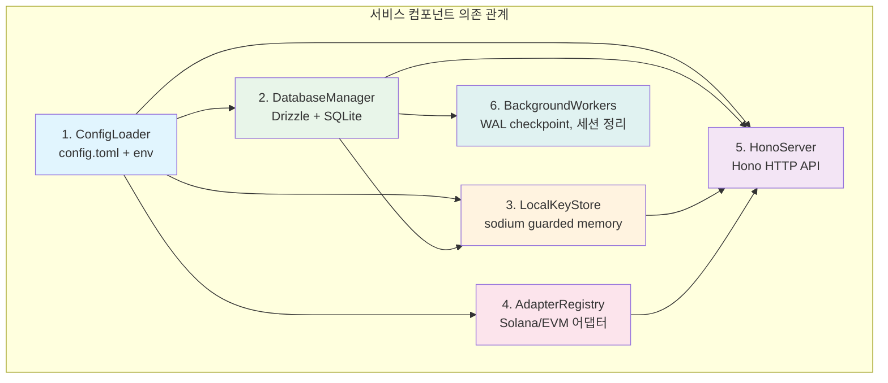
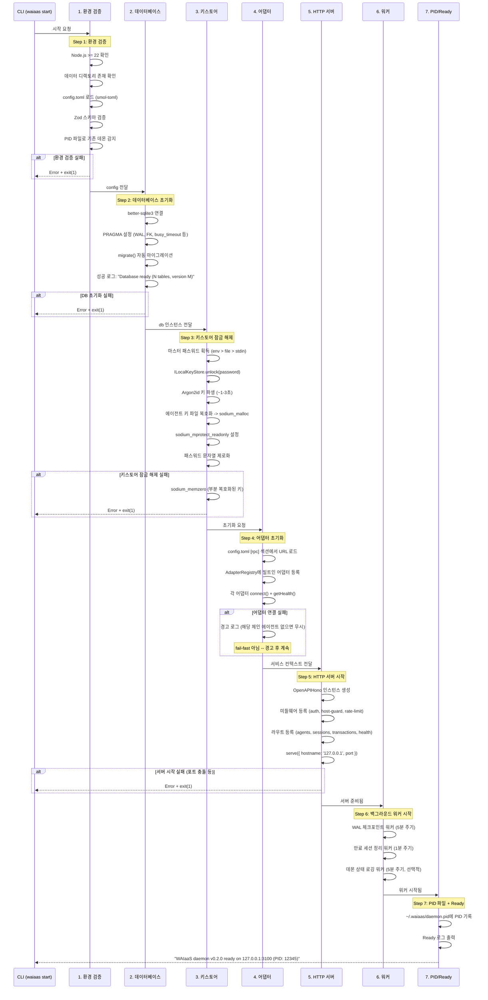
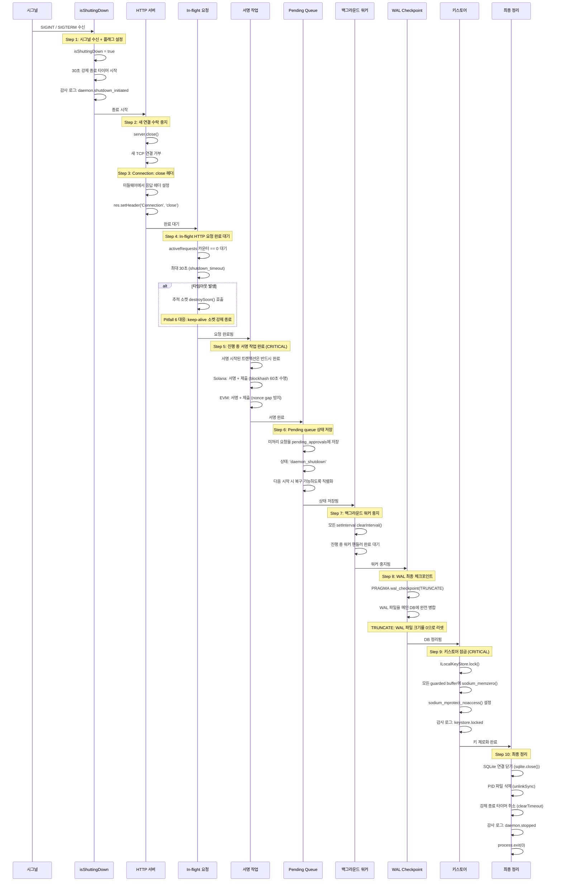
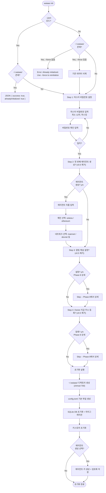

# 데몬 라이프사이클 + CLI 커맨드 설계 (CORE-05)

**문서 ID:** CORE-05
**작성일:** 2026-02-05
**상태:** 완료
**참조:** CORE-01 (24-monorepo-data-directory.md), CORE-02 (25-sqlite-schema.md), CORE-03 (26-keystore-spec.md), CORE-04 (27-chain-adapter-interface.md), 06-RESEARCH.md, 06-CONTEXT.md, AUTH-REDESIGN (52-auth-model-redesign.md), CLI-REDESIGN (54-cli-flow-redesign.md)

---

## 1. 데몬 아키텍처 개요

### 1.1 설계 원칙

WAIaaS 데몬은 단일 Node.js 프로세스로 실행된다. 기본 모드는 foreground이며, `--daemon` 플래그로 background 실행을 지원한다.

| 원칙 | 설명 |
|------|------|
| **단일 프로세스** | 모든 서비스가 하나의 Node.js 프로세스에서 동작. IPC/RPC 오버헤드 없음 |
| **foreground 기본** | Tauri 사이드카, Docker, systemd 환경에서 자연스러운 프로세스 관리 |
| **결정적 시작/종료** | 서비스 초기화/정리 순서가 의존 관계에 의해 결정됨 |
| **fail-fast 시작** | 필수 서비스 실패 시 즉시 종료. 불완전 상태로 서빙하지 않음 |
| **graceful 종료** | 진행 중 작업 완료 후 리소스 정리. 키 자료 반드시 제로화 |

### 1.2 서비스 컴포넌트

데몬은 6개의 핵심 서비스 컴포넌트로 구성된다:

| # | 컴포넌트 | 패키지 위치 | 역할 | 핵심 의존성 |
|---|----------|------------|------|------------|
| 1 | **ConfigLoader** | `daemon/src/infrastructure/config/loader.ts` | config.toml 파싱 + 환경변수 오버라이드 + Zod 검증 | `smol-toml` |
| 2 | **DatabaseManager** | `daemon/src/infrastructure/database/` | Drizzle ORM + better-sqlite3 연결, PRAGMA 설정, 마이그레이션 | `drizzle-orm`, `better-sqlite3` |
| 3 | **LocalKeyStore** | `daemon/src/infrastructure/keystore/` | 마스터 패스워드 기반 키스토어 잠금 해제/잠금, sodium guarded memory | `sodium-native`, `argon2` |
| 4 | **AdapterRegistry** | `daemon/src/infrastructure/` (+ `adapters/*`) | Solana/EVM 어댑터 등록, RPC 연결, 헬스 체크 | `@solana/kit`, `viem` |
| 5 | **HonoServer** | `daemon/src/server/` | HTTP API 서버, 미들웨어, OpenAPI 스펙 | `hono`, `@hono/node-server`, `@hono/zod-openapi` |
| 6 | **BackgroundWorkers** | `daemon/src/lifecycle/workers.ts` | WAL 체크포인트, 세션 만료 정리, 상태 로깅 | `setInterval` 기반 |

### 1.3 서비스 의존 관계 다이어그램



**의존 관계 설명:**
- **ConfigLoader**는 다른 모든 서비스의 기반. 설정이 로드되어야 포트, 경로, 파라미터를 알 수 있음
- **DatabaseManager**는 ConfigLoader에 의존 (DB 경로, PRAGMA 설정). KeyStore보다 먼저 초기화 (에이전트 목록 조회 필요)
- **LocalKeyStore**는 ConfigLoader + DatabaseManager에 의존. agents 테이블에서 키 파일 목록 확인
- **AdapterRegistry**는 ConfigLoader에 의존 (RPC URL). KeyStore 이후 초기화 (순서 보장이지만 직접 의존은 아님)
- **HonoServer**는 DB, KeyStore, AdapterRegistry 모두에 의존. 모든 서비스가 준비된 후 시작
- **BackgroundWorkers**는 DatabaseManager에 의존 (WAL 체크포인트, 세션 테이블 접근)

### 1.4 시작/종료 순서 원칙

```
시작 순서 (의존 관계 순방향):
  Config -> DB -> KeyStore -> Adapters -> Server -> Workers -> PID/Ready

종료 순서 (의존 관계 역방향):
  Signal -> Server Stop -> In-flight 완료 -> Workers Stop -> Adapters -> WAL -> KeyStore Lock -> DB Close -> PID 삭제
```

---

## 2. 시작 시퀀스 (Startup Sequence)

### 2.1 7단계 시작 과정



### 2.2 단계별 상세

#### Step 1: 환경 검증

```typescript
// packages/daemon/src/lifecycle/daemon.ts
async function validateEnvironment(options: StartOptions): Promise<ValidatedConfig> {
  // 1-1. Node.js 버전 체크
  const [major] = process.versions.node.split('.').map(Number)
  if (major < 22) {
    throw new DaemonError('NODE_VERSION', `Node.js >= 22 required, got ${process.version}`)
  }

  // 1-2. 데이터 디렉토리 존재 확인
  const dataDir = resolveDataDir(options.dataDir)
  //   $WAIAAS_DATA_DIR || $XDG_DATA_HOME/waiaas || ~/.waiaas
  if (!existsSync(dataDir)) {
    throw new DaemonError('NOT_INITIALIZED',
      "Data directory not found. Run 'waiaas init' first.")
  }

  // 1-3. config.toml 로드
  const configPath = join(dataDir, 'config.toml')
  const rawToml = readFileSync(configPath, 'utf-8')
  const parsed = smolToml.parse(rawToml)

  // 1-4. Zod 스키마 검증 + 환경변수 오버라이드 병합
  const config = WaiaasConfigSchema.parse(mergeEnvOverrides(parsed))
  // CLI 옵션 오버라이드 (--port, --log-level)
  if (options.port) config.daemon.port = options.port
  if (options.logLevel) config.daemon.log_level = options.logLevel

  // 1-5. [v0.7 보완] flock 기반 데몬 인스턴스 잠금 (DAEMON-02 해소)
  //   PID 파일의 check-then-act 경쟁 조건을 제거하기 위해 flock exclusive lock 사용.
  //   lockFd는 데몬 수명 동안 유지되며, 프로세스 종료 시 OS가 자동 해제.
  const pidPath = resolvePidPath(dataDir, config.daemon.pid_file)
  const lockFd = acquireDaemonLock(dataDir)

  // PID 파일은 보조 정보로만 사용 (status 명령의 PID 표시용)
  if (existsSync(pidPath)) {
    const pid = parseInt(readFileSync(pidPath, 'utf-8').trim(), 10)
    if (!isProcessRunning(pid)) {
      unlinkSync(pidPath)
      logger.warn(`Removed stale PID file (PID: ${pid} not running)`)
    }
  }

  return { dataDir, config, pidPath, lockFd }
}
```

**실패 시 동작:** Error 메시지 출력 + `process.exit(1)`. 이 단계에서는 리소스가 아직 할당되지 않았으므로 정리 불필요(lockFd는 프로세스 종료 시 OS가 자동 해제).

##### acquireDaemonLock() [v0.7 보완]

```typescript
// packages/daemon/src/lifecycle/daemon.ts
import { openSync, writeSync, closeSync } from 'node:fs'

/**
 * flock 기반 데몬 인스턴스 잠금을 획득한다. [v0.7 보완]
 *
 * PID 파일의 check-then-act 경쟁 조건(DAEMON-02)을 제거하기 위해
 * flock exclusive non-blocking 잠금을 사용한다.
 *
 * 동작 원리:
 * - 성공: fd를 반환. 데몬 수명 동안 fd를 유지하여 잠금 보유.
 * - 실패: 다른 프로세스가 이미 잠금 보유 -> ALREADY_RUNNING 에러.
 * - 비정상 종료: OS가 프로세스 종료 시 fd를 자동 닫아 잠금 해제.
 *   -> 다음 시작 시 잠금 획득 성공 (stale PID 문제 원천 제거).
 *
 * @param dataDir 데이터 디렉토리 경로
 * @returns lockFd - 잠금 파일 디스크립터 (데몬 종료까지 유지)
 */
function acquireDaemonLock(dataDir: string): number {
  const lockPath = path.join(dataDir, 'daemon.lock')

  // O_WRONLY | O_CREAT | O_TRUNC
  const fd = openSync(lockPath, 'w')

  try {
    // flock exclusive non-blocking
    // fs-ext: flockSync(fd, 'exnb')
    // 또는 Node.js 네이티브 대안 사용
    flockSync(fd, 'exnb')
  } catch (err: unknown) {
    const code = (err as NodeJS.ErrnoException).code
    if (code === 'EWOULDBLOCK' || code === 'EAGAIN') {
      closeSync(fd)
      // lock 파일 내용(PID)을 읽어 사용자에게 안내
      let existingPid = 'unknown'
      try {
        const content = readFileSync(lockPath, 'utf-8').trim()
        if (content) existingPid = content
      } catch { /* ignore */ }
      throw new DaemonError('ALREADY_RUNNING',
        `Daemon already running (PID: ${existingPid}). Use 'waiaas stop' first.`)
    }
    closeSync(fd)
    throw err
  }

  // 잠금 성공: lock 파일에 PID 기록 (보조 정보)
  writeSync(fd, String(process.pid))

  return fd
}
```

**Windows fallback [v0.7 보완]:** Windows에서는 flock이 지원되지 않는다. HTTP 포트 바인딩 자체가 단일 인스턴스를 보장한다 (`127.0.0.1:3100` bind 실패 = EADDRINUSE = 이미 실행 중). Windows에서는 `acquireDaemonLock()`이 flock 대신 no-op으로 동작하고, Step 5(HTTP 서버 시작)에서 포트 바인딩 실패로 중복 실행을 감지한다.

```typescript
function acquireDaemonLock(dataDir: string): number {
  if (process.platform === 'win32') {
    // Windows: 포트 바인딩으로 단일 인스턴스 보장. flock 미사용.
    return -1  // sentinel: lockFd 미사용
  }
  // Unix: flock 기반 잠금 (위 구현)
  // ...
}
```

#### Step 2: 데이터베이스 초기화

```typescript
async function initializeDatabase(config: ValidatedConfig): Promise<DatabaseManager> {
  const dbPath = join(config.dataDir, 'data', 'waiaas.db')

  // 2-1. better-sqlite3 연결
  const sqlite = new Database(dbPath)

  // 2-2. PRAGMA 설정 (CORE-02 25-sqlite-schema.md 섹션 4 참조)
  sqlite.pragma('journal_mode = WAL')
  sqlite.pragma('synchronous = NORMAL')
  sqlite.pragma('foreign_keys = ON')
  sqlite.pragma('busy_timeout = 5000')
  sqlite.pragma('cache_size = -64000')     // 64MB
  sqlite.pragma('mmap_size = 268435456')   // 256MB

  // 2-3. 자동 마이그레이션
  const db = drizzle({ client: sqlite })
  await migrate(db, { migrationsFolder: join(__dirname, '../drizzle') })

  logger.info(`Database ready (${dbPath})`)
  return new DatabaseManager(sqlite, db)
}
```

**실패 시 동작:** SQLite 연결 닫기 + Error 메시지 + `process.exit(1)`.

#### Step 3: 키스토어 잠금 해제

```typescript
async function unlockKeyStore(
  config: ValidatedConfig,
  db: DatabaseManager
): Promise<LocalKeyStore> {
  const keyStore = new LocalKeyStore(config.dataDir, db)

  // 3-1. 마스터 패스워드 획득 (CORE-03 26-keystore-spec.md 섹션 5.3 참조)
  //   우선순위: 환경변수 > 파일 > 대화형 stdin
  const password = await resolvePassword({
    env: process.env.WAIAAS_MASTER_PASSWORD,
    file: process.env.WAIAAS_PASSWORD_FILE,
    interactive: process.stdin.isTTY,
  })

  // 3-2. 잠금 해제 (Argon2id + AES-256-GCM 복호화 + sodium_malloc)
  await keyStore.unlock(password)

  // 3-3. 패스워드 제로화
  //   문자열은 immutable이므로 변수 참조만 해제. GC에 의존.
  //   환경변수도 delete: delete process.env.WAIAAS_MASTER_PASSWORD

  logger.info(`KeyStore unlocked (${keyStore.getLoadedKeyCount()} keys loaded)`)
  return keyStore
}
```

**실패 시 동작:** 부분적으로 복호화된 키가 있으면 `sodium_memzero` 호출. DB 연결 닫기 + Error 메시지 + `process.exit(1)`.

**시간 추정:** Argon2id 키 파생이 ~1-3초로 시작 시간의 지배적 요인. 에이전트 수에 따라 복호화 시간이 선형 증가하나, AES-256-GCM 복호화는 키당 ~1ms 이하.

#### Step 4: 어댑터 초기화

```typescript
async function initializeAdapters(
  config: ValidatedConfig,
  keyStore: LocalKeyStore
): Promise<AdapterRegistry> {
  const registry = new AdapterRegistry()

  // 4-1. 빌트인 어댑터 등록 (CORE-04 27-chain-adapter-interface.md 섹션 4 참조)
  registry.register('solana', (network) =>
    new SolanaAdapter(config.rpc.solana[network], network))
  registry.register('ethereum', (network) =>
    new EVMAdapter(config.rpc.ethereum[network], network))

  // 4-2. 사용 중인 체인/네트워크 조합으로 어댑터 인스턴스 생성 + 헬스 체크
  const activeChains = await getActiveAgentChains(db)  // agents 테이블 조회
  for (const { chain, network } of activeChains) {
    try {
      const adapter = registry.get(chain, network)
      await adapter.connect()
      const health = await adapter.getHealth()
      logger.info(`${chain}/${network} adapter ready (latency: ${health.latencyMs}ms)`)
    } catch (err) {
      // 4-3. 연결 실패: 경고 (에이전트가 있지만 RPC 연결 불가)
      logger.warn(`${chain}/${network} adapter connection failed: ${err.message}`)
      logger.warn('Agents on this chain will not be able to transact until reconnected')
    }
  }

  return registry
}
```

**실패 시 동작:** 어댑터 연결 실패는 **경고(warn)**, fail-fast 아님. 해당 체인의 에이전트가 트랜잭션을 시도하면 런타임 에러로 처리. 이유: RPC 노드의 일시적 장애로 데몬 전체가 시작 불가하면 다른 체인의 에이전트까지 영향.

#### Step 5: HTTP 서버 시작

```typescript
async function startHttpServer(
  config: ValidatedConfig,
  services: ServiceContext
): Promise<Server> {
  // 5-1. Hono 앱 초기화 (06-05에서 상세화)
  const app = createApp(services)

  // 5-2. 서버 시작 (CORE-01 hostname 강제)
  const server = serve({
    fetch: app.fetch,
    port: config.daemon.port,
    hostname: '127.0.0.1',  // z.literal('127.0.0.1') -- 변경 불가
  })

  // 5-3. 소켓 추적 (Graceful Shutdown용 -- Pitfall 6 대응)
  const activeSockets = new Set<Socket>()
  server.on('connection', (socket: Socket) => {
    activeSockets.add(socket)
    socket.on('close', () => activeSockets.delete(socket))
  })

  logger.info(`HTTP server listening on 127.0.0.1:${config.daemon.port}`)
  return Object.assign(server, { activeSockets })
}
```

**실패 시 동작:** 포트 충돌(`EADDRINUSE`) 등 서버 시작 실패 시 이전 단계 리소스 정리(KeyStore lock, DB close) + `process.exit(1)`.

#### Step 6: 백그라운드 워커 시작

```typescript
function startBackgroundWorkers(
  db: DatabaseManager,
  config: ValidatedConfig
): BackgroundWorkers {
  const workers = new BackgroundWorkers()

  // 6-1. WAL 체크포인트 워커 (CORE-02 섹션 4.2 참조)
  workers.register('wal-checkpoint', {
    interval: 5 * 60 * 1000,  // 5분
    handler: () => {
      db.raw.pragma('wal_checkpoint(PASSIVE)')
      // PASSIVE: 진행 중 읽기를 차단하지 않음. TRUNCATE는 종료 시에만
    },
  })

  // 6-2. 만료 세션 정리 워커
  workers.register('session-cleanup', {
    interval: 60 * 1000,  // 1분
    handler: () => {
      const deleted = db.deleteExpiredSessions()
      if (deleted > 0) logger.debug(`Cleaned ${deleted} expired sessions`)
    },
  })

  // 6-3. 데몬 상태 로깅 워커 (선택적)
  if (config.daemon.log_level === 'debug' || config.daemon.log_level === 'trace') {
    workers.register('status-log', {
      interval: 5 * 60 * 1000,  // 5분
      handler: () => {
        logger.debug('Daemon status', {
          uptime: process.uptime(),
          memory: process.memoryUsage(),
          activeSessions: db.getActiveSessionCount(),
        })
      },
    })
  }

  workers.startAll()
  return workers
}
```

**실패 시 동작:** 워커 시작은 fail-fast 아님. 개별 워커 실패 시 에러 로그 후 다음 주기에 재시도.

#### Step 7: PID 파일 기록 + Ready

```typescript
function writePidAndReady(
  config: ValidatedConfig,
  pidPath: string
): void {
  // 7-1. PID 파일 기록 (서버 리스닝 시작 후에만)
  writeFileSync(pidPath, String(process.pid), { mode: 0o644 })

  // 7-2. Ready 메시지 출력
  const version = getPackageVersion()
  console.log(
    `WAIaaS daemon v${version} ready on 127.0.0.1:${config.daemon.port} ` +
    `(PID: ${process.pid})`
  )

  // 7-3. 시작 감사 로그
  auditLog({
    eventType: 'daemon.started',
    actor: 'system',
    details: {
      version,
      port: config.daemon.port,
      pid: process.pid,
      keysLoaded: keyStore.getLoadedKeyCount(),
    },
    severity: 'info',
  })
}
```

### 2.3 시작 시간 추정

| 단계 | 예상 시간 | 비고 |
|------|----------|------|
| Step 1: 환경 검증 | ~10ms | 파일 읽기 + Zod 검증 |
| Step 2: DB 초기화 | ~50-200ms | 마이그레이션 포함. 첫 실행 시 더 길 수 있음 |
| Step 3: 키스토어 잠금 해제 | **~1-3초** | Argon2id KDF가 지배적 (m=64MiB, t=3, p=4) |
| Step 4: 어댑터 초기화 | ~200-1000ms | RPC 연결 + 헬스 체크 (네트워크 의존) |
| Step 5: HTTP 서버 시작 | ~10ms | 포트 바인딩 |
| Step 6: 워커 시작 | ~1ms | setInterval 등록 |
| Step 7: PID/Ready | ~1ms | 파일 쓰기 |
| **총 시작 시간** | **~1.5-4.5초** | Argon2id + 네트워크 I/O가 지배적 |

### 2.4 단계별 실패 처리 요약

| 단계 | 실패 유형 | 처리 | 정리 대상 |
|------|----------|------|----------|
| Step 1 | Node.js 버전 미달, 미초기화, PID 충돌 | **fail-fast** exit(1) | 없음 |
| Step 2 | DB 파일 손상, 마이그레이션 실패 | **fail-fast** exit(1) | SQLite 연결 닫기 |
| Step 3 | 패스워드 오류, 키 파일 손상 | **fail-fast** exit(1) | sodium_memzero + DB 닫기 |
| Step 4 | RPC 연결 실패 | **경고 후 계속** | 없음 (retry 가능) |
| Step 5 | 포트 충돌 | **fail-fast** exit(1) | KeyStore lock + DB 닫기 |
| Step 6 | 워커 핸들러 에러 | **로그 후 계속** | 없음 (다음 주기 재시도) |
| Step 7 | PID 파일 쓰기 실패 | **경고 후 계속** | 없음 (기능에 영향 없음) |

### 2.5 시작 단계별 타임아웃 + fail-fast/soft 정책 [v0.10]

§2.3의 "예상 시간"과 §2.4의 "실패 처리 요약"을 보완하여, 각 단계의 **강제 타임아웃**과 **에러 코드**, **v0.10 objectives D-1과의 매핑**을 정의한다. 구현자는 이 테이블을 기준으로 각 단계에 타임아웃을 적용한다.

> **참고:** v0.10 objectives D-1은 6단계(Step 1-2를 하나로, Step 6-7 제외)로 기술하지만, 28-daemon의 기존 7단계 구조를 유지한다. "v0.10 D-1 매핑" 컬럼으로 대응 관계를 명시하여 혼동을 방지한다.

#### 2.5.1 단계별 타임아웃 테이블

| Step | 작업 | 타임아웃 | 실패 정책 | 에러 코드 | v0.10 D-1 매핑 | 비고 |
|------|------|---------|----------|----------|--------------|------|
| 1 | 환경 검증 (flock + config.toml + Zod) | **5초** | fail-fast | `DAEMON_ALREADY_RUNNING` / `CONFIG_LOAD_ERROR` | D-1 Step 1+2 | flock 획득(5초) + TOML 파싱 + Zod 검증 포함 |
| 2 | DB 초기화 (better-sqlite3 + PRAGMA + migrate) | **30초** | fail-fast | `DB_MIGRATION_TIMEOUT` | D-1 Step 3 | 대규모 마이그레이션 시 시간 소요 가능 |
| 3 | 키스토어 잠금 해제 (Argon2id + AES-GCM) | **30초** | fail-fast | `KEYSTORE_UNLOCK_TIMEOUT` | D-1 Step 4 | Argon2id ~1-3초 + 다수 에이전트 키 복호화 |
| 4 | 어댑터 초기화 (RPC connect + healthCheck) | **10초/체인** | **fail-soft** | 경고 로그 + 체인 비활성화 | D-1 Step 5 | 해당 체인 비활성화, 데몬은 계속 시작 |
| 5 | HTTP 서버 시작 (Hono serve 127.0.0.1) | **5초** | fail-fast | `PORT_BIND_ERROR` | D-1 Step 6 | 포트 충돌(EADDRINUSE) 포함 |
| 6 | 백그라운드 워커 시작 | 타임아웃 없음 | fail-soft | - | (D-1 범위 외) | 비동기 시작, 개별 실패 시 다음 주기 재시도 |
| 7 | PID 파일 기록 + Ready 메시지 | 타임아웃 없음 | fail-fast | - | (D-1 범위 외) | 파일 I/O 즉시 완료 |

**정책 요약:**
- **fail-fast:** 해당 단계 실패 시 데몬 즉시 종료 (`process.exit(1)`). 불완전 상태로 서빙하지 않음
- **fail-soft:** 해당 단계 실패 시 경고 로그 후 다음 단계로 진행. 데몬은 제한된 기능으로 시작

#### 2.5.2 전체 시작 시간 상한: 90초

전체 시작 시퀀스(Step 1~7)에 **90초 상한**을 적용한다. 개별 단계 타임아웃의 합계(5+30+30+10+5=80초)보다 여유를 두되, 무한 대기를 방지한다. 90초를 초과하면 데몬을 강제 종료한다.

```typescript
// packages/daemon/src/lifecycle/daemon.ts (v0.10 타임아웃 래퍼)
async function startDaemon(options: StartOptions): Promise<void> {
  const STARTUP_TIMEOUT_MS = 90_000  // 전체 90초 상한
  const ac = new AbortController()
  const timer = setTimeout(() => ac.abort(), STARTUP_TIMEOUT_MS)

  try {
    // Step 1: 환경 검증 (5초)
    const config = await withTimeout(
      validateEnvironment(options), 5_000, 'CONFIG_LOAD_ERROR'
    )

    // Step 2: DB 초기화 (30초)
    const db = await withTimeout(
      initializeDatabase(config), 30_000, 'DB_MIGRATION_TIMEOUT'
    )

    // Step 3: 키스토어 잠금 해제 (30초)
    const keyStore = await withTimeout(
      unlockKeyStore(config, db), 30_000, 'KEYSTORE_UNLOCK_TIMEOUT'
    )

    // Step 4: 어댑터 초기화 (10초/체인, fail-soft)
    const adapters = await initializeAdapters(config, {
      timeoutPerChain: 10_000,
      failSoft: true,  // 실패 시 경고 로그 + 체인 비활성화
    })

    // Step 5: HTTP 서버 시작 (5초)
    const server = await withTimeout(
      startHttpServer(config, { db, keyStore, adapters }),
      5_000, 'PORT_BIND_ERROR'
    )

    // Step 6: 백그라운드 워커 시작 (타임아웃 없음, fail-soft)
    startBackgroundWorkers(db)  // setInterval 등록, 즉시 반환

    // Step 7: PID 파일 + Ready 메시지 (타임아웃 없음)
    writePidFile(config.dataDir)

    // 전체 상한 초과 확인
    if (ac.signal.aborted) {
      throw new DaemonError('DAEMON_STARTUP_TIMEOUT',
        `Daemon startup exceeded ${STARTUP_TIMEOUT_MS / 1000}s limit`)
    }

    logger.info(`WAIaaS daemon ready on ${config.host}:${config.port}`)
  } catch (err) {
    if (ac.signal.aborted && !(err instanceof DaemonError)) {
      throw new DaemonError('DAEMON_STARTUP_TIMEOUT',
        `Daemon startup exceeded ${STARTUP_TIMEOUT_MS / 1000}s limit`)
    }
    throw err
  } finally {
    clearTimeout(timer)
  }
}

/** 개별 단계에 타임아웃을 적용하는 유틸리티 */
function withTimeout<T>(
  promise: Promise<T>,
  ms: number,
  errorCode: string
): Promise<T> {
  return Promise.race([
    promise,
    new Promise<never>((_, reject) =>
      setTimeout(
        () => reject(new DaemonError(errorCode, `Timeout after ${ms}ms`)),
        ms
      )
    ),
  ])
}
```

**90초 상한 초과 시 동작:**
1. `AbortController`가 abort 신호 발생
2. 현재 진행 중인 단계가 자체 타임아웃으로 먼저 실패할 가능성이 높음
3. 만약 자체 타임아웃 이전에 전체 상한에 도달하면 `DAEMON_STARTUP_TIMEOUT` 에러로 강제 종료
4. `finally` 블록에서 타이머 정리. 이미 초기화된 리소스는 프로세스 종료 시 OS가 회수

#### 2.5.3 Step 6/7 타임아웃 면제 사유

| Step | 타임아웃 면제 사유 |
|------|-----------------|
| Step 6 (백그라운드 워커) | `setInterval` 기반 비동기 시작. 등록 자체는 즉시 완료(~1ms)되며, 개별 워커의 첫 실행 실패는 다음 주기에 재시도. 워커 등록이 지연될 수 있는 시나리오가 존재하지 않음 |
| Step 7 (PID/Ready) | `writeFileSync` 파일 I/O로 즉시 완료(~1ms). 실패 시 동기 예외가 발생하므로 타임아웃 불필요. 디스크 I/O 지연은 OS 수준에서 처리 |

#### 2.5.4 fail-soft 동작 상세 (Step 4: 어댑터 초기화)

Step 4는 유일하게 **fail-soft** 정책을 적용한다. 체인별 독립 타임아웃(10초/체인)으로 한 체인의 실패가 다른 체인에 영향을 주지 않는다.

**fail-soft 동작 흐름:**

```
Step 4 시작
├── Solana 어댑터 초기화 (10초 타임아웃)
│   ├── 성공 → 활성화
│   └── 실패/타임아웃 → 경고 로그 + Solana 비활성화
│
├── EVM 어댑터 초기화 (10초 타임아웃)
│   ├── 성공 → 활성화
│   └── 실패/타임아웃 → 경고 로그 + EVM 비활성화
│
└── 최소 1개 이상 활성화 → Step 5로 진행
    전체 실패 → fail-fast (데몬 종료)
```

**비활성화된 체인의 동작:**
- 해당 체인의 에이전트 API 요청은 `503 SERVICE_UNAVAILABLE` 반환
- 어댑터는 기존 §2.4의 `healthCheck` 로직에 따라 자체적으로 재연결 시도
- 재연결 성공 시 자동으로 활성화 상태 복원

> **보완 사항:** 모든 어댑터가 실패한 경우(체인 0개 활성화)에도 데몬을 시작할 것인지에 대해 -- 이 경우 fail-fast로 전환한다. 체인 연결 없이는 데몬의 핵심 기능(거래 처리)이 불가능하기 때문이다.

---

## 3. 종료 시퀀스 (Shutdown Sequence)

### 3.1 10단계 Graceful Shutdown 캐스케이드

06-RESEARCH.md "Graceful Shutdown 전략" 결정을 기반으로 10단계 캐스케이드를 정의한다.



### 3.2 단계별 상세

#### Step 1: 시그널 수신 + 플래그 설정

```typescript
let isShuttingDown = false

async function gracefulShutdown(signal: string): Promise<void> {
  // 다중 시그널 방지
  if (isShuttingDown) {
    logger.warn(`Already shutting down, ignoring ${signal}`)
    return
  }
  isShuttingDown = true

  logger.info(`Received ${signal}, starting graceful shutdown...`)

  // 감사 로그
  auditLog({
    eventType: 'daemon.shutdown_initiated',
    actor: 'system',
    details: { signal, pid: process.pid },
    severity: 'info',
  })

  // 30초 강제 종료 타임아웃
  const forceTimeout = setTimeout(() => {
    logger.error('Graceful shutdown timed out, forcing exit')
    auditLog({
      eventType: 'daemon.forced_shutdown',
      actor: 'system',
      details: { signal, timeout: config.daemon.shutdown_timeout },
      severity: 'critical',
    })
    process.exit(1)
  }, config.daemon.shutdown_timeout * 1000)

  // 타임아웃이 프로세스 종료를 방해하지 않도록
  forceTimeout.unref()

  try {
    await executeShutdownSteps()
  } catch (err) {
    logger.error('Shutdown error:', err)
    process.exit(1)
  }
}
```

#### Step 2-3: 서버 종료 + Connection: close

```typescript
async function stopHttpServer(server: Server & { activeSockets: Set<Socket> }): Promise<void> {
  // Step 2: 새 연결 수락 중지
  server.close()

  // Step 3: 기존 연결에 Connection: close 설정
  // Hono 미들웨어에서 isShuttingDown 플래그 확인하여 헤더 추가
  // (미들웨어는 이미 등록되어 있으며, 플래그만 확인)
}
```

**Shutdown 인식 미들웨어:**

```typescript
// daemon/src/server/middleware/shutdown.ts
app.use('*', async (c, next) => {
  if (isShuttingDown) {
    c.header('Connection', 'close')
  }
  await next()
})
```

#### Step 4: In-flight 요청 완료 대기

```typescript
async function waitForInflightRequests(
  server: Server & { activeSockets: Set<Socket> },
  timeoutMs: number
): Promise<void> {
  return new Promise<void>((resolve) => {
    // server.close()의 콜백은 모든 연결이 닫히면 호출됨
    // 그러나 keep-alive 연결이 있으면 무한 대기 가능 (Pitfall 6)

    const checkInterval = setInterval(() => {
      if (server.activeSockets.size === 0) {
        clearInterval(checkInterval)
        resolve()
      }
    }, 100)

    // 타임아웃 시 소켓 강제 종료
    setTimeout(() => {
      clearInterval(checkInterval)
      for (const socket of server.activeSockets) {
        // destroySoon: 버퍼의 데이터 전송 후 종료
        socket.destroySoon()
      }
      // 소켓 종료 후 약간 대기
      setTimeout(resolve, 500)
    }, timeoutMs)
  })
}
```

**Pitfall 6 대응 (Hono server.close 미종료):**
- `server.on('connection', socket => activeSockets.add(socket))` 로 모든 소켓 추적
- 타임아웃 시 `socket.destroySoon()` 으로 강제 종료 (현재 응답 전송 후 종료)
- `socket.destroy()` 대신 `destroySoon()` 사용: 진행 중인 응답 바이트가 유실되지 않음

#### Step 5: 진행 중 서명 작업 완료 (CRITICAL)

```typescript
async function completeInFlightSigningOperations(): Promise<void> {
  // 서명이 시작된 트랜잭션은 반드시 제출까지 완료해야 함
  //
  // Solana: 서명된 tx가 미전송되면 blockhash 만료(~60초) 후 자연 무효화
  //         그러나 사용자가 의도한 거래가 실행되지 않으므로 제출 시도
  //
  // EVM: 서명된 tx가 미전송되면 nonce가 "소비된 것처럼" 취급됨
  //       후속 tx가 같은 nonce를 사용하면 충돌, 더 높은 nonce는 pending 상태
  //       반드시 제출하거나 nonce tracker를 리셋해야 함

  const pendingOps = signingQueue.getInProgress()

  for (const op of pendingOps) {
    try {
      if (op.state === 'signed') {
        // 서명 완료, 미제출 -- 제출 시도
        await op.adapter.submitTransaction(op.signedTx)
        logger.info(`Submitted in-flight tx ${op.txId} during shutdown`)
      } else if (op.state === 'signing') {
        // 서명 진행 중 -- 완료 대기 후 제출
        await op.signingPromise
        await op.adapter.submitTransaction(op.signedTx)
        logger.info(`Completed and submitted in-flight tx ${op.txId} during shutdown`)
      }
    } catch (err) {
      logger.error(`Failed to complete in-flight tx ${op.txId}:`, err)
      // EVM nonce tracker 리셋이 필요할 수 있음
      if (op.chain === 'ethereum') {
        op.adapter.resetNonceTracker()
      }
    }
  }
}
```

**왜 CRITICAL인가:**
- EVM에서 서명 후 미제출 tx의 nonce가 로컬 tracker에 이미 증가됨
- 다음 데몬 시작 시 onchain nonce와 불일치 발생 가능
- `max(onchain, local)` 전략(CORE-04)으로 복구 가능하지만, 의도된 거래 손실을 최소화하려면 제출 완료가 최선

#### Step 6: Pending Queue 상태 저장

```typescript
async function persistPendingState(db: DatabaseManager): Promise<void> {
  // 아직 처리되지 않은 요청 (시간 지연 대기, 승인 대기 등)
  const pendingItems = pendingQueue.getAll()

  for (const item of pendingItems) {
    await db.updatePendingApproval(item.id, {
      status: 'daemon_shutdown',
      metadata: JSON.stringify({
        shutdownAt: new Date().toISOString(),
        originalStatus: item.status,
      }),
    })
  }

  logger.info(`Persisted ${pendingItems.length} pending items`)
}
```

#### Step 7-10: 리소스 정리

```typescript
async function cleanupResources(
  workers: BackgroundWorkers,
  db: DatabaseManager,
  keyStore: LocalKeyStore,
  pidPath: string,
  forceTimeout: NodeJS.Timeout
): Promise<void> {
  // Step 7: 워커 중지
  await workers.stopAll()

  // Step 8: WAL 최종 체크포인트
  db.raw.pragma('wal_checkpoint(TRUNCATE)')
  // TRUNCATE: WAL 파일을 메인 DB에 병합 후 WAL 크기를 0으로 리셋
  // 종료 시에만 TRUNCATE 사용 (PASSIVE보다 무거움)

  // Step 9: 키스토어 잠금 (CRITICAL)
  keyStore.lock()
  // lock() 내부:
  //   for (const buf of guardedBuffers) {
  //     sodium.sodium_memzero(buf)
  //     sodium.sodium_mprotect_noaccess(buf)
  //   }

  auditLog({
    eventType: 'daemon.stopped',
    actor: 'system',
    details: { pid: process.pid, uptime: process.uptime() },
    severity: 'info',
  })

  // Step 10: 최종 정리 [v0.7 보완: lockFd 해제 추가]
  db.close()               // sqlite.close()
  // closeSync(lockFd)는 명시적 정리. OS가 프로세스 종료 시 자동 해제하므로
  // 비정상 종료에도 안전. 명시적 호출은 코드 의도 명확화 목적.
  if (lockFd >= 0) closeSync(lockFd)  // daemon.lock fd 해제 (Windows: -1이면 skip)
  unlinkSync(pidPath)      // PID 파일 삭제
  clearTimeout(forceTimeout) // 강제 종료 타이머 취소

  logger.info('WAIaaS daemon stopped gracefully')
  process.exit(0)
}
```

### 3.3 강제 종료 시나리오

| 시나리오 | 발생 조건 | 결과 |
|---------|----------|------|
| **타임아웃 강제 종료** | Graceful Shutdown이 `shutdown_timeout`(기본 30초) 내 미완료 | `process.exit(1)`. PID 파일 잔존, WAL 미병합 가능 |
| **이중 SIGINT** | 사용자가 Ctrl+C를 두 번 입력 | 첫 번째로 Graceful Shutdown 시작. `isShuttingDown` 가드로 두 번째 무시 |
| **SIGKILL** | `kill -9` 또는 OOM killer | 즉시 종료. 키 자료 제로화 안됨 (OS가 메모리 회수). PID 파일 잔존 |
| **uncaughtException** | 미처리 예외 | 에러 로그 + `process.exit(1)`. 키 자료 제로화 시도하나 보장 불가 |

### 3.4 Windows 호환성

Windows에서 `SIGTERM`은 Node.js process에 전송할 수 없다 (listen은 가능하나 `process.kill(pid, 'SIGTERM')`이 동작하지 않음).

**대안:**
- `waiaas stop`이 `SIGINT` 대신 HTTP API로 종료 요청 전송: `POST /v1/admin/shutdown`
- 또는 `process.kill(pid, 'SIGINT')` 사용 (Windows에서 동작)
- `process.on('SIGBREAK', ...)` 핸들러 추가 (Ctrl+Break 대응)

```typescript
// Windows 호환 시그널 처리
process.on('SIGINT', () => gracefulShutdown('SIGINT'))
process.on('SIGTERM', () => gracefulShutdown('SIGTERM'))

if (process.platform === 'win32') {
  process.on('SIGBREAK', () => gracefulShutdown('SIGBREAK'))
}
```

### 3.5 Docker PID 1 문제

Docker 컨테이너에서 데몬이 PID 1로 실행되면 시그널이 기본 핸들러로 전달되지 않는다 (PID 1 프로세스는 명시적으로 시그널을 핸들링하지 않으면 무시).

**대안:**
1. **`docker run --init`**: Docker가 `tini`를 PID 1로 삽입하여 시그널 전달
2. **Dockerfile에서 `tini` 명시:**
   ```dockerfile
   RUN apk add --no-cache tini
   ENTRYPOINT ["/sbin/tini", "--"]
   CMD ["node", "packages/cli/bin/waiaas.js", "start"]
   ```
3. **docker-compose에서 `init: true`:**
   ```yaml
   services:
     waiaas:
       init: true
       command: ["node", "packages/cli/bin/waiaas.js", "start"]
   ```

WAIaaS 데몬은 Node.js의 `process.on('SIGINT/SIGTERM')` 핸들러를 명시적으로 등록하므로 PID 1에서도 동작하지만, `tini` 사용을 권장한다. tini는 zombie 프로세스 수확(reaping)도 담당하여 더 안정적이다.

---

## 4. 신호 처리 (Signal Handling)

### 4.1 시그널별 동작

| Signal | Action | 설명 | 가용 플랫폼 |
|--------|--------|------|------------|
| `SIGINT` | Graceful Shutdown | Ctrl+C 또는 `kill -2`. 10단계 캐스케이드 실행 | Linux, macOS, Windows |
| `SIGTERM` | Graceful Shutdown | `kill` 또는 Docker stop. 10단계 캐스케이드 실행 | Linux, macOS (Windows: listen만 가능) |
| `SIGHUP` | Config 재로드 | config.toml을 다시 읽어 runtime 설정 업데이트 | Linux, macOS |
| `SIGUSR1` | 상태 덤프 | 현재 데몬 상태를 로그에 출력 (디버깅용) | Linux, macOS |
| `SIGBREAK` | Graceful Shutdown | Windows Ctrl+Break 대응 | Windows |

### 4.2 구현 패턴

```typescript
// packages/daemon/src/lifecycle/signal-handler.ts

export function registerSignalHandlers(
  daemon: DaemonLifecycle
): void {
  // Graceful Shutdown 시그널
  process.on('SIGINT', () => daemon.shutdown('SIGINT'))
  process.on('SIGTERM', () => daemon.shutdown('SIGTERM'))

  // Windows 호환
  if (process.platform === 'win32') {
    process.on('SIGBREAK', () => daemon.shutdown('SIGBREAK'))
  }

  // Config 재로드 (SIGHUP)
  process.on('SIGHUP', async () => {
    logger.info('Received SIGHUP, reloading config...')
    try {
      const newConfig = await reloadConfig(daemon.configPath)
      daemon.applyConfigUpdate(newConfig)
      logger.info('Config reloaded successfully')
    } catch (err) {
      logger.error('Config reload failed:', err)
      // 실패해도 기존 설정으로 계속 운영
    }
  })

  // 상태 덤프 (SIGUSR1)
  process.on('SIGUSR1', () => {
    logger.info('Received SIGUSR1, dumping status...')
    const status = daemon.getStatus()
    logger.info('Daemon Status Dump:', {
      uptime: formatUptime(process.uptime()),
      memory: process.memoryUsage(),
      activeAgents: status.agents.active,
      activeSessions: status.sessions.active,
      loadedKeys: status.keyStore.loadedKeys,
      adapterHealth: status.adapters,
      backgroundWorkers: status.workers,
      pendingTransactions: status.pendingTx,
    })
  })

  // 미처리 예외 (최후의 방어선)
  process.on('uncaughtException', (err) => {
    logger.error('Uncaught exception:', err)
    auditLog({
      eventType: 'daemon.crash',
      actor: 'system',
      details: { error: err.message, stack: err.stack },
      severity: 'critical',
    })
    // 키 자료 제로화 시도
    try { daemon.keyStore?.lock() } catch {}
    process.exit(1)
  })

  process.on('unhandledRejection', (reason) => {
    logger.error('Unhandled rejection:', reason)
    auditLog({
      eventType: 'daemon.unhandled_rejection',
      actor: 'system',
      details: { reason: String(reason) },
      severity: 'critical',
    })
    // 키 자료 제로화 시도
    try { daemon.keyStore?.lock() } catch {}
    process.exit(1)
  })
}
```

### 4.3 SIGHUP Config 재로드 범위

SIGHUP으로 런타임 중 재로드 가능한 설정과 불가능한 설정을 구분한다:

| 설정 | 재로드 가능 | 이유 |
|------|-----------|------|
| `log_level` | O | 로거 레벨만 변경 |
| `log_max_size`, `log_max_files` | O | 로그 로테이션 설정 |
| `shutdown_timeout` | O | 다음 종료 시 적용 |
| `dev_mode` | **X** | **(v0.5 추가)** 시작 시점에만 적용. 런타임 변경 불가 (패스워드 재파생 필요). 54-cli-flow-redesign.md 섹션 7 참조 |
| `port` | **X** | 서버 재시작 필요. 데몬 재시작으로 해결 |
| `hostname` | **X** | `127.0.0.1` 고정. 변경 자체가 불가 |
| `[keystore]` | **X** | 이미 파생된 키에는 영향 없음 |
| `[rpc]` | **제한적** | 새 RPC URL로 어댑터 재연결 시도 가능. 단, 진행 중 요청 중단 위험 |
| `[database]` | **X** | PRAGMA 변경은 DB 재연결 필요 |

### 4.4 다중 시그널 방지

```typescript
// isShuttingDown 가드로 race condition 방지
let isShuttingDown = false

async function shutdown(signal: string): Promise<void> {
  if (isShuttingDown) {
    logger.warn(`Shutdown already in progress, ignoring ${signal}`)
    return
  }
  isShuttingDown = true
  // ... 10단계 캐스케이드
}
```

시나리오: SIGTERM 수신 후 Graceful Shutdown 진행 중 SIGINT가 추가로 들어오면, `isShuttingDown` 가드가 두 번째 시그널을 무시한다. 이는 중복 종료 시퀀스 실행으로 인한 리소스 이중 해제(double-free)를 방지한다.

---

## 5. 프로세스 관리 (daemon.lock + PID 파일)

> **[v0.7 보완]** v0.7에서 데몬 인스턴스 잠금의 주 메커니즘이 PID 파일에서 flock/fd 기반 `daemon.lock`으로 전환되었다 (DAEMON-02 해소). PID 파일은 **보조 정보**로 격하되어 status 명령의 PID 표시 등에만 사용된다.

### 5.0 daemon.lock 파일 스펙 [v0.7 보완]

| 항목 | 값 |
|------|-----|
| **경로** | `~/.waiaas/daemon.lock` |
| **잠금 방식** | flock exclusive (fd 유지 기반). 프로세스가 fd를 보유하는 한 잠금 유지 |
| **내용물** | 프로세스 ID 숫자 (보조 정보, 잠금의 핵심은 fd) |
| **생성 시점** | Step 1: 환경 검증 시 `acquireDaemonLock()` |
| **해제 시점** | Step 10: `closeSync(lockFd)` 또는 프로세스 종료 시 OS 자동 해제 |
| **비정상 종료 시** | OS가 프로세스 종료 시 fd를 자동 닫아 flock 해제. 다음 시작 시 즉시 잠금 획득 가능 (stale lock 문제 없음) |
| **Windows** | 미사용 (HTTP 포트 바인딩으로 단일 인스턴스 보장) |

**flock vs PID 파일 비교:**

| 특성 | PID 파일 (기존) | daemon.lock (v0.7) |
|------|----------------|-------------------|
| 경쟁 조건 | check-then-act TOCTOU 취약 | 원자적 flock (OS 커널 보장) |
| 비정상 종료 | stale PID 잔존 -> 수동 감지 필요 | OS 자동 해제 -> 즉시 재시작 가능 |
| PID 재사용 | OS가 같은 PID를 다른 프로세스에 할당 시 오판 가능 | fd 기반이므로 PID 무관 |
| Windows | process.kill(pid, 0) 동작 | 미지원 -> 포트 바인딩 fallback |

**status 명령의 프로세스 확인 순서 [v0.7 보완]:**
1. `daemon.lock` fd 잠금 시도 (flock exclusive non-blocking)
2. 실패 시(EWOULDBLOCK): lock 파일 내 PID 읽기 -> `GET http://127.0.0.1:{port}/health` 호출
3. health 응답 성공: running (건강)
4. health 응답 실패: running but unhealthy (데몬 응답 불가)
5. 잠금 성공: not running (즉시 잠금 해제 후 반환)

### 5.1 PID 파일 스펙 (보조 정보) [v0.7 보완]

> **역할 변경:** PID 파일은 더 이상 인스턴스 잠금의 주 메커니즘이 아니다. status 명령에서 PID를 표시하거나, 외부 모니터링 도구가 프로세스를 식별하는 **보조 정보**로만 사용된다.

| 항목 | 값 |
|------|-----|
| **경로** | `~/.waiaas/daemon.pid` (또는 config.toml `[daemon].pid_file` 상대 경로) |
| **내용** | 프로세스 ID 숫자 (개행 없음). 예: `12345` |
| **권한** | `0o644` (rw-r--r--) |
| **기록 시점** | Step 7: 서버 리스닝 시작 후 (모든 서비스 준비 완료 후) |
| **삭제 시점** | Step 10: Graceful Shutdown 마지막 단계 (closeSync(lockFd) 이후) |
| **인코딩** | UTF-8 |

### 5.2 PID 파일 생성 (경쟁 조건 방지)

```typescript
function writePidFile(pidPath: string): void {
  try {
    // O_EXCL: 파일이 이미 존재하면 실패
    // 경쟁 조건 방지: 두 데몬이 동시에 시작하려 할 때
    const fd = openSync(pidPath, 'wx')  // O_WRONLY | O_CREAT | O_EXCL
    writeSync(fd, String(process.pid))
    closeSync(fd)
  } catch (err) {
    if (err.code === 'EEXIST') {
      // PID 파일이 이미 존재 -- stale 여부 확인
      const existingPid = parseInt(readFileSync(pidPath, 'utf-8').trim(), 10)
      if (isProcessRunning(existingPid)) {
        throw new DaemonError('ALREADY_RUNNING',
          `Another daemon is running (PID: ${existingPid})`)
      }
      // Stale PID -- 덮어쓰기
      writeFileSync(pidPath, String(process.pid), { mode: 0o644 })
      logger.warn(`Overwrote stale PID file (was: ${existingPid})`)
    } else {
      throw err
    }
  }
}

function isProcessRunning(pid: number): boolean {
  try {
    // kill(pid, 0): 시그널을 보내지 않고 프로세스 존재 여부만 확인
    process.kill(pid, 0)
    return true
  } catch {
    return false  // ESRCH: 프로세스 없음
  }
}
```

**경쟁 조건 시나리오:**
1. 데몬 A가 비정상 종료 (PID 파일 잔존)
2. 데몬 B가 시작: PID 파일 존재 -> `isProcessRunning()` 체크 -> false -> stale PID 덮어쓰기
3. 데몬 C가 동시 시작: `O_EXCL`로 파일 생성 실패 -> 데몬 B의 PID 확인 -> 이미 실행 중 -> 에러

### 5.3 PID 파일 정리 (비정상 종료 대응)

비정상 종료 시 PID 파일이 잔존할 수 있다:

| 종료 유형 | PID 파일 정리 | 대응 |
|----------|-------------|------|
| Graceful Shutdown (exit 0) | O (Step 10에서 삭제) | 정상 |
| Forced Shutdown (exit 1) | **X** (삭제 미실행) | 다음 시작 시 stale PID 감지 후 삭제 |
| SIGKILL | **X** | 다음 시작 시 stale PID 감지 후 삭제 |
| 시스템 재부팅 | **X** | 다음 시작 시 stale PID 감지 후 삭제 |

모든 비정상 경우에 대해 `isProcessRunning()` 체크로 stale PID를 감지하고 안전하게 덮어쓴다.

### 5.4 Background 모드 전환

`--daemon` 또는 `-d` 플래그 사용 시 background 모드로 전환한다:

```typescript
// packages/cli/src/commands/start.ts
function startDaemonMode(options: StartOptions): void {
  if (options.daemon) {
    // child_process.fork + detach로 background 실행
    const child = fork(
      join(__dirname, '../daemon-entry.js'),
      buildChildArgs(options),
      {
        detached: true,
        stdio: ['ignore', 'pipe', 'pipe', 'ipc'],  // stdout/stderr를 pipe로 받음
        env: { ...process.env },
      }
    )

    // 자식 프로세스의 초기 메시지 대기
    child.on('message', (msg: { type: string; pid?: number; error?: string }) => {
      if (msg.type === 'ready') {
        console.log(`WAIaaS daemon started in background (PID: ${msg.pid})`)
        child.unref()      // 부모 프로세스가 자식을 기다리지 않음
        child.disconnect() // IPC 채널 닫기
        process.exit(0)    // CLI 프로세스 종료
      } else if (msg.type === 'error') {
        console.error(`Failed to start daemon: ${msg.error}`)
        process.exit(1)
      }
    })

    // 5초 내 ready 메시지가 없으면 타임아웃
    setTimeout(() => {
      console.error('Daemon startup timed out')
      child.kill()
      process.exit(1)
    }, 10_000)  // Argon2id 시간 고려하여 10초

  } else {
    // Foreground 모드: 직접 실행
    startDaemon(options)
  }
}
```

**Background 모드 시 IPC 프로토콜:**

| 메시지 | 방향 | 의미 |
|--------|------|------|
| `{ type: 'ready', pid: number }` | 자식 -> 부모 | 데몬 시작 완료. 부모 CLI 종료 가능 |
| `{ type: 'error', error: string }` | 자식 -> 부모 | 데몬 시작 실패. 에러 메시지 표시 후 부모 종료 |

**Foreground vs Background 비교:**

| 특성 | Foreground (기본) | Background (`--daemon`) |
|------|-------------------|------------------------|
| 프로세스 관리 | 부모 프로세스가 직접 | fork + detach |
| stdin 접근 | O (대화형 패스워드) | X (환경변수/파일만) |
| 로그 출력 | stdout + 파일 | 파일만 |
| Ctrl+C | Graceful Shutdown | 해당 없음 |
| 적합한 환경 | Tauri 사이드카, Docker, systemd | CLI 독립 실행, crontab |

---

## 6. CLI 커맨드 상세 설계

### 6.0 공통 사항

#### Exit Code 체계

| Exit Code | 의미 | 사용 커맨드 |
|-----------|------|-----------|
| `0` | 성공 | 모든 커맨드 |
| `1` | 일반 에러 (설정 오류, 내부 에러 등) | 모든 커맨드 |
| `2` | 이미 실행 중 (데몬 중복 시작) | `start` |
| `3` | 미초기화 (데이터 디렉토리 없음) | `start`, `stop`, `status` |
| `4` | 인증 실패 (패스워드 오류) | `start` |
| `5` | 타임아웃 (종료 대기 초과) | `stop` |

#### CLI 파싱: Node.js 내장 `util.parseArgs`

외부 의존성 없이 CLI 인자를 파싱한다 (Node.js 18.3+ 내장).

```typescript
// packages/cli/src/index.ts
import { parseArgs } from 'node:util'

const { values, positionals } = parseArgs({
  args: process.argv.slice(2),
  options: {
    help: { type: 'boolean', short: 'h' },
    version: { type: 'boolean', short: 'v' },
  },
  allowPositionals: true,
  strict: false,  // subcommand의 옵션은 서브파서에서 처리
})

const subcommand = positionals[0]

switch (subcommand) {
  case 'init':    return runInit(process.argv.slice(3))
  case 'start':   return runStart(process.argv.slice(3))
  case 'stop':    return runStop(process.argv.slice(3))
  case 'status':  return runStatus(process.argv.slice(3))
  case 'agent':   return runAgent(process.argv.slice(3))
  case 'session': return runSession(process.argv.slice(3))  // (v0.5 추가)
  case 'secret':  return runSecret(process.argv.slice(3))   // (v0.7 추가)
  case 'backup':  return runBackup(process.argv.slice(3))
  default:
    if (values.version) return printVersion()
    if (values.help || !subcommand) return printUsage()
    console.error(`Unknown command: ${subcommand}`)
    process.exit(1)
}
```

**subcommand 패턴 수동 구현 이유:**
- `util.parseArgs`는 서브커맨드를 네이티브 지원하지 않음
- `positionals[0]`으로 서브커맨드를 추출하고, 나머지를 서브파서에 전달
- commander/yargs 대비 장점: 제로 의존성, CLI 패키지 크기 최소화

#### 공통 옵션

| 옵션 | Short | 타입 | 설명 | 적용 커맨드 |
|------|-------|------|------|-----------|
| `--data-dir <path>` | - | string | 데이터 디렉토리 오버라이드 | 모든 커맨드 |
| `--help` | `-h` | boolean | 도움말 출력 | 모든 커맨드 |
| `--version` | `-v` | boolean | 버전 출력 | 글로벌 |

---

### 6.1 `waiaas init` (CLI-01)

**목적:** WAIaaS 데이터 디렉토리를 초기화하고 마스터 패스워드를 설정한다.

#### Usage

```
waiaas init [options]

Options:
  --data-dir <path>        데이터 디렉토리 경로 (기본: ~/.waiaas)
  --non-interactive        비대화형 모드 (CI/자동화 환경)
  --password-env <var>     마스터 패스워드 환경변수 이름 (기본: WAIAAS_MASTER_PASSWORD)
  --master-password <pw>   마스터 패스워드 직접 전달 (Tauri sidecar 전용) [v0.7 보완]
  --json                   JSON 출력 + idempotent 동작 (Tauri sidecar 전용) [v0.7 보완]
  --force                  기존 초기화 덮어쓰기 (데이터 삭제 주의!)
  -h, --help               도움말
```

#### 대화형 초기 설정 플로우 (Interactive Mode)

> **(v0.5 변경)** v0.5에서 init은 순수 인프라 초기화(2단계)로 간소화되었다. 에이전트 생성, 알림 설정, Owner 등록은 별도 커맨드(`waiaas agent create`, API)로 분리. 상세: **54-cli-flow-redesign.md 섹션 2** 참조.
>
> v0.5 추가 옵션: `--quickstart` (패스워드 자동 생성 + 즉시 시작), `--force` (재초기화). 상세: **54-cli-flow-redesign.md 섹션 6** 참조.



#### 대화형 모드 출력 예시

> **(v0.5 변경)** 아래는 v0.2 기준 4단계 출력 예시이다. v0.5에서는 Step 1/2(PW 설정 + 인프라 초기화)만 수행하고 Step 2-4는 제거되었다. v0.5 출력 예시는 **54-cli-flow-redesign.md 섹션 2.4** 참조.

```
$ waiaas init

  WAIaaS v0.2.0 - Initial Setup
  ─────────────────────────────

  Step 1/4: Master Password
  Set a master password to protect your agent keys.
  This password will be required every time the daemon starts.

  Master password (min 12 chars): ••••••••••••••••
  Confirm password: ••••••••••••••••
  ✓ Master password set

  Step 2/4: Create First Agent (v0.5 제거 -- waiaas agent create로 분리)
  Would you like to create your first agent? (y/N): y
  Agent name: trading-bot-01
  Chain (solana/ethereum): solana
  Network (mainnet-beta/devnet/testnet): devnet
  ✓ Agent 'trading-bot-01' created
    Address: 7xKXtg2CW87d97TXJSDpbD5jBkheTqA83TZRuJosgAsU

  Step 3/4: Notification Channel (optional) (v0.5 제거 -- API로 분리)
  Configure notification channel? (y/N): n
  → Skipped (configure later via API or config.toml)

  Step 4/4: Owner Wallet (optional) (v0.5 제거 -- waiaas agent create --owner로 통합)
  Register owner wallet address? (y/N): n
  → Skipped (configure later for time-lock approvals)

  ─────────────────────────────
  ✓ WAIaaS initialized successfully!

  Data directory: ~/.waiaas/
  Config file:    ~/.waiaas/config.toml
  Database:       ~/.waiaas/data/waiaas.db
  Agent keys:     ~/.waiaas/keystore/

  Next steps:
    waiaas start              Start the daemon
    waiaas status             Check daemon status
    waiaas start --daemon     Start in background
```

#### 비대화형 모드 (Non-Interactive)

CI/자동화 환경에서 사용:

```bash
# 환경변수로 패스워드 전달
export WAIAAS_MASTER_PASSWORD="my-secure-password-123"
waiaas init --non-interactive

# 또는 커스텀 환경변수 이름
export MY_WALLET_PW="my-secure-password-123"
waiaas init --non-interactive --password-env MY_WALLET_PW

# 커스텀 데이터 디렉토리
waiaas init --non-interactive --data-dir /opt/waiaas/data
```

#### 에러 출력 예시

```
$ waiaas init
Error: Already initialized at ~/.waiaas/
Use 'waiaas init --force' to reinitialize (WARNING: all data will be deleted)

$ waiaas init --non-interactive
Error: Master password not provided.
Set WAIAAS_MASTER_PASSWORD environment variable or use --password-env <var>

$ waiaas init --non-interactive
Error: Master password too short (minimum 12 characters, got 8)
```

#### 수행하는 작업 (상세)

```typescript
async function runInit(args: string[]): Promise<void> {
  const options = parseInitOptions(args)
  const dataDir = resolveDataDir(options.dataDir)

  // [v0.7 보완] --json 모드: idempotent 동작 (이미 초기화된 경우 에러 없이 성공 반환)
  if (options.json && existsSync(dataDir) && !options.force) {
    const steps = detectExistingSteps(dataDir)
    const allExist = Object.values(steps).every(s => s === 'exists')
    console.log(JSON.stringify({
      success: true,
      alreadyInitialized: allExist,
      dataDir,
      version: VERSION,
      steps,
    }))
    return  // exit 0 (에러 아님)
  }

  // 이미 초기화 확인 (비-JSON 모드: 기존 동작 유지)
  if (existsSync(dataDir) && !options.force) {
    console.error(`Error: Already initialized at ${dataDir}`)
    console.error("Use 'waiaas init --force' to reinitialize (WARNING: all data will be deleted)")
    process.exit(1)
  }

  // --force 시 기존 데이터 삭제
  if (options.force && existsSync(dataDir)) {
    rmSync(dataDir, { recursive: true })
    if (!options.json) console.log(`Removed existing data directory: ${dataDir}`)
  }

  // [v0.7 보완] 각 단계를 개별 idempotent하게 수행
  const steps: Record<string, string> = {}

  // 1. 디렉토리 생성 (idempotent: mkdirSync recursive)
  mkdirSync(dataDir, { mode: 0o700, recursive: true })
  mkdirSync(join(dataDir, 'data'), { mode: 0o700, recursive: true })
  mkdirSync(join(dataDir, 'keystore'), { mode: 0o700, recursive: true })
  mkdirSync(join(dataDir, 'logs'), { mode: 0o700, recursive: true })
  mkdirSync(join(dataDir, 'backups'), { mode: 0o700, recursive: true })
  steps.directory = 'created'

  // 2. config.toml 기본 파일 생성 (idempotent: 존재하면 skip)
  const configPath = join(dataDir, 'config.toml')
  if (!existsSync(configPath)) {
    writeFileSync(configPath, DEFAULT_CONFIG_TOML, { mode: 0o600 })
    steps.config = 'created'
  } else {
    steps.config = 'exists'
  }

  // 3. SQLite DB 초기화 + 마이그레이션 (idempotent: migration은 이미 적용된 것을 skip)
  const dbPath = join(dataDir, 'data', 'waiaas.db')
  const dbExisted = existsSync(dbPath)
  const sqlite = new Database(dbPath)
  applyPragmas(sqlite)
  const db = drizzle({ client: sqlite })
  await migrate(db, { migrationsFolder: getMigrationsPath() })
  steps.database = dbExisted ? 'migrated' : 'created'

  // 4. 키스토어 초기화 (idempotent: 이미 존재하면 skip)
  const password = await resolveInitPassword(options)
  validatePasswordStrength(password)  // 최소 12자 확인
  const keyStore = new LocalKeyStore(dataDir, db)
  if (!keyStore.isInitialized()) {
    await keyStore.initialize(password)
    steps.keystore = 'created'
  } else {
    steps.keystore = 'exists'
  }

  // 5. (선택) 첫 번째 에이전트 생성 (v0.5 제거 -- waiaas agent create로 분리)
  // if (options.createAgent) { ... }

  sqlite.close()

  // [v0.7 보완] --json 모드 출력
  if (options.json) {
    const alreadyInitialized = Object.values(steps).every(s => s === 'exists')
    console.log(JSON.stringify({
      success: true,
      alreadyInitialized,
      dataDir,
      version: VERSION,
      steps,
    }))
  }
}

// [v0.7 보완] 기존 초기화 상태 감지 (idempotent 판정용)
function detectExistingSteps(dataDir: string): Record<string, string> {
  return {
    directory: existsSync(dataDir) ? 'exists' : 'missing',
    config: existsSync(join(dataDir, 'config.toml')) ? 'exists' : 'missing',
    database: existsSync(join(dataDir, 'data', 'waiaas.db')) ? 'exists' : 'missing',
    keystore: existsSync(join(dataDir, 'keystore')) ? 'exists' : 'missing',
  }
}
```

#### 옵션 테이블

| 옵션 | 타입 | 필수 | 기본값 | 설명 |
|------|------|------|--------|------|
| `--data-dir <path>` | string | X | `~/.waiaas` | 데이터 디렉토리 경로 |
| `--non-interactive` | boolean | X | `false` | 비대화형 모드 |
| `--password-env <var>` | string | X | `WAIAAS_MASTER_PASSWORD` | 패스워드 환경변수 이름 |
| `--master-password <pw>` | string | X | - | **(v0.7 추가)** 마스터 패스워드 직접 전달 (Tauri sidecar 호출용). 보안 주의: 프로세스 인자로 노출됨, localhost 환경 전용 |
| `--force` | boolean | X | `false` | 기존 초기화 덮어쓰기 (데이터 삭제!). idempotent 동작과 상호 배타적 |
| `--json` | boolean | X | `false` | **(v0.7 추가)** JSON 출력 모드. idempotent 동작: 이미 초기화된 경우 에러 없이 `{ success: true, alreadyInitialized: true }` 반환 |
| `--quickstart` | boolean | X | `false` | **(v0.5 추가)** 패스워드 자동 생성 + 즉시 시작. 54-cli-flow-redesign.md 섹션 6 참조 |

---

### 6.2 `waiaas start` (CLI-02)

**목적:** WAIaaS 데몬을 시작한다.

#### Usage

```
waiaas start [options]

Options:
  --daemon, -d             백그라운드 모드로 실행
  --port <number>          포트 오버라이드 (기본: 3100)
  --data-dir <path>        데이터 디렉토리 오버라이드
  --log-level <level>      로그 레벨 (debug/info/warn/error)
  --password-env <var>     패스워드 환경변수 이름
  --password-file <path>   패스워드 파일 경로
  --dev                    (v0.5 추가) 개발 모드 -- 고정 패스워드로 프롬프트 없이 시작
  -h, --help               도움말
```

#### 옵션 테이블

| 옵션 | Short | 타입 | 필수 | 기본값 | 설명 |
|------|-------|------|------|--------|------|
| `--daemon` | `-d` | boolean | X | `false` | 백그라운드 모드 실행 (fork + detach) |
| `--port` | - | number | X | config.toml 값 또는 `3100` | HTTP 서버 포트 |
| `--data-dir` | - | string | X | `~/.waiaas` | 데이터 디렉토리 |
| `--log-level` | - | string | X | config.toml 값 또는 `info` | `debug` / `info` / `warn` / `error` |
| `--password-env` | - | string | X | `WAIAAS_MASTER_PASSWORD` | 패스워드 환경변수 이름 |
| `--password-file` | - | string | X | - | 패스워드 파일 경로 (파일 첫 줄) |
| `--dev` | - | boolean | X | `false` | **(v0.5 추가)** 고정 패스워드('waiaas-dev')로 프롬프트 없이 시작. config.toml `[daemon].dev_mode = true`와 동등. **개발 환경 전용.** `--expose`와 조합 금지. 54-cli-flow-redesign.md 섹션 7 참조 |

#### 실행 흐름

```
waiaas start
  -> 환경 검증 (Step 1)
  -> DB 초기화 (Step 2)
  -> 키스토어 잠금 해제 (Step 3)
  -> 어댑터 초기화 (Step 4)
  -> HTTP 서버 시작 (Step 5)
  -> 워커 시작 (Step 6)
  -> PID + Ready (Step 7)

waiaas start --daemon
  -> fork(daemon-entry.js, { detached: true })
  -> 자식: 위 7단계 실행
  -> 자식: process.send({ type: 'ready', pid })
  -> 부모: "Started in background (PID: ...)" 출력
  -> 부모: process.exit(0)
```

#### 출력 예시

**Foreground 모드:**
```
$ waiaas start
WAIaaS daemon v0.2.0
Validating environment... OK
Database ready (7 tables, migration v3)
Unlocking keystore... (Argon2id, ~2s)
KeyStore unlocked (3 keys loaded)
solana/devnet adapter ready (latency: 45ms)
ethereum/sepolia adapter ready (latency: 120ms)
HTTP server listening on 127.0.0.1:3100
Background workers started (wal-checkpoint, session-cleanup)
WAIaaS daemon v0.2.0 ready on 127.0.0.1:3100 (PID: 12345)
```

**Background 모드:**
```
$ waiaas start --daemon
WAIaaS daemon started in background (PID: 12345)
Logs: ~/.waiaas/logs/daemon.log

$ waiaas start --daemon --port 3001
WAIaaS daemon started in background (PID: 12346)
Listening on 127.0.0.0:3001
Logs: ~/.waiaas/logs/daemon.log
```

**(v0.5 추가) --dev 모드:**
```
$ waiaas start --dev
  ┌─────────────────────────────────────────────┐
  │  WARNING: DEV MODE ACTIVE                   │
  │  Using fixed password 'waiaas-dev'          │
  │  DO NOT use in production                   │
  └─────────────────────────────────────────────┘
WAIaaS daemon v0.5.0 [DEV MODE]
Validating environment... OK
Database ready (7 tables, migration v5)
Unlocking keystore... (Argon2id, ~2s)
KeyStore unlocked (1 key loaded)
HTTP server listening on 127.0.0.1:3100
WAIaaS daemon v0.5.0 ready on 127.0.0.1:3100 (PID: 12345) [DEV MODE]
```

> **--dev 보안 경고:** `--dev`는 개발/테스트 환경 전용이다. 고정 패스워드 'waiaas-dev'를 사용하므로 프로덕션에서 절대 사용 금지. `--expose`와 조합 시 에러로 거부. 3종 보안 경고: 시작 배너, 모든 API 응답 `X-Dev-Mode: true` 헤더, 감사 로그 `actor='dev-mode'`. 상세: **54-cli-flow-redesign.md 섹션 7** 참조.

#### 에러 출력 예시

```
$ waiaas start
Error: Data directory not initialized. Run 'waiaas init' first.
(exit code: 3)

$ waiaas start
Error: Daemon already running (PID: 12345). Use 'waiaas stop' first.
(exit code: 2)

$ waiaas start --port 3100
Error: Port 3100 already in use (EADDRINUSE)
(exit code: 1)

$ waiaas start
Error: Invalid master password. KeyStore unlock failed.
(exit code: 4)

$ waiaas start --daemon
Error: Cannot use interactive password in daemon mode.
Set WAIAAS_MASTER_PASSWORD or use --password-file.
(exit code: 1)
```

#### parseArgs 구현

```typescript
function parseStartOptions(args: string[]): StartOptions {
  const { values } = parseArgs({
    args,
    options: {
      daemon: { type: 'boolean', short: 'd', default: false },
      port: { type: 'string' },           // parseArgs는 number 미지원, 수동 변환
      'data-dir': { type: 'string' },
      'log-level': { type: 'string' },
      'password-env': { type: 'string' },
      'password-file': { type: 'string' },
      help: { type: 'boolean', short: 'h' },
    },
    strict: true,
  })

  return {
    daemon: values.daemon ?? false,
    port: values.port ? parseInt(values.port, 10) : undefined,
    dataDir: values['data-dir'],
    logLevel: values['log-level'] as LogLevel | undefined,
    passwordEnv: values['password-env'],
    passwordFile: values['password-file'],
  }
}
```

---

### 6.3 `waiaas stop` (CLI-02)

**목적:** 실행 중인 WAIaaS 데몬을 정지한다.

#### Usage

```
waiaas stop [options]

Options:
  --data-dir <path>        데이터 디렉토리 (PID 파일 위치 결정)
  --timeout <seconds>      종료 대기 타임아웃 (기본: 35초)
  --force                  SIGKILL로 강제 종료
  -h, --help               도움말
```

#### 옵션 테이블

| 옵션 | 타입 | 필수 | 기본값 | 설명 |
|------|------|------|--------|------|
| `--data-dir` | string | X | `~/.waiaas` | PID 파일 위치 결정 |
| `--timeout` | number | X | `35` | 종료 대기 초 (데몬의 shutdown_timeout + 5초 여유) |
| `--force` | boolean | X | `false` | SIGKILL로 즉시 강제 종료 |

#### 실행 흐름

```typescript
async function runStop(args: string[]): Promise<void> {
  const options = parseStopOptions(args)
  const dataDir = resolveDataDir(options.dataDir)
  const pidPath = join(dataDir, 'daemon.pid')  // 또는 config에서 읽기

  // 1. PID 파일 읽기
  if (!existsSync(pidPath)) {
    console.error('Error: No running daemon found (PID file missing)')
    process.exit(3)
  }

  const pid = parseInt(readFileSync(pidPath, 'utf-8').trim(), 10)

  // 2. 프로세스 존재 확인
  if (!isProcessRunning(pid)) {
    // Stale PID 파일 정리
    unlinkSync(pidPath)
    console.error(`Error: No running daemon found (PID ${pid} not running, stale PID file removed)`)
    process.exit(3)
  }

  // 3. 종료 시그널 전송
  if (options.force) {
    process.kill(pid, 'SIGKILL')
    unlinkSync(pidPath)
    console.log(`WAIaaS daemon (PID: ${pid}) killed forcefully`)
    console.warn('Warning: Graceful shutdown was skipped. Keys may not have been zeroed.')
    return
  }

  console.log(`Stopping WAIaaS daemon (PID: ${pid})...`)
  process.kill(pid, 'SIGTERM')

  // 4. 종료 대기 (polling)
  const timeoutMs = (options.timeout ?? 35) * 1000
  const startTime = Date.now()

  while (Date.now() - startTime < timeoutMs) {
    await sleep(500)
    if (!isProcessRunning(pid)) {
      console.log(`WAIaaS daemon (PID: ${pid}) stopped gracefully`)
      return
    }
  }

  // 5. 타임아웃: SIGKILL
  console.error(`Daemon did not stop within ${options.timeout}s, sending SIGKILL`)
  process.kill(pid, 'SIGKILL')

  await sleep(1000)
  if (existsSync(pidPath)) unlinkSync(pidPath)

  console.log(`WAIaaS daemon (PID: ${pid}) killed after timeout`)
  console.warn('Warning: Graceful shutdown timed out. Keys may not have been zeroed.')
  process.exit(5)
}
```

#### 출력 예시

```
$ waiaas stop
Stopping WAIaaS daemon (PID: 12345)...
WAIaaS daemon (PID: 12345) stopped gracefully

$ waiaas stop --force
WAIaaS daemon (PID: 12345) killed forcefully
Warning: Graceful shutdown was skipped. Keys may not have been zeroed.
```

#### 에러 출력 예시

```
$ waiaas stop
Error: No running daemon found (PID file missing)
(exit code: 3)

$ waiaas stop
Error: No running daemon found (PID 54321 not running, stale PID file removed)
(exit code: 3)

$ waiaas stop
Stopping WAIaaS daemon (PID: 12345)...
Daemon did not stop within 35s, sending SIGKILL
WAIaaS daemon (PID: 12345) killed after timeout
Warning: Graceful shutdown timed out. Keys may not have been zeroed.
(exit code: 5)
```

#### Windows 호환

Windows에서 `process.kill(pid, 'SIGTERM')`이 동작하지 않으므로:

```typescript
async function stopDaemon(pid: number, options: StopOptions): Promise<void> {
  if (process.platform === 'win32') {
    // Windows: HTTP API로 종료 요청
    try {
      const config = loadConfig(options.dataDir)
      await fetch(`http://127.0.0.1:${config.daemon.port}/v1/admin/shutdown`, {
        method: 'POST',
        headers: { 'Content-Type': 'application/json' },
      })
    } catch {
      // API 호출 실패 시 SIGINT로 폴백 (Windows에서 동작)
      process.kill(pid, 'SIGINT')
    }
  } else {
    process.kill(pid, 'SIGTERM')
  }
}
```

---

### 6.4 `waiaas status` (CLI-03)

**목적:** WAIaaS 데몬의 현재 상태를 조회한다.

#### Usage

```
waiaas status [options]

Options:
  --data-dir <path>        데이터 디렉토리
  --json                   JSON 형식으로 출력
  -h, --help               도움말
```

#### 옵션 테이블

| 옵션 | 타입 | 필수 | 기본값 | 설명 |
|------|------|------|--------|------|
| `--data-dir` | string | X | `~/.waiaas` | 데이터 디렉토리 |
| `--json` | boolean | X | `false` | JSON 출력 (스크립트 연동용) |

#### 실행 흐름

```typescript
async function runStatus(args: string[]): Promise<void> {
  const options = parseStatusOptions(args)
  const dataDir = resolveDataDir(options.dataDir)
  const pidPath = join(dataDir, 'daemon.pid')

  // 1. PID 파일 확인
  if (!existsSync(pidPath)) {
    if (options.json) {
      console.log(JSON.stringify({ running: false }))
    } else {
      console.log('WAIaaS daemon is not running')
    }
    process.exit(0)
  }

  const pid = parseInt(readFileSync(pidPath, 'utf-8').trim(), 10)

  if (!isProcessRunning(pid)) {
    unlinkSync(pidPath)  // Stale PID 정리
    if (options.json) {
      console.log(JSON.stringify({ running: false, stalePidCleaned: true }))
    } else {
      console.log('WAIaaS daemon is not running (stale PID file cleaned)')
    }
    process.exit(0)
  }

  // 2. 데몬 상태 조회 (HTTP API)
  try {
    const config = loadMinimalConfig(dataDir)
    const res = await fetch(`http://127.0.0.1:${config.daemon.port}/v1/health`)
    const health = await res.json()

    if (options.json) {
      console.log(JSON.stringify({ running: true, pid, ...health }))
    } else {
      printStatusTable(pid, health)
    }
  } catch {
    // API 호출 실패 (서버가 시작 중이거나 응답 불가)
    if (options.json) {
      console.log(JSON.stringify({ running: true, pid, healthy: false }))
    } else {
      console.log(`WAIaaS daemon is running (PID: ${pid}) but not responding`)
      console.log('The daemon may be starting up or in an unhealthy state')
    }
  }
}
```

#### 출력 예시 (Human-readable)

```
$ waiaas status

  WAIaaS Daemon v0.2.0
  ─────────────────────
  Status:     Running (PID: 12345)
  Uptime:     2h 34m
  Address:    127.0.0.1:3100

  Agents:     3 active, 1 suspended
  Sessions:   2 active
  Last TX:    2 minutes ago

  Adapters:
    solana/devnet      healthy (45ms)
    ethereum/sepolia   healthy (120ms)

  Resources:
    DB Size:    4.2 MB
    WAL Size:   128 KB
    Memory:     48 MB RSS
    Keys:       4 loaded
```

#### 출력 예시 (JSON)

```
$ waiaas status --json
{
  "running": true,
  "pid": 12345,
  "version": "0.2.0",
  "uptime": 9240,
  "address": "127.0.0.1:3100",
  "agents": { "active": 3, "suspended": 1, "total": 4 },
  "sessions": { "active": 2 },
  "lastTransaction": "2026-02-05T11:02:00Z",
  "adapters": {
    "solana/devnet": { "healthy": true, "latencyMs": 45 },
    "ethereum/sepolia": { "healthy": true, "latencyMs": 120 }
  },
  "resources": {
    "dbSizeBytes": 4404019,
    "walSizeBytes": 131072,
    "memoryRssBytes": 50331648,
    "keysLoaded": 4
  }
}
```

#### 에러 출력 예시

```
$ waiaas status
WAIaaS daemon is not running

$ waiaas status
WAIaaS daemon is running (PID: 12345) but not responding
The daemon may be starting up or in an unhealthy state
```

#### Health API 엔드포인트 (GET /v1/health)

`waiaas status`가 호출하는 내부 API. 06-05 (API 프레임워크)에서 상세 설계.

```typescript
// 응답 스키마 (참고)
interface HealthResponse {
  version: string
  uptime: number              // seconds
  agents: { active: number; suspended: number; total: number }
  sessions: { active: number }
  lastTransaction: string | null   // ISO 8601
  adapters: Record<string, { healthy: boolean; latencyMs: number }>
  resources: {
    dbSizeBytes: number
    walSizeBytes: number
    memoryRssBytes: number
    keysLoaded: number
  }
}
```

---

## 7. npm 글로벌 패키지 구조 (CLI-04)

### 7.1 packages/cli/package.json

```json
{
  "name": "@waiaas/cli",
  "version": "0.2.0",
  "description": "WAIaaS CLI - AI Agent Wallet-as-a-Service",
  "license": "MIT",
  "type": "module",
  "bin": {
    "waiaas": "./bin/waiaas.js"
  },
  "files": [
    "bin/",
    "dist/"
  ],
  "scripts": {
    "build": "tsc",
    "dev": "tsx src/index.ts"
  },
  "dependencies": {
    "@waiaas/daemon": "workspace:*"
  },
  "devDependencies": {
    "typescript": "^5.7.0",
    "tsx": "^4.0.0"
  },
  "engines": {
    "node": ">=22.0.0"
  }
}
```

### 7.2 bin/waiaas.js

```javascript
#!/usr/bin/env node

// packages/cli/bin/waiaas.js
// npm global entry point

import('../dist/index.js').catch((err) => {
  console.error('Failed to start WAIaaS CLI:', err.message)
  process.exit(1)
})
```

**shebang 설명:**
- `#!/usr/bin/env node`: Unix 시스템에서 `node` 실행자를 자동 검색
- npm이 `npm install -g`시 심볼릭 링크를 생성하여 `waiaas` 커맨드로 접근 가능
- Windows에서는 npm이 `.cmd` wrapper를 자동 생성

### 7.3 설치 방법

```bash
# 방법 1: npm 글로벌 설치 (권장)
npm install -g @waiaas/cli

# 방법 2: npx 일회성 실행
npx @waiaas/cli init
npx @waiaas/cli start

# 방법 3: 모노레포 로컬 개발
pnpm -F @waiaas/cli dev -- init
pnpm -F @waiaas/cli dev -- start --port 3001
```

### 7.4 의존성 체인

```
@waiaas/cli (npm global)
  └── @waiaas/daemon (workspace:*)
      ├── @waiaas/core (workspace:*)
      ├── hono, @hono/node-server, @hono/zod-openapi
      ├── drizzle-orm, better-sqlite3
      ├── sodium-native, argon2, jose
      └── smol-toml, lru-cache
```

**workspace 프로토콜 해석:**
- `workspace:*`는 pnpm 워크스페이스 내에서만 유효
- `npm publish` 시 pnpm이 자동으로 실제 버전으로 치환: `"@waiaas/daemon": "0.2.0"`
- npm registry에 배포 시 모든 `workspace:` 의존성이 정상 버전으로 변환됨

### 7.5 버전 관리

모노레포 내 모든 패키지가 동일 버전을 공유한다 (lockstep versioning):

| 패키지 | 버전 | 설명 |
|--------|------|------|
| `@waiaas/cli` | `0.2.0` | CLI 진입점 |
| `@waiaas/daemon` | `0.2.0` | 데몬 코어 |
| `@waiaas/core` | `0.2.0` | 공유 타입 |
| `@waiaas/adapter-solana` | `0.2.0` | Solana 어댑터 |
| `@waiaas/adapter-evm` | `0.2.0` | EVM 어댑터 |

**Lockstep 이유:**
- 패키지 간 의존성이 긴밀하여 버전 불일치가 런타임 에러를 유발
- CLI가 daemon에 의존하므로 버전 동기화 필수
- changesets 또는 pnpm `--recursive` publish로 일괄 버전 관리

---

## 8. 에이전트 관리 보조 커맨드 (미래 확장)

Phase 6에서는 CLI 구조만 정의한다. 상세 옵션과 구현은 Phase 7-8에서 설계한다.

### 8.1 에이전트 관리 커맨드

| 커맨드 | 설명 | 상세 설계 시점 |
|--------|------|-------------|
| `waiaas agent create <name> --chain <chain> --owner <address> [--network <net>]` | **(v0.5 변경)** 에이전트 키 생성 + Owner 주소 등록 (필수). 54-cli-flow-redesign.md 섹션 3 참조 | Phase 7 |
| `waiaas agent list` | 에이전트 목록 (이름, 체인, 상태, 주소, Owner) | Phase 7 |
| `waiaas agent info <id\|name>` | 에이전트 상세 (잔액, 세션, 거래 내역) | Phase 7 |
| `waiaas agent suspend <id\|name>` | 에이전트 일시 정지 | Phase 8 |
| `waiaas agent resume <id\|name>` | 에이전트 재개 | Phase 8 |
| `waiaas agent export <id\|name> --output <path>` | 키파일 내보내기 (CORE-03 포맷) | Phase 7 |
| `waiaas agent import <path>` | 키파일 가져오기 + 재암호화 | Phase 7 |

### 8.2 세션 관리 커맨드 (v0.5 추가)

> **(v0.5 추가)** 세션 토큰 발급/조회 커맨드. masterAuth(implicit) 기반 -- 데몬 실행 중 CLI에서 직접 세션을 관리한다. 상세: **54-cli-flow-redesign.md 섹션 4** 참조.

| 커맨드 | 설명 | 상세 설계 시점 |
|--------|------|-------------|
| `waiaas session create --agent <name> [--format token\|json\|env]` | 세션 토큰 발급 (masterAuth implicit). 3가지 출력 포맷 지원 | 54-cli-flow-redesign.md |
| `waiaas session list` | 활성 세션 목록 조회 | 54-cli-flow-redesign.md |
| `waiaas session revoke <id>` | 세션 토큰 폐기 | 54-cli-flow-redesign.md |

### 8.3 백업/복원 커맨드

| 커맨드 | 설명 | 상세 설계 시점 |
|--------|------|-------------|
| `waiaas backup create [--output <path>]` | 전체 백업 (키스토어 + DB + config) | Phase 7 |
| `waiaas backup restore <path>` | 백업에서 복원 (데몬 정지 필요) | Phase 7 |
| `waiaas backup list` | 백업 목록 (자동 백업 포함) | Phase 7 |

### 8.4 보안 커맨드

| 커맨드 | 설명 | 상세 설계 시점 |
|--------|------|-------------|
| `waiaas password change` | 마스터 패스워드 변경 (모든 키 재암호화) | Phase 8 |
| `waiaas kill-switch` | 긴급 정지 (모든 세션 취소 + 에이전트 정지) | Phase 8 |
| `waiaas secret rotate` | [v0.7 보완] JWT Secret 로테이션. 기존 세션은 5분간 유효. SESS-PROTO 섹션 2.7.5 참조 | Phase 27 |

#### `waiaas secret rotate` 상세 [v0.7 보완]

**Usage:**
```
waiaas secret rotate [options]

Options:
  --data-dir <path>        데이터 디렉토리
  -h, --help               도움말
```

**설명:** JWT Secret을 로테이션합니다. 기존 세션은 5분간 유효합니다.

**동작:**
1. config.toml에서 데몬 포트 읽기
2. `POST http://127.0.0.1:{port}/v1/admin/rotate-secret` 호출 (masterAuth explicit: X-Master-Password 헤더 필수)
3. 마스터 패스워드가 환경변수(`WAIAAS_MASTER_PASSWORD`)에 없으면 대화형 프롬프트로 입력
4. 응답의 `previousExpiry`를 사용자에게 표시

**출력 예시:**
```
$ waiaas secret rotate
Master password: ••••••••••••••••
Secret rotated. Previous secret expires at: 2026-02-08T10:36:25.000Z
Existing sessions will remain valid for 5 minutes.

$ waiaas secret rotate
Error: Previous rotation still in transition window. Wait 3 minutes 12 seconds.
(exit code: 1)
```

**에러:**
| 상황 | 메시지 | Exit Code |
|------|--------|-----------|
| 데몬 미실행 | `Error: Daemon is not running` | 3 |
| 패스워드 불일치 | `Error: Invalid master password` | 4 |
| 연속 로테이션 | `Error: Previous rotation still in transition window` | 1 |

### 8.5 커맨드 구조 트리

```
waiaas
├── init                    # CORE-05: 초기 설정 (이 문서). v0.5: 2단계 간소화 (54 참조)
├── start                   # CORE-05: 데몬 시작 (이 문서). v0.5: --dev 추가
├── stop                    # CORE-05: 데몬 정지 (이 문서)
├── status                  # CORE-05: 데몬 상태 (이 문서)
├── secret                  # v0.7: JWT Secret 관리
│   └── rotate              # JWT Secret 로테이션 (5분 전환 윈도우)
├── agent                   # Phase 7-8. v0.5: create --owner 필수
│   ├── create              # (v0.5 변경) --owner <address> 필수. 54-cli-flow-redesign.md 섹션 3
│   ├── list
│   ├── info
│   ├── suspend
│   ├── resume
│   ├── export
│   └── import
├── session                 # (v0.5 추가) 세션 토큰 관리. 54-cli-flow-redesign.md 섹션 4
│   ├── create              # --agent <name> --format token|json|env
│   ├── list
│   └── revoke
├── backup                  # Phase 7
│   ├── create
│   ├── restore
│   └── list
├── password                # Phase 8
│   └── change
└── kill-switch             # Phase 8
```

### 8.6 서브커맨드 라우팅 패턴

```typescript
// packages/cli/src/commands/agent.ts
export async function runAgent(args: string[]): Promise<void> {
  const subcommand = args[0]
  const subArgs = args.slice(1)

  switch (subcommand) {
    case 'create':  return agentCreate(subArgs)
    case 'list':    return agentList(subArgs)
    case 'info':    return agentInfo(subArgs)
    case 'suspend': return agentSuspend(subArgs)
    case 'resume':  return agentResume(subArgs)
    case 'export':  return agentExport(subArgs)
    case 'import':  return agentImport(subArgs)
    default:
      console.error(`Unknown agent command: ${subcommand}`)
      console.error('Available: create, list, info, suspend, resume, export, import')
      process.exit(1)
  }
}
```

---

## 9. 구현 노트

### 9.1 Graceful Shutdown 타임라인 검증 (NOTE-08)

10단계 Graceful Shutdown(섹션 3)의 합산 시간이 Docker `stop_grace_period: 35s` 내에 수렴하는지 검증한다.

**30초 강제 타이머:** Step 1에서 `setTimeout(() => process.exit(1), 30_000)` 설정. 이 타이머는 모든 후속 Step에 대한 절대적인 상한선이다.

**Step 4-5 병렬성:** In-flight HTTP 요청에 서명 작업이 포함된 경우, Step 4(In-flight 완료 대기)에서 이미 서명 완료까지 대기하므로 Step 5(진행 중 서명 작업 완료)는 추가 대기가 불필요하다. 즉, Step 4와 Step 5는 순차가 아닌 포함 관계이다.

**타임라인 검증표:**

| 시나리오 | Step 1-3 | Step 4 | Step 5 | Step 6-10 | 합계 | 35s 내? |
|---------|----------|--------|--------|-----------|------|---------|
| 정상 종료 (요청 없음) | ~0ms | 0s | 0s | ~1.2s | ~1.2s | OK |
| In-flight 요청 있음 | ~0ms | 최대 30s | 포함됨 | ~1.5s | ~31.5s | OK (마진 3.5s) |
| 서명 진행 중 | ~0ms | 최대 30s | 포함됨 | ~1.5s | ~31.5s | OK |
| 최악 케이스 | ~0ms | 30s (타이머) | - | - | 30s | 강제 exit(1) |

**최악 케이스 흐름:**
1. Step 1: SIGTERM 수신 -> 30초 강제 타이머 시작
2. Step 4: In-flight 요청이 30초 가까이 소요
3. 30초 강제 타이머 발동 -> `process.exit(1)`
4. Docker는 추가 5초 마진 내에서 SIGKILL 전송 (실제로는 이미 종료됨)

**Docker stop_grace_period: 35s = 30s(daemon 강제 타이머) + 5s(margin)**

참조: Docker 설정은 40-telegram-bot-docker.md 참조.

### 9.2 CLI init과 Setup Wizard의 역할 분담 (NOTE-06)

**배경:** CLI `waiaas init`(섹션 6.1)은 4단계, Tauri Setup Wizard(TAURI-DESK, 39-tauri-desktop-architecture.md 섹션 7.8)는 5단계로 초기화를 수행한다. 양쪽의 역할이 다르므로, 구현 시 범위를 명확히 이해해야 한다.

> **(v0.5 변경)** CLI init은 v0.5에서 2단계로 간소화 (Step 1 PW + Step 2 인프라). 에이전트 생성/Owner 등록은 `waiaas agent create --owner`로 분리. 세션 발급은 `waiaas session create`로 분리. 상세: **54-cli-flow-redesign.md** 참조.

**CLI init 범위 (데몬 미실행 상태에서 수행):**

1. 데이터 디렉토리 생성 (`~/.waiaas/`)
2. `config.toml` 기본 설정 파일 생성
3. SQLite 초기화 (마이그레이션 포함)
4. 키스토어 초기화 (마스터 패스워드 설정, Argon2id 키 파생)
5. (선택적) 첫 에이전트 생성 **(v0.5 제거 -- `waiaas agent create`로 분리)**

**데몬 실행 후 CLI/API로 수행하는 항목 (CLI init 범위 밖):**

- 에이전트 생성: `waiaas agent create --owner <address>` **(v0.5 변경: CLI 커맨드로 직접 수행)**
- 세션 토큰 발급: `waiaas session create --agent <name>` **(v0.5 추가)**
- Owner 지갑 연결: WalletConnect 선택적 편의 기능 (52-auth-model-redesign.md 참조)
- 알림 채널 설정: `PUT /v1/admin/config` (API)
- 정책 설정: Admin API 엔드포인트

**패스워드 최소 길이:** CLI init에서 12자 기준을 유지한다. Setup Wizard 측 8자는 구현 시 12자로 통일 권장 (보안 우선).

**참조:** Setup Wizard 상세는 39-tauri-desktop-architecture.md 구현 노트 "Setup Wizard와 CLI init 초기화 순서 관계" 참조.

---

## 10. 요구사항 매핑

| 요구사항 ID | 요구사항 | 커버 섹션 |
|------------|---------|----------|
| **CLI-01** | `waiaas init` 대화형 초기 설정 | 섹션 6.1: init 커맨드 상세, 대화형 4단계 플로우 (v0.5: 2단계 간소화), 비대화형 모드. v0.5 상세: 54-cli-flow-redesign.md |
| **CLI-02** | `waiaas start` + `waiaas stop` 데몬 실행/종료 | 섹션 2 (시작 7단계), 섹션 3 (종료 10단계), 섹션 6.2-6.3 (start/stop CLI). v0.5: --dev 모드 추가 |
| **CLI-03** | `waiaas status` 데몬 상태 조회 | 섹션 6.4: status 커맨드, Health API 호출, JSON/Human 출력 |
| **CLI-04** | npm 글로벌 패키지 설치 | 섹션 7: package.json bin 필드, shebang, 설치 방법, 의존성 체인 |
