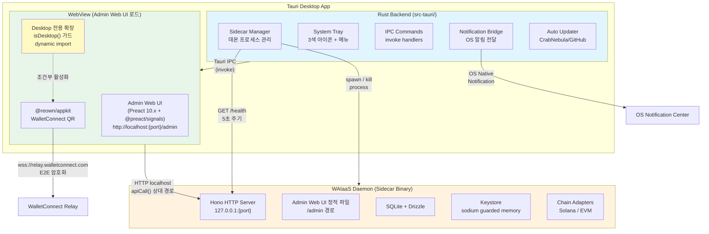
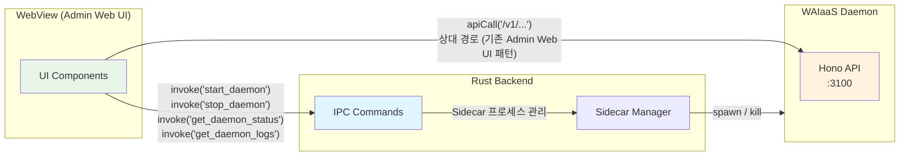
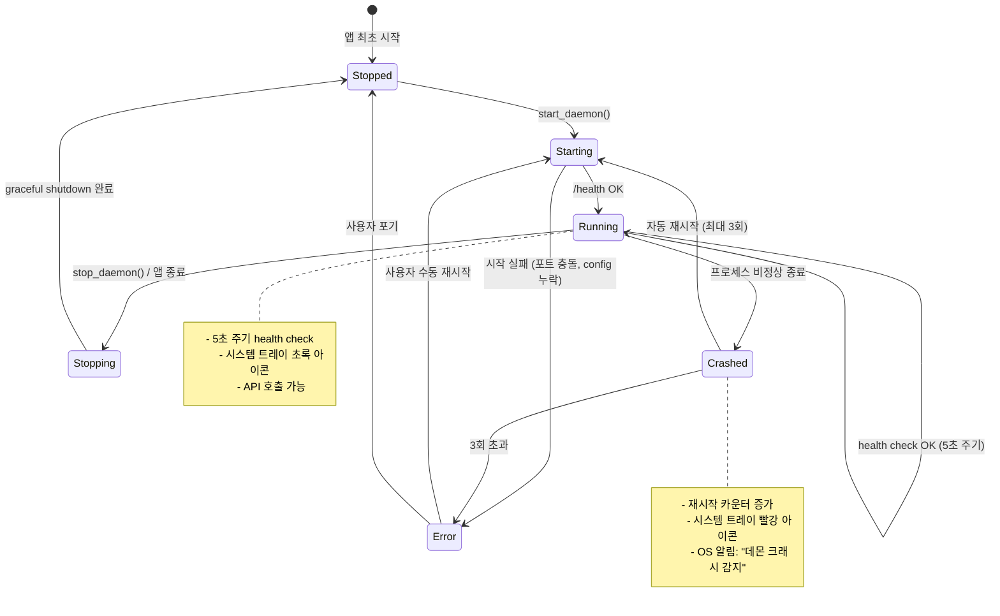
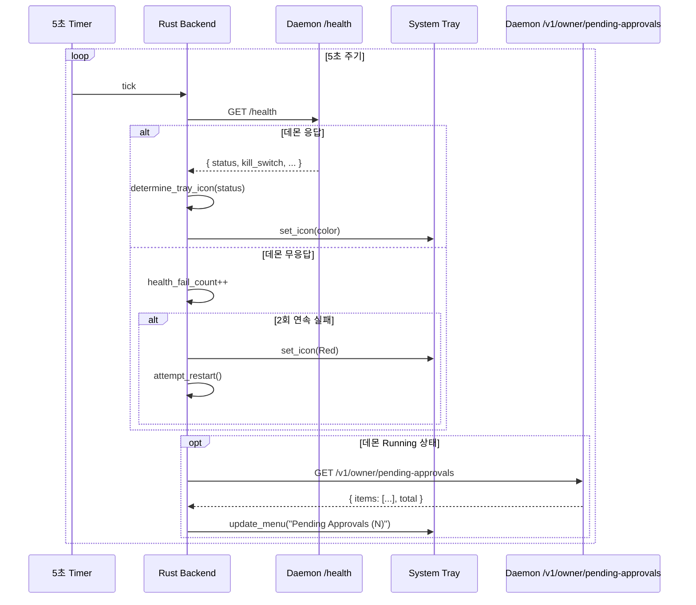
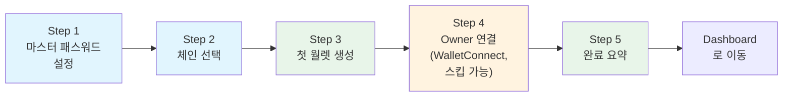
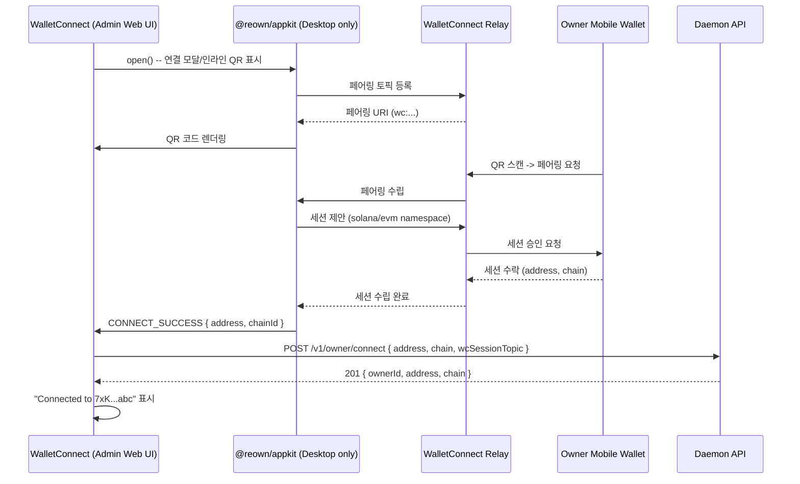
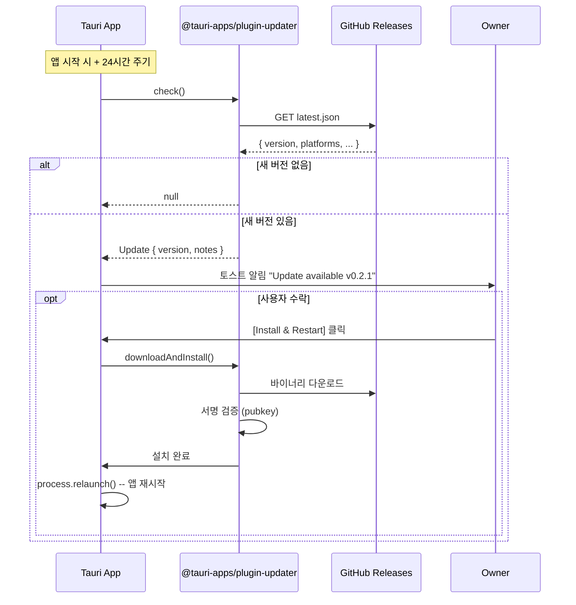
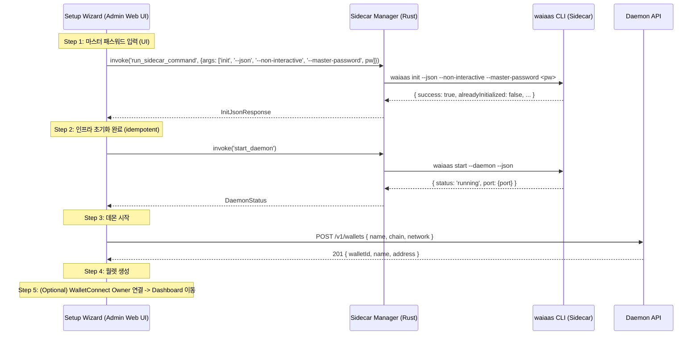

# Tauri 2 Desktop 앱 아키텍처 설계 (TAURI-DESK)

**문서 ID:** TAURI-DESK
**작성일:** 2026-02-05
**v0.5 업데이트:** 2026-02-07
**상태:** 완료
**참조:** API-SPEC (37-rest-api-complete-spec.md), CORE-05 (28-daemon-lifecycle-cli.md), OWNR-CONN (34-owner-wallet-connection.md), KILL-AUTO-EVM (36-killswitch-autostop-evm.md), CORE-01 (24-monorepo-data-directory.md), 09-RESEARCH.md Pattern 3, 52-auth-model-redesign.md (v0.5), 54-cli-flow-redesign.md (v0.5)

---

## 1. 문서 개요

### 1.1 목적

Tauri 2 기반 WAIaaS Desktop 앱의 전체 아키텍처를 설계한다. Owner가 WAIaaS 데몬을 시각적으로 관리하는 데스크톱 앱이다. 거래 승인/거부, 세션 관리, 시스템 모니터링을 GUI로 제공하여 CLI 의존도를 낮춘다.

### 1.2 요구사항 매핑

| 요구사항 | 설명 | 충족 섹션 |
|---------|------|-----------|
| **DESK-01** | Tauri 2 Desktop 앱 + 시스템 트레이 (3색 상태 아이콘) | 섹션 2, 3, 4, 5 |
| **DESK-02** | 대시보드 + 승인/거부 인터페이스 + 세션/에이전트 관리 UI | 섹션 7 (8개 화면) |
| **DESK-03** | macOS/Windows/Linux 크로스 플랫폼 빌드 | 섹션 11 |
| **DESK-04** | OS 네이티브 알림 + 자동 업데이트 | 섹션 9, 10 |

### 1.3 v0.1 -> v0.2 변경 요약

| 항목 | v0.1 (Cloud) | v0.2 (Self-Hosted) | 근거 |
|------|-------------|-------------------|------|
| 관리 UI | 웹 대시보드 (SaaS) | Tauri Desktop 앱 | Self-Hosted 로컬 데몬. 중앙 웹 서버 없음 |
| 지갑 연결 | MetaMask 브라우저 익스텐션 | WalletConnect v2 QR 코드 | Tauri WebView는 브라우저 익스텐션 미지원 |
| 데몬 관리 | Cloud 서비스 (항상 온라인) | Sidecar 프로세스 관리 | 데스크톱 앱이 데몬 라이프사이클 책임 |
| 알림 | Webhook + 이메일 | OS 네이티브 알림 + Telegram/Discord | 로컬 데몬에서 직접 알림 발송 |

### 1.4 설계 원칙

| 원칙 | 설명 |
|------|------|
| **Sidecar 방식** | Tauri Rust 쉘은 프로세스 관리만 담당, 비즈니스 로직은 Node.js 데몬에 위임 |
| **하이브리드 통신** | 데몬 라이프사이클은 Tauri IPC, API 호출은 HTTP localhost (SDK 재사용) |
| **최소 권한** | Tauri capabilities로 필요한 IPC 커맨드만 허용 |
| **크로스 플랫폼** | macOS/Windows/Linux 3종 OS 지원, 단일 코드베이스 |
| **오프라인 우선** | 데몬이 로컬에서 동작, 인터넷 연결은 체인 RPC + WalletConnect Relay에만 필요 |

---

## 2. 전체 아키텍처 다이어그램

### 2.1 아키텍처 개요

> **(v33.0 변경)** WebView는 별도 프론트엔드(React 18 SPA)를 빌드하지 않고, Sidecar Manager가 시작한 데몬의 Admin Web UI(`http://localhost:{port}/admin`)를 로드한다.



### 2.2 계층 역할 분리

| 계층 | 기술 | 역할 | 상태 유지 |
|------|------|------|-----------|
| **Rust Backend** | Tauri 2 + Rust | 프로세스 관리, 시스템 트레이, OS 알림, 자동 업데이트 | Sidecar PID, 트레이 상태 |
| **WebView Frontend** | 기존 Admin Web UI (Preact 10.x + @preact/signals) | 기존 Admin Web UI 19페이지 렌더링 + Desktop 전용 확장(isDesktop() 조건부) | @preact/signals (in-memory) |
| **Sidecar Daemon** | Node.js 22 + Hono 4 | 비즈니스 로직, DB, 키스토어, 체인 어댑터, Admin Web UI 정적 파일 서빙 | SQLite, 키스토어 파일 |

**핵심 설계 결정:** Tauri Rust 쉘은 데몬을 Rust로 재구현하지 않는다. 데몬은 Node.js 바이너리로 sidecar 번들링하며, Rust는 프로세스 관리 + OS 통합만 담당한다 (09-RESEARCH.md Anti-Pattern 참조).

**(v33.0 추가) Admin Web UI 재사용 근거:** WebView는 별도 프론트엔드를 빌드하지 않고, Sidecar Manager가 시작한 데몬의 Admin Web UI(`http://localhost:{port}/admin`)를 로드한다. 이를 통해 기존 19페이지를 코드 중복 없이 Desktop에서 제공하며, Desktop 전용 기능(Setup Wizard, WalletConnect, Sidecar 상태)은 `isDesktop()` 환경 감지 + dynamic import로 조건부 활성화한다.

---

## 3. 통신 아키텍처 -- 하이브리드 모델

### 3.1 두 가지 통신 경로

WAIaaS Desktop 앱은 **Tauri IPC**와 **HTTP localhost** 두 가지 통신 경로를 하이브리드로 사용한다.



### 3.2 Tauri IPC (Rust invoke) -- 데몬 라이프사이클 전용

Tauri IPC는 **데몬 프로세스 관리에만** 사용한다. WebView에서 `invoke()` 호출 시 Rust 함수가 실행된다.

| IPC 커맨드 | 용도 | 반환 타입 |
|------------|------|-----------|
| `start_daemon` | Sidecar 프로세스 시작 | `DaemonStatus` |
| `stop_daemon` | Sidecar 프로세스 중지 (graceful) | `()` |
| `restart_daemon` | 중지 후 재시작 | `DaemonStatus` |
| `get_daemon_status` | 프로세스 alive + /health 응답 조합 | `DaemonStatus` |
| `get_daemon_logs` | 최근 로그 라인 읽기 | `Vec<String>` |
| `send_notification` | OS 네이티브 알림 전송 | `()` |

**IPC 사용 이유:** HTTP localhost로는 데몬이 죽어있을 때 상태를 알 수 없다. Sidecar 프로세스의 생존 여부는 Rust에서 직접 확인해야 한다.

> **상세 명세:** 각 IPC 명령의 Rust/TypeScript 시그니처, 에러 케이스, 타임아웃 정책은 섹션 3.6을 참조한다. Capability 설정은 섹션 3.7을 참조한다.

### 3.3 HTTP localhost -- API 호출 전용

> **(v33.0 변경)** API 호출은 WebView에 로드된 **Admin Web UI가 기존 `apiCall()` 함수로 상대 경로 호출**한다. Desktop WebView에서도 브라우저와 동일한 코드 경로를 사용한다.

Admin Web UI의 `packages/admin/src/api/client.ts`의 `apiCall()` 함수를 그대로 사용한다. `apiCall()`은 상대 경로(`/v1/admin/...`)로 `fetch()`를 호출하므로, WebView가 `http://localhost:{port}/admin`을 로드하면 동일 origin으로 API 요청이 자동 라우팅된다.

| 경로 | 인증 | 용도 | 호출 방식 |
|------|------|------|-----------|
| `/v1/admin/*` | masterAuth (X-Master-Password 헤더) | 월렛 관리, 세션, 정책, Kill Switch, 설정 | `apiCall()` (X-Master-Password 자동 첨부) |
| `/v1/owner/*` | ownerAuth (SIWS/SIWE) | 거래 승인, Kill Switch 복구 | `fetch` 직접 호출 (Owner 서명 포함) |
| `/health` | None | 데몬 건강 상태 | Rust Sidecar Manager에서 호출 |
| `/v1/nonce` | None | 서명용 nonce 발급 | `apiCall()` 또는 `fetch` 직접 호출 |

> **(v0.5 변경) 데스크톱 앱 인증 모델 변경:** 데스크톱 앱에서 데몬 API 호출 시 masterAuth(implicit) 사용 (localhost 접속 = 인증 완료). Owner 관련 기능 중 거래 승인(approve_tx)과 Kill Switch 복구(recover)만 ownerAuth(WalletConnect QR 서명 또는 수동 서명)가 필요하다. 나머지 Owner 관리 기능(세션 목록, 에이전트 조회, 설정 변경 등)은 masterAuth(implicit)로 충분하다. 상세: 52-auth-model-redesign.md 참조.

**HTTP 사용 이유:**
- Admin Web UI의 `apiCall()`을 그대로 재사용 -- Desktop 전용 HTTP 클라이언트 코드 불필요
- Admin Web UI가 이미 masterAuth(X-Master-Password 헤더)를 `apiCall()`에서 자동 처리하므로, Desktop에서 별도 인증 로직이 필요 없다
- Tauri IPC를 거치면 Rust에서 HTTP 프록시를 구현해야 하는 불필요한 오버헤드 발생

### 3.4 CORS 설정

**[v0.7 보완]** Tauri 2.x WebView는 플랫폼별로 서로 다른 Origin을 사용한다. macOS(WKWebView)와 Linux(WebKitGTK)는 커스텀 프로토콜 `tauri://localhost`를 사용하고, Windows(WebView2)는 `http://tauri.localhost` 또는 `https://tauri.localhost`를 사용한다.

**플랫폼별 Origin 표:**

| 플랫폼 | WebView 엔진 | Origin | 비고 |
|--------|-------------|--------|------|
| macOS | WKWebView | `tauri://localhost` | 커스텀 프로토콜 |
| Linux | WebKitGTK | `tauri://localhost` | macOS와 동일 |
| Windows | WebView2 | `http://tauri.localhost` | Tauri 2.x 기본값 (2.1.0+) |
| Windows (HTTPS) | WebView2 | `https://tauri.localhost` | `useHttpsScheme: true` 설정 시 |

CORS 허용 목록에 5개 Origin을 포함하여 모든 플랫폼에서 API 호출이 가능하도록 한다:

```typescript
// [v0.7 보완] 플랫폼별 CORS Origin 5종
cors({
  origin: [
    `http://localhost:${port}`,
    `http://127.0.0.1:${port}`,
    'tauri://localhost',            // macOS, Linux (WKWebView, WebKitGTK)
    'http://tauri.localhost',       // Windows (WebView2, Tauri 2.x 기본) [v0.7 보완]
    'https://tauri.localhost',      // Windows (WebView2, useHttpsScheme: true) [v0.7 보완]
  ],
  // ...
})
```

**[v0.7 보완] 개발 모드 Origin 로깅:**

플랫폼별 실제 Origin 값을 확인하기 위해, 개발 모드(`log_level: 'debug'`)에서 수신된 Origin 헤더를 로깅한다:

```typescript
// [v0.7 보완] 개발 모드에서 수신된 Origin 헤더 로깅 (디버그용)
if (config.daemon.log_level === 'debug') {
  app.use('*', async (c, next) => {
    const origin = c.req.header('Origin')
    if (origin) {
      logger.debug(`[CORS] Request Origin: ${origin}`)
    }
    await next()
  })
}
```

> **주의:** CORS 허용 목록은 29-api-framework-design.md의 미들웨어 6(cors)과 동일한 5개 Origin을 유지해야 한다.

### 3.5 Desktop 환경 감지 (IPC-01)

> **(v33.0 신규)**

Desktop 전용 코드의 진입점에서 실행 환경을 판별하는 `isDesktop()` 유틸리티 함수를 정의한다.

**파일 위치:** `packages/admin/src/utils/platform.ts`

```typescript
// packages/admin/src/utils/platform.ts

/**
 * Tauri 2.x WebView 내에서 실행 중인지 판별한다.
 * Tauri 2.x는 window.__TAURI_INTERNALS__ 전역 객체를 주입한다.
 * (Tauri 1.x의 window.__TAURI__와 구별: 2.x에서는 __TAURI_INTERNALS__가 내부 IPC 브릿지 객체)
 *
 * @returns true if running inside Tauri WebView
 */

let _isDesktop: boolean | null = null;

export function isDesktop(): boolean {
  if (_isDesktop === null) {
    _isDesktop =
      typeof window !== 'undefined' &&
      '__TAURI_INTERNALS__' in window;
  }
  return _isDesktop;
}
```

**설계 결정:**

| 항목 | 결정 | 근거 |
|------|------|------|
| 감지 대상 | `window.__TAURI_INTERNALS__` | Tauri 2.x 내부 IPC 객체. `__TAURI__`는 1.x 호환용이므로 사용하지 않음 |
| 캐싱 | 모듈 레벨 변수로 1회만 체크 | 실행 환경은 런타임 중 변하지 않으므로 매 호출마다 window 접근 불필요 |
| SSR/prerender 안전 | `typeof window !== 'undefined'` 가드 | Preact에서 prerender 시 window 미존재 시나리오 방어 |
| 테스트 지원 | 모듈 레벨 캐시 초기화 불필요 | 테스트에서 `window.__TAURI_INTERNALS__` mock 설정 후 모듈 재로드로 대응 |

**사용 규칙:**
1. Desktop 전용 코드의 모든 진입점에서 `isDesktop()` 가드를 사용한다
2. `isDesktop()` 가드 내에서만 Desktop 전용 모듈을 dynamic import한다
3. Desktop 전용 모듈의 static import는 절대 금지 -- 브라우저 번들에 포함됨
4. `isDesktop()`은 조건부 렌더링과 조건부 import 두 가지 용도로만 사용한다

```typescript
// 올바른 사용 패턴
if (isDesktop()) {
  const { invoke } = await import('@tauri-apps/api/core');
  const status = await invoke<DaemonStatus>('get_daemon_status');
}

// 금지 패턴 -- static import
import { invoke } from '@tauri-apps/api/core';  // NEVER: 브라우저 번들에 포함됨
```

### 3.6 IPC 브릿지 상세 명세 (IPC-02)

> **(v33.0 신규)** 기존 섹션 3.2의 간략한 테이블을 확장하여, 각 IPC 명령의 Rust/TypeScript 시그니처, 에러 케이스, 타임아웃 정책을 상세화한다. 기존 3.2 테이블은 요약으로 유지하며, 상세는 본 섹션을 참조한다.

**파일 위치:** `packages/admin/src/desktop/bridge/tauri-bridge.ts` (TypeScript invoke 래퍼)

#### 공유 타입 정의

**Rust (`src-tauri/src/types.rs`):**

```rust
use serde::{Deserialize, Serialize};

#[derive(Debug, Clone, Serialize, Deserialize)]
pub struct DaemonStatus {
    pub running: bool,
    pub pid: Option<u32>,
    pub port: u16,
    pub uptime_secs: u64,
    pub health: HealthStatus,
}

#[derive(Debug, Clone, Serialize, Deserialize)]
pub enum HealthStatus {
    Healthy,
    Unhealthy { reason: String },
    Unknown,  // 프로세스는 alive이나 /health 미응답
}

#[derive(Debug, Clone, Deserialize)]
pub struct StartDaemonArgs {
    pub port: Option<u16>,         // None이면 랜덤 포트 (bind(0))
    pub config_path: Option<String>,
}

#[derive(Debug, Clone, Deserialize)]
pub struct StopDaemonArgs {
    pub force: Option<bool>,        // true: 즉시 SIGKILL, false/None: graceful 5s -> SIGKILL
}

#[derive(Debug, Clone, Deserialize)]
pub struct GetLogsArgs {
    pub lines: Option<u32>,         // 기본값: 100
    pub since: Option<String>,      // ISO 8601 타임스탬프 (optional)
}

#[derive(Debug, Clone, Deserialize)]
pub struct NotificationArgs {
    pub title: String,
    pub body: String,
    pub icon: Option<String>,       // 앱 아이콘 경로 (None이면 기본 아이콘)
}
```

**TypeScript (`packages/admin/src/desktop/bridge/types.ts`):**

```typescript
// packages/admin/src/desktop/bridge/types.ts
// 이 파일만 static import 허용 (런타임 코드 없음, 타입 정의만)

export interface DaemonStatus {
  running: boolean;
  pid: number | null;
  port: number;
  uptime_secs: number;
  health: HealthStatus;
}

export type HealthStatus =
  | { type: 'Healthy' }
  | { type: 'Unhealthy'; reason: string }
  | { type: 'Unknown' };

export interface StartDaemonArgs {
  port?: number;
  config_path?: string;
}

export interface StopDaemonArgs {
  force?: boolean;
}

export interface GetLogsArgs {
  lines?: number;
  since?: string;  // ISO 8601
}

export interface NotificationArgs {
  title: string;
  body: string;
  icon?: string;
}
```

#### IPC 명령 상세 (6개)

**1. `start_daemon` -- Sidecar 프로세스 시작**

```rust
#[tauri::command]
async fn start_daemon(
    args: StartDaemonArgs,
    state: State<'_, SidecarManagerState>,
) -> Result<DaemonStatus, String> {
    // 1. 이미 실행 중이면 현재 상태 반환 (중복 시작 방지)
    // 2. port가 None이면 TCP bind(0)로 랜덤 포트 할당
    // 3. sidecar 바이너리 spawn (tauri-plugin-shell)
    // 4. /health 폴링으로 ready 대기 (최대 30초, 1초 간격)
    // 5. DaemonStatus 반환
}
```

| 항목 | 값 |
|------|-----|
| 인자 | `StartDaemonArgs { port?: u16, config_path?: String }` |
| 반환 | `Result<DaemonStatus, String>` |
| 타임아웃 | 30초 (데몬 시작 + /health ready 대기) |
| 에러 케이스 | `"AlreadyRunning"`, `"SpawnFailed: {reason}"`, `"HealthTimeout"`, `"PortInUse: {port}"` |
| 재시도 정책 | 자동 재시도 없음. 호출자가 에러 타입에 따라 판단 |

**2. `stop_daemon` -- Sidecar 프로세스 중지**

```rust
#[tauri::command]
async fn stop_daemon(
    args: StopDaemonArgs,
    state: State<'_, SidecarManagerState>,
) -> Result<(), String> {
    // 1. force=true: 즉시 SIGKILL
    // 2. force=false/None: SIGTERM -> 5초 대기 -> 아직 alive면 SIGKILL
    // 3. PID 정리, 상태 초기화
}
```

| 항목 | 값 |
|------|-----|
| 인자 | `StopDaemonArgs { force?: bool }` |
| 반환 | `Result<(), String>` |
| 타임아웃 | 10초 (graceful 5s + kill 확인 5s) |
| 에러 케이스 | `"NotRunning"`, `"KillFailed: {reason}"` |
| 재시도 정책 | `KillFailed` 시 force=true로 1회 자동 재시도 |

**3. `restart_daemon` -- 중지 후 재시작**

```rust
#[tauri::command]
async fn restart_daemon(
    state: State<'_, SidecarManagerState>,
) -> Result<DaemonStatus, String> {
    // 1. stop_daemon(force=false) 호출
    // 2. 1초 대기 (포트 해제 보장)
    // 3. start_daemon(기존 포트 + 설정) 호출
}
```

| 항목 | 값 |
|------|-----|
| 인자 | 없음 (기존 설정 재사용) |
| 반환 | `Result<DaemonStatus, String>` |
| 타임아웃 | 45초 (stop 10s + wait 1s + start 30s + buffer 4s) |
| 에러 케이스 | stop_daemon 에러 + start_daemon 에러 전파 |
| 재시도 정책 | 자동 재시도 없음 |

**4. `get_daemon_status` -- 프로세스 상태 확인**

```rust
#[tauri::command]
async fn get_daemon_status(
    state: State<'_, SidecarManagerState>,
) -> Result<DaemonStatus, String> {
    // 1. PID로 프로세스 alive 체크 (kill(pid, 0))
    // 2. alive이면 GET /health 호출 (2초 타임아웃)
    // 3. /health 응답으로 HealthStatus 결정
    // 4. 프로세스 dead이면 running=false + cleanup
}
```

| 항목 | 값 |
|------|-----|
| 인자 | 없음 |
| 반환 | `Result<DaemonStatus, String>` |
| 타임아웃 | 3초 (/health 호출 2s + 오버헤드 1s) |
| 에러 케이스 | `"StatusCheckFailed: {reason}"` (드문 경우) |
| 재시도 정책 | 없음. 폴링 주기(30초)가 재시도 역할 |

**5. `get_daemon_logs` -- 최근 로그 조회**

```rust
#[tauri::command]
async fn get_daemon_logs(
    args: GetLogsArgs,
    state: State<'_, SidecarManagerState>,
) -> Result<Vec<String>, String> {
    // 1. Sidecar stdout/stderr 캡처 버퍼에서 최근 N라인 반환
    // 2. since가 지정되면 해당 시각 이후 로그만 필터
    // 3. 최대 1000라인 제한 (메모리 보호)
}
```

| 항목 | 값 |
|------|-----|
| 인자 | `GetLogsArgs { lines?: u32, since?: String }` |
| 반환 | `Result<Vec<String>, String>` |
| 타임아웃 | 1초 (로컬 버퍼 읽기, I/O 없음) |
| 에러 케이스 | `"NotRunning"` (로그 없음), `"InvalidTimestamp: {since}"` |
| 재시도 정책 | 없음 |

**6. `send_notification` -- OS 네이티브 알림**

```rust
#[tauri::command]
async fn send_notification(
    args: NotificationArgs,
    app: AppHandle,
) -> Result<(), String> {
    // 1. tauri-plugin-notification으로 OS 알림 전송
    // 2. 권한 미부여 시 자동으로 권한 요청
    // 3. 알림 클릭 시 앱 창 포커스 (이벤트 리스너)
}
```

| 항목 | 값 |
|------|-----|
| 인자 | `NotificationArgs { title: String, body: String, icon?: String }` |
| 반환 | `Result<(), String>` |
| 타임아웃 | 2초 |
| 에러 케이스 | `"PermissionDenied"`, `"NotificationFailed: {reason}"` |
| 재시도 정책 | 없음. 알림 실패는 무시 (best-effort) |

#### TypeScript invoke 래퍼

```typescript
// packages/admin/src/desktop/bridge/tauri-bridge.ts
// 이 파일은 isDesktop() 가드 내에서 dynamic import로만 로드

import type {
  DaemonStatus, StartDaemonArgs, StopDaemonArgs,
  GetLogsArgs, NotificationArgs,
} from './types';

async function getInvoke() {
  const { invoke } = await import('@tauri-apps/api/core');
  return invoke;
}

export async function startDaemon(args: StartDaemonArgs = {}): Promise<DaemonStatus> {
  const invoke = await getInvoke();
  return invoke<DaemonStatus>('start_daemon', { args });
}

export async function stopDaemon(args: StopDaemonArgs = {}): Promise<void> {
  const invoke = await getInvoke();
  return invoke<void>('stop_daemon', { args });
}

export async function restartDaemon(): Promise<DaemonStatus> {
  const invoke = await getInvoke();
  return invoke<DaemonStatus>('restart_daemon');
}

export async function getDaemonStatus(): Promise<DaemonStatus> {
  const invoke = await getInvoke();
  return invoke<DaemonStatus>('get_daemon_status');
}

export async function getDaemonLogs(args: GetLogsArgs = {}): Promise<string[]> {
  const invoke = await getInvoke();
  return invoke<string[]>('get_daemon_logs', { args });
}

export async function sendNotification(args: NotificationArgs): Promise<void> {
  const invoke = await getInvoke();
  return invoke<void>('send_notification', { args });
}
```

**에러 처리 패턴:**

```typescript
// invoke() 에러는 string으로 전달됨 (Rust Result::Err(String))
try {
  const status = await startDaemon({ port: 3100 });
} catch (error: unknown) {
  // error는 string 타입 ("AlreadyRunning", "SpawnFailed: ...", etc.)
  const message = typeof error === 'string' ? error : String(error);
  if (message === 'AlreadyRunning') {
    // 이미 실행 중 -- 정상 상태로 취급
  } else if (message.startsWith('PortInUse:')) {
    // 포트 충돌 -- 랜덤 포트로 재시도 또는 사용자에게 알림
  } else {
    // 예기치 않은 에러 -- UI에 에러 표시
  }
}
```

### 3.7 Tauri Capability 설정 (IPC-03)

> **(v33.0 신규)** Tauri 2.x의 Capability 시스템을 활용하여 IPC 커맨드 접근을 최소 권한 원칙으로 제한한다. 기존 섹션 12.2의 capabilities 설정을 확장하여, Remote WebView(localhost에서 로드되는 Admin Web UI)에 대한 IPC 권한 부여를 명세한다.

**Remote WebView IPC 권한 문제:**

Tauri 2.x에서 WebView가 외부 URL(localhost)을 로드하는 경우, 기본적으로 IPC 커맨드 접근이 차단된다. `CapabilityBuilder::new("remote-access").remote("http://127.0.0.1:*/*")`로 Remote WebView에 명시적 IPC 권한을 부여해야 한다.

**Rust 설정 (`src-tauri/src/main.rs`):**

```rust
use tauri::Manager;

fn main() {
    tauri::Builder::default()
        .setup(|app| {
            // Remote WebView (localhost Admin Web UI)에 IPC 권한 부여
            #[cfg(not(dev))]
            {
                use tauri::ipc::CapabilityBuilder;
                CapabilityBuilder::new("remote-access")
                    .remote("http://127.0.0.1:*/*")      // 모든 포트의 localhost
                    .remote("http://localhost:*/*")        // localhost alias
                    .permission("waiaas:allow-start-daemon")
                    .permission("waiaas:allow-stop-daemon")
                    .permission("waiaas:allow-restart-daemon")
                    .permission("waiaas:allow-get-daemon-status")
                    .permission("waiaas:allow-get-daemon-logs")
                    .permission("waiaas:allow-send-notification")
                    .build(app)?;
            }

            Ok(())
        })
        // ... plugin registration, invoke handlers
        .run(tauri::generate_context!())
        .expect("error while running tauri application");
}
```

**`src-tauri/capabilities/default.json` 예시:**

```json
{
  "identifier": "default",
  "description": "WAIaaS Desktop default capabilities",
  "windows": ["main"],
  "permissions": [
    "core:default",
    "waiaas:allow-start-daemon",
    "waiaas:allow-stop-daemon",
    "waiaas:allow-restart-daemon",
    "waiaas:allow-get-daemon-status",
    "waiaas:allow-get-daemon-logs",
    "waiaas:allow-send-notification",
    {
      "identifier": "shell:allow-execute",
      "allow": [
        {
          "name": "waiaas-daemon",
          "cmd": "waiaas-daemon",
          "sidecar": true,
          "args": true
        }
      ]
    },
    "notification:default",
    "notification:allow-is-permission-granted",
    "notification:allow-request-permission",
    "notification:allow-notify",
    "updater:default",
    "updater:allow-check",
    "updater:allow-download-and-install",
    "process:allow-restart",
    "process:allow-exit"
  ],
  "remote": {
    "urls": [
      "http://127.0.0.1:*/*",
      "http://localhost:*/*"
    ]
  }
}
```

**최소 권한 원칙:**

| 권한 그룹 | 허용 커맨드 | 용도 |
|-----------|-------------|------|
| `waiaas:*` | 6개 커스텀 IPC 명령 | 데몬 라이프사이클 관리 |
| `shell:allow-execute` | sidecar 바이너리만 | 임의 명령어 실행 차단 |
| `notification:*` | OS 알림 전송 | 거래 승인 요청 알림 |
| `updater:*` | 업데이트 확인 + 설치 | 자동 업데이트 |
| `process:*` | 앱 재시작/종료 | 업데이트 후 재시작 |

**개발 모드 vs 프로덕션:**
- 개발 모드(`cargo tauri dev`): Tauri가 devUrl의 localhost를 자동 허용하므로 `CapabilityBuilder::remote()` 불필요. `#[cfg(not(dev))]` 가드로 프로덕션에서만 적용.
- 프로덕션: WebView가 Sidecar가 서빙하는 localhost URL을 로드하므로 remote capability 필수.

### 3.8 CSP 예외 전략 (IPC-04)

> **(v33.0 신규)** Admin Web UI의 기존 CSP와 Tauri WebView에서의 CSP 충돌점을 분석하고, Desktop 전용 CSP 오버라이드 전략을 명세한다.

**Admin Web UI 기존 CSP (브라우저용):**

```
default-src 'none';
script-src 'self';
style-src 'self' 'unsafe-inline';
connect-src 'self';
img-src 'self' data:;
font-src 'self';
```

**Tauri WebView에서의 CSP 충돌점:**

| 지시어 | 충돌 원인 | 필요한 추가 허용 |
|--------|-----------|-----------------|
| `connect-src` | IPC 통신 (`ipc:` 스키마) | Tauri 내부 IPC는 CSP와 무관 (native bridge) -- 추가 불필요 |
| `connect-src` | WalletConnect Relay 연결 | `wss://relay.walletconnect.com`, `https://rpc.walletconnect.com` |
| `connect-src` | Reown Cloud 서비스 | `https://pulse.walletconnect.org` (analytics, optional) |
| `script-src` | @reown/appkit 동적 로드 | `'wasm-unsafe-eval'` (일부 체인 어댑터가 WASM 사용 가능) |
| `img-src` | WalletConnect QR 코드, 지갑 아이콘 | `https:` (외부 이미지 리소스) |
| `frame-src` | @reown/appkit 모달 UI | `https://secure.walletconnect.com` (선택적, embedded wallet) |

> **참고:** Tauri 2.x의 IPC(`invoke()`)는 WebView의 네이티브 브릿지를 통해 통신하므로 CSP `connect-src` 제한에 영향을 받지 않는다. IPC를 위한 CSP 조정은 불필요하다.

**CSP 우선순위:**

| CSP 소스 | 적용 대상 | 우선순위 |
|----------|-----------|---------|
| Admin Web UI HTML `<meta http-equiv="Content-Security-Policy">` | 브라우저 접근 시 | 브라우저에서 적용 |
| `tauri.conf.json` `app.security.csp` | Tauri WebView | HTML meta CSP를 **오버라이드** |

**전략:** Tauri의 `app.security.csp` 설정에서 Desktop 전용 CSP를 지정한다. Admin Web UI의 HTML meta CSP는 브라우저용으로 유지하고, Tauri WebView에서는 `tauri.conf.json`의 CSP가 우선 적용된다.

**`tauri.conf.json` CSP 설정:**

```json
{
  "app": {
    "security": {
      "csp": "default-src 'self' http://127.0.0.1:* http://localhost:*; script-src 'self' 'wasm-unsafe-eval'; style-src 'self' 'unsafe-inline'; connect-src 'self' http://127.0.0.1:* http://localhost:* wss://relay.walletconnect.com https://rpc.walletconnect.com https://pulse.walletconnect.org; img-src 'self' data: https:; font-src 'self'; frame-src https://secure.walletconnect.com"
    }
  }
}
```

**플랫폼별 CSP 동작 차이:**

| 플랫폼 | WebView 엔진 | `'self'` 해석 | 비고 |
|--------|-------------|--------------|------|
| macOS | WKWebView | `tauri://localhost` | 커스텀 프로토콜 origin |
| Linux | WebKitGTK | `tauri://localhost` | macOS와 동일 |
| Windows | WebView2 | `http://tauri.localhost` | HTTP origin (Tauri 2.x 기본) |

> **주의:** Tauri 2.x에서 `'self'`는 WebView의 origin을 의미하지만, Admin Web UI는 localhost에서 로드되므로 `'self'`만으로는 API 호출 origin이 일치하지 않을 수 있다. `connect-src`에 `http://127.0.0.1:*`과 `http://localhost:*`를 명시적으로 포함하여 모든 포트에서의 API 호출을 허용한다.

**`'unsafe-eval'` 회피 전략:**
- `'unsafe-eval'`은 사용하지 않는다 (XSS 벡터)
- @reown/appkit이 `eval()`을 사용하는 경우, `'wasm-unsafe-eval'`로 WASM만 허용
- @reown/appkit v1.x는 `eval()` 미사용 확인됨 -- `'wasm-unsafe-eval'`은 예방적 허용
- 향후 @reown/appkit 업데이트 시 CSP 호환성 재검증 필요

### 3.9 조건부 렌더링 상세 전략 (IPC-05)

> **(v33.0 신규)** Desktop 전용 컴포넌트 3개의 조건부 렌더링 패턴을 코드 예시와 함께 상세화한다. 기존 섹션 13.3의 간략한 언급을 대체한다.

#### 공통 패턴: lazy + isDesktop() 가드

```tsx
// packages/admin/src/utils/desktop-loader.ts
import { h, type ComponentType } from 'preact';
import { Suspense, lazy } from 'preact/compat';
import { isDesktop } from './platform';

/**
 * Desktop 전용 컴포넌트를 lazy load하는 헬퍼.
 * 브라우저에서는 null을 렌더링한다.
 */
export function desktopComponent<P>(
  loader: () => Promise<{ default: ComponentType<P> }>,
  fallback: h.JSX.Element = h('div', { class: 'loading-spinner' }),
): ComponentType<P> {
  if (!isDesktop()) {
    return () => null;  // 브라우저: 아무것도 렌더링하지 않음
  }

  const LazyComponent = lazy(loader);
  return (props: P) => h(Suspense, { fallback }, h(LazyComponent, props));
}
```

#### 1. Setup Wizard (`packages/admin/src/desktop/wizard/SetupWizard.tsx`)

**진입 조건:**
- `isDesktop() === true` AND 데몬 초기 설정 미완료
- 초기 설정 완료 여부: `GET /health` 응답의 `setup_complete` 필드 (데몬이 마스터 패스워드 설정 전이면 false)
- 데몬 미실행 시에도 Wizard 표시 (IPC로 `start_daemon` 호출하여 데몬 시작부터 안내)

**라우터 통합:**

```tsx
// packages/admin/src/app.tsx (라우터 설정)
import { Router, Route } from 'preact-router';
import { isDesktop } from './utils/platform';
import { desktopComponent } from './utils/desktop-loader';

const SetupWizard = desktopComponent(
  () => import('./desktop/wizard/SetupWizard'),
);

function App() {
  return (
    <Router>
      {/* Desktop 전용: Setup Wizard */}
      {isDesktop() && <Route path="/setup-wizard" component={SetupWizard} />}

      {/* 기존 Admin Web UI 라우트 */}
      <Route path="/admin" component={Dashboard} />
      <Route path="/admin/wallets" component={Wallets} />
      {/* ... 기존 19페이지 라우트 */}
    </Router>
  );
}
```

**브라우저에서 `/setup-wizard` 접근 시:** 라우트 자체가 등록되지 않으므로 404 또는 기본 리다이렉트로 처리된다.

**Wizard 5단계 플로우:**

| 단계 | 컴포넌트 | 설명 | IPC/API 호출 |
|------|---------|------|-------------|
| 1 | `PasswordStep.tsx` | 마스터 패스워드 설정 | `POST /v1/admin/setup` |
| 2 | `ChainStep.tsx` | 활성화할 체인 선택 (EVM/Solana) | `PUT /v1/admin/settings` |
| 3 | `WalletStep.tsx` | 첫 번째 월렛 생성 | `POST /v1/admin/wallets` |
| 4 | `OwnerStep.tsx` | Owner 연결 (선택적, 건너뛰기 가능) | WalletConnect QR |
| 5 | `CompleteStep.tsx` | 설정 완료 요약 + 대시보드 이동 | - |

#### 2. Sidecar Status Panel (`packages/admin/src/desktop/sidecar-panel/SidecarStatus.tsx`)

**조건부 렌더링:**

```tsx
// packages/admin/src/pages/dashboard.tsx
import { desktopComponent } from '../utils/desktop-loader';

const SidecarStatus = desktopComponent(
  () => import('../desktop/sidecar-panel/SidecarStatus'),
);

function Dashboard() {
  return (
    <div class="dashboard">
      <h1>Dashboard</h1>

      {/* Desktop 전용: Sidecar 상태 패널 */}
      <SidecarStatus />

      {/* 기존 대시보드 컨텐츠 */}
      <WalletSummary />
      <RecentTransactions />
    </div>
  );
}
```

**IPC 폴링 Hook:**

```tsx
// packages/admin/src/desktop/sidecar-panel/useSidecarStatus.ts
import { signal, effect } from '@preact/signals';
import type { DaemonStatus } from '../bridge/types';

const daemonStatus = signal<DaemonStatus | null>(null);
const POLL_INTERVAL = 30_000; // 30초

export function useSidecarStatus() {
  effect(() => {
    let timer: ReturnType<typeof setInterval>;

    (async () => {
      const { getDaemonStatus } = await import('../bridge/tauri-bridge');

      const poll = async () => {
        try {
          daemonStatus.value = await getDaemonStatus();
        } catch {
          daemonStatus.value = {
            running: false, pid: null, port: 0,
            uptime_secs: 0, health: { type: 'Unknown' },
          };
        }
      };

      await poll(); // 초기 로드
      timer = setInterval(poll, POLL_INTERVAL);
    })();

    return () => clearInterval(timer);
  });

  return daemonStatus;
}
```

**Sidecar 상태 카드 UI:**

| 상태 | 표시 | 색상 | 액션 버튼 |
|------|------|------|-----------|
| `running + Healthy` | "Running" + uptime | 녹색 | Restart, Stop |
| `running + Unhealthy` | "Unhealthy: {reason}" | 주황 | Restart, View Logs |
| `running + Unknown` | "Starting..." | 회색 | - |
| `!running` | "Stopped" | 빨간 | Start |

#### 3. WalletConnect QR (`packages/admin/src/desktop/walletconnect/WalletConnectButton.tsx`)

**조건부 렌더링:**

```tsx
// packages/admin/src/pages/wallet-detail.tsx (월렛 상세 페이지)
import { desktopComponent } from '../utils/desktop-loader';

const WalletConnectButton = desktopComponent(
  () => import('../desktop/walletconnect/WalletConnectButton'),
);

function WalletDetail({ walletId }: { walletId: string }) {
  return (
    <div class="wallet-detail">
      {/* 기존 월렛 상세 UI */}
      <WalletInfo walletId={walletId} />

      {/* Desktop 전용: WalletConnect QR 연결 */}
      <WalletConnectButton walletId={walletId} />

      <TransactionHistory walletId={walletId} />
    </div>
  );
}
```

**@reown/appkit dynamic import:**

```tsx
// packages/admin/src/desktop/walletconnect/useWalletConnect.ts
export async function initWalletConnect(projectId: string) {
  // @reown/appkit을 dynamic import로 로드
  const { createAppKit } = await import('@reown/appkit');
  const { SolanaAdapter } = await import('@reown/appkit-adapter-solana');

  const appKit = createAppKit({
    adapters: [new SolanaAdapter()],
    projectId,
    metadata: {
      name: 'WAIaaS Desktop',
      description: 'AI Agent Wallet Manager',
      url: 'https://waiaas.dev',
      icons: ['https://waiaas.dev/icon.png'],
    },
  });

  return appKit;
}
```

**로딩 상태:** `desktopComponent()` 헬퍼가 `Suspense` fallback으로 로딩 스피너를 자동 표시한다. @reown/appkit의 번들 크기(~150KB gzip)로 인해 초기 로드에 1-2초 소요될 수 있다.

> **섹션 13.3 참조:** 기존 섹션 13.3의 "환경 감지", "Dynamic Import 규칙" 내용은 본 섹션(3.5, 3.9)에서 상세화되었다. 섹션 13.3은 요약으로 유지하며, 상세는 본 섹션을 참조한다.

---

## 4. Sidecar 관리

### 4.1 Sidecar 바이너리

WAIaaS 데몬을 **단일 실행 바이너리**로 변환하여 Tauri에 번들링한다.

| 항목 | 값 | 비고 |
|------|-----|------|
| 변환 도구 | Node.js SEA (Single Executable Application) | Node.js 22 내장 기능, 별도 패키지 불필요 |
| 바이너리 이름 | `waiaas-daemon-{target_triple}` | `waiaas-daemon-aarch64-apple-darwin` 등 |
| 바이너리 위치 | Tauri `externalBin` 설정 | `src-tauri/binaries/` |
| 포함 패키지 | `@waiaas/daemon` + `@waiaas/core` + adapters | Turborepo 빌드 후 SEA 변환 |
| native addon | `sodium-native`, `better-sqlite3`, `argon2` | [v0.7 보완] prebuildify 기반 번들 전략 정의 (섹션 4.1.1 및 11.6 참조) |

**tauri.conf.json 설정:**

```json
{
  "bundle": {
    "externalBin": [
      "binaries/waiaas-daemon"
    ]
  }
}
```

Tauri는 빌드 시 `{externalBin}-{target_triple}` 패턴으로 바이너리를 찾는다. 따라서 각 타겟 플랫폼별 바이너리를 `binaries/` 디렉토리에 배치해야 한다:

```
src-tauri/binaries/
  waiaas-daemon-aarch64-apple-darwin       (macOS Apple Silicon)
  waiaas-daemon-x86_64-apple-darwin        (macOS Intel)
  waiaas-daemon-x86_64-pc-windows-msvc.exe (Windows x64)
  waiaas-daemon-x86_64-unknown-linux-gnu   (Linux x64)
  waiaas-daemon-aarch64-unknown-linux-gnu   (Linux ARM64) [v0.7 보완]
```

> **[v0.7 보완]** ARM64 Windows(`aarch64-pc-windows-msvc`)는 **제외**. 근거: sodium-native/argon2 ARM64 Windows prebuild 미제공, Tauri ARM64 Windows 실험적 지원, 시장 점유율 미미.

#### 4.1.1 Native Addon 번들 전략 [v0.7 보완]

SEA(Single Executable Application)에서 native addon(`.node` 파일)을 번들하기 위한 전략을 정의한다.

**Primary 전략: SEA assets 메커니즘 (Node.js 22+)**

SEA config의 `assets` 필드로 `.node` 파일을 바이너리에 내장하고, 런타임에 임시 파일로 추출하여 `process.dlopen()`으로 로딩한다.

```json
// sea-config.json [v0.7 보완]
{
  "main": "dist/daemon-bundle.js",
  "output": "dist/waiaas-daemon",
  "assets": {
    "sodium-native.node": "node_modules/sodium-native/prebuilds/{platform}-{arch}/sodium-native.node",
    "better_sqlite3.node": "node_modules/better-sqlite3/prebuilds/{platform}-{arch}/better_sqlite3.node",
    "argon2.node": "node_modules/argon2/lib/binding/napi-v3-{platform}-{arch}/argon2.node"
  }
}
```

**native-loader.ts 패턴:**

```typescript
// packages/daemon/src/infrastructure/native-loader.ts [v0.7 보완]
import sea from 'node:sea'
import { writeFileSync, rmSync, existsSync } from 'node:fs'
import { join } from 'node:path'
import { tmpdir } from 'node:os'

/**
 * SEA 환경에서 native addon을 로딩한다.
 * 비-SEA 환경에서는 일반 require()로 폴백한다.
 */
function loadNativeAddon(assetName: string, fallbackRequire: () => any): any {
  if (!sea.isSea()) {
    return fallbackRequire()
  }

  const addonPath = join(tmpdir(), `waiaas-${assetName}`)
  try {
    writeFileSync(addonPath, new Uint8Array(sea.getRawAsset(assetName)))
    const mod = { exports: {} as any }
    process.dlopen(mod, addonPath)
    return mod.exports
  } finally {
    if (existsSync(addonPath)) {
      try { rmSync(addonPath) } catch { /* ignore cleanup errors */ }
    }
  }
}

const sodiumNative = loadNativeAddon('sodium-native.node', () => require('sodium-native'))
const betterSqlite3 = loadNativeAddon('better_sqlite3.node', () => require('better-sqlite3'))
const argon2Native = loadNativeAddon('argon2.node', () => require('argon2'))
```

**각 native addon별 빌드 도구 차이:**

| Package | Build Tool | 런타임 로더 | Prebuild 경로 |
|---------|------------|------------|--------------|
| `sodium-native` v5.x | prebuildify | node-gyp-build | `prebuilds/{platform}-{arch}/` |
| `better-sqlite3` v12.x | prebuild-install | node-gyp-build | `prebuilds/{platform}-{arch}/` |
| `argon2` v0.43+ | @mapbox/node-pre-gyp | @mapbox/node-pre-gyp | `lib/binding/napi-v3-{platform}-{arch}/` |

> argon2의 prebuild 경로가 `prebuilds/`가 아닌 `lib/binding/`인 점에 주의. SEA config에서 assets 경로를 정확히 지정해야 한다.

**Fallback 전략: 동반 .node 파일 디렉토리 (.d/)**

SEA assets 번들링이 native addon과 호환성 문제를 보일 경우(특히 sodium-native의 libsodium 동적 링크 의존성), 아래와 같이 동반 파일 전략으로 전환한다:

```
src-tauri/binaries/
  waiaas-daemon-aarch64-apple-darwin       # SEA 바이너리 (JS only)
  waiaas-daemon-aarch64-apple-darwin.d/    # 동반 native addon 디렉토리
    sodium-native.node
    better_sqlite3.node
    argon2.node
```

> **[v0.7 보완]** sodium-native SEA 호환성은 구현 시 검증 필요. `process.dlopen()` 시 libsodium 동적 링크 의존성이 문제될 수 있음. 실패 시 동반 파일 전략으로 전환.

### 4.2 Sidecar 라이프사이클



**라이프사이클 규칙:**

| 이벤트 | 동작 | 비고 |
|--------|------|------|
| 앱 시작 | 자동으로 sidecar 시작 (config `auto_start` 옵션) | 기본값: true |
| 앱 종료 | sidecar graceful shutdown | [v0.7 보완] POST /v1/admin/shutdown -> 35초 대기 -> SIGTERM -> 5초 대기 -> SIGKILL |
| sidecar 크래시 | 자동 재시작 (최대 3회, 간격 5초) | 3회 초과 시 Error 상태 + OS 알림 |
| 첫 실행 | `~/.waiaas/` 디렉토리 없으면 Setup Wizard 화면 이동 | waiaas init 미완료 감지 |
| health check | 5초 주기 GET /health | 2회 연속 실패 시 Crashed 판정 |
| 포트 충돌 | Error 상태 + 사용자에게 포트 변경 안내 | config.toml [daemon].port |

### 4.3 Sidecar Manager (Rust 구현)

```rust
// src-tauri/src/sidecar.rs

use tauri::api::process::{Command, CommandChild, CommandEvent};
use std::sync::Mutex;
use serde::{Deserialize, Serialize};

#[derive(Debug, Clone, Serialize, Deserialize)]
pub struct DaemonStatus {
    pub running: bool,
    pub pid: Option<u32>,
    pub port: u16,
    pub uptime_secs: Option<u64>,
    pub health: Option<HealthResponse>,
    pub restart_count: u32,
    pub state: DaemonState,
}

#[derive(Debug, Clone, Serialize, Deserialize)]
pub enum DaemonState {
    Stopped,
    Starting,
    Running,
    Stopping,
    Crashed,
    Error,
}

#[derive(Debug, Clone, Serialize, Deserialize)]
pub struct HealthResponse {
    pub status: String,      // "ok" | "degraded" | "error"
    pub version: String,
    pub uptime: u64,
    pub kill_switch: String, // "NORMAL" | "ACTIVATED" | "RECOVERING"
}

pub struct SidecarManager {
    child: Mutex<Option<CommandChild>>,
    status: Mutex<DaemonStatus>,
    restart_count: Mutex<u32>,
    started_at: Mutex<Option<std::time::Instant>>,
}

impl SidecarManager {
    const MAX_RESTART: u32 = 3;
    const HEALTH_INTERVAL_SECS: u64 = 5;
    const HEALTH_FAIL_THRESHOLD: u32 = 2;

    /// Sidecar 프로세스 시작
    pub async fn start(&self, app: &tauri::AppHandle) -> Result<DaemonStatus, String> {
        // 1. 이미 실행 중이면 현재 상태 반환
        // 2. externalBin "waiaas-daemon" sidecar spawn
        // 3. stdout/stderr 이벤트 리스너 등록
        // 4. /health 폴링으로 준비 완료 대기 (최대 30초)
        // 5. DaemonStatus 반환
        todo!()
    }

    // [v0.7 보완] 5초 -> 35초로 변경 (데몬 graceful shutdown 30초 + 5초 마진)
    const SHUTDOWN_TIMEOUT_SECS: u64 = 35;
    const SIGTERM_GRACE_SECS: u64 = 5;

    /// Sidecar 프로세스 중지 (graceful) [v0.7 보완: 4단계 종료 플로우]
    ///
    /// 종료 시퀀스:
    ///   1. POST /v1/admin/shutdown -> 데몬 graceful shutdown 요청
    ///   2. SHUTDOWN_TIMEOUT_SECS(35초) 대기 -> 데몬이 자체 종료할 시간 확보
    ///   3. 프로세스 여전히 살아있으면 SIGTERM -> OS 수준 종료 요청
    ///   4. SIGTERM_GRACE_SECS(5초) 추가 대기 후 SIGKILL -> 강제 종료
    ///
    /// 타임아웃 근거: 28-daemon-lifecycle-cli.md의 shutdown_timeout=30초 + 5초 마진
    pub async fn stop(&self) -> Result<(), String> {
        // 1. POST /v1/admin/shutdown 전송 (마스터 패스워드)
        let _ = reqwest::Client::new()
            .post(format!("http://127.0.0.1:{}/v1/admin/shutdown", self.port()))
            .header("X-Master-Password", &self.master_password())
            .send()
            .await;

        // 2. 35초 대기 (데몬 graceful shutdown: 최대 30초 + 5초 마진)
        tokio::time::sleep(Duration::from_secs(Self::SHUTDOWN_TIMEOUT_SECS)).await;

        // 3. 프로세스 여전히 살아있으면 SIGTERM
        if self.is_alive() {
            self.send_signal(Signal::SIGTERM);
            tokio::time::sleep(Duration::from_secs(Self::SIGTERM_GRACE_SECS)).await;
        }

        // 4. 그래도 살아있으면 SIGKILL (강제 종료)
        if self.is_alive() {
            self.send_signal(Signal::SIGKILL);
        }

        // 5. 상태 업데이트
        *self.status.lock().unwrap() = DaemonStatus {
            running: false,
            state: DaemonState::Stopped,
            ..Default::default()
        };
        Ok(())
    }

    /// Health check (5초 주기 호출)
    pub async fn check_health(&self) -> DaemonStatus {
        // 1. GET http://127.0.0.1:{port}/health
        // 2. 성공: HealthResponse 파싱, 상태 Running
        // 3. 실패 카운터 증가
        // 4. 2회 연속 실패: Crashed 판정 -> 자동 재시작 시도
        todo!()
    }
}
```

### 4.3.1 SQLite Integrity Check 복구 [v0.7 보완]

비정상 종료(SIGKILL, 프로세스 크래시, OS 강제 종료) 후 다음 데몬 시작 시 SQLite 데이터베이스의 무결성을 검증하고, 문제 발견 시 복구를 시도한다.

**비정상 종료 감지:**

데몬 시작 시 daemon.lock 파일의 상태로 비정상 종료 여부를 감지한다:
- 정상 종료: daemon.lock 파일이 없거나 PID가 존재하지 않음
- 비정상 종료: daemon.lock 파일에 PID가 남아있으나 해당 프로세스가 없음

**복구 로직:**

```typescript
// packages/daemon/src/infrastructure/database/connection.ts [v0.7 보완]

/**
 * [v0.7 보완] 비정상 종료 후 SQLite 무결성 검증 및 복구.
 *
 * - PRAGMA integrity_check: 전체 테이블 + 인덱스 무결성 검증 (O(NlogN))
 * - WAIaaS DB는 로컬 에이전트용 소규모 DB이므로 성능 영향 미미
 * - PRAGMA quick_check는 인덱스 검증이 없으므로 비정상 종료 후에는 integrity_check 사용
 */
function checkDatabaseIntegrity(db: Database): void {
  const result = db.pragma('integrity_check') as Array<{ integrity_check: string }>

  if (result[0]?.integrity_check !== 'ok') {
    logger.warn('[v0.7] Database integrity check failed, attempting recovery...')
    logger.warn(`[v0.7] Issues found: ${JSON.stringify(result)}`)

    // WAL 체크포인트 강제 실행으로 복구 시도
    db.pragma('wal_checkpoint(TRUNCATE)')

    // 재검증
    const recheck = db.pragma('integrity_check') as Array<{ integrity_check: string }>
    if (recheck[0]?.integrity_check !== 'ok') {
      logger.error('[v0.7] Database recovery failed. Manual intervention required.')
      throw new Error('DATABASE_CORRUPT: integrity_check failed after recovery attempt')
    }

    logger.info('[v0.7] Database recovery successful after WAL checkpoint')
  } else {
    logger.debug('[v0.7] Database integrity check passed')
  }
}
```

**호출 시점:**

| 시점 | 조건 | 동작 |
|------|------|------|
| 데몬 시작 (정상) | 이전 정상 종료 | integrity_check 생략 (불필요) |
| 데몬 시작 (비정상 종료 후) | daemon.lock에 잔존 PID 감지 | integrity_check 실행 -> 실패 시 WAL checkpoint -> 재검증 |
| 데몬 시작 (Tauri SIGKILL 후) | Sidecar Manager가 SIGKILL 전송한 경우 | integrity_check 실행 |

**실패 시 동작:** `DATABASE_CORRUPT` 에러를 throw하면 데몬 시작이 중단되고, 사용자에게 "데이터베이스 손상 감지. 수동 복구 필요" 메시지를 표시한다. 백업(`~/.waiaas/backups/`)에서 복원을 안내한다.

### 4.4 Rust IPC 커맨드 정의

```rust
// src-tauri/src/commands.rs

use tauri::State;
use crate::sidecar::{SidecarManager, DaemonStatus};

#[tauri::command]
async fn start_daemon(
    manager: State<'_, SidecarManager>,
    app: tauri::AppHandle,
) -> Result<DaemonStatus, String> {
    manager.start(&app).await
}

#[tauri::command]
async fn stop_daemon(
    manager: State<'_, SidecarManager>,
) -> Result<(), String> {
    manager.stop().await
}

#[tauri::command]
async fn get_daemon_status(
    manager: State<'_, SidecarManager>,
) -> Result<DaemonStatus, String> {
    Ok(manager.check_health().await)
}

#[tauri::command]
async fn restart_daemon(
    manager: State<'_, SidecarManager>,
    app: tauri::AppHandle,
) -> Result<DaemonStatus, String> {
    manager.stop().await?;
    tokio::time::sleep(std::time::Duration::from_secs(2)).await;
    manager.start(&app).await
}

#[tauri::command]
async fn get_daemon_logs(
    manager: State<'_, SidecarManager>,
    lines: Option<u32>,
) -> Result<Vec<String>, String> {
    // ~/.waiaas/logs/daemon.log 에서 최근 N줄 읽기
    // 기본: 100줄
    let n = lines.unwrap_or(100);
    todo!()
}

#[tauri::command]
async fn send_notification(
    app: tauri::AppHandle,
    title: String,
    body: String,
) -> Result<(), String> {
    // @tauri-apps/plugin-notification 통해 OS 알림 전송
    todo!()
}
```

### 4.5 WebView에서 IPC 호출

```typescript
// packages/desktop/src/hooks/useDaemon.ts
import { invoke } from '@tauri-apps/api/core'

interface DaemonStatus {
  running: boolean
  pid: number | null
  port: number
  uptime_secs: number | null
  health: HealthResponse | null
  restart_count: number
  state: 'Stopped' | 'Starting' | 'Running' | 'Stopping' | 'Crashed' | 'Error'
}

interface HealthResponse {
  status: 'ok' | 'degraded' | 'error'
  version: string
  uptime: number
  kill_switch: 'NORMAL' | 'ACTIVATED' | 'RECOVERING'
}

export function useDaemon() {
  const startDaemon = () => invoke<DaemonStatus>('start_daemon')
  const stopDaemon = () => invoke<void>('stop_daemon')
  const restartDaemon = () => invoke<DaemonStatus>('restart_daemon')
  const getDaemonStatus = () => invoke<DaemonStatus>('get_daemon_status')
  const getDaemonLogs = (lines?: number) => invoke<string[]>('get_daemon_logs', { lines })

  return { startDaemon, stopDaemon, restartDaemon, getDaemonStatus, getDaemonLogs }
}
```

---

## 5. 시스템 트레이 (DESK-01)

### 5.1 아이콘 상태

시스템 트레이 아이콘은 3색으로 데몬 상태를 표현한다:

| 색상 | 상태 | 조건 | 아이콘 파일 |
|------|------|------|-------------|
| **초록** | NORMAL | 데몬 정상 운영, 키스토어 열림, Kill Switch = NORMAL | `tray-green.png` |
| **노랑** | WARNING | 알림 채널 부족 (<2) / 에이전트 일시 정지 / 데몬 degraded | `tray-yellow.png` |
| **빨강** | CRITICAL | Kill Switch ACTIVATED / 데몬 다운 / 3회 재시작 초과 | `tray-red.png` |

**아이콘 규격:**
- 형식: PNG (투명 배경)
- 크기: 22x22 (macOS), 16x16 (Windows), 24x24 (Linux)
- Tauri는 OS에 맞게 자동 리사이징하므로 32x32 기본 제공 + @2x 64x64 Retina 지원

### 5.2 상태 판별 로직

```rust
// src-tauri/src/tray.rs

fn determine_tray_icon(status: &DaemonStatus) -> TrayIcon {
    // 1. 데몬이 실행 중이 아님 -> RED
    if !status.running || status.state == DaemonState::Crashed || status.state == DaemonState::Error {
        return TrayIcon::Red;
    }

    // 2. Kill Switch 활성화 -> RED
    if let Some(health) = &status.health {
        if health.kill_switch == "ACTIVATED" || health.kill_switch == "RECOVERING" {
            return TrayIcon::Red;
        }

        // 3. 데몬 degraded -> YELLOW
        if health.status == "degraded" {
            return TrayIcon::Yellow;
        }
    }

    // 4. 재시작 횟수 > 0 -> YELLOW (불안정)
    if status.restart_count > 0 {
        return TrayIcon::Yellow;
    }

    // 5. 정상 -> GREEN
    TrayIcon::Green
}
```

### 5.3 트레이 메뉴

```
┌─────────────────────────────┐
│ WAIaaS v0.2.0               │  <- 비활성 타이틀 (클릭 불가)
├─────────────────────────────┤
│ Dashboard                   │  -> 메인 윈도우 열기/포커스
│ Pending Approvals (3)       │  -> 승인 화면으로 이동 (대기 건수 배지)
├─────────────────────────────┤
│ Start Daemon                │  -> start_daemon() IPC (데몬 중지 시)
│ Stop Daemon                 │  -> stop_daemon() IPC (데몬 실행 시)
│ Restart Daemon              │  -> restart_daemon() IPC
├─────────────────────────────┤
│ Emergency Kill Switch       │  -> 확인 다이얼로그 후 POST /v1/admin/kill-switch
├─────────────────────────────┤
│ Quit WAIaaS                 │  -> stop_daemon() + app.exit()
└─────────────────────────────┘
```

**메뉴 동적 업데이트:**

| 메뉴 항목 | 동적 요소 | 업데이트 주기 |
|-----------|-----------|---------------|
| `Pending Approvals (N)` | N = 대기 거래 건수 | 5초 폴링 (GET /v1/owner/pending-approvals -> count) |
| `Start/Stop Daemon` | 데몬 상태에 따라 토글 | DaemonStatus 변경 시 |
| `Emergency Kill Switch` | Kill Switch 활성 시 비활성화 (이미 발동됨) | DaemonStatus.health.kill_switch |

### 5.4 트레이 아이콘 업데이트 주기



### 5.5 Tauri Entry Point (main.rs)

```rust
// src-tauri/src/main.rs

mod commands;
mod sidecar;
mod tray;

fn main() {
    tauri::Builder::default()
        .plugin(tauri_plugin_shell::init())
        .plugin(tauri_plugin_notification::init())
        .plugin(tauri_plugin_updater::init())
        .plugin(tauri_plugin_process::init())
        .manage(sidecar::SidecarManager::new())
        .invoke_handler(tauri::generate_handler![
            commands::start_daemon,
            commands::stop_daemon,
            commands::restart_daemon,
            commands::get_daemon_status,
            commands::get_daemon_logs,
            commands::send_notification,
        ])
        .setup(|app| {
            // 1. 시스템 트레이 초기화
            tray::setup_tray(app)?;

            // 2. 자동 시작 (config에 따라)
            let app_handle = app.handle().clone();
            tauri::async_runtime::spawn(async move {
                let manager = app_handle.state::<sidecar::SidecarManager>();
                let _ = manager.start(&app_handle).await;
            });

            // 3. Health check 타이머 시작 (5초 주기)
            let app_handle = app.handle().clone();
            tauri::async_runtime::spawn(async move {
                let mut interval = tokio::time::interval(
                    std::time::Duration::from_secs(5)
                );
                loop {
                    interval.tick().await;
                    let manager = app_handle.state::<sidecar::SidecarManager>();
                    let status = manager.check_health().await;
                    tray::update_tray(&app_handle, &status);
                }
            });

            Ok(())
        })
        .run(tauri::generate_context!())
        .expect("error while running tauri application");
}
```

---

## 6. 프로젝트 구조

> **(v33.0 변경)** Desktop 앱의 프론트엔드는 별도로 존재하지 않는다. `apps/desktop/`은 Tauri Rust 셸만 포함하고, UI는 Sidecar Manager가 시작한 데몬의 Admin Web UI(`http://localhost:{port}/admin`)를 WebView에서 로드한다.

### 6.1 apps/desktop + packages/admin 확장 구조

```
apps/desktop/                    # Tauri Desktop 앱 (Rust 셸만 포함)
  src-tauri/
    src/
      main.rs                    # Tauri entry point + WebView URL 설정 (http://localhost:{port}/admin)
      sidecar.rs                 # SidecarManager 구조체 (start/stop/health/restart) (변경 없음)
      tray.rs                    # 시스템 트레이 (3색 아이콘, 메뉴 동적 업데이트) (변경 없음)
      commands.rs                # IPC commands (#[tauri::command] 함수들) (변경 없음)
    binaries/                    # Sidecar 바이너리 (빌드 시 배치)
      waiaas-daemon-aarch64-apple-darwin
      waiaas-daemon-x86_64-apple-darwin
      waiaas-daemon-x86_64-pc-windows-msvc.exe
      waiaas-daemon-x86_64-unknown-linux-gnu
    icons/
      tray-green.png             # 정상 상태 아이콘
      tray-green@2x.png         # Retina 지원
      tray-yellow.png            # 경고 상태 아이콘
      tray-yellow@2x.png
      tray-red.png               # 위험 상태 아이콘
      tray-red@2x.png
      icon.icns                  # macOS 앱 아이콘
      icon.ico                   # Windows 앱 아이콘
      icon.png                   # Linux 앱 아이콘
    tauri.conf.json              # window.url = http://localhost:{port}/admin
    Cargo.toml                   # Rust 의존성
    capabilities/
      default.json               # Tauri capability 정의 (허용 IPC 커맨드)

packages/admin/src/              # 기존 Admin Web UI (Desktop에서 그대로 재사용)
  api/
    client.ts                    # apiCall() -- 상대 경로 fetch + X-Master-Password 자동 첨부
  pages/                         # 기존 19페이지 (변경 없음 -- Desktop WebView에서 동일하게 렌더링)
    dashboard.tsx
    wallets.tsx
    sessions.tsx
    policies.tsx
    tokens.tsx
    transactions.tsx
    actions.tsx
    audit-logs.tsx
    credentials.tsx
    erc8004.tsx
    hyperliquid.tsx
    polymarket.tsx
    rpc-proxy.tsx
    security.tsx
    notifications.tsx
    telegram-users.tsx
    human-wallet-apps.tsx
    walletconnect.tsx
    system.tsx
    setup-wizard.tsx             # [신규] Desktop 전용 -- Setup Wizard 5단계
  components/
    ... (기존 컴포넌트)
    desktop-status.tsx           # [신규] Desktop 전용 -- Sidecar 상태 카드
  utils/
    ... (기존 유틸)
    platform.ts                  # [신규] isDesktop() 환경 감지
    tauri-bridge.ts              # [신규] window.__TAURI_INTERNALS__.invoke() 래퍼
  desktop/                       # [신규] Desktop 전용 모듈 (dynamic import 대상)
    wizard/                      # Setup Wizard 단계별 컴포넌트
    sidecar-panel/               # Sidecar 상태 패널
```

> **참고:** `apps/desktop/`에는 `src/` 프론트엔드 디렉토리가 없다. `index.html`, `vite.config.ts`, `tailwind.config.ts` 등 별도 프론트엔드 빌드 설정 파일이 불필요하다. WebView는 Admin Web UI를 URL로 로드하므로 별도 빌드가 필요 없다.

### 6.2 package.json 의존성

**apps/desktop/package.json** -- Tauri CLI만 포함 (프론트엔드 의존성 없음):

```json
{
  "name": "@waiaas/desktop",
  "private": true,
  "version": "0.2.0",
  "scripts": {
    "tauri": "tauri"
  },
  "devDependencies": {
    "@tauri-apps/cli": "^2.0.0"
  }
}
```

**packages/admin/package.json** -- Desktop 전용 optional dependencies 추가:

| 의존성 | 용도 | 로딩 방식 |
|--------|------|-----------|
| `@tauri-apps/api` | IPC invoke 래퍼 (Desktop 전용) | dynamic import (isDesktop() 가드 내) |
| `@reown/appkit` | WalletConnect QR 페어링 (Desktop 전용) | dynamic import (isDesktop() 가드 내) |
| `@reown/appkit-adapter-solana` | Solana 체인 어댑터 (Desktop 전용) | dynamic import |

이들 Desktop 전용 의존성은 브라우저 빌드에서 tree-shake out된다. `isDesktop()` 가드 내의 dynamic import만 사용하므로 Vite 빌드 시 브라우저 번들에 포함되지 않는다. 의존성 관리 전략 상세는 **섹션 6.5**, tree-shaking 메커니즘 상세는 **섹션 6.6**을 참조한다.

### 6.3 Cargo.toml (Rust 의존성)

```toml
[package]
name = "waiaas-desktop"
version = "0.2.0"
edition = "2021"

[dependencies]
tauri = { version = "2", features = ["tray-icon"] }
tauri-plugin-shell = "2"
tauri-plugin-notification = "2"
tauri-plugin-updater = "2"
tauri-plugin-process = "2"
serde = { version = "1", features = ["derive"] }
serde_json = "1"
tokio = { version = "1", features = ["full"] }
reqwest = { version = "0.12", features = ["json"] }

[build-dependencies]
tauri-build = { version = "2", features = [] }
```

### 6.4 번들 경계와 모듈 격리 (BLD-01)

> **(v33.0 신규)** `packages/admin/src/desktop/` 디렉토리의 상세 구조와 import 규칙을 정의한다.

**Desktop 전용 모듈 경계 (`packages/admin/src/desktop/`):**

```
packages/admin/src/desktop/          # Desktop 전용 모듈 경계
  index.ts                           # re-export (isDesktop() 가드 내에서만 import)
  wizard/
    SetupWizard.tsx                  # 5단계 Wizard 메인 컴포넌트
    steps/
      PasswordStep.tsx               # Step 1: 마스터 패스워드
      ChainStep.tsx                  # Step 2: 체인 선택
      WalletStep.tsx                 # Step 3: 월렛 생성
      OwnerStep.tsx                  # Step 4: Owner 연결 (optional)
      CompleteStep.tsx               # Step 5: 완료 요약
    wizard-state.ts                  # Wizard 상태 관리 (signals)
  sidecar-panel/
    SidecarStatus.tsx                # Sidecar 상태 카드 컴포넌트
    useSidecarStatus.ts              # IPC 폴링 hook (30s interval)
  walletconnect/
    WalletConnectButton.tsx          # QR 연결 버튼 + 모달
    useWalletConnect.ts              # @reown/appkit 래퍼 hook
  bridge/
    tauri-bridge.ts                  # invoke() 래퍼 (Desktop에서만 로드)
    types.ts                         # DaemonStatus, StartDaemonArgs 등 공유 타입
```

**모듈 경계 규칙:**

| 규칙 | 설명 | 강제 방법 |
|------|------|-----------|
| Desktop -> 외부 import 허용 | `desktop/` 내부 파일은 `pages/`, `components/`, `utils/`를 import 가능 | - |
| 외부 -> Desktop static import 금지 | 외부 파일은 `desktop/`를 `lazy(() => import('./desktop/...'))` 패턴만으로 접근 | ESLint `no-restricted-imports` |
| `desktop/bridge/types.ts` 예외 | 타입 정의는 static import 허용 (`import type` only, 런타임 코드 없음) | TypeScript `import type` 강제 |
| re-export 금지 | `desktop/index.ts`는 타입 re-export만 허용, 런타임 코드 re-export 금지 | Code review |

**ESLint 설정 (`packages/admin/.eslintrc.js`):**

```javascript
// packages/admin/.eslintrc.js
module.exports = {
  rules: {
    'no-restricted-imports': ['error', {
      patterns: [
        {
          group: ['./desktop/*', '../desktop/*', '../../desktop/*'],
          message: 'Desktop modules must be loaded via lazy(() => import()) inside isDesktop() guard. Only import type from desktop/bridge/types.ts is allowed.',
          // types.ts 예외는 import type으로 자동 허용 (TypeScript verbatimModuleSyntax)
        },
        {
          group: ['@tauri-apps/*'],
          message: '@tauri-apps/* must be loaded via dynamic import inside isDesktop() guard.',
        },
        {
          group: ['@reown/*'],
          message: '@reown/* must be loaded via dynamic import inside isDesktop() guard.',
        },
      ],
    }],
  },
  overrides: [
    {
      // desktop/ 내부 파일은 @tauri-apps/*, @reown/* static import 허용
      files: ['src/desktop/**/*.ts', 'src/desktop/**/*.tsx'],
      rules: {
        'no-restricted-imports': ['error', {
          patterns: [
            // desktop 내부에서는 @tauri-apps/*, @reown/* import 허용
            // 단, @tauri-apps/api/core는 여전히 dynamic import 권장
          ],
        }],
      },
    },
  ],
};
```

### 6.5 Desktop-only 의존성 관리 (BLD-02)

> **(v33.0 신규)** Desktop 전용 의존성 목록과 설치/로딩 전략을 명세한다.

**Desktop 전용 의존성 목록:**

| 의존성 | 버전 | 용도 | 번들 포함 조건 | 크기 (gzip) |
|--------|------|------|-------------|-------------|
| `@tauri-apps/api` | ^2.0 | IPC invoke + event | Desktop dynamic import만 | ~15KB |
| `@tauri-apps/plugin-shell` | ^2.0 | Sidecar 실행 | Desktop dynamic import만 | ~5KB |
| `@tauri-apps/plugin-notification` | ^2.0 | OS 알림 | Desktop dynamic import만 | ~3KB |
| `@tauri-apps/plugin-updater` | ^2.0 | 자동 업데이트 UI | Desktop dynamic import만 | ~8KB |
| `@reown/appkit` | ^1.0 | WalletConnect QR | Desktop dynamic import만 | ~150KB |
| `@reown/appkit-adapter-solana` | ^1.0 | Solana WC 어댑터 | Desktop dynamic import만 | ~30KB |

**의존성 설치 전략:**

```
packages/admin/package.json:
  peerDependencies (optional: true):
    @tauri-apps/api, @tauri-apps/plugin-shell,
    @tauri-apps/plugin-notification, @tauri-apps/plugin-updater,
    @reown/appkit, @reown/appkit-adapter-solana

apps/desktop/package.json:
  dependencies (실제 설치):
    @tauri-apps/api, @tauri-apps/plugin-shell,
    @tauri-apps/plugin-notification, @tauri-apps/plugin-updater,
    @reown/appkit, @reown/appkit-adapter-solana
```

| 빌드 시나리오 | Desktop deps 설치 여부 | 번들 포함 |
|--------------|----------------------|-----------|
| `pnpm --filter @waiaas/admin build` (브라우저) | 미설치 (optional peer) | 미포함 |
| `pnpm --filter @waiaas/admin dev` (브라우저 개발) | 미설치 | 미포함 |
| `cd apps/desktop && cargo tauri build` (Desktop) | 설치됨 (apps/desktop에서) | 포함 (dynamic chunk) |
| `cd apps/desktop && cargo tauri dev` (Desktop 개발) | 설치됨 | 포함 (HMR) |

**peerDependencies 선언 이유:**
- `dependencies`로 선언하면 `pnpm install` 시 항상 설치되어 브라우저 빌드에도 resolve 가능 -> tree-shaking에 의존해야 함
- `peerDependencies` (optional: true)로 선언하면 미설치 환경에서 resolve 자체가 안 됨 -> 브라우저 빌드에서 해당 모듈 참조가 없음을 보장
- `apps/desktop/package.json`에서 실제 설치하면 Tauri 빌드 시에만 해결됨

### 6.6 Tree-Shaking 전략 (BLD-03)

> **(v33.0 신규)** 브라우저 번들에서 Desktop 전용 코드가 완전히 제거되는 메커니즘을 명세한다. 기존 섹션 6.2의 "이들 Desktop 전용 의존성은 브라우저 빌드에서 tree-shake out된다"를 상세화한다 (상세는 본 섹션 참조).

**Tree-Shaking 4계층 전략:**

| 계층 | 메커니즘 | 제거 대상 | 보장 수준 |
|------|---------|-----------|-----------|
| 1. Dynamic import 코드 분할 | `lazy(() => import('./desktop/...'))` | Desktop 컴포넌트 전체 | Vite/Rollup이 별도 chunk로 분리, 브라우저에서 미로드 |
| 2. Optional peer deps 미설치 | `peerDependencies` optional | @tauri-apps/*, @reown/* | resolve 자체 불가, 빌드 에러 대신 external 처리 |
| 3. 빌드 타임 상수 | `define: { __DESKTOP__: false }` | `if (__DESKTOP__)` 블록 | terser/esbuild minifier가 dead code 제거 |
| 4. CI 번들 검증 | 브라우저 번들 문자열 스캔 | Desktop 모듈 문자열 감지 | CI 실패로 실수 방지 |

**계층별 상세:**

**1. Dynamic import 기반 코드 분할:**
- `lazy(() => import('./desktop/...'))` 패턴은 Vite/Rollup이 별도 chunk 파일로 분리
- 브라우저에서는 `isDesktop() === false`이므로 해당 chunk를 HTTP 요청하지 않음
- chunk 파일은 브라우저 빌드 산출물에 포함되지만 로드되지 않음 (dead asset)
- 주의: optional peer dep 미설치 환경에서는 chunk 생성 자체가 실패하므로 `build.rollupOptions.external` 설정 필요 (섹션 6.7 참조)

**2. Dead code elimination:**
- `if (isDesktop()) { ... }` 블록은 런타임 체크이므로 minifier가 제거 불가
- `if (__DESKTOP__) { ... }` 블록은 빌드 타임 상수이므로 minifier가 제거 가능
- 권장 패턴: dynamic import를 기본으로 사용하고, `__DESKTOP__`은 보조 수단으로만 사용

```typescript
// 권장: dynamic import (chunk 분리)
if (isDesktop()) {
  const { startDaemon } = await import('./desktop/bridge/tauri-bridge');
  await startDaemon();
}

// 보조: 빌드 타임 상수 (inline dead code 제거)
if (__DESKTOP__) {
  console.log('Desktop mode detected');
}
```

**3. Dual build 회피:**
- 브라우저/Desktop 각각 빌드하지 않는다
- 단일 빌드 산출물에서 런타임 분기 (isDesktop()) + 코드 분할 (dynamic import)
- 이유: 빌드 파이프라인 단순화, CI 행렬 최소화, 코드 일관성 유지

**4. CI 번들 크기 검증:**

```bash
# CI에서 브라우저 빌드 번들 검증 스크립트
# packages/admin/scripts/verify-browser-bundle.sh

#!/bin/bash
BUNDLE_DIR="packages/admin/dist"

# Desktop 전용 모듈 문자열이 메인 번들에 포함되어 있으면 실패
FORBIDDEN_STRINGS="@tauri-apps __TAURI_INTERNALS__ @reown/appkit walletconnect"

for str in $FORBIDDEN_STRINGS; do
  # chunk 파일은 제외하고 메인 번들만 검사
  if grep -r "$str" "$BUNDLE_DIR/assets/index-*.js" 2>/dev/null; then
    echo "FAIL: '$str' found in browser main bundle"
    exit 1
  fi
done

echo "PASS: No desktop-only strings in browser main bundle"
```

**번들 크기 영향 분석:**

| 번들 | Desktop 코드 영향 | 크기 변화 |
|------|-------------------|-----------|
| 브라우저 메인 번들 | `isDesktop()` 함수만 포함 (~50 bytes) | +0KB |
| 브라우저 chunk 파일 | 없음 (optional peer dep 미설치 -> chunk 미생성) | +0KB |
| Desktop 메인 번들 | 기존 Admin Web UI + `isDesktop()` + `desktopComponent()` | 기존과 동일 |
| Desktop chunk 파일 | Desktop 전용 컴포넌트 + @reown/appkit | ~200KB gzip 추가 |

### 6.7 Vite 빌드 설정 변경 (BLD-04)

> **(v33.0 신규)** Admin Web UI의 Vite 빌드 설정을 Desktop 빌드와 호환되도록 변경하고, Tauri 개발 워크플로우를 설계한다.

#### 브라우저 빌드 설정 (기존 + 최소 변경)

`packages/admin/vite.config.ts`에 추가할 설정:

```typescript
// packages/admin/vite.config.ts
import { defineConfig } from 'vite';
import preact from '@preact/preset-vite';

export default defineConfig({
  plugins: [preact()],

  define: {
    // 빌드 타임 상수: 브라우저 빌드에서 Desktop 코드 dead code elimination
    __DESKTOP__: false,
  },

  build: {
    rollupOptions: {
      // Desktop 전용 optional peer dep이 미설치된 환경에서 빌드 에러 방지
      // dynamic import 대상이지만, Rollup이 resolve 시도 시 실패하므로 external로 지정
      external: [
        '@tauri-apps/api',
        '@tauri-apps/api/core',
        '@tauri-apps/plugin-shell',
        '@tauri-apps/plugin-notification',
        '@tauri-apps/plugin-updater',
        '@reown/appkit',
        '@reown/appkit-adapter-solana',
      ],
    },
  },
});
```

**변경점 요약:**

| 설정 | 값 | 목적 |
|------|-----|------|
| `define.__DESKTOP__` | `false` | Dead code elimination 보조 (섹션 6.6 계층 3) |
| `build.rollupOptions.external` | Desktop 전용 모듈 7개 | Optional peer dep 미설치 시 빌드 에러 방지 |

> **주의:** `external` 설정은 dynamic import 대상에만 적용한다. static import된 모듈을 external로 지정하면 런타임 에러가 발생한다. ESLint `no-restricted-imports` 규칙(섹션 6.4)이 static import를 방지하므로 안전하다.

#### Tauri 개발 모드 설정

**개발 모드에서의 Admin Web UI 로드 전략:**

| 옵션 | 설명 | HMR | 장점 | 단점 |
|------|------|-----|------|------|
| A. Vite dev server | WebView -> `localhost:5173/admin` | O | 빠른 개발 루프, HMR 즉시 반영 | Daemon과 별도 서버 필요 |
| B. Daemon 직접 | WebView -> `localhost:3100/admin` | X | 프로덕션과 동일 경로 | 코드 변경 시 Daemon 재시작 필요 |

**결정: 옵션 A (HMR 우선)** -- `tauri.conf.json`의 `build.devUrl`로 Vite dev server URL을 지정하고, 프로덕션에서만 Daemon URL을 사용한다.

#### tauri.conf.json 핵심 설정

```json
{
  "build": {
    "devUrl": "http://localhost:5173/admin",
    "beforeDevCommand": "pnpm --filter @waiaas/admin dev",
    "beforeBuildCommand": "pnpm --filter @waiaas/admin build && pnpm --filter @waiaas/daemon build:sea"
  },
  "app": {
    "windows": [{
      "url": "http://localhost:{port}/admin",
      "title": "WAIaaS Desktop",
      "width": 1200,
      "height": 800,
      "minWidth": 900,
      "minHeight": 600
    }],
    "security": {
      "csp": "default-src 'self' http://127.0.0.1:* http://localhost:*; script-src 'self' 'wasm-unsafe-eval'; style-src 'self' 'unsafe-inline'; connect-src 'self' http://127.0.0.1:* http://localhost:* wss://relay.walletconnect.com https://rpc.walletconnect.com https://pulse.walletconnect.org; img-src 'self' data: https:; font-src 'self'; frame-src https://secure.walletconnect.com"
    }
  },
  "bundle": {
    "identifier": "dev.waiaas.desktop",
    "icon": ["icons/32x32.png", "icons/128x128.png", "icons/icon.icns", "icons/icon.ico"]
  }
}
```

> **`{port}` 런타임 대체:** `app.windows[0].url`의 `{port}`는 JSON 설정값이 아니라, Rust `main.rs`에서 Sidecar Manager가 할당한 포트로 동적 대체한다. `WebviewUrl::External(format!("http://localhost:{}/admin", port))` 패턴 사용. 포트 동적 할당 프로토콜 상세는 Phase 458에서 설계한다.

#### 개발 워크플로우 시퀀스

**개발 모드 (3개 프로세스 동시 실행):**

```
Terminal 1: pnpm --filter @waiaas/admin dev          # Vite dev server (port 5173, HMR)
Terminal 2: pnpm --filter @waiaas/daemon dev          # Daemon dev server (port 3100)
Terminal 3: cd apps/desktop && cargo tauri dev         # Tauri dev (WebView -> localhost:5173/admin)
```

**또는 단일 명령으로 통합:**

```
cd apps/desktop && cargo tauri dev
# beforeDevCommand가 Vite dev server를 자동 시작
# Daemon은 Sidecar Manager가 시작 (또는 별도 터미널에서 수동 시작)
```

**프로덕션 빌드 (순차 실행):**

```bash
# Step 1: Admin Web UI 정적 파일 빌드
pnpm --filter @waiaas/admin build

# Step 2: Sidecar SEA 바이너리 빌드 (Admin Web UI 정적 파일 포함)
pnpm --filter @waiaas/daemon build:sea

# Step 3: Tauri 앱 번들 (.dmg / .msi / .AppImage)
cd apps/desktop && cargo tauri build
```

**Tauri 개발 모드에서의 Vite 설정 차이:**

```typescript
// packages/admin/vite.config.ts -- 개발 모드 추가 설정
export default defineConfig(({ mode }) => ({
  plugins: [preact()],

  define: {
    // 개발 모드에서는 Desktop 환경일 수 있으므로 __DESKTOP__은 런타임에 결정
    __DESKTOP__: mode === 'desktop' ? true : false,
  },

  build: {
    rollupOptions: {
      // 프로덕션 빌드에서만 external 적용 (개발 모드에서는 설치된 deps 사용)
      ...(mode !== 'desktop' ? {
        external: [
          '@tauri-apps/api', '@tauri-apps/api/core',
          '@tauri-apps/plugin-shell', '@tauri-apps/plugin-notification',
          '@tauri-apps/plugin-updater',
          '@reown/appkit', '@reown/appkit-adapter-solana',
        ],
      } : {}),
    },
  },

  server: {
    // Tauri dev 모드에서 WebView가 접근할 수 있도록 호스트 설정
    host: '127.0.0.1',
    port: 5173,
    strictPort: true, // 포트 충돌 시 실패 (다른 포트로 변경 방지)
  },
}));
```

**Desktop 개발 모드 시작:**

```bash
# Vite를 desktop 모드로 시작 (apps/desktop/tauri.conf.json의 beforeDevCommand에서)
VITE_MODE=desktop pnpm --filter @waiaas/admin dev -- --mode desktop
```

---

## 7. UI 화면별 플로우 (DESK-02)

> **(v33.0 변경)** 기존 설계(v0.5)는 8개 화면(Dashboard, Approvals, Sessions, Agents, Settings, Setup, OwnerConnect, KillSwitch)을 React 18로 별도 구현했다. 변경된 설계에서는 Admin Web UI의 기존 19페이지를 그대로 재사용하고, Desktop 전용 기능만 3개 확장으로 추가한다.

### 7.1 화면 구성 개요

| 구분 | 페이지 | Desktop | 브라우저 | 비고 |
|------|--------|:-------:|:--------:|------|
| **기존 19페이지** | dashboard, wallets, sessions, policies, tokens, transactions, actions, audit-logs, credentials, erc8004, hyperliquid, polymarket, rpc-proxy, security, notifications, telegram-users, human-wallet-apps, walletconnect, system | O | O | 코드 변경 없이 WebView에서 동일하게 동작 |
| **Desktop 전용** | Setup Wizard | O | X | 최초 실행 시 자동 진입, isDesktop() 가드 |
| **Desktop 전용** | Sidecar Status | O | X | 대시보드에 상태 카드 추가, isDesktop() 가드 |
| **Desktop 전용** | WalletConnect QR (확장) | O | 제한적 | Desktop에서 @reown/appkit QR 페어링 활성화 |

기존 Admin Web UI와 동일한 19페이지의 상세 레이아웃은 설계 문서 67(Admin Web UI 설계)을 참조한다. Admin Web UI의 사이드바 5섹션(Wallets, Protocols, Security, Channels, System) 구조가 Desktop WebView에서도 동일하게 렌더링된다.

### 7.2 Desktop 전용 확장: Setup Wizard

> **(v33.0 변경)** 기존 7.7(Setup Wizard) 내용을 Desktop 전용 확장으로 재배치. 참조를 Preact/Admin Web UI로 갱신.

첫 실행 시 (`~/.waiaas/` 미존재) 자동으로 이 화면으로 이동한다. `isDesktop()` 가드가 활성화된 경우에만 렌더링되며, 브라우저 Admin Web UI에서는 접근할 수 없다.



**Step별 상세 (m33-02 정의와 일치):**

| Step | 화면 | 입력 | 검증 |
|------|------|------|------|
| 1 | 마스터 패스워드 설정 | 패스워드 2회 입력 (확인) | 12자 이상, 영문+숫자 포함 |
| 2 | 체인 선택 | 체인 드롭다운 (Solana/EVM) | 최소 1개 체인 선택 |
| 3 | 첫 월렛 생성 | 월렛 이름, 선택한 체인 | 이름 비어있지 않음 |
| 4 | Owner 연결 (WalletConnect, 스킵 가능) | WalletConnect QR 표시 | 연결 성공 또는 스킵 확인 |
| 5 | 완료 요약 | 설정 요약 표시 | [Start WAIaaS] 버튼 |

> **(v0.5 변경) Setup Wizard init 플로우 재구성:** `waiaas init`이 순수 인프라 초기화(마스터 패스워드 설정 + 디렉토리/config/DB/JWT 생성)로 간소화되었다. 월렛 생성과 Owner 주소 등록은 별도 단계로 분리. 상세: 54-cli-flow-redesign.md 참조.

**백엔드 연동 [v0.7 보완: CLI 위임 + idempotent 확정]:**

Setup Wizard는 직접 초기화 로직을 구현하지 않고, CLI 커맨드(`waiaas init --json --master-password`)를 Sidecar Manager가 sidecar 바이너리로 실행하여 초기화를 위임한다.

- Step 1: UI에서 마스터 패스워드 입력
- Step 2: `waiaas init --json --non-interactive --master-password <pw>` sidecar 실행 (idempotent: 이미 초기화된 경우에도 에러 없이 성공 반환)
- Step 3: `waiaas start` sidecar 실행 -> POST /v1/wallets (월렛 생성)
- Step 4: WalletConnect QR로 Owner 연결 (스킵 가능)
- Step 5: 대시보드로 Admin Web UI 라우팅

**[v0.7 보완] `waiaas init --json` 응답 스키마:**

```typescript
// waiaas init --json 출력 (stdout)
// idempotent: 이미 초기화된 경우에도 success: true 반환
interface InitJsonResponse {
  success: true
  alreadyInitialized: boolean  // true: 이미 존재하여 skip, false: 신규 초기화
  dataDir: string              // "~/.waiaas/"
  version: string              // "0.2.0"
  steps: {
    directory: 'created' | 'exists'   // 디렉토리 상태
    config: 'created' | 'exists'      // config.toml 상태
    database: 'created' | 'migrated' | 'exists'  // DB 상태
    keystore: 'created' | 'exists'    // 키스토어 상태
  }
}
```

**idempotent 동작:** `waiaas init --json`은 각 단계를 개별적으로 idempotent하게 수행한다:
- 디렉토리 존재 -> skip (`exists`)
- config.toml 존재 -> skip (`exists`)
- DB 존재 -> migration만 실행 (`migrated`), 이미 최신이면 skip (`exists`)
- 키스토어 존재 -> skip (`exists`)
- 모든 단계가 skip되면 `alreadyInitialized: true`

**`--force`와의 차이:** `--force`는 기존 데이터를 삭제하고 처음부터 재초기화한다. idempotent 동작과 `--force`는 상호 배타적이다. 28-daemon-lifecycle-cli.md 및 54-cli-flow-redesign.md 참조.

### 7.3 Desktop 전용 확장: Sidecar Status Panel

> **(v33.0 신규)** 대시보드에 추가되는 Desktop 전용 Sidecar 상태 카드.

대시보드 페이지에 `isDesktop()` 가드로 조건부 렌더링되는 Sidecar 상태 카드를 추가한다. 브라우저 Admin Web UI에서는 이 카드가 표시되지 않는다.

**표시 정보:**

| 항목 | IPC 커맨드 | 표시 |
|------|-----------|------|
| 데몬 상태 | `invoke('get_daemon_status')` | Running / Stopped / Error |
| PID | DaemonStatus.pid | 프로세스 ID |
| Uptime | DaemonStatus.uptime | 경과 시간 (hh:mm:ss) |
| Restart Count | DaemonStatus.restartCount | 재시작 횟수 |
| 빠른 제어 | invoke('restart_daemon') | [Restart] 버튼 |

**컴포넌트 위치:** `packages/admin/src/components/desktop-status.tsx`

**로딩 방식:**
```typescript
// packages/admin/src/pages/dashboard.tsx
import { isDesktop } from '../utils/platform'

// Desktop 전용 컴포넌트 lazy load
const DesktopStatus = isDesktop()
  ? lazy(() => import('../components/desktop-status'))
  : null
```

### 7.4 Desktop 전용 확장: WalletConnect QR 통합

> **(v33.0 변경)** 기존 7.8(Owner Connect)을 Desktop 전용 확장으로 축소. "별도 페이지"가 아닌 "wallets 상세 페이지의 조건부 컴포넌트"로 변경.

Desktop에서는 `@reown/appkit`을 통해 WalletConnect QR 페어링을 활성화한다. 브라우저 Admin Web UI에서는 기존 `walletconnect.tsx` 페이지(v1.6.1 구현)의 제한적 기능만 제공한다.

**WalletConnect QR 연결 시퀀스:**



**@reown/appkit 로딩:** Desktop 전용 dynamic import로 로드하여 브라우저 번들에 포함되지 않음.

---

## 8. WalletConnect QR 연결 플로우 (Tauri WebView)

### 8.1 @reown/appkit 초기화

Tauri WebView 내에서 @reown/appkit을 초기화한다. OWNR-CONN (34번 문서) 섹션 3.2의 코드 패턴을 Desktop 앱에 맞게 적용한다.

```typescript
// packages/desktop/src/lib/wallet-connect.ts
import { createAppKit } from '@reown/appkit'
import { SolanaAdapter } from '@reown/appkit-adapter-solana'
import { solana, solanaDevnet } from '@reown/appkit/networks'

let appKitInstance: ReturnType<typeof createAppKit> | null = null

export async function initializeWalletConnect(projectId: string) {
  if (appKitInstance) return appKitInstance

  const solanaAdapter = new SolanaAdapter()

  appKitInstance = createAppKit({
    adapters: [solanaAdapter],
    projectId,
    networks: [solana, solanaDevnet],
    metadata: {
      name: 'WAIaaS Desktop',
      description: 'Self-Hosted Wallet-as-a-Service for AI Agents',
      url: 'http://127.0.0.1:3100',
      icons: ['https://waiaas.dev/icon.png'],
    },
    features: {
      email: false,      // 소셜 로그인 비활성
      socials: false,    // 소셜 로그인 비활성
      onramp: false,     // 온램프 비활성
    },
  })

  return appKitInstance
}

export function getAppKit() {
  if (!appKitInstance) throw new Error('WalletConnect not initialized')
  return appKitInstance
}
```

### 8.2 projectId 로딩

WalletConnect projectId는 config.toml에서 읽는다 (하드코딩 금지). Desktop 앱은 데몬의 설정을 API로 조회한다.

```typescript
// packages/desktop/src/hooks/useWalletConnect.ts
import { useState, useEffect } from 'react'
import { initializeWalletConnect, getAppKit } from '../lib/wallet-connect'

export function useWalletConnect() {
  const [connected, setConnected] = useState(false)
  const [address, setAddress] = useState<string | null>(null)
  const [loading, setLoading] = useState(true)

  useEffect(() => {
    async function init() {
      // 데몬 설정에서 projectId 조회
      const res = await fetch('http://127.0.0.1:3100/v1/owner/settings', {
        headers: { 'Authorization': `Bearer ${ownerPayload}` },
      })
      const settings = await res.json()
      const projectId = settings.walletconnect?.project_id

      if (!projectId) {
        setLoading(false)
        return // projectId 미설정 -> QR 표시 불가
      }

      const appKit = await initializeWalletConnect(projectId)

      // 연결 이벤트 구독
      appKit.subscribeEvents((event) => {
        if (event.data.event === 'CONNECT_SUCCESS') {
          const { address: addr, chainId } = event.data.properties
          setConnected(true)
          setAddress(addr)
          // 데몬에 Owner 등록
          registerOwner(addr, chainId)
        }
        if (event.data.event === 'DISCONNECT_SUCCESS') {
          setConnected(false)
          setAddress(null)
        }
      })

      setLoading(false)
    }
    init()
  }, [])

  const openModal = () => getAppKit().open()
  const disconnect = () => getAppKit().disconnect()
  const signMessage = (msg: string) => getAppKit().signMessage(msg)

  return { connected, address, loading, openModal, disconnect, signMessage }
}
```

### 8.3 Tauri WebView 제약사항

| 제약 | 설명 | 대안 |
|------|------|------|
| Chrome Extension API 미지원 | `window.solana` / `window.ethereum` 사용 불가 | WalletConnect v2 QR만 가능 |
| Service Worker 제한 | 일부 PWA 기능 미지원 | 앱 자체 로직으로 처리 |
| WebHID 미지원 | 하드웨어 지갑 USB 직접 연결 불가 | 하드웨어 지갑도 WalletConnect QR로 연결 |

### 8.4 서명 요청 패턴

Owner API 호출 시 매번 서명이 필요하다 (per-request signature, OWNR-CONN 결정). Desktop 앱은 @reown/appkit.signMessage()를 통해 서명을 요청한다.

```typescript
// packages/desktop/src/hooks/useOwnerApi.ts
import { useWalletConnect } from './useWalletConnect'

export function useOwnerApi() {
  const { signMessage, address } = useWalletConnect()

  async function ownerRequest(
    method: string,
    path: string,
    action: string,
    body?: unknown,
  ) {
    // 1. nonce 발급
    const nonceRes = await fetch('http://127.0.0.1:3100/v1/nonce')
    const { nonce } = await nonceRes.json()

    // 2. 서명 메시지 구성
    const timestamp = new Date().toISOString()
    const message = `WAIaaS Owner Action: ${action}\nNonce: ${nonce}\nTimestamp: ${timestamp}`

    // 3. Owner 지갑 서명 (모바일 지갑에 서명 요청)
    const signature = await signMessage(message)

    // 4. ownerSignaturePayload 구성
    const payload = btoa(JSON.stringify({
      chain: 'solana',
      address,
      action,
      nonce,
      timestamp,
      message,
      signature,
    }))

    // 5. API 호출
    const res = await fetch(`http://127.0.0.1:3100${path}`, {
      method,
      headers: {
        'Authorization': `Bearer ${payload}`,
        'Content-Type': 'application/json',
      },
      body: body ? JSON.stringify(body) : undefined,
    })

    return res.json()
  }

  return { ownerRequest }
}
```

---

## 9. OS 네이티브 알림 (DESK-04)

### 9.1 Tauri Notification 플러그인

`@tauri-apps/plugin-notification`을 사용하여 OS 네이티브 알림을 전송한다.

```typescript
// packages/desktop/src/lib/notifications.ts
import {
  isPermissionGranted,
  requestPermission,
  sendNotification,
} from '@tauri-apps/plugin-notification'

export async function ensureNotificationPermission(): Promise<boolean> {
  let granted = await isPermissionGranted()
  if (!granted) {
    const permission = await requestPermission()
    granted = permission === 'granted'
  }
  return granted
}

export async function notify(title: string, body: string): Promise<void> {
  const granted = await ensureNotificationPermission()
  if (!granted) return

  sendNotification({ title, body })
}
```

### 9.2 알림 트리거 조건

WebView에서 5초 주기 상태 확인 후 변경 감지 시 Rust IPC를 통해 OS 알림을 전송한다.

| # | 트리거 | 조건 | 알림 제목 | 알림 본문 |
|---|--------|------|-----------|-----------|
| 1 | 새 APPROVAL 대기 거래 | pending count 증가 | "New Approval Request" | "{amount} SOL to {address} from {agent}" |
| 2 | Kill Switch 발동 | kill_switch status 변경 | "Kill Switch Activated" | "All agents suspended. Reason: {reason}" |
| 3 | Kill Switch 복구 | kill_switch NORMAL 복귀 | "System Recovered" | "Kill Switch deactivated. Normal operation resumed." |
| 4 | 에이전트 자동 정지 | agent status -> SUSPENDED | "Agent Stopped" | "{agent} suspended: {rule} triggered" |
| 5 | 세션 만료 임박 | session expires in < 5분 | "Session Expiring" | "{agent} session expires in {minutes}m" |
| 6 | 데몬 크래시 | daemon state -> Crashed | "Daemon Crashed" | "WAIaaS daemon crashed. Auto-restart attempt {n}/3" |

### 9.3 변경 감지 로직

```typescript
// packages/desktop/src/lib/notifications.ts

interface AppState {
  pendingCount: number
  killSwitchStatus: string
  agentStatuses: Record<string, string>
  sessionExpiries: Record<string, string>
}

let previousState: AppState | null = null

export function detectChanges(current: AppState): void {
  if (!previousState) {
    previousState = current
    return
  }

  // 1. 새 APPROVAL 대기
  if (current.pendingCount > previousState.pendingCount) {
    notify('New Approval Request',
      `${current.pendingCount - previousState.pendingCount} new transaction(s) pending approval`)
  }

  // 2. Kill Switch 변경
  if (current.killSwitchStatus !== previousState.killSwitchStatus) {
    if (current.killSwitchStatus === 'ACTIVATED') {
      notify('Kill Switch Activated', 'All agents suspended. Check Desktop app.')
    } else if (current.killSwitchStatus === 'NORMAL' && previousState.killSwitchStatus !== 'NORMAL') {
      notify('System Recovered', 'Normal operation resumed.')
    }
  }

  // 3. 에이전트 상태 변경
  for (const [agentId, status] of Object.entries(current.agentStatuses)) {
    if (previousState.agentStatuses[agentId] !== 'SUSPENDED' && status === 'SUSPENDED') {
      notify('Agent Stopped', `Agent ${agentId} has been suspended.`)
    }
  }

  previousState = current
}
```

### 9.4 알림 클릭 동작

| 알림 종류 | 클릭 시 이동 화면 | 구현 방식 |
|-----------|-------------------|-----------|
| Approval Request | `/approvals` | Tauri 윈도우 포커스 + react-router navigate |
| Kill Switch | `/kill-switch` | Tauri 윈도우 포커스 + react-router navigate |
| Agent Stopped | `/agents` | Tauri 윈도우 포커스 + react-router navigate |
| Session Expiring | `/sessions` | Tauri 윈도우 포커스 + react-router navigate |
| Daemon Crashed | Dashboard (`/`) | Tauri 윈도우 포커스 |

**참고:** Tauri 2.x의 notification 플러그인은 클릭 이벤트를 지원한다. Rust 측에서 알림 클릭 이벤트를 수신하여 WebView에 이벤트를 전달하고, React Router가 해당 페이지로 이동한다.

---

## 10. 자동 업데이트 (DESK-04)

### 10.1 Tauri Updater 플러그인

`@tauri-apps/plugin-updater`를 사용하여 앱 + sidecar 바이너리를 함께 업데이트한다.

### 10.2 업데이트 서버

| 옵션 | 설명 | 추천 |
|------|------|------|
| **GitHub Releases** | GitHub API 기반 업데이트 엔드포인트 | v0.2 초기 배포 |
| **CrabNebula Cloud** | Tauri 전용 업데이트 서비스 (delta update 지원) | v0.3 이후 |

**GitHub Releases 구성:**

Tauri updater는 GitHub Releases에서 `latest.json` 형식의 엔드포인트를 사용한다:

```json
{
  "version": "0.2.1",
  "notes": "Bug fixes and performance improvements",
  "pub_date": "2026-02-10T12:00:00Z",
  "platforms": {
    "darwin-aarch64": {
      "signature": "...",
      "url": "https://github.com/user/waiaas/releases/download/v0.2.1/WAIaaS_0.2.1_aarch64.app.tar.gz"
    },
    "darwin-x86_64": {
      "signature": "...",
      "url": "https://github.com/user/waiaas/releases/download/v0.2.1/WAIaaS_0.2.1_x64.app.tar.gz"
    },
    "windows-x86_64": {
      "signature": "...",
      "url": "https://github.com/user/waiaas/releases/download/v0.2.1/WAIaaS_0.2.1_x64-setup.nsis.zip"
    },
    "linux-x86_64": {
      "signature": "...",
      "url": "https://github.com/user/waiaas/releases/download/v0.2.1/WAIaaS_0.2.1_amd64.AppImage.tar.gz"
    }
  }
}
```

### 10.3 tauri.conf.json 업데이터 설정

```json
{
  "plugins": {
    "updater": {
      "active": true,
      "dialog": false,
      "pubkey": "dW50cnVzdGVkIGNvbW1lbnQ6...",
      "endpoints": [
        "https://github.com/user/waiaas/releases/latest/download/latest.json"
      ]
    }
  }
}
```

| 항목 | 값 | 설명 |
|------|-----|------|
| `active` | `true` | 업데이터 활성화 |
| `dialog` | `false` | 자동 다이얼로그 비활성 (커스텀 UI 사용) |
| `pubkey` | Tauri CLI 생성 | 업데이트 서명 검증용 공개키 |
| `endpoints` | GitHub Releases URL | 업데이트 JSON 엔드포인트 |

### 10.4 업데이트 확인 플로우



### 10.5 업데이트 확인 코드

```typescript
// packages/desktop/src/lib/updater.ts
import { check } from '@tauri-apps/plugin-updater'
import { relaunch } from '@tauri-apps/plugin-process'

export async function checkForUpdates(): Promise<void> {
  const update = await check()
  if (!update) return // 최신 버전

  // UI에 업데이트 알림 표시
  const shouldUpdate = await showUpdateDialog(update.version, update.body)
  if (!shouldUpdate) return

  // 다운로드 + 설치
  await update.downloadAndInstall((event) => {
    // 다운로드 진행률 표시
    if (event.event === 'Started') {
      console.log(`Downloading update: ${event.data.contentLength} bytes`)
    }
    if (event.event === 'Progress') {
      console.log(`Downloaded: ${event.data.chunkLength} bytes`)
    }
    if (event.event === 'Finished') {
      console.log('Download complete')
    }
  })

  // 앱 재시작
  await relaunch()
}
```

### 10.6 Sidecar 바이너리 업데이트

Sidecar 바이너리는 Tauri 번들에 포함되므로, 앱 업데이트 시 함께 업데이트된다.

| 항목 | 설명 |
|------|------|
| 번들 포함 | `externalBin`에 지정된 sidecar 바이너리가 앱 번들에 포함 |
| 버전 동기화 | 앱 버전 = 데몬 버전 (단일 릴리스) |
| 업데이트 시 | 앱 재시작 -> 새 sidecar 바이너리 자동 사용 |
| 다운타임 | 업데이트 설치 중 데몬 중지 -> 재시작 후 자동 시작 |

---

## 11. 크로스 플랫폼 빌드 (DESK-03)

### 11.1 빌드 대상

| 플랫폼 | Target Triple | 배포 포맷 | 비고 |
|--------|---------------|-----------|------|
| macOS (Apple Silicon) | `aarch64-apple-darwin` | DMG + `.app` | M1/M2/M3/M4 |
| macOS (Intel) | `x86_64-apple-darwin` | DMG + `.app` | Rosetta 2 호환 |
| Windows | `x86_64-pc-windows-msvc` | MSI + NSIS 인스톨러 | Windows 10+ |
| Linux | `x86_64-unknown-linux-gnu` | AppImage + `.deb` | Ubuntu 22.04+ |

### 11.2 빌드 명령어

```bash
# 개발 모드
pnpm tauri dev

# 프로덕션 빌드 (현재 OS)
pnpm tauri build

# 크로스 빌드 (CI에서 매트릭스)
pnpm tauri build --target aarch64-apple-darwin
pnpm tauri build --target x86_64-pc-windows-msvc
```

### 11.3 CI/CD -- GitHub Actions 매트릭스 빌드

```yaml
# .github/workflows/release-desktop.yml
name: Release Desktop

on:
  push:
    tags: ['v*']

jobs:
  build:
    strategy:
      fail-fast: false
      matrix:
        include:
          - platform: macos-latest
            target: aarch64-apple-darwin
            label: macOS-ARM64
          - platform: macos-13
            target: x86_64-apple-darwin
            label: macOS-x64
          - platform: windows-latest
            target: x86_64-pc-windows-msvc
            label: Windows-x64
          - platform: ubuntu-22.04
            target: x86_64-unknown-linux-gnu
            label: Linux-x64

    runs-on: ${{ matrix.platform }}
    steps:
      - uses: actions/checkout@v4

      - name: Setup Node.js
        uses: actions/setup-node@v4
        with:
          node-version: 22

      - name: Setup pnpm
        uses: pnpm/action-setup@v4

      - name: Setup Rust
        uses: dtolnay/rust-toolchain@stable
        with:
          targets: ${{ matrix.target }}

      - name: Install dependencies (Ubuntu)
        if: matrix.platform == 'ubuntu-22.04'
        run: |
          sudo apt-get update
          sudo apt-get install -y libgtk-3-dev libwebkit2gtk-4.1-dev librsvg2-dev

      - name: Build sidecar binary
        run: |
          pnpm install
          pnpm -F @waiaas/daemon build:sea
          cp dist/waiaas-daemon-${{ matrix.target }} packages/desktop/src-tauri/binaries/

      - name: Build Tauri app
        uses: tauri-apps/tauri-action@v0
        env:
          GITHUB_TOKEN: ${{ secrets.GITHUB_TOKEN }}
          TAURI_SIGNING_PRIVATE_KEY: ${{ secrets.TAURI_SIGNING_PRIVATE_KEY }}
          TAURI_SIGNING_PRIVATE_KEY_PASSWORD: ${{ secrets.TAURI_SIGNING_PRIVATE_KEY_PASSWORD }}
        with:
          tagName: ${{ github.ref_name }}
          releaseName: "WAIaaS ${{ github.ref_name }}"
          releaseBody: "See changelog for details."
          releaseDraft: true
          prerelease: false
          args: --target ${{ matrix.target }}
```

### 11.4 코드 서명

| 플랫폼 | 서명 방식 | 인증서 | 비고 |
|--------|-----------|--------|------|
| **macOS** | Apple Developer Certificate | Code Signing + Notarization | Apple Developer Program ($99/년) 필요 |
| **Windows** | Authenticode Code Signing | EV 또는 OV Certificate | SmartScreen 경고 해제 |
| **Linux** | 서명 불필요 | - | AppImage 자체 서명 옵션 (선택적) |

**macOS Notarization:**

```bash
# Tauri 빌드 시 자동 공증 (tauri.conf.json 설정)
{
  "bundle": {
    "macOS": {
      "signingIdentity": "Developer ID Application: WAIaaS (TEAMID)",
      "providerShortName": "TEAMID"
    }
  }
}
```

### 11.5 배포 채널

| 채널 | 포맷 | 용도 |
|------|------|------|
| **GitHub Releases** | 모든 플랫폼 바이너리 | 주 배포 채널 |
| **macOS DMG** | `.dmg` 디스크 이미지 | Drag-and-drop 설치 |
| **Windows MSI** | `.msi` 인스톨러 | 관리자 설치, GPO 배포 |
| **Windows NSIS** | `.exe` 인스톨러 | 사용자 설치 (관리자 불필요) |
| **Linux AppImage** | `.AppImage` | 다운로드 -> chmod +x -> 실행 |
| **Linux .deb** | `.deb` 패키지 | apt install 호환 (Debian/Ubuntu) |

### 11.6 Sidecar 크로스 컴파일 [v0.7 보완: 전면 보강]

Node.js SEA 바이너리는 각 타겟 플랫폼에서 빌드해야 한다 (크로스 컴파일 제한).

#### [v0.7 보완] 타겟 플랫폼 매트릭스 (5+1)

| # | Target Triple | OS | Arch | CI Runner | 우선순위 |
|---|--------------|-----|------|-----------|:--------:|
| 1 | aarch64-apple-darwin | macOS | ARM64 | macos-14 (M1) | P0 |
| 2 | x86_64-apple-darwin | macOS | x64 | macos-13 | P0 |
| 3 | x86_64-pc-windows-msvc | Windows | x64 | windows-2022 | P1 |
| 4 | x86_64-unknown-linux-gnu | Linux | x64 | ubuntu-22.04 | P1 |
| 5 | aarch64-unknown-linux-gnu | Linux | ARM64 | ubuntu-22.04 ARM64 | P2 |
| - | aarch64-pc-windows-msvc | Windows | ARM64 | - | **제외** |

**제외 근거 (ARM64 Windows):**
- sodium-native/argon2: ARM64 Windows prebuild 미제공
- Tauri: ARM64 Windows 빌드 지원은 실험적
- 시장 점유율: 2026년 기준 미미

#### Native Addon별 Prebuild 현황

| Package | Build Tool | 런타임 로더 | Prebuild 경로 |
|---------|------------|------------|--------------|
| `sodium-native` v5.x | prebuildify | node-gyp-build | `prebuilds/{platform}-{arch}/` |
| `better-sqlite3` v12.x | prebuild-install | node-gyp-build | `prebuilds/{platform}-{arch}/` |
| `argon2` v0.43+ | @mapbox/node-pre-gyp | @mapbox/node-pre-gyp | `lib/binding/napi-v3-{platform}-{arch}/` |

> argon2는 prebuildify가 아닌 `@mapbox/node-pre-gyp`를 사용하며, prebuild 경로가 `lib/binding/`으로 다른 점에 주의.

#### SEA 빌드 파이프라인 (CI 매트릭스)

```
1. pnpm install + turborepo build (@waiaas/daemon 번들)
2. 플랫폼별 prebuilt .node 파일 수집
3. sea-config.json에 assets로 .node 파일 포함
4. node --experimental-sea-config sea-config.json (Node.js 22)
5. postject로 SEA 바이너리 생성
6. 코드사인 (macOS: codesign, Windows: signtool)
```

> **참고:** Node.js 25.5+에서는 `node --build-sea` 단일 명령으로 steps 4-5가 통합된다. 설계 문서는 Node.js 22 LTS 기준으로 작성.

#### 구현 시 검증 필요 항목

- sodium-native의 SEA assets 호환성 (process.dlopen 시 libsodium 동적 링크 의존성)
- better-sqlite3의 SEA 번들링 (napi 바인딩 + SQLite 정적 링크)
- argon2의 `lib/binding/` 경로 차이 (prebuildify가 아닌 node-pre-gyp 사용)
- Linux ARM64 Docker postject ELF hash table 이슈 (postject#105) -- P2 우선순위이므로 non-container 빌드 기본
- SEA 바이너리 크기 최적화 (예상: 80-120MB per platform)

---

## 12. 보안 고려사항

### 12.1 WebView CSP (Content Security Policy)

```json
{
  "app": {
    "security": {
      "csp": "default-src 'self'; connect-src 'self' http://127.0.0.1:3100 wss://relay.walletconnect.com https://rpc.walletconnect.com; style-src 'self' 'unsafe-inline'; img-src 'self' data: https:"
    }
  }
}
```

| 지시어 | 값 | 이유 |
|--------|-----|------|
| `default-src` | `'self'` | 기본적으로 같은 출처만 허용 |
| `connect-src` | `'self' http://127.0.0.1:3100 wss://relay.walletconnect.com https://rpc.walletconnect.com` | 데몬 API, WalletConnect Relay, Reown RPC |
| `style-src` | `'self' 'unsafe-inline'` | TailwindCSS 인라인 스타일 |
| `img-src` | `'self' data: https:` | 앱 아이콘, WalletConnect QR 코드 |

### 12.2 Tauri Capabilities

Tauri 2는 capabilities 시스템으로 IPC 커맨드 접근을 제한한다.

```json
// src-tauri/capabilities/default.json
{
  "identifier": "default",
  "description": "WAIaaS Desktop default capabilities",
  "windows": ["main"],
  "permissions": [
    "core:default",
    "shell:allow-execute",
    "shell:allow-open",
    "notification:default",
    "notification:allow-is-permission-granted",
    "notification:allow-request-permission",
    "notification:allow-notify",
    "updater:default",
    "updater:allow-check",
    "updater:allow-download-and-install",
    "process:allow-restart",
    "process:allow-exit",
    {
      "identifier": "shell:allow-execute",
      "allow": [
        {
          "name": "waiaas-daemon",
          "cmd": "waiaas-daemon",
          "sidecar": true,
          "args": true
        }
      ]
    }
  ]
}
```

**허용 범위:**
- `shell:allow-execute` -- sidecar 바이너리 실행만 허용 (임의 명령어 실행 불가)
- `notification:*` -- OS 알림 전송
- `updater:*` -- 앱 업데이트 확인 + 설치
- `process:*` -- 앱 재시작/종료

### 12.3 마스터 패스워드 처리

| 단계 | 보안 조치 |
|------|-----------|
| 입력 | `<input type="password">` (자동완성 비활성: `autocomplete="off"`) |
| 전송 | HTTP localhost (`X-Master-Password` 헤더), TLS 불필요 (127.0.0.1 전용) |
| 메모리 | 전송 후 JavaScript 변수 즉시 `null` 할당 |
| 저장 | WebView 메모리에만 존재, localStorage/sessionStorage에 저장 금지 |
| GC | JavaScript GC가 이전 문자열을 정리 (guarded memory는 Rust/Node.js 데몬 측에서 관리) |

```typescript
// 마스터 패스워드 전송 후 즉시 제거
async function killSwitch(password: string, reason: string): Promise<void> {
  try {
    await fetch('http://127.0.0.1:3100/v1/admin/kill-switch', {
      method: 'POST',
      headers: {
        'Content-Type': 'application/json',
        'X-Master-Password': password,
      },
      body: JSON.stringify({ reason }),
    })
  } finally {
    password = null as any  // 문자열 참조 제거
  }
}
```

### 12.4 WalletConnect projectId 관리

| 항목 | 보안 조치 |
|------|-----------|
| 저장 | `config.toml [walletconnect].project_id` (파일 권한 600) |
| 전달 | 데몬 API를 통해 설정 조회 (settings 엔드포인트) |
| 하드코딩 금지 | 프론트엔드 소스에 projectId 미포함 |
| 노출 범위 | projectId는 보안 시크릿이 아님 (Relay 접근 허용 토큰), 단 남용 방지 차원에서 비공개 |

### 12.5 Sidecar 바이너리 무결성

| 보호 수단 | 설명 |
|-----------|------|
| **Tauri 번들 서명** | macOS/Windows 코드 서명으로 번들 전체 보호 |
| **macOS Notarization** | Apple 공증으로 악성코드 탐지 |
| **업데이트 서명 검증** | Tauri updater pubkey로 업데이트 바이너리 검증 |
| **SEA 무결성** | Node.js SEA는 내장 체크섬 검증 |

### 12.6 네트워크 보안

| 연결 | 프로토콜 | 보안 |
|------|---------|------|
| WebView -> Daemon | HTTP (127.0.0.1) | localhost 전용, CORS 제한, TLS 불필요 |
| WebView -> WalletConnect | WSS (relay.walletconnect.com) | E2E 암호화, TLS 1.3 |
| Daemon -> Chain RPC | HTTPS | TLS 1.2+ |
| Daemon -> Notification | HTTPS (api.telegram.org 등) | TLS 1.2+ |

---

## 13. 구현 노트

> Phase 13 (v0.3 MEDIUM 구현 노트)에서 추가. **(v33.0 갱신)** React 18 참조를 Admin Web UI + isDesktop() 패턴으로 변경.

### 13.1 IPC + HTTP 이중 채널 에러 처리 전략

**배경:** Tauri Desktop 앱은 데몬 프로세스 관리(IPC)와 API 호출(HTTP) 두 가지 통신 경로를 사용한다(섹션 3 참조). 두 채널의 에러 유형이 다르므로, 구현 시 통합 에러 처리 전략이 필요하다.

**에러 분류표:**

| 에러 유형 | 원천 | 에러 클래스 | 사용자 표시 |
|----------|------|-----------|-----------|
| 데몬 프로세스 관리 실패 | Tauri IPC (`invoke`) | Rust `tauri::Error` -> JS catch | "데몬 시작/중지 실패" |
| API 호출 실패 | HTTP fetch (`apiCall()`) | `ApiError` | 에러 코드별 메시지 |
| 데몬 미실행 | HTTP fetch | `ECONNREFUSED` / `NETWORK_ERROR` | "데몬이 실행 중이 아닙니다" -> 자동 시작 시도 |
| IPC 성공 + HTTP 실패 | 혼합 시퀀스 | 복합 | 상태 동기화 후 재시도 안내 |

**ECONNREFUSED 처리 전략:**

```
HTTP 요청 시 ECONNREFUSED 감지 (apiCall() -> ApiError NETWORK_ERROR)
  -> isDesktop() 확인
  -> Desktop이면: invoke('get_daemon_status') (IPC) 호출
  -> 미실행이면 invoke('start_daemon') (IPC) 시도
  -> 시작 성공 후 HTTP 재시도 (최대 1회)
  -> 재시도 실패 시 "데몬 시작에 실패했습니다" 에러 표시
  -> 브라우저이면: "데몬에 연결할 수 없습니다" 에러 표시 (IPC 불가)
```

**상태 동기화 패턴:**

IPC `DaemonStatus`와 HTTP `GET /health` 응답을 조합하여 최종 상태를 결정한다. 이 패턴은 `isDesktop()` 가드 내에서만 동작한다 (브라우저에서는 IPC 불가).

| IPC DaemonStatus | HTTP /health | 최종 상태 | 사용자 표시 |
|------------------|-------------|----------|-----------|
| running | healthy | **정상** | 녹색 아이콘 |
| running | degraded | **경고** | 노란색 아이콘 |
| running | 실패 (ECONNREFUSED) | **시작 중** | "데몬이 시작 중입니다..." |
| stopped | N/A (호출 불가) | **중지됨** | 회색 아이콘 |
| error | N/A | **오류** | 빨간색 아이콘 + 에러 메시지 |

**Admin Web UI 에러 통합 패턴:**

Desktop 전용 에러 통합은 `isDesktop()` 가드 내에서 IPC 상태와 HTTP `/health`를 폴링하여 통합 상태를 제공한다. @preact/signals 기반 상태 관리로 에러 발생 시 Toast(일시적 에러) 또는 Banner(지속적 에러)로 통합 표시한다.

- IPC 에러 -> Banner ("데몬 프로세스 관리 실패") -- Desktop 전용
- HTTP 4xx -> Toast (ApiError 코드별 메시지, 사용자 동작 오류)
- HTTP 5xx -> Banner ("서버 내부 오류")
- ECONNREFUSED -> Desktop: 자동 복구 시도 후 실패 시 Banner / 브라우저: 즉시 Banner

**참조:** 섹션 3.1~3.3 (통신 아키텍처), packages/admin/src/api/client.ts (ApiError 정의)

### 13.2 Setup Wizard와 CLI init 초기화 순서 관계

> **(v33.0 갱신)** Setup Wizard(Admin Web UI Desktop 확장)는 섹션 7.2에서 기술한다.

**배경:** Setup Wizard(섹션 7.2)는 5단계, CLI init(CORE-05, 28-daemon-lifecycle-cli.md 섹션 6.1)은 4단계로 초기화 범위와 순서에 차이가 있다. 구현 시 양쪽의 역할 분담과 차이를 이해해야 한다.

**차이점 비교표:**

| 항목 | CLI init (4단계) | Setup Wizard (5단계) | 설계 근거 |
|------|-----------------|---------------------|----------|
| 패스워드 최소 길이 | 12자 | 12자 (양쪽 통일) | 보안 우선 |
| 월렛 생성 | 선택적 | 필수 (Step 3) | Wizard는 즉시 사용 가능 상태 목표 |
| Owner 지갑 연결 | 선택적 | 선택적 (Step 4, 스킵 가능) | WalletConnect QR, Desktop 전용 |
| Owner/알림 순서 | N/A | Owner -> (이후 Admin UI에서 설정) | Wizard는 최소 시작 상태 목표 |

**통합 근거:**

- **CLI = 최소 초기화:** 데몬 실행 가능한 최소 상태(패스워드 + 데이터 디렉토리 + DB + 키스토어 초기화)만 설정. 나머지는 데몬 시작 후 API로 설정 가능.
- **Wizard = CLI init + 데몬 시작 + API 호출의 조합:** Step 1-2는 내부적으로 `waiaas init` 호출, Step 3은 데몬 시작 후 REST API 호출(`POST /v1/wallets`).

**[v0.7 보완] Setup Wizard 내부 호출 시퀀스 (5단계):**

Wizard는 Sidecar Manager를 통해 CLI 커맨드를 sidecar 바이너리로 실행한다. 모든 호출은 `--json` 모드를 사용하여 UI에서 JSON 응답을 파싱한다.



**idempotent 보장:** Step 2에서 `waiaas init --json`은 이미 초기화된 경우에도 에러 없이 `{ success: true, alreadyInitialized: true }` 를 반환한다. 이를 통해 Wizard 재시도, 앱 재시작, 부분 완료 후 재진입이 안전하다.

**참조:** CORE-05 (28-daemon-lifecycle-cli.md) 구현 노트 "CLI init과 Setup Wizard의 역할 분담", 54-cli-flow-redesign.md 섹션 2 (waiaas init 재설계)

### 13.3 Admin Web UI 재사용 시 고려사항

> **(v33.0 신규)**

Admin Web UI는 브라우저에서 `http://localhost:{port}/admin`으로 접근하도록 설계되었다. Desktop WebView에서도 동일 URL을 로드하므로, Admin Web UI의 기존 동작(masterAuth, apiCall, 라우팅, CSP)이 그대로 적용된다.

**환경 감지:** `isDesktop()` 함수로 Desktop 전용 코드의 진입점을 가드한다. 상세 구현과 사용 규칙은 **섹션 3.5** 참조.

**Dynamic Import 규칙:** Desktop 전용 모듈은 반드시 `isDesktop()` 가드 내에서 dynamic import한다. 모듈 경계와 ESLint 강제 규칙은 **섹션 6.4** 참조.

**CSP 조정:** Tauri WebView의 CSP는 `tauri.conf.json`에서 별도 설정한다. 플랫폼별 CSP 충돌점과 오버라이드 전략은 **섹션 3.8** 참조.

**조건부 렌더링:** Desktop 전용 컴포넌트 3개(Setup Wizard, Sidecar Status, WalletConnect QR)의 렌더링 패턴은 **섹션 3.9** 참조.

**인증 패턴:**
- Admin Web UI는 `apiCall()`에서 `X-Master-Password` 헤더를 자동 첨부한다.
- Desktop에서도 동일한 인증 흐름을 사용한다 -- 별도 인증 로직이 필요 없다.
- Setup Wizard(섹션 7.2)에서 마스터 패스워드를 설정한 후, Admin Web UI의 기존 로그인 화면에서 인증한다.

---

## 14. 요구사항 충족 매트릭스

| 요구사항 | 상태 | 충족 섹션 | 핵심 설계 |
|---------|------|-----------|-----------|
| **DESK-01** | DONE | 2, 3, 4, 5 | Tauri 2 + Sidecar + 시스템 트레이 3색 아이콘 |
| **DESK-02** | DONE | 7 | 8개 화면 (Dashboard, Approvals, Sessions, Agents, Settings, Setup, OwnerConnect, KillSwitch) |
| **DESK-03** | DONE | 11 | macOS (arm64/x64) + Windows (x64) + Linux (x64), GitHub Actions 매트릭스 CI/CD |
| **DESK-04** | DONE | 9, 10 | @tauri-apps/plugin-notification (6 트리거) + @tauri-apps/plugin-updater (GitHub Releases) |

---

### v0.5 참조 문서

- 52-auth-model-redesign.md (v0.5) -- masterAuth(implicit) 인증으로 Owner 관리 API 간소화, ownerAuth는 approve_tx + recover만
- 54-cli-flow-redesign.md (v0.5) -- Setup Wizard init 플로우 재구성 (순수 인프라 초기화 + 별도 agent create)
